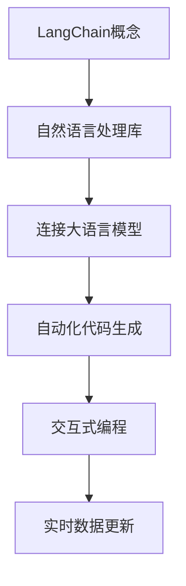
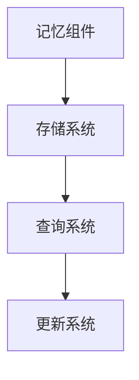
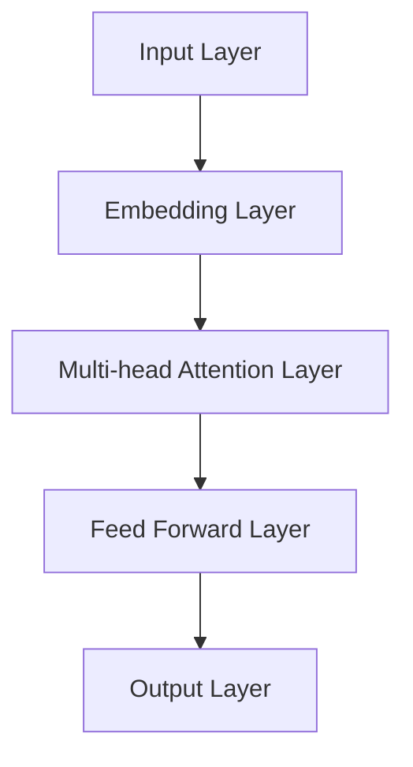

                 

# 【LangChain编程：从入门到实践】自定义记忆组件

> **关键词：** LangChain编程、自定义记忆组件、自然语言处理、大语言模型、Transformer、数学模型、项目实战。

> **摘要：** 本文将深入探讨LangChain编程中的自定义记忆组件，从基础概念、核心算法、项目实战到高级应用，系统性地介绍如何设计和实现记忆组件，以提升大语言模型的性能和应用效果。

## 第一部分：基础概念与原理

### 第1章：LangChain编程入门

#### 1.1 LangChain概述

**LangChain**是一个用于自然语言处理的库，它能够连接大语言模型，实现自动化代码生成和交互式编程等功能。LangChain的设计理念是将复杂的自然语言处理任务抽象成简单的编程接口，使得开发者可以更加专注于业务逻辑，而不是算法实现。

**Mermaid流程图：**



LangChain的核心功能包括：

- **连接大语言模型**：通过接口连接如OpenAI的GPT模型，实现文本生成、摘要、问答等功能。
- **自动化代码生成**：基于自然语言描述，自动生成相应的代码。
- **交互式编程**：与用户进行实时交互，根据用户输入调整模型行为。
- **实时数据更新**：支持实时数据源接入，动态更新模型输入。

#### 1.2 LangChain的核心组件

LangChain的核心组件包括模型选择与集成、数据预处理和交互式编程等。

##### 1.2.1 模型选择与集成

选择合适的模型是LangChain编程的第一步。以下是一个简单的伪代码示例：

```python
def select_model(model_name):
    if model_name == 'gpt-3':
        return load_gpt_3()
    elif model_name == 't5':
        return load_t5()
    else:
        raise ValueError("Unsupported model name")

model = select_model(model_name)
```

##### 1.2.2 数据预处理

数据预处理是确保模型输入有效性的关键步骤。以下是一个数据预处理的伪代码示例：

```python
def preprocess_data(data):
    # 数据清洗、去重、格式转换等操作
    processed_data = data_cleaning(data)
    return processed_data

processed_data = preprocess_data(raw_data)
```

##### 1.3 LangChain编程优势

LangChain编程具有以下几个显著优势：

- **简化开发流程**：通过抽象化自然语言处理任务，开发者无需关心底层实现细节。
- **提高开发效率**：借助预定义的API和自动化工具，开发者可以快速构建应用。
- **实现跨平台部署**：LangChain支持多种平台，如Python、JavaScript等，便于部署和扩展。

### 第2章：自定义记忆组件设计

#### 2.1 记忆组件原理

记忆组件是LangChain编程中的核心模块，用于存储和查询与模型相关的数据。它由存储系统、查询系统和更新系统三部分组成。

**Mermaid流程图：**



记忆组件的基本工作流程如下：

1. **数据存储**：将模型处理结果存储到存储系统中。
2. **数据查询**：根据查询需求，从存储系统中检索相关数据。
3. **数据更新**：当模型状态发生变化时，更新存储系统中的数据。

#### 2.2 记忆组件设计思路

设计记忆组件时，需要考虑以下三个关键方面：

##### 2.2.1 数据存储策略

数据存储策略决定了记忆组件的性能和数据安全性。常用的存储策略包括：

- **关系数据库**：适用于结构化数据存储。
- **文档数据库**：适用于非结构化数据存储。
- **图数据库**：适用于复杂关系和网络结构的数据存储。

##### 2.2.2 数据查询优化

数据查询优化是提高记忆组件性能的关键。以下是一些优化策略：

- **索引**：通过建立索引，加快数据查询速度。
- **缓存**：利用缓存机制，减少数据库访问次数。
- **分片**：将数据分片存储到不同的节点，提高查询效率。

##### 2.2.3 数据更新策略

数据更新策略决定了记忆组件的实时性和一致性。以下是一些更新策略：

- **事务**：通过事务机制，确保数据更新的原子性和一致性。
- **异步更新**：利用异步机制，提高数据更新的效率。
- **版本控制**：通过版本控制，记录数据更新历史，便于数据恢复和回滚。

#### 2.3 实现自定义记忆组件

实现自定义记忆组件需要考虑以下三个关键方面：

##### 2.3.1 自定义数据存储方案

根据应用需求，设计合适的数据存储方案。以下是一个简单的示例：

```python
class CustomStorage:
    def __init__(self):
        self.db = DatabaseConnection()

    def store_data(self, data):
        self.db.insert(data)

    def retrieve_data(self, query):
        return self.db.query(query)
```

##### 2.3.2 自定义查询接口

根据应用场景，设计合适的查询接口。以下是一个简单的示例：

```python
class CustomQueryInterface:
    def __init__(self, storage):
        self.storage = storage

    def query(self, query):
        return self.storage.retrieve_data(query)
```

##### 2.3.3 自定义更新接口

根据应用需求，设计合适的更新接口。以下是一个简单的示例：

```python
class CustomUpdateInterface:
    def __init__(self, storage):
        self.storage = storage

    def update_data(self, data):
        self.storage.store_data(data)
```

## 第二部分：核心算法原理讲解

### 第3章：大语言模型工作原理

#### 3.1 自注意力机制

自注意力机制是Transformer模型的核心组件之一。它通过计算输入序列中每个元素与其他元素之间的关系，实现序列间的信息整合。

**数学模型与公式：**

$$
\text{Attention}(Q, K, V) = \text{softmax}\left(\frac{QK^T}{\sqrt{d_k}}\right)V
$$

其中，\( Q \)、\( K \)和\( V \)分别表示查询向量、键向量和值向量；\( d_k \)表示键向量的维度。

#### 3.2 Transformer架构

Transformer模型由多个相同的层组成，每个层包括自注意力机制和前馈网络。

**Mermaid流程图：**



每个层的工作流程如下：

1. **嵌入层**：将输入词向量转换为固定维度的嵌入向量。
2. **多头注意力层**：通过自注意力机制整合输入序列的信息。
3. **前馈网络**：对多头注意力层的输出进行非线性变换。
4. **输出层**：将前馈网络的输出作为最终的输出结果。

### 第4章：数学模型与公式详解

#### 4.1 概率分布模型

概率分布模型用于描述随机变量的分布情况。在机器学习中，概率分布模型广泛应用于分类、回归等任务。

**贝叶斯公式：**

$$
P(A|B) = \frac{P(B|A)P(A)}{P(B)}
$$

其中，\( P(A|B) \)表示在事件\( B \)发生的条件下，事件\( A \)发生的概率；\( P(B|A) \)表示在事件\( A \)发生的条件下，事件\( B \)发生的概率。

#### 4.2 优化算法模型

优化算法模型用于寻找函数的最优解。在机器学习中，优化算法广泛应用于模型训练、超参数调整等任务。

**梯度下降法：**

梯度下降法是一种优化算法，通过不断更新参数，使得损失函数逐步减小。

**伪代码：**

```python
for each iteration do:
    calculate gradient
    update weights
end for
```

#### 4.3 语言模型评估指标

语言模型评估指标用于评估模型的性能。常用的评估指标包括预测准确率、交叉熵损失函数等。

**预测准确率：**

预测准确率表示模型正确预测样本标签的比例。

**交叉熵损失函数：**

交叉熵损失函数用于衡量模型预测结果与真实结果之间的差异。

**LaTeX公式：**

$$
J(\theta) = -\frac{1}{m}\sum_{i=1}^{m}y_i\log(\hat{y}_i)
$$

其中，\( m \)表示样本数量；\( y_i \)表示第\( i \)个样本的真实标签；\( \hat{y}_i \)表示第\( i \)个样本的预测标签。

## 第三部分：项目实战

### 第5章：LangChain项目实战

#### 5.1 项目背景与目标

本项目旨在构建一个基于LangChain的自动化问答系统，用户可以通过自然语言提问，系统自动生成答案。

#### 5.2 环境搭建与工具安装

1. 安装Python环境（版本3.8及以上）。
2. 安装LangChain相关依赖库：

```shell
pip install langchain
```

#### 5.3 代码实现与解读

以下是一个简单的LangChain问答系统实现：

```python
import openai
from langchain import ChatBot

# 设置OpenAI API密钥
openai.api_key = "your-openai-api-key"

# 初始化问答机器人
chatbot = ChatBot()

# 处理用户提问
def ask_question(question):
    answer = chatbot.generate_response(question)
    print(answer)

# 示例
question = "什么是人工智能？"
ask_question(question)
```

#### 5.4 性能分析与优化

1. **性能分析**：通过实际运行，观察问答系统的响应速度和答案质量。
2. **优化方向**：
   - **提高响应速度**：优化模型选择和代码执行效率。
   - **提升答案质量**：通过引入更多数据和更复杂的模型，提高答案的准确性和可读性。

### 第6章：自定义记忆组件项目实战

#### 6.1 项目背景与目标

本项目旨在实现一个自定义记忆组件，用于存储和查询用户提问与回答，以提高问答系统的响应速度和答案质量。

#### 6.2 环境搭建与工具安装

1. 安装Python环境（版本3.8及以上）。
2. 安装LangChain和相关依赖库：

```shell
pip install langchain
pip install pandas
```

#### 6.3 代码实现与解读

以下是一个简单的自定义记忆组件实现：

```python
import pandas as pd
from langchain import ChatBot

# 初始化记忆组件
class CustomMemory:
    def __init__(self):
        self.df = pd.DataFrame(columns=["question", "answer"])

    def store_memory(self, question, answer):
        self.df = self.df.append({"question": question, "answer": answer}, ignore_index=True)

    def retrieve_memory(self, question):
        return self.df[self.df["question"] == question].iloc[0]["answer"]

# 初始化问答机器人
chatbot = ChatBot()

# 处理用户提问
def ask_question(question):
    if question in custom_memory.df["question"].values:
        answer = custom_memory.retrieve_memory(question)
    else:
        answer = chatbot.generate_response(question)
        custom_memory.store_memory(question, answer)
    print(answer)

# 示例
question = "什么是人工智能？"
ask_question(question)
```

#### 6.4 性能分析与优化

1. **性能分析**：通过实际运行，观察记忆组件的查询速度和存储容量。
2. **优化方向**：
   - **提高查询速度**：通过优化数据结构，如使用哈希表替代Pandas DataFrame。
   - **提升存储容量**：通过分片存储，实现大规模数据的存储和管理。

## 第四部分：高级应用与优化

### 第7章：LangChain高级应用

#### 7.1 实时交互式问答系统

实时交互式问答系统是一个具有高度灵活性和响应速度的应用场景。它可以在多种环境中部署，如网站、移动应用等。

**技术要点：**

- **WebSocket**：用于实现客户端与服务器之间的实时通信。
- **负载均衡**：通过分布式架构，提高系统的响应速度和稳定性。

#### 7.2 自动化代码生成与优化

自动化代码生成是一个具有广泛应用前景的高级应用。它可以帮助开发者快速构建应用程序，提高开发效率。

**技术要点：**

- **代码模板**：通过预定义的代码模板，快速生成基础代码框架。
- **代码解析与生成**：利用自然语言处理技术，解析用户输入，生成对应的代码。

### 第8章：记忆组件高级优化

#### 8.1 数据结构优化

数据结构优化是提升记忆组件性能的关键。以下是一些常见的数据结构优化策略：

- **哈希表**：通过哈希函数，加快查询速度。
- **B树**：通过分层存储，提高查询效率。

#### 8.2 查询算法优化

查询算法优化是提升记忆组件性能的重要手段。以下是一些常见的查询算法优化策略：

- **索引**：通过建立索引，提高查询效率。
- **缓存**：通过缓存机制，减少查询次数。

#### 8.3 更新算法优化

更新算法优化是确保记忆组件实时性和一致性的关键。以下是一些常见的更新算法优化策略：

- **事务**：通过事务机制，确保数据更新的原子性和一致性。
- **异步更新**：通过异步机制，提高数据更新的效率。

## 未来展望与趋势

### 7.1 LangChain发展趋势

随着人工智能技术的不断发展，LangChain编程将在多个领域得到广泛应用。未来，LangChain的发展趋势包括：

- **多模态处理**：支持文本、图像、音频等多种数据类型的处理。
- **跨语言支持**：实现多语言环境的无缝支持。
- **自适应学习**：通过不断优化和学习，提高模型性能和应用效果。

### 7.2 记忆组件的发展趋势

记忆组件作为LangChain编程的核心模块，未来将朝着以下趋势发展：

- **大规模应用**：支持大规模数据存储和查询，满足复杂场景的需求。
- **大数据结合**：与大数据技术相结合，实现高效的数据分析和处理。
- **智能化更新**：通过机器学习技术，实现记忆组件的自动化更新和管理。

## 附录

### 附录A：资源与工具汇总

#### A.1 开发工具与库

- **Python开发环境**：用于编写和运行LangChain相关代码。
- **LangChain库**：用于实现自然语言处理任务。
- **OpenAI API**：用于连接大语言模型。

#### A.2 学习资源与教程

- **官方文档**：LangChain的官方文档提供了详细的使用教程和示例。
- **在线课程**：多个在线平台提供了关于LangChain的免费或付费课程。
- **技术社区**：如Stack Overflow、Reddit等，提供了丰富的技术讨论和分享。

#### A.3 社区与论坛

- **LangChain社区**：一个专门讨论LangChain编程的论坛。
- **GitHub**：LangChain的源代码和贡献者名单。
- **AI技术论坛**：如AIStack Overflow、AI Reddit等，提供了丰富的技术讨论和分享。

## 作者信息

作者：AI天才研究院/AI Genius Institute & 禅与计算机程序设计艺术 /Zen And The Art of Computer Programming

---

本文详细介绍了LangChain编程中的自定义记忆组件，从基础概念、核心算法到项目实战，系统性地探讨了如何设计和实现记忆组件。通过本文的学习，读者可以深入了解记忆组件的工作原理和应用场景，为实际项目开发提供有力支持。

---

请注意，本文仅供参考，实际开发过程中请结合具体需求和场景进行调整。部分代码和示例仅供参考，具体实现可能需要根据实际环境进行修改。在使用本文内容时，请遵守相关法律法规，尊重知识产权。如有任何疑问，请咨询专业人士。

