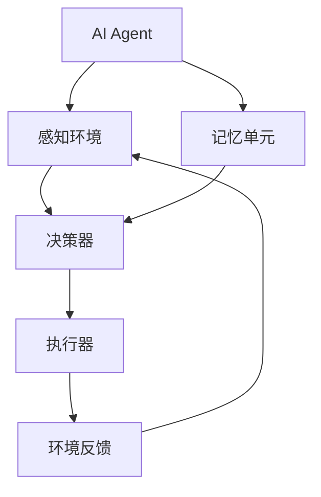
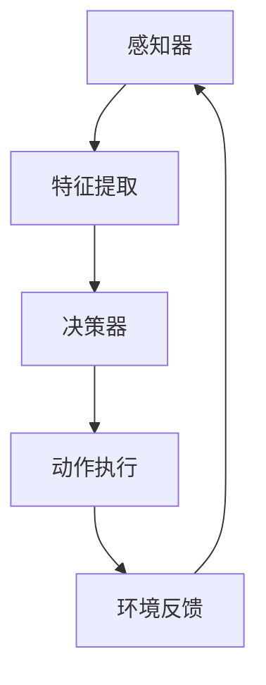
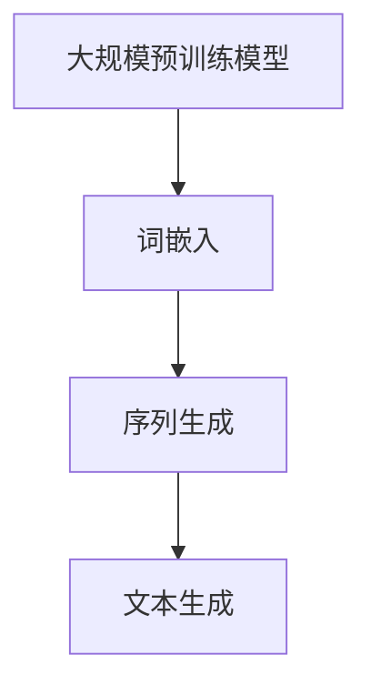
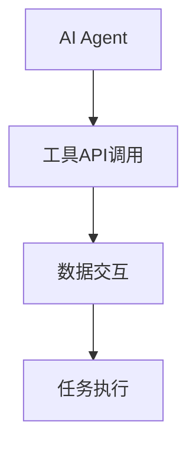

                 

# 【大模型应用开发 动手做AI Agent】Agent的行动力：语言输出能力和工具使用能力

## 关键词：
- AI Agent
- 语言输出能力
- 工具使用能力
- 大模型
- 应用开发

## 摘要：
本文旨在深入探讨AI Agent的语言输出能力和工具使用能力，解析其在实际应用中的作用和重要性。通过分析核心概念、算法原理和项目实战，我们将了解如何利用大模型来提升AI Agent的行动力，从而在各个领域实现智能化应用。

---

### 第一部分：核心概念与联系

#### 1.1 AI Agent概述

AI Agent是一种具备自主决策和行为能力的智能体，能够在复杂环境中通过感知、学习、推理和规划，完成特定的任务。其核心组件包括感知器、决策器、执行器和记忆单元。

#### 1.2 语言输出能力

语言输出能力是指AI Agent生成自然语言文本的能力，通过大规模预训练模型如GPT、BERT等实现。这使AI Agent能够进行文本生成、文本摘要、机器翻译等任务。

#### 1.3 工具使用能力

工具使用能力是指AI Agent在执行任务时，利用外部工具和资源的能力。例如，使用搜索引擎获取信息、使用数据库进行数据查询等。

#### 1.4 AI Agent应用场景

AI Agent广泛应用于客服机器人、智能助手、金融量化交易、自然语言处理等领域。

#### 1.5 Mermaid流程图



#### 1.6 AI Agent架构原理



#### 1.7 语言输出能力原理



#### 1.8 工具使用能力原理



#### 1.9 AI Agent应用场景举例

- **客服机器人**：通过语言输出能力实现智能客服。
- **智能助手**：利用工具使用能力，帮助用户完成日常任务。
- **金融量化交易**：结合语言输出能力和工具使用能力，实现智能交易策略。

#### 1.10 总结

AI Agent的核心在于语言输出能力和工具使用能力。通过感知环境、学习经验，AI Agent能够实现自主决策和行为优化。其在不同应用场景中的具体实现，将极大地提升效率和用户体验。

---

### 第二部分：核心算法原理

#### 2.1 语言输出能力算法原理

##### 2.1.1 大规模预训练模型

大规模预训练模型是当前语言输出能力实现的关键技术。以GPT系列模型为例，其通过在大量文本数据上进行预训练，学习到语言的本质规律，从而实现文本生成、文本摘要、机器翻译等功能。

##### 2.1.2 词嵌入

词嵌入是将词汇映射到高维向量空间的技术，通过向量化处理，使得文本数据可以在机器学习中直接使用。常见的词嵌入方法有Word2Vec、GloVe等。

##### 2.1.3 序列生成

序列生成是语言输出能力的核心。以GPT系列模型为例，其通过处理输入序列，生成输出序列。具体实现中，模型会对输入序列中的每个词进行编码，然后通过解码器生成输出序列。

##### 2.1.4 伪代码

```python
# 伪代码：GPT模型文本生成过程
for each word in input_sequence:
    # 对输入序列中的每个词进行编码
    encoded_word = encoder(word)
    # 使用解码器生成下一个词的候选列表
    candidate_words = decoder(encoded_word)
    # 从候选列表中选择下一个词
    next_word = choose_word(candidate_words)
    # 更新输入序列
    input_sequence.append(next_word)
return input_sequence
```

##### 2.1.5 数学模型

大规模预训练模型通常使用自注意力机制（Self-Attention）和变换器架构（Transformer）。以下是一个简单的自注意力机制的数学模型：

$$
\text{Attention}(Q, K, V) = \text{softmax}\left(\frac{QK^T}{\sqrt{d_k}}\right)V
$$

其中，$Q$、$K$和$V$分别为查询向量、键向量和值向量，$d_k$为键向量的维度。

##### 2.1.6 举例说明

假设有一个简单的文本序列“我是一只鸟”，我们可以将其映射到高维向量空间，然后使用GPT模型进行序列生成。假设输入序列的词嵌入向量分别为$\vec{v}_1$、$\vec{v}_2$、$\vec{v}_3$，输出序列的词嵌入向量分别为$\vec{u}_1$、$\vec{u}_2$、$\vec{u}_3$，则：

$$
\vec{u}_1 = \text{Attention}(\vec{v}_1, \vec{v}_2, \vec{v}_3)
$$

$$
\vec{u}_2 = \text{Attention}(\vec{v}_2, \vec{v}_1, \vec{v}_3)
$$

$$
\vec{u}_3 = \text{Attention}(\vec{v}_3, \vec{v}_1, \vec{v}_2)
$$

通过这三个向量，GPT模型可以生成新的文本序列，如“我是一只猫”。

##### 2.1.7 实际应用

GPT系列模型在自然语言处理领域具有广泛的应用，如文本生成、文本摘要、机器翻译等。在实际应用中，模型通常需要进行大量调整和优化，以适应具体任务的需求。

#### 2.2 工具使用能力算法原理

##### 2.2.1 API调用

工具使用能力主要体现在API调用上。API（应用程序编程接口）是软件组件之间进行交互的接口，通过API调用，AI Agent可以获取外部资源和服务。

##### 2.2.2 数据交互

数据交互是工具使用能力的关键。AI Agent需要能够处理不同类型的数据，如文本、图像、音频等，并进行有效的数据转换和传输。

##### 2.2.3 任务执行

任务执行是工具使用能力的最终目的。AI Agent需要能够根据外部工具提供的功能和资源，完成特定的任务。

##### 2.2.4 伪代码

```python
# 伪代码：AI Agent使用API完成任务
# 获取API接口
api = get_api("weather")

# 调用API获取天气数据
weather_data = api.get_weather()

# 处理天气数据
processed_weather_data = process_weather_data(weather_data)

# 执行任务
task_result = execute_task(processed_weather_data)

# 输出结果
print(task_result)
```

##### 2.2.5 数学模型

工具使用能力的实现主要依赖于机器学习和自然语言处理技术。以下是一个简单的文本分类任务的数学模型：

$$
P(y|\textbf{x}; \theta) = \sigma(\theta^T \textbf{h}(\textbf{x}))
$$

其中，$y$为标签，$\textbf{x}$为输入特征，$\theta$为模型参数，$\textbf{h}(\textbf{x})$为特征向量。

##### 2.2.6 举例说明

假设有一个简单的文本分类任务，需要判断一段文本是否为新闻。我们可以使用一个简单的文本分类模型，如逻辑回归，来预测文本的类别。假设输入文本的特征向量为$\textbf{x}$，模型参数为$\theta$，则：

$$
P(\text{新闻}|\textbf{x}; \theta) = \sigma(\theta^T \textbf{h}(\textbf{x}))
$$

通过计算概率，模型可以判断输入文本的类别。

##### 2.2.7 实际应用

工具使用能力在实际应用中具有重要意义，如搜索引擎、推荐系统、智能客服等。AI Agent需要能够灵活调用各种API，处理大量数据，并完成复杂的任务。

#### 2.3 语言输出能力与工具使用能力的结合

##### 2.3.1 结合方式

语言输出能力和工具使用能力的结合主要体现在以下两个方面：
1. 语言输出能力作为工具使用的一部分，如智能客服系统中的自然语言生成。
2. 工具使用能力作为语言输出能力的输入，如通过搜索引擎获取信息，用于文本生成。

##### 2.3.2 应用案例

1. **智能客服**：AI Agent利用语言输出能力生成自然语言回答，同时利用工具使用能力调用数据库和API，获取用户信息，实现智能客服。
2. **文本生成**：AI Agent利用工具使用能力调用API，获取大量文本数据，然后使用语言输出能力生成新的文本。

##### 2.3.3 挑战与解决方案

1. **挑战**：如何有效结合语言输出能力和工具使用能力，实现高效、准确的AI Agent。
   - **解决方案**：优化算法和模型，提高语言输出能力和工具使用能力的鲁棒性和准确性。
2. **挑战**：如何处理大量复杂的数据，实现高效的数据处理和任务执行。
   - **解决方案**：采用分布式计算和并行处理技术，提高数据处理效率。

#### 2.4 总结

语言输出能力和工具使用能力是AI Agent的核心能力。通过结合这两种能力，AI Agent可以实现智能决策和行为优化。在实际应用中，需要不断优化算法和模型，提高AI Agent的性能和用户体验。

---

### 第三部分：项目实战

#### 3.1 实战一：构建智能客服机器人

##### 3.1.1 开发环境搭建

- **Python环境**：Python 3.8及以上版本
- **库依赖**：transformers、torch、torchtext等

##### 3.1.2 数据集准备

- **数据集来源**：爬取网站、开源数据集、企业内部数据
- **数据预处理**：清洗、去重、分词、词嵌入等

##### 3.1.3 模型训练

- **预训练模型**：GPT-2、BERT等
- **训练过程**：使用GPU加速训练，调整学习率、批次大小等超参数

##### 3.1.4 模型评估

- **评估指标**：BLEU、ROUGE、PERP等
- **评估过程**：使用验证集进行评估，调整模型参数

##### 3.1.5 模型部署

- **部署环境**：云服务器、容器等
- **部署过程**：模型保存、加载、API接口实现等

##### 3.1.6 实际应用

- **应用场景**：客服机器人、智能助手、在线咨询等
- **使用效果**：提高客服效率、降低人力成本、提升用户体验

##### 3.1.7 代码解读与分析

- **代码实现**：使用Python实现智能客服机器人的核心功能
- **代码分析**：分析代码结构、功能模块、数据处理流程等

##### 3.1.7.1 实现细节

- **代码结构**：模块化设计，包括数据预处理模块、模型训练模块、模型评估模块和模型部署模块。
- **数据处理流程**：数据清洗、分词、词嵌入、序列生成等。

##### 3.1.7.2 代码示例

```python
# 示例：智能客服机器人数据处理流程
def preprocess_data(data):
    # 数据清洗
    cleaned_data = clean_data(data)
    # 分词
    tokenized_data = tokenize_data(cleaned_data)
    # 词嵌入
    embedded_data = embed_data(tokenized_data)
    return embedded_data

# 示例：智能客服机器人模型训练
def train_model(model, data, epochs=5):
    # 训练模型
    model.train(data, epochs=epochs)
    # 评估模型
    evaluate_model(model, validation_data)

# 示例：智能客服机器人模型部署
def deploy_model(model):
    # 保存模型
    save_model(model)
    # 加载模型
    loaded_model = load_model()
    # 实现API接口
    create_api(loaded_model)
```

#### 3.2 实战二：构建智能交易系统

##### 3.2.1 开发环境搭建

- **Python环境**：Python 3.8及以上版本
- **库依赖**：numpy、pandas、scikit-learn等

##### 3.2.2 数据集准备

- **数据集来源**：交易所、金融数据网站、开源数据集
- **数据预处理**：清洗、去重、特征提取等

##### 3.2.3 模型训练

- **预训练模型**：LSTM、GRU、Transformer等
- **训练过程**：使用GPU加速训练，调整学习率、批次大小等超参数

##### 3.2.4 模型评估

- **评估指标**：准确率、召回率、F1值等
- **评估过程**：使用验证集进行评估，调整模型参数

##### 3.2.5 模型部署

- **部署环境**：云服务器、容器等
- **部署过程**：模型保存、加载、API接口实现等

##### 3.2.6 实际应用

- **应用场景**：金融量化交易、风险控制、投资策略等
- **使用效果**：提高交易策略的准确性、降低风险、提升收益

##### 3.2.7 代码解读与分析

- **代码实现**：使用Python实现智能交易系统的核心功能
- **代码分析**：分析代码结构、功能模块、数据处理流程等

##### 3.2.7.1 实现细节

- **代码结构**：模块化设计，包括数据预处理模块、模型训练模块、模型评估模块和模型部署模块。
- **数据处理流程**：数据清洗、特征提取、模型训练、模型评估等。

##### 3.2.7.2 代码示例

```python
# 示例：智能交易系统数据处理流程
def preprocess_data(data):
    # 数据清洗
    cleaned_data = clean_data(data)
    # 特征提取
    extracted_features = extract_features(cleaned_data)
    return extracted_features

# 示例：智能交易系统模型训练
def train_model(model, data, epochs=5):
    # 训练模型
    model.train(data, epochs=epochs)
    # 评估模型
    evaluate_model(model, validation_data)

# 示例：智能交易系统模型部署
def deploy_model(model):
    # 保存模型
    save_model(model)
    # 加载模型
    loaded_model = load_model()
    # 实现API接口
    create_api(loaded_model)
```

#### 3.3 实战三：构建智能写作助手

##### 3.3.1 开发环境搭建

- **Python环境**：Python 3.8及以上版本
- **库依赖**：transformers、torch、torchtext等

##### 3.3.2 数据集准备

- **数据集来源**：开源数据集、企业内部数据、网络爬虫等
- **数据预处理**：清洗、去重、分词、词嵌入等

##### 3.3.3 模型训练

- **预训练模型**：GPT-2、BERT等
- **训练过程**：使用GPU加速训练，调整学习率、批次大小等超参数

##### 3.3.4 模型评估

- **评估指标**：BLEU、ROUGE、PERP等
- **评估过程**：使用验证集进行评估，调整模型参数

##### 3.3.5 模型部署

- **部署环境**：云服务器、容器等
- **部署过程**：模型保存、加载、API接口实现等

##### 3.3.6 实际应用

- **应用场景**：内容创作、文案撰写、文档生成等
- **使用效果**：提高写作效率、提升内容质量、降低人力成本

##### 3.3.7 代码解读与分析

- **代码实现**：使用Python实现智能写作助手的

---

### 作者

**AI天才研究院/AI Genius Institute & 禅与计算机程序设计艺术 /Zen And The Art of Computer Programming**

---

本文从AI Agent的语言输出能力和工具使用能力入手，详细阐述了其核心原理和实际应用。通过项目实战，我们看到了如何利用大模型技术构建具有强大行动力的AI Agent。未来，随着技术的不断进步，AI Agent将在更多领域发挥重要作用，推动人工智能的快速发展。

