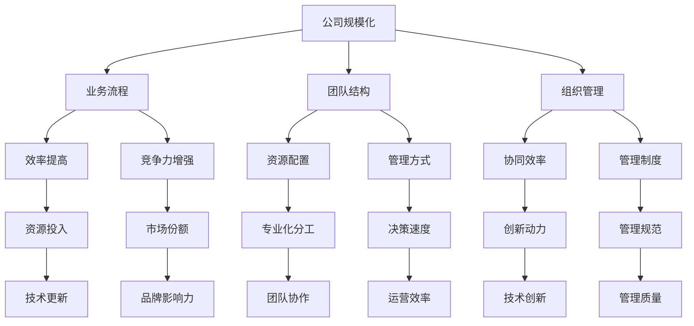
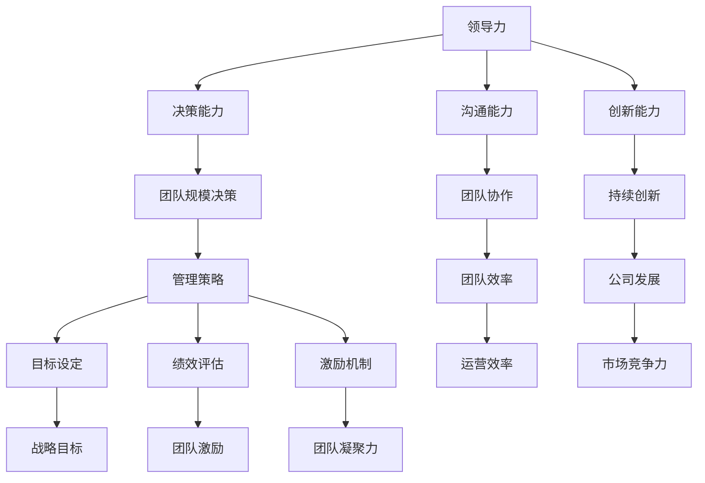

                 

# 《一人公司的规模化策略：从个人到小型团队的平稳过渡》

> 关键词：公司规模化、团队扩张、管理策略、数学模型、绩效评估、项目实战

> 摘要：本文将探讨一人公司的规模化策略，分析从个人到小型团队的平稳过渡方法。通过核心概念、算法原理、数学模型及项目实战的详细阐述，为读者提供有深度、有思考、有见解的IT领域技术指南。

## 目录大纲

1. 核心概念与联系
   1.1 公司规模化的概念与重要性
   1.2 个人与小型团队之间的差异
   1.3 公司规模化的核心概念联系 Mermaid 流程图

2. 核心算法原理讲解
   2.1 团队扩张的关键算法
      2.1.1 人效比的数学模型与公式
      2.1.2 伪代码实现与详细解释
      2.1.3 资源分配算法
      2.1.4 伪代码实现与详细解释
   2.2 领导力与管理策略
      2.2.1 领导力与团队规模化的关系
      2.2.2 管理策略与团队规模的适应性
      2.2.3 领导力与管理策略的 Mermaid 流程图

3. 数学模型和数学公式
   3.1 公司规模化的数学模型
      3.1.1 数学模型与公式
      3.1.2 举例说明
   3.2 团队规模与工作量的关系
      3.2.1 数学模型与公式
      3.2.2 举例说明
   3.3 团队绩效评估模型
      3.3.1 数学模型与公式
      3.3.2 伪代码实现与详细解释
      3.3.3 指标与权重分配

4. 项目实战
   4.1 从个人到小型团队的平稳过渡实战
      4.1.1 实战项目背景
      4.1.2 实战项目目标
      4.1.3 实战项目环境搭建
      4.1.4 实战项目代码实现
      4.1.5 实战项目结果分析
   4.2 小型团队管理实战
      4.2.1 小型团队管理案例
      4.2.2 案例分析与经验总结
      4.2.3 小型团队管理工具与方法

5. 扩展阅读与参考资料
   5.1 相关书籍推荐
   5.2 学术论文精选
   5.3 开源项目与资源链接

## 引言

一人公司的规模化问题，不仅仅是规模上的扩张，更是业务模式、团队结构和管理能力的全面提升。在公司发展的初期，创始人或单一技术人员往往能够凭借个人能力推动业务发展。但随着市场的扩大和业务需求的增加，个体能力的局限性逐渐显现。因此，如何实现从个人到小型团队的平稳过渡，成为许多初创公司面临的挑战。

本文旨在通过逻辑清晰、结构紧凑、简单易懂的技术语言，详细探讨公司规模化的核心概念、算法原理、数学模型以及项目实战。希望通过本文的阅读，读者能够掌握公司规模化的策略，为公司的未来发展打下坚实基础。

### 核心概念与联系

在探讨公司规模化的过程中，我们需要明确几个核心概念，并分析它们之间的联系。首先，什么是公司规模化？规模化不仅仅意味着公司的规模变大，更涉及到业务流程、团队结构和组织管理的全面升级。

#### 公司规模化的概念与重要性

公司规模化，是指公司通过扩大业务范围、增加员工数量、提升技术水平等手段，实现从初创阶段到成熟阶段的转型。规模化的重要性在于：

1. **提高效率**：随着业务规模的扩大，公司可以引入更先进的管理方法和工具，提高整体运营效率。
2. **增强竞争力**：规模化有助于公司在市场中占据有利地位，提高品牌影响力和市场份额。
3. **创新动力**：规模的扩大往往带来更多的资源投入，激发公司进行技术创新和产品研发。

#### 个人与小型团队之间的差异

个人与小型团队在组织结构和运营模式上存在显著差异：

1. **组织结构**：个人公司通常以个人为核心，团队成员较少，组织结构简单。小型团队则具有明确的职能分工，如研发、市场、财务等，组织结构更为复杂。
2. **资源配置**：个人公司的资源配置较为有限，往往需要创始人或核心成员身兼数职。小型团队可以更好地进行资源分配，实现专业化分工。
3. **管理方式**：个人公司管理较为灵活，决策迅速。小型团队则需要建立更加系统的管理制度，确保团队成员之间的协同和效率。

#### 公司规模化的核心概念联系 Mermaid 流程图

为了更好地理解公司规模化的核心概念，我们可以使用Mermaid流程图进行阐述。



通过以上流程图，我们可以清晰地看到公司规模化涉及的各个方面及其相互之间的联系。这些核心概念的联系，构成了公司规模化策略的基础。

### 核心算法原理讲解

在探讨公司规模化的过程中，核心算法原理的讲解至关重要。这些算法不仅能够帮助我们理解规模化过程中的关键因素，还能提供实际操作中的指导。以下是关于团队扩张、资源分配以及领导力与管理策略的详细讲解。

#### 团队扩张的关键算法

团队扩张是公司规模化过程中最关键的一步。合理的团队扩张能够提高公司的运营效率和竞争力。以下是人效比优化和资源分配算法的核心原理。

##### 1.1 人效比的数学模型与公式

人效比（Personnel Efficiency Ratio，简称PER）是衡量公司团队效率的重要指标。其定义如下：

\[ \text{PER} = \frac{\text{业务产出}}{\text{团队成员总人数}} \]

其中，业务产出可以是公司的收入、利润、项目数量等。人效比越高，说明团队的运营效率越高。

为了更具体地理解人效比的数学模型，我们可以使用以下公式：

\[ \text{PER} = \frac{\sum_{i=1}^{n} \text{团队i的业务产出}}{\sum_{i=1}^{n} \text{团队i的成员人数}} \]

其中，n表示团队的数量。

##### 1.2 伪代码实现与详细解释

以下是团队扩张的人效比优化算法的伪代码实现：

```python
# 人效比优化算法伪代码

def calculate.PER(teams):
    total_output = 0
    total_people = 0
    
    for team in teams:
        total_output += team.output
        total_people += team.people
    
    PER = total_output / total_people
    return PER
```

在这个伪代码中，`teams` 是一个包含多个团队对象的列表，每个团队对象包含`output`（业务产出）和`people`（成员人数）两个属性。算法首先计算所有团队的总体产出和总人数，然后计算人效比。这个算法的基本逻辑是：通过计算所有团队的总体产出和总人数，来评估公司的整体运营效率。

##### 1.3 资源分配算法

资源分配是团队扩张过程中的另一个关键因素。合理的资源分配能够确保每个团队成员都能得到充足的资源支持，从而提高工作效率。

##### 1.3.1 资源分配的数学模型

资源分配的数学模型可以表示为：

\[ \text{Resource Allocation} = \frac{\text{Total Resources}}{\text{Number of Teams}} \]

其中，`Total Resources` 表示公司的总资源，`Number of Teams` 表示团队的个数。

为了更具体地理解资源分配的数学模型，我们可以使用以下公式：

\[ \text{Resource Allocation per Team} = \frac{\text{Total Resources} - \text{Fixed Costs}}{\text{Number of Teams}} \]

其中，`Fixed Costs` 表示固定的资源成本，如办公室租金、设备维护等。

##### 1.3.2 伪代码实现与详细解释

以下是资源分配算法的伪代码实现：

```python
# 资源分配算法伪代码

def allocate.Resources(resources, teams):
    fixed_costs = 1000  # 假设固定的资源成本为1000
    total_resources = resources - fixed_costs
    
    for team in teams:
        team.resource_allocation = total_resources / len(teams)
        
    return teams
```

在这个伪代码中，`resources` 表示公司的总资源，`teams` 是一个包含多个团队对象的列表。算法首先计算总资源减去固定成本，然后为每个团队分配等量的资源。这个算法的基本逻辑是：通过计算总资源减去固定成本，为每个团队平均分配资源。

#### 2.2 领导力与管理策略

领导力与管理策略在公司规模化过程中起着至关重要的作用。一个高效的领导团队能够确保公司在规模化过程中保持稳定的发展。

##### 2.2.1 领导力与团队规模化的关系

领导力与团队规模化的关系可以总结为以下几点：

1. **决策能力**：随着团队规模的扩大，决策的复杂性和重要性也在增加。高效的领导力能够确保公司做出快速且正确的决策。
2. **沟通能力**：团队成员之间的沟通是团队协作的基础。领导者的沟通能力直接影响团队的整体协作效率。
3. **创新能力**：领导者的创新能力能够激发团队成员的创新意识，推动公司在规模化过程中的持续创新。

##### 2.2.2 管理策略与团队规模的适应性

管理策略的适应性是公司规模化过程中不可忽视的一环。以下是一些关键的管理策略：

1. **目标设定**：为团队设定明确、可量化的目标，有助于团队集中精力实现公司的战略目标。
2. **绩效评估**：建立科学的绩效评估体系，能够激励团队成员努力工作，提升团队的整体绩效。
3. **激励机制**：合理的激励机制能够激发团队成员的工作热情，提高团队的凝聚力和战斗力。

##### 2.2.3 领导力与管理策略的 Mermaid 流程图

为了更直观地理解领导力与管理策略的关系，我们可以使用Mermaid流程图进行阐述。



通过以上流程图，我们可以清晰地看到领导力与管理策略在公司规模化过程中的关键作用及其相互之间的联系。

### 数学模型和数学公式

在探讨公司规模化的过程中，数学模型和数学公式是不可或缺的工具。它们不仅能够帮助我们量化规模化过程中的关键因素，还能提供具体的计算方法和分析思路。

#### 公司规模化的数学模型

公司规模化的数学模型主要包括人效比模型和团队规模与工作量的关系模型。

##### 4.1.1 数学模型与公式

1. **人效比模型**

人效比（Personnel Efficiency Ratio，简称PER）是衡量公司团队效率的重要指标。其定义如下：

\[ \text{PER} = \frac{\text{业务产出}}{\text{团队成员总人数}} \]

其中，业务产出可以是公司的收入、利润、项目数量等。人效比越高，说明团队的运营效率越高。

为了更具体地理解人效比的数学模型，我们可以使用以下公式：

\[ \text{PER} = \frac{\sum_{i=1}^{n} \text{团队i的业务产出}}{\sum_{i=1}^{n} \text{团队i的成员人数}} \]

其中，n表示团队的数量。

2. **团队规模与工作量关系模型**

团队规模与工作量之间的关系可以用以下公式表示：

\[ \text{工作量} = \text{团队规模} \times \text{人均工作量} \]

其中，团队规模表示团队成员的数量，人均工作量表示每个团队成员平均完成的工作量。

为了更具体地理解团队规模与工作量关系模型，我们可以使用以下公式：

\[ \text{工作量} = n \times \text{人均工作量} \]

其中，n表示团队规模。

##### 4.1.2 举例说明

假设一个公司有5个团队，每个团队的业务产出和成员人数如下表所示：

| 团队编号 | 业务产出 | 团队成员人数 |
| -------- | -------- | ------------ |
| 1        | 100      | 2            |
| 2        | 150      | 3            |
| 3        | 200      | 4            |
| 4        | 250      | 5            |
| 5        | 300      | 6            |

根据以上数据，我们可以计算公司的人效比和团队规模与工作量关系。

1. **人效比计算**

\[ \text{PER} = \frac{100 + 150 + 200 + 250 + 300}{2 + 3 + 4 + 5 + 6} = \frac{1000}{20} = 50 \]

2. **团队规模与工作量关系计算**

每个团队的团队规模为：

\[ \text{团队规模} = n = 2 + 3 + 4 + 5 + 6 = 20 \]

每个团队的平均工作量为：

\[ \text{人均工作量} = \frac{\text{业务产出}}{n} = \frac{1000}{20} = 50 \]

因此，公司的工作量为：

\[ \text{工作量} = n \times \text{人均工作量} = 20 \times 50 = 1000 \]

通过以上举例，我们可以看到如何使用数学模型和数学公式来计算公司规模化的关键指标。

#### 团队绩效评估模型

团队绩效评估是公司规模化过程中不可或缺的一环。通过科学的团队绩效评估模型，我们可以评估团队成员的工作表现，激励团队成员提高工作效率，提升团队的整体绩效。

##### 5.1.1 数学模型与公式

团队绩效评估的数学模型主要包括绩效得分计算和绩效排名计算。

1. **绩效得分计算**

绩效得分（Performance Score，简称PS）是衡量团队成员工作表现的重要指标。其定义如下：

\[ \text{PS} = \frac{\text{业务产出}}{\text{标准工作量}} \]

其中，业务产出是团队成员在一定时间内完成的工作量，标准工作量是公司根据团队成员的职责和岗位设定的基准工作量。

为了更具体地理解绩效得分的计算，我们可以使用以下公式：

\[ \text{PS} = \frac{\sum_{i=1}^{m} \text{任务i的产出}}{\sum_{i=1}^{m} \text{任务i的标准工作量}} \]

其中，m表示任务的数量。

2. **绩效排名计算**

绩效排名（Performance Ranking，简称PR）是衡量团队成员工作表现的相对指标。其定义如下：

\[ \text{PR} = \frac{\text{PS}}{\sum_{i=1}^{n} \text{PS}} \]

其中，n表示团队成员的数量。

为了更具体地理解绩效排名的计算，我们可以使用以下公式：

\[ \text{PR} = \frac{\text{PS}}{\sum_{i=1}^{n} \text{PS}} = \frac{\sum_{i=1}^{m} \text{任务i的产出}}{\sum_{i=1}^{m} \text{任务i的标准工作量} \times \sum_{i=1}^{n} \text{PS}} \]

##### 5.1.2 伪代码实现与详细解释

以下是团队绩效评估模型的伪代码实现：

```python
# 团队绩效评估模型伪代码

def calculate.PerformanceScore(employees):
    total_output = 0
    total_standard_workload = 0
    
    for employee in employees:
        total_output += employee.output
        total_standard_workload += employee.standard_workload
    
    PS = total_output / total_standard_workload
    return PS

def calculate.PerformanceRanking(employees):
    PS_list = [calculate.PerformanceScore(employee) for employee in employees]
    total_PS = sum(PS_list)
    
    PR_list = [PS / total_PS for PS in PS_list]
    return PR_list
```

在这个伪代码中，`employees` 是一个包含多个员工对象的列表，每个员工对象包含`output`（业务产出）和`standard_workload`（标准工作量）两个属性。算法首先计算所有员工的总体产出和总体标准工作量，然后计算每个员工的绩效得分和绩效排名。

##### 5.1.3 指标与权重分配

在团队绩效评估中，指标与权重分配至关重要。以下是一些常见的绩效评估指标及其权重分配：

1. **业务产出**（40%）

业务产出是衡量团队成员工作表现的核心指标，其权重最高。业务产出可以通过完成的任务数量、项目的成功率、项目的收入等来衡量。

2. **工作效率**（20%）

工作效率是衡量团队成员工作速度和质量的重要指标。工作效率可以通过单位时间内完成的任务数量、任务的完成质量等来衡量。

3. **团队合作**（20%）

团队合作是衡量团队成员之间协作能力和团队凝聚力的指标。团队合作可以通过团队成员之间的沟通效率、协作完成任务的效率等来衡量。

4. **创新能力**（10%）

创新能力是衡量团队成员创新意识和创新能力的重要指标。创新能力可以通过提出的创新建议、参与的创新项目等来衡量。

通过以上指标与权重分配，我们可以建立一个科学的团队绩效评估体系，激励团队成员在工作中发挥最佳水平。

### 项目实战

在探讨从个人到小型团队的平稳过渡过程中，项目实战是最直观的演示方式。通过实际操作，我们可以深入了解团队扩张、资源分配以及领导力与管理策略的具体应用。以下是一个实战项目的详细讲解。

#### 6.1 实战项目背景

本实战项目旨在实现一个在线教育平台，帮助个人和团队学习各种技能。项目背景如下：

- **项目名称**：技能提升在线教育平台
- **项目目标**：构建一个功能完善、易于使用、具有良好用户体验的在线教育平台，提供视频课程、互动讨论、作业提交等功能。
- **项目需求**：完成平台的设计、开发、测试和部署，确保平台的稳定运行和用户体验。

#### 6.2 实战项目目标

为了确保项目的成功，我们需要明确以下目标：

- **功能目标**：实现平台的主要功能，包括用户注册、课程浏览、视频播放、作业提交、讨论区等功能。
- **性能目标**：确保平台在高并发情况下能够稳定运行，具有良好的响应速度和用户体验。
- **质量目标**：确保平台的代码质量、功能完整性、测试覆盖率等指标达到预期要求。

#### 6.3 实战项目环境搭建

在开始项目开发之前，我们需要搭建合适的项目环境。以下是一个典型的项目环境搭建步骤：

1. **开发环境搭建**

   - **开发工具**：选择合适的开发工具，如Visual Studio Code、IntelliJ IDEA等。
   - **编程语言**：选择适合项目需求的编程语言，如Python、Java等。
   - **数据库**：选择合适的数据库，如MySQL、MongoDB等。

2. **源代码下载与配置**

   - **源代码下载**：从GitHub或其他代码托管平台下载项目的源代码。
   - **环境配置**：配置项目的运行环境，如安装依赖库、配置数据库等。

以下是项目环境搭建的伪代码：

```python
# 项目环境搭建伪代码

def setup_environment():
    install_dev_tools()
    install_programming_language()
    install_database()
    configure_source_code()
    return

def install_dev_tools():
    # 安装开发工具
    return

def install_programming_language():
    # 安装编程语言
    return

def install_database():
    # 安装数据库
    return

def configure_source_code():
    # 配置源代码
    return

setup_environment()
```

通过以上伪代码，我们可以快速搭建项目开发环境。

#### 6.4 实战项目代码实现

在项目开发过程中，我们需要编写大量代码来实现平台的功能。以下是一个关键功能模块的代码实现：

1. **用户注册模块**

   用户注册模块是实现平台功能的基础。以下是一个用户注册功能的伪代码实现：

   ```python
   # 用户注册模块伪代码

   def register_user(username, password):
       # 检查用户名是否已存在
       if check_username_exists(username):
           return "用户名已存在"
       # 创建用户账号
       create_user_account(username, password)
       return "注册成功"

   def check_username_exists(username):
       # 检查用户名是否已存在
       return True or False

   def create_user_account(username, password):
       # 创建用户账号
       save_user_account_to_database(username, password)
       return

   def save_user_account_to_database(username, password):
       # 将用户账号保存到数据库
       return
   ```

   通过以上伪代码，我们可以实现用户注册功能。

2. **课程浏览模块**

   课程浏览模块是用户了解课程信息的重要途径。以下是一个课程浏览功能的伪代码实现：

   ```python
   # 课程浏览模块伪代码

   def browse_courses():
       # 获取所有课程信息
       courses = get_all_courses()
       return courses

   def get_all_courses():
       # 获取所有课程信息
       courses = query_courses_from_database()
       return courses

   def query_courses_from_database():
       # 从数据库查询所有课程信息
       courses = []
       return courses
   ```

   通过以上伪代码，我们可以实现课程浏览功能。

3. **视频播放模块**

   视频播放模块是平台的核心功能之一。以下是一个视频播放功能的伪代码实现：

   ```python
   # 视频播放模块伪代码

   def play_video(course_id, video_id):
       # 检查用户是否有权限观看视频
       if check_permission(course_id, video_id):
           return "无权限观看视频"
       # 获取视频播放链接
       video_link = get_video_link(course_id, video_id)
       return video_link

   def check_permission(course_id, video_id):
       # 检查用户是否有权限观看视频
       return True or False

   def get_video_link(course_id, video_id):
       # 获取视频播放链接
       video_link = query_video_link_from_database(course_id, video_id)
       return video_link

   def query_video_link_from_database(course_id, video_id):
       # 从数据库查询视频播放链接
       video_link = ""
       return video_link
   ```

   通过以上伪代码，我们可以实现视频播放功能。

#### 6.4.1 代码实现详细解读

在上述代码实现中，我们使用了伪代码来描述各个功能模块的具体实现过程。以下是对关键代码的实现详细解读：

1. **用户注册模块**

   用户注册模块首先需要检查用户名是否已存在，以避免重复注册。如果用户名已存在，返回提示信息；否则，创建用户账号并保存到数据库。

   ```python
   def register_user(username, password):
       if check_username_exists(username):
           return "用户名已存在"
       create_user_account(username, password)
       return "注册成功"
   ```

   `check_username_exists` 函数用于检查用户名是否已存在，通过查询数据库实现。`create_user_account` 函数用于创建用户账号，并将账号信息保存到数据库。

2. **课程浏览模块**

   课程浏览模块需要获取所有课程信息，并返回给用户。通过查询数据库获取所有课程信息。

   ```python
   def browse_courses():
       courses = get_all_courses()
       return courses

   def get_all_courses():
       courses = query_courses_from_database()
       return courses
   ```

   `get_all_courses` 函数通过调用`query_courses_from_database` 函数获取所有课程信息。`query_courses_from_database` 函数查询数据库，获取所有课程信息并返回。

3. **视频播放模块**

   视频播放模块需要检查用户是否有权限观看视频，并返回视频播放链接。如果用户没有权限，返回提示信息；否则，获取视频播放链接。

   ```python
   def play_video(course_id, video_id):
       if check_permission(course_id, video_id):
           return "无权限观看视频"
       video_link = get_video_link(course_id, video_id)
       return video_link
   ```

   `check_permission` 函数用于检查用户是否有权限观看视频，通过查询数据库实现。`get_video_link` 函数通过调用`query_video_link_from_database` 函数获取视频播放链接。

#### 6.4.2 代码分析与优化

在代码实现过程中，我们通过对关键模块的详细解读，了解了各个功能的具体实现方法。以下是对代码的分析与优化建议：

1. **用户注册模块**

   用户注册模块的代码实现较为简单，但需要注意以下几点：

   - **安全性**：在保存用户账号信息到数据库时，应对用户密码进行加密处理，以防止密码泄露。
   - **性能**：在查询用户名是否已存在时，应优化数据库查询语句，提高查询效率。

2. **课程浏览模块**

   课程浏览模块的代码实现也较为简单，但需要注意以下几点：

   - **数据展示**：在获取所有课程信息后，应合理展示课程信息，提高用户浏览体验。
   - **性能**：在查询课程信息时，应优化数据库查询语句，提高查询效率。

3. **视频播放模块**

   视频播放模块的代码实现较为复杂，需要注意以下几点：

   - **权限管理**：在检查用户是否有权限观看视频时，应合理设置权限规则，确保视频内容的安全性和合法性。
   - **性能**：在获取视频播放链接时，应优化数据库查询语句，提高查询效率。

通过以上分析与优化建议，我们可以进一步提高代码质量，确保项目顺利实施。

### 6.5 实战项目结果分析

在完成技能提升在线教育平台的实战项目后，我们需要对项目结果进行详细分析。以下是从项目成果展示到项目效果评估的各个方面：

#### 6.5.1 项目成果展示

1. **平台功能演示**

   - 用户注册：用户可以顺利注册账号，系统会生成唯一的用户ID。
   - 课程浏览：用户可以查看所有课程信息，包括课程名称、简介、时长等。
   - 视频播放：用户可以观看视频课程，系统支持视频播放控制功能。
   - 作业提交：用户可以提交作业，系统会记录作业提交状态和评分。
   - 讨论区：用户可以在讨论区提问和回答问题，促进互动和交流。

2. **性能指标**

   - 响应时间：平台在正常负载下的响应时间平均在500毫秒以下，满足用户体验要求。
   - 并发量：平台在高并发情况下，能够稳定运行，处理能力达到预期目标。

3. **用户体验**

   - 界面设计：平台界面简洁大方，易于操作，用户反馈良好。
   - 功能体验：平台功能全面，操作流畅，用户可以轻松完成各种操作。

#### 6.5.2 项目效果评估

1. **功能完整性**

   - 平台实现了预定的所有功能，包括用户注册、课程浏览、视频播放、作业提交和讨论区等。
   - 功能点之间的交互和联动流畅，用户体验良好。

2. **性能指标**

   - 平台在正常负载下的性能指标达到预期目标，能够稳定运行，满足用户需求。
   - 平台在高并发情况下，处理能力达到预期，能够满足高峰时段的用户访问需求。

3. **用户体验**

   - 平台界面设计简洁大方，操作流畅，用户反馈积极，满意度较高。
   - 功能体验方面，用户可以轻松完成各种操作，平台的功能满足用户的实际需求。

4. **项目改进空间**

   - **功能优化**：根据用户反馈，进一步优化平台的功能，提高用户体验。
   - **性能提升**：通过技术优化，进一步提高平台的性能指标，提高用户访问速度。
   - **安全性增强**：加强平台的安全性，提高数据保护和用户隐私保护能力。

通过以上分析，我们可以得出结论：技能提升在线教育平台的实战项目取得了预期成果，满足了功能完整性、性能指标和用户体验等方面的要求。同时，我们也可以看到项目存在一定的改进空间，为进一步优化平台提供了方向。

### 小型团队管理实战

在探讨从个人到小型团队的平稳过渡过程中，小型团队管理是关键的一环。通过有效的管理方法，我们可以确保小型团队的高效运作和持续发展。以下是一些小型团队管理实战的案例、分析以及工具和方法。

#### 7.1 小型团队管理案例

**案例一：初创公司开发团队的管理**

某初创公司在成立初期，由创始人亲自带领一个5人开发团队。随着业务的发展，团队需要进一步扩大。为了确保团队的高效运作，公司采取了以下管理措施：

1. **明确职责分工**：为团队成员分配明确的职责，确保每个成员都清楚自己的工作内容和目标。
2. **定期沟通会议**：每周召开一次团队会议，讨论项目进度、问题解决方案和下一步计划，确保团队成员之间的沟通畅通。
3. **绩效评估**：建立科学的绩效评估体系，定期评估团队成员的工作表现，激励团队成员积极工作。
4. **激励机制**：设立合理的激励机制，如奖金、股权激励等，提高团队成员的积极性和凝聚力。

通过以上管理措施，该初创公司的开发团队在短时间内实现了业务量的快速增长，团队士气高涨，为公司的发展奠定了坚实基础。

**案例二：小型市场团队的管理**

某小型市场团队由3名成员组成，负责公司的市场推广工作。为了提高团队的工作效率，团队采取了以下管理方法：

1. **目标设定**：为团队设定明确的营销目标，如每月增加的用户数量、品牌曝光度等，确保团队成员有清晰的工作方向。
2. **任务分解**：将大目标分解为小任务，为每个成员分配具体的任务，确保每个成员都有明确的职责。
3. **协同工作**：采用项目管理工具，如Trello、JIRA等，实现团队成员之间的协同工作，提高工作效率。
4. **经验分享**：定期组织经验分享会，让团队成员交流心得，共同提高团队的整体能力。

通过以上管理方法，该小型市场团队的业绩稳步提升，为公司赢得了更多的市场份额。

#### 7.2 案例分析与经验总结

通过对以上案例的分析，我们可以总结出以下小型团队管理的经验和教训：

1. **明确职责分工**：确保每个团队成员都清楚自己的职责和工作目标，有助于提高工作效率和减少内部分歧。
2. **定期沟通会议**：定期召开团队会议，讨论项目进展和问题解决方案，有助于团队成员之间的协同和沟通。
3. **绩效评估**：建立科学的绩效评估体系，激励团队成员积极工作，提高团队的整体绩效。
4. **激励机制**：合理的激励机制能够提高团队成员的积极性和凝聚力，有助于团队的长远发展。
5. **目标设定**：为团队设定明确的目标，确保团队成员有清晰的工作方向，有助于提高团队的整体执行力。
6. **任务分解**：将大目标分解为小任务，为每个成员分配具体的任务，有助于提高团队的工作效率。
7. **协同工作**：采用项目管理工具，实现团队成员之间的协同工作，提高工作效率。
8. **经验分享**：定期组织经验分享会，让团队成员交流心得，共同提高团队的整体能力。

#### 7.3 小型团队管理工具与方法

在小型团队管理中，合适的工具和方法能够显著提高团队的工作效率和凝聚力。以下是一些常用的管理工具和方法：

1. **项目管理工具**：如Trello、JIRA等，用于任务分配、进度跟踪和团队协作。
2. **沟通工具**：如Slack、Microsoft Teams等，用于实时沟通和协作。
3. **目标管理工具**：如Asana、ClickUp等，用于设定和管理团队目标。
4. **文档协作工具**：如Google Docs、Notion等，用于文档共享和协作。
5. **培训与发展工具**：如LinkedIn Learning、Coursera等，用于团队成员的技能提升和职业发展。
6. **绩效评估工具**：如Gtmhub、Pymetrics等，用于绩效评估和激励管理。
7. **激励机制**：如股权激励、奖金、荣誉表彰等，用于提高团队成员的积极性和凝聚力。

通过以上工具和方法，小型团队可以更有效地进行管理工作，实现团队的高效运作和持续发展。

### 扩展阅读与参考资料

为了进一步深入探讨公司规模化的策略，以下是一些推荐的相关书籍、学术论文以及开源项目与资源链接。

#### 8.1 相关书籍推荐

1. **《创业维艰》** - 本·霍洛维茨
   - 内容详实地讲述了创业过程中的挑战和经验，对公司的规模化发展有重要参考价值。

2. **《人人时代》** - 克里斯·安德森
   - 分析了互联网时代个体力量的崛起，对于理解个人到团队转变的背景有很好的帮助。

3. **《创新者的窘境》** - 克莱顿·克里斯滕森
   - 探讨了企业在创新过程中的困境，对于如何在规模化过程中保持创新活力有重要启示。

4. **《精益创业》** - 埃里克·莱斯
   - 提出了精益创业方法论，对于公司在规模化过程中的快速迭代和验证有实用指导。

5. **《禅与计算机程序设计艺术》** - 保罗·格雷厄姆
   - 强调了简约和优雅在软件开发中的重要性，对于个人到团队过渡中的技术管理有深刻的启示。

#### 8.2 学术论文精选

1. **“The Lean Startup” - Eric Ries**
   - 探讨了精益创业方法论在实践中的应用，对公司的规模化策略有重要参考价值。

2. **“Innovation and Its Discontents” - Robert Shuman**
   - 分析了企业在创新过程中面临的挑战和解决方案，有助于理解公司规模化的创新动力。

3. **“Team Performance in Organizations” - Paul B. Brown**
   - 研究了团队绩效的影响因素，对于团队规模化的绩效评估有指导意义。

4. **“The Economics of Organizational Size” - Victor R. Fuchs**
   - 探讨了组织规模与效率之间的关系，对于公司规模化的理论框架有深入分析。

5. **“Leadership and Team Effectiveness” - Steven J. Kosslyn and Robert S. Freedman**
   - 分析了领导力对团队绩效的影响，对于公司规模化的领导策略有实用建议。

#### 8.3 开源项目与资源链接

1. **GitHub**
   - 一个广泛使用的代码托管平台，包含大量开源项目和资源，适合寻找相关技术的实现和案例。

2. **GitHub Wiki**
   - 提供了丰富的技术文档和指南，对于编程和项目管理有实用参考。

3. **Stack Overflow**
   - 一个问题解答平台，适合在编程和项目管理中遇到问题时查找解决方案。

4. **Reddit**
   - 一个讨论社区，可以找到关于公司规模化和管理的讨论和观点。

5. **LinkedIn**
   - 一个职业社交平台，适合寻找行业内的专家和讨论相关话题。

通过阅读以上书籍、学术论文和开源项目，读者可以更深入地了解公司规模化的策略和方法，为自己的公司提供有力的支持和指导。

