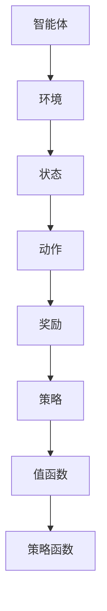

                 

## 第1章：深度强化学习的基本概念

### 1.1 深度强化学习概述

深度强化学习（Deep Reinforcement Learning，DRL）是一种结合了强化学习和深度学习的机器学习方法。它利用深度神经网络来学习值函数和策略函数，从而在复杂环境中实现自主学习和决策。深度强化学习在游戏、机器人控制、自动驾驶等领域取得了显著的成果，其核心目的是通过与环境交互来学习最优策略，以实现长期累积奖励的最大化。

#### 1.1.1 强化学习与深度学习的结合

**强化学习（Reinforcement Learning，RL）** 是一种通过反馈信号（奖励或惩罚）来指导学习过程的机器学习方法。在强化学习中，智能体（agent）通过不断地与环境（environment）交互，学习如何做出最优决策以最大化累积奖励。强化学习的基本概念包括状态（state）、动作（action）、奖励（reward）和策略（policy）。

**深度学习（Deep Learning，DL）** 是一种基于多层神经网络的学习方法，它通过学习大量数据来提取复杂特征和模式。深度学习在图像识别、语音识别、自然语言处理等领域取得了显著的成果。深度学习的基本概念包括神经网络（neural networks）、激活函数（activation functions）、损失函数（loss functions）和优化算法（optimization algorithms）。

深度强化学习的核心在于将深度学习的特征提取能力与强化学习的决策能力相结合。具体来说，深度强化学习通过深度神经网络自动学习状态和动作的特征表示，从而提高学习效率和决策质量。同时，深度强化学习还引入了策略函数和价值函数，用于指导智能体的决策过程。

#### 1.1.2 深度强化学习的目标

深度强化学习的目标是开发智能体，使其能够在复杂动态环境中自主学习最优策略。具体来说，深度强化学习的目标包括：

1. **最大化长期累积奖励**：智能体的目标是获得最大的累积奖励，从而实现长期利益的最大化。
2. **高效的学习效率**：智能体需要能够快速学习，以便在有限的时间内达到最优策略。
3. **通用性和适应性**：智能体应该能够在不同的环境中表现出色，并且能够适应环境的变化。

#### 1.1.3 深度强化学习的主要挑战

深度强化学习面临着一系列挑战，这些挑战主要集中在以下几个方面：

1. **样本效率**：深度强化学习需要大量的样本来学习策略，这在实际应用中可能非常耗时。
2. **不稳定性和鲁棒性**：深度强化学习模型在某些情况下可能表现出不稳定的行为，特别是在面临环境变化或数据分布变化时。
3. **探索与利用的平衡**：智能体需要在探索未知状态和利用已知信息之间做出平衡。
4. **可解释性**：深度强化学习模型的决策过程通常是非透明的，这使得模型的解释性成为一个重要问题。
5. **硬件资源需求**：深度强化学习通常需要大量的计算资源，这在实际应用中可能成为一个限制因素。

为了解决这些挑战，研究者们提出了各种算法和技术，如基于模型的方法、基于价值的方法、基于策略的方法以及深度确定性策略梯度（DDPG）等方法。

### 1.2 值函数与策略函数的定义与作用

在深度强化学习中，值函数和价值函数是核心概念之一。值函数（Value Function）用于评估状态或状态-动作对的价值，指导智能体的决策过程。策略函数（Policy Function）则决定了智能体在特定状态下应该采取哪个动作。

#### 1.2.1 值函数的概念与形式

值函数是用于评估状态或状态-动作对的一个函数，它表示在当前状态下执行特定动作所能获得的长期累积奖励。值函数可以分为状态值函数（State-Value Function）和状态-动作值函数（State-Action Value Function）。

状态值函数 \( V(s) \) 表示在状态 \( s \) 下执行任意动作所能获得的长期累积奖励，其数学表示为：
\[ V(s) = \sum_{a} \pi(a|s) \cdot [r(s, a) + \gamma \cdot V(s')] \]

其中，\( \pi(a|s) \) 是在状态 \( s \) 下执行动作 \( a \) 的概率，\( r(s, a) \) 是在状态 \( s \) 下执行动作 \( a \) 所获得的即时奖励，\( \gamma \) 是折扣因子，用于平衡当前奖励和未来奖励的关系，\( V(s') \) 是下一状态的价值。

状态-动作值函数 \( Q(s, a) \) 表示在状态 \( s \) 下执行动作 \( a \) 所能获得的长期累积奖励，其数学表示为：
\[ Q(s, a) = r(s, a) + \gamma \cdot \sum_{s'} p(s'|s, a) \cdot \max_{a'} Q(s', a') \]

其中，\( p(s'|s, a) \) 是在状态 \( s \) 下执行动作 \( a \) 后转移到状态 \( s' \) 的概率，\( \max_{a'} Q(s', a') \) 是在状态 \( s' \) 下执行最优动作 \( a' \) 的状态-动作值函数。

#### 1.2.2 策略函数的概念与形式

策略函数是用于指导智能体在特定状态下选择动作的函数。策略函数可以分为确定性策略函数（Deterministic Policy Function）和概率性策略函数（Stochastic Policy Function）。

确定性策略函数 \( \pi_d(s) \) 在给定状态下只选择一个最优动作，即 \( \pi_d(s) = a^*(s) \)，其中 \( a^*(s) \) 是最优动作。

概率性策略函数 \( \pi_s(s) \) 在给定状态下选择多个动作的概率分布，即 \( \pi_s(s) = \{ p(a|s) : a \in A \} \)，其中 \( A \) 是所有可能动作的集合。

#### 1.2.3 值函数与策略函数的联系与区别

值函数与策略函数在深度强化学习中起着重要作用，它们之间的联系与区别如下：

1. **联系**：
   - 值函数和策略函数都是用于评估状态或状态-动作对的价值。
   - 值函数可以通过策略函数来计算，即 \( V(s) = \sum_a \pi(a|s) \cdot Q(s, a) \)。

2. **区别**：
   - 值函数关注的是长期累积奖励，而策略函数关注的是当前状态下的最优动作。
   - 值函数可以是确定性函数，也可以是概率性函数，而策略函数通常是概率性函数。
   - 值函数用于指导智能体的决策过程，而策略函数用于指导智能体的动作选择。

#### 1.2.4 值函数与策略函数的计算方法

值函数和策略函数的计算方法可以分为基于模型的方法和无模型方法。

1. **基于模型的方法**：
   - **动态规划**：通过递归方程（如贝尔曼方程）计算值函数和策略函数。
   - **模型预测控制**：通过预测模型来生成最优策略。

2. **无模型方法**：
   - **经验回放**：通过经验回放机制，在训练过程中重复利用历史数据来更新值函数和策略函数。
   - **深度学习**：使用深度神经网络来直接学习值函数和策略函数的近似表示。

#### 1.2.5 值函数与策略函数的性质

值函数和策略函数具有以下性质：

1. **递归性**：值函数是递归的，即当前值函数依赖于未来值函数。
2. **稳定性**：值函数和策略函数的更新需要稳定，以避免过度更新或收敛到次优解。
3. **一致性**：如果策略是最优的，则值函数也是一致的，即从任何状态开始，最优策略都会选择相同的行动。
4. **收敛性**：在一定的条件下，值函数和策略函数会收敛到最优值函数和最优策略。

### 1.3 本书结构安排与主要内容

本书旨在系统地介绍深度强化学习的理论基础和实践应用。全书共分为七个部分，具体结构安排与主要内容如下：

1. **第一部分：引论**
   - 第1章：深度强化学习的基本概念
   - 主要介绍深度强化学习的基本概念、目标、主要挑战以及值函数与策略函数的定义与作用。

2. **第二部分：值函数**
   - 第2章：深度强化学习中的值函数
   - 详细阐述值函数的基本原理、数学模型、计算算法和应用实例。

3. **第三部分：策略函数**
   - 第3章：深度强化学习中的策略函数
   - 详细阐述策略函数的基本原理、数学模型、计算算法和应用实例。

4. **第四部分：深度强化学习的映射理论**
   - 第4章：深度强化学习中的映射理论
   - 探讨深度强化学习中的映射理论，包括值函数与策略函数的映射关系及其应用。

5. **第五部分：深度强化学习的理论基础**
   - 第5章：深度强化学习的理论基础
   - 介绍深度强化学习的基础理论，包括强化学习的基本理论、深度学习的基本理论以及深度强化学习的基础理论。

6. **第六部分：深度强化学习的实现与应用**
   - 第6章：深度强化学习的实现技术
   - 介绍深度强化学习的实现流程、工具与框架以及实现案例。

7. **第七部分：深度强化学习的未来发展**
   - 第7章：深度强化学习的未来发展
   - 展望深度强化学习的未来发展，包括现状与趋势、创新方向以及在社会和经济中的应用。

通过本书的系统介绍，读者可以全面了解深度强化学习的理论基础和实践应用，为在学术界和工业界的研究和应用奠定基础。

### 第1章：深度强化学习的基本概念

#### 摘要

本章全面介绍了深度强化学习（Deep Reinforcement Learning，DRL）的基本概念、目标、主要挑战以及值函数与策略函数的定义与作用。深度强化学习是强化学习与深度学习的结合，通过深度神经网络学习状态和动作的表示，从而在复杂环境中实现自主学习和决策。本章首先阐述了强化学习与深度学习的结合，分析了深度强化学习的目标和主要挑战。接着，详细介绍了值函数和策略函数的定义、形式及其在深度强化学习中的作用。此外，本章还探讨了值函数与策略函数的计算方法、性质以及本书的结构安排与主要内容。通过本章的学习，读者可以初步了解深度强化学习的核心概念和理论基础。

### 第1章：深度强化学习的基本概念

#### 核心概念与联系

深度强化学习（Deep Reinforcement Learning，DRL）是一种机器学习方法，结合了强化学习（Reinforcement Learning，RL）与深度学习（Deep Learning，DL）的优势。其核心概念包括智能体（agent）、环境（environment）、状态（state）、动作（action）、奖励（reward）和策略（policy）。以下是一个简单的 Mermaid 流程图，展示了这些核心概念之间的关系：



在 DRL 中，智能体通过与环境交互，学习如何从状态中选择动作，以获得最大的累积奖励。值函数用于评估状态或状态-动作对的价值，指导智能体的决策过程。策略函数则决定了智能体在特定状态下应该采取哪个动作。

#### 核心算法原理讲解

深度强化学习的核心算法包括值函数和策略函数的学习。以下分别使用伪代码详细讲解这两种算法的基本原理。

**值函数的学习**

伪代码：

```
初始化：状态值函数 V(s)
         学习率 α
         探索概率 ε

for each episode do
    s <- 环境初始状态
    while 状态 s 不是终止状态 do
        a <- 选择动作，使用 ε-greedy 策略
        s' <- 环境执行动作 a 后的新状态
        r <- 环境返回的即时奖励
        Q(s, a) <- r + γ * max(Q(s', a'))
        更新 V(s) = (1 - α) * V(s) + α * Q(s, a)
        s <- s'
    end while
end for
```

其中，ε-greedy 策略是一种探索与利用的平衡策略，用于在训练过程中选择动作。γ 是折扣因子，用于平衡当前奖励和未来奖励的关系。

**策略函数的学习**

伪代码：

```
初始化：策略函数 π(s)
         学习率 α

for each episode do
    s <- 环境初始状态
    while 状态 s 不是终止状态 do
        π(s) <- 选择动作的概率分布，使用策略梯度方法
        s' <- 环境执行动作 a 后的新状态
        r <- 环境返回的即时奖励
        更新 π(s) = (1 - α) * π(s) + α * π'(s)
        s <- s'
    end while
end for
```

其中，策略梯度方法是一种基于梯度下降的优化算法，用于更新策略函数。

#### 数学模型和公式

深度强化学习的核心算法可以通过以下数学模型和公式表示：

1. **状态值函数**

\[ V(s) = \sum_{a} \pi(a|s) \cdot [r(s, a) + \gamma \cdot V(s')] \]

2. **状态-动作值函数**

\[ Q(s, a) = r(s, a) + \gamma \cdot \sum_{s'} p(s'|s, a) \cdot \max_{a'} Q(s', a') \]

3. **策略函数**

\[ \pi(s) = \arg\max_a

