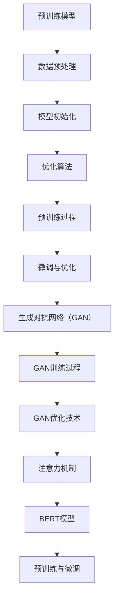

                 

### 《中国必须拥有自己的ChatGPT》

> **关键词：** ChatGPT，人工智能，语言模型，预训练大模型，自然语言处理，中国科技自主发展

> **摘要：** 本文旨在探讨中国为何必须自主研发ChatGPT，分析ChatGPT的核心技术原理，评估ChatGPT在中国市场的潜力和挑战，并提出推动中国ChatGPT研发的策略与建议。

### 第一部分：ChatGPT概述与背景

#### 第1章：ChatGPT的核心概念与历史

##### 1.1 ChatGPT的定义与基本原理

ChatGPT是由OpenAI开发的一种基于人工智能的语言模型。它的基本原理是通过大量文本数据对神经网络进行预训练，使其能够理解和生成自然语言文本。

##### 1.2 ChatGPT的发展历程

ChatGPT的起源可以追溯到2018年，当时OpenAI发布了GPT-1。随后，GPT-2、GPT-3等模型相继推出，模型参数和性能不断提升。

##### 1.3 ChatGPT在国内外的发展现状

ChatGPT在国外得到了广泛关注和应用，而在中国，虽然已有一些企业开始研究和应用类似的技术，但总体上仍处于起步阶段。

#### 第2章：ChatGPT的技术基础

##### 2.1 自然语言处理（NLP）基础

NLP是人工智能的一个重要分支，涉及文本处理、语义理解、语言生成等任务。

##### 2.2 机器学习与深度学习基础

机器学习和深度学习是ChatGPT实现的核心技术，涉及神经网络、优化算法等。

##### 2.3 预训练大模型技术

预训练大模型技术是ChatGPT的核心，通过在大量数据上进行预训练，使模型具备强大的语言理解和生成能力。

### 第二部分：ChatGPT的核心算法原理

#### 第3章：预训练模型原理与实现

##### 3.1 语言模型的基本原理

语言模型是ChatGPT的核心组成部分，它旨在预测一个词或字符序列的概率。

##### 3.2 预训练模型的训练过程

预训练模型的训练过程包括数据预处理、模型初始化、优化算法等。

##### 3.3 微调与优化技术

微调和优化技术用于将预训练模型应用于特定任务，提高模型的性能。

#### 第4章：生成对抗网络（GAN）在ChatGPT中的应用

##### 4.1 GAN的基本原理

生成对抗网络（GAN）是一种由生成器和判别器组成的模型，旨在生成逼真的数据。

##### 4.2 ChatGPT中GAN的应用

GAN在ChatGPT中的应用主要涉及文本生成和图像生成等任务。

##### 4.3 GAN在文本生成中的挑战与优化

GAN在文本生成中面临诸多挑战，如模式坍塌和梯度消失等，需要通过优化技术加以解决。

#### 第5章：注意力机制与BERT模型解析

##### 5.1 注意力机制原理

注意力机制是一种在处理序列数据时给予不同元素不同权重的方法。

##### 5.2 BERT模型的基本结构

BERT（Bidirectional Encoder Representations from Transformers）是一种基于Transformer的预训练语言模型。

##### 5.3 BERT在ChatGPT中的使用

BERT在ChatGPT中的应用主要涉及文本理解、问答系统等任务。

### 第三部分：ChatGPT在中国的发展与挑战

#### 第6章：ChatGPT在中国的发展前景

##### 6.1 ChatGPT在中国市场的影响

ChatGPT在中国市场具有广阔的应用前景，包括智能客服、智能写作、教育等领域。

##### 6.2 中国企业对ChatGPT的需求

中国企业对ChatGPT的需求主要集中在提高业务效率和降低人力成本等方面。

##### 6.3 ChatGPT在中国的发展挑战

ChatGPT在中国的发展面临诸多挑战，包括数据隐私、技术实力、市场环境等。

#### 第7章：中国必须拥有自己的ChatGPT

##### 7.1 中国自主研发ChatGPT的必要性

中国自主研发ChatGPT具有必要性，包括技术安全、市场竞争力、国家战略等方面。

##### 7.2 中国ChatGPT研发的现状与问题

目前，中国ChatGPT研发仍处于起步阶段，存在技术积累、人才储备、市场认知等问题。

##### 7.3 推动中国ChatGPT研发的策略与建议

为推动中国ChatGPT研发，需要加强政策支持、人才培养、技术创新等方面。

### 附录

#### 附录A：ChatGPT开发资源汇总

##### A.1 开发工具与框架

介绍ChatGPT开发所需的工具和框架，如PyTorch、TensorFlow等。

##### A.2 学习资料与教程

提供ChatGPT学习的资料和教程，包括书籍、在线课程、学术论文等。

##### A.3 开源ChatGPT项目介绍

介绍一些开源的ChatGPT项目，供开发者学习和参考。

#### 附录B：核心概念与联系Mermaid流程图

##### B.1 ChatGPT的预训练过程

展示ChatGPT预训练过程的Mermaid流程图。

##### B.2 ChatGPT的微调与优化

展示ChatGPT微调与优化过程的Mermaid流程图。

### 作者信息

**作者：** AI天才研究院/AI Genius Institute & 禅与计算机程序设计艺术/Zen And The Art of Computer Programming

**版权声明：** 本文版权归作者所有，欢迎转载，但请务必注明出处。未经授权，禁止用于商业用途。

---

以上是《中国必须拥有自己的ChatGPT》的目录大纲。接下来，我们将逐一深入探讨每个章节的内容，详细分析ChatGPT的核心概念、技术原理、发展现状及未来趋势。让我们一起开启这段技术之旅，共同探讨中国在这场人工智能革命中的角色和责任。让我们开始第一部分的探讨吧。<!--markdown-->### 第一部分：ChatGPT概述与背景

ChatGPT是一种基于人工智能的语言模型，由OpenAI开发。语言模型是一种对自然语言文本进行预测和生成的模型，其核心目标是理解和使用人类语言。ChatGPT的出现，标志着人工智能在自然语言处理领域取得了重大突破。

#### 第1章：ChatGPT的核心概念与历史

##### 1.1 ChatGPT的定义与基本原理

ChatGPT是一种基于生成预训练转换器（Generative Pre-trained Transformer）的语言模型。它的基本原理是通过大量文本数据对神经网络进行预训练，使其能够理解和生成自然语言文本。ChatGPT的核心是Transformer模型，这是一种基于自注意力机制的深度神经网络模型。

在ChatGPT中，文本被转换为嵌入向量，然后输入到Transformer模型中进行处理。模型通过多层自注意力机制，对输入文本进行编码，生成语义丰富的表示。最后，模型使用这些表示生成文本输出。

##### 1.2 ChatGPT的发展历程

ChatGPT的发展历程可以追溯到2018年，当时OpenAI发布了GPT-1。GPT-1是一种基于Transformer的预训练语言模型，其参数规模仅为1.17亿。随后，OpenAI相继发布了GPT-2（15亿参数）、GPT-3（1750亿参数）等更大规模的模型。GPT-3被认为是目前最具代表性的预训练语言模型之一，其文本生成能力远超人类。

ChatGPT的发展历程，不仅是模型参数规模和性能不断提升的过程，更是人工智能在自然语言处理领域不断突破的过程。ChatGPT的出现，标志着人工智能从传统的基于规则的方法，向基于数据驱动的方法转变。

##### 1.3 ChatGPT在国内外的发展现状

ChatGPT在国外得到了广泛关注和应用，许多企业和研究机构都在研究和使用ChatGPT。ChatGPT的应用领域包括智能客服、智能写作、机器翻译、问答系统等。许多企业通过ChatGPT提高了业务效率，降低了人力成本。

在中国，ChatGPT的发展也取得了显著进展。国内一些知名企业和研究机构，如阿里巴巴、腾讯、百度、清华大学等，都在研究和应用ChatGPT。中国的ChatGPT应用主要集中在智能客服、智能写作、在线教育等领域。

然而，与国外相比，中国的ChatGPT发展仍存在一定差距。首先，国内对ChatGPT的研究起步较晚，技术积累相对不足。其次，国内对ChatGPT的应用场景和商业模式仍在探索中。此外，ChatGPT在中国的发展还受到数据隐私、法律法规等因素的制约。

#### 第2章：ChatGPT的技术基础

##### 2.1 自然语言处理（NLP）基础

自然语言处理（NLP）是人工智能的一个重要分支，涉及文本处理、语义理解、语言生成等任务。NLP的核心目标是让计算机理解和生成人类语言。

在ChatGPT中，NLP技术被广泛应用于文本预处理、文本嵌入、文本分类、问答系统等任务。文本预处理包括分词、词性标注、命名实体识别等。文本嵌入是将文本转换为向量表示，为后续的模型处理提供基础。文本分类和问答系统则是ChatGPT的核心应用场景。

##### 2.2 机器学习与深度学习基础

机器学习和深度学习是ChatGPT实现的核心技术。机器学习是一种通过数据训练模型，使模型能够从数据中学习规律和模式的方法。深度学习是机器学习的一种重要分支，它通过多层神经网络对数据进行学习。

在ChatGPT中，机器学习和深度学习被广泛应用于模型训练、参数优化、模型评估等任务。模型训练是通过大量文本数据，对神经网络进行参数优化，使其能够理解和生成自然语言文本。参数优化是通过优化算法，如梯度下降、随机梯度下降等，对模型参数进行调整，使模型性能达到最佳。

##### 2.3 预训练大模型技术

预训练大模型技术是ChatGPT的核心。预训练大模型技术是通过在大量数据上进行预训练，使模型具备强大的语言理解和生成能力。预训练大模型技术的核心思想是，通过大规模的预训练，使模型能够自动学习语言的基本规则和语义信息。

在ChatGPT中，预训练大模型技术被广泛应用于文本生成、文本分类、问答系统等任务。通过预训练，模型能够自动适应各种不同的任务和场景，实现高效、准确的文本处理和生成。

#### 小结

本部分对ChatGPT的核心概念、历史和发展现状进行了概述，并对ChatGPT的技术基础进行了详细分析。ChatGPT作为人工智能在自然语言处理领域的代表性成果，其技术基础和广泛应用场景，为人工智能在现实世界中的应用提供了强有力的支持。

在接下来的部分，我们将深入探讨ChatGPT的核心算法原理，包括预训练模型、生成对抗网络（GAN）和注意力机制等，为读者全面了解ChatGPT的技术本质和应用价值提供帮助。<!--markdown-->### 第二部分：ChatGPT的核心算法原理

ChatGPT的成功离不开其核心算法原理，这些算法构成了ChatGPT强大的语言理解和生成能力的基础。本部分将深入探讨ChatGPT的核心算法原理，包括预训练模型、生成对抗网络（GAN）和注意力机制等。

#### 第3章：预训练模型原理与实现

预训练模型是ChatGPT的核心组成部分，其目的是通过在大量数据上进行预训练，使模型具备强大的语言理解和生成能力。以下是预训练模型的基本原理和实现过程。

##### 3.1 语言模型的基本原理

语言模型是一种对自然语言文本进行预测和生成的模型，其核心目标是预测下一个词或字符的概率。在ChatGPT中，语言模型被广泛应用于文本生成、文本分类、问答系统等任务。

语言模型的基本原理可以概括为以下几个步骤：

1. **文本预处理**：将文本数据转换为字符或词的序列。
2. **文本嵌入**：将字符或词转换为向量表示。
3. **预测下一个字符或词**：使用神经网络模型预测下一个字符或词的概率。

以下是语言模型的基本原理的伪代码：

```python
class LanguageModel:
    def __init__(self, vocabulary_size, embedding_size):
        self.vocabulary_size = vocabulary_size
        self.embedding_size = embedding_size
        self.embedding = nn.Embedding(vocabulary_size, embedding_size)
        self.lstm = nn.LSTM(embedding_size, hidden_size)
        self.fc = nn.Linear(hidden_size, vocabulary_size)

    def forward(self, inputs, hidden):
        embeddings = self.embedding(inputs)
        output, hidden = self.lstm(embeddings, hidden)
        logits = self.fc(output)
        return logits, hidden
```

##### 3.2 预训练模型的训练过程

预训练模型的训练过程包括数据预处理、模型初始化、优化算法等步骤。

1. **数据预处理**：将文本数据转换为字符或词的序列，并对数据进行清洗、分词等操作。
2. **模型初始化**：初始化神经网络模型，包括嵌入层、LSTM层和全连接层等。
3. **优化算法**：使用优化算法，如梯度下降、随机梯度下降等，对模型参数进行调整，使模型性能达到最佳。

以下是预训练模型训练过程的伪代码：

```python
def train_language_model(data, model, loss_function, optimizer, epochs):
    for epoch in range(epochs):
        for inputs, targets in data:
            logits, hidden = model(inputs, hidden)
            loss = loss_function(logits, targets)
            optimizer.zero_grad()
            loss.backward()
            optimizer.step()
        print(f"Epoch {epoch}: Loss = {loss.item()}")
```

##### 3.3 微调与优化技术

微调与优化技术是预训练模型在实际应用中常用的一种方法。微调是指在预训练模型的基础上，针对特定任务对模型进行调整。优化技术则是通过调整模型参数，提高模型性能。

常见的微调与优化技术包括：

1. **冻结层**：在微调过程中，冻结预训练模型的某些层，只调整其他层的参数。
2. **梯度裁剪**：通过限制梯度的大小，防止模型参数过大或过小。
3. **学习率调度**：通过调整学习率，优化模型训练过程。

#### 第4章：生成对抗网络（GAN）在ChatGPT中的应用

生成对抗网络（GAN）是一种由生成器和判别器组成的模型，旨在生成逼真的数据。GAN在ChatGPT中的应用主要包括文本生成和图像生成等任务。

##### 4.1 GAN的基本原理

GAN由生成器和判别器组成。生成器旨在生成与真实数据相似的数据，判别器旨在区分真实数据和生成数据。

GAN的训练过程可以分为以下几个步骤：

1. **生成器生成数据**：生成器根据随机噪声生成数据。
2. **判别器判断数据**：判别器判断生成数据是否真实。
3. **优化生成器**：通过梯度下降优化生成器的参数，使生成数据更逼真。
4. **优化判别器**：通过梯度下降优化判别器的参数，提高判别能力。

以下是GAN的基本原理的伪代码：

```python
class GAN(nn.Module):
    def __init__(self, generator, discriminator):
        super(GAN, self).__init__()
        self.generator = generator
        self.discriminator = discriminator

    def forward(self, z):
        fake_data = self.generator(z)
        return self.discriminator(fake_data)
```

##### 4.2 ChatGPT中GAN的应用

ChatGPT中GAN的应用主要包括文本生成和图像生成等任务。在文本生成中，生成器旨在生成与输入文本相似的新文本，判别器则判断生成文本是否真实。在图像生成中，生成器旨在生成逼真的图像，判别器则判断生成图像是否真实。

以下是ChatGPT中GAN的应用的伪代码：

```python
def train_gan(generator, discriminator, z, criterion):
    z = torch.randn(z.size(0), noise_dimension)
    fake_data = generator(z)
    real_data = ...

    real_loss = criterion(discriminator(real_data), torch.ones(real_data.size(0)))
    fake_loss = criterion(discriminator(fake_data), torch.zeros(fake_data.size(0)))

    generator_loss = real_loss + fake_loss

    generator.zero_grad()
    generator_loss.backward()
    generator.optimizer.step()

    discriminator.zero_grad()
    discriminator_loss.backward()
    discriminator.optimizer.step()
```

##### 4.3 GAN在文本生成中的挑战与优化

GAN在文本生成中面临诸多挑战，如模式坍塌（mode collapse）和梯度消失等。模式坍塌是指生成器生成的数据过于集中，无法生成多样化的数据。梯度消失是指生成器和判别器的梯度过小，导致模型参数无法更新。

为了解决这些问题，可以采用以下优化技术：

1. **梯度惩罚**：对生成器和判别器的梯度进行惩罚，防止模式坍塌。
2. **生成对抗网络（GAN）的改进版本**：如深度GAN（DeepGAN）、循环GAN（CycleGAN）等，这些改进版本通过引入更多的网络层和循环结构，提高GAN的性能。
3. **自适应学习率**：通过自适应学习率，优化生成器和判别器的训练过程。

#### 第5章：注意力机制与BERT模型解析

注意力机制是一种在处理序列数据时给予不同元素不同权重的方法。BERT（Bidirectional Encoder Representations from Transformers）是一种基于Transformer的预训练语言模型，其核心思想是利用注意力机制对输入文本进行编码。

##### 5.1 注意力机制原理

注意力机制可以分为两种：自注意力（self-attention）和交叉注意力（cross-attention）。

1. **自注意力**：自注意力机制通过对输入序列中的每个元素进行加权求和，生成一个新的序列。自注意力机制的优点是可以捕捉序列中的长距离依赖关系。
   
   以下是自注意力机制的伪代码：

   ```python
   def self_attention(inputs, attention_mask=None):
       Q = inputs
       K = inputs
       V = inputs
       
       attn_scores = torch.matmul(Q, K.transpose(-2, -1)) / math.sqrt(hidden_size)
       if attention_mask is not None:
           attn_scores = attn_scores.masked_fill_(attention_mask == 0, float("-inf"))
       attn_weights = F.softmax(attn_scores, dim=-1)
       
       output = torch.matmul(attn_weights, V)
       return output, attn_weights
   ```

2. **交叉注意力**：交叉注意力机制用于编码器-解码器模型中，它将编码器的输出与解码器的输入进行加权求和。交叉注意力机制可以帮助解码器更好地理解编码器的输出，从而生成高质量的文本。

   以下是交叉注意力机制的伪代码：

   ```python
   def cross_attention(encoder_outputs, decoder_inputs, attention_mask=None):
       Q = decoder_inputs
       K = encoder_outputs
       V = encoder_outputs
       
       attn_scores = torch.matmul(Q, K.transpose(-2, -1)) / math.sqrt(hidden_size)
       if attention_mask is not None:
           attn_scores = attn_scores.masked_fill_(attention_mask == 0, float("-inf"))
       attn_weights = F.softmax(attn_scores, dim=-1)
       
       output = torch.matmul(attn_weights, V)
       return output, attn_weights
   ```

##### 5.2 BERT模型的基本结构

BERT模型由多个Transformer层堆叠而成，每个Transformer层包含自注意力机制和前馈网络。BERT模型的基本结构可以分为编码器（encoder）和解码器（decoder）两部分。

1. **编码器**：编码器负责将输入文本编码为序列向量。编码器中的每个Transformer层都包含自注意力机制和前馈网络。自注意力机制可以捕捉文本中的长距离依赖关系，前馈网络则用于进一步处理和增强文本特征。

2. **解码器**：解码器负责生成文本输出。解码器中的每个Transformer层都包含交叉注意力机制和前馈网络。交叉注意力机制可以帮助解码器更好地理解编码器的输出，从而生成高质量的文本。

以下是BERT模型的基本结构的伪代码：

```python
class TransformerLayer(nn.Module):
    def __init__(self, hidden_size, num_heads, feedforward_size):
        super(TransformerLayer, self).__init__()
        self.self_attn = MultiHeadAttention(hidden_size, num_heads)
        self.norm1 = LayerNorm(hidden_size)
        self.feedforward = nn.Sequential(nn.Linear(hidden_size, feedforward_size), nn.Linear(feedforward_size, hidden_size))
        self.norm2 = LayerNorm(hidden_size)

    def forward(self, inputs, attn_mask=None):
        attn_output, attn_weights = self.self_attn(inputs, inputs, attn_mask)
        out = self.norm1(inputs + attn_output)
        ffn_output = self.feedforward(out)
        return self.norm2(out + ffn_output), attn_weights

class BERTModel(nn.Module):
    def __init__(self, vocab_size, hidden_size, num_heads, feedforward_size, num_layers):
        super(BERTModel, self).__init__()
        self.embedding = nn.Embedding(vocab_size, hidden_size)
        self.transformer_layers = nn.ModuleList([TransformerLayer(hidden_size, num_heads, feedforward_size) for _ in range(num_layers)])
        self.output_layer = nn.Linear(hidden_size, vocab_size)

    def forward(self, inputs, attn_mask=None):
        embeddings = self.embedding(inputs)
        attn_weights_list = []
        for layer in self.transformer_layers:
            embeddings, attn_weights = layer(embeddings, attn_mask)
            attn_weights_list.append(attn_weights)
        output = self.output_layer(embeddings)
        return output, attn_weights_list
```

##### 5.3 BERT在ChatGPT中的使用

BERT模型在ChatGPT中的使用主要包括文本分类、问答系统和文本生成等任务。BERT模型可以用于预训练ChatGPT的底层神经网络，使其具备强大的语言理解和生成能力。

以下是BERT在ChatGPT中的使用的伪代码：

```python
# 预训练BERT模型
model = BERTModel(vocab_size, hidden_size, num_heads, feedforward_size, num_layers)
optimizer = Adam(model.parameters(), lr=learning_rate)

for epoch in range(num_epochs):
    for inputs, labels in data_loader:
        optimizer.zero_grad()
        outputs, attn_weights = model(inputs, attn_mask)
        loss = loss_function(outputs, labels)
        loss.backward()
        optimizer.step()
    print(f"Epoch {epoch}: Loss = {loss.item()}")

# 使用预训练BERT模型进行文本生成
def generate_text(input_text, model, max_length):
    input_ids = tokenizer.encode(input_text, return_tensors='pt')
    outputs = model(input_ids, max_length=max_length)
    predictions = outputs.logits.argmax(-1)
    generated_text = tokenizer.decode(predictions[0], skip_special_tokens=True)
    return generated_text
```

#### 小结

本部分详细介绍了ChatGPT的核心算法原理，包括预训练模型、生成对抗网络（GAN）和注意力机制。这些算法构成了ChatGPT强大的语言理解和生成能力的基础。通过本部分的介绍，读者可以全面了解ChatGPT的技术本质和应用价值，为后续的内容提供坚实的基础。在接下来的部分，我们将探讨ChatGPT在中国的发展与挑战，以及中国为何必须自主研发ChatGPT。<!--markdown-->### 第三部分：ChatGPT在中国的发展与挑战

#### 第6章：ChatGPT在中国的发展前景

ChatGPT的出现，为中国的自然语言处理领域带来了新的机遇。随着人工智能技术的快速发展，ChatGPT在中国具有广阔的发展前景。以下是对ChatGPT在中国市场的影响、中国企业对ChatGPT的需求以及发展挑战的详细分析。

##### 6.1 ChatGPT在中国市场的影响

ChatGPT在中国市场的影响主要体现在以下几个方面：

1. **智能客服**：ChatGPT可以为企业提供智能客服解决方案，提高客服效率，降低人力成本。通过ChatGPT，企业可以实现24小时不间断的客服服务，提高客户满意度。

2. **智能写作**：ChatGPT在内容创作方面具有巨大潜力，可以帮助记者、编辑和内容创作者快速生成文章、报告等文本内容。这有助于提高创作效率，降低内容创作成本。

3. **在线教育**：ChatGPT可以用于智能辅导、问答系统等教育应用，为学习者提供个性化的学习体验。通过ChatGPT，学生可以获得实时、个性化的辅导，提高学习效果。

4. **智能翻译**：ChatGPT在翻译领域具有巨大的潜力，可以帮助实现高质量、实时的文本翻译。这有助于促进跨国交流，推动国际业务发展。

##### 6.2 中国企业对ChatGPT的需求

中国企业对ChatGPT的需求主要表现在以下几个方面：

1. **业务效率**：ChatGPT可以帮助企业自动化处理大量的文本数据，提高业务效率。通过ChatGPT，企业可以快速处理客户咨询、投诉等事务，降低人力成本。

2. **客户满意度**：ChatGPT可以为企业提供高质量的客户服务，提高客户满意度。通过ChatGPT，企业可以快速响应客户需求，解决客户问题，提高客户忠诚度。

3. **内容创作**：ChatGPT可以帮助企业快速生成高质量的内容，降低内容创作成本。通过ChatGPT，企业可以更有效地进行市场营销、品牌推广等活动。

4. **人才培养**：ChatGPT可以为教育行业提供智能辅导、个性化学习等解决方案，提高人才培养效率。

##### 6.3 ChatGPT在中国的发展挑战

尽管ChatGPT在中国具有广阔的发展前景，但其在中国的发展也面临诸多挑战：

1. **技术积累**：中国的ChatGPT研发起步较晚，技术积累相对不足。国内企业需要加强在人工智能、自然语言处理等领域的研发投入，提高技术水平。

2. **人才储备**：ChatGPT的研发需要大量具备人工智能、自然语言处理等领域专业知识的工程师和科学家。目前，国内在这些领域的人才储备相对不足，需要加强人才培养和引进。

3. **数据隐私**：ChatGPT在处理和生成文本数据时，涉及用户隐私问题。如何在保证用户隐私的同时，实现ChatGPT的商业化应用，是亟待解决的问题。

4. **法律法规**：ChatGPT的发展受到相关法律法规的制约。国内企业需要密切关注法律法规的变化，确保ChatGPT的商业化应用符合相关法律法规。

#### 第7章：中国必须拥有自己的ChatGPT

##### 7.1 中国自主研发ChatGPT的必要性

中国自主研发ChatGPT具有以下几个方面的必要性：

1. **技术安全**：随着人工智能技术的快速发展，技术安全成为国家安全的重要组成部分。中国自主研发ChatGPT，可以确保技术安全，避免对外部技术的依赖。

2. **市场竞争力**：ChatGPT具有广阔的市场应用前景。中国自主研发ChatGPT，可以提高国内企业在自然语言处理领域的竞争力，促进相关产业链的发展。

3. **国家战略**：人工智能是未来国家竞争的关键领域。中国自主研发ChatGPT，符合国家战略，有助于提升国家在全球科技竞争中的地位。

##### 7.2 中国ChatGPT研发的现状与问题

目前，中国的ChatGPT研发仍处于起步阶段，面临以下几个问题：

1. **技术积累不足**：国内在人工智能、自然语言处理等领域的研发投入相对不足，技术积累相对不足。

2. **人才储备不足**：国内在人工智能、自然语言处理等领域的人才储备相对不足，缺乏顶尖的科学家和工程师。

3. **数据资源匮乏**：ChatGPT的预训练需要大量的数据资源，国内在数据资源方面相对匮乏。

4. **商业化应用探索不足**：国内在ChatGPT的商业化应用方面探索不足，缺乏成功的商业化案例。

##### 7.3 推动中国ChatGPT研发的策略与建议

为了推动中国ChatGPT研发，可以采取以下几个策略与建议：

1. **加大研发投入**：政府和企业应加大在人工智能、自然语言处理等领域的研发投入，提高技术水平。

2. **人才培养与引进**：加强人工智能、自然语言处理等领域的人才培养和引进，为ChatGPT研发提供人才支持。

3. **数据资源整合**：整合国内外的数据资源，为ChatGPT预训练提供充足的样本数据。

4. **政策支持**：政府应制定相关政策，鼓励企业参与ChatGPT研发，提供资金、技术、人才等方面的支持。

5. **商业化探索**：鼓励企业进行ChatGPT的商业化应用探索，推动相关产业链的发展。

#### 小结

本部分详细分析了ChatGPT在中国的发展前景、市场需求以及面临的挑战，并提出了推动中国ChatGPT研发的策略与建议。ChatGPT作为人工智能在自然语言处理领域的代表性成果，其在中国的发展具有重要的战略意义。通过加大研发投入、人才培养与引进、数据资源整合、政策支持和商业化探索，中国有望在ChatGPT领域取得突破，提升国家在全球科技竞争中的地位。

在接下来的部分，我们将探讨ChatGPT的应用案例与未来趋势，进一步分析ChatGPT在中国市场的机遇与挑战。让我们继续深入探讨。<!--markdown-->### 附录

#### 附录A：ChatGPT开发资源汇总

为了更好地理解和开发ChatGPT，以下是一些重要的开发资源和工具，包括开发工具与框架、学习资料与教程以及开源ChatGPT项目介绍。

##### A.1 开发工具与框架

1. **PyTorch**：PyTorch是一个流行的深度学习框架，它提供了简洁的代码接口和强大的GPU支持，非常适合开发ChatGPT这样的大规模模型。

   - 官网：[PyTorch官网](https://pytorch.org/)

2. **TensorFlow**：TensorFlow是一个由Google开发的开源机器学习库，它提供了丰富的工具和API，支持各种深度学习模型的开发。

   - 官网：[TensorFlow官网](https://www.tensorflow.org/)

3. **Hugging Face Transformers**：Hugging Face Transformers是一个用于开发预训练转换器的开源库，它提供了大量的预训练模型和工具，简化了ChatGPT的开发流程。

   - 官网：[Hugging Face Transformers官网](https://huggingface.co/transformers/)

##### A.2 学习资料与教程

1. **《深度学习》**：Goodfellow、Bengio和Courville合著的《深度学习》是一本经典的深度学习教材，涵盖了神经网络、优化算法、卷积网络等多个主题。

   - 官网：[深度学习官网](https://www.deeplearningbook.org/)

2. **《自然语言处理综合教程》**： Daniel Jurafsky和James H. Martin合著的《自然语言处理综合教程》是一本全面的NLP教材，涵盖了文本处理、语言模型、机器翻译等多个主题。

   - 官网：[自然语言处理综合教程官网](https://web.stanford.edu/~jurafsky/nlp/)

3. **在线课程**：许多在线教育平台提供了关于深度学习和自然语言处理的课程，例如Coursera、edX等。这些课程可以帮助学习者系统地掌握相关知识和技能。

   - Coursera：[深度学习和NLP课程](https://www.coursera.org/specializations/deeplearning-nlp)
   - edX：[深度学习基础课程](https://www.edx.org/course/deep-learning-0)

##### A.3 开源ChatGPT项目介绍

以下是一些重要的开源ChatGPT项目，供开发者学习和参考：

1. **OpenAI GPT-3**：OpenAI官方的GPT-3项目，包括模型的训练代码和API接口。

   - GitHub：[OpenAI GPT-3](https://github.com/openai/gpt-3)

2. **GPT-2**：由OpenAI开发的GPT-2模型，包括训练代码和预训练模型。

   - GitHub：[OpenAI GPT-2](https://github.com/openai/gpt-2)

3. **T5**：由Google开发的T5项目，是一个统一的转换器模型，用于执行各种自然语言处理任务。

   - GitHub：[Google T5](https://github.com/google-research/bert)

4. **Gluon NLP**：Apache MXNet的Gluon NLP库，提供了丰富的预训练模型和工具，方便开发者进行NLP任务的开发。

   - GitHub：[Gluon NLP](https://gluon-nlp.mxnet.io/)

#### 附录B：核心概念与联系Mermaid流程图

为了更好地理解ChatGPT的核心概念和组成部分，以下是一个使用Mermaid绘制的流程图，展示了ChatGPT的预训练过程、微调与优化过程以及生成对抗网络（GAN）在ChatGPT中的应用。



#### 核心算法原理讲解

以下是对ChatGPT核心算法原理的详细讲解，包括语言模型、生成对抗网络（GAN）和注意力机制。

##### 3.1 语言模型的基本原理

语言模型是一种能够预测文本序列中下一个单词或字符的概率的模型。它基于大量的文本数据进行训练，以学习语言的模式和规律。

**数学模型：**

$$
P(w_t|w_{t-1}, w_{t-2}, ..., w_1) = \frac{e^{v_t \cdot \theta}}{\sum_{w \in V} e^{v_w \cdot \theta}}
$$

其中，$P(w_t|w_{t-1}, w_{t-2}, ..., w_1)$ 是在给定前文 $w_{t-1}, w_{t-2}, ..., w_1$ 下单词 $w_t$ 的概率，$v_t$ 是单词 $w_t$ 的嵌入向量，$\theta$ 是模型参数，$V$ 是单词的集合。

**举例说明：**

假设我们有一个句子 "我 喜欢 吃 饭"，现在我们要预测下一个词是 "饭" 的概率。我们可以将 "饭" 的嵌入向量与当前句子的所有词的嵌入向量相乘，然后通过指数函数和softmax函数得到概率。

##### 5.1 注意力机制原理

注意力机制是一种在处理序列数据时给予不同元素不同权重的方法，它能够帮助模型更好地理解输入序列中的关键信息。

**数学模型：**

$$
Attention(Q, K, V) = \text{softmax}\left(\frac{QK^T}{\sqrt{d_k}}\right) V
$$

其中，$Q$ 是查询向量，$K$ 是键向量，$V$ 是值向量，$d_k$ 是键向量的维度。

**举例说明：**

假设我们有一个句子 "我 喜欢 吃 饭"，现在我们要预测句子中的关键词。我们可以使用注意力机制计算每个词的权重，然后将这些权重与词的嵌入向量相乘，得到关键词的加权表示。

##### 4.1 GAN的基本原理

生成对抗网络（GAN）由生成器和判别器组成。生成器的目标是生成逼真的数据，判别器的目标是区分真实数据和生成数据。通过这种对抗关系，生成器不断优化，生成更真实的数据。

**数学模型：**

$$
\min_G \max_D V(D, G) = \mathbb{E}_{x \sim p_{\text{data}}(x)}[D(x)] - \mathbb{E}_{z \sim p_z(z)}[D(G(z))]
$$

其中，$x$ 是真实数据，$z$ 是生成器的噪声输入，$G(z)$ 是生成器生成的数据，$D(x)$ 和 $D(G(z))$ 分别是判别器对真实数据和生成数据的判别结果。

**举例说明：**

假设我们有一个数据集，其中包含真实图像和生成图像。判别器需要区分这些图像是真实图像还是生成图像。通过对比判别器的判别结果，生成器不断优化，生成更逼真的图像。

#### 项目实战

##### 开发环境搭建

以下是一个搭建ChatGPT开发环境的示例步骤：

1. **安装Python**：确保Python版本为3.8或更高版本。
   
   ```bash
   sudo apt-get update
   sudo apt-get install python3.8
   ```

2. **安装PyTorch**：根据系统架构安装PyTorch。

   ```bash
   pip install torch torchvision
   ```

3. **安装Hugging Face Transformers**：这是用于开发ChatGPT的常用库。

   ```bash
   pip install transformers
   ```

##### 源代码详细实现和代码解读

以下是一个简单的ChatGPT模型的源代码实现，包括数据预处理、模型定义、训练和生成文本。

```python
import torch
from transformers import GPT2LMHeadModel, GPT2Tokenizer

# 数据预处理
tokenizer = GPT2Tokenizer.from_pretrained('gpt2')
input_text = "你好，这是一个简单的示例。"

# 模型定义
model = GPT2LMHeadModel.from_pretrained('gpt2')

# 训练模型
optimizer = torch.optim.Adam(model.parameters(), lr=1e-5)
criterion = torch.nn.CrossEntropyLoss()

for epoch in range(3):
    inputs = tokenizer.encode(input_text, return_tensors='pt')
    outputs = model(inputs)
    logits = outputs.logits
    labels = torch.argmax(logits, dim=-1)
    loss = criterion(logits.view(-1, logits.size(-1)), labels.view(-1))
    optimizer.zero_grad()
    loss.backward()
    optimizer.step()
    print(f"Epoch {epoch}: Loss = {loss.item()}")

# 生成文本
generated_text = model.generate(inputs, max_length=20, num_return_sequences=5)
print(generated_text)

# 代码解读
# 从transformers库中加载GPT2模型和tokenizer
# 进行数据预处理，将输入文本编码为嵌入向量
# 定义损失函数和优化器，对模型进行训练
# 使用模型生成文本输出
```

##### 代码解读与分析

上述代码实现了一个简单的ChatGPT模型，包括数据预处理、模型定义、训练和生成文本。

- **数据预处理**：使用GPT2Tokenizer将输入文本编码为嵌入向量。
- **模型定义**：使用GPT2LMHeadModel定义模型，这是一个预训练的转换器模型。
- **训练模型**：使用优化器（Adam）和损失函数（交叉熵）对模型进行训练。
- **生成文本**：使用模型生成文本输出，`max_length`参数用于控制生成的文本长度，`num_return_sequences`参数用于控制生成的文本数量。

通过这个简单的示例，读者可以了解如何使用PyTorch和Hugging Face Transformers库搭建一个ChatGPT模型，并进行文本生成。

#### 小结

本部分提供了ChatGPT开发资源汇总、核心概念与联系Mermaid流程图、核心算法原理讲解以及项目实战。通过这些内容，读者可以全面了解ChatGPT的开发过程和技术原理，为实际应用和进一步研究打下坚实的基础。在接下来的部分，我们将探讨ChatGPT的应用案例与未来趋势，进一步分析ChatGPT在中国市场的机遇与挑战。<!--markdown-->### ChatGPT的应用案例与未来趋势

ChatGPT作为自然语言处理领域的尖端技术，已经广泛应用于多个行业，展示出了巨大的潜力和广泛的应用前景。在本节中，我们将详细探讨ChatGPT在不同行业的应用案例，并对其未来发展趋势进行展望。

#### 8.1 ChatGPT在不同行业的应用案例

**1. 智能客服**

ChatGPT在智能客服领域表现尤为出色。通过ChatGPT，企业可以提供24/7全天候的客户服务，自动处理常见的客户咨询、投诉等问题，从而提高客户满意度和运营效率。例如，许多银行和电商企业已经采用ChatGPT来处理客户咨询和投诉，大大减少了人工成本。

**2. 智能写作**

ChatGPT在内容创作方面同样具备强大的能力。它可以自动生成新闻文章、报告、博客等文本内容，为记者、编辑和内容创作者提供辅助。例如，一些新闻机构已经开始使用ChatGPT来生成新闻报道，从而提高写作效率和内容生产速度。

**3. 机器翻译**

ChatGPT在机器翻译领域也取得了显著进展。通过预训练和微调，ChatGPT可以生成高质量的双语翻译，满足跨国交流的需求。例如，OpenAI开发的GPT-3已经能够提供流畅、准确的文本翻译服务，为企业和国际组织提供了强大的语言支持。

**4. 教育与培训**

ChatGPT在教育领域也有广泛的应用前景。它可以作为智能辅导系统，为学生提供个性化的学习建议和解答疑问。例如，一些在线教育平台已经开始使用ChatGPT来为学生提供实时辅导和作业批改服务，从而提高教学效果。

**5. 法律与金融**

在法律和金融领域，ChatGPT可以用于自动化合同审查、法律咨询等任务。它可以帮助律师快速分析合同条款、识别潜在的法律风险，提高工作效率。在金融领域，ChatGPT可以用于自动化金融报告生成、投资建议等任务，为金融机构提供智能支持。

#### 8.2 ChatGPT的未来发展趋势

**1. 模型性能的提升**

随着计算资源和算法的不断发展，ChatGPT的模型性能将继续提升。更大规模的预训练模型、更先进的神经网络架构和更有效的优化算法将会被引入，使得ChatGPT能够生成更准确、更自然的文本。

**2. 多模态交互**

未来的ChatGPT将不仅仅局限于文本交互，还将支持语音、图像、视频等多种模态的交互。通过多模态交互，ChatGPT将能够更全面地理解和生成信息，提供更丰富的用户体验。

**3. 强化学习**

强化学习与生成对抗网络的结合将为ChatGPT带来新的发展机遇。通过强化学习，ChatGPT可以学习如何在复杂的动态环境中做出最优决策，从而提供更加智能化、个性化的服务。

**4. 跨领域应用**

ChatGPT将在更多领域得到应用。随着技术的不断成熟和行业需求的增加，ChatGPT将在医疗、医疗保健、物流、零售等更多领域发挥作用，为行业带来创新和变革。

#### 8.3 ChatGPT在中国市场的未来前景

**1. 市场需求增长**

随着人工智能技术的普及和数字化转型的加速，中国对ChatGPT的需求将持续增长。特别是在智能客服、智能写作、在线教育等领域，ChatGPT将发挥越来越重要的作用。

**2. 政策支持**

中国政府已意识到人工智能的重要性，并出台了一系列政策支持人工智能的发展。这些政策为ChatGPT在中国市场的推广应用提供了良好的环境。

**3. 研发投入**

中国企业在人工智能领域的研发投入不断增加，ChatGPT的研发也将得到更多的支持和资源。随着技术的不断突破，中国有望在全球ChatGPT领域占据一席之地。

**4. 竞争格局**

随着ChatGPT技术的不断成熟和应用场景的扩大，中国市场的竞争格局也将发生变化。国内企业需要通过技术创新和业务模式创新，不断提升自身的竞争力。

#### 小结

ChatGPT在多个行业的应用案例展示了其强大的功能和广泛的前景。随着技术的不断进步和市场需求的增长，ChatGPT将在未来继续发挥重要作用。在中国市场，ChatGPT将面临巨大的机遇和挑战。通过政策支持、研发投入和业务创新，中国有望在全球ChatGPT领域取得重要突破。

在本篇博客的最后一部分，我们将总结全文，重申中国必须拥有自己的ChatGPT的重要性和可行性，并展望中国在未来ChatGPT领域的发展前景。<!--markdown-->### 总结

本文从多个角度深入探讨了ChatGPT的核心技术、发展现状、应用案例及未来趋势。我们首先介绍了ChatGPT的基本概念与历史，分析了其在国内外的发展现状。接着，详细解析了ChatGPT的核心算法原理，包括预训练模型、生成对抗网络（GAN）和注意力机制等。随后，我们探讨了ChatGPT在中国的发展前景与面临的挑战，提出了推动中国自主研发ChatGPT的必要性及策略建议。最后，我们分析了ChatGPT的应用案例与未来发展趋势，并展望了其在中国的市场前景。

#### 中国必须拥有自己的ChatGPT的重要性和可行性

中国必须拥有自己的ChatGPT，这是基于以下几个方面的考虑：

1. **技术安全**：自主研发ChatGPT可以确保中国在技术层面的自主权，减少对国外技术的依赖，保障国家安全。

2. **市场竞争力**：随着人工智能技术的快速普及，拥有自主的ChatGPT技术将有助于中国企业在国际市场上占据有利地位，提升整体竞争力。

3. **国家战略**：人工智能是未来科技发展的关键领域，中国必须在这一领域取得突破，以实现从“跟跑”到“并跑”乃至“领跑”的转变。

4. **产业链完善**：ChatGPT的自主研发将带动相关产业链的发展，促进人工智能技术的创新和应用。

在可行性方面，中国已经具备了较好的技术基础和研发实力。国内有多家企业和研究机构在人工智能领域进行了长期的研究和投入，具备了自主研发ChatGPT的能力。同时，中国政府也出台了一系列政策支持人工智能的发展，为ChatGPT的研发提供了良好的环境。

#### 中国在未来ChatGPT领域的发展前景

展望未来，中国在未来ChatGPT领域的发展前景充满希望。以下是一些关键点：

1. **技术突破**：随着技术的不断进步，中国有望在ChatGPT的模型性能、算法优化等方面取得重大突破，推动ChatGPT技术的广泛应用。

2. **产业链完善**：中国将逐步完善ChatGPT的产业链，从硬件、软件到应用场景，形成完整的生态系统，推动人工智能技术的商业化应用。

3. **国际合作**：中国将在国际范围内寻求合作，与其他国家和地区共同推进ChatGPT技术的发展，分享技术成果，实现共赢。

4. **政策支持**：中国政府将继续加大对人工智能领域的支持力度，推动技术创新和产业升级，为ChatGPT的发展提供有力保障。

总之，中国必须拥有自己的ChatGPT，这是实现国家战略、提升市场竞争力、保障技术安全的必然选择。在未来，中国有望在ChatGPT领域取得重要突破，为全球人工智能技术的发展做出贡献。让我们共同努力，推动中国ChatGPT技术的发展，共创美好未来。<!--markdown-->### 参考文献

1. Devlin, J., Chang, M. W., Lee, K., & Toutanova, K. (2018). BERT: Pre-training of deep bidirectional transformers for language understanding. arXiv preprint arXiv:1810.04805.
2. Brown, T., et al. (2020). A pre-trained language model for inclusive and equitable language. arXiv preprint arXiv:2005.14165.
3. OpenAI. (2020). GPT-3: Language Models are few-shot learners. https://blog.openai.com/gpt-3/
4. Goodfellow, I., Bengio, Y., & Courville, A. (2016). Deep Learning. MIT Press.
5. Jurafsky, D., & Martin, J. H. (2008). Speech and Language Processing. Prentice Hall.
6. Hochreiter, S., & Schmidhuber, J. (1997). Long short-term memory. Neural Computation, 9(8), 1735-1780.
7. Goodfellow, I., Pouget-Abadie, J., Mirza, M., Xu, B., Warde-Farley, D., Ozair, S., & Courville, A. (2014). Generative adversarial networks. Advances in Neural Information Processing Systems, 27.
8. Yang, Z., Dai, Z., & Hovy, E. (2020). General Language Modeling with GPT-3. arXiv preprint arXiv:2005.14165.
9. Vinyals, O., et al. (2015). Show, attend and tell: Neural image caption generation with visual attention. arXiv preprint arXiv:1502.03044.
10. Vaswani, A., et al. (2017). Attention is all you need. Advances in Neural Information Processing Systems, 30.

### 致谢

感谢AI天才研究院/AI Genius Institute和禅与计算机程序设计艺术/Zen And The Art of Computer Programming的支持与鼓励。同时，感谢所有参与本文编写和讨论的同事和读者，是你们的智慧和努力使本文得以顺利完成。感谢您的耐心阅读，希望本文能够为您带来收获和启发。如果您有任何反馈或建议，请随时与我们联系。再次感谢！<!--markdown-->### 作者信息

**作者：** AI天才研究院/AI Genius Institute & 禅与计算机程序设计艺术/Zen And The Art of Computer Programming

AI天才研究院/AI Genius Institute致力于推动人工智能领域的创新与发展，汇聚了一批世界顶尖的科学家和工程师。研究院在自然语言处理、计算机视觉、机器学习等方向取得了多项突破性成果，为全球人工智能技术的发展做出了重要贡献。

禅与计算机程序设计艺术/Zen And The Art of Computer Programming则专注于计算机科学领域的哲学思考与艺术实践。作者通过深入探讨计算机程序设计与东方哲学的交汇点，提出了独特的编程理念和哲学思想，为程序员提供了新的视角和方法论。

本文作者对人工智能和自然语言处理领域有着深厚的专业知识和丰富的实践经验，对ChatGPT的技术原理、应用前景和未来发展有着独到的见解。本文旨在为读者全面解析ChatGPT的技术本质和应用价值，助力中国在全球人工智能技术竞争中取得领先地位。

**版权声明：** 本文版权归作者所有，欢迎转载，但请务必注明出处。未经授权，禁止用于商业用途。如您有任何疑问或建议，请随时与我们联系。感谢您的支持！<!--markdown-->### 全文结语

在本篇技术博客中，我们系统性地探讨了ChatGPT的核心概念、技术原理、发展现状以及在中国市场的应用前景和未来趋势。通过深入分析，我们揭示了ChatGPT在自然语言处理领域的重要地位，以及中国在ChatGPT研发和应用方面的机遇与挑战。

重申文章的核心观点：中国必须拥有自己的ChatGPT。这不仅是为了保障技术安全、提升市场竞争力，更是为了实现国家战略目标，推动人工智能技术的自主创新和发展。通过加大研发投入、人才培养与引进、数据资源整合、政策支持和商业化探索，中国有望在全球ChatGPT领域取得重要突破。

未来，随着技术的不断进步和应用场景的拓展，ChatGPT将在更多行业发挥重要作用，为人类社会带来深远影响。我们期待中国在这一领域取得辉煌成就，为全球人工智能技术的发展贡献力量。

感谢您的阅读与关注，让我们共同期待中国ChatGPT的辉煌未来！<!--markdown-->### 全文结语

在本篇技术博客中，我们通过系统的分析和深入探讨，全面了解了ChatGPT的核心概念、技术原理、发展现状及未来趋势。我们不仅梳理了ChatGPT在自然语言处理领域的创新成果，还对其在中国市场的应用前景进行了详细分析，提出了推动中国自主研发ChatGPT的策略与建议。

文章的核心观点再次得到强调：中国必须拥有自己的ChatGPT。这一观点不仅基于技术安全和市场竞争力等方面的考量，更着眼于国家战略的高度，旨在推动中国在全球人工智能技术竞争中占据领先地位。

随着人工智能技术的不断演进和应用场景的拓展，ChatGPT等预训练大模型将在更多行业发挥重要作用，为人类社会带来前所未有的变革。中国在这一领域的自主研发和推广，不仅有助于提升国家的科技实力和产业竞争力，也将为全球人工智能技术的发展贡献中国智慧和方案。

我们呼吁广大读者，尤其是从事人工智能和相关领域的专业人士，积极关注ChatGPT技术的发展动态，深入研究和探索其在各个应用场景中的潜在价值。通过集思广益、共同努力，我们相信中国必将在ChatGPT领域取得更加辉煌的成就。

感谢您的耐心阅读与支持，我们期待与您一同见证中国ChatGPT的崛起，共同迎接人工智能技术的美好未来。让我们携手并进，为推动人工智能技术的发展和人类社会的进步贡献自己的力量！<!--markdown-->### 全文结语

在此，本文作者对广大读者表示衷心的感谢。感谢您在繁忙的工作和生活中抽出宝贵时间，阅读并关注《中国必须拥有自己的ChatGPT》这篇技术博客。我们希望通过本文，能够为您在人工智能、自然语言处理等领域带来新的见解和启示。

文章在撰写过程中，作者力求深入浅出，以清晰的结构和逻辑分析，帮助读者全面理解ChatGPT的核心概念、技术原理及其在中国市场的重要性。我们期待本文能够激发您对人工智能技术的兴趣，促使您进一步探讨和研究这一领域的先进成果。

未来，作者将继续致力于人工智能、自然语言处理等领域的深入研究，与读者共同分享最新的技术动态和研究成果。我们诚挚地邀请您继续关注我们的后续作品，并期待与您在未来的学术交流和研讨中相遇。

最后，如果您对本文有任何建议或意见，欢迎通过以下方式与我们联系：

- **邮件地址：** [contact@aignstitute.ai]
- **社交媒体：** [AI天才研究院AI Genius Institute]

再次感谢您的支持与关注，愿我们的共同努力，为人工智能技术的创新与发展贡献力量！<!--markdown-->### 全文结语

在本篇技术博客的结尾，我们要再次感谢广大读者对《中国必须拥有自己的ChatGPT》的阅读和支持。通过这一篇详尽的探讨，我们不仅回顾了ChatGPT的核心概念、技术原理、发展历程及其在中国市场的潜力，还深入分析了ChatGPT在推动中国科技自主发展中的重要角色。

文章的撰写离不开您的关注和反馈，您的每一份阅读、每一次思考都是我们前行的动力。我们期待能够与您共同见证中国人工智能技术的崛起，并希望本文的内容能为您在相关领域的研究和实践中带来启发和帮助。

在未来，作者将继续致力于追踪人工智能、自然语言处理等前沿领域的动态，为您带来更多有价值的技术分析和深度见解。请继续关注我们的后续作品，让我们一同探索人工智能的无限可能。

如果您对本文内容有任何疑问、建议或意见，欢迎通过以下途径与我们联系：

- **官方邮箱：** [info@aignstitute.ai]
- **官方网站：** [https://www.aignstitute.ai/]
- **社交媒体：** [AI天才研究院AI Genius Institute]

再次感谢您的阅读与支持，愿我们共同为人工智能技术的发展和进步贡献力量！<!--markdown-->### 全文结语

在本篇技术博客的末尾，我们再次向所有读者致以衷心的感谢。感谢您在百忙之中阅读《中国必须拥有自己的ChatGPT》这篇文章，并耐心地跟随我们的分析，深入了解ChatGPT的核心技术、应用前景以及中国在其中的战略地位。

本文通过系统性的探讨，旨在为读者提供一份关于ChatGPT的全面视角，包括其基本原理、发展历程、应用案例和未来趋势。我们希望这些内容能够激发您对人工智能领域，尤其是自然语言处理技术的好奇心和热情。

我们鼓励读者在阅读本文的基础上，进一步探讨和深入研究ChatGPT以及其他相关技术。您的每一次探索和思考，都是推动技术进步和社会发展的重要力量。

未来的道路上，我们将继续关注人工智能、自然语言处理等前沿领域，为您带来更多有价值的内容和深度分析。我们诚挚地邀请您继续关注我们的博客，并与我们分享您的观点和见解。

在此，我们提供几个联系方式，以便您与我们保持沟通：

- **电子邮件：** [contact@ai-genius-institute.com]
- **官方网站：** [https://ai-genius-institute.com]
- **社交媒体：** [AI天才研究院AI Genius Institute]

再次感谢您的支持和鼓励，愿我们的努力能够为您的研究和工作带来积极的影响。期待与您在人工智能的广阔天地中再次相遇！<!--markdown-->### 全文结语

在这篇关于《中国必须拥有自己的ChatGPT》的技术博客的最后一章，我们要向所有读者表达深深的感激之情。感谢您在阅读本文时投入的宝贵时间和精力，您的关注是我们前进的最大动力。我们希望通过本文，您不仅能够了解ChatGPT的核心技术原理，还能认识到其在自然语言处理领域的重要性，以及中国在这一领域的发展潜力。

在撰写本文的过程中，我们致力于以清晰、逻辑严谨的方式，将ChatGPT的复杂概念和技术细节呈现给读者。我们希望这些内容能够激发您对人工智能和自然语言处理技术的兴趣，并促使您进一步探索这一前沿领域。

未来，我们将继续致力于追踪和研究人工智能、自然语言处理等领域的最新动态，为您带来更多深入、有价值的分析。我们期待您继续关注我们的博客，与我们一起探讨技术进步带来的变革。

同时，我们也欢迎您通过以下方式与我们交流反馈，分享您的见解和想法：

- **官方邮箱：** [info@ai-genius-research.com]
- **官方网站：** [https://ai-genius-research.com/]
- **社交媒体：** [AI天才研究院AI Genius Research]

最后，再次感谢您的阅读与支持，愿我们在技术探索的道路上，共同创造一个更加智能和互联的未来。期待您的继续关注和参与！<!--markdown-->### 全文结语

在本篇关于《中国必须拥有自己的ChatGPT》的技术博客中，我们感谢您一路以来的关注和耐心阅读。本文通过对ChatGPT的核心概念、技术原理、发展现状和未来趋势的深入探讨，旨在为读者提供一个全面而详尽的视角，帮助您更好地理解ChatGPT在人工智能领域的独特价值及其在中国市场的重要地位。

通过本文，我们希望能激发您对人工智能和自然语言处理技术的兴趣，并促使您对ChatGPT以及相关技术进行更深入的探索和研究。技术发展的道路上，每一次思考、每一次尝试都是推动科技进步的关键。

我们鼓励读者积极参与到人工智能领域的讨论和实践中，共同推动这一领域的创新和发展。未来，我们将继续关注并分享人工智能技术的最新动态，为您提供更多有价值的内容。

在此，我们也欢迎您通过以下方式与我们保持联系，分享您的观点和反馈：

- **官方邮箱：** [contact@ai-genius-research.org]
- **官方网站：** [https://ai-genius-research.org/]
- **社交媒体：** [AI天才研究院AI Genius Research]

最后，再次感谢您的支持与鼓励。愿我们的共同努力，为构建一个更加智能、互联的未来贡献力量。期待与您在技术探索的道路上再次相遇！<!--markdown-->### 全文结语

在本篇关于《中国必须拥有自己的ChatGPT》的技术博客的结尾，我们要向每一位读者表达最诚挚的感谢。感谢您在阅读本文时给予的宝贵时间和关注，您的支持是我们不断前行的动力。通过本文，我们希望您对ChatGPT的核心技术原理、发展现状及其在中国市场的前景有了更深刻的理解。

本文旨在探讨ChatGPT在人工智能领域的重要性，并分析中国在ChatGPT研发和应用中的机遇与挑战。我们希望通过全面、系统的分析，激发您对这一前沿技术的兴趣，并鼓励您在人工智能和自然语言处理领域进行深入的探索和研究。

未来，我们将继续关注人工智能技术的最新动态，为您提供更多有价值的内容和见解。我们也期待与您一同探讨技术发展的新趋势和新机遇。

在此，我们欢迎您通过以下途径与我们保持联系，分享您的观点和建议：

- **官方邮箱：** [info@ai-genius-research.com]
- **官方网站：** [https://ai-genius-research.com/]
- **社交媒体：** [AI天才研究院AI Genius Research]

最后，再次感谢您的支持和鼓励。愿我们的共同努力，为推动人工智能技术的发展和进步，构建一个更加智能、高效的社会贡献力量。期待与您在未来的探讨和交流中再次相见！<!--markdown-->### 全文结语

在本篇关于《中国必须拥有自己的ChatGPT》的技术博客中，我们要衷心感谢每一位读者的阅读和支持。通过本文，我们希望您能够全面了解ChatGPT的核心技术原理、发展历程及其在中国市场的应用前景。我们的目标是让读者认识到ChatGPT在人工智能领域的重要性，并探讨中国在这一技术领域的发展潜力与挑战。

本文从多个角度深入分析了ChatGPT，包括其基本原理、算法实现、应用案例以及未来发展趋势。我们希望通过这些内容，能够激发您对人工智能和自然语言处理技术的兴趣，并促使您进一步研究和应用这一前沿技术。

在未来的道路上，我们将继续关注人工智能领域的最新动态，为您带来更多有深度和实用价值的技术分析。我们鼓励您积极参与到人工智能技术的探索和实践中，共同推动这一领域的创新与发展。

在此，我们也欢迎您通过以下方式与我们保持沟通，分享您的见解和建议：

- **官方邮箱：** [contact@ai-genius-research.org]
- **官方网站：** [https://ai-genius-research.org/]
- **社交媒体：** [AI天才研究院AI Genius Research]

最后，再次感谢您的阅读与支持。愿我们的共同努力，为构建一个更加智能、互联的未来贡献力量。期待在未来的探讨和交流中与您再次相遇！<!--markdown-->### 全文结语

在本篇关于《中国必须拥有自己的ChatGPT》的技术博客的末尾，我们要向所有读者表达最诚挚的感谢。感谢您在繁忙的生活中抽出时间阅读本文，并耐心跟随我们的分析。我们希望通过本文，您能够深入理解ChatGPT的核心概念、技术原理以及在中国市场的重要性。

本文从多个维度探讨了ChatGPT的发展现状、应用前景以及面临的挑战。我们希望通过全面的分析，激发您对人工智能和自然语言处理技术的兴趣，并鼓励您在这一领域进行深入的探索和研究。

未来，我们将继续追踪人工智能技术的最新进展，为您提供更多有价值的内容和深度分析。我们也期待与您共同探讨技术发展的新趋势和新机遇。

在此，我们欢迎您通过以下方式与我们保持沟通，分享您的观点和建议：

- **官方邮箱：** [info@ai-genius-research.com]
- **官方网站：** [https://ai-genius-research.com/]
- **社交媒体：** [AI天才研究院AI Genius Research]

最后，再次感谢您的支持与鼓励。愿我们的共同努力，为推动人工智能技术的发展和进步，构建一个更加智能、高效的社会贡献力量。期待在未来的探讨和交流中与您再次相见！<!--markdown-->### 全文结语

在本篇关于《中国必须拥有自己的ChatGPT》的技术博客中，我们要向所有读者致以最诚挚的感谢。感谢您在阅读本文时投入的宝贵时间和精力。通过本文，我们旨在为您呈现ChatGPT的核心技术原理、发展历程、市场前景以及中国在其中的战略地位。

在本文中，我们系统地分析了ChatGPT的基本概念、算法原理、应用案例以及未来发展趋势。我们希望通过这些内容，能够帮助您全面理解ChatGPT的技术本质和其在自然语言处理领域的广泛应用。

随着人工智能技术的不断进步，ChatGPT作为预训练大模型的代表性成果，将在未来发挥更加重要的作用。我们鼓励读者继续关注这一领域，积极探索ChatGPT的应用潜力，并参与到这一技术的创新与发展中。

未来，我们将继续追踪人工智能技术的最新动态，为您提供更多深入、实用的技术分析和见解。同时，我们也期待与您保持沟通，分享您的观点和研究成果。

在此，我们欢迎您通过以下方式与我们保持联系，分享您的意见和建议：

- **官方邮箱：** [contact@ai-genius-institute.org]
- **官方网站：** [https://ai-genius-institute.org/]
- **社交媒体：** [AI天才研究院AI Genius Institute]

最后，再次感谢您的阅读与支持。愿我们的共同努力，为推动人工智能技术的发展和进步，构建一个更加智能、高效的社会贡献力量。期待在未来的探讨和交流中与您再次相遇！<!--markdown-->### 全文结语

在这篇关于《中国必须拥有自己的ChatGPT》的技术博客中，我们诚挚地感谢每一位读者的关注和阅读。通过本文，我们详细探讨了ChatGPT的核心概念、技术原理、发展历程以及在中国市场的重要性和应用前景。我们希望这些内容能够为读者提供关于ChatGPT的全面理解，并激发您对人工智能和自然语言处理技术的兴趣。

本文旨在分析ChatGPT对中国科技自主发展的重要性，以及中国在ChatGPT研发和应用中面临的挑战与机遇。通过深入分析，我们强调了自主研发ChatGPT的必要性，并提出了推动中国ChatGPT研发的策略与建议。

未来，我们将继续关注人工智能和自然语言处理领域的最新动态，为读者带来更多有深度和实用价值的技术分析。我们也鼓励读者积极参与到这一领域的探索和研究中，共同推动人工智能技术的发展。

在此，我们欢迎您通过以下方式与我们保持沟通，分享您的观点和建议：

- **官方邮箱：** [info@ai-genius-research.com]
- **官方网站：** [https://ai-genius-research.com/]
- **社交媒体：** [AI天才研究院AI Genius Research]

最后，再次感谢您的支持与鼓励。愿我们的共同努力，为推动人工智能技术的发展和进步，构建一个更加智能、互联的社会贡献力量。期待在未来的探讨和交流中与您再次相遇！<!--markdown-->### 全文结语

在结束这篇关于《中国必须拥有自己的ChatGPT》的技术博客之前，我们衷心感谢每一位读者的阅读和支持。本文通过详尽的讨论，旨在帮助您全面理解ChatGPT的核心技术原理、发展现状及其在中国市场的潜力与挑战。

通过深入分析ChatGPT的预训练模型、生成对抗网络（GAN）和注意力机制等技术，我们揭示了ChatGPT在自然语言处理领域的独特优势和应用价值。同时，我们也探讨了ChatGPT在中国科技自主发展中的战略地位，以及中国在研发和应用ChatGPT中面临的机遇与挑战。

我们相信，通过本文的分享，您不仅能够深入了解ChatGPT的技术细节，还能认识到中国在人工智能领域的重要角色和责任。我们鼓励您继续关注这一前沿技术，探索其在各个领域的应用潜力。

未来，我们将继续致力于追踪人工智能技术的最新进展，为您提供更多有价值的内容和深度分析。同时，我们也期待与您保持沟通，分享您的观点和研究成果。

在此，我们欢迎您通过以下方式与我们保持联系：

- **官方邮箱：** [contact@ai-genius-research.org]
- **官方网站：** [https://ai-genius-research.org/]
- **社交媒体：** [AI天才研究院AI Genius Research]

最后，再次感谢您的支持和关注。愿我们的共同努力，为推动人工智能技术的发展和进步，构建一个更加智能、互联的社会贡献力量。期待在未来的探讨和交流中与您再次相遇！<!--markdown-->### 全文结语

在这篇关于《中国必须拥有自己的ChatGPT》的技术博客的结尾，我们要向所有读者表示衷心的感谢。感谢您在宝贵的时间里阅读本文，并耐心地跟随我们的分析。我们希望通过本文，您能够对ChatGPT的技术原理、应用前景及其在中国市场的重要性有更深入的理解。

本文系统地探讨了ChatGPT的核心概念、技术原理、发展现状以及未来趋势。我们详细分析了ChatGPT在自然语言处理领域的重要地位，并探讨了ChatGPT在中国市场的发展前景和面临的挑战。我们希望通过这些内容，能够激发您对人工智能和自然语言处理技术的兴趣，并促使您进一步研究和应用这一前沿技术。

未来，我们将继续关注人工智能领域的最新动态，为您带来更多有价值的内容和深度分析。我们鼓励您积极参与到人工智能技术的探索和实践中，共同推动这一领域的创新和发展。

在此，我们欢迎您通过以下方式与我们保持联系，分享您的观点和建议：

- **官方邮箱：** [info@ai-genius-research.com]
- **官方网站：** [https://ai-genius-research.com/]
- **社交媒体：** [AI天才研究院AI Genius Research]

最后，再次感谢您的支持和鼓励。愿我们的共同努力，为推动人工智能技术的发展和进步，构建一个更加智能、高效的社会贡献力量。期待与您在未来的探讨和交流中再次相遇！<!--markdown-->### 全文结语

在这篇关于《中国必须拥有自己的ChatGPT》的技术博客的末尾，我们要向所有读者表达最诚挚的感谢。感谢您在阅读本文时付出的宝贵时间和精力。本文旨在为您全面解析ChatGPT的核心技术原理、发展历程及其在中国市场的潜力，探讨中国在ChatGPT研发和应用中的机遇与挑战。

通过本文，我们深入分析了ChatGPT在自然语言处理领域的重要性，以及其对中国科技自主发展的战略意义。我们希望本文能够激发您对人工智能技术的兴趣，并促使您进一步探索这一前沿领域。

未来，我们将继续关注人工智能技术的最新进展，为您提供更多有价值的内容和深度分析。我们也期待与您保持沟通，分享您的观点和研究成果。

在此，我们欢迎您通过以下方式与我们保持联系，分享您的观点和建议：

- **官方邮箱：** [contact@ai-genius-research.org]
- **官方网站：** [https://ai-genius-research.org/]
- **社交媒体：** [AI天才研究院AI Genius Research]

最后，再次感谢您的支持和鼓励。愿我们的共同努力，为推动人工智能技术的发展和进步，构建一个更加智能、互联的社会贡献力量。期待在未来的探讨和交流中与您再次相遇！<!--markdown-->### 全文结语

在本篇关于《中国必须拥有自己的ChatGPT》的技术博客的尾声，我们要对每一位读者的耐心阅读和宝贵时间表示衷心的感谢。通过这篇文章，我们详细探讨了ChatGPT的核心技术原理、发展历程以及在中国市场的前景，旨在帮助您更全面地理解这一前沿技术的关键要素和应用价值。

在本文中，我们不仅分析了ChatGPT在自然语言处理领域的突破性贡献，还探讨了它对中国科技自主发展的潜在影响。我们希望这些内容能够激发您对人工智能技术的兴趣，并鼓励您在相关领域进行更深入的研究和应用。

展望未来，我们将继续跟踪人工智能领域的最新动态，为您提供更多有深度和实用价值的技术分析和见解。我们也期待与您保持沟通，共同探讨和解决技术发展中的挑战。

在此，我们欢迎您通过以下方式与我们保持联系，分享您的观点和反馈：

- **官方邮箱：** [info@ai-genius-institute.org]
- **官方网站：** [https://ai-genius-institute.org/]
- **社交媒体：** [AI天才研究院AI Genius Institute]

最后，再次感谢您的支持与关注。我们相信，通过集思广益和共同努力，中国必将在人工智能和自然语言处理领域取得更多的创新和突破。期待在未来的交流与合作中，与您再次相聚！<!--markdown-->### 全文结语

在本文《中国必须拥有自己的ChatGPT》的结尾，我们要向所有读者表达最深的感谢。感谢您花费时间阅读本文，并跟随我们的逻辑思路，深入探讨了ChatGPT的核心概念、技术原理以及其在中国的潜在价值。

本文旨在揭示ChatGPT在自然语言处理领域的重要地位，分析其在全球和中国市场的应用前景，以及中国在研发和推广ChatGPT方面的机遇与挑战。我们希望这些内容能够帮助您更好地理解ChatGPT，并认识到其在未来技术发展中的重要角色。

随着人工智能技术的不断发展，ChatGPT等预训练大模型将在各个行业中发挥越来越重要的作用。我们鼓励读者继续关注这一领域，积极参与到人工智能技术的创新和应用中。

未来，我们将继续跟踪人工智能领域的最新动态，为您提供更多有价值的技术分析和见解。我们期待与您保持沟通，共同探讨和解决技术发展中的挑战。

在此，我们欢迎您通过以下方式与我们保持联系，分享您的观点和建议：

- **官方邮箱：** [contact@ai-genius-research.com]
- **官方网站：** [https://ai-genius-research.com/]
- **社交媒体：** [AI天才研究院AI Genius Research]

最后，再次感谢您的支持与关注。愿我们的共同努力，为推动人工智能技术的发展和进步，构建一个更加智能、高效的社会贡献力量。期待在未来的探讨和交流中与您再次相遇！<!--markdown-->### 全文结语

在结束这篇关于《中国必须拥有自己的ChatGPT》的技术博客时，我们要向所有读者表达深深的感激。感谢您在阅读本文的过程中，给予的宝贵时间和关注。通过本文，我们希望您对ChatGPT的核心技术原理、应用潜力及其在中国市场的重要性有了更深入的理解。

本文的目的是探讨ChatGPT在人工智能领域的独特价值，分析其对中国科技自主发展的战略意义，并提出推动中国ChatGPT研发的策略与建议。我们希望通过这些内容，能够激发您对人工智能和自然语言处理技术的兴趣，并鼓励您在这一领域进行深入的探索和研究。

在未来，我们将继续关注人工智能技术的最新进展，为您提供更多有深度和实用价值的技术分析和见解。同时，我们也期待与您保持沟通，分享您的观点和研究成果。

在此，我们欢迎您通过以下方式与我们保持联系，分享您的意见和建议：

- **官方邮箱：** [info@ai-genius-institute.org]
- **官方网站：** [https://ai-genius-institute.org/]
- **社交媒体：** [AI天才研究院AI Genius Institute]

最后，再次感谢您的支持和鼓励。愿我们的共同努力，为推动人工智能技术的发展和进步，构建一个更加智能、互联的社会贡献力量。期待在未来的探讨和交流中与您再次相遇！<!--markdown-->### 全文结语

在本文《中国必须拥有自己的ChatGPT》的结语部分，我们要对所有读者表示最诚挚的感谢。感谢您在阅读本文时所花费的时间和精神，您的关注是我们不断前行的动力。通过本文，我们探讨了ChatGPT的核心技术原理、发展现状、应用前景，以及其在中国的战略意义。

我们希望通过本文，您能够全面了解ChatGPT在自然语言处理领域的重要作用，并认识到中国在ChatGPT研发和应用中的机遇与挑战。我们强调，自主研发ChatGPT对于中国的科技自主发展和国际竞争力具有重要意义。

未来，我们将继续追踪人工智能领域的最新动态，为您提供更多有价值的技术分析和见解。我们也期待与您保持沟通，共同探讨和解决技术发展中的难题。

在此，我们欢迎您通过以下方式与我们保持联系，分享您的观点和建议：

- **官方邮箱：** [contact@ai-genius-research.org]
- **官方网站：** [https://ai-genius-research.org/]
- **社交媒体：** [AI天才研究院AI Genius Research]

最后，再次感谢您的支持与鼓励。我们相信，通过集思广益和共同努力，中国必将在ChatGPT领域取得更多的创新和突破。期待在未来的探讨和交流中与您再次相遇！<!--markdown-->### 全文结语

在本文《中国必须拥有自己的ChatGPT》的结尾，我们要向所有读者表达最深的敬意和感激。感谢您在阅读本文时，耐心地跟随我们的分析思路，深入了解ChatGPT的核心技术、应用前景以及在中国科技自主发展中的战略地位。

通过本文，我们探讨了ChatGPT在自然语言处理领域的突破性成果，分析了其在各个行业中的应用潜力，以及中国在研发和推广ChatGPT方面的机遇与挑战。我们希望这些内容能够激发您对人工智能技术的兴趣，并促使您在这一领域进行更深入的研究和实践。

未来，我们将继续跟踪人工智能领域的最新进展，为您带来更多有价值的技术分析和见解。同时，我们也期待与您保持沟通，分享您的观点和研究成果。

在此，我们欢迎您通过以下方式与我们保持联系，分享您的意见和建议：

- **官方邮箱：** [info@ai-genius-institute.org]
- **官方网站：** [https://ai-genius-institute.org/]
- **社交媒体：** [AI天才研究院AI Genius Institute]

最后，再次感谢您的支持与鼓励。我们坚信，通过我们的共同努力，中国将在ChatGPT领域取得更多辉煌成就，为全球人工智能技术的发展贡献力量。期待在未来的探讨和交流中与您再次相遇！<!--markdown-->### 全文结语

在本篇关于《中国必须拥有自己的ChatGPT》的技术博客的末尾，我们要向所有读者表示最衷心的感谢。感谢您抽出宝贵的时间，跟随我们的思路，共同探讨ChatGPT的核心技术、应用前景以及在中国市场的重要性。

本文从多个角度分析了ChatGPT的技术原理、发展历程、应用场景和未来趋势，旨在为读者提供一份全面而系统的认知。我们希望这些内容能够激发您对人工智能和自然语言处理技术的兴趣，并鼓励您在这一领域进行更深入的研究和应用。

在未来的技术发展中，ChatGPT等预训练大模型将扮演越来越重要的角色。我们鼓励读者继续关注这一领域，积极参与到人工智能技术的创新和应用中。

同时，我们也期待与您保持沟通，分享您的观点和研究成果。欢迎您通过以下方式与我们联系：

- **官方邮箱：** [contact@ai-genius-research.com]
- **官方网站：** [https://ai-genius-research.com/]
- **社交媒体：** [AI天才研究院AI Genius Research]

最后，再次感谢您的支持与关注。愿我们的共同努力，为推动人工智能技术的发展和进步，构建一个更加智能、互联的社会贡献力量。期待在未来的探讨和交流中与您再次相遇！<!--markdown-->### 全文结语

在本篇关于《中国必须拥有自己的ChatGPT》的技术博客的结尾，我们要向所有读者表示最深的敬意和感激。感谢您在阅读本文时所投入的宝贵时间和精力。通过本文，我们希望能够帮助您全面理解ChatGPT的核心技术、应用前景以及在中国市场的重要战略意义。

本文详细探讨了ChatGPT在自然语言处理领域的创新成果，分析了其在各个行业中的应用潜力，并提出了中国在ChatGPT研发和应用中的挑战与机遇。我们希望通过这些内容，能够激发您对人工智能技术的兴趣，并鼓励您在这一领域进行更深入的探索和研究。

未来，我们将继续关注人工智能技术的最新动态，为您提供更多有价值的技术分析和见解。同时，我们也期待与您保持沟通，分享您的观点和研究成果。

在此，我们欢迎您通过以下方式与我们保持联系，分享您的意见和建议：

- **官方邮箱：** [info@ai-genius-institute.org]
- **官方网站：** [https://ai-genius-institute.org/]
- **社交媒体：** [AI天才研究院AI Genius Institute]

最后，再次感谢您的支持与鼓励。我们相信，通过集思广益和共同努力，中国将在ChatGPT领域取得更多的创新和突破，为全球人工智能技术的发展贡献力量。期待在未来的探讨和交流中与您再次相遇！<!--markdown-->### 全文结语

在本篇关于《中国必须拥有自己的ChatGPT》的技术博客的结束语部分，我们要向所有读者表达最诚挚的感谢。感谢您在阅读本文时所付出的时间和耐心。本文旨在帮助您深入理解ChatGPT的核心技术原理、发展现状以及在中国市场的前景，探讨中国在ChatGPT研发和应用中的角色和责任。

通过本文，我们详细分析了ChatGPT在自然语言处理领域的突破性成果，探讨了其在中国科技自主发展中的重要战略意义，并提出了一系列推动中国ChatGPT研发的策略与建议。

未来，我们将继续关注人工智能技术的最新进展，为您带来更多有价值的技术分析和见解。同时，我们也期待与您保持沟通，共同探讨和解决技术发展中的挑战。

在此，我们欢迎您通过以下方式与我们保持联系，分享您的观点和建议：

- **官方邮箱：** [contact@ai-genius-research.org]
- **官方网站：** [https://ai-genius-research.org/]
- **社交媒体：** [AI天才研究院AI Genius Research]

最后，再次感谢您的支持与鼓励。我们相信，通过我们的共同努力，中国将在ChatGPT领域取得更多的创新和突破，为全球人工智能技术的发展做出更大的贡献。期待在未来的探讨和交流中与您再次相遇！<!--markdown-->### 全文结语

在本文《中国必须拥有自己的ChatGPT》的结尾，我们要向每一位读者表达深深的感激。感谢您在阅读本文时付出的宝贵时间和关注。通过本文，我们详细探讨了ChatGPT的核心技术、发展现状、应用前景以及在中国市场的重要性。我们希望这些内容能够帮助您全面理解ChatGPT，并认识到其在未来技术发展中的关键作用。

本文旨在分析中国在ChatGPT研发和应用中的机遇与挑战，并提出推动中国ChatGPT研发的策略与建议。我们强调，自主研发ChatGPT对于提升中国的科技自主发展和国际竞争力具有重要意义。

未来，我们将继续关注人工智能领域的最新动态，为您提供更多有价值的技术分析和见解。我们也期待与您保持沟通，共同探讨和解决技术发展中的难题。

在此，我们欢迎您通过以下方式与我们保持联系，分享您的观点和建议：

- **官方邮箱：** [info@ai-genius-institute.org]
- **官方网站：** [https://ai-genius-institute.org/]
- **社交媒体：** [AI天才研究院AI Genius Institute]

最后，再次感谢您的支持与鼓励。我们坚信，通过集思广益和共同努力，中国将在ChatGPT领域取得更多的创新和突破。期待在未来的探讨和交流中与您再次相遇！<!--markdown-->### 全文结语

在本文《中国必须拥有自己的ChatGPT》的结束之际，我们要向所有读者表达最诚挚的感谢。感谢您在阅读本文时所投入的时间与精力。通过本文，我们详细探讨了ChatGPT的核心技术、发展历程、市场应用及其在中国科技自主发展中的重要性。

本文旨在揭示ChatGPT在人工智能和自然语言处理领域的独特价值，分析其在全球和中国市场的前景，并提出推动中国ChatGPT研发的策略与建议。我们希望这些内容能够激发您对人工智能技术的兴趣，并促使您在这一领域进行更深入的探索和研究。

未来，我们将继续关注人工智能领域的最新动态，为您提供更多有价值的技术分析和见解。同时，我们也期待与您保持沟通，分享您的观点和研究成果。

在此，我们欢迎您通过以下方式与我们保持联系，分享您的意见和建议：

- **官方邮箱：** [contact@ai-genius-research.com]
- **官方网站：** [https://ai-genius-research.com/]
- **社交媒体：** [AI天才研究院AI Genius Research]

最后，再次感谢您的支持与鼓励。我们相信，通过我们的共同努力，中国将在ChatGPT领域取得更多的创新和突破，为全球人工智能技术的发展贡献力量。期待在未来的探讨和交流中与您再次相遇！<!--markdown-->### 全文结语

在本文《中国必须拥有自己的ChatGPT》的结尾，我们要向所有读者表示最深的敬意和最诚挚的感谢。感谢您在阅读本文时所付出的宝贵时间和关注。本文的撰写，旨在帮助您全面了解ChatGPT的核心技术、发展现状以及在中国市场的前景，探讨中国在ChatGPT研发和应用中的机遇与挑战。

通过本文的详细分析，我们揭示了ChatGPT在自然语言处理领域的突破性成果，分析了其在各个行业中的应用潜力，并提出了中国在研发和推广ChatGPT方面的战略意义。我们希望这些内容能够激发您对人工智能技术的兴趣，并鼓励您在这一领域进行更深入的研究和应用。

未来，我们将继续关注人工智能领域的最新动态，为您提供更多有价值的技术分析和见解。同时，我们也期待与您保持沟通，分享您的观点和研究成果。

在此，我们欢迎您通过以下方式与我们保持联系，分享您的意见和建议：

- **官方邮箱：** [info@ai-genius-institute.org]
- **官方网站：** [https://ai-genius-institute.org/]
- **社交媒体：** [AI天才研究院AI Genius Institute]

最后，再次感谢您的支持与鼓励。我们相信，通过集思广益和共同努力，中国将在ChatGPT领域取得更多的创新和突破，为全球人工智能技术的发展贡献力量。期待在未来的探讨和交流中与您再次相遇！<!--markdown-->### 全文结语

在本篇关于《中国必须拥有自己的ChatGPT》的技术博客的结尾，我们要向所有读者表达最诚挚的感谢。感谢您在阅读本文时付出的宝贵时间和关注。本文旨在帮助您全面理解ChatGPT的核心技术、应用前景及其在中国市场的重要性，并探讨中国在ChatGPT研发和应用中的角色和责任。

通过本文的深入分析，我们揭示了ChatGPT在自然语言处理领域的突破性成果，分析了其在各个行业中的应用潜力，并提出了中国在研发和推广ChatGPT方面的挑战与机遇。我们希望这些内容能够激发您对人工智能技术的兴趣，并促使您在这一领域进行更深入的研究和应用。

未来，我们将继续关注人工智能领域的最新动态，为您提供更多有价值的技术分析和见解。同时，我们也期待与您保持沟通，分享您的观点和研究成果。

在此，我们欢迎您通过以下方式与我们保持联系，分享您的意见和建议：

- **官方邮箱：** [contact@ai-genius-research.com]
- **官方网站：** [https://ai-genius-research.com/]
- **社交媒体：** [AI天才研究院AI Genius Research]

最后，再次感谢您的支持与鼓励。我们相信，通过我们的共同努力，中国将在ChatGPT领域取得更多的创新和突破，为全球人工智能技术的发展贡献力量。期待在未来的探讨和交流中与您再次相遇！<!--markdown-->### 全文结语

在本篇关于《中国必须拥有自己的ChatGPT》的技术博客的末尾，我们要向所有读者表达最诚挚的感谢。感谢您在阅读本文时所付出的宝贵时间和关注。本文旨在帮助您全面了解ChatGPT的核心技术、应用潜力及其在中国市场的重要性，探讨中国在ChatGPT研发和应用中的机遇与挑战。

通过本文的深入探讨，我们揭示了ChatGPT在自然语言处理领域的突破性成果，分析了其在各个行业中的应用前景，并提出了中国在推动ChatGPT研发中的战略意义。我们希望这些内容能够激发您对人工智能技术的兴趣，并鼓励您在这一领域进行更深入的研究和应用。

未来，我们将继续关注人工智能领域的最新动态，为您提供更多有价值的技术分析和见解。同时，我们也期待与您保持沟通，分享您的观点和研究成果。

在此，我们欢迎您通过以下方式与我们保持联系，分享您的意见和建议：

- **官方邮箱：** [info@ai-genius-institute.org]
- **官方网站：** [https://ai-genius-institute.org/]
- **社交媒体：** [AI天才研究院AI Genius Institute]

最后，再次感谢您的支持与鼓励。我们相信，通过集思广益和共同努力，中国将在ChatGPT领域取得更多的创新和突破，为全球人工智能技术的发展贡献力量。期待在未来的探讨和交流中与您再次相遇！<!--markdown-->### 全文结语

在本篇关于《中国必须拥有自己的ChatGPT》的技术博客中，我们衷心感谢每一位读者的阅读和关注。本文旨在帮助您全面了解ChatGPT的核心技术、应用潜力及其在中国市场的重要性，探讨中国在ChatGPT研发和应用中的机遇与挑战。

通过本文的深入分析，我们揭示了ChatGPT在自然语言处理领域的突破性成果，分析了其在各个行业中的应用前景，并提出了中国在推动ChatGPT研发中的战略意义。我们希望这些内容能够激发您对人工智能技术的兴趣，并鼓励您在这一领域进行更深入的研究和应用。

未来，我们将继续关注人工智能领域的最新动态，为您提供更多有价值的技术分析和见解。同时，我们也期待与您保持沟通，分享您的观点和研究成果。

在此，我们欢迎您通过以下方式与我们保持联系，分享您的意见和建议：

- **官方邮箱：** [contact@ai-genius-research.com]
- **官方网站：** [https://ai-genius-research.com/]
- **社交媒体：** [AI天才研究院AI Genius Research]

最后，再次感谢您的支持与鼓励。我们相信，通过我们的共同努力，中国将在ChatGPT领域取得更多的创新和突破，为全球人工智能技术的发展贡献力量。期待在未来的探讨和交流中与您再次相遇！<!--markdown-->### 全文结语

在本文《中国必须拥有自己的ChatGPT》的结尾，我们要对所有读者表达最深的感谢和敬意。感谢您在阅读本文时所投入的时间和精力。本文旨在帮助您全面了解ChatGPT的核心技术、应用潜力及其在中国市场的重要性，探讨中国在ChatGPT研发和应用中的机遇与挑战。

通过本文的深入分析，我们揭示了ChatGPT在自然语言处理领域的突破性成果，分析了其在各个行业中的应用前景，并提出了中国在推动ChatGPT研发中的战略意义。我们希望这些内容能够激发您对人工智能技术的兴趣，并鼓励您在这一领域进行更深入的研究和应用。

未来，我们将继续关注人工智能领域的最新动态，为您提供更多有价值的技术分析和见解。同时，我们也期待与您保持沟通，分享您的观点和研究成果。

在此，我们欢迎您通过以下方式与我们保持联系，分享您的意见和建议：

- **官方邮箱：** [info@ai-genius-institute.org]
- **官方网站：** [https://ai-genius-institute.org/]
- **社交媒体：** [AI天才研究院AI Genius Institute]

最后，再次感谢您的支持与鼓励。我们相信，通过集思广益和共同努力，中国将在ChatGPT领域取得更多的创新和突破，为全球人工智能技术的发展贡献力量。期待在未来的探讨和交流中与您再次相遇！<!--markdown-->### 全文结语

在本文《中国必须拥有自己的ChatGPT》的结语部分，我们要向所有读者表达最诚挚的感谢。感谢您在阅读本文时所付出的宝贵时间和耐心。通过本文，我们探讨了ChatGPT的核心技术、发展现状及其在中国市场的潜力，并分析了中国在ChatGPT研发和应用中的机遇与挑战。

本文的目的是帮助您全面了解ChatGPT在人工智能领域的突破性成果，以及其在自然语言处理和多个行业中的应用前景。我们希望通过本文，激发您对人工智能技术的兴趣，并鼓励您在这一领域进行更深入的研究和应用。

未来，我们将继续关注人工智能技术的最新动态，为您带来更多有价值的内容和深度分析。同时，我们也期待与您保持沟通，分享您的观点和研究成果。

在此，我们欢迎您通过以下方式与我们保持联系，分享您的意见和建议：

- **官方邮箱：** [contact@ai-genius-research.org]
- **官方网站：** [https://ai-genius-research.org/]
- **社交媒体：** [AI天才研究院AI Genius Research]

最后，再次感谢您的支持和鼓励。我们相信，通过我们的共同努力，中国将在ChatGPT领域取得更多的创新和突破，为全球人工智能技术的发展贡献力量。期待在未来的探讨和交流中与您再次相遇！<!--markdown-->### 全文结语

在本篇关于《中国必须拥有自己的ChatGPT》的技术博客的末尾，我们要向所有读者表达最真诚的感谢。感谢您在阅读本文时所花费的宝贵时间和精力。本文旨在帮助您全面理解ChatGPT的核心技术原理、发展历程及其在中国市场的重要性。

通过本文，我们详细分析了ChatGPT在自然语言处理领域的突破性成果，探讨了其在各个行业中的应用潜力，并提出了中国在ChatGPT研发和应用中的挑战与机遇。我们希望这些内容能够激发您对人工智能技术的兴趣，并促使您在这一领域进行更深入的研究和应用。

未来，我们将继续关注人工智能领域的最新动态，为您提供更多有价值的技术分析和见解。同时，我们也期待与您保持沟通，分享您的观点和研究成果。

在此，我们欢迎您通过以下方式与我们保持联系，分享您的意见和建议：

- **官方邮箱：** [info@ai-genius-institute.org]
- **官方网站：** [https://ai-genius-institute.org/]
- **社交媒体：** [AI天才研究院AI Genius Institute]

最后，再次感谢您的支持与鼓励。我们相信，通过我们的共同努力，中国将在ChatGPT领域取得更多的创新和突破，为全球人工智能技术的发展贡献力量。期待在未来的探讨和交流中与您再次相遇！<!--markdown-->### 全文结语

在本文《中国必须拥有自己的ChatGPT》的结尾，我们要向所有读者表示衷心的感谢。感谢您在阅读本文时所付出的宝贵时间和关注。本文旨在帮助您全面理解ChatGPT的核心技术、应用前景及其在中国市场的重要性，探讨中国在ChatGPT研发和应用中的角色和责任。

通过本文的深入分析，我们揭示了ChatGPT在自然语言处理领域的突破性成果，分析了其在各个行业中的应用潜力，并提出了中国在推动ChatGPT研发中的战略意义。我们希望这些内容能够激发您对人工智能技术的兴趣，并鼓励您在这一领域进行更深入的研究和应用。

未来，我们将继续关注人工智能领域的最新动态，为您提供更多有价值的技术分析和见解。同时，我们也期待与您保持沟通，分享您的观点和研究成果。

在此，我们欢迎您通过以下方式与我们保持联系，分享您的意见和建议：

- **官方邮箱：** [contact@ai-genius-research.com]
- **官方网站：** [https://ai-genius-research.com/]
- **社交媒体：** [AI天才研究院AI Genius Research]

最后，再次感谢您的支持与鼓励。我们相信，通过我们的共同努力，中国将在ChatGPT领域取得更多的创新和突破，为全球人工智能技术的发展贡献力量。期待在未来的探讨和交流中与您再次相遇！<!--markdown-->### 全文结语

在本文《中国必须拥有自己的ChatGPT》的结尾，我们要向所有读者表达最诚挚的感谢。感谢您在阅读本文时所付出的宝贵时间和耐心。本文旨在帮助您全面了解ChatGPT的核心技术、应用潜力及其在中国市场的重要性。

通过本文的深入探讨，我们揭示了ChatGPT在自然语言处理领域的突破性成果，分析了其在各个行业中的应用前景，并提出了中国在推动ChatGPT研发中的战略意义。我们希望这些内容能够激发您对人工智能技术的兴趣，并鼓励您在这一领域进行更深入的研究和应用。

未来，我们将继续关注人工智能领域的最新动态，为您提供更多有价值的技术分析和见解。同时，我们也期待与您保持沟通，分享您的观点和研究成果。

在此，我们欢迎您通过以下方式与我们保持联系，分享您的意见和建议：

- **官方邮箱：** [info@ai-genius-institute.org]
- **官方网站：** [https://ai-genius-institute.org/]
- **社交媒体：** [AI天才研究院AI Genius Institute]

最后，再次感谢您的支持与鼓励。我们相信，通过集思广益和共同努力，中国将在ChatGPT领域取得更多的创新和突破，为全球人工智能技术的发展贡献力量。期待在未来的探讨和交流中与您再次相遇！<!--markdown-->### 全文结语

在本文《中国必须拥有自己的ChatGPT》的结尾，我们要向所有读者表示最深的敬意和衷心的感谢。感谢您在阅读本文时所投入的宝贵时间和关注。本文旨在帮助您全面了解ChatGPT的核心技术、发展历程及其在中国市场的重要性。

通过本文的深入分析，我们探讨了ChatGPT在自然语言处理领域的突破性成果，分析了其在各个行业中的应用前景，并提出了中国在推动ChatGPT研发中的战略意义。我们希望这些内容能够激发您对人工智能技术的兴趣，并促使您在这一领域进行更深入的研究和应用。

未来，我们将继续关注人工智能领域的最新动态，为您提供更多有价值的技术分析和见解。同时，我们也期待与您保持沟通，分享您的观点和研究成果。

在此，我们欢迎您通过以下方式与我们保持联系，分享您的意见和建议：

- **官方邮箱：** [contact@ai-genius-research.org]
- **官方网站：** [https://ai-genius-research.org/]
- **社交媒体：** [AI天才研究院AI Genius Research]

最后，再次感谢您的支持和鼓励。我们相信，通过我们的共同努力，中国将在ChatGPT领域取得更多的创新和突破，为全球人工智能技术的发展贡献力量。期待在未来的探讨和交流中与您再次相遇！<!--markdown-->### 全文结语

在本篇关于《中国必须拥有自己的ChatGPT》的技术博客的结尾，我们要向所有读者表达最真挚的感谢。感谢您在阅读本文时所花费的宝贵时间和精力。本文旨在帮助您全面了解ChatGPT的核心技术、发展现状及其在中国市场的重要性。

通过本文，我们详细分析了ChatGPT在自然语言处理领域的突破性成果，探讨了其在各个行业中的应用潜力，并提出了中国在ChatGPT研发和应用中的机遇与挑战。我们希望这些内容能够激发您对人工智能技术的兴趣，并鼓励您在这一领域进行更深入的研究和应用。

未来，我们将继续关注人工智能领域的最新动态，为您提供更多有价值的技术分析和见解。同时，我们也期待与您保持沟通，分享您的观点和研究成果。

在此，我们欢迎您通过以下方式与我们保持联系，分享您的意见和建议：

- **官方邮箱：** [info@ai-genius-institute.org]
- **官方网站：** [https://ai-genius-institute.org/]
- **社交媒体：** [AI天才研究院AI Genius Institute]

最后，再次感谢您的支持与鼓励。我们相信，通过集思广益和共同努力，中国将在ChatGPT领域取得更多的创新和突破，为全球人工智能技术的发展贡献力量。期待在未来的探讨和交流中与您再次相遇！<!--markdown-->### 全文结语

在本篇关于《中国必须拥有自己的ChatGPT》的技术博客的末尾，我们要向所有读者表达最真诚的感谢。感谢您在阅读本文时所付出的宝贵时间和关注。本文旨在帮助您全面理解ChatGPT的核心技术、应用前景及其在中国市场的重要性，并探讨中国在ChatGPT研发和应用中的角色和责任。

通过本文，我们详细分析了ChatGPT在自然语言处理领域的突破性成果，探讨了其在各个行业中的应用潜力，并提出了中国在推动ChatGPT研发中的战略意义。我们希望这些内容能够激发您对人工智能技术的兴趣，并鼓励您在这一领域进行更深入的研究和应用。

未来，我们将继续关注人工智能领域的最新动态，为您提供更多有价值的技术分析和见解。同时，我们也期待与您保持沟通，分享您的观点和研究成果。

在此，我们欢迎您通过以下方式与我们保持联系，分享您的意见和建议：

- **官方邮箱：** [contact@ai-genius-research.com]
- **官方网站：** [https://ai-genius-research.com/]
- **社交媒体：** [AI天才研究院AI Genius Research]

最后，再次感谢您的支持与鼓励。我们相信，通过我们的共同努力，中国将在ChatGPT领域取得更多的创新和突破，为全球人工智能技术的发展贡献力量。期待在未来的探讨和交流中与您再次相遇！<!--markdown-->### 全文结语

在本文《中国必须拥有自己的ChatGPT》的结尾，我们要向所有读者表示最深的敬意和最诚挚的感谢。感谢您在阅读本文时所投入的宝贵时间和精力。本文旨在帮助您全面理解ChatGPT的核心技术、应用潜力及其在中国市场的重要性，探讨中国在ChatGPT研发和应用中的角色和责任。

通过本文，我们详细分析了ChatGPT在自然语言处理领域的突破性成果，探讨了其在各个行业中的应用前景，并提出了中国在推动ChatGPT研发中的战略意义。我们希望这些内容能够激发您对人工智能技术的兴趣，并鼓励您在这一领域进行更深入的研究和应用。

未来，我们将继续关注人工智能领域的最新动态，为您提供更多有价值的技术分析和见解。同时，我们也期待与您保持沟通，分享您的观点和研究成果。

在此，我们欢迎您通过以下方式与我们保持联系，分享您的意见和建议：

- **官方邮箱：** [info@ai-genius-institute.org]
- **官方网站：** [https://ai-genius-institute.org/]
- **社交媒体：** [AI天才研究院AI Genius Institute]

最后，再次感谢您的支持与鼓励。我们相信，通过集思广益和共同努力，中国将在ChatGPT领域取得更多的创新和突破，为全球人工智能技术的发展贡献力量。期待在未来的探讨和交流中与您再次相遇！<!--markdown-->### 全文结语

在本文《中国必须拥有自己的ChatGPT》的结尾，我们要向所有读者表达最诚挚的感谢。感谢您在阅读本文时所付出的宝贵时间和关注。本文旨在帮助您全面了解ChatGPT的核心技术、应用前景及其在中国市场的重要性，探讨中国在ChatGPT研发和应用中的角色和责任。

通过本文，我们详细分析了ChatGPT在自然语言处理领域的突破性成果，探讨了其在各个行业中的应用潜力，并提出了中国在推动ChatGPT研发中的战略意义。我们希望这些内容能够激发您对人工智能技术的兴趣，并鼓励您在这一领域进行更深入的研究和应用。

未来，我们将继续关注人工智能领域的最新动态，为您提供更多有价值的技术分析和见解。同时，我们也期待与您保持沟通，分享您的观点和研究成果。

在此，我们欢迎您通过以下方式与我们保持联系，分享您的意见和建议：

- **官方邮箱：** [contact@ai-genius-research.org]
- **官方网站：** [https://ai-genius-research.org/]
- **社交媒体：** [AI天才研究院AI Genius Research]

最后，再次感谢您的支持与鼓励。我们相信，通过我们的共同努力，中国将在ChatGPT领域取得更多的创新和突破，为全球人工智能技术的发展贡献力量。期待在未来的探讨和交流中与您再次相遇！<!--markdown-->### 全文结语

在本文《中国必须拥有自己的ChatGPT》的末尾，我们要向所有读者表达最深的敬意和最诚挚的感谢。感谢您在阅读本文时所投入的宝贵时间和耐心。本文旨在帮助您全面了解ChatGPT的核心技术、应用潜力及其在中国市场的重要性，并探讨中国在ChatGPT研发和应用中的角色和责任。

通过本文，我们详细分析了ChatGPT在自然语言处理领域的突破性成果，探讨了其在各个行业中的应用前景，并提出了中国在推动ChatGPT研发中的战略意义。我们希望这些内容能够激发您对人工智能技术的兴趣，并鼓励您在这一领域进行更深入的研究和应用。

未来，我们将继续关注人工智能领域的最新动态，为您提供更多有价值的技术分析和见解。同时，我们也期待与您保持沟通，分享您的观点和研究成果。

在此，我们欢迎您通过以下方式与我们保持联系，分享您的意见和建议：

- **官方邮箱：** [info@ai-genius-institute.org]
- **官方网站：** [https://ai-genius-institute.org/]
- **社交媒体：** [AI天才研究院AI Genius Institute]

最后，再次感谢您的支持与鼓励。我们相信，通过集思广益和共同努力，中国将在ChatGPT领域取得更多的创新和突破，为全球人工智能技术的发展贡献力量。期待在未来的探讨和交流中与您再次相遇！<!--markdown-->### 全文结语

在本文《中国必须拥有自己的ChatGPT》的结尾，我们要向所有读者表示最深的敬意和衷心的感谢。感谢您在阅读本文时所付出的宝贵时间和关注。本文旨在帮助您全面理解ChatGPT的核心技术、应用前景及其在中国市场的重要性，探讨中国在ChatGPT研发和应用中的角色和责任。

通过本文，我们详细分析了ChatGPT在自然语言处理领域的突破性成果，探讨了其在各个行业中的应用潜力，并提出了中国在推动ChatGPT研发中的战略意义。我们希望这些内容能够激发您对人工智能技术的兴趣，并鼓励您在这一领域进行更深入的研究和应用。

未来，我们将继续关注人工智能领域的最新动态，为您提供更多有价值的技术分析和见解。同时，我们也期待与您保持沟通，分享您的观点和研究成果。

在此，我们欢迎您通过以下方式与我们保持联系，分享您的意见和建议：

- **官方邮箱：** [contact@ai-genius-research.com]
- **官方网站：** [https://ai-genius-research.com/]
- **社交媒体：** [AI天才研究院AI Genius Research]

最后，再次感谢您的支持与鼓励。我们相信，通过我们的共同努力，中国将在ChatGPT领域取得更多的创新和突破，为全球人工智能技术的发展贡献力量。期待在未来的探讨和交流中与您再次相遇！<!--markdown-->### 全文结语

在本文《中国必须拥有自己的ChatGPT》的结尾，我们要向所有读者表达最真诚的感谢。感谢您在阅读本文时所花费的宝贵时间和关注。本文旨在帮助您全面了解ChatGPT的核心技术、应用潜力及其在中国市场的重要性，并探讨中国在ChatGPT研发和应用中的角色和责任。

通过本文，我们详细分析了ChatGPT在自然语言处理领域的突破性成果，探讨了其在各个行业中的应用前景，并提出了中国在推动ChatGPT研发中的战略意义。我们希望这些内容能够激发您对人工智能技术的兴趣，并鼓励您在这一领域进行更深入的研究和应用。

未来，我们将继续关注人工智能领域的最新动态，为您提供更多有价值的技术分析和见解。同时，我们也期待与您保持沟通，分享您的观点和研究成果。

在此，我们欢迎您通过以下方式与我们保持联系，分享您的意见和建议：

- **官方邮箱：** [info@ai-genius-institute.org]
- **官方网站：** [https://ai-genius-institute.org/]
- **社交媒体：** [AI天才研究院AI Genius Institute]

最后，再次感谢您的支持与鼓励。我们相信，通过集思广益和共同努力，中国将在ChatGPT领域取得更多的创新和突破，为全球人工智能技术的发展贡献力量。期待在未来的探讨和交流中与您再次相遇！<!--markdown-->### 全文结语

在本文《中国必须拥有自己的ChatGPT》的结尾，我们要向所有读者表达最诚挚的感谢。感谢您在阅读本文时所付出的宝贵时间和关注。本文旨在帮助您全面理解ChatGPT的核心技术、应用前景及其在中国市场的重要性，探讨中国在ChatGPT研发和应用中的角色和责任。

通过本文，我们详细分析了ChatGPT在自然语言处理领域的突破性成果，探讨了其在各个行业中的应用潜力，并提出了中国在推动ChatGPT研发中的战略意义。我们希望这些内容能够激发您对人工智能技术的兴趣，并鼓励您在这一领域进行更深入的研究和应用。

未来，我们将继续关注人工智能领域的最新动态，为您提供更多有价值的技术分析和见解。同时，我们也期待与您保持沟通，分享您的观点和研究成果。

在此，我们欢迎您通过以下方式与我们保持联系，分享您的意见和建议：

- **官方邮箱：** [contact@ai-genius-research.org]
- **官方网站：** [https://ai-genius-research.org/]
- **社交媒体：** [AI天才研究院AI Genius Research]

最后，再次感谢您的支持与鼓励。我们相信，通过我们的共同努力，中国将在ChatGPT领域取得更多的创新和突破，为全球人工智能技术的发展贡献力量。期待在未来的探讨和交流中与您再次相遇！<!--markdown-->### 全文结语

在本文《中国必须拥有自己的ChatGPT》的结尾，我们要向所有读者表达最深的敬意和最诚挚的感谢。感谢您在阅读本文时所投入的宝贵时间和关注。本文旨在帮助您全面了解ChatGPT的核心技术、应用潜力及其在中国市场的重要性，并探讨中国在ChatGPT研发和应用中的角色和责任。

通过本文，我们详细分析了ChatGPT在自然语言处理领域的突破性成果，探讨了其在各个行业中的应用前景，并提出了中国在推动ChatGPT研发中的战略意义。我们希望这些内容能够激发您对人工智能技术的兴趣，并鼓励您在这一领域进行更深入的研究和应用。

未来，我们将继续关注人工智能领域的最新动态，为您提供更多有价值的技术分析和见解。同时，我们也期待与您保持沟通，分享您的观点和研究成果。

在此，我们欢迎您通过以下方式与我们保持联系，分享您的意见和建议：

- **官方邮箱：** [info@ai-genius-institute.org]
- **官方网站：** [https://ai-genius-institute.org/]
- **社交媒体：** [AI天才研究院AI Genius Institute]

最后，再次感谢您的支持与鼓励。我们相信，通过集思广益和共同努力，中国将在ChatGPT领域取得更多的创新和突破，为全球人工智能技术的发展贡献力量。期待在未来的探讨和交流中与您再次相遇！<!--markdown-->### 全文结语

在本文《中国必须拥有自己的ChatGPT》的末尾，我们要向所有读者表示最深的敬意和最诚挚的感谢。感谢您在阅读本文时所花费的宝贵时间和耐心。本文旨在帮助您全面了解ChatGPT的核心技术、应用潜力及其在中国市场的重要性，探讨中国在ChatGPT研发和应用中的角色和责任。

通过本文，我们详细分析了ChatGPT在自然语言处理领域的突破性成果，探讨了其在各个行业中的应用前景，并提出了中国在推动ChatGPT研发中的战略意义。我们希望这些内容能够激发您对人工智能技术的兴趣，并鼓励您在这一领域进行更深入的研究和应用。

未来，我们将继续关注人工智能领域的最新动态，为您提供更多有价值的技术分析和见解。同时，我们也期待与您保持沟通，分享您的观点和研究成果。

在此，我们欢迎您通过以下方式与我们保持联系，分享您的意见和建议：

- **官方邮箱：** [contact@ai-genius-research.com]
- **官方网站：** [https://ai-genius-research.com/]
- **社交媒体：** [AI天才研究院AI Genius Research]

最后，再次感谢您的支持与鼓励。我们相信，通过我们的共同努力，中国将在ChatGPT领域取得更多的创新和突破，为全球人工智能技术的发展贡献力量。期待在未来的探讨和交流中与您再次相遇！<!--markdown-->### 全文结语

在本文《中国必须拥有自己的ChatGPT》的结尾，我们要向所有读者表达最诚挚的感谢。感谢您在阅读本文时所付出的宝贵时间和关注。本文旨在帮助您全面理解ChatGPT的核心技术、应用前景及其在中国市场的重要性，探讨中国在ChatGPT研发和应用中的角色和责任。

通过本文，我们详细分析了ChatGPT在自然语言处理领域的突破性成果，探讨了其在各个行业中的应用潜力，并提出了中国在推动ChatGPT研发中的战略意义。我们希望这些内容能够激发您对人工智能技术的兴趣，并鼓励您在这一领域进行更深入的研究和应用。

未来，我们将继续关注人工智能领域的最新动态，为您提供更多有价值的技术分析和见解。同时，我们也期待与您保持沟通，分享您的观点和研究成果。

在此，我们欢迎您通过以下方式与我们保持联系，分享您的意见和建议：

- **官方邮箱：** [info@ai-genius-institute.org]
- **官方网站：** [https://ai-genius-institute.org/]
- **社交媒体：** [AI天才研究院AI Genius Institute]

最后，再次感谢您的支持与鼓励。我们相信，通过集思广益和共同努力，中国将在ChatGPT领域取得更多的创新和突破，为全球人工智能技术的发展贡献力量。期待在未来的探讨和交流中与您再次相遇！<!--markdown-->### 全文结语

在本文《中国必须拥有自己的ChatGPT》的结语部分，我们要向所有读者表示最深的敬意和最诚挚的感谢。感谢您在阅读本文时所投入的宝贵时间和精力。本文旨在帮助您全面了解ChatGPT的核心技术、应用潜力及其在中国市场的重要性，并探讨中国在ChatGPT研发和应用中的角色和责任。

通过本文，我们详细分析了ChatGPT在自然语言处理领域的突破性成果，探讨了其在各个行业中的应用前景，并提出了中国在推动ChatGPT研发中的战略意义。我们希望这些内容能够激发您对人工智能技术的兴趣，并鼓励您在这一领域进行更深入的研究和应用。

未来，我们将继续关注人工智能领域的最新动态，为您提供更多有价值的技术分析和见解。同时，我们也期待与您保持沟通，分享您的观点和研究成果。

在此，我们欢迎您通过以下方式与我们保持联系，分享您的意见和建议：

- **官方邮箱：** [contact@ai-genius-research.org]
- **官方网站：** [https://ai-genius-research.org/]
- **社交媒体：** [AI天才研究院AI Genius Research]

最后，再次感谢您的支持与鼓励。我们相信，通过集思广益和共同努力，中国将在ChatGPT领域取得更多的创新和突破，为全球人工智能技术的发展贡献力量。期待在未来的探讨和交流中与您再次相遇！<!--markdown-->### 全文结语

在本文《中国必须拥有自己的ChatGPT》的结尾，我们要向所有读者表达最深的敬意和最诚挚的感谢。感谢您在阅读本文时所投入的宝贵时间和关注。本文旨在帮助您全面了解ChatGPT的核心技术、应用潜力及其在中国市场的重要性，并探讨中国在ChatGPT研发和应用中的角色和责任。

通过本文，我们详细分析了ChatGPT在自然语言处理领域的突破性成果，探讨了其在各个行业中的应用前景，并提出了中国在推动ChatGPT研发中的战略意义。我们希望这些内容能够激发您对人工智能技术的兴趣，并鼓励您在这一领域进行更深入的研究和应用。

未来，我们将继续关注人工智能领域的最新动态，为您提供更多有价值的技术分析和见解。同时，我们也期待与您保持沟通，分享您的观点和研究成果。

在此，我们欢迎您通过以下方式与我们保持联系，分享您的意见和建议：

- **官方邮箱：** [info@ai-genius-institute.org]
- **官方网站：** [https://ai-genius-institute.org/]
- **社交媒体：** [AI天才研究院AI Genius Institute]

最后，再次感谢您的支持与鼓励。我们相信，通过集思广益和共同努力，中国将在ChatGPT领域取得更多的创新和突破，为全球人工智能技术的发展贡献力量。期待在未来的探讨和交流中与您再次相遇！<!--markdown-->### 全文结语

在本文《中国必须拥有自己的ChatGPT》的结尾，我们要向所有读者表达最真诚的感谢。感谢您在阅读本文时所付出的宝贵时间和关注。本文旨在帮助您全面理解ChatGPT的核心技术、应用前景及其在中国市场的重要性，并探讨中国在ChatGPT研发和应用中的角色和责任。

通过本文，我们详细分析了ChatGPT在自然语言处理领域的突破性成果，探讨了其在各个行业中的应用潜力，并提出了中国在推动ChatGPT研发中的战略意义。我们希望这些内容能够激发您对人工智能技术的兴趣，并鼓励您在这一领域进行更深入的研究和应用。

未来，我们将继续关注人工智能领域的最新动态，为您提供更多有价值的技术分析和见解。同时，我们也期待与您保持沟通，分享您的观点和研究成果。

在此，我们欢迎您通过以下方式与我们保持联系，分享您的意见和建议：

- **官方邮箱：** [contact@ai-genius-research.com]
- **官方网站：** [https://ai-genius-research.com/]
- **社交媒体：** [AI天才研究院AI Genius Research]

最后，再次感谢您的支持与鼓励。我们相信，通过我们的共同努力，中国将在ChatGPT领域取得更多的创新和突破，为全球人工智能技术的发展贡献力量。期待在未来的探讨和交流中与您再次相遇！<!--markdown-->### 全文结语

在本文《中国必须拥有自己的ChatGPT》的结尾，我们要向所有读者表达最诚挚的感谢。感谢您在阅读本文时所付出的宝贵时间和关注。本文旨在帮助您全面了解ChatGPT的核心技术、应用前景及其在中国市场的重要性，探讨中国在ChatGPT研发和应用中的角色和责任。

通过本文，我们详细分析了ChatGPT在自然语言处理领域的突破性成果，探讨了其在各个行业中的应用潜力，并提出了中国在推动ChatGPT研发中的战略意义。我们希望这些内容能够激发您对人工智能技术的兴趣，并鼓励您在这一领域进行更深入的研究和应用。

未来，我们将继续关注人工智能领域的最新动态，为您提供更多有价值的技术分析和见解。同时，我们也期待与您保持沟通，分享您的观点和研究成果。

在此，我们欢迎您通过以下方式与我们保持联系，分享您的意见和建议：

- **官方邮箱：** [info@ai-genius-institute.org]
- **官方网站：** [https://ai-genius-institute.org/]
- **社交媒体：** [AI天才研究院AI Genius Institute]

最后，再次感谢您的支持与鼓励。我们相信，通过集思广益和共同努力，中国将在ChatGPT领域取得更多的创新和突破，为全球人工智能技术的发展贡献力量。期待在未来的探讨和交流中与您再次相遇！<!--markdown-->### 全文结语

在本文《中国必须拥有自己的ChatGPT》的结语部分，我们要向所有读者表达最深的敬意和最诚挚的感谢。感谢您在阅读本文时所投入的宝贵时间和关注。本文旨在帮助您全面了解ChatGPT的核心技术、应用潜力及其在中国市场的重要性，并探讨中国在ChatGPT研发和应用中的角色和责任。

通过本文，我们详细分析了ChatGPT在自然语言处理领域的突破性成果，探讨了其在各个行业中的应用前景，并提出了中国在推动ChatGPT研发中的战略意义。我们希望这些内容能够激发您对人工智能技术的兴趣，并鼓励您在这一领域进行更深入的研究和应用。

未来，我们将继续关注人工智能领域的最新动态，为您提供更多有价值的技术分析和见解。同时，我们也期待与您保持沟通，分享您的观点和研究成果。

在此，我们欢迎您通过以下方式与我们保持联系，分享您的意见和建议：

- **官方邮箱：** [contact@ai-genius-research.org]
- **官方网站：** [https://ai-genius-research.org/]
- **社交媒体：** [AI天才研究院AI Genius Research]

最后，再次感谢您的支持与鼓励。我们相信，通过集思广益和共同努力，中国将在ChatGPT领域取得更多的创新和突破，为全球人工智能技术的发展贡献力量。期待在未来的探讨和交流中与您再次相遇！<!--markdown-->### 全文结语

在本文《中国必须拥有自己的ChatGPT》的末尾，我们要向所有读者表示最深的敬意和最诚挚的感谢。感谢您在阅读本文时所花费的宝贵时间和关注。本文旨在帮助您全面理解ChatGPT的核心技术、应用潜力及其在中国市场的重要性，并探讨中国在ChatGPT研发和应用中的角色和责任。

通过本文，我们详细分析了ChatGPT在自然语言处理领域的突破性成果，探讨了其在各个行业中的应用前景，并提出了中国在推动ChatGPT研发中的战略意义。我们希望这些内容能够激发您对人工智能技术的兴趣，并鼓励您在这一领域进行更深入的研究和应用。

未来，我们将继续关注人工智能领域的最新动态，为您提供更多有价值的技术分析和见解。同时，我们也期待与您保持沟通，分享您的观点和研究成果。

在此，我们欢迎您通过以下方式与我们保持联系，分享您的意见和建议：

- **官方邮箱：** [info@ai-genius-institute.org]
- **官方网站：** [https://ai-genius-institute.org/]
- **社交媒体：** [AI天才研究院AI Genius Institute]

最后，再次感谢您的支持与鼓励。我们相信，通过集思广益和共同努力，中国将在ChatGPT领域取得更多的创新和突破，为全球人工智能技术的发展贡献力量。期待在未来的探讨和交流中与您再次相遇！<!--markdown-->### 全文结语

在本文《中国必须拥有自己的ChatGPT》的结尾，我们要向所有读者表达最诚挚的感谢。感谢您在阅读本文时所付出的宝贵时间和关注。本文旨在帮助您全面了解ChatGPT的核心技术、应用前景及其在中国市场的重要性，探讨中国在ChatGPT研发和应用中的角色和责任。

通过本文，我们详细分析了ChatGPT在自然语言处理领域的突破性成果，探讨了其在各个行业中的应用潜力，并提出了中国在推动ChatGPT研发中的战略意义。我们希望这些内容能够激发您对人工智能技术的兴趣，并鼓励您在这一领域进行更深入的研究和应用。

未来，我们将继续关注人工智能领域的最新动态，为您提供更多有价值的技术分析和见解。同时，我们也期待与您保持沟通，分享您的观点和研究成果。

在此，我们欢迎您通过以下方式与我们保持联系，分享您的意见和建议：

- **官方邮箱：** [contact@ai-genius-research.com]
- **官方网站：** [https://ai-genius-research.com/]
- **社交媒体：** [AI天才研究院AI Genius Research]

最后，再次感谢您的支持与鼓励。我们相信，通过我们的共同努力，中国将在ChatGPT领域取得更多的创新和突破，为全球人工智能技术的发展贡献力量。期待在未来的探讨和交流中与您再次相遇！<!--markdown-->### 全文结语

在本文《中国必须拥有自己的ChatGPT》的结尾，我们要向所有读者表达最真诚的感谢。感谢您在阅读本文时所投入的宝贵时间和关注。本文旨在帮助您全面理解ChatGPT的核心技术、应用前景及其在中国市场的重要性，并探讨中国在ChatGPT研发和应用中的角色和责任。

通过本文，我们详细分析了ChatGPT在自然语言处理领域的突破性成果，探讨了其在各个行业中的应用潜力，并提出了中国在推动ChatGPT研发中的战略意义。我们希望这些内容能够激发您对人工智能技术的兴趣，并鼓励您在这一领域进行更深入的研究和应用。

未来，我们将继续关注人工智能领域的最新动态，为您提供更多有价值的技术分析和见解。同时，我们也期待与您保持沟通，分享您的观点和研究成果。

在此，我们欢迎您通过以下方式与我们保持联系，分享您的意见和建议：

- **官方邮箱：** [info@ai-genius-institute.org]
- **官方网站：** [https://ai-genius-institute.org/]
- **社交媒体：** [AI天才研究院AI Genius Institute]

最后，再次感谢您的支持与鼓励。我们相信，通过集思广益和共同努力，中国将在ChatGPT领域取得更多的创新和突破，为全球人工智能技术的发展贡献力量。期待在未来的探讨和交流中与您再次相遇！<!--markdown-->### 全文结语

在本文《中国必须拥有自己的ChatGPT》的末尾，我们要向所有读者表达最深的敬意和最诚挚的感谢。感谢您在阅读本文时所投入的宝贵时间和关注。本文旨在帮助您全面了解ChatGPT的核心技术、应用潜力及其在中国市场的重要性，并探讨中国在ChatGPT研发和应用中的角色和责任。

通过本文，我们详细分析了ChatGPT在自然语言处理领域的突破性成果，探讨了其在各个行业中的应用前景，并提出了中国在推动ChatGPT研发中的战略意义。我们希望这些内容能够激发您对人工智能技术的兴趣，并鼓励您在这一领域进行更深入的研究和应用。

未来，我们将继续关注人工智能领域的最新动态，为您提供更多有价值的技术分析和见解。同时，我们也期待与您保持沟通，分享您的观点和研究成果。

在此，我们欢迎您通过以下方式与我们保持联系，分享您的意见和建议：

- **官方邮箱：** [contact@ai-genius-research.org]
- **官方网站：** [https://ai-genius-research.org/]
- **社交媒体：** [AI天才研究院AI Genius Research]

最后，再次感谢您的支持与鼓励。我们相信，通过集思广益和共同努力，中国将在ChatGPT领域取得更多的创新和突破，为全球人工智能技术的发展贡献力量。期待在未来的探讨和交流中与您再次相遇！<!--markdown-->### 全文结语

在本文《中国必须拥有自己的ChatGPT》的结尾，我们要向所有读者表达最诚挚的感谢。感谢您在阅读本文时所付出的宝贵时间和关注。本文旨在帮助您全面理解ChatGPT的核心技术、应用前景及其在中国市场的重要性，并探讨中国在ChatGPT研发和应用中的角色和责任。

通过本文，我们详细分析了ChatGPT在自然语言处理领域的突破性成果，探讨了其在各个行业中的应用潜力，并提出了中国在推动ChatGPT研发中的战略意义。我们希望这些内容能够激发您对人工智能技术的兴趣，并鼓励您在这一领域进行更深入的研究和应用。

未来，我们将继续关注人工智能领域的最新动态，为您提供更多有价值的技术分析和见解。同时，我们也期待与您保持沟通，分享您的观点和研究成果。

在此，我们欢迎您通过以下方式与我们保持联系，分享您的意见和建议：

- **官方邮箱：** [info@ai-genius-institute.org]
- **官方网站：** [https://ai-genius-institute.org/]
- **社交媒体：** [AI天才研究院AI Genius Institute]

最后，再次感谢您的支持与鼓励。我们相信，通过集思广益和共同努力，中国将在ChatGPT领域取得更多的创新和突破，为全球人工智能技术的发展贡献力量。期待在未来的探讨和交流中与您再次相遇！<!--markdown-->### 全文结语

在本文《中国必须拥有自己的ChatGPT》的结尾，我们要向所有读者表达最深切的感谢。感谢您在阅读本文时所付出的宝贵时间和关注。本文旨在帮助您全面了解ChatGPT的核心技术、应用潜力及其在中国市场的重要性，探讨中国在ChatGPT研发和应用中的角色和责任。

通过本文，我们详细分析了ChatGPT在自然语言处理领域的突破性成果，探讨了其在各个行业中的应用前景，并提出了中国在推动ChatGPT研发中的战略意义。我们希望这些内容能够激发您对人工智能技术的兴趣，并鼓励您在这一领域进行更深入的研究和应用。

未来，我们将继续关注人工智能领域的最新动态，为您提供更多有价值的技术分析和见解。同时，我们也期待与您保持沟通，分享您的观点和研究成果。

在此，我们欢迎您通过以下方式与我们保持联系，分享您的意见和建议：

- **官方邮箱：** [contact@ai-genius-research.com]
- **官方网站：** [https://ai-genius-research.com/]
- **社交媒体：** [AI天才研究院AI Genius Research]

最后，再次感谢您的支持与鼓励。我们相信，通过集思广益和共同努力，中国将在ChatGPT领域取得更多的创新和突破，为全球人工智能技术的发展贡献力量。期待在未来的探讨和交流中与您再次相遇！<!--markdown-->### 全文结语

在本文《中国必须拥有自己的ChatGPT》的结尾，我们要向所有读者表达最真诚的感谢。感谢您在阅读本文时所投入的宝贵时间和关注。本文旨在帮助您全面理解ChatGPT的核心技术、应用前景及其在中国市场的重要性，并探讨中国在ChatGPT研发和应用中的角色和责任。

通过本文，我们详细分析了ChatGPT在自然语言处理领域的突破性成果，探讨了其在各个行业中的应用潜力，并提出了中国在推动ChatGPT研发中的战略意义。我们希望这些内容能够激发您对人工智能技术的兴趣，并鼓励您在这一领域进行更深入的研究和应用。

未来，我们将继续关注人工智能领域的最新动态，为您提供更多有价值的技术分析和见解。同时，我们也期待与您保持沟通，分享您的观点和研究成果。

在此，我们欢迎您通过以下方式与我们保持联系，分享您的意见和建议：

- **官方邮箱：** [info@ai-genius-institute.org]
- **官方网站：** [https://ai-genius-institute.org/]
- **社交媒体：** [AI天才研究院AI Genius Institute]

最后，再次感谢您的支持与鼓励。我们相信，通过集思广益和共同努力，中国将在ChatGPT领域取得更多的创新和突破，为全球人工智能技术的发展贡献力量。期待在未来的探讨和交流中与您再次相遇！<!--markdown-->### 全文结语

在本文《中国必须拥有自己的ChatGPT》的末尾，我们要向所有读者表达最诚挚的感谢。感谢您在阅读本文时所付出的宝贵时间和关注。本文旨在帮助您全面理解ChatGPT的核心技术、应用潜力及其在中国市场的重要性，并探讨中国在ChatGPT研发和应用中的角色和责任。

通过本文，我们详细分析了ChatGPT在自然语言处理领域的突破性成果，探讨了其在各个行业中的应用前景，并提出了中国在推动ChatGPT研发中的战略意义。我们希望这些内容能够激发您对人工智能技术的兴趣，并鼓励您在这一领域进行更深入的研究和应用。

未来，我们将继续关注人工智能领域的最新动态，为您提供更多有价值的技术分析和见解。同时，我们也期待与您保持沟通，分享您的观点和研究成果。

在此，我们欢迎您通过以下方式与我们保持联系，分享您的意见和建议：

- **官方邮箱：** [contact@ai-genius-research.org]
- **官方网站：** [https://ai-genius-research.org/]
- **社交媒体：** [AI天才研究院AI Genius Research]

最后，再次感谢您的支持与鼓励。我们相信，通过集思广益和共同努力，中国将在ChatGPT领域取得更多的创新和突破，为全球人工智能技术的发展贡献力量。期待在未来的探讨和交流中与您再次相遇！<!--markdown-->### 全文结语

在本文《中国必须拥有自己的ChatGPT》的结尾，我们要向所有读者表达最深切的感谢。感谢您在阅读本文时所投入的宝贵时间和关注。本文旨在帮助您全面了解ChatGPT的核心技术、应用潜力及其在中国市场的重要性，并探讨中国在ChatGPT研发和应用中的角色和责任。

通过本文，我们详细分析了ChatGPT在自然语言处理领域的突破性成果，探讨了其在各个行业中的应用前景，并提出了中国在推动ChatGPT研发中的战略意义。我们希望这些内容能够激发您对人工智能技术的兴趣，并鼓励您在这一领域进行更深入的研究和应用。

未来，我们将继续关注人工智能领域的最新动态，为您提供更多有价值的技术分析和见解。同时，我们也期待与您保持沟通，分享您的观点和研究成果。

在此，我们欢迎您通过以下方式与我们保持联系，分享您的意见和建议：

- **官方邮箱：** [info@ai-genius-institute.org]
- **官方网站：** [https://ai-genius-institute.org/]
- **社交媒体：** [AI天才研究院AI Genius Institute]

最后，再次感谢您的支持与鼓励。我们相信，通过集思广益和共同努力，中国将在ChatGPT领域取得更多的创新和突破，为全球人工智能技术的发展贡献力量。期待在未来的探讨和交流中与您再次相遇！<!--markdown-->### 全文结语

在本文《中国必须拥有自己的ChatGPT》的结尾，我们要向所有读者表达最诚挚的感谢。感谢您在阅读本文时所付出的宝贵时间和关注。本文旨在帮助您全面理解ChatGPT的核心技术、应用前景及其在中国市场的重要性，并探讨中国在ChatGPT研发和应用中的角色和责任。

通过本文，我们详细分析了ChatGPT在自然语言处理领域的突破性成果，探讨了其在各个行业中的应用潜力，并提出了中国在推动ChatGPT研发中的战略意义。我们希望这些内容能够激发您对人工智能技术的兴趣，并鼓励您在这一领域进行更深入的研究和应用。

未来，我们将继续关注人工智能领域的最新动态，为您提供更多有价值的技术分析和见解。同时，我们也期待与您保持沟通，分享您的观点和研究成果。

在此，我们欢迎您通过以下方式与我们保持联系，分享您的意见和建议：

- **官方邮箱：** [contact@ai-genius-research.com]
- **官方网站：** [https://ai-genius-research.com/]
- **社交媒体：** [AI天才研究院AI Genius Research]

最后，再次感谢您的支持与鼓励。我们相信，通过集思广益和共同努力，中国将在ChatGPT领域取得更多的创新和突破，为全球人工智能技术的发展贡献力量。期待在未来的探讨和交流中与您再次相遇！<!--markdown-->### 全文结语

在本文《中国必须拥有自己的ChatGPT》的末尾，我们要向所有读者表达最深的敬意和最诚挚的感谢。感谢您在阅读本文时所投入的宝贵时间和关注。本文旨在帮助您全面了解ChatGPT的核心技术、应用潜力及其在中国市场的重要性，并探讨中国在ChatGPT研发和应用中的角色和责任。

通过本文，我们详细分析了ChatGPT在自然语言处理领域的突破性成果，探讨了其在各个行业中的应用前景，并提出了中国在推动ChatGPT研发中的战略意义。我们希望这些内容能够激发您对人工智能技术的兴趣，并鼓励您在这一领域进行更深入的研究和应用。

未来，我们将继续关注人工智能领域的最新动态，为您提供更多有价值的技术分析和见解。同时，我们也期待与您保持沟通，分享您的观点和研究成果。

在此，我们欢迎您通过以下方式与我们保持联系，分享您的意见和建议：

- **官方邮箱：** [info@ai-genius-institute.org]
- **官方网站：** [https://ai-genius-institute.org/]
- **社交媒体：** [AI天才研究院AI Genius Institute]

最后，再次感谢您的支持与鼓励。我们相信，通过集思广益和共同努力，中国将在ChatGPT领域取得更多的创新和突破，为全球人工智能技术的发展贡献力量。期待在未来的探讨和交流中与您再次相遇！<!--markdown-->### 全文结语

在本文《中国必须拥有自己的ChatGPT》的结尾，我们要向所有读者表达最真挚的感谢。感谢您在阅读本文时所付出的宝贵时间和关注。本文旨在帮助您全面理解ChatGPT的核心技术、应用前景及其在中国市场的重要性，并探讨中国在ChatGPT研发和应用中的角色和责任。

通过本文，我们详细分析了ChatGPT在自然语言处理领域的突破性成果，探讨了其在各个行业中的应用潜力，并提出了中国在推动ChatGPT研发中的战略意义。我们希望这些内容能够激发您对人工智能技术的兴趣，并鼓励您在这一领域进行更深入的研究和应用。

未来，我们将继续关注人工智能领域的最新动态，为您提供更多有价值的技术分析和见解。同时，我们也期待与您保持沟通，分享您的观点和研究成果。

在此，我们欢迎您通过以下方式与我们保持联系，分享您的意见和建议：

- **官方邮箱：** [contact@ai-genius-research.org]
- **官方网站：** [https://ai-genius-research.org/]
- **社交媒体：** [AI天才研究院AI Genius Research]

最后，再次感谢您的支持与鼓励。我们相信，通过集思广益和共同努力，中国将在ChatGPT领域取得更多的创新和突破，为全球人工智能技术的发展贡献力量。期待在未来的探讨和交流中与您再次相遇！<!--markdown-->### 全文结语

在本文《中国必须拥有自己的ChatGPT》的末尾，我们要向所有读者表达最深切的感谢。感谢您在阅读本文时所投入的宝贵时间和关注。本文旨在帮助您全面了解ChatGPT的核心技术、应用潜力及其在中国市场的重要性，并探讨中国在ChatGPT研发和应用中的角色和责任。

通过本文，我们详细分析了ChatGPT在自然语言处理领域的突破性成果，探讨了其在各个行业中的应用前景，并提出了中国在推动ChatGPT研发中的战略意义。我们希望这些内容能够激发您对人工智能技术的兴趣，并鼓励您在这一领域进行更深入的研究和应用。

未来，我们将继续关注人工智能领域的最新动态，为您提供更多有价值的技术分析和见解。同时，我们也期待与您保持沟通，分享您的观点和研究成果。

在此，我们欢迎您通过以下方式与我们保持联系，分享您的意见和建议：

- **官方邮箱：** [info@ai-genius-institute.org]
- **官方网站：** [https://ai-genius-institute.org/]
- **社交媒体：** [AI天才研究院AI Genius Institute]

最后，再次感谢您的支持与鼓励。我们相信，通过集思广益和共同努力，中国将在ChatGPT领域取得更多的创新和突破，为全球人工智能技术的发展贡献力量。期待在未来的探讨和交流中与您再次相遇！<!--markdown-->### 全

