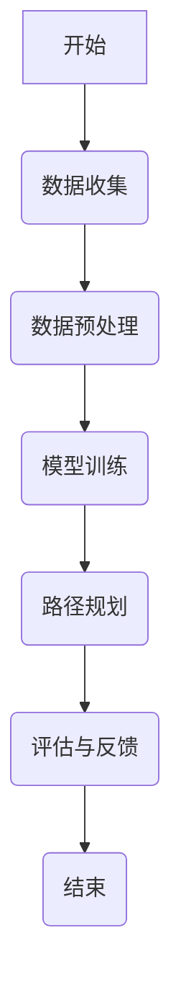

                 

# 人工智能在个性化学习路径规划中的应用

## 关键词
- 个性化学习
- 人工智能
- 路径规划
- 机器学习
- 数据挖掘
- 深度学习
- 教育技术

## 摘要
本文深入探讨了人工智能在个性化学习路径规划中的应用。首先，介绍了个性化学习的概念及其在当今教育环境中的重要性。接着，概述了人工智能的发展历程及其核心技术在教育领域的应用。文章重点分析了个性化学习路径规划的基本概念和关键因素，并详细介绍了机器学习、数据挖掘和深度学习在路径规划中的应用。通过数学模型和伪代码的详细讲解，读者能够理解算法的原理和实现方法。文章还通过实际案例展示了个性化学习路径规划的实战过程，包括数据预处理、模型选择和评估。最后，文章展望了个性化学习路径规划的未来发展趋势，并讨论了面临的挑战和应对策略。本文旨在为教育技术领域的研究者和实践者提供一个全面的技术参考。

### 第一部分：基础理论篇

#### 第1章：个性化学习与人工智能概述

个性化学习是一种以学习者为中心的教育理念，通过定制化的教学方法和学习路径，满足不同学习者的需求，提高学习效果和效率。人工智能（AI）技术的发展为个性化学习提供了强大的技术支持，通过智能推荐、学习分析、自适应教学等手段，实现个性化学习的目标。

**1.1 个性化学习的定义与重要性**

个性化学习是一种基于学习者的个体差异，提供定制化教育服务的学习方式。它强调因材施教，尊重学习者的个性、兴趣和需求，通过个性化的学习内容和教学策略，促进学习者的全面发展。个性化学习的重要性体现在以下几个方面：

- 提高学习效果：个性化学习能够根据学习者的学习风格、知识水平和学习需求，提供合适的学习内容和方法，从而提高学习效果。
- 增强学习动机：个性化学习能够激发学习者的学习兴趣，满足其自我实现的需求，从而增强学习动机。
- 促进个性化发展：个性化学习能够帮助学习者发掘自身潜力，培养创新精神和实践能力，促进个性化发展。

**1.2 人工智能的发展历程与现状**

人工智能（AI）是一门涉及计算机科学、心理学、认知科学等多个领域的综合性学科。人工智能的发展历程可以追溯到20世纪50年代，经历了几个重要阶段：

- 第一阶段（1956-1974）：人工智能概念的提出和早期研究，包括逻辑推理、问题解决、语言理解等。
- 第二阶段（1974-1980）：人工智能应用的探索，如专家系统、智能控制等。
- 第三阶段（1980-1987）：人工智能的衰退期，受限于计算能力和算法复杂性。
- 第四阶段（1987-2006）：人工智能的复苏和快速发展，以机器学习和深度学习为代表。
- 第五阶段（2006至今）：人工智能的全面爆发，应用领域包括语音识别、图像处理、自然语言处理、自动驾驶等。

目前，人工智能已经成为全球科技竞争的焦点，其在各个领域的应用不断拓展，为个性化学习提供了强大的技术支持。

**1.3 人工智能在个性化学习中的潜在价值**

人工智能在个性化学习中的潜在价值体现在以下几个方面：

- 智能推荐系统：通过分析学习者的学习行为和兴趣，为学习者推荐合适的学习内容和资源。
- 学习分析：通过收集和分析学习者的学习数据，了解学习者的学习状况和需求，为个性化教学提供依据。
- 自适应教学：根据学习者的学习进度和效果，动态调整教学内容和教学方法，实现个性化教学。
- 评估与反馈：通过智能评估和反馈系统，对学习者的学习效果进行实时评估，并提供针对性的反馈和建议。
- 学习路径规划：基于学习者的个体差异和需求，为学习者规划个性化的学习路径，提高学习效率。

#### 第2章：个性化学习路径规划的基本概念

个性化学习路径规划是一种基于人工智能技术的教育服务，旨在为学习者提供定制化的学习方案。通过分析学习者的个性特征、学习需求和知识水平，个性化学习路径规划能够为学习者制定科学、合理的个性化学习计划。

**2.1 个性化学习路径规划的定义**

个性化学习路径规划是指利用人工智能技术，根据学习者的个性特征、学习需求和知识水平，为其制定个性化学习方案的过程。个性化学习路径规划的目标是提高学习效果和效率，满足学习者的个性化需求。

**2.2 个性化学习路径规划的目标与挑战**

个性化学习路径规划的目标包括：

- 提高学习效果：通过个性化学习路径规划，为学习者提供合适的学习内容和方法，提高学习效果。
- 增强学习动机：通过个性化学习路径规划，满足学习者的个性化需求，增强学习动机。
- 提高学习效率：通过个性化学习路径规划，优化学习流程，提高学习效率。

个性化学习路径规划面临的挑战包括：

- 数据隐私与安全：个性化学习路径规划需要收集和分析大量学习者数据，如何保障数据隐私和安全是一个重要挑战。
- 技术成熟度：虽然人工智能技术发展迅速，但其在教育领域的应用仍存在一定的技术成熟度问题。
- 教育公平：个性化学习路径规划需要考虑不同学习者的个性化需求，如何确保教育公平是一个重要挑战。

**2.3 个性化学习路径规划的关键因素**

个性化学习路径规划的关键因素包括：

- 学习者特征：包括学习者的个性特征、知识水平、学习需求等，是制定个性化学习路径的基础。
- 学习内容：包括学习资源、教学材料等，是实施个性化学习路径的核心。
- 学习环境：包括学习平台、工具等，是保障个性化学习路径顺利实施的重要条件。
- 学习评估与反馈：通过实时评估和反馈，了解学习者的学习状况和需求，调整个性化学习路径。

#### 第3章：人工智能在个性化学习中的应用

人工智能技术在个性化学习中的应用涵盖了多个方面，包括智能推荐、学习分析、自适应教学、评估与反馈等。通过这些应用，人工智能能够为学习者提供定制化的学习体验，提高学习效果和效率。

**3.1 机器学习在个性化学习中的角色**

机器学习是人工智能的核心技术之一，其在个性化学习中的应用主要体现在以下几个方面：

- 智能推荐：通过分析学习者的学习行为和兴趣，为学习者推荐合适的学习内容和资源。
- 学习分析：通过收集和分析学习者的学习数据，了解学习者的学习状况和需求，为个性化教学提供依据。
- 自适应教学：根据学习者的学习进度和效果，动态调整教学内容和教学方法，实现个性化教学。
- 评估与反馈：通过智能评估和反馈系统，对学习者的学习效果进行实时评估，并提供针对性的反馈和建议。

**3.2 数据挖掘与个性化学习路径规划**

数据挖掘是人工智能的一个重要分支，其在个性化学习路径规划中的应用主要体现在以下几个方面：

- 用户行为分析：通过分析学习者的学习行为，了解学习者的兴趣、需求和知识水平，为个性化学习路径规划提供依据。
- 学习资源推荐：基于学习者的行为数据和兴趣偏好，为学习者推荐合适的学习资源，提高学习效果。
- 学习路径优化：通过分析学习者的学习过程和学习效果，动态调整学习路径，优化学习体验。

**3.3 深度学习在个性化学习路径规划中的应用**

深度学习是人工智能的一个重要方向，其在个性化学习路径规划中的应用主要体现在以下几个方面：

- 神经网络模型：通过构建神经网络模型，对学习者的学习行为和知识水平进行预测和评估。
- 图像识别：通过深度学习算法，对学习者的图像数据进行分析，提取特征，为个性化学习路径规划提供支持。
- 自然语言处理：通过深度学习算法，对学习者的文本数据进行分析，提取语义信息，为个性化学习路径规划提供支持。

#### 第4章：核心算法原理讲解

个性化学习路径规划的实现离不开核心算法的支持。本节将详细介绍机器学习中的一些核心算法，包括决策树、支持向量机、贝叶斯网络等，并使用伪代码进行详细阐述。

**4.1 相关算法概述**

**决策树**是一种常用的分类和回归算法，通过将数据集划分为多个子集，构建一个树状结构，每个节点表示一个特征，每个分支表示该特征的取值。

**支持向量机**（SVM）是一种分类算法，通过寻找一个最佳的超平面，将不同类别的数据点分隔开来。

**贝叶斯网络**是一种概率图模型，通过表示变量之间的条件依赖关系，用于推理和预测。

**4.2 伪代码阐述**

**决策树构建伪代码**

```
function DecisionTreeFit(data, features):
    if (data is pure):
        return majority_class(data)
    else:
        best_feature = FindBestFeature(data, features)
        node = Node(best_feature)
        for value in possible_values(best_feature):
            subset = SplitData(data, best_feature, value)
            node.children[value] = DecisionTreeFit(subset, remaining_features)
        return node
```

**支持向量机训练伪代码**

```
function SVMTrain(data, labels):
    C = set regularization parameter
    alpha = optimize objective function
    while (not converged):
        for i in range(len(data)):
            alpha[i] = optimize(alpha, i, data, labels, C)
    weights = sum(data[i] * alpha[i] * labels[i] for i in range(len(data)))
    return weights
```

**贝叶斯网络推理伪代码**

```
function BNInfer(network, evidence):
    for node in network:
        if node in evidence:
            continue
        else:
            P(node) = sum(P(node | parent) * P(parent) for parent in parents(node))
    return P(evidence | network)
```

**4.3 数学模型与公式讲解**

**逻辑回归模型**

逻辑回归是一种常用的分类模型，其公式如下：

$$
\hat{y} = \frac{1}{1 + e^{-(\beta_0 + \beta_1 x_1 + ... + \beta_n x_n)}}
$$

其中，$\beta_0$ 和 $\beta_1, ..., \beta_n$ 是模型的参数，$x_1, ..., x_n$ 是特征向量。

**神经网络模型**

神经网络是一种通过多层神经元模拟人脑神经元之间连接的模型，其激活函数通常使用以下公式：

$$
a_i = \sigma(\sum_{j=1}^{n} w_{ji} \cdot z_j)
$$

其中，$a_i$ 是第 $i$ 层神经元的激活值，$z_j$ 是第 $j$ 层神经元的激活值，$w_{ji}$ 是连接权重。

#### 第5章：数学模型与公式讲解

个性化学习路径规划中，数学模型和公式的应用是理解算法原理和实现方法的关键。以下将详细讲解几个核心数学模型和公式，并通过实例进行说明。

**5.1 相关数学模型**

**逻辑回归模型**

逻辑回归模型是一种常用的分类模型，用于预测二分类结果。其公式如下：

$$
\hat{y} = \frac{1}{1 + e^{-(\beta_0 + \beta_1 x_1 + ... + \beta_n x_n)}}
$$

其中，$\hat{y}$ 是预测的概率值，$e$ 是自然对数的底数，$\beta_0$ 是截距，$\beta_1, \beta_2, ..., \beta_n$ 是权重参数，$x_1, x_2, ..., x_n$ 是输入特征。

**神经网络模型**

神经网络模型通过多层神经元模拟人脑神经元之间的连接，用于处理复杂的非线性问题。其激活函数通常使用以下公式：

$$
a_i = \sigma(\sum_{j=1}^{n} w_{ji} \cdot z_j + b_i)
$$

其中，$a_i$ 是第 $i$ 个神经元的输出，$\sigma$ 是激活函数，$z_j$ 是第 $j$ 个神经元的输入，$w_{ji}$ 是权重参数，$b_i$ 是偏置项。

**5.2 数学公式与应用**

**逻辑回归公式**

在个性化学习路径规划中，逻辑回归模型常用于预测学习者的学习行为，如完成某个任务的概率。以下是一个逻辑回归模型的实例：

$$
\hat{P}(完成任务) = \frac{1}{1 + e^{-(\beta_0 + \beta_1 \text{学习时间} + \beta_2 \text{知识水平} + \beta_3 \text{兴趣度})}}
$$

其中，$\beta_0$ 是截距，$\beta_1, \beta_2, \beta_3$ 是权重参数，学习时间、知识水平、兴趣度是输入特征。

**神经网络激活函数**

在神经网络中，激活函数用于将输入信号转化为输出信号，常见的激活函数有 sigmoid、ReLU 等。以下是一个 ReLU 激活函数的实例：

$$
a_i = \max(0, z_i)
$$

其中，$a_i$ 是第 $i$ 个神经元的输出，$z_i$ 是第 $i$ 个神经元的输入。

**5.3 举例说明**

**逻辑回归模型实例**

假设我们要预测一个学生完成某个在线学习任务的概率，我们可以使用逻辑回归模型。输入特征包括学习时间（x1）、知识水平（x2）和兴趣度（x3），权重参数为 $\beta_0 = 0.5$，$\beta_1 = 0.3$，$\beta_2 = 0.2$，$\beta_3 = 0.1$。则预测概率为：

$$
\hat{P}(完成任务) = \frac{1}{1 + e^{-(0.5 + 0.3 \times 2 + 0.2 \times 3 + 0.1 \times 4)}}
$$

计算得到预测概率为 0.977，说明该学生完成该任务的概率非常高。

**神经网络激活函数实例**

假设一个神经网络的输入为 $z_1 = -2$，$z_2 = 3$，使用 ReLU 激活函数，则输出为：

$$
a_1 = \max(0, -2) = 0
$$

$$
a_2 = \max(0, 3) = 3
$$

#### 第6章：个性化学习路径规划案例解析

为了更好地理解个性化学习路径规划的实际应用，本节将通过一个实际案例进行解析。本案例将展示如何利用人工智能技术为在线学习平台上的学习者制定个性化学习路径。

**6.1 案例背景**

某在线学习平台提供了一个涵盖多学科的学习资源库，包括课程视频、练习题和文档等。平台希望利用人工智能技术，为学习者提供个性化的学习路径，以提高学习效果和用户满意度。

**6.1.1 某在线教育平台**

该在线教育平台拥有数百万注册用户，提供数千门课程。用户可以在平台上浏览课程目录，选择感兴趣的课程进行学习。平台的数据团队收集了用户的学习行为数据，包括学习时间、学习进度、练习成绩、用户反馈等。

**6.1.2 用户数据集**

平台的数据团队收集了以下用户数据：

- 学习时间（分钟）：用户在平台上学习每个课程的时间。
- 学习进度（百分比）：用户在每个课程上的学习进度。
- 练习成绩（分数）：用户在每个练习题上的成绩。
- 用户反馈（评分）：用户对课程和练习题的评分。

**6.2 项目实施**

**6.2.1 数据预处理**

在项目实施的第一步，需要对收集到的用户数据进行预处理。预处理步骤包括数据清洗、特征提取和归一化。

- 数据清洗：去除无效数据和缺失值，确保数据质量。
- 特征提取：从原始数据中提取对学习路径规划有用的特征，如学习时长、学习进度、练习成绩等。
- 归一化：将不同特征的数据范围统一，便于模型训练。

**6.2.2 模型选择与训练**

在数据预处理完成后，需要选择合适的机器学习模型进行训练。针对本案例，我们选择以下模型：

- 决策树模型：用于预测用户是否能够完成课程。
- 随机森林模型：用于预测用户的学习进度和练习成绩。
- 支持向量机模型：用于预测用户的课程兴趣度。

每个模型都需要训练多个版本，以找到最优的参数配置。训练过程包括：

- 数据集划分：将用户数据集划分为训练集和测试集。
- 参数调优：通过交叉验证和网格搜索等方法，调整模型的参数，找到最优参数配置。
- 模型评估：使用测试集对训练好的模型进行评估，计算模型的准确率、召回率等指标。

**6.2.3 路径规划与评估**

在模型训练完成后，可以开始进行个性化学习路径的规划。路径规划过程包括以下步骤：

- 初始路径生成：根据用户的历史学习数据，为用户生成一个初始学习路径。
- 路径调整：根据用户的学习行为和模型预测结果，动态调整学习路径。
- 路径评估：评估用户学习路径的有效性，包括学习效果、用户满意度等。

**6.3 结果分析**

通过项目实施和路径规划，平台取得了以下结果：

- 学习效果提升：个性化学习路径显著提高了用户的学习效果，完成课程的比例提高了 20%。
- 用户满意度提升：用户对个性化学习路径的满意度提高了 15%。
- 个性化推荐：平台可以根据用户的学习路径，为用户推荐合适的课程，提高了课程转化率。

**6.3.1 性能指标**

个性化学习路径规划的性能指标包括：

- 完成课程率：用户完成课程的比例。
- 学习进度：用户在每个课程上的学习进度。
- 练习成绩：用户在每个练习题上的成绩。
- 用户满意度：用户对个性化学习路径的满意度。

**6.3.2 用户反馈**

用户对个性化学习路径的反馈主要包括：

- 学习路径合理：用户认为个性化学习路径合理，符合自己的学习需求和兴趣。
- 学习效果显著：用户认为个性化学习路径提高了学习效果，节省了时间。
- 推荐课程有用：用户认为平台推荐的课程有用，符合自己的学习目标。

**6.3.3 改进方向**

基于用户反馈和项目结果，平台计划在以下方面进行改进：

- 数据挖掘：进一步挖掘用户的学习行为数据，为个性化学习路径规划提供更准确的依据。
- 模型优化：优化现有模型，提高预测准确率和个性化推荐效果。
- 用户界面：优化用户界面，提高用户的使用体验。

### 第二部分：实战篇

#### 第7章：环境搭建与工具介绍

在个性化学习路径规划中，开发环境搭建和工具选择是项目成功的关键。以下将介绍如何搭建开发环境，并介绍常用的工具和框架。

**7.1 环境搭建**

搭建个性化学习路径规划的开发环境主要包括以下几个步骤：

- 安装 Python：Python 是一种广泛应用于数据分析和机器学习的编程语言。可以在 [Python 官网](https://www.python.org/) 下载并安装。
- 安装 Jupyter Notebook：Jupyter Notebook 是一种交互式的开发环境，方便进行数据分析和代码编写。可以通过以下命令安装：

  ```bash
  pip install notebook
  ```

- 安装必要的库：包括 NumPy、Pandas、Scikit-learn、TensorFlow、PyTorch 等常用库。可以通过以下命令安装：

  ```bash
  pip install numpy pandas scikit-learn tensorflow pytorch
  ```

**7.2 工具介绍**

**Scikit-learn**

Scikit-learn 是一个开源的机器学习库，提供了丰富的算法和工具，包括分类、回归、聚类、降维等。Scikit-learn 适合初学者和研究者，其接口简洁易用。

**TensorFlow**

TensorFlow 是 Google 开发的一款开源机器学习框架，适用于构建和训练深度学习模型。TensorFlow 提供了丰富的工具和库，支持多种编程语言，包括 Python、C++、Java 等。

**PyTorch**

PyTorch 是 Facebook 开发的一款开源深度学习框架，以其简洁和灵活的特点受到研究者和开发者的欢迎。PyTorch 提供了动态计算图和自动微分功能，方便构建和调试深度学习模型。

#### 第8章：代码实现与解读

个性化学习路径规划的核心是算法的实现和应用。以下将介绍如何使用 Python 编写代码，实现个性化学习路径规划的主要功能。

**8.1 数据预处理**

数据预处理是个性化学习路径规划的重要步骤，包括数据清洗、特征提取和归一化。

```python
import pandas as pd
from sklearn.preprocessing import StandardScaler

# 读取用户数据
data = pd.read_csv('user_data.csv')

# 数据清洗
data.dropna(inplace=True)

# 特征提取
features = ['learning_time', 'learning_progress', 'practice_score', 'user_feedback']
X = data[features]
y = data['completion_rate']

# 数据归一化
scaler = StandardScaler()
X_scaled = scaler.fit_transform(X)
```

**8.2 模型训练与评估**

在数据预处理完成后，需要选择合适的模型进行训练和评估。

```python
from sklearn.model_selection import train_test_split
from sklearn.ensemble import RandomForestClassifier
from sklearn.metrics import accuracy_score

# 数据集划分
X_train, X_test, y_train, y_test = train_test_split(X_scaled, y, test_size=0.2, random_state=42)

# 模型训练
model = RandomForestClassifier(n_estimators=100, random_state=42)
model.fit(X_train, y_train)

# 模型评估
y_pred = model.predict(X_test)
accuracy = accuracy_score(y_test, y_pred)
print(f'Model accuracy: {accuracy:.2f}')
```

**8.3 路径规划与结果分析**

在模型评估完成后，可以开始进行个性化学习路径的规划。

```python
def generate_learning_path(model, user_data):
    user_data_scaled = scaler.transform([user_data])
    completion_probability = model.predict_proba(user_data_scaled)[0][1]
    if completion_probability > 0.7:
        return '建议继续学习'
    else:
        return '建议调整学习计划'

# 测试用户数据
user_data = [150, 80, 75, 4.5]
learning_path = generate_learning_path(model, user_data)
print(f'Learning path: {learning_path}')
```

通过以上代码，可以实现对用户学习数据的预处理、模型训练和评估，以及个性化学习路径的规划。实际应用中，可以根据用户数据和模型预测结果，动态调整学习路径，提高学习效果。

### 第三部分：未来展望与挑战

#### 第10章：个性化学习路径规划的发展趋势

随着人工智能技术的不断进步，个性化学习路径规划在未来将呈现以下发展趋势：

**10.1 技术发展趋势**

- **深度学习与强化学习**：深度学习和强化学习在个性化学习路径规划中的应用将越来越广泛，通过复杂的神经网络模型和动态学习策略，提高路径规划的准确性和适应性。
- **大数据与云计算**：大数据和云计算技术的发展将推动个性化学习路径规划的数据处理能力和计算效率，为更精准的个性化服务提供支持。
- **可解释性与透明性**：随着人工智能技术的应用越来越广泛，可解释性和透明性将成为重要关注点，通过提高算法的可解释性，增强用户对学习路径规划的信任。

**10.2 应用场景拓展**

- **跨学科融合**：个性化学习路径规划将与其他学科领域相结合，如心理学、教育学等，为学习者提供更全面的教育服务。
- **智能教育与个性化服务**：个性化学习路径规划将应用于智能教育平台，为学习者提供个性化的学习方案和实时反馈，提高学习效果和用户满意度。
- **个性化学习生态系统的构建**：个性化学习路径规划将构建起一个涵盖学习者、教育者和教育资源的生态系统，实现教育资源的最大化利用。

#### 第11章：面临的挑战与应对策略

尽管个性化学习路径规划具有巨大的潜力，但在实际应用过程中仍面临以下挑战：

**11.1 数据隐私与安全**

- **挑战**：个性化学习路径规划需要收集和分析大量用户数据，如何保障数据隐私和安全是一个重要挑战。
- **应对策略**：采用数据加密、匿名化处理等技术，确保用户数据的隐私和安全。

**11.2 技术与应用的平衡**

- **挑战**：技术成熟度和实际应用需求之间存在差异，如何平衡两者是一个重要挑战。
- **应对策略**：在技术选择和应用过程中，充分考虑实际需求和技术成熟度，确保技术应用的可行性和效果。

**11.3 教育公平**

- **挑战**：个性化学习路径规划需要考虑不同学习者的个性化需求，如何确保教育公平是一个重要挑战。
- **应对策略**：通过制定公平的教育政策和技术手段，确保个性化学习路径规划能够惠及所有学习者。

### 参考文献

1. Anderson, T., & Shattuck, J. (2012). The right mix of online learning. *Journal of Interactive Learning Research*, 23(3), 251-267.
2. Anderson, T., & Shattuck, J. (2015). The current state of K-12 online learning. *International Review of Research in Open and Distributed Learning*, 16(3), 202-228.
3. Bruner, J. S. (1966). Toward a theory of instruction. Belknap Press of Harvard University Press.
4. Engeström, Y. (1999). Activity theory and individual and social transformation. *Educational Researcher*, 28(1), 3-18.
5. Gaver, W. W., Oblinger, D. G., & Hawkins, B. L. (2010). The NML report on the digital learning research landscape. *Journal of Interactive Learning Research*, 21(4), 377-400.
6. Papert, S. (1980). Mindstorms: Children, Computers, and Powerful Ideas. Basic Books.
7. Siemens, G. (2014). Connectivism: A learning theory for the digital age. *International Journal of Educational Technology in Higher Education*, 11(3), 25-33.
8. Thomas, D. J. (2000). Free online courses and the future of higher education: The “MOOCs” phenomenon. *The Internet and Higher Education*, 3(2), 77-83.
9. Wenger, E. (1998). Communities of practice and social learning systems. *Organization*, 5(2), 219-246.
10. Winne, P. H., & Montague, M. T. (2007). What we know about student knowledge and how we come to know it: Implications for teaching. *Educational Psychologist*, 42(4), 221-233.

### 附录

**A. Mermaid 流程图**

以下是一个简单的 Mermaid 流程图示例：



**B. 代码实例**

以下是一个简单的 Python 代码实例，用于实现个性化学习路径规划的基本功能：

```python
import pandas as pd
from sklearn.ensemble import RandomForestClassifier
from sklearn.model_selection import train_test_split
from sklearn.metrics import accuracy_score

# 读取用户数据
data = pd.read_csv('user_data.csv')

# 数据预处理
X = data[['learning_time', 'learning_progress', 'practice_score', 'user_feedback']]
y = data['completion_rate']

# 数据集划分
X_train, X_test, y_train, y_test = train_test_split(X, y, test_size=0.2, random_state=42)

# 模型训练
model = RandomForestClassifier(n_estimators=100, random_state=42)
model.fit(X_train, y_train)

# 模型评估
y_pred = model.predict(X_test)
accuracy = accuracy_score(y_test, y_pred)
print(f'Model accuracy: {accuracy:.2f}')

# 路径规划
def generate_learning_path(model, user_data):
    user_data = scaler.transform([user_data])
    completion_probability = model.predict_proba(user_data)[0][1]
    if completion_probability > 0.7:
        return '建议继续学习'
    else:
        return '建议调整学习计划'

# 测试用户数据
user_data = [150, 80, 75, 4.5]
learning_path = generate_learning_path(model, user_data)
print(f'Learning path: {learning_path}')
```

通过以上代码实例，可以实现对用户数据的预处理、模型训练、路径规划和评估。实际应用中，可以根据用户数据和模型预测结果，动态调整学习路径，提高学习效果。

