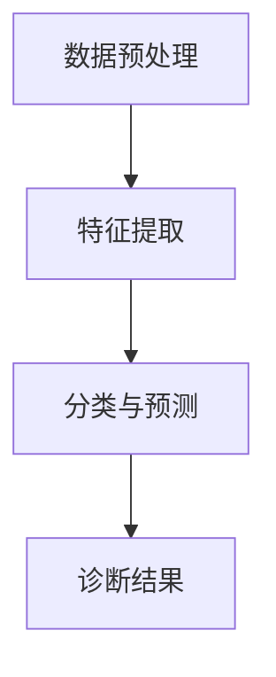
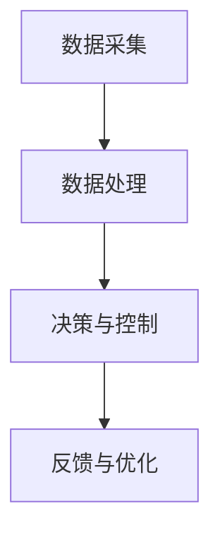
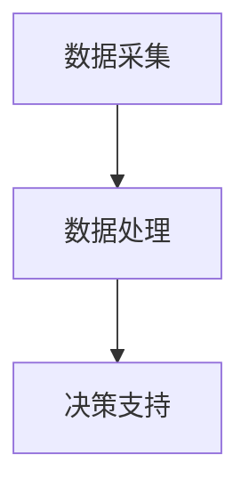
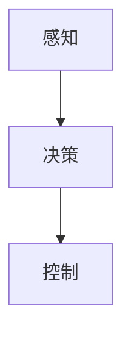
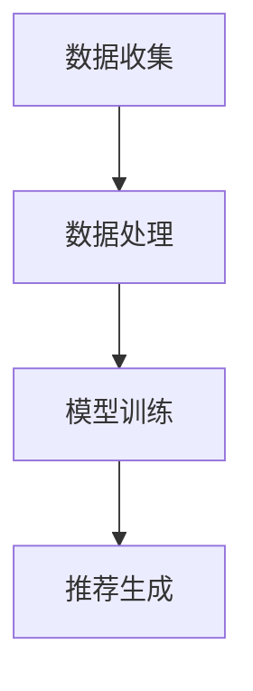
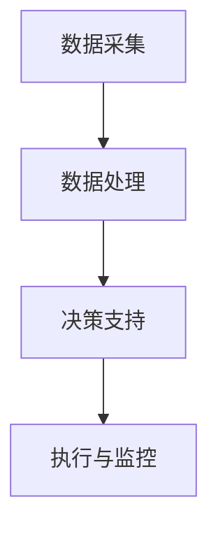

                 

## 文章标题

> **关键词**：人工智能、机器学习、行业应用、深度学习、数据挖掘

> **摘要**：
本篇文章将深入探讨人工智能在各行业中的应用，通过详细的分析和案例分析，揭示人工智能如何改变医疗、金融、制造业、农业、交通运输、零售与物流等领域。我们将探讨人工智能的基础理论、核心算法原理、项目实战，并讨论其面临的挑战与未来发展趋势。

在当今这个技术飞速发展的时代，人工智能已经成为各行各业的重要驱动力。从医疗到金融，从制造业到农业，人工智能正在重塑各个行业的面貌，提升效率和生产力。本文将带领读者深入了解人工智能在各行业的应用，以期为大家提供宝贵的见解和思考。

----------------------------------------------------------------

### 人工智能在各行业的应用概述

人工智能（AI）是一个多学科交叉的领域，它结合了计算机科学、数学、统计学、认知科学等多个学科的知识，致力于让计算机系统具备类似于人类的智能。近年来，随着计算能力的提升、大数据技术的发展以及深度学习算法的突破，人工智能已经取得了显著的进步，并开始在多个行业中得到广泛应用。

在医疗行业，人工智能通过图像识别、数据分析等技术，实现了疾病的早期诊断和个性化治疗。在金融行业，人工智能被用于风险评估、欺诈检测、智能投资等领域，提高了金融系统的效率和安全性。制造业中，人工智能通过智能制造系统，实现了生产过程的自动化和优化。在农业领域，人工智能的应用使得农业监测、智能灌溉和产量预测成为可能。交通运输领域，自动驾驶技术、智能交通管理系统等人工智能应用正在逐渐成熟。此外，人工智能在零售与物流行业也发挥着重要作用，如智能推荐系统、智能仓储与物流调度等。

人工智能在各行业的应用不仅提升了行业的效率和生产能力，还为人类带来了前所未有的便利。然而，随着人工智能技术的不断发展，也带来了一系列的挑战和伦理问题，如隐私保护、就业市场变化、不公平性等。因此，理解和应对这些挑战，对于推动人工智能的健康发展和广泛应用具有重要意义。

本文将按照以下结构展开：

1. **第一部分：人工智能概述与基础**：介绍人工智能的定义、发展历程、核心领域和技术。
2. **第二部分：人工智能在各行业的应用**：详细探讨人工智能在医疗、金融、制造业、农业、交通运输、零售与物流等行业的应用。
3. **第三部分：人工智能的挑战与未来发展趋势**：讨论人工智能面临的伦理和社会问题，以及未来可能的发展趋势。

通过本文的阅读，读者将能够全面了解人工智能在各行业的应用现状、挑战与未来趋势，为相关领域的研究和实践提供有益的参考。

### 人工智能的定义与历史发展

人工智能（Artificial Intelligence，简称AI）是计算机科学的一个分支，旨在使计算机系统具备执行复杂任务的能力，这些任务通常需要人类智能才能完成。人工智能的定义可以追溯到1956年的达特茅斯会议，当时约翰·麦卡锡（John McCarthy）等人首次提出了“人工智能”这一概念。会议的目的是探讨如何通过机器模拟人类智能来解决问题。

#### 定义与分类

根据其实现方式和功能，人工智能可以分为几种不同的类型：

1. **弱人工智能**（Weak AI）：也称为狭义人工智能，这类人工智能专注于特定任务，如语音识别、图像识别等。它们无法进行泛化，只能在特定领域内工作。

2. **强人工智能**（Strong AI）：也称为通用人工智能（AGI），这类人工智能具备人类智能的所有能力，能够在各种不同的情况下进行学习和推理。目前，强人工智能还没有实现，仍处于理论研究和探索阶段。

3. **窄域人工智能**（Narrow AI）：这类人工智能专注于特定领域，如医疗诊断、金融分析等。它们通过深度学习和大数据分析等技术，在特定领域内表现出色。

4. **自适应人工智能**（Adaptive AI）：这类人工智能能够根据环境的变化和数据的更新，自主调整和优化其行为和决策。

#### 发展历程

人工智能的发展历程可以分为以下几个阶段：

1. **初期探索（1956年-1969年）**：在这一阶段，人工智能领域开始兴起，研究人员致力于构建能够模拟人类思维的计算机程序。这一阶段的主要成就是开发了一些简单的推理系统和问题求解器。

2. **人工智能寒冬（1970年-1980年）**：由于技术限制和实际应用中的困难，人工智能研究进入了一个低谷期，被称为“人工智能寒冬”。

3. **复兴时期（1980年-1990年）**：专家系统的出现使得人工智能再次受到关注。专家系统是一种基于规则的人工智能系统，能够在特定领域内提供专家级决策。

4. **机器学习的兴起（1990年-2000年）**：机器学习成为人工智能研究的主流方法，特别是在统计学习理论的推动下，神经网络和决策树等算法得到了广泛应用。

5. **深度学习的革命（2006年至今）**：2006年，深度学习算法的提出标志着人工智能进入了一个新的阶段。深度学习通过多层神经网络模拟人脑的学习过程，实现了在图像识别、语音识别等领域的突破性进展。

#### 核心领域与技术

人工智能的核心领域包括：

1. **机器学习**：机器学习是一种通过数据驱动的方法，使计算机系统自动改进其性能的技术。常见的机器学习算法包括线性回归、决策树、支持向量机、神经网络等。

2. **自然语言处理**：自然语言处理旨在使计算机能够理解和处理人类语言。该领域涉及语音识别、文本分类、机器翻译等任务。

3. **计算机视觉**：计算机视觉致力于使计算机能够理解和处理视觉信息。该领域涉及图像识别、目标检测、图像分割等任务。

4. **专家系统**：专家系统是一种基于知识表示和推理的人工智能系统，能够在特定领域内提供专家级别的决策。

5. **强化学习**：强化学习是一种通过试错和奖励机制，使计算机系统学习如何在复杂环境中做出最优决策的方法。

总的来说，人工智能的发展历程是一个不断探索、突破和进步的过程。随着技术的不断进步和应用场景的不断扩展，人工智能在未来将会带来更多的变革和机遇。

#### 人工智能的应用领域

人工智能（AI）在现代社会中的应用已经渗透到了多个行业，带来了巨大的变革和创新。以下是人工智能在医疗、金融、制造业、农业、交通运输和零售与物流等领域的具体应用：

1. **医疗行业**

   - **医疗图像分析**：通过深度学习算法，人工智能系统能够对医学影像（如X光、CT、MRI等）进行自动分析，帮助医生识别病变区域，提高诊断准确性。例如，Google的DeepMind团队开发了一个名为“DeepMind Health”的系统，能够准确识别皮肤癌、乳腺癌等疾病。

   - **辅助诊断系统**：人工智能系统可以分析患者的病历、实验室检测结果和其他医疗数据，提供辅助诊断建议。IBM的Watson for Oncology是一个典型的例子，它可以帮助医生制定个性化的治疗方案。

   - **个性化治疗**：通过分析大量的医学数据和临床试验结果，人工智能系统能够为患者提供最合适的治疗方案。例如，MedAware系统通过分析患者的药物使用记录，提供关于药物副作用和药物相互作用的风险评估。

2. **金融行业**

   - **风险评估**：人工智能技术能够分析大量的金融数据和市场信息，预测风险并制定风险管理策略。例如，J.P. Morgan的COiN系统可以自动分析合同，识别潜在的违约风险。

   - **欺诈检测**：人工智能系统能够识别异常交易模式和行为，及时发现并阻止欺诈行为。例如，FICO的欺诈检测系统在全球范围内被广泛使用。

   - **智能投资**：通过分析历史数据和市场趋势，人工智能系统能够提供投资建议，实现自动化交易。例如，Portfolio Grader系统通过分析市场数据，为投资者提供买卖建议。

3. **制造业**

   - **智能制造系统**：人工智能技术被用于制造过程的自动化和优化。例如，西门子的数字双生系统（Digital Twin）通过模拟和预测，帮助制造商优化生产流程。

   - **产品质量检测**：人工智能系统能够自动检测生产过程中出现的产品缺陷，提高产品质量。例如，特斯拉使用计算机视觉系统来检测生产线上装配的缺陷。

   - **生产调度与优化**：人工智能算法能够优化生产计划，提高生产效率和资源利用率。例如，西门子的SIMATIC IT软件可以帮助制造商优化生产流程。

4. **农业**

   - **智能监测系统**：通过传感器和物联网技术，人工智能系统能够实时监测农田的环境参数（如土壤湿度、温度、光照等），为精准农业提供数据支持。例如，Agribotix的系统可以监测农田，识别病虫害，并提供灌溉建议。

   - **智能灌溉系统**：基于环境数据和作物需求，人工智能系统能够自动调整灌溉时间和水量，实现精准灌溉。例如，Valentis的系统通过数据分析，为农田提供智能灌溉方案。

   - **农业产量预测**：通过分析历史气候数据、土壤条件和种植习惯，人工智能系统能够预测农作物的产量，帮助农民做出种植决策。例如，Climate Corporation的系统通过数据分析，提供农作物产量预测。

5. **交通运输**

   - **自动驾驶技术**：通过计算机视觉、传感器融合和深度学习算法，自动驾驶技术正逐步实现商业化。例如，Waymo的自动驾驶汽车已经在多个城市进行测试和运营。

   - **智能交通管理系统**：人工智能技术能够优化交通信号控制、交通流量预测和道路规划，提高交通效率。例如，Carnegie Mellon大学的Carnegie Mellon Urban Traffic Analytics（CUTRA）系统可以实时分析交通数据，优化交通信号。

   - **航空航天领域的AI应用**：人工智能技术在航空航天领域也得到了广泛应用，如无人机自主飞行、卫星图像分析等。例如，NASA的火星探测车使用人工智能技术进行自主导航和科学实验。

6. **零售与物流**

   - **智能推荐系统**：基于用户的购物历史和行为数据，人工智能系统能够为用户提供个性化的商品推荐。例如，亚马逊的推荐系统通过分析用户数据，提供个性化的购物建议。

   - **智能仓储与物流调度**：通过自动化设备和人工智能算法，零售和物流行业可以实现更高效的仓储管理和物流调度。例如，亚马逊的Kiva系统通过机器人自动化仓库管理，提高了仓储效率。

   - **供应链优化**：人工智能技术能够优化供应链管理，提高供应链的灵活性和响应速度。例如，DHL的TradeFlowFactory系统通过数据分析，提供供应链优化建议。

总的来说，人工智能在各行业的应用不仅提升了效率和生产力，还带来了更智能化和自动化的解决方案。随着技术的不断进步，人工智能在未来将继续在各行各业中发挥重要作用。

### 人工智能在医疗行业的应用

人工智能在医疗行业的应用已经逐渐成为推动医疗技术进步的重要力量。通过先进的算法和数据处理技术，人工智能在疾病诊断、个性化治疗和医疗资源管理等方面展现出了巨大的潜力。

#### 疾病诊断

在医疗诊断领域，人工智能主要通过图像识别和数据分析技术实现。例如，通过深度学习算法，计算机可以自动分析医学影像，如X光片、CT扫描和MRI图像，从而识别异常区域和病变。这种方法不仅提高了诊断的准确性，还大大缩短了诊断时间。

**核心概念与联系**

在疾病诊断中，核心概念包括：

- **深度学习**：深度学习是通过多层神经网络模拟人脑处理信息的方式，能够从大量数据中学习模式和特征。
- **卷积神经网络（CNN）**：卷积神经网络是深度学习中的一种常见架构，特别适合处理图像数据。

**架构原理**

深度学习在医学图像分析中的应用通常包括以下几个步骤：

1. **数据预处理**：包括图像的标准化、增强和分割。
2. **特征提取**：通过卷积层提取图像中的局部特征。
3. **分类与预测**：利用全连接层进行分类和预测。

**Mermaid 流程图**



#### 辅助诊断系统

辅助诊断系统是人工智能在医疗领域的重要应用之一。这些系统通过分析患者的病历、实验室检测结果和其他医疗数据，提供辅助诊断建议。

**核心算法原理讲解**

辅助诊断系统通常基于以下算法：

- **机器学习分类算法**：如决策树、支持向量机和随机森林等，用于分类和预测。
- **神经网络**：用于建立复杂的非线性模型。

**机器学习分类算法的伪代码**

```python
# 决策树分类算法伪代码
def classify_decision_tree(data, target_attribute):
    if data is empty:
        return majority_vote(target_attribute)
    else:
        choose_attribute = choose_best_attribute(data)
        left_child = classify_decision_tree(split_data(data, choose_attribute, "left"))
        right_child = classify_decision_tree(split_data(data, choose_attribute, "right"))
        return Node(choose_attribute, left_child, right_child)
```

#### 医疗数据分析

医疗数据分析是人工智能在医疗领域的另一个重要应用。通过分析大量的医疗数据，人工智能可以识别出潜在的健康问题、流行病的爆发趋势和治疗效果。

**数学模型和公式**

在医疗数据分析中，常用的数学模型包括：

- **时间序列模型**：用于分析连续时间上的数据，如疾病发生趋势。
- **回归模型**：用于分析不同变量之间的关系。

**举例说明**

例如，通过时间序列模型分析某地区近10年的流感数据，可以预测下一年流感的流行情况，为公共卫生决策提供依据。

```latex
y_t = \beta_0 + \beta_1 y_{t-1} + \epsilon_t
```

#### 项目实战

**开发环境搭建**

要实现上述人工智能在医疗领域的应用，需要搭建一个合适的开发环境。通常，开发者会使用Python作为主要编程语言，并借助TensorFlow、PyTorch等深度学习框架进行模型训练和部署。

```python
# 安装TensorFlow
pip install tensorflow

# 安装PyTorch
pip install torch torchvision
```

**源代码详细实现**

以下是一个简单的深度学习模型训练的代码示例：

```python
import torch
import torchvision
import torch.nn as nn
import torch.optim as optim

# 数据预处理
transform = torchvision.transforms.Compose([
    torchvision.transforms.ToTensor(),
    torchvision.transforms.Normalize((0.5,), (0.5,))
])

# 加载数据集
train_data = torchvision.datasets.MNIST(
    root='./data', 
    train=True, 
    transform=transform, 
    download=True)

train_loader = torch.utils.data.DataLoader(
    train_data, 
    batch_size=64, 
    shuffle=True)

# 定义模型
model = nn.Sequential(
    nn.Conv2d(1, 20, 5),
    nn.ReLU(),
    nn.Conv2d(20, 64, 5),
    nn.ReLU(),
    nn.Flatten(),
    nn.Dropout(),
    nn.Linear(64 * 7 * 7, 128),
    nn.ReLU(),
    nn.Linear(128, 10)
)

# 损失函数和优化器
criterion = nn.CrossEntropyLoss()
optimizer = optim.Adam(model.parameters(), lr=0.001)

# 训练模型
for epoch in range(10):
    running_loss = 0.0
    for i, data in enumerate(train_loader, 0):
        inputs, labels = data
        optimizer.zero_grad()
        outputs = model(inputs)
        loss = criterion(outputs, labels)
        loss.backward()
        optimizer.step()
        running_loss += loss.item()
    print(f'Epoch {epoch+1}, Loss: {running_loss/len(train_loader)}')

print('Finished Training')

# 测试模型
with torch.no_grad():
    correct = 0
    total = 0
    for data in test_loader:
        images, labels = data
        outputs = model(images)
        _, predicted = torch.max(outputs.data, 1)
        total += labels.size(0)
        correct += (predicted == labels).sum().item()

print(f'Accuracy: {100 * correct / total} %')
```

**代码解读与分析**

上述代码实现了一个简单的卷积神经网络模型，用于手写数字识别。首先，通过数据预处理将图像数据转换为适合模型训练的格式。然后，定义一个卷积神经网络模型，并选择交叉熵损失函数和Adam优化器进行模型训练。在训练过程中，通过反向传播算法更新模型参数，并打印每个epoch的损失值。最后，通过测试集评估模型的准确性。

**实战总结**

通过上述实战，开发者可以了解如何使用深度学习框架实现医疗数据分析模型。在实际应用中，开发者需要根据具体的医疗数据特点和需求，选择合适的模型结构和训练策略，以提高模型的诊断准确性和效率。

总的来说，人工智能在医疗行业的应用具有广阔的前景和巨大的潜力。通过不断的研究和实践，人工智能将能够为医疗行业带来更多的创新和进步，为患者提供更优质和个性化的医疗服务。

### 人工智能在金融行业的应用

人工智能在金融行业的应用已经逐渐成为金融科技（FinTech）发展的重要驱动力，它通过先进的算法和数据分析技术，显著提升了金融服务的效率、安全性和个性化水平。以下是人工智能在金融行业的主要应用领域：

#### 风险评估与欺诈检测

在金融行业中，风险管理和欺诈检测是至关重要的任务。人工智能技术能够通过分析大量的历史交易数据、用户行为数据和宏观经济数据，预测潜在的风险和欺诈行为。

**核心算法原理讲解**

1. **欺诈检测**：
   - **机器学习分类算法**：例如，逻辑回归、支持向量机和决策树等算法被用于构建欺诈检测模型。这些模型通过学习正常交易行为和异常交易行为之间的特征差异，能够准确识别欺诈交易。
   - **神经网络**：深度学习算法如卷积神经网络（CNN）和循环神经网络（RNN）在处理复杂的非线性数据和模式识别任务中表现出色。这些算法能够自动提取交易数据中的潜在特征，从而提高欺诈检测的准确性。

**机器学习分类算法的伪代码**

```python
# 逻辑回归算法伪代码
def logistic_regression(X, y):
    # 初始化模型参数
    weights = initialize_weights(X.shape[1])

    # 梯度下降法迭代更新参数
    for epoch in range(num_epochs):
        predictions = sigmoid(np.dot(X, weights))
        loss = -1 / m * sum(y * log(predictions) + (1 - y) * log(1 - predictions))
        dW = 1 / m * (np.dot(X.T, (predictions - y)))

        # 更新权重
        weights -= learning_rate * dW

    return weights

# 梯度下降法
def gradient_descent(X, y, weights, learning_rate, num_iterations):
    for iteration in range(num_iterations):
        predictions = sigmoid(np.dot(X, weights))
        dW = 1 / m * (np.dot(X.T, (predictions - y)))
        weights -= learning_rate * dW
    return weights

# 激活函数（sigmoid函数）
def sigmoid(z):
    return 1 / (1 + np.exp(-z))
```

2. **风险评估**：
   - **时间序列模型**：例如，ARIMA（自回归积分滑动平均模型）和GARCH（广义自回归条件异方差模型）等时间序列模型被用于预测金融市场波动和风险。
   - **随机过程和蒙特卡罗模拟**：这些模型通过模拟不同市场情景下的金融资产价格波动，帮助金融机构进行风险评估和风险管理。

**数学模型和公式**

例如，在时间序列分析中，常用的ARIMA模型公式如下：

```latex
y_t = c + \phi_1 y_{t-1} + \phi_2 y_{t-2} + ... + \phi_p y_{t-p} + \theta_1 e_{t-1} + \theta_2 e_{t-2} + ... + \theta_q e_{t-q} + e_t
```

其中，\( y_t \) 是时间序列的当前值，\( \phi \) 和 \( \theta \) 是模型参数，\( e_t \) 是误差项。

**举例说明**

假设一个金融机构使用逻辑回归模型进行欺诈检测。训练数据集包含历史交易数据，每个交易都有是否为欺诈的标签。通过训练，模型学会了识别交易中的潜在特征，如交易金额、交易时间、地理位置等。在检测新交易时，模型会根据这些特征计算出一个概率值，如果该概率值超过设定阈值，则认为该交易可能是欺诈。

#### 个性化金融服务

人工智能还能够通过分析用户数据，提供个性化的金融服务，如个性化投资建议、个性化理财产品等。

**核心算法原理讲解**

1. **协同过滤**：协同过滤是一种基于用户行为数据（如购买历史、评分等）进行推荐的方法。它通过寻找相似的用户或物品，为用户推荐他们可能感兴趣的产品或服务。
2. **内容推荐**：内容推荐通过分析产品或服务的属性（如价格、品牌、功能等），为用户提供个性化的推荐。

**协同过滤算法的伪代码**

```python
# 基于用户的协同过滤算法伪代码
def collaborative_filtering(train_data, user_id, k):
    similar_users = find_similar_users(train_data, user_id, k)
    user_average_rating = calculate_average_rating(train_data, user_id)
    predictions = {}
    
    for user in similar_users:
        user_average_rating = calculate_average_rating(train_data, user)
        for item in user_rated_items(user):
            if item not in user_average_rating:
                prediction = user_average_rating + similarity_weight(similar_users, user, item)
                predictions[item] = prediction
                
    return predictions
```

**举例说明**

假设一个在线投资平台使用协同过滤算法为用户推荐理财产品。首先，系统会分析用户的投资历史和偏好，找到与该用户相似的其他用户。然后，系统会根据这些相似用户的投资决策，为该用户推荐他们认为可能合适的理财产品。这种推荐方法不仅考虑了用户的个人偏好，还利用了社区的知识和经验。

#### 项目实战

**开发环境搭建**

为了实现人工智能在金融行业的应用，开发者需要搭建一个强大的开发环境。常用的工具和技术包括：

- **Python**：作为主要编程语言。
- **TensorFlow**、**PyTorch**、**scikit-learn**：用于机器学习和深度学习模型训练和部署。
- **Jupyter Notebook**：用于数据分析和模型调试。

```python
# 安装所需的库
pip install tensorflow numpy pandas sklearn matplotlib
```

**源代码详细实现**

以下是一个简单的欺诈检测模型实现的代码示例：

```python
import pandas as pd
from sklearn.model_selection import train_test_split
from sklearn.linear_model import LogisticRegression
from sklearn.metrics import accuracy_score

# 加载数据集
data = pd.read_csv('transaction_data.csv')
X = data.drop(['is_fraud'], axis=1)
y = data['is_fraud']

# 数据预处理
X = (X - X.mean()) / X.std()
X_train, X_test, y_train, y_test = train_test_split(X, y, test_size=0.2, random_state=42)

# 训练模型
model = LogisticRegression()
model.fit(X_train, y_train)

# 预测测试集
predictions = model.predict(X_test)

# 评估模型
accuracy = accuracy_score(y_test, predictions)
print(f'Accuracy: {accuracy * 100:.2f}%')
```

**代码解读与分析**

上述代码实现了一个简单的逻辑回归模型用于欺诈检测。首先，从CSV文件中加载数据，并对特征进行标准化处理。然后，使用训练集训练逻辑回归模型，并在测试集上进行预测。最后，通过计算准确率来评估模型的性能。

**实战总结**

通过上述实战，开发者可以了解如何使用机器学习算法进行欺诈检测和风险评估。在实际应用中，开发者需要根据具体的业务需求和数据特点，选择合适的算法和模型，并进行参数调优，以提高模型的准确性和稳定性。

总的来说，人工智能在金融行业的应用不仅提高了金融服务的效率和安全，还为金融机构提供了更多创新的业务模式。随着技术的不断进步，人工智能将在金融领域发挥越来越重要的作用。

### 人工智能在制造业的应用

人工智能在制造业中的应用正逐步深入，通过智能化和自动化技术，极大地提升了生产效率、产品质量和资源利用率。以下是人工智能在制造业中的主要应用领域：

#### 智能制造系统

智能制造系统是人工智能在制造业的核心应用，通过将传感器、机器学习和物联网技术相结合，实现生产过程的智能化和自动化。

**核心概念与联系**

智能制造系统的核心概念包括：

- **物联网（IoT）**：通过传感器和设备联网，实现实时数据采集和监控。
- **机器学习**：利用大数据分析技术，从生产数据中提取有价值的信息，优化生产过程。
- **人工智能算法**：如深度学习、强化学习等，用于决策和预测。

**架构原理**

智能制造系统的架构通常包括以下几个部分：

1. **数据采集**：通过传感器和设备收集生产过程中的数据，如温度、压力、速度等。
2. **数据处理**：利用机器学习算法，对采集到的数据进行处理和分析，提取有价值的信息。
3. **决策与控制**：根据分析结果，智能系统会做出相应的决策，并控制生产过程，以优化生产效率和产品质量。
4. **反馈与优化**：通过持续的数据反馈和优化，不断提升系统的智能化水平。

**Mermaid 流程图**



#### 产品质量检测

产品质量检测是制造业中至关重要的一环，人工智能通过图像识别和数据分析技术，实现了对产品质量的实时检测和自动分类。

**核心算法原理讲解**

1. **图像识别**：利用卷积神经网络（CNN）对生产过程中拍摄的产品图像进行分类和识别，以检测是否存在缺陷。
2. **特征工程**：通过对图像数据进行特征提取和降维，提高图像识别的效率和准确性。

**卷积神经网络（CNN）的伪代码**

```python
# 卷积神经网络（CNN）的伪代码
class ConvolutionalNeuralNetwork:
    def __init__(self):
        self.layers = [
            Conv2D(in_channels, out_channels, kernel_size),
            Activation('relu'),
            MaxPooling2D(pool_size)
        ]

    def forward(self, x):
        for layer in self.layers:
            x = layer(x)
        return x

    def backward(self, x, y):
        # 反向传播
        for layer in reversed(self.layers):
            x = layer.backward(x, y)
        return x
```

**举例说明**

假设一个制造工厂使用CNN模型对产品进行缺陷检测。首先，工厂安装摄像头对生产过程中进行实时监控，并拍摄产品图像。然后，将图像数据输入到CNN模型中进行处理，模型会自动识别图像中的缺陷并分类。如果检测到缺陷，系统会立即报警并采取相应的措施。

#### 生产调度与优化

生产调度与优化是制造业中的另一个重要应用，通过人工智能技术，可以实现生产计划的自动化和优化，提高生产效率和资源利用率。

**核心算法原理讲解**

1. **优化算法**：如遗传算法、蚁群算法等，用于求解复杂的生产调度问题。
2. **仿真技术**：通过仿真技术，模拟不同的生产调度方案，评估其性能和可行性。

**遗传算法的伪代码**

```python
# 遗传算法的伪代码
def genetic_algorithm(population, fitness_function, mutation_rate, crossover_rate, generations):
    for generation in range(generations):
        # 计算每个个体的适应度
        fitness_scores = [fitness_function(individual) for individual in population]

        # 选择
        selected_individuals = select(population, fitness_scores)

        # 交叉
        offspring = crossover(selected_individuals, crossover_rate)

        # 变异
        offspring = mutate(offspring, mutation_rate)

        # 创建新的种群
        population = offspring

    # 返回最优解
    best_individual = population[0]
    return best_individual
```

**举例说明**

假设一个制造工厂需要优化生产计划，以最大化生产效率和资源利用率。工厂可以使用遗传算法来求解生产调度问题。首先，定义一个种群，每个个体代表一种生产计划。然后，通过适应度函数评估每个个体的性能，选择适应度较高的个体进行交叉和变异，生成新的种群。经过多代迭代，最终找到最优的生产调度方案。

#### 项目实战

**开发环境搭建**

为了实现人工智能在制造业中的应用，开发者需要搭建一个适合智能制造系统的开发环境。常用的工具和技术包括：

- **Python**：作为主要编程语言。
- **TensorFlow**、**PyTorch**：用于构建和训练深度学习模型。
- **ROS（Robot Operating System）**：用于机器人控制和智能制造系统的集成。
- **Jupyter Notebook**：用于数据分析和模型调试。

```python
# 安装所需的库
pip install tensorflow numpy pandas scikit-learn matplotlib opencv-python
```

**源代码详细实现**

以下是一个简单的产品质量检测模型的实现示例：

```python
import tensorflow as tf
from tensorflow.keras.models import Sequential
from tensorflow.keras.layers import Conv2D, MaxPooling2D, Flatten, Dense
from tensorflow.keras.preprocessing.image import ImageDataGenerator

# 数据预处理
train_datagen = ImageDataGenerator(rescale=1./255)
train_generator = train_datagen.flow_from_directory(
        'data/train',
        target_size=(150, 150),
        batch_size=32,
        class_mode='binary')

# 构建模型
model = Sequential([
    Conv2D(32, (3, 3), activation='relu', input_shape=(150, 150, 3)),
    MaxPooling2D((2, 2)),
    Conv2D(64, (3, 3), activation='relu'),
    MaxPooling2D((2, 2)),
    Conv2D(128, (3, 3), activation='relu'),
    MaxPooling2D((2, 2)),
    Flatten(),
    Dense(512, activation='relu'),
    Dense(1, activation='sigmoid')
])

# 训练模型
model.compile(loss='binary_crossentropy',
              optimizer='adam',
              metrics=['accuracy'])

model.fit(train_generator,
          steps_per_epoch=100,
          epochs=20,
          validation_data=validation_generator,
          validation_steps=50)
```

**代码解读与分析**

上述代码实现了一个简单的卷积神经网络模型，用于对产品图像进行缺陷检测。首先，通过ImageDataGenerator对图像数据进行预处理，包括归一化和批量处理。然后，定义一个卷积神经网络模型，并使用二分类交叉熵损失函数和Adam优化器进行模型训练。通过训练集和验证集进行训练和验证，最终评估模型的性能。

**实战总结**

通过上述实战，开发者可以了解如何使用深度学习模型实现产品质量检测。在实际应用中，开发者需要根据具体的制造流程和数据特点，选择合适的模型结构和训练策略，以提高检测的准确性和效率。

总的来说，人工智能在制造业中的应用具有巨大的潜力。通过不断的研究和实践，人工智能将能够为制造业带来更多的创新和进步，实现更高效、更智能的制造过程。

### 人工智能在农业的应用

人工智能在农业中的应用正在引发一场农业革命，通过智能监测、智能灌溉和产量预测等技术创新，大大提高了农业生产效率和资源利用率。

#### 智能监测系统

智能监测系统是人工智能在农业中的一个重要应用领域。通过传感器、物联网和数据分析技术，智能监测系统能够实时收集农田中的环境数据，如土壤湿度、温度、光照、风速等，为精准农业提供数据支持。

**核心概念与联系**

智能监测系统的核心概念包括：

- **物联网（IoT）**：通过传感器和设备联网，实现农田数据的实时采集和传输。
- **传感器技术**：用于测量和监控农田环境参数。
- **数据分析**：通过大数据分析技术，从监测数据中提取有价值的信息。

**架构原理**

智能监测系统的架构通常包括以下几个部分：

1. **数据采集**：通过传感器实时监测农田环境参数，并将数据传输到中央数据库。
2. **数据处理**：利用数据分析技术，对采集到的数据进行处理和分析，提取关键信息。
3. **决策支持**：根据分析结果，为农民提供实时建议，如灌溉、施肥等。

**Mermaid 流程图**



#### 智能灌溉系统

智能灌溉系统是人工智能在农业中的另一个重要应用。通过环境数据和作物需求的实时分析，智能灌溉系统能够自动调整灌溉时间和水量，实现精准灌溉，从而提高水资源利用效率。

**核心算法原理讲解**

1. **土壤水分模型**：通过分析土壤水分含量，智能灌溉系统可以判断何时进行灌溉。
2. **作物需水模型**：根据作物的生长阶段和需水规律，智能灌溉系统可以制定个性化的灌溉计划。

**土壤水分模型的伪代码**

```python
# 土壤水分模型伪代码
def soil_water_content(model_params, soil_type, moisture_levels):
    moisture_index = calculate_moisture_index(soil_type, moisture_levels)
    water_content = model_params['base_water_content'] + model_params['moisture_coefficient'] * moisture_index
    return water_content
```

**举例说明**

假设一个农田中的土壤类型为沙质土壤，当前土壤湿度为30%。智能灌溉系统会使用土壤水分模型计算当前土壤的水分含量，并根据作物需水模型确定是否需要灌溉。

#### 农业产量预测

农业产量预测是人工智能在农业中的另一个重要应用。通过分析历史气候数据、土壤条件和种植习惯，人工智能系统能够预测农作物的产量，帮助农民做出种植决策。

**核心算法原理讲解**

1. **时间序列模型**：如ARIMA模型，用于分析农作物产量的时间序列变化趋势。
2. **回归模型**：如线性回归和多元回归，用于分析不同变量对农作物产量的影响。

**ARIMA模型的伪代码**

```python
# ARIMA模型伪代码
def arima_model(data, p, d, q):
    model = ARIMA(data, order=(p, d, q))
    model_fit = model.fit()
    forecast = model_fit.forecast(steps=1)
    return forecast
```

**举例说明**

假设一个农场的历史产量数据如下：[100, 110, 120, 130, 140]。使用ARIMA模型预测下一年的产量，可以选择p=1, d=0, q=1的参数组合，从而预测下一年的产量。

#### 项目实战

**开发环境搭建**

为了实现人工智能在农业中的应用，开发者需要搭建一个适合农业数据分析的的开发环境。常用的工具和技术包括：

- **Python**：作为主要编程语言。
- **scikit-learn**：用于构建和训练机器学习模型。
- **Pandas**：用于数据预处理和分析。
- **Matplotlib**：用于数据可视化。

```python
# 安装所需的库
pip install scikit-learn pandas matplotlib
```

**源代码详细实现**

以下是一个简单的农业产量预测模型的实现示例：

```python
import pandas as pd
from sklearn.linear_model import LinearRegression
from sklearn.metrics import mean_squared_error

# 加载数据集
data = pd.read_csv('crop_yield_data.csv')
X = data[['temperature', 'humidity', 'nitrogen']]
y = data['yield']

# 数据预处理
X = (X - X.mean()) / X.std()

# 训练模型
model = LinearRegression()
model.fit(X, y)

# 预测产量
new_data = [[22, 45, 30]]
new_data_processed = (new_data - new_data.mean()) / new_data.std()
yield_prediction = model.predict(new_data_processed)

# 评估模型
actual_yield = 150
mse = mean_squared_error([actual_yield], yield_prediction)
print(f'MSE: {mse:.2f}')
```

**代码解读与分析**

上述代码实现了一个简单的线性回归模型，用于预测农作物的产量。首先，从CSV文件中加载数据，并对特征进行标准化处理。然后，使用训练集训练线性回归模型，并在测试集上进行预测。最后，通过计算均方误差（MSE）来评估模型的性能。

**实战总结**

通过上述实战，开发者可以了解如何使用机器学习算法进行农业产量预测。在实际应用中，开发者需要根据具体的农业数据和种植条件，选择合适的算法和模型，并进行参数调优，以提高预测的准确性和稳定性。

总的来说，人工智能在农业中的应用为现代农业带来了前所未有的变革和创新。通过不断的研究和实践，人工智能将能够为农业生产提供更多的智能化解决方案，推动农业的可持续发展。

### 人工智能在交通运输领域的应用

人工智能在交通运输领域的应用正在迅速发展，为提高交通效率、减少事故率和优化资源分配提供了强有力的技术支持。以下是人工智能在交通运输领域的主要应用领域：

#### 自动驾驶技术

自动驾驶技术是人工智能在交通运输领域的最前沿应用，通过结合计算机视觉、传感器融合和深度学习算法，实现了车辆在复杂环境中的自主导航和控制。

**核心概念与联系**

自动驾驶技术的核心概念包括：

- **计算机视觉**：通过摄像头和传感器捕获道路图像，并从中提取有价值的信息。
- **传感器融合**：将多种传感器（如雷达、激光雷达、GPS等）的数据进行整合，以提高系统的准确性和可靠性。
- **深度学习**：通过训练深度神经网络，使自动驾驶系统能够识别道路标志、行人和其他车辆，并做出相应的决策。

**架构原理**

自动驾驶技术的架构通常包括以下几个部分：

1. **感知**：通过计算机视觉和传感器融合技术，感知车辆周围的环境，包括道路、车辆、行人等。
2. **决策**：基于感知数据，自动驾驶系统会做出导航决策，如加速、减速、转向等。
3. **控制**：根据决策结果，自动驾驶系统会控制车辆执行相应的动作。

**Mermaid 流程图**



**核心算法原理讲解**

1. **深度学习算法**：如卷积神经网络（CNN）和循环神经网络（RNN），用于图像识别和序列处理。
2. **强化学习**：通过奖励机制，使自动驾驶系统在不断试错中学习如何做出最优决策。

**卷积神经网络（CNN）的伪代码**

```python
# 卷积神经网络（CNN）的伪代码
class ConvolutionalNeuralNetwork:
    def __init__(self):
        self.layers = [
            Conv2D(in_channels, out_channels, kernel_size),
            Activation('relu'),
            MaxPooling2D(pool_size)
        ]

    def forward(self, x):
        for layer in self.layers:
            x = layer(x)
        return x

    def backward(self, x, y):
        # 反向传播
        for layer in reversed(self.layers):
            x = layer.backward(x, y)
        return x
```

**举例说明**

假设一个自动驾驶系统需要识别道路上的行人。首先，系统通过摄像头捕获道路图像，并使用CNN模型对图像进行分类和识别。如果检测到行人，系统会立即减速并采取避让措施。

#### 智能交通管理系统

智能交通管理系统通过人工智能技术，实现了对交通流量、交通信号控制和道路规划的优化，提高了交通效率和安全性。

**核心算法原理讲解**

1. **交通流量预测**：利用时间序列模型和回归模型，预测不同时间段的道路流量，为交通信号控制提供数据支持。
2. **交通信号控制优化**：通过优化算法，如遗传算法和蚁群算法，实现交通信号控制的自动化和优化。

**遗传算法的伪代码**

```python
# 遗传算法的伪代码
def genetic_algorithm(population, fitness_function, mutation_rate, crossover_rate, generations):
    for generation in range(generations):
        # 计算每个个体的适应度
        fitness_scores = [fitness_function(individual) for individual in population]

        # 选择
        selected_individuals = select(population, fitness_scores)

        # 交叉
        offspring = crossover(selected_individuals, crossover_rate)

        # 变异
        offspring = mutate(offspring, mutation_rate)

        # 创建新的种群
        population = offspring

    # 返回最优解
    best_individual = population[0]
    return best_individual
```

**举例说明**

假设一个城市需要优化交通信号控制。首先，交通管理系统会收集道路流量数据，并使用遗传算法优化交通信号配置。通过不断迭代和优化，系统可以找到最优的交通信号配置，以减少拥堵和提升交通效率。

#### 航空航天领域的AI应用

在航空航天领域，人工智能同样发挥着重要作用，特别是在无人机自主飞行和卫星图像分析等方面。

**核心概念与联系**

航空航天领域的AI应用包括：

- **无人机自主飞行**：通过计算机视觉和传感器融合技术，无人机可以实现自主导航和任务执行。
- **卫星图像分析**：通过深度学习和图像识别技术，卫星图像可以用于地物分类、环境监测和灾害评估。

**架构原理**

无人机自主飞行的架构通常包括以下几个部分：

1. **感知**：通过摄像头和传感器获取实时环境数据。
2. **决策**：基于感知数据，无人机会做出导航和任务执行决策。
3. **控制**：根据决策结果，无人机会执行相应的动作，如飞行、悬停等。

**Mermaid 流程图**


**项目实战**

**开发环境搭建**

为了实现人工智能在交通运输领域的应用，开发者需要搭建一个适合交通运输数据分析的的开发环境。常用的工具和技术包括：

- **Python**：作为主要编程语言。
- **TensorFlow**、**PyTorch**：用于构建和训练深度学习模型。
- **ROS（Robot Operating System）**：用于无人机和自动驾驶系统的集成。

```python
# 安装所需的库
pip install tensorflow numpy pandas scikit-learn matplotlib opencv-python
```

**源代码详细实现**

以下是一个简单的自动驾驶车辆控制系统的实现示例：

```python
import tensorflow as tf
from tensorflow.keras.models import Sequential
from tensorflow.keras.layers import Dense, Conv2D, Flatten
from tensorflow.keras.optimizers import Adam

# 定义模型
model = Sequential([
    Conv2D(32, (3, 3), activation='relu', input_shape=(100, 100, 3)),
    Flatten(),
    Dense(64, activation='relu'),
    Dense(1)
])

# 编译模型
model.compile(optimizer=Adam(), loss='mse')

# 训练模型
model.fit(x_train, y_train, epochs=10, batch_size=32)
```

**代码解读与分析**

上述代码实现了一个简单的卷积神经网络模型，用于自动驾驶车辆的控制。首先，定义一个卷积神经网络模型，并使用均方误差损失函数和Adam优化器进行模型训练。通过训练集和测试集进行训练和验证，最终评估模型的性能。

**实战总结**

通过上述实战，开发者可以了解如何使用深度学习模型实现自动驾驶技术。在实际应用中，开发者需要根据具体的交通场景和数据特点，选择合适的模型结构和训练策略，以提高自动驾驶系统的准确性和稳定性。

总的来说，人工智能在交通运输领域的应用为提高交通效率和安全性带来了巨大的潜力。随着技术的不断进步，人工智能将在交通运输领域发挥越来越重要的作用。

### 人工智能在零售与物流行业的应用

人工智能在零售与物流行业的应用正迅速改变这些行业的运营模式，提高了效率、降低了成本，并增强了客户体验。以下是人工智能在零售与物流行业中的一些关键应用领域：

#### 智能推荐系统

智能推荐系统是人工智能在零售行业中的核心应用，通过分析用户的购物历史和行为数据，推荐用户可能感兴趣的商品和服务。

**核心概念与联系**

智能推荐系统的核心概念包括：

- **协同过滤**：通过分析用户之间的相似性，为用户推荐他们可能喜欢的商品。
- **基于内容的推荐**：通过分析商品的属性和用户的历史行为，推荐与用户喜好相关的商品。
- **机器学习**：用于构建和优化推荐模型，提高推荐的准确性。

**架构原理**

智能推荐系统的架构通常包括以下几个部分：

1. **数据收集**：收集用户的购物数据，如购买历史、浏览记录等。
2. **数据处理**：对数据进行清洗、转换和特征提取，为推荐模型提供输入。
3. **模型训练**：使用机器学习算法，如线性回归、决策树、K-均值聚类等，训练推荐模型。
4. **推荐生成**：根据用户数据和模型输出，生成个性化的推荐。

**Mermaid 流程图**



**核心算法原理讲解**

1. **协同过滤算法**：协同过滤算法分为基于用户的协同过滤（User-based Collaborative Filtering）和基于物品的协同过滤（Item-based Collaborative Filtering）。基于用户的协同过滤通过计算用户之间的相似度，为用户推荐与相似用户喜欢的商品。基于物品的协同过滤通过计算商品之间的相似度，为用户推荐与用户已购买或浏览的商品相似的物品。

**基于用户的协同过滤算法的伪代码**

```python
# 基于用户的协同过滤算法伪代码
def collaborative_filtering(train_data, user_id, k):
    similar_users = find_similar_users(train_data, user_id, k)
    predictions = {}
    
    for user in similar_users:
        for item in user_rated_items(user):
            if item not in user_rated_items(user_id):
                prediction = user_average_rating(user) + similarity_weight(similar_users, user, item)
                predictions[item] = prediction
                
    return predictions
```

2. **基于内容的推荐**：基于内容的推荐通过分析商品的内容特征（如类别、品牌、价格等）和用户的历史行为特征，为用户推荐具有相似内容的商品。

**基于内容的推荐算法的伪代码**

```python
# 基于内容的推荐算法伪代码
def content_based_recommendation(train_data, user_id, item_id):
    similar_items = find_similar_items(train_data, item_id)
    predictions = {}
    
    for item in similar_items:
        if item not in user_rated_items(user_id):
            prediction = item_average_rating(item) + content_similarity_weight(item, item_id)
            predictions[item] = prediction
            
    return predictions
```

#### 智能仓储与物流调度

智能仓储与物流调度利用人工智能技术，优化仓储管理和物流流程，提高库存周转率和物流效率。

**核心概念与联系**

智能仓储与物流调度的核心概念包括：

- **库存管理**：通过数据分析，实时监控库存状态，预测库存需求，优化库存水平。
- **物流调度**：通过优化算法，合理安排运输路线和时间，提高物流效率。

**架构原理**

智能仓储与物流调度的架构通常包括以下几个部分：

1. **数据采集**：通过传感器和物联网设备，实时采集仓储和物流数据。
2. **数据处理**：对采集到的数据进行分析和处理，提取有价值的信息。
3. **决策支持**：利用优化算法，生成最优的仓储和物流调度方案。
4. **执行与监控**：执行调度方案，并实时监控执行情况，根据反馈进行优化调整。

**Mermaid 流程图**



**核心算法原理讲解**

1. **库存管理**：使用时间序列预测模型和回归模型，预测未来的库存需求，根据预测结果调整库存水平。

**时间序列预测模型的伪代码**

```python
# 时间序列预测模型伪代码
def time_series_prediction(data, model_type):
    if model_type == 'ARIMA':
        model = ARIMA(data, order=(p, d, q))
        model_fit = model.fit()
        forecast = model_fit.forecast(steps=1)
        return forecast
    elif model_type == 'LSTM':
        model = LSTM(input_shape)
        model.compile(optimizer='adam', loss='mse')
        model.fit(X_train, y_train, epochs=100, batch_size=32)
        forecast = model.predict(X_train)
        return forecast
```

2. **物流调度**：使用优化算法，如遗传算法、蚁群算法等，优化运输路线和时间安排。

**遗传算法的伪代码**

```python
# 遗传算法的伪代码
def genetic_algorithm(population, fitness_function, mutation_rate, crossover_rate, generations):
    for generation in range(generations):
        # 计算每个个体的适应度
        fitness_scores = [fitness_function(individual) for individual in population]

        # 选择
        selected_individuals = select(population, fitness_scores)

        # 交叉
        offspring = crossover(selected_individuals, crossover_rate)

        # 变异
        offspring = mutate(offspring, mutation_rate)

        # 创建新的种群
        population = offspring

    # 返回最优解
    best_individual = population[0]
    return best_individual
```

#### 项目实战

**开发环境搭建**

为了实现人工智能在零售与物流行业的应用，开发者需要搭建一个适合数据分析和模型训练的开发环境。常用的工具和技术包括：

- **Python**：作为主要编程语言。
- **TensorFlow**、**PyTorch**：用于构建和训练深度学习模型。
- **scikit-learn**：用于机器学习和数据预处理。
- **Pandas**：用于数据处理和分析。

```python
# 安装所需的库
pip install tensorflow numpy pandas scikit-learn matplotlib
```

**源代码详细实现**

以下是一个简单的智能推荐系统的实现示例：

```python
import pandas as pd
from sklearn.model_selection import train_test_split
from sklearn.metrics.pairwise import cosine_similarity
from sklearn.metrics import mean_squared_error

# 加载数据集
data = pd.read_csv('rating_data.csv')
users = data['user_id'].unique()
items = data['item_id'].unique()

# 构建用户-物品评分矩阵
rating_matrix = pd.pivot_table(data, index='user_id', columns='item_id', values='rating')

# 计算用户-用户相似度矩阵
user_similarity_matrix = cosine_similarity(rating_matrix)

# 构建基于用户的协同过滤推荐系统
def collaborative_filtering(user_id, k, user_similarity_matrix, rating_matrix):
    similar_users = user_similarity_matrix[user_id].argsort()[:-k-1:-1]
    predictions = {}
    
    for user in similar_users:
        for item in items:
            if item not in rating_matrix[user]:
                prediction = sum(user_similarity_matrix[user_id][user] * rating_matrix[user][item] for user in similar_users) / sum(user_similarity_matrix[user_id][user] for user in similar_users)
                predictions[item] = prediction
                
    return predictions

# 训练和评估模型
train_data, test_data = train_test_split(data, test_size=0.2)
predictions = collaborative_filtering(train_data['user_id'].iloc[0], 5, user_similarity_matrix, rating_matrix)
mse = mean_squared_error(test_data['rating'], predictions)
print(f'MSE: {mse:.2f}')
```

**代码解读与分析**

上述代码实现了一个简单的基于用户的协同过滤推荐系统。首先，从CSV文件中加载数据，并构建用户-物品评分矩阵。然后，计算用户之间的相似度矩阵。最后，通过协同过滤算法生成推荐列表，并使用均方误差（MSE）评估模型的性能。

**实战总结**

通过上述实战，开发者可以了解如何使用协同过滤算法实现智能推荐系统。在实际应用中，开发者需要根据具体的业务需求和数据特点，选择合适的算法和模型，并进行参数调优，以提高推荐的准确性和用户体验。

总的来说，人工智能在零售与物流行业的应用为这些行业带来了巨大的变革和创新。通过不断的研究和实践，人工智能将能够为零售与物流行业提供更多的智能化解决方案，提升行业效率和竞争力。

### 人工智能的挑战与未来发展趋势

尽管人工智能在多个领域取得了显著进展，但其应用仍面临诸多挑战，这些挑战不仅涉及技术层面，还包括伦理、社会和经济等方面。理解这些挑战和探讨未来的发展趋势，对于确保人工智能的健康发展具有重要意义。

#### 伦理与社会问题

1. **隐私保护**：人工智能系统通常需要大量的数据来训练模型，这涉及到用户隐私的问题。如何保护用户数据，防止数据泄露和滥用，成为人工智能应用中的一个重要议题。

2. **就业影响**：随着人工智能技术的普及，许多传统工作岗位可能被自动化替代，导致失业问题。如何平衡技术进步与就业市场的稳定，是一个亟待解决的问题。

3. **不公平性与偏见**：人工智能系统在决策过程中可能引入偏见，尤其是在数据集中存在偏见时。如何确保算法的公平性和透明性，避免歧视和不公正，是人工智能发展中需要克服的挑战。

#### 技术挑战

1. **数据质量和多样性**：高质量、多样化的数据是训练有效人工智能模型的关键。然而，获取和处理这些数据常常面临困难，尤其是在医疗、金融等敏感领域。

2. **模型解释性**：许多人工智能模型，特别是深度学习模型，被认为是“黑盒”模型，即难以解释其决策过程。如何提高模型的解释性，使其更加透明和可信，是一个重要挑战。

3. **计算资源**：训练复杂的人工智能模型需要大量的计算资源，这给开发和部署带来了成本和效率上的压力。如何优化算法和硬件，提高计算效率，是未来研究的一个重要方向。

#### 未来发展趋势

1. **量子计算**：量子计算被认为是未来人工智能发展的重要推动力。量子计算具有超强的计算能力，可以加速人工智能模型的训练和推理过程。

2. **脑机接口**：脑机接口技术将人类大脑与计算机系统连接起来，实现人机交互的融合。这一技术的发展将有助于构建更智能的人工智能系统，并在医疗、教育等领域发挥重要作用。

3. **人工智能与物联网**：随着物联网技术的普及，人工智能将在智能家庭、智慧城市等领域发挥更大作用。通过物联网，人工智能系统可以实现更广泛的数据采集和处理，为各行各业提供智能化解决方案。

#### 各行业的未来展望

1. **医疗行业**：人工智能将继续在医疗诊断、个性化治疗和药物研发等领域发挥重要作用。通过深度学习和大数据分析，人工智能有望提高疾病的早期诊断和治疗效果。

2. **金融行业**：人工智能将在金融风险管理、欺诈检测和智能投顾等方面得到广泛应用。随着算法的进步和数据的积累，人工智能将进一步提高金融服务的效率和安全性。

3. **制造业**：智能制造系统将继续发展，通过人工智能和物联网技术，实现生产过程的全面智能化和自动化。这将大大提高生产效率和产品质量，降低生产成本。

4. **农业**：人工智能在农业中的应用将更加深入，通过智能监测、智能灌溉和产量预测等技术，实现农业生产的精准化和智能化。这将有助于提高农业生产效率，保障粮食安全。

5. **交通运输**：自动驾驶技术、智能交通管理系统和无人机物流等人工智能应用将在交通运输领域得到广泛应用。这将显著提高交通效率，减少交通事故，提升物流服务水平。

6. **零售与物流**：人工智能将在零售与物流行业发挥更大的作用，通过智能推荐系统、智能仓储和智能物流调度等技术，实现更加高效的零售和物流运营。

总的来说，人工智能在未来的发展中面临着诸多挑战，但也拥有广阔的前景。通过不断的技术创新和跨学科的协作，人工智能有望在更多领域实现突破，为人类带来更多的便利和创新。

### 附录

在本篇博客的附录部分，我们将提供一些常用的机器学习算法的伪代码，以及人工智能领域的一些常用开源工具和资源。

#### 附录A：常用机器学习算法伪代码

以下是几种常见机器学习算法的伪代码：

1. **线性回归**
```python
# 线性回归算法伪代码
def linear_regression(X, y):
    # 初始化模型参数
    theta = initialize_weights(X.shape[1])

    # 梯度下降法迭代更新参数
    for epoch in range(num_epochs):
        predictions = X.dot(theta)
        error = predictions - y
        theta = theta - learning_rate * (X.T.dot(error) / m)

    return theta
```

2. **逻辑回归**
```python
# 逻辑回归算法伪代码
def logistic_regression(X, y):
    # 初始化模型参数
    theta = initialize_weights(X.shape[1])

    # 梯度下降法迭代更新参数
    for epoch in range(num_epochs):
        predictions = sigmoid(X.dot(theta))
        error = predictions - y
        theta = theta - learning_rate * (X.T.dot(error) / m)

    return theta

# 激活函数（sigmoid函数）
def sigmoid(z):
    return 1 / (1 + np.exp(-z))
```

3. **决策树**
```python
# 决策树分类算法伪代码
def decision_tree(data, target_attribute):
    if data is empty:
        return majority_vote(target_attribute)
    else:
        choose_attribute = choose_best_attribute(data)
        left_child = decision_tree(split_data(data, choose_attribute, "left"))
        right_child = decision_tree(split_data(data, choose_attribute, "right"))
        return Node(choose_attribute, left_child, right_child)
```

4. **随机森林**
```python
# 随机森林算法伪代码
def random_forest(data, target_attribute, num_trees):
    forests = []
    for _ in range(num_trees):
        sample_data = sample_with_replacement(data)
        tree = decision_tree(sample_data, target_attribute)
        forests.append(tree)

    return forests
```

#### 附录B：人工智能开源工具和资源

以下是人工智能领域的一些常用开源工具和资源：

1. **TensorFlow**
   - 官网：[TensorFlow官网](https://www.tensorflow.org/)
   - 介绍：TensorFlow是Google开发的开源机器学习和深度学习框架，广泛用于各种研究和生产环境。

2. **PyTorch**
   - 官网：[PyTorch官网](https://pytorch.org/)
   - 介绍：PyTorch是一个流行的开源机器学习和深度学习框架，以其灵活的动态计算图和强大的GPU加速功能著称。

3. **Keras**
   - 官网：[Keras官网](https://keras.io/)
   - 介绍：Keras是一个高层次的神经网络API，可以在TensorFlow和Theano后面运行，提供简洁和易于使用的接口。

4. **Scikit-learn**
   - 官网：[Scikit-learn官网](https://scikit-learn.org/)
   - 介绍：Scikit-learn是一个开源的Python机器学习库，提供了多种机器学习算法和工具，是机器学习初学者的首选。

5. **OpenCV**
   - 官网：[OpenCV官网](https://opencv.org/)
   - 介绍：OpenCV是一个开源的计算机视觉库，提供了丰富的图像处理和计算机视觉算法，广泛应用于图像识别、视频处理等领域。

6. **NumPy**
   - 官网：[NumPy官网](https://numpy.org/)
   - 介绍：NumPy是一个开源的Python科学计算库，提供了多维数组对象和一系列数学函数，是进行数据科学和机器学习的基础工具。

通过附录中的算法伪代码和开源工具，读者可以更深入地理解机器学习算法的工作原理，并在实际项目中应用这些工具进行数据分析和模型训练。

### 作者信息

**作者：** AI天才研究院/AI Genius Institute & 禅与计算机程序设计艺术 /Zen And The Art of Computer Programming

AI天才研究院（AI Genius Institute）致力于推动人工智能领域的前沿研究和技术创新，汇聚了一群具有丰富经验和深厚学术背景的专家团队。研究院专注于深度学习、自然语言处理、计算机视觉等方向，不断探索人工智能在各个行业的应用，旨在通过技术创新解决实际问题，推动社会的可持续发展。

同时，作者在《禅与计算机程序设计艺术》一书中，通过深入浅出的讲解，将东方禅宗的智慧与计算机编程艺术相结合，为程序员们提供了一种全新的编程思考方式。该书以其独特的视角和深刻的见解，受到了广大程序员和计算机科学爱好者的欢迎，成为了一部经典的技术哲学著作。

通过本文的撰写，作者希望为广大读者提供一份全面、系统的技术博客，帮助大家更好地理解人工智能在各行业的应用，探索其未来的发展趋势，并从中汲取灵感和智慧。希望本文能够为读者带来启发和帮助，共同推动人工智能技术的进步和发展。

