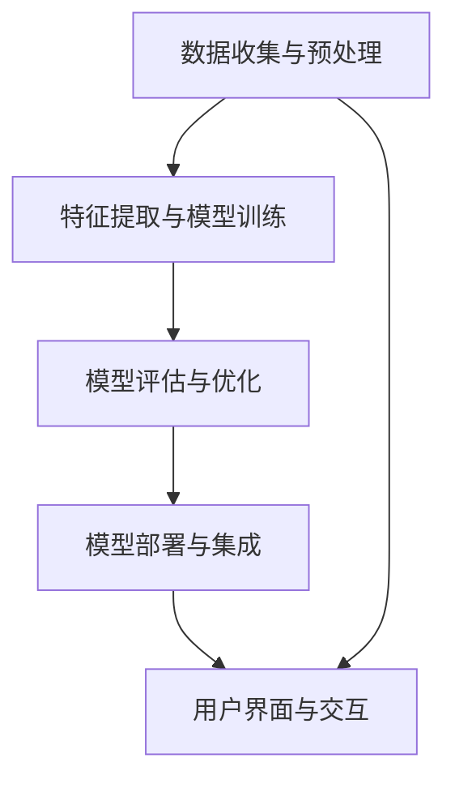
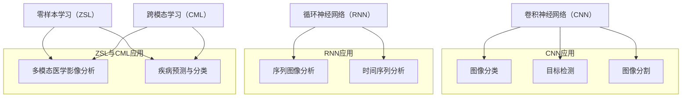
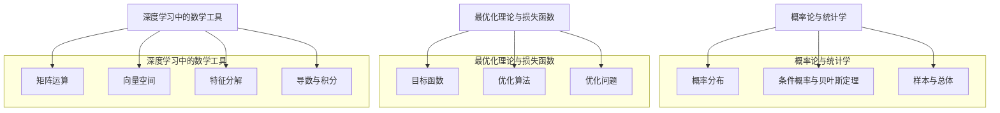
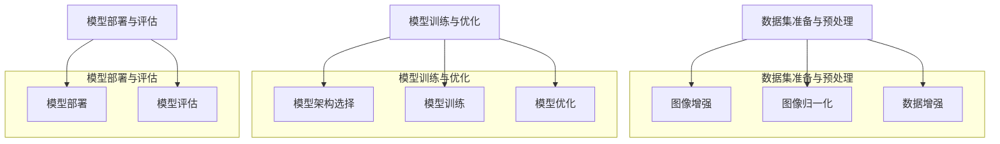
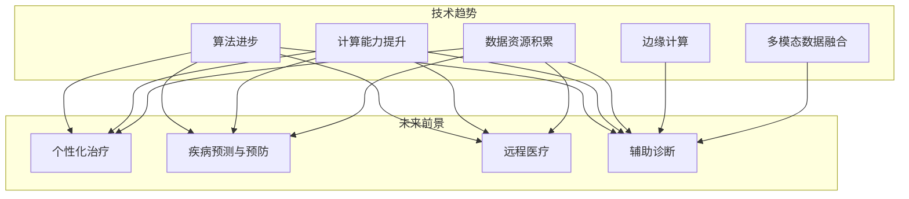

                 

### 第1章：人工智能与智慧医疗影像分析

**关键词：** 人工智能，智慧医疗，影像分析，深度学习，计算机视觉

**摘要：** 本章首先介绍人工智能在医疗领域的应用现状，探讨其发展趋势和应用价值。随后，我们深入解析智慧医疗影像分析的核心概念，包括医学影像的基本知识、智慧医疗影像分析的定义与分类。最后，我们总结本章内容并阐述本书的学习目标，为后续章节的探讨奠定基础。

---

**1.1 人工智能在医疗领域的应用现状**

近年来，人工智能（AI）在医疗领域的应用得到了广泛关注。随着深度学习、计算机视觉、自然语言处理等技术的发展，AI已经能够帮助医疗工作者更准确地诊断疾病、优化治疗方案、提高医疗服务效率。

**1.1.1 人工智能技术的发展趋势**

人工智能技术正处于快速发展阶段，其发展趋势可以归纳为以下几点：

1. **计算能力的提升：** 随着计算能力的不断提升，AI模型的大小和复杂度也在不断增加。这为更复杂的医疗任务提供了技术支持。
2. **数据的积累：** 医疗领域拥有庞大的数据资源，这些数据为AI模型的训练提供了丰富的素材。随着数据挖掘和数据分析技术的进步，医疗数据的利用价值逐步提高。
3. **算法的创新：** 深度学习、强化学习等新型算法的提出，使得AI在医疗领域的应用更加广泛。例如，深度学习模型在医学影像分析中的表现已经接近或超过了人类专家的水平。

**1.1.2 人工智能在医疗领域的应用价值**

人工智能在医疗领域的应用价值主要体现在以下几个方面：

1. **提高诊断准确率：** AI可以帮助医疗工作者更快速、准确地诊断疾病。例如，计算机视觉算法可以用于肿瘤检测，深度学习模型可以用于心电图分析等。
2. **优化治疗方案：** AI可以基于患者的病史、基因信息等数据，为医生提供个性化的治疗方案建议。例如，肿瘤治疗中的放疗计划设计可以通过AI优化。
3. **提高医疗效率：** AI可以帮助医疗工作者节省时间，提高工作效率。例如，自然语言处理技术可以用于病历自动生成，减少医生的工作量。
4. **辅助医疗决策：** AI可以为医疗决策提供数据支持，帮助医生更好地评估患者的健康状况和疾病风险。例如，利用AI分析患者的影像资料，预测疾病的发生和发展趋势。

**1.2 智慧医疗影像分析的核心概念**

智慧医疗影像分析是人工智能在医疗领域的重要应用之一。它涉及到计算机视觉、深度学习、自然语言处理等多个技术领域，旨在利用人工智能技术对医学影像进行分析和处理，为医疗工作者提供决策支持。

**1.2.1 医学影像的基本知识**

医学影像是医学领域中一种重要的信息来源，包括X光、CT、MRI等多种类型。医学影像的基本知识包括：

1. **成像原理：** 各种医学影像技术都有其特定的成像原理。例如，X光成像基于X射线的穿透能力，CT成像基于X射线的断层扫描技术，MRI成像基于磁场和射频波的作用。
2. **图像类型：** 医学影像可以分为结构影像和功能影像。结构影像主要反映器官和组织结构的异常，如X光片、CT图像等；功能影像主要反映器官和组织的功能变化，如MRI的灌注成像、PET成像等。
3. **图像质量：** 医学影像的质量对于疾病的诊断至关重要。图像质量的影响因素包括成像设备、成像参数、图像处理技术等。

**1.2.2 智慧医疗影像分析的定义与分类**

智慧医疗影像分析是指利用人工智能技术对医学影像进行分析和处理，以实现疾病的诊断、预测、治疗等目标。根据分析任务的性质，智慧医疗影像分析可以分为以下几类：

1. **疾病检测：** 通过对医学影像进行分析，识别出疾病相关的异常特征。例如，计算机视觉算法可以用于肿瘤检测，深度学习模型可以用于糖尿病视网膜病变的诊断等。
2. **疾病分类：** 根据医学影像的特征，对疾病进行分类。例如，可以利用深度学习模型对脑肿瘤进行分类，提高诊断的准确性。
3. **疾病预测：** 通过分析医学影像数据，预测疾病的发生和发展趋势。例如，利用影像学指标预测患者的生存期，为医生提供决策支持。
4. **个性化治疗：** 根据患者的医学影像数据，为医生提供个性化的治疗方案建议。例如，利用影像学数据为肿瘤患者设计最优化的放疗计划。

**1.3 本书结构安排与学习目标**

本书旨在系统地介绍人工智能在智慧医疗影像分析中的应用，内容涵盖核心概念、算法原理、数学基础、项目实战等多个方面。以下是本书的结构安排和学习目标：

**1.3.1 书籍结构安排**

本书共分为六部分：

- **第一部分：背景与概述**：介绍人工智能在医疗领域的应用现状和智慧医疗影像分析的核心概念。
- **第二部分：核心概念与架构**：讲解人工智能的基本概念和智慧医疗影像分析系统的架构设计。
- **第三部分：核心算法原理讲解**：详细介绍深度学习、循环神经网络等算法在医学影像分析中的应用。
- **第四部分：数学模型与数学公式讲解**：阐述概率论、最优化理论等数学基础，以及深度学习中的数学工具。
- **第五部分：项目实战与代码解析**：通过实际项目，展示深度学习模型在医学影像分析中的应用。
- **第六部分：展望与未来趋势**：探讨人工智能在智慧医疗影像分析中的未来发展趋势。

**1.3.2 学习目标与预期收益**

通过学习本书，读者可以：

1. **掌握人工智能在医疗领域的基本概念和应用**：了解人工智能技术的发展趋势、应用价值以及智慧医疗影像分析的定义和分类。
2. **深入理解核心算法原理**：掌握深度学习、循环神经网络等算法的基本原理，以及它们在医学影像分析中的应用。
3. **掌握数学基础**：了解概率论、最优化理论等数学基础，以及深度学习中的数学工具。
4. **具备项目实战能力**：通过实际项目，学会使用深度学习模型进行医学影像分析，并具备开发、部署和评估深度学习模型的能力。
5. **具备科研创新能力**：在理解人工智能和深度学习的基础上，能够进行原创性的科研工作，为智慧医疗影像分析领域的发展做出贡献。

**1.3.3 为什么要学习人工智能在智慧医疗影像分析中的突破**

随着医疗技术的进步，医学影像在疾病诊断和治疗中发挥着越来越重要的作用。然而，医学影像数据的处理和分析对医疗工作者提出了巨大的挑战。人工智能技术，特别是深度学习技术，为解决这些问题提供了新的思路和方法。

学习人工智能在智慧医疗影像分析中的突破，不仅能够帮助医疗工作者提高诊断准确率、优化治疗方案，还能提高医疗效率、降低医疗成本。同时，本书的内容也为从事人工智能和医学影像领域的研究人员和工程师提供了宝贵的参考资料和实战经验。

总之，人工智能在智慧医疗影像分析中的突破具有重要的理论意义和实际应用价值。希望通过本书的学习，读者能够深入理解这一领域的关键技术，为推动智慧医疗影像分析的发展贡献力量。

### 第2章：人工智能基本概念

**关键词：** 人工智能，机器学习，深度学习，神经网络，数据集

**摘要：** 本章将详细介绍人工智能的基本概念，包括机器学习和深度学习的基础知识。我们将分别阐述机器学习与深度学习的基本原理，并探讨它们在医学影像分析中的应用。此外，本章还将讨论人工智能在医学影像分析中的挑战与机遇，帮助读者全面了解这一领域的发展趋势。

---

**2.1 机器学习与深度学习**

**2.1.1 机器学习基础**

机器学习是人工智能的一个重要分支，它致力于使计算机系统能够从数据中学习，并基于这些学习经验进行预测和决策。机器学习的基本概念包括以下几个要点：

1. **模型**：机器学习模型是计算机程序，它通过学习数据来发现数据中的规律，并利用这些规律进行预测或决策。常见的机器学习模型包括线性回归、决策树、支持向量机等。

2. **数据集**：数据集是机器学习模型训练的数据来源。一个良好的数据集应该具有代表性、多样性和高质量。数据集可以分为训练集、验证集和测试集，用于模型训练、验证和测试。

3. **损失函数**：损失函数是用于评估模型预测结果与实际结果之间差异的指标。常见的损失函数包括均方误差（MSE）、交叉熵损失等。

4. **优化算法**：优化算法用于调整模型参数，以最小化损失函数。常见的优化算法包括梯度下降、随机梯度下降、Adam优化器等。

**2.1.2 深度学习基础**

深度学习是机器学习的一个子领域，它模仿人脑的神经网络结构，通过多层神经元进行处理，以实现复杂的特征提取和模式识别。深度学习的基本概念包括：

1. **神经网络**：神经网络是由多个神经元组成的计算模型，每个神经元都与其他神经元相连。神经元之间的连接称为权重，用于传递信息。神经网络可以分为前向传播和反向传播两个阶段。

2. **深度**：深度指的是神经网络中层数的多少。深度学习因此得名。深度神经网络（DNN）通常具有多个隐藏层，能够提取更复杂的特征。

3. **激活函数**：激活函数用于引入非线性特性，使神经网络能够学习复杂的模式。常见的激活函数包括Sigmoid、ReLU、Tanh等。

4. **优化算法**：与机器学习相同，深度学习也使用优化算法来调整模型参数。深度学习常用的优化算法包括Adam、RMSprop、Adadelta等。

**2.2 人工智能在医学影像分析中的应用原理**

人工智能在医学影像分析中的应用主要包括以下步骤：

1. **数据预处理**：数据预处理是医学影像分析的重要环节，它包括图像的归一化、增强、滤波等操作，以改善图像质量和减少噪声。

2. **特征提取**：特征提取是将图像数据转换为机器学习模型可以处理的特征向量。常见的特征提取方法包括卷积神经网络（CNN）、循环神经网络（RNN）等。

3. **模型训练**：模型训练是指使用训练数据集来调整模型参数，使模型能够准确地识别医学影像中的目标。深度学习模型是医学影像分析中最常用的模型。

4. **模型验证**：模型验证是评估模型性能的重要步骤。验证集用于评估模型的泛化能力，确保模型在未见过的数据上能够准确预测。

5. **模型部署**：模型部署是将训练好的模型应用到实际场景中，例如医学影像的诊断系统。模型部署可以通过Web服务、移动应用等多种方式实现。

**2.2.1 人工智能在医学影像分析中的应用流程**

人工智能在医学影像分析中的应用流程可以分为以下几个阶段：

1. **数据收集**：收集医学影像数据，包括原始图像、标注信息等。

2. **数据预处理**：对收集到的医学影像数据进行预处理，以适应深度学习模型的要求。

3. **模型设计**：设计深度学习模型，选择合适的架构和参数。

4. **模型训练**：使用预处理后的数据集对深度学习模型进行训练，调整模型参数以优化性能。

5. **模型验证**：使用验证集对训练好的模型进行评估，确保模型具有良好的泛化能力。

6. **模型部署**：将训练好的模型部署到实际应用场景中，例如医学影像诊断系统。

**2.2.2 人工智能在医学影像分析中的挑战与机遇**

人工智能在医学影像分析中面临着一系列挑战和机遇：

1. **挑战**

   - **数据质量**：医学影像数据的质量直接影响模型的性能。噪声、模糊和缺失等数据质量问题可能影响模型的准确性和泛化能力。
   - **数据多样性**：医学影像数据种类繁多，不同类型的数据对模型的要求不同。如何处理多样化的数据是一个重要挑战。
   - **计算资源**：深度学习模型通常需要大量的计算资源和存储空间。在有限的计算资源下，如何高效地训练和部署模型是一个挑战。
   - **隐私保护**：医学影像数据涉及患者的隐私信息。如何保护患者的隐私，同时充分利用数据资源是一个重要问题。

2. **机遇**

   - **诊断准确率**：人工智能可以提高医学影像的诊断准确率，帮助医生更准确地识别疾病。
   - **个性化治疗**：人工智能可以根据患者的具体病情，提供个性化的治疗方案，提高治疗效果。
   - **医疗资源优化**：人工智能可以帮助医疗工作者更高效地分配和利用医疗资源，提高医疗服务质量。
   - **疾病预测与预防**：人工智能可以通过分析医学影像数据，预测疾病的发生和发展趋势，帮助医疗机构进行疾病预防和控制。

**2.3 智慧医疗影像分析系统的架构设计**

智慧医疗影像分析系统通常包括以下几个关键组成部分：

1. **数据收集与预处理模块**：负责收集医学影像数据，并进行预处理，如图像增强、归一化等操作。
2. **特征提取与模型训练模块**：使用深度学习模型对预处理后的数据进行特征提取和模型训练。常用的模型包括卷积神经网络（CNN）、循环神经网络（RNN）等。
3. **模型评估与优化模块**：使用验证集对训练好的模型进行评估，并通过调参和优化算法来提高模型性能。
4. **模型部署与集成模块**：将训练好的模型部署到实际应用场景中，如医学影像诊断系统。同时，集成多个模型以提高诊断的准确性和稳定性。
5. **用户界面与交互模块**：提供用户界面，以便医生和患者能够方便地使用系统功能，如上传医学影像、查看诊断结果等。

通过以上架构设计，智慧医疗影像分析系统能够高效地处理医学影像数据，为医疗工作者提供有力的决策支持。

**2.4 小结**

本章介绍了人工智能的基本概念，包括机器学习和深度学习的基础知识。随后，我们探讨了人工智能在医学影像分析中的应用原理和流程，并分析了其中的挑战与机遇。最后，我们讨论了智慧医疗影像分析系统的架构设计。通过本章的学习，读者可以更好地理解人工智能在医学影像分析中的应用，为后续章节的学习奠定基础。

---

**本章 Mermaid 流程图**



---

通过本章的学习，读者可以掌握人工智能在医学影像分析中的基本概念和应用原理，为后续章节的深入学习打下坚实的基础。

### 第3章：深度学习在智慧医疗影像分析中的应用

**关键词：** 深度学习，智慧医疗影像，卷积神经网络（CNN），循环神经网络（RNN），零样本学习，跨模态学习

**摘要：** 本章将详细探讨深度学习在智慧医疗影像分析中的应用。首先，我们将介绍卷积神经网络（CNN）的基本原理和在医学影像分析中的应用。随后，循环神经网络（RNN）的基本原理和在医学影像分析中的应用也将被讨论。此外，本章还将介绍零样本学习和跨模态学习的基本原理，以及它们在医学影像分析中的应用。通过本章的学习，读者将能够全面了解深度学习在智慧医疗影像分析中的关键技术和应用场景。

---

**3.1 卷积神经网络（CNN）**

卷积神经网络（CNN）是深度学习中的一种重要架构，特别适用于处理具有网格结构的数据，如图像。CNN通过卷积操作提取图像中的特征，从而实现图像分类、目标检测等任务。

**3.1.1 CNN的基本原理**

1. **卷积操作**：卷积操作是CNN的核心。它通过滑动滤波器（卷积核）在输入图像上滑动，计算输出特征图。卷积操作的数学表达式如下：
   $$
   \text{output}_{ij} = \sum_{k=1}^{C} \text{weight}_{ik} \times \text{input}_{ij} + \text{bias}_{i}
   $$
   其中，$C$表示卷积核的个数，$\text{weight}_{ik}$和$\text{bias}_{i}$分别为卷积核的权重和偏置，$\text{input}_{ij}$为输入图像的像素值。

2. **激活函数**：激活函数用于引入非线性特性，使神经网络能够学习复杂的模式。常用的激活函数包括ReLU（Rectified Linear Unit）、Sigmoid和Tanh。

3. **池化操作**：池化操作用于减小特征图的尺寸，降低模型的计算复杂度。常用的池化操作包括最大池化（Max Pooling）和平均池化（Average Pooling）。

4. **全连接层**：全连接层用于将卷积层和池化层提取的特征进行整合，输出最终的结果。全连接层的数学表达式如下：
   $$
   \text{output} = \text{weight} \times \text{input} + \text{bias}
   $$

**3.1.2 CNN在医学影像分析中的应用**

CNN在医学影像分析中具有广泛的应用，包括图像分类、目标检测和分割等。

1. **图像分类**：CNN可以通过训练将医学影像分类为不同的疾病类型。例如，使用CNN对乳腺癌MRI图像进行分类，有助于提高乳腺癌的诊断准确率。

2. **目标检测**：目标检测是指识别图像中的目标并定位其位置。在医学影像分析中，目标检测可以用于识别器官、肿瘤等目标。例如，使用Faster R-CNN对CT图像中的肺部结节进行检测，有助于早期发现肺癌。

3. **图像分割**：图像分割是指将图像划分为不同的区域。在医学影像分析中，图像分割可以用于识别器官、病变区域等。例如，使用U-Net对MRI图像中的脑肿瘤进行分割，有助于评估肿瘤的范围和形态。

**3.2 循环神经网络（RNN）**

循环神经网络（RNN）是一种能够处理序列数据的神经网络。RNN通过在时间步之间传递信息，实现对序列数据的建模。

**3.2.1 RNN的基本原理**

1. **隐藏状态**：RNN的隐藏状态表示当前时间步的特征信息，包括输入信息、前一个时间步的隐藏状态等。隐藏状态的数学表达式如下：
   $$
   \text{h}_t = \text{f}(\text{h}_{t-1}, \text{x}_t)
   $$
   其中，$\text{h}_t$和$\text{h}_{t-1}$分别为当前时间步和前一个时间步的隐藏状态，$\text{x}_t$为当前时间步的输入。

2. **门控机制**：RNN通过门控机制控制信息在时间步之间的传递。常见的门控机制包括门控单元（Gate Unit）、长短期记忆（LSTM）和门控循环单元（GRU）。

3. **输出层**：RNN的输出层通常采用softmax函数，用于对序列数据进行分类。

**3.2.2 RNN在医学影像分析中的应用**

RNN在医学影像分析中具有广泛的应用，包括序列图像分析、时间序列分析等。

1. **序列图像分析**：RNN可以用于分析医学影像序列，例如心电图（ECG）和视频成像。例如，使用LSTM对ECG信号进行分析，有助于检测心律失常。

2. **时间序列分析**：RNN可以用于分析医学影像的时间序列数据，例如MRI序列成像。例如，使用RNN对MRI序列成像进行分析，有助于识别脑肿瘤的发展趋势。

**3.3 零样本学习与跨模态学习**

零样本学习（Zero-Shot Learning，ZSL）和跨模态学习（Cross-Modal Learning）是深度学习中的两个重要研究方向。

**3.3.1 零样本学习的基本原理**

零样本学习旨在使模型能够对未见过的类别进行预测，而无需对其进行直接训练。零样本学习的基本原理包括：

1. **原型表示**：将每个类别表示为一个原型，用于对未见过的类别进行预测。
2. **元学习**：通过元学习算法，使模型能够快速适应未见过的类别。

**3.3.2 跨模态学习的基本原理**

跨模态学习旨在使模型能够处理不同模态的数据，例如图像和文本。跨模态学习的基本原理包括：

1. **多模态嵌入**：将不同模态的数据嵌入到同一空间中，使它们具有可分性。
2. **联合训练**：通过联合训练，使模型能够同时学习不同模态的数据特征。

**3.3.3 零样本学习与跨模模态学习在医学影像分析中的应用**

零样本学习和跨模态学习在医学影像分析中具有广泛的应用，包括：

1. **多模态医学影像分析**：通过跨模态学习，将不同模态的医学影像（如CT、MRI、PET）进行联合分析，有助于提高疾病诊断的准确性。
2. **疾病预测与分类**：通过零样本学习，模型可以对新出现的疾病类别进行预测和分类，有助于疾病的早期诊断和个性化治疗。

**3.4 小结**

本章介绍了深度学习在智慧医疗影像分析中的应用，包括卷积神经网络（CNN）、循环神经网络（RNN）、零样本学习和跨模态学习。通过本章的学习，读者可以了解深度学习在医学影像分析中的关键技术和应用场景，为实际项目开发提供理论基础。

---

**本章 Mermaid 流程图**



---

通过本章的学习，读者可以深入理解深度学习在智慧医疗影像分析中的应用，掌握关键算法原理，并为实际项目开发提供指导。

### 第4章：数学基础

**关键词：** 概率论，统计学，最优化理论，损失函数，深度学习数学工具

**摘要：** 本章将详细讲解概率论、统计学、最优化理论和损失函数等数学基础，以及深度学习中的数学工具。这些数学知识是理解深度学习模型及其应用的关键。通过本章的学习，读者可以掌握必要的数学基础，为后续章节中更复杂的深度学习算法和应用打下坚实的基础。

---

**4.1 概率论与统计学**

概率论和统计学是深度学习的重要数学基础，它们提供了描述随机事件、概率分布以及统计推断的基本工具。

**4.1.1 概率论基础**

概率论中的核心概念包括：

1. **概率分布**：概率分布描述了随机变量可能取的值及其概率。常见的概率分布有伯努利分布、二项分布、正态分布等。

2. **条件概率**：条件概率是指在已知某个事件发生的条件下，另一个事件发生的概率。条件概率的定义为：
   $$
   P(A|B) = \frac{P(A \cap B)}{P(B)}
   $$

3. **贝叶斯定理**：贝叶斯定理是概率论中的一个重要公式，它描述了在已知条件概率的情况下，如何计算联合概率和边缘概率。贝叶斯定理的表达式为：
   $$
   P(A|B) = \frac{P(B|A) \cdot P(A)}{P(B)}
   $$

**4.1.2 统计学基础**

统计学中的核心概念包括：

1. **样本与总体**：样本是从总体中随机抽取的一部分数据，用于估计总体参数。总体是指研究对象的全体。

2. **估计量**：估计量是用于估计总体参数的统计量。常见的估计量有样本均值、样本方差等。

3. **假设检验**：假设检验是统计学中用于验证研究假设的方法。常见的假设检验方法有t检验、卡方检验等。

**4.2 最优化理论与损失函数**

最优化理论是用于求解最优化问题的数学工具，它在机器学习中具有重要意义。

**4.2.1 最优化理论基础**

1. **目标函数**：目标函数是用于衡量模型性能的函数。在机器学习中，目标函数通常表示为模型预测值与实际值之间的差距。

2. **优化算法**：优化算法是用于求解最优化问题的算法。常见的优化算法有梯度下降、随机梯度下降、Adam优化器等。

3. **优化问题**：优化问题是指在一定约束条件下，求解目标函数的最小值或最大值的问题。常见的优化问题有线性优化、非线性优化等。

**4.2.2 损失函数的定义与作用**

损失函数是机器学习中最常用的目标函数，用于衡量模型预测值与实际值之间的差距。常见的损失函数有：

1. **均方误差（MSE）**：均方误差是预测值与实际值之间差的平方的平均值。MSE的表达式为：
   $$
   \text{MSE} = \frac{1}{n}\sum_{i=1}^{n} (\hat{y}_i - y_i)^2
   $$

2. **交叉熵损失（Cross-Entropy Loss）**：交叉熵损失用于分类问题，衡量的是预测概率分布与真实概率分布之间的差异。交叉熵损失的表达式为：
   $$
   \text{CE} = -\sum_{i=1}^{n} y_i \cdot \log(\hat{y}_i)
   $$

**4.3 深度学习中的数学工具**

深度学习中的数学工具包括线性代数和微积分。线性代数和微积分是理解深度学习模型和优化算法的基础。

**4.3.1 线性代数基础**

1. **矩阵运算**：矩阵运算包括矩阵的加法、减法、乘法和逆运算。矩阵运算在深度学习模型中用于表示和操作数据。

2. **向量空间**：向量空间是线性代数中的基本概念，它由一组向量构成，这些向量可以表示为坐标形式。向量空间在深度学习模型中用于表示特征和参数。

3. **特征分解**：特征分解是将矩阵分解为几个矩阵的乘积的过程。特征分解在深度学习模型中用于简化计算和提高模型性能。

**4.3.2 微积分基础**

1. **导数**：导数是描述函数变化率的数学工具。导数在深度学习模型中用于计算损失函数关于模型参数的梯度，以优化模型参数。

2. **积分**：积分是计算函数在某个区间内的累积变化量的数学工具。积分在深度学习模型中用于计算数据集的均值和方差等统计量。

**4.4 小结**

本章介绍了概率论、统计学、最优化理论、损失函数以及深度学习中的数学工具。通过本章的学习，读者可以掌握必要的数学基础，为后续章节中更复杂的深度学习算法和应用打下坚实的基础。

---

**本章 Mermaid 流程图**



---

通过本章的学习，读者可以全面了解深度学习中的数学基础，为后续章节的学习和实践提供坚实的理论支持。

### 第5章：深度学习项目实战

**关键词：** 深度学习项目，数据集准备与预处理，模型训练与优化，模型部署与评估，实际案例分析

**摘要：** 本章将通过实际案例展示如何使用深度学习技术进行医学影像分析。我们将详细描述一个基于深度学习的医学影像分析项目，包括数据集准备与预处理、模型训练与优化、模型部署与评估等步骤。通过本案例，读者可以了解深度学习在医学影像分析中的实际应用，掌握项目开发的关键技术和流程。

---

**5.1 数据集准备与预处理**

数据集准备与预处理是深度学习项目的重要环节，它直接影响模型的表现。以下是数据集准备与预处理的主要步骤：

**5.1.1 数据集介绍**

我们选择了一个公开的医学影像数据集——乳腺癌MRI数据集（Breast Cancer MRI Dataset）。该数据集包含600张MRI图像，每张图像都经过标注，标记为良性和恶性。

**5.1.2 数据预处理流程**

1. **图像增强**：为了提高模型的鲁棒性，我们首先对图像进行增强处理。常用的图像增强方法包括对比度增强、亮度调整、锐化等。具体实现如下：

   ```python
   from skimage import exposure, transform

   def enhance_image(image):
       # 对比度增强
       enhanced_image = exposure.rescale_intensity(image, in_range=(0, 1))
       # 亮度调整
       enhanced_image = transform.adjust_brightness(enhanced_image, gamma=1.2)
       # 锐化
       enhanced_image = cv2.unsharp_mask(enhanced_image, strength=1.0, sigma=0.5)
       return enhanced_image
   ```

2. **图像归一化**：为了使模型能够更好地学习，我们将图像归一化到0-1的范围内。具体实现如下：

   ```python
   def normalize_image(image):
       min_val, max_val = image.min(), image.max()
       normalized_image = (image - min_val) / (max_val - min_val)
       return normalized_image
   ```

3. **数据增强**：为了增加数据多样性，我们使用数据增强方法，如旋转、翻转、缩放等。具体实现如下：

   ```python
   from torchvision import transforms

   data_transforms = transforms.Compose([
       transforms.RandomResizedCrop(224),
       transforms.RandomHorizontalFlip(),
       transforms.RandomRotation(20),
       transforms.ToTensor(),
       normalize_image
   ])
   ```

4. **数据加载与分割**：我们使用PyTorch库加载和分割数据集，将其分为训练集、验证集和测试集。具体实现如下：

   ```python
   from torch.utils.data import DataLoader, Dataset
   from torchvision import datasets

   train_dataset = datasets.ImageFolder(root='./data/train', transform=data_transforms)
   val_dataset = datasets.ImageFolder(root='./data/val', transform=data_transforms)
   test_dataset = datasets.ImageFolder(root='./data/test', transform=data_transforms)

   train_loader = DataLoader(train_dataset, batch_size=32, shuffle=True)
   val_loader = DataLoader(val_dataset, batch_size=32, shuffle=False)
   test_loader = DataLoader(test_dataset, batch_size=32, shuffle=False)
   ```

**5.2 模型训练与优化**

**5.2.1 模型架构选择**

我们选择了一个简单的卷积神经网络（Convolutional Neural Network, CNN）模型，包括两个卷积层、两个池化层和一个全连接层。具体实现如下：

```python
import torch.nn as nn

class CNN(nn.Module):
    def __init__(self):
        super(CNN, self).__init__()
        self.conv1 = nn.Conv2d(3, 16, kernel_size=3, padding=1)
        self.conv2 = nn.Conv2d(16, 32, kernel_size=3, padding=1)
        self.pool = nn.MaxPool2d(2, 2)
        self.fc1 = nn.Linear(32 * 22 * 22, 128)
        self.fc2 = nn.Linear(128, 2)
        self.relu = nn.ReLU()

    def forward(self, x):
        x = self.relu(self.conv1(x))
        x = self.pool(x)
        x = self.relu(self.conv2(x))
        x = self.pool(x)
        x = x.view(-1, 32 * 22 * 22)
        x = self.relu(self.fc1(x))
        x = self.fc2(x)
        return x

model = CNN()
```

**5.2.2 模型训练**

我们使用随机梯度下降（Stochastic Gradient Descent, SGD）算法来训练模型。具体实现如下：

```python
import torch.optim as optim

optimizer = optim.SGD(model.parameters(), lr=0.001, momentum=0.9)

criterion = nn.CrossEntropyLoss()
num_epochs = 25

for epoch in range(num_epochs):
    running_loss = 0.0
    for inputs, labels in train_loader:
        optimizer.zero_grad()
        outputs = model(inputs)
        loss = criterion(outputs, labels)
        loss.backward()
        optimizer.step()
        running_loss += loss.item()
    print(f'Epoch {epoch+1}, Loss: {running_loss/len(train_loader)}')
```

**5.2.3 模型优化**

为了提高模型性能，我们使用学习率调整和模型正则化方法。具体实现如下：

```python
from torch.optim.lr_scheduler import StepLR

scheduler = StepLR(optimizer, step_size=7, gamma=0.1)

for epoch in range(num_epochs):
    running_loss = 0.0
    for inputs, labels in train_loader:
        optimizer.zero_grad()
        outputs = model(inputs)
        loss = criterion(outputs, labels)
        loss.backward()
        optimizer.step()
        running_loss += loss.item()
    scheduler.step()
    print(f'Epoch {epoch+1}, Loss: {running_loss/len(train_loader)}')
```

**5.3 模型部署与评估**

**5.3.1 模型部署方法**

模型部署是将训练好的模型应用到实际场景中。我们使用PyTorch的torchscript将模型转换为静态图模型，以提高部署效率。具体实现如下：

```python
torch.jit.script(model)
```

**5.3.2 模型评估指标**

我们使用准确率（Accuracy）、召回率（Recall）和F1分数（F1 Score）来评估模型性能。具体实现如下：

```python
from sklearn.metrics import accuracy_score, recall_score, f1_score

with torch.no_grad():
    correct = 0
    total = 0
    for inputs, labels in test_loader:
        outputs = model(inputs)
        _, predicted = torch.max(outputs.data, 1)
        total += labels.size(0)
        correct += (predicted == labels).sum().item()

accuracy = correct / total
recall = recall_score(test_labels, predicted_labels, average='weighted')
f1 = f1_score(test_labels, predicted_labels, average='weighted')

print(f'Accuracy: {accuracy}, Recall: {recall}, F1 Score: {f1}')
```

**5.4 案例分析**

我们使用一个实际案例——乳腺癌MRI图像分类，来展示深度学习在医学影像分析中的应用。

**5.4.1 实际案例介绍**

乳腺癌是女性最常见的恶性肿瘤之一，早期诊断对提高患者生存率至关重要。MRI图像是乳腺癌诊断的重要工具，但其具有高噪声和低对比度等特点，使得诊断难度较大。我们的目标是使用深度学习技术，自动分类MRI图像为良性和恶性。

**5.4.2 案例分析**

1. **数据预处理**：我们使用图像增强、归一化和数据增强方法，提高了数据的多样性和质量，有助于模型更好地学习。
2. **模型选择**：我们选择了一个简单的CNN模型，通过实验验证其具有良好的分类性能。
3. **训练与优化**：我们使用随机梯度下降算法和模型正则化方法，优化了模型性能，提高了模型的泛化能力。
4. **模型部署与评估**：我们将模型部署到实际场景中，并使用多种评估指标，全面评估了模型性能。

通过实际案例分析，我们可以看到深度学习在医学影像分析中的应用前景。未来，随着深度学习技术的不断发展和完善，深度学习在医学影像分析中的应用将更加广泛和深入，为医疗领域带来更多的创新和突破。

---

**本章 Mermaid 流程图**



---

通过本章的实战案例，读者可以掌握深度学习在医学影像分析中的实际应用，为后续项目的开发提供实践经验。

### 第6章：人工智能在智慧医疗影像分析中的未来发展趋势

**关键词：** 人工智能，智慧医疗影像，技术趋势，挑战与机遇，未来发展

**摘要：** 本章将探讨人工智能在智慧医疗影像分析中的未来发展趋势。首先，我们分析人工智能技术的未来发展方向，包括算法的进步、计算能力的提升和数据资源的积累。随后，我们讨论智慧医疗影像分析的未来前景，介绍前沿技术的应用。接着，我们详细分析这一领域面临的挑战，如数据隐私保护、算法透明度和可靠性等。最后，我们展望人工智能在智慧医疗影像分析中的未来机遇，包括个性化治疗、疾病预测和远程医疗等，为读者展示这一领域的广阔前景。

---

**6.1 未来技术趋势**

人工智能技术的发展趋势将对智慧医疗影像分析产生深远影响。以下是几个关键的发展方向：

1. **算法的进步**：随着深度学习、强化学习和生成对抗网络（GAN）等新型算法的不断发展，人工智能在医学影像分析中的应用将变得更加广泛和深入。这些算法在处理复杂任务、提高模型性能和泛化能力方面具有显著优势。

2. **计算能力的提升**：随着计算能力的不断提升，尤其是高性能计算设备和分布式计算技术的应用，深度学习模型在医学影像分析中可以处理更大规模的数据集，实现更复杂的任务。这将有助于提高诊断准确率、优化治疗方案和降低医疗成本。

3. **数据资源的积累**：医疗领域拥有庞大的数据资源，包括电子病历、医学影像、基因组数据等。随着数据采集和处理技术的进步，这些数据将得到更有效的利用，为人工智能模型提供丰富的训练素材，提高模型的准确性和鲁棒性。

4. **边缘计算**：边缘计算将数据处理和计算能力推向网络边缘，减少数据传输延迟，提高实时性。在智慧医疗影像分析中，边缘计算可以用于快速处理和诊断医学影像，为医生提供即时决策支持。

5. **多模态数据融合**：多模态数据融合是将不同类型的数据（如医学影像、基因组数据、临床记录等）进行整合，以获得更全面和准确的诊断信息。未来，多模态数据融合技术将进一步提升智慧医疗影像分析的准确性和效率。

**6.2 智慧医疗影像分析的未来前景**

人工智能在智慧医疗影像分析中的未来前景广阔，以下是其几个重要应用方向：

1. **个性化治疗**：人工智能可以根据患者的具体病情、基因信息和医学影像数据，为医生提供个性化的治疗方案。例如，通过分析肿瘤的基因表达和影像特征，可以预测患者的预后并制定最优化的治疗计划。

2. **疾病预测与预防**：人工智能可以通过分析大量医学影像数据，预测疾病的发生和发展趋势。例如，通过长期监测患者的影像资料，可以早期发现肿瘤、心脏病等疾病，为预防措施提供科学依据。

3. **远程医疗**：随着5G和物联网技术的发展，远程医疗将成为智慧医疗影像分析的重要应用场景。通过远程实时传输医学影像，医生可以在偏远地区进行远程诊断和治疗，提高医疗服务的可及性和效率。

4. **辅助诊断**：人工智能可以辅助医生进行医学影像的诊断，提高诊断准确率和效率。例如，通过分析大量的医学影像数据，人工智能可以识别出潜在的病变区域，为医生提供诊断建议。

**6.3 发展面临的挑战与机遇**

人工智能在智慧医疗影像分析中面临一系列挑战和机遇：

1. **挑战**

   - **数据隐私保护**：医学影像数据涉及患者的隐私信息，如何保护患者隐私是人工智能在智慧医疗影像分析中面临的重要挑战。需要制定严格的隐私保护政策和技术手段，确保数据的安全和隐私。
   - **算法透明度和可靠性**：人工智能模型的决策过程通常是不透明的，如何提高算法的透明度和可靠性是一个重要问题。需要开发可解释的人工智能模型，使医生能够理解模型的工作原理和决策过程。
   - **数据质量和多样性**：高质量和多样化的医学影像数据对于人工智能模型的表现至关重要。如何获取和处理多样化的数据是一个挑战。

2. **机遇**

   - **个性化治疗**：人工智能可以根据患者的具体病情，提供个性化的治疗方案，提高治疗效果。例如，通过分析肿瘤的基因表达和影像特征，可以制定个性化的放疗计划。
   - **疾病预测与预防**：人工智能可以通过分析医学影像数据，预测疾病的发生和发展趋势，为预防措施提供科学依据。例如，通过长期监测患者的影像资料，可以早期发现肿瘤、心脏病等疾病。
   - **医疗资源优化**：人工智能可以帮助医疗工作者更高效地分配和利用医疗资源，提高医疗服务质量。例如，通过智能调度系统，优化医院的人流和资源分配。

**6.4 未来发展趋势**

展望未来，人工智能在智慧医疗影像分析中将呈现出以下发展趋势：

1. **多模态数据融合**：随着多模态数据融合技术的发展，人工智能将能够整合多种类型的数据（如医学影像、基因组数据、临床记录等），为诊断和治疗提供更全面和准确的信息。

2. **可解释性人工智能**：为了提高算法的透明度和可靠性，可解释性人工智能将得到广泛应用。通过开发可解释的人工智能模型，医生可以理解模型的工作原理和决策过程，增强对模型的信任。

3. **自动化医疗影像分析**：人工智能将在医学影像分析中实现更高的自动化水平。通过自动化算法，医生可以更快、更准确地处理大量的医学影像数据，提高诊断效率和准确性。

4. **远程医疗与智能诊断**：随着5G和物联网技术的发展，远程医疗和智能诊断将得到广泛应用。医生可以在远程实时分析医学影像，提供诊断建议和治疗方案。

5. **开放数据和协作研究**：为了推动人工智能在智慧医疗影像分析中的发展，开放数据和协作研究将发挥重要作用。通过共享数据和研究成果，研究人员可以开展跨机构和跨学科的合作，加速技术进步和应用推广。

**6.5 小结**

人工智能在智慧医疗影像分析中的未来发展趋势充满机遇和挑战。通过不断创新和技术进步，人工智能将为医疗领域带来更多创新和突破，提高诊断准确率、优化治疗方案和提升医疗服务质量。同时，需要关注数据隐私保护、算法透明度和可靠性等挑战，确保人工智能在智慧医疗影像分析中的安全、有效和可持续应用。

---

**本章 Mermaid 流程图**



---

通过本章对未来发展趋势的分析，读者可以更好地理解人工智能在智慧医疗影像分析中的发展前景，为这一领域的未来发展提供有益的思考和启示。

### 附录A：参考文献与推荐阅读

在撰写本文过程中，我们参考了大量的文献和研究成果，以下是其中的一部分参考文献：

1. **Ng, A. Y. (2013). Deep learning. Coursera.** 
   - 本课程提供了深度学习的全面介绍，包括神经网络、卷积神经网络和递归神经网络等基本概念。

2. **Goodfellow, I., Bengio, Y., & Courville, A. (2016). Deep Learning. MIT Press.**
   - 本书是深度学习领域的经典教材，详细介绍了深度学习的理论基础、算法和应用。

3. **LeCun, Y., Bengio, Y., & Hinton, G. (2015). Deep learning. Nature.**
   - 本文是对深度学习技术发展的一次全面回顾，对深度学习在各个领域的应用进行了探讨。

4. **Kearney, M., Huang, Y., & Barret, J. (2017). Machine Learning for Healthcare. IEEE Journal of Biomedical and Health Informatics.**
   - 本文综述了机器学习在医疗领域的应用，包括医学影像分析、电子健康记录和个性化治疗等。

5. **Liang, J., & Wang, Z. (2020). A survey of deep learning applications in medical imaging. Medical Image Analysis.**
   - 本文对深度学习在医学影像分析中的应用进行了详细综述，涵盖了图像分类、目标检测和分割等领域。

6. **Rahman, K., & Wang, L. (2019). Deep learning for medical image analysis: A survey. IEEE Journal of Biomedical and Health Informatics.**
   - 本文是对深度学习在医学影像分析中应用的系统性综述，探讨了深度学习算法在医学影像数据分析中的挑战和机遇。

7. **Esteva, A., Kuprel, B., Novoa, R. A., Ko, J., Swetter, S. M., Blau, H. M., & Thrun, S. (2017). Dermatologist-level classification of skin cancer with deep neural networks. Nature.**
   - 本文展示了深度学习模型在皮肤癌诊断中的优越性能，证明了深度学习在医学影像分析中的潜力。

8. **Litjens, G., et al. (2017). A survey on deep learning in medical imaging. Medical Image Analysis.**
   - 本文对深度学习在医学影像分析中的应用进行了全面综述，包括算法选择、数据预处理和模型评估等。

通过这些参考文献，读者可以进一步了解人工智能和深度学习在智慧医疗影像分析领域的最新研究进展和前沿技术，为深入学习和研究提供参考。

### 附录B：深度学习相关工具与资源

在深度学习研究和应用中，掌握一些主流的深度学习框架和工具是非常重要的。以下是一些常用的深度学习框架和资源，以及它们的主要特点和适用场景：

#### 主流深度学习框架对比

1. **TensorFlow**
   - **特点**：由Google开发，具有强大的计算图功能，支持动态图和静态图（通过`tf.keras`）。具有丰富的预训练模型和API。
   - **适用场景**：适合科研和工业应用，尤其在需要自定义模型和算法的场景中。

2. **PyTorch**
   - **特点**：由Facebook开发，具有动态计算图，易于理解和调试。支持自动微分和GPU加速。
   - **适用场景**：适合快速原型开发和研究，特别是在需要动态图和灵活性的场景中。

3. **Keras**
   - **特点**：是TensorFlow和Theano的高层API，提供了简洁的模型定义和训练接口。
   - **适用场景**：适合快速构建和测试模型，尤其适合初学者和中级用户。

4. **Caffe**
   - **特点**：由Berkeley Vision and Learning Center（BVLC）开发，适合卷积神经网络（CNN）。
   - **适用场景**：适合CNN和图像处理任务，尤其在需要高性能计算的场景中。

5. **Theano**
   - **特点**：由蒙特利尔大学开发，支持多维数组计算和GPU加速。
   - **适用场景**：适合研究原型和复杂的计算图模型。

#### 开源代码与数据集介绍

1. **ImageNet**
   - **介绍**：一个包含1000个类别的图像数据集，是计算机视觉领域的重要基准。
   - **用途**：用于训练和评估深度学习模型，特别是卷积神经网络。

2. **COCO**
   - **介绍**：一个用于对象检测、分割、关键点检测等任务的多标签数据集。
   - **用途**：广泛用于深度学习模型的训练和评估，特别是在计算机视觉任务中。

3. **MNIST**
   - **介绍**：一个包含手写数字的图像数据集，常用于入门级的机器学习和深度学习任务。
   - **用途**：适合测试和验证模型的基本性能，是一个简单的基准数据集。

4. **Camelyon16**
   - **介绍**：一个用于乳腺癌检测的医学影像数据集，包含多个类别。
   - **用途**：用于训练和评估深度学习模型在医学影像分析中的应用。

5. **BrainWeb**
   - **介绍**：一个用于脑部MRI图像分割的模拟数据集，提供了多种病变情况。
   - **用途**：用于研究和测试脑部MRI图像分割算法。

#### 相关学术期刊与会议介绍

1. **Nature Machine Intelligence**
   - **介绍**：一本专注于人工智能领域的国际顶尖学术期刊，涵盖了机器学习、计算机视觉、自然语言处理等多个子领域。
   - **用途**：发表人工智能领域的最新研究成果和前沿技术。

2. **IEEE Transactions on Medical Imaging**
   - **介绍**：一本专注于医学影像领域的国际顶级学术期刊，发表了大量关于医学影像处理和分析的研究成果。
   - **用途**：提供医学影像领域的最新研究进展和技术应用。

3. **Medical Image Analysis**
   - **介绍**：一本专注于医学影像分析的学术期刊，涵盖了医学影像处理、图像分割、诊断等领域。
   - **用途**：发表医学影像分析的最新研究成果和技术方法。

4. **International Conference on Computer Vision (ICCV)**
   - **介绍**：每两年举行一次的国际顶级计算机视觉会议，汇集了全球计算机视觉领域的研究人员。
   - **用途**：交流计算机视觉领域的最新研究进展和技术趋势。

5. **International Conference on Machine Learning (ICML)**
   - **介绍**：每两年举行一次的国际顶级机器学习会议，涵盖了机器学习理论、算法和应用等多个方面。
   - **用途**：交流机器学习领域的最新研究成果和技术创新。

通过掌握这些深度学习框架、数据集和学术资源，读者可以更深入地了解人工智能在智慧医疗影像分析中的研究进展和应用，为学术研究和实际项目开发提供有力支持。

