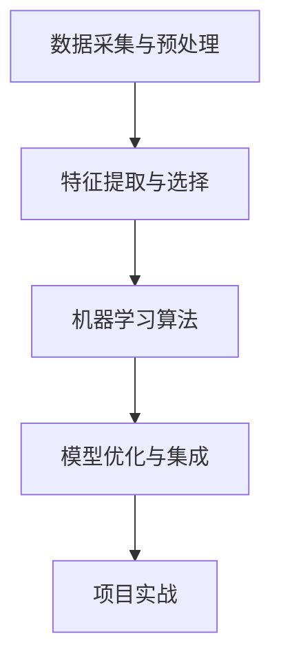
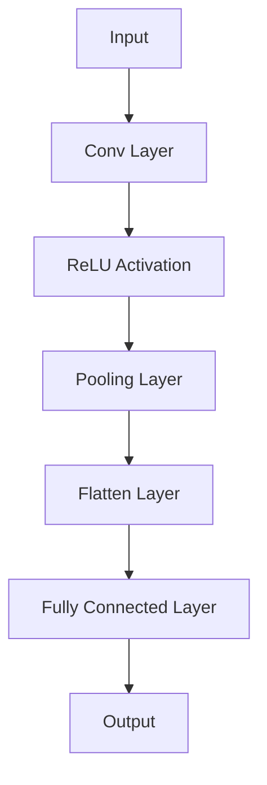
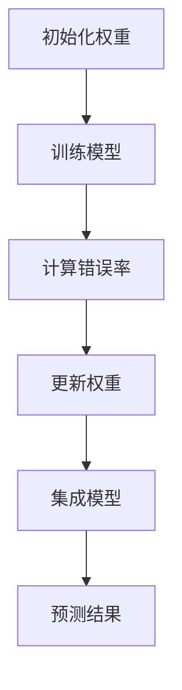
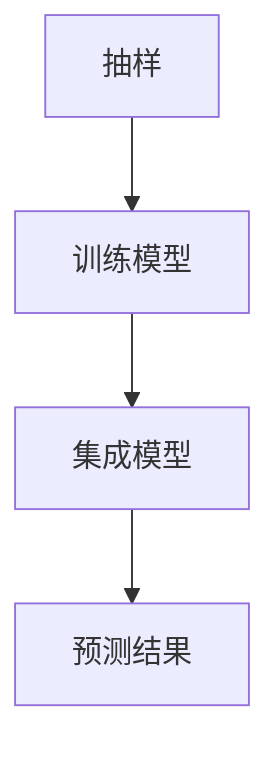
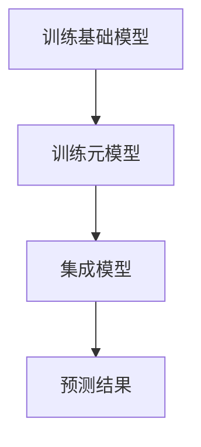

                 

# 《人工智能在智能农业病虫害识别中的应用》

## 关键词

智能农业、病虫害识别、人工智能、机器学习、深度学习、数据采集、特征提取、模型优化、项目实战。

## 摘要

本文深入探讨了人工智能在智能农业病虫害识别中的应用。首先，介绍了智能农业的重要性及其在农业领域的发展现状。然后，详细阐述了病虫害识别的基本概念、原理和挑战。接下来，介绍了人工智能在病虫害识别中的应用架构，包括数据采集、预处理、特征提取、机器学习算法和模型优化。随后，通过具体项目实战，展示了基于图像和声音的病虫害识别实现过程。最后，对未来病虫害识别技术的发展趋势和智能农业的前景进行了展望。本文旨在为读者提供一份全面、系统的智能农业病虫害识别技术指南。

## 《人工智能在智能农业病虫害识别中的应用》目录大纲

### 第1章 人工智能在农业领域的应用概述

- **1.1 人工智能在农业中的重要性**
- **1.2 智能农业的发展现状**
- **1.3 病虫害识别的挑战与需求**
- **1.4 本书结构安排与内容概述**

### 第2章 智能农业病虫害识别的基本概念

- **2.1 病虫害识别的背景与意义**
- **2.1.1 农业病虫害的基本概念**
- **2.1.2 病虫害识别的关键技术**
- **2.2 人工智能的基本概念**
- **2.2.1 人工智能的定义与发展**
- **2.2.2 人工智能的主要应用领域**
- **2.3 智能农业病虫害识别的原理**

### 第3章 人工智能在病虫害识别中的应用架构

- **3.1 病虫害识别系统总体架构设计**
- **3.1.1 数据采集与预处理**
- **3.1.2 特征提取与选择**
- **3.1.3 机器学习模型选择与训练**
- **3.2 机器学习算法在病虫害识别中的应用**
- **3.2.1 传统机器学习算法**
- **3.2.2 深度学习算法**
- **3.2.3 集成学习方法**

### 第4章 数据采集与预处理

- **4.1 数据来源与采集方法**
- **4.1.1 病虫害图像数据采集**
- **4.1.2 病虫害声音数据采集**
- **4.1.3 病虫害环境数据采集**
- **4.2 数据预处理技术**
- **4.2.1 数据清洗**
- **4.2.2 数据归一化**
- **4.2.3 数据增强**

### 第5章 特征提取与选择

- **5.1 特征提取方法**
- **5.1.1 基于图像的特征提取**
- **5.1.2 基于声音的特征提取**
- **5.1.3 基于环境数据的特征提取**
- **5.2 特征选择方法**
- **5.2.1 相关性分析**
- **5.2.2 支持向量机（SVM）**
- **5.2.3 主成分分析（PCA）**

### 第6章 机器学习算法在病虫害识别中的应用

- **6.1 传统机器学习算法**
- **6.1.1 决策树**
- **6.1.2 支持向量机（SVM）**
- **6.1.3 随机森林**
- **6.2 深度学习算法**
- **6.2.1 卷积神经网络（CNN）**
- **6.2.2 循环神经网络（RNN）**
- **6.2.3 生成对抗网络（GAN）**

### 第7章 集成学习方法与模型优化

- **7.1 集成学习方法**
- **7.1.1 Boosting方法**
- **7.1.2 Bagging方法**
- **7.1.3 Stacking方法**
- **7.2 模型优化策略**
- **7.2.1 超参数调优**
- **7.2.2 正则化技术**
- **7.2.3 模型集成与优化**

### 第8章 项目实战

- **8.1 实战项目一：基于图像的植物病虫害识别**
- **8.1.1 项目背景**
- **8.1.2 数据集介绍**
- **8.1.3 实现步骤**
- **8.1.4 结果分析**
- **8.2 实战项目二：基于声音的病虫害识别**
- **8.2.1 项目背景**
- **8.2.2 数据集介绍**
- **8.2.3 实现步骤**
- **8.2.4 结果分析**

### 第9章 未来发展趋势与展望

- **9.1 病虫害识别技术的发展趋势**
- **9.1.1 新型传感器技术**
- **9.1.2 大数据与云计算**
- **9.1.3 生物信息学方法**
- **9.2 病虫害识别在智能农业中的未来展望**

### 第10章 附录

- **10.1 常用工具与资源**
- **10.1.1 Python机器学习库**
- **10.1.2 深度学习框架**
- **10.1.3 数据集来源**
- **10.2 参考文献**

### Mermaid 流程图



### 核心算法原理讲解

#### 决策树算法

决策树是一种常见的分类算法，通过一系列的测试来将数据集分割成具有相似属性的子集，以便进行分类。以下是决策树算法的伪代码：

```python
def build_tree(data, attributes):
    if all_examples_classify(data):
        return leaf_node(data)
    if no_attributes_to_evaluate(attributes):
        return leaf_node(majority_class(data))
    current_attribute = best_attribute_to_evaluate(data, attributes)
    tree = {}
    values = unique_attribute_values(data, current_attribute)
    for value in values:
        subset_data = subset_by_value(data, current_attribute, value)
        tree[value] = build_tree(subset_data, attributes - {current_attribute})
    return tree

def leaf_node(data):
    return majority_class(data)

def best_attribute_to_evaluate(data, attributes):
    best = None
    max_info_gain = -1
    for attribute in attributes:
        gain = information_gain(data, attribute)
        if gain > max_info_gain:
            max_info_gain = gain
            best = attribute
    return best

def information_gain(data, attribute):
    // 计算信息增益的细节
    // ...
    return gain
```

#### 卷积神经网络（CNN）

卷积神经网络是一种深度学习模型，特别适合处理图像数据。以下是CNN的基本架构：



- **Conv Layer**: 应用多个卷积核在输入图像上，以提取特征。
- **ReLU Activation**: 应用ReLU函数增加网络的非线性。
- **Pooling Layer**: 通过最大池化或平均池化减少数据维度。
- **Flatten Layer**: 将多维数据展平成一维。
- **Fully Connected Layer**: 将特征映射到分类结果。

### 数学模型与公式

#### 逻辑回归模型

逻辑回归是一种用于二分类问题的机器学习算法。以下是逻辑回归的数学模型：

$$
P(y=1|x; \theta) = \frac{1}{1 + \exp(-\theta^T x)}
$$

其中，$x$ 是特征向量，$\theta$ 是模型参数，$P(y=1|x; \theta)$ 是预测为正类的概率。

损失函数（交叉熵损失）为：

$$
J(\theta) = -\frac{1}{m} \sum_{i=1}^{m} [y_i \log(P(y=1|x_i; \theta)) + (1 - y_i) \log(1 - P(y=1|x_i; \theta))]
$$

#### 卷积神经网络中的卷积操作

卷积操作是CNN的核心步骤。以下是卷积操作的公式：

$$
\text{卷积操作} = \sum_{k=1}^{K} w_{k} \cdot a_{i,j}^{(l-1)}
$$

其中，$w_{k}$ 是卷积核，$a_{i,j}^{(l-1)}$ 是输入特征图在位置$(i, j)$ 的值，$K$ 是卷积核的数量。

## 第1章 人工智能在农业领域的应用概述

### 1.1 人工智能在农业中的重要性

人工智能（AI）作为现代科技的标志性突破，已经在各行各业中展现出了巨大的潜力。在农业领域，人工智能同样发挥着不可或缺的作用。随着人口的增长、土地资源的有限以及气候变化的影响，提高农业生产的效率和质量成为了一个亟待解决的问题。人工智能通过智能化设备、数据分析、机器学习和计算机视觉等技术，为农业提供了全新的解决方案。

首先，人工智能可以提高农业生产的效率。例如，智能农业机器人可以替代人力进行播种、施肥、喷洒和收割等农事活动，从而减少人力成本，提高工作效率。此外，无人机和卫星遥感技术可以实时监测农田状况，快速发现病虫害，及时采取措施，避免作物损失。

其次，人工智能可以提升农作物的品质。通过分析土壤、水分、气候等环境数据，人工智能系统能够为农民提供精准的种植建议，优化作物生长环境，提高作物的产量和品质。例如，智能灌溉系统能够根据土壤湿度和天气预报自动调整灌溉量，确保作物获得适量的水分。

再次，人工智能有助于应对气候变化带来的挑战。气候变化对农业生产产生了显著影响，极端天气事件频发，农业生产面临巨大压力。人工智能通过预测气候变化趋势、分析农田环境数据，帮助农民制定适应气候变化的种植策略，降低灾害风险。

最后，人工智能还能够促进农业资源的可持续利用。通过优化资源分配，降低资源浪费，人工智能有助于实现农业的可持续发展。例如，智能肥料管理系统可以根据土壤养分状况精准施肥，减少肥料用量，降低对环境的污染。

总之，人工智能在农业领域的应用具有重要意义。它不仅提高了农业生产的效率和质量，还有助于应对气候变化、资源短缺等挑战，为实现农业的可持续发展提供了有力支持。随着人工智能技术的不断发展和完善，其在农业领域的应用前景将更加广阔。

### 1.2 智能农业的发展现状

智能农业作为现代农业的重要发展方向，近年来在全球范围内得到了广泛关注和快速发展。当前，智能农业已经从概念走向实际应用，各类智能技术与农业生产的深度融合，正逐步改变传统农业的生产模式，推动农业向智能化、精细化和可持续化方向发展。

首先，智能农业技术的应用范围不断扩大。目前，智能农业技术已覆盖了种植、养殖、灌溉、施肥、病虫害防治、土壤监测等多个环节。例如，在种植方面，无人机和卫星遥感技术被广泛应用于农田监测、作物生长状态评估和病虫害预警；在养殖方面，智能监控系统可以对动物的生长环境进行实时监控，提供科学的养殖建议；在灌溉方面，智能灌溉系统可以根据土壤湿度和天气预报自动调节灌溉量，实现精准灌溉。

其次，智能农业技术的应用效果显著。通过引入智能农业技术，农业生产效率得到了显著提升。例如，无人机和卫星遥感技术的应用，使得农田监测和管理更加高效精准，有助于及时发现病虫害和优化种植方案；智能灌溉系统可以减少水资源浪费，提高水资源的利用效率；智能养殖系统可以提高养殖效率，减少劳动力成本，提高动物健康水平。

此外，智能农业技术还在推动农业向可持续方向发展。通过智能农业技术，可以实现资源的高效利用和环境的保护。例如，智能肥料管理系统可以根据土壤养分状况精准施肥，减少肥料用量，降低对环境的污染；智能种植技术可以减少农药使用量，降低农药残留，提高农产品的品质和安全性。

然而，智能农业的发展也面临一些挑战。首先，智能农业技术的高成本和低普及率限制了其在广大农村地区的推广。许多农民对智能农业技术的认知不足，缺乏使用智能设备的技能和经验，导致智能农业技术的应用效果不理想。其次，数据安全和隐私保护也是智能农业发展过程中需要重视的问题。农业数据涉及农民的种植计划、生产数据和财务信息，一旦发生泄露，将对农民造成严重的经济损失。

总之，智能农业的发展现状呈现出技术广泛应用、显著应用效果和可持续发展方向，但在推广过程中也面临一些挑战。随着技术的不断进步和政策的支持，智能农业有望在未来的发展中取得更加显著的成果，为现代农业的发展提供强有力的支撑。

### 1.3 病虫害识别的挑战与需求

病虫害是农业生产中常见且严重的威胁，对农作物的产量和品质产生严重影响。病虫害的识别与防治是现代农业管理的重要环节，而传统的人工识别方法存在效率低、准确性差等问题，难以满足现代农业发展的需求。随着人工智能技术的不断发展，智能农业病虫害识别技术应运而生，成为解决这一难题的有效手段。然而，病虫害识别在智能农业中仍然面临诸多挑战和需求。

首先，病虫害识别的准确性是关键需求。病虫害种类繁多，形态各异，传统方法往往依赖于专家经验和人工识别，容易出现误判和漏判。而智能病虫害识别需要依赖大量的数据，通过机器学习和深度学习算法进行训练，提高识别的准确性。例如，基于图像识别的病虫害检测系统需要训练模型对大量不同类型的病虫害图像进行学习，从而实现高精度的识别。

其次，实时性和高效性是病虫害识别的重要需求。病虫害的扩散速度较快，一旦发现需要立即采取措施。智能病虫害识别系统需要能够实时监测农田，快速识别病虫害，并提供相应的防治建议。这要求系统在处理大量图像和数据处理时具有高效性，能够在短时间内完成识别任务。

第三，抗干扰能力是病虫害识别技术需要克服的挑战。农田环境复杂多变，光照、阴影、天气等因素都会影响病虫害图像的质量，从而影响识别效果。智能病虫害识别系统需要具备较强的抗干扰能力，能够在各种环境下稳定工作。

第四，数据隐私和安全性也是病虫害识别需要关注的问题。病虫害识别系统需要收集和分析大量的农田数据，包括作物生长状态、病虫害状况等。这些数据涉及农民的隐私信息，一旦泄露可能导致严重的后果。因此，数据隐私和安全性是智能病虫害识别系统设计时需要重点考虑的问题。

最后，系统的易用性和可扩展性也是病虫害识别技术需要关注的需求。智能病虫害识别系统应具备友好的用户界面，方便农民使用。同时，系统应具备良好的可扩展性，能够根据实际需求添加新的功能和算法，适应不断变化的生产环境。

综上所述，智能农业病虫害识别技术在准确度、实时性、抗干扰能力、数据隐私和安全等方面存在较高的需求。同时，为了满足这些需求，智能病虫害识别系统需要不断优化算法、提高数据处理能力，并加强数据安全和隐私保护。只有这样，智能病虫害识别技术才能在现代农业中发挥更大的作用，推动农业生产的智能化和可持续发展。

### 1.4 本书结构安排与内容概述

本书旨在深入探讨人工智能在智能农业病虫害识别中的应用，为读者提供一份全面、系统的技术指南。全书共分为十章，结构安排如下：

- **第1章 人工智能在农业领域的应用概述**：介绍了人工智能在农业中的重要性和智能农业的发展现状，以及病虫害识别在智能农业中的挑战与需求。

- **第2章 智能农业病虫害识别的基本概念**：阐述了病虫害识别的基本概念、人工智能的基本概念，以及智能农业病虫害识别的原理。

- **第3章 人工智能在病虫害识别中的应用架构**：详细介绍了病虫害识别系统的总体架构，包括数据采集与预处理、特征提取与选择、机器学习模型选择与训练等环节。

- **第4章 数据采集与预处理**：讲解了病虫害图像、声音和环境的采集方法，以及数据预处理技术，如数据清洗、归一化和增强。

- **第5章 特征提取与选择**：介绍了基于图像、声音和环境数据的特征提取方法，以及特征选择的方法，如相关性分析、支持向量机和主成分分析。

- **第6章 机器学习算法在病虫害识别中的应用**：详细介绍了传统机器学习算法（如决策树、支持向量机和随机森林）和深度学习算法（如卷积神经网络、循环神经网络和生成对抗网络）在病虫害识别中的应用。

- **第7章 集成学习方法与模型优化**：探讨了集成学习方法（如Boosting、Bagging和Stacking）以及模型优化策略（如超参数调优、正则化技术和模型集成与优化）。

- **第8章 项目实战**：通过两个实际项目，展示了基于图像和声音的病虫害识别的实现过程，包括项目背景、数据集介绍、实现步骤和结果分析。

- **第9章 未来发展趋势与展望**：分析了病虫害识别技术的发展趋势，以及智能农业的未来前景。

- **第10章 附录**：提供了常用工具与资源，包括Python机器学习库、深度学习框架和数据集来源，以及参考文献。

本书通过逐步分析和推理，深入探讨了智能农业病虫害识别的各个方面，从基础概念到实际应用，从算法原理到项目实战，旨在为读者提供系统的学习和参考。希望通过本书，读者能够对智能农业病虫害识别技术有一个全面而深入的了解，为实际应用提供有力支持。

## 第2章 智能农业病虫害识别的基本概念

### 2.1 病虫害识别的背景与意义

病虫害是农业生产中常见的灾害，对农作物的生长和产量产生严重影响。病虫害的种类繁多，包括细菌性病害、病毒性病害、真菌性病害以及昆虫害虫等，每种病虫害都有其独特的症状和发生规律。传统的病虫害防治方法主要依赖于人工识别和经验判断，这种方法存在一定的局限性，如识别效率低、准确性差、误判和漏判现象严重等。随着现代农业对高产、高效和可持续发展的需求不断提高，传统方法已无法满足现代农业的要求，迫切需要一种更加智能、高效和准确的病虫害识别技术。

智能农业病虫害识别技术是基于人工智能、机器学习和计算机视觉等技术的一种新型病虫害检测方法。通过利用大量病虫害图像数据，训练模型进行自动识别，可以有效提高病虫害识别的准确性和效率。病虫害识别技术的引入不仅能够提高农作物的产量和品质，还能够降低农药的使用量，减少环境污染，促进农业的可持续发展。

病虫害识别的背景主要包括以下几个方面：

1. **农业生产需求**：现代农业对高产、高效和可持续发展的需求日益增加，病虫害的识别和防治成为农业生产的关键环节。传统的病虫害防治方法已无法满足现代农业的需求，需要寻求更加智能、高效的技术手段。

2. **人工智能技术的发展**：随着人工智能技术的快速发展，特别是计算机视觉和机器学习技术的进步，为病虫害识别提供了强大的技术支持。利用这些技术，可以实现自动化、智能化的病虫害检测，提高识别的准确性和效率。

3. **数据积累与共享**：随着物联网、大数据和云计算等技术的发展，农田环境数据、病虫害数据等大量数据被积累和共享。这些数据为病虫害识别提供了丰富的训练资源，有助于提升模型的识别能力和泛化能力。

4. **环境保护与可持续发展**：病虫害的防治通常需要使用农药，这不仅会增加生产成本，还可能对环境和人体健康产生负面影响。智能农业病虫害识别技术可以减少农药的使用量，降低环境污染，促进农业的可持续发展。

病虫害识别的意义主要体现在以下几个方面：

1. **提高农业生产效率**：通过智能病虫害识别技术，可以实现对病虫害的快速、准确识别，及时采取防治措施，减少病虫害对农作物的损害，提高农作物的产量和品质。

2. **降低生产成本**：智能病虫害识别技术可以减少人工成本，提高工作效率，同时减少农药的使用量，降低农药带来的环境污染和资源浪费。

3. **促进农业可持续发展**：智能病虫害识别技术有助于减少农药的使用，降低对环境的污染，促进农业的可持续发展。同时，通过病虫害识别技术的应用，可以提高农作物的产量和品质，增加农民的收入。

4. **提供科学依据**：智能病虫害识别技术可以提供科学的病虫害防治依据，帮助农民制定合理的防治策略，提高防治效果。

总之，病虫害识别技术在现代农业中具有重要的背景和意义。随着人工智能技术的不断发展，病虫害识别技术将越来越成熟，为农业生产提供更加智能、高效和准确的解决方案，推动农业的现代化发展。

#### 2.1.1 农业病虫害的基本概念

农业病虫害是指对农作物生长、发育和产量产生不利影响的生物灾害。这些灾害包括生物性病虫害和非生物性病虫害两大类。生物性病虫害主要由病原微生物（如细菌、真菌、病毒）、昆虫（如蚜虫、蝗虫、白蚁等）和寄生植物（如菟丝子）引起，而非生物性病虫害则主要由环境因素（如干旱、霜冻、盐害等）导致。

1. **病原微生物**：病原微生物主要包括细菌、真菌和病毒。细菌性病害如水稻白叶枯病、番茄溃疡病等；真菌性病害如小麦赤霉病、苹果腐烂病等；病毒性病害如烟草花叶病、马铃薯Y病毒病等。这些病原微生物通过寄生在农作物上，吸取养分，导致作物生长受阻，甚至死亡。

2. **昆虫**：昆虫是农业生产中最为常见的病虫害之一。常见的昆虫害虫有蚜虫、蝗虫、白蚁、蝮蛾、马铃薯甲虫等。这些昆虫通过吸食作物汁液、啃食叶片、果实等部位，导致作物生长不良，甚至枯死。例如，马铃薯甲虫幼虫会啃食马铃薯的块茎，导致马铃薯产量大幅下降。

3. **寄生植物**：寄生植物如菟丝子，通过缠绕在农作物上，吸取农作物的养分和水分，导致农作物生长缓慢，甚至枯萎死亡。

4. **非生物性病虫害**：非生物性病虫害主要由环境因素引起，如干旱、霜冻、盐害等。这些环境因素会导致农作物生长受阻，甚至死亡。例如，干旱会导致作物缺水，叶片枯萎；霜冻会导致作物受冻害，影响生长。

5. **病虫害的传播途径**：病虫害的传播途径多样，包括空气传播、土壤传播、昆虫传播和人类活动传播等。空气传播主要是指病原微生物通过空气传播到农作物上；土壤传播主要是指病原微生物通过土壤中的病原体传播到农作物根部；昆虫传播主要是指昆虫携带病原微生物传播到农作物上；人类活动传播主要是指人类通过农事活动，如播种、施肥、浇水等，将病虫害传播到农作物上。

6. **病虫害的危害**：病虫害的危害主要表现在以下几个方面：
   - **减少产量**：病虫害会导致农作物生长受阻，产量下降。
   - **降低品质**：病虫害会导致农作物品质下降，影响市场销售和价格。
   - **增加生产成本**：病虫害防治需要大量的人力、物力和财力，增加生产成本。
   - **影响环境**：病虫害防治过程中，大量使用农药可能会对环境造成污染。

#### 2.1.2 病虫害识别的关键技术

病虫害识别是病虫害防治的重要环节，准确、快速的病虫害识别能够帮助农民及时采取有效的防治措施，降低病虫害造成的损失。病虫害识别的关键技术主要包括图像识别、声音识别和环境监测等。

1. **图像识别**：图像识别是利用计算机视觉技术对病虫害图像进行自动识别的一种方法。通过训练深度学习模型（如卷积神经网络），可以从大量的病虫害图像数据中学习到病虫害的特征，实现对病虫害的自动识别。图像识别技术具有高效、准确、自动化等优点，已经成为病虫害识别的重要手段。

2. **声音识别**：声音识别是利用音频信号处理技术对病虫害声音进行自动识别的一种方法。某些病虫害在发生时会发出特定的声音，通过采集和分析这些声音信号，可以实现对病虫害的识别。例如，某些昆虫在啃食农作物时会产生特定的声音，通过声音识别技术可以检测到这些声音，从而判断农作物是否受到害虫侵害。

3. **环境监测**：环境监测是通过传感器技术对农田环境进行实时监测，获取土壤湿度、温度、光照等环境数据，通过数据分析，实现对病虫害的预警和识别。例如，通过监测土壤湿度，可以判断作物是否缺水，从而判断是否有可能发生干旱灾害。

4. **多模态融合**：多模态融合是将图像识别、声音识别和环境监测等多种技术手段相结合，通过融合多种信息，提高病虫害识别的准确性和效率。例如，在病虫害识别中，可以同时采集病虫害图像和声音信号，以及农田环境数据，通过多模态融合技术，可以更加准确地识别病虫害。

5. **深度学习**：深度学习是一种基于多层神经网络的机器学习技术，通过自动提取数据中的特征，实现复杂的模式识别任务。在病虫害识别中，深度学习技术可以自动学习病虫害的特征，提高识别的准确性和效率。

6. **计算机视觉**：计算机视觉是利用计算机技术对图像和视频进行处理和分析的一种方法，可以实现对物体、场景的识别和理解。在病虫害识别中，计算机视觉技术可以自动识别病虫害的图像，实现对病虫害的快速、准确识别。

通过以上关键技术的应用，病虫害识别技术可以实现自动化、智能化和高效化，为农业生产提供有力支持。未来，随着人工智能技术的不断发展，病虫害识别技术将更加成熟，为农业生产带来更多便利。

#### 2.2 人工智能的基本概念

人工智能（Artificial Intelligence，简称AI）是计算机科学的一个分支，旨在使计算机具备类似人类智能的能力，从而解决复杂的问题。人工智能的概念可以追溯到20世纪50年代，当时科学家们首次提出了让机器具备智能的设想。随着计算能力的提升、算法的进步以及大数据技术的发展，人工智能逐渐从理论走向实际应用，成为现代科技的重要组成部分。

1. **定义与发展**：

   - **定义**：人工智能是指通过计算机模拟人类智能活动的一种技术，包括学习、推理、解决问题、感知和理解语言等多种能力。
   - **发展**：人工智能经历了多个发展阶段，从早期的符号主义、基于规则的系统，到基于知识的系统，再到现代的基于数据和统计模型的机器学习算法。近年来，深度学习、强化学习等新兴算法的快速发展，使得人工智能的应用范围不断扩大。

2. **主要应用领域**：

   - **自然语言处理**：包括语音识别、机器翻译、文本分类和信息提取等，如百度语音识别、谷歌翻译等。
   - **计算机视觉**：包括图像识别、物体检测、图像生成等，如人脸识别、自动驾驶等。
   - **机器人**：通过计算机视觉和机器人技术，实现机器人的自主移动、感知和操作，如工业机器人、服务机器人等。
   - **推荐系统**：通过分析用户行为和兴趣，为用户提供个性化的推荐服务，如淘宝、京东的推荐系统。
   - **博弈与决策**：通过算法模拟人类的决策过程，用于游戏、经济管理等领域，如围棋AI“AlphaGo”。
   - **医疗健康**：用于疾病诊断、医学影像分析、药物研发等领域，如癌症诊断、疾病预测等。

3. **人工智能在农业中的应用**：

   - **智能监测与预警**：利用无人机、卫星遥感等技术，实现对农田、病虫害、气象等数据的实时监测，提供农业生产的决策支持。
   - **精准农业**：通过大数据分析和机器学习算法，优化种植方案、提高资源利用效率，实现农业的精准管理。
   - **病虫害防治**：利用图像识别、声音识别等技术，实现病虫害的自动识别和预警，提高防治效果。
   - **农产品质量检测**：通过机器学习和计算机视觉技术，实现对农产品质量的高效检测，提高食品安全保障。
   - **农业机器人**：利用机器人技术，实现播种、施肥、喷洒、收割等农事活动的自动化，提高农业生产效率。

4. **人工智能的优势**：

   - **高效性**：人工智能可以处理大量数据，快速做出决策，大大提高农业生产效率。
   - **准确性**：通过机器学习和深度学习算法，人工智能可以自动学习数据中的规律，实现高精度的病虫害识别和预测。
   - **自动化**：人工智能可以自动化完成复杂任务，减少人力成本，提高生产效率。
   - **可扩展性**：人工智能系统可以根据需求灵活扩展功能，适应不同农业生产场景。

5. **人工智能面临的挑战**：

   - **数据隐私**：农业生产过程中涉及大量敏感数据，如何保护数据隐私是一个重要问题。
   - **算法透明性**：人工智能系统的决策过程可能不够透明，如何解释和验证其决策结果是一个挑战。
   - **鲁棒性**：人工智能系统在面对复杂、不确定的环境时，如何保持稳定性和鲁棒性是一个难题。
   - **技术普及**：如何降低人工智能技术的成本，提高其在农村地区的普及率，也是一个重要问题。

总之，人工智能在农业领域具有广泛的应用前景，通过不断克服技术挑战，人工智能将为农业生产带来更多创新和变革。未来，随着人工智能技术的不断发展，农业将朝着智能化、精准化和可持续化的方向发展，为全球粮食安全和农业现代化做出更大贡献。

### 2.3 智能农业病虫害识别的原理

智能农业病虫害识别是通过结合人工智能、机器学习和计算机视觉等技术，实现对病虫害的自动检测和识别，从而为农业生产提供实时、准确的决策支持。下面将从技术原理和实现方法两个方面详细阐述智能农业病虫害识别的基本原理。

#### 技术原理

1. **计算机视觉与图像处理**：

   - **图像采集**：使用高分辨率相机或无人机摄像头等设备，对农田进行实时图像采集，获取病虫害的图像数据。
   - **图像预处理**：对采集到的图像进行预处理，包括去噪、去雾、亮度调整等，以提高图像质量，为后续图像处理提供更好的数据基础。
   - **图像特征提取**：利用图像处理算法，从图像中提取出与病虫害相关的特征，如纹理特征、颜色特征、形状特征等。特征提取的质量直接影响病虫害识别的准确性。
   - **图像分类**：通过训练好的机器学习模型或深度学习模型，对提取出的特征进行分类，判断图像中是否存在病虫害。

2. **机器学习与深度学习**：

   - **数据集准备**：收集大量病虫害图像数据，包括不同种类、不同生长阶段的病虫害图像，用于训练机器学习模型。
   - **模型训练**：利用机器学习算法（如决策树、支持向量机、随机森林等）或深度学习算法（如卷积神经网络、循环神经网络等）对图像数据进行训练，模型从数据中学习到病虫害的特征和模式。
   - **模型评估**：通过交叉验证、测试集等方法，评估模型的准确率、召回率和F1值等性能指标，以确定模型的可靠性。
   - **模型应用**：将训练好的模型应用于实际场景，对农田中的病虫害图像进行实时检测和识别，提供病虫害预警和防治建议。

3. **数据融合与多模态识别**：

   - **多模态数据采集**：结合图像识别、声音识别和环境监测等技术，采集病虫害的图像、声音和环境数据，实现多模态数据融合。
   - **多模态特征提取**：对多模态数据分别进行特征提取，如图像特征、声音特征和环境特征，然后利用数据融合技术（如特征融合、模型融合等）将多模态特征进行整合。
   - **多模态分类**：将整合后的多模态特征输入到机器学习或深度学习模型中，进行分类和识别，以提高病虫害识别的准确性和可靠性。

#### 实现方法

1. **基于图像识别的病虫害检测**：

   - **数据采集**：通过无人机、卫星遥感或农田监控设备，采集不同病虫害的图像数据。
   - **图像预处理**：对图像进行去噪、去雾、亮度调整等预处理，以提高图像质量。
   - **特征提取**：利用SIFT、HOG、LBP等特征提取算法，从图像中提取病虫害的特征。
   - **模型训练与优化**：利用卷积神经网络（CNN）等深度学习算法，对图像特征进行训练和优化，提高模型的识别准确率。
   - **实时检测与预警**：将训练好的模型应用于实际场景，对农田中的病虫害图像进行实时检测和预警。

2. **基于声音识别的病虫害监测**：

   - **数据采集**：使用麦克风或其他声音采集设备，采集病虫害发生时的声音信号。
   - **声音预处理**：对声音信号进行降噪、去噪等处理，以提高声音质量。
   - **特征提取**：利用MFCC、spectral centroid等特征提取算法，从声音信号中提取病虫害的特征。
   - **模型训练与优化**：利用支持向量机（SVM）、循环神经网络（RNN）等机器学习算法，对声音特征进行训练和优化。
   - **实时监测与预警**：将训练好的模型应用于实际场景，对农田中的病虫害声音进行实时监测和预警。

3. **多模态融合的病虫害识别**：

   - **数据采集**：结合图像识别和声音识别技术，同时采集病虫害的图像和声音数据。
   - **特征提取**：分别对图像和声音数据进行特征提取，然后利用特征融合算法（如FusionNet）将多模态特征进行整合。
   - **模型训练与优化**：利用深度学习模型，对整合后的多模态特征进行训练和优化，提高病虫害识别的准确性。
   - **实时检测与预警**：将训练好的多模态模型应用于实际场景，对农田中的病虫害进行实时检测和预警。

通过上述技术原理和实现方法，智能农业病虫害识别技术可以有效提高病虫害检测的准确性和实时性，为农业生产提供有力支持。未来，随着人工智能技术的不断发展，智能农业病虫害识别技术将更加成熟和普及，为农业的可持续发展做出更大贡献。

## 第3章 人工智能在病虫害识别中的应用架构

### 3.1 病虫害识别系统总体架构设计

病虫害识别系统的设计目标是实现高效、准确、实时的病虫害检测，为农业生产提供科学的决策支持。系统总体架构设计包括数据采集、预处理、特征提取、机器学习模型选择与训练、模型评估与优化等多个环节，以下是具体的设计思路和步骤：

1. **数据采集**：

   - **硬件设备**：使用高分辨率摄像头、无人机、传感器等设备，对农田进行实时监测，采集病虫害图像、声音和环境数据。
   - **数据类型**：采集不同类型的病虫害数据，包括图像、声音、环境参数等，为后续处理提供全面的数据基础。

2. **数据预处理**：

   - **图像预处理**：对采集到的病虫害图像进行去噪、去雾、亮度调整等处理，提高图像质量。
   - **声音预处理**：对采集到的病虫害声音进行降噪、去噪等处理，提高声音质量。
   - **环境数据预处理**：对传感器采集的环境数据进行清洗、归一化等处理，确保数据的准确性和一致性。

3. **特征提取**：

   - **图像特征提取**：利用SIFT、HOG、LBP等算法提取图像特征，如纹理、颜色、形状等。
   - **声音特征提取**：利用MFCC、spectral centroid等算法提取声音特征，如频率、能量等。
   - **环境特征提取**：从传感器数据中提取与病虫害相关的环境特征，如温度、湿度、光照等。

4. **机器学习模型选择与训练**：

   - **模型选择**：根据病虫害识别的需求，选择合适的机器学习模型，如传统机器学习模型（决策树、支持向量机、随机森林等）或深度学习模型（卷积神经网络、循环神经网络等）。
   - **模型训练**：使用大量病虫害数据对模型进行训练，模型从数据中学习到病虫害的特征和模式，提高识别的准确性。

5. **模型评估与优化**：

   - **模型评估**：使用交叉验证、测试集等方法评估模型的准确率、召回率和F1值等性能指标，确定模型的可靠性。
   - **模型优化**：根据评估结果，对模型进行优化，如调整超参数、采用集成学习方法等，提高模型的性能。

6. **实时检测与预警**：

   - **实时检测**：将训练好的模型应用于实际场景，对农田中的病虫害图像、声音和环境数据进行实时检测。
   - **预警系统**：当检测到病虫害时，系统会自动生成预警信息，提醒农民采取相应的防治措施。

### 3.1.1 数据采集与预处理

数据采集与预处理是病虫害识别系统的基础，直接影响到模型的性能和效果。以下是数据采集与预处理的具体步骤：

1. **数据采集**：

   - **图像数据采集**：使用无人机或农田监控摄像头，定期采集农田的图像数据。图像数据应覆盖不同病害类型、不同生长阶段和不同环境条件，以保证数据的多样性和代表性。

   - **声音数据采集**：利用麦克风或其他声音采集设备，记录病虫害发生时的声音信号。声音数据应包括不同类型的病虫害声音，如昆虫啃食声、真菌感染声等。

   - **环境数据采集**：使用传感器采集农田的环境数据，如温度、湿度、光照、土壤湿度等。这些数据有助于模型理解病虫害的发生和发展规律。

2. **数据预处理**：

   - **图像预处理**：对图像数据进行去噪、去雾、亮度调整等处理，以提高图像质量。去噪可以通过滤波算法实现，去雾可以通过图像增强技术实现，亮度调整可以通过直方图均衡化实现。

   - **声音预处理**：对声音数据进行降噪、去噪处理，以去除环境噪音和背景噪音，提高声音信号的质量。降噪可以通过谱减法、小波变换等方法实现，去噪可以通过谱减法、维纳滤波等方法实现。

   - **环境数据预处理**：对传感器采集的环境数据进行清洗、归一化等处理，确保数据的准确性和一致性。清洗可以通过去除异常值和缺失值实现，归一化可以通过最小-最大规范化、均值-方差规范化等方法实现。

3. **数据存储与管理**：

   - **数据存储**：将预处理后的数据存储在数据库或数据湖中，便于后续的数据处理和分析。图像数据可以存储为JPEG或PNG格式，声音数据可以存储为WAV或MP3格式，环境数据可以存储为CSV或JSON格式。

   - **数据管理**：使用数据管理工具（如Hadoop、Spark等）对数据进行管理，包括数据的导入、导出、查询、分析和挖掘等操作。

通过以上数据采集与预处理步骤，病虫害识别系统可以获取高质量的数据，为后续的模型训练和优化提供可靠的基础。数据采集与预处理的质量直接影响模型的性能，因此需要高度重视。

### 3.1.2 特征提取与选择

特征提取与选择是病虫害识别系统中的关键步骤，直接影响到模型的准确性和效率。以下是特征提取与选择的具体方法：

1. **特征提取**：

   - **图像特征提取**：从图像中提取与病虫害相关的特征，如纹理特征、颜色特征、形状特征等。纹理特征可以通过灰度共生矩阵、自组织映射（SOM）等方法提取；颜色特征可以通过颜色直方图、颜色矩等方法提取；形状特征可以通过边缘检测、轮廓提取等方法提取。

   - **声音特征提取**：从声音中提取与病虫害相关的特征，如频率特征、时域特征、谱特征等。频率特征可以通过频谱分析、梅尔频率倒谱系数（MFCC）等方法提取；时域特征可以通过时域波形、过零率等方法提取；谱特征可以通过短时傅里叶变换（STFT）、功率谱等方法提取。

   - **环境特征提取**：从环境数据中提取与病虫害相关的特征，如温度、湿度、光照、土壤湿度等。这些特征可以通过直接测量或计算得到。

2. **特征选择**：

   - **相关性分析**：通过计算不同特征之间的相关性，筛选出高度相关的特征，去除冗余特征。相关系数（如皮尔逊相关系数、斯皮尔曼相关系数等）可以用来衡量特征之间的相关性。

   - **信息增益**：通过计算特征对类别标签的信息增益，筛选出信息量较大的特征。信息增益可以衡量特征对类别标签的区分能力。

   - **支持向量机（SVM）**：使用支持向量机作为特征选择器，筛选出对分类任务影响较大的特征。SVM可以用于特征选择，通过求解支持向量机优化问题，找出关键特征。

   - **主成分分析（PCA）**：使用主成分分析对特征进行降维，筛选出主要成分，保留对分类任务有重要意义的特征。PCA可以降低特征维度，减少计算复杂度。

通过特征提取与选择，可以减少数据的维度，提高模型的训练效率，同时保持模型的准确性和稳定性。特征提取与选择的质量直接影响模型的性能，因此在实际应用中需要根据具体任务和数据进行精细调整。

### 3.1.3 机器学习模型选择与训练

在病虫害识别系统中，机器学习模型的选择与训练是关键步骤，直接决定了系统的性能和效果。以下是机器学习模型选择与训练的具体方法：

1. **模型选择**：

   - **传统机器学习模型**：传统机器学习模型包括决策树、支持向量机（SVM）、随机森林等。这些模型具有算法简单、易于理解、计算效率高等特点，适合处理中小规模的数据集。

   - **深度学习模型**：深度学习模型包括卷积神经网络（CNN）、循环神经网络（RNN）、生成对抗网络（GAN）等。这些模型具有强大的特征提取和模式识别能力，适合处理大规模、高维度的数据集。

   - **集成学习方法**：集成学习方法包括随机森林、提升树、堆叠等。这些方法通过组合多个基础模型，提高模型的性能和稳定性，适合处理复杂、多变的数据集。

2. **模型训练**：

   - **数据集划分**：将数据集划分为训练集、验证集和测试集，用于模型训练、验证和测试。训练集用于模型训练，验证集用于模型调优，测试集用于模型评估。

   - **模型训练**：使用训练集对模型进行训练，通过迭代优化模型参数，使其能够准确识别病虫害。训练过程中，可以采用交叉验证、批量归一化、学习率调整等方法，提高训练效果。

   - **模型验证**：使用验证集对训练好的模型进行验证，评估模型的性能和泛化能力。常用的评估指标包括准确率、召回率、F1值等。

   - **模型测试**：使用测试集对最终训练好的模型进行测试，评估模型的实际表现。测试集应与训练集和验证集保持独立，以避免模型过拟合。

3. **模型优化**：

   - **超参数调优**：通过调整模型的超参数（如学习率、批量大小、隐藏层节点数等），优化模型性能。常用的调优方法包括网格搜索、随机搜索等。

   - **正则化技术**：通过引入正则化项（如L1正则化、L2正则化等），防止模型过拟合，提高模型的泛化能力。

   - **模型集成**：通过集成多个模型，提高模型的性能和稳定性。常用的集成方法包括Bagging、Boosting、Stacking等。

通过以上模型选择与训练方法，可以构建出高效、准确的病虫害识别系统。模型选择与训练的质量直接影响系统的性能和效果，因此在实际应用中需要根据具体任务和数据特点进行精心设计和优化。

### 3.2 机器学习算法在病虫害识别中的应用

在病虫害识别中，机器学习算法扮演着至关重要的角色，通过从大量数据中学习和提取规律，实现病虫害的自动识别和分类。以下将介绍几种常见的机器学习算法，包括传统机器学习算法和深度学习算法，并探讨它们在病虫害识别中的应用。

#### 3.2.1 传统机器学习算法

传统机器学习算法在病虫害识别中有着广泛的应用，这些算法主要依赖显式特征提取和规则建模。以下是几种常用的传统机器学习算法：

1. **决策树（Decision Tree）**

   决策树是一种基于树形结构的分类算法，通过一系列的判断节点将数据分割成子集，每个节点基于某个特征进行划分，最终达到分类的目的。决策树算法简单易懂，易于实现，但容易过拟合，对噪声敏感。

   **应用场景**：适用于特征较少、样本量较小的数据集，例如一些简单的病虫害识别任务。

   **实现方式**：通常使用ID3、C4.5等算法构建决策树模型，通过递归划分数据集，选择具有最大信息增益的特征作为划分依据。

2. **支持向量机（Support Vector Machine，SVM）**

   支持向量机是一种二分类模型，通过最大化分类间隔，将不同类别的数据分隔开。SVM在处理高维数据时表现出色，适用于病虫害识别任务。

   **应用场景**：适用于数据量较大、特征维度较高的病虫害识别任务，尤其是需要高精度的分类任务。

   **实现方式**：使用线性SVM和核SVM算法，通过求解最优超平面和核函数，将不同类别的数据分隔开。

3. **随机森林（Random Forest）**

   随机森林是一种基于决策树的集成学习方法，通过构建多个决策树，并在预测时取平均值来降低过拟合，提高模型的泛化能力。

   **应用场景**：适用于复杂的多类别病虫害识别任务，能够处理高维度数据。

   **实现方式**：使用Bootstrap采样方法，生成多个决策树，并在预测时对多个树的结果进行投票或取平均。

4. **朴素贝叶斯（Naive Bayes）**

   朴素贝叶斯是一种基于贝叶斯定理的分类算法，假设特征之间相互独立，通过计算每个类别的后验概率，实现分类。

   **应用场景**：适用于特征较少、特征之间独立性较强的数据集。

   **实现方式**：使用贝叶斯定理，计算每个类别的概率，通过最大化后验概率进行分类。

#### 3.2.2 深度学习算法

深度学习算法在病虫害识别中展现了强大的潜力，特别是卷积神经网络（CNN）和循环神经网络（RNN）等模型，通过自动特征提取和复杂模式识别，实现了高精度的病虫害识别。

1. **卷积神经网络（Convolutional Neural Network，CNN）**

   卷积神经网络是一种专门用于处理图像数据的深度学习模型，通过卷积层、池化层和全连接层等结构，实现图像的特征提取和分类。

   **应用场景**：适用于图像驱动的病虫害识别任务，如植物病虫害图像识别。

   **实现方式**：
   
   ```mermaid
   graph TD
       A[Input] --> B[Conv Layer]
       B --> C[ReLU Activation]
       C --> D[Pooling Layer]
       D --> E[Flatten Layer]
       E --> F[Fully Connected Layer]
       F --> G[Output]
   ```

   - **卷积层**：通过卷积操作提取图像的局部特征。
   - **ReLU激活函数**：增加网络的非线性。
   - **池化层**：减少数据的维度，降低计算复杂度。
   - **全连接层**：将提取的特征映射到分类结果。

2. **循环神经网络（Recurrent Neural Network，RNN）**

   循环神经网络是一种用于处理序列数据的深度学习模型，通过记忆单元保持历史信息，实现序列数据的建模。

   **应用场景**：适用于时间序列驱动的病虫害识别任务，如根据声音信号识别病虫害。

   **实现方式**：

   ```mermaid
   graph TD
       A[Input] --> B[Recurrent Layer]
       B --> C[Hidden State]
       C --> D[Output]
       D --> E[Recurrent Connection]
   ```

   - **循环层**：处理序列数据，保留历史信息。
   - **隐藏状态**：记录序列数据的特征。
   - **输出层**：生成预测结果。
   - **循环连接**：将隐藏状态连接到下一个时间步，保持序列信息。

3. **生成对抗网络（Generative Adversarial Network，GAN）**

   生成对抗网络是一种通过对抗训练生成数据的深度学习模型，由生成器和判别器两个网络组成，生成器生成数据，判别器判断数据真假。

   **应用场景**：适用于生成新的病虫害图像或声音数据，增强数据集的多样性。

   **实现方式**：

   ```mermaid
   graph TD
       A[Generator] --> B[Discriminator]
       B --> C[Data]
   ```

   - **生成器**：生成模拟的病虫害数据。
   - **判别器**：判断生成数据的真实性。
   - **数据**：真实和模拟数据混合训练。

通过以上传统机器学习算法和深度学习算法的应用，病虫害识别系统可以更加高效、准确地识别病虫害，为农业生产提供有力支持。未来，随着深度学习算法的进一步发展和优化，病虫害识别系统将变得更加智能化和自动化，推动农业的可持续发展。

### 3.2.3 集成学习方法

在病虫害识别中，集成学习方法通过结合多个基础模型，提高模型的性能和稳定性，是一种非常有效的算法优化手段。集成学习方法主要包括Boosting、Bagging和Stacking等。以下将详细介绍这些方法及其在病虫害识别中的应用。

#### 3.2.3.1 Boosting方法

Boosting方法是一种集成学习方法，通过迭代训练多个基础模型，每次迭代针对前一次模型的错误进行优化，从而提高整体模型的准确性。Boosting方法中最常见的算法是Adaboost。

**Adaboost算法原理**：

1. **初始化**：设定基础模型（如决策树）的初始权重相同。
2. **迭代**：对于每个迭代，训练一个基础模型，并计算其错误率。选择错误率最高的模型进行提升，提升方法是对错误率高的样本增加权重，错误率低的样本减少权重。
3. **集成**：将所有基础模型集成起来，通过加权投票或加权平均生成最终预测结果。

**在病虫害识别中的应用**：

- **提高准确性**：通过Adaboost方法，可以纠正单个模型在训练数据中的偏差，提高整体模型的准确性。
- **处理不平衡数据**：在病虫害识别中，可能存在某些病虫害样本较少的情况，Adaboost通过调整样本权重，可以更好地处理这种不平衡问题。

**实现步骤**：

1. **初始化权重**：将所有样本的权重初始化为1/N，其中N为样本总数。
2. **训练基础模型**：使用权重训练一个基础模型，计算其错误率。
3. **更新权重**：对错误率高的样本增加权重，错误率低的样本减少权重。
4. **集成模型**：将所有基础模型集成起来，通过加权投票或加权平均生成最终预测结果。



#### 3.2.3.2 Bagging方法

Bagging方法通过从训练数据集中随机抽样生成多个子数据集，分别训练多个基础模型，并通过投票或平均生成最终预测结果。Bagging方法中最常见的算法是随机森林。

**随机森林算法原理**：

1. **抽样**：从原始数据集中随机抽取多个子数据集，每个子数据集包含一定比例的样本。
2. **训练模型**：在每个子数据集上训练一个基础模型（如决策树）。
3. **集成**：将所有基础模型集成起来，通过投票或平均生成最终预测结果。

**在病虫害识别中的应用**：

- **减少过拟合**：通过随机抽样和基础模型的组合，Bagging方法可以有效减少模型的过拟合现象。
- **提高泛化能力**：Bagging方法通过集成多个基础模型，提高了模型的泛化能力，使其在未知数据上的表现更好。

**实现步骤**：

1. **抽样**：从原始数据集中随机抽取多个子数据集。
2. **训练模型**：在每个子数据集上训练一个基础模型。
3. **集成**：将所有基础模型集成起来，通过投票或平均生成最终预测结果。



#### 3.2.3.3 Stacking方法

Stacking方法是一种分层集成学习方法，通过将多个基础模型和元模型（通常是一个简单的模型）进行组合，提高模型的预测性能。Stacking方法包括以下步骤：

1. **训练基础模型**：训练多个基础模型，如决策树、支持向量机等。
2. **训练元模型**：使用基础模型的预测结果作为输入，训练一个元模型，通常是一个简单的模型，如线性回归。
3. **集成**：将基础模型的预测结果和元模型的预测结果进行组合，生成最终预测结果。

**在病虫害识别中的应用**：

- **提高预测性能**：通过Stacking方法，可以充分利用多个基础模型的优点，提高模型的预测性能。
- **减少模型依赖**：Stacking方法不依赖于特定的基础模型，可以根据实际情况灵活选择基础模型和元模型。

**实现步骤**：

1. **训练基础模型**：训练多个基础模型。
2. **训练元模型**：使用基础模型的预测结果训练一个元模型。
3. **集成**：将基础模型的预测结果和元模型的预测结果进行组合，生成最终预测结果。



通过集成学习方法，可以显著提高病虫害识别模型的性能和稳定性，为农业生产提供更加可靠的技术支持。未来，随着集成方法的发展和优化，病虫害识别系统将变得更加高效和智能。

### 3.2.4 模型优化策略

在病虫害识别系统中，模型优化策略是提升模型性能和适应不同应用场景的关键手段。以下介绍几种常见的模型优化策略，包括超参数调优、正则化技术和模型集成与优化。

#### 3.2.4.1 超参数调优

超参数是模型训练过程中需要手动设置的参数，如学习率、批量大小、隐藏层节点数等。超参数的选择对模型的性能和训练时间有重要影响，因此超参数调优是模型优化的重要环节。

**方法**：

1. **网格搜索（Grid Search）**：通过遍历预设的超参数组合，找到最优的超参数组合。网格搜索计算量大，但能够找到全局最优解。

2. **随机搜索（Random Search）**：从预设的超参数空间中随机选择一组超参数进行训练，通过多次随机试验找到最优的超参数组合。随机搜索计算量小，但可能无法找到全局最优解。

3. **贝叶斯优化（Bayesian Optimization）**：基于贝叶斯统计模型，通过探索已训练的模型数据，找到最优的超参数组合。贝叶斯优化计算效率高，适用于高维参数空间。

**应用**：

- **提高模型性能**：通过超参数调优，可以优化模型的结构和参数，提高模型的准确性和泛化能力。
- **减少训练时间**：合理设置超参数可以加快模型训练速度，提高训练效率。

#### 3.2.4.2 正则化技术

正则化技术是防止模型过拟合的一种方法，通过在损失函数中添加正则化项，限制模型复杂度，提高模型的泛化能力。

**方法**：

1. **L1正则化**：在损失函数中添加L1范数，即$J(\theta) = J(\theta) + \lambda \| \theta \|_1$。L1正则化可以产生稀疏解，即模型中许多参数将被设置为0。

2. **L2正则化**：在损失函数中添加L2范数，即$J(\theta) = J(\theta) + \lambda \| \theta \|_2^2$。L2正则化产生非稀疏解，即模型中所有参数都会受到正则化影响。

**应用**：

- **减少过拟合**：通过正则化，可以降低模型复杂度，减少过拟合现象。
- **提高泛化能力**：正则化有助于提高模型的泛化能力，使其在未知数据上的表现更好。

#### 3.2.4.3 模型集成与优化

模型集成是通过结合多个模型来提高整体性能的一种方法。常见的集成方法包括Bagging、Boosting和Stacking等。以下介绍模型集成与优化策略。

**方法**：

1. **Bagging**：通过从训练数据中随机抽取多个子数据集，分别训练多个基础模型，并通过平均或投票生成最终预测结果。Bagging可以减少模型的方差，提高模型的稳定性。

2. **Boosting**：通过迭代训练多个基础模型，每次迭代针对前一次模型的错误进行优化，增加错误率高的样本权重。Boosting可以提高模型的准确性，但可能引入偏差。

3. **Stacking**：通过训练多个基础模型，并将它们的预测结果作为输入，训练一个元模型进行集成。Stacking可以充分利用多个基础模型的优点，提高预测性能。

**应用**：

- **提高模型性能**：通过模型集成，可以充分利用多个模型的优点，提高整体模型的性能和泛化能力。
- **减少模型依赖**：通过模型集成，可以减少对特定模型的依赖，提高系统的鲁棒性和适应性。

总之，模型优化策略在病虫害识别系统中具有重要意义。通过超参数调优、正则化技术和模型集成与优化，可以显著提高模型的性能和适应性，为农业生产提供更加可靠的技术支持。未来，随着优化策略的进一步发展和完善，病虫害识别系统将变得更加高效和智能。

### 3.3 机器学习算法在病虫害识别中的应用

在病虫害识别中，机器学习算法被广泛应用于数据的分析和预测，通过学习和处理大量的数据，实现对病虫害的自动识别和分类。以下将详细介绍几种常见的机器学习算法，包括传统机器学习算法和深度学习算法，并探讨它们在病虫害识别中的应用。

#### 3.3.1 传统机器学习算法

传统机器学习算法在病虫害识别中具有广泛的应用，这些算法通常依赖于显式特征提取和规则建模。以下是几种常用的传统机器学习算法：

1. **决策树（Decision Tree）**

   决策树是一种基于树形结构的分类算法，通过一系列的判断节点将数据分割成子集，每个节点基于某个特征进行划分，最终达到分类的目的。决策树算法简单易懂，易于实现，但容易过拟合，对噪声敏感。

   **应用场景**：适用于特征较少、样本量较小的数据集，例如一些简单的病虫害识别任务。

   **实现方式**：通常使用ID3、C4.5等算法构建决策树模型，通过递归划分数据集，选择具有最大信息增益的特征作为划分依据。

2. **支持向量机（Support Vector Machine，SVM）**

   支持向量机是一种二分类模型，通过最大化分类间隔，将不同类别的数据分隔开。SVM在处理高维数据时表现出色，适用于病虫害识别任务。

   **应用场景**：适用于数据量较大、特征维度较高的病虫害识别任务，尤其是需要高精度的分类任务。

   **实现方式**：使用线性SVM和核SVM算法，通过求解最优超平面和核函数，将不同类别的数据分隔开。

3. **随机森林（Random Forest）**

   随机森林是一种基于决策树的集成学习方法，通过构建多个决策树，并在预测时取平均值来降低过拟合，提高模型的泛化能力。

   **应用场景**：适用于复杂的多类别病虫害识别任务，能够处理高维度数据。

   **实现方式**：使用Bootstrap采样方法，生成多个决策树，并在预测时对多个树的结果进行投票或取平均。

4. **朴素贝叶斯（Naive Bayes）**

   朴素贝叶斯是一种基于贝叶斯定理的分类算法，假设特征之间相互独立，通过计算每个类别的后验概率，实现分类。

   **应用场景**：适用于特征较少、特征之间独立性较强的数据集。

   **实现方式**：使用贝叶斯定理，计算每个类别的概率，通过最大化后验概率进行分类。

#### 3.3.2 深度学习算法

深度学习算法在病虫害识别中展现了强大的潜力，特别是卷积神经网络（CNN）和循环神经网络（RNN）等模型，通过自动特征提取和复杂模式识别，实现了高精度的病虫害识别。

1. **卷积神经网络（Convolutional Neural Network，CNN）**

   卷积神经网络是一种专门用于处理图像数据的深度学习模型，通过卷积层、池化层和全连接层等结构，实现图像的特征提取和分类。

   **应用场景**：适用于图像驱动的病虫害识别任务，如植物病虫害图像识别。

   **实现方式**：

   ```mermaid
   graph TD
       A[Input] --> B[Conv Layer]
       B --> C[ReLU Activation]
       C --> D[Pooling Layer]
       D --> E[Flatten Layer]
       E --> F[Fully Connected Layer]
       F --> G[Output]
   ```

   - **卷积层**：通过卷积操作提取图像的局部特征。
   - **ReLU激活函数**：增加网络的非线性。
   - **池化层**：减少数据的维度，降低计算复杂度。
   - **全连接层**：将提取的特征映射到分类结果。

2. **循环神经网络（Recurrent Neural Network，RNN）**

   循环神经网络是一种用于处理序列数据的深度学习模型，通过记忆单元保持历史信息，实现序列数据的建模。

   **应用场景**：适用于时间序列驱动的病虫害识别任务，如根据声音信号识别病虫害。

   **实现方式**：

   ```mermaid
   graph TD
       A[Input] --> B[Recurrent Layer]
       B --> C[Hidden State]
       C --> D[Output]
       D --> E[Recurrent Connection]
   ```

   - **循环层**：处理序列数据，保留历史信息。
   - **隐藏状态**：记录序列数据的特征。
   - **输出层**：生成预测结果。
   - **循环连接**：将隐藏状态连接到下一个时间步，保持序列信息。

3. **生成对抗网络（Generative Adversarial Network，GAN）**

   生成对抗网络是一种通过对抗训练生成数据的深度学习模型，由生成器和判别器两个网络组成，生成器生成数据，判别器判断数据真假。

   **应用场景**：适用于生成新的病虫害图像或声音数据，增强数据集的多样性。

   **实现方式**：

   ```mermaid
   graph TD
       A[Generator] --> B[Discriminator]
       B --> C[Data]
   ```

   - **生成器**：生成模拟的病虫害数据。
   - **判别器**：判断生成数据的真实性。
   - **数据**：真实和模拟数据混合训练。

通过以上传统机器学习算法和深度学习算法的应用，病虫害识别系统可以更加高效、准确地识别病虫害，为农业生产提供有力支持。未来，随着深度学习算法的进一步发展和优化，病虫害识别系统将变得更加智能化和自动化，推动农业的可持续发展。

### 3.3.3 集成学习方法

集成学习方法通过结合多个基础模型的预测结果，可以有效地提高预测的准确性和稳定性。在病虫害识别中，集成学习方法能够整合不同模型的优点，弥补单一模型的不足，从而提高识别的准确性。以下是几种常见的集成学习方法，包括Boosting、Bagging和Stacking，以及它们在病虫害识别中的应用。

#### 3.3.3.1 Boosting方法

Boosting是一种集成学习方法，通过迭代训练多个基础模型，每次迭代对前一次模型的错误进行优化，从而提高整体模型的准确性。Boosting方法中最常见的算法是Adaboost。

**Adaboost算法原理**：

1. **初始化**：设定基础模型（如决策树）的初始权重相同。
2. **迭代**：对于每个迭代，训练一个基础模型，并计算其错误率。选择错误率最高的模型进行提升，提升方法是对错误率高的样本增加权重，错误率低的样本减少权重。
3. **集成**：将所有基础模型集成起来，通过加权投票或加权平均生成最终预测结果。

**在病虫害识别中的应用**：

- **提高准确性**：通过Adaboost方法，可以纠正单个模型在训练数据中的偏差，提高整体模型的准确性。
- **处理不平衡数据**：在病虫害识别中，可能存在某些病虫害样本较少的情况，Adaboost通过调整样本权重，可以更好地处理这种不平衡问题。

**实现步骤**：

1. **初始化权重**：将所有样本的权重初始化为1/N，其中N为样本总数。
2. **训练基础模型**：使用权重训练一个基础模型，计算其错误率。
3. **更新权重**：对错误率高的样本增加权重，错误率低的样本减少权重。
4. **集成模型**：将所有基础模型集成起来，通过加权投票或加权平均生成最终预测结果。


#### 3.3.3.2 Bagging方法

Bagging方法通过从训练数据集中随机抽样生成多个子数据集，分别训练多个基础模型，并通过投票或平均生成最终预测结果。Bagging方法中最常见的算法是随机森林。

**随机森林算法原理**：

1. **抽样**：从原始数据集中随机抽取多个子数据集，每个子数据集包含一定比例的样本。
2. **训练模型**：在每个子数据集上训练一个基础模型（如决策树）。
3. **集成**：将所有基础模型集成起来，通过投票或平均生成最终预测结果。

**在病虫害识别中的应用**：

- **减少过拟合**：通过随机抽样和基础模型的组合，Bagging方法可以有效减少模型的过拟合现象。
- **提高泛化能力**：Bagging方法通过集成多个基础模型，提高了模型的泛化能力，使其在未知数据上的表现更好。

**实现步骤**：

1. **抽样**：从原始数据集中随机抽取多个子数据集。
2. **训练模型**：在每个子数据集上训练一个基础模型。
3. **集成**：将所有基础模型集成起来，通过投票或平均生成最终预测结果。


#### 3.3.3.3 Stacking方法

Stacking方法是一种分层集成学习方法，通过将多个基础模型和元模型（通常是一个简单的模型）进行组合，提高模型的预测性能。Stacking方法包括以下步骤：

1. **训练基础模型**：训练多个基础模型，如决策树、支持向量机等。
2. **训练元模型**：使用基础模型的预测结果作为输入，训练一个元模型，通常是一个简单的模型，如线性回归。
3. **集成**：将基础模型的预测结果和元模型的预测结果进行组合，生成最终预测结果。

**在病虫害识别中的应用**：

- **提高预测性能**：通过Stacking方法，可以充分利用多个基础模型的优点，提高模型的预测性能。
- **减少模型依赖**：Stacking方法不依赖于特定的基础模型，可以根据实际情况灵活选择基础模型和元模型。

**实现步骤**：

1. **训练基础模型**：训练多个基础模型。
2. **训练元模型**：使用基础模型的预测结果训练一个元模型。
3. **集成**：将基础模型的预测结果和元模型的预测结果进行组合，生成最终预测结果。


通过集成学习方法，可以显著提高病虫害识别模型的性能和稳定性，为农业生产提供更加可靠的技术支持。未来，随着集成方法的发展和优化，病虫害识别系统将变得更加高效和智能。

### 3.4 数据采集与预处理

在病虫害识别系统中，数据采集与预处理是至关重要的环节。采集到的数据需要经过清洗、归一化和增强等预处理步骤，才能满足机器学习算法的需求，从而确保模型的训练效果和预测准确性。以下将详细介绍数据采集的方法和预处理技术。

#### 3.4.1 数据来源与采集方法

病虫害识别系统所需的数据可以从多个渠道获取，包括图像数据、声音数据和环境数据等。

1. **图像数据采集**：

   - **无人机监测**：使用无人机搭载高分辨率相机，对农田进行实时监控，采集病虫害图像数据。无人机可以覆盖大面积的农田，提高数据采集的效率。
   - **农田监控摄像头**：安装在地面的农田监控摄像头，可以实时捕捉病虫害的发生情况。这种方法适用于小范围的农田监测。
   - **卫星遥感数据**：通过卫星遥感技术获取农田的图像数据，可以提供大范围、高精度的病虫害监测数据。

2. **声音数据采集**：

   - **麦克风采集**：使用麦克风捕捉病虫害发生时的声音信号。这种方法适用于检测特定类型的病虫害，如某些昆虫的啃食声。
   - **音频传感器**：安装在地面的音频传感器，可以连续记录农田中的声音数据。这种方法可以提供长时间、连续的病虫害监测数据。

3. **环境数据采集**：

   - **传感器监测**：使用温度传感器、湿度传感器、光照传感器等设备，实时监测农田的环境参数。这些数据对于理解病虫害的发生和发展规律具有重要意义。
   - **物联网设备**：利用物联网技术，将农田中的传感器连接到网络，实现环境数据的远程监测和传输。

#### 3.4.2 数据预处理技术

数据预处理是提高数据质量和模型性能的关键步骤，包括数据清洗、归一化和增强等。

1. **数据清洗**：

   - **去除噪声**：图像和声音数据中可能包含噪声，如背景噪声、环境噪声等。通过滤波、去噪等技术，可以去除这些噪声，提高数据的纯净度。
   - **去除异常值**：在某些情况下，数据集中可能存在异常值，如异常高的温度、湿度等。通过统计学方法，如3sigma准则，可以识别和去除这些异常值，确保数据的准确性和一致性。
   - **缺失值处理**：对于缺失的数据，可以通过插值、平均值填补等方法进行补全，确保数据的完整性。

2. **数据归一化**：

   - **归一化方法**：为了使不同特征之间具有可比性，需要对数据进行归一化处理。常用的归一化方法包括最小-最大规范化、均值-方差规范化等。最小-最大规范化通过将数据缩放到[0,1]区间，而均值-方差规范化通过将数据缩放到均值为0、标准差为1的区间。
   - **归一化目的**：归一化可以防止某些特征对模型产生过大的影响，提高模型的稳定性和泛化能力。

3. **数据增强**：

   - **数据增强方法**：通过数据增强技术，可以增加训练数据的多样性，提高模型的泛化能力。常用的数据增强方法包括旋转、翻转、缩放、裁剪等。这些方法可以在不改变数据本质的情况下，生成新的训练样本。
   - **数据增强目的**：数据增强可以减少模型过拟合现象，提高模型在未知数据上的表现。

通过以上数据采集与预处理步骤，病虫害识别系统可以获取高质量的数据，为后续的模型训练和优化提供可靠的基础。数据采集与预处理的质量直接影响模型的性能，因此在实际应用中需要根据具体任务和数据进行精细调整。

### 3.4.3 数据采集方法

在病虫害识别系统中，数据采集是获取高质量训练数据的关键步骤。以下是几种常见的数据采集方法：

1. **图像数据采集**：

   - **无人机采集**：使用无人机搭载高分辨率相机，对农田进行飞行拍摄，获取病虫害的图像数据。无人机可以覆盖大面积的农田，提高数据采集的效率。
   - **农田监控摄像头**：在农田中安装监控摄像头，通过定时拍摄，获取病虫害的图像数据。这种方法适用于小范围的农田监测。
   - **卫星遥感数据**：通过卫星遥感技术获取农田的图像数据，可以提供大范围、高精度的病虫害监测数据。

2. **声音数据采集**：

   - **麦克风采集**：使用麦克风捕捉病虫害发生时的声音信号，如昆虫的啃食声。这种方法适用于检测特定类型的病虫害。
   - **音频传感器**：在农田中安装音频传感器，可以连续记录农田中的声音数据。这种方法可以提供长时间、连续的病虫害监测数据。

3. **环境数据采集**：

   - **传感器监测**：使用温度传感器、湿度传感器、光照传感器等设备，实时监测农田的环境参数，如温度、湿度、光照等。这些数据对于理解病虫害的发生和发展规律具有重要意义。
   - **物联网设备**：利用物联网技术，将农田中的传感器连接到网络，实现环境数据的远程监测和传输。

#### 3.4.4 数据预处理技术

数据预处理是提高数据质量和模型性能的关键步骤。以下是几种常见的数据预处理技术：

1. **数据清洗**：

   - **去除噪声**：对于图像和声音数据，通过滤波、去噪等技术，可以去除噪声，提高数据的纯净度。
   - **去除异常值**：通过统计学方法，如3sigma准则，可以识别和去除异常值，确保数据的准确性和一致性。
   - **缺失值处理**：对于缺失的数据，可以通过插值、平均值填补等方法进行补全，确保数据的完整性。

2. **数据归一化**：

   - **归一化方法**：常用的归一化方法包括最小-最大规范化（Min-Max Scaling）和均值-方差规范化（Mean-Variance Scaling）。最小-最大规范化通过将数据缩放到[0,1]区间，而均值-方差规范化通过将数据缩放到均值为0、标准差为1的区间。
   - **归一化目的**：归一化可以防止某些特征对模型产生过大的影响，提高模型的稳定性和泛化能力。

3. **数据增强**：

   - **数据增强方法**：常用的数据增强方法包括旋转、翻转、缩放、裁剪等。通过这些方法，可以增加训练数据的多样性，提高模型的泛化能力。
   - **数据增强目的**：数据增强可以减少模型过拟合现象，提高模型在未知数据上的表现。

通过以上数据采集与预处理步骤，病虫害识别系统可以获取高质量的数据，为后续的模型训练和优化提供可靠的基础。数据采集与预处理的质量直接影响模型的性能，因此在实际应用中需要根据具体任务和数据进行精细调整。

### 3.5 特征提取与选择

在病虫害识别系统中，特征提取与选择是关键步骤，其目的是从原始数据中提取出对病虫害识别有用的特征，并选择最优的特征子集，以提高模型性能和效率。以下是几种常见的特征提取与选择方法：

#### 3.5.1 基于图像的特征提取

图像特征提取是利用图像处理算法，从病虫害图像中提取出与病虫害相关的特征，如纹理特征、颜色特征和形状特征等。

1. **纹理特征**：

   - **灰度共生矩阵（Gray-level Co-occurrence Matrix，GLCM）**：通过计算图像中不同像素值对出现的频率，提取纹理特征，如对比度、方向性和同质性。
   - **局部二值模式（Local Binary Patterns，LBP）**：将图像像素转换为局部二值模式，通过计算LBP的分布来提取纹理特征。
   - **Gabor特征**：利用Gabor滤波器提取图像的纹理特征，适用于检测具有方向性和频率特征的纹理。

2. **颜色特征**：

   - **颜色直方图**：通过计算图像在各个颜色通道上的像素分布，提取颜色特征。
   - **颜色矩**：计算图像颜色特征的统计矩，如均值、方差和协方差等。
   - **颜色空间转换**：将图像从RGB颜色空间转换为其他颜色空间（如HSV、YUV等），提取颜色特征。

3. **形状特征**：

   - **轮廓特征**：通过提取图像的轮廓，计算轮廓的长度、面积、周长等形状特征。
   - **区域特征**：通过分析图像中的连通区域，提取区域的形状、大小和分布等特征。
   - **形状矩**：计算图像形状的统计矩，如Hu矩、Zernike矩等。

#### 3.5.2 基于声音的特征提取

声音特征提取是利用音频信号处理算法，从病虫害声音信号中提取出与病虫害相关的特征，如频谱特征和时域特征。

1. **频谱特征**：

   - **梅尔频率倒谱系数（Mel-frequency Cepstral Coefficients，MFCC）**：通过短时傅里叶变换（STFT）得到频谱，然后进行梅尔频率倒谱变换，提取MFCC特征。
   - **频谱中心频率**：计算声音信号的频谱中心频率，反映声音的频率特性。
   - **频谱带宽**：计算声音信号的频谱带宽，反映声音的频率分布范围。

2. **时域特征**：

   - **过零率**：计算声音信号在一段时间内过零的次数，反映声音信号的时域特性。
   - **短时能量**：计算声音信号在一段时间内的能量，反映声音信号的强度。
   - **短时幅度**：计算声音信号在一段时间内的幅度，反映声音信号的强度变化。

#### 3.5.3 基于环境数据的特征提取

环境数据特征提取是利用传感器采集的环境数据，提取出与病虫害相关的特征，如温度、湿度、光照和土壤湿度等。

1. **气象特征**：

   - **温度**：反映农田的热量状况，影响病虫害的发生和发展。
   - **湿度**：反映农田的湿度状况，影响病虫害的发生和传播。
   - **光照**：反映农田的光照强度，影响植物的光合作用和病虫害的发生。

2. **土壤特征**：

   - **土壤湿度**：反映土壤的水分状况，影响植物的生长和病虫害的发生。
   - **土壤温度**：反映土壤的热量状况，影响植物的生长和病虫害的发生。
   - **土壤养分**：反映土壤的营养状况，影响植物的生长和病虫害的发生。

#### 3.5.4 特征选择方法

特征选择是减少特征维度、提高模型性能的重要步骤。以下是几种常见的特征选择方法：

1. **相关性分析**：

   - **皮尔逊相关系数**：计算特征之间的相关性，筛选出高度相关的特征，去除冗余特征。
   - **斯皮尔曼相关系数**：适用于非线性相关特征的筛选。

2. **信息增益**：

   - **特征增益**：计算特征对类别标签的信息增益，选择信息量较大的特征。
   - **增益率**：综合考虑特征的重要性和特征维度的比例，选择最优特征子集。

3. **主成分分析（PCA）**：

   - **降维**：通过将高维特征映射到低维空间，保留主要成分，去除冗余信息。
   - **特征选择**：选择主要成分作为新的特征子集。

4. **支持向量机（SVM）**：

   - **特征选择器**：使用SVM作为特征选择器，选择对分类任务影响较大的特征。

通过以上特征提取与选择方法，可以有效地从原始数据中提取出对病虫害识别有用的特征，并选择最优的特征子集，提高模型的性能和效率。特征提取与选择的质量直接影响模型的性能，因此在实际应用中需要根据具体任务和数据进行精细调整。

### 3.5.5 特征提取方法

在病虫害识别中，特征提取是关键步骤，其目的是从原始数据中提取出对识别任务有用的特征，从而提高模型的效果。以下将详细介绍几种常见的特征提取方法，包括基于图像的特征提取、基于声音的特征提取和基于环境数据的特征提取。

#### 3.5.5.1 基于图像的特征提取

图像特征提取是利用图像处理算法，从病虫害图像中提取出与病虫害相关的特征，如纹理特征、颜色特征和形状特征等。

1. **纹理特征提取**：

   - **灰度共生矩阵（Gray-level Co-occurrence Matrix，GLCM）**：GLCM通过计算图像中不同像素值对出现的频率，提取纹理特征，如对比度、方向性和同质性。具体步骤包括计算像素对之间的距离、角度和频率。
   - **局部二值模式（Local Binary Patterns，LBP）**：LBP将图像像素转换为局部二值模式，通过计算LBP的分布来提取纹理特征。LBP能够较好地描述图像的纹理特征，适用于病虫害的识别。
   - **Gabor特征**：Gabor特征通过使用Gabor滤波器提取图像的纹理特征，适用于检测具有方向性和频率特征的纹理。Gabor滤波器的设计需要考虑频率和方向，以提取具有代表性的纹理特征。

2. **颜色特征提取**：

   - **颜色直方图**：通过计算图像在各个颜色通道上的像素分布，提取颜色特征。颜色直方图可以反映图像的整体颜色分布。
   - **颜色矩**：计算图像颜色特征的统计矩，如均值、方差和协方差等。颜色矩可以描述图像颜色的分布和变化。
   - **颜色空间转换**：将图像从RGB颜色空间转换为其他颜色空间（如HSV、YUV等），提取颜色特征。不同颜色空间可以突出图像的某些特征，适用于不同类型的病虫害识别。

3. **形状特征提取**：

   - **轮廓特征**：通过提取图像的轮廓，计算轮廓的长度、面积、周长等形状特征。轮廓特征可以描述图像的边界信息。
   - **区域特征**：通过分析图像中的连通区域，提取区域的形状、大小和分布等特征。区域特征可以描述图像的整体形状信息。
   - **形状矩**：计算图像形状的统计矩，如Hu矩、Zernike矩等。形状矩可以描述图像的形状和对称性。

#### 3.5.5.2 基于声音的特征提取

声音特征提取是利用音频信号处理算法，从病虫害声音信号中提取出与病虫害相关的特征，如频谱特征和时域特征。

1. **频谱特征提取**：

   - **梅尔频率倒谱系数（Mel-frequency Cepstral Coefficients，MFCC）**：MFCC通过短时傅里叶变换（STFT）得到频谱，然后进行梅尔频率倒谱变换，提取MFCC特征。MFCC能够较好地描述声音的频率特性，适用于病虫害的识别。
   - **频谱中心频率**：计算声音信号的频谱中心频率，反映声音的频率特性。频谱中心频率可以用于区分不同类型的病虫害声音。
   - **频谱带宽**：计算声音信号的频谱带宽，反映声音的频率分布范围。频谱带宽可以用于区分不同类型的病虫害声音。

2. **时域特征提取**：

   - **过零率**：计算声音信号在一段时间内过零的次数，反映声音信号的时域特性。过零率可以用于区分不同类型的病虫害声音。
   - **短时能量**：计算声音信号在一段时间内的能量，反映声音信号的强度。短时能量可以用于区分不同类型的病虫害声音。
   - **短时幅度**：计算声音信号在一段时间内的幅度，反映声音信号的强度变化。短时幅度可以用于区分不同类型的病虫害声音。

#### 3.5.5.3 基于环境数据的特征提取

环境数据特征提取是利用传感器采集的环境数据，提取出与病虫害相关的特征，如温度、湿度、光照和土壤湿度等。

1. **气象特征提取**：

   - **温度**：反映农田的热量状况，影响病虫害的发生和发展。温度特征可以用于区分不同类型的病虫害。
   - **湿度**：反映农田的湿度状况，影响病虫害的发生和传播。湿度特征可以用于区分不同类型的病虫害。
   - **光照**：反映农田的光照强度，影响植物的光合作用和病虫害的发生。光照特征可以用于区分不同类型的病虫害。

2. **土壤特征提取**：

   - **土壤湿度**：反映土壤的水分状况，影响植物的生长和病虫害的发生。土壤湿度特征可以用于区分不同类型的病虫害。
   - **土壤温度**：反映土壤的热量状况，影响植物的生长和病虫害的发生。土壤温度特征可以用于区分不同类型的病虫害。
   - **土壤养分**：反映土壤的营养状况，影响植物的生长和病虫害的发生。土壤养分特征可以用于区分不同类型的病虫害。

通过以上特征提取方法，可以从不同类型的数据中提取出与病虫害相关的特征，为病虫害识别提供有效的特征支持。特征提取的质量直接影响模型的性能，因此在实际应用中需要根据具体任务和数据进行精细调整。

### 3.5.6 特征选择方法

在病虫害识别中，特征选择是一个关键步骤，目的是从提取出的特征中筛选出最有用的特征，以减少数据维度，提高模型性能。以下是几种常见的特征选择方法：

#### 3.5.6.1 相关性分析

相关性分析是一种基于特征之间相关性的特征选择方法，通过计算特征与目标变量之间的相关系数，筛选出相关性较高的特征。

1. **皮尔逊相关系数**：皮尔逊相关系数衡量两个连续变量的线性相关性，其取值范围在[-1, 1]之间。绝对值越接近1，表示相关性越强。常用的阈值有0.7或0.8，超过阈值的特征被视为相关性强。
2. **斯皮尔曼相关系数**：斯皮尔曼相关系数适用于非正态分布的特征，衡量两个变量的等级相关性。其计算方法与皮尔逊相关系数类似，但适用于非线性相关。

**优势**：计算简单，易于理解。

**劣势**：只考虑线性相关性，无法捕捉非线性关系。

#### 3.5.6.2 支持向量机（SVM）

支持向量机（SVM）可以作为特征选择器，通过训练一个SVM模型来评估特征的重要性。

1. **核函数**：使用核函数将特征映射到高维空间，找到最优分类超平面。
2. **支持向量**：在训练过程中，支持向量对分类边界有重要影响，可以通过计算支持向量与分类边界之间的距离来评估特征的重要性。
3. **核系数**：核系数反映了特征在映射空间中的权重，可以通过分析核系数的绝对值来筛选重要特征。

**优势**：能够识别非线性关系，对特征的重要性进行量化。

**劣势**：计算复杂度高，对于大规模数据集可能不适用。

#### 3.5.6.3 主成分分析（PCA）

主成分分析（PCA）是一种降维方法，通过将数据投影到新的正交坐标系中，保留主要成分，去除冗余信息。

1. **特征值和特征向量**：通过求解协方差矩阵的特征值和特征向量，找到新的坐标系。
2. **方差解释率**：特征值表示每个主成分的方差贡献，可以选择累积方差解释率达到一定比例（如90%）的主成分。
3. **主成分选择**：选择方差解释率较高的主成分作为新特征。

**优势**：降维的同时保留了主要信息，减少计算复杂度。

**劣势**：只能保留线性关系，无法捕捉非线性特征。

#### 3.5.6.4 递归特征消除（RFE）

递归特征消除（RFE）是一种基于模型评估的特征选择方法，通过递归地训练和评估模型，逐步消除不重要的特征。

1. **模型训练**：使用所有特征训练一个模型，评估模型的性能。
2. **特征选择**：根据模型的性能，选择重要性最低的特征进行消除。
3. **迭代**：保留剩余特征，重复训练和评估过程，直到满足预定的特征数量。

**优势**：适用于多种模型，能够同时进行特征选择和模型训练。

**劣势**：计算复杂度高，可能需要大量迭代。

#### 3.5.6.5 基于信息增益的特征选择

基于信息增益的特征选择方法通过计算特征对类别标签的信息增益，筛选出信息量较大的特征。

1. **信息增益**：信息增益衡量特征对类别标签的区分能力，计算公式为 $Gain(D, A) = Entropy(D) - Entropy(D|A)$，其中$Entropy(D)$表示类别标签的熵，$Entropy(D|A)$表示在特征A已知的情况下类别标签的熵。
2. **特征选择**：选择信息增益最高的特征。

**优势**：直观衡量特征的重要性，易于理解。

**劣势**：仅适用于分类问题，不考虑特征之间的相关性。

通过以上特征选择方法，可以有效地从大量特征中筛选出最有用的特征，提高模型的性能和效率。在实际应用中，可以根据具体任务和数据特点选择合适的特征选择方法。

### 3.5.7 特征选择方法

在病虫害识别中，特征选择是一个关键步骤，其目的是减少数据维度，提高模型性能。以下是几种常见的特征选择方法：

#### 3.5.7.1 相关性分析

相关性分析通过计算特征之间的相关性来筛选出最有用的特征。这种方法基于特征之间的线性关系，通过皮尔逊相关系数或斯皮尔曼相关系数来判断特征的重要性。具体步骤如下：

1. **计算相关性**：计算每个特征与目标变量之间的相关性。
2. **设定阈值**：根据相关性的绝对值设定一个阈值，例如0.7或0.8。
3. **筛选特征**：保留相关性大于阈值的特征，去除相关性较低的特征。

#### 3.5.7.2 支持向量机（SVM）

支持向量机可以作为一个特征选择工具，通过以下步骤进行特征选择：

1. **训练SVM模型**：使用所有特征训练一个SVM模型。
2. **计算支持向量**：分析支持向量与分类边界的距离，距离越远的特征重要性越高。
3. **选择重要特征**：根据支持向量的重要性，选择对分类任务贡献较大的特征。

#### 3.5.7.3 主成分分析（PCA）

主成分分析通过将数据投影到新的正交坐标系中，保留主要成分，去除冗余信息。以下是PCA特征选择的具体步骤：

1. **计算协方差矩阵**：计算所有特征的协方差矩阵。
2. **求解特征值和特征向量**：求解协方差矩阵的特征值和特征向量，特征值越大，对应的特征向量表示的主成分越重要。
3. **选择主要成分**：选择累积方差解释率达到一定比例（如90%）的主要成分作为新特征。

#### 3.5.7.4 递归特征消除（RFE）

递归特征消除是一种基于模型评估的特征选择方法。具体步骤如下：

1. **训练模型**：使用所有特征训练一个模型，评估模型的性能。
2. **特征选择**：根据模型的性能，选择重要性最低的特征进行消除。
3. **迭代**：保留剩余特征，重复训练和评估过程，直到满足预定的特征数量。

#### 3.5.7.5 基于信息增益的特征选择

基于信息增益的特征选择方法通过计算特征对类别标签的信息增益来筛选特征。具体步骤如下：

1. **计算信息增益**：使用公式 $Gain(D, A) = Entropy(D) - Entropy(D|A)$ 计算每个特征的信息增益，其中 $Entropy(D)$ 表示类别标签的熵，$Entropy(D|A)$ 表示在特征A已知的情况下类别标签的熵。
2. **选择重要特征**：选择信息增益最大的特征。

通过以上特征选择方法，可以有效地减少数据维度，提高模型性能。在实际应用中，可以根据具体任务和数据特点选择合适的特征选择方法。

### 第4章 数据采集与预处理

数据采集与预处理是病虫害识别系统中的关键步骤，直接影响到模型的训练效果和预测准确性。本章将详细探讨病虫害图像、声音和环境的采集方法，以及数据预处理技术，包括数据清洗、归一化和增强等步骤。

#### 4.1 数据来源与采集方法

在病虫害识别系统中，数据来源主要包括图像、声音和环境数据。以下是几种常见的采集方法：

1. **图像数据采集**：

   - **无人机监测**：利用无人机搭载高分辨率相机，对农田进行空中拍摄，获取病虫害的图像数据。无人机可以覆盖大面积农田，提高数据采集效率。
   - **农田监控摄像头**：在地面上安装农田监控摄像头，定时拍摄农田图像，获取病虫害的图像数据。这种方法适用于小范围农田的监测。
   - **卫星遥感数据**：通过卫星遥感技术获取农田图像数据，提供大范围、高精度的病虫害监测数据。卫星遥感图像可以提供农田整体状况的信息。

2. **声音数据采集**：

   - **麦克风采集**：使用麦克风捕捉病虫害发生时的声音信号，如昆虫的啃食声。这种方法适用于检测特定类型的病虫害。
   - **音频传感器**：在农田中安装音频传感器，可以连续记录农田中的声音数据。这种方法适用于长时间、连续的病虫害监测。

3. **环境数据采集**：

   - **传感器监测**：使用温度传感器、湿度传感器、光照传感器等设备，实时监测农田的环境参数，如温度、湿度、光照等。这些数据有助于理解病虫害的发生和发展规律。
   - **物联网设备**：利用物联网技术，将农田中的传感器连接到网络，实现环境数据的远程监测和传输。这种方法可以实现农田数据的实时监控和远程控制。

#### 4.2 数据预处理技术

数据预处理是提高数据质量和模型性能的关键步骤。以下是几种常见的数据预处理技术，包括数据清洗、归一化和增强等：

1. **数据清洗**：

   - **去除噪声**：图像和声音数据中可能包含噪声，如背景噪声、环境噪声等。通过滤波、去噪等技术，可以去除这些噪声，提高数据的纯净度。
   - **去除异常值**：在某些情况下，数据集中可能存在异常值，如异常高的温度、湿度等。通过统计学方法，如3sigma准则，可以识别和去除这些异常值，确保数据的准确性和一致性。
   - **缺失值处理**：对于缺失的数据，可以通过插值、平均值填补等方法进行补全，确保数据的完整性。

2. **数据归一化**：

   - **归一化方法**：为了使不同特征之间具有可比性，需要对数据进行归一化处理。常用的归一化方法包括最小-最大规范化（Min-Max Scaling）和均值-方差规范化（Mean-Variance Scaling）。最小-最大规范化通过将数据缩放到[0,1]区间，而均值-方差规范化通过将数据缩放到均值为0、标准差为1的区间。
   - **归一化目的**：归一化可以防止某些特征对模型产生过大的影响，提高模型的稳定性和泛化能力。

3. **数据增强**：

   - **数据增强方法**：通过数据增强技术，可以增加训练数据的多样性，提高模型的泛化能力。常用的数据增强方法包括旋转、翻转、缩放、裁剪等。这些方法可以在不改变数据本质的情况下，生成新的训练样本。
   - **数据增强目的**：数据增强可以减少模型过拟合现象，提高模型在未知数据上的表现。

#### 4.2.1 数据清洗

数据清洗是数据预处理的重要步骤，目的是去除噪声、异常值和缺失值，提高数据质量。以下是数据清洗的几个具体方法：

1. **图像数据清洗**：

   - **去除噪声**：通过滤波算法，如高斯滤波、中值滤波等，去除图像中的噪声，提高图像质量。
   - **去除异常值**：对于图像中的异常像素值，可以通过3sigma准则或局部阈值方法进行识别和去除。
   - **缺失值处理**：对于图像中的缺失像素，可以通过插值方法（如最近邻插值、双线性插值等）进行补全。

2. **声音数据清洗**：

   - **去除噪声**：通过降噪算法，如谱减法、维纳滤波等，去除声音中的噪声，提高声音质量。
   - **去除异常值**：对于声音信号中的异常值，可以通过统计学方法（如中位数滤波、均值滤波等）进行识别和去除。
   - **缺失值处理**：对于声音信号中的缺失部分，可以通过插值方法（如线性插值、样条插值等）进行补全。

3. **环境数据清洗**：

   - **去除噪声**：通过滤波算法，如移动平均滤波、卡尔曼滤波等，去除环境数据中的噪声，提高数据质量。
   - **去除异常值**：对于环境数据中的异常值，可以通过3sigma准则或局部阈值方法进行识别和去除。
   - **缺失值处理**：对于环境数据中的缺失值，可以通过插值方法（如线性插值、样条插值等）进行补全。

#### 4.2.2 数据归一化

数据归一化是数据预处理的关键步骤，目的是使不同特征之间具有可比性，防止某些特征对模型产生过大的影响。以下是几种常见的数据归一化方法：

1. **最小-最大规范化（Min-Max Scaling）**：

   - **公式**：将数据缩放到[0,1]区间，公式为：$$x_{\text{规范化}} = \frac{x - x_{\text{最小值}}}{x_{\text{最大值}} - x_{\text{最小值}}}$$
   - **优点**：简单直观，易于计算。
   - **缺点**：对异常值敏感，可能导致数据范围过小。

2. **均值-方差规范化（Mean-Variance Scaling）**：

   - **公式**：将数据缩放到均值为0、标准差为1的区间，公式为：$$x_{\text{规范化}} = \frac{x - \mu}{\sigma}$$，其中$\mu$是均值，$\sigma$是标准差。
   - **优点**：稳定性好，适用于不同数据范围的变量。
   - **缺点**：对异常值敏感，可能导致模型不稳定。

#### 4.2.3 数据增强

数据增强是提高模型泛化能力的重要方法，通过生成新的训练样本，可以减少模型过拟合现象。以下是几种常见的数据增强方法：

1. **旋转**：

   - **方法**：将图像或声音数据旋转一定角度，生成新的训练样本。
   - **应用**：适用于检测旋转对称的物体或声音。

2. **翻转**：

   - **方法**：将图像或声音数据水平或垂直翻转，生成新的训练样本。
   - **应用**：适用于检测具有对称性的物体或声音。

3. **缩放**：

   - **方法**：将图像或声音数据缩放到不同大小，生成新的训练样本。
   - **应用**：适用于检测不同尺度的物体或声音。

4. **裁剪**：

   - **方法**：从图像或声音数据中裁剪出不同大小的区域，生成新的训练样本。
   - **应用**：适用于检测局部特征的物体或声音。

通过数据清洗、归一化和增强等技术，可以显著提高数据质量和模型性能，为病虫害识别系统提供可靠的数据支持。在实际应用中，需要根据具体任务和数据特点选择合适的预处理技术。

### 第5章 特征提取与选择

在病虫害识别系统中，特征提取与选择是关键步骤，其目的是从原始数据中提取出对识别任务有用的特征，并选择最优的特征子集，以提高模型性能和效率。以下是几种常见的特征提取与选择方法：

#### 5.1.1 基于图像的特征提取

基于图像的特征提取是利用图像处理算法，从病虫害图像中提取出与病虫害相关的特征，如纹理特征、颜色特征和形状特征等。

1. **纹理特征提取**：

   - **灰度共生矩阵（Gray-level Co-occurrence Matrix，GLCM）**：通过计算图像中不同像素值对出现的频率，提取纹理特征，如对比度、方向性和同质性。具体步骤包括计算像素对之间的距离、角度和频率。
   - **局部二值模式（Local Binary Patterns，LBP）**：LBP将图像像素转换为局部二值模式，通过计算LBP的分布来提取纹理特征。LBP能够较好地描述图像的纹理特征，适用于病虫害的识别。
   - **Gabor特征**：Gabor特征通过使用Gabor滤波器提取图像的纹理特征，适用于检测具有方向性和频率特征的纹理。Gabor滤波器的设计需要考虑频率和方向，以提取具有代表性的纹理特征。

2. **颜色特征提取**：

   - **颜色直方图**：通过计算图像在各个颜色通道上的像素分布，提取颜色特征。颜色直方图可以反映图像的整体颜色分布。
   - **颜色矩**：计算图像颜色特征的统计矩，如均值、方差和协方差等。颜色矩可以描述图像颜色的分布和变化。
   - **颜色空间转换**：将图像从RGB颜色空间转换为其他颜色空间（如HSV、YUV等），提取颜色特征。不同颜色空间可以突出图像的某些特征，适用于不同类型的病虫害识别。

3. **形状特征提取**：

   - **轮廓特征**：通过提取图像的轮廓，计算轮廓的长度、面积、周长等形状特征。轮廓特征可以描述图像的边界信息。
   - **区域特征**：通过分析图像中的连通区域，提取区域的形状、大小和分布等特征。区域特征可以描述图像的整体形状信息。
   - **形状矩**：计算图像形状的统计矩，如Hu矩、Zernike矩等。形状矩可以描述图像的形状和对称性。

#### 5.1.2 基于声音的特征提取

基于声音的特征提取是利用音频信号处理算法，从病虫害声音信号中提取出与病虫害相关的特征，如频谱特征和时域特征。

1. **频谱特征提取**：

   - **梅尔频率倒谱系数（Mel-frequency Cepstral Coefficients，MFCC）**：MFCC通过短时傅里叶变换（STFT）得到频谱，然后进行梅尔频率倒谱变换，提取MFCC特征。MFCC能够较好地描述声音的频率特性，适用于病虫害的识别。
   - **频谱中心频率**：计算声音信号的频谱中心频率，反映声音的频率特性。频谱中心频率可以用于区分不同类型的病虫害声音。
   - **频谱带宽**：计算声音信号的频谱带宽，反映声音的频率分布范围。频谱带宽可以用于区分不同类型的病虫害声音。

2. **时域特征提取**：

   - **过零率**：计算声音信号在一段时间内过零的次数，反映声音信号的时域特性。过零率可以用于区分不同类型的病虫害声音。
   - **短时能量**：计算声音信号在一段时间内的能量，反映声音信号的强度。短时能量可以用于区分不同类型的病虫害声音。
   - **短时幅度**：计算声音信号在一段时间内的幅度，反映声音信号的强度变化。短时幅度可以用于区分不同类型的病虫害声音。

#### 5.1.3 基于环境数据的特征提取

环境数据特征提取是利用传感器采集的环境数据，提取出与病虫害相关的特征，如温度、湿度、光照和土壤湿度等。

1. **气象特征提取**：

   - **温度**：反映农田的热量状况，影响病虫害的发生和发展。温度特征可以用于区分不同类型的病虫害。
   - **湿度**：反映农田的湿度状况，影响病虫害的发生和传播。湿度特征可以用于区分不同类型的病虫害。
   - **光照**：反映农田的光照强度，影响植物的光合作用和病虫害的发生。光照特征可以用于区分不同类型的病虫害。

2. **土壤特征提取**：

   - **土壤湿度**：反映土壤的水分状况，影响植物的生长和病虫害的发生。土壤湿度特征可以用于区分不同类型的病虫害。
   - **土壤温度**：反映土壤的热量状况，影响植物的生长和病虫害的发生。土壤温度特征可以用于区分不同类型的病虫害。
   - **土壤养分**：反映土壤的营养状况，影响植物的生长和病虫害的发生。土壤养分特征可以用于区分不同类型的病虫害。

通过以上特征提取方法，可以从不同类型的数据中提取出与病虫害相关的特征，为病虫害识别提供有效的特征支持。特征提取的质量直接影响模型的性能，因此在实际应用中需要根据具体任务和数据进行精细调整。

### 第6章 机器学习算法在病虫害识别中的应用

在病虫害识别中，机器学习算法扮演着关键角色，通过从大量数据中学习和提取规律，实现病虫害的自动识别和分类。以下是几种常见的机器学习算法，包括传统机器学习算法和深度学习算法，及其在病虫害识别中的应用。

#### 6.1 传统机器学习算法

传统机器学习算法在病虫害识别中具有广泛的应用，这些算法通常依赖于显式特征提取和规则建模。以下是几种常用的传统机器学习算法：

1. **决策树（Decision Tree）**

   决策树是一种基于树形结构的分类算法，通过一系列的判断节点将数据分割成子集，每个节点基于某个特征进行划分，最终达到分类的目的。决策树算法简单易懂，易于实现，但容易过拟合，对噪声敏感。

   **应用场景**：适用于特征较少、样本量较小的数据集，例如一些简单的病虫害识别任务。

   **实现方式**：通常使用ID3、C4.5等算法构建决策树模型，通过递归划分数据集，选择具有最大信息增益的特征作为划分依据。

2. **支持向量机（Support Vector Machine，SVM）**

   支持向量机是一种二分类模型，通过最大化分类间隔，将不同类别的数据分隔开。SVM在处理高维数据时表现出色，适用于病虫害识别任务。

   **应用场景**：适用于数据量较大、特征维度较高的病虫害识别任务，尤其是需要高精度的分类任务。

   **实现方式**：使用线性SVM和核SVM算法，通过求解最优超平面和核函数，将不同类别的数据分隔开。

3. **随机森林（Random Forest）**

   随机森林是一种基于决策树的集成学习方法，通过构建多个决策树，并在预测时取平均值来降低过拟合，提高模型的泛化能力。

   **应用场景**：适用于复杂的多类别病虫害识别任务，能够处理高维度数据。

   **实现方式**：使用Bootstrap采样方法，生成多个决策树，并在预测时对多个树的结果进行投票或取平均。

4. **朴素贝叶斯（Naive Bayes）**

   朴素贝叶斯是一种基于贝叶斯定理的分类算法，假设特征之间相互独立，通过计算每个类别的后验概率，实现分类。

   **应用场景**：适用于特征较少、特征之间独立性较强的数据集。

   **实现方式**：使用贝叶斯定理，计算每个类别的概率，通过最大化后验概率进行分类。

#### 6.2 深度学习算法

深度学习算法在病虫害识别中展现了强大的潜力，特别是卷积神经网络（CNN）和循环神经网络（RNN）等模型，通过自动特征提取和复杂模式识别，实现了高精度的病虫害识别。

1. **卷积神经网络（Convolutional Neural Network，CNN）**

   卷积神经网络是一种专门用于处理图像数据的深度学习模型，通过卷积层、池化层和全连接层等结构，实现图像的特征提取和分类。

   **应用场景**：适用于图像驱动的病虫害识别任务，如植物病虫害图像识别。

   **实现方式**：

   ```mermaid
   graph TD
       A[Input] --> B[Conv Layer]
       B --> C[ReLU Activation]
       C --> D[Pooling Layer]
       D --> E[Flatten Layer]
       E --> F[Fully Connected Layer]
       F --> G[Output]
   ```

   - **卷积层**：通过卷积操作提取图像的局部特征。
   - **ReLU激活函数**：增加网络的非线性。
   - **池化层**：减少数据的维度，降低计算复杂度。
   - **全连接层**：将提取的特征映射到分类结果。

2. **循环神经网络（Recurrent Neural Network，RNN）**


