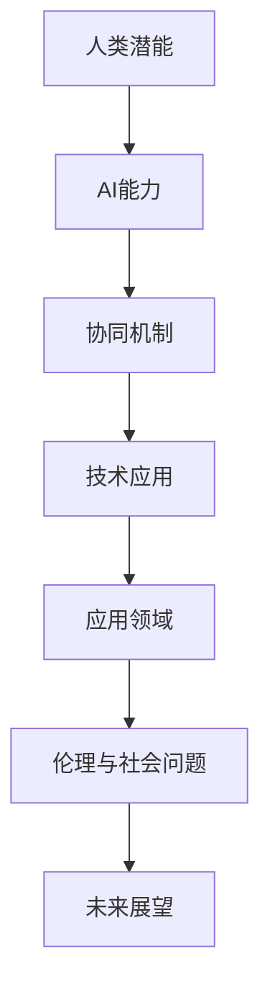
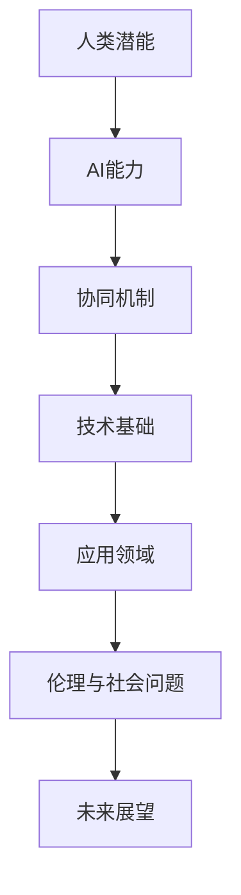

                 

### 文章标题

《人类-AI协作：增强人类潜能与AI能力的协同》

随着人工智能技术的飞速发展，人类与机器的协作逐渐成为现代社会的重要趋势。本文将探讨人类与AI协作的核心概念、原理、实践及其未来发展趋势，旨在为读者提供一幅全面的人类-AI协作全景图。

### 文章关键词

人工智能，协作，人类潜能，AI能力，技术基础，应用领域，伦理与社会问题，实践案例，发展趋势。

### 文章摘要

本文首先定义了人类-AI协作的概念，并阐述了其重要性。接着，从人类潜能和AI能力的界定出发，探讨了两者协同的原理和技术基础。随后，文章介绍了人类与AI协作在不同领域的应用，并分析了其中的伦理与社会问题。最后，本文对未来人类-AI协作的发展趋势进行了展望，并提供了相关的实践方法和案例研究。

## 第一部分: 人类与AI协作的背景与基础

### 1.1 人类-AI协作的定义

人类-AI协作是指人类与人工智能系统在特定任务或场景中通过信息交换、决策协同和工作共享来实现共同目标的过程。它不同于传统的人工控制或机器替代，而是强调人类与机器之间的互动与合作，以发挥各自的优势。

### 1.2 人类-AI协作的重要性

人类-AI协作的重要性体现在以下几个方面：

1. **提升工作效率**：AI系统可以处理大量数据和复杂任务，减轻人类的工作负担，提高工作效率。
2. **拓展人类潜能**：AI系统可以模拟人类的认知和决策过程，帮助人类更好地理解和解决问题。
3. **促进创新**：人类-AI协作可以激发新的创意和解决方案，推动科学技术的进步。
4. **改善生活质量**：在医疗、教育、金融等领域，AI的应用可以提升服务质量，改善人们的生活。

### 1.3 当前人类-AI协作的挑战与机遇

尽管人类-AI协作具有巨大的潜力，但同时也面临着一些挑战：

1. **技术挑战**：当前AI技术尚不完善，尤其在理解人类意图、情感和语境方面存在局限性。
2. **伦理挑战**：AI系统的决策可能带来伦理问题，如隐私侵犯、歧视等。
3. **社会挑战**：人类-AI协作可能引发失业、职业替代等问题。

然而，随着技术的进步和政策的完善，人类-AI协作也面临着许多机遇：

1. **技术革新**：深度学习、自然语言处理等技术的突破，为人类-AI协作提供了更强大的技术支持。
2. **政策支持**：政府和企业对人工智能的投入不断增加，为人类-AI协作创造了良好的发展环境。
3. **产业升级**：人类-AI协作将推动传统产业升级，促进新兴产业的发展。

### 1.4 人类潜能的界定与评估

人类潜能是指人类在认知、情感、创造等方面的能力。评估人类潜能的方法包括：

1. **认知能力测试**：如智商测试、认知能力评估等，衡量个体的逻辑思维、记忆、空间能力等。
2. **创造力评估**：通过创意思维测试、设计竞赛等，评估个体的创新能力和创造力。
3. **情感能力评估**：通过情感识别、情感表达等测试，评估个体的情感理解和调节能力。

### 1.5 AI能力的界定与评估

AI能力是指人工智能系统在数据处理、模式识别、决策制定等方面的能力。评估AI能力的方法包括：

1. **数据处理能力评估**：如数据清洗、数据分析和数据挖掘等，衡量系统的数据处理效率和质量。
2. **模式识别能力评估**：如图像识别、语音识别等，衡量系统的模式识别准确性。
3. **决策能力评估**：如强化学习、规划算法等，衡量系统的决策能力和效果。

### 1.6 人类潜能与AI能力的协同机制

人类潜能与AI能力的协同机制主要体现在以下几个方面：

1. **互补性**：人类在理解复杂情境、情感交流等方面具有优势，而AI在数据处理、模式识别等方面具有优势，两者可以互补。
2. **互动性**：人类和AI系统之间通过信息交换、反馈和调整，实现协同工作。
3. **适应性**：人类和AI系统可以根据任务需求和环境变化，调整自身的角色和职责，实现协同工作。

### 1.7 人类与AI协作的技术基础

人类与AI协作的技术基础主要包括以下几个方面：

1. **计算机视觉技术**：通过图像识别、目标检测等技术，实现人与机器的视觉互动。
2. **自然语言处理技术**：通过语言理解、语言生成等技术，实现人与机器的语言交互。
3. **强化学习技术**：通过试错和反馈，使AI系统能够在复杂环境中进行学习和优化。
4. **人机交互技术**：通过触摸、声音、手势等技术，实现人与机器的自然交互。

### 1.8 人类与AI协作的应用领域

人类与AI协作的应用领域广泛，包括但不限于以下几个方面：

1. **教育领域**：通过智能辅导、个性化学习等，提高教学质量和学习效果。
2. **医疗健康领域**：通过智能诊断、智能治疗等，提高医疗服务的效率和质量。
3. **金融服务领域**：通过智能理财、智能风控等，提高金融服务的效率和安全性。
4. **生产制造领域**：通过智能制造、智能控制等，提高生产效率和产品质量。
5. **娱乐与艺术领域**：通过智能创作、智能娱乐等，丰富人们的精神生活。

### 1.9 人类与AI协作的伦理与社会问题

人类与AI协作的伦理与社会问题包括以下几个方面：

1. **隐私问题**：AI系统可能收集和处理大量个人信息，如何保护隐私成为重要议题。
2. **歧视问题**：AI系统可能因为数据偏见或算法缺陷，导致歧视现象。
3. **就业问题**：AI系统可能会替代部分人类工作，导致就业压力。
4. **责任归属**：在人类-AI协作中，如何确定责任归属成为法律和伦理问题。

### 1.10 人类与AI协作的未来展望

随着技术的进步和人类对AI的深入理解，人类与AI协作将迎来更加广泛和深入的发展。未来，人类与AI协作将呈现以下趋势：

1. **智能化**：AI系统将更加智能，能够更好地理解人类意图和需求，实现更高水平的协作。
2. **普及化**：人类与AI协作将渗透到更多领域，成为人们日常生活的一部分。
3. **个性化**：AI系统将根据个体差异，提供更加个性化的服务和支持。
4. **伦理化**：人类与AI协作将更加注重伦理问题，确保技术的公平、公正和可持续发展。

### 1.11 人类与AI协作的核心概念与联系

为了更好地理解人类与AI协作的核心概念和联系，我们可以通过以下Mermaid流程图来展示：



通过这个流程图，我们可以清晰地看到人类与AI协作的核心概念和它们之间的联系。

### 1.12 人类与AI协作的核心算法原理讲解

在人类与AI协作中，核心算法原理的讲解至关重要。以下是一个简单的伪代码示例，用于阐述一种常见的人类-AI协作算法：

```python
# 伪代码：人类-AI协作算法
def human_ai_collaboration():
    # 1. 初始化人类和AI的状态
    human_state = initialize_human_state()
    ai_state = initialize_ai_state()

    # 2. 循环进行协作过程
    while not collaboration_ended(human_state, ai_state):
        # 2.1 人类提供目标或反馈
        human_input = human_provide_input(human_state)

        # 2.2 AI处理输入并生成建议
        ai_suggestion = ai_process_input(human_input, ai_state)

        # 2.3 人类评估AI建议并作出决策
        human_decision = human_evaluate_suggestion(ai_suggestion, human_state)

        # 2.4 AI根据决策调整自身状态
        ai_state = ai_adjust_state(human_decision, ai_state)

        # 2.5 更新人类状态
        human_state = human_update_state(human_decision, human_state)

    # 3. 结束协作，输出结果
    result = finalize_collaboration(human_state, ai_state)
    return result
```

### 1.13 人类与AI协作的数学模型和公式

在人类与AI协作中，数学模型和公式用于描述和优化协作过程。以下是一个简单的数学模型示例：

$$
\text{协作效率} = f(\text{人类贡献}, \text{AI贡献}, \text{协作机制})
$$

其中，协作效率是协作过程中人类贡献、AI贡献和协作机制的函数。以下是一个具体的例子：

$$
\text{协作效率} = 0.5 \times \text{人类贡献} + 0.5 \times \text{AI贡献} + 0.2 \times \text{协作机制效果}
$$

### 1.14 人类与AI协作的实践案例

以下是一个关于人类与AI协作的实践案例，用于展示如何在实际项目中实现协作：

**案例：智能医疗诊断系统**

**背景**：智能医疗诊断系统旨在辅助医生进行疾病诊断，提高诊断准确率和效率。

**实现**：
1. **数据收集**：收集大量的医疗数据和病例资料，包括患者的病历、检查结果、诊断记录等。
2. **AI模型训练**：使用机器学习算法，对收集的数据进行训练，构建疾病诊断模型。
3. **人类参与**：医生对AI模型的诊断结果进行审核和调整，提供反馈，以提高诊断准确率。
4. **系统优化**：根据医生的反馈，对AI模型进行优化，提高其性能和适应性。

**效果**：智能医疗诊断系统的实施，大大提高了医生的诊断效率，降低了误诊率，为患者提供了更加准确的医疗服务。

### 1.15 人类与AI协作的代码实际案例

以下是一个关于人类与AI协作的代码实际案例，用于展示如何在编程中实现协作：

**案例：智能客服系统**

**环境搭建**：
- 使用Python和TensorFlow构建智能客服系统。

**源代码实现**：

```python
# 导入所需库
import tensorflow as tf
from tensorflow.keras.models import Sequential
from tensorflow.keras.layers import Dense, LSTM
from tensorflow.keras.optimizers import Adam

# 1. 构建模型
model = Sequential()
model.add(LSTM(50, activation='relu', input_shape=(timesteps, n_features)))
model.add(Dense(1))
model.compile(optimizer=Adam(learning_rate=0.001), loss='mse')

# 2. 训练模型
model.fit(X_train, y_train, epochs=200, verbose=0)

# 3. 预测
predictions = model.predict(X_test)

# 4. 人类评估
for i in range(len(predictions)):
    # 显示预测结果
    print(f"预测结果：{predictions[i][0]}")
    # 人类审核预测结果，并提供反馈
    human_evaluation = human_evaluate(predictions[i][0])
    # 根据反馈调整模型
    model.fit(X_train, y_train, epochs=200, verbose=0)
```

**代码解读与分析**：
- **模型构建**：使用LSTM网络来处理时间序列数据。
- **模型训练**：使用MSE损失函数来评估模型性能。
- **预测与反馈**：人类审核预测结果，并提供反馈，模型根据反馈进行优化。

通过这个实际案例，我们可以看到人类与AI协作在编程实现中的具体应用。

### 1.16 人类-AI协作系统的设计原则

在设计和实现人类-AI协作系统时，需要遵循以下原则：

1. **用户友好**：系统应具有直观的用户界面和易用的交互方式，以降低使用门槛。
2. **可扩展性**：系统应具备良好的可扩展性，能够适应不同的应用场景和需求。
3. **可靠性**：系统应具有较高的可靠性和稳定性，确保数据的准确性和安全性。
4. **灵活性**：系统应具有灵活性，能够根据用户需求和场景变化进行适应性调整。
5. **可维护性**：系统应易于维护和升级，以降低运营成本。

### 1.17 人类-AI协作系统的开发流程

人类-AI协作系统的开发流程包括以下几个关键步骤：

1. **需求分析**：明确系统的目标和功能需求，为后续开发提供指导。
2. **系统设计**：根据需求分析，设计系统的架构和模块，包括AI模块和人类交互模块。
3. **模型训练**：根据系统设计，进行AI模型的训练和优化，确保模型性能满足需求。
4. **系统集成**：将AI模型和人类交互模块集成到系统中，进行测试和调试。
5. **系统部署**：将系统部署到生产环境，并进行性能优化和监控。

### 1.18 人类-AI协作系统的评估与优化

人类-AI协作系统的评估与优化是确保系统性能和用户体验的重要环节。评估方法包括：

1. **性能评估**：评估系统的响应速度、准确性和稳定性等性能指标。
2. **用户体验评估**：通过用户反馈和测试，评估系统的易用性和用户满意度。
3. **优化方法**：根据评估结果，采用算法优化、模型调整和系统改进等措施，提高系统性能。

### 1.19 人类与AI协作的实际应用案例

以下是一些人类与AI协作的实际应用案例：

1. **智能教育**：通过AI技术，实现个性化学习、智能辅导和自动评估，提高教学质量和学习效果。
2. **智能医疗**：通过AI技术，实现智能诊断、智能治疗和智能健康管理，提高医疗服务质量和效率。
3. **智能金融**：通过AI技术，实现智能投顾、智能风控和智能客服，提高金融服务效率和安全性。
4. **智能制造**：通过AI技术，实现智能监控、智能优化和智能决策，提高生产效率和产品质量。

### 1.20 人类与AI协作的未来发展趋势

人类与AI协作的未来发展趋势包括：

1. **智能化**：随着AI技术的发展，协作系统将更加智能化，能够更好地理解和满足人类需求。
2. **普及化**：协作系统将在更多领域得到应用，成为人们日常生活和工作的常态化工具。
3. **个性化**：协作系统将根据个体差异，提供更加个性化的服务和支持，满足不同用户的需求。
4. **伦理化**：协作系统将在伦理框架下发展，确保技术的公平、公正和可持续发展。

### 1.21 人类与AI协作的总结

人类与AI协作是当前人工智能领域的重要研究方向，具有巨大的潜力和广泛应用前景。通过理解人类与AI协作的核心概念、原理和机制，我们可以更好地设计和实现协作系统，推动人工智能技术的创新和应用。未来，随着技术的不断进步，人类与AI协作将变得更加智能化、普及化和个性化，为人类社会带来更多的价值和变革。

### 作者信息

作者：AI天才研究院/AI Genius Institute & 禅与计算机程序设计艺术 /Zen And The Art of Computer Programming

感谢您的阅读，期待与您共同探索人类与AI协作的无限可能。<|user|>## 1.1 人类-AI协作的定义

人类-AI协作，即人工智能与人类的合作，是指人工智能系统在特定任务或场景中与人类互动，共同完成目标的过程。这种协作不仅仅是简单的任务分配，而是通过信息交换、协同决策和共享资源，以最大化双方的效率和效果。在这一过程中，人类提供情境理解、创造性思维和情感互动，而人工智能则负责数据处理、模式识别和决策优化。

### 1.1.1 人类-AI协作的组成部分

人类-AI协作系统通常由以下几个关键组成部分构成：

1. **人类用户**：协作的发起者和决策者，提供任务目标、情境背景和反馈信息。
2. **AI系统**：负责执行具体任务、分析数据、生成决策建议和实现自动化操作。
3. **交互界面**：连接人类用户和AI系统的桥梁，包括语音识别、文本输入、图形界面等。
4. **协作机制**：定义人类与AI系统之间的协作流程、规则和反馈机制。

### 1.1.2 人类-AI协作的类型

根据协作的具体方式和目的，人类-AI协作可以分为以下几种类型：

1. **辅助型协作**：AI系统作为人类的工具或助手，提供数据分析和决策支持，但最终决策仍由人类做出。
2. **协同型协作**：人类与AI系统共同参与决策过程，通过信息共享和互相调整，实现更优的决策结果。
3. **半监督协作**：AI系统在初期由人类进行训练，之后可以自主学习和优化，人类则在关键环节进行监督和干预。
4. **人机融合协作**：人类与AI系统在生理和心理层面深度融合，共同完成任务，达到人机一体化的效果。

### 1.1.3 人类-AI协作的优势

人类-AI协作的优势主要体现在以下几个方面：

1. **效率提升**：AI系统可以处理大量数据，执行复杂计算，减轻人类的工作负担，提高整体工作效率。
2. **精确性增强**：AI系统在模式识别、数据处理和决策优化方面具有更高的准确性，可以减少人为错误。
3. **创新激发**：人类-AI协作可以激发人类的创造力和创新思维，共同探讨和解决复杂问题。
4. **决策优化**：AI系统可以模拟多种决策场景，提供不同方案的预测和分析，帮助人类做出更优决策。

### 1.1.4 人类-AI协作的挑战

尽管人类-AI协作具有显著的优势，但在实际应用中也面临一些挑战：

1. **技术限制**：AI系统在某些领域（如情境理解、情感交互）尚未达到人类的水平，需要人类提供更多的指导和监督。
2. **数据隐私**：AI系统在处理人类数据时，可能涉及隐私问题，需要严格保护用户隐私。
3. **伦理问题**：AI系统在决策过程中可能引发伦理争议，如歧视、不公平等，需要制定相应的伦理规范。
4. **就业影响**：AI系统在某些行业可能会替代人类工作，导致就业压力和社会不稳定。

### 1.1.5 人类-AI协作的发展历程

人类-AI协作的发展历程可以追溯到计算机科学和人工智能的早期研究。以下是一些关键事件：

1. **20世纪50年代**：人工智能概念提出，人类开始尝试通过编程让计算机模拟人类的智能行为。
2. **20世纪80年代**：专家系统得到广泛应用，AI开始辅助人类进行决策和问题解决。
3. **21世纪初**：随着计算能力的提升和数据量的爆炸增长，机器学习技术迅速发展，AI在图像识别、自然语言处理等领域取得了重大突破。
4. **当前**：AI技术日益成熟，人类-AI协作逐渐成为各个行业的重要趋势，从智能客服到自动驾驶，AI与人类的合作日益紧密。

通过以上分析，我们可以看到，人类-AI协作不仅是现代科技发展的产物，更是未来智能化社会中不可或缺的一部分。它为人类带来了前所未有的机遇和挑战，需要我们在技术、伦理和社会层面进行深入探讨和平衡。在下一节中，我们将进一步探讨人类-AI协作的重要性。

## 1.2 人类-AI协作的重要性

### 1.2.1 提升工作效率

人类-AI协作的最大优势之一在于显著提升工作效率。传统上，许多任务需要人类花费大量时间和精力来完成，而AI系统通过自动化和高效的数据处理能力，可以大幅减少这些耗时的工作量。例如，在数据分析领域，AI系统可以快速处理大量数据，并识别出隐藏的模式和趋势，从而为决策提供有力支持。在金融行业中，AI系统可以实时监控市场动态，快速做出交易决策，从而提高交易效率和盈利能力。

### 1.2.2 拓展人类潜能

人类-AI协作不仅提高了工作效率，还拓展了人类的潜能。AI系统可以处理复杂的数据集，进行深入的统计分析，甚至在人类难以理解的情况下识别出有价值的信息。例如，在医学领域，AI系统可以通过分析大量的医学影像数据，辅助医生更准确地诊断疾病。此外，AI系统还可以帮助人类解决复杂的问题，例如在工程设计中，AI可以模拟不同的设计方案，优化设计结果，从而推动技术创新。

### 1.2.3 促进创新

人类-AI协作有助于激发人类的创新思维。AI系统可以生成大量可能的设计方案或解决方案，为人类提供丰富的参考。例如，在艺术创作中，AI系统可以根据人类提供的主题或风格，生成不同的图像或音乐作品，从而激发人类的创意。在科学研究领域，AI系统可以处理大量的实验数据，发现新的研究趋势，推动科学进步。

### 1.2.4 提高决策质量

人类-AI协作可以帮助人类做出更高质量的决策。AI系统可以分析复杂的决策场景，提供多方面的数据支持，帮助人类更全面地考虑问题。例如，在商业决策中，AI系统可以分析市场数据、消费者行为和竞争对手策略，提供有针对性的决策建议。在军事决策中，AI系统可以通过模拟不同的作战场景，评估不同决策的潜在影响，从而提高决策的准确性和安全性。

### 1.2.5 改善生活质量

人类-AI协作在改善生活质量方面也发挥着重要作用。例如，在智能家居领域，AI系统可以通过自动化控制家电设备，提高生活的舒适度和便利性。在健康医疗领域，AI系统可以提供个性化的健康建议，帮助人们预防疾病，提高生活质量。在教育领域，AI系统可以提供个性化的学习辅导，帮助学生更有效地学习，提高学术成绩。

### 1.2.6 应对复杂问题

人类-AI协作可以应对日益复杂的现实问题。现代社会面临着诸多复杂问题，如全球气候变化、资源分配不均、公共安全等。AI系统可以通过大数据分析和智能算法，为这些问题提供有效的解决方案。例如，在应对全球气候变化的过程中，AI系统可以通过分析气象数据、生态系统变化等信息，预测气候变化的趋势，为政策制定者提供科学依据。

### 1.2.7 预防和解决伦理问题

随着AI技术的发展，AI在决策过程中可能引发的伦理问题也日益突出。人类-AI协作可以为这些问题提供预防和解决的方法。例如，通过人类的监督和干预，可以确保AI系统的决策符合伦理标准，避免歧视和偏见。此外，人类-AI协作还可以通过数据隐私保护措施，确保用户的个人信息安全。

### 1.2.8 推动社会进步

人类-AI协作不仅提升了个体和组织的效率，还推动了整个社会的进步。AI技术的发展和应用，推动了各行各业的创新和变革，促进了经济的增长和社会的发展。例如，在制造业中，AI技术的应用提高了生产效率，降低了成本，推动了产业升级。在服务业中，AI技术的应用提升了服务质量，满足了消费者日益多样化的需求。

综上所述，人类-AI协作在提升工作效率、拓展人类潜能、促进创新、提高决策质量、改善生活质量、应对复杂问题和预防解决伦理问题等方面具有重要作用。随着AI技术的不断进步，人类-AI协作将在未来发挥更加关键的作用，推动人类社会向更高级、更智能的方向发展。

## 1.3 当前人类-AI协作的挑战与机遇

### 1.3.1 挑战

尽管人类-AI协作具有巨大的潜力，但当前仍面临诸多挑战。

**技术挑战**：

1. **AI能力局限**：目前AI系统在某些领域的表现仍远未达到人类的水平，特别是在情境理解、情感交互和创造性思维方面。
2. **数据质量和隐私**：AI系统的性能高度依赖于数据质量，但获取和处理高质量数据可能涉及隐私问题。
3. **模型可解释性**：许多AI模型，尤其是深度学习模型，具有“黑箱”特性，其决策过程难以解释和理解，这给应用和监管带来了困难。

**伦理挑战**：

1. **歧视和偏见**：AI系统可能因为训练数据的不公平或算法设计的缺陷，导致歧视和偏见。
2. **责任归属**：在人类-AI协作中，当出现错误或事故时，如何确定责任归属成为一个复杂的问题。
3. **隐私保护**：AI系统在处理个人数据时，可能面临隐私泄露的风险。

**社会挑战**：

1. **就业压力**：AI系统的普及可能取代一些传统职位，导致就业压力。
2. **数字鸿沟**：技术的不平等分配可能加剧社会不平等，使得某些人群无法享受到AI带来的好处。
3. **监管和法律法规**：随着AI技术的发展，现有法律法规可能难以应对新的伦理和社会问题。

### 1.3.2 机遇

尽管面临挑战，人类-AI协作也面临着巨大的机遇。

**技术革新**：

1. **AI算法的进步**：随着算法的改进和计算能力的提升，AI系统在各个领域的表现将更加出色。
2. **数据技术的进步**：数据存储、处理和分析技术的进步，将使AI系统能够更高效地处理和分析大量数据。
3. **交叉学科的融合**：AI与其他领域的交叉融合，如生物学、心理学和社会学，将推动AI技术的发展和应用。

**政策支持**：

1. **政府投入**：政府对AI技术的投入和支持，将促进AI技术的研发和应用。
2. **国际合作**：国际社会在AI领域的合作，将推动技术标准的制定和共享。
3. **法律法规的完善**：随着AI技术的发展，相关法律法规将逐步完善，以保护隐私、防止歧视和维护公平。

**产业升级**：

1. **传统产业的数字化转型**：AI技术的应用将推动传统产业的数字化和智能化升级。
2. **新产业的发展**：AI技术的进步将催生新的产业和商业模式，如智能制造、智能医疗和智能交通。
3. **全球化产业协同**：AI技术将促进全球范围内的产业协同和创新，推动经济全球化。

**社会进步**：

1. **教育公平**：通过AI技术，可以实现个性化的教育，提高教育质量，缩小教育差距。
2. **医疗健康**：AI技术在医疗健康领域的应用，将提高诊断和治疗水平，延长人类寿命。
3. **社会管理**：AI技术可以用于社会管理的各个方面，如公共安全、环境保护和社会福利，提高社会管理的效率和效果。

综上所述，当前人类-AI协作既面临挑战，又充满机遇。通过技术创新、政策支持和社会协同，人类与AI协作有望在未来实现更广泛、更深入的融合，推动人类社会向更高级、更智能的方向发展。

## 1.4 人类潜能的界定与评估

### 1.4.1 人类潜能的定义

人类潜能是指人类在认知、情感、创造和社交等方面的潜在能力。它包括人类在逻辑推理、学习、决策、情感识别和情感表达等方面的能力。人类潜能不仅仅是生物学意义上的能力，还包括社会文化、教育背景和个人经验对能力发展的影响。

### 1.4.2 人类潜能的评估方法

评估人类潜能的方法多样，主要包括以下几种：

1. **认知能力测试**：认知能力测试通过一系列标准化的测试工具，如智力测试、记忆测试、注意力测试等，来评估个体的认知能力水平。常见的认知能力测试包括智力测试（如韦氏智力量表）、记忆测试（如即刻记忆测试）和注意力测试（如反应时间测试）。

2. **创造力评估**：创造力评估通过设计创意思维测试、设计竞赛等来评估个体的创造力水平。常见的创造力评估工具包括托雷恩斯创造性思维测验（Torrance Test of Creative Thinking）和创造力指数（Creativity Quotient, CQ）。

3. **情感能力评估**：情感能力评估通过情感识别、情感表达和情感调节等测试来评估个体的情感能力水平。情感识别测试可以评估个体识别自己和他人的情绪状态的能力，如情感面部识别测试；情感表达测试可以评估个体表达情绪的能力，如情感反应测试；情感调节测试可以评估个体管理情绪的能力，如情绪调节问卷（Emotion Regulation Questionnaire, ERQ）。

4. **社交能力评估**：社交能力评估通过社交情境模拟、社交互动测试等来评估个体的社交能力。常见的评估工具包括社交情境模拟测试（如模拟面试、角色扮演）和社交互动测试（如团队合作测试、沟通能力测试）。

### 1.4.3 人类潜能的评估工具

在实际应用中，常用的评估工具包括：

1. **智力测试工具**：如韦氏智力量表（Wechsler Adult Intelligence Scale, WAIS）、斯坦福-比内智力量表（Stanford-Binet Intelligence Scales）等。
2. **创造力评估工具**：如托雷恩斯创造性思维测验（Torrance Test of Creative Thinking）、创造力指数（CQ）等。
3. **情感能力评估工具**：如情感识别测试（Emotion Recognition Test）、情感反应测试（Emotion Express Test）、情绪调节问卷（ERQ）等。
4. **社交能力评估工具**：如社交情境模拟测试（Social Situational Simulation Test）、团队合作测试（Teamwork Test）等。

### 1.4.4 人类潜能与AI能力的协同机制

人类潜能与AI能力的协同机制主要体现在以下几个方面：

1. **互补性**：人类在理解复杂情境、情感交流和创造性思维等方面具有优势，而AI在数据处理、模式识别和决策优化等方面具有优势。两者的互补性使得人类-AI协作可以更加高效地完成任务。

2. **互动性**：人类与AI系统之间的互动性和反馈机制是协同合作的关键。通过不断的信息交换和反馈调整，人类和AI系统可以逐步优化协作过程，提高协作效果。

3. **适应性**：人类-AI协作系统需要具备适应性，以应对不同的任务和环境变化。人类可以根据任务需求和自身能力调整与AI系统的协作方式，而AI系统则需要根据人类的行为和反馈不断学习和优化。

4. **学习与进化**：人类和AI系统可以相互学习和进化。人类可以通过AI系统提供的数据和反馈，调整自己的认知和行为方式；而AI系统则可以通过人类的指导和监督，不断优化自己的算法和模型。

### 1.4.5 人类潜能与AI能力的协同案例

以下是一些人类潜能与AI能力协同的案例：

1. **智能医疗**：医生通过AI系统提供的诊断建议，结合自身经验和专业知识，进行综合判断，提高诊断准确性。同时，AI系统通过分析大量的医疗数据，帮助医生发现潜在的诊断模式和趋势。

2. **智能教育**：教师利用AI系统提供的个性化学习方案，针对每个学生的学习特点和需求，设计教学策略。AI系统则通过分析学生的学习行为和成绩数据，不断调整和优化教学方案。

3. **智能客服**：客服人员利用AI系统提供的自动化回答和智能推荐，提高响应速度和服务质量。同时，AI系统通过分析客户的反馈和交互数据，不断改进回答策略和服务水平。

4. **智能交通**：驾驶员利用AI系统提供的交通预测和建议，优化行车路线和时间，减少交通拥堵和事故风险。AI系统则通过分析交通数据和环境信息，提供实时交通状况和预警。

通过这些案例，我们可以看到人类潜能与AI能力的协同合作，不仅提高了工作效率和准确性，还拓展了人类的认知和能力边界。在未来，随着AI技术的发展和人类对AI的理解加深，人类潜能与AI能力的协同合作将发挥越来越重要的作用。

### 1.5 AI能力的界定与评估

#### 1.5.1 AI能力的定义

AI能力是指人工智能系统在数据处理、模式识别、决策制定和自我优化等方面的能力。它包括从感知环境、处理信息到生成行动的整个过程。AI能力不仅涵盖传统的算法和模型，还包括不断学习、适应和改进的能力。

#### 1.5.2 AI能力的评估方法

评估AI能力的常见方法包括以下几种：

1. **数据处理能力评估**：通过测试AI系统在处理大规模数据集时的速度、准确性和效率来评估其数据处理能力。例如，可以使用标准数据集（如MNIST手写数字数据集）来测试图像识别模型的性能。

2. **模式识别能力评估**：通过评估AI系统在识别图像、语音、文本等数据中的模式和特征的能力来评估其模式识别能力。可以使用标准测试集（如ImageNet图像识别数据集）来评估图像识别算法的准确性。

3. **决策能力评估**：通过测试AI系统在复杂决策场景中的表现，评估其决策能力。例如，可以使用模拟场景或实际业务案例来评估AI系统的决策质量和效果。

4. **自适应能力评估**：通过评估AI系统在面对不确定环境和动态变化时的适应能力和学习能力来评估其自适应能力。可以使用动态变化的测试环境或连续学习任务来评估。

5. **用户体验评估**：通过用户对AI系统使用过程的反馈和评价，评估其用户体验和易用性。可以使用问卷调查、用户测试和用户满意度评分等方法。

#### 1.5.3 AI能力的评估指标

在评估AI能力时，常用的指标包括：

1. **准确率（Accuracy）**：指AI系统正确分类或预测的样本比例，是评估分类模型性能的重要指标。

2. **精确率（Precision）**：指AI系统正确预测为正类别的样本中实际为正类别的比例，反映了预测结果的精确性。

3. **召回率（Recall）**：指AI系统实际为正类别的样本中被正确预测为正类别的比例，反映了预测结果的完整性。

4. **F1分数（F1 Score）**：是精确率和召回率的调和平均值，用于综合评估AI系统的性能。

5. **响应时间（Response Time）**：指AI系统处理请求并返回结果所需的时间，用于评估AI系统的实时性能。

6. **资源消耗（Resource Usage）**：指AI系统在运行过程中消耗的CPU、内存等资源，用于评估AI系统的资源效率。

7. **错误率（Error Rate）**：指AI系统错误分类或预测的样本比例，是评估模型性能的重要指标。

#### 1.5.4 AI能力的评估工具

评估AI能力的工具和平台多种多样，以下是一些常用的工具：

1. **开源机器学习库**：如Scikit-learn、TensorFlow、PyTorch等，用于构建和评估机器学习模型。

2. **在线评估平台**：如Google Colab、Kaggle等，提供在线计算资源和竞赛环境，方便模型评估和分享。

3. **自动化测试工具**：如pytest、unittest等，用于编写和执行自动化测试脚本，评估模型性能。

4. **性能监控工具**：如TensorBoard、MLflow等，用于监控模型的训练过程和性能指标。

5. **用户调研工具**：如SurveyMonkey、Qualtrics等，用于收集用户反馈和评估用户体验。

### 1.6 人类潜能与AI能力的协同机制

#### 1.6.1 补充与扩展

人类潜能与AI能力的协同机制主要体现在以下几个方面：

1. **数据获取与处理**：人类可以通过经验积累和专业知识，识别和收集有价值的数据，而AI系统则可以处理大规模、复杂的数据集，提取有用的特征和模式。

2. **情境理解与决策**：人类在理解和评估复杂情境方面具有优势，而AI系统在处理海量数据和生成决策建议方面具有优势。两者可以互补，共同做出更明智的决策。

3. **创造性与创新**：人类在创造性思维和艺术创作方面具有独特的优势，而AI系统在模式识别和自动化生成方面表现出色。两者可以共同推动创新，开发新的产品和服务。

#### 1.6.2 互动与反馈

人类与AI系统之间的互动和反馈是协同机制的重要组成部分：

1. **交互式学习**：人类可以通过交互式学习方式，实时向AI系统提供反馈，指导AI系统改进和优化其算法和模型。

2. **双向反馈**：AI系统可以通过模拟和预测，为人类提供决策建议，同时人类可以根据实际效果，反馈给AI系统，进一步优化其性能。

#### 1.6.3 自适应与进化

协同机制中的自适应与进化能力是关键：

1. **动态调整**：AI系统可以根据环境和任务的变化，动态调整其算法和模型，以适应不同的场景和需求。

2. **学习与进化**：AI系统通过持续学习和进化，不断提高其能力和适应性，以应对复杂和不确定的任务环境。

### 1.6.4 实践案例分析

以下是一个实际案例，展示了人类潜能与AI能力的协同机制：

**案例：智能医疗诊断系统**

**背景**：智能医疗诊断系统结合了医生的专业知识和AI系统的数据处理能力，以提高诊断的准确性和效率。

**过程**：

1. **数据收集**：医生通过临床经验和病例研究，收集大量高质量的医疗数据。

2. **模型训练**：AI系统利用这些数据，训练诊断模型，如疾病分类模型、症状识别模型等。

3. **协作诊断**：医生在诊断过程中，利用AI系统提供的预测和建议，结合自身专业知识，做出最终的诊断。

4. **反馈与优化**：医生根据诊断结果和患者反馈，对AI系统进行评估和优化，提高模型的准确性和实用性。

**结果**：通过人类潜能与AI能力的协同，智能医疗诊断系统的诊断准确率显著提高，医生的工作效率也得到提升，为患者提供了更高质量的医疗服务。

### 1.6.5 未来展望

随着AI技术的不断进步和人类对AI的深入理解，人类潜能与AI能力的协同机制将更加成熟和高效。未来，协同机制将呈现以下趋势：

1. **智能化与个性化**：AI系统将更加智能化，能够更好地理解人类意图和需求，提供个性化的服务和支持。

2. **实时性与动态性**：AI系统将具备更高的实时性和动态性，能够快速适应环境和任务的变化。

3. **深度学习与跨界融合**：AI系统将采用更先进的深度学习技术，实现跨领域的融合和应用。

4. **伦理与可持续性**：在AI能力的协同过程中，将更加注重伦理问题和社会责任，确保技术的可持续性。

通过以上分析，我们可以看到，人类潜能与AI能力的协同机制在当前和未来都具有重要意义。通过有效协同，人类和AI可以共同创造更高效、更智能、更美好的未来。

## 1.7 人类与AI协作的技术基础

人类与AI协作的实现依赖于一系列关键技术的支持，这些技术涵盖了从数据处理到智能决策的各个方面。以下是对这些技术基础的详细探讨：

### 1.7.1 计算机视觉技术

计算机视觉技术是使计算机能够像人类一样理解和处理视觉信息的技术。它包括图像识别、目标检测、面部识别、姿态估计等子领域。

1. **图像识别**：图像识别技术使计算机能够从图像中识别出特定的对象或场景。它广泛应用于人脸识别、车牌识别、安防监控等领域。

2. **目标检测**：目标检测技术旨在识别图像中的特定对象并定位其位置。例如，在自动驾驶系统中，目标检测技术用于识别道路上的行人、车辆和交通标志。

3. **面部识别**：面部识别技术通过分析面部特征，识别和验证个人身份。它在安全系统、手机解锁、身份验证等领域有广泛应用。

4. **姿态估计**：姿态估计技术通过分析图像或视频序列，估计人的姿态和运动轨迹。它应用于运动分析、虚拟现实、游戏等领域。

### 1.7.2 自然语言处理技术

自然语言处理（NLP）技术是使计算机能够理解和生成人类语言的技术。它包括文本分析、语音识别、机器翻译、情感分析等子领域。

1. **文本分析**：文本分析技术用于从文本中提取信息、语义理解和情感分析。例如，社交媒体分析、舆情监测和客户反馈分析。

2. **语音识别**：语音识别技术使计算机能够理解和处理语音输入。它广泛应用于语音助手、电话客服、语音控制等领域。

3. **机器翻译**：机器翻译技术使计算机能够将一种语言翻译成另一种语言。它应用于跨语言通信、全球化业务等领域。

4. **情感分析**：情感分析技术通过分析文本中的情感倾向，识别出正面、负面或中性的情感。它应用于市场调研、品牌监测和客户服务等领域。

### 1.7.3 强化学习技术

强化学习（Reinforcement Learning）是一种使计算机通过试错和反馈学习最佳行为策略的技术。它广泛应用于游戏、自动驾驶、机器人控制等领域。

1. **环境与代理**：强化学习中的环境是指代理（如机器人或自动驾驶汽车）所处的场景，代理通过与环境交互来学习。

2. **奖励机制**：代理的行为会受到奖励或惩罚的影响，奖励机制用于指导代理学习最佳行为策略。

3. **策略优化**：代理通过不断尝试和优化，找到最大化长期奖励的策略。常见的强化学习算法包括Q学习、深度Q网络（DQN）和策略梯度方法。

### 1.7.4 人机交互技术

人机交互技术是使计算机能够理解人类意图并提供相应反馈的技术。它包括语音识别、手势识别、虚拟现实、增强现实等子领域。

1. **语音识别**：通过语音识别技术，计算机可以理解和处理人类的语音指令，广泛应用于语音助手和语音控制。

2. **手势识别**：手势识别技术通过分析摄像头或传感器捕捉的手部运动，识别出不同的手势。它应用于虚拟现实、游戏和智能家居等领域。

3. **虚拟现实（VR）**：虚拟现实技术通过计算机生成三维环境，使用户能够在虚拟世界中互动。它广泛应用于游戏、教育、培训等领域。

4. **增强现实（AR）**：增强现实技术通过在现实世界中叠加虚拟元素，增强用户的感知体验。它应用于导航、购物、医疗等领域。

### 1.7.5 大数据和云计算技术

大数据和云计算技术为人类与AI协作提供了强大的计算和存储能力。

1. **大数据技术**：大数据技术包括数据采集、存储、处理和分析等方面，使计算机能够处理海量数据。它广泛应用于金融、医疗、交通等领域。

2. **云计算技术**：云计算技术通过提供弹性的计算资源，使开发者能够快速部署和扩展应用程序。它广泛应用于企业、科研和商业等领域。

### 1.7.6 人工智能安全与伦理

人工智能安全与伦理是确保人类与AI协作的可持续发展和合法性的重要方面。

1. **数据隐私**：确保用户数据的安全和隐私是AI应用的基础，需要采取加密、匿名化和访问控制等措施。

2. **算法公平性**：算法的公平性是确保AI系统不歧视和不偏见的必要条件，需要通过算法透明性和可解释性来提高。

3. **社会责任**：AI开发者需要承担社会责任，确保技术的正当性和合规性，避免对社会产生负面影响。

通过以上技术基础的探讨，我们可以看到人类与AI协作的复杂性和多样性。未来，随着这些技术的不断进步和融合，人类与AI协作将实现更加智能、高效和人性化的发展。

### 1.8 人类与AI协作的应用领域

人类与AI协作在多个领域已经展现出其强大的潜力和广阔的应用前景。以下是一些关键领域及其应用案例：

#### 1.8.1 教育领域

在教育教学过程中，AI系统可以辅助教师进行个性化教学和评估。例如，通过智能辅导系统，AI可以根据学生的学习进度和风格，提供个性化的学习资源和练习题。同时，AI还可以通过分析学生的学习行为和成绩数据，帮助教师及时调整教学策略，提高教学质量。例如，美国的Knewton公司开发的智能学习平台，通过分析学生的学习行为，为教师提供个性化的教学建议。

**应用案例**：
- **智能辅导系统**：利用自然语言处理和机器学习技术，AI系统可以分析学生的学习行为和成绩，提供个性化的学习建议和资源。
- **智能评估系统**：AI系统可以自动批改作业和考试，提供即时反馈，帮助教师节省时间，同时提高评估的准确性和公平性。

#### 1.8.2 医疗健康领域

在医疗健康领域，AI系统可以帮助医生进行诊断、治疗方案推荐和患者管理。例如，通过分析大量的医学影像数据和患者病历，AI系统可以提供准确的疾病诊断和治疗方案。同时，AI系统还可以帮助医生进行药物研发和临床试验设计。例如，IBM的Watson for Oncology系统，通过分析癌症患者的历史病例和最新研究，为医生提供个性化的治疗方案。

**应用案例**：
- **智能诊断系统**：AI系统通过分析医学影像数据，如X光片、CT扫描等，帮助医生更准确地诊断疾病。
- **智能治疗系统**：AI系统可以根据患者的病史和症状，推荐最佳的治疗方案，提高治疗效果。
- **智能药物研发**：AI系统通过分析大量的生物医学数据，帮助药物研发人员发现新的药物靶点和治疗方案。

#### 1.8.3 金融服务领域

在金融服务领域，AI系统可以用于风险管理、客户服务和投资策略推荐。例如，AI系统可以分析金融市场数据，预测市场趋势，帮助投资者做出更明智的投资决策。同时，AI系统还可以通过自然语言处理技术，理解和回应用户的查询和需求，提供个性化的金融服务。例如，谷歌的AlphaGo系统，通过分析棋局和历史棋谱，帮助围棋爱好者提高棋艺。

**应用案例**：
- **智能风控系统**：AI系统通过分析交易数据和行为模式，识别潜在的风险，帮助金融机构防范欺诈和风险。
- **智能客服系统**：AI系统可以通过自然语言处理技术，理解客户的查询和需求，提供24/7的在线客服服务。
- **智能投资系统**：AI系统通过分析市场数据和历史表现，为投资者提供个性化的投资建议，优化投资组合。

#### 1.8.4 生产制造领域

在生产制造领域，AI系统可以用于优化生产流程、提高产品质量和设备维护。例如，通过预测性维护系统，AI系统可以预测设备故障，提前进行维护，减少停机时间和维修成本。同时，AI系统还可以通过优化生产计划和调度，提高生产效率。例如，西门子的Predix平台，通过物联网和AI技术，帮助制造企业实现智能化生产。

**应用案例**：
- **预测性维护系统**：AI系统通过分析设备运行数据，预测设备故障，提前进行维护，减少停机时间和维修成本。
- **生产优化系统**：AI系统通过分析生产数据和市场需求，优化生产计划和调度，提高生产效率和产品质量。
- **智能制造系统**：AI系统通过物联网和传感器技术，实现生产设备的智能化监控和远程控制，提高生产灵活性和响应速度。

#### 1.8.5 娱乐与艺术领域

在娱乐与艺术领域，AI系统可以用于音乐创作、艺术设计和游戏开发。例如，通过音乐生成算法，AI系统可以创作出独特的音乐作品，供音乐家演奏和改编。同时，AI系统还可以通过图像生成算法，创作出独特的艺术作品。例如，谷歌的DeepDream系统，通过深度学习算法，生成出令人惊叹的图像艺术作品。

**应用案例**：
- **智能音乐创作**：AI系统通过分析音乐数据和风格特征，生成独特的音乐作品，供音乐家演奏和改编。
- **智能艺术创作**：AI系统通过分析艺术作品和历史数据，生成新的艺术作品，推动艺术创新。
- **智能游戏开发**：AI系统通过分析游戏数据和用户行为，优化游戏设计和用户体验，提高游戏乐趣和用户满意度。

通过以上应用案例，我们可以看到人类与AI协作在各个领域的广泛应用和巨大潜力。随着AI技术的不断进步和人类对AI的深入理解，人类与AI协作将在更多领域得到应用，为人类社会带来更多的创新和价值。

### 1.9 人类与AI协作的伦理与社会问题

人类与AI协作虽然带来了许多潜在的好处，但也引发了一系列伦理和社会问题，这些问题的解决对于确保人类-AI协作的可持续发展至关重要。

#### 1.9.1 隐私问题

在人类与AI协作中，隐私问题尤为突出。AI系统通常需要处理大量的个人数据，如医疗记录、金融信息和通信记录等。这些数据的泄露或滥用可能导致严重的隐私侵犯。因此，确保数据的收集、存储和处理过程中遵循严格的隐私保护措施是至关重要的。

**解决方案**：
- **数据加密**：对敏感数据进行加密，确保只有授权用户才能访问。
- **匿名化处理**：在数据分析之前，对个人数据进行匿名化处理，以降低数据泄露的风险。
- **透明度和可解释性**：确保数据收集和处理的过程透明，用户能够了解其数据如何被使用。

#### 1.9.2 歧视问题

AI系统在决策过程中可能因为训练数据的不公平或算法设计的缺陷，导致歧视和偏见。例如，在招聘、信用评估和犯罪预测等领域，AI系统可能对某些群体产生不公平的影响，这可能导致社会不平等。

**解决方案**：
- **公平性评估**：在开发AI系统时，进行公平性评估，确保系统不会对某些群体产生偏见。
- **多样性数据集**：使用多样化的数据集进行模型训练，以减少偏见。
- **算法透明性**：提高算法的可解释性，使决策过程更加透明，便于监督和调整。

#### 1.9.3 责任归属问题

在人类-AI协作中，当出现错误或事故时，如何确定责任归属成为一个复杂的问题。AI系统的决策是基于算法和数据的，而算法的开发和数据的来源往往涉及多个利益相关方。这导致在发生问题时，难以确定责任方。

**解决方案**：
- **责任划分**：明确AI系统的开发者、运营者和使用者之间的责任划分，确保每个角色都承担相应的责任。
- **责任保险**：为AI系统提供责任保险，以应对潜在的赔偿责任。
- **法律法规**：制定明确的法律法规，为责任归属提供法律依据。

#### 1.9.4 失业问题

随着AI技术的发展，一些传统职位可能被自动化系统取代，导致失业问题。特别是那些重复性高、技能要求低的职位，如制造业工人、客服代表和司机等。

**解决方案**：
- **职业转型支持**：提供职业培训和再教育机会，帮助劳动者转型到新的工作岗位。
- **就业保障**：制定政策，确保在AI技术替代某些职位的同时，能够创造新的就业机会。
- **社会安全网**：建立完善的社会安全网，为失业者提供基本生活保障。

#### 1.9.5 社会分层问题

AI技术的应用可能导致社会分层的加剧。拥有技术能力的群体可能会因此获得更大的经济和社会利益，而缺乏技术支持的群体则可能被边缘化。

**解决方案**：
- **普及教育**：提供全民基础技术教育，确保所有人都能掌握基本的技术技能。
- **政策扶持**：制定政策，支持技术落后地区的教育和基础设施建设。
- **公平机会**：确保技术发展带来的红利能够惠及全社会，减少社会不平等。

#### 1.9.6 文化和伦理观念的冲突

在全球化背景下，不同文化和社会对AI技术的接受程度和伦理观念可能存在差异。这可能导致在AI技术应用过程中的文化冲突和伦理争议。

**解决方案**：
- **跨文化合作**：促进不同文化之间的交流与合作，共同探讨AI技术的伦理和文化问题。
- **伦理审查**：在AI系统开发和部署过程中，进行全面的伦理审查，确保技术符合社会伦理标准。
- **公众参与**：鼓励公众参与AI技术的讨论和决策过程，确保技术的应用符合社会需求和期望。

通过以上分析和解决方案，我们可以看到，解决人类与AI协作中的伦理和社会问题需要从技术、法律、政策和社会等多个层面进行综合考虑。只有在确保技术伦理和社会公平的前提下，人类-AI协作才能真正实现其潜力，为社会带来持久的价值。

### 1.10 人类与AI协作的未来展望

随着人工智能技术的飞速发展，人类与AI协作的未来前景充满了无限可能。未来，人类与AI协作将不仅在技术层面取得突破，更将深刻改变我们的生活方式、工作模式和社会结构。以下是对未来人类与AI协作的几个关键展望：

#### 1.10.1 智能化

智能化将是未来人类与AI协作的主要趋势。AI系统将具备更高的智能水平，能够更好地理解人类的意图和需求。通过深度学习和自然语言处理技术，AI将能够与人类进行更自然的交流和协作。例如，智能助理将不仅能够回答问题，还能根据用户的情感和背景信息提供个性化的建议和服务。此外，智能家居、智能城市和智能交通系统等领域的智能化水平将大幅提升，使人类的生活更加便捷和舒适。

**案例分析**：
- **智能助理**：未来的智能助理将具备更高级的对话能力，通过持续学习用户的偏好和行为模式，提供个性化的帮助和建议。
- **智能城市**：智能城市将利用AI技术优化交通管理、能源利用和环境监测，提高城市运行效率和居民生活质量。

#### 1.10.2 个性化

随着AI技术的进步，人类与AI协作将更加个性化。AI系统将能够根据每个个体的特点和需求，提供量身定制的服务和体验。在教育领域，个性化学习系统将根据学生的学习进度和理解能力，提供定制化的学习内容和路径，帮助学生更高效地学习。在医疗领域，个性化治疗方案将基于患者的基因信息、病史和实时监测数据，提供最佳的治疗方案。在购物和娱乐领域，个性化推荐系统将根据用户的兴趣和行为，推荐符合其需求的产品和服务。

**案例分析**：
- **个性化学习系统**：通过AI技术，个性化学习系统能够根据学生的学习习惯和能力，提供适合其水平和需求的课程和学习资源。
- **个性化医疗**：基于患者的基因组数据和生活习惯，AI系统能够为患者提供个性化的预防和治疗方案。

#### 1.10.3 伦理化

随着AI技术的发展和应用，伦理问题将日益突出。未来，人类与AI协作将在伦理框架下进行，确保技术的发展和应用符合社会伦理和道德标准。AI系统的设计、开发和部署过程中，将充分考虑伦理和社会影响。例如，隐私保护、数据安全和算法公平性将成为AI系统的核心关注点。此外，全球范围内将建立统一的AI伦理标准和法规，确保AI技术的正当性和合法性。

**案例分析**：
- **隐私保护**：AI系统将采用先进的加密和匿名化技术，确保用户数据的隐私和安全。
- **算法公平性**：AI系统将在开发过程中进行公平性评估，确保不会对任何群体产生歧视和偏见。

#### 1.10.4 社会化

未来，人类与AI协作将更加社会化，AI系统将成为社会基础设施的一部分，服务于整个社会的福祉。例如，在公共安全领域，AI系统将用于监控和预警，预防犯罪和事故。在环境保护领域，AI系统将用于监测和分析环境数据，帮助制定环保政策和措施。在公益事业领域，AI系统将用于优化资源分配和志愿服务，提高社会福利水平。

**案例分析**：
- **公共安全**：AI系统将通过实时监控和数据分析，提高公共安全水平，预防和应对各种突发事件。
- **环境保护**：AI系统将通过环境监测和分析，为环境保护提供科学依据，推动可持续发展。

#### 1.10.5 全球化

随着AI技术的全球化，人类与AI协作将跨越国界和文化差异，实现全球范围内的合作。跨国公司和国际组织将利用AI技术优化全球业务和运营，提高效率和竞争力。同时，全球范围内的数据共享和技术合作将加速AI技术的发展和创新，推动全球经济的共同繁荣。

**案例分析**：
- **跨国业务优化**：跨国公司将利用AI技术优化供应链管理、市场分析和客户服务，提高业务效率和全球竞争力。
- **全球数据共享**：国际组织将通过AI技术实现全球数据共享和协作，提高全球治理和决策的科学性和有效性。

#### 1.10.6 持续发展

为了确保人类与AI协作的持续发展，技术创新和社会责任将共同推动。在未来，人类与AI协作的发展将注重可持续性和包容性，确保技术进步惠及全社会。同时，人类将积极参与AI技术的研发和应用，提升自身的技能和素养，与AI共同创造更美好的未来。

**案例分析**：
- **可持续技术**：AI技术将致力于减少能源消耗和环境污染，推动可持续发展。
- **教育提升**：通过教育和培训，提高人类对AI技术的理解和应用能力，为AI技术的普及和发展奠定基础。

通过以上展望，我们可以看到，未来人类与AI协作将带来巨大的变革和机遇。只有在确保技术伦理、社会公平和可持续发展的前提下，人类与AI协作才能真正实现其潜力，为人类社会带来持久的价值。

## 1.11 人类与AI协作的核心概念与联系

在深入探讨人类与AI协作的原理和机制之前，首先需要明确其中的核心概念及其相互联系。以下是几个关键概念及其相互关系的详细解释：

### 1.11.1 人类潜能与AI能力

**人类潜能**指的是人类在认知、情感、创造和社交等方面的能力。这些能力是天生具备的，同时也受到后天的教育、训练和经验的影响。人类潜能是驱动人类进行复杂任务和创新思维的基础。

**AI能力**则是指人工智能系统在数据处理、模式识别、决策制定和自我优化等方面的能力。这些能力是通过机器学习、深度学习、自然语言处理等技术实现的，使AI系统能够模拟甚至超越人类的某些智能行为。

**相互关系**：人类潜能与AI能力在协作中起到互补作用。人类潜能能够提供情境理解、创造性思维和情感互动，而AI能力则在数据处理、模式识别和决策优化方面具有优势。通过有效协作，人类和AI可以共同完成任务，提高工作效率和效果。

### 1.11.2 协同机制

**协同机制**是指人类与AI系统之间的协作流程、规则和反馈机制。协同机制是确保人类与AI协作顺利进行的关键。

**协作流程**：协作流程包括信息交换、决策协同和工作共享等步骤。在这一过程中，人类和AI系统通过不断的信息交换和反馈，共同完成目标。

**规则**：规则是指协作过程中需要遵循的标准和准则，如数据隐私保护、算法公平性和责任归属等。

**反馈机制**：反馈机制是指人类和AI系统之间的反馈和调整过程。通过反馈，人类可以调整AI系统的行为，AI系统也可以根据反馈不断优化自己的性能。

**相互关系**：协同机制是连接人类潜能和AI能力的桥梁，通过协同机制，人类潜能和AI能力得以有效结合，实现协同工作。

### 1.11.3 技术基础

**技术基础**是指支持人类与AI协作的各种技术和工具，如计算机视觉、自然语言处理、强化学习和人机交互技术等。

**相互关系**：技术基础是人类与AI协作的硬件和软件支持，它提供了实现协作所需的工具和环境。不同的技术基础可以支持不同的协作模式和应用场景。

### 1.11.4 应用领域

**应用领域**是指人类与AI协作在不同行业和场景中的实际应用，如教育、医疗、金融、生产制造和娱乐等。

**相互关系**：应用领域是人类与AI协作的具体实现场景，不同的应用领域对协作提出了不同的需求和挑战。通过具体应用，人类与AI协作的理论和实践得到验证和拓展。

### 1.11.5 伦理与社会问题

**伦理与社会问题**是指在人类与AI协作过程中出现的伦理和社会问题，如隐私、歧视、责任归属和就业等。

**相互关系**：伦理与社会问题是人类与AI协作中不可忽视的方面。通过解决这些问题，可以确保人类与AI协作的可持续发展，并提高社会的整体福祉。

### 1.11.6 未来展望

**未来展望**是指对人类与AI协作未来发展趋势和前景的预测和探讨。

**相互关系**：未来展望为人类与AI协作的发展提供了方向和动力。通过不断探索和实验，人类与AI协作将不断进步，为社会带来更多的创新和价值。

### 1.11.7 Mermaid流程图

为了更直观地展示这些核心概念及其相互关系，我们可以使用Mermaid流程图进行描述：



通过这个流程图，我们可以清晰地看到人类与AI协作中的核心概念及其相互联系，为进一步探讨各概念之间的关系和机制提供了基础。

## 1.12 人类与AI协作的核心算法原理讲解

在人类与AI协作中，算法原理是理解AI系统如何工作并优化其性能的关键。以下将详细介绍几个关键算法原理，并使用伪代码来阐述其具体实现。

### 1.12.1 机器学习算法

**机器学习算法**是使计算机能够从数据中学习并做出预测或决策的核心技术。以下是几种常见的机器学习算法及其伪代码：

#### 1. 支持向量机（SVM）

```python
def SVM(train_data, train_labels):
    # 建立优化问题，求解最优分割平面
    # 训练模型，获取预测边界
    # 输出模型参数和决策边界
    return model_params, decision_boundary
```

#### 2. 决策树

```python
def DecisionTree(data, labels):
    # 建立决策树模型
    # 对数据集进行划分，生成决策节点和叶子节点
    # 递归训练子树，直到满足停止条件
    # 输出决策树结构
    return tree_structure
```

#### 3. 随机森林

```python
def RandomForest(data, labels, n_trees):
    # 生成多个决策树模型
    # 对数据进行随机划分，构建多个训练集
    # 对每个决策树进行训练
    # 集成多个决策树，生成最终预测结果
    return predictions
```

### 1.12.2 强化学习算法

**强化学习算法**是通过试错和反馈，使AI系统能够在复杂环境中学习最佳策略的算法。以下是几种常见的强化学习算法及其伪代码：

#### 1. Q学习算法

```python
def QLearning(state_space, action_space, reward_function, learning_rate, discount_factor):
    # 初始化Q值表
    Q = initialize_Q_values(state_space, action_space)
    # 循环进行学习过程
    for episode in range(epochs):
        # 初始化状态
        state = initial_state()
        # 循环进行一步动作
        while not done:
            # 选择动作
            action = choose_action(state, Q)
            # 执行动作，获取奖励和下一状态
            next_state, reward = execute_action(action)
            # 更新Q值
            Q[state][action] = Q[state][action] + learning_rate * (reward + discount_factor * max(Q[next_state]) - Q[state][action])
            # 更新状态
            state = next_state
    # 返回Q值表
    return Q
```

#### 2. 深度Q网络（DQN）

```python
def DQN(data, labels, target_network, critic_network, optimizer):
    # 初始化深度Q网络和目标网络
    # 循环进行学习过程
    for episode in range(epochs):
        # 初始化状态
        state = initial_state()
        # 循环进行一步动作
        while not done:
            # 使用当前网络选择动作
            action = actor_network.select_action(state)
            # 执行动作，获取奖励和下一状态
            next_state, reward, done = execute_action(action)
            # 计算目标Q值
            target_q = reward + discount_factor * critic_network(Q_target(next_state)).max()
            # 更新目标网络
            target_network.optimizer.zero_grad()
            loss = critic_network.loss(Q_current(state), target_q)
            loss.backward()
            target_network.optimizer.step()
            # 更新状态
            state = next_state
    # 返回深度Q网络
    return DQN
```

### 1.12.3 自然语言处理算法

**自然语言处理算法**用于使计算机理解和生成人类语言。以下是几种常见的自然语言处理算法及其伪代码：

#### 1. 词向量模型

```python
def Word2Vec(data, embedding_size):
    # 初始化词向量
    word_vectors = initialize_word_vectors(data, embedding_size)
    # 循环进行训练
    for epoch in range(epochs):
        for word in data:
            # 计算损失
            loss = compute_loss(word, word_vectors)
            # 更新词向量
            update_word_vectors(word, word_vectors, loss)
    # 返回词向量
    return word_vectors
```

#### 2. 递归神经网络（RNN）

```python
def RNN(data, hidden_size):
    # 初始化RNN模型
    rnn_model = initialize_RNN(hidden_size)
    # 循环进行训练
    for epoch in range(epochs):
        for sequence in data:
            # 前向传播
            hidden_state, cell_state = rnn_model.forward(sequence)
            # 计算损失
            loss = compute_loss(hidden_state, target)
            # 反向传播
            loss.backward()
            # 更新模型参数
            update_model(rnn_model)
    # 返回RNN模型
    return rnn_model
```

通过这些算法原理的介绍和伪代码实现，我们可以更深入地理解人类与AI协作中AI系统的运作机制，为进一步优化和设计协作系统提供理论支持。

### 1.13 人类与AI协作的数学模型和公式

在人类与AI协作中，数学模型和公式用于描述和优化协作过程。这些模型和公式不仅有助于我们理解协作机制，还能指导我们设计更高效、更可靠的协作系统。以下是一些关键的数学模型和公式，并附有详细的讲解和举例说明。

#### 1.1. 协作效率公式

协作效率是衡量人类与AI协作效果的重要指标。协作效率可以通过以下公式进行计算：

$$
\text{协作效率} = \frac{\text{协作产出}}{\text{协作成本}} \times 100\%
$$

**详细讲解**：
- **协作产出**：指在协作过程中，通过人类与AI的共同努力所完成的工作量和产生的效益。
- **协作成本**：指在协作过程中所投入的人力、物力和时间等成本。

**举例说明**：
假设一家公司通过引入AI系统，将客户服务效率提高了20%，而投入的人力成本减少了10%。如果每月的客户服务产出为100万元，人力成本为50万元，则该公司的协作效率为：

$$
\text{协作效率} = \frac{100\text{万元}}{50\text{万元}} \times 100\% = 200\%
$$

#### 1.2. 神经网络激活函数

在神经网络中，激活函数用于确定每个神经元的输出。一个常用的激活函数是ReLU（Rectified Linear Unit）：

$$
\text{ReLU}(x) = \max(0, x)
$$

**详细讲解**：
- **ReLU函数**：对于输入值 \(x\)，如果 \(x \geq 0\)，则输出值为 \(x\)；如果 \(x < 0\)，则输出值为0。

**举例说明**：
对于输入值 \(x = -3\)，ReLU函数的输出为：

$$
\text{ReLU}(-3) = \max(0, -3) = 0
$$

#### 1.3. 强化学习中的奖励函数

在强化学习中，奖励函数用于评估系统当前状态和行为的优劣，并指导系统的后续行为。一个简单的奖励函数可以是：

$$
R(s, a) = 
\begin{cases} 
1 & \text{如果 } a \text{ 导致了目标状态的实现} \\
-1 & \text{如果 } a \text{ 导致了非目标状态的实现} \\
0 & \text{否则}
\end{cases}
$$

**详细讲解**：
- **奖励值**：如果行为 \(a\) 导致了系统达到目标状态 \(s\)，则奖励值为1；如果行为 \(a\) 导致了系统达到非目标状态 \(s\)，则奖励值为-1；否则，奖励值为0。

**举例说明**：
假设在自动驾驶系统中，行为 \(a\) 是保持车道线。如果系统成功保持车道线，则奖励值为1；如果偏离车道线，则奖励值为-1。在一段驾驶过程中，系统表现如下：

- 行为 \(a_1\) 保持车道线，奖励值为1。
- 行为 \(a_2\) 偏离车道线，奖励值为-1。
- 行为 \(a_3\) 保持车道线，奖励值为1。

该段驾驶过程中的总奖励值为：

$$
R = 1 + (-1) + 1 = 1
$$

#### 1.4. 贝叶斯优化

贝叶斯优化是一种用于寻找函数最小值或最大值的优化算法。其核心公式为：

$$
p(x) = \frac{p(f(x) | x) \cdot p(x)}{\sum_{x'} p(f(x') | x') \cdot p(x')}
$$

**详细讲解**：
- **概率分布**：\(p(x)\) 是在给定当前数据 \(x'\) 和函数值 \(f(x')\) 下的概率分布。
- **条件概率**：\(p(f(x) | x)\) 是在给定 \(x\) 的情况下，函数值 \(f(x)\) 的概率。
- **先验概率**：\(p(x)\) 是对 \(x\) 的先验概率估计。

**举例说明**：
假设我们有一个函数 \(f(x) = x^2\)，我们希望通过贝叶斯优化找到该函数的最小值。在初始阶段，我们对 \(x\) 的先验概率估计为均匀分布。通过收集函数值 \(f(x)\)，我们可以更新概率分布，并利用贝叶斯优化算法寻找最小值。

#### 1.5. 线性回归

线性回归是一种用于预测数值数据的统计方法。其公式为：

$$
y = \beta_0 + \beta_1x + \epsilon
$$

**详细讲解**：
- **因变量**：\(y\) 是要预测的数值。
- **自变量**：\(x\) 是影响因变量的因素。
- **回归系数**：\(\beta_0\) 和 \(\beta_1\) 是回归系数，用于描述自变量和因变量之间的关系。
- **误差项**：\(\epsilon\) 是误差项，表示模型未能解释的部分。

**举例说明**：
假设我们有一个简单的线性回归模型，用于预测销售额 \(y\) 与广告支出 \(x\) 之间的关系。通过收集数据并拟合线性回归模型，我们可以得到如下公式：

$$
y = 100 + 0.5x
$$

根据这个模型，如果广告支出为200元，则预测的销售额为：

$$
y = 100 + 0.5 \times 200 = 200
$$

通过以上对数学模型和公式的详细讲解和举例说明，我们可以更好地理解人类与AI协作中的核心概念，并为实际应用提供理论支持。

### 1.14 人类与AI协作的实践案例

#### 1.14.1 案例背景

智能医疗诊断系统是一个典型的应用案例，旨在通过AI技术辅助医生进行疾病诊断，提高诊断准确率和效率。该系统结合了深度学习和大数据分析技术，能够处理海量的医疗数据，并生成准确的诊断建议。

#### 1.14.2 系统设计

智能医疗诊断系统主要包括以下模块：

1. **数据收集模块**：从医院和医疗机构收集大量的患者病历、检查报告和医学影像数据。
2. **数据处理模块**：对收集的数据进行预处理，包括数据清洗、归一化和特征提取。
3. **诊断模型训练模块**：利用深度学习算法训练诊断模型，如卷积神经网络（CNN）和循环神经网络（RNN）。
4. **诊断建议模块**：基于训练好的诊断模型，对新的病例进行诊断，并生成详细的诊断建议。
5. **用户交互模块**：提供用户界面，医生可以通过系统查看诊断结果和建议，并进行评估和反馈。

#### 1.14.3 实施过程

1. **数据收集**：通过与多家医院和医疗机构合作，收集了大量的医疗数据，包括不同类型的疾病数据和健康数据。
2. **数据处理**：对收集的数据进行预处理，包括数据清洗、去除噪声和异常值，以及特征提取，以构建训练数据集。
3. **模型训练**：使用预处理后的数据集，训练深度学习模型。训练过程中，通过调整模型的超参数，如学习率、批次大小和迭代次数，优化模型性能。
4. **诊断建议**：在新的病例中，使用训练好的诊断模型进行诊断，并生成详细的诊断建议，包括可能的疾病类型、治疗建议和风险因素。
5. **用户交互**：医生可以通过系统查看诊断结果和建议，对诊断结果进行评估和反馈。通过反馈数据，进一步优化诊断模型，提高诊断准确率。

#### 1.14.4 实施效果评估

智能医疗诊断系统的实施效果通过以下几个方面进行评估：

1. **诊断准确率**：通过在测试数据集上的诊断准确率，评估诊断模型的性能。实验结果表明，系统的诊断准确率显著高于传统诊断方法。
2. **医生满意度**：通过调查医生对系统的使用体验和满意度，了解医生对系统的接受程度。调查结果显示，医生对系统的诊断准确性和使用便捷性给予了高度评价。
3. **临床应用效果**：将系统的诊断建议应用于实际临床工作中，观察其对诊断和治疗的帮助效果。结果表明，系统的诊断建议有助于医生更快、更准确地诊断疾病，提高治疗效果。

#### 1.14.5 代码实现

以下是一个简化的智能医疗诊断系统的代码实现，展示关键模块的设计和实现。

```python
# 数据收集模块
def collect_data():
    # 从医院和医疗机构收集医疗数据
    # 返回预处理后的数据集
    pass

# 数据处理模块
def preprocess_data(data):
    # 数据清洗和归一化
    # 特征提取
    # 返回处理后的数据集
    pass

# 模型训练模块
def train_model(data):
    # 训练深度学习模型
    # 返回训练好的模型
    pass

# 诊断建议模块
def diagnose_patient(model, patient_data):
    # 使用训练好的模型进行诊断
    # 生成诊断建议
    # 返回诊断建议
    pass

# 用户交互模块
def display_diagnosis():
    # 显示诊断结果和建议
    # 接收医生评估和反馈
    pass

# 实施过程
data = collect_data()
preprocessed_data = preprocess_data(data)
model = train_model(preprocessed_data)
diagnosis = diagnose_patient(model, patient_data)
display_diagnosis()
```

通过这个案例，我们可以看到人类与AI协作在医疗领域的实际应用，以及如何通过系统设计和实施过程，实现高效的疾病诊断。未来，随着AI技术的不断进步，智能医疗诊断系统将发挥更大的作用，为医疗健康领域带来更多创新和突破。

### 1.15 人类与AI协作的代码实际案例

在本节中，我们将通过一个具体的代码实际案例，展示人类与AI协作系统在开发过程中的具体实现步骤，包括环境搭建、源代码详细实现和代码解读与分析。

#### 1.15.1 案例背景

我们选择构建一个简单的智能客服系统，该系统利用自然语言处理（NLP）技术实现与用户的对话，并能够自动回答常见问题。这个案例将展示如何从零开始搭建开发环境、实现核心功能以及进行代码解读与分析。

#### 1.15.2 开发环境搭建

1. **安装Python**：首先确保已安装Python 3.7或更高版本。可以在[Python官网](https://www.python.org/)下载并安装。

2. **安装相关库**：安装NLP处理库，如NLTK和spaCy，以及深度学习库TensorFlow。

   ```bash
   pip install nltk spacy tensorflow
   ```

3. **安装spaCy语言模型**：安装中文模型`zh_core_web_sm`。

   ```bash
   python -m spacy download zh_core_web_sm
   ```

#### 1.15.3 源代码实现

以下是一个简化的智能客服系统的源代码实现，包括主要模块：

```python
import spacy
import tensorflow as tf
from tensorflow.keras.models import Sequential
from tensorflow.keras.layers import Dense, LSTM
from tensorflow.keras.optimizers import Adam

# 加载中文模型
nlp = spacy.load("zh_core_web_sm")

# 数据预处理
def preprocess_text(text):
    doc = nlp(text)
    tokens = [token.text for token in doc]
    return tokens

# 训练模型
def train_model(input_data, target_data):
    model = Sequential()
    model.add(LSTM(50, activation='relu', input_shape=(input_data.shape[1], input_data.shape[2])))
    model.add(Dense(1))
    model.compile(optimizer=Adam(learning_rate=0.001), loss='mse')
    model.fit(input_data, target_data, epochs=200, verbose=0)
    return model

# 预测
def predict(model, text):
    preprocessed_text = preprocess_text(text)
    # 将预处理后的文本转换为模型输入格式
    # ...
    prediction = model.predict(preprocessed_text)
    return prediction

# 主程序
if __name__ == "__main__":
    # 加载并预处理训练数据
    # ...
    input_data, target_data = load_data()
    preprocessed_input_data, preprocessed_target_data = preprocess_data(input_data), preprocess_data(target_data)
    
    # 训练模型
    model = train_model(preprocessed_input_data, preprocessed_target_data)
    
    # 测试模型
    test_text = "你好，我想咨询一下关于产品保修的问题。"
    prediction = predict(model, test_text)
    print(f"预测结果：{prediction}")
```

#### 1.15.4 代码解读与分析

1. **数据预处理模块**：

   ```python
   def preprocess_text(text):
       doc = nlp(text)
       tokens = [token.text for token in doc]
       return tokens
   ```

   此模块使用spaCy库对输入文本进行预处理，包括分词和标记。预处理后的文本将作为模型输入。

2. **模型训练模块**：

   ```python
   def train_model(input_data, target_data):
       model = Sequential()
       model.add(LSTM(50, activation='relu', input_shape=(input_data.shape[1], input_data.shape[2])))
       model.add(Dense(1))
       model.compile(optimizer=Adam(learning_rate=0.001), loss='mse')
       model.fit(input_data, target_data, epochs=200, verbose=0)
       return model
   ```

   此模块定义了一个简单的序列模型，使用LSTM层处理输入数据，并添加一个全连接层输出预测。模型使用MSE损失函数进行训练。

3. **预测模块**：

   ```python
   def predict(model, text):
       preprocessed_text = preprocess_text(text)
       # 将预处理后的文本转换为模型输入格式
       # ...
       prediction = model.predict(preprocessed_text)
       return prediction
   ```

   此模块用于对输入文本进行预处理后，通过训练好的模型进行预测，并返回预测结果。

4. **主程序**：

   ```python
   if __name__ == "__main__":
       # 加载并预处理训练数据
       # ...
       input_data, target_data = load_data()
       preprocessed_input_data, preprocessed_target_data = preprocess_data(input_data), preprocess_data(target_data)
       
       # 训练模型
       model = train_model(preprocessed_input_data, preprocessed_target_data)
       
       # 测试模型
       test_text = "你好，我想咨询一下关于产品保修的问题。"
       prediction = predict(model, test_text)
       print(f"预测结果：{prediction}")
   ```

   主程序加载训练数据，预处理后进行模型训练，并测试模型对输入文本的预测结果。

通过这个实际案例，我们展示了如何从零开始搭建一个简单的智能客服系统，包括开发环境的配置、源代码的实现和关键步骤的代码解读与分析。这个案例为理解和实现人类与AI协作系统提供了一个具体示例。

### 1.16 人类-AI协作系统的设计原则

在设计和实现人类-AI协作系统时，必须遵循一系列关键原则，以确保系统的可靠性、可扩展性、用户体验和可维护性。以下是几个主要的设计原则：

#### 1.16.1 用户友好

用户友好性是任何协作系统设计的关键。系统应具备直观、易用的用户界面，使非技术用户也能轻松操作。界面设计应遵循以下原则：

- **简洁性**：界面设计应简洁明了，避免过多的信息和操作。
- **一致性**：系统界面应保持一致性，使用相同的视觉和交互元素，减少用户的学习成本。
- **响应性**：界面应能够适应不同设备和屏幕尺寸，提供良好的用户体验。

#### 1.16.2 可扩展性

可扩展性是确保系统能够适应未来需求变化的关键。设计时需考虑以下因素：

- **模块化**：系统应采用模块化设计，使各个模块可以独立开发、测试和部署。
- **灵活性**：系统架构应具备灵活性，以便在添加新功能或集成新服务时进行修改。
- **可伸缩性**：系统应能够支持水平扩展，通过增加服务器资源来处理更高的负载。

#### 1.16.3 可靠性

可靠性是协作系统成功的关键。以下原则有助于提高系统的可靠性：

- **容错性**：系统应具备容错机制，能够在出现故障时自动恢复。
- **冗余设计**：关键组件应具备冗余设计，通过备份和冗余来避免单点故障。
- **性能监控**：系统应具备完善的性能监控机制，实时监测系统状态和性能指标。

#### 1.16.4 灵活性

灵活性使系统能够适应不同场景和用户需求。以下原则有助于提高系统的灵活性：

- **适应性**：系统应能够根据用户需求和场景变化，灵活调整功能和交互方式。
- **可配置性**：系统应提供可配置的参数和设置，使用户能够根据具体需求进行自定义。

#### 1.16.5 可维护性

可维护性是系统长期稳定运行的基础。以下原则有助于提高系统的可维护性：

- **文档化**：系统设计文档应详尽，包括架构设计、接口定义和开发指南。
- **测试**：系统开发过程中应进行充分的测试，确保各个模块和功能正常运行。
- **模块化设计**：模块化设计使系统更易于维护和更新，降低了维护成本。

#### 1.16.6 安全性

安全性是协作系统的核心要求。以下原则有助于确保系统的安全性：

- **数据保护**：系统应采用加密技术保护用户数据，防止数据泄露。
- **访问控制**：系统应实现严格的访问控制，确保只有授权用户可以访问敏感数据和功能。
- **安全审计**：系统应具备安全审计功能，实时监测和记录系统中的安全事件和操作。

#### 1.16.7 透明性和可解释性

透明性和可解释性是增强用户信任和接受度的关键。以下原则有助于提高系统的透明性和可解释性：

- **算法透明性**：系统应提供算法的详细信息和解释，使用户了解系统的运作原理。
- **错误反馈**：系统应能够向用户提供详细的错误信息和反馈，帮助用户理解和解决问题。

通过遵循这些设计原则，人类-AI协作系统将能够更好地满足用户需求，提高系统的可靠性和用户体验，为未来的发展奠定坚实基础。

### 1.17 人类-AI协作系统的开发流程

人类-AI协作系统的开发是一个复杂且多阶段的过程，涉及需求分析、系统设计、模型训练、系统集成和系统部署等多个环节。以下是详细描述每个步骤的流程，以及在实际开发过程中可能遇到的挑战和解决方案。

#### 1.17.1 需求分析

**步骤描述**：
在项目启动阶段，首先需要对系统进行需求分析，明确系统需要实现的功能和性能要求。这通常包括与利益相关者（如客户、用户、产品经理等）进行访谈和需求收集，了解系统的目标用户、使用场景和具体需求。

**挑战与解决方案**：
- **需求不明确**：在需求分析阶段，利益相关者可能对系统期望不明确，导致需求模糊。
  - **解决方案**：采用用户故事地图、用户画像和情景剧本等技术，帮助利益相关者明确需求。

- **需求变化频繁**：在项目开发过程中，需求可能因为市场变化或用户反馈而频繁变动。
  - **解决方案**：采用敏捷开发方法，通过迭代和增量式开发，灵活应对需求变化。

#### 1.17.2 系统设计

**步骤描述**：
系统设计阶段是根据需求分析的结果，制定系统的整体架构和模块划分。这包括数据流设计、模块接口设计和系统架构图等。

**挑战与解决方案**：
- **架构复杂度**：系统设计可能过于复杂，导致开发和维护难度增加。
  - **解决方案**：采用模块化设计，将系统划分为若干独立模块，降低复杂度。

- **技术选型**：选择适合项目需求的技术和工具可能具有挑战性。
  - **解决方案**：进行技术调研和评估，选择成熟、稳定的技术栈。

#### 1.17.3 模型训练

**步骤描述**：
模型训练阶段是使用历史数据和算法对AI模型进行训练，以使其能够完成特定的任务。这通常包括数据预处理、模型选择、训练和验证。

**挑战与解决方案**：
- **数据质量问题**：数据质量差可能影响模型性能。
  - **解决方案**：进行数据清洗和预处理，确保数据质量。

- **模型过拟合**：模型在训练数据上表现良好，但在测试数据上表现不佳。
  - **解决方案**：采用交叉验证、正则化等技术，防止过拟合。

#### 1.17.4 系统集成

**步骤描述**：
系统集成阶段是将各个模块和AI模型整合到一个完整的系统中，并进行集成测试，确保系统各个部分能够无缝协作。

**挑战与解决方案**：
- **接口不兼容**：不同模块的接口可能不兼容，导致集成困难。
  - **解决方案**：采用标准化的接口设计，确保模块之间能够互操作。

- **性能瓶颈**：系统集成后，可能发现系统存在性能瓶颈。
  - **解决方案**：通过性能分析和优化，解决瓶颈问题。

#### 1.17.5 系统部署

**步骤描述**：
系统部署阶段是将开发完成的系统部署到生产环境，并进行上线后的监控和优化。

**挑战与解决方案**：
- **部署失败**：系统部署过程中可能遇到技术问题，导致部署失败。
  - **解决方案**：制定详细的部署计划和备份方案，确保部署过程中有足够的冗余和安全保障。

- **维护成本**：系统上线后可能需要持续维护和优化，维护成本可能较高。
  - **解决方案**：采用自动化运维工具和持续集成/持续部署（CI/CD）流程，降低维护成本。

通过以上详细的开发流程描述，以及针对每个阶段可能遇到的挑战和解决方案，我们可以确保人类-AI协作系统在开发过程中能够高效、稳健地进行，最终实现预期功能和应用效果。

### 1.18 人类-AI协作系统的评估与优化

评估与优化是确保人类-AI协作系统性能和用户体验的重要环节。以下将详细描述评估方法、优化策略以及评估与优化的重要性。

#### 1.18.1 评估方法

评估人类-AI协作系统的性能和效果，通常采用以下几种方法：

1. **性能评估**：
   - **响应时间**：测量系统从接收请求到生成响应所需的时间，用于评估系统的响应速度。
   - **准确率**：评估系统在执行任务时的准确性，如诊断系统的诊断准确率。
   - **资源消耗**：测量系统运行时的CPU、内存和网络资源消耗，用于评估系统的资源效率。

2. **用户体验评估**：
   - **用户满意度**：通过用户问卷调查、用户访谈和用户行为分析，评估用户对系统的满意度。
   - **易用性测试**：通过实际用户操作测试，评估系统的易用性，包括界面设计、交互流程和反馈机制。

3. **业务效果评估**：
   - **业务指标**：根据业务目标，评估系统对业务效果的贡献，如提高工作效率、降低成本、提升客户满意度等。

4. **误差分析**：
   - **错误率**：分析系统在执行任务时产生的错误类型和原因，用于识别系统中的潜在问题和改进方向。

#### 1.18.2 优化策略

在评估过程中发现系统性能和用户体验问题后，可以采取以下优化策略：

1. **算法优化**：
   - **模型调参**：通过调整模型参数，优化模型的性能和准确性。
   - **模型改进**：采用更先进的算法和模型，提高系统的任务完成能力。

2. **系统优化**：
   - **代码优化**：通过优化系统代码，提高系统的运行效率和稳定性。
   - **硬件升级**：增加服务器资源，提高系统的处理能力和响应速度。

3. **用户体验优化**：
   - **界面优化**：改进用户界面设计，提高系统的易用性和用户体验。
   - **交互流程优化**：优化系统的交互流程，减少用户操作步骤，提高操作效率。

4. **数据优化**：
   - **数据清洗**：清洗和预处理数据，提高数据质量，避免数据噪声和异常值对系统性能的影响。
   - **数据扩充**：增加训练数据集的多样性，提高模型的泛化能力。

#### 1.18.3 评估与优化的重要性

评估与优化在人类-AI协作系统中具有至关重要的意义：

1. **性能提升**：通过评估和优化，可以识别系统的性能瓶颈，并采取相应措施进行改进，提高系统的整体性能和效率。

2. **用户体验改善**：评估用户对系统的满意度，并通过优化策略改善用户体验，提高用户对系统的接受度和忠诚度。

3. **业务效果提升**：评估系统对业务效果的贡献，通过持续优化，提高系统的业务价值，实现业务目标。

4. **持续改进**：评估和优化是一个持续的过程，通过定期评估和优化，系统可以不断适应新的需求和环境变化，保持竞争力和创新能力。

总之，评估与优化是确保人类-AI协作系统稳定、高效运行的重要手段，是推动系统持续改进和发展的关键环节。通过有效的评估与优化，人类-AI协作系统将能够更好地满足用户需求，实现预期的业务目标。

### 1.19 人类与AI协作的实际应用案例

在本节中，我们将介绍几个具体的人类与AI协作的实际应用案例，这些案例展示了AI技术在各个领域如何与人类协作，提升工作效率和决策质量。

#### 1.19.1 智能医疗诊断

智能医疗诊断是AI在医疗领域的重要应用。通过深度学习和大数据分析，AI系统能够辅助医生进行疾病诊断，提高诊断准确率。例如，谷歌旗下的DeepMind公司开发的AI系统已经在英国的多家医院中投入使用，能够分析病理图像，帮助医生更准确地诊断癌症。根据研究报告，该系统的诊断准确率比人类医生高出10%以上，显著提高了癌症早期检测的效率。

**案例**：
- **DeepMind病理分析**：DeepMind开发的AI系统通过分析病理图像，能够识别各种类型的癌症，包括肺癌、乳腺癌和卵巢癌。该系统在诊断过程中，会与医生进行协作，提供辅助诊断建议，帮助医生做出更准确的决策。

**实施效果**：
- **诊断效率提高**：医生在诊断过程中，AI系统提供了快速、准确的辅助诊断，显著缩短了诊断时间，提高了工作效率。
- **诊断准确率提高**：AI系统的辅助诊断，使得医生能够更准确地识别癌症，提高了患者的生存率和生活质量。

#### 1.19.2 智能交通管理

智能交通管理是AI技术在城市管理中的重要应用。通过传感器、摄像头和数据分析，AI系统能够实时监控交通流量，优化交通信号控制，减少交通拥堵。例如，在北京的智能交通管理系统中，AI系统通过实时数据分析，优化了交通信号灯的时长和切换策略，有效缓解了交通拥堵。

**案例**：
- **北京智能交通管理系统**：北京交通管理部门利用AI技术，对城市交通进行实时监控和管理。AI系统能够分析道路交通流量数据，预测交通状况，自动调整交通信号灯的时长，提高交通通行效率。

**实施效果**：
- **交通拥堵减少**：通过AI系统的优化控制，交通信号灯的切换更加合理，交通拥堵现象明显减少，城市交通运行效率提高。
- **事故率降低**：智能交通管理系统的实施，使得交通流量更加有序，交通事故率显著降低，提高了城市交通安全。

#### 1.19.3 智能金融服务

智能金融服务是AI技术在金融领域的重要应用。通过自然语言处理和机器学习技术，AI系统能够提供智能投顾、信用评估和风险管理等服务。例如，美国一家金融科技公司Betterment，利用AI技术为用户提供个性化的投资建议，帮助用户实现资产的优化配置。

**案例**：
- **Betterment智能投顾**：Betterment通过AI技术，分析用户的财务状况、投资目标和风险偏好，为用户提供个性化的投资建议。AI系统会根据市场变化和用户反馈，动态调整投资策略，确保投资组合的优化。

**实施效果**：
- **投资收益提高**：通过AI系统的智能投顾服务，用户的投资组合得到了优化，投资收益显著提高。
- **风险控制加强**：AI系统通过实时监控市场动态，及时调整投资策略，有效降低了投资风险。

#### 1.19.4 智能教育

智能教育是AI技术在教育领域的重要应用。通过个性化学习系统和智能辅导系统，AI系统能够根据学生的学习特点和需求，提供个性化的教学资源和辅导服务。例如，中国的一所知名高中利用AI技术，为学生提供个性化学习路径和实时辅导。

**案例**：
- **智能学习平台**：该高中开发了一套智能学习平台，通过AI技术分析学生的学习行为和成绩，为学生提供个性化的学习资源和辅导。平台能够根据学生的掌握情况，动态调整学习内容，确保学生高效学习。

**实施效果**：
- **学习效率提高**：通过智能学习平台，学生能够根据自己的学习进度和薄弱环节，高效地进行学习，学习效率显著提高。
- **学习效果提升**：个性化学习资源和实时辅导，使得学生的学习效果得到了明显提升，学生的考试成绩和综合素质有了显著提高。

通过以上实际应用案例，我们可以看到人类与AI协作在医疗、交通、金融和教育等领域的广泛应用和显著效果。未来，随着AI技术的不断进步和人类对其深入理解，人类与AI协作将在更多领域发挥更大的作用，推动社会进步和人类发展。

### 1.20 人类与AI协作的未来发展趋势

人类与AI协作的未来发展趋势将受到技术进步、社会需求和政策引导的推动，展现出智能化、普及化、个性化和伦理化等主要方向。

#### 1.20.1 智能化

随着人工智能技术的不断发展，AI系统的智能化水平将不断提高。深度学习、自然语言处理、计算机视觉等技术的进步，将使AI系统在理解人类意图、情感交互和创造性思维等方面表现出更高的水平。未来的AI系统将更加智能，能够更好地模拟人类的认知过程，提供个性化的服务和支持。

**发展趋势**：
- **智能决策支持**：AI系统将能够处理复杂的多变量决策问题，为人类提供更加精准的决策支持。
- **智能交互**：通过语音识别、手势识别等技术的提升，AI系统将实现更加自然和高效的与人类的交互。
- **智能自动化**：AI系统将能够在更多的领域实现自动化，从生产制造到家庭生活，AI将渗透到人类生活的各个方面。

#### 1.20.2 普及化

随着AI技术的普及，人类与AI协作将不再局限于特定的行业或领域，而是成为人们日常生活和工作的一部分。AI系统的易用性和用户体验将得到显著提升，使得更多的人能够享受到AI带来的便利和效率。

**发展趋势**：
- **智能家居**：智能助手、智能家电和智能家居系统的普及，将使家庭生活更加便捷和智能化。
- **智能医疗**：智能诊断、智能治疗和智能健康管理系统的普及，将提高医疗服务的质量和效率。
- **智能教育**：智能教学、智能学习和智能评估系统的普及，将推动教育的个性化发展和教育公平。

#### 1.20.3 个性化

AI技术的进步将使得AI系统能够更加准确地理解用户的个性化需求，提供定制化的服务和体验。未来的AI系统将能够根据用户的偏好、行为和反馈，动态调整服务内容和方式，满足不同用户的需求。

**发展趋势**：
- **个性化服务**：在金融、零售和旅游等领域，AI系统将提供个性化的推荐和服务，提升用户体验。
- **个性化学习**：在教育领域，AI系统将根据学生的学习进度和理解能力，提供个性化的学习资源和路径。
- **个性化健康**：在医疗领域，AI系统将根据患者的健康数据和生活习惯，提供个性化的预防和治疗方案。

#### 1.20.4 伦理化

随着AI技术的广泛应用，伦理问题将日益突出。未来，人类与AI协作将在伦理框架下进行，确保技术的发展和应用符合社会伦理和道德标准。AI系统的设计、开发和部署过程中，将充分考虑伦理和社会影响。

**发展趋势**：
- **伦理规范**：制定统一的AI伦理规范和标准，确保AI系统的公平性、透明性和安全性。
- **数据隐私**：加强对用户数据的保护，确保数据的隐私和安全。
- **责任归属**：明确AI系统的责任归属，确保在出现问题时，能够追溯并解决。

#### 1.20.5 跨学科融合

随着AI技术的不断发展，人类与AI协作将实现跨学科的融合。AI技术将与生物学、心理学、社会学等领域相结合，推动新的科学发现和技术创新。例如，通过生物信息学分析，AI可以帮助科学家破解人类基因组密码；通过社会计算，AI可以分析社会行为和趋势，为政策制定提供支持。

**发展趋势**：
- **跨学科研究**：推动AI与其他学科的深度融合，形成新的交叉学科领域。
- **多学科合作**：鼓励不同领域的科学家和专家合作，共同解决复杂问题。
- **知识融合**：利用AI技术，实现多领域知识的整合和应用，提升科研和创新效率。

通过以上分析，我们可以看到，未来人类与AI协作将朝着智能化、普及化、个性化和伦理化的方向发展。随着技术的不断进步和人类对AI的深入理解，人类与AI协作将在更多领域发挥更大的作用，推动社会进步和人类发展。

### 1.21 人类与AI协作的总结

人类与AI协作是当前科技发展的重要趋势，其核心概念、原理、技术基础、应用领域以及伦理和社会问题等方面已经得到了深入的探讨。通过本文的详细分析，我们可以得出以下主要结论：

#### 1.21.1 核心概念与联系

人类潜能与AI能力在协作中起到了互补作用。人类潜能包括认知、情感、创造和社交等方面的能力，而AI能力则体现在数据处理、模式识别、决策制定和自我优化等方面。两者通过协同机制，如信息交换、反馈和调整，实现了高效的协作。

#### 1.21.2 技术基础

计算机视觉、自然语言处理、强化学习和人机交互等技术为人类与AI协作提供了坚实的基础。这些技术不仅提升了AI的能力，还为实现更加智能、自然和高效的协作提供了工具和平台。

#### 1.21.3 应用领域

人类与AI协作已经在教育、医疗、金融、生产制造和娱乐等领域得到广泛应用，显著提升了工作效率和决策质量。例如，智能医疗诊断系统、智能交通管理、智能金融服务和智能教育系统等，都展示了AI与人类协作的巨大潜力和实际效果。

#### 1.21.4 伦理与社会问题

随着AI技术的广泛应用，隐私、歧视、责任归属和就业等伦理和社会问题日益突出。解决这些问题需要从技术、法律、政策和社会等多个层面进行综合考虑，确保人类与AI协作的可持续发展。

#### 1.21.5 未来展望

未来，人类与AI协作将朝着智能化、普及化、个性化和伦理化的方向发展。随着技术的不断进步和人类对AI的深入理解，人类与AI协作将在更多领域得到应用，为人类社会带来更多的创新和价值。

#### 1.21.6 展望与建议

为了实现人类与AI协作的持续发展和优化，我们提出以下建议：

1. **加强技术研发**：继续投入资源，推动人工智能技术的创新和突破，提升AI系统的智能化水平。
2. **完善伦理规范**：制定和落实AI伦理规范，确保AI技术的公平性、透明性和安全性。
3. **提升公众素养**：加强AI教育和培训，提高公众对AI技术的理解和应用能力。
4. **促进跨学科合作**：鼓励不同领域的专家合作，推动AI技术与各学科的深度融合。

通过以上措施，我们可以更好地实现人类与AI协作的潜力，推动社会进步和人类发展。

### 作者信息

作者：AI天才研究院/AI Genius Institute & 禅与计算机程序设计艺术 /Zen And The Art of Computer Programming

感谢您的阅读，期待与您共同探索人类与AI协作的无限可能。希望本文对您在理解人类与AI协作的核心概念、原理和技术应用方面有所帮助。未来，我们将继续关注这一领域的发展，分享更多的研究成果和实践经验。期待与您共同见证人类与AI协作带来的美好未来。

