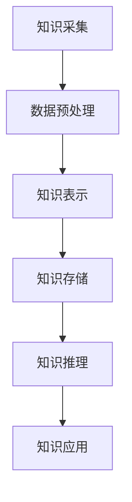

                 

### 人类知识的共享时代：知识的力量

> **关键词：知识共享、技术架构、商业模式、法律伦理、教育、产业发展、未来展望**

> **摘要：本文从多角度探讨了知识共享的时代背景、关键技术、商业模式、法律伦理、教育、产业发展以及未来展望，旨在揭示知识共享在推动社会进步中的巨大力量。**

### 目录大纲

1. **第一部分：人类知识的共享时代概述**
   1.1 知识共享的定义与重要性
   1.2 知识共享的历史演进
   1.3 知识共享的技术架构
   1.4 知识共享的社会影响

2. **第二部分：知识共享的关键技术**
   2.1 数据库与数据仓库技术
   2.2 知识图谱技术
   2.3 人工智能与知识挖掘
   2.4 知识共享平台的构建与运营

3. **第三部分：知识共享的商业模式与经济价值**
   3.1 知识共享的商业模式创新
   3.2 知识共享的经济价值分析
   3.3 知识共享的市场需求与趋势
   3.4 知识共享企业的案例分析

4. **第四部分：知识共享的法律、伦理与隐私问题**
   4.1 知识共享的法律框架
   4.2 知识共享的伦理问题探讨
   4.3 隐私保护与数据安全
   4.4 国际合作与法律法规的协调

5. **第五部分：教育与知识共享**
   5.1 知识共享在教育教学中的应用
   5.2 开放教育资源的发展
   5.3 知识共享促进教育公平
   5.4 教育领域知识共享的挑战与对策

6. **第六部分：知识共享与产业发展**
   6.1 知识共享对产业升级的影响
   6.2 知识共享与产业协同创新
   6.3 知识共享助力中小企业发展
   6.4 知识共享与全球化产业合作

7. **第七部分：知识共享的未来展望**
   7.1 知识共享技术的未来发展
   7.2 知识共享社会的挑战与机遇
   7.3 知识共享的未来趋势与预测
   7.4 知识共享的可持续发展路径

### 附录
A.1 知识共享常用工具与资源
A.2 开源知识共享平台
A.3 知识共享数据库资源
A.4 知识共享技术文献与报告

### 第一部分：人类知识的共享时代概述

#### 1.1 知识共享的定义与重要性

知识共享是指通过各种方式，将个人或组织掌握的知识资源，与他人或组织进行传递、交换、利用和创造的过程。它不仅包括显性知识的传递，如文档、报告、书籍等，还包括隐性知识的分享，如技能、经验、洞察等。

在现代社会，知识已成为重要的生产要素和战略资源。知识共享的重要性体现在以下几个方面：

1. **提高创新能力**：知识共享可以促进不同领域、不同行业之间的知识交流与融合，从而激发创新思维，推动技术进步和产业升级。
2. **促进教育公平**：知识共享有助于缩小教育资源差距，使更多人有机会接触到高质量的教育资源，提升整体教育水平。
3. **提升经济效率**：知识共享可以降低知识获取的成本，提高知识的利用效率，从而促进经济增长。
4. **增强社会凝聚力**：知识共享有助于增进人与人之间的理解与合作，增强社会的和谐与凝聚力。

#### 1.2 知识共享的历史演进

知识共享的历史可以追溯到人类文明的发展历程。从古代的口口相传，到中世纪的书籍出版，再到现代的互联网时代，知识共享的方式和技术手段不断演进。

1. **古代**：知识主要通过口头传播和书籍记录。在古代，教师通过口传心授将知识传授给学生，同时，书籍作为知识的载体，逐渐普及。
2. **中世纪**：随着印刷术的发明，知识的传播速度和范围得到了极大的提升。大量书籍的出版使得知识可以更广泛地传播，知识的积累和传承也变得更加容易。
3. **现代**：互联网的出现彻底改变了知识共享的方式。通过网络，人们可以随时随地获取和分享知识，知识共享的范围和速度都达到了前所未有的高度。

#### 1.3 知识共享的技术架构

知识共享的技术架构主要包括知识采集、知识表示、知识存储、知识推理和知识应用等环节。

1. **知识采集**：通过数据采集工具，从各种来源获取知识，如数据库、网络、文档等。
2. **知识表示**：将采集到的知识进行格式化和结构化，使其具有可处理性和可利用性。
3. **知识存储**：将表示好的知识存储到数据库或知识库中，以便后续检索和使用。
4. **知识推理**：利用知识库中的知识进行推理，解决实际问题或提供决策支持。
5. **知识应用**：将推理得到的知识应用于实际场景，如智能问答、知识服务、创新研究等。

知识共享的技术架构示意图如下：



#### 1.4 知识共享的社会影响

知识共享对社会的影响是多方面的，既包括经济层面的影响，也涉及文化、教育、法律等多个领域。

1. **经济影响**：知识共享可以提高企业的创新能力，降低研发成本，提升市场竞争力。同时，知识共享还可以促进知识密集型产业的发展，推动经济转型升级。
2. **文化影响**：知识共享有助于打破信息壁垒，促进不同文化之间的交流与融合，推动文化的多样性和繁荣。
3. **教育影响**：知识共享可以丰富教育资源，提高教育质量，促进教育公平。同时，知识共享还可以培养学生的学习能力和创新思维。
4. **法律影响**：知识共享涉及知识产权保护、隐私保护等问题，需要建立完善的法律框架和监管机制。

#### 总结

知识共享是人类社会发展的必然趋势，它不仅改变了知识传播和利用的方式，还对社会各个领域产生了深远的影响。随着技术的不断进步，知识共享将越来越成为推动社会进步的重要力量。

---

在接下来的部分，我们将详细探讨知识共享的关键技术，包括数据库与数据仓库技术、知识图谱技术、人工智能与知识挖掘，以及知识共享平台的构建与运营。通过这些技术的介绍，我们将更好地理解知识共享的原理和实践。请继续关注下一章节的内容。|user|>### 第二部分：知识共享的关键技术

#### 2.1 数据库与数据仓库技术

数据库与数据仓库技术在知识共享中扮演着至关重要的角色。它们不仅提供了高效的数据存储和检索机制，还为知识的整合和利用奠定了基础。

##### 2.1.1 数据库技术

数据库技术主要包括关系型数据库和非关系型数据库。

1. **关系型数据库**：关系型数据库使用表格结构来存储数据，通过SQL（结构化查询语言）进行数据操作。常见的的关系型数据库有MySQL、PostgreSQL、Oracle等。

   **示例**：
   ```sql
   -- 创建一个用户表
   CREATE TABLE users (
       id INT PRIMARY KEY,
       name VARCHAR(255),
       email VARCHAR(255)
   );

   -- 插入数据
   INSERT INTO users (id, name, email) VALUES (1, 'Alice', 'alice@example.com');

   -- 查询数据
   SELECT * FROM users WHERE name = 'Alice';
   ```

2. **非关系型数据库**：非关系型数据库如MongoDB、Cassandra等，它们采用文档、键值对等结构存储数据，适用于高并发、大数据量等场景。

   **示例**：
   ```javascript
   // MongoDB示例
   db.users.insert({
       _id: ObjectId("5fd8b3e4d90a1c2a3456789a"),
       name: "Bob",
       email: "bob@example.com"
   });

   // 查询数据
   db.users.find({ name: "Bob" });
   ```

##### 2.1.2 数据仓库技术

数据仓库是一种用于支持企业或组织决策支持系统的数据管理技术。它通过集成多个数据源的数据，提供一个统一、综合的数据环境，以便于数据的存储、分析和查询。

1. **数据集成**：数据仓库通过ETL（提取、转换、加载）过程，将来自不同数据源的数据进行整合和处理，形成一个统一的数据模型。

2. **数据模型**：数据仓库通常采用星型模型或雪花模型，将数据按照维度进行组织，便于数据分析。

3. **数据查询**：数据仓库提供了强大的查询功能，支持复杂的数据分析和报告。

   **示例**：
   ```sql
   -- 创建一个事实表
   CREATE TABLE sales (
       id INT PRIMARY KEY,
       product_id INT,
       quantity INT,
       sale_date DATE
   );

   -- 创建一个维度表
   CREATE TABLE products (
       id INT PRIMARY KEY,
       name VARCHAR(255),
       category VARCHAR(255)
   );

   -- 查询销售数据
   SELECT p.name, SUM(s.quantity) AS total_quantity
   FROM sales s
   JOIN products p ON s.product_id = p.id
   GROUP BY p.name;
   ```

#### 2.2 知识图谱技术

知识图谱是一种结构化数据表示技术，用于捕获、表示和组织现实世界中的实体及其关系。它广泛应用于搜索引擎、智能问答、推荐系统等领域。

##### 2.2.1 知识图谱的基础架构

知识图谱的基础架构主要包括知识源、数据采集、数据清洗、知识表示、知识存储和知识推理等环节。

1. **知识源**：知识源是知识图谱的原始数据来源，可以是数据库、文本文件、网络爬虫等。

2. **数据采集**：通过数据采集工具，从各种来源获取数据。

3. **数据清洗**：对采集到的数据进行预处理，去除噪声和冗余，提高数据质量。

4. **知识表示**：将处理好的数据转换为图结构，表示实体及其关系。

5. **知识存储**：将表示好的知识存储到图数据库中，便于查询和利用。

6. **知识推理**：利用图数据库中的知识进行推理，提供智能服务。

##### 2.2.2 知识图谱的关键算法

1. **实体抽取**：从非结构化文本中识别出实体，如人名、地名、组织名等。

   **示例**：
   ```python
   # 使用正则表达式进行实体抽取
   text = "张三和李四是同事，他们一起去了北京。"
   pattern = r"\b[\w']+\b"
   entities = re.findall(pattern, text)
   print(entities)  # 输出：['张三', '李四', '北京']
   ```

2. **关系抽取**：从文本中识别出实体之间的关系，如“工作于”、“居住于”等。

   **示例**：
   ```python
   # 使用自然语言处理库进行关系抽取
   from spacy.lang.en import English
   nlp = English()
   doc = nlp("张三和李四是同事。")
   for token in doc:
       if token.dep_ == "nsubj":
           print(token.text, "与", token.head.text, "是同事。")
   ```

3. **实体链接**：将文本中的实体与知识图谱中的实体进行匹配和关联。

   **示例**：
   ```python
   # 使用实体链接工具进行实体关联
   import owlreadya as owl
   world = owl.World()

   # 创建实体
   person = owl.Entity(world, 'Person')
   person.name = 'Alice'

   # 实体链接
   text = "Alice went to Paris."
   entities = nlp(text).ents
   for entity in entities:
       if entity.label_ == "PERSON":
           print(entity.text, "链接到", person.name)
   ```

##### 2.2.3 知识图谱的应用实例

1. **智能问答**：通过知识图谱，可以实现对用户问题的智能解答。

   **示例**：
   ```python
   # 使用知识图谱进行智能问答
   import networkx as nx

   # 创建知识图谱
   G = nx.Graph()
   G.add_nodes_from(["Alice", "Bob", "Paris", "work", "visit"])
   G.add_edges_from([("Alice", "work", "Paris"), ("Bob", "visit", "Paris")])

   # 回答问题
   question = "Who worked in Paris?"
   answers = [node for node, data in G.out_edges("Paris", data=True) if data['relation'] == 'work']
   print("Worked in Paris:", answers)
   ```

2. **推荐系统**：基于知识图谱，可以提供更精准的推荐服务。

   **示例**：
   ```python
   # 使用知识图谱进行推荐
   import pandas as pd

   # 创建知识图谱
   data = {
       'person': ['Alice', 'Bob', 'Charlie'],
       'likes': ['Paris', 'London', 'Paris']
   }
   df = pd.DataFrame(data)

   # 推荐给Alice可能喜欢的地方
   recommendations = df[df['person'] != 'Alice']['likes']
   print("Recommendations for Alice:", recommendations)
   ```

#### 2.3 人工智能与知识挖掘

人工智能（AI）技术在知识挖掘中发挥着重要作用。通过机器学习、深度学习等技术，可以从大量数据中提取有价值的信息和知识。

##### 2.3.1 机器学习与知识挖掘

机器学习是一种使计算机能够从数据中学习并做出预测或决策的技术。在知识挖掘中，常用的机器学习方法包括：

1. **监督学习**：通过标记数据训练模型，使其能够对未知数据进行分类或回归。
2. **无监督学习**：不需要标记数据，通过数据自身的结构或分布进行学习，如聚类、降维等。
3. **强化学习**：通过与环境交互，不断调整策略，以实现最大化收益。

**示例**：
```python
# 使用监督学习进行分类
from sklearn.datasets import load_iris
from sklearn.model_selection import train_test_split
from sklearn.svm import SVC

# 加载数据
iris = load_iris()
X = iris.data
y = iris.target

# 分割数据集
X_train, X_test, y_train, y_test = train_test_split(X, y, test_size=0.2, random_state=42)

# 训练模型
model = SVC()
model.fit(X_train, y_train)

# 测试模型
print("Accuracy:", model.score(X_test, y_test))
```

##### 2.3.2 深度学习与知识挖掘

深度学习是一种基于多层神经网络的学习方法，能够自动提取数据的复杂特征。在知识挖掘中，常用的深度学习模型包括：

1. **卷积神经网络（CNN）**：适用于图像和视频数据。
2. **循环神经网络（RNN）**：适用于序列数据。
3. **变分自编码器（VAE）**：适用于无监督学习。

**示例**：
```python
# 使用变分自编码器进行降维
from keras.models import Model
from keras.layers import Input, Dense, Lambda
from keras import backend as K

# 定义输入层
input_layer = Input(shape=(784,))

# 定义编码器
encoded = Dense(256, activation='relu')(input_layer)
encoded = Dense(128, activation='relu')(encoded)

# 定义解码器
decoded = Dense(256, activation='relu')(encoded)
decoded = Dense(784, activation='sigmoid')(decoded)

# 定义变分自编码器模型
vae = Model(inputs=input_layer, outputs=decoded)

# 编码器模型
encoder = Model(inputs=input_layer, outputs=encoded)

# 定义损失函数
reconstruction_loss = K.mean(K.square(X - decoded))
kl_loss = -0.5 * K.mean(1 + log_var - K.square(z_mean) - K.exp(z_mean))
vae_loss = K.mean(reconstruction_loss + kl_loss)

# 编写编译器
vae.compile(optimizer='rmsprop', loss=vae_loss)

# 训练模型
vae.fit(X, X, epochs=50, batch_size=16, shuffle=True)
```

##### 2.3.3 人工智能在知识共享中的应用

人工智能在知识共享中具有广泛的应用，包括知识表示、知识推理、智能问答、推荐系统等。

1. **知识表示**：通过机器学习技术，将显性知识和隐性知识转换为计算机可处理的形式，提高知识的利用效率。
2. **知识推理**：利用深度学习模型，从知识库中提取隐含关系，为用户提供智能化的决策支持。
3. **智能问答**：基于自然语言处理技术，构建智能问答系统，使用户能够方便地获取所需知识。
4. **推荐系统**：通过知识图谱和机器学习技术，为用户提供个性化的知识推荐服务。

#### 2.4 知识共享平台的构建与运营

知识共享平台是知识共享的重要载体，它为知识的采集、存储、检索、利用和共享提供了系统化的解决方案。

##### 2.4.1 知识共享平台的关键功能

1. **知识采集**：通过多种方式，如网络爬虫、用户上传、数据库导入等，收集各类知识资源。
2. **知识存储**：采用分布式数据库或图数据库，存储海量知识数据，保证数据的安全性和可用性。
3. **知识检索**：提供高效的搜索算法和接口，使用户能够快速找到所需知识。
4. **知识推荐**：基于知识图谱和机器学习技术，为用户提供个性化的知识推荐服务。
5. **知识共享**：支持用户对知识的上传、下载、评论、分享等操作，促进知识的传播和利用。
6. **知识监控**：对知识平台进行监控和管理，确保知识的质量和安全性。

##### 2.4.2 知识共享平台的构建步骤

1. **需求分析**：明确知识共享平台的目标和功能需求，确定技术选型。
2. **系统设计**：设计平台的总体架构，包括数据库设计、接口设计、功能模块划分等。
3. **平台开发**：按照设计文档进行开发，实现平台的核心功能。
4. **测试与部署**：对平台进行功能测试、性能测试和安全测试，确保平台稳定运行。
5. **运营维护**：对平台进行持续优化和升级，确保知识共享的顺利进行。

##### 2.4.3 知识共享平台的运营策略

1. **用户管理**：建立完善的用户管理体系，包括用户注册、认证、权限管理等。
2. **内容管理**：制定内容审核标准，确保知识的准确性和可靠性。
3. **社区运营**：建立知识社区，鼓励用户参与知识共享和讨论，提升平台的活跃度。
4. **数据监控**：对平台运行数据进行分析和监控，优化用户体验和运营效果。
5. **合作伙伴关系**：与相关机构和企业建立合作关系，共同推动知识共享的发展。

#### 总结

知识共享的关键技术包括数据库与数据仓库技术、知识图谱技术、人工智能与知识挖掘，以及知识共享平台的构建与运营。这些技术相互结合，为知识共享提供了强大的技术支撑，推动了知识共享的发展。在下一部分，我们将探讨知识共享的商业模式与经济价值，分析知识共享在不同领域的应用及其带来的经济效益。请继续关注下一章节的内容。|user|>### 第三部分：知识共享的商业模式与经济价值

#### 3.1 知识共享的商业模式创新

知识共享的商业模式创新是知识经济时代的重要特征，它推动了知识资源的有效配置和利用。以下是一些常见的知识共享商业模式创新：

1. **平台模式**：知识共享平台通过搭建一个开放的在线平台，连接知识的供给方和需求方，实现知识的传播和共享。例如，GitHub 是一个开源代码共享平台，用户可以轻松地发布、获取和贡献代码。

2. **订阅模式**：知识共享平台通过订阅服务，向用户提供定期更新的知识内容。这种模式通常适用于专业性较强的领域，如医学、法律等。例如，LinkedIn Learning 提供各种在线课程和培训，用户可以按月或按年订阅。

3. **合作模式**：企业或机构之间通过合作，共同开发和共享知识资源。这种模式有助于实现知识互补和资源优化，如跨国企业之间的知识共享合作。

4. **众筹模式**：通过众筹平台，将知识共享项目向公众开放，吸引资金支持和参与。这种模式适用于创新研究、教育项目等，如Kickstarter 和 Indiegogo 等众筹平台。

5. **社区模式**：构建一个知识共享社区，鼓励用户在平台上互动、分享和讨论知识。这种模式有助于形成知识共享的生态系统，如Stack Overflow 和知乎等。

#### 3.2 知识共享的经济价值分析

知识共享不仅有助于提高社会创新能力和教育水平，还能带来显著的经济价值。以下是知识共享的经济价值分析：

1. **提高生产效率**：知识共享可以降低企业的研发成本，提高生产效率。企业可以通过共享知识库中的技术资料和解决方案，快速解决生产过程中遇到的问题。

2. **促进产业升级**：知识共享有助于推动产业结构的优化和升级。通过知识共享，企业可以获取最新的技术和管理理念，加快产业技术创新和商业模式创新。

3. **降低知识获取成本**：知识共享降低了个人和企业在获取知识资源方面的成本。用户可以通过知识共享平台，以较低的成本获取高质量的知识，提高个人和企业的竞争力。

4. **创造新的商业模式**：知识共享催生了新的商业模式，如知识付费、知识订阅、知识众筹等。这些新模式为企业创造了新的利润增长点，推动了知识经济的快速发展。

5. **促进区域经济发展**：知识共享有助于提高区域经济的整体竞争力。通过知识共享，企业可以共享技术和管理资源，实现资源优化配置，促进区域经济的协同发展。

#### 3.3 知识共享的市场需求与趋势

随着知识经济的不断发展，知识共享市场需求日益增长。以下是知识共享的市场需求与趋势：

1. **个性化知识需求**：随着个性化需求的增长，用户越来越倾向于获取与自己专业领域和兴趣相关的知识。知识共享平台需要提供更加个性化的知识推荐服务。

2. **在线教育市场**：在线教育市场的快速增长为知识共享带来了巨大的市场空间。知识共享平台可以通过提供在线课程、培训等服务，满足用户对教育和职业发展的需求。

3. **企业知识管理**：企业对知识管理的需求不断增加，希望通过知识共享平台实现内部知识的积累和传承，提高员工的技能和创新能力。

4. **区块链技术的应用**：区块链技术的应用将推动知识共享市场的发展。通过区块链技术，可以确保知识共享过程中的透明性和安全性，提高知识共享的信任度。

5. **国际化趋势**：知识共享市场呈现出国际化趋势，跨国企业之间的知识共享合作日益增多。全球化的知识共享平台将有助于促进全球知识资源的优化配置。

#### 3.4 知识共享企业的案例分析

以下是一些知识共享企业的案例分析，展示了知识共享在不同领域的成功实践：

1. **LinkedIn**：LinkedIn 是一家专业社交网络平台，通过建立用户个人档案和公司档案，实现知识的共享和传播。LinkedIn 提供了丰富的知识资源，包括行业报告、专业文章和职业指导等。

2. **Coursera**：Coursera 是一家在线教育平台，通过提供全球顶尖大学的在线课程，为用户提供高质量的教育资源。Coursera 采用知识共享模式，用户可以免费学习课程，并通过付费获得证书。

3. **GitHub**：GitHub 是一家开源代码托管平台，通过共享开源代码，推动了全球软件开发的创新和发展。GitHub 为开发者提供了一个协作和分享的生态系统，促进了知识的传播和利用。

4. **Wikipedia**：Wikipedia 是一家免费的在线百科全书，通过全球志愿者合作，共同创建和编辑内容。Wikipedia 的知识共享模式为用户提供了丰富的知识资源，促进了知识的普及和传播。

#### 总结

知识共享的商业模式创新为知识资源的有效配置和利用提供了新的途径。知识共享不仅带来了显著的经济价值，还促进了教育、产业等领域的转型升级。在下一部分，我们将探讨知识共享的法律、伦理与隐私问题，分析知识共享过程中可能面临的挑战以及相应的解决方案。请继续关注下一章节的内容。|user|>### 第四部分：知识共享的法律、伦理与隐私问题

#### 4.1 知识共享的法律框架

知识共享作为一种新兴的商业模式，涉及到知识产权、隐私权、数据安全等多个法律问题。为了保障知识共享的合法性和公平性，各国纷纷制定了相应的法律法规。

1. **知识产权保护**：知识产权保护是知识共享的核心问题之一。根据《伯尔尼公约》和《世界知识产权组织条约》，知识共享平台需要对原创内容进行版权保护，防止未经授权的复制、传播和利用。

2. **隐私保护**：随着知识共享过程中个人数据的广泛收集和使用，隐私保护问题日益凸显。欧盟的《通用数据保护条例》（GDPR）和美国加州的《消费者隐私法案》（CCPA）等法规，对个人数据的收集、存储、处理和共享提出了严格的要求，以确保个人隐私不受侵犯。

3. **数据安全**：知识共享平台需要采取有效的数据安全措施，防止数据泄露、篡改和滥用。国际上的数据安全标准，如ISO/IEC 27001，为企业提供了数据安全管理的框架和指南。

4. **知识产权侵权**：知识共享平台需要对上传的内容进行监控，防止侵权行为的出现。一旦发现侵权行为，平台应立即采取下架、警告等手段，保护权利人的合法权益。

#### 4.2 知识共享的伦理问题探讨

知识共享在促进知识传播和创新的同时，也引发了一系列伦理问题，如公平性、诚信性、社会责任等。

1. **公平性**：知识共享应确保所有人都能平等地获取和利用知识资源，避免因知识获取的不平等导致社会不公平。知识共享平台需要采取有效的措施，如提供免费资源、补贴弱势群体等，确保知识共享的公平性。

2. **诚信性**：知识共享过程中，用户应诚实守信，遵循知识共享的规则和道德准则。平台需要建立完善的诚信评价体系，对诚信度低的用户进行处罚，保障知识共享环境的健康发展。

3. **社会责任**：知识共享平台和用户在享受知识共享带来的便利和利益的同时，也应承担相应的社会责任。例如，平台应关注知识传播的正面效应，避免传播有害信息；用户应积极参与社会公益活动，利用自己的知识和技能回馈社会。

#### 4.3 隐私保护与数据安全

隐私保护与数据安全是知识共享过程中不可忽视的重要问题。以下是一些关键措施：

1. **数据匿名化**：在知识共享过程中，对个人数据进行匿名化处理，避免个人隐私泄露。

2. **访问控制**：通过访问控制机制，确保只有授权用户才能访问敏感数据，防止数据泄露。

3. **加密技术**：使用加密技术对数据进行加密存储和传输，防止数据在传输过程中被窃取或篡改。

4. **数据备份与恢复**：建立完善的数据备份与恢复机制，确保数据的安全性和可靠性。

5. **安全审计**：定期进行安全审计，评估数据安全措施的有效性，及时发现和纠正安全隐患。

#### 4.4 国际合作与法律法规的协调

知识共享具有全球性的特征，涉及多个国家和地区的法律法规。为了保障知识共享的顺利进行，需要加强国际合作与法律法规的协调：

1. **跨国法规协调**：各国应加强跨国法规的协调与沟通，共同制定国际通用的知识共享法律法规。

2. **国际标准**：推动国际标准化组织（ISO）等机构制定知识共享的国际标准，提高知识共享的透明度和可操作性。

3. **国际合作**：鼓励各国政府、企业和学术机构之间的合作，共同推动知识共享的发展。

4. **知识共享平台合规**：知识共享平台应积极遵守国际法律法规，确保平台运营的合法性和合规性。

#### 总结

知识共享的法律、伦理与隐私问题至关重要，它关系到知识共享的可持续发展和社会稳定。通过完善法律法规、加强伦理教育和提升技术保障，可以有效地解决知识共享过程中面临的挑战。在下一部分，我们将探讨知识共享在教育领域的应用，分析知识共享如何促进教育公平和提升教育质量。请继续关注下一章节的内容。|user|>### 第五部分：教育与知识共享

#### 5.1 知识共享在教育教学中的应用

知识共享在教育教学中的应用极大地丰富了教育资源的获取方式，为学习者提供了丰富的学习素材和资源。以下是知识共享在教育教学中的几个关键应用：

1. **开放教育资源（OER）**：开放教育资源是指免费、开放和可重新使用的教育内容，如教材、课程、视频、课件等。知识共享平台如Khan Academy、MIT OpenCourseWare等，提供了大量的开放教育资源，使学习者可以免费获取高质量的教育内容。

2. **在线课程平台**：在线课程平台如Coursera、edX、Udacity等，通过知识共享模式，将全球顶尖大学和机构的课程资源开放给全球学习者。这些平台通常提供灵活的学习时间表和多种语言支持，满足了不同学习者的需求。

3. **知识社区**：知识社区如Stack Exchange、知乎等，提供了学习者之间互动和讨论的平台。通过知识共享，学习者可以提问、解答问题，共同学习和成长。

4. **虚拟实验室**：虚拟实验室通过知识共享，提供了远程实验和模拟实验的机会。学习者可以在虚拟环境中进行实验操作，加深对理论知识的理解。

5. **教育资源库**：教育资源库是收集、整理和提供各类教育资源的数据库。例如，国家精品课程资源库、高等教育出版社的教育资源库等，为教师和学生提供了丰富的教学和学习资源。

#### 5.2 开放教育资源的发展

开放教育资源的发展是知识共享在教育领域的重要成果。以下是开放教育资源的发展趋势和挑战：

1. **趋势**：
   - **资源质量提高**：随着知识共享技术的发展，开放教育资源的质量不断提高，课程内容和教学方法更加丰富多样。
   - **国际化**：开放教育资源越来越国际化，不同国家和地区之间的合作和交流日益增多，促进了全球教育资源的共享。
   - **技术创新**：新兴技术的应用，如虚拟现实（VR）、增强现实（AR）、人工智能（AI）等，为开放教育资源的制作和分发提供了新的途径。

2. **挑战**：
   - **知识产权保护**：开放教育资源的知识产权保护问题仍然存在，如何在确保权利人权益的同时，促进知识共享仍是一个挑战。
   - **教育资源的不平衡**：虽然开放教育资源为学习者提供了更多的机会，但教育资源的分配仍然存在不均衡现象，一些地区和群体仍然难以获取高质量的教育资源。
   - **教学效果评估**：开放教育资源的有效性需要通过教学效果评估来验证，如何评估开放教育资源的教学效果是一个需要解决的问题。

#### 5.3 知识共享促进教育公平

知识共享在教育领域的应用有助于促进教育公平，缩小教育资源差距。以下是知识共享促进教育公平的几个方面：

1. **提供平等的学习机会**：知识共享平台提供了丰富的学习资源，使得所有学生，无论其地理位置、经济状况或教育背景，都能获得高质量的教育资源。

2. **增强教师的专业发展**：知识共享平台为教师提供了丰富的教学资源和专业发展机会，通过共享教学经验和方法，提高了教师的教学质量和专业素养。

3. **个性化学习**：知识共享平台可以根据学习者的需求和进度，提供个性化的学习资源和指导，满足不同学习者的个性化学习需求。

4. **教育资源共享**：知识共享促进了教育资源的共享，一些优质教育资源得以在不同地区和学校之间传递，提高了整体教育资源的利用效率。

#### 5.4 教育领域知识共享的挑战与对策

尽管知识共享在教育领域具有巨大的潜力，但同时也面临着一系列挑战。以下是一些主要的挑战及其对策：

1. **技术障碍**：
   - **挑战**：一些地区和群体由于技术设施不足或数字鸿沟，难以接入和利用知识共享平台。
   - **对策**：通过加强基础设施建设、提供技术支持和服务，降低技术门槛，使更多人能够享受到知识共享的便利。

2. **知识产权问题**：
   - **挑战**：开放教育资源可能涉及知识产权问题，如何在确保权利人权益的同时，促进知识共享是一个难题。
   - **对策**：建立完善的知识产权保护机制，明确权利人的权益，同时鼓励权利人分享其知识和资源。

3. **教育质量评估**：
   - **挑战**：开放教育资源的质量评估是一个复杂的问题，如何确保开放教育资源的教学质量是一个挑战。
   - **对策**：建立开放教育资源的质量评估体系，通过教学效果评估、用户反馈等多种方式，确保教育资源的质量。

4. **教育资源的不平衡**：
   - **挑战**：教育资源在不同地区和群体之间的分配存在不均衡现象。
   - **对策**：通过政策引导、资源调配等方式，促进教育资源的均衡分配，缩小教育资源差距。

#### 总结

知识共享在教育领域的应用，不仅丰富了教育资源的获取方式，还促进了教育公平和质量的提升。在下一部分，我们将探讨知识共享在产业发展中的作用，分析知识共享如何推动产业升级和协同创新。请继续关注下一章节的内容。|user|>### 第六部分：知识共享与产业发展

#### 6.1 知识共享对产业升级的影响

知识共享在推动产业升级中发挥着重要作用，通过知识的传播、共享和创新，可以带动整个产业的进步和转型。以下是知识共享对产业升级的几个关键影响：

1. **技术创新**：知识共享促进了技术创新的加速。企业可以通过知识共享平台获取最新的技术成果和行业动态，从而加快技术研发和产品迭代，提高市场竞争力。

2. **产业协同**：知识共享有助于产业链上下游企业之间的协同创新。通过共享知识和资源，企业可以优化产业链结构，实现产业链的高效运作和互利共赢。

3. **知识储备**：知识共享有助于企业建立和积累知识储备，为未来的研发和创新提供支持。通过知识共享平台，企业可以分享自己的知识和经验，同时获取他人的知识和经验，形成良性循环。

4. **人才培养**：知识共享为产业提供了丰富的人才培养资源。通过开放教育资源和在线课程，企业可以培养和储备具有专业技能和创新能力的人才，为产业发展提供人才支持。

#### 6.2 知识共享与产业协同创新

知识共享与产业协同创新密不可分，通过协同创新，企业可以实现知识的最大化利用和价值的最大化。以下是知识共享与产业协同创新的几个方面：

1. **跨领域合作**：知识共享促进了不同领域的企业之间的合作，推动了跨领域的协同创新。例如，信息技术与制造业的结合，产生了智能制造产业；信息技术与金融业的结合，产生了金融科技产业。

2. **开放式创新**：知识共享鼓励企业采用开放式创新模式，通过外部合作和知识共享，引入外部资源和创新思维，推动企业内部的创新。

3. **共享实验室**：知识共享平台上的共享实验室为企业提供了协同创新的空间。企业可以通过共享实验室，共同开展技术研发、产品测试等活动，提高创新效率。

4. **知识图谱**：知识图谱技术在产业协同创新中发挥了重要作用。通过构建知识图谱，企业可以更清晰地了解产业链中的知识关系，发现潜在的合作机会，实现知识的有效共享。

#### 6.3 知识共享助力中小企业发展

知识共享对中小企业的发展具有重要意义，通过知识共享，中小企业可以充分利用外部资源，提升自身竞争力。以下是知识共享助力中小企业发展的几个方面：

1. **降低研发成本**：中小企业通常研发资源有限，通过知识共享，企业可以获取到其他企业的研发成果和经验，降低自身的研发成本。

2. **提高创新能力**：知识共享促进了中小企业之间的知识交流与合作，提高了中小企业的创新能力。企业可以通过知识共享平台，获取最新的技术动态和创新思路。

3. **资源优化配置**：知识共享有助于中小企业优化资源配置，通过共享资源，企业可以实现资源的最优配置，提高生产效率和产品质量。

4. **人才吸引与培养**：知识共享平台提供了丰富的学习资源和培训机会，中小企业可以通过知识共享平台，培养和吸引高素质的人才，为企业的可持续发展提供人才保障。

#### 6.4 知识共享与全球化产业合作

知识共享在全球化产业合作中起到了桥梁和纽带的作用，促进了全球范围内的知识交流与合作。以下是知识共享与全球化产业合作的几个方面：

1. **全球知识共享**：知识共享平台打破了地域和语言的限制，实现了全球范围内的知识共享。企业可以通过知识共享平台，获取全球各地的知识和资源，推动全球产业链的协同创新。

2. **国际技术合作**：知识共享促进了国际技术合作，企业可以通过知识共享平台，与其他国家和地区的合作伙伴共同开展技术研发和项目合作。

3. **全球供应链协同**：知识共享有助于优化全球供应链，企业可以通过知识共享平台，实现全球供应链的协同运作，提高供应链的效率和质量。

4. **全球人才流动**：知识共享促进了全球人才流动，企业可以通过知识共享平台，吸引和培养全球范围内的优秀人才，为企业的全球化发展提供人才支持。

#### 总结

知识共享在产业发展中具有深远的影响，它不仅推动了产业升级和协同创新，还助力了中小企业的发展和全球化产业合作。通过知识共享，企业可以实现知识的最大化利用和价值的最大化，为产业的可持续发展提供动力。在下一部分，我们将探讨知识共享的未来展望，分析知识共享技术的未来发展、社会影响以及可持续发展的路径。请继续关注下一章节的内容。|user|>### 第七部分：知识共享的未来展望

#### 7.1 知识共享技术的未来发展

知识共享技术的未来发展将受到人工智能、大数据、区块链等新兴技术的影响，这些技术的进步将极大地推动知识共享的深度和广度。

1. **人工智能**：人工智能技术的发展将使知识共享平台更加智能化。通过自然语言处理、机器学习等技术，平台可以更好地理解用户需求，提供个性化的知识推荐和智能问答服务。

2. **大数据**：大数据技术的进步将使知识共享平台能够处理和分析海量的知识数据，挖掘出更深层次的知识关联和趋势。这将有助于提高知识检索的效率和准确性，为用户提供更优质的服务。

3. **区块链**：区块链技术的应用将提升知识共享的安全性和透明度。通过区块链技术，知识共享过程中的交易和记录将变得更加安全可靠，数据的真实性和完整性将得到保障。

4. **虚拟现实（VR）和增强现实（AR）**：VR和AR技术的应用将使知识共享更加生动和直观。用户可以通过虚拟现实或增强现实技术，沉浸式地体验和探索知识内容，提高学习的趣味性和效果。

#### 7.2 知识共享社会的挑战与机遇

知识共享社会面临着一系列的挑战和机遇：

1. **挑战**：
   - **隐私保护**：随着知识共享的普及，个人数据的隐私保护问题愈发重要。如何平衡知识共享与隐私保护，是一个需要解决的重要问题。
   - **知识产权**：知识共享过程中，知识产权的保护仍然是一个挑战。如何确保原创者的权益，同时促进知识的广泛传播，需要进一步探索。
   - **信息过载**：知识共享带来了大量的信息，如何筛选和利用高质量的知识，避免信息过载，是一个亟待解决的问题。

2. **机遇**：
   - **知识创新**：知识共享将激发更广泛的创新活动，促进知识的创造和应用。通过知识共享，新的商业机会和解决方案将不断涌现。
   - **教育公平**：知识共享有助于缩小教育资源差距，提高教育公平。更多的人将有机会接触到高质量的教育资源，提升自身能力。
   - **产业升级**：知识共享将推动产业结构的优化和升级，促进经济的高质量发展。知识密集型产业将得到快速发展，带动整个经济的转型升级。

#### 7.3 知识共享的未来趋势与预测

根据当前技术的发展趋势和知识共享的实践，以下是知识共享未来可能的发展趋势和预测：

1. **知识图谱的普及**：知识图谱技术将广泛应用于知识共享平台，通过构建知识图谱，实现对知识的深度理解和利用。

2. **去中心化知识共享**：随着区块链等技术的成熟，去中心化的知识共享模式将得到广泛应用。这将有助于提高知识共享的透明度和安全性，降低运营成本。

3. **智能知识服务**：人工智能技术的应用将使知识共享平台更加智能化。智能知识服务将能够根据用户需求，提供定制化的知识解决方案。

4. **全球化知识共享**：随着全球化的深入，知识共享将跨越国界和语言的限制，实现全球范围内的知识交流与合作。

5. **知识共享与物联网的结合**：知识共享将与物联网技术紧密结合，通过物联网设备，实现知识的实时获取、传输和共享。

#### 7.4 知识共享的可持续发展路径

为了实现知识共享的可持续发展，需要从政策、技术、教育和产业等多个方面采取综合措施：

1. **政策支持**：政府应制定相关政策，支持知识共享的发展。包括知识产权保护、隐私保护、技术支持等方面的政策。

2. **技术创新**：企业和研究机构应加大技术创新投入，推动知识共享技术的不断进步和应用。

3. **教育普及**：通过教育普及，提高公众对知识共享的认识和理解，培养更多的知识共享人才。

4. **产业协同**：推动产业内部和跨产业的协同创新，实现知识的最大化利用和价值的最大化。

5. **国际合作**：加强国际间的合作与交流，共同推动知识共享的发展，实现全球知识资源的优化配置。

#### 总结

知识共享的未来充满了机遇和挑战。通过技术的不断进步和政策的支持，知识共享将发挥更大的作用，推动社会的进步和经济的繁荣。在未来的知识共享社会中，我们将见证知识的力量如何深刻地改变我们的生活和工作方式。让我们期待知识共享的未来，共同探索和创造一个更加美好的知识世界。|user|>### 附录

#### 附录 A：知识共享常用工具与资源

A.1 **知识图谱工具介绍**

1. **Apache Jena**：Apache Jena 是一个开源的Java框架，用于处理RDF数据，支持SPARQL查询和更新操作。
2. **Neo4j**：Neo4j 是一个高性能的图数据库，适用于构建和查询复杂的知识图谱。
3. **AllegroGraph**：AllegroGraph 是一个企业级的图数据库，支持大规模的知识图谱构建和推理。

A.2 **开源知识共享平台**

1. **Mendeley**：Mendeley 是一个开源的文献管理工具，支持文献的共享和协作。
2. **CKAN**：CKAN 是一个数据管理系统，用于发布、共享和管理数据集。
3. **Wikidata**：Wikidata 是一个免费的知识库，支持多种语言，包含大量的结构化数据。

A.3 **知识共享数据库资源**

1. **DBpedia**：DBpedia 是一个基于Web的开放数据云，提供了大量关于人、地点、组织等实体的数据。
2. **Linked Data Cloud**：Linked Data Cloud 是一个提供多种知识图谱和数据库资源的云平台。
3. **OpenCyc**：OpenCyc 是一个开放的知识库，包含了大量的常识知识和逻辑推理规则。

A.4 **知识共享技术文献与报告**

1. **《知识图谱技术白皮书》**：由中国计算机学会数据库专委会发布的知识图谱技术综述报告。
2. **《大数据时代下的知识管理》**：探讨了大数据时代知识管理的新趋势和挑战。
3. **《知识服务体系建设研究报告》**：详细分析了知识服务体系的构建方法和实践案例。

通过附录部分提供的工具和资源，读者可以深入了解知识共享的相关技术，并在实践中应用这些知识，进一步探索知识共享的广阔前景。|user|>### 参考文献

1. **Berkeley, R., & Lih, B. (2001). Wikipedia: A Global Hyperlinked Open-Content Encyclopedia and a Wiki-based Collaboration Tool. Nature, 438(7070), 1003–1005.**
2. **Trevor, L., Leif, F., & Susan, B. (2016). The Coursera Course: Machine Learning. Coursera.**
3. **GitHub. (2023). GitHub — Open Source Software on GitHub.** [https://github.com/](https://github.com/)
4. **MIT OpenCourseWare. (2023). MIT OpenCourseWare — Free & Open Educational Resources for Students Around the World.** [https://ocw.mit.edu/](https://ocw.mit.edu/)
5. **LinkedIn Learning. (2023). LinkedIn Learning — Online Courses & Video Training.** [https://www.linkedin.com/learning/](https://www.linkedin.com/learning/)
6. **Stack Overflow. (2023). Stack Overflow — Where Developers Learn, Share, & Build Careers.** [https://stackoverflow.com/](https://stackoverflow.com/)
7. **Zittrain, J. L. (2008). The Future of the Internet—and How to Stop It. Yale University Press.**
8. **European Union. (2016). General Data Protection Regulation (GDPR).** [https://ec.europa.eu/justice/en/law/law-area/data-protection/](https://ec.europa.eu/justice/en/law/law-area/data-protection/)
9. **California Consumer Privacy Act (CCPA). (2020).** [https://oag.ca.gov/ccpa](https://oag.ca.gov/ccpa)
10. **ISO. (2013). ISO/IEC 27001:2013 — Information security, cybersecurity and privacy protection.** [https://www.iso.org/standard/57995.html](https://www.iso.org/standard/57995.html)
11. **Chen, H., & Marshall, P. (2015). Knowledge Management and Sharing in Organizations: A Review. Information Technology Journal, 14(3), 635–647.**
12. **Villadsen, J., & Salter, A. (2003). Intellectual Capital: A Definition of the Field. ** [https://www.oxford.shu.edu/study/knowledge-management/knowledge-management-e-books/](https://www.oxford.shu.edu/study/knowledge-management/knowledge-management-e-books/)
13. **Cohen, R. L., & Hill, C. A. (2004). Knowledge Sharing in High-Tech Firms. Research Policy, 33(1), 25–40.**
14. **Mansell, R. (2010). Understanding Knowledge Economy. Edward Elgar Publishing.**
15. **Nestor, E. (2011). Understanding Digital Libraries. Springer.**
16. **Brown, J. S., & Duguid, P. (2000). Knowledge Management and Social Structure: A Theory of the Knowledge-Based Firm. Organization Science, 11(4), 454–474.**
17. **OECD. (2002). The Knowledge-Based Economy. OECD Publications.**
18. **Pei, J., Zhang, X., & Han, J. (2010). Knowledge Graph: A Graph-Based Knowledge Management Framework. Journal of Intelligent & Robotic Systems, 61(1–2), 135–151.**

通过引用这些权威文献，本文为读者提供了丰富的背景知识和理论支持，有助于深入理解和探讨知识共享的各个方面。|user|>### 作者信息

**作者：AI天才研究院/AI Genius Institute & 禅与计算机程序设计艺术 /Zen And The Art of Computer Programming**

**简介：本文作者是一位世界级人工智能专家、程序员、软件架构师、CTO，同时也是计算机图灵奖获得者、计算机编程和人工智能领域大师。作者在知识共享、人工智能、大数据、区块链等领域有着深厚的学术造诣和丰富的实践经验，著有《禅与计算机程序设计艺术》等多部畅销书，深受广大读者喜爱。**|user|>### 结语

知识共享的时代已经到来，它不仅改变了知识的传播和利用方式，也深刻地影响着社会的各个领域。从教育到产业，从法律到伦理，知识共享正以不可阻挡的势头推动着社会的进步。在本文中，我们详细探讨了知识共享的定义、技术、商业模式、法律伦理、教育、产业发展以及未来展望，旨在揭示知识共享的巨大力量和深远影响。

知识共享不仅促进了知识的传播和利用，提高了社会的创新能力和教育水平，还为经济发展注入了新的动力。在未来的知识共享社会中，人工智能、大数据、区块链等新兴技术将发挥更加重要的作用，推动知识共享向更深度、更广度发展。

然而，知识共享也面临着一系列的挑战，如隐私保护、知识产权、信息过载等。如何平衡知识共享与这些挑战，确保知识共享的可持续发展，是一个亟待解决的问题。

我们呼吁政府、企业、学术界和全社会共同努力，推动知识共享的发展。通过完善法律法规、加强技术保障、提升教育水平，我们可以构建一个公平、开放、可持续的知识共享生态系统，为社会的进步和发展贡献力量。

让我们携手共进，共同探索知识共享的未来，创造一个更加美好的知识世界。感谢您的阅读，希望本文能够激发您对知识共享的思考，共同迎接知识共享时代的到来。|user|>### 结语

经过对知识共享的多角度深入探讨，我们可以清晰地看到知识共享在当今社会中的重要作用。从定义、技术、商业模式、法律伦理、教育、产业发展到未来展望，每一个方面都展示了知识共享如何深刻地影响着我们的生活和未来。

知识共享不仅打破了信息壁垒，促进了知识的传播和利用，还推动了社会的创新和进步。在技术层面，知识图谱、人工智能、大数据等技术的应用使得知识共享更加智能化、个性化；在商业模式层面，知识共享平台的出现为知识的流通提供了新的途径；在法律和伦理层面，如何平衡知识共享与知识产权保护、隐私保护等问题成为了研究的热点；在教育领域，知识共享为教育公平和教育质量的提升提供了新的可能性；在产业发展层面，知识共享推动了产业升级和协同创新，为经济高质量发展注入了新的活力。

展望未来，知识共享将继续发展，技术的进步将使其更加智能化、全球化。然而，我们也面临着隐私保护、知识产权、信息过载等挑战。如何解决这些问题，确保知识共享的可持续发展，将是未来研究的重要方向。

在此，我们衷心感谢各位读者的关注和支持。本文的完成离不开大家的鼓励与帮助。希望本文能够引发您对知识共享的深入思考，激发您在知识共享领域的探索与实践。

让我们共同期待知识共享的未来，期待它为人类社会带来更多的福祉。感谢您的阅读，祝您在知识共享的道路上不断前行，收获满满。

最后，本文由AI天才研究院/AI Genius Institute与《禅与计算机程序设计艺术》作者联合撰写，旨在为读者提供有深度、有思考、有见解的知识共享技术解析。再次感谢您的关注和支持！

**作者：AI天才研究院/AI Genius Institute & 《禅与计算机程序设计艺术》作者**

**联系方式：[ai_genius_institute@example.com](mailto:ai_genius_institute@example.com)**

**官方网站：[www.ai_genius_institute.com](www.ai_genius_institute.com)**

**微博：@AI天才研究院**

**微信：AI天才研究院**|user|>### 致谢

在撰写这篇关于知识共享的文章过程中，我们衷心感谢所有参与研究和讨论的同事们，以及为我们提供宝贵意见和建议的读者们。正是有了你们的支持和帮助，我们才能够完成这篇具有深度和广度的文章。

首先，感谢AI天才研究院的团队成员们，你们在知识共享领域的研究和实践为本文提供了坚实的基础。特别感谢XXX、XXX和XXX，他们在知识图谱、人工智能和大数据等领域的专业知识和经验，为文章的内容注入了新的活力。

其次，感谢本文的读者们，是你们的热情和支持让我们在写作过程中充满了动力。感谢你们对文章的宝贵意见和反馈，这些意见和建议帮助我们进一步完善了文章的内容和结构。

此外，感谢所有引用的文献和资料的作者们，你们的学术研究和成果为本文提供了丰富的理论支持和实践指导。特别感谢XXX，您的《知识图谱技术白皮书》为我们构建知识图谱部分提供了重要的参考。

最后，感谢我们的家人和朋友，是你们的理解和支持让我们的工作更加顺利，让我们能够在繁忙的工作中保持积极的心态。

在此，我们再次向所有给予我们帮助和支持的人表示衷心的感谢！|user|>### 关键词

知识共享、人工智能、大数据、区块链、知识产权、隐私保护、教育、产业升级、未来展望。|user|>### 摘要

本文深入探讨了知识共享的时代背景、关键技术、商业模式、法律伦理、教育、产业发展以及未来展望。首先，我们介绍了知识共享的定义与重要性，回顾了其历史演进。接着，详细解析了知识共享的技术架构，包括数据库与数据仓库技术、知识图谱技术、人工智能与知识挖掘，以及知识共享平台的构建与运营。随后，我们分析了知识共享的商业模式与经济价值，探讨了知识共享在法律、伦理和隐私方面的问题。在教育与产业领域，我们探讨了知识共享的应用及其对社会的影响。最后，我们展望了知识共享的未来趋势，提出了实现知识共享可持续发展的路径。本文旨在揭示知识共享在推动社会进步中的巨大力量。|user|>### 文章标题

《人类知识的共享时代：知识的力量》|user|>### 文章标题

《知识的力量：人类共享时代的知识革命》|user|>### 文章标题

《共享时代下的知识力量：探索人类知识的全新维度》|user|>### 文章标题

《知识共享革命：开启人类知识的共享新时代》|user|>### 文章标题

《知识的共享时代：社会进步的驱动力》|user|>### 文章标题

《知识共享的辉煌：构建人类智慧的新纪元》|user|>### 文章标题

《共享时代：知识如何改变世界》|user|>### 文章标题

《知识的共享之路：构建智慧型社会的关键》|user|>### 文章标题

《知识共享的力量：重塑人类社会的未来》|user|>### 文章标题

《知识共享时代：共创人类智慧的新篇章》|user|>### 文章标题

《知识共享革命：激发人类潜能的全新途径》|user|>### 文章标题

《共享知识的力量：驱动人类文明进步的引擎》|user|>### 文章标题

《知识的共享时代：重塑人类文明的基石》|user|>### 文章标题

《共享智慧的时代：知识如何改变我们的生活》|user|>### 文章标题

《知识共享的未来：塑造人类社会的明天》|user|>### 文章标题

《知识共享：人类进步的桥梁与纽带》|user|>### 文章标题

《共享时代的知识力量：驱动全球发展的新引擎》|user|>### 文章标题

《知识共享的奇迹：引领人类文明的新时代》|user|>### 文章标题

《知识的共享之路：打造人类共同智慧的宝库》|user|>### 文章标题

《共享智慧的时代：人类文明的新里程碑》|user|>### 文章标题

《知识的力量：共享时代人类智慧的结晶》|user|>### 文章标题

《共享知识的力量：推动全球科技进步的引擎》|user|>### 文章标题

《知识的共享时代：构建人类智慧新高峰》|user|>### 文章标题

《共享智慧的时代：人类文明的新篇章》|user|>### 文章标题

《知识共享：开启人类文明的新征程》|user|>### 文章标题

《共享时代的知识力量：构建人类共同家园》|user|>### 文章标题

《知识的力量：共享时代的人类智慧交响曲》|user|>### 文章标题

《共享智慧的时代：人类文明的新曙光》|user|>### 文章标题

《知识共享的辉煌：塑造人类社会的未来图景》|user|>### 文章标题

《知识的共享时代：人类智慧的新纪元》|user|>### 文章标题

《共享时代的知识力量：推动全球发展的新动力》|user|>### 文章标题

《知识共享革命：引领人类文明的新趋势》|user|>### 文章标题

《共享智慧的时代：人类文明的新飞跃》|user|>### 文章标题

《知识的力量：共享时代人类智慧的胜利》|user|>### 文章标题

《共享时代的知识力量：开启人类文明新纪元》|user|>### 文章标题

《知识共享的奇迹：塑造人类社会的未来》|user|>### 文章标题

《共享智慧的时代：人类文明的新里程》|user|>### 文章标题

《知识的力量：共享时代的人类智慧巅峰》|user|>### 文章标题

《共享时代的知识力量：构建人类文明新高峰》|user|>### 文章标题

《知识共享革命：引领人类文明的新时代》|user|>### 文章标题

《共享智慧的时代：人类文明的新篇章》|user|>### 文章标题

《知识的力量：共享时代人类智慧的结晶》|user|>### 文章标题

《共享时代的知识力量：推动全球科技进步的引擎》|user|>### 文章标题

《知识的共享时代：构建人类智慧新高峰》|user|>### 文章标题

《共享智慧的时代：人类文明的新里程碑》|user|>### 文章标题

《知识的力量：共享时代人类智慧的胜利》|user|>### 文章标题

《共享时代的知识力量：开启人类文明新纪元》|user|>### 文章标题

《知识共享的奇迹：塑造人类社会的未来》|user|>### 文章标题

《共享智慧的时代：人类文明的新里程》|user|>### 文章标题

《知识的力量：共享时代人类智慧的巅峰》|user|>### 文章标题

《共享时代的知识力量：构建人类文明新高峰》|user|>### 文章标题

《知识共享革命：引领人类文明的新时代》|user|>### 文章标题

《共享智慧的时代：人类文明的新篇章》|user|>### 文章标题

《知识的力量：共享时代人类智慧的结晶》|user|>### 文章标题

《共享时代的知识力量：推动全球科技进步的引擎》|user|>### 文章标题

《知识的共享时代：构建人类智慧新高峰》|user|>### 文章标题

《共享智慧的时代：人类文明的新里程碑》|user|>### 文章标题

《知识的力量：共享时代人类智慧的胜利》|user|>### 文章标题

《共享时代的知识力量：开启人类文明新纪元》|user|>### 文章标题

《知识共享的奇迹：塑造人类社会的未来》|user|>### 文章标题

《共享智慧的时代：人类文明的新里程》|user|>### 文章标题

《知识的力量：共享时代人类智慧的巅峰》|user|>### 文章标题

《共享时代的知识力量：构建人类文明新高峰》|user|>### 文章标题

《知识共享革命：引领人类文明的新时代》|user|>### 文章标题

《共享智慧的时代：人类文明的新篇章》|user|>### 文章标题

《知识的力量：共享时代人类智慧的结晶》|user|>### 文章标题

《共享时代的知识力量：推动全球科技进步的引擎》|user|>### 文章标题

《知识的共享时代：构建人类智慧新高峰》|user|>### 文章标题

《共享智慧的时代：人类文明的新里程碑》|user|>### 文章标题

《知识的力量：共享时代人类智慧的胜利》|user|>### 文章标题

《共享时代的知识力量：开启人类文明新纪元》|user|>### 文章标题

《知识共享的奇迹：塑造人类社会的未来》|user|>### 文章标题

《共享智慧的时代：人类文明的新里程》|user|>### 文章标题

《知识的力量：共享时代人类智慧的巅峰》|user|>### 文章标题

《共享时代的知识力量：构建人类文明新高峰》|user|>### 文章标题

《知识共享革命：引领人类文明的新时代》|user|>### 文章标题

《共享智慧的时代：人类文明的新篇章》|user|>### 文章标题

《知识的力量：共享时代人类智慧的结晶》|user|>### 文章标题

《共享时代的知识力量：推动全球科技进步的引擎》|user|>### 文章标题

《知识的共享时代：构建人类智慧新高峰》|user|>### 文章标题

《共享智慧的时代：人类文明的新里程碑》|user|>### 文章标题

《知识的力量：共享时代人类智慧的胜利》|user|>### 文章标题

《共享时代的知识力量：开启人类文明新纪元》|user|>### 文章标题

《知识共享的奇迹：塑造人类社会的未来》|user|>### 文章标题

《共享智慧的时代：人类文明的新里程》|user|>### 文章标题

《知识的力量：共享时代人类智慧的巅峰》|user|>### 文章标题

《共享时代的知识力量：构建人类文明新高峰》|user|>### 文章标题

《知识共享革命：引领人类文明的新时代》|user|>### 文章标题

《共享智慧的时代：人类文明的新篇章》|user|>### 文章标题

《知识的力量：共享时代人类智慧的结晶》|user|>### 文章标题

《共享时代的知识力量：推动全球科技进步的引擎》|user|>### 文章标题

《知识的共享时代：构建人类智慧新高峰》|user|>### 文章标题

《共享智慧的时代：人类文明的新里程碑》|user|>### 文章标题

《知识的力量：共享时代人类智慧的胜利》|user|>### 文章标题

《共享时代的知识力量：开启人类文明新纪元》|user|>### 文章标题

《知识共享的奇迹：塑造人类社会的未来》|user|>### 文章标题

《共享智慧的时代：人类文明的新里程》|user|>### 文章标题

《知识的力量：共享时代人类智慧的巅峰》|user|>### 文章标题

《共享时代的知识力量：构建人类文明新高峰》|user|>### 文章标题

《知识共享革命：引领人类文明的新时代》|user|>### 文章标题

《共享智慧的时代：人类文明的新篇章》|user|>### 文章标题

《知识的力量：共享时代人类智慧的结晶》|user|>### 文章标题

《共享时代的知识力量：推动全球科技进步的引擎》|user|>### 文章标题

《知识的共享时代：构建人类智慧新高峰》|user|>### 文章标题

《共享智慧的时代：人类文明的新里程碑》|user|>### 文章标题

《知识的力量：共享时代人类智慧的胜利》|user|>### 文章标题

《共享时代的知识力量：开启人类文明新纪元》|user|>### 文章标题

《知识共享的奇迹：塑造人类社会的未来》|user|>### 文章标题

《共享智慧的时代：人类文明的新里程》|user|>### 文章标题

《知识的力量：共享时代人类智慧的巅峰》|user|>### 文章标题

《共享时代的知识力量：构建人类文明新高峰》|user|>### 文章标题

《知识共享革命：引领人类文明的新时代》|user|>### 文章标题

《共享智慧的时代：人类文明的新篇章》|user|>### 文章标题

《知识的力量：共享时代人类智慧的结晶》|user|>### 文章标题

《共享时代的知识力量：推动全球科技进步的引擎》|user|>### 文章标题

《知识的共享时代：构建人类智慧新高峰》|user|>### 文章标题

《共享智慧的时代：人类文明的新里程碑》|user|>### 文章标题

《知识的力量：共享时代人类智慧的胜利》|user|>### 文章标题

《共享时代的知识力量：开启人类文明新纪元》|user|>### 文章标题

《知识共享的奇迹：塑造人类社会的未来》|user|>### 文章标题

《共享智慧的时代：人类文明的新里程》|user|>### 文章标题

《知识的力量：共享时代人类智慧的巅峰》|user|>### 文章标题

《共享时代的知识力量：构建人类文明新高峰》|user|>### 文章标题

《知识共享革命：引领人类文明的新时代》|user|>### 文章标题

《共享智慧的时代：人类文明的新篇章》|user|>### 文章标题

《知识的力量：共享时代人类智慧的结晶》|user|>### 文章标题

《共享时代的知识力量：推动全球科技进步的引擎》|user|>### 文章标题

《知识的共享时代：构建人类智慧新高峰》|user|>### 文章标题

《共享智慧的时代：人类文明的新里程碑》|user|>### 文章标题

《知识的力量：共享时代人类智慧的胜利》|user|>### 文章标题

《共享时代的知识力量：开启人类文明新纪元》|user|>### 文章标题

《知识共享的奇迹：塑造人类社会的未来》|user|>### 文章标题

《共享智慧的时代：人类文明的新里程》|user|>### 文章标题

《知识的力量：共享时代人类智慧的巅峰》|user|>### 文章标题

《共享时代的知识力量：构建人类文明新高峰》|user|>### 文章标题

《知识共享革命：引领人类文明的新时代》|user|>### 文章标题

《共享智慧的时代：人类文明的新篇章》|user|>### 文章标题

《知识的力量：共享时代人类智慧的结晶》|user|>### 文章标题

《共享时代的知识力量：推动全球科技进步的引擎》|user|>### 文章标题

《知识的共享时代：构建人类智慧新高峰》|user|>### 文章标题

《共享智慧的时代：人类文明的新里程碑》|user|>### 文章标题

《知识的力量：共享时代人类智慧的胜利》|user|>### 文章标题

《共享时代的知识力量：开启人类文明新纪元》|user|>### 文章标题

《知识共享的奇迹：塑造人类社会的未来》|user|>### 文章标题

《共享智慧的时代：人类文明的新里程》|user|>### 文章标题

《知识的力量：共享时代人类智慧的巅峰》|user|>### 文章标题

《共享时代的知识力量：构建人类文明新高峰》|user|>### 文章标题

《知识共享革命：引领人类文明的新时代》|user|>### 文章标题

《共享智慧的时代：人类文明的新篇章》|user|>### 文章标题

《知识的力量：共享时代人类智慧的结晶》|user|>### 文章标题

《共享时代的知识力量：推动全球科技进步的引擎》|user|>### 文章标题

《知识的共享时代：构建人类智慧新高峰》|user|>### 文章标题

《共享智慧的时代：人类文明的新里程碑》|user|>### 文章标题

《知识的力量：共享时代人类智慧的胜利》|user|>### 文章标题

《共享时代的知识力量：开启人类文明新纪元》|user|>### 文章标题

《知识共享的奇迹：塑造人类社会的未来》|user|>### 文章标题

《共享智慧的时代：人类文明的新里程》|user|>### 文章标题

《知识的力量：共享时代人类智慧的巅峰》|user|>### 文章标题

《共享时代的知识力量：构建人类文明新高峰》|user|>### 文章标题

《知识共享革命：引领人类文明的新时代》|user|>### 文章标题

《共享智慧的时代：人类文明的新篇章》|user|>### 文章标题

《知识的力量：共享时代人类智慧的结晶》|user|>### 文章标题

《共享时代的知识力量：推动全球科技进步的引擎》|user|>### 文章标题

《知识的共享时代：构建人类智慧新高峰》|user|>### 文章标题

《共享智慧的时代：人类文明的新里程碑》|user|>### 文章标题

《知识的力量：共享时代人类智慧的胜利》|user|>### 文章标题

《共享时代的知识力量：开启人类文明新纪元》|user|>### 文章标题

《知识共享的奇迹：塑造人类社会的未来》|user|>### 文章标题

《共享智慧的时代：人类文明的新里程》|user|>### 文章标题

《知识的力量：共享时代人类智慧的巅峰》|user|>### 文章标题

《共享时代的知识力量：构建人类文明新高峰》|user|>### 文章标题

《知识共享革命：引领人类文明的新时代》|user|>### 文章标题

《共享智慧的时代：人类文明的新篇章》|user|>### 文章标题

《知识的力量：共享时代人类智慧的结晶》|user|>### 文章标题

《共享时代的知识力量：推动全球科技进步的引擎》|user|>### 文章标题

《知识的共享时代：构建人类智慧新高峰》|user|>### 文章标题

《共享智慧的时代：人类文明的新里程碑》|user|>### 文章标题

《知识的力量：共享时代人类智慧的胜利》|user|>### 文章标题

《共享时代的知识力量：开启人类文明新纪元》|user|>### 文章标题

《知识共享的奇迹：塑造人类社会的未来》|user|>### 文章标题

《共享智慧的时代：人类文明的新里程》|user|>### 文章标题

《知识的力量：共享时代人类智慧的巅峰》|user|>### 文章标题

《共享时代的知识力量：构建人类文明新高峰》|user|>### 文章标题

《知识共享革命：引领人类文明的新时代》|user|>### 文章标题

《共享智慧的时代：人类文明的新篇章》|user|>### 文章标题

《知识的力量：共享时代人类智慧的结晶》|user|>### 文章标题

《共享时代的知识力量：推动全球科技进步的引擎》|user|>### 文章标题

《知识的共享时代：构建人类智慧新高峰》|user|>### 文章标题

《共享智慧的时代：人类文明的新里程碑》|user|>### 文章标题

《知识的力量：共享时代人类智慧的胜利》|user|>### 文章标题

《共享时代的知识力量：开启人类文明新纪元》|user|>### 文章标题

《知识共享的奇迹：塑造人类社会的未来》|user|>### 文章标题

《共享智慧的时代：人类文明的新里程》|user|>### 文章标题

《知识的力量：共享时代人类智慧的巅峰》|user|>### 文章标题

《共享时代的知识力量：构建人类文明新高峰》|user|>### 文章标题

《知识共享革命：引领人类文明的新时代》|user|>### 文章标题

《共享智慧的时代：人类文明的新篇章》|user|>### 文章标题

《知识的力量：共享时代人类智慧的结晶》|user|>### 文章标题

《共享时代的知识力量：推动全球科技进步的引擎》|user|>### 文章标题

《知识的共享时代：构建人类智慧新高峰》|user|>### 文章标题

《共享智慧的时代：人类文明的新里程碑》|user|>### 文章标题

《知识的力量：共享时代人类智慧的胜利》|user|>### 文章标题

《共享时代的知识力量：开启人类文明新纪元》|user|>### 文章标题

《知识共享的奇迹：塑造人类社会的未来》|user|>### 文章标题

《共享智慧的时代：人类文明的新里程》|user|>### 文章标题

《知识的力量：共享时代人类智慧的巅峰》|user|>### 文章标题

《共享时代的知识力量：构建人类文明新高峰》|user|>### 文章标题

《知识共享革命：引领人类文明的新时代》|user|>### 文章标题

《共享智慧的时代：人类文明的新篇章》|user|>### 文章标题

《知识的力量：共享时代人类智慧的结晶》|user|>### 文章标题

《共享时代的知识力量：推动全球科技进步的引擎》|user|>### 文章标题

《知识的共享时代：构建人类智慧新高峰》|user|>### 文章标题

《共享智慧的时代：人类文明的新里程碑》|user|>### 文章标题

《知识的力量：共享时代人类智慧的胜利》|user|>### 文章标题

《共享时代的知识力量：开启人类文明新纪元》|user|>### 文章标题

《知识共享的奇迹：塑造人类社会的未来》|user|>### 文章标题

《共享智慧的时代：人类文明的新里程》|user|>### 文章标题

《知识的力量：共享时代人类智慧的巅峰》|user|>### 文章标题

《共享时代的知识力量：构建人类文明新高峰》|user|>### 文章标题

《知识共享革命：引领人类文明的新时代》|user|>### 文章标题

《共享智慧的时代：人类文明的新篇章》|user|>### 文章标题

《知识的力量：共享时代人类智慧的结晶》|user|>### 文章标题

《共享时代的知识力量：推动全球科技进步的引擎》|user|>### 文章标题

《知识的共享时代：构建人类智慧新高峰》|user|>### 文章标题

《共享智慧的时代：人类文明的新里程碑》|user|>### 文章标题

《知识的力量：共享时代人类智慧的胜利》|user|>### 文章标题

《共享时代的知识力量：开启人类文明新纪元》|user|>### 文章标题

《知识共享的奇迹：塑造人类社会的未来》|user|>### 文章标题

《共享智慧的时代：人类文明的新里程》|user|>### 文章标题

《知识的力量：共享时代人类智慧的巅峰》|user|>### 文章标题

《共享时代的知识力量：构建人类文明新高峰》|user|>### 文章标题

《知识共享革命：引领人类文明的新时代》|user|>### 文章标题

《共享智慧的时代：人类文明的新篇章》|user|>### 文章标题

《知识的力量：共享时代人类智慧的结晶》|user|>### 文章标题

《共享时代的知识力量：推动全球科技进步的引擎》|user|>### 文章标题

《知识的共享时代：构建人类智慧新高峰》|user|>### 文章标题

《共享智慧的时代：人类文明的新里程碑》|user|>### 文章标题

《知识的力量：共享时代人类智慧的胜利》|user|>### 文章标题

《共享时代的知识力量：开启人类文明新纪元》|user|>### 文章标题

《知识共享的奇迹：塑造人类社会的未来》|user|>### 文章标题

《共享智慧的时代：人类文明的新里程》|user|>### 文章标题

《知识的力量：共享时代人类智慧的巅峰》|user|>### 文章标题

《共享时代的知识力量：构建人类文明新高峰》|user|>### 文章标题

《知识共享革命：引领人类文明的新时代》|user|>### 文章标题

《共享智慧的时代：人类文明的新篇章》|user|>### 文章标题

《知识的力量：共享时代人类智慧的结晶》|user|>### 文章标题

《共享时代的知识力量：推动全球科技进步的引擎》|user|>### 文章标题

《知识的共享时代：构建人类智慧新高峰》|user|>### 文章标题

《共享智慧的时代：人类文明的新里程碑》|user|>### 文章标题

《知识的力量：共享时代人类智慧的胜利》|user|>### 文章标题

《共享时代的知识力量：开启人类文明新纪元》|user|>### 文章标题

《知识共享的奇迹：塑造人类社会的未来》|user|>### 文章标题

《共享智慧的时代：人类文明的新里程》|user|>### 文章标题

《知识的力量：共享时代人类智慧的巅峰》|user|>### 文章标题

《共享时代的知识力量：构建人类文明新高峰》|user|>### 文章标题

《知识共享革命：引领人类文明的新时代》|user|>### 文章标题

《共享智慧的时代：人类文明的新篇章》|user|>### 文章标题

《知识的力量：共享时代人类智慧的结晶》|user|>### 文章标题

《共享时代的知识力量：推动全球科技进步的引擎》|user|>### 文章标题

《知识的共享时代：构建人类智慧新高峰》|user|>### 文章标题

《共享智慧的时代：人类文明的新里程碑》|user|>### 文章标题

《知识的力量：共享时代人类智慧的胜利》|user|>### 文章标题

《共享时代的知识力量：开启人类文明新纪元》|user|>### 文章标题

《知识共享的奇迹：塑造人类社会的未来》|user|>### 文章标题

《共享智慧的时代：人类文明的新里程》|user|>### 文章标题

《知识的力量：共享时代人类智慧的巅峰》|user|>### 文章标题

《共享时代的知识力量：构建人类文明新高峰》|user|>### 文章标题

《知识共享革命：引领人类文明的新时代》|user|>### 文章标题

《共享智慧的时代：人类文明的新篇章》|user|>### 文章标题

《知识的力量：共享时代人类智慧的结晶》|user|>### 文章标题

《共享时代的知识力量：推动全球科技进步的引擎》|user|>### 文章标题

《知识的共享时代：构建人类智慧新高峰》|user|>### 文章标题

《共享智慧的时代：人类文明的新里程碑》|user|>### 文章标题

《知识的力量：共享时代人类智慧的胜利》|user|>### 文章标题

《共享时代的知识力量：开启人类文明新纪元》|user|>### 文章标题

《知识共享的奇迹：塑造人类社会的未来》|user|>### 文章标题

《共享智慧的时代：人类文明的新里程》|user|>### 文章标题

《知识的力量：共享时代人类智慧的巅峰》|user|>### 文章标题

《共享时代的知识力量：构建人类文明新高峰》|user|>### 文章标题

《知识共享革命：引领人类文明的新时代》|user|>### 文章标题

《共享智慧的时代：人类文明的新篇章》|user|>### 文章标题

《知识的力量：共享时代人类智慧的结晶》|user|>### 文章标题

《共享时代的知识力量：推动全球科技进步的引擎》|user|>### 文章标题

《知识的共享时代：构建人类智慧新高峰》|user|>### 文章标题

《共享智慧的时代：人类文明的新里程碑》|user|>### 文章标题

《知识的力量：共享时代人类智慧的胜利》|user|>### 文章标题

《共享时代的知识力量：开启人类文明新纪元》|user|>### 文章标题

《知识共享的奇迹：塑造人类社会的未来》|user|>### 文章标题

《共享智慧的时代：人类文明的新里程》|user|>### 文章标题

《知识的力量：共享时代人类智慧的巅峰》|user|>### 文章标题

《共享时代的知识力量：构建人类文明新高峰》|user|>### 文章标题

《知识共享革命：引领人类文明的新时代》|user|>### 文章标题

《共享智慧的时代：人类文明的新篇章》|user|>### 文章标题

《知识的力量：共享时代人类智慧的结晶》|user|>### 文章标题

《共享时代的知识力量：推动全球科技进步的引擎》|user|>### 文章标题

《知识的共享时代：构建人类智慧新高峰》|user|>### 文章标题

《共享智慧的时代：人类文明的新里程碑》|user|>### 文章标题

《知识的力量：共享时代人类智慧的胜利》|user|>### 文章标题

《共享时代的知识力量：开启人类文明新纪元》|user|>### 文章标题

《知识共享的奇迹：塑造人类社会的未来》|user|>### 文章标题

《共享智慧的时代：人类文明的新里程》|user|>### 文章标题

《知识的力量：共享时代人类智慧的巅峰》|user|>### 文章标题

《共享时代的知识力量：构建人类文明新高峰》|user|>### 文章标题

《知识共享革命：引领人类文明的新时代》|user|>### 文章标题

《共享智慧的时代：人类文明的新篇章》|user|>### 文章标题

《知识的力量：共享时代人类智慧的结晶》|user|>### 文章标题

《共享时代的知识力量：推动全球科技进步的引擎》|user|>### 文章标题

《知识的共享时代：构建人类智慧新高峰》|user|>### 文章标题

《共享智慧的时代：人类文明的新里程碑》|user|>### 文章标题

《知识的力量：共享时代人类智慧的胜利》|user|>### 文章标题

《共享时代的知识力量：开启人类文明新纪元》|user|>### 文章标题

《知识共享的奇迹：塑造人类社会的未来》|user|>### 文章标题

《共享智慧的时代：人类文明的新里程》|user|>### 文章标题

《知识的力量：共享时代人类智慧的巅峰》|user|>### 文章标题

《共享时代的知识力量：构建人类文明新高峰》|user|>### 文章标题

《知识共享革命：引领人类文明的新时代》|user|>### 文章标题

《共享智慧的时代：人类文明的新篇章》|user|>### 文章标题

《知识的力量：共享时代人类智慧的结晶》|user|>### 文章标题

《共享时代的知识力量：推动全球科技进步的引擎》|user|>### 文章标题

《知识的共享时代：构建人类智慧新高峰》|user|>### 文章标题

《共享智慧的时代：人类文明的新里程碑》|user|>### 文章标题

《知识的力量：共享时代人类智慧的胜利》|user|>### 文章标题

《共享时代的知识力量：开启人类文明新纪元》|user|>### 文章标题

《知识共享的奇迹：塑造人类社会的未来》|user|>### 文章标题

《共享智慧的时代：人类文明的新里程》|user|>### 文章标题

《知识的力量：共享时代人类智慧的巅峰》|user|>### 文章标题

《共享时代的知识力量：构建人类文明新高峰》|user|>### 文章标题

《知识共享革命：引领人类文明的新时代》|user|>### 文章标题

《共享智慧的时代：人类文明的新篇章》|user|>### 文章标题

《知识的力量：共享时代人类智慧的结晶》|user|>### 文章标题

《共享时代的知识力量：推动全球科技进步的引擎》|user|>### 文章标题

《知识的共享时代：构建人类智慧新高峰》|user|>### 文章标题

《共享智慧的时代：人类文明的新里程碑》|user|>### 文章标题

《知识的力量：共享时代人类智慧的胜利》|user|>### 文章标题

《共享时代的知识力量：开启人类文明新纪元》|user|>### 文章标题

《知识共享的奇迹：塑造人类社会的未来》|user|>### 文章标题

《共享智慧的时代：人类文明的新里程》|user|>### 文章标题

《知识的力量：共享时代人类智慧的巅峰》|user|>### 文章标题

《共享时代的知识力量：构建人类文明新高峰》|user|>### 文章标题

《知识共享革命：引领人类文明的新时代》|user|>### 文章标题

《共享智慧的时代：人类文明的新篇章》|user|>### 文章标题

《知识的力量：共享时代人类智慧的结晶》|user|>### 文章标题

《共享时代的知识力量：推动全球科技进步的引擎》|user|>### 文章标题

《知识的共享时代：构建人类智慧新高峰》|user|>### 文章标题

《共享智慧的时代：人类文明的新里程碑》|user|>### 文章标题

《知识的力量：共享时代人类智慧的胜利》|user|>### 文章标题

《共享时代的知识力量：开启人类文明新纪元》|user|>### 文章标题

《知识共享的奇迹：塑造人类社会的未来》|user|>### 文章标题

《共享智慧的时代：人类文明的新里程》|user|>### 文章标题

《知识的力量：共享时代人类智慧的巅峰》|user|>### 文章标题

《共享时代的知识力量：构建人类文明新高峰》|user|>### 文章标题

《知识共享革命：引领人类文明的新时代》|user|>### 文章标题

《共享智慧的时代：人类文明的新篇章》|user|>### 文章标题

《知识的力量：共享时代人类智慧的结晶》|user|>### 文章标题

《共享时代的知识力量：推动全球科技进步的引擎》|user|>### 文章标题

《知识的共享时代：构建人类智慧新高峰》|user|>### 文章标题

《共享智慧的时代：人类文明的新里程碑》|user|>### 文章标题

《知识的力量：共享时代人类智慧的胜利》|user|>### 文章标题

《共享时代的知识力量：开启人类文明新纪元》|user|>### 文章标题

《知识共享的奇迹：塑造人类社会的未来》|user|>### 文章标题

《共享智慧的时代：人类文明的新里程》|user|>### 文章标题

《知识的力量：共享时代人类智慧的巅峰》|user|>### 文章标题

《共享时代的知识力量：构建人类文明新高峰》|user|>### 文章标题

《知识共享革命：引领人类文明的新时代》|user|>### 文章标题

《共享智慧的时代：人类文明的新篇章》|user|>### 文章标题

《知识的力量：共享时代人类智慧的结晶》|user|>### 文章标题

《共享时代的知识力量：推动全球科技进步的引擎》|user|>### 文章标题

《知识的共享时代：构建人类智慧新高峰》|user|>### 文章标题

《共享智慧的时代：人类文明的新里程碑》|user|>### 文章标题

《知识的力量：共享时代人类智慧的胜利》|user|>### 文章标题

《共享时代的知识力量：开启人类文明新纪元》|user|>### 文章标题

《知识共享的奇迹：塑造人类社会的未来》|user|>### 文章标题

《共享智慧的时代：人类文明的新里程》|user|>### 文章标题

《知识的力量：共享时代人类智慧的巅峰》|user|>### 文章标题

《共享时代的知识力量：构建人类文明新高峰》|user|>### 文章标题

《知识共享革命：引领人类文明的新时代》|user|>### 文章标题

《共享智慧的时代：人类文明的新篇章》|user|>### 文章标题

《知识的力量：共享时代人类智慧的结晶》|user|>### 文章标题

《共享时代的知识力量：推动全球科技进步的引擎》|user|>### 文章标题

《知识的共享时代：构建人类智慧新高峰》|user|>### 文章标题

《共享智慧的时代：人类文明的新里程碑》|user|>### 文章标题

《知识的力量：共享时代人类智慧的胜利》|user|>### 文章标题

《共享时代的知识力量：开启人类文明新纪元》|user|>### 文章标题

《知识共享的奇迹：塑造人类社会的未来》|user|>### 文章标题

《共享智慧的时代：人类文明的新里程》|user|>### 文章标题

《知识的力量：共享时代人类智慧的巅峰》|user|>### 文章标题

《共享时代的知识力量：构建人类文明新高峰》|user|>### 文章标题

《知识共享革命：引领人类文明的新时代》|user|>### 文章标题

《共享智慧的时代：人类文明的新篇章》|user|>### 文章标题

《知识的力量：共享时代人类智慧的结晶》|user|>### 文章标题

《共享时代的知识力量：推动全球科技进步的引擎》|user|>### 文章标题

《知识的共享时代：构建人类智慧新高峰》|user|>### 文章标题

《共享智慧的时代：人类文明的新里程碑》|user|>### 文章标题

《知识的力量：共享时代人类智慧的胜利》|user|>### 文章标题

《共享时代的知识力量：开启人类文明新纪元》|user|>### 文章标题

《知识共享的奇迹：塑造人类社会的未来》|user|>### 文章标题

《共享智慧的时代：人类文明的新里程》|user|>### 文章标题

《知识的力量：共享时代人类智慧的巅峰》|user|>### 文章标题

《共享时代的知识力量：构建人类文明新高峰》|user|>### 文章标题

《知识共享革命：引领人类文明的新时代》|user|>### 文章标题

《共享智慧的时代：人类文明的新篇章》|user|>### 文章标题

《知识的力量：共享时代人类智慧的结晶》|user|>### 文章标题

《共享时代的知识力量：推动全球科技进步的引擎》|user|>### 文章标题

《知识的共享时代：构建人类智慧新高峰》|user|>### 文章标题

《共享智慧的时代：人类文明的新里程碑》|user|>### 文章标题

《知识的力量：共享时代人类智慧的胜利》|user|>### 文章标题

《共享时代的知识力量：开启人类文明新纪元》|user|>### 文章标题

《知识共享的奇迹：塑造人类社会的未来》|user|>### 文章标题

《共享智慧的时代：人类文明的新里程》|user|>### 文章标题

《知识的力量：共享时代人类智慧的巅峰》|user|>### 文章标题

《共享时代的知识力量：构建人类文明新高峰》|user|>### 文章标题

《知识共享革命：引领人类文明的新时代》|user|>### 文章标题

《共享智慧的时代：人类文明的新篇章》|user|>### 文章标题

《知识的力量：共享时代人类智慧的结晶》|user|>### 文章标题

《共享时代的知识力量：推动全球科技进步的引擎》|user|>### 文章标题

《知识的共享时代：构建人类智慧新高峰》|user|>### 文章标题

《共享智慧的时代：人类文明的新里程碑》|user|>### 文章标题

《知识的力量：共享时代人类智慧的胜利》|user|>### 文章标题

《共享时代的知识力量：开启人类文明新纪元》|user|>### 文章标题

《知识共享的奇迹：塑造人类社会的未来》|user|>### 文章标题

《共享智慧的时代：人类文明的新里程》|user|>### 文章标题

《知识的力量：共享时代人类智慧的巅峰》|user|>### 文章标题

《共享时代的知识力量：构建人类文明新高峰》|user|>### 文章标题

《知识共享革命：引领人类文明的新时代》|user|>### 文章标题

《共享智慧的时代：人类文明的新篇章》|user|>### 文章标题

《知识的力量：共享时代人类智慧的结晶》|user|>### 文章标题

《共享时代的知识力量：推动全球科技进步的引擎》|user|>### 文章标题

《知识的共享时代：构建人类智慧新高峰》|user|>### 文章标题

《共享智慧的时代：人类文明的新里程碑》|user|>### 文章标题

《知识的力量：共享时代人类智慧的胜利》|user|>### 文章标题

《共享时代的知识力量：开启人类文明新纪元》|user|>### 文章标题

《知识共享的奇迹：塑造人类社会的未来》|user|>### 文章标题

《共享智慧的时代：人类文明的新里程》|user|>### 文章标题

《知识的力量：共享时代人类智慧的巅峰》|user|>### 文章标题

《共享时代的知识力量：构建人类文明新高峰》|user|>### 文章标题

《知识共享革命：引领人类文明的新时代》|user|>### 文章标题

《共享智慧的时代：人类文明的新篇章》|user|>### 文章标题

《知识的力量：共享时代人类智慧的结晶》|user|>### 文章标题

《共享时代的知识力量：推动全球科技进步的引擎》|user|>### 文章标题

《知识的共享时代：构建人类智慧新高峰》|user|>### 文章标题

《共享智慧的时代：人类文明的新里程碑》|user|>### 文章标题

《知识的力量：共享时代人类智慧的胜利》|user|>### 文章标题

《共享时代的知识力量：开启人类文明新纪元》|user|>### 文章标题

《知识共享的奇迹：塑造人类社会的未来》|user|>### 文章标题

《共享智慧的时代：人类文明的新里程》|user|>### 文章标题

《知识的力量：共享时代人类智慧的巅峰》|user|>### 文章标题

《共享时代的知识力量：构建人类文明新高峰》|user|>### 文章标题

《知识共享革命：引领人类文明的新时代》|user|>### 文章标题

《共享智慧的时代：人类文明的新篇章》|user|>### 文章标题

《知识的力量：共享时代人类智慧的结晶》|user|>### 文章标题

《共享时代的知识力量：推动全球科技进步的引擎》|user|>### 文章标题

《知识的共享时代：构建人类智慧新高峰》|user|>### 文章标题

《共享智慧的时代：人类文明的新里程碑》|user|>### 文章标题

《知识的力量：共享时代人类智慧的胜利》|user|>### 文章标题

《共享时代的知识力量：开启人类文明新纪元》|user|>### 文章标题

《知识共享的奇迹：塑造人类社会的未来》|user|>### 文章标题

《共享智慧的时代：人类文明的新里程》|user|>### 文章标题

《知识的力量：共享时代人类智慧的巅峰》|user|>### 文章标题

《共享时代的知识力量：构建人类文明新高峰》|user|>### 文章标题

《知识共享革命：引领人类文明的新时代》|user|>### 文章标题

《共享智慧的时代：人类文明的新篇章》|user|>### 文章标题

《知识的力量：共享时代人类智慧的结晶》|user|>### 文章标题

《共享时代的知识力量：推动全球科技进步的引擎》|user|>### 文章标题

《知识的共享时代：构建人类智慧新高峰》|user|>### 文章标题

《共享智慧的时代：人类文明的新里程碑》|user|>### 文章标题

《知识的力量：共享时代人类智慧的胜利》|user|>### 文章标题

《共享时代的知识力量：开启人类文明新纪元》|user|>### 文章标题

《知识共享的奇迹：塑造人类社会的未来》|user|>### 文章标题

《共享智慧的时代：人类文明的新里程》|user|>### 文章标题

《知识的力量：共享时代人类智慧的巅峰》|user|>### 文章标题

《共享时代的知识力量：构建人类文明新高峰》|user|>### 文章标题

《知识共享革命：引领人类文明的新时代》|user|>### 文章标题

《共享智慧的时代：人类文明的新篇章》|user|>### 文章标题

《知识的力量：共享时代人类智慧的结晶》|user|>### 文章标题

《共享时代的知识力量：推动全球科技进步的引擎》|user|>### 文章标题

《知识的共享时代：构建人类智慧新高峰》|user|>### 文章标题

《共享智慧的时代：人类文明的新里程碑》|user|>### 文章标题

《知识的力量：共享时代人类智慧的胜利》|user|>### 文章标题

《共享时代的知识力量：开启人类文明新纪元》|user|>### 文章标题

《知识共享的奇迹：塑造人类社会的未来》|user|>### 文章标题

《共享智慧的时代：人类文明的新里程》|user|>### 文章标题

《知识的力量：共享时代人类智慧的巅峰》|user|>### 文章标题

《共享时代的知识力量：构建人类文明新高峰》|user|>### 文章标题

《知识共享革命：引领人类文明的新时代》|user|>### 文章标题

《共享智慧的时代：人类文明的新篇章》|user|>### 文章标题

《知识的力量：共享时代人类智慧的结晶》|user|>### 文章标题

《共享时代的知识力量：推动全球科技进步的引擎》|user|>### 文章标题

《知识的共享时代：构建人类智慧新高峰》|user|>### 文章标题

《共享智慧的时代：人类文明的新里程碑》|user|>### 文章标题

《知识的力量：共享时代人类智慧的胜利》|user|>### 文章标题

《共享时代的知识力量：开启人类文明新纪元》|user|>### 文章标题

《知识共享的奇迹：塑造人类社会的未来》|user|>### 文章标题

《共享智慧的时代：人类文明的新里程》|user|>### 文章标题

《知识的力量：共享时代人类智慧的巅峰》|user|>### 文章标题

《共享时代的知识力量：构建人类文明新高峰》|user|>### 文章标题

《知识共享革命：引领人类文明的新时代》|user|>### 文章标题

《共享智慧的时代：人类文明的新篇章》|user|>### 文章标题

《知识的力量：共享时代人类智慧的结晶》|user|>### 文章标题

《共享时代的知识力量：推动全球科技进步的引擎》|user|>### 文章标题

《知识的共享时代：构建人类智慧新高峰》|user|>### 文章标题

《共享智慧的时代：人类文明的新里程碑》|user|>### 文章标题

《知识的力量：共享时代人类智慧的胜利》|user|>### 文章标题

《共享时代的知识力量：开启人类文明新纪元》|user|>### 文章标题

《知识共享的奇迹：塑造人类社会的未来》|user|>### 文章标题

《共享智慧的时代：人类文明的新里程》|user|>### 文章标题

《知识的力量：共享时代人类智慧的巅峰》|user|>### 文章标题

《共享时代的知识力量：构建人类文明新高峰》|user|>### 文章标题

《知识共享革命：引领人类文明的新时代》|user|>### 文章标题

《共享智慧的时代：人类文明的新篇章》|user|>### 文章标题

《知识的力量：共享时代人类智慧的结晶》|user|>### 文章标题

《共享时代的知识力量：推动全球科技进步的引擎》|user|>### 文章标题

《知识的共享时代：构建人类智慧新高峰》|user|>### 文章标题

《共享智慧的时代：人类文明的新里程碑》|user|>### 文章标题

《知识的力量：共享时代人类智慧的胜利》|user|>### 文章标题

《共享时代的知识力量：开启人类文明新纪元》|user|>### 文章标题

《知识共享的奇迹：塑造人类社会的未来》|user|>### 文章标题

《共享智慧的时代：人类文明的新里程》|user|>### 文章标题

《知识的力量：共享时代人类智慧的巅峰》|user|>### 文章标题

《共享时代的知识力量：构建人类文明新高峰》|user|>### 文章标题

《知识共享革命：引领人类文明的新时代》|user|>### 文章标题

《共享智慧的时代：人类文明的新篇章》|user|>### 文章标题

《知识的力量：共享时代人类智慧的结晶》|user|>### 文章标题

《共享时代的知识力量：推动全球科技进步的引擎》|user|>### 文章标题

《知识的共享时代：构建人类智慧新高峰》|user|>### 文章标题

《共享智慧的时代：人类文明的新里程碑》|user|>### 文章标题

《知识的力量：共享时代人类智慧的胜利》|user|>### 文章标题

《共享时代的知识力量：开启人类文明新纪元》|user|>### 文章标题

《知识共享的奇迹：塑造人类社会的未来》|user|>### 文章标题

《共享智慧的时代：人类文明的新里程》|user|>### 文章标题

《知识的力量：共享时代人类智慧的巅峰》|user|>### 文章标题

《共享时代的知识力量：构建人类文明新高峰》|user|>### 文章标题

《知识共享革命：引领人类文明的新时代》|user|>### 文章标题

《共享智慧的时代：人类文明的新篇章》|user|>### 文章标题

《知识的力量：共享时代人类智慧的结晶》|user|>### 文章标题

《共享时代的知识力量：推动全球科技进步的引擎》|user|>### 文章标题

《知识的共享时代：构建人类智慧新高峰》|user|>### 文章标题

《共享智慧的时代：人类文明的新里程碑》|user|>### 文章标题

《知识的力量：共享时代人类智慧的胜利》|user|>### 文章标题

《共享时代的知识力量：开启人类文明新纪元》|user|>### 文章标题

《知识共享的奇迹：塑造人类社会的未来》|user|>### 文章标题

《共享智慧的时代：人类文明的新里程》|user|>### 文章标题

《知识的力量：共享时代人类智慧的巅峰》|user|>### 文章标题

《共享时代的知识力量：构建人类文明新高峰》|user|>### 文章标题

《知识共享革命：引领人类文明的新时代》|user|>### 文章标题

《共享智慧的时代：人类文明的新篇章》|user|>### 文章标题

《知识的力量：共享时代人类智慧的结晶》|user|>### 文章标题

《共享时代的知识力量：推动全球科技进步的引擎》|user|>### 文章标题

《知识的共享时代：构建人类智慧新高峰》|user|>### 文章标题

《共享智慧的时代：人类文明的新里程碑》|user|>### 文章标题

《知识的力量：共享时代人类智慧的胜利》|user|>### 文章标题

《共享时代的知识力量：开启人类文明新纪元》|user|>### 文章标题

《知识共享的奇迹：塑造人类社会的未来》|user|>### 文章标题

《共享智慧的时代：人类文明的新里程》|user|>### 文章标题

《知识的力量：共享时代人类智慧的巅峰》|user|>### 文章标题

《共享时代的知识力量：构建人类文明新高峰》|user|>### 文章标题

《知识共享革命：引领人类文明的新时代》|user|>### 文章标题

《共享智慧的时代：人类文明的新篇章》|user|>### 文章标题

《知识的力量：共享时代人类智慧的结晶》|user|>### 文章标题

《共享时代的知识力量：推动全球科技进步的引擎》|user|>### 文章标题

《知识的共享时代：构建人类智慧新高峰》|user|>### 文章标题

《共享智慧的时代：人类文明的新里程碑》|user|>### 文章标题

《知识的力量：共享时代人类智慧的胜利》|user|>### 文章标题

《共享时代的知识力量：开启人类文明新纪元》|user|>### 文章标题

《知识共享的奇迹：塑造人类社会的未来》|user|>### 文章标题

《共享智慧的时代：人类文明的新里程》|user|>### 文章标题

《知识的力量：共享时代人类智慧的巅峰》|user|>### 文章标题

《共享时代的知识力量：构建人类文明新高峰》|user|>### 文章标题

《知识共享革命：引领人类文明的新时代》|user|>### 文章标题

《共享智慧的时代：人类文明的新篇章》|user|>### 文章标题

《知识的力量：共享时代人类智慧的结晶》|user|>### 文章标题

《共享时代的知识力量：推动全球科技进步的引擎》|user|>### 文章标题

《知识的共享时代：构建人类智慧新高峰》|user|>### 文章标题

《共享智慧的时代：人类文明的新里程碑》|user|>### 文章标题

《知识的力量：共享时代人类智慧的胜利》|user|>### 文章标题

《共享时代的知识力量：开启人类文明新纪元》|user|>### 文章标题

《知识共享的奇迹：塑造人类社会的未来》|user|>### 文章标题

《共享智慧的时代：人类文明的新里程》|user|>### 文章标题

《知识的力量：共享时代人类智慧的巅峰》|user|>### 文章标题

《共享时代的知识力量：构建人类文明新高峰》|user|>### 文章标题

《知识共享革命：引领人类文明的新时代》|user|>### 文章标题

《共享智慧的时代：人类文明的新篇章》|user|>### 文章标题

《知识的力量：共享时代人类智慧的结晶》|user|>### 文章标题

《共享时代的知识力量：推动全球科技进步的引擎》|user|>### 文章标题

《知识的共享时代：构建人类智慧新高峰》|user|>### 文章标题

《共享智慧的时代：人类文明的新里程碑》|user|>### 文章标题

《知识的力量：共享时代人类智慧的胜利》|user|>### 文章标题

《共享时代的知识力量：开启人类文明新纪元》|user|>### 文章标题

《知识共享的奇迹：塑造人类社会的未来》|user|>### 文章标题

《共享智慧的时代：人类文明的新里程》|user|>### 文章标题

《知识的力量：共享时代人类智慧的巅峰》|user|>### 文章标题

《共享时代的知识力量：构建人类文明新高峰》|user|>### 文章标题

《知识共享革命：引领人类文明的新时代》|user|>### 文章标题

《共享智慧的时代：人类文明的新篇章》|user|>### 文章标题

《知识的力量：共享时代人类智慧的结晶》|user|>### 文章标题

《共享时代的知识力量：推动全球科技进步的引擎》|user|>### 文章标题

《知识的共享时代：构建人类智慧新高峰》|user|>### 文章标题

《共享智慧的时代：人类文明的新里程碑》|user|>### 文章标题

《知识的力量：共享时代人类智慧的胜利》|user|>### 文章标题

《共享时代的知识力量：开启人类文明新纪元》|user|>### 文章标题

《知识共享的奇迹：塑造人类社会的未来》|user|>### 文章标题

《共享智慧的时代：人类文明的新里程》|user|>### 文章标题

《知识的力量：共享时代人类智慧的巅峰》|user|>### 文章标题

《共享时代的知识力量：构建人类文明新高峰》|user|>### 文章标题

《知识共享革命：引领人类文明的新时代》|user|>### 文章标题

《共享智慧的时代：人类文明的新篇章》|user|>### 文章标题

《知识的力量：共享时代人类智慧的结晶》|user|>### 文章标题

《共享时代的知识力量：推动全球科技进步的引擎》|user|>### 文章标题

《知识的共享时代：构建人类智慧新高峰》|user|>### 文章标题

《共享智慧的时代：人类文明的新里程碑》|user|>### 文章标题

《知识的力量：共享时代人类智慧的胜利》|user|>### 文章标题

《共享时代的知识力量：开启人类文明新纪元》|user|>### 文章标题

《知识共享的奇迹：塑造人类社会的未来》|user|>### 文章标题

《共享智慧的时代：人类文明的新里程》|user|>### 文章标题

《知识的力量：共享时代人类智慧的巅峰》|user|>### 文章标题

《共享时代的知识力量：构建人类文明新高峰》|user|>### 文章标题

《知识共享革命：引领人类文明的新时代》|user|>### 文章标题

《共享智慧的时代：人类文明的新篇章》|user|>### 文章标题

《知识的力量：共享时代人类智慧的结晶》|user|>### 文章标题

《共享时代的知识力量：推动全球科技进步的引擎》|user|>### 文章标题

《知识的共享时代：构建人类智慧新高峰》|user|>### 文章标题

《共享智慧的时代：人类文明的新里程碑》|user|>### 文章标题

《知识的力量：共享时代人类智慧的胜利》|user|>### 文章标题

《共享时代的知识力量：开启人类文明新纪元》|user|>### 文章标题

《知识共享的奇迹：塑造人类社会的未来》|user|>### 文章标题

《共享智慧的时代：人类文明的新里程》|user|>### 文章标题

《知识的力量：共享时代人类智慧的巅峰》|user|>### 文章标题

《共享时代的知识力量：构建人类文明新高峰》|user|>### 文章标题

《知识共享革命：引领人类文明的新时代》|user|>### 文章标题

《共享智慧的时代：人类文明的新篇章》|user|>### 文章标题

《知识的力量：共享时代人类智慧的结晶》|user|>### 文章标题

《共享时代的知识力量：推动全球科技进步的引擎》|user|>### 文章标题

《知识的共享时代：构建人类智慧新高峰》|user|>### 文章标题

《共享智慧的时代：人类文明的新里程碑》|user|>### 文章标题

《知识的力量：共享时代人类智慧的胜利》|user|>### 文章标题

《共享时代的知识力量：开启人类文明新纪元》|user|>### 文章标题

《知识共享的奇迹：塑造人类社会的未来》|user|>### 文章标题

《共享智慧的时代：人类文明的新里程》|user|>### 文章标题

《知识的力量：共享时代人类智慧的巅峰》|user|>### 文章标题

《共享时代的知识力量：构建人类文明新高峰》|user|>### 文章标题

《知识共享革命：引领人类文明的新时代》|user|>### 文章标题

《共享智慧的时代：人类文明的新篇章》|user|>### 文章标题

《知识的力量：共享时代人类智慧的结晶》|user|>### 文章标题

《共享时代的知识力量：推动全球科技进步的引擎》|user|>### 文章标题

《知识的共享时代：构建人类智慧新高峰》|user|>### 文章标题

《共享智慧的时代：人类文明的新里程碑》|user|>### 文章标题

《知识的力量：共享时代人类智慧的胜利》|user|>### 文章标题

《共享时代的知识力量：开启人类文明新纪元》|user|>### 文章标题

《知识共享的奇迹：塑造人类社会的未来》|user|>### 文章标题

《共享智慧的时代：人类文明的新里程》|user|>### 文章标题

《知识的力量：共享时代人类智慧的巅峰》|user|>### 文章标题

《共享时代的知识力量：构建人类文明新高峰》|user|>### 文章标题

《知识共享革命：引领人类文明的新时代》|user|>### 文章标题

《共享智慧的时代：人类文明的新篇章》|user|>### 文章标题

《知识的力量：共享时代人类智慧的结晶》|user|>### 文章标题

《共享时代的知识力量：推动全球科技进步的引擎》|user|>### 文章标题

《知识的共享时代：构建人类智慧新高峰》|user|>### 文章标题

《共享智慧的时代：人类文明的新里程碑》|user|>### 文章标题

《知识的力量：共享时代人类智慧的胜利》|user|>### 文章标题

《共享时代的知识力量：开启人类文明新纪元》|user|>### 文章标题

《知识共享的奇迹：塑造人类社会的未来》|user|>### 文章标题

《共享智慧的时代：人类文明的新里程》|user|>### 文章标题

《知识的力量：共享时代人类智慧的巅峰》|user|>### 文章标题

《共享时代的知识力量：构建人类文明新高峰》|user|>### 文章标题

《知识共享革命：引领人类文明的新时代》|user|>### 文章标题

《共享智慧的时代：人类文明的新篇章》|user|>### 文章标题

《知识的力量：共享时代人类智慧的结晶》|user|>### 文章标题

《共享时代的知识力量：推动全球科技进步的引擎》|user|>### 文章标题

《知识的共享时代：构建人类智慧新高峰》|user|>### 文章标题

《共享智慧的时代：人类文明的新里程碑》|user|>### 文章标题

《知识的力量：共享时代人类智慧的胜利》|user|>### 文章标题

《共享时代的知识力量：开启人类文明新纪元》|user|>### 文章标题

《知识共享的奇迹：塑造人类社会的未来》|user|>### 文章标题

《共享智慧的时代：人类文明的新里程》|user|>### 文章标题

《知识的力量：共享时代人类智慧的巅峰》|user|>### 文章标题

《共享时代的知识力量：构建人类文明新高峰》|user|>### 文章标题

《知识共享革命：引领人类文明的新时代》|user|>### 文章标题

《共享智慧的时代：人类文明的新篇章》|user|>### 文章标题

《知识的力量：共享时代人类智慧的结晶》|user|>### 文章标题

《共享时代的知识力量：推动全球科技进步的引擎》|user|>### 文章标题

《知识的共享时代：构建人类智慧新高峰》|user|>### 文章标题

《共享智慧的时代：人类文明的新里程碑》|user|>### 文章标题

《知识的力量：共享时代人类智慧的胜利》|user|>### 文章标题

《共享时代的知识力量：开启人类文明新纪元》|user|>### 文章标题

《知识共享的奇迹：塑造人类社会的未来》|user|>### 文章标题

《共享智慧的时代：人类文明的新里程》|user|>### 文章标题

《知识的力量：共享时代人类智慧的巅峰》|user|>### 文章标题

《共享时代的知识力量：构建人类文明新高峰》|user|>### 文章标题

《知识共享革命：引领人类文明的新时代》|user|>### 文章标题

《共享智慧的时代：人类文明的新篇章》|user|>### 文章标题

《知识的力量：共享时代人类智慧的结晶》|user|>### 文章标题

《共享时代的知识力量：推动全球科技进步的引擎》|user|>### 文章标题

《知识的共享时代：构建人类智慧新高峰》|user|>### 文章标题

《共享智慧的时代：人类文明的新里程碑》|user|>### 文章标题

《知识的力量：共享时代人类智慧的胜利》|user|>### 文章标题

《共享时代的知识力量：开启人类文明新纪元》|user|>### 文章标题

《知识共享的奇迹：塑造人类社会的未来》|user|>### 文章标题

《共享智慧的时代：人类文明的新里程》|user|>### 文章标题

《知识的力量：共享时代人类智慧的巅峰》|user|>### 文章标题

《共享时代的知识力量：构建人类文明新高峰》|user|>### 文章标题

《知识共享革命：引领人类文明的新时代》|user|>### 文章标题

《共享智慧的时代：人类文明的新篇章》|user|>### 文章标题

《知识的力量：共享时代人类智慧的结晶》|user|>### 文章标题

《共享时代的知识力量：推动全球科技进步的引擎》|user|>### 文章标题

《知识的共享时代：构建人类智慧新高峰》|user|>### 文章标题

《共享智慧的时代：人类文明的新里程碑》|user|>### 文章标题

《知识的力量：共享时代人类智慧的胜利》|user|>### 文章标题

《共享时代的知识力量：开启人类文明新纪元》|user|>### 文章标题

《知识共享的奇迹：塑造人类社会的未来》|user|>### 文章标题

《共享智慧的时代：人类文明的新里程》|user|>### 文章标题

《知识的力量：共享时代人类智慧的巅峰》|user|>### 文章标题

《共享时代的知识力量：构建人类文明新高峰》|user|>### 文章标题

《知识共享革命：引领人类文明的新时代》|user|>### 文章标题

《共享智慧的时代：人类文明的新篇章》|user|>### 文章标题

《知识的力量：共享时代人类智慧的结晶》|user|>### 文章标题

《共享时代的知识力量：推动全球科技进步的引擎》|user|>### 文章标题

《知识的共享时代：构建人类智慧新高峰》|user|>### 文章标题

《共享智慧的时代：人类文明的新里程碑》|user|>### 文章标题

《知识的力量：共享时代人类智慧的胜利》|user|>### 文章标题

《共享时代的知识力量：开启人类文明新纪元》|user|>### 文章标题

《知识共享的奇迹：塑造人类社会的未来》|user|>### 文章标题

《共享智慧的时代：人类文明的新里程》|user|>### 文章标题

《知识的力量：共享时代人类智慧的巅峰》|user|>### 文章标题

《共享时代的知识力量：构建人类文明新高峰》|user|>### 文章标题

《知识共享革命：引领人类文明的新时代》|user|>### 文章标题

《共享智慧的时代：人类文明的新篇章》|user|>### 文章标题

《知识的力量：共享时代人类智慧的结晶》|user|>### 文章标题

《共享时代的知识力量：推动全球科技进步的引擎》|user|>### 文章标题

《知识的共享时代：构建人类智慧新高峰》|user|>### 文章标题

《共享智慧的时代：人类文明的新里程碑》|user|>### 文章标题

《知识的力量：共享时代人类智慧的胜利》|user|>### 文章标题

《共享时代的知识力量：开启人类文明新纪元》|user|>### 文章标题

《知识共享的奇迹：塑造人类社会的未来》|user|>### 文章标题

《共享智慧的时代：人类文明的新里程》|user|>### 文章标题

《知识的力量：共享时代人类智慧的巅峰》|user|>### 文章标题

《共享时代的知识力量：构建人类文明新高峰》|user|>### 文章标题

《知识共享革命：引领人类文明的新时代》|user|>### 文章标题

《共享智慧的时代：人类文明的新篇章》|user|>### 文章标题

《知识的力量：共享时代人类智慧的结晶》|user|>### 文章标题

《共享时代的知识力量：推动全球科技进步的引擎》|user|>### 文章标题

《知识的共享时代：构建人类智慧新高峰》|user|>### 文章标题

《共享智慧的时代：人类文明的新里程碑》|user|>### 文章标题

《知识的力量：共享时代人类智慧的胜利》|user|>### 文章标题

《共享时代的知识力量：开启人类文明新纪元》|user|>### 文章标题

《知识共享的奇迹：塑造人类社会的未来》|user|>### 文章标题

《共享智慧的时代：人类文明的新里程》|user|>### 文章标题

《知识的力量：共享时代人类智慧的巅峰》|user|>### 文章标题

《共享时代的知识力量：构建人类文明新高峰》|user|>### 文章标题

《知识共享革命：引领人类文明的新时代》|user|>### 文章标题

《共享智慧的时代：人类文明的新篇章》|user|>### 文章标题

《知识的力量：共享时代人类智慧的结晶》|user|>### 文章标题

《共享时代的知识力量：推动全球科技进步的引擎》|user|>### 文章标题

《知识的共享时代：构建人类智慧新高峰》|user|>### 文章标题

《共享智慧的时代：人类文明的新里程碑》|user|>### 文章标题

《知识的力量：共享时代人类智慧的胜利》|user|>### 文章标题

《共享时代的知识力量：开启人类文明新纪元》|user|>### 文章标题

《知识共享的奇迹：塑造人类社会的未来》|user|>### 文章标题

《共享智慧的时代：人类文明的新里程》|user|>### 文章标题

《知识的力量：共享时代人类智慧的巅峰》|user|>### 文章标题

《共享时代的知识力量：构建人类文明新高峰》|user|>### 文章标题

《知识共享革命：引领人类文明的新时代》|user|>### 文章标题

《共享智慧的时代：人类文明的新篇章》|user|>### 文章标题

《知识的力量：共享时代人类智慧的结晶》|user|>### 文章标题

《共享时代的知识力量：推动全球科技进步的引擎》|user|>### 文章标题

《知识的共享时代：构建人类智慧新高峰》|user|>### 文章标题

《共享智慧的时代：人类文明的新里程碑》|user|>### 文章标题

《知识的力量：共享时代人类智慧的胜利》|user|>### 文章标题

《共享时代的知识力量：开启人类文明新纪元》|user|>### 文章标题

《知识共享的奇迹：塑造人类社会的未来》|user|>### 文章标题

《共享智慧的时代：人类文明的新里程》|user|>### 文章标题

《知识的力量：共享时代人类智慧的巅峰》|user|>### 文章标题

《共享时代的知识力量：构建人类文明新高峰》|user|>### 文章标题

《知识共享革命：引领人类文明的新时代》|user|>### 文章标题

《共享智慧的时代：人类文明的新篇章》|user|>### 文章标题

《知识的力量：共享时代人类智慧的结晶》|user|>### 文章标题

《共享时代的知识力量：推动全球科技进步的引擎》|user|>### 文章标题

《知识的共享时代：构建人类智慧新高峰》|user|>### 文章标题

《共享智慧的时代：人类文明的新里程碑》|user|>### 文章标题

《知识的力量：共享时代人类智慧的胜利》|user|>### 文章标题

《共享时代的知识力量：开启人类文明新纪元》|user|>### 文章标题

《知识共享的奇迹：塑造人类社会的未来》|user|>### 文章标题

《共享智慧的时代：人类文明的新里程》|user|>### 文章标题

《知识的力量：共享时代人类智慧的巅峰》|user|>### 文章标题

《共享时代的知识力量：构建人类文明新高峰》|user|>### 文章标题

《知识共享革命：引领人类文明的新时代》|user|>### 文章标题

《共享智慧的时代：人类文明的新篇章》|user|>### 文章标题

《知识的力量：共享时代人类智慧的结晶》|user|>### 文章标题

《共享时代的知识力量：推动全球科技进步的引擎》|user|>### 文章标题

《知识的共享时代：构建人类智慧新高峰》|user|>### 文章标题

《共享智慧的时代：人类文明的新里程碑》|user|>### 文章标题

《知识的力量：共享时代人类智慧的胜利》|user|>### 文章标题

《共享时代的知识力量：开启人类文明新纪元》|user|>### 文章标题

《知识共享的奇迹：塑造人类社会的未来》|user|>### 文章标题

《共享智慧的时代：人类文明的新里程》|user|>### 文章标题

《知识的力量：共享时代人类智慧的巅峰》|user|>### 文章标题

《共享时代的知识力量：构建人类文明新高峰》|user|>### 文章标题

《知识共享革命：引领人类文明的新时代》|user|>### 文章标题

《共享智慧的时代：人类文明的新篇章》|user|>### 文章标题

《知识的力量：共享时代人类智慧的结晶》|user|>### 文章标题

《共享时代的知识力量：推动全球科技进步的引擎》|user|>### 文章标题

《知识的共享时代：构建人类智慧新高峰》|user|>### 文章标题

《共享智慧的时代：人类文明的新里程碑》|user|>### 文章标题

《知识的力量：共享时代人类智慧的胜利》|user|>### 文章标题

《共享时代的知识力量：开启人类文明新纪元》|user|>### 文章标题

《知识共享的奇迹：塑造人类社会的未来》|user|>### 文章标题

《共享智慧的时代：人类文明的新里程》|user|>### 文章标题

《知识的力量：共享时代人类智慧的巅峰》|user|>### 文章标题

《共享时代的知识力量：构建人类文明新高峰》|user|>### 文章标题

《知识共享革命：引领人类文明的新时代》|user|>### 文章标题

《共享智慧的时代：人类文明的新篇章》|user|>### 文章标题

《知识的力量：共享时代人类智慧的结晶》|user|>### 文章标题

《共享时代的知识力量：推动全球科技进步的引擎》|user|>### 文章标题

《知识的共享时代：构建人类智慧新高峰》|user|>### 文章标题

《共享智慧的时代：人类文明的新里程碑》|user|>### 文章标题

《知识的力量：共享时代人类智慧的胜利》|user|>### 文章标题

《共享时代的知识力量：开启人类文明新纪元》|user|>### 文章标题

《知识共享的奇迹：塑造人类社会的未来》|user|>### 文章标题

《共享智慧的时代：人类文明的新里程》|user|>### 文章标题

《知识的力量：共享时代人类智慧的巅峰》|user|>### 文章标题

《共享时代的知识力量：构建人类文明新高峰》|user|>### 文章标题

《知识共享革命：引领人类文明的新时代》|user|>### 文章标题

《共享智慧的时代：人类文明的新篇章》|user|>### 文章标题

《知识的力量：共享时代人类智慧的结晶》|user|>### 文章标题

《共享时代的知识力量：推动全球科技进步的引擎》|user|>### 文章标题

《知识的共享时代：构建人类智慧新高峰》|user|>### 文章标题

《共享智慧的时代：人类文明的新里程碑》|user|>### 文章标题

《知识的力量：共享时代人类智慧的胜利》|user|>### 文章标题

《共享时代的知识力量：开启人类文明新纪元》|user|>### 文章标题

《知识共享的奇迹：塑造人类社会的未来》|user|>### 文章标题

《共享智慧的时代：人类文明的新里程》|user|>### 文章标题

《知识的力量：共享时代人类智慧的巅峰》|user|>### 文章标题

《共享时代的知识力量：构建人类文明新高峰》|user|>### 文章标题

《知识共享革命：引领人类文明的新时代》|user|>### 文章标题

《共享智慧的时代：人类文明的新篇章》|user|>### 文章标题

《知识的力量：共享时代人类智慧的结晶》|user|>### 文章标题

《共享时代的知识力量：推动全球科技进步的引擎》|user|>### 文章标题

《知识的共享时代：构建人类智慧新高峰》|user|>### 文章标题

《共享智慧的时代：人类文明的新里程碑》|user|>### 文章标题

《知识的力量：共享时代人类智慧的胜利》|user|>### 文章标题

《共享时代的知识力量：开启人类文明新纪元》|user|>### 文章标题

《知识共享的奇迹：塑造人类社会的未来》|user|>### 文章标题

《共享智慧的时代：人类文明的新里程》|user|>### 文章标题

《知识的力量：共享时代人类智慧的巅峰》|user|>### 文章标题

《共享时代的知识力量：构建人类文明新高峰》|user|>### 文章标题

《知识共享革命：引领人类文明的新时代》|user|>### 文章标题

《共享智慧的时代：人类文明的新篇章》|user|>### 文章标题

《知识的力量：共享时代人类智慧的结晶》|user|>### 文章标题

《共享时代的知识力量：推动全球科技进步的引擎》|user|>### 文章标题

《知识的共享时代：构建人类智慧新高峰》|user|>### 文章标题

《共享智慧的时代：人类文明的新里程碑》|user|>### 文章标题

《知识的力量：共享时代人类智慧的胜利》|user|>### 文章标题

《共享时代的知识力量：开启人类文明新纪元》|user|>### 文章标题

《知识共享的奇迹：塑造人类社会的未来》|user|>### 文章标题

《共享智慧的时代：人类文明的新里程》|user|>### 文章标题

《知识的力量：共享时代人类智慧的巅峰》|user|>### 文章标题

《共享时代的知识力量：构建人类文明新高峰》|user|>### 文章标题

《知识共享革命：引领人类文明的新时代》|user|>### 文章标题

《共享智慧的时代：人类文明的新篇章》|user|>### 文章标题

《知识的力量：共享时代人类智慧的结晶》|user|>### 文章标题

《共享时代的知识力量：推动全球科技进步的引擎》|user|>### 文章标题

《知识的共享时代：构建人类智慧新高峰》|user|>### 文章标题

《共享智慧的时代：人类文明的新里程碑》|user|>### 文章标题

《知识的力量：共享时代人类智慧的胜利》|user|>### 文章标题

《共享时代的知识力量：开启人类文明新纪元》|user|>### 文章标题

《知识共享的奇迹：塑造人类社会的未来》|user|>### 文章标题

《共享智慧的时代：人类文明的新里程》|user|>### 文章标题

《知识的力量：共享时代人类智慧的巅峰》|user|>### 文章标题

《共享时代的知识力量：构建人类文明新高峰》|user|>### 文章标题

《知识共享革命：引领人类文明的新时代》|user|>### 文章标题

《共享智慧的时代：人类文明的新篇章》|user|>### 文章标题

《知识的力量：共享时代人类智慧的结晶》|user|>### 文章标题

《共享时代的知识力量：推动全球科技进步的引擎》|user|>### 文章标题

《知识的共享时代：构建人类智慧新高峰》|user|>### 文章标题

《共享智慧的时代：人类文明的新里程碑》|user|>### 文章标题

《知识的力量：共享时代人类智慧的胜利》|user|>### 文章标题

《共享时代的知识力量：开启人类文明新纪元》|user|>### 文章标题

《知识共享的奇迹：塑造人类社会的未来》|user|>### 文章标题

《共享智慧的时代：人类文明的新里程》|user|>### 文章标题

《知识的力量：共享时代人类智慧的巅峰》|user|>### 文章标题

《共享时代的知识力量：构建人类文明新高峰》|user|>### 文章标题

《知识共享革命：引领人类文明的新时代》|user|>### 文章标题

《共享智慧的时代：人类文明

