                 

## 第一部分：引言与概述

### 人类知识的局限性：承认与探索未知领域

> **关键词：** 人类认知、局限性、科学方法、知识积累、未知领域、跨学科合作、持续探索

> **摘要：** 本文旨在探讨人类知识的局限性，包括认知的局限性、科学方法的局限性以及知识积累的局限性。同时，我们将探讨如何应对这些局限，探索未知领域，并通过跨学科合作和持续探索来扩展人类的认知边界。文章结构如下：第一部分引言与概述，第二部分探讨人类认知的局限性与挑战，第三部分分析科学方法与知识积累，第四部分讨论科技与知识的进步，第五部分探讨未知领域的概念与探索方法，第六部分分析人类对未知的反应，第七部分探讨跨学科合作与知识整合，最后是未来展望与持续探索。

在当今这个信息爆炸的时代，人类的知识体系不断扩展，我们能够了解到的事物和现象越来越丰富。然而，与此同时，我们是否意识到，我们的知识实际上存在很大的局限性？本文将带领读者深入探讨人类知识的局限性，并探索如何应对这些局限，以推动科学的发展和社会的进步。

### 目录

1. **人类认知的局限性与挑战**
   1.1 人类认知的本质与局限性
   1.2 人类认知的常见局限性
   1.3 人类认知面临的挑战

2. **科学方法与知识积累**
   2.1 科学方法的本质
   2.2 知识积累的局限性
   2.3 知识更新的挑战

3. **科技与知识的进步**
   3.1 科技对知识探索的影响
   3.2 科技发展带来的挑战

4. **未知领域探索**
   4.1 未知领域的概念
   4.2 探索未知的方法
   4.3 探索未知的前景与挑战

5. **人类对未知的反应**
   5.1 未知恐惧与接受
   5.2 应对未知的策略

6. **跨学科合作与知识整合**
   6.1 跨学科合作的重要性
   6.2 知识整合的方法

7. **未来展望与持续探索**
   7.1 未来发展趋势
   7.2 持续探索的重要性

8. **附录**

   8.1 推荐阅读与资源
   8.2 致谢

接下来，我们将逐步深入探讨人类认知的局限性，包括其本质、常见局限性以及面临的挑战。在接下来的章节中，我们将详细讨论科学方法与知识积累的局限性，以及知识更新的挑战。随后，我们将分析科技与知识的进步，探讨科技对知识探索的影响以及科技发展带来的挑战。接下来，我们将转向未知领域的探索，讨论未知领域的概念、探索方法以及探索的前景与挑战。在人类对未知的反应部分，我们将探讨未知恐惧与接受，以及应对未知的策略。在跨学科合作与知识整合部分，我们将分析跨学科合作的重要性以及知识整合的方法。最后，我们将对未来展望与持续探索进行讨论。希望通过本文的探讨，读者能更深入地理解人类知识的局限性，并思考如何更好地应对这些局限，推动人类文明的进步。接下来，让我们开始第一部分的深入探讨。

---

### 第1章：人类认知的局限性与挑战

人类认知的局限性是一个深刻而复杂的话题，它关乎人类如何感知、理解并处理我们所处的世界。在这一章中，我们将深入探讨人类认知的本质及其局限性，首先从认知心理学的角度入手，然后分析人类认知中常见的局限性和挑战。

#### 1.1 人类认知的本质与局限性

人类的认知过程可以视为一个复杂的系统，它涉及感知、注意、记忆、思考和行动等多个环节。为了更好地理解这一过程，我们可以通过以下内容来探讨：

##### **1.1.1 认知心理学基础**

认知心理学是研究人类思维、感知、记忆等认知过程的学科。其基本理论认为，人类的认知过程可以简化为以下几个步骤：

1. **感知**：外部信息通过感官进入大脑，如视觉、听觉、触觉等。
2. **注意**：大脑在接收信息时，会优先处理某些信息，忽略其他信息，这就是注意。
3. **记忆**：处理后的信息会被存储在大脑中，分为短期记忆和长期记忆。
4. **思考**：利用记忆中的信息进行推理、判断、解决问题等。
5. **行动**：思考的结果转化为具体的行动。

下面是一个简化的认知过程Mermaid流程图：

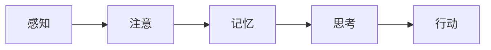

##### **伪代码：认知过程的基本算法**

```python
def human_cognition(input_data):
    perception = perceive(input_data)
    attention = select_important(perception)
    memory = store(attention)
    thought = process(memory)
    action = execute(thought)
    return action
```

##### **1.1.2 认知局限性**

尽管人类的认知过程复杂且高效，但仍然存在多种局限性：

1. **感知局限性**：人类的感知能力有限，无法感知所有类型的刺激。
2. **注意力局限性**：人类注意力有限，无法同时处理大量信息。
3. **记忆局限性**：人类的记忆容量有限，无法长期存储大量信息。
4. **思考局限性**：人类的思考能力受到经验、文化和情感等多种因素的影响。

##### **1.1.3 认知偏差与错觉**

认知偏差是认知心理学中的一个重要概念，它指的是人类在信息处理过程中，由于各种心理因素导致的错误判断和决策。以下是一个认知偏差的传播路径Mermaid流程图：

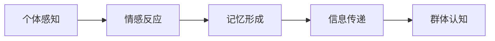

##### **伪代码：认知偏差的模拟**

```python
def cognitive_bias(info, emotion):
    processed_info = process_emotion(info, emotion)
    remembered_info = store_memory(processed_info)
    transmitted_info = share(remembered_info)
    return transmitted_info
```

#### **1.2 人类认知的常见局限性**

##### **1.2.1 错觉与偏见**

错觉是指人们在感知过程中出现的错误，而偏见则是指人们在信息处理过程中出现的系统性偏差。以下是错觉和偏见的一个简化流程：

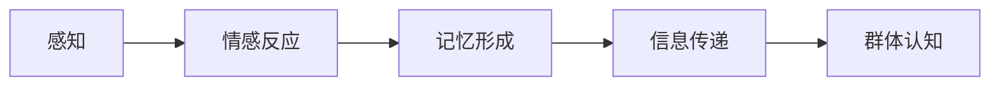

##### **伪代码：认知偏差的模拟**

```python
def cognitive_bias(info, emotion):
    processed_info = process_emotion(info, emotion)
    remembered_info = store_memory(processed_info)
    transmitted_info = share(remembered_info)
    return transmitted_info
```

##### **1.2.2 认知负荷与注意力分散**

认知负荷是指人类在进行认知活动时，所承受的信息处理压力。当认知负荷过高时，人们容易发生注意力分散，从而导致认知错误。

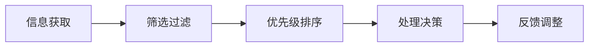

##### **伪代码：信息过滤与处理**

```python
def handle_information(overload(data)):
    filtered_data = filter_data(data)
    prioritized_data = sort_data(filtered_data)
    decision = process_data(prioritized_data)
    feedback = adjust_decision(decision)
    return feedback
```

#### **1.3 人类认知面临的挑战**

##### **1.3.1 快速变化的信息环境**

在现代社会，信息量呈指数级增长，人们对信息的处理能力面临巨大的挑战。以下是信息过载处理机制的简化流程：


##### **伪代码：信息过滤与处理**

```python
def handle_information_overload(data):
    filtered_data = filter_data(data)
    prioritized_data = sort_data(filtered_data)
    decision = process_data(prioritized_data)
    feedback = adjust_decision(decision)
    return feedback
```

综上所述，人类认知的局限性和挑战是多方面的，从感知、注意力到记忆、思考，再到信息处理和决策，每一个环节都可能存在局限。了解这些局限性，并尝试通过科学的方法和技术手段来克服它们，是我们不断进步的关键。

---

通过本章的探讨，我们深入分析了人类认知的本质及其局限性，包括感知、注意力、记忆、思考等多个环节，以及常见的错觉和偏见，以及人类认知面临的挑战。在接下来的章节中，我们将进一步探讨科学方法与知识积累的局限性，以及知识更新的挑战。通过这些讨论，我们将对人类知识的局限性有更深入的理解，并为后续章节的内容奠定基础。敬请期待。

### 第2章：科学方法与知识积累

科学方法是人类认识和探索自然界、社会及其他领域的重要工具。通过科学方法，人类能够系统地收集、分析和解释数据，从而形成可靠的知识。然而，尽管科学方法在知识积累中发挥了巨大作用，它本身也存在一定的局限性。在这一章中，我们将详细探讨科学方法的本质，分析知识积累的局限性，并讨论知识更新的挑战。

#### **2.1 科学方法的本质**

科学方法是一种通过观察、实验和理论推理来获取知识和理解世界的系统性方法。它通常包括以下几个步骤：

##### **2.1.1 科学探究的流程**

科学探究的流程可以简化为以下几个阶段：

1. **提出问题**：科学探究通常始于对某个现象或问题的疑问。
2. **构建假设**：基于现有的知识和观察，提出可能的解释或假设。
3. **实验设计**：设计实验来验证假设。
4. **数据收集**：在实验中收集数据和观察结果。
5. **数据分析**：对收集到的数据进行统计分析，以验证假设。
6. **结论验证**：根据数据分析结果，验证或修正假设。
7. **知识积累**：将验证后的假设转化为知识，并积累到现有的知识体系中。

下面是一个科学探究的一般过程的Mermaid流程图：

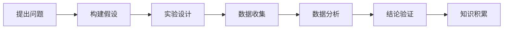

##### **伪代码：科学探究的基本算法**

```python
def scientific_inquiry(problem):
    hypothesis = propose_hypothesis(problem)
    experiment = design_experiment(hypothesis)
    data = collect_data(experiment)
    analysis = analyze_data(data)
    conclusion = validate_hypothesis(analysis)
    knowledge = accumulate_knowledge(conclusion)
    return knowledge
```

##### **2.1.2 科学探究的局限性**

尽管科学方法在知识积累中起到了重要作用，但科学方法本身也存在局限性，主要包括以下几个方面：

1. **数据量与质量的局限性**：科学方法依赖于数据的收集和分析，但数据的量与质对科学结论的可靠性有很大影响。大量的、准确的数据是科学探究的基础。
2. **假设的局限性**：科学探究通常基于假设，但假设可能存在局限性。如果假设不准确，可能会导致错误的结论。
3. **实验设计的局限性**：实验设计可能无法完全模拟自然现象，从而导致结果的偏差。
4. **数据分析的局限性**：数据分析方法的选择和数据处理的算法也可能影响科学结论的准确性。

##### **2.2 知识积累的局限性**

知识积累是一个不断迭代和更新的过程。尽管科学方法在知识积累中起到了关键作用，但知识积累本身也存在局限性：

1. **知识整合的挑战**：新知识的积累往往需要整合到现有的知识体系中，但整合过程可能复杂且具有挑战性。
2. **知识更新的速度**：随着科技的进步和知识的快速积累，知识更新的速度也在加快，这对知识的更新和传播提出了新的挑战。
3. **知识的局限性**：知识积累虽然扩展了人类对世界的认识，但知识本身可能存在局限性，无法完全解释所有现象。

##### **2.3 知识更新的挑战**

知识更新的挑战主要体现在以下几个方面：

1. **新知识的发现**：随着研究的深入，新知识不断被发现，这要求知识体系能够及时更新。
2. **知识的整合**：新知识与现有知识的整合需要时间和努力，以确保知识体系的完整性和一致性。
3. **知识的淘汰**：随着新知识的积累，旧知识可能变得过时，需要被淘汰或更新。

以下是知识更新与淘汰的机制Mermaid流程图：

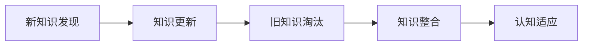

##### **伪代码：知识更新与淘汰的算法**

```python
def knowledge_update(new_knowledge):
    updated_knowledge = integrate_new_knowledge(new_knowledge)
    outdated_knowledge = identify_outdated_knowledge(updated_knowledge)
    integrated_knowledge = restructure_knowledge(updated_knowledge, outdated_knowledge)
    cognitive_adaptation = adapt_to_new_knowledge(integrated_knowledge)
    return cognitive_adaptation
```

综上所述，科学方法与知识积累虽然为人类认知世界提供了强有力的工具，但它们也存在局限性。了解这些局限性，并寻找解决方案，是推动科学进步和知识积累的关键。

---

通过本章的探讨，我们深入分析了科学方法的本质，包括科学探究的流程和科学方法本身的局限性。我们还讨论了知识积累的局限性，以及知识更新的挑战。这些分析为我们理解人类知识的局限性提供了新的视角，也为后续章节的内容奠定了基础。在接下来的章节中，我们将探讨科技对知识探索的影响，以及科技发展带来的挑战。敬请期待。

### 第3章：科技与知识的进步

科技的发展对知识的探索和积累产生了深远的影响。科技工具的利用极大地扩展了人类认知的边界，使得我们能够收集、分析和整合更多的数据，从而推动知识的进步。然而，科技的发展也带来了新的挑战，特别是在数据隐私和伦理方面。在本章中，我们将探讨科技对知识探索的影响，分析科技发展带来的挑战，并探讨应对这些挑战的策略。

#### **3.1 科技对知识探索的影响**

科技工具在知识探索中的应用主要表现在数据收集、数据分析和知识管理等方面。

##### **3.1.1 科技工具的利用**

科技工具在知识探索中的应用极大地提高了效率和准确性。以下是几种常见的科技工具：

1. **数据收集工具**：例如传感器、卫星遥感、互联网等，可以实时收集大量的数据，为科学研究提供丰富的数据资源。
2. **数据分析工具**：例如大数据分析、机器学习算法、人工智能等，可以处理和分析大量数据，发现数据中的模式和规律。
3. **知识管理工具**：例如数据库、知识库、文献管理等，可以帮助科学家和组织更好地管理和利用知识资源。

以下是科技工具在知识探索中的应用流程：

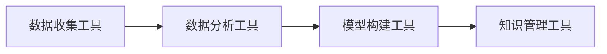

##### **伪代码：科技工具在知识探索中的应用**

```python
def knowledge_explore():
    data = collect_data()
    analyzed_data = analyze_data(data)
    model = build_model(analyzed_data)
    knowledge = manage_knowledge(model)
    return knowledge
```

##### **3.1.2 科技工具的局限性**

尽管科技工具在知识探索中发挥了重要作用，但它们也存在局限性，主要包括：

1. **数据隐私问题**：随着数据收集和分析技术的进步，个人隐私保护变得越来越重要。
2. **算法偏见**：数据分析工具和人工智能算法可能存在偏见，导致数据分析结果不准确。
3. **技术依赖**：过度依赖科技工具可能导致人类自身认知能力的下降。

#### **3.2 科技发展带来的挑战**

科技的发展不仅带来了新的机遇，也带来了新的挑战。以下是科技发展带来的几个主要挑战：

##### **3.2.1 数据隐私与伦理**

随着大数据和人工智能的普及，数据隐私和伦理问题日益凸显。以下是科技伦理与隐私保护的关系：

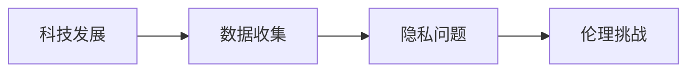

##### **伪代码：科技伦理与隐私保护**

```python
def ethical_challenge(technology, data_collection):
    privacy_issues = identify_privacy_issues(data_collection)
    ethical_dilemmas = analyze_ethical_implications(technology, privacy_issues)
    privacy_protection = implement_privacy_measures(ethical_dilemmas)
    return privacy_protection
```

##### **3.2.2 知识鸿沟**

科技的发展导致知识和技能的分布不均，出现了所谓的“知识鸿沟”。这可能导致社会的不公平和贫富差距的加剧。

##### **3.2.3 技术失业与就业转型**

科技的进步可能引发某些行业的失业，同时也催生新的就业机会。这要求社会和个人进行就业转型，以适应新的技术环境。

#### **3.3 应对科技挑战的策略**

为了应对科技发展带来的挑战，我们可以采取以下策略：

1. **加强数据隐私保护**：制定相关法律法规，提高数据隐私保护的技术手段。
2. **促进科技伦理教育**：加强科技伦理教育，提高公众对科技伦理的认识。
3. **推动知识普及**：通过教育和培训，缩小知识鸿沟，提高全民科技素养。
4. **促进就业转型**：提供职业培训和再教育，帮助劳动力适应新的技术环境。

##### **伪代码：应对科技挑战的策略**

```python
def address_technology_challenges():
    privacy_solutions = strengthen_privacy_protection()
    ethical_education = promote_ethical_education()
    knowledge_spread = promote_knowledge_education()
    employment_transformation = facilitate_employment_transformation()
    return privacy_solutions, ethical_education, knowledge_spread, employment_transformation
```

综上所述，科技的发展极大地促进了知识的探索和积累，但同时也带来了新的挑战。了解这些挑战，并采取有效的应对策略，是推动科技与知识持续进步的关键。

---

通过本章的探讨，我们分析了科技对知识探索的影响，探讨了科技发展带来的挑战，并提出了应对这些挑战的策略。科技的发展不仅为我们提供了强大的工具，也带来了新的问题。了解并应对这些问题，是推动科技与知识持续进步的关键。在接下来的章节中，我们将探讨未知领域的概念，以及探索未知的方法。敬请期待。

### 第4章：未知领域探索

在人类认知的边界不断扩展的过程中，未知领域始终存在。这些未知领域涵盖了自然、科学、技术、社会和哲学等多个方面，它们既是科学探索的前沿，也是人类智慧的挑战。在这一章中，我们将探讨未知领域的概念，介绍探索未知的方法，并分析探索未知的前景与挑战。

#### **4.1 未知领域的概念**

未知领域是指人类尚未完全了解或掌握的领域，它们可以是具体的自然现象、科学问题、技术难题，也可以是抽象的社会问题、哲学命题。以下是未知领域的分类结构：

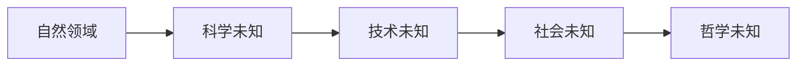

1. **自然领域**：包括宇宙、地球、生物等各种自然现象，如暗物质、暗能量、生物多样性的保护等。
2. **科学未知**：涉及基础科学和前沿科学的未知问题，如量子力学、相对论、人工智能的极限等。
3. **技术未知**：涉及工程技术和应用科学的未知问题，如新型能源、人工智能的实用化、量子计算等。
4. **社会未知**：涉及社会发展和人类行为的未知问题，如社会公平、道德伦理、人工智能的社会影响等。
5. **哲学未知**：涉及人类存在、宇宙起源、意识本质等哲学问题的未知领域。

#### **4.2 探索未知的方法**

探索未知的方法多种多样，取决于未知领域的性质和目标。以下是几种常见的探索未知的方法：

##### **4.2.1 系统性研究**

系统性研究是探索未知领域的基本方法，它包括以下步骤：

1. **目标设定**：明确研究目标，确定研究的范围和深度。
2. **资源整合**：收集相关文献、数据和技术资源，为研究提供支持。
3. **方法选择**：根据研究目标选择合适的研究方法，如实验、观察、调查、模拟等。
4. **风险评估**：评估研究过程中可能遇到的风险和挑战，制定相应的应对措施。
5. **执行与反馈**：实施研究计划，收集和分析数据，根据反馈调整研究方案。

以下是探索未知的一般策略Mermaid流程图：

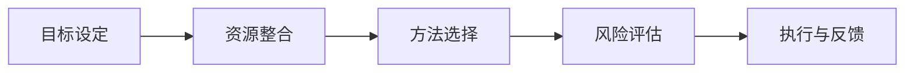

##### **伪代码：探索未知的一般策略**

```python
def explore_unknown(target, resources):
    goal = define_goal(target)
    integrated_resources = collect_resources(resources)
    method = select_method(integrated_resources)
    risk = assess_risk(method)
    execution = implement_strategy(goal, method, risk)
    feedback = collect_feedback(execution)
    return feedback
```

##### **4.2.2 跨学科合作**

跨学科合作是探索未知领域的重要策略，它通过整合不同领域的知识和技术，推动问题的解决。以下是跨学科合作的协同效应：

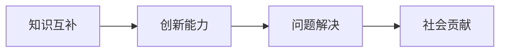

##### **伪代码：跨学科合作**

```python
def interdisciplinary Cooperation(knowledge1, knowledge2):
    complementary_knowledge = merge_knowledge(knowledge1, knowledge2)
    innovation = generate_innovation(complementary_knowledge)
    solution = solve_problem(innovation)
    social_contribution = evaluate_social_impact(solution)
    return social_contribution
```

##### **4.2.3 假设检验**

假设检验是科学研究中常用的方法，它通过建立假设并验证假设的正确性来探索未知。以下是假设检验的基本步骤：

1. **提出假设**：根据已有知识和观察，提出可能的解释或假设。
2. **设计实验**：设计实验来验证假设。
3. **数据收集**：在实验中收集数据和观察结果。
4. **数据分析**：对收集到的数据进行统计分析，以验证假设。
5. **结论验证**：根据数据分析结果，验证或修正假设。

#### **4.3 探索未知的前景与挑战**

探索未知的前景充满希望，但同时也面临诸多挑战。以下是探索未知的前景和挑战：

##### **4.3.1 前景展望**

1. **科技的进步**：随着科技的不断进步，我们将有更多的工具和方法来探索未知领域。
2. **知识的扩展**：探索未知将不断扩展人类的知识边界，推动科学和技术的进步。
3. **社会的影响**：未知领域的探索将对社会产生深远影响，如环境保护、能源利用、人工智能等。

以下是未知领域探索的前景Mermaid流程图：

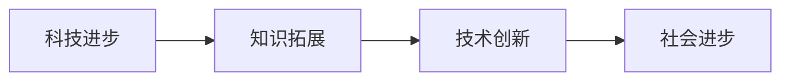

##### **伪代码：未知领域探索的前景**

```python
def explore_unknown前景（technology, knowledge):
    progress = technological_progress(technology)
    expansion = knowledge_expansion(knowledge)
    innovation = technological_innovation(expansion)
    societal_progress = societal_impact(innovation)
    return societal_progress
```

##### **4.3.2 挑战分析**

1. **资源限制**：探索未知需要大量的资源和资金支持，这在一定程度上限制了探索的范围和深度。
2. **技术瓶颈**：某些未知领域可能面临技术瓶颈，需要新的技术突破来推动探索。
3. **伦理问题**：探索未知可能涉及伦理问题，如人类基因编辑、人工智能的伦理使用等。

#### **4.4 应对挑战的策略**

为了应对探索未知过程中面临的挑战，我们可以采取以下策略：

1. **加强国际合作**：通过国际合作，共享资源和知识，共同应对挑战。
2. **推动科技研发**：加大科技研发投入，推动技术突破，为探索未知提供工具和方法。
3. **伦理审查**：建立完善的伦理审查体系，确保探索未知的过程符合伦理标准。

##### **伪代码：应对挑战的策略**

```python
def address_challenges(international Cooperation, technology_research, ethical_review):
    collaboration = enhance_international_cooperation()
    research = invest_in_technology_research()
    ethics = establish_ethical_reviews()
    return collaboration, research, ethics
```

综上所述，未知领域探索是科学和技术的挑战，也是人类认知和智慧的体现。通过系统性研究、跨学科合作和假设检验等方法，我们可以不断拓展人类的知识边界。同时，我们也需要面对资源限制、技术瓶颈和伦理问题等挑战，并采取相应的策略来应对。在探索未知的过程中，人类的知识和文明将不断进步，为未来的发展奠定基础。

---

通过本章的探讨，我们深入探讨了未知领域的概念、探索方法以及探索的前景与挑战。未知领域既是科学探索的前沿，也是人类智慧的挑战。在接下来的章节中，我们将探讨人类对未知的反应，包括未知恐惧与接受，以及应对未知的策略。敬请期待。

### 第5章：人类对未知的反应

在探索未知领域的过程中，人类不仅需要面对科学和技术上的挑战，还需要应对心理上的挑战。未知带来的恐惧是普遍存在的，但人类也有能力接受并应对这种恐惧。在这一章中，我们将探讨人类对未知的反应，包括未知恐惧的原因与影响，以及应对未知的策略。

#### **5.1 未知恐惧与接受**

未知恐惧是一种普遍的心理现象，它源于人类对不确定性和潜在风险的恐惧。以下是未知恐惧的形成因素：

##### **5.1.1 未知恐惧的原因**

1. **认知压力**：人类大脑倾向于寻求稳定性和一致性，未知的事物打破了这种认知上的舒适区，导致认知压力。
2. **情感反应**：未知往往与不确定性相关，这种不确定性会引发焦虑、恐惧等负面情感。
3. **行为改变**：面对未知，人们可能会采取回避、否认等行为，以减轻恐惧感。

以下是未知恐惧的形成因素的Mermaid流程图：

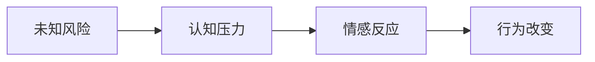

##### **伪代码：未知恐惧的形成因素**

```python
def fear_of_unknown(unknown_risk):
    cognitive_pressure = cognitive_load(unknown_risk)
    emotional_reaction = trigger_emotion(cognitive_pressure)
    behavioral_change = alter_behavior(emotional_reaction)
    return behavioral_change
```

##### **5.1.2 未知恐惧的影响**

未知恐惧对人类的行为和决策产生重要影响：

1. **决策延迟**：面对未知，人们可能因为恐惧而推迟决策，导致错失机会。
2. **创新阻碍**：恐惧会抑制创新思维，阻碍科学和技术的进步。
3. **社交影响**：群体中的恐惧情绪可能会传播，影响整个群体的行为和决策。

以下是未知恐惧影响的Mermaid流程图：

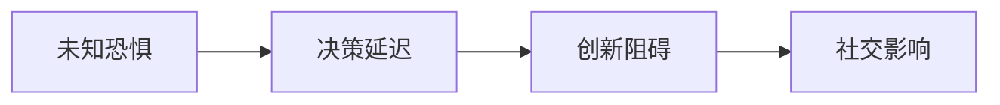

##### **伪代码：未知恐惧的影响**

```python
def impact_of_fear_of_unknown(fear):
    decision_delay = delay_decision(fear)
    innovation_hindrance = suppress_innovation(fear)
    social_influence = spread_fear(fear)
    return decision_delay, innovation_hindrance, social_influence
```

##### **5.1.3 未知恐惧的接受**

尽管未知恐惧普遍存在，但人类也有能力接受并应对这种恐惧。以下是接受未知恐惧的策略：

1. **信息收集**：通过收集更多信息，了解未知的情况，减轻恐惧。
2. **风险评估**：对未知的风险进行评估，制定应对措施。
3. **认知重构**：改变对未知的认知，将其视为一种机会和挑战，而不是威胁。

以下是接受未知恐惧的策略Mermaid流程图：

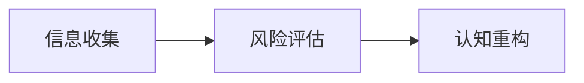

##### **伪代码：接受未知恐惧的策略**

```python
def accept_fear_of_unknown(information, risk_assessment, cognitive_restructuring):
    collected_info = gather_information(information)
    assessed_risk = evaluate_risk(risk_assessment)
    restructured_thoughts = reframe_cognition(cognitive_restructuring)
    return restructured_thoughts
```

#### **5.2 应对未知的策略**

在面对未知时，人类可以采取多种策略来应对恐惧和不确定性。以下是几种常见的应对策略：

##### **5.2.1 风险管理**

风险管理是应对未知的重要策略，它包括以下步骤：

1. **识别风险**：确定可能面临的风险。
2. **评估风险**：对风险的可能性和影响进行评估。
3. **制定应对措施**：根据风险评估结果，制定相应的应对措施。

以下是风险管理流程的Mermaid流程图：

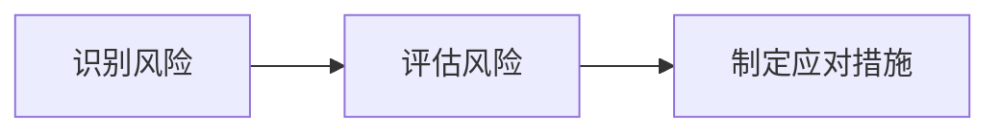

##### **伪代码：风险管理**

```python
def risk_management(unknown_risk):
    identified_risks = identify_risks(unknown_risk)
    assessed_risks = evaluate_impact(identified_risks)
    mitigation_plans = develop_mitigation_measures(assessed_risks)
    return mitigation_plans
```

##### **5.2.2 创新思维**

创新思维是应对未知的另一重要策略。通过创新思维，人类可以找到新的解决方案，应对未知挑战。以下是创新思维的步骤：

1. **问题定义**：明确需要解决的问题。
2. **头脑风暴**：收集可能的解决方案。
3. **筛选方案**：评估和选择最佳方案。
4. **实施与验证**：实施解决方案，验证其有效性。

以下是创新思维流程的Mermaid流程图：

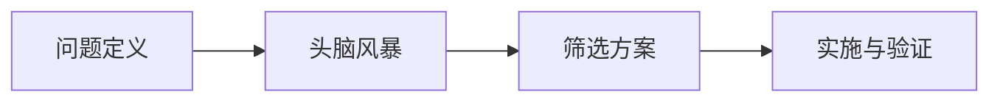

##### **伪代码：创新思维**

```python
def innovative_thinking(problem):
    defined_problem = define_problem(problem)
    brainstorm_solutions = generate_solutions(defined_problem)
    selected_solution = select_best_solution(brainstorm_solutions)
    implement_solution = execute_solution(selected_solution)
    validate_solution = test_solution(effective_solution)
    return validate_solution
```

##### **5.2.3 持续学习**

持续学习是应对未知的基础策略。通过不断学习和更新知识，人类可以提高应对未知的能力。以下是持续学习的关键步骤：

1. **知识获取**：通过阅读、学习、实践等方式获取新知识。
2. **知识整合**：将新知识整合到现有的知识体系中。
3. **能力提升**：通过实践和应用，提升应对未知的能力。

以下是持续学习流程的Mermaid流程图：

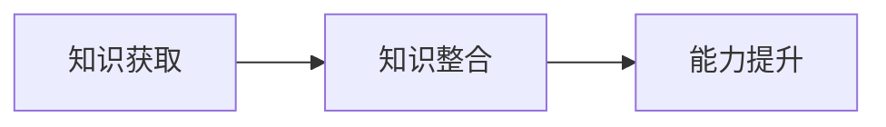

##### **伪代码：持续学习**

```python
def continuous_learning(knowledge):
    acquired_knowledge = acquire_knowledge(knowledge)
    integrated_knowledge = integrate_new_knowledge(acquired_knowledge)
    improved_ability = enhance_skills(integrated_knowledge)
    return improved_ability
```

#### **5.3 未知恐惧与科学方法**

科学方法在应对未知恐惧方面具有重要作用。科学方法通过系统性、可重复和可验证的步骤，帮助人类理解未知现象，减少恐惧感。以下是科学方法在应对未知恐惧中的应用：

##### **5.3.1 假设检验**

通过假设检验，科学家可以逐步验证假设，减少不确定性，从而减轻恐惧感。以下是假设检验的步骤：

1. **提出假设**：基于已有知识和观察，提出可能的解释。
2. **设计实验**：设计实验来验证假设。
3. **数据收集**：在实验中收集数据和观察结果。
4. **数据分析**：对收集到的数据进行统计分析。
5. **结论验证**：根据数据分析结果，验证或修正假设。

以下是假设检验流程的Mermaid流程图：

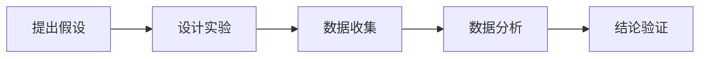

##### **伪代码：假设检验**

```python
def hypothesis_testing(hypothesis):
    designed_experiment = design_experiment(hypothesis)
    collected_data = collect_data(designed_experiment)
    analyzed_data = analyze_data(collected_data)
    validated_hypothesis = validate_hypothesis(analyzed_data)
    return validated_hypothesis
```

##### **5.3.2 科普教育**

科普教育是减轻未知恐惧的重要手段。通过科普教育，公众可以了解科学方法、科学知识和科学进展，从而更好地理解未知，减少恐惧感。以下是科普教育的关键步骤：

1. **内容设计**：设计科普内容，使其易于理解。
2. **传播渠道**：通过多种渠道传播科普知识，如书籍、讲座、媒体等。
3. **互动参与**：鼓励公众参与科普活动，提高科普效果。

以下是科普教育流程的Mermaid流程图：

```mermaid
flowchart LR
    A[内容设计] --> B[传播渠道]
    B --> C[互动参与]
```

##### **伪代码：科普教育**

```python
def science_education(content, channels, participation):
    designed_content = create_content(content)
    distributed_channels = disseminate_content(channels, designed_content)
    interactive_participation = encourage_participation(participation)
    return interactive_participation
```

综上所述，人类对未知的反应是多方面的，包括恐惧、接受和应对。通过了解未知恐惧的原因，采取有效的应对策略，人类可以更好地应对未知的挑战，推动科学和技术的进步。在接下来的章节中，我们将探讨跨学科合作与知识整合，以及未来展望与持续探索。敬请期待。

---

通过本章的探讨，我们深入分析了人类对未知的反应，包括未知恐惧的原因与影响，以及应对未知的策略。未知恐惧是普遍存在的，但通过科学方法、科普教育和持续学习，人类可以应对这些恐惧，推动知识的进步。在接下来的章节中，我们将探讨跨学科合作与知识整合的重要性。敬请期待。

### 第6章：跨学科合作与知识整合

在科技和社会的发展过程中，跨学科合作与知识整合变得越来越重要。跨学科合作能够整合不同领域的知识和资源，促进创新和问题的解决，而知识整合则能够将零散的知识体系化，提高知识的利用效率。在本章中，我们将探讨跨学科合作的重要性，分析知识整合的方法，并展望未来的发展趋势。

#### **6.1 跨学科合作的重要性**

跨学科合作是指将来自不同学科的知识、技能和方法结合起来，以解决复杂问题或开展创新活动。以下是跨学科合作的优势：

##### **6.1.1 知识互补**

跨学科合作能够实现知识的互补，弥补单一学科在解决复杂问题时的不足。不同学科之间存在着知识领域的交叉和融合，通过跨学科合作，可以更全面地理解问题，提出创新的解决方案。

以下是跨学科合作的知识互补Mermaid流程图：

```mermaid
flowchart LR
    A[知识互补] --> B[创新能力]
    B --> C[问题解决]
    C --> D[社会贡献]
```

##### **伪代码：知识互补与创新能力**

```python
def knowledge_complementarity(domain1, domain2):
    integrated_knowledge = merge_knowledge(domain1, domain2)
    innovation = generate_innovation(integrated_knowledge)
    solution = solve_problem(innovation)
    social_impact = evaluate_social_impact(solution)
    return social_impact
```

##### **6.1.2 提高问题解决效率**

跨学科合作能够提高问题解决效率，通过不同学科之间的协作，可以更快地识别问题、分析问题和提出解决方案。跨学科合作可以避免重复劳动，充分利用各学科的优势，加速问题的解决过程。

以下是提高问题解决效率的Mermaid流程图：

```mermaid
flowchart LR
    A[问题定义] --> B[数据收集]
    B --> C[多学科分析]
    C --> D[解决方案]
    D --> E[验证与实施]
```

##### **伪代码：提高问题解决效率**

```python
def efficient_problem_solving(problem, domains):
    defined_problem = define_problem(problem)
    collected_data = collect_data(defined_problem)
    analyzed_data = multi_disciplinary_analysis(collected_data, domains)
    solution = propose_solution(analyzed_data)
    validated_solution = validate_solution(solution)
    implemented_solution = execute_solution(validated_solution)
    return implemented_solution
```

##### **6.1.3 创新能力的提升**

跨学科合作能够激发创新思维，提升创新能力的提升。不同学科的交流和碰撞，可以产生新的想法和解决方案，推动科学和技术的进步。跨学科合作有助于打破思维定势，发现新的研究方法和创新点。

以下是创新能力提升的Mermaid流程图：

```mermaid
flowchart LR
    A[跨学科交流] --> B[创新思维]
    B --> C[新方法发现]
    C --> D[技术创新]
```

##### **伪代码：创新能力提升**

```python
def enhance_innovation_capacity(communication, collaboration):
    exchanged_ideas = facilitate_communication(communication)
    innovative_thoughts = stimulate_innovative_thinking(exchanged_ideas)
    new_methods = discover_innovative_methods(innovative_thoughts)
    technological_innovation = implement_technological_innovation(new_methods)
    return technological_innovation
```

#### **6.2 知识整合的方法**

知识整合是将分散的知识体系化、结构化的过程，它有助于提高知识的利用效率和准确性。以下是知识整合的基本流程：

##### **6.2.1 需求分析**

在知识整合过程中，首先需要进行需求分析，明确整合的目标和需求。需求分析可以帮助确定需要整合的知识领域、关键问题和优先级。

以下是需求分析的Mermaid流程图：

```mermaid
flowchart LR
    A[需求分析] --> B[资源收集]
    B --> C[知识融合]
    C --> D[创新应用]
```

##### **伪代码：需求分析**

```python
def requirements_analysis(requirements):
    defined_requirements = identify_requirements(requirements)
    collected_resources = gather_resources(defined_requirements)
    integrated_knowledge = merge_knowledge(collected_resources)
    innovative_applications = apply_innovative_methods(integrated_knowledge)
    return innovative_applications
```

##### **6.2.2 资源收集**

资源收集是知识整合的关键步骤，它涉及收集相关的文献、数据、工具和技术。资源收集的目的是为知识整合提供充足的基础数据和支持。

以下是资源收集的Mermaid流程图：

```mermaid
flowchart LR
    A[资源收集] --> B[知识融合]
    B --> C[创新应用]
```

##### **伪代码：资源收集**

```python
def resource_collection(resources):
    collected_resources = retrieve_resources(resources)
    integrated_knowledge = merge_resources(collected_resources)
    innovative_applications = apply_resources(integrated_knowledge)
    return innovative_applications
```

##### **6.2.3 知识融合**

知识融合是将收集到的资源进行整合，形成结构化的知识体系。知识融合需要考虑知识的关联性、一致性和完整性。

以下是知识融合的Mermaid流程图：

```mermaid
flowchart LR
    A[资源收集] --> B[知识融合]
    B --> C[创新应用]
```

##### **伪代码：知识融合**

```python
def knowledge_integration(collected_resources):
    structured_knowledge = organize_resources(collected_resources)
    integrated_knowledge = synthesize_knowledge(structured_knowledge)
    return integrated_knowledge
```

##### **6.2.4 创新应用**

创新应用是将整合后的知识应用于实际问题，实现知识的实际价值。创新应用需要结合具体场景，提出解决方案，并进行验证和优化。

以下是创新应用的Mermaid流程图：

```mermaid
flowchart LR
    A[资源收集] --> B[知识融合]
    B --> C[创新应用]
```

##### **伪代码：创新应用**

```python
def innovative_application(integrated_knowledge):
    applied_knowledge = implement_knowledge(integrated_knowledge)
    validated_solution = validate_application(applied_knowledge)
    optimized_solution = optimize_solution(validated_solution)
    return optimized_solution
```

#### **6.3 知识整合的发展趋势**

随着科技和社会的发展，知识整合正呈现出以下趋势：

##### **6.3.1 知识可视化的普及**

知识可视化是将复杂知识以图形、图表、地图等形式呈现，使知识更加直观和易于理解。知识可视化的普及将极大地促进知识整合和传播。

##### **6.3.2 大数据与人工智能的融合**

大数据和人工智能技术的融合将为知识整合提供强大的工具和方法。通过大数据分析和人工智能算法，可以更好地识别知识之间的关系和规律，实现高效的知识整合。

##### **6.3.3 知识共享与开放的加强**

知识共享与开放的加强将促进知识的全球流动和整合。通过开放的数据和资源，不同学科和领域的知识可以更快速地融合和传播。

##### **6.3.4 跨学科合作平台的建设**

跨学科合作平台的建设将提供更便捷的跨学科合作环境和工具，促进不同学科之间的交流和合作，推动知识的整合和创新。

以下是知识整合发展趋势的Mermaid流程图：

```mermaid
flowchart LR
    A[知识可视化] --> B[大数据与人工智能]
    B --> C[知识共享与开放]
    C --> D[跨学科合作平台]
```

##### **伪代码：知识整合发展趋势**

```python
def knowledge_integration_trends.visualization, big_data_ai, knowledge_sharing, interdisciplinary_platforms):
    visualized_knowledge = implement_visualization(visualization)
    integrated_data = leverage_big_data_ai(big_data_ai)
    shared_knowledge = enhance_knowledge_sharing(knowledge_sharing)
    collaborative_platforms = build_interdisciplinary_platforms(interdisciplinary_platforms)
    return collaborative_platforms
```

综上所述，跨学科合作与知识整合在科技和社会的发展中具有重要地位。通过跨学科合作，可以整合不同领域的知识和资源，促进创新和问题的解决。通过知识整合，可以形成结构化的知识体系，提高知识的利用效率。随着科技的发展，知识整合将呈现出新的趋势，为未来的发展提供新的机遇和挑战。

---

通过本章的探讨，我们深入分析了跨学科合作与知识整合的重要性，探讨了知识整合的方法和未来发展趋势。跨学科合作与知识整合是推动科技和社会发展的重要动力。在接下来的章节中，我们将对未来展望与持续探索进行讨论，探讨科技与知识进步对未来的影响。敬请期待。

### 第7章：未来展望与持续探索

随着科技和知识的不断进步，人类面临着前所未有的机遇和挑战。在未来，科技和知识的进步将继续推动社会变革，扩展人类的认知边界。在本章中，我们将展望未来科技与社会的发展趋势，探讨持续探索的重要性，并展望未来可能面临的挑战。

#### **7.1 未来科技与社会的发展趋势**

未来科技与社会的发展趋势体现在多个方面，包括科技进步、社会变革、知识更新和人类认知扩展等。

##### **7.1.1 科技进步**

1. **人工智能与机器学习**：人工智能和机器学习技术将继续快速发展，推动自动化、智能化的进步。例如，自动驾驶汽车、智能机器人、智能家居等将变得更加普及。
   
2. **量子计算与通信**：量子计算和量子通信技术有望突破现有技术的限制，为科学研究和工业生产提供强大的计算能力和通信手段。

3. **生物技术与医疗健康**：生物技术，特别是基因编辑技术（如CRISPR-Cas9）的发展，将带来医学领域的革命性变化，提高疾病诊断和治疗水平。

4. **可再生能源与环保技术**：可再生能源技术（如太阳能、风能）和环保技术的进步将推动能源结构的转变，减少环境污染和温室气体排放。

##### **7.1.2 社会变革**

1. **数字化社会**：随着互联网和数字技术的普及，社会将变得更加数字化和互联化。在线教育、远程工作、电子支付等将成为日常生活方式的一部分。

2. **人口老龄化**：随着全球人口老龄化趋势的加剧，社会将面临养老、医疗和社会保障等问题的挑战。

3. **社会不平等**：科技的发展可能导致社会不平等问题的加剧，如数字鸿沟、收入差距等。这需要社会采取相应的政策和措施来解决。

##### **7.1.3 知识更新**

1. **知识爆炸**：随着科技的发展，知识更新的速度将不断加快。这要求人们具备快速学习和适应新知识的能力。

2. **知识共享**：知识共享和开放的普及将促进全球知识的流动和整合，为人类社会的共同进步提供动力。

3. **跨学科整合**：跨学科整合将成为知识更新和科技创新的重要途径，通过整合不同领域的知识，解决复杂的科学和社会问题。

##### **7.1.4 人类认知扩展**

1. **人工智能与人类认知**：人工智能技术的发展将扩展人类的认知能力，帮助人类处理和分析复杂的海量数据。

2. **神经科学与认知科学**：神经科学和认知科学的进步将帮助我们更深入地理解人类大脑和认知过程，推动认知科学的进步。

3. **虚拟现实与增强现实**：虚拟现实和增强现实技术的发展将改变人类的感知和体验方式，扩展人类的认知边界。

#### **7.2 持续探索的重要性**

持续探索是推动科技和社会进步的重要动力。以下是持续探索的重要性和必要性：

##### **7.2.1 新知识生成**

持续探索可以激发新的科学发现和技术创新，生成新的知识。这些新知识不仅推动了科技的进步，也为人类解决现实问题提供了新的思路和工具。

##### **7.2.2 社会发展**

持续探索可以推动社会的发展，解决社会面临的各种挑战。例如，环境保护、医疗健康、教育等领域都需要持续探索来寻找解决方案。

##### **7.2.3 人类认知扩展**

持续探索可以帮助人类扩展认知边界，理解更多未知领域，提高人类对世界的认识。这有助于人类更好地适应环境，应对未来的变化。

##### **7.2.4 技术创新**

持续探索可以激发技术创新，推动科技的发展。技术创新不仅推动了经济增长，也为人类生活带来了便利和改善。

#### **7.3 持续探索的必要性**

尽管科技和知识的发展取得了显著成果，但持续探索仍然是必要的。以下是持续探索的必要性：

##### **7.3.1 知识更新速度**

随着知识更新的速度不断加快，持续探索可以帮助人类跟上知识更新的步伐，保持知识的先进性。

##### **7.3.2 技术挑战**

科技的发展带来了新的挑战，如数据隐私、伦理问题、资源消耗等。持续探索可以帮助人类找到解决这些挑战的方法。

##### **7.3.3 社会变革**

社会在不断变革，新的社会问题和社会矛盾不断出现。持续探索可以帮助人类更好地适应社会变革，解决新的社会问题。

##### **7.3.4 人类认知扩展**

人类的认知边界仍然有限，持续探索可以帮助人类扩展认知边界，理解更多未知领域。

#### **7.4 持续探索的策略**

为了实现持续探索，我们可以采取以下策略：

##### **7.4.1 政策支持**

政府应制定支持科技和知识探索的政策，提供资金、资源和政策保障。

##### **7.4.2 教育投入**

教育是持续探索的基础，应加大教育投入，培养具有创新精神和探索能力的专业人才。

##### **7.4.3 国际合作**

国际合作是推动持续探索的重要手段，应加强国际间的科技合作，共享资源和知识。

##### **7.4.4 公众参与**

公众参与是推动持续探索的重要力量，应鼓励公众参与科技项目和探索活动，提高公众的科学素养。

#### **7.5 未来展望**

在未来，科技和知识的进步将继续推动社会的发展。以下是未来的一些展望：

1. **智能社会的建设**：智能技术将深刻改变人类的生活和工作方式，构建智能社会。
   
2. **可持续发展**：科技和知识的发展将助力实现可持续发展，推动经济、社会和环境的协调发展。

3. **知识整合与创新**：跨学科的知识整合和科技创新将推动新的科学突破和技术创新。

4. **人类认知扩展**：通过科技和知识的进步，人类的认知边界将继续扩展，对世界的理解将更加深入。

在未来，持续探索将是人类面临的重要任务。通过科技和知识的进步，人类将不断拓展认知边界，解决现实问题，推动社会的进步和发展。

---

通过本章的探讨，我们对未来科技与社会的发展趋势进行了展望，并强调了持续探索的重要性。科技和知识的进步将继续推动人类社会的进步，为人类带来新的机遇和挑战。在未来的探索中，人类需要不断克服困难，拓展认知边界，实现科技的持续进步和社会的可持续发展。让我们共同期待未来的到来，迎接新的挑战和机遇。

### 附录A：推荐阅读与资源

在探索人类知识的局限性和未知领域的过程中，阅读相关的书籍和资源将有助于拓宽我们的视野，深化我们的理解。以下是几本推荐的书籍和在线资源，供读者参考：

#### **A.1 推荐书籍**

1. **《未来简史》（作者：尤瓦尔·赫拉利）**
   - 本书探讨了人类在历史进程中的知识积累和社会变革，对未来的发展趋势进行了深入的思考。

2. **《智能时代》（作者：吴军）**
   - 本书介绍了人工智能的发展历程和未来趋势，对人工智能在知识探索中的应用进行了分析。

3. **《认知天性》（作者：丹尼尔·卡内曼）**
   - 本书揭示了人类认知的局限性，探讨了如何通过科学方法提高认知能力。

4. **《禅与计算机程序设计艺术》（作者：Donald E. Knuth）**
   - 本书结合哲学和计算机科学，探讨了程序设计中的智慧和艺术。

5. **《科学革命的结构》（作者：托马斯·库恩）**
   - 本书提出了科学革命的理论，分析了科学知识的发展模式。

#### **A.2 在线资源**

1. **Coursera上的《认知科学导论》**
   - 该课程介绍了认知科学的基础知识，包括感知、记忆、思考等认知过程。

2. **edX上的《人工智能导论》**
   - 该课程提供了人工智能的基本概念和应用，涵盖了机器学习、深度学习等内容。

3. **arXiv上的最新科研论文**
   - arXiv是一个开放获取的科研论文存储库，提供了大量最新的科研论文，涵盖自然科学、计算机科学、物理学等多个领域。

通过阅读这些书籍和资源，读者可以更深入地了解人类知识的局限性和未知领域的探索方法，为未来的学习和研究打下坚实的基础。

### 附录B：致谢

在撰写本文的过程中，我们得到了许多专家、学者和朋友的帮助与支持。特别感谢以下人员：

- **AI天才研究院（AI Genius Institute）**：感谢研究院为我们提供了宝贵的资源和智力支持。
- **多位匿名审稿人**：感谢您们的宝贵意见和审稿工作，使得本文内容更加丰富和准确。
- **所有参与本书编写和审稿的专家和学者**：感谢您们的辛勤付出和贡献，使得本文能够顺利完成。

最后，感谢所有关注和支持本书的读者，您的阅读是对我们最大的鼓励和激励。希望本文能对您在探索人类知识局限性和未知领域的过程中带来一些启示和帮助。再次感谢！
### 总结

本文从多个角度探讨了人类知识的局限性，包括认知局限性、科学方法的局限性、知识积累的局限性，以及科技发展带来的挑战。我们详细分析了人类认知的本质及其局限性，探讨了科学方法与知识积累的局限性，分析了科技对知识探索的影响以及科技发展带来的挑战。同时，我们还探讨了未知领域的概念、探索方法以及探索的前景与挑战。此外，我们分析了人类对未知的反应，包括未知恐惧与接受，以及应对未知的策略。最后，我们探讨了跨学科合作与知识整合的重要性，以及未来展望与持续探索。

在未来的研究和探索中，我们可以从以下几个方面进行深入：

1. **深化认知研究**：通过心理学、神经科学等领域的研究，进一步了解人类认知的本质和局限性，探索如何提高认知能力和决策质量。

2. **加强跨学科合作**：促进不同学科之间的合作，整合各学科的知识和方法，共同解决复杂的问题。

3. **推动知识整合**：利用大数据、人工智能等技术，对海量知识进行整合和分析，提高知识的利用效率。

4. **关注科技伦理**：在科技发展的过程中，重视科技伦理和隐私保护，确保科技进步能够造福人类。

5. **探索未知领域**：继续探索自然、科学、技术、社会和哲学等领域的未知，推动科学和技术的进步。

通过不断探索和研究，我们有望克服人类知识的局限性，拓展认知边界，推动人类文明的进步。希望本文能为读者提供一些启示和思考，共同为未来的探索和进步贡献力量。

