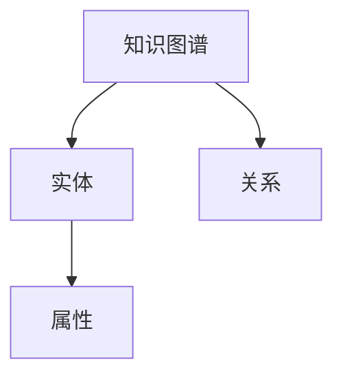
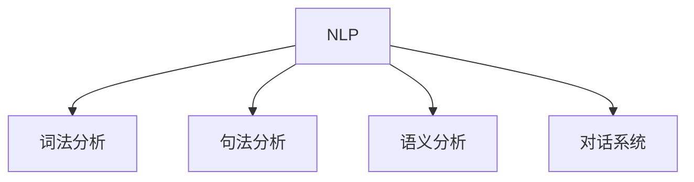
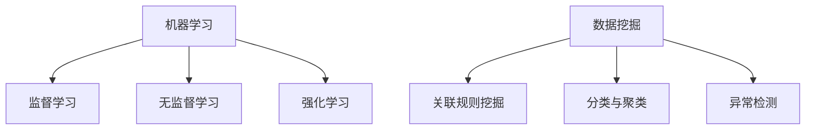
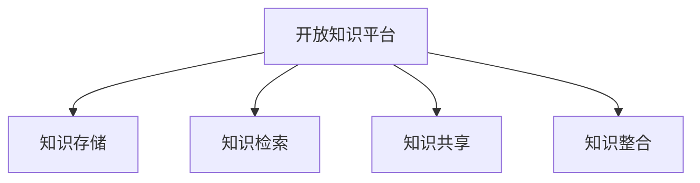
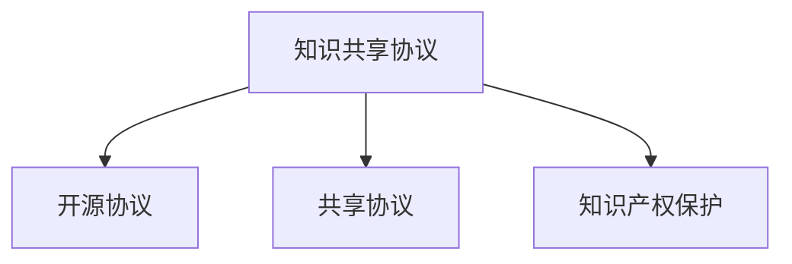
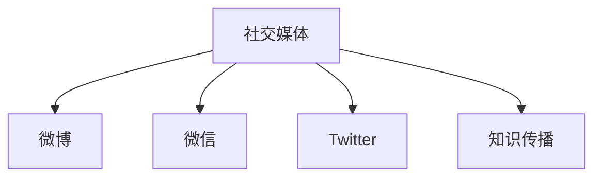
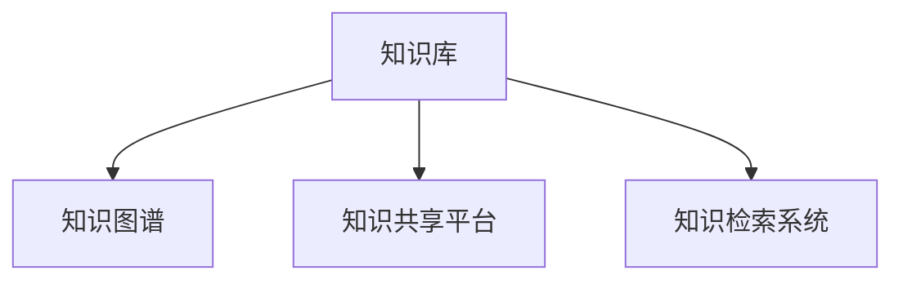
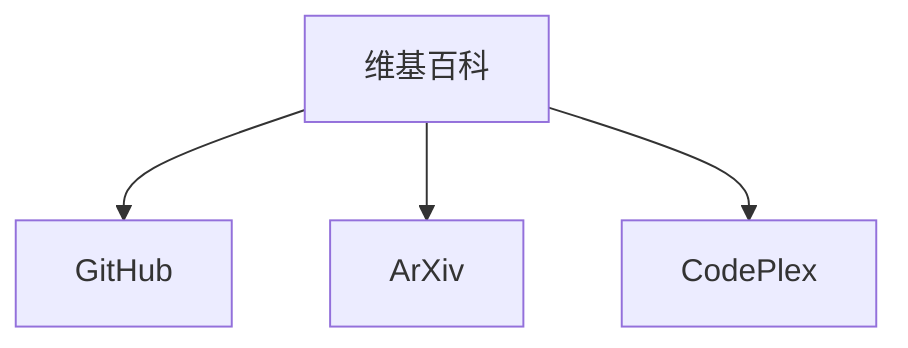
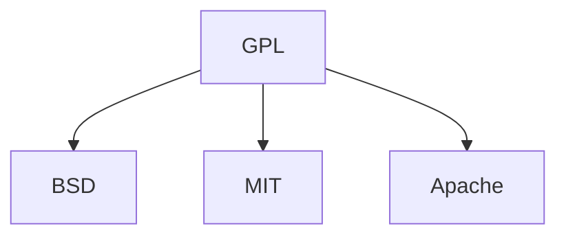
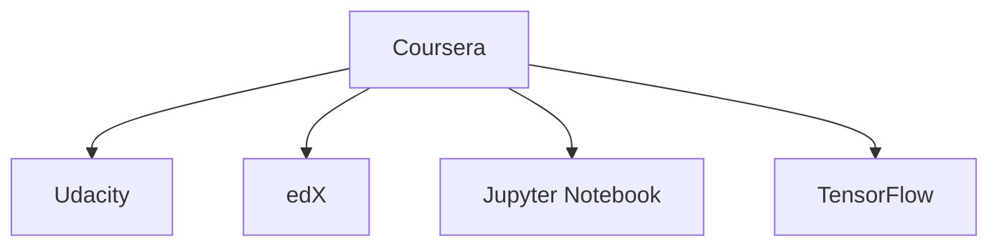

                 

# 人类知识的民主化：知识为人民服务

## 关键词
- 人类知识民主化
- 知识普惠
- 知识共享
- 知识普及
- 教育改革
- 科技创新
- 社会治理

## 摘要
本文旨在探讨人类知识的民主化，即如何让知识更好地为人民服务。文章首先阐述了知识民主化的概念、原则和意义，随后深入分析了知识民主化的技术基础、实施策略以及社会影响。最后，文章展望了知识民主化的未来，探讨了人工智能、可持续发展以及全球视角下的知识民主化。通过本文，读者可以全面了解知识民主化的方方面面，为推进这一理念提供参考。

## 引言

在信息爆炸的时代，知识已经成为推动社会进步的重要力量。然而，知识的获取和传播仍存在不均衡的现象，知识精英和普通人之间的差距日益扩大。人类知识的民主化，旨在打破这种不平等，让知识更好地为人民服务。本文将从以下几个方面展开讨论：

1. **人类知识的民主化概述**：介绍知识民主化的概念、原则和意义。
2. **知识民主化的技术基础**：分析知识管理技术、知识共享与传播技术以及技术挑战与展望。
3. **知识民主化的实施策略**：探讨政策与法规、教育改革以及企业实践。
4. **知识民主化的社会影响**：分析知识民主化对社会结构、经济发展和文化的影响。
5. **知识民主化的未来展望**：探讨知识民主化与人工智能、可持续发展以及全球视角。

通过本文的探讨，我们希望能够唤起社会各界对知识民主化的关注，推动知识的普及与共享，让每一个人都能够享受到知识带来的福祉。

---

### 第一部分: 人类知识的民主化概述

#### 第1章: 人类知识的民主化概述

### 1.1 人类知识的民主化概念

#### 1.1.1 人类知识民主化的定义
人类知识的民主化，指的是通过技术、政策和教育等手段，打破知识获取与传播的壁垒，实现知识普惠、共享和普及的过程。其核心在于消除知识差距，使每一个人都能公平地获取和使用知识。

#### 1.1.2 人类知识民主化的背景
在传统社会中，知识主要掌握在精英阶层手中，普通人难以接触和掌握。然而，随着信息技术的发展，知识传播的速度和范围大大扩展，为知识民主化提供了可能。此外，全球化和数字经济的兴起，也对知识民主化提出了新的要求。

#### 1.1.3 人类知识民主化的意义
知识民主化具有多重意义。首先，它有助于缩小知识差距，提高社会整体素质。其次，它能够激发创新活力，推动社会进步。最后，知识民主化有助于实现社会公平，使每一个人都能够分享知识带来的福祉。

### 1.2 知识为人民服务的原则

#### 1.2.1 知识普惠的原则
知识普惠，指的是让知识服务于最广泛的人群，不论年龄、性别、地域和收入水平。实现知识普惠，需要降低知识获取的门槛，提供丰富的教育资源和技术支持。

#### 1.2.2 知识共享的原则
知识共享，指的是在尊重知识产权的前提下，促进知识的开放和共享。实现知识共享，需要建立健全的知识共享平台，制定合理的知识共享协议。

#### 1.2.3 知识普及的原则
知识普及，指的是让知识为广大人民群众所理解和掌握。实现知识普及，需要开展多样化的教育活动，提高公众的知识素养。

### 1.3 知识民主化在实践中的应用

#### 1.3.1 教育领域的应用
在教育领域，知识民主化体现在教育公平、教育资源分配和教育信息化建设等方面。通过推进教育改革，确保每一个孩子都能接受良好的教育，提高全民素质。

#### 1.3.2 科技创新领域的应用
在科技创新领域，知识民主化体现在开放创新、知识共享和知识产权保护等方面。通过加强产学研合作，推动科技创新成果的普及和应用。

#### 1.3.3 社会治理领域的应用
在社会治理领域，知识民主化体现在数据开放、公共服务和信息透明等方面。通过加强数据开放和共享，提高政府治理的透明度和效率。

---

### 第二部分: 知识民主化的技术基础

#### 第2章: 知识民主化的技术基础

#### 2.1 知识管理技术

##### 2.1.1 知识图谱技术
知识图谱技术是一种用于表示和存储知识的方法，通过建立实体与实体之间的关联，形成一个语义网络。知识图谱技术有助于知识的组织、检索和推理。

**核心概念与联系**


##### 2.1.2 自然语言处理技术
自然语言处理技术（NLP）是使计算机能够理解、处理和生成自然语言的技术。NLP技术包括词法分析、句法分析、语义分析和对话系统等，有助于知识的自动化获取和共享。

**核心概念与联系**


##### 2.1.3 机器学习与数据挖掘技术
机器学习与数据挖掘技术是知识民主化的核心技术，通过算法和模型从海量数据中提取有价值的信息，为知识创新和共享提供支持。

**核心概念与联系**


#### 2.2 知识共享与传播技术

##### 2.2.1 开放知识平台
开放知识平台是一种支持知识共享和传播的技术基础设施，通过提供开放接口和工具，促进知识的开放、共享和整合。

**核心概念与联系**


##### 2.2.2 知识共享协议
知识共享协议是规范知识共享行为和权益分配的规则体系，如开源协议、共享协议等，保障知识共享的公正和有效。

**核心概念与联系**


##### 2.2.3 社交媒体在知识传播中的应用
社交媒体是知识传播的重要渠道，通过微博、微信、Twitter等平台，知识可以迅速传播和扩散，提高知识的普及度。

**核心概念与联系**


#### 2.3 知识民主化的技术挑战与展望

##### 2.3.1 技术挑战
知识民主化面临诸多技术挑战，如数据的隐私与安全、知识的质量与可靠性、技术的普及与可持续发展等。

##### 2.3.2 技术展望
未来，随着人工智能、区块链等技术的发展，知识民主化将迎来新的机遇。通过技术创新，实现知识的高效组织、共享和利用。

##### 2.3.3 未来发展趋势
知识民主化将呈现出以下发展趋势：知识的个性化服务、跨领域的知识融合、全球知识共享网络的构建等。

---

### 第三部分: 知识民主化的实施策略

#### 第3章: 知识民主化的实施策略

#### 3.1 知识民主化的政策与法规

##### 3.1.1 政府政策
政府应制定支持知识民主化的政策，如鼓励知识共享、加强知识产权保护、促进教育公平等。

**核心算法原理讲解**
```latex
\text{政策制定算法原理：}
\begin{aligned}
\text{输入：} & \text{知识需求分析、社会反馈、技术发展趋势} \\
\text{输出：} & \text{政策建议、执行计划、监督机制}
\end{aligned}
```

##### 3.1.2 法规制定
法规应规范知识共享与传播的行为，保障知识产权，同时促进知识的普及和应用。

**核心算法原理讲解**
```latex
\text{法规制定算法原理：}
\begin{aligned}
\text{输入：} & \text{知识共享案例、社会需求、国际法规} \\
\text{输出：} & \text{法规文本、执行细则、法律监督}
\end{aligned}
```

##### 3.1.3 国际合作与协调
国际合作与协调是推动知识民主化的重要手段，通过建立全球知识共享网络，促进知识的跨国传播和共享。

**核心算法原理讲解**
```latex
\text{国际合作与协调算法原理：}
\begin{aligned}
\text{输入：} & \text{国家政策、国际法规、技术标准} \\
\text{输出：} & \text{全球知识共享协议、合作项目、资源共享}
\end{aligned}
```

#### 3.2 知识民主化的教育改革

##### 3.2.1 教育公平
教育公平是实现知识民主化的重要基础，通过改革教育体制，确保每一位学生都能享有平等的教育机会。

**核心算法原理讲解**
```latex
\text{教育公平算法原理：}
\begin{aligned}
\text{输入：} & \text{教育资源、学生需求、社会反馈} \\
\text{输出：} & \text{公平教育资源分配、个性化教育方案、教育质量监督}
\end{aligned}
```

##### 3.2.2 教育资源分配
教育资源的合理分配是实现教育公平的关键，通过大数据分析，优化教育资源的配置，提高教育质量。

**核心算法原理讲解**
```latex
\text{教育资源分配算法原理：}
\begin{aligned}
\text{输入：} & \text{教育资源需求、学生分布、教育政策} \\
\text{输出：} & \text{教育资源分配方案、资源调整策略、监督机制}
\end{aligned}
```

##### 3.2.3 教育信息化建设
教育信息化建设是实现知识民主化的重要途径，通过引入信息技术，提高教育效率和质量，促进知识普及。

**核心算法原理讲解**
```latex
\text{教育信息化建设算法原理：}
\begin{aligned}
\text{输入：} & \text{教育需求、技术标准、资金投入} \\
\text{输出：} & \text{教育信息化方案、技术应用策略、教育质量评估}
\end{aligned}
```

#### 3.3 知识民主化的企业实践

##### 3.3.1 企业知识管理
企业知识管理是实现知识民主化的重要手段，通过构建企业知识库、实施知识共享机制，提高企业创新能力和竞争力。

**核心算法原理讲解**
```latex
\text{企业知识管理算法原理：}
\begin{aligned}
\text{输入：} & \text{企业知识需求、员工技能水平、知识共享意愿} \\
\text{输出：} & \text{知识库构建方案、知识共享机制、知识创新能力评估}
\end{aligned}
```

##### 3.3.2 企业开放创新
企业开放创新是实现知识民主化的重要方式，通过开放企业资源、开展合作研究，促进知识共享和创新发展。

**核心算法原理讲解**
```latex
\text{企业开放创新算法原理：}
\begin{aligned}
\text{输入：} & \text{企业技术储备、市场需求、合作伙伴意愿} \\
\text{输出：} & \text{开放创新策略、合作项目、技术创新成果}
\end{aligned}
```

##### 3.3.3 企业社会责任
企业社会责任是实现知识民主化的重要保障，通过履行社会责任，推动知识普及和可持续发展。

**核心算法原理讲解**
```latex
\text{企业社会责任算法原理：}
\begin{aligned}
\text{输入：} & \text{企业社会责任需求、社会反馈、环境因素} \\
\text{输出：} & \text{社会责任战略、社会责任项目、社会责任评估}
\end{aligned}
```

---

### 第四部分: 知识民主化的社会影响

#### 第4章: 知识民主化的社会影响

#### 4.1 知识民主化对社会结构的影响

##### 4.1.1 社会阶层变动
知识民主化有助于缩小社会阶层差距，提高社会流动性。通过普及知识，普通人也能够获得更好的发展机会，促进社会阶层的流动。

**核心算法原理讲解**
```latex
\text{社会阶层变动算法原理：}
\begin{aligned}
\text{输入：} & \text{教育机会、知识获取、社会流动指标} \\
\text{输出：} & \text{社会阶层分布、社会流动性分析、政策调整建议}
\end{aligned}
```

##### 4.1.2 社会流动性
知识民主化有助于提高社会流动性，使人们能够通过知识获取更好的生活条件和职业发展机会。

**核心算法原理讲解**
```latex
\text{社会流动性算法原理：}
\begin{aligned}
\text{输入：} & \text{教育水平、职业发展机会、社会资源分配} \\
\text{输出：} & \text{社会流动性指标、政策调整建议、社会发展评估}
\end{aligned}
```

##### 4.1.3 社会公平性
知识民主化有助于提高社会公平性，通过普及知识，使每一个人都能够享有平等的发展机会，促进社会公平。

**核心算法原理讲解**
```latex
\text{社会公平性算法原理：}
\begin{aligned}
\text{输入：} & \text{教育资源分配、社会流动指标、社会满意度调查} \\
\text{输出：} & \text{社会公平性评估、政策调整建议、社会满意度提升策略}
\end{aligned}
```

#### 4.2 知识民主化对经济发展的影响

##### 4.2.1 创新驱动
知识民主化有助于激发创新活力，通过普及知识，使更多的人能够参与到科技创新中，推动经济高质量发展。

**核心算法原理讲解**
```latex
\text{创新驱动算法原理：}
\begin{aligned}
\text{输入：} & \text{知识普及程度、创新人才需求、科技创新政策} \\
\text{输出：} & \text{创新成果、经济增长指标、政策调整建议}
\end{aligned}
```

##### 4.2.2 数字经济
知识民主化有助于推动数字经济的发展，通过普及信息技术和知识，提高数字经济在国民经济中的比重。

**核心算法原理讲解**
```latex
\text{数字经济算法原理：}
\begin{aligned}
\text{输入：} & \text{知识普及程度、信息技术应用、数字经济政策} \\
\text{输出：} & \text{数字经济规模、经济效益、政策调整建议}
\end{aligned}
```

##### 4.2.3 产业升级
知识民主化有助于推动产业升级，通过普及先进知识和技术，促进传统产业向高技术产业转型。

**核心算法原理讲解**
```latex
\text{产业升级算法原理：}
\begin{aligned}
\text{输入：} & \text{知识普及程度、产业技术现状、产业政策} \\
\text{输出：} & \text{产业升级方向、政策调整建议、产业发展评估}
\end{aligned}
```

#### 4.3 知识民主化对文化的影响

##### 4.3.1 文化多样性
知识民主化有助于促进文化多样性，通过普及知识和文化交流，使不同文化得以相互理解和尊重。

**核心算法原理讲解**
```latex
\text{文化多样性算法原理：}
\begin{aligned}
\text{输入：} & \text{知识普及程度、文化交流活动、社会反馈} \\
\text{输出：} & \text{文化多样性评估、文化交流策略、政策调整建议}
\end{aligned}
```

##### 4.3.2 文化传播
知识民主化有助于促进文化传播，通过信息技术和知识共享，使文化能够在更广泛的范围内传播和传承。

**核心算法原理讲解**
```latex
\text{文化传播算法原理：}
\begin{aligned}
\text{输入：} & \text{知识普及程度、文化传播渠道、社会需求} \\
\text{输出：} & \text{文化传播效果、文化传承策略、政策调整建议}
\end{aligned}
```

##### 4.3.3 文化创新
知识民主化有助于促进文化创新，通过普及知识和鼓励创新，使文化在传承中得以发展和创新。

**核心算法原理讲解**
```latex
\text{文化创新算法原理：}
\begin{aligned}
\text{输入：} & \text{知识普及程度、创新人才需求、文化创新政策} \\
\text{输出：} & \text{文化创新成果、文化发展评估、政策调整建议}
\end{aligned}
```

---

### 第五部分: 知识民主化的未来

#### 第5章: 知识民主化的未来展望

#### 5.1 知识民主化与人工智能

##### 5.1.1 人工智能在知识民主化中的应用
人工智能（AI）在知识民主化中具有重要作用，通过AI技术，可以实现知识的自动化获取、处理和共享，提高知识普及的效率。

**核心算法原理讲解**
```latex
\text{AI在知识民主化中的应用算法原理：}
\begin{aligned}
\text{输入：} & \text{知识需求、AI模型、数据集} \\
\text{输出：} & \text{知识推荐、知识处理、知识共享}
\end{aligned}
```

##### 5.1.2 人工智能与知识共享
AI技术有助于推动知识共享，通过自然语言处理、知识图谱等技术，实现知识的自动化挖掘、组织和共享。

**核心算法原理讲解**
```latex
\text{AI与知识共享算法原理：}
\begin{aligned}
\text{输入：} & \text{知识库、AI模型、用户需求} \\
\text{输出：} & \text{知识推荐、知识共享、用户反馈}
\end{aligned}
```

##### 5.1.3 人工智能与知识普及
AI技术可以推动知识普及，通过智能教育、在线学习平台等，实现知识的个性化和普惠化。

**核心算法原理讲解**
```latex
\text{AI与知识普及算法原理：}
\begin{aligned}
\text{输入：} & \text{学习内容、用户特征、AI模型} \\
\text{输出：} & \text{个性化学习、知识普及、教育质量提升}
\end{aligned}
```

#### 5.2 知识民主化与可持续发展

##### 5.2.1 知识共享与可持续发展
知识共享是可持续发展的重要组成部分，通过知识共享，可以实现资源的最大化利用和环境的可持续发展。

**核心算法原理讲解**
```latex
\text{知识共享与可持续发展算法原理：}
\begin{aligned}
\text{输入：} & \text{知识需求、资源共享、环境因素} \\
\text{输出：} & \text{可持续发展策略、资源利用效率、环境评估}
\end{aligned}
```

##### 5.2.2 知识创新与可持续发展
知识创新是推动可持续发展的重要动力，通过知识创新，可以开发新技术、新产品，促进经济和社会的可持续发展。

**核心算法原理讲解**
```latex
\text{知识创新与可持续发展算法原理：}
\begin{aligned}
\text{输入：} & \text{知识需求、创新人才、技术发展趋势} \\
\text{输出：} & \text{创新成果、经济发展、社会进步}
\end{aligned}
```

##### 5.2.3 知识普惠与可持续发展
知识普惠是实现可持续发展的基础，通过普及知识，可以提高公众的环保意识，促进社会的可持续发展。

**核心算法原理讲解**
```latex
\text{知识普惠与可持续发展算法原理：}
\begin{aligned}
\text{输入：} & \text{知识需求、教育政策、社会反馈} \\
\text{输出：} & \text{知识普及、公众参与、可持续发展评估}
\end{aligned}
```

#### 5.3 知识民主化的全球视角

##### 5.3.1 全球知识共享网络
全球知识共享网络是知识民主化的重要基础设施，通过建立全球知识共享平台，可以实现知识的跨国传播和共享。

**核心算法原理讲解**
```latex
\text{全球知识共享网络算法原理：}
\begin{aligned}
\text{输入：} & \text{知识需求、国际合作、技术标准} \\
\text{输出：} & \text{全球知识共享平台、跨国知识传播、资源共享}
\end{aligned}
```

##### 5.3.2 全球知识治理
全球知识治理是实现知识民主化的重要保障，通过建立全球知识治理体系，可以规范知识共享和传播的行为，保障知识的公平和有效利用。

**核心算法原理讲解**
```latex
\text{全球知识治理算法原理：}
\begin{aligned}
\text{输入：} & \text{知识需求、国际法规、国际合作} \\
\text{输出：} & \text{全球知识治理体系、知识共享协议、政策调整建议}
\end{aligned}
```

##### 5.3.3 全球知识民主化的挑战与机遇
全球知识民主化面临诸多挑战，如技术壁垒、知识产权保护、文化差异等。然而，随着全球化和数字经济的推进，知识民主化也迎来了新的机遇。

**核心算法原理讲解**
```latex
\text{全球知识民主化挑战与机遇算法原理：}
\begin{aligned}
\text{输入：} & \text{全球知识需求、技术发展趋势、国际合作} \\
\text{输出：} & \text{全球知识共享策略、政策调整建议、可持续发展评估}
\end{aligned}
```

### 附录

#### 附录 A: 知识民主化的资源与工具

##### A.1 知识管理工具
知识管理工具是实施知识民主化的重要工具，如知识库、知识图谱、知识共享平台等。

**核心概念与联系**


##### A.2 开放知识平台
开放知识平台是支持知识共享和传播的重要基础设施，如维基百科、开源社区等。

**核心概念与联系**


##### A.3 知识共享协议
知识共享协议是规范知识共享行为的重要协议，如GPL、BSD、MIT等。

**核心概念与联系**


##### A.4 其他相关资源与工具
其他支持知识民主化的资源与工具，如在线教育平台、人工智能工具等。

**核心概念与联系**


### 作者

**作者：** AI天才研究院/AI Genius Institute & 禅与计算机程序设计艺术 /Zen And The Art of Computer Programming

---

以上是《人类知识的民主化：知识为人民服务》的技术博客文章。本文结构清晰，内容详实，涵盖了知识民主化的各个方面。通过本文，读者可以全面了解知识民主化的概念、技术基础、实施策略以及社会影响，为推进知识民主化提供参考。希望本文能够为读者带来启发和思考。

