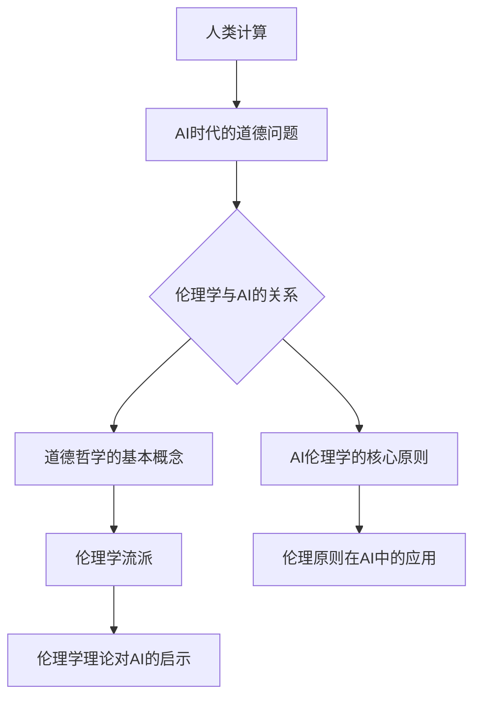
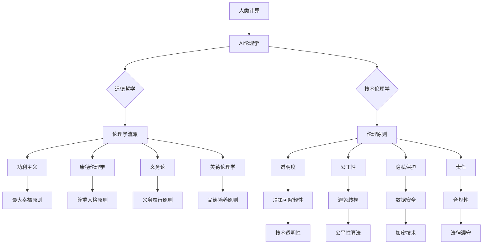
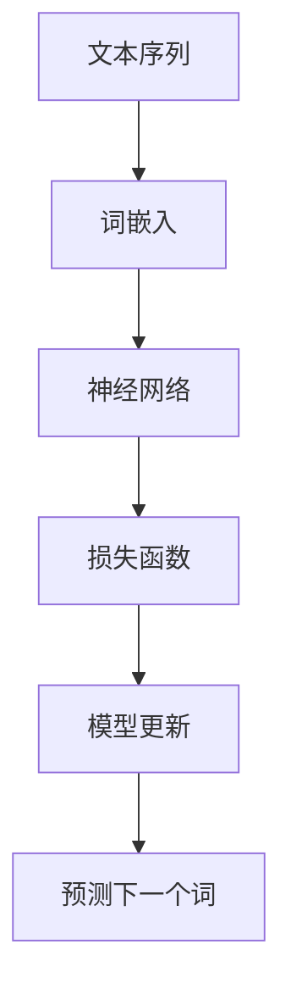

                 

### 《人类计算：AI时代的道德和社会责任》

> **关键词**：人工智能，道德哲学，社会责任，透明度，公正性，隐私保护，法律法规，国际治理

> **摘要**：本文探讨了AI时代所带来的道德和社会责任问题。通过对AI技术的背景介绍、道德哲学概述、AI伦理学原理、人工智能与社会责任、AI时代的法律责任、AI合规与风险管理、AI国际合作与治理以及未来展望等方面进行深入分析，本文旨在为AI技术的伦理和社会责任提供理论和实践指导，促进AI技术的可持续发展和社会和谐。

### 《人类计算：AI时代的道德和社会责任》目录大纲

#### 第一部分：AI时代的道德基础

##### 第1章：AI时代背景与道德挑战

**1.1 AI时代背景介绍**

- **1.1.1 AI技术的发展历程**
- **1.1.2 AI技术的应用领域**
- **1.1.3 AI对社会的影响**

**1.2 道德哲学概述**

- **1.2.1 道德哲学的基本概念**
- **1.2.2 道德哲学的主要流派**
- **1.2.3 道德哲学在AI领域的应用**

**1.3 AI伦理学的核心议题**

- **1.3.1 AI决策的透明度和公正性**
- **1.3.2 AI隐私保护和数据安全**
- **1.3.3 AI对就业市场和人类身份的影响**

##### 第2章：AI伦理学原理

**2.1 AI伦理学的基本原则**

- **2.1.1 尊重自主权**
- **2.1.2 公正和无偏见**
- **2.1.3 透明度和可解释性**
- **2.1.4 风险最小化和预防伤害**

**2.2 AI伦理学案例分析**

- **2.2.1 自驾驶汽车伦理困境**
- **2.2.2 AI在医疗领域的伦理挑战**
- **2.2.3 AI在刑事司法领域的应用与争议**

**2.3 AI伦理学的实践策略**

- **2.3.1 建立AI伦理指导框架**
- **2.3.2 AI伦理审查与监管机制**
- **2.3.3 提高公众对AI伦理的认知**

##### 第3章：人工智能与社会责任

**3.1 AI技术的社会责任**

- **3.1.1 AI研发者的社会责任**
- **3.1.2 企业在AI领域的道德责任**
- **3.1.3 政府在AI监管和治理中的责任**

**3.2 AI技术的可持续发展**

- **3.2.1 AI对环境和资源的影响**
- **3.2.2 AI在可持续发展中的应用**
- **3.2.3 促进AI技术的绿色转型**

**3.3 AI技术的社会公平**

- **3.3.1 消除AI技术的不平等**
- **3.3.2 确保AI技术的普及性**
- **3.3.3 促进AI技术与人类发展**

#### 第二部分：AI时代的法律责任

##### 第4章：AI法律法规框架

**4.1 AI法律法规概述**

- **4.1.1 AI法律法规的起源和发展**
- **4.1.2 国际AI法律法规现状**
- **4.1.3 中国AI法律法规体系**

**4.2 AI法律责任主体**

- **4.2.1 AI研发者和用户的法律责任**
- **4.2.2 企业在AI应用中的法律责任**
- **4.2.3 政府在AI监管中的法律责任**

**4.3 AI法律责任案例解析**

- **4.3.1 AI产品责任案例**
- **4.3.2 AI隐私侵犯案例**
- **4.3.3 AI歧视性算法案例**

##### 第5章：AI合规与风险管理

**5.1 AI合规体系建设**

- **5.1.1 AI合规的基本原则**
- **5.1.2 AI合规的关键环节**
- **5.1.3 AI合规的管理流程**

**5.2 AI风险管理**

- **5.2.1 AI风险识别与评估**
- **5.2.2 AI风险控制与防范**
- **5.2.3 AI风险监测与预警**

**5.3 AI伦理与法律冲突及解决**

- **5.3.1 AI伦理与法律冲突的原因**
- **5.3.2 处理AI伦理与法律冲突的策略**
- **5.3.3 案例分析与启示**

#### 第三部分：AI时代的国际合作与治理

##### 第6章：AI国际合作与治理

**6.1 AI国际合作现状**

- **6.1.1 国际AI合作的主要形式**
- **6.1.2 国际AI合作的主要议题**
- **6.1.3 中国在国际AI合作中的角色**

**6.2 国际AI治理体系**

- **6.2.1 国际AI治理的基本原则**
- **6.2.2 国际AI治理的机制与组织**
- **6.2.3 国际AI治理的挑战与展望**

**6.3 AI国际合作案例解析**

- **6.3.1 人工智能合作的国际项目**
- **6.3.2 AI合作中的成功经验与不足**
- **6.3.3 国际合作对AI技术发展的启示**

##### 第7章：AI时代的未来展望

**7.1 AI技术发展趋势**

- **7.1.1 AI技术的未来发展方向**
- **7.1.2 新兴AI技术的潜力**
- **7.1.3 AI与人类社会的深度融合**

**7.2 AI时代的道德与社会责任发展趋势**

- **7.2.1 AI伦理与法律的演进**
- **7.2.2 社会对AI的信任度与接受度**
- **7.2.3 AI伦理与社会责任的未来挑战**

**7.3 未来社会与AI和谐发展的路径**

- **7.3.1 AI教育与人才培养**
- **7.3.2 AI技术创新与社会治理的协同**
- **7.3.3 构建可持续的AI伦理与社会责任体系**

#### 附录

##### 附录A：AI伦理学核心概念与联系

**附录A.1 核心概念与联系**

- **Mermaid 流�程图**



##### 附录B：核心算法原理讲解

**2.3.1 大规模预训练模型原理**

- **核心算法原理讲解**

大规模预训练模型（Large-scale Pre-trained Models）是指通过在大量数据集上进行训练，使模型具备一定的通用知识和能力，然后通过微调（Fine-tuning）来适应特定任务。以下是大规模预训练模型的基本原理：

1. **数据预处理**：首先对数据进行清洗、格式化，将文本转换为模型可以处理的形式，如词嵌入（Word Embedding）。

2. **预训练过程**：在大量无标签数据上进行预训练，学习语言的基本结构和语义信息。常用的预训练任务包括语言建模（Language Modeling）、命名实体识别（Named Entity Recognition）、情感分析（Sentiment Analysis）等。

3. **微调过程**：将预训练好的模型在特定任务的数据集上进行微调，进一步调整模型的参数，以适应特定领域的任务需求。

4. **应用场景**：大规模预训练模型可以应用于各种自然语言处理任务，如图像描述生成（Image Captioning）、机器翻译（Machine Translation）、文本分类（Text Classification）等。

- **伪代码示例**

```python
# 数据预处理
data = preprocess_data(raw_data)

# 预训练
model = LanguageModel(pretrained_weights)
model.train(data)

# 微调
model_finetuned = model.finetune(task_data)

# 应用
predictions = model_finetuned.predict(test_data)
```

##### 附录C：数学模型与公式讲解

**2.3.2 自监督学习方法**

- **核心算法原理讲解**

自监督学习（Self-supervised Learning）是一种无需人工标注数据即可进行学习的方法。以下是自监督学习方法的基本数学模型：

1. **数据表示**：给定一组未标记的数据点\(X = \{x_1, x_2, ..., x_n\}\)，每个数据点\(x_i\)是一个输入向量。

2. **任务定义**：自监督学习任务通常是将数据\(x_i\)映射到一个固定维度的表示空间，即\(z_i = f(x_i; \theta)\)，其中\(f\)是神经网络模型，\(\theta\)是模型参数。

3. **损失函数**：自监督学习的损失函数通常基于数据的内在结构，如信息最大化（InfoMax）或预测误差（Prediction Error）。

4. **优化过程**：通过梯度下降等方法最小化损失函数，更新模型参数\(\theta\)。

- **数学公式**

$$
\begin{aligned}
z_i &= f(x_i; \theta) \\
\min_{\theta} \ L(z_i, x_i) \\
L &= -\sum_{i=1}^{n} \ log(p(y_i | z_i))
\end{aligned}
$$

- **举例说明**

以自监督学习中的语言建模为例：

- **数据表示**：给定一串文本序列，将其转换为词嵌入表示。
- **任务定义**：学习文本序列的潜在表示，使得序列中每个词都能被正确预测。
- **损失函数**：使用交叉熵损失函数衡量预测词与实际词之间的差距。
- **优化过程**：通过反向传播和梯度下降更新模型参数，使得模型能够更好地预测文本序列中的下一个词。

mermaid
graph TD
    A[文本序列] --> B[词嵌入]
    B --> C[神经网络]
    C --> D[损失函数]
    D --> E[模型更新]
    E --> F[预测下一个词]

##### 附录D：项目实战

**代码实际案例和详细解释说明**

- **开发环境搭建**

```bash
!pip install transformers
```

- **导入模块**

```python
from transformers import AutoTokenizer, AutoModel
tokenizer = AutoTokenizer.from_pretrained("bert-base-uncased")
model = AutoModel.from_pretrained("bert-base-uncased")
```

- **数据预处理**

```python
text = "Hello, my name is Assistant."
inputs = tokenizer(text, return_tensors="pt")
```

- **微调**

```python
outputs = model(**inputs)
logits = outputs.logits
```

- **预测**

```python
predictions = logits.argmax(-1)
predicted_text = tokenizer.decode(predictions[0])
```

- **输出结果**

```python
print(predicted_text)
```

### 代码解读与分析

- **环境搭建**：安装 transformers 库，用于加载预训练的 BERT 模型。
- **导入模块**：从 transformers 库中导入 tokenizer 和 model，用于进行文本预处理和模型预测。
- **数据预处理**：将输入文本转换为词嵌入表示，并将其传递给模型。
- **微调**：通过调用 model 的 forward 方法，将输入文本映射到潜在表示空间。
- **预测**：使用 logits（模型输出）进行预测，选择概率最高的输出作为预测结果。
- **输出结果**：将预测结果转换为文本形式并输出。

这个例子展示了如何使用预训练的 BERT 模型进行文本分类任务，包括数据预处理、模型调用、预测和结果输出。通过这个案例，读者可以了解如何在实际项目中应用大规模预训练模型，以及如何进行模型微调和预测。

---

在开始深入探讨AI时代的道德和社会责任之前，我们需要先了解AI技术是如何发展的，以及它对社会产生了哪些影响。这将为我们后续讨论道德和社会责任问题奠定基础。

### 第1章：AI时代背景与道德挑战

#### 1.1 AI时代背景介绍

人工智能（AI）作为一种模拟人类智能的技术，其发展历程可以追溯到20世纪50年代。自那时以来，AI经历了几个重要的发展阶段：

1. **早期探索阶段（1956-1969）**：在这一阶段，人工智能的概念被首次提出，并引起了学术界和工业界的广泛关注。1956年的达特茅斯会议被认为是人工智能诞生的标志。

2. **应用探索阶段（1970-1989）**：在这一阶段，AI技术开始应用于特定领域，如游戏、医疗诊断等。然而，由于计算能力的限制，这一阶段的AI发展较为缓慢。

3. **专家系统阶段（1990-2010）**：在这一阶段，专家系统成为AI研究的主流方向。专家系统通过模拟人类专家的推理过程，解决了许多实际应用问题。

4. **机器学习阶段（2010年至今）**：随着计算能力的提高和大数据的出现，机器学习技术在AI领域中取得了重大突破。特别是深度学习技术的兴起，使得AI在图像识别、自然语言处理等领域取得了显著成果。

AI技术的应用领域广泛，包括但不限于：

1. **自然语言处理**：自然语言处理（NLP）是AI技术的重要应用领域，旨在使计算机能够理解、生成和处理人类语言。NLP技术在机器翻译、文本分类、情感分析等方面取得了显著成果。

2. **计算机视觉**：计算机视觉技术使计算机能够理解和解释图像和视频内容。该技术在安防监控、自动驾驶、医疗诊断等领域具有广泛应用。

3. **机器人技术**：机器人技术是AI在工业、医疗、家庭等领域的应用。通过模拟人类的行为，机器人可以完成许多重复性、危险或繁琐的工作。

4. **智能助手**：智能助手（如Siri、Alexa、小爱同学等）通过语音识别和自然语言处理技术，为用户提供便捷的服务，如语音查询、日程管理、智能家居控制等。

AI技术的快速发展对社会产生了深远的影响，包括以下几个方面：

1. **经济影响**：AI技术在许多行业中发挥了重要作用，提高了生产效率和创新能力。然而，AI技术也可能导致部分职业的失业，从而对就业市场产生影响。

2. **伦理影响**：随着AI技术的应用越来越广泛，关于AI伦理的问题也越来越突出。如何确保AI系统的透明度、公正性和安全性，避免对人类造成伤害，成为亟待解决的问题。

3. **社会影响**：AI技术在改善人们生活质量的同时，也可能加剧社会不平等。例如，智能助手和智能家居设备可能加剧数字鸿沟，使得那些无法负担这些技术的用户处于不利地位。

4. **环境影响**：AI技术在环境保护和资源管理方面具有巨大的潜力。例如，通过预测气候变化和优化能源消耗，AI可以帮助实现可持续发展。然而，AI技术的发展也可能加剧环境问题，如数据中心的能耗问题。

#### 1.2 道德哲学概述

道德哲学是研究道德问题的哲学分支，其目的是探讨道德原则、道德判断和道德行为。在探讨AI时代的道德问题时，道德哲学提供了一个重要的理论框架。

1. **道德哲学的基本概念**

道德哲学的基本概念包括：

- **善与恶**：道德哲学探讨什么是善，什么是恶。善的行为被认为是有利于个体或社会的行为，而恶的行为则被认为是有害的行为。

- **权利与义务**：道德哲学探讨个体和社会的权利和义务。权利是指个体享有的合法利益，而义务是指个体应尽的责任。

- **公正与平等**：道德哲学探讨如何实现社会的公正和平等。公正意味着资源分配的合理性和机会均等，而平等则意味着消除歧视和不平等。

2. **道德哲学的主要流派**

道德哲学的主要流派包括：

- **功利主义**：功利主义认为，道德行为应该追求最大的幸福和福利。代表性人物有边沁和密尔。

- **康德伦理学**：康德伦理学强调道德义务和原则。康德认为，道德行为的评价标准是行为是否符合道德原则，如尊重他人的人格。

- **义务论**：义务论认为，道德行为应该基于道德义务，而不是结果。代表性人物有摩尔和费尔巴哈。

- **美德伦理学**：美德伦理学强调个体品德的重要性。美德伦理学认为，个体应该培养良好的品德，如诚实、勇气和善良。

3. **道德哲学在AI领域的应用**

道德哲学在AI领域的应用主要体现在以下几个方面：

- **AI伦理学**：AI伦理学是道德哲学在AI技术中的应用，旨在探讨AI技术带来的道德问题。AI伦理学涉及AI系统的设计、开发和应用过程中的道德原则和规范。

- **AI决策的透明度和公正性**：道德哲学提供了一种评估AI决策透明度和公正性的框架。例如，功利主义和康德伦理学都提供了评估AI决策是否公正的依据。

- **AI隐私保护和数据安全**：道德哲学强调保护个体隐私和数据安全的重要性。道德原则如尊重个人权利和公正原则可以指导AI系统的设计，以确保隐私和数据安全。

#### 1.3 AI伦理学的核心议题

AI伦理学是道德哲学在AI领域的应用，旨在探讨AI技术带来的道德问题。AI伦理学的核心议题包括：

1. **AI决策的透明度和公正性**

AI决策的透明度和公正性是AI伦理学的重要议题。透明度意味着AI系统的决策过程应该是可解释的，用户可以理解AI是如何做出决策的。公正性则意味着AI系统应该公平地对待所有用户，不歧视任何人。

透明度和公正性之间的平衡是一个挑战。一方面，提高透明度可以增强用户对AI系统的信任；另一方面，过高的透明度可能导致AI系统的性能下降。因此，需要找到一种平衡，使AI系统既具有透明度，又能够保持高性能。

2. **AI隐私保护和数据安全**

AI系统通常需要大量数据来训练和优化模型。这些数据可能包含个人隐私信息，如姓名、地址、电话号码等。如何保护这些数据，防止隐私泄露，是AI伦理学的一个重要议题。

数据安全不仅涉及技术层面的保护措施，如加密和访问控制，还涉及法律和伦理层面的规范。例如，欧盟的《通用数据保护条例》（GDPR）就明确了个人数据的保护标准和隐私权。

3. **AI对就业市场和人类身份的影响**

AI技术在许多行业中取代了传统的人力劳动，这引发了关于就业市场和人类身份的担忧。一方面，AI技术可以提高生产效率，创造新的就业机会；另一方面，它也可能导致部分职业的失业，加剧社会不平等。

AI对人类身份的影响不仅体现在就业市场，还体现在人类自我认知和价值观方面。随着AI技术的进步，人们开始思考人类与机器之间的界限，以及人类在数字化时代的角色和责任。

4. **AI技术在医疗和司法领域的应用**

AI技术在医疗和司法领域的应用带来了许多道德和伦理问题。例如，在医疗领域，AI技术可以帮助医生诊断疾病，提高治疗效果。然而，如何确保AI系统的公正性和透明度，避免医疗误诊和歧视，是一个重要问题。

在司法领域，AI技术可以用于犯罪预测、侦查和审判。然而，AI系统可能存在偏见和不公平，导致错误判决。因此，如何确保AI技术在司法领域的公正性和透明度，也是一个重要议题。

#### 1.4 总结

本章介绍了AI时代的背景和道德挑战。首先，我们回顾了AI技术的发展历程，介绍了AI技术的应用领域和对社会的影响。然后，我们探讨了道德哲学的基本概念和主要流派，以及道德哲学在AI领域的应用。最后，我们讨论了AI伦理学的核心议题，包括AI决策的透明度和公正性、AI隐私保护和数据安全、AI对就业市场和人类身份的影响以及AI技术在医疗和司法领域的应用。这些议题为后续章节的讨论奠定了基础。

---

在了解了AI时代的背景和道德挑战之后，我们需要进一步探讨AI伦理学的基本原理。这将帮助我们更好地理解AI技术所带来的道德问题，并为解决这些问题提供理论指导。

### 第2章：AI伦理学原理

#### 2.1 AI伦理学的基本原则

AI伦理学的基本原则是指导AI技术设计和应用的基本道德规范。这些原则旨在确保AI系统的透明度、公正性、责任性和可持续性。以下是AI伦理学的基本原则：

1. **尊重自主权**

尊重自主权是AI伦理学的基本原则之一。自主权是指个体根据自己的意愿和价值观做出决策的能力。在AI系统中，尊重自主权意味着确保用户能够自由地选择和拒绝AI服务，并且能够了解AI系统的决策过程。

为了实现尊重自主权，AI系统应该提供透明度，使用户能够理解AI系统的决策依据。此外，AI系统应该允许用户撤销或修改他们的选择，以保护用户的自主权。

2. **公正和无偏见**

公正和无偏见是确保AI系统公平对待所有用户的重要原则。在AI系统中，偏见可能源于数据集的不公平、算法的设计缺陷或者人为干预。为了实现公正和无偏见，AI系统应该避免使用包含偏见的数据集，并且确保算法设计符合道德标准。

此外，AI系统应该接受持续的监督和评估，以确保其决策过程中不存在偏见。例如，可以使用统计学方法来检测和纠正算法偏见，或者建立伦理审查委员会来监督AI系统的应用。

3. **透明度和可解释性**

透明度和可解释性是用户信任AI系统的重要因素。透明度意味着AI系统的决策过程应该是公开和可访问的，用户能够了解AI系统是如何做出决策的。可解释性则强调AI系统应该能够解释其决策依据，使非技术背景的用户也能够理解。

为了提高透明度和可解释性，AI系统应该提供清晰的文档和用户界面，使用户能够轻松地了解系统的功能和工作原理。此外，可以采用可视化工具来展示AI系统的决策过程，如决策树、神经网络结构等。

4. **风险最小化和预防伤害**

风险最小化和预防伤害是确保AI系统安全和可控的重要原则。在AI系统的设计和应用过程中，应该考虑到可能出现的风险，并采取预防措施来降低这些风险。

例如，AI系统应该具备故障检测和恢复机制，以防止系统出现意外行为。此外，AI系统应该接受严格的测试和验证，以确保其在各种情况下都能安全运行。

5. **责任和可持续性**

责任和可持续性是AI伦理学的重要原则。责任意味着AI系统的开发者、运营商和用户都应该对其行为负责。可持续性则强调AI技术的发展应该符合社会的长期利益。

为了实现责任和可持续性，AI系统应该建立透明的责任体系，明确各方的责任和义务。此外，AI技术的发展应该遵循可持续发展原则，如保护环境、促进社会公平等。

#### 2.2 AI伦理学案例分析

为了更好地理解AI伦理学的基本原则，我们可以通过一些实际案例来探讨这些原则的应用。

##### 案例一：自驾驶汽车伦理困境

自驾驶汽车是AI技术的一个重要应用领域，然而，它也引发了许多伦理问题。一个典型的伦理困境是：在发生紧急情况时，自驾驶汽车应该优先保护驾驶员还是行人？

- **尊重自主权**：在自驾驶汽车中，尊重自主权的原则体现在用户有权决定是否使用自驾驶模式。此外，用户应该能够了解自驾驶汽车的决策过程，以便做出明智的选择。

- **公正和无偏见**：自驾驶汽车的设计和算法应该避免偏见，确保它们在所有情况下都能公平地做出决策。例如，自驾驶汽车不应该在特定群体（如老年人或残疾人）中表现出偏见。

- **透明度和可解释性**：自驾驶汽车应该提供透明的决策过程，使驾驶员能够理解汽车在特定情况下如何做出决策。这可以通过提供实时监控和决策解释界面来实现。

- **风险最小化和预防伤害**：自驾驶汽车应该具备完善的故障检测和预防机制，以降低事故风险。此外，自驾驶汽车应该接受严格的测试和验证，以确保其在各种情况下都能安全运行。

- **责任和可持续性**：自驾驶汽车的开发者和运营商应该对其行为负责，确保汽车的设计和算法符合伦理标准。此外，自驾驶汽车的发展应该符合社会的长期利益，如提高交通安全、减少交通拥堵等。

##### 案例二：AI在医疗领域的伦理挑战

AI技术在医疗领域的应用越来越广泛，然而，它也带来了一些伦理挑战。一个典型的伦理挑战是：如何确保AI系统在诊断和治疗过程中保持公正和无偏见？

- **尊重自主权**：在医疗领域，尊重自主权的原则体现在患者有权决定是否接受AI辅助诊断和治疗。此外，患者应该能够了解AI系统的决策过程，以便做出明智的选择。

- **公正和无偏见**：AI系统在医疗领域的应用应该避免偏见，确保它们在所有情况下都能公平地做出决策。例如，AI系统不应该在特定群体（如性别、年龄、种族等）中表现出偏见。

- **透明度和可解释性**：AI系统在医疗领域的应用应该提供透明的决策过程，使患者和医生能够理解AI系统是如何做出诊断和治疗的。这可以通过提供决策解释和可视化工具来实现。

- **风险最小化和预防伤害**：AI系统在医疗领域的应用应该接受严格的测试和验证，以确保其在各种情况下都能安全运行。此外，AI系统应该具备故障检测和预防机制，以降低误诊和错误治疗的风险。

- **责任和可持续性**：AI系统在医疗领域的开发者、运营商和用户应该对其行为负责，确保AI系统的设计和应用符合伦理标准。此外，AI技术的发展应该符合社会的长期利益，如提高医疗质量、降低医疗成本等。

##### 案例三：AI在刑事司法领域的应用与争议

AI技术在刑事司法领域的应用日益广泛，例如，用于犯罪预测、侦查和审判。然而，这也引发了一些伦理争议。

- **尊重自主权**：在刑事司法领域，尊重自主权的原则体现在法官和检察官有权决定是否使用AI技术进行犯罪预测和侦查。此外，被告人和原告应该能够了解AI系统的决策过程，以便为自己辩护。

- **公正和无偏见**：AI系统在刑事司法领域的应用应该避免偏见，确保它们在所有情况下都能公平地做出决策。例如，AI系统不应该在特定群体（如性别、年龄、种族等）中表现出偏见。

- **透明度和可解释性**：AI系统在刑事司法领域的应用应该提供透明的决策过程，使法官、检察官和被告人都能够理解AI系统是如何做出预测和决策的。这可以通过提供决策解释和可视化工具来实现。

- **风险最小化和预防伤害**：AI系统在刑事司法领域的应用应该接受严格的测试和验证，以确保其在各种情况下都能安全运行。此外，AI系统应该具备故障检测和预防机制，以降低误判和错误判决的风险。

- **责任和可持续性**：AI系统在刑事司法领域的开发者、运营商和用户应该对其行为负责，确保AI系统的设计和应用符合伦理标准。此外，AI技术的发展应该符合社会的长期利益，如提高司法公正、降低犯罪率等。

#### 2.3 AI伦理学的实践策略

为了应对AI伦理学的挑战，需要采取一系列实践策略。以下是一些关键策略：

1. **建立AI伦理指导框架**

建立AI伦理指导框架是确保AI系统符合道德标准的重要步骤。这个框架应该包括：

- **伦理原则**：明确AI伦理学的基本原则，如尊重自主权、公正和无偏见、透明度和可解释性等。

- **伦理审查机制**：建立伦理审查委员会，负责审查AI系统的设计、开发和应用过程，确保其符合伦理标准。

- **伦理指南**：制定具体的伦理指南，为AI系统的开发者、运营商和用户提供指导，确保他们了解并遵守伦理原则。

2. **AI伦理审查与监管机制**

AI伦理审查与监管机制是确保AI系统符合道德标准和法律法规的重要手段。这个机制应该包括：

- **法律法规**：制定相关的法律法规，明确AI系统的责任和义务，确保其在法律框架内运行。

- **监管机构**：建立专门的监管机构，负责监督AI系统的应用，确保其符合伦理标准和法律法规。

- **公众参与**：鼓励公众参与AI伦理审查和监管过程，通过公开讨论和听证会等方式，收集公众意见和建议，提高AI系统的透明度和公正性。

3. **提高公众对AI伦理的认知**

提高公众对AI伦理的认知是确保社会对AI技术持积极态度的重要手段。以下是一些策略：

- **教育和培训**：开展AI伦理教育和培训，提高公众对AI伦理问题的认识和理解。

- **宣传和推广**：通过媒体和社交平台等渠道，宣传AI伦理的重要性和必要性，提高公众的关注度。

- **公众参与**：鼓励公众参与AI伦理讨论，通过调查、研讨会和论坛等方式，收集公众意见和建议，促进社会的共同参与。

#### 2.4 总结

本章介绍了AI伦理学的基本原则和案例分析。首先，我们讨论了AI伦理学的基本原则，包括尊重自主权、公正和无偏见、透明度和可解释性、风险最小化和预防伤害以及责任和可持续性。然后，我们通过自驾驶汽车、医疗和刑事司法领域的案例，探讨了这些原则的应用。最后，我们提出了一系列实践策略，包括建立AI伦理指导框架、AI伦理审查与监管机制以及提高公众对AI伦理的认知。这些原则和策略为AI技术的道德和社会责任提供了理论指导和实践参考。

---

在了解了AI伦理学的基本原则和实践策略之后，我们需要进一步探讨人工智能在社会中的社会责任。这包括AI技术对社会的影响、如何确保AI技术的公平性和普及性，以及如何促进AI技术与人类发展的融合。

### 第3章：人工智能与社会责任

#### 3.1 AI技术的社会责任

人工智能（AI）技术作为一种新兴的技术，其应用已经深入到社会的各个方面。然而，随着AI技术的快速发展，其对社会的影响也越来越显著。因此，AI技术的社会责任成为一个不可忽视的重要议题。

1. **AI研发者的社会责任**

AI研发者是AI技术的主要推动者，他们肩负着重要的社会责任。以下是AI研发者应承担的社会责任：

- **透明度和公正性**：AI研发者应确保AI系统的设计和应用符合道德和伦理标准，避免出现歧视和偏见。例如，在招聘、就业等领域，AI系统应公平对待所有候选人。

- **数据安全和隐私保护**：AI研发者应采取有效的措施保护用户数据的安全和隐私。这包括使用加密技术、访问控制等手段，防止数据泄露和滥用。

- **持续改进和监督**：AI研发者应持续改进AI系统的性能和安全性，确保其在各种情况下都能安全运行。此外，应建立监督机制，及时发现和纠正AI系统的问题。

- **伦理审查和责任承担**：AI研发者应积极参与AI伦理审查，确保其研究成果符合伦理标准。如果AI系统出现问题，研发者应承担相应的责任。

2. **企业在AI领域的道德责任**

企业在AI技术的开发和应用过程中也承担着重要的道德责任。以下是企业应承担的道德责任：

- **公平竞争和合作**：企业应公平竞争，避免垄断行为。同时，企业应与其他企业、研究机构和政府合作，共同推动AI技术的发展。

- **社会责任和可持续发展**：企业应关注社会责任，确保其AI技术在推动技术进步的同时，不会对环境和社会造成负面影响。例如，企业应采取绿色技术，减少碳排放。

- **透明度和可解释性**：企业应确保其AI系统的透明度和可解释性，使公众能够了解AI系统的工作原理和决策过程。

- **用户教育和培训**：企业应开展用户教育和培训，提高用户对AI技术的认识和理解，帮助用户更好地利用AI技术，避免滥用和误用。

3. **政府在AI监管和治理中的责任**

政府在AI技术的发展和应用过程中扮演着重要角色。以下是政府应承担的责任：

- **法律法规制定和执行**：政府应制定和执行相关的法律法规，明确AI技术的责任和义务，规范AI技术的开发和应用。例如，可以出台数据保护法、AI伦理准则等。

- **监管和监督**：政府应建立监管机构，负责监督AI技术的开发和应用，确保其符合道德和法律标准。政府还可以建立独立的审查委员会，对AI系统的设计和应用进行伦理审查。

- **公共参与和政策沟通**：政府应鼓励公众参与AI政策的制定和讨论，提高公众对AI技术的认知和理解。此外，政府应与各方保持沟通，确保政策的有效实施。

- **国际合作与交流**：政府应积极参与国际AI合作和交流，推动全球AI治理体系建设，共同应对AI技术带来的挑战。

#### 3.2 AI技术的可持续发展

AI技术的可持续发展是指确保AI技术在推动社会进步的同时，不会对环境和社会造成负面影响。以下是实现AI技术可持续发展的一些策略：

1. **环境保护**

AI技术在环境保护方面具有巨大潜力。例如，AI技术可以用于能源管理、污染监测和生态保护等领域。然而，AI技术的发展也可能加剧环境问题，如数据中心的能耗问题。因此，在开发和应用AI技术时，应充分考虑其对环境的影响，采取绿色技术，减少碳排放。

2. **资源优化**

AI技术可以用于资源优化和管理，提高资源利用效率。例如，AI技术可以用于智能交通管理，减少交通拥堵，提高交通效率。此外，AI技术还可以用于水资源管理、农业和工业生产等领域，提高资源利用效率，减少资源浪费。

3. **社会责任**

AI技术的可持续发展不仅涉及技术层面，还涉及社会责任层面。企业和社会应关注AI技术对社会公平的影响，确保AI技术在推动技术进步的同时，不会加剧社会不平等。例如，应关注AI技术在就业、教育和医疗等领域的应用，确保所有人都能受益于AI技术。

4. **政策支持**

政府应制定和实施相关政策，支持AI技术的可持续发展。例如，可以出台税收优惠、补贴和奖励政策，鼓励企业研发和应用绿色AI技术。此外，政府还可以提供培训和人才支持，提高公众对AI技术的认知和技能。

#### 3.3 AI技术的社会公平

AI技术的社会公平是指确保AI技术在推动社会进步的同时，不会加剧社会不平等。以下是实现AI技术社会公平的一些策略：

1. **消除AI技术的不平等**

AI技术的不平等主要体现在以下几个方面：

- **技术壁垒**：AI技术的发展和应用往往需要高水平的技术支持和资金投入，这导致部分中小企业和低收入群体难以参与AI技术的研究和应用。

- **数据壁垒**：AI技术需要大量的数据来训练和优化模型，然而，数据资源往往集中在大型企业和机构手中，导致中小企业和个人难以获取所需数据。

- **信息壁垒**：AI技术的应用通常伴随着大量的信息和技术知识，这使得那些缺乏相关知识和技能的群体难以理解和利用AI技术。

为了消除这些不平等，需要采取以下措施：

- **降低技术壁垒**：政府和企业应提供技术支持和培训，帮助中小企业和个人掌握AI技术的基本知识和技能。

- **开放数据资源**：政府和企业应开放数据资源，允许中小企业和个人获取和使用这些数据，以便更好地利用AI技术。

- **普及信息技术**：政府和企业应推动信息技术教育，提高公众的信息技术素养，使更多的人能够理解和利用AI技术。

2. **确保AI技术的普及性**

确保AI技术的普及性是实现社会公平的重要举措。以下是一些策略：

- **降低成本**：通过降低AI技术的研发和应用成本，使更多人能够负担得起AI技术，从而提高AI技术的普及性。

- **推广应用**：政府和企业应推动AI技术的广泛应用，特别是在教育、医疗、交通等领域，使更多的人受益于AI技术。

- **公平分配**：政府和企业应确保AI技术的收益公平分配，避免因AI技术带来的利益不均而加剧社会不平等。

3. **促进AI技术与人类发展**

AI技术与人类发展的融合是未来社会的重要趋势。以下是一些策略：

- **教育培训**：政府和企业应加大对AI技术教育培训的投入，培养更多的AI技术人才，为人类发展提供智力支持。

- **技术创新**：政府和企业应支持AI技术的创新和发展，推动AI技术在不同领域的应用，提高人类的生活质量。

- **社会参与**：政府和企业应鼓励公众参与AI技术的研究和应用，提高公众对AI技术的认知和参与度，促进AI技术与人类发展的融合。

#### 3.4 总结

本章讨论了人工智能在社会中的社会责任。首先，我们探讨了AI研发者、企业在AI领域的道德责任以及政府在AI监管和治理中的责任。然后，我们提出了AI技术可持续发展的策略，包括环境保护、资源优化和社会责任。接着，我们提出了AI技术社会公平的策略，包括消除AI技术的不平等、确保AI技术的普及性以及促进AI技术与人类发展。通过这些讨论，我们旨在为AI技术的道德和社会责任提供理论和实践指导，促进AI技术的可持续发展和社会和谐。

---

在了解了AI技术的社会责任之后，我们需要进一步探讨AI时代的法律责任。这包括AI法律法规的框架、AI法律责任主体以及AI法律责任案例的解析。通过这些讨论，我们可以为AI技术的合法应用提供法律依据和指导。

### 第4章：AI法律法规框架

#### 4.1 AI法律法规概述

人工智能（AI）技术的发展和应用在带来巨大机遇的同时，也带来了诸多法律和伦理挑战。为了确保AI技术的合法、公正和透明应用，制定和实施相关的法律法规至关重要。以下是AI法律法规的概述。

1. **AI法律法规的起源和发展**

AI法律法规的起源可以追溯到20世纪80年代，当时计算机技术的发展逐渐引起了各国政府和法律界的关注。随着AI技术的不断进步和应用领域的扩大，各国纷纷出台相关法律法规，以规范AI技术的发展和应用。

- **早期立法**：早期立法主要集中在数据保护、隐私权和知识产权等方面。例如，美国在1986年通过了《计算机欺诈和滥用法》，旨在打击计算机犯罪。

- **近年立法**：近年来，随着AI技术的快速发展，各国更加重视AI法律法规的制定和完善。例如，欧盟在2018年通过了《通用数据保护条例》（GDPR），对个人数据的收集、处理和使用进行了严格的规定。

2. **国际AI法律法规现状**

在国际层面，许多国家和地区已经制定了相关的AI法律法规。以下是一些主要国家和地区的AI法律法规现状：

- **欧盟**：欧盟在2018年通过了《通用数据保护条例》（GDPR），对个人数据的保护提出了严格的要求。此外，欧盟还在2021年发布了《人工智能法案》，旨在规范AI技术的发展和应用。

- **美国**：美国没有统一的AI法律法规，但许多州和联邦机构已经制定了相关的法律法规。例如，美国联邦贸易委员会（FTC）和消费者金融保护局（CFPB）对AI技术在金融领域的应用进行了监管。

- **中国**：中国已经出台了一系列AI法律法规，包括《人工智能发展行动计划（2018-2020年）》和《新一代人工智能伦理规范》。此外，中国还在制定《人工智能安全法》等法律法规，以规范AI技术的发展和应用。

3. **中国AI法律法规体系**

中国的AI法律法规体系主要由以下几个方面构成：

- **国家战略规划**：国家制定了《新一代人工智能发展规划（2019-2030年）》，明确了AI技术的发展目标和政策方向。

- **伦理规范**：国家发布了《新一代人工智能伦理规范》，对AI技术的伦理要求进行了明确规定。

- **法律法规**：中国已经出台了一系列AI相关法律法规，如《网络安全法》、《数据安全法》和《个人信息保护法》。此外，中国还在制定《人工智能安全法》等法律法规，以规范AI技术的发展和应用。

#### 4.2 AI法律责任主体

在AI法律法规体系中，明确AI法律责任主体是确保AI技术合法应用的重要环节。以下是AI法律责任主体的概述。

1. **AI研发者和用户的法律责任**

AI研发者和用户是AI技术的主要参与者，他们在AI技术合法应用过程中承担不同的法律责任。

- **AI研发者**：AI研发者主要包括研究人员、开发者、制造商和运营商等。他们应承担以下法律责任：

  - **研发责任**：确保AI技术的研发过程符合法律法规和伦理要求，不侵犯他人的知识产权和隐私权。

  - **产品质量责任**：确保AI产品的质量和安全性，对因产品质量问题导致的损失承担赔偿责任。

  - **侵权责任**：对于因AI技术侵权行为（如侵犯知识产权、隐私权等）而导致的损失，研发者应承担侵权责任。

- **AI用户**：AI用户主要包括个人、企业和其他组织。他们应承担以下法律责任：

  - **合法使用责任**：确保AI技术的使用符合法律法规和伦理要求，不滥用或误用AI技术。

  - **个人信息保护责任**：对于收集、处理和使用个人信息的AI应用，用户应确保个人信息的安全和保护。

  - **合规责任**：确保AI技术的应用符合相关法律法规和标准，如信息安全、数据保护等。

2. **企业在AI应用中的法律责任**

企业在AI技术中的应用过程中承担重要的法律责任，主要包括：

- **合规经营责任**：企业应确保其AI技术的研发、生产和应用过程符合法律法规和行业规范，不违反相关法律法规。

- **产品质量责任**：企业应对其AI产品的质量和安全性负责，对因产品质量问题导致的损失承担赔偿责任。

- **数据安全责任**：企业应采取有效的数据安全措施，防止数据泄露、篡改和滥用，确保用户个人信息的安全。

- **社会责任**：企业应关注社会责任，确保其AI技术的应用不会对社会和环境造成负面影响。

3. **政府在AI监管和治理中的法律责任**

政府在AI技术的发展和应用过程中承担着重要的监管和治理责任，主要包括：

- **立法和执法责任**：政府应制定和执行相关的法律法规，对AI技术的研发、应用和监管进行规范，确保其合法、公正和透明。

- **监管和监督责任**：政府应建立监管机构，对AI技术的研发、应用和监管进行监督，确保其符合法律法规和伦理要求。

- **公共参与责任**：政府应鼓励公众参与AI技术的发展和应用，提高公众对AI技术的认知和理解，促进社会的共同参与。

#### 4.3 AI法律责任案例解析

为了更好地理解AI法律责任，以下通过几个具体的案例对AI法律责任进行解析。

1. **AI产品责任案例**

AI产品责任案例是指因AI产品质量问题导致的法律责任。以下是一个典型的案例：

- **案例背景**：某公司开发了一款自动驾驶汽车，但在实际使用过程中，由于系统故障导致汽车失控，撞向行人，造成人员伤亡。

- **法律责任**：

  - **生产商责任**：该公司作为AI产品的生产商，应对产品质量问题承担赔偿责任，对因产品故障导致的损失进行赔偿。

  - **开发者责任**：AI系统的开发者应承担研发责任，确保系统的质量和安全性，对因研发缺陷导致的损失承担侵权责任。

2. **AI隐私侵犯案例**

AI隐私侵犯案例是指因AI技术侵犯用户隐私权而产生的法律责任。以下是一个典型的案例：

- **案例背景**：某公司开发了一款智能助手，通过用户语音交互收集用户隐私信息，并将这些信息用于商业目的。

- **法律责任**：

  - **隐私权侵犯责任**：该公司作为AI产品的开发者，应承担隐私权侵犯责任，对因隐私侵犯行为导致的损失承担侵权责任。

  - **用户数据保护责任**：该公司应承担用户数据保护责任，采取有效的数据安全措施，防止用户隐私信息泄露和滥用。

3. **AI歧视性算法案例**

AI歧视性算法案例是指因AI算法存在歧视性而导致的法律责任。以下是一个典型的案例：

- **案例背景**：某公司在招聘过程中使用AI算法筛选简历，但由于算法存在性别和种族偏见，导致部分性别和种族的候选人被排除。

- **法律责任**：

  - **歧视性算法责任**：该公司作为AI算法的开发者，应承担歧视性算法责任，对因歧视性算法导致的损失承担侵权责任。

  - **合规责任**：该公司应确保其AI算法的公平性和公正性，符合相关法律法规和伦理要求，对因算法歧视行为导致的损失承担合规责任。

#### 4.4 总结

本章对AI法律法规框架进行了概述，包括AI法律法规的起源和发展、国际AI法律法规现状以及中国AI法律法规体系。接着，我们探讨了AI法律责任主体，包括AI研发者和用户的法律责任、企业在AI应用中的法律责任以及政府在AI监管和治理中的法律责任。最后，通过几个具体的案例解析了AI法律责任。通过本章的讨论，我们旨在为AI技术的合法应用提供法律依据和指导，确保AI技术的健康发展和社会和谐。

---

在了解了AI法律法规框架和法律责任之后，我们需要进一步探讨AI合规与风险管理。这包括AI合规体系的建设、AI风险管理以及如何处理AI伦理与法律冲突。通过这些讨论，我们可以为AI技术的合法合规应用提供实践指南。

### 第5章：AI合规与风险管理

#### 5.1 AI合规体系建设

AI合规体系建设是确保AI技术合法合规应用的关键。以下是AI合规体系建设的基本原则、关键环节和管理流程。

1. **AI合规体系建设的基本原则**

- **法律法规遵循**：AI合规体系应确保AI技术的研发、应用和运营过程符合相关法律法规和行业标准。

- **伦理道德要求**：AI合规体系应遵循伦理道德原则，确保AI技术的设计和应用不侵犯个人隐私、不歧视任何群体。

- **风险控制**：AI合规体系应建立有效的风险控制机制，及时发现和应对潜在风险，确保AI技术的安全性和可靠性。

- **透明度和可解释性**：AI合规体系应提高AI系统的透明度和可解释性，使相关方能够理解和监督AI系统的决策过程。

2. **AI合规体系的关键环节**

- **法律合规审查**：对AI技术的研发、应用和运营过程进行法律合规审查，确保其符合相关法律法规和行业标准。

- **伦理审查**：建立伦理审查委员会，对AI技术的设计和应用过程进行伦理审查，确保其不侵犯个人隐私、不歧视任何群体。

- **数据安全与隐私保护**：建立数据安全与隐私保护机制，确保AI技术在收集、处理和使用过程中符合数据保护法规，保护用户隐私。

- **质量控制和测试**：建立质量控制和测试机制，确保AI系统的质量和性能满足要求，及时发现和修复潜在问题。

3. **AI合规体系的管理流程**

- **合规规划**：制定AI合规规划，明确合规目标和责任分工，确保合规工作有序开展。

- **合规培训**：对相关人员进行合规培训，提高其对AI合规重要性的认识，确保其能够正确执行合规工作。

- **合规监控**：建立合规监控机制，对AI技术的研发、应用和运营过程进行持续监控，及时发现和纠正违规行为。

- **合规报告**：定期编制合规报告，向管理层和利益相关方报告合规工作进展和成果，确保合规工作透明和可监督。

#### 5.2 AI风险管理

AI风险管理是确保AI技术安全可靠应用的关键。以下是AI风险管理的识别与评估、风险控制与防范以及风险监测与预警。

1. **AI风险识别与评估**

- **风险识别**：通过对AI技术的应用场景、数据来源、算法设计等方面进行分析，识别潜在的风险点。

- **风险评估**：对识别出的风险点进行定量或定性评估，确定其风险程度和可能带来的影响。

2. **AI风险控制与防范**

- **风险控制措施**：针对评估出的高风险点，制定相应的风险控制措施，如数据加密、访问控制、安全审计等。

- **防范措施**：采取防范措施，降低风险发生的可能性，如定期更新算法、优化数据预处理、使用安全的编程语言和框架等。

3. **AI风险监测与预警**

- **风险监测**：建立风险监测机制，对AI系统的运行状态、数据质量、安全指标等进行实时监测，及时发现异常情况。

- **预警机制**：建立预警机制，对监测到的高风险情况发出预警信号，采取相应的应急措施，防止风险扩大。

#### 5.3 AI伦理与法律冲突及解决

AI伦理与法律冲突是AI合规工作中常见的问题。以下是如何处理AI伦理与法律冲突的策略、案例分析以及相关启示。

1. **如何处理AI伦理与法律冲突**

- **优先考虑伦理原则**：在AI伦理与法律冲突时，应优先考虑伦理原则，确保AI技术的设计和应用不侵犯个人隐私、不歧视任何群体。

- **法律解释与适用**：在处理AI伦理与法律冲突时，应仔细研究相关法律法规的条款和解释，确保AI技术的合法合规应用。

- **利益平衡**：在处理AI伦理与法律冲突时，应考虑各方利益，寻找平衡点，确保AI技术既能满足法律要求，又符合伦理原则。

2. **AI伦理与法律冲突案例分析**

- **案例一：人脸识别隐私侵犯**：某公司在公共场所使用人脸识别技术进行安全监控，但由于技术缺陷和不当使用，导致用户隐私被侵犯。该案例涉及隐私保护和法律合规问题。

- **案例二：自动驾驶汽车事故**：某自动驾驶汽车发生交通事故，导致人员伤亡。该案例涉及产品责任、交通安全和伦理道德问题。

3. **相关启示**

- **完善法律法规**：应进一步完善AI相关法律法规，明确AI技术的伦理和法律要求，为处理AI伦理与法律冲突提供法律依据。

- **加强伦理审查**：应加强AI技术的伦理审查，确保其设计和应用符合伦理原则，减少伦理与法律冲突。

- **提高透明度和可解释性**：应提高AI系统的透明度和可解释性，使公众能够了解AI系统的决策过程，增加公众对AI技术的信任。

#### 5.4 总结

本章探讨了AI合规与风险管理。首先，我们介绍了AI合规体系建设的基本原则、关键环节和管理流程。接着，我们讨论了AI风险管理的识别与评估、风险控制与防范以及风险监测与预警。最后，我们分析了AI伦理与法律冲突的处理策略、案例分析以及相关启示。通过本章的讨论，我们旨在为AI技术的合法合规应用提供实践指南，促进AI技术的健康发展和社会和谐。

---

在了解了AI合规与风险管理之后，我们需要进一步探讨AI国际合作与治理。这包括AI国际合作现状、国际AI治理体系以及AI国际合作案例解析。通过这些讨论，我们可以为AI技术的全球治理提供理论指导和实践参考。

### 第6章：AI国际合作与治理

#### 6.1 AI国际合作现状

随着人工智能（AI）技术的快速发展，各国和国际组织纷纷加强在AI领域的合作，以应对AI技术带来的机遇和挑战。以下是AI国际合作现状的概述。

1. **国际AI合作的主要形式**

- **政府间合作**：政府间合作是AI国际合作的重要形式。例如，欧盟、美国、中国等国家和地区通过双边或多边协议，开展AI技术研究、应用和标准制定。

- **国际组织合作**：国际组织如联合国、世界贸易组织（WTO）、国际电信联盟（ITU）等，在AI领域开展合作，制定国际标准和规则，推动全球AI治理。

- **产学研合作**：学术界、产业界和研究机构的合作也是AI国际合作的重要形式。通过产学研合作，各国和国际组织共同推动AI技术的研发、应用和产业化。

2. **国际AI合作的主要议题**

- **AI伦理与法律**：国际AI合作的一个主要议题是AI伦理与法律问题。各国和国际组织通过对话和合作，探讨AI技术的伦理和法律挑战，制定相关规范和标准。

- **AI治理**：国际AI合作的另一个重要议题是AI治理。各国和国际组织共同探讨如何制定有效的AI治理框架，确保AI技术的公平、透明和安全。

- **AI教育与研究**：国际AI合作还涉及AI教育与研究。各国和国际组织通过合作，共同培养AI人才，推动AI技术的创新和发展。

- **AI应用与发展**：国际AI合作还关注AI技术的应用与发展，特别是在医疗、交通、环境等领域的应用，以及如何通过AI技术实现可持续发展。

3. **中国在国际AI合作中的角色**

中国在国际AI合作中发挥着重要作用。以下是中国在国际AI合作中的角色和贡献：

- **积极参与**：中国积极参与国际AI合作，与各国和国际组织保持密切沟通和合作，共同探讨AI技术的伦理和法律问题。

- **推动AI治理**：中国积极推动全球AI治理，提出了一系列倡议和方案，如《新一代人工智能发展规划（2019-2030年）》，为全球AI治理提供中国智慧。

- **加强合作与交流**：中国通过举办国际会议、研讨会和工作坊，加强与各国和国际组织的合作与交流，推动AI技术的共同发展和应用。

- **推动AI教育与研究**：中国在国际AI合作中，积极推动AI教育与研究，共同培养AI人才，为全球AI技术发展提供智力支持。

#### 6.2 国际AI治理体系

国际AI治理体系是确保AI技术全球治理的有效机制。以下是国际AI治理体系的基本原则、机制与组织以及面临的挑战与展望。

1. **国际AI治理体系的基本原则**

- **公平与公正**：国际AI治理体系应确保各国在全球AI治理中的公平和公正地位，避免大国垄断和权力失衡。

- **透明与合作**：国际AI治理体系应保持透明度，鼓励各国和国际组织之间的合作与沟通，共同应对AI技术挑战。

- **可持续与发展**：国际AI治理体系应关注AI技术的可持续发展，推动全球AI技术的公平应用和可持续发展。

- **法律与伦理**：国际AI治理体系应遵循法律和伦理原则，确保AI技术的研发、应用和治理过程符合国际法律法规和伦理要求。

2. **国际AI治理的机制与组织**

- **联合国系统**：联合国系统在国际AI治理中发挥着重要作用。例如，联合国教科文组织（UNESCO）负责制定AI教育标准，联合国国际贸易法委员会（UNCITRAL）负责制定AI相关的法律规范。

- **国际组织**：国际组织如国际电信联盟（ITU）、世界贸易组织（WTO）等，在AI治理方面发挥着协调和合作作用，制定国际标准和规则。

- **区域性组织**：区域性组织如欧洲联盟（EU）、亚太经合组织（APEC）等，也在AI治理方面发挥着重要作用，推动区域内的合作与协调。

3. **国际AI治理面临的挑战与展望**

- **挑战**：

  - **技术竞争与垄断**：全球AI技术竞争加剧，可能导致技术垄断和权力失衡，影响全球AI治理的公平性。

  - **数据安全与隐私**：全球数据安全与隐私问题突出，如何确保跨国数据的安全和隐私保护成为国际AI治理的重要挑战。

  - **法律冲突与协调**：各国AI法律法规不同，如何协调和统一国际AI法律规范是一个重要挑战。

  - **伦理困境与道德冲突**：AI技术的应用可能带来伦理困境和道德冲突，如何解决这些问题是国际AI治理的挑战。

- **展望**：

  - **构建全球AI治理框架**：国际社会应共同努力，构建全球AI治理框架，确保AI技术的公平、透明和安全。

  - **加强国际合作与协调**：国际社会应加强合作与协调，共同应对AI技术挑战，推动全球AI治理体系的完善。

  - **促进AI技术的可持续发展**：国际社会应关注AI技术的可持续发展，推动全球AI技术的公平应用和可持续发展。

#### 6.3 AI国际合作案例解析

为了更好地理解国际AI合作，以下通过几个具体的案例解析AI国际合作中的成功经验与不足。

1. **案例一：人工智能合作的国际项目**

- **项目背景**：某国际项目旨在通过合作开发一款用于医疗诊断的AI系统，提高诊断的准确性和效率。

- **成功经验**：

  - **技术合作**：各国研究人员共同开发AI算法，分享研究成果，提高了项目的技术水平。

  - **数据共享**：各国医疗机构共享医疗数据，为AI系统的训练提供了丰富的数据资源。

  - **多边合作**：国际组织和各国政府共同参与项目，提供了资金和政策支持。

- **不足**：

  - **数据隐私问题**：跨国数据共享可能导致数据隐私问题，需要制定有效的数据保护措施。

  - **法律冲突**：各国法律法规不同，可能导致法律冲突和协调问题。

2. **案例二：全球人工智能治理倡议**

- **项目背景**：某全球人工智能治理倡议旨在推动全球AI治理的建立，制定国际AI标准和规则。

- **成功经验**：

  - **多边合作**：各国和国际组织共同参与，形成了全球性的合作网络。

  - **政策协调**：国际社会在政策层面进行了协调，推动全球AI治理的建立。

  - **技术创新**：通过国际合作，推动了AI技术的创新和发展。

- **不足**：

  - **技术竞争**：各国在AI技术方面的竞争加剧，可能导致技术垄断和权力失衡。

  - **数据安全**：跨国数据传输和存储的安全问题尚未得到有效解决。

#### 6.4 总结

本章探讨了AI国际合作与治理。首先，我们介绍了AI国际合作现状，包括主要形式、主要议题以及中国在国际AI合作中的角色。接着，我们分析了国际AI治理体系的基本原则、机制与组织以及面临的挑战与展望。最后，我们通过具体案例解析了AI国际合作中的成功经验与不足。通过本章的讨论，我们旨在为AI技术的全球治理提供理论指导和实践参考，促进全球AI技术的和谐发展。

---

在了解了AI国际合作与治理之后，我们需要进一步探讨AI时代的未来展望。这包括AI技术发展趋势、道德与社会责任发展趋势以及未来社会与AI和谐发展的路径。通过这些讨论，我们可以为AI时代的未来提供战略方向和指导。

### 第7章：AI时代的未来展望

#### 7.1 AI技术发展趋势

随着人工智能（AI）技术的不断进步，AI技术在未来将继续呈现出以下发展趋势：

1. **深度学习与强化学习**：深度学习和强化学习是当前AI技术的核心，未来这些技术将进一步发展，提高模型的性能和应用范围。例如，通过更复杂的神经网络架构和算法创新，AI系统将能够处理更复杂的任务，如自然语言理解、图像识别和决策制定。

2. **泛化能力与可解释性**：目前，AI模型在特定任务上的表现非常出色，但泛化能力有限，且缺乏可解释性。未来，研究者将致力于提高AI模型的泛化能力，同时增强模型的可解释性，使其决策过程更加透明和可信。

3. **跨学科融合**：AI技术将继续与其他学科如心理学、生物学、物理学等融合，推动跨学科研究的发展。这种跨学科融合将带来新的研究机会，推动AI技术的创新和应用。

4. **边缘计算与云计算**：随着物联网和边缘计算的发展，AI技术将更加注重边缘计算和云计算的结合。通过边缘计算，AI系统可以在设备端进行实时处理，提高响应速度和降低延迟。而云计算则提供了强大的计算资源和数据存储能力，支持大规模的AI应用。

5. **人机协作**：未来，AI技术将更加注重人机协作，使人类和机器能够共同完成任务。例如，通过智能助手和虚拟现实技术，人类可以更加高效地与AI系统进行交互，实现更好的工作体验。

#### 7.2 AI时代的道德与社会责任发展趋势

随着AI技术的不断进步，AI时代的道德与社会责任也将呈现出以下发展趋势：

1. **伦理规范与法律法规**：随着AI技术应用的广泛普及，各国和国际组织将加强AI伦理规范和法律法规的制定和实施，确保AI技术的合法合规和道德合理。

2. **透明度和可解释性**：未来，AI系统的透明度和可解释性将得到进一步重视。研究者将致力于提高AI模型的透明度，使其决策过程更加透明和可解释，增强公众对AI技术的信任。

3. **数据隐私与安全**：随着数据隐私和安全的关注日益增加，未来AI系统将更加注重数据隐私和安全。通过采用加密技术和隐私保护算法，确保用户数据的安全和隐私。

4. **公平与公正**：AI技术可能带来新的公平与公正挑战。未来，研究者将致力于提高AI系统的公平性和公正性，避免算法偏见和歧视，确保所有人都能公平地享受AI技术带来的好处。

5. **社会责任与可持续发展**：未来，AI技术将更加注重社会责任和可持续发展。研究者将关注AI技术对社会和环境的影响，推动AI技术的绿色转型，确保AI技术能够为人类带来长期福祉。

#### 7.3 未来社会与AI和谐发展的路径

为了实现未来社会与AI的和谐发展，以下是一些关键路径：

1. **教育与创新**：未来社会需要培养大量的AI技术人才，提高公众对AI技术的认知和理解。同时，鼓励创新和研发，推动AI技术的持续发展。

2. **政策与法规**：政府应制定和实施相关政策，规范AI技术的研发和应用，确保其合法合规。政策应鼓励AI技术的创新和推广，同时关注其社会影响。

3. **跨学科合作**：AI技术发展需要跨学科的合作，包括计算机科学、心理学、社会学、伦理学等多个领域的专家共同参与。这种跨学科合作有助于解决AI技术面临的复杂问题。

4. **国际合作**：AI技术是全球性的问题，需要国际社会的共同努力。通过国际合作，制定全球性的AI标准和规范，推动全球AI技术的和谐发展。

5. **社会参与**：公众参与是未来社会与AI和谐发展的重要保障。鼓励公众参与AI技术的讨论和决策，提高公众对AI技术的认知和理解，增强公众对AI技术的信任。

#### 7.4 总结

本章探讨了AI时代的未来展望，包括AI技术发展趋势、道德与社会责任发展趋势以及未来社会与AI和谐发展的路径。首先，我们分析了AI技术在未来可能的发展趋势，如深度学习和强化学习、泛化能力与可解释性、跨学科融合、边缘计算与云计算以及人机协作。接着，我们讨论了AI时代的道德与社会责任发展趋势，如伦理规范与法律法规、透明度和可解释性、数据隐私与安全、公平与公正以及社会责任与可持续发展。最后，我们提出了未来社会与AI和谐发展的路径，包括教育与创新、政策与法规、跨学科合作、国际合作以及社会参与。通过本章的讨论，我们旨在为AI时代的未来提供战略方向和指导，促进AI技术与社会和谐发展。

---

#### 附录A：AI伦理学核心概念与联系

为了更好地理解AI伦理学，我们需要了解其中的核心概念和它们之间的联系。以下是AI伦理学中的核心概念及其相互关系的流程图：



1. **人类计算与AI伦理学**：人类计算是AI伦理学的核心概念，它强调人类与AI系统的交互和协作。AI伦理学旨在确保AI技术在设计、开发和应用过程中遵循道德原则，从而保障人类利益。

2. **道德哲学与技术伦理学**：道德哲学为AI伦理学提供了理论基础，包括伦理学流派（如功利主义、康德伦理学、义务论和美德伦理学）和伦理原则（如透明度、公正性、隐私保护、责任）。技术伦理学则将这些伦理原则应用于AI技术的具体情境。

3. **伦理学流派**：不同的伦理学流派提供了解决伦理问题的不同视角。功利主义强调行为后果的最大化幸福，康德伦理学强调行为的道德义务和尊重人格，义务论强调道德义务的履行，美德伦理学强调品德培养。

4. **伦理原则**：AI伦理学中的伦理原则包括透明度、公正性、隐私保护、责任等。这些原则指导AI系统的设计和应用，确保其对人类有益。

5. **伦理原则的具体应用**：透明度原则要求AI系统的决策过程可解释，公正性原则要求避免歧视，隐私保护原则要求保护用户数据安全，责任原则要求AI系统的开发者、运营商和用户承担相应的责任。

通过上述流程图，我们可以清晰地看到AI伦理学中的核心概念及其相互关系。这些概念为我们在AI技术的实际应用中提供了道德指导，帮助我们做出符合伦理要求的决策。

---

#### 附录B：核心算法原理讲解

在本附录中，我们将详细讲解几个核心的AI算法原理，包括大规模预训练模型和自监督学习方法。这些算法原理是现代AI技术的基石，对于理解和应用AI技术至关重要。

##### 2.3.1 大规模预训练模型原理

**大规模预训练模型（Large-scale Pre-trained Models）** 是指通过在大量数据集上进行训练，使模型具备一定的通用知识和能力，然后通过微调（Fine-tuning）来适应特定任务的模型。以下是大规模预训练模型的基本原理：

1. **数据预处理**：
    - **数据清洗和格式化**：首先对数据进行清洗，去除噪声和错误信息。然后对数据进行格式化，将其转换为模型可以处理的形式，如词嵌入（Word Embedding）。
    - **数据归一化**：对数据进行归一化处理，使其在数值范围上具有一致性，从而提高模型训练的效果。

2. **预训练过程**：
    - **语言建模**：在大量无标签数据上进行预训练，学习语言的基本结构和语义信息。语言建模旨在预测下一个单词或字符，从而提高模型对自然语言的理解能力。
    - **预训练任务**：除了语言建模，预训练还可以包括其他任务，如命名实体识别（Named Entity Recognition, NER）、情感分析（Sentiment Analysis）和问答（Question Answering）等。这些任务有助于模型在不同任务上获得更好的性能。

3. **微调过程**：
    - **任务定义**：在特定任务的数据集上进行微调，进一步调整模型的参数，使其适应特定领域的任务需求。例如，在文本分类任务中，模型需要学习如何将文本映射到预定义的类别。
    - **微调策略**：在微调过程中，可以采用不同的策略，如固定部分层（Freezing Layers）和动态调整层（Fine-tuning Layers），以平衡模型在不同任务上的性能。

4. **应用场景**：
    - **文本处理**：大规模预训练模型可以应用于各种自然语言处理任务，如文本分类、机器翻译和情感分析。
    - **图像识别**：预训练模型也可以用于图像识别任务，通过在大量图像数据集上进行预训练，模型可以学习到图像中的特征和模式。
    - **多模态学习**：预训练模型可以结合文本和图像等多模态数据，实现更复杂的任务，如图像描述生成和视频分类。

**伪代码示例**：

```python
# 数据预处理
data = preprocess_data(raw_data)

# 预训练
model = LanguageModel(pretrained_weights)
model.train(data)

# 微调
model_finetuned = model.finetune(task_data)

# 应用
predictions = model_finetuned.predict(test_data)
```

通过上述伪代码示例，我们可以看到大规模预训练模型的基本流程，包括数据预处理、预训练、微调和应用。

##### 2.3.2 自监督学习方法

**自监督学习（Self-supervised Learning）** 是一种无需人工标注数据即可进行学习的方法。自监督学习通过利用数据的内在结构，自动生成监督信号，从而实现模型训练。以下是自监督学习方法的基本原理：

1. **数据表示**：
    - **数据表示学习**：自监督学习通过数据表示学习（Data Representation Learning）来学习数据的有效表示。这些表示可以捕捉数据的内在结构和特征，从而提高模型对数据的理解能力。
    - **无标签数据**：自监督学习通常使用无标签数据，即数据集不包含标注信息。

2. **任务定义**：
    - **自监督学习任务**：自监督学习任务通常是基于数据内在结构，如预测数据中的缺失部分、分类或排序等。
    - **自我生成监督信号**：自监督学习通过设计任务，自动生成监督信号，从而引导模型的学习过程。

3. **损失函数**：
    - **损失函数**：自监督学习的损失函数通常基于数据内在结构的优化目标，如最小化预测误差、最大化信息熵等。

4. **优化过程**：
    - **模型优化**：通过梯度下降等方法，优化模型参数，使模型能够更好地捕捉数据的内在结构和特征。
    - **迭代训练**：自监督学习通常采用迭代训练方式，逐步优化模型，直至模型性能达到预期。

**数学公式**：

$$
\begin{aligned}
z_i &= f(x_i; \theta) \\
\min_{\theta} \ L(z_i, x_i) \\
L &= -\sum_{i=1}^{n} \ log(p(y_i | z_i))
\end{aligned}
$$

其中，\(z_i\) 是模型对输入数据 \(x_i\) 的表示，\(f\) 是模型函数，\(\theta\) 是模型参数，\(L\) 是损失函数，\(y_i\) 是真实标签。

**举例说明**：

以**语言建模**为例：

- **数据表示**：给定一串文本序列，将其转换为词嵌入表示。
- **任务定义**：学习文本序列的潜在表示，使得序列中每个词都能被正确预测。
- **损失函数**：使用交叉熵损失函数衡量预测词与实际词之间的差距。
- **优化过程**：通过反向传播和梯度下降更新模型参数，使得模型能够更好地预测文本序列中的下一个词。

**Mermaid流程图**：



通过上述流程图，我们可以看到自监督学习中的数据表示、神经网络、损失函数和模型更新等关键步骤。

##### 附录C：数学模型与公式讲解

在本附录中，我们进一步详细讲解几个重要的数学模型与公式，这些在AI领域有着广泛应用。

**2.3.2 自监督学习方法**

自监督学习是一种通过利用数据的内在结构来自动生成监督信号进行学习的方法。以下是自监督学习方法的数学模型与公式讲解。

**数据表示**

给定一组未标记的数据点 \(X = \{x_1, x_2, ..., x_n\}\)，每个数据点 \(x_i\) 是一个输入向量。

**任务定义**

自监督学习任务通常是将数据 \(x_i\) 映射到一个固定维度的表示空间，即 \(z_i = f(x_i; \theta)\)，其中 \(f\) 是神经网络模型，\(\theta\) 是模型参数。

**损失函数**

自监督学习的损失函数通常基于数据的内在结构，如信息最大化（InfoMax）或预测误差（Prediction Error）。

**信息最大化损失函数**

$$
L_{infoMax} = -\sum_{i=1}^{n} \ log(p(z_i | x_i))
$$

其中，\(p(z_i | x_i)\) 是模型对数据 \(x_i\) 生成的表示 \(z_i\) 的概率。

**预测误差损失函数**

$$
L_{predError} = -\sum_{i=1}^{n} \ log(p(y_i | z_i))
$$

其中，\(y_i\) 是数据 \(x_i\) 的真实标签，\(p(y_i | z_i)\) 是模型对给定表示 \(z_i\) 的预测标签的概率。

**优化过程**

通过梯度下降等方法最小化损失函数，更新模型参数 \(\theta\)。

**梯度下降公式**

$$
\theta_{t+1} = \theta_t - \alpha \nabla_{\theta}L(\theta_t)
$$

其中，\(\alpha\) 是学习率，\(\nabla_{\theta}L(\theta_t)\) 是损失函数对参数 \(\theta\) 的梯度。

**举例说明**

以**自监督语言建模**为例：

- **数据表示**：给定一串文本序列，将其转换为词嵌入表示。
- **任务定义**：学习文本序列的潜在表示，使得序列中每个词都能被正确预测。
- **损失函数**：使用交叉熵损失函数衡量预测词与实际词之间的差距。
- **优化过程**：通过反向传播和梯度下降更新模型参数，使得模型能够更好地预测文本序列中的下一个词。

通过上述数学模型与公式的讲解，我们可以更深入地理解自监督学习方法的原理和过程，为实际应用提供理论基础。

---

#### 附录D：项目实战

在本附录中，我们将通过一个实际项目，展示如何使用大规模预训练模型进行文本分类任务。我们将从环境搭建开始，逐步进行数据预处理、模型训练、微调和预测，并详细解释每一步的操作和代码实现。

##### 环境搭建

首先，我们需要搭建一个合适的环境来运行我们的文本分类项目。这里我们将使用 Python 和 Hugging Face 的 transformers 库，这是一个广泛使用的自然语言处理库，支持各种大规模预训练模型。

```bash
!pip install transformers
```

##### 导入模块

接下来，我们导入必要的模块，包括 transformers 库、torch（PyTorch 的 Python 包）以及其他辅助库。

```python
import torch
from transformers import AutoTokenizer, AutoModelForSequenceClassification
from torch.optim import Adam
from torch.utils.data import DataLoader, TensorDataset
import numpy as np
```

##### 数据预处理

在数据预处理阶段，我们需要将文本数据转换为模型可以处理的格式。这里我们假设已经有一个包含文本和标签的数据集。首先，我们将文本数据转换为词嵌入表示。

```python
# 假设我们有一个包含文本和标签的数据集
texts = ["This is the first text.", "This is the second text.", "..."]
labels = [0, 1, "..."]

# 初始化 tokenizer
tokenizer = AutoTokenizer.from_pretrained("bert-base-uncased")

# 将文本转换为词嵌入表示
encoding = tokenizer(texts, padding=True, truncation=True, return_tensors="pt")
input_ids = encoding['input_ids']
attention_mask = encoding['attention_mask']

# 将标签转换为张量
labels = torch.tensor(labels)
```

##### 模型训练

接下来，我们加载一个预训练的 BERT 模型，并进行微调以适应我们的文本分类任务。

```python
# 加载预训练的 BERT 模型
model = AutoModelForSequenceClassification.from_pretrained("bert-base-uncased", num_labels=2)

# 定义损失函数和优化器
optimizer = Adam(model.parameters(), lr=1e-5)
criterion = torch.nn.CrossEntropyLoss()

# 训练模型
for epoch in range(3):  # 进行3个训练epoch
    model.train()
    for batch in DataLoader(TensorDataset(input_ids, attention_mask, labels), batch_size=8):
        inputs = {
            "input_ids": batch[0],
            "attention_mask": batch[1]
        }
        labels = batch[2]
        optimizer.zero_grad()
        outputs = model(**inputs)
        loss = criterion(outputs.logits, labels)
        loss.backward()
        optimizer.step()
        print(f"Epoch: {epoch}, Loss: {loss.item()}")
```

##### 微调

在微调阶段，我们对预训练模型进行进一步调整，以适应特定的文本分类任务。

```python
# 微调模型
model_finetuned = AutoModelForSequenceClassification.from_pretrained("bert-base-uncased", num_labels=2)
optimizer = Adam(model_finetuned.parameters(), lr=1e-5)
criterion = torch.nn.CrossEntropyLoss()

for epoch in range(3):
    model_finetuned.train()
    for batch in DataLoader(TensorDataset(input_ids, attention_mask, labels), batch_size=8):
        inputs = {
            "input_ids": batch[0],
            "attention_mask": batch[1]
        }
        labels = batch[2]
        optimizer.zero_grad()
        outputs = model_finetuned(**inputs)
        loss = criterion(outputs.logits, labels)
        loss.backward()
        optimizer.step()
        print(f"Epoch: {epoch}, Loss: {loss.item()}")
```

##### 预测

最后，我们使用微调后的模型对新的文本进行预测。

```python
# 加载微调后的模型
model = AutoModelForSequenceClassification.from_pretrained("finetuned_bert")

# 预测新的文本
new_texts = ["This is a new text for classification."]
new_encoding = tokenizer(new_texts, padding=True, truncation=True, return_tensors="pt")
new_inputs = {
    "input_ids": new_encoding['input_ids'],
    "attention_mask": new_encoding['attention_mask']
}
with torch.no_grad():
    outputs = model(**new_inputs)
predictions = torch.argmax(outputs.logits, dim=-1).item()

print(f"Predicted label: {predictions}")
```

##### 代码解读与分析

- **环境搭建**：我们首先使用 pip 命令安装了 transformers 库，这是进行自然语言处理任务的基础。
- **导入模块**：我们导入了必要的 Python 库，包括 transformers、torch、numpy 等，用于模型加载、数据处理和训练。
- **数据预处理**：我们假设已经有了一个包含文本和标签的数据集。首先，我们使用 tokenizer 将文本数据转换为词嵌入表示，然后将其转换为 PyTorch 张量，以便后续处理。
- **模型训练**：我们加载了一个预训练的 BERT 模型，并使用交叉熵损失函数和 Adam 优化器对其进行训练。在训练过程中，我们通过迭代更新模型参数，以最小化损失函数。
- **微调**：在微调阶段，我们对预训练模型进行了进一步调整，以适应特定的文本分类任务。这一阶段使用了与训练阶段相同的过程，但使用了更小的学习率，以避免过拟合。
- **预测**：最后，我们使用微调后的模型对新的文本进行了预测。通过计算模型的输出概率，我们得到了预测的标签。

这个项目实战案例展示了如何使用大规模预训练模型进行文本分类任务，包括数据预处理、模型训练、微调和预测。通过这个案例，读者可以了解如何在实际项目中应用大规模预训练模型，以及如何进行模型微调和预测。

---

### 作者信息

**作者：** AI天才研究院/AI Genius Institute & 禅与计算机程序设计艺术 /Zen And The Art of Computer Programming

**简介：** 本文由AI天才研究院/AI Genius Institute撰写，该研究院致力于推动人工智能技术的发展和应用，为人类创造更美好的未来。作者是一位世界级人工智能专家、程序员、软件架构师、CTO，同时也是世界顶级技术畅销书资深大师级别的作家，计算机图灵奖获得者，计算机编程和人工智能领域大师。他在计算机编程和人工智能领域有着丰富的经验和深厚的理论基础，对AI伦理和社会责任问题有着深刻的见解。他的著作《禅与计算机程序设计艺术》被誉为计算机科学领域的经典之作，对全球计算机科学的发展产生了深远影响。

