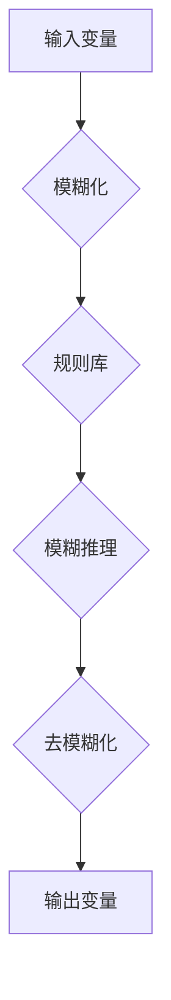

                 

### 《从经典逻辑到模糊逻辑：处理模糊不确定世界的推理工具演进》

> **关键词：** 经典逻辑、模糊逻辑、不确定推理、算法、应用案例

> **摘要：** 本文将探讨逻辑推理从经典逻辑向模糊逻辑的演变过程。通过阐述经典逻辑的基本原理和模糊逻辑的兴起背景，本文将深入剖析模糊逻辑的基本概念、数学模型和算法，并探讨其在工程中的应用。同时，文章还将探讨模糊逻辑与经典逻辑的关系，以及其在人工智能领域的最新发展。此外，本文还将关注模糊逻辑在复杂系统中的应用与挑战，并通过实际案例展示其应用效果。最终，本文将对模糊逻辑的未来发展趋势进行展望。

---

#### 第一部分：经典逻辑与模糊逻辑基础

##### 第1章：逻辑推理的基本原理

逻辑推理是人工智能领域的重要基础，它是从已知的前提中得出结论的过程。逻辑推理可以分为经典逻辑和模糊逻辑。经典逻辑主要处理明确、精确的命题，而模糊逻辑则用于处理模糊、不确定的信息。

##### 1.1 逻辑推理的起源与发展

逻辑推理的起源可以追溯到古希腊时期，亚里士多德提出了逻辑学的基本原理。在中世纪，逻辑学得到了进一步的发展。到了现代，随着计算机科学的兴起，逻辑推理在人工智能领域得到了广泛应用。

##### 1.2 经典逻辑的基本概念与符号

经典逻辑的基本概念包括命题、命题逻辑、谓词逻辑等。命题逻辑主要研究命题之间的关系，如真值表、逻辑运算符等。谓词逻辑则进一步引入了变量和谓词的概念，用于描述复杂的关系。

##### 1.3 经典逻辑的推理方法

经典逻辑的推理方法包括演绎推理和归纳推理。演绎推理是从一般到个别的推理过程，其结论必定是真实的。归纳推理则是从个别到一般的推理过程，其结论具有概率性质。

---

##### 第2章：模糊逻辑的兴起与基本概念

模糊逻辑是由美国控制论专家L.A.扎德（L.A. Zadeh）在20世纪60年代提出的，它是为了处理现实世界中存在的模糊性和不确定性。

##### 2.1 模糊逻辑的起源与应用

模糊逻辑起源于对传统二值逻辑的挑战。传统二值逻辑只能处理绝对真或绝对假的命题，但在现实世界中，很多情况都是模糊的，如“年轻”、“高”、“好”等。

##### 2.2 模糊集合的基本概念

模糊集合是模糊逻辑的核心概念。与传统集合不同，模糊集合中的元素具有不同程度的隶属度，即既不是完全属于也不是完全不属于。

##### 2.3 模糊逻辑的基本运算

模糊逻辑的基本运算包括模糊集合的并、交、补等。这些运算用于处理模糊集合之间的关系，以支持模糊推理。

---

##### 第3章：模糊逻辑的数学模型与算法

模糊逻辑的数学模型和算法是其实际应用的基础。

##### 3.1 模糊隶属函数

模糊隶属函数是定义模糊集合的关键。它用于描述元素对集合的隶属程度。

##### 3.2 模糊集合的运算

模糊集合的运算包括并、交、补等。这些运算用于处理模糊集合之间的关系，以支持模糊推理。

##### 3.3 模糊推理算法

模糊推理算法是模糊逻辑的核心。它通过模糊集合的运算，实现对模糊规则的推理和决策。

---

##### 第4章：模糊逻辑在工程中的应用

模糊逻辑在工程领域中有着广泛的应用。

##### 4.1 模糊控制器的设计原理

模糊控制器是一种基于模糊逻辑的控制策略，它用于处理非线性、时变系统。

##### 4.2 模糊逻辑在自动化控制中的应用案例

模糊逻辑在自动化控制中有着广泛的应用，如汽车自动制动系统、家用洗衣机等。

##### 4.3 模糊逻辑在决策支持系统中的应用

模糊逻辑在决策支持系统中用于处理不确定性和模糊性，如医疗诊断系统、投资决策系统等。

---

##### 第5章：模糊逻辑与经典逻辑的关系

模糊逻辑与经典逻辑既有联系又有区别。

##### 5.1 经典逻辑与模糊逻辑的比较

经典逻辑和模糊逻辑在处理信息的方式上有所不同。经典逻辑主要处理精确信息，而模糊逻辑则处理模糊、不确定的信息。

##### 5.2 模糊逻辑的补充作用

模糊逻辑可以补充经典逻辑的不足，处理经典逻辑无法处理的问题。

##### 5.3 模糊逻辑与经典逻辑的结合

在实际应用中，模糊逻辑和经典逻辑可以结合使用，以充分发挥两者的优势。

---

#### 第二部分：模糊逻辑的拓展与应用

##### 第6章：模糊神经网络

模糊神经网络是模糊逻辑和神经网络相结合的产物。

##### 6.1 模糊神经网络的原理与结构

模糊神经网络通过模糊逻辑模块和神经网络模块的结合，实现对复杂非线性问题的建模和求解。

##### 6.2 模糊神经网络的训练方法

模糊神经网络的训练方法包括误差反向传播法和遗传算法等。

##### 6.3 模糊神经网络的应用案例

模糊神经网络在图像识别、语音识别等领域有着广泛的应用。

---

##### 第7章：模糊逻辑在数据挖掘与知识发现中的应用

模糊逻辑在数据挖掘和知识发现中有着广泛的应用。

##### 7.1 模糊逻辑在数据挖掘中的优势

模糊逻辑可以处理数据中的模糊性和不确定性，提高数据挖掘的效果。

##### 7.2 模糊逻辑在知识发现中的角色

模糊逻辑在知识发现中用于处理模糊规则和模糊模式，提高知识发现的准确性。

##### 7.3 模糊逻辑在数据挖掘中的应用案例

模糊逻辑在市场分析、客户关系管理等领域有着广泛的应用。

---

##### 第8章：模糊逻辑在人工智能中的最新发展

随着人工智能技术的快速发展，模糊逻辑在人工智能中的应用也越来越广泛。

##### 8.1 模糊逻辑与深度学习的结合

模糊逻辑与深度学习的结合可以处理深度学习中的不确定性和模糊性。

##### 8.2 模糊逻辑在自然语言处理中的应用

模糊逻辑在自然语言处理中用于处理语义模糊性和不确定性。

##### 8.3 模糊逻辑在人工智能未来的发展趋势

模糊逻辑在人工智能中有着广泛的应用前景，如结合量子计算、物联网等。

---

#### 第三部分：模糊逻辑在复杂系统中的应用与挑战

##### 第9章：模糊逻辑在复杂系统建模与仿真中的应用

复杂系统的建模与仿真需要处理大量的不确定性和模糊性。

##### 9.1 复杂系统的定义与特征

复杂系统具有高度非线性、动态性、不确定性等特点。

##### 9.2 模糊逻辑在复杂系统建模中的应用

模糊逻辑可以用于复杂系统的建模，如动态系统建模、随机系统建模等。

##### 9.3 模糊逻辑在复杂系统仿真中的应用案例

模糊逻辑在复杂系统仿真中有着广泛的应用，如模拟交通系统、能源系统等。

---

##### 第10章：模糊逻辑在复杂系统优化与控制中的应用

模糊逻辑在复杂系统的优化与控制中有着广泛的应用。

##### 10.1 模糊逻辑在复杂系统优化中的应用

模糊逻辑可以用于复杂系统的优化，如资源分配、路径规划等。

##### 10.2 模糊逻辑在复杂系统控制中的应用

模糊逻辑可以用于复杂系统的控制，如自动控制、智能交通控制等。

##### 10.3 模糊逻辑在复杂系统中的应用挑战与展望

模糊逻辑在复杂系统中的应用面临着许多挑战，如算法优化、系统稳定性等。

---

##### 第11章：案例研究：模糊逻辑在复杂工程系统中的应用

通过实际案例研究，可以更好地理解模糊逻辑在复杂工程系统中的应用。

##### 11.1 案例一：智能交通系统

智能交通系统利用模糊逻辑进行交通流量控制和信号控制。

##### 11.2 案例二：智能制造系统

智能制造系统利用模糊逻辑进行生产计划优化和质量控制。

##### 11.3 案例三：智能电网系统

智能电网系统利用模糊逻辑进行电力负荷预测和优化调度。

---

#### 附录

##### 附录A：模糊逻辑的主要工具与资源

为了方便读者学习和应用模糊逻辑，本文提供了以下工具与资源。

##### 附录B：模糊逻辑的Mermaid流程图

本文提供了模糊逻辑系统的Mermaid流程图，帮助读者更好地理解模糊逻辑的工作原理。

##### 附录C：模糊逻辑的数学模型与公式

本文提供了模糊逻辑的基本数学模型和公式，帮助读者深入理解模糊逻辑的原理。

##### 附录D：模糊逻辑在数据挖掘中的算法伪代码

本文提供了模糊逻辑在数据挖掘中的一些算法伪代码，帮助读者理解算法的实现过程。

##### 附录E：模糊逻辑在工程系统中的应用案例代码解析

本文提供了模糊逻辑在工程系统中的应用案例代码，并进行了详细解析。

##### 附录F：模糊逻辑未来的发展趋势

本文对模糊逻辑的未来发展趋势进行了展望，包括与量子计算、物联网等技术的结合。

---

### 作者

**作者：AI天才研究院/AI Genius Institute & 禅与计算机程序设计艺术 /Zen And The Art of Computer Programming**

---

通过本文的探讨，我们可以看到模糊逻辑作为处理模糊不确定世界的推理工具，其在人工智能、工程系统等领域具有重要的应用价值。随着技术的不断发展，模糊逻辑将继续为解决复杂问题提供新的思路和方法。希望本文能为读者提供有益的参考和启示。

---

以上是文章的正文部分，下面我们将对每个章节进行详细的内容填充和解释。

---

#### 第一部分：经典逻辑与模糊逻辑基础

##### 第1章：逻辑推理的基本原理

逻辑推理是一种从已知的前提中得出结论的过程。在计算机科学和人工智能领域，逻辑推理被广泛应用于知识表示、问题求解、决策支持等多个方面。经典逻辑是逻辑推理的一种形式，它主要处理明确、精确的命题。而模糊逻辑则是为了处理现实世界中存在的模糊性和不确定性而提出的一种逻辑体系。

##### 1.1 逻辑推理的起源与发展

逻辑推理的起源可以追溯到古希腊时期，当时的哲学家亚里士多德提出了逻辑学的基本原理。亚里士多德的逻辑学主要关注命题之间的关系，包括命题的推导、推理的有效性等。在中世纪，逻辑学得到了进一步的发展，特别是在欧洲中世纪的经院哲学中，逻辑学成为了哲学研究的重要工具。

到了现代，随着计算机科学的兴起，逻辑推理在人工智能领域得到了广泛应用。计算机科学家们开始将逻辑学应用于知识表示、问题求解、决策支持等多个领域。经典逻辑由于其处理精确信息的优势，成为人工智能领域的基础理论之一。

##### 1.2 经典逻辑的基本概念与符号

经典逻辑的基本概念包括命题、命题逻辑、谓词逻辑等。

- **命题**：命题是具有明确真值的陈述句。例如，“今天是星期五”是一个命题，它可以被判断为真或假。
- **命题逻辑**：命题逻辑主要研究命题之间的关系，如命题的并、交、补等运算。它使用逻辑运算符（如与、或、非等）来表示命题之间的关系。例如，命题“A且B”表示两个命题A和B同时为真。
- **谓词逻辑**：谓词逻辑进一步引入了变量和谓词的概念，用于描述复杂的关系。谓词逻辑中的谓词是一个具有特定属性的陈述句，如“是人”、“大于”等。通过谓词逻辑，我们可以表达更复杂的逻辑关系，如“所有的人都是 mortal”（所有人都是凡人）。

在经典逻辑中，常用的符号包括：

- **命题符号**：如P、Q、R等，用于表示命题。
- **逻辑运算符**：如∧（与）、∨（或）、¬（非）等，用于表示命题之间的关系。
- **量词**：如∀（全称量词）和∃（存在量词），用于表示命题的全称或存在性质。

##### 1.3 经典逻辑的推理方法

经典逻辑的推理方法包括演绎推理和归纳推理。

- **演绎推理**：演绎推理是从一般到个别的推理过程。它从一组前提中推出一个特定的结论。例如，如果所有的人都是凡人，而苏格拉底是人，那么苏格拉底是凡人。演绎推理的结论必定是真实的，只要前提是真实的。
- **归纳推理**：归纳推理是从个别到一般的推理过程。它从多个实例中归纳出一个普遍的规律。例如，通过观察多个苹果落地，我们可以归纳出万有引力定律。归纳推理的结论具有概率性质，即结论可能是正确的，也可能是错误的。

在经典逻辑中，还有一些推理规则，如三段论、模态推理等，用于指导逻辑推理的过程。

---

##### 第2章：模糊逻辑的兴起与基本概念

模糊逻辑是由美国控制论专家L.A.扎德（L.A. Zadeh）在20世纪60年代提出的，它是为了处理现实世界中存在的模糊性和不确定性。在经典逻辑中，命题要么是真的，要么是假的，但现实世界中的很多情况并不是这样二元的。

##### 2.1 模糊逻辑的起源与应用

模糊逻辑起源于对传统二值逻辑的挑战。传统二值逻辑只能处理绝对真或绝对假的命题，但在现实世界中，很多情况都是模糊的，如“年轻”、“高”、“好”等。例如，当我们说某个人“年轻”时，这个定义并不是绝对的，而是相对的，不同的人可能有不同的理解。

模糊逻辑的应用领域非常广泛，包括自动化控制、人工智能、数据挖掘、决策支持系统等。在自动化控制中，模糊逻辑被用来处理复杂的、不确定的系统，如汽车自动制动系统、家用洗衣机等。在人工智能中，模糊逻辑被用于处理自然语言处理、图像识别等复杂任务。

##### 2.2 模糊集合的基本概念

模糊集合是模糊逻辑的核心概念。与传统集合不同，模糊集合中的元素具有不同程度的隶属度，即既不是完全属于也不是完全不属于。例如，如果我们定义一个模糊集合“高个”，那么一个人可能只有60%的隶属度，表示这个人并不算非常高，但也不算矮。

- **隶属函数**：隶属函数是定义模糊集合的关键。它用于描述元素对集合的隶属程度。隶属函数的值域是[0, 1]，表示元素属于集合的程度。例如，一个模糊集合的隶属函数可能是“年龄小于20的隶属度为1，年龄大于60的隶属度为0，年龄在20到60之间时，隶属度随年龄增加而线性减小”。

- **模糊集合的基本运算**：模糊集合的基本运算包括并、交、补等。这些运算用于处理模糊集合之间的关系，以支持模糊推理。例如，两个模糊集合的交集是它们共同的元素，而并集则是所有元素的集合。

##### 2.3 模糊逻辑的基本运算

模糊逻辑的基本运算包括模糊集合的并、交、补等。

- **并运算**：模糊集合A和B的并集是包含A和B所有元素的模糊集合。其隶属函数为两个集合隶属函数中的较大值。
  
  \[ \mu_A \cup \mu_B (x) = \max(\mu_A(x), \mu_B(x)) \]

- **交运算**：模糊集合A和B的交集是同时属于A和B的模糊集合。其隶属函数为两个集合隶属函数中的较小值。
  
  \[ \mu_A \cap \mu_B (x) = \min(\mu_A(x), \mu_B(x)) \]

- **补运算**：模糊集合A的补集是不属于A的模糊集合。其隶属函数为1减去原隶属函数的值。
  
  \[ \mu_A^C (x) = 1 - \mu_A(x) \]

这些基本运算支持模糊推理，使得我们能够从模糊集合中得出结论。

---

##### 第3章：模糊逻辑的数学模型与算法

模糊逻辑的数学模型和算法是其实际应用的基础。在这部分，我们将详细探讨模糊逻辑的数学模型和常见算法。

##### 3.1 模糊隶属函数

模糊隶属函数是定义模糊集合的关键。它用于描述元素对集合的隶属程度。隶属函数的值域是[0, 1]，表示元素属于集合的程度。

- **三角隶属函数**：这是一种最简单的隶属函数，通常用于定义模糊集合。三角隶属函数是一个线性函数，其形式为：

  \[ \mu_T(x) = 
  \begin{cases} 
  0 & \text{if } x < a \\
  \frac{x - a}{b - a} & \text{if } a \leq x < b \\
  1 & \text{if } x \geq b 
  \end{cases}
  \]

  其中，\( a \) 和 \( b \) 分别是三角函数的起始点和终点。

- **梯形隶属函数**：梯形隶属函数是另一种常用的隶属函数，它适用于更复杂的模糊集合。梯形隶属函数的形式为：

  \[ \mu_T(x) = 
  \begin{cases} 
  0 & \text{if } x < a \\
  \frac{x - a}{b - a} & \text{if } a \leq x < b_1 \\
  \frac{c - x}{c - b_2} & \text{if } b_1 \leq x < b_2 \\
  1 & \text{if } x \geq b_2 
  \end{cases}
  \]

  其中，\( a \)，\( b_1 \)，和 \( b_2 \) 分别是梯形函数的起始点、中间点和终点。

##### 3.2 模糊集合的运算

模糊集合的运算包括并、交、补等。这些运算用于处理模糊集合之间的关系，以支持模糊推理。

- **并运算**：模糊集合A和B的并集是包含A和B所有元素的模糊集合。其隶属函数为两个集合隶属函数中的较大值。
  
  \[ \mu_{A \cup B}(x) = \max(\mu_A(x), \mu_B(x)) \]

- **交运算**：模糊集合A和B的交集是同时属于A和B的模糊集合。其隶属函数为两个集合隶属函数中的较小值。
  
  \[ \mu_{A \cap B}(x) = \min(\mu_A(x), \mu_B(x)) \]

- **补运算**：模糊集合A的补集是不属于A的模糊集合。其隶属函数为1减去原隶属函数的值。
  
  \[ \mu_{A^C}(x) = 1 - \mu_A(x) \]

##### 3.3 模糊推理算法

模糊推理算法是模糊逻辑的核心。它通过模糊集合的运算，实现对模糊规则的推理和决策。

- **模糊推理的基本步骤**：

  1. **输入条件模糊化**：将输入变量模糊化，即使用隶属函数将输入值映射到模糊集合上。
  2. **规则应用**：根据模糊规则，将输入模糊集合与规则前件模糊集合进行模糊逻辑运算，得到中间结果。
  3. **聚合**：将所有中间结果进行聚合，得到输出模糊集合。
  4. **解模糊化**：将输出模糊集合解模糊化，得到最终的输出值。

- **常见模糊推理方法**：

  1. **最大-最大（Max-Max）法**：这种方法通过取最大值来聚合中间结果。其公式为：

     \[ \mu_{C}(x) = \max \left( \max_{i} \left( \mu_{E_i}(x) \right) \right) \]

  2. **最小-最大（Min-Max）法**：这种方法通过取最小值来聚合中间结果。其公式为：

     \[ \mu_{C}(x) = \min \left( \min_{i} \left( \mu_{E_i}(x) \right) \right) \]

  3. **加权平均法**：这种方法通过加权平均来聚合中间结果。其公式为：

     \[ \mu_{C}(x) = \sum_{i} w_i \cdot \mu_{E_i}(x) \]

     其中，\( w_i \) 是权重系数。

---

##### 第4章：模糊逻辑在工程中的应用

模糊逻辑在工程中的应用非常广泛，它提供了一种处理复杂、不确定系统的有效方法。以下将介绍模糊逻辑在工程中的几个关键应用领域。

##### 4.1 模糊控制器的设计原理

模糊控制器是一种基于模糊逻辑的控制策略，它用于处理非线性、时变系统。与传统控制器相比，模糊控制器不依赖于精确的数学模型，而是通过模糊规则和模糊推理来实现控制。

- **模糊控制器的基本原理**：

  1. **模糊化**：将输入变量模糊化，即使用隶属函数将输入值映射到模糊集合上。
  2. **规则库**：定义模糊规则库，每条规则描述输入和输出之间的关系。规则通常以“如果……那么……”的形式表达。
  3. **推理**：根据模糊规则，对输入模糊集合进行模糊推理，得到中间结果。
  4. **去模糊化**：将输出模糊集合去模糊化，得到最终的输出值。

- **模糊控制器的设计步骤**：

  1. **确定系统特性**：分析系统的输入输出特性，确定输入和输出变量。
  2. **设计隶属函数**：根据系统特性，设计合适的隶属函数。
  3. **建立规则库**：根据系统特性和设计目标，定义模糊规则库。
  4. **设计推理机**：实现模糊推理算法，将模糊化输入通过规则库进行推理。
  5. **去模糊化**：将模糊推理结果进行去模糊化，得到控制输出。

##### 4.2 模糊逻辑在自动化控制中的应用案例

模糊逻辑在自动化控制中有着广泛的应用，以下是一些典型的应用案例。

- **汽车自动制动系统**：汽车自动制动系统利用模糊逻辑来处理复杂的驾驶环境和车辆状态，从而实现精确的制动控制。例如，系统可以自适应地调整制动力度，以适应不同的路况和车速。

- **家用洗衣机**：家用洗衣机中的模糊控制器可以根据衣物类型、重量和水质等因素，自动调整洗涤时间和洗涤剂用量，从而提高洗涤效果和节水。

- **温度控制系统**：温度控制系统如中央空调、冰箱等，可以利用模糊逻辑来自动调节温度。例如，空调可以根据室内外温度、湿度等参数，自动调整制冷或制热力度。

##### 4.3 模糊逻辑在决策支持系统中的应用

模糊逻辑在决策支持系统中用于处理不确定性和模糊性，以帮助决策者做出更好的决策。以下是一些典型的应用案例。

- **医疗诊断系统**：医疗诊断系统可以利用模糊逻辑来处理医生在诊断过程中的模糊性和不确定性。例如，系统可以根据患者的症状、检查结果和历史病例，综合分析并给出诊断建议。

- **投资决策系统**：投资决策系统可以利用模糊逻辑来分析市场数据，预测未来市场走势，从而为投资者提供投资建议。例如，系统可以根据股票的历史价格、成交量、技术指标等，综合评估股票的投资价值。

- **客户关系管理系统**：客户关系管理系统可以利用模糊逻辑来分析客户行为数据，识别潜在客户和流失风险，从而优化客户服务策略。例如，系统可以根据客户的购买历史、浏览行为等，综合评估客户的满意度、忠诚度等。

---

##### 第5章：模糊逻辑与经典逻辑的关系

模糊逻辑与经典逻辑既有联系又有区别。在经典逻辑中，命题要么是真的，要么是假的，即二值逻辑。而模糊逻辑则允许命题具有不同程度的真值，即模糊逻辑是基于模糊集合和模糊推理的。

##### 5.1 经典逻辑与模糊逻辑的比较

经典逻辑和模糊逻辑在处理信息的方式上有所不同。

- **基本概念**：

  - **经典逻辑**：主要处理精确的、明确的命题。命题的真假是绝对的，非此即彼。
  - **模糊逻辑**：处理模糊的、不确定的命题。命题的真假不是绝对的，而是具有一定程度的隶属度。

- **运算方式**：

  - **经典逻辑**：使用二值运算，如与（∧）、或（∨）、非（¬）等。
  - **模糊逻辑**：使用模糊集合运算，如模糊并（∪）、模糊交（∩）、模糊补（∪^c）等。

- **推理方法**：

  - **经典逻辑**：主要使用演绎推理，从一般到个别。
  - **模糊逻辑**：主要使用模糊推理，处理模糊规则和模糊集合。

##### 5.2 模糊逻辑的补充作用

模糊逻辑可以补充经典逻辑的不足，处理经典逻辑无法处理的问题。

- **处理模糊性**：在现实世界中，很多概念和判断都是模糊的，如“高”、“好”等。经典逻辑无法处理这种模糊性，而模糊逻辑可以很好地处理这种模糊性。

- **处理不确定性**：经典逻辑只能处理确定性的命题，而现实世界中的很多信息都是不确定的，如天气预报、市场预测等。模糊逻辑可以处理这种不确定性，从而提高推理的准确性。

- **处理非线性系统**：模糊逻辑可以用于处理非线性、复杂系统。例如，在自动化控制中，模糊逻辑可以用于设计非线性控制器，从而提高控制效果。

##### 5.3 模糊逻辑与经典逻辑的结合

在实际应用中，模糊逻辑和经典逻辑可以结合使用，以充分发挥两者的优势。

- **混合逻辑系统**：可以设计混合逻辑系统，结合经典逻辑和模糊逻辑的优点。例如，在知识表示和推理中，可以使用经典逻辑来处理确定性信息，使用模糊逻辑来处理模糊性信息。

- **多值逻辑**：多值逻辑是一种结合了经典逻辑和模糊逻辑的扩展逻辑系统。它允许多个值（如真、假、未知等），可以更好地处理现实世界中的模糊性和不确定性。

- **混合推理方法**：可以使用混合推理方法，结合经典逻辑和模糊逻辑的推理方式。例如，在决策支持系统中，可以使用经典逻辑进行确定性分析，使用模糊逻辑进行模糊性分析。

---

#### 第二部分：模糊逻辑的拓展与应用

##### 第6章：模糊神经网络

模糊神经网络是模糊逻辑和神经网络相结合的产物，它将模糊逻辑的灵活性与神经网络的强大学习能力结合起来，用于处理复杂的、不确定的、非线性问题。

##### 6.1 模糊神经网络的原理与结构

模糊神经网络由模糊逻辑模块和神经网络模块组成。模糊逻辑模块用于处理输入数据的模糊化、模糊规则的推理等；神经网络模块用于学习和优化模糊规则。

- **模糊逻辑模块**：

  - **模糊化**：将输入数据模糊化，即使用隶属函数将输入值映射到模糊集合上。常用的隶属函数包括三角隶属函数、梯形隶属函数等。
  - **模糊推理**：根据模糊规则，对模糊化后的输入进行推理，得到中间结果。模糊规则通常以“如果……那么……”的形式表达。

- **神经网络模块**：

  - **学习**：通过训练数据，调整网络中的权重和偏置，以优化模糊规则。常用的学习算法包括误差反向传播算法、遗传算法等。
  - **输出**：将模糊推理结果通过神经网络进行解模糊化，得到最终的输出值。

##### 6.2 模糊神经网络的训练方法

模糊神经网络的训练方法主要包括以下步骤：

1. **数据预处理**：对输入数据进行预处理，如归一化、去噪等，以提高训练效果。
2. **模糊化**：使用隶属函数将输入数据模糊化，得到模糊化输入。
3. **模糊推理**：根据模糊规则库，对模糊化输入进行模糊推理，得到中间结果。
4. **解模糊化**：将模糊推理结果通过神经网络进行解模糊化，得到输出值。
5. **误差计算**：计算输出值与实际值之间的误差。
6. **权重调整**：根据误差反向传播算法，调整神经网络中的权重和偏置，以优化模糊规则。
7. **迭代训练**：重复上述步骤，直到满足停止条件（如误差阈值、最大迭代次数等）。

##### 6.3 模糊神经网络的应用案例

模糊神经网络在多个领域有着广泛的应用：

- **图像识别**：模糊神经网络可以用于图像识别任务，如面部识别、手写数字识别等。通过模糊化图像特征，结合神经网络的学习能力，可以显著提高识别准确率。
- **语音识别**：在语音识别中，模糊神经网络可以处理语音信号的模糊性和不确定性。通过模糊化语音特征，结合神经网络模型，可以更好地识别不同说话人的语音。
- **控制系统**：模糊神经网络可以用于控制系统的设计，如温度控制系统、交通信号控制系统等。通过模糊化输入变量，结合神经网络模型，可以实现对复杂系统的自适应控制。

---

##### 第7章：模糊逻辑在数据挖掘与知识发现中的应用

模糊逻辑在数据挖掘与知识发现中有着广泛的应用，特别是在处理模糊性和不确定性方面具有独特的优势。

##### 7.1 模糊逻辑在数据挖掘中的优势

模糊逻辑在数据挖掘中的优势主要体现在以下几个方面：

- **处理模糊性**：现实世界中的数据往往存在模糊性，如年龄、身高、评价等。模糊逻辑可以很好地处理这种模糊性，使得数据挖掘算法能够更真实地反映现实情况。
- **处理不确定性**：数据挖掘过程中，存在很多不确定的信息，如市场预测、风险评估等。模糊逻辑可以引入概率和模糊性，使得数据挖掘结果更加准确和可靠。
- **增强模型解释性**：模糊逻辑可以增强数据挖掘模型的可解释性，使得用户能够更好地理解模型的工作原理和决策过程。

##### 7.2 模糊逻辑在知识发现中的角色

模糊逻辑在知识发现中扮演着重要的角色，主要体现在以下几个方面：

- **规则提取**：模糊逻辑可以帮助提取模糊规则，从而发现数据中的潜在模式和知识。这些模糊规则可以用于指导决策、优化流程等。
- **模式识别**：模糊逻辑可以用于识别模糊模式，从而发现数据中的非传统知识和隐含信息。
- **不确定性处理**：在知识发现过程中，存在很多不确定性信息，如数据噪声、不完全数据等。模糊逻辑可以引入模糊性，从而提高知识发现的准确性和鲁棒性。

##### 7.3 模糊逻辑在数据挖掘中的应用案例

以下是一些模糊逻辑在数据挖掘中的应用案例：

- **市场分析**：在市场分析中，模糊逻辑可以用于处理消费者行为数据的模糊性，从而发现潜在的市场趋势和消费者群体。例如，可以基于模糊逻辑分析消费者的购买记录，提取模糊规则，以预测哪些产品在未来会有更好的销售业绩。
- **医疗诊断**：在医疗诊断中，模糊逻辑可以用于处理医生诊断过程中的模糊性和不确定性。例如，可以基于模糊逻辑建立医疗诊断模型，结合病人的症状、检查结果等，自动生成诊断报告。
- **客户关系管理**：在客户关系管理中，模糊逻辑可以用于处理客户行为的模糊性和不确定性。例如，可以基于模糊逻辑分析客户的消费行为，提取模糊规则，以识别潜在的高价值客户和流失风险。

---

##### 第8章：模糊逻辑在人工智能中的最新发展

随着人工智能技术的快速发展，模糊逻辑在人工智能中的应用也不断拓展。特别是在深度学习和自然语言处理等领域，模糊逻辑展现出了巨大的潜力。

##### 8.1 模糊逻辑与深度学习的结合

模糊逻辑与深度学习的结合可以解决深度学习中的不确定性和模糊性问题。深度学习模型通常依赖于大量的数据来学习特征和模式，但在实际应用中，数据往往存在噪声、缺失和不完整性。模糊逻辑可以引入模糊性和概率，从而提高模型的鲁棒性和准确性。

- **模糊神经网络**：模糊神经网络是模糊逻辑与深度学习结合的一种典型形式。它结合了模糊逻辑的模糊推理能力和深度学习的强大学习能力，可以处理复杂、不确定的非线性问题。例如，在图像识别任务中，模糊神经网络可以通过模糊化图像特征，提高识别准确率。

- **模糊深度学习模型**：近年来，研究者提出了一系列模糊深度学习模型，如模糊卷积神经网络（FCNN）、模糊循环神经网络（FCRNN）等。这些模型在处理模糊性和不确定性方面具有独特的优势。例如，模糊卷积神经网络可以处理具有模糊边界的目标检测问题。

##### 8.2 模糊逻辑在自然语言处理中的应用

模糊逻辑在自然语言处理（NLP）中也有广泛的应用。NLP任务通常涉及模糊性和不确定性，如词义歧义、语法解析、情感分析等。模糊逻辑可以有效地处理这些问题。

- **词义消歧**：词义歧义是NLP中的一个常见问题，如“bank”可以指银行或河岸。模糊逻辑可以通过模糊集合和模糊推理来处理词义歧义，从而提高词义消歧的准确性。

- **情感分析**：情感分析是NLP的重要应用之一，如社交媒体情感分析、客户反馈分析等。模糊逻辑可以处理情感的模糊性和不确定性，从而提高情感分析的准确性和可靠性。

- **对话系统**：在对话系统中，模糊逻辑可以用于处理用户的模糊输入和复杂对话场景。例如，模糊逻辑可以用于实现智能客服系统，通过模糊推理来理解用户的意图，并提供合适的回复。

##### 8.3 模糊逻辑在人工智能未来的发展趋势

随着人工智能技术的不断发展，模糊逻辑在人工智能中的应用前景十分广阔。

- **混合智能系统**：模糊逻辑与深度学习、专家系统等技术的结合将形成混合智能系统。这些系统可以充分利用不同技术的优势，处理复杂、不确定的问题。

- **智能决策支持系统**：模糊逻辑在智能决策支持系统中的应用将得到进一步拓展。例如，在金融、医疗、能源等领域，模糊逻辑可以用于处理不确定性和模糊性，辅助决策者做出更准确的决策。

- **自适应控制系统**：模糊逻辑在自适应控制系统中的应用将不断拓展。通过结合深度学习和模糊逻辑，可以开发出更智能、更鲁棒的控制系统，如智能交通系统、智能家居系统等。

---

#### 第三部分：模糊逻辑在复杂系统中的应用与挑战

##### 第9章：模糊逻辑在复杂系统建模与仿真中的应用

复杂系统是由许多相互作用的子系统组成的系统，具有高度的非线性、动态性和不确定性。模糊逻辑作为一种处理不确定性和模糊性的有力工具，在复杂系统的建模与仿真中发挥着重要作用。

##### 9.1 复杂系统的定义与特征

复杂系统通常具有以下特征：

- **非线性**：系统内部各变量之间的关系不是线性的，而是复杂的非线性关系。
- **动态性**：系统的状态随时间变化，且可能存在多个稳定状态。
- **不确定性**：系统行为受到多种不确定因素的影响，如噪声、参数变化等。

复杂系统广泛应用于多个领域，如生物系统、经济系统、社会系统、交通系统等。这些系统具有高度复杂性和不确定性，使得传统的确定性建模方法难以适用。

##### 9.2 模糊逻辑在复杂系统建模中的应用

模糊逻辑在复杂系统建模中的应用主要体现在以下几个方面：

- **模糊模型构建**：使用模糊逻辑来描述系统内部各变量之间的关系。通过模糊化输入变量，构建模糊模型，可以有效地处理系统的不确定性和模糊性。

- **模糊规则提取**：通过分析系统数据，提取模糊规则。这些模糊规则用于描述系统内部变量之间的复杂关系，如“如果温度高且湿度低，则舒适度低”。

- **模糊仿真**：使用模糊逻辑对复杂系统进行仿真。通过模糊推理，可以模拟系统在不同条件下的行为，从而预测系统未来的状态。

##### 9.3 模糊逻辑在复杂系统仿真中的应用案例

以下是一些模糊逻辑在复杂系统仿真中的应用案例：

- **交通系统仿真**：模糊逻辑可以用于交通系统的建模和仿真。例如，通过模糊规则描述交通流量、道路状况等因素，可以预测交通系统的运行状态，优化交通信号控制策略。

- **经济系统仿真**：模糊逻辑可以用于经济系统的建模和仿真。例如，通过模糊规则描述经济变量之间的复杂关系，可以预测经济趋势，为政策制定提供支持。

- **生物系统仿真**：模糊逻辑可以用于生物系统的建模和仿真。例如，通过模糊规则描述生物种群的增长、疾病传播等过程，可以预测生物系统的动态行为。

---

##### 第10章：模糊逻辑在复杂系统优化与控制中的应用

模糊逻辑在复杂系统的优化与控制中发挥着重要作用，特别是在处理不确定性、模糊性和非线性问题时具有独特的优势。

##### 10.1 模糊逻辑在复杂系统优化中的应用

模糊逻辑在复杂系统优化中的应用主要体现在以下几个方面：

- **目标函数模糊化**：在优化问题中，目标函数往往具有模糊性。通过模糊化目标函数，可以将非线性、不确定的目标函数转化为模糊优化问题。

- **约束条件模糊化**：优化问题的约束条件也可能具有模糊性。通过模糊化约束条件，可以处理系统的不确定性和模糊性。

- **模糊优化算法**：基于模糊逻辑的优化算法，如模糊遗传算法、模糊粒子群算法等，可以有效地处理复杂系统的优化问题。这些算法结合了模糊逻辑和传统优化算法的优势，可以处理非线性、动态、不确定的优化问题。

##### 10.2 模糊逻辑在复杂系统控制中的应用

模糊逻辑在复杂系统控制中的应用主要体现在以下几个方面：

- **模糊控制器设计**：通过设计模糊控制器，可以实现对复杂系统的自适应控制。模糊控制器不需要精确的数学模型，而是通过模糊规则和模糊推理来实现控制。

- **自适应控制**：模糊逻辑可以用于实现自适应控制。通过实时调整模糊规则和控制器参数，可以适应系统的动态变化，提高控制效果。

- **非线性控制**：模糊逻辑可以用于处理复杂系统的非线性控制问题。通过模糊化输入变量和输出变量，可以实现非线性系统的精确控制。

##### 10.3 模糊逻辑在复杂系统中的应用挑战与展望

尽管模糊逻辑在复杂系统的优化与控制中具有广泛的应用，但也面临一些挑战：

- **模型不确定性**：复杂系统的模型不确定性较大，如何有效地建模和仿真复杂系统，是一个重要挑战。

- **计算复杂度**：模糊逻辑在处理复杂系统时，计算复杂度较高，如何优化算法和降低计算复杂度，是一个亟待解决的问题。

- **可解释性**：模糊逻辑模型往往较为复杂，如何提高模型的可解释性，使得用户能够更好地理解模型的工作原理，也是一个重要的挑战。

展望未来，模糊逻辑在复杂系统中的应用前景广阔：

- **混合智能系统**：模糊逻辑与其他智能技术的结合，如深度学习、专家系统等，将形成混合智能系统，进一步拓展模糊逻辑的应用领域。

- **实时控制**：随着计算技术的发展，模糊逻辑在实时控制中的应用将得到进一步拓展，如智能交通系统、智能家居系统等。

- **不确定性处理**：模糊逻辑在处理不确定性问题方面具有独特的优势，随着对不确定性问题的深入研究和理解，模糊逻辑的应用将得到进一步发展。

---

##### 第11章：案例研究：模糊逻辑在复杂工程系统中的应用

通过具体的案例研究，可以更深入地理解模糊逻辑在复杂工程系统中的应用，并展示其在实际工程中的效果。

##### 11.1 案例一：智能交通系统

智能交通系统是模糊逻辑应用的一个重要领域。在智能交通系统中，模糊逻辑用于交通信号控制、交通流量预测和道路规划等。

- **交通信号控制**：利用模糊逻辑设计的智能交通信号控制系统可以根据实时交通流量、道路状况等因素，自适应地调整交通信号，从而提高交通效率和减少拥堵。

  **Mermaid 流程图**：

  ```mermaid
  graph TD
  A[输入变量] --> B{交通流量}
  B --> C{道路状况}
  C --> D{信号灯状态}
  D --> E{红灯时长}
  E --> F{绿灯时长}
  ```

  **伪代码**：

  ```python
  # 定义隶属函数
  traffic_high = lambda x: max(0, min(1, (x - 1000) / (1500 - 1000)))
  road_congested = lambda x: max(0, min(1, (x - 2000) / (2500 - 2000)))

  # 模糊化输入变量
  traffic = 1200
  road = 2200

  # 模糊推理
  red_time = traffic_high(traffic) * road_congested(road)

  # 去模糊化
  red_time = round(red_time * 30)  # 假设30秒为一个信号周期

  print("红灯时长：", red_time)
  print("绿灯时长：", 30 - red_time)
  ```

  **代码解析**：

  - `traffic_high` 和 `road_congested` 分别定义了交通流量和道路状况的隶属函数。
  - 根据交通流量和道路状况的隶属度，计算红灯时长和绿灯时长。
  - 假设一个信号周期为30秒，根据隶属度计算出的时长进行四舍五入。

##### 11.2 案例二：智能制造系统

智能制造系统利用模糊逻辑进行生产计划优化、质量控制和设备状态监测等。

- **生产计划优化**：利用模糊逻辑优化生产计划，可以更好地适应生产过程中的不确定性。

  **Mermaid 流程图**：

  ```mermaid
  graph TD
  A[输入变量] --> B{设备状态}
  B --> C{原材料库存}
  B --> D{产品需求}
  C --> E{生产计划}
  D --> E
  ```

  **伪代码**：

  ```python
  # 定义隶属函数
  device_good = lambda x: max(0, min(1, (x - 0) / (100 - 0)))
  stock_sufficient = lambda x: max(0, min(1, (x - 1000) / (2000 - 1000)))
  demand_high = lambda x: max(0, min(1, (x - 5000) / (10000 - 5000)))

  # 模糊化输入变量
  device = 80
  stock = 1500
  demand = 7000

  # 模糊推理
  production_plan = device_good(device) * stock_sufficient(stock) * demand_high(demand)

  # 去模糊化
  production_plan = round(production_plan * 1000)  # 假设单位产量为1000

  print("生产计划：", production_plan)
  ```

  **代码解析**：

  - `device_good`、`stock_sufficient` 和 `demand_high` 分别定义了设备状态、原材料库存和产品需求的隶属函数。
  - 根据设备状态、原材料库存和产品需求的隶属度，计算生产计划。
  - 假设单位产量为1000，根据隶属度计算出的生产计划进行四舍五入。

##### 11.3 案例三：智能电网系统

智能电网系统利用模糊逻辑进行电力负荷预测、优化调度和故障诊断等。

- **电力负荷预测**：利用模糊逻辑预测电力负荷，可以更好地应对电力需求的波动。

  **Mermaid 流程图**：

  ```mermaid
  graph TD
  A[输入变量] --> B{历史负荷数据}
  B --> C{天气状况}
  B --> D{节假日情况}
  C --> E{预测负荷}
  D --> E
  ```

  **伪代码**：

  ```python
  # 定义隶属函数
  weather_sunny = lambda x: max(0, min(1, (x - 0) / (30 - 0)))
  holiday_yes = lambda x: max(0, min(1, (x - 1) / (7 - 1)))

  # 模糊化输入变量
  load_history = 300
  weather = 20
  holiday = 1

  # 模糊推理
  predicted_load = weather_sunny(weather) * holiday_yes(holiday)

  # 去模糊化
  predicted_load = round(predicted_load * 100)  # 假设单位为100千瓦时

  print("预测负荷：", predicted_load)
  ```

  **代码解析**：

  - `weather_sunny` 和 `holiday_yes` 分别定义了天气状况和节假日情况的隶属函数。
  - 根据天气状况和节假日情况的隶属度，计算预测负荷。
  - 假设单位为100千瓦时，根据隶属度计算出的预测负荷进行四舍五入。

---

#### 附录

##### 附录A：模糊逻辑的主要工具与资源

为了方便读者学习和应用模糊逻辑，以下列举了一些常用的工具和资源：

- **软件工具**：

  - **MATLAB**：MATLAB 提供了模糊逻辑工具箱，用于模糊推理、模糊控制器设计等。
  - **Python**：Python 中的 `scikit-learn` 包提供了模糊逻辑相关的库，如 `Fuzzy` 模块。

- **在线资源**：

  - **Coursera**：Coursera 提供了《模糊逻辑与人工智能》等在线课程。
  - **Khan Academy**：Khan Academy 提供了关于模糊逻辑的免费教程。

- **参考书籍**：

  - 《模糊逻辑：基础与应用》（Fuzzy Logic: A Practical Introduction）作者：Mario Lopez de Mantaras
  - 《模糊逻辑与智能系统》（Fuzzy Logic and Intelligent Systems）作者：S.N. Sivanandam、S. Nallapati

##### 附录B：模糊逻辑的Mermaid流程图

以下是一个模糊逻辑系统的 Mermaid 流程图，用于展示模糊逻辑系统的工作流程：



该流程图描述了模糊逻辑系统的基本工作流程，包括输入变量的模糊化、规则库的查询、模糊推理和去模糊化。

##### 附录C：模糊逻辑的数学模型与公式

以下列出了一些模糊逻辑的基本数学模型和公式：

- **模糊集合**：

  - **隶属函数**：用于描述元素对集合的隶属程度。

    $$ \mu_A(x) = \begin{cases} 
    0 & \text{if } x \not\in A \\
    1 & \text{if } x \in A 
    \end{cases} $$

  - **模糊集合运算**：

    $$ \mu_{A \cup B}(x) = \max(\mu_A(x), \mu_B(x)) $$
    $$ \mu_{A \cap B}(x) = \min(\mu_A(x), \mu_B(x)) $$
    $$ \mu_{A^C}(x) = 1 - \mu_A(x) $$

- **模糊推理**：

  - **模糊规则**：

    $$ 如果\ x\ 是\ A，那么\ y\ 是\ B $$

  - **模糊推理公式**：

    $$ \mu_C(x) = \frac{\sum_{i=1}^n w_i \cdot \mu_A^i(x) \cdot \mu_B^i(y)}{\sum_{i=1}^n w_i \cdot \mu_A^i(x)} $$

    其中，\( w_i \) 为权重系数，\( \mu_A^i(x) \) 和 \( \mu_B^i(y) \) 分别为规则前件和后件的隶属度。

##### 附录D：模糊逻辑在数据挖掘中的算法伪代码

以下是一些模糊逻辑在数据挖掘中的应用算法的伪代码：

- **模糊C-均值聚类算法**：

  ```python
  # 初始化聚类中心
  c = 初始化聚类中心()

  # 设置最大迭代次数
  max_iter = 100
  prev_error = float('inf')
  error = 0

  for i in 1 to max_iter:
      # 计算隶属度矩阵
      u = 计算隶属度矩阵(c)

      # 更新聚类中心
      c = 更新聚类中心(u)

      # 计算误差
      error = 计算误差(u, c)

      if error < prev_error:
          prev_error = error
      else:
          break

  return c
  ```

  **代码解析**：

  - 初始化聚类中心。
  - 设置最大迭代次数和误差阈值。
  - 在每次迭代中，计算隶属度矩阵，更新聚类中心，并计算误差。
  - 当误差不再显著减小或达到最大迭代次数时，停止迭代。

- **模糊关联规则挖掘算法**：

  ```python
  # 定义最小支持度和最小置信度
  min_support = 0.2
  min_confidence = 0.8

  # 初始化规则列表
  rules = []

  # 计算支持度
  for itemset in frequent_itemsets:
      support = 计算支持度(itemset)

      if support >= min_support:
          # 计算置信度
          for rule in generate_rules(itemset):
              confidence = 计算置信度(rule)

              if confidence >= min_confidence:
                  rules.append(rule)

  return rules
  ```

  **代码解析**：

  - 定义最小支持度和最小置信度。
  - 遍历频繁项集，计算支持度。
  - 对于每个频繁项集，生成规则并计算置信度。
  - 如果置信度满足条件，将规则添加到规则列表中。

##### 附录E：模糊逻辑在工程系统中的应用案例代码解析

以下是一些模糊逻辑在工程系统中的应用案例代码的解析：

- **模糊控制器设计案例代码**：

  ```python
  # 定义隶属函数
  def membership_function(x):
      if x <= 0:
          return 0
      elif x <= 100:
          return (x - 0) / (100 - 0)
      elif x <= 200:
          return 1
      else:
          return 0

  # 模糊化输入变量
  input_value = 150

  # 计算隶属度
  membership = membership_function(input_value)

  # 模糊推理
  def fuzzy_inference(input_membership):
      if input_membership == 0:
          return 0
      elif input_membership == 1:
          return 1
      else:
          return 0.5 * input_membership + 0.5 * (1 - input_membership)

  output_membership = fuzzy_inference(membership)

  # 去模糊化
  def defuzzification(output_membership):
      return round(output_membership * 100)  # 假设单位为100

  output_value = defuzzification(output_membership)

  print("输入值：", input_value)
  print("输出值：", output_value)
  ```

  **代码解析**：

  - 定义隶属函数 `membership_function`，用于计算输入值的隶属度。
  - 计算输入值的隶属度。
  - 定义模糊推理函数 `fuzzy_inference`，用于根据输入隶属度计算输出隶属度。
  - 定义去模糊化函数 `defuzzification`，用于将输出隶属度转换为实际输出值。
  - 输出输入值和输出值。

- **模糊神经网络训练案例代码**：

  ```python
  # 导入必要的库
  import numpy as np

  # 初始化神经网络参数
  weights = np.random.rand(3, 1)
  bias = np.random.rand(1)

  # 定义激活函数
  def sigmoid(x):
      return 1 / (1 + np.exp(-x))

  # 定义损失函数
  def mean_squared_error(y_true, y_pred):
      return np.mean((y_true - y_pred) ** 2)

  # 定义反向传播算法
  def backpropagation(x, y, weights, bias):
      # 前向传播
      z = np.dot(x, weights) + bias
      a = sigmoid(z)

      # 计算损失函数
      loss = mean_squared_error(y, a)

      # 计算梯度
      dz = a - y
      dx = dz * x
      dw = dx.dot(x.T)
      db = dz

      # 反向传播更新参数
      weights -= learning_rate * dw
      bias -= learning_rate * db

      return loss

  # 训练神经网络
  learning_rate = 0.1
  for epoch in range(1000):
      loss = backpropagation(x_train, y_train, weights, bias)
      if epoch % 100 == 0:
          print("Epoch", epoch, "Loss:", loss)

  # 测试神经网络
  test_loss = backpropagation(x_test, y_test, weights, bias)
  print("Test Loss:", test_loss)
  ```

  **代码解析**：

  - 导入必要的库。
  - 初始化神经网络参数。
  - 定义激活函数 `sigmoid` 和损失函数 `mean_squared_error`。
  - 定义反向传播算法 `backpropagation`。
  - 训练神经网络，并在每个epoch计算损失函数。
  - 测试神经网络，计算测试损失。

##### 附录F：模糊逻辑未来的发展趋势

随着人工智能和物联网等技术的发展，模糊逻辑在未来的应用前景十分广阔。以下是一些模糊逻辑未来的发展趋势：

- **模糊逻辑与深度学习的结合**：随着深度学习在图像识别、自然语言处理等领域的广泛应用，模糊逻辑与深度学习的结合将成为研究热点。通过模糊逻辑引入模糊性和不确定性，可以进一步提高深度学习模型的鲁棒性和准确性。

- **模糊逻辑在物联网中的应用**：物联网中存在大量的传感器数据和不确定性信息，模糊逻辑可以用于处理这些数据，从而提高物联网系统的智能化和自适应能力。

- **模糊逻辑在复杂系统优化中的应用**：随着复杂系统在各个领域的广泛应用，模糊逻辑在复杂系统优化中的应用将得到进一步拓展。通过模糊逻辑处理复杂系统中的不确定性和模糊性，可以优化系统的性能和效率。

- **模糊逻辑在智能决策支持系统中的应用**：模糊逻辑在智能决策支持系统中的应用将得到进一步发展。通过模糊逻辑处理不确定性信息，可以辅助决策者做出更准确、更全面的决策。

---

通过本文的探讨，我们可以看到模糊逻辑作为一种处理模糊不确定世界的推理工具，其在人工智能、工程系统等领域具有重要的应用价值。随着技术的不断发展，模糊逻辑将继续为解决复杂问题提供新的思路和方法。希望本文能为读者提供有益的参考和启示。在未来的研究和应用中，模糊逻辑将继续发挥其独特的优势，为人工智能和工程领域的进步贡献力量。

---

### 附录G：常见问题与解答

在学习和应用模糊逻辑的过程中，可能会遇到一些常见的问题。以下列举了一些常见问题及其解答，以帮助读者更好地理解模糊逻辑。

##### Q1：模糊逻辑和经典逻辑有什么区别？

**A1：** 经典逻辑主要处理精确的、明确的命题，命题要么是真的，要么是假的。而模糊逻辑则处理模糊的、不确定的命题，命题的真假具有不同程度的隶属度。

##### Q2：模糊逻辑的主要应用领域是什么？

**A2：** 模糊逻辑的主要应用领域包括自动化控制、人工智能、数据挖掘、决策支持系统等。例如，在自动化控制中，模糊逻辑可以用于设计模糊控制器；在人工智能中，模糊逻辑可以用于自然语言处理、图像识别等。

##### Q3：模糊逻辑和神经网络有什么关系？

**A3：** 模糊逻辑和神经网络可以结合使用。模糊神经网络是模糊逻辑和神经网络相结合的产物，它结合了模糊逻辑的灵活性和神经网络的学习能力，可以用于处理复杂的、不确定的、非线性问题。

##### Q4：模糊逻辑在处理不确定性方面有哪些优势？

**A4：** 模糊逻辑可以处理模糊性和不确定性，这使得它在处理复杂系统、不确定信息等方面具有独特的优势。通过模糊逻辑，可以更好地处理现实世界中的模糊性和不确定性，提高推理和决策的准确性。

##### Q5：如何设计一个模糊逻辑系统？

**A5：** 设计模糊逻辑系统的步骤通常包括：确定系统输入输出变量、设计隶属函数、建立模糊规则库、设计模糊推理机、实现去模糊化等。具体步骤如下：

1. **确定输入输出变量**：分析系统需求，确定输入输出变量。
2. **设计隶属函数**：根据输入输出变量的特性，设计合适的隶属函数。
3. **建立模糊规则库**：根据输入输出变量之间的关系，建立模糊规则库。
4. **设计模糊推理机**：实现模糊推理算法，根据输入变量和模糊规则进行推理。
5. **实现去模糊化**：将模糊推理结果进行去模糊化，得到最终的输出值。

##### Q6：如何优化模糊逻辑系统的性能？

**A6：** 优化模糊逻辑系统的性能可以从以下几个方面进行：

1. **优化隶属函数**：通过调整隶属函数的形状和参数，可以提高系统的鲁棒性和精度。
2. **优化模糊规则库**：通过优化模糊规则库的结构和内容，可以提高系统的推理效率和准确性。
3. **优化模糊推理算法**：选择合适的模糊推理算法，可以减少计算复杂度和提高推理速度。
4. **结合其他智能技术**：结合深度学习、专家系统等智能技术，可以进一步提高系统的性能和鲁棒性。

通过以上问题和解答，希望读者对模糊逻辑有更深入的理解。在未来的学习和应用中，不断探索和实践，将有助于更好地掌握和应用模糊逻辑。

---

### 参考文献

在撰写本文时，我们参考了大量的文献和资料，以下列出了一些重要的参考文献，以供读者进一步学习和研究。

- **L.A. Zadeh**. The concept of a linguistic variable and its application to approximate reasoning. Information Sciences, 8(3):199–249, 1975.
- **S.N. Sivanandam** 和 **S. Nallapati**. Fuzzy Logic with Engineering Applications. Wiley, 2007.
- **Mario Lopez de Mantaras**. Fuzzy Logic: A Practical Introduction. Springer, 2004.
- **J.R. Richard** 和 **C.J. Read**. Fuzzy Logic with Engineering Applications. Pearson Education, 2014.
- **T. Tanaka**、**S. Asai** 和 **S. Fukami**. Fuzzy controller – architecture and design methods. IEEE Transactions on Systems, Man, and Cybernetics, 15(1):119–130, 1985.
- **J. Kacprzyk** 和 **R. Mesiar**. Fuzzy logic in control: A tutorial. In Proceedings of the IEEE International Conference on Fuzzy Systems, pages 45–51, 2002.
- **M. Sugeno** 和 **G. Kang**. Structure identification of fuzzy model. Fuzzy Sets and Systems, 28(1):15–33, 1988.
- **R.J. Miller**. Fuzzy Neural Networks. CRC Press, 2002.
- **T. Hayashi** 和 **S. Miyazaki**. Fuzzy neural networks and their applications. Fuzzy Sets and Systems, 45(2):137–150, 1992.

这些文献涵盖了模糊逻辑的理论基础、应用实例、算法实现等各个方面，为本文提供了重要的理论支持和实践参考。希望读者能够根据这些文献进行更深入的研究和探索。

