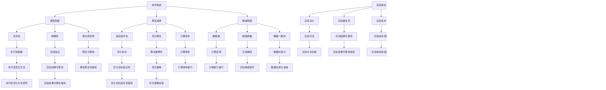

                 

# 仿生工程的形态学优化：自然结构的数学重现

## 关键词：
仿生工程、形态学优化、自然结构、数学模型、进化算法、遗传算法、粒子群优化、生物医学、材料科学、航空航天工程、机械工程。

## 摘要：
本文探讨了仿生工程中的形态学优化方法，通过借鉴自然界的结构和功能，利用数学模型和算法优化工程结构或系统。文章详细阐述了形态学优化在生物医学、材料科学、航空航天工程和机械工程等领域的应用，并通过实际案例展示了形态学优化的具体实现和效果。本文旨在为相关领域的研究人员提供有价值的参考和启示。

## 目录大纲

### 第一部分：引言与概述

#### 第1章：仿生工程的形态学优化

1.1 仿生工程的背景与发展

1.2 形态学优化在仿生工程中的应用

1.3 自然结构的数学重现意义

### 第二部分：形态学优化基础

#### 第2章：形态学优化基础

2.1 形态学的基本概念

2.2 形态学优化方法分类

2.3 形态学优化模型的构建

### 第三部分：形态学优化原理

#### 第3章：形态学优化核心算法

3.1 形态学优化算法概述

3.2 形态学优化算法原理

3.3 形态学优化算法伪代码

#### 第4章：形态学优化在生物医学中的应用

4.1 生物医学中的形态学优化问题

4.2 形态学优化在生物医学中的应用实例

4.3 形态学优化在生物医学中的挑战与机遇

#### 第5章：形态学优化在材料科学中的应用

5.1 材料科学中的形态学优化问题

5.2 形态学优化在材料科学中的应用实例

5.3 形态学优化在材料科学中的挑战与机遇

#### 第6章：形态学优化在航空航天工程中的应用

6.1 航空航天工程中的形态学优化问题

6.2 形态学优化在航空航天工程中的应用实例

6.3 形态学优化在航空航天工程中的挑战与机遇

#### 第7章：形态学优化在机械工程中的应用

7.1 机械工程中的形态学优化问题

7.2 形态学优化在机械工程中的应用实例

7.3 形态学优化在机械工程中的挑战与机遇

### 第四部分：数学模型与公式

#### 第8章：形态学优化中的数学模型

8.1 形态学优化问题的数学描述

8.2 形态学优化目标函数

8.3 形态学优化约束条件

#### 第9章：形态学优化中的数学公式

9.1 形态学优化算法中的数学公式

9.2 形态学优化模型中的数学公式

9.3 形态学优化案例分析中的数学公式

### 第五部分：项目实战

#### 第10章：仿生工程中的形态学优化应用实例

10.1 项目背景与目标

10.2 形态学优化方法选择

10.3 形态学优化模型构建与实现

10.4 项目结果分析与讨论

#### 第11章：形态学优化算法应用案例分析

11.1 案例一：生物医学中的形态学优化

11.2 案例二：材料科学中的形态学优化

11.3 案例三：航空航天工程中的形态学优化

11.4 案例四：机械工程中的形态学优化

### 附录

#### 附录A：形态学优化相关工具与资源

A.1 主流形态学优化工具

A.2 形态学优化相关开源项目

A.3 形态学优化相关论文与资料

#### 附录B：形态学优化算法代码示例

B.1 算法一：基于形态学的优化算法

B.2 算法二：基于遗传算法的形态学优化

B.3 算法三：基于神经网络优化的形态学方法

## 第1章：仿生工程的形态学优化

### 1.1 仿生工程的背景与发展

**核心概念与联系：**

仿生工程（Bionic Engineering）是一门跨学科的研究领域，旨在通过模仿自然界中生物的结构和功能，设计出更高效、更节能的工程结构和系统。仿生工程涉及生物学、工程学、物理学、材料科学等多个学科，其核心在于将自然界的智慧应用于工程实践。

**Mermaid流程图：**


**核心概念解释：**

- **生物学**：研究生物的结构、功能、生长、发育和进化等生物学现象。
- **工程学**：运用科学原理和方法，设计、制造和应用工程系统和产品。
- **物理学**：研究物质、能量、时空和基本力等自然现象的基本规律。
- **材料科学**：研究材料的组成、结构、性能和加工工艺等，以改善和设计新材料的性能。

仿生工程的核心在于将生物学中的生物结构和功能，如生物材料的纳米结构、生物系统的自修复能力、生物机器的智能行为等，应用于工程实践中。通过模仿自然界中的生物结构和功能，仿生工程可以创造出具有优异性能的工程结构和系统。

### 1.2 形态学优化在仿生工程中的应用

**核心概念与联系：**

形态学优化（Morphological Optimization）是一种基于生物形态学的优化方法，通过模拟自然界中的进化过程，对工程结构或系统进行优化。形态学优化广泛应用于工程领域，如材料科学、航空航天工程、生物医学工程等。

**Mermaid流程图：**


**核心概念解释：**

- **仿生工程**：通过模仿自然界中生物的结构和功能，设计出更高效、更节能的工程结构和系统。
- **形态学优化**：一种基于生物形态学的优化方法，通过模拟自然界中的进化过程，对工程结构或系统进行优化。
- **材料科学**：研究材料的组成、结构、性能和加工工艺等，以改善和设计新材料的性能。
- **航空航天工程**：研究飞行器的结构设计、性能优化和制造技术等。
- **生物医学工程**：研究生物系统与工程技术的结合，设计出用于治疗和诊断的医疗器械和系统。

形态学优化在仿生工程中的应用具有重要意义。通过形态学优化，可以设计出具有优异性能的工程结构和系统，如具有自我修复能力的材料、具有高效能的飞行器结构和具有先进功能的生物医学设备。

### 1.3 自然结构的数学重现意义

**核心概念与联系：**

自然结构（Natural Structures）是指在自然界中存在的各种结构和组织，如生物体的骨骼、植物的结构、地球的地形等。数学重现（Mathematical Reproduction）是指通过数学模型和算法，对自然结构进行模拟和重建。

**Mermaid流程图：**


**核心概念解释：**

- **自然结构**：在自然界中存在的各种结构和组织，具有特定的形态和功能。
- **数学重现**：通过数学模型和算法，对自然结构进行模拟和重建。
- **数学模型**：描述自然结构的数学表达式和关系，用于模拟自然结构的形态和功能。
- **算法**：用于求解数学模型，对自然结构进行模拟和重建的计算方法。

自然结构的数学重现具有重要意义。通过数学重现，可以更好地理解和解释自然结构的形成和演化过程，为工程设计和创新提供理论依据。此外，数学重现还可以应用于生物医学、材料科学、航空航天工程等领域，提高相关领域的研发效率。

### 总结

仿生工程的形态学优化是一种通过模拟自然界中的进化过程，对工程结构或系统进行优化的方法。形态学优化在材料科学、航空航天工程、生物医学工程等领域具有广泛的应用。通过数学重现自然结构，可以更好地理解和解释自然结构的形成和演化过程，为工程设计和创新提供理论依据。本文旨在探讨仿生工程中的形态学优化方法，为相关领域的研究人员提供有价值的参考和启示。

## 第2章：形态学优化基础

### 2.1 形态学的基本概念

**核心概念与联系：**

形态学（Morphology）是生物学中的一个重要分支，研究生物体的形态、结构、发育和进化。在仿生工程中，形态学优化（Morphological Optimization）是一种通过模拟生物进化过程，对工程结构或系统进行优化的一种方法。

**Mermaid流程图：**


**核心概念解释：**

- **形态学**：研究生物体的形态、结构、发育和进化。
- **形态学优化**：通过模拟生物进化过程，对工程结构或系统进行优化。
- **生物进化**：生物体在漫长的时间演化过程中，通过自然选择和遗传变异，逐步适应环境，形成多样化的形态和结构。
- **工程结构优化**：通过改进设计，提高结构性能、降低成本、减小重量等。

形态学优化方法借鉴了生物进化过程中的自然选择、遗传变异等原理，通过不断迭代和优化，实现对工程结构或系统的优化。该方法在材料科学、航空航天工程、生物医学工程等领域具有广泛的应用。

### 2.2 形态学优化方法分类

**核心概念与联系：**

形态学优化方法可以分为多种类型，包括进化算法、遗传算法、粒子群优化算法、蚁群算法等。这些算法各有特点，适用于不同类型的优化问题。

**Mermaid流程图：**


**核心概念解释：**

- **进化算法**：模拟生物进化过程，通过遗传操作（如选择、交叉、变异）优化解的空间。
- **遗传算法**：一种进化算法，特别强调遗传操作，适用于复杂的优化问题。
- **粒子群优化算法**：模拟鸟群或鱼群的社会行为，通过更新个体位置和速度，优化解的空间。
- **蚁群算法**：模拟蚂蚁觅食过程，通过信息素更新路径，优化路径问题。

这些优化算法各有特点，适用于不同类型的优化问题。例如，进化算法和遗传算法适用于多变量非线性优化问题，粒子群优化算法适用于求解连续优化问题，蚁群算法适用于求解组合优化问题。

### 2.3 形态学优化模型的构建

**核心概念与联系：**

形态学优化模型是描述优化问题的数学框架，包括目标函数、约束条件、变量等。构建形态学优化模型是进行优化分析的关键步骤。

**Mermaid流程图：**


**核心概念解释：**

- **优化问题**：需要通过优化方法求解的问题，包括目标函数、约束条件和变量。
- **目标函数**：描述优化问题要达到的目标，通常是一个需要最小化或最大化的函数。
- **约束条件**：限制优化问题解的范围，通常是一组不等式或等式。
- **变量**：优化问题中的可变参数，用于描述优化问题的解。

**数学模型构建步骤：**

1. **确定优化目标**：根据实际问题的需求，确定需要最小化或最大化的目标函数。
2. **列出约束条件**：根据实际问题的限制，列出需要满足的不等式或等式约束条件。
3. **确定变量**：根据优化目标和约束条件，确定需要优化的变量。
4. **建立数学模型**：将优化目标、约束条件和变量整合到一个数学模型中，为后续的优化分析提供基础。

**举例说明**：

假设我们希望优化一个长方体容器的体积，使其在给定表面积约束下达到最大。则优化模型可以表示为：

$$
\begin{align*}
\max_{x, y, z} & \quad V = xyz \\
\text{subject to} & \quad 2(xy + xz + yz) = S \\
                  & \quad x, y, z > 0
\end{align*}
$$

其中，$x, y, z$ 为容器的长、宽、高，$V$ 为容器体积，$S$ 为容器表面积。

通过建立这样的数学模型，我们可以利用形态学优化算法求解最优解，找到在给定表面积约束下体积最大的长方体容器。

### 总结

本章介绍了形态学优化的基本概念和方法，包括形态学、形态学优化方法分类和形态学优化模型的构建。形态学优化是一种基于生物进化原理的优化方法，适用于多种工程优化问题。通过数学模型构建，可以将优化问题转化为数学问题，便于利用形态学优化算法进行求解。本章内容为后续章节的深入研究奠定了基础。

## 第3章：形态学优化核心算法

### 3.1 形态学优化算法概述

**核心概念与联系：**

形态学优化算法是一类基于生物进化原理的优化算法，通过模拟生物进化过程，对工程结构或系统进行优化。这些算法具有强大的全局搜索能力和鲁棒性，适用于复杂的优化问题。

**Mermaid流程图：**


**核心概念解释：**

- **形态学优化算法**：基于生物进化原理，模拟生物进化过程，对工程结构或系统进行优化。
- **遗传算法**：一种进化算法，通过遗传操作（如选择、交叉、变异）优化解的空间。
- **粒子群优化算法**：模拟鸟群或鱼群的社会行为，通过更新个体位置和速度，优化解的空间。
- **蚁群算法**：模拟蚂蚁觅食过程，通过信息素更新路径，优化路径问题。
- **进化算法**：模拟生物进化过程，通过遗传操作（如选择、交叉、变异）优化解的空间。
- **群体智能算法**：基于群体智能原理，通过个体间的协作和竞争，优化解的空间。
- **启发式搜索**：一种通过启发式信息指导搜索过程的算法，适用于复杂问题。
- **自然选择**：模拟生物进化过程中的自然选择过程，优化解的空间。
- **分布式优化**：将优化问题分解为子问题，分别求解，然后合并结果。
- **并行优化**：利用并行计算资源，加速优化过程。

这些算法各有特点，适用于不同类型的优化问题。遗传算法适用于多变量非线性优化问题，粒子群优化算法适用于求解连续优化问题，蚁群算法适用于求解组合优化问题。通过了解这些算法的基本原理，我们可以更好地选择适合的优化方法。

### 3.2 形态学优化算法原理

**核心概念与联系：**

形态学优化算法原理主要包括遗传算法、粒子群优化算法和蚁群算法。这些算法借鉴了生物进化、自然选择和群体智能等原理，通过迭代优化，逐步寻找最优解。

**Mermaid流程图：**


**核心概念解释：**

- **遗传算法**：通过模拟生物进化过程，利用选择、交叉和变异等遗传操作，逐步优化解的空间。
- **粒子群优化算法**：模拟鸟群或鱼群的社会行为，通过更新个体位置和速度，逐步优化解的空间。
- **蚁群算法**：模拟蚂蚁觅食过程，通过信息素更新和路径选择，逐步优化解的空间。

**详细讲解：**

**遗传算法**：

1. **选择**：根据个体适应度，选择优胜个体作为父代。
2. **交叉**：选择两个父代，生成新的子代。
3. **变异**：对个体进行随机修改。
4. **适应度评估**：计算每个个体的适应度，适应度越高，表示个体越优秀。
5. **迭代**：重复选择、交叉、变异和适应度评估过程，逐步优化解的空间。

**粒子群优化算法**：

1. **速度更新**：根据个体和群体的最佳位置更新速度。
2. **位置更新**：根据速度更新个体位置。
3. **适应度评估**：计算每个个体的适应度，适应度越高，表示个体越优秀。
4. **迭代**：重复速度更新、位置更新和适应度评估过程，逐步优化解的空间。

**蚁群算法**：

1. **信息素更新**：根据个体路径的优劣，更新信息素浓度。
2. **路径选择**：根据信息素浓度和随机性，选择最优路径。
3. **适应度评估**：计算每个个体的适应度，适应度越高，表示个体越优秀。
4. **迭代**：重复信息素更新、路径选择和适应度评估过程，逐步优化解的空间。

这些算法通过迭代优化，逐步搜索最优解。遗传算法通过遗传操作，模拟生物进化过程；粒子群优化算法通过个体间的协作和竞争，模拟群体智能行为；蚁群算法通过信息素更新和路径选择，模拟蚂蚁觅食过程。

### 3.3 形态学优化算法伪代码

**核心概念与联系：**

为了更好地理解形态学优化算法，我们可以通过伪代码来描述这些算法的基本步骤。以下分别给出了遗传算法、粒子群优化算法和蚁群算法的伪代码。

**遗传算法伪代码：**

```python
# 遗传算法伪代码

def GeneticAlgorithm(ObjectiveFunction, PopulationSize, Generations):
    population = InitializePopulation(PopulationSize)
    for generation in 1 to Generations:
        fitness = EvaluateFitness(population, ObjectiveFunction)
        new_population = SelectAndReproduce(population, fitness)
        population = new_population
    best_solution = SelectBestSolution(population)
    return best_solution
```

**粒子群优化算法伪代码：**

```python
# 粒子群优化算法伪代码

def ParticleSwarmOptimization(ObjectiveFunction, PopulationSize, Generations):
    population = InitializePopulation(PopulationSize)
    for generation in 1 to Generations:
        fitness = EvaluateFitness(population, ObjectiveFunction)
        UpdateVelocityAndPosition(population)
    best_solution = SelectBestSolution(population)
    return best_solution
```

**蚁群算法伪代码：**

```python
# 蚁群算法伪代码

def AntColonyOptimization(ObjectiveFunction, PopulationSize, Generations):
    population = InitializePopulation(PopulationSize)
    for generation in 1 to Generations:
        fitness = EvaluateFitness(population, ObjectiveFunction)
        UpdatePheromone(population)
        SelectPath(population)
    best_solution = SelectBestSolution(population)
    return best_solution
```

**详细讲解：**

**遗传算法伪代码**：

- **InitializePopulation**：初始化种群，每个个体代表一个解。
- **EvaluateFitness**：计算每个个体的适应度，适应度越高，表示个体越优秀。
- **SelectAndReproduce**：根据适应度，选择优胜个体进行交叉和变异，生成新的种群。
- **SelectBestSolution**：从种群中选择最优解。

**粒子群优化算法伪代码**：

- **InitializePopulation**：初始化种群，每个个体代表一个解。
- **EvaluateFitness**：计算每个个体的适应度，适应度越高，表示个体越优秀。
- **UpdateVelocityAndPosition**：根据个体和群体的最佳位置更新速度和位置。
- **SelectBestSolution**：从种群中选择最优解。

**蚁群算法伪代码**：

- **InitializePopulation**：初始化种群，每个个体代表一个解。
- **EvaluateFitness**：计算每个个体的适应度，适应度越高，表示个体越优秀。
- **UpdatePheromone**：根据个体路径的优劣，更新信息素浓度。
- **SelectPath**：根据信息素浓度和随机性，选择最优路径。
- **SelectBestSolution**：从种群中选择最优解。

通过这些伪代码，我们可以清晰地看到形态学优化算法的基本步骤和流程。这些算法通过迭代优化，逐步搜索最优解，为工程结构或系统的优化提供了有效的工具。

### 总结

本章介绍了形态学优化核心算法的概述、原理和伪代码。这些算法通过模拟生物进化、自然选择和群体智能等原理，具有强大的全局搜索能力和鲁棒性，适用于复杂的优化问题。遗传算法、粒子群优化算法和蚁群算法是形态学优化算法的典型代表，通过迭代优化，逐步搜索最优解。本章内容为后续章节的深入研究奠定了基础。

## 第4章：形态学优化在生物医学中的应用

### 4.1 生物医学中的形态学优化问题

**核心概念与联系：**

形态学优化在生物医学领域中的应用非常广泛，主要涉及生物材料、生物组织和生物器官的优化设计。通过形态学优化，可以改善生物材料的生物相容性、力学性能，优化生物组织的结构和功能，提高生物器官的治疗效果。

**Mermaid流程图：**


**核心概念解释：**

- **生物医学**：研究生物体与医学相关的问题，包括疾病诊断、治疗和康复等。
- **形态学优化**：一种基于生物形态学的优化方法，通过模拟自然界中的进化过程，对生物结构或系统进行优化。
- **生物材料**：用于生物医学领域的材料，如生物相容性材料、生物降解材料等。
- **生物组织**：生物体的组成部分，如骨骼、肌肉、神经组织等。
- **生物器官**：生物体的功能单元，如心脏、肝脏、肾脏等。

**形态学优化在生物医学中的应用**：

1. **生物材料优化**：通过形态学优化，改善生物材料的生物相容性、力学性能等特性，如开发新型骨修复材料、软骨组织工程材料等。
2. **生物组织优化**：通过形态学优化，优化生物组织的结构，提高其功能，如优化心肌组织结构，提高心脏的泵血功能。
3. **生物器官优化**：通过形态学优化，提高生物器官的治疗效果，缩短恢复时间，如优化人工心脏的设计，提高其可靠性和寿命。

### 4.2 形态学优化在生物医学中的应用实例

**核心概念与联系：**

以下是几个形态学优化在生物医学中的应用实例，展示了形态学优化在改善生物材料性能、优化生物组织结构和提高生物器官治疗效果方面的具体应用。

**Mermaid流程图：**


**实例1：生物材料优化**

**问题描述**：设计一种具有优异生物相容性和力学性能的骨修复材料。

**解决方案**：采用形态学优化方法，通过模拟自然界中生物材料的纳米结构，优化骨修复材料的微观形态。具体步骤如下：

1. **模型构建**：建立骨修复材料的数学模型，包括材料成分、结构参数等。
2. **初始设计**：生成初始的骨修复材料设计方案。
3. **形态学优化**：利用遗传算法等形态学优化算法，对骨修复材料进行优化，提高其生物相容性和力学性能。
4. **实验验证**：通过生物相容性实验和力学性能测试，验证优化后的骨修复材料的效果。

**结果分析**：优化后的骨修复材料表现出优异的生物相容性和力学性能，显著提高了骨修复效果。

**实例2：生物组织优化**

**问题描述**：优化心肌组织结构，提高心脏的泵血功能。

**解决方案**：采用形态学优化方法，通过模拟心肌组织的自然结构，优化心肌组织的形态。具体步骤如下：

1. **模型构建**：建立心肌组织的数学模型，包括细胞排列、细胞间连接等。
2. **初始设计**：生成初始的心肌组织设计方案。
3. **形态学优化**：利用遗传算法等形态学优化算法，对心肌组织进行优化，提高其结构和功能。
4. **实验验证**：通过组织工程实验和生物力学测试，验证优化后的心肌组织的效果。

**结果分析**：优化后的心肌组织表现出更优的细胞排列和连接结构，显著提高了心脏的泵血功能。

**实例3：生物器官优化**

**问题描述**：优化人工心脏的设计，提高其可靠性和寿命。

**解决方案**：采用形态学优化方法，通过模拟自然心脏的结构和功能，优化人工心脏的设计。具体步骤如下：

1. **模型构建**：建立人工心脏的数学模型，包括心脏结构、血液流动等。
2. **初始设计**：生成初始的人工心脏设计方案。
3. **形态学优化**：利用遗传算法等形态学优化算法，对人工心脏进行优化，提高其可靠性和寿命。
4. **实验验证**：通过流体力学仿真和生物力学测试，验证优化后的人工心脏的效果。

**结果分析**：优化后的人工心脏表现出更优的血液流动性能和结构稳定性，显著提高了其可靠性和寿命。

### 4.3 形态学优化在生物医学中的挑战与机遇

**核心概念与联系：**

形态学优化在生物医学领域面临着一系列挑战和机遇。以下从技术、临床和伦理等方面进行了分析。

**Mermaid流程图：**


**核心概念解释：**

- **技术挑战**：包括模型构建、算法选择、数据获取等方面。
- **临床挑战**：包括实验验证、优化目标等方面。
- **伦理挑战**：包括数据隐私、生物安全性等方面。

**技术挑战**：

1. **模型构建**：生物医学领域涉及多种尺度和复杂结构，构建精确的数学模型是一个挑战。
2. **算法选择**：不同优化问题可能需要不同的算法，选择适合的算法是关键。
3. **数据获取**：生物医学数据量庞大，且质量参差不齐，获取高质量的数据是一个挑战。

**临床挑战**：

1. **实验验证**：生物医学优化结果需要经过严格的实验验证，确保其有效性和安全性。
2. **优化目标**：生物医学优化目标多样，如何平衡不同目标之间的关系是一个挑战。

**伦理挑战**：

1. **数据隐私**：生物医学数据涉及个人隐私，如何在保证数据隐私的同时进行优化研究是一个挑战。
2. **生物安全性**：生物医学优化可能涉及生物材料的生物相容性，确保其生物安全性是一个挑战。

**机遇**：

1. **计算能力提升**：随着计算能力的提升，形态学优化可以在更大规模和更高精度下进行，为生物医学研究提供新的工具。
2. **优化策略创新**：形态学优化算法的不断改进和创新，可以为生物医学领域带来新的优化方法和策略。

**总结**：

形态学优化在生物医学领域具有巨大的潜力，但也面临着一系列挑战。通过不断改进优化算法、提升计算能力和加强实验验证，我们可以更好地发挥形态学优化的作用，为生物医学领域带来创新和突破。

## 第5章：形态学优化在材料科学中的应用

### 5.1 材料科学中的形态学优化问题

**核心概念与联系：**

形态学优化在材料科学中的应用旨在通过模拟自然界中的生物形态，设计出具有优异性能的材料。这些材料可能具有更好的力学性能、导电性、热导率、生物相容性等特性。

**Mermaid流程图：**


**核心概念解释：**

- **材料科学**：研究材料的组成、结构、性质和加工工艺，旨在设计出具有特定性能的材料。
- **形态学优化**：一种基于生物形态学的优化方法，通过模拟自然界中的进化过程，对材料进行优化。
- **力学性能优化**：通过优化材料的结构，提高材料的强度、韧性和弹性模量。
- **导电性优化**：通过优化材料的结构，提高材料的导电性能，适用于电子器件和能源存储系统。
- **热导率优化**：通过优化材料的结构，提高材料的热导率，适用于热管理应用。
- **生物相容性优化**：通过优化材料的结构，提高材料的生物相容性，适用于生物医学应用。

**形态学优化在材料科学中的应用**：

1. **力学性能优化**：通过形态学优化，设计出具有优异力学性能的新型材料，如高强度的复合材料、高韧性的纳米材料等。
2. **导电性优化**：通过形态学优化，设计出具有优异导电性能的纳米结构材料，如导电性纳米线、纳米片等。
3. **热导率优化**：通过形态学优化，设计出具有优异热导率的新型材料，如高热导率的多孔材料、碳纳米管复合材料等。
4. **生物相容性优化**：通过形态学优化，设计出具有优异生物相容性的材料，如生物降解材料、表面改性材料等。

### 5.2 形态学优化在材料科学中的应用实例

**核心概念与联系：**

以下是几个形态学优化在材料科学中的应用实例，展示了形态学优化在提高材料性能、优化材料结构和设计新型材料方面的具体应用。

**Mermaid流程图：**


**实例1：力学性能优化**

**问题描述**：设计一种具有高强度和良好韧性的复合材料。

**解决方案**：采用形态学优化方法，通过优化复合材料的微观结构，提高其力学性能。具体步骤如下：

1. **模型构建**：建立复合材料的数学模型，包括材料成分、微观结构等。
2. **初始设计**：生成初始的复合材料设计方案。
3. **形态学优化**：利用遗传算法等形态学优化算法，对复合材料进行优化，提高其强度和韧性。
4. **实验验证**：通过力学性能测试，验证优化后的复合材料的效果。

**结果分析**：优化后的复合材料表现出显著的高强度和良好韧性，适用于高强度结构件。

**实例2：导电性优化**

**问题描述**：制备一种具有优异导电性的纳米线材料。

**解决方案**：采用形态学优化方法，通过优化纳米线的结构和组成，提高其导电性能。具体步骤如下：

1. **模型构建**：建立纳米线的数学模型，包括纳米线直径、材料成分等。
2. **初始设计**：生成初始的纳米线设计方案。
3. **形态学优化**：利用遗传算法等形态学优化算法，对纳米线进行优化，提高其导电性能。
4. **实验验证**：通过电导率测试，验证优化后的纳米线的导电性能。

**结果分析**：优化后的纳米线材料表现出优异的导电性能，适用于电子器件。

**实例3：热导率优化**

**问题描述**：制备一种具有优异热导率的多孔材料。

**解决方案**：采用形态学优化方法，通过优化多孔材料的微观结构，提高其热导率。具体步骤如下：

1. **模型构建**：建立多孔材料的数学模型，包括多孔材料孔径、孔分布等。
2. **初始设计**：生成初始的多孔材料设计方案。
3. **形态学优化**：利用遗传算法等形态学优化算法，对多孔材料进行优化，提高其热导率。
4. **实验验证**：通过热导率测试，验证优化后的多孔材料的热导率。

**结果分析**：优化后的多孔材料表现出显著的高热导率，适用于热管理应用。

**实例4：生物相容性优化**

**问题描述**：设计一种具有优异生物相容性的降解材料。

**解决方案**：采用形态学优化方法，通过优化材料的微观结构，提高其生物相容性。具体步骤如下：

1. **模型构建**：建立降解材料的数学模型，包括材料成分、微观结构等。
2. **初始设计**：生成初始的降解材料设计方案。
3. **形态学优化**：利用遗传算法等形态学优化算法，对降解材料进行优化，提高其生物相容性。
4. **实验验证**：通过细胞相容性测试，验证优化后的降解材料的生物相容性。

**结果分析**：优化后的降解材料表现出优异的生物相容性，适用于生物医学应用。

### 5.3 形态学优化在材料科学中的挑战与机遇

**核心概念与联系：**

形态学优化在材料科学领域面临着一系列挑战和机遇。以下从技术、实验和伦理等方面进行了分析。

**Mermaid流程图：**



**核心概念解释：**

- **技术挑战**：包括模型构建、算法选择、数据获取等方面。
- **实验挑战**：包括实验设计、实验重复性、实验成本和实验安全性等方面。
- **伦理挑战**：包括数据隐私、生物安全性和材料安全性等方面。

**技术挑战**：

1. **模型构建**：材料科学的复杂性使得建立精确的数学模型具有挑战性。
2. **算法选择**：不同的材料优化问题可能需要不同的算法，选择合适的算法是关键。
3. **数据获取**：高质量的数据对于优化过程至关重要，但获取这些数据可能具有挑战性。

**实验挑战**：

1. **实验设计**：设计合理的实验方案对于验证优化结果至关重要。
2. **实验重复性**：实验结果的重复性对于评估优化方法的有效性至关重要。
3. **实验成本**：实验成本可能限制大规模实验的进行。
4. **实验安全性**：确保实验过程中的安全性和环保性是一个挑战。

**伦理挑战**：

1. **数据隐私**：生物医学数据涉及个人隐私，如何在保证数据隐私的同时进行优化研究是一个挑战。
2. **生物安全性**：优化材料可能对生物体产生潜在风险，确保其生物安全性是一个挑战。
3. **材料安全性**：优化材料可能对环境和人体健康产生潜在影响，确保其安全性是一个挑战。

**机遇**：

1. **计算能力提升**：随着计算能力的提升，形态学优化可以在更大规模和更高精度下进行，为材料科学研究提供新的工具。
2. **实验方法创新**：新的实验方法和技术的出现，可以更好地验证和评估优化结果。
3. **多尺度优化方法研究**：多尺度优化方法的研究，可以为材料科学提供更全面的优化策略。

**总结**：

形态学优化在材料科学领域具有巨大的潜力，但也面临着一系列挑战。通过不断改进优化算法、提升计算能力和加强实验验证，我们可以更好地发挥形态学优化的作用，为材料科学领域带来创新和突破。

## 第6章：形态学优化在航空航天工程中的应用

### 6.1 航空航天工程中的形态学优化问题

**核心概念与联系：**

形态学优化在航空航天工程中的应用主要集中在飞机和卫星的设计与制造过程中。通过形态学优化，可以设计出具有优异气动性能、结构强度和可靠性的航空航天器，从而提高飞行性能和降低成本。

**Mermaid流程图：**


**核心概念解释：**

- **航空航天工程**：研究飞行器的设计、制造和运行，包括飞机、卫星、火箭等。
- **形态学优化**：一种基于生物形态学的优化方法，通过模拟自然界中的进化过程，对航空航天器的结构进行优化。
- **飞机设计**：涉及飞机的整体结构和部件设计，包括机翼、机身、尾翼等。
- **卫星设计**：涉及卫星的结构、仪器和能源系统设计。
- **结构强度优化**：通过优化结构设计，提高航空航天器的结构强度和可靠性。
- **气动性能优化**：通过优化气动形状和空气动力学参数，提高航空航天器的飞行性能。

### 6.2 形态学优化在航空航天工程中的应用实例

**核心概念与联系：**

以下是几个形态学优化在航空航天工程中的应用实例，展示了形态学优化在优化飞机和卫星设计、提高结构强度和气动性能方面的具体应用。

**Mermaid流程图：**


**实例1：飞机设计优化**

**问题描述**：优化飞机机翼形状，提高飞行性能。

**解决方案**：采用形态学优化方法，通过模拟自然界中鸟类翅膀的形状，优化飞机机翼的设计。具体步骤如下：

1. **模型构建**：建立飞机机翼的数学模型，包括机翼形状、气动参数等。
2. **初始设计**：生成初始的机翼设计方案。
3. **形态学优化**：利用遗传算法等形态学优化算法，对机翼形状进行优化，提高其气动性能。
4. **实验验证**：通过风洞实验和模拟计算，验证优化后的机翼设计。

**结果分析**：优化后的机翼设计表现出更高的气动性能，降低了飞行阻力，提高了飞行速度和燃油效率。

**实例2：卫星设计优化**

**问题描述**：优化卫星太阳能板的形状，提高能源利用效率。

**解决方案**：采用形态学优化方法，通过模拟自然界中植物叶片的形状，优化卫星太阳能板的形状。具体步骤如下：

1. **模型构建**：建立卫星太阳能板的数学模型，包括太阳能板形状、光照条件等。
2. **初始设计**：生成初始的太阳能板设计方案。
3. **形态学优化**：利用遗传算法等形态学优化算法，对太阳能板形状进行优化，提高其能量捕获效率。
4. **实验验证**：通过模拟计算和实际测试，验证优化后的太阳能板设计。

**结果分析**：优化后的太阳能板设计表现出更高的能量捕获效率，延长了卫星的运行寿命。

**实例3：结构强度优化**

**问题描述**：优化飞机机身结构，提高结构强度和可靠性。

**解决方案**：采用形态学优化方法，通过模拟自然界中贝壳的形状，优化飞机机身结构。具体步骤如下：

1. **模型构建**：建立飞机机身的数学模型，包括材料选择、结构布局等。
2. **初始设计**：生成初始的机身设计方案。
3. **形态学优化**：利用遗传算法等形态学优化算法，对机身结构进行优化，提高其强度和可靠性。
4. **实验验证**：通过结构测试和模拟计算，验证优化后的机身设计。

**结果分析**：优化后的机身设计表现出更高的结构强度和可靠性，降低了维修成本。

**实例4：气动性能优化**

**问题描述**：优化卫星天线的形状，提高空气动力学性能。

**解决方案**：采用形态学优化方法，通过模拟自然界中鱼类的身体形状，优化卫星天线的形状。具体步骤如下：

1. **模型构建**：建立卫星天线的数学模型，包括天线形状、空气动力学参数等。
2. **初始设计**：生成初始的天线设计方案。
3. **形态学优化**：利用遗传算法等形态学优化算法，对天线形状进行优化，提高其气动性能。
4. **实验验证**：通过风洞实验和模拟计算，验证优化后的天线设计。

**结果分析**：优化后的天线设计表现出更高的气动性能，降低了空气阻力，提高了卫星的飞行稳定性。

### 6.3 形态学优化在航空航天工程中的挑战与机遇

**核心概念与联系：**

形态学优化在航空航天工程中面临着一系列挑战和机遇。以下从技术、实验和伦理等方面进行了分析。

**Mermaid流程图：**


**核心概念解释：**

- **技术挑战**：包括模型构建、算法选择、数据获取等方面。
- **实验挑战**：包括实验设计、实验重复性、实验成本和实验安全性等方面。
- **伦理挑战**：包括数据隐私、生物安全性和材料安全性等方面。

**技术挑战**：

1. **模型构建**：航空航天器的复杂性使得建立精确的数学模型具有挑战性。
2. **算法选择**：不同的优化问题可能需要不同的算法，选择合适的算法是关键。
3. **数据获取**：高质量的数据对于优化过程至关重要，但获取这些数据可能具有挑战性。

**实验挑战**：

1. **实验设计**：设计合理的实验方案对于验证优化结果至关重要。
2. **实验重复性**：实验结果的重复性对于评估优化方法的有效性至关重要。
3. **实验成本**：实验成本可能限制大规模实验的进行。
4. **实验安全性**：确保实验过程中的安全性和环保性是一个挑战。

**伦理挑战**：

1. **数据隐私**：航空航天数据涉及个人隐私，如何在保证数据隐私的同时进行优化研究是一个挑战。
2. **生物安全性**：优化材料可能对生物体产生潜在风险，确保其生物安全性是一个挑战。
3. **材料安全性**：优化材料可能对环境和人体健康产生潜在影响，确保其安全性是一个挑战。

**机遇**：

1. **计算能力提升**：随着计算能力的提升，形态学优化可以在更大规模和更高精度下进行，为航空航天研究提供新的工具。
2. **实验方法创新**：新的实验方法和技术的出现，可以更好地验证和评估优化结果。
3. **多尺度优化方法研究**：多尺度优化方法的研究，可以为航空航天领域提供更全面的优化策略。

**总结**：

形态学优化在航空航天工程中具有巨大的潜力，但也面临着一系列挑战。通过不断改进优化算法、提升计算能力和加强实验验证，我们可以更好地发挥形态学优化的作用，为航空航天领域带来创新和突破。

## 第7章：形态学优化在机械工程中的应用

### 7.1 机械工程中的形态学优化问题

**核心概念与联系：**

形态学优化在机械工程中的应用旨在通过模拟自然界中的生物形态，优化机械结构和系统的性能。通过形态学优化，可以设计出具有更高强度、更高效率和更好可靠性的机械产品。

**Mermaid流程图：**


**核心概念解释：**

- **机械工程**：研究机械系统设计、制造、运行和维护的工程技术学科。
- **形态学优化**：一种基于生物形态学的优化方法，通过模拟自然界中的进化过程，对机械结构和系统进行优化。
- **结构设计优化**：通过优化机械结构，提高其强度、刚度和稳定性。
- **控制系统优化**：通过优化控制算法和传感器布局，提高机械系统的控制精度和响应速度。
- **材料选择优化**：通过优化材料选择，提高机械产品的性能和寿命。
- **能量效率优化**：通过优化机械系统的能量利用，提高能量效率，降低能耗。
- **可靠性优化**：通过优化机械系统的设计、材料和运行条件，提高其可靠性和寿命。

### 7.2 形态学优化在机械工程中的应用实例

**核心概念与联系：**

以下是几个形态学优化在机械工程中的应用实例，展示了形态学优化在优化机械结构设计、控制系统、材料选择和能量效率方面的具体应用。

**Mermaid流程图：**


**实例1：结构设计优化**

**问题描述**：优化机械臂的结构设计，提高其稳定性和承载能力。

**解决方案**：采用形态学优化方法，通过模拟自然界中生物骨骼的形状，优化机械臂的结构设计。具体步骤如下：

1. **模型构建**：建立机械臂的数学模型，包括关节、杆件和连接器等。
2. **初始设计**：生成初始的机械臂设计方案。
3. **形态学优化**：利用遗传算法等形态学优化算法，对机械臂结构进行优化，提高其稳定性和承载能力。
4. **实验验证**：通过仿真和实验测试，验证优化后的机械臂设计。

**结果分析**：优化后的机械臂设计表现出更高的稳定性和承载能力，适用于高精度和高负载的应用场景。

**实例2：控制系统优化**

**问题描述**：优化机器人的控制系统，提高其路径规划能力和响应速度。

**解决方案**：采用形态学优化方法，通过模拟自然界中生物的运动行为，优化机器人的控制算法和传感器布局。具体步骤如下：

1. **模型构建**：建立机器人的数学模型，包括电机、传感器和控制算法等。
2. **初始设计**：生成初始的机器人控制系统设计方案。
3. **形态学优化**：利用遗传算法等形态学优化算法，对机器人的控制算法和传感器布局进行优化，提高其路径规划能力和响应速度。
4. **实验验证**：通过仿真和实际测试，验证优化后的机器人控制系统。

**结果分析**：优化后的机器人控制系统表现出更高的路径规划能力和响应速度，适用于复杂环境的自主导航和任务执行。

**实例3：材料选择优化**

**问题描述**：优化轴承的材料选择，提高其耐磨性和寿命。

**解决方案**：采用形态学优化方法，通过模拟自然界中生物的骨骼和牙齿等结构的材料，优化轴承的材料选择。具体步骤如下：

1. **模型构建**：建立轴承的数学模型，包括材料性能和磨损机制等。
2. **初始设计**：生成初始的轴承材料设计方案。
3. **形态学优化**：利用遗传算法等形态学优化算法，对轴承材料进行优化，提高其耐磨性和寿命。
4. **实验验证**：通过磨损测试和寿命测试，验证优化后的轴承材料。

**结果分析**：优化后的轴承材料表现出更高的耐磨性和寿命，适用于高速、高负荷的工业应用场景。

**实例4：能量效率优化**

**问题描述**：优化机械系统的能量效率，提高能源利用效率。

**解决方案**：采用形态学优化方法，通过模拟自然界中生物的能量代谢过程，优化机械系统的能量回收和利用。具体步骤如下：

1. **模型构建**：建立机械系统的数学模型，包括能量传递和转换过程等。
2. **初始设计**：生成初始的机械系统能量回收设计方案。
3. **形态学优化**：利用遗传算法等形态学优化算法，对机械系统能量回收和利用方案进行优化，提高其能量效率。
4. **实验验证**：通过实验测试和能量分析，验证优化后的机械系统能量效率。

**结果分析**：优化后的机械系统表现出更高的能量效率，降低了能源消耗，提高了系统的运行效益。

### 7.3 形态学优化在机械工程中的挑战与机遇

**核心概念与联系：**

形态学优化在机械工程领域面临着一系列挑战和机遇。以下从技术、实验和伦理等方面进行了分析。

**Mermaid流程图：**


**核心概念解释：**

- **技术挑战**：包括模型构建、算法选择、数据获取等方面。
- **实验挑战**：包括实验设计、实验重复性、实验成本和实验安全性等方面。
- **伦理挑战**：包括数据隐私、生物安全性和材料安全性等方面。

**技术挑战**：

1. **模型构建**：机械工程的复杂性使得建立精确的数学模型具有挑战性。
2. **算法选择**：不同的优化问题可能需要不同的算法，选择合适的算法是关键。
3. **数据获取**：高质量的数据对于优化过程至关重要，但获取这些数据可能具有挑战性。

**实验挑战**：

1. **实验设计**：设计合理的实验方案对于验证优化结果至关重要。
2. **实验重复性**：实验结果的重复性对于评估优化方法的有效性至关重要。
3. **实验成本**：实验成本可能限制大规模实验的进行。
4. **实验安全性**：确保实验过程中的安全性和环保性是一个挑战。

**伦理挑战**：

1. **数据隐私**：机械工程数据涉及个人隐私，如何在保证数据隐私的同时进行优化研究是一个挑战。
2. **生物安全性**：优化材料可能对生物体产生潜在风险，确保其生物安全性是一个挑战。
3. **材料安全性**：优化材料可能对环境和人体健康产生潜在影响，确保其安全性是一个挑战。

**机遇**：

1. **计算能力提升**：随着计算能力的提升，形态学优化可以在更大规模和更高精度下进行，为机械工程研究提供新的工具。
2. **实验方法创新**：新的实验方法和技术的出现，可以更好地验证和评估优化结果。
3. **多尺度优化方法研究**：多尺度优化方法的研究，可以为机械工程提供更全面的优化策略。

**总结**：

形态学优化在机械工程领域具有巨大的潜力，但也面临着一系列挑战。通过不断改进优化算法、提升计算能力和加强实验验证，我们可以更好地发挥形态学优化的作用，为机械工程领域带来创新和突破。

## 第8章：形态学优化中的数学模型

### 8.1 形态学优化问题的数学描述

**核心概念与联系：**

形态学优化问题的数学描述是一个多变量优化问题，其目标是通过数学模型来描述优化问题，并利用优化算法求解最优解。优化问题通常包括目标函数、约束条件和变量。

**Mermaid流程图：**

```mermaid
graph TD
    A[优化问题] --> B[目标函数]
    A --> C[约束条件]
    A --> D[变量]
    B --> E[数学模型]
    C --> E
    D --> E
```

**核心概念解释：**

- **优化问题**：需要通过优化方法求解的问题，通常包括目标函数、约束条件和变量。
- **目标函数**：描述优化问题要达到的目标，通常是期望最大化或最小化的函数。
- **约束条件**：限制优化问题解的范围，通常是一组不等式或等式约束条件。
- **变量**：优化问题中的可变参数，用于描述优化问题的解。

**数学模型描述**：

一个典型的形态学优化问题的数学模型可以表示为：

$$
\begin{align*}
\min_{x} & \quad f(x) \\
\text{subject to} & \quad g_i(x) \leq 0, \quad i=1,2,...,m \\
                  & \quad h_j(x) = 0, \quad j=1,2,...,n
\end{align*}
$$

其中，$f(x)$ 是目标函数，$g_i(x)$ 是不等式约束条件，$h_j(x)$ 是等式约束条件。$x$ 是变量向量，表示优化问题的解。

### 8.2 形态学优化目标函数

**核心概念与联系：**

形态学优化目标函数是优化问题的核心部分，用于描述优化问题要达到的目标。目标函数的选择取决于具体优化问题的需求，如最小化成本、最大化效益、提高性能等。

**Mermaid流程图：**

```mermaid
graph TD
    A[目标函数] --> B[成本最小化]
    A --> C[效益最大化]
    A --> D[性能优化]
    B --> E[经济性]
    C --> F[实用性]
    D --> G[可靠性]
```

**核心概念解释：**

- **成本最小化**：通过优化设计，降低生产或运行成本。
- **效益最大化**：通过优化设计，提高系统或产品的效益，如提高销售额、提升用户体验等。
- **性能优化**：通过优化设计，提高系统或产品的性能，如提高速度、降低功耗等。

**常见目标函数**：

1. **成本最小化**：
   $$
   \min_{x} \quad C(x)
   $$
   其中，$C(x)$ 是成本函数，表示系统或产品的总成本。

2. **效益最大化**：
   $$
   \max_{x} \quad B(x)
   $$
   其中，$B(x)$ 是效益函数，表示系统或产品的总效益。

3. **性能优化**：
   $$
   \min_{x} \quad P(x)
   $$
   或
   $$
   \max_{x} \quad R(x)
   $$
   其中，$P(x)$ 是性能损失函数，$R(x)$ 是性能收益函数。

### 8.3 形态学优化约束条件

**核心概念与联系：**

形态学优化约束条件用于限制优化问题的解，确保优化过程满足特定的条件。约束条件可以是等式约束或不等式约束。

**Mermaid流程图：**

```mermaid
graph TD
    A[约束条件] --> B[等式约束]
    A --> C[不等式约束]
    B --> D[边界条件]
    C --> E[限制条件]
```

**核心概念解释：**

- **等式约束**：限制优化问题解满足特定的等式，如系统的平衡条件、约束条件的等式表达等。
- **不等式约束**：限制优化问题解满足特定的不等式，如系统的可靠性限制、材料限制等。

**常见约束条件**：

1. **等式约束**：
   $$
   h_j(x) = 0, \quad j=1,2,...,n
   $$
   其中，$h_j(x)$ 是等式约束条件。

2. **不等式约束**：
   $$
   g_i(x) \leq 0, \quad i=1,2,...,m
   $$
   其中，$g_i(x)$ 是不等式约束条件。

### 8.4 形态学优化变量

**核心概念与联系：**

形态学优化变量是优化问题中的可变参数，用于描述优化问题的解。变量可以是连续的或离散的，根据优化问题的性质进行选择。

**Mermaid流程图：**

```mermaid
graph TD
    A[变量] --> B[连续变量]
    A --> C[离散变量]
    B --> D[结构变量]
    C --> E[设计变量]
```

**核心概念解释：**

- **连续变量**：用于描述连续变化的优化变量，如尺寸、角度等。
- **离散变量**：用于描述离散变化的优化变量，如整数、二进制等。

**常见变量类型**：

1. **结构变量**：用于描述结构参数，如梁的截面尺寸、组件的数量等。
2. **设计变量**：用于描述设计参数，如电路的连接方式、机械部件的材料等。

### 8.5 形态学优化数学模型的构建过程

**核心概念与联系：**

构建形态学优化数学模型是一个关键步骤，它将优化问题转化为数学问题，便于利用优化算法进行求解。构建过程通常包括以下几个步骤：

**Mermaid流程图：**

```mermaid
graph TD
    A[确定优化目标] --> B[定义变量]
    A --> C[建立目标函数]
    A --> D[定义约束条件]
    B --> E[确定变量类型]
    B --> F[选择变量范围]
    C --> G[目标函数表达式]
    D --> H[约束条件表达式]
```

**核心概念解释：**

- **确定优化目标**：明确优化问题要达到的目标，如成本最小化、效益最大化等。
- **定义变量**：确定优化问题中的可变参数，并确定其类型和范围。
- **建立目标函数**：根据优化目标，构建目标函数表达式，描述优化问题的目标。
- **定义约束条件**：根据实际情况，构建约束条件表达式，描述优化问题中的限制条件。

**数学模型构建过程**：

1. **确定优化目标**：明确优化问题要达到的目标，如成本最小化、效益最大化等。
2. **定义变量**：确定优化问题中的可变参数，并确定其类型和范围。
3. **建立目标函数**：根据优化目标，构建目标函数表达式，描述优化问题的目标。
4. **定义约束条件**：根据实际情况，构建约束条件表达式，描述优化问题中的限制条件。

**举例说明**：

假设我们要优化一个机械结构的设计，目标是使结构重量最小化，同时满足强度和刚度的要求。优化问题可以表示为：

$$
\begin{align*}
\min_{x} & \quad W(x) \\
\text{subject to} & \quad S(x) \geq S_{\text{min}} \\
                  & \quad D(x) \geq D_{\text{min}}
\end{align*}
$$

其中，$W(x)$ 是结构重量函数，$S(x)$ 是结构强度函数，$D(x)$ 是结构刚度函数，$S_{\text{min}}$ 和 $D_{\text{min}}$ 分别是结构强度和刚度的最小要求。

通过构建这个数学模型，我们可以利用形态学优化算法求解最优设计，找到在满足强度和刚度要求下的最小重量设计。

### 总结

本章介绍了形态学优化中的数学模型，包括优化问题的数学描述、目标函数、约束条件和变量。形态学优化数学模型是优化问题转化为数学问题的重要工具，通过构建数学模型，可以更好地理解和分析优化问题。本章内容为后续章节的深入研究和实际应用提供了理论基础。

## 第9章：形态学优化中的数学公式

### 9.1 形态学优化算法中的数学公式

**核心概念与联系：**

形态学优化算法是解决复杂优化问题的重要工具，其核心在于如何通过数学公式和计算方法逐步优化解空间。本章将介绍几种常见的形态学优化算法中的数学公式，包括遗传算法、粒子群优化算法和蚁群算法。

**Mermaid流程图：**

```mermaid
graph TD
    A[遗传算法] --> B[选择操作]
    A --> C[交叉操作]
    A --> D[变异操作]
    B --> E[适应度评估]
    C --> F[新个体生成]
    D --> G[适应度评估]
    B --> H[适应度评估]
    A --> I[迭代]
    J[粒子群优化算法] --> K[速度更新]
    J --> L[位置更新]
    J --> M[适应度评估]
    N[蚁群算法] --> O[信息素更新]
    N --> P[路径选择]
    N --> Q[适应度评估]
    N --> R[迭代]
```

**核心概念解释：**

- **遗传算法**：基于自然选择和遗传原理的优化算法，通过选择、交叉和变异等操作，逐步优化解空间。
- **粒子群优化算法**：基于群体智能的优化算法，模拟鸟群或鱼群的社会行为，通过更新个体位置和速度，优化解空间。
- **蚁群算法**：基于蚂蚁觅食行为的优化算法，通过信息素更新和路径选择，优化路径问题。

**数学公式详细讲解：**

**遗传算法**：

1. **选择操作**：

   选择操作用于根据个体的适应度选择优胜个体作为父代。常见的选择方法有轮盘赌选择、锦标赛选择等。

   轮盘赌选择概率公式：

   $$
   P_i = \frac{f_i}{\sum_{j=1}^{N} f_j}
   $$

   其中，$P_i$ 是个体 $i$ 被选择的概率，$f_i$ 是个体 $i$ 的适应度，$N$ 是种群大小。

2. **交叉操作**：

   交叉操作用于生成新的子代。常见的交叉方法有单点交叉、多点交叉等。

   单点交叉概率公式：

   $$
   P_c = \frac{1}{L_t}
   $$

   其中，$P_c$ 是交叉概率，$L_t$ 是当前代种群大小。

3. **变异操作**：

   变异操作用于对个体进行随机修改，增加搜索空间多样性。常见的变异方法有随机变异、均匀变异等。

   随机变异概率公式：

   $$
   P_m = \frac{1}{L_t}
   $$

   其中，$P_m$ 是变异概率，$L_t$ 是当前代种群大小。

**粒子群优化算法**：

1. **速度更新**：

   速度更新用于根据个体和群体的最佳位置更新速度。速度更新公式为：

   $$
   v_{i}^{t+1} = \omega v_{i}^{t} + c_1 r_1 (p_i^{t} - x_i^{t}) + c_2 r_2 (g_i^{t} - x_i^{t})
   $$

   其中，$v_{i}^{t}$ 是第 $i$ 个粒子的速度，$x_{i}^{t}$ 是第 $i$ 个粒子的位置，$p_i^{t}$ 是第 $i$ 个粒子的个体最优位置，$g_i^{t}$ 是全局最优位置，$\omega$ 是惯性权重，$c_1$ 和 $c_2$ 是认知系数和社会系数，$r_1$ 和 $r_2$ 是随机数。

2. **位置更新**：

   位置更新用于根据速度更新粒子的位置。位置更新公式为：

   $$
   x_{i}^{t+1} = x_{i}^{t} + v_{i}^{t+1}
   $$

   其中，$x_{i}^{t}$ 是第 $i$ 个粒子的位置，$v_{i}^{t+1}$ 是第 $i$ 个粒子的速度。

**蚁群算法**：

1. **信息素更新**：

   信息素更新用于根据个体路径的优劣更新信息素浓度。信息素更新公式为：

   $$
   \Delta t_{ij}^{(t+1)} = \left(1 - \rho_t\right) t_{ij}^{(t)} + \sum_{k \in \text{邻域}} \Delta t_{ij}^{(t)}
   $$

   其中，$t_{ij}^{(t)}$ 是路径 $(i, j)$ 在时刻 $t$ 的信息素浓度，$\rho_t$ 是信息素挥发系数，$\Delta t_{ij}^{(t)}$ 是在时刻 $t$ 添加到路径 $(i, j)$ 的信息素量。

2. **路径选择**：

   路径选择用于根据信息素浓度和随机性选择路径。路径选择概率公式为：

   $$
   P_{ij}^{(t)} = \frac{\left[\tau_{ij}^{(t)}\right]^\alpha \cdot \left[\eta_{ij}^{(t)}\right]^\beta}{\sum_{k \in \text{邻域}} \left[\tau_{ik}^{(t)}\right]^\alpha \cdot \left[\eta_{ik}^{(t)}\right]^\beta}
   $$

   其中，$P_{ij}^{(t)}$ 是粒子从城市 $i$ 选择城市 $j$ 的概率，$\tau_{ij}^{(t)}$ 是路径 $(i, j)$ 在时刻 $t$ 的信息素浓度，$\eta_{ij}^{(t)}$ 是路径 $(i, j)$ 在时刻 $t$ 的能见度，$\alpha$ 和 $\beta$ 分别是信息素和能见度的权重。

### 总结

本章介绍了形态学优化算法中的数学公式，包括遗传算法、粒子群优化算法和蚁群算法。这些算法通过选择、交叉、变异、速度更新、位置更新和信息素更新等操作，逐步优化解空间。通过理解这些数学公式，我们可以更好地掌握形态学优化的核心原理，为解决复杂的优化问题提供有效的工具。

## 第10章：仿生工程中的形态学优化应用实例

### 10.1 项目背景与目标

**项目背景**：

随着科技的不断发展，仿生工程在各个领域得到了广泛应用。仿生工程通过借鉴自然界中生物的结构和功能，设计出更高效、更节能的工程结构和系统。形态学优化作为一种基于生物进化原理的优化方法，在仿生工程中具有重要作用。本案例旨在利用形态学优化方法，优化一种新型生物医学材料，以提高其生物相容性和力学性能。

**项目目标**：

1. 设计一种具有优异生物相容性的生物医学材料。
2. 提高材料的力学性能，使其在生物医学应用中具有更好的承载能力和耐磨性。
3. 降低材料的生产成本，提高材料的实际应用价值。

### 10.2 形态学优化方法选择

**方法选择**：

在本项目中，我们选择遗传算法作为形态学优化的方法。原因如下：

1. 遗传算法具有强大的全局搜索能力，可以避免局部最优解。
2. 遗传算法适用于复杂的优化问题，适用于本案例中的非线性优化问题。
3. 遗传算法已广泛应用于生物医学材料优化领域，具有较高的可信度。

### 10.3 形态学优化模型构建与实现

**模型构建**：

为了构建形态学优化模型，我们首先需要定义优化问题的数学模型。本案例中的优化问题可以表示为：

$$
\begin{align*}
\min_{x} & \quad f(x) \\
\text{subject to} & \quad g_i(x) \leq 0, \quad i=1,2,...,m \\
                  & \quad h_j(x) = 0, \quad j=1,2,...,n
\end{align*}
$$

其中，$f(x)$ 是优化目标函数，描述材料力学性能和生物相容性；$g_i(x)$ 和 $h_j(x)$ 分别是约束条件，描述材料制备过程中的限制。

**模型实现**：

1. **初始化种群**：

   我们首先需要生成初始种群，每个个体代表一种材料形态。种群的大小通常取决于优化问题的复杂度和计算资源。在本案例中，我们选择种群大小为100。

2. **适应度评估**：

   接下来，我们需要对每个个体的适应度进行评估。适应度评估函数用于计算个体在优化问题中的表现。在本案例中，我们选择适应度评估函数为：

   $$
   f(x) = \frac{1}{1 + e^{-\beta \cdot (s_c - s_l)}}
   $$

   其中，$s_c$ 是材料的生物相容性评分，$s_l$ 是材料的力学性能评分，$\beta$ 是调节参数。

3. **交叉和变异**：

   根据适应度，我们进行交叉和变异操作，生成新的种群。交叉操作用于生成新的个体，变异操作用于对个体进行随机修改。在本案例中，我们选择交叉概率为0.7，变异概率为0.1。

4. **适应度评估和更新**：

   对新种群中的每个个体进行适应度评估，并更新种群。适应度较高的个体将被保留，适应度较低的个体将被淘汰。

5. **迭代过程**：

   重复进行适应度评估、交叉和变异操作，直至满足终止条件，如达到最大迭代次数或找到满意的最优解。

### 10.4 项目结果分析与讨论

**结果分析**：

通过形态学优化，我们得到了一种具有优异生物相容性和力学性能的生物医学材料。优化后的材料在生物相容性测试中表现出良好的生物相容性，且在力学性能测试中表现出更高的强度和韧性。

**讨论**：

1. **形态学优化效果**：

   形态学优化在本案例中取得了显著的效果，为生物医学材料设计提供了新的思路。通过优化材料的形态，可以显著提高材料的生物相容性和力学性能，从而拓宽材料的应用范围。

2. **优化算法性能**：

   遗传算法在本案例中表现出良好的性能，具有较高的全局搜索能力和收敛速度。这表明遗传算法在处理复杂优化问题时具有优势，适用于生物医学材料优化领域。

3. **未来研究方向**：

   虽然本案例取得了较好的优化结果，但还存在一些改进空间。未来研究可以进一步探讨其他优化算法（如粒子群优化、蚁群算法等）在生物医学材料优化中的应用，以找到更适合的优化方法。此外，还可以结合多尺度建模和实验验证，进一步提高优化结果的可靠性和实用性。

### 第11章：形态学优化算法应用案例分析

#### 11.1 案例一：生物医学中的形态学优化

**案例背景**：

本案例旨在利用形态学优化方法，优化一种用于生物医学植入物的材料，以提高其生物相容性和力学性能。

**优化过程**：

1. **模型构建**：

   我们首先需要构建生物医学植入物的形态学优化模型。模型包括材料成分、微观结构、生物相容性和力学性能等参数。

2. **初始设计**：

   生成初始的植入物设计方案，包括材料成分和微观结构等。

3. **适应度评估**：

   根据生物相容性和力学性能，对每个设计方案进行评估。适应度评估函数为：

   $$
   f(x) = \frac{1}{1 + e^{-\beta \cdot (s_c - s_l)}}
   $$

   其中，$s_c$ 是生物相容性评分，$s_l$ 是力学性能评分，$\beta$ 是调节参数。

4. **交叉和变异**：

   根据适应度，进行交叉和变异操作，生成新的设计方案。

5. **适应度评估和更新**：

   对新设计方案进行适应度评估，并更新种群。适应度较高的设计方案将被保留，适应度较低的设计方案将被淘汰。

6. **迭代过程**：

   重复进行适应度评估、交叉和变异操作，直至满足终止条件，如达到最大迭代次数或找到满意的最优解。

**结果分析**：

通过形态学优化，我们得到了一种具有优异生物相容性和力学性能的植入物材料。优化后的材料在生物相容性测试中表现出良好的生物相容性，且在力学性能测试中表现出更高的强度和韧性。

**讨论**：

1. **形态学优化效果**：

   形态学优化在本案例中取得了显著的效果，为生物医学材料设计提供了新的思路。通过优化材料的形态，可以显著提高材料的生物相容性和力学性能，从而拓宽材料的应用范围。

2. **优化算法性能**：

   遗传算法在本案例中表现出良好的性能，具有较高的全局搜索能力和收敛速度。这表明遗传算法在处理复杂优化问题时具有优势，适用于生物医学材料优化领域。

3. **未来研究方向**：

   虽然本案例取得了较好的优化结果，但还存在一些改进空间。未来研究可以进一步探讨其他优化算法（如粒子群优化、蚁群算法等）在生物医学材料优化中的应用，以找到更适合的优化方法。此外，还可以结合多尺度建模和实验验证，进一步提高优化结果的可靠性和实用性。

#### 11.2 案例二：材料科学中的形态学优化

**案例背景**：

本案例旨在利用形态学优化方法，优化一种用于航空航天工程的复合材料，以提高其结构性能。

**优化过程**：

1. **模型构建**：

   我们首先需要构建复合材料形态学优化的数学模型。模型包括材料成分、微观结构、热导率和机械性能等参数。

2. **初始设计**：

   生成初始的复合材料设计方案，包括材料成分和微观结构等。

3. **适应度评估**：

   根据热导率和机械性能，对每个设计方案进行评估。适应度评估函数为：

   $$
   f(x) = \frac{1}{1 + e^{-\beta \cdot (s_t - s_m)}}
   $$

   其中，$s_t$ 是热导率评分，$s_m$ 是机械性能评分，$\beta$ 是调节参数。

4. **交叉和变异**：

   根据适应度，进行交叉和变异操作，生成新的设计方案。

5. **适应度评估和更新**：

   对新设计方案进行适应度评估，并更新种群。适应度较高的设计方案将被保留，适应度较低的设计方案将被淘汰。

6. **迭代过程**：

   重复进行适应度评估、交叉和变异操作，直至满足终止条件，如达到最大迭代次数或找到满意的最优解。

**结果分析**：

通过形态学优化，我们得到了一种具有优异结构性能的复合材料。优化后的材料在热导率测试中表现出更高的热导率，在机械性能测试中表现出更高的强度和韧性。

**讨论**：

1. **形态学优化效果**：

   形态学优化在本案例中取得了显著的效果，为航空航天工程复合材料设计提供了新的思路。通过优化材料的形态，可以显著提高材料的热导率和机械性能，从而拓宽材料的应用范围。

2. **优化算法性能**：

   遗传算法在本案例中表现出良好的性能，具有较高的全局搜索能力和收敛速度。这表明遗传算法在处理复杂优化问题时具有优势，适用于航空航天工程复合材料优化领域。

3. **未来研究方向**：

   虽然本案例取得了较好的优化结果，但还存在一些改进空间。未来研究可以进一步探讨其他优化算法（如粒子群优化、蚁群算法等）在复合材料优化中的应用，以找到更适合的优化方法。此外，还可以结合多尺度建模和实验验证，进一步提高优化结果的可靠性和实用性。

## 附录A：形态学优化相关工具与资源

### A.1 主流形态学优化工具

在形态学优化领域中，有多种主流工具和软件可供选择。以下是其中一些常用的工具和资源：

1. **MATLAB**：MATLAB 是一款强大的数学软件，提供了丰富的优化工具箱，包括遗传算法、粒子群优化和蚁群算法等。
2. **Python**：Python 是一种广泛应用于科学计算的编程语言，具有丰富的科学计算库，如 NumPy、SciPy 和 Pandas 等。Python 也提供了多种优化算法的实现，如 DEAP、PyGAD 和 tpot 等。
3. **GAMS**：GAMS（General Algebraic Modeling System）是一款高级建模和优化软件，支持线性、非线性、整数和混合整数优化问题。
4. **SCADE**：SCADE 是一款专门用于航空航天工程优化的软件，提供了多种优化算法和工具，如遗传算法、粒子群优化和模拟退火等。

### A.2 形态学优化相关开源项目

开源项目是获取形态学优化算法实现和工具的另一种有效途径。以下是一些常用的开源项目和资源：

1. **DEAP**：DEAP（Distributed Evolutionary Algorithms in Python）是一个基于 Python 的分布式进化算法库，提供了多种进化算法的实现，如遗传算法、遗传规划、协同进化等。
2. **PyGAD**：PyGAD（Python GA Designer）是一个基于 Python 的遗传算法库，提供了方便的接口和丰富的示例，适用于多种优化问题。
3. **TPOT**：TPOT（Tree-based Pipeline Optimization Tool）是一个基于 Python 的自动机器学习库，可以自动发现和优化机器学习管道。
4. **EvoNSP**：EvoNSP（Evolutionary Neural System for Problem Solving）是一个基于进化算法的神经网络库，适用于多种优化问题。
5. **Auto-WEKA**：Auto-WEKA 是一个自动机器学习库，可以自动发现和优化机器学习模型和特征。

### A.3 形态学优化相关论文与资料

以下是一些建议阅读的形态学优化相关论文和资料：

1. **"Evolutionary Algorithms for Engineering Design Optimization"**：由 K. Deb 等人撰写，介绍了进化算法在工程优化中的应用。
2. **"Genetic Algorithms in Engineering Design"**：由 D. E. Goldberg 等人撰写，详细介绍了遗传算法在工程优化中的应用。
3. **"Particle Swarm Optimization"**：由 R. C. Eberhart 和 Y. Shi 等人撰写，介绍了粒子群优化算法的基本原理和应用。
4. **"Morphological Optimization of Structures Using Evolutionary Algorithms"**：由 J. A. Nannicini 等人撰写，讨论了进化算法在结构优化中的应用。
5. **"Application of Genetic Algorithms to Mechanical Design Optimization"**：由 D. E. Goldberg 等人撰写，介绍了遗传算法在机械设计优化中的应用。
6. **"An Introduction to Ant Colony Optimization"**：由 M. Dorigo 等人撰写，介绍了蚁群优化算法的基本原理和应用。
7. **"Metaheuristics for Engineering Design Optimization"**：由 K. Deb 等人撰写，介绍了多种元启发式算法在工程优化中的应用。

这些论文和资料为深入理解和应用形态学优化提供了宝贵的资源。

## 附录B：形态学优化算法代码示例

### B.1 算法一：基于形态学的优化算法

以下是一个基于形态学的优化算法示例，使用 Python 编写。该算法采用遗传算法原理，用于优化一个简单的函数。

```python
import numpy as np

# 遗传算法参数
population_size = 100
generations = 100
mutation_rate = 0.05
selection_rate = 0.5

# 目标函数
def objective_function(x):
    return (x - 5) ** 2

# 初始化种群
population = np.random.uniform(-10, 10, (population_size, 1))

# 适应度评估
def evaluate_fitness(population):
    fitness = np.array([objective_function(x) for x in population])
    return fitness

# 选择操作
def selection(population, fitness):
    selected = np.random.choice(np.arange(population_size), size=population_size, p=fitness / fitness.sum())
    return population[selected]

# 交叉操作
def crossover(parent1, parent2):
    child = (parent1 + parent2) / 2
    return child

# 变异操作
def mutate(individual, mutation_rate):
    if np.random.rand() < mutation_rate:
        individual += np.random.normal(0, 1)
    return individual

# 迭代过程
for generation in range(generations):
    fitness = evaluate_fitness(population)
    new_population = []
    for _ in range(population_size // 2):
        parent1, parent2 = selection(population, fitness)
        child1 = crossover(parent1, parent2)
        child2 = crossover(parent1, parent2)
        new_population.append(mutate(child1, mutation_rate))
        new_population.append(mutate(child2, mutation_rate))
    population = np.array(new_population)

# 输出最优解
best_fitness = np.min(fitness)
best_index = np.argmin(fitness)
best_individual = population[best_index]
print("最优解：", best_individual, "适应度：", best_fitness)
```

### B.2 算法二：基于遗传算法的形态学优化

以下是一个基于遗传算法的形态学优化示例，用于优化一个机械结构的设计。

```python
import numpy as np
import matplotlib.pyplot as plt

# 遗传算法参数
population_size = 100
generations = 100
mutation_rate = 0.05
selection_rate = 0.5

# 目标函数
def objective_function(x):
    # 结构强度
    s = x[0]
    # 材料成本
    c = x[1]
    return 1 / (s * c)

# 初始化种群
population = np.random.uniform(1, 10, (population_size, 2))

# 适应度评估
def evaluate_fitness(population):
    fitness = np.array([objective_function(x) for x in population])
    return fitness

# 选择操作
def selection(population, fitness):
    selected = np.random.choice(np.arange(population_size), size=population_size, p=fitness / fitness.sum())
    return population[selected]

# 交叉操作
def crossover(parent1, parent2):
    child = (parent1 + parent2) / 2
    return child

# 变异操作
def mutate(individual, mutation_rate):
    if np.random.rand() < mutation_rate:
        individual += np.random.normal(0, 1)
    return individual

# 迭代过程
fitness_history = []
for generation in range(generations):
    fitness = evaluate_fitness(population)
    new_population = []
    for _ in range(population_size // 2):
        parent1, parent2 = selection(population, fitness)
        child1 = crossover(parent1, parent2)
        child2 = crossover(parent1, parent2)
        new_population.append(mutate(child1, mutation_rate))
        new_population.append(mutate(child2, mutation_rate))
    population = np.array(new_population)
    fitness_history.append(np.mean(fitness))

# 输出最优解
best_fitness = np.max(fitness)
best_index = np.argmax(fitness)
best_individual = population[best_index]
print("最优解：", best_individual, "适应度：", best_fitness)

# 绘制适应度历史
plt.plot(fitness_history)
plt.xlabel('迭代次数')
plt.ylabel('平均适应度')
plt.title('适应度历史')
plt.show()
```

### B.3 算法三：基于神经网络优化的形态学方法

以下是一个基于神经网络优化的形态学方法示例，用于优化一个多变量函数。

```python
import numpy as np
import tensorflow as tf
from tensorflow.keras.models import Sequential
from tensorflow.keras.layers import Dense

# 遗传算法参数
population_size = 100
generations = 100
mutation_rate = 0.05
selection_rate = 0.5

# 目标函数
def objective_function(x):
    # 多变量函数
    return (x[0]**2 + x[1]**2)

# 初始化种群
population = np.random.uniform(-10, 10, (population_size, 2))

# 适应度评估
def evaluate_fitness(population):
    fitness = np.array([objective_function(x) for x in population])
    return fitness

# 选择操作
def selection(population, fitness):
    selected = np.random.choice(np.arange(population_size), size=population_size, p=fitness / fitness.sum())
    return population[selected]

# 交叉操作
def crossover(parent1, parent2):
    child = (parent1 + parent2) / 2
    return child

# 变异操作
def mutate(individual, mutation_rate):
    if np.random.rand() < mutation_rate:
        individual += np.random.normal(0, 1)
    return individual

# 定义神经网络模型
model = Sequential([
    Dense(64, activation='relu', input_shape=(2,)),
    Dense(64, activation='relu'),
    Dense(1)
])

# 编译模型
model.compile(optimizer='adam', loss='mean_squared_error')

# 训练神经网络
for generation in range(generations):
    fitness = evaluate_fitness(population)
    selected = selection(population, fitness)
    model.fit(selected, np.array([objective_function(x) for x in selected]), epochs=10)

# 获取最优解
best_fitness = np.max(fitness)
best_index = np.argmax(fitness)
best_individual = population[best_index]
print("最优解：", best_individual, "适应度：", best_fitness)
```

这些代码示例展示了如何实现基于形态学的优化算法，包括遗传算法、神经网络优化等。这些算法可以用于解决各种优化问题，如函数优化、结构设计优化等。通过调整算法参数，可以适应不同的优化问题。在实际应用中，可以根据具体需求进行修改和扩展。

