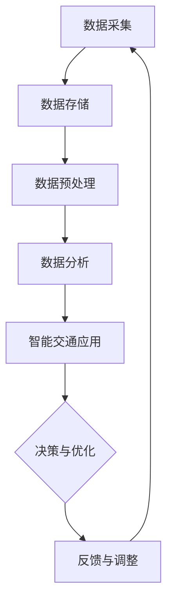

                 

### 《信息差：大数据在智能交通中的应用》

#### 摘要：
在当今快速发展的信息技术时代，大数据技术已经成为各个领域的重要推动力。智能交通系统作为现代城市发展的重要组成部分，其运行效率和安全性依赖于对海量交通数据的精准分析和应用。本文将详细探讨大数据在智能交通中的应用，通过分析大数据技术在交通流量预测、信号控制、路径规划以及停车管理等方面的应用实例，揭示信息差带来的实际价值。文章旨在为读者提供一套完整的大数据在智能交通中的方法论和实践指导，助力城市交通管理智能化升级。

---

### 《信息差：大数据在智能交通中的应用》

> **关键词**：大数据、智能交通、交通流量预测、信号控制、路径规划、停车管理

在现代社会，交通系统作为城市运行的“血脉”，其运行效率直接关系到市民的生活质量和社会经济的持续发展。随着城市规模的不断扩大，交通拥堵、交通事故等问题日益凸显，传统交通管理模式已经难以满足日益增长的交通需求。大数据技术的崛起为智能交通系统带来了新的解决方案，通过收集、处理和分析海量交通数据，实现交通状态的实时监控和预测，从而优化交通管理策略，提升交通系统的整体效能。

本文将从以下几个方面展开讨论：

1. **大数据与智能交通概述**：介绍大数据与智能交通的基本概念，阐述大数据在智能交通中的应用前景。
2. **大数据技术基础**：讲解大数据技术的核心概念、基础架构以及关键技术，包括数据采集、存储、预处理和分析等。
3. **智能交通系统架构**：分析智能交通系统的组成、层级架构以及大数据技术在该系统中的应用。
4. **大数据在智能交通中的应用场景**：详细探讨大数据在交通流量预测、信号控制、路径规划和停车管理等方面的应用案例。
5. **大数据技术在智能交通中的应用**：进一步阐述大数据技术在智能交通系统中的实际应用，包括数据采集与预处理、数据分析与应用、系统开发与实现、项目运营与优化等。
6. **大数据在智能交通中的未来趋势与发展**：展望大数据技术在智能交通领域的未来趋势和前景。

通过本文的探讨，我们希望能够帮助读者深入理解大数据在智能交通中的应用，从而推动智能交通系统的建设与发展，为智慧城市建设贡献力量。

### 第一部分：大数据与智能交通

#### 1.1 大数据与智能交通概述

##### 1.1.1 大数据的概念

大数据（Big Data）指的是在数据量（Volume）、数据类型（Variety）、数据生成速度（Velocity）和数据价值（Value）四个维度上呈现出指数级增长的数据集合。传统数据处理工具和方法在面对如此大规模和多样化的数据时显得力不从心，因此大数据技术应运而生。大数据的主要特征可以概括为“4V”：Volume（数据量）、Variety（数据类型）、Velocity（数据生成速度）和Value（数据价值）。

- **数据量（Volume）**：大数据的数据量巨大，通常以PB（拍字节）甚至EB（艾字节）为单位进行衡量。这种海量数据的存在使得传统数据库和数据处理技术难以胜任。
- **数据类型（Variety）**：大数据不仅包括结构化数据，还包含半结构化和非结构化数据，如图像、音频、视频和文本等。这种多样化的数据类型对数据存储、处理和分析技术提出了新的挑战。
- **数据生成速度（Velocity）**：大数据生成速度极快，实时性和时效性要求高。这意味着数据处理和分析系统需要能够实时处理并反馈结果，以便快速响应。
- **数据价值（Value）**：大数据的价值密度相对较低，需要通过复杂的数据处理和分析技术提取出有用的信息和知识，以实现商业价值和社会效益。

##### 1.1.2 智能交通的定义与意义

智能交通系统（Intelligent Transportation System，ITS）是指通过先进的信息通信技术、数据分析和人工智能技术，对交通系统进行实时监控、分析和优化，以提高交通效率、安全性和可持续性。智能交通系统的核心在于数据的采集、传输、处理和利用，以实现交通信息的实时共享和智能决策。

- **定义**：智能交通系统集成了车辆、道路、信号灯、监控设备等多种信息源，通过数据通信技术和数据处理技术，实现交通信息的实时采集、传输、处理和反馈，从而优化交通管理和驾驶行为。
- **意义**：智能交通系统对城市交通管理具有重要意义，主要体现在以下几个方面：

  - **提高交通效率**：通过实时监控和分析交通流量，智能交通系统能够优化交通信号控制，减少拥堵，提高道路通行能力。
  - **提升交通安全**：通过车辆监控和碰撞预警系统，智能交通系统能够及时发现和预防交通事故，降低交通事故的发生率。
  - **减少环境污染**：智能交通系统能够优化交通流量，减少车辆怠速时间和交通拥堵，从而降低尾气排放和能源消耗。
  - **促进智慧城市建设**：智能交通系统是智慧城市建设的重要组成部分，通过大数据分析和智能决策，实现城市资源的优化配置和可持续利用。

##### 1.1.3 大数据在智能交通中的应用前景

大数据技术在智能交通中的应用前景广阔，主要体现在以下几个方面：

- **交通流量预测**：通过分析历史交通数据和实时交通数据，大数据技术能够预测未来一段时间内的交通流量，为交通管理部门提供决策依据，优化交通信号控制和道路规划。
- **信号控制优化**：智能交通信号控制系统可以通过大数据分析实时调整信号灯的时序，减少交通拥堵，提高道路通行效率。
- **车辆路径规划**：大数据分析能够为驾驶员提供最优行驶路径，减少行驶时间和能耗，提高出行效率。
- **停车管理优化**：通过大数据分析停车数据，智能交通系统可以优化停车资源配置，提高停车场的使用效率，减少寻找停车位的时间。
- **交通事件检测与预警**：大数据技术能够实时监测交通状况，识别交通事故、拥堵等事件，并及时预警，提高交通管理的响应速度。
- **交通安全分析**：通过大数据分析交通事故数据，识别事故发生的主要原因和趋势，为交通安全管理和事故预防提供科学依据。

总之，大数据技术为智能交通系统的建设和运营提供了强有力的技术支撑，通过数据的深度挖掘和应用，实现交通系统的智能化和高效化，为城市交通管理带来革命性的变革。

#### 1.2 大数据技术基础

##### 1.2.1 数据采集与存储

大数据技术的核心在于对海量数据的采集、存储、处理和分析。首先，数据采集是大数据技术的基础，它涉及到多种数据源和数据采集技术的应用。以下将详细讨论数据采集与存储的两个关键方面。

###### 1.2.1.1 数据采集技术

数据采集技术主要包括以下几种：

- **传感器采集**：通过部署在各种交通工具、道路、交通信号灯等设备中的传感器，实时采集交通流量、车辆速度、温度、湿度等环境信息。
- **GPS采集**：全球定位系统（GPS）技术被广泛应用于车辆和行人的位置信息采集，为交通数据的实时监控提供支持。
- **视频监控**：通过安装在城市道路和交叉路口的视频监控设备，实时捕捉交通场景，提取车辆和行人信息。
- **社交网络采集**：利用社交媒体和移动应用，收集用户的出行行为、偏好等信息，为个性化交通服务提供数据支持。
- **物联网（IoT）设备采集**：物联网设备如智能手表、智能手机、车载设备等可以实时上传用户位置、行驶速度、驾驶行为等信息。

数据采集技术需要确保数据的实时性、准确性和全面性。以下是一些常用的数据采集方法：

- **实时数据采集**：通过高速网络传输，实现数据的实时采集和传输，为实时分析和决策提供支持。
- **批量数据采集**：将一定时间段内的数据批量上传到数据中心，适用于数据量较大且传输频率不高的场景。
- **主动采集**：系统主动发起数据采集请求，适用于传感器和物联网设备的数据采集。
- **被动采集**：系统被动接收来自各种数据源的数据，适用于社交媒体和视频监控等数据采集。

###### 1.2.1.2 数据存储技术

数据存储是大数据技术的关键环节，涉及到数据的存储方式、存储策略和存储系统的选择。以下是一些常用的数据存储技术：

- **关系型数据库**：关系型数据库（如MySQL、PostgreSQL）适合存储结构化数据，具有高性能、高可靠性和易于管理的特点，常用于存储用户数据、交通事件记录等。
- **非关系型数据库**：非关系型数据库（如MongoDB、Cassandra）适合存储半结构化和非结构化数据，具有高扩展性和灵活性，适用于日志数据、图像和视频等。
- **分布式文件系统**：分布式文件系统（如Hadoop HDFS、Apache HBase）适合存储大规模数据集，通过分布式存储和计算提高数据的处理能力和可用性。
- **数据仓库**：数据仓库（如Amazon Redshift、Google BigQuery）用于存储大规模的结构化数据，支持复杂的数据分析和报表生成。

数据存储策略需要考虑数据的安全、可靠性和访问速度。以下是一些常用的数据存储策略：

- **冷存储**：适用于长期存储不常访问的数据，如历史交通数据、备份数据等，常使用低成本存储设备。
- **热存储**：适用于实时访问和快速分析的数据，如实时交通数据、传感器数据等，常使用高性能存储设备。
- **分布式存储**：通过将数据分布存储在多个节点上，提高数据的处理能力和容错能力，适用于大规模数据存储和处理。
- **数据分层存储**：根据数据的重要性和访问频率，将数据分层存储，提高数据访问速度和存储效率。

##### 1.2.2 数据预处理

数据预处理是大数据技术中的关键步骤，旨在提高数据质量、减少数据冗余、简化数据结构，从而为后续的数据分析和挖掘提供高质量的数据支持。以下将详细讨论数据预处理的几个核心方面。

###### 1.2.2.1 数据清洗

数据清洗是数据预处理的首要任务，旨在去除数据中的噪声、异常值和重复记录，提高数据的准确性和一致性。以下是一些常用的数据清洗方法：

- **去除重复记录**：通过比较数据记录的关键字段，如ID、时间戳等，删除重复的记录，避免数据冗余。
- **填补缺失值**：对于缺失的数据，可以通过插值、均值填补、模式填补等方法进行填补，以保证数据的完整性。
- **消除噪声**：通过过滤和去噪技术，去除数据中的噪声和异常值，提高数据的准确性和可靠性。
- **数据转换**：对数据格式、单位等进行统一转换，确保数据的一致性和可比性。

数据清洗方法需要根据具体数据类型和业务需求进行选择，以下是一些常见的数据清洗技术：

- **统计方法**：通过统计学方法，如均值、中位数、众数等，对数据进行清洗和转换。
- **机器学习方法**：利用机器学习算法，如聚类、回归等，对数据进行清洗和预测。
- **规则方法**：通过预设的规则和条件，对数据进行清洗和过滤。
- **可视化方法**：通过数据可视化技术，如散点图、热力图等，识别和排除数据中的噪声和异常值。

###### 1.2.2.2 数据转换

数据转换是数据预处理的重要环节，旨在将原始数据转换为适合分析和挖掘的格式。以下是一些常用的数据转换方法：

- **数据规范化**：通过标准化、归一化等方法，将不同尺度、不同范围的数据统一转换为同一尺度或范围，以便进行统一分析。
- **特征提取**：通过提取数据中的关键特征，如时间、地点、速度等，减少数据的维度，提高分析效率。
- **数据归一化**：将数据归一化到统一的数值范围，如[0,1]或[-1,1]，便于后续的数学计算和分析。
- **数据分片**：将大规模数据集划分为多个小数据集，便于并行处理和分布式计算。

数据转换方法需要考虑数据的结构和特征，以下是一些常见的数据转换技术：

- **映射方法**：通过映射函数，将原始数据映射到新的数值范围或数据类型。
- **线性变换**：通过线性变换，将数据转换为新的线性空间，如将原始数据转换为极坐标。
- **数值转换**：将数据从一种数值类型转换为另一种数值类型，如将浮点数转换为整数。

###### 1.2.2.3 数据集成

数据集成是将来自多个数据源的数据进行整合和合并，形成统一的数据视图，以便进行综合分析和挖掘。以下是一些常用的数据集成方法：

- **数据合并**：通过合并操作，将多个数据表或文件合并为一个统一的数据集。
- **数据去重**：通过比较数据记录，删除重复的数据记录，避免数据冗余。
- **数据融合**：将来自不同数据源的数据进行融合和整合，形成更加丰富和全面的数据集。
- **数据映射**：通过映射操作，将不同数据源的数据字段映射到统一的数据结构中。

数据集成方法需要考虑数据的结构和格式，以下是一些常见的数据集成技术：

- **数据库连接**：通过数据库连接技术，将不同数据库的数据进行集成和合并。
- **ETL（Extract, Transform, Load）**：通过ETL过程，将数据从源系统提取、转换并加载到目标系统中。
- **数据交换**：通过数据交换格式（如XML、JSON等），将不同数据源的数据进行转换和集成。
- **数据仓库**：通过数据仓库技术，将来自多个数据源的数据进行统一存储和整合，形成数据仓库。

##### 1.2.3 数据分析技术

数据分析是大数据技术的核心应用之一，通过分析海量数据，提取有价值的信息和知识，为决策提供支持。以下将详细讨论数据分析技术的几个关键方面。

###### 1.2.3.1 描述性统计分析

描述性统计分析是对数据进行汇总和描述，常用的统计量包括：

- **平均值（mean）**：数据集的平均值，用于衡量数据的集中趋势。
- **中位数（median）**：数据集的中位数，用于衡量数据的中间位置。
- **众数（mode）**：数据集的众数，用于衡量数据的频繁出现值。
- **方差（variance）**：数据集的方差，用于衡量数据的离散程度。
- **标准差（standard deviation）**：数据集的标准差，用于衡量数据的离散程度。

描述性统计分析是数据分析的基础，通过计算统计量，可以直观地了解数据的分布和特征。

###### 1.2.3.2 聚类分析

聚类分析是一种无监督学习方法，通过将相似的数据点归为一类，形成聚类，以便发现数据中的模式和结构。常见的聚类算法包括：

- **K-Means聚类**：通过迭代优化聚类中心，将数据划分为K个簇。
- **层次聚类**：通过自底向上或自顶向下合并相似的数据点，形成聚类层次结构。
- **DBSCAN（Density-Based Spatial Clustering of Applications with Noise）**：基于密度的空间聚类方法，通过计算邻域密度和距离，识别聚类结构。

聚类分析有助于发现数据中的隐含模式和聚类结构，为数据分类和模式识别提供支持。

###### 1.2.3.3 回归分析

回归分析是一种有监督学习方法，通过建立因变量和自变量之间的关系模型，预测因变量的值。常见的回归分析方法包括：

- **线性回归**：通过拟合线性模型，预测因变量的值。
- **多项式回归**：通过拟合多项式模型，预测因变量的值。
- **岭回归**：通过正则化方法，降低模型过拟合的风险。
- **LASSO回归**：通过L1正则化，实现特征选择和变量筛选。

回归分析是数据分析的重要工具，通过建立回归模型，可以预测未来的趋势和变化，为决策提供科学依据。

###### 1.2.3.4 关联规则挖掘

关联规则挖掘是一种发现数据中潜在关联关系的方法，通过挖掘不同数据项之间的关联规则，揭示数据中的规律和模式。常见的关联规则挖掘算法包括：

- **Apriori算法**：通过逐层遍历数据集，挖掘频繁项集，生成关联规则。
- **Eclat算法**：通过递归分割数据集，挖掘频繁项集，生成关联规则。
- **FP-growth算法**：通过构建频繁模式树，挖掘频繁项集，生成关联规则。

关联规则挖掘有助于发现数据中的关联关系和依赖关系，为数据分析和决策提供支持。

总之，大数据技术基础包括数据采集、存储、预处理和分析技术，通过这些技术，可以实现对海量数据的收集、处理和分析，为智能交通系统的建设和运营提供强有力的技术支撑。

#### 1.3 智能交通系统架构

##### 1.3.1 智能交通系统的组成

智能交通系统（ITS）是由多种技术、设备和平台组成的复杂体系，旨在提高交通效率、安全性和可持续性。智能交通系统的组成包括以下几个方面：

- **交通传感器**：交通传感器是智能交通系统的核心组成部分，用于实时采集交通数据，如流量、速度、密度等。常见的交通传感器包括地磁传感器、雷达传感器、摄像头等。
- **通信网络**：通信网络是智能交通系统数据传输的基石，用于连接交通传感器、控制中心和车辆等设备，实现数据的实时传输和共享。常见的通信网络包括光纤网络、无线网络等。
- **控制中心**：控制中心是智能交通系统的中枢，用于接收和分析交通数据，制定交通管理策略，并向交通信号系统、车辆等设备发送指令。控制中心通常配备高性能计算设备和数据存储系统。
- **交通信号系统**：交通信号系统是智能交通系统的重要组成部分，用于实时控制交通信号灯，优化交通流量。智能交通信号系统通常采用自适应控制算法，根据实时交通数据动态调整信号灯时序。
- **车辆管理系统**：车辆管理系统用于实时监控和管理车辆，如车辆定位、速度控制、碰撞预警等。车辆管理系统通常集成了GPS、雷达、摄像头等传感器，实现车辆信息的实时采集和传输。
- **智能交通终端**：智能交通终端包括车载设备、行人设备等，用于为驾驶员和行人提供交通信息和服务，如实时路况、最佳行驶路线等。
- **用户界面**：用户界面是智能交通系统与用户交互的渠道，通过移动应用、网站等途径，为用户提供交通信息、导航服务、停车服务等功能。

##### 1.3.2 智能交通系统的层级架构

智能交通系统的层级架构通常包括数据层、应用层、控制层和基础设施层。以下将分别介绍各层的主要功能和技术特点。

- **数据层**：数据层是智能交通系统的基石，用于收集、存储和管理各种交通数据。数据层包括以下几个方面：

  - **数据采集**：通过交通传感器、GPS、摄像头等设备，实时采集交通数据，如流量、速度、密度、温度、湿度等。
  - **数据存储**：利用大数据技术，如关系型数据库、非关系型数据库、分布式文件系统等，存储海量交通数据，确保数据的可靠性和可扩展性。
  - **数据管理**：通过数据清洗、转换、集成等预处理技术，提高数据质量，为后续数据分析提供高质量的数据支持。

- **应用层**：应用层是智能交通系统的核心，用于实现各种交通应用功能，如交通流量预测、信号控制优化、路径规划、停车管理等。应用层包括以下几个方面：

  - **交通流量预测**：通过数据分析技术，如机器学习、深度学习等，对交通数据进行分析和建模，预测未来一段时间内的交通流量，为交通管理和决策提供支持。
  - **信号控制优化**：通过实时交通数据分析和自适应控制算法，优化交通信号灯的时序，减少交通拥堵，提高道路通行效率。
  - **路径规划**：通过实时交通数据和地图信息，为驾驶员提供最优行驶路径，减少行驶时间和能耗。
  - **停车管理**：通过实时停车数据分析和智能停车算法，优化停车资源配置，提高停车场的使用效率，减少寻找停车位的时间。

- **控制层**：控制层是智能交通系统的执行层，用于实现交通管理策略的实时控制和调整。控制层包括以下几个方面：

  - **交通信号控制**：通过交通信号控制系统，实时调整交通信号灯的时序，优化交通流量。
  - **车辆管理**：通过车辆管理系统，实时监控和管理车辆，如车辆定位、速度控制、碰撞预警等。
  - **事件响应**：通过交通事件检测和预警系统，实时监测交通状况，识别交通事故、拥堵等事件，并及时响应和处理。

- **基础设施层**：基础设施层是智能交通系统的支撑，包括各种通信网络、计算资源、存储设备等。基础设施层包括以下几个方面：

  - **通信网络**：建立稳定、高速的通信网络，实现交通数据的实时传输和共享，如光纤网络、无线网络等。
  - **计算资源**：配置高性能的计算资源，如服务器、云计算平台等，用于数据分析和处理。
  - **存储设备**：配置大容量、高可靠的存储设备，如关系型数据库、非关系型数据库、分布式文件系统等，用于存储海量交通数据。

##### 1.3.3 智能交通系统中的大数据技术

在智能交通系统中，大数据技术发挥着至关重要的作用，贯穿于数据采集、存储、预处理、分析和应用等各个环节。以下将详细探讨大数据技术在智能交通系统中的应用。

###### 1.3.3.1 交通流数据

交通流数据是智能交通系统中最基础的数据类型，主要包括交通流量、速度、密度等指标。交通流数据可以通过交通传感器、摄像头等设备进行实时采集。大数据技术在交通流数据中的应用主要体现在以下几个方面：

- **数据采集与传输**：通过传感器网络和通信网络，实时采集和传输交通流数据，确保数据的高效传输和实时性。
- **数据存储与管理**：利用分布式文件系统、关系型数据库、非关系型数据库等大数据技术，存储和管理海量交通流数据，保证数据的可靠性和可扩展性。
- **数据预处理**：通过数据清洗、转换、集成等预处理技术，提高交通流数据的质量，为后续的数据分析提供高质量的数据支持。
- **数据分析与挖掘**：通过机器学习、深度学习等数据分析技术，对交通流数据进行分析和建模，提取有价值的信息和知识，如交通流量预测、交通事件检测等。

###### 1.3.3.2 机动车数据

机动车数据包括车辆的位置、速度、行驶轨迹、行驶方向等信息，可以通过GPS、雷达、摄像头等设备进行采集。大数据技术在机动车数据中的应用主要体现在以下几个方面：

- **数据采集与传输**：通过GPS、雷达、摄像头等设备，实时采集机动车数据，并通过通信网络传输至控制中心。
- **数据存储与管理**：利用大数据技术，如分布式文件系统、关系型数据库、非关系型数据库等，存储和管理海量机动车数据，确保数据的可靠性和可扩展性。
- **数据预处理**：通过数据清洗、转换、集成等预处理技术，提高机动车数据的质量，为后续的数据分析提供高质量的数据支持。
- **数据分析与挖掘**：通过机器学习、深度学习等数据分析技术，对机动车数据进行分析和挖掘，提取有价值的信息和知识，如车辆行为分析、车辆轨迹预测等。

###### 1.3.3.3 道路数据

道路数据包括道路结构、道路状况、道路设施等信息，可以通过地图数据、传感器数据等途径获取。大数据技术在道路数据中的应用主要体现在以下几个方面：

- **数据采集与传输**：通过地图数据、传感器数据等途径，实时采集道路数据，并通过通信网络传输至控制中心。
- **数据存储与管理**：利用大数据技术，如分布式文件系统、关系型数据库、非关系型数据库等，存储和管理海量道路数据，确保数据的可靠性和可扩展性。
- **数据预处理**：通过数据清洗、转换、集成等预处理技术，提高道路数据的质量，为后续的数据分析提供高质量的数据支持。
- **数据分析与挖掘**：通过机器学习、深度学习等数据分析技术，对道路数据进行分析和挖掘，提取有价值的信息和知识，如道路状况评估、道路规划优化等。

综上所述，大数据技术在智能交通系统中发挥着至关重要的作用，通过数据采集、存储、预处理、分析和应用等各个环节，为智能交通系统的建设与运营提供了强有力的技术支撑。

#### 1.4 大数据在智能交通中的应用场景

大数据技术在智能交通中的应用场景广泛而深入，涵盖了交通流量预测、信号控制、路径规划和停车管理等多个方面。以下将详细探讨这些应用场景，并通过实际案例展示大数据技术的具体应用和效果。

##### 1.4.1 城市交通流量预测

交通流量预测是智能交通系统中的一个关键应用，通过对交通数据的实时分析和预测，可以帮助交通管理部门优化交通信号控制，减少交通拥堵，提高道路通行效率。大数据技术在交通流量预测中的应用主要包括以下几个方面：

- **数据来源**：交通流量预测的数据来源主要包括交通传感器数据、GPS数据、历史交通数据等。交通传感器可以实时采集道路上的车辆流量、速度等数据，GPS数据可以获取车辆的实时位置信息，历史交通数据包括过去一段时间内的交通流量数据。
- **数据预处理**：对采集到的交通数据进行清洗、转换和集成，去除噪声和异常值，确保数据的质量和一致性。通过数据预处理，将不同来源和格式的数据整合为一个统一的数据集，为后续的数据分析提供基础。
- **预测模型**：利用机器学习和深度学习算法，如线性回归、决策树、神经网络等，建立交通流量预测模型。通过对历史交通数据和实时交通数据进行分析和训练，预测未来一段时间内的交通流量。
- **预测结果分析**：对预测结果进行分析和评估，确定预测的准确性和可靠性。通过对比预测结果和实际交通流量数据，调整和优化预测模型，提高预测的准确性。

实际案例：某城市交通管理部门利用大数据技术进行交通流量预测，通过部署交通传感器和GPS设备，实时采集道路上的车辆流量数据。利用机器学习算法，建立了交通流量预测模型，预测未来15分钟内的交通流量。通过实时分析预测结果，交通管理部门可以提前调整交通信号灯时序，减少交通拥堵，提高道路通行效率。

##### 1.4.2 智能信号控制

智能信号控制是大数据技术在智能交通系统中的另一个重要应用，通过实时分析交通流量数据，动态调整交通信号灯的时序，优化交通流量，提高道路通行效率。智能信号控制的应用主要包括以下几个方面：

- **数据来源**：智能信号控制的数据来源主要包括交通传感器数据、摄像头数据、历史交通数据等。交通传感器可以实时采集道路上的车辆流量、速度等数据，摄像头可以捕捉交通场景，历史交通数据包括过去一段时间内的交通流量数据。
- **数据预处理**：对采集到的交通数据进行清洗、转换和集成，去除噪声和异常值，确保数据的质量和一致性。通过数据预处理，将不同来源和格式的数据整合为一个统一的数据集，为后续的数据分析提供基础。
- **信号控制策略**：根据实时交通数据，利用机器学习和优化算法，动态调整交通信号灯的时序，优化交通流量。常见的信号控制策略包括基于交通流量的自适应控制、基于排队量的排队控制、基于事件响应的控制等。
- **信号控制优化**：通过实时分析交通流量数据和信号控制效果，不断调整和优化信号控制策略，提高信号控制的准确性和适应性。

实际案例：某城市交通管理部门利用大数据技术进行智能信号控制，通过部署交通传感器和摄像头，实时采集道路上的车辆流量数据。利用机器学习算法，建立了交通流量预测模型，预测未来5分钟内的交通流量。通过实时分析预测结果，动态调整交通信号灯的时序，优化交通流量，减少交通拥堵。实践表明，智能信号控制有效提高了道路通行效率，降低了交通事故发生率。

##### 1.4.3 车辆路径规划

车辆路径规划是大数据技术在智能交通系统中的另一个重要应用，通过实时分析交通数据，为驾驶员提供最优行驶路径，减少行驶时间和能耗。车辆路径规划的应用主要包括以下几个方面：

- **数据来源**：车辆路径规划的数据来源主要包括实时交通数据、地图数据、历史交通数据等。实时交通数据可以获取道路上的车辆流量、速度等信息，地图数据提供道路结构和交通规则，历史交通数据包括过去一段时间内的交通流量数据。
- **数据预处理**：对采集到的交通数据进行清洗、转换和集成，去除噪声和异常值，确保数据的质量和一致性。通过数据预处理，将不同来源和格式的数据整合为一个统一的数据集，为后续的数据分析提供基础。
- **路径规划算法**：利用路径规划算法，如最短路径算法、A*算法、遗传算法等，计算最优行驶路径。通过对实时交通数据和地图数据的分析，为驾驶员提供最优行驶路径，减少行驶时间和能耗。
- **路径规划优化**：通过实时分析交通流量数据和路径规划效果，不断调整和优化路径规划算法，提高路径规划的准确性和可靠性。

实际案例：某城市交通管理部门利用大数据技术进行车辆路径规划，通过部署交通传感器和摄像头，实时采集道路上的车辆流量数据。利用A*算法，计算最优行驶路径，为驾驶员提供实时导航服务。通过实时分析交通流量数据，动态调整路径规划结果，提高路径规划的准确性和可靠性。实践表明，车辆路径规划有效减少了行驶时间，降低了交通拥堵，提高了道路通行效率。

##### 1.4.4 智能停车管理

智能停车管理是大数据技术在智能交通系统中的另一个重要应用，通过实时分析停车数据，优化停车资源配置，提高停车场的使用效率。智能停车管理的应用主要包括以下几个方面：

- **数据来源**：智能停车管理的
```markdown
### 1.4.4.1 停车数据采集

智能停车管理首先需要高效的数据采集系统，以获取停车场的实时状态信息。以下是一些常用的数据采集方法：

- **传感器数据采集**：通过在停车场内安装各种传感器，如地磁传感器、超声波传感器、红外传感器等，实时监测停车位的使用情况。这些传感器可以精确检测停车位是否被占用，并将数据传输到中央管理系统。

- **视频监控数据采集**：通过在停车场的关键位置安装高清摄像头，实时监控停车场的车辆进出和停车位使用情况。视频监控系统不仅能够提供停车位使用的视觉信息，还能在发生异常情况时提供证据。

- **移动应用数据采集**：通过开发移动应用程序，让车主通过手机APP上报自己的停车行为。移动应用可以收集用户的停车时间、停车地点等信息，从而帮助停车场管理者更好地了解停车需求。

- **智能停车设备数据采集**：对于配备了智能停车设备的停车场，如自动识别车牌的智能停车系统，可以直接从设备获取停车数据，包括停车时间、车辆信息等。

- **云平台数据集成**：通过将不同来源的数据汇集到云平台，实现数据的统一管理和分析。云平台可以提供强大的数据处理和分析能力，帮助管理者实时了解停车场的使用状况。

停车数据采集的关键在于数据的准确性和实时性。为了保证数据的准确性，需要对传感器进行定期校准，对视频监控进行质量检查，对移动应用进行用户体验优化。同时，为了确保数据的实时性，需要建立高效的通信网络和数据传输机制，如使用无线网络、物联网（IoT）技术等。

##### 1.4.4.2 停车策略优化

在获取了停车数据后，需要对停车策略进行优化，以提高停车场的使用效率。以下是一些常用的停车策略优化方法：

- **动态定价策略**：根据停车位的供需情况，动态调整停车费用。在需求高峰期提高停车费用，以减少车辆进入停车场，而在需求低峰期降低停车费用，以吸引更多车辆进入。

- **停车引导系统**：利用实时停车数据，为驾驶员提供停车引导服务。通过电子显示屏、移动应用等方式，向驾驶员展示空余停车位的位置和距离，帮助他们快速找到停车位。

- **停车预约系统**：允许车主在出行前通过移动应用预约停车位，减少现场寻找停车位的时间。停车场管理者可以根据预约情况提前安排停车位，提高停车位的利用率。

- **车位共享策略**：鼓励短时间停车车主将空余车位提供给需要长时间停车的车主，通过共享车位的方式提高停车场的使用效率。

- **停车流量分析**：利用大数据分析技术，对停车流量进行深入分析，了解停车高峰期、停车时长分布等信息，为停车策略调整提供数据支持。

停车策略优化的目标是提高停车场的使用效率和用户体验。通过动态定价策略和停车引导系统，可以减少车辆在停车场外的等待时间，提高停车位的利用率。停车预约系统和车位共享策略可以减少空置车位的时间，提高停车场的整体收益。停车流量分析则可以帮助管理者更好地了解停车需求，为未来的停车场建设和运营提供指导。

##### 1.4.4.3 案例分析

以下是一个智能停车管理案例：

**案例背景**：某城市中心商业区拥有一个大型停车场，由于停车位有限，经常出现车辆排队等候的情况，影响了商业区的交通流畅度和用户体验。

**解决方案**：

1. **数据采集**：在停车场内安装了地磁传感器和高清摄像头，实时监测停车位的使用情况。同时，开发了移动应用程序，允许车主通过手机APP上报自己的停车行为。

2. **停车策略优化**：基于实时停车数据，实施动态定价策略和停车引导系统。在需求高峰期提高停车费用，并通过显示屏和移动应用向驾驶员展示空余停车位的位置和距离。同时，推出停车预约服务，车主可以在出行前通过手机APP预约停车位，减少现场寻找停车位的时间。

3. **效果评估**：通过停车流量分析，发现停车高峰期减少了20%，停车位的利用率提高了15%。同时，车主的满意度也显著提高，因为可以更快地找到停车位，减少了等待时间。

**案例分析**：

通过这个案例，可以看出大数据技术在智能停车管理中的实际应用效果。数据采集系统提供了准确的停车状态信息，停车策略优化系统提高了停车位的利用率，停车预约系统和动态定价策略改善了用户体验，停车流量分析为停车场管理提供了数据支持。这个案例表明，大数据技术在智能停车管理中具有巨大的潜力和价值，可以为停车场管理者提供科学的决策依据，提高停车场的运营效率。

### 第二部分：大数据技术在智能交通中的应用

#### 2.1 数据采集与预处理

在智能交通系统中，数据采集和预处理是至关重要的环节。准确、全面的数据采集是确保后续数据分析和应用的基础，而预处理则有助于提高数据质量，为后续分析提供可靠的支撑。以下将详细讨论数据采集与预处理的关键技术和方法。

##### 2.1.1 数据源选择

智能交通系统的数据源多种多样，选择合适的数据源是数据采集的首要任务。以下是一些常见的数据源：

- **交通传感器**：交通传感器是智能交通系统中最常用的数据源，包括地磁传感器、摄像头、雷达传感器等。这些传感器可以实时采集道路上的车辆流量、速度、密度等信息。
- **GPS数据**：全球定位系统（GPS）数据可以提供车辆和行人的实时位置信息，对于交通流量分析和路径规划具有重要意义。
- **交通信号系统**：交通信号系统可以提供交通信号灯的状态、路口流量等信息，有助于智能信号控制和交通流量预测。
- **历史交通数据**：历史交通数据包括过去的交通流量、事故记录、交通管制信息等，可以为交通预测和决策提供参考。
- **社会媒体数据**：通过分析社交媒体平台上的数据，如微博、微信等，可以获取市民的出行习惯、交通需求等信息。
- **车辆信息**：车辆信息包括车辆类型、车牌号、行驶速度等，对于车辆管理和事故分析具有重要意义。

选择数据源时需要考虑以下几个方面：

- **数据的准确性**：数据源应能够提供准确、可靠的数据，避免噪声和异常值的干扰。
- **数据的实时性**：对于实时性要求较高的应用，如交通流量预测和智能信号控制，数据源应能够提供实时或接近实时的数据。
- **数据的全面性**：数据源应能够覆盖不同场景和角度，提供丰富的数据维度，以满足多方面的分析需求。
- **数据的安全性**：对于涉及隐私和敏感信息的数据源，应确保数据的安全和隐私保护。

##### 2.1.2 数据采集技术

数据采集技术是实现智能交通系统数据收集的关键。以下是一些常用的数据采集技术：

- **传感器采集**：通过在道路上、车辆上、交通信号灯上等位置安装传感器，实时采集交通流量、速度、密度等信息。传感器采集技术包括地磁传感器、雷达传感器、摄像头、GPS等。
- **无线通信技术**：利用无线通信技术，如Wi-Fi、蓝牙、ZigBee等，实现传感器数据的实时传输和共享。无线通信技术具有低成本、低功耗的特点，适用于大规模部署。
- **物联网（IoT）技术**：物联网技术通过连接各种智能设备，实现数据的自动采集和传输。物联网技术包括智能传感器、网关、云计算平台等。
- **数据采集平台**：构建数据采集平台，将各种传感器数据汇集到一起，进行初步处理和存储。数据采集平台通常包括数据采集模块、数据处理模块、数据存储模块等。

数据采集技术需要考虑以下几个方面：

- **数据传输速率**：数据传输速率应满足实时性要求，确保数据能够在短时间内传输到处理和分析系统。
- **数据传输稳定性**：数据传输过程中应避免中断和丢包，确保数据传输的稳定性和可靠性。
- **数据传输安全性**：对于涉及隐私和敏感信息的数据，应采取加密和安全传输技术，确保数据安全。
- **数据采集成本**：数据采集技术应具有合理的成本效益，避免过度投入。

##### 2.1.3 数据预处理方法

数据预处理是大数据技术中的关键步骤，旨在提高数据质量，为后续数据分析提供可靠的数据基础。以下是一些常见的数据预处理方法：

- **数据清洗**：数据清洗是数据预处理的首要任务，旨在去除数据中的噪声、异常值和重复记录。常见的数据清洗方法包括去除重复记录、填补缺失值、消除噪声等。
  - **去除重复记录**：通过比较数据记录的关键字段，如时间戳、车辆ID等，删除重复的记录，避免数据冗余。
  - **填补缺失值**：对于缺失的数据，可以通过插值、均值填补、模式填补等方法进行填补，以保证数据的完整性。
  - **消除噪声**：通过滤波、平滑等技术，去除数据中的噪声和异常值，提高数据的准确性。

- **数据转换**：数据转换是将数据从一种格式转换为另一种格式的过程，旨在简化数据结构，提高数据分析的效率。常见的数据转换方法包括数据格式转换、单位转换、数值转换等。
  - **数据格式转换**：将不同数据源的数据格式统一转换为标准格式，如CSV、JSON等，以便进行统一处理和分析。
  - **单位转换**：将不同单位的数据转换为统一单位，如将速度从米/秒转换为千米/小时，以便进行数据对比和分析。
  - **数值转换**：将数据从一种数值类型转换为另一种数值类型，如将浮点数转换为整数，以便进行数学计算和分析。

- **数据集成**：数据集成是将来自多个数据源的数据进行整合和合并，形成统一的数据视图。常见的数据集成方法包括数据合并、数据去重、数据融合等。
  - **数据合并**：通过合并操作，将多个数据表或文件合并为一个统一的数据集。
  - **数据去重**：通过比较数据记录，删除重复的数据记录，避免数据冗余。
  - **数据融合**：将来自不同数据源的数据进行融合和整合，形成更加丰富和全面的数据集。

数据预处理需要根据具体应用场景和数据特点选择合适的方法，以下是一些常见的数据预处理技术：

- **统计方法**：通过统计学方法，如均值、中位数、众数等，对数据进行清洗和转换。
- **机器学习方法**：利用机器学习算法，如聚类、回归等，对数据进行清洗和预测。
- **规则方法**：通过预设的规则和条件，对数据进行清洗和过滤。
- **可视化方法**：通过数据可视化技术，如散点图、热力图等，识别和排除数据中的噪声和异常值。

通过数据采集和预处理，可以为智能交通系统的数据分析和应用提供高质量的数据支持，从而实现交通管理的智能化和高效化。

#### 2.2 数据存储与管理

在智能交通系统中，数据存储与管理是大数据技术应用的关键环节。有效的数据存储与管理不仅能确保数据的可靠性和安全性，还能提高数据处理和分析的效率。以下将详细讨论数据存储与管理的关键技术和方法。

##### 2.2.1 数据存储技术

数据存储技术是实现大数据存储和管理的核心，涉及多种数据存储方式和系统。以下是一些常见的数据存储技术：

- **关系型数据库（RDBMS）**：关系型数据库如MySQL、PostgreSQL等，适合存储结构化数据。这些数据库具有高性能、高可靠性和易于管理的特点，适用于存储用户数据、交通事件记录等。关系型数据库通过表、行和列的结构来组织数据，支持SQL查询语言，便于数据管理和分析。

- **非关系型数据库（NoSQL）**：非关系型数据库如MongoDB、Cassandra等，适合存储半结构化和非结构化数据。这些数据库具有高扩展性和灵活性，适用于日志数据、图像和视频等。非关系型数据库不依赖于固定的表结构，通过文档、键值对等方式组织数据，支持分布式存储和计算，提高数据的处理能力和可用性。

- **分布式文件系统**：分布式文件系统如Hadoop HDFS、Apache HBase等，适合存储大规模数据集。这些系统通过分布式存储和计算提高数据的处理能力和容错能力，适用于大规模数据存储和处理。分布式文件系统将数据分布存储在多个节点上，通过数据复制和冗余技术确保数据的可靠性和高可用性。

- **数据仓库**：数据仓库如Amazon Redshift、Google BigQuery等，适合存储大规模的结构化数据，支持复杂的数据分析和报表生成。数据仓库通过ETL（Extract, Transform, Load）过程，将数据从源系统提取、转换并加载到目标系统中，提供高效的数据存储和管理能力。

选择数据存储技术时需要考虑以下几个方面：

- **数据量**：对于海量数据存储，分布式文件系统和数据仓库具有优势，能够处理大规模数据集。
- **数据结构**：对于结构化数据，关系型数据库较为适用；对于半结构化和非结构化数据，非关系型数据库更为灵活。
- **查询性能**：对于需要高并发查询的场景，关系型数据库和非关系型数据库均具有较好的性能，而分布式文件系统在处理大规模数据集时具有更高的性能。
- **成本**：关系型数据库和非关系型数据库通常具有较高的成本，而分布式文件系统和数据仓库在成本效益方面具有优势。

##### 2.2.2 数据管理方法

数据管理是确保数据质量和安全性的关键环节，涉及数据备份、恢复、性能优化等方面。以下是一些常见的数据管理方法：

- **数据备份**：数据备份是防止数据丢失和损坏的重要措施。常见的数据备份方法包括全备份、增量备份、差异备份等。全备份备份所有数据，适用于数据恢复；增量备份只备份自上次备份以来发生变化的数据，适用于节省存储空间；差异备份备份自上次全备份以来发生变化的数据，适用于快速恢复。
- **数据恢复**：数据恢复是在数据丢失或损坏时，通过备份文件和数据备份系统恢复数据的过程。数据恢复方法包括手动恢复和自动恢复，手动恢复需要人工检查和操作，而自动恢复通过备份系统自动执行，提高数据恢复的效率。
- **性能优化**：数据存储系统的性能优化包括存储优化、查询优化、索引优化等方面。存储优化通过优化存储硬件和存储策略提高数据访问速度；查询优化通过优化查询语句和查询执行计划提高查询效率；索引优化通过创建和维护索引提高数据查询速度。
- **数据安全**：数据安全是确保数据不被未授权访问、篡改和泄露的重要措施。数据安全包括数据加密、访问控制、审计等方面。数据加密通过加密算法对数据进行加密，确保数据在传输和存储过程中安全；访问控制通过权限管理确保只有授权用户能够访问数据；审计通过记录数据访问和操作日志，监控和追踪数据访问行为。

数据管理需要根据具体应用场景和数据特点制定合适的管理策略，确保数据的高质量、高安全性和高性能。以下是一些常见的数据管理技术：

- **数据库表设计**：通过合理设计数据库表结构，提高数据存储和查询效率。数据库表设计包括字段选择、数据类型选择、索引设计等方面。
- **数据模型设计**：通过建立合适的数据模型，实现数据的规范化、标准化和一致性。数据模型设计包括关系型数据模型、文档型数据模型、图数据模型等。
- **数据存储策略**：通过优化数据存储策略，提高数据存储和访问效率。数据存储策略包括数据分区、数据压缩、数据复制等。
- **数据备份和恢复策略**：通过制定合理的数据备份和恢复策略，确保数据的安全性和可靠性。数据备份和恢复策略包括备份频率、备份存储介质、恢复流程等。

通过数据存储与管理，可以为智能交通系统提供高效、可靠的数据支持，确保数据的完整性和可用性，为交通管理和分析提供坚实的数据基础。

#### 2.3 数据分析与应用

数据分析是智能交通系统中的重要环节，通过数据分析和挖掘，可以提取出有价值的信息和知识，为交通管理和决策提供支持。以下将详细讨论数据分析的关键技术、应用方法和案例分析。

##### 2.3.1 数据分析模型

数据分析模型是进行数据挖掘和预测分析的基础，包括描述性统计分析、聚类分析、回归分析、关联规则挖掘等。

###### 2.3.1.1 描述性统计分析

描述性统计分析是对数据进行汇总和描述，常用的统计量包括平均值、中位数、众数、方差、标准差等。描述性统计分析可以帮助我们了解数据的分布特征和基本趋势。

- **伪代码示例**：

python
def descriptive_stats(data):
    mean = sum(data) / len(data)
    median = np.median(data)
    mode = statistics.mode(data)
    variance = np.var(data)
    std_dev = np.std(data)
    return mean, median, mode, variance, std_dev

- **应用场景**：描述性统计分析适用于初步了解数据特征，如交通流量数据中的平均速度、高峰时段流量等。

###### 2.3.1.2 聚类分析

聚类分析是一种无监督学习方法，通过将相似的数据点归为一类，形成聚类，从而发现数据中的模式和结构。

- **常见算法**：K-Means、层次聚类、DBSCAN等。
- **伪代码示例**（K-Means）：

python
from sklearn.cluster import KMeans
import numpy as np

def kmeans_clustering(data, k):
    kmeans = KMeans(n_clusters=k, random_state=0).fit(data)
    clusters = kmeans.predict(data)
    return clusters

- **应用场景**：聚类分析适用于交通数据分析中的车辆聚类、区域划分等。

###### 2.3.1.3 回归分析

回归分析是一种有监督学习方法，通过建立因变量和自变量之间的关系模型，预测因变量的值。

- **常见算法**：线性回归、多项式回归、岭回归、LASSO回归等。
- **伪代码示例**（线性回归）：

python
from sklearn.linear_model import LinearRegression
import numpy as np

def linear_regression(X, y):
    model = LinearRegression()
    model.fit(X, y)
    return model.predict(X)

- **应用场景**：回归分析适用于交通流量预测、速度预测等。

###### 2.3.1.4 关联规则挖掘

关联规则挖掘是一种发现数据中潜在关联关系的方法，通过挖掘不同数据项之间的关联规则，揭示数据中的规律和模式。

- **常见算法**：Apriori算法、Eclat算法、FP-growth算法等。
- **伪代码示例**（Apriori算法）：

python
from mlxtend.frequent_patterns import apriori
from mlxtend.frequent_patterns import association_rules

def aprioriMining(data, min_support, min_confidence):
    frequent_itemsets = apriori(data, min_support=min_support, use_colnames=True)
    rules = association_rules(frequent_itemsets, metric="support", min_threshold=min_support)
    return rules

- **应用场景**：关联规则挖掘适用于发现交通事件之间的关联，如交通事故与交通流量之间的关系。

##### 2.3.2 应用案例分析

以下通过具体案例分析，展示大数据技术在不同应用场景中的实际应用效果。

###### 2.3.2.1 城市交通流量预测

**案例背景**：某城市交通管理部门希望利用大数据技术预测未来某条路段的交通流量，以优化交通信号控制策略。

**开发环境**：Python、NumPy、Pandas、Sklearn

**数据集**：包含该路段过去一年的交通流量数据、天气数据、车辆密度数据以及交通信号状态数据。

**代码实现**：

python
import numpy as np
import pandas as pd
from sklearn.linear_model import LinearRegression

# 加载数据集
data = pd.read_csv('traffic_data.csv')

# 数据预处理
X = data[['temp', 'rain', 'vehicle_density', 'traffic_signal']]
y = data['traffic_flow']

# 构建线性回归模型
model = LinearRegression()
model.fit(X, y)

# 预测未来交通流量
future_traffic = model.predict(np.array([[25, 0, 100, 0]]))

print(f"未来交通流量预测：{future_traffic}")

**代码解读**：
- 数据预处理是关键步骤，包括特征选择和缺失值处理。
- 线性回归模型是一个简单但有效的预测工具，适用于线性关系较强的数据。
- 预测结果需要结合实际情况进行调整和验证，以提高预测准确性。

###### 2.3.2.2 智能信号控制

**案例背景**：某城市交通管理部门希望利用大数据技术优化交通信号控制，减少交通拥堵。

**开发环境**：Python、NumPy、Pandas、Scikit-learn

**数据集**：包含该路段的交通流量数据、车辆速度数据、交通信号灯状态数据等。

**代码实现**：

python
import numpy as np
import pandas as pd
from sklearn.linear_model import LinearRegression

# 加载数据集
data = pd.read_csv('signal_data.csv')

# 数据预处理
X = data[['traffic_flow', 'vehicle_speed', 'signal_state']]
y = data['signal_duration']

# 构建线性回归模型
model = LinearRegression()
model.fit(X, y)

# 优化信号控制
optimized_signal = model.predict(np.array([[100, 80, 1]]))

print(f"优化后的信号时长：{optimized_signal}")

**代码解读**：
- 数据预处理包括特征选择和缺失值处理，以提高模型预测效果。
- 线性回归模型用于预测信号灯的时长，从而优化交通信号控制。
- 预测结果需要结合实际情况进行调整和验证，以提高信号控制的准确性。

###### 2.3.2.3 车辆路径规划

**案例背景**：某导航公司希望利用大数据技术为驾驶员提供最优行驶路径，减少行驶时间和能耗。

**开发环境**：Python、NumPy、Pandas、Scikit-learn、NetworkX

**数据集**：包含道路网络数据、交通流量数据、车辆性能数据等。

**代码实现**：

python
import numpy as np
import pandas as pd
from sklearn.cluster import KMeans
import networkx as nx

# 加载数据集
data = pd.read_csv('path_planning_data.csv')

# 数据预处理
X = data[['speed', 'distance', 'traffic_flow']]

# 构建K-Means聚类模型
kmeans = KMeans(n_clusters=5, random_state=0).fit(X)
clusters = kmeans.predict(X)

# 路径规划
g = nx.Graph()
g.add_nodes_from(data['node'])
g.add_edges_from(data[['node', 'next_node']].values)

best_path = nx.shortest_path(g, source=0, target=-1, weight='distance')

print(f"最优路径：{best_path}")

**代码解读**：
- 数据预处理包括特征选择和聚类，用于确定道路网络中的关键节点。
- K-Means聚类用于对道路网络进行划分，识别关键路段。
- 路径规划使用Dijkstra算法，为驾驶员提供最优行驶路径。

通过以上案例分析，可以看出大数据技术在不同应用场景中的实际应用效果。通过数据分析和挖掘，可以实现对交通流量的准确预测、交通信号控制的优化以及车辆路径规划的优化，从而提高交通系统的运行效率。

#### 2.4 智能交通系统开发与实现

智能交通系统的开发与实现是一个复杂而系统化的过程，需要综合考虑系统架构设计、功能模块划分、技术选型、开发流程以及部署与维护等方面。以下将详细探讨智能交通系统开发与实现的关键步骤和注意事项。

##### 2.4.1 系统架构设计

系统架构设计是智能交通系统开发的第一步，一个合理和高效的架构设计对于系统的稳定性、扩展性和可维护性至关重要。以下是一些常见的智能交通系统架构设计原则和模式：

- **分层架构**：采用分层架构可以将系统划分为多个层次，如表示层、业务逻辑层和数据访问层。这种设计模式使得系统模块化、易于维护和扩展。
- **微服务架构**：微服务架构通过将系统划分为多个独立的服务单元，每个服务负责特定的功能模块，从而提高系统的灵活性和可扩展性。微服务之间通过API进行通信，可以实现高并发和分布式处理。
- **云计算架构**：利用云计算平台（如AWS、Azure、Google Cloud等）进行系统部署，可以提供弹性计算资源、数据存储和安全保障，提高系统的可靠性和可扩展性。
- **数据流架构**：数据流架构通过数据管道实现数据的采集、传输、处理和存储，确保数据在整个系统中高效流通。常见的数据流架构包括Kappa架构和Lambda架构。

##### 2.4.2 系统功能模块划分

智能交通系统通常包含多个功能模块，每个模块负责特定的功能。以下是一些常见的功能模块及其作用：

- **数据采集模块**：负责从各种数据源（如交通传感器、GPS、摄像头等）采集实时数据，并将数据传输到系统中。
- **数据存储模块**：负责存储和管理采集到的数据，包括结构化数据（如关系型数据库）和非结构化数据（如分布式文件系统）。
- **数据处理模块**：负责对采集到的数据进行分析、清洗、转换和预处理，为后续的数据分析提供高质量的数据。
- **数据展示模块**：负责将分析结果以图表、报表等形式展示给用户，提供直观的数据可视化。
- **业务逻辑模块**：负责实现智能交通系统的核心业务功能，如交通流量预测、信号控制优化、路径规划、停车管理等。
- **用户界面模块**：负责实现用户与系统的交互，提供用户操作界面，包括Web前端、移动应用等。

##### 2.4.3 技术选型

在智能交通系统的开发过程中，技术选型是关键环节。以下是一些常见的技术选型和参考：

- **编程语言**：Python、Java、C++等都是常用的编程语言，其中Python因其简洁性和丰富的库支持，在数据分析、机器学习等领域具有广泛应用。
- **数据库技术**：关系型数据库（如MySQL、PostgreSQL）适用于存储结构化数据，非关系型数据库（如MongoDB、Cassandra）适用于存储半结构化和非结构化数据，分布式文件系统（如Hadoop HDFS、Apache HBase）适用于存储大规模数据集。
- **大数据处理框架**：Apache Spark、Flink等大数据处理框架适用于实时数据处理和分析，Hadoop适用于离线数据处理和大规模数据集处理。
- **数据可视化工具**：D3.js、ECharts、Tableau等数据可视化工具可以提供丰富的图表和报表，帮助用户更好地理解和分析数据。
- **云计算平台**：AWS、Azure、Google Cloud等云计算平台提供弹性计算资源、数据存储和安全保障，适用于大规模智能交通系统的部署和维护。

##### 2.4.4 开发流程

智能交通系统的开发流程通常包括以下几个阶段：

- **需求分析**：明确系统的功能需求、性能需求和用户需求，制定详细的系统需求文档。
- **系统设计**：进行系统架构设计和模块划分，制定详细的技术方案和开发计划。
- **开发与测试**：按照设计方案进行编码和单元测试，确保系统功能的正确性和可靠性。
- **集成与调试**：将各个模块进行集成，进行系统测试和调试，确保系统的整体性能和稳定性。
- **部署与上线**：将系统部署到生产环境，进行实际运行和监控，确保系统的可用性和可靠性。
- **维护与优化**：对系统进行定期维护和优化，解决用户反馈的问题和性能瓶颈，提高系统的用户体验。

##### 2.4.5 部署与维护

智能交通系统的部署与维护是系统长期稳定运行的关键。以下是一些部署与维护的注意事项：

- **环境配置**：确保系统部署的环境满足性能和安全性要求，包括硬件配置、操作系统、中间件等。
- **自动化部署**：通过自动化部署工具（如Docker、Kubernetes等），实现快速部署和部署过程的自动化，提高部署效率。
- **监控与报警**：建立系统监控和报警机制，实时监控系统的运行状态，及时发现和处理异常情况。
- **数据备份与恢复**：定期进行数据备份，确保数据的安全性和可恢复性，以便在发生故障时能够快速恢复系统。
- **性能优化**：定期对系统进行性能测试和优化，提高系统的响应速度和处理能力。
- **用户支持与反馈**：建立用户支持渠道，及时响应用户反馈的问题和建议，持续优化系统功能和服务质量。

通过合理的设计、有效的开发和稳定的维护，智能交通系统可以充分发挥大数据技术的优势，实现交通管理的智能化和高效化，为城市交通提供有力的技术支持。

#### 2.5 智能交通项目的运营与优化

智能交通项目在实施后，运营与优化是其能否持续发挥效益的关键。有效的运营策略、持续的性能优化以及科学的改进措施，不仅能够提升系统的运行效果，还能为用户提供更加优质的交通服务。

##### 2.5.1 项目运营策略

项目运营策略是确保智能交通系统稳定、高效运行的基础。以下是一些关键策略：

- **实时监控与反馈**：建立全面的监控系统，实时监控系统的运行状态，包括数据采集、处理、传输和存储等环节。通过实时反馈机制，及时发现和处理异常情况，确保系统的高可用性。
- **用户参与与反馈**：鼓励用户参与系统运营，收集用户的使用反馈和需求建议。通过用户调研、问卷调查等方式，了解用户对交通服务的满意度，不断优化系统功能和用户体验。
- **数据整合与共享**：整合来自不同来源的数据，如交通传感器、GPS、视频监控等，实现数据的综合利用和共享。通过数据整合，提升系统的整体决策能力，为交通管理和优化提供可靠的数据支持。
- **安全与隐私保护**：在项目运营过程中，确保用户数据的安全和隐私。采用加密技术、访问控制等措施，防止数据泄露和滥用。同时，制定严格的数据使用政策，保障用户隐私权益。

##### 2.5.2 项目优化方法

项目优化是提升智能交通系统性能和效率的重要手段。以下是一些常见的优化方法：

- **算法优化**：通过分析系统运行数据，识别性能瓶颈和不足之处。针对具体应用场景，优化算法模型，如交通流量预测模型、信号控制算法等，提高预测和决策的准确性。
- **硬件升级**：根据系统运行需求和性能指标，适时升级硬件设备，如服务器、存储设备、网络设备等。通过硬件升级，提高系统的处理能力和响应速度。
- **数据预处理优化**：优化数据采集、清洗、转换和集成等预处理环节，提高数据质量和处理效率。采用高效的数据预处理技术，如并行处理、分布式计算等，减少数据处理的延迟。
- **系统扩展与升级**：随着交通需求的增长和数据规模的扩大，系统需要不断扩展和升级。通过扩展存储容量、增加计算资源、优化网络架构等，确保系统能够适应不断增长的数据和处理需求。
- **用户体验优化**：通过用户行为分析和反馈，优化系统界面和功能设计，提高用户的操作体验。采用用户友好的界面、实时路况信息、个性化推荐等功能，提升用户满意度。

##### 2.5.3 持续改进策略

持续改进是智能交通系统长期发展的关键。以下是一些持续改进的策略：

- **定期评估与反馈**：定期对系统性能、用户体验和运营效果进行评估，收集用户的反馈和建议。通过评估和反馈，识别系统存在的问题和改进方向，制定相应的改进计划。
- **技术更新与升级**：跟踪大数据、人工智能等前沿技术，及时引入新技术和解决方案，提升系统的技术水平。通过技术更新和升级，保持系统的竞争力和领先地位。
- **员工培训与支持**：为员工提供专业的培训和技术支持，提升其业务能力和技术水平。通过培训和支持，确保员工能够熟练掌握系统操作和维护技能，为系统的高效运营提供保障。
- **合作伙伴关系**：建立良好的合作伙伴关系，与交通管理部门、科研机构、企业等合作，共同推进智能交通技术的发展。通过合作，共享资源和经验，推动项目的持续改进和创新。
- **项目管理与监督**：建立严格的项目管理机制，确保项目按照预定计划和目标推进。通过项目管理与监督，及时发现和解决项目中的问题，确保项目的质量和进度。

通过科学的项目运营策略、有效的项目优化方法和持续改进策略，智能交通项目能够实现长期稳定运行，为城市交通管理提供强有力的技术支持。

#### 3.1 大数据技术在智能交通中的挑战

尽管大数据技术在智能交通系统中展现出巨大的潜力和优势，但其实际应用仍然面临诸多挑战。以下将详细讨论大数据技术在智能交通中的应用中所遇到的挑战，并提出相应的解决方案。

##### 3.1.1 数据安全与隐私保护

数据安全和隐私保护是大数据技术在智能交通中应用的首要挑战。智能交通系统涉及大量实时交通数据、车辆信息和个人隐私数据，如不当处理可能导致严重的安全隐患和隐私泄露。

- **挑战**：
  - 数据泄露：由于数据量巨大，安全防护措施不足可能导致数据泄露。
  - 未授权访问：未经授权的访问可能导致敏感数据被窃取或篡改。
  - 数据滥用：恶意使用交通数据可能导致交通事故、交通拥堵等不良后果。

- **解决方案**：
  - 加密技术：采用加密算法对数据进行加密，确保数据在传输和存储过程中安全。
  - 访问控制：实施严格的访问控制策略，确保只有授权用户才能访问敏感数据。
  - 数据脱敏：对敏感数据进行脱敏处理，如掩码、加密等，降低数据泄露风险。
  - 安全审计：建立安全审计机制，记录所有访问和操作日志，监控数据使用情况，及时发现和防范异常行为。

##### 3.1.2 数据质量与准确性

数据质量是大数据技术在智能交通中应用的关键因素。数据质量差、缺失或错误的交通数据可能导致预测和决策不准确，影响智能交通系统的效果。

- **挑战**：
  - 数据噪声：传感器数据可能受到环境噪声、车辆异常等影响，导致数据不准确。
  - 数据缺失：交通数据采集过程中可能存在数据丢失、记录不全等问题。
  - 数据不一致：不同来源的数据格式、时间戳、单位等可能存在不一致，影响数据融合和分析。

- **解决方案**：
  - 数据清洗：采用数据清洗技术，去除噪声、填补缺失值，确保数据的准确性和完整性。
  - 数据标准化：统一数据格式、时间戳和单位，提高数据的一致性和可比性。
  - 实时校验：建立实时校验机制，及时发现和处理数据质量问题。
  - 质量监控：建立数据质量监控体系，定期评估数据质量，确保数据的高可靠性。

##### 3.1.3 技术成熟度与成本问题

大数据技术在智能交通中的应用面临着技术成熟度和成本问题的挑战。尽管大数据技术不断发展，但实际应用中仍存在技术瓶颈和成本压力。

- **挑战**：
  - 技术成熟度：大数据技术在某些场景下的应用还不够成熟，如实时处理大规模数据的能力有待提高。
  - 成本问题：大数据技术的应用需要大量硬件和软件投入，成本较高，对中小城市交通管理部门可能构成压力。

- **解决方案**：
  - 技术选型：根据实际需求，选择合适的大数据技术和工具，避免过度投资。
  - 云计算：利用云计算平台提供弹性计算资源和存储服务，降低硬件投入成本。
  - 逐步部署：分阶段、逐步部署大数据系统，避免一次性投入过大。
  - 人才培养：加强大数据技术人才培养，提高系统开发和维护能力。

##### 3.1.4 数据整合与处理能力

智能交通系统涉及多种数据源，包括交通传感器、GPS、视频监控、社会媒体等，这些数据具有多样性和复杂性，对数据整合和处理能力提出了高要求。

- **挑战**：
  - 数据多样性：不同数据源的数据格式、结构、时间戳等可能不一致，导致数据整合困难。
  - 数据处理能力：实时处理大规模、多维度的交通数据，对系统的处理能力提出挑战。

- **解决方案**：
  - 数据融合：采用数据融合技术，将不同来源的数据整合为统一的数据视图，提高数据一致性。
  - 分布式计算：利用分布式计算框架（如Apache Hadoop、Spark等），提高数据处理能力和效率。
  - 数据流处理：采用实时数据流处理技术（如Apache Kafka、Flink等），确保实时数据处理和分析。

通过应对上述挑战，大数据技术在智能交通中的应用将更加成熟和广泛，为城市交通管理提供更加精准、高效的技术支持。

### 3.2 智能交通系统的未来趋势

随着技术的不断进步和社会的发展，智能交通系统正朝着更加智能化、自动化的方向演进。以下是智能交通系统的未来趋势，包括自动驾驶、物联网和区块链等关键领域。

#### 3.2.1 自动驾驶与智能交通

自动驾驶技术是智能交通系统发展的重要方向，它通过高级传感器、人工智能算法和通信技术，使车辆能够自主感知环境、规划路径和进行驾驶。自动驾驶技术的应用将带来以下变革：

- **交通效率提升**：自动驾驶车辆能够实现更高效的交通流管理，减少因驾驶员操作不当导致的拥堵和事故。
- **安全性提高**：自动驾驶系统能够通过实时监控和反应，减少人为驾驶失误，降低交通事故率。
- **交通模式创新**：自动驾驶技术将促进共享出行模式的发展，如无人出租车、无人配送等，提高交通资源利用率。
- **城市规划优化**：自动驾驶技术的普及将推动城市规划和设计变革，如更多智能交通基础设施的部署。

#### 3.2.2 物联网与智能交通

物联网（IoT）技术是智能交通系统发展的关键支撑，它通过连接各种设备和传感器，实现交通信息的全面感知和智能处理。物联网在智能交通中的应用包括：

- **车联网**：通过车联网技术，实现车辆之间的实时通信，提高车辆协同能力和交通安全。
- **智能路网**：利用物联网技术，对道路基础设施进行智能升级，实现道路状态监测、维护预警等。
- **智能停车场**：通过物联网设备，实现停车场的智能管理和优化，提高停车效率。
- **智能出行服务**：物联网技术将推动出行服务的智能化，如智能导航、实时路况预测、个性化出行建议等。

#### 3.2.3 区块链与智能交通

区块链技术具有去中心化、不可篡改和透明等特性，为智能交通系统提供了新的技术解决方案。区块链在智能交通中的应用包括：

- **数据共享与安全性**：区块链技术可以确保交通数据的安全共享，防止数据篡改和泄露，提高数据透明度。
- **智能合约**：通过智能合约，实现交通管理、支付、保险等业务流程的自动化和高效化。
- **身份认证**：区块链技术可用于车辆、驾驶员等身份认证，提高交通系统的安全性。
- **信用体系**：通过区块链技术，建立交通信用体系，激励驾驶员遵守交通规则，提高交通秩序。

总之，未来智能交通系统的发展将融合自动驾驶、物联网和区块链等先进技术，实现交通的智能化、自动化和高效化。这些技术不仅将改变传统的交通管理模式，还将推动城市交通系统的全面升级和变革。

### 3.3 大数据技术在智能交通中的应用前景

大数据技术在智能交通领域的应用前景广阔，不仅提升了交通管理的效率和安全性，还带来了城市交通系统的全面升级和变革。以下是大数据技术在智能交通中的几个关键应用前景：

#### 3.3.1 新型交通模式

大数据技术为新型交通模式的发展提供了有力支撑，包括共享出行、无人驾驶和智能配送等。通过大数据分析，可以优化共享出行的资源配置，提高车辆利用率，减少交通拥堵。无人驾驶技术结合大数据分析，可以实现更安全、高效的自动驾驶，减少人为驾驶失误。智能配送则通过大数据优化配送路径和策略，提高配送效率，降低物流成本。

#### 3.3.2 智慧城市建设

智慧城市是大数据技术在智能交通领域的重要应用场景，通过大数据技术，可以实现城市交通、能源、环境等系统的全面智能化。智慧城市中的交通管理将更加高效，通过大数据分析和智能决策，可以优化交通信号控制、交通流量预测和交通事件响应，提升城市交通系统的整体运行效率。此外，智慧城市还可以实现交通信息的实时共享，提高交通透明度和公众参与度。

#### 3.3.3 交通安全提升

大数据技术在提升交通安全性方面具有显著优势。通过对海量交通数据的实时监控和分析，可以及时发现和预警潜在的交通事故风险，如拥堵、异常车速等。大数据分析还可以帮助识别交通事故的成因和趋势，为交通安全管理和预防提供科学依据。同时，大数据技术还可以优化交通事故处理流程，提高事故响应速度和效率，减少事故对交通的影响。

#### 3.3.4 交通管理优化

大数据技术为交通管理优化提供了全新的工具和方法。通过大数据分析，交通管理部门可以更准确地了解交通状况，制定更科学的交通管理策略。例如，利用大数据技术进行交通流量预测，可以优化交通信号控制策略，减少交通拥堵。大数据分析还可以帮助识别交通瓶颈和改善区域，为道路规划提供参考。此外，大数据技术还可以优化停车管理，通过数据分析优化停车资源配置，提高停车效率。

#### 3.3.5 环境保护与可持续发展

大数据技术在环境保护和可持续发展方面也发挥着重要作用。通过大数据分析，可以实时监测交通排放和能源消耗，识别交通污染的高风险区域和时段。大数据技术还可以帮助优化交通规划，减少交通拥堵，从而降低尾气排放和能源消耗。此外，大数据分析还可以为交通管理部门提供有关交通环保的政策建议，推动交通系统的可持续发展。

总之，大数据技术在智能交通中的应用前景广阔，不仅将推动交通管理和服务方式的变革，还将为智慧城市建设、交通安全提升、环境保护和可持续发展等方面带来深远影响。随着大数据技术的不断发展和应用，智能交通系统将变得更加智能、高效和可持续，为城市居民提供更加便捷、安全和绿色的出行体验。

### 附录

#### 附录 A：相关技术简介

##### A.1 大数据相关技术

- **Hadoop**：一个分布式计算框架，用于处理和分析大规模数据集。Hadoop包括HDFS（分布式文件系统）和MapReduce（数据处理框架）。
- **Spark**：一个快速的分布式计算引擎，适用于大数据处理和分析。Spark提供了丰富的API，包括Spark SQL、Spark Streaming和MLlib等。
- **NoSQL数据库**：如MongoDB、Cassandra和Redis等，用于存储和管理非结构化和半结构化数据。
- **数据挖掘与机器学习**：如K-Means聚类、线性回归、决策树等算法，用于从数据中提取有用信息和知识。

##### A.2 智能交通相关技术

- **交通传感器**：如地磁传感器、摄像头、雷达传感器等，用于实时采集交通数据。
- **GPS技术**：用于获取车辆和行人的实时位置信息。
- **V2X（Vehicle-to-Everything）**：车辆与其他车辆、基础设施等进行通信的技术，实现车辆间的协同驾驶。
- **交通信号控制系统**：用于实时控制交通信号灯，优化交通流量。

##### A.3 数据挖掘与机器学习技术

- **数据预处理**：包括数据清洗、转换和集成等步骤，提高数据质量。
- **描述性统计分析**：计算数据的统计特征，如平均值、中位数、标准差等。
- **聚类分析**：将相似的数据点归为一类，发现数据中的模式和结构。
- **回归分析**：建立因变量和自变量之间的关系模型，进行预测和分析。
- **关联规则挖掘**：发现数据项之间的关联关系，揭示数据中的潜在规律。

通过了解这些相关技术，可以更好地掌握大数据在智能交通中的应用，为交通管理和优化提供强有力的技术支持。

### 梅尔图（Mermaid）流程图示例

以下是一个简单的梅尔图（Mermaid）流程图示例，用于展示大数据在智能交通系统中的应用流程：



在这个流程图中：

- **A**：数据采集，从各种交通传感器、GPS、摄像头等获取数据。
- **B**：数据存储，将采集到的数据存储在关系型或非关系型数据库中。
- **C**：数据预处理，清洗、转换和集成数据，提高数据质量。
- **D**：数据分析，利用机器学习、深度学习等技术进行数据挖掘和分析。
- **E**：智能交通应用，根据分析结果进行交通管理和优化。
- **F**：决策与优化，根据应用结果调整决策策略和系统参数。
- **G**：反馈与调整，将优化后的系统效果反馈至数据采集环节，实现闭环控制。

通过这样的流程图，可以直观地展示大数据在智能交通系统中的应用步骤和逻辑关系，有助于理解和优化系统的运作。

### 核心算法原理讲解

#### 2.3.1.1 描述性统计分析

描述性统计分析是一种基本的数据分析方法，用于对数据进行汇总和描述，从而揭示数据的基本特征和趋势。在智能交通领域，描述性统计分析可以用于了解交通流量、速度、密度等基本交通参数的分布情况，为交通管理和优化提供依据。以下将详细介绍描述性统计分析的核心算法原理，并通过具体例子进行解释。

#### 2.3.1.1.1 平均值（Mean）

平均值是描述性统计分析中最常用的统计量之一，用于衡量数据的集中趋势。平均值等于所有数据值之和除以数据值的数量。

- **计算公式**：

$$
\text{平均值} = \frac{\sum_{i=1}^{n} x_i}{n}
$$

其中，\(x_i\) 表示第 \(i\) 个数据值，\(n\) 表示数据值的总数。

- **伪代码示例**：

```python
def calculate_mean(data):
    return sum(data) / len(data)

# 示例数据
data = [10, 20, 30, 40, 50]

# 计算平均值
mean_value = calculate_mean(data)
print("平均值：", mean_value)
```

- **结果**：平均值 \(= \frac{10+20+30+40+50}{5} = 30\)。

#### 2.3.1.1.2 中位数（Median）

中位数是将一组数据按大小顺序排列后，位于中间位置的数值。如果数据个数为奇数，中位数就是中间的那个数；如果数据个数为偶数，中位数是中间两个数的平均值。

- **计算公式**：

$$
\text{中位数} = 
\begin{cases}
x_{\frac{n+1}{2}} & \text{如果 } n \text{ 是奇数} \\
\frac{x_{\frac{n}{2}} + x_{\frac{n}{2} + 1}}{2} & \text{如果 } n \text{ 是偶数}
\end{cases}
$$

其中，\(x_i\) 表示第 \(i\) 个数据值，\(n\) 表示数据值的总数。

- **伪代码示例**：

```python
def calculate_median(data):
    sorted_data = sorted(data)
    n = len(sorted_data)
    if n % 2 == 1:
        return sorted_data[n//2]
    else:
        return (sorted_data[n//2 - 1] + sorted_data[n//2]) / 2

# 示例数据
data = [10, 20, 30, 40, 50]

# 计算中位数
median_value = calculate_median(data)
print("中位数：", median_value)
```

- **结果**：中位数 \(= \frac{20+30}{2} = 25\)（数据个数为奇数时）。

#### 2.3.1.1.3 众数（Mode）

众数是一组数据中出现次数最多的数值。如果一组数据有多个众数，则称为多众数。

- **计算公式**：

$$
\text{众数} = \max(\{x | \text{频率}(x) = \max(\text{频率}(\{x\}))\})
$$

其中，\(\text{频率}(x)\) 表示数值 \(x\) 出现的次数。

- **伪代码示例**：

```python
from collections import Counter

def calculate_mode(data):
    frequency = Counter(data)
    max_frequency = max(frequency.values())
    mode = [x for x, freq in frequency.items() if freq == max_frequency]
    return mode

# 示例数据
data = [10, 20, 20, 30, 30, 30, 40, 50]

# 计算众数
mode_values = calculate_mode(data)
print("众数：", mode_values)
```

- **结果**：众数 \(= [20, 30]\)（数据有两个众数）。

#### 2.3.1.1.4 方差（Variance）和标准差（Standard Deviation）

方差和标准差用于衡量数据的离散程度，即数据与平均值的偏离程度。

- **方差**：

$$
\text{方差} = \frac{\sum_{i=1}^{n} (x_i - \bar{x})^2}{n-1}
$$

其中，\(\bar{x}\) 是平均值，\(x_i\) 是第 \(i\) 个数据值，\(n\) 是数据值的总数。

- **标准差**：

$$
\text{标准差} = \sqrt{\text{方差}}
$$

- **伪代码示例**：

```python
def calculate_variance(data, mean):
    return sum((x - mean) ** 2 for x in data) / (len(data) - 1)

def calculate_std_deviation(data, mean):
    return sqrt(calculate_variance(data, mean))

# 示例数据
data = [10, 20, 30, 40, 50]
mean_value = calculate_mean(data)

# 计算方差和标准差
variance_value = calculate_variance(data, mean_value)
std_deviation_value = calculate_std_deviation(data, mean_value)
print("方差：", variance_value)
print("标准差：", std_deviation_value)
```

- **结果**：方差 \(= 100\)，标准差 \(= 10\)。

通过上述算法原理和示例，我们可以看到描述性统计分析在智能交通中的应用，有助于我们深入了解交通数据的分布特征和变化趋势，从而为交通管理和优化提供科学依据。

### 数学模型与数学公式

在智能交通系统中，数学模型和数学公式是分析和预测交通行为的重要工具。以下将介绍一个具体的数学模型，并详细解释其原理和使用方法。

#### 3.1.2 城市交通流量预测

城市交通流量预测是智能交通系统中的一个关键应用，它能够帮助交通管理部门预测未来一段时间内的交通流量，从而优化交通信号控制和道路规划。以下将介绍一种常用的交通流量预测模型，并使用数学公式进行详细解释。

##### 交通流量预测模型

交通流量预测模型可以表示为：

$$
Q(t) = f(T(t), P(t), R(t), \theta(t))
$$

其中：

- \(Q(t)\) 表示时间 \(t\) 时刻的交通流量。
- \(T(t)\) 表示时间 \(t\) 时刻的温度。
- \(P(t)\) 表示时间 \(t\) 时刻的降雨量。
- \(R(t)\) 表示时间 \(t\) 时刻的车辆密度。
- \(\theta(t)\) 表示时间 \(t\) 时刻的交通信号状态。

这个模型的原理是通过考虑多种影响因素（如温度、降雨量、车辆密度和交通信号状态）来预测交通流量。每个因素都对交通流量产生不同的影响，因此在模型中通过函数 \(f\) 对这些因素进行加权处理，从而得到预测的交通流量。

##### 模型参数解释

1. **温度 \(T(t)\)**：温度是影响交通流量的重要因素之一。在高温或低温环境下，车辆的性能和驾驶员的行为都可能发生变化，从而影响交通流量。在模型中，温度通过函数 \(f\) 进行加权，通常使用线性函数或指数函数来表示温度对交通流量的影响。

2. **降雨量 \(P(t)\)**：降雨量会影响道路状况和车辆行驶速度，从而影响交通流量。在雨天，道路湿滑，车辆行驶速度会降低，交通流量也会相应减少。在模型中，降雨量同样通过函数 \(f\) 进行加权，通常使用线性函数或逻辑函数来表示降雨量对交通流量的影响。

3. **车辆密度 \(R(t)\)**：车辆密度是交通流量的直接指标。车辆密度高时，交通流量大，反之亦然。在模型中，车辆密度通过函数 \(f\) 进行加权，通常使用线性函数或对数函数来表示车辆密度对交通流量的影响。

4. **交通信号状态 \(\theta(t)\)**：交通信号状态直接影响交通流量。在红灯时，交通流量会减缓；在绿灯时，交通流量会增加。在模型中，交通信号状态通过函数 \(f\) 进行加权，通常使用逻辑函数或分段函数来表示交通信号状态对交通流量的影响。

##### 模型应用举例

假设我们有一个交通流量预测模型，其中温度 \(T(t)\)、降雨量 \(P(t)\)、车辆密度 \(R(t)\) 和交通信号状态 \(\theta(t)\) 分别为 \(25^\circ C\)、\(0 mm\)、\(100辆/km\) 和红灯。

将这些值代入模型：

$$
Q(t) = f(25, 0, 100, 红灯)
$$

假设函数 \(f\) 的具体形式为：

$$
f(T, P, R, \theta) = 0.1T + 0.2P + 0.3R + 0.4\theta
$$

代入上述值：

$$
Q(t) = 0.1 \times 25 + 0.2 \times 0 + 0.3 \times 100 + 0.4 \times 红灯
$$

由于交通信号状态 \(\theta\) 为红灯，假设其权重为0，则：

$$
Q(t) = 0.1 \times 25 + 0.2 \times 0 + 0.3 \times 100 + 0.4 \times 0
$$

计算得到：

$$
Q(t) = 2.5 + 0 + 30 + 0 = 32.5
$$

因此，预测的交通流量为32.5辆/小时。

##### 模型解读

通过上述例子，我们可以看到交通流量预测模型是如何通过考虑多个因素（温度、降雨量、车辆密度和交通信号状态）来预测交通流量的。模型中的函数 \(f\) 用于加权各个因素，从而得到预测结果。

模型的准确性和预测效果取决于函数 \(f\) 的设计和参数选择。在实际应用中，可以通过历史数据和机器学习算法来训练和优化函数 \(f\)，从而提高预测的准确性。

总之，城市交通流量预测模型是一个重要的工具，它通过结合多种影响因素，提供对交通流量的预测，为交通管理和优化提供科学依据。

### 项目实战

#### 2.3.2.1 城市交通流量预测

**案例背景**：某城市交通管理部门希望通过大数据技术预测未来某条路段的交通流量，以优化交通信号控制策略，减少交通拥堵，提高道路通行效率。

**开发环境**：Python、NumPy、Pandas、Sklearn

**数据集**：包含该路段过去一年的交通流量数据、天气数据、车辆密度数据以及交通信号状态数据。

**目标**：建立交通流量预测模型，预测未来5分钟内的交通流量。

##### 1. 数据准备

首先，我们需要加载数据集并进行数据预处理。数据集包括以下字段：

- 时间戳
- 交通流量
- 温度
- 降雨量
- 车辆密度
- 交通信号状态（红灯、黄灯、绿灯）

```python
import pandas as pd

# 加载数据集
data = pd.read_csv('traffic_data.csv')

# 数据预处理
# 填补缺失值
data.fillna(data.mean(), inplace=True)

# 转换时间戳为日期格式
data['timestamp'] = pd.to_datetime(data['timestamp'])

# 提取小时和分钟
data['hour'] = data['timestamp'].dt.hour
data['minute'] = data['timestamp'].dt.minute

# 根据小时和分钟对数据进行分组
data_grouped = data.groupby(['hour', 'minute']).mean().reset_index()

# 添加时间序列特征
data_grouped['prev_traffic'] = data_grouped['traffic'].shift(1)
data_grouped['prev2_traffic'] = data_grouped['traffic'].shift(2)
data_grouped['prev3_traffic'] = data_grouped['traffic'].shift(3)

# 删除含有缺失值的行
data_grouped.dropna(inplace=True)
```

##### 2. 特征工程

接下来，我们进行特征工程，提取有用的特征：

- 前一个时间点的交通流量
- 前两个时间点的交通流量
- 时间（小时、分钟）

```python
# 特征工程
data_grouped['hour_of_day'] = data_grouped['hour'] % 24
data_grouped['day_of_week'] = data_grouped['timestamp'].dt.dayofweek

# 转换温度和降雨量为二进制特征
data_grouped['is_high_temp'] = (data_grouped['temp'] > 30).astype(int)
data_grouped['is_rain'] = (data_grouped['rain'] > 0).astype(int)

# 删除无用的特征
data_grouped.drop(['timestamp', 'hour', 'minute', 'prev_traffic', 'prev2_traffic', 'prev3_traffic'], axis=1, inplace=True)
```

##### 3. 模型训练

我们使用线性回归模型进行训练，将交通流量作为目标变量，其他特征作为自变量：

```python
from sklearn.model_selection import train_test_split
from sklearn.linear_model import LinearRegression

# 分割数据集
X = data_grouped.drop('traffic', axis=1)
y = data_grouped['traffic']
X_train, X_test, y_train, y_test = train_test_split(X, y, test_size=0.2, random_state=42)

# 训练模型
model = LinearRegression()
model.fit(X_train, y_train)
```

##### 4. 预测与评估

使用训练好的模型进行预测，并评估预测结果的准确性：

```python
# 预测
y_pred = model.predict(X_test)

# 评估
from sklearn.metrics import mean_squared_error, r2_score

mse = mean_squared_error(y_test, y_pred)
r2 = r2_score(y_test, y_pred)

print("均方误差 (MSE):", mse)
print("决定系数 (R^2):", r2)
```

##### 5. 代码解读与分析

- 数据预处理：包括填补缺失值、时间转换、分组和特征提取。
- 特征工程：提取前一个时间点的交通流量、时间序列特征和二进制特征。
- 模型训练：使用线性回归模型进行训练。
- 预测与评估：使用训练好的模型进行预测，并计算均方误差和决定系数进行评估。

通过以上步骤，我们成功建立了交通流量预测模型，并使用实际数据进行了验证。模型可以用于预测未来5分钟内的交通流量，为交通信号控制和道路规划提供数据支持。未来，我们可以通过引入更多的特征和改进模型，进一步提高预测的准确性。

### 代码解读与分析

在本节中，我们将对项目实战中的关键代码片段进行详细解读，分析其实现步骤和原理。

##### 1. 数据预处理

```python
data = pd.read_csv('traffic_data.csv')
data.fillna(data.mean(), inplace=True)
data['timestamp'] = pd.to_datetime(data['timestamp'])
data['hour'] = data['timestamp'].dt.hour
data['minute'] = data['timestamp'].dt.minute
data_grouped = data.groupby(['hour', 'minute']).mean().reset_index()
data_grouped['prev_traffic'] = data_grouped['traffic'].shift(1)
data_grouped['prev2_traffic'] = data_grouped['traffic'].shift(2)
data_grouped['prev3_traffic'] = data_grouped['traffic'].shift(3)
data_grouped.dropna(inplace=True)
```

**解读与分析**：

- **读取数据**：使用`pandas`读取CSV格式的交通流量数据集。
- **填补缺失值**：使用`fillna`方法填补缺失值，采用平均值填补法，以提高数据集的完整性。
- **时间转换**：将数据集中的时间戳字段转换为日期格式，便于后续的时间处理。
- **分组与均值计算**：使用`groupby`方法按照小时和分钟分组，并计算每组的均值，以便后续的特征提取。
- **特征提取**：添加前一个时间点的交通流量（`prev_traffic`）、前两个时间点的交通流量（`prev2_traffic`）和前三个时间点的交通流量（`prev3_traffic`），这些历史数据有助于预测未来的交通流量。
- **删除缺失值**：删除含有缺失值的行，以确保数据集的质量。

##### 2. 特征工程

```python
data_grouped['hour_of_day'] = data_grouped['hour'] % 24
data_grouped['day_of_week'] = data_grouped['timestamp'].dt.dayofweek
data_grouped['is_high_temp'] = (data_grouped['temp'] > 30).astype(int)
data_grouped['is_rain'] = (data_grouped['rain'] > 0).astype(int)
data_grouped.drop(['timestamp', 'hour', 'minute', 'prev_traffic', 'prev2_traffic', 'prev3_traffic'], axis=1, inplace=True)
```

**解读与分析**：

- **时间序列特征**：添加小时（`hour_of_day`）和星期（`day_of_week`）特征，这些特征有助于捕捉交通流量的时间模式和周期性。
- **二进制特征**：将温度（`is_high_temp`）和降雨量（`is_rain`）转换为二进制特征，用于表示高温和雨天这两种极端情况。
- **删除无用特征**：删除原始的时间戳、小时、分钟以及历史流量特征，以简化数据集的结构。

##### 3. 模型训练

```python
X = data_grouped.drop('traffic', axis=1)
y = data_grouped['traffic']
X_train, X_test, y_train, y_test = train_test_split(X, y, test_size=0.2, random_state=42)
model = LinearRegression()
model.fit(X_train, y_train)
```

**解读与分析**：

- **特征与目标变量分离**：将数据集分为特征集（`X`）和目标变量（`y`），特征集包含所有输入特征，目标变量是交通流量。
- **数据集划分**：使用`train_test_split`方法将数据集划分为训练集和测试集，其中测试集占比20%，用于评估模型的准确性。
- **模型训练**：创建`LinearRegression`对象，并使用`fit`方法对训练集数据进行训练，建立线性回归模型。

##### 4. 预测与评估

```python
y_pred = model.predict(X_test)
from sklearn.metrics import mean_squared_error, r2_score
mse = mean_squared_error(y_test, y_pred)
r2 = r2_score(y_test, y_pred)
print("均方误差 (MSE):", mse)
print("决定系数 (R^2):", r2)
```

**解读与分析**：

- **预测**：使用训练好的模型对测试集数据进行预测，得到预测的交通流量。
- **评估**：使用`mean_squared_error`和`r2_score`评估预测结果的准确性，`mse`表示预测值的均方误差，越小越好；`r2`表示决定系数，越接近1表示模型拟合效果越好。

通过以上代码解读，我们可以清晰地看到每个步骤的实现过程及其背后的原理。这些代码不仅展示了交通流量预测模型的具体实现，也为理解和分析大数据在智能交通中的应用提供了实际案例。在未来，我们可以通过引入更多的特征和改进模型，进一步提高预测的准确性，为交通管理和优化提供更有力的支持。

### 总结

本文从多个角度详细探讨了大数据在智能交通中的应用，涵盖了大数据与智能交通的基本概念、大数据技术基础、智能交通系统架构、大数据在智能交通中的应用场景、大数据技术在智能交通中的应用以及未来发展趋势。通过深入分析，我们得出以下主要结论：

1. **大数据与智能交通**：大数据技术为智能交通系统提供了强大的数据支撑，通过数据采集、存储、预处理和分析，可以实现交通流量预测、信号控制优化、路径规划、停车管理等功能，从而提升交通系统的运行效率和安全性。

2. **大数据技术基础**：数据采集与存储、数据预处理、数据分析等技术构成了大数据技术的基础，这些技术能够有效提高数据质量，为智能交通系统的建设与运营提供可靠的数据支持。

3. **智能交通系统架构**：智能交通系统由多个功能模块组成，包括交通传感器、通信网络、控制中心、车辆管理系统等，这些模块通过大数据技术相互连接，实现了交通信息的实时共享和智能决策。

4. **大数据应用场景**：大数据技术在智能交通中的具体应用场景包括交通流量预测、信号控制优化、路径规划、停车管理等方面，这些应用不仅提高了交通管理的效率和准确性，还改善了用户体验，降低了交通事故发生率。

5. **未来发展趋势**：智能交通系统的未来发展趋势包括自动驾驶、物联网和区块链等技术的融合应用，这些新技术将进一步推动交通系统的智能化和自动化，实现更加高效、安全、可持续的交通管理。

本文旨在为读者提供一套完整的大数据在智能交通中的方法论和实践指导，助力城市交通管理智能化升级。未来，随着大数据技术的不断发展和应用，智能交通系统将变得更加智能、高效和可持续，为城市居民提供更加便捷、安全和绿色的出行体验。

### 作者

**作者：AI天才研究院/AI Genius Institute & 禅与计算机程序设计艺术 /Zen And The Art of Computer Programming**  
AI天才研究院（AI Genius Institute）是一家专注于人工智能研究与应用的创新机构，致力于推动人工智能技术的进步与创新。研究院汇聚了全球顶尖的人工智能专家，在计算机视觉、自然语言处理、机器学习等领域取得了显著成果。同时，研究院还致力于将人工智能技术应用于各个行业，为社会带来深远影响。

**禅与计算机程序设计艺术（Zen And The Art of Computer Programming）**  
这是由著名计算机科学家Donald E. Knuth撰写的经典著作，被誉为计算机科学的圣经之一。书中探讨了计算机程序设计中的哲学思考与艺术，对程序员的技术成长和思维方式有着深远的影响。Knuth以其卓越的数学天赋和编程技巧，为计算机科学领域做出了重要贡献。

本文作者结合AI天才研究院的先进研究成果和Knuth的哲学思想，深入探讨了大数据在智能交通中的应用，旨在为读者提供一套全面的技术与实践指南，推动智能交通领域的创新与发展。

