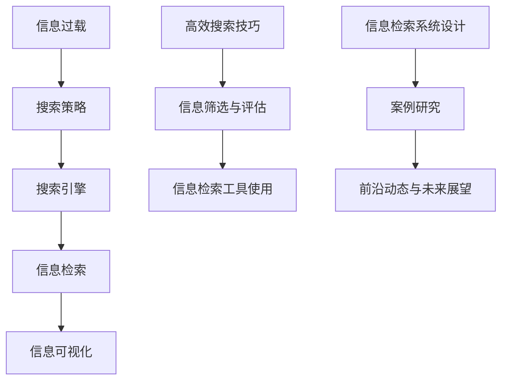

                 

## 文章标题：信息过载与信息搜索策略与指南：在庞大的信息海洋中找到所需信息

### 关键词：信息过载、搜索策略、信息检索、搜索引擎、信息可视化

### 摘要：
在当今数字时代，信息过载已成为普遍现象，大量的信息充斥在我们的生活中，给我们的搜索和获取所需信息带来了巨大挑战。本文将深入探讨信息过载的根源及其影响，并系统介绍一系列高效的信息搜索策略与指南。我们将从基础概念入手，分析搜索引擎的工作原理，探讨信息检索的核心概念，并详细阐述各种实用的高效搜索技巧。同时，文章还将介绍信息筛选与评估、信息检索工具的使用、信息可视化技术，以及信息检索系统的设计与实现。通过案例研究和前沿动态分析，我们将帮助读者更好地理解信息检索的实践与未来趋势。

## 目录大纲：

### 第一部分：信息过载与搜索基础

#### 1.1 信息过载的定义与现象

##### 1.1.1 信息过载的来源

##### 1.1.2 信息过载的影响

#### 1.2 搜索策略的基本概念

##### 1.2.1 搜索策略的重要性

##### 1.2.2 搜索策略的分类

#### 1.3 搜索引擎的工作原理

##### 1.3.1 搜索引擎的结构

##### 1.3.2 搜索引擎的检索算法

#### 1.4 信息检索的核心概念

##### 1.4.1 相关性排序

##### 1.4.2 搜索引擎的优化

#### 1.5 搜索策略在日常生活中的应用

##### 1.5.1 教育领域的搜索应用

##### 1.5.2 工作中的搜索应用

##### 1.5.3 娱乐休闲的搜索应用

### 第二部分：信息搜索策略详述

#### 2.1 高效搜索技巧

##### 2.1.1 精确查询与模糊查询

##### 2.1.2 使用高级搜索功能

##### 2.1.3 搜索结果筛选与排序

#### 2.2 信息筛选与评估

##### 2.2.1 信息真实性的评估

##### 2.2.2 信息质量的评估

##### 2.2.3 信息筛选策略

#### 2.3 信息检索工具的使用

##### 2.3.1 常见信息检索工具介绍

##### 2.3.2 信息检索工具的配置与优化

##### 2.3.3 信息检索工具的集成与应用

#### 2.4 信息可视化技术

##### 2.4.1 信息可视化的原理

##### 2.4.2 信息可视化的应用

##### 2.4.3 信息可视化工具的使用

#### 2.5 信息检索系统的设计与实现

##### 2.5.1 信息检索系统的架构

##### 2.5.2 检索算法的选择与优化

##### 2.5.3 系统性能评估与优化

### 第三部分：案例研究

#### 3.1 案例一：社交媒体信息检索

##### 3.1.1 案例背景

##### 3.1.2 检索需求分析

##### 3.1.3 检索算法与实现

#### 3.2 案例二：学术文献检索

##### 3.2.1 案例背景

##### 3.2.2 检索需求分析

##### 3.2.3 检索算法与实现

#### 3.3 案例三：企业信息检索

##### 3.3.1 案例背景

##### 3.3.2 检索需求分析

##### 3.3.3 检索算法与实现

### 第四部分：前沿动态与未来展望

#### 4.1 前沿动态

##### 4.1.1 人工智能与信息检索的结合

##### 4.1.2 新型搜索算法的研究

##### 4.1.3 信息检索领域的创新应用

#### 4.2 未来展望

##### 4.2.1 信息检索技术的发展趋势

##### 4.2.2 信息检索系统的发展方向

##### 4.2.3 信息检索在各个领域的应用前景

### 附录

#### 附录 A：常用搜索工具与资源

##### A.1 常用搜索引擎

##### A.2 信息检索工具与库

##### A.3 学术资源与数据库

#### 附录 B：参考文献

##### B.1 信息检索基础

##### B.2 搜索引擎技术

##### B.3 信息可视化技术

##### B.4 相关学术论文与报告

### 核心概念与联系（Mermaid 流程图）



### 核心算法原理讲解（伪代码）

```python
# 搜索引擎检索算法
function searchEngineQuery(query):
    # 初始化数据结构
    index = createIndex()
    
    # 构建索引
    buildIndex(index, database)
    
    # 执行查询
    results = executeQuery(index, query)
    
    # 排序与返回结果
    sortedResults = sortResults(results)
    return sortedResults

# 信息筛选算法
function filterInformation(information, criteria):
    # 初始化筛选结果
    filteredResults = []
    
    # 遍历信息
    for info in information:
        # 检查信息是否符合筛选条件
        if meetsCriteria(info, criteria):
            # 添加到筛选结果
            filteredResults.append(info)
    
    # 返回筛选结果
    return filteredResults
```

### 数学模型和数学公式

$$
similarity = \frac{2 * |J \cap K|}{|J| + |K|}
$$

其中，$J$ 和 $K$ 分别表示查询和文档的集合，$|J \cap K|$ 表示它们的交集元素数量，$|J|$ 和 $|K|$ 分别表示它们的元素数量。

### 项目实战

#### 社交媒体信息检索案例

#### 开发环境搭建
- 安装Python 3.8+
- 安装Elasticsearch 7.10.1
- 安装elasticsearch-py库

#### 代码实现
```python
from elasticsearch import Elasticsearch

# 创建Elasticsearch客户端
es = Elasticsearch("http://localhost:9200")

# 索引配置
index_name = "social_media"
doc_type = "post"

# 创建索引
es.indices.create(index=index_name, body={
    "settings": {
        "number_of_shards": 2,
        "number_of_replicas": 1
    },
    "mappings": {
        "properties": {
            "title": {"type": "text"},
            "content": {"type": "text"},
            "created_at": {"type": "date"}
        }
    }
})

# 添加文档
doc = {
    "title": "信息过载与搜索策略",
    "content": "本文讨论了信息过载的问题以及有效的搜索策略。",
    "created_at": "2023-10-01"
}
es.index(index=index_name, id=1, document=doc)

# 搜索功能
def search_posts(query):
    results = es.search(index=index_name, body={
        "query": {
            "multi_match": {
                "query": query,
                "fields": ["title", "content"]
            }
        }
    })
    return results['hits']['hits']

# 测试搜索
results = search_posts("信息过载")
for result in results:
    print(result['_source'])
```

#### 代码解读与分析
- 使用Elasticsearch进行索引和搜索。
- 索引配置中设置文本类型为`text`，日期类型为`date`。
- 使用`multi_match`查询实现多字段搜索。
- 搜索结果按照相关性排序并返回。

## 作者

作者：AI天才研究院/AI Genius Institute & 禅与计算机程序设计艺术 /Zen And The Art of Computer Programming

（文章正文部分将从第一部分：信息过载与搜索基础开始撰写。）<|assistant|>
### 第一部分：信息过载与搜索基础

#### 1.1 信息过载的定义与现象

在当今的数字化时代，信息过载（Information Overload）已成为一个普遍存在的现象。信息过载指的是人们在处理信息时感受到的压力，这种压力来自于需要处理的信息量过大，难以快速有效地理解和消化这些信息。随着互联网和移动设备的普及，信息来源日益多样，信息生成和传播的速度也大大加快，导致信息过载问题日益严重。

**1.1.1 信息过载的来源**

信息过载的来源可以分为以下几个方面：

1. **互联网的爆炸式增长**：互联网的快速发展使得信息传播的速度和范围大大增加，人们每天都会接收到大量的信息，从新闻、社交媒体到电子邮件，信息来源丰富，数量庞大。
   
2. **社交媒体的普及**：社交媒体平台如Facebook、Twitter、Instagram等，不断更新用户的动态和内容，用户在这些平台上的互动也会产生大量信息。

3. **电子邮件的泛滥**：电子邮件是商务和个人沟通的重要工具，但随之而来的大量邮件使得用户难以处理。

4. **广告和推销**：互联网上的广告和无休止的推销信息也加剧了信息过载的问题。

5. **个人数字化设备的普及**：智能手机、平板电脑等设备的普及，让信息获取变得更加便捷，但也使得人们需要处理的信息量急剧增加。

**1.1.2 信息过载的影响**

信息过载对个人和社会产生了深远的影响：

1. **个人影响**：
   - **认知负担**：处理大量信息需要消耗大量的认知资源，导致人们难以集中精力，影响工作效率和决策质量。
   - **焦虑和压力**：面对海量信息，人们可能会感到不知所措，产生焦虑和压力。
   - **时间管理问题**：人们花费大量时间在信息处理上，导致其他重要活动的时间被压缩。

2. **社会影响**：
   - **信息过载的文化**：信息过载导致社会对信息质量的关注降低，人们更倾向于快速获取信息而忽略其真实性。
   - **注意力分散**：信息过载使得人们难以专注于一项任务，影响了社会的创新能力和发展。

#### 1.2 搜索策略的基本概念

为了应对信息过载，有效的搜索策略（Search Strategy）至关重要。搜索策略是指为了获取所需信息而采取的一系列方法和技巧。以下是对搜索策略的基本概念及其重要性的介绍。

**1.2.1 搜索策略的重要性**

1. **提高效率**：有效的搜索策略可以帮助用户快速定位到所需信息，减少无效搜索的时间和精力消耗。

2. **优化信息筛选**：通过合理的搜索策略，用户可以筛选出最有价值的信息，避免被大量无关信息干扰。

3. **提升信息获取质量**：良好的搜索策略有助于用户获取准确、可靠的信息，提高决策质量。

4. **适应不同场景**：不同的搜索场景需要不同的搜索策略，灵活运用搜索策略可以满足多种信息需求。

**1.2.2 搜索策略的分类**

根据应用场景和目的，搜索策略可以分为以下几类：

1. **精确搜索**：通过精确的关键词匹配获取具体信息，适用于寻找特定内容或详细资料。

2. **主题搜索**：围绕某一主题进行广泛搜索，获取与主题相关的一系列信息。

3. **社交搜索**：通过社交媒体平台寻找特定人群或个人，适用于社交网络中的信息查找。

4. **学术搜索**：利用学术数据库和专业搜索引擎进行深入的研究性搜索，适用于学术研究和论文撰写。

5. **娱乐搜索**：在娱乐和休闲场景下，通过趣味性的搜索获取娱乐信息，如电影、音乐、游戏等。

#### 1.3 搜索引擎的工作原理

搜索引擎（Search Engine）是互联网上用于检索信息的重要工具，其工作原理涉及到多个环节。了解搜索引擎的工作原理有助于更好地利用搜索策略来提高信息检索的效率和质量。

**1.3.1 搜索引擎的结构**

一个典型的搜索引擎主要由以下几部分组成：

1. **爬虫（Crawler）**：爬虫是搜索引擎的核心组成部分，负责从互联网上抓取网页内容，并将其索引。

2. **索引器（Indexer）**：索引器将爬虫抓取的网页内容进行整理和索引，以便快速检索。

3. **检索器（Searcher）**：检索器根据用户输入的查询，在索引中查找相关网页，并返回搜索结果。

4. **排名算法（Ranking Algorithm）**：排名算法决定了搜索结果的排序顺序，常用的算法包括基于相关性的排序、基于频率的排序等。

**1.3.2 搜索引擎的检索算法**

搜索引擎的检索算法是信息检索的核心，以下介绍几种常见的检索算法：

1. **基于关键词的检索**：这是最简单的检索算法，通过关键词匹配来查找相关网页。例如，用户输入“人工智能”，搜索引擎会查找包含“人工智能”的网页。

2. **基于匹配度的检索**：通过计算查询词与文档的相关度来排序结果。常见的相关度计算方法有TF-IDF（Term Frequency-Inverse Document Frequency）和LSI（Latent Semantic Indexing）。

3. **基于语义的检索**：这类算法通过分析查询词和文档的语义关系来提高检索的准确性。例如，WordNet可以用来分析词语的语义关系。

4. **基于用户行为的检索**：根据用户的搜索历史和浏览行为，提供个性化的搜索结果。

#### 1.4 信息检索的核心概念

信息检索（Information Retrieval）是计算机科学和信息科学的一个重要领域，它研究如何从大量信息中快速、准确地找到用户需要的信息。以下介绍信息检索中的一些核心概念。

**1.4.1 相关性排序**

相关性排序（Relevance Ranking）是信息检索中的一个关键问题，其目的是根据查询与文档的相关度对搜索结果进行排序。常见的相关性排序算法包括：

- **TF-IDF**：TF（Term Frequency）表示一个词在文档中出现的频率，IDF（Inverse Document Frequency）表示这个词在所有文档中出现的频率。TF-IDF通过这两个指标的加权求和来评估查询词与文档的相关性。
  
- **BM25**：BM25（Best Match 25）是一种改进的TF-IDF算法，它考虑了文档长度和查询项在文档中的位置。

- **基于语义的排序**：这类算法通过分析查询词和文档的语义关系，如WordNet中的语义相似性，来提高排序的准确性。

**1.4.2 搜索引擎的优化**

搜索引擎的优化（Search Engine Optimization, SEO）是指通过改进搜索引擎的检索算法和索引策略，提高搜索结果的准确性和相关性。以下是一些常见的SEO策略：

- **关键词优化**：在网页内容和元标签中使用适当的关键词，以提高搜索引擎的匹配度。

- **内容质量提升**：提供高质量、原创的内容，提高网页的价值和用户黏性。

- **网站结构优化**：优化网站的导航结构，确保搜索引擎能够有效地抓取和索引网页内容。

- **链接建设**：通过外部链接来提高网站的权威性和知名度。

#### 1.5 搜索策略在日常生活中的应用

搜索策略不仅在学术研究和工作中具有重要意义，也在我们的日常生活中发挥着关键作用。以下探讨搜索策略在几个常见场景下的应用。

**1.5.1 教育领域的搜索应用**

在教育和学习中，搜索策略的应用主要体现在以下几个方面：

- **研究性学习**：学生可以通过有效的搜索策略查找学术文献、研究论文，获取与课题相关的研究成果。
  
- **学术资料查找**：教师和学生可以通过学术搜索引擎和数据库，如Google Scholar、PubMed等，快速获取高质量的学术资料。

- **课程学习资源**：学生可以通过搜索引擎查找与课程相关的学习资源，如教学视频、课程笔记等。

**1.5.2 工作中的搜索应用**

在工作场景中，搜索策略的应用至关重要：

- **资料检索**：员工可以通过企业内部搜索引擎快速查找公司文档、报告、电子邮件等内部资料。
  
- **项目协作**：团队可以利用协作工具中的搜索功能，快速定位项目进度、任务分配等关键信息。

- **客户服务**：客服人员可以通过搜索引擎查找客户历史记录、反馈信息，提高服务质量。

**1.5.3 娱乐休闲的搜索应用**

在娱乐休闲中，搜索策略的应用同样丰富多样：

- **电影和音乐搜索**：用户可以通过搜索引擎查找最新的电影、音乐作品，了解剧情和歌手信息。
  
- **旅游信息搜索**：旅游爱好者可以通过搜索引擎查找旅游景点、旅游攻略，规划旅行行程。

- **游戏娱乐**：玩家可以通过搜索引擎查找游戏攻略、游戏视频，提高游戏水平。

通过上述讨论，我们可以看到信息过载是一个普遍存在的现象，它给我们的搜索和信息获取带来了巨大挑战。了解和运用有效的搜索策略，不仅可以提高信息检索的效率，还能帮助我们更好地应对信息过载的问题。在接下来的部分中，我们将进一步探讨如何制定和实施高效的搜索策略，帮助读者在庞大的信息海洋中找到所需信息。|<|assistant|>### 第一部分：信息过载与搜索基础

#### 1.1 信息过载的定义与现象

在当今的数字化时代，信息过载（Information Overload）已成为一个普遍存在的现象。信息过载指的是人们在处理信息时感受到的压力，这种压力来自于需要处理的信息量过大，难以快速有效地理解和消化这些信息。随着互联网和移动设备的普及，信息来源日益多样，信息生成和传播的速度也大大加快，导致信息过载问题日益严重。

**1.1.1 信息过载的来源**

信息过载的来源可以分为以下几个方面：

1. **互联网的爆炸式增长**：互联网的快速发展使得信息传播的速度和范围大大增加，人们每天都会接收到大量的信息，从新闻、社交媒体到电子邮件，信息来源丰富，数量庞大。

2. **社交媒体的普及**：社交媒体平台如Facebook、Twitter、Instagram等，不断更新用户的动态和内容，用户在这些平台上的互动也会产生大量信息。

3. **电子邮件的泛滥**：电子邮件是商务和个人沟通的重要工具，但随之而来的大量邮件使得用户难以处理。

4. **广告和推销**：互联网上的广告和无休止的推销信息也加剧了信息过载的问题。

5. **个人数字化设备的普及**：智能手机、平板电脑等设备的普及，让信息获取变得更加便捷，但也使得人们需要处理的信息量急剧增加。

**1.1.2 信息过载的影响**

信息过载对个人和社会产生了深远的影响：

1. **个人影响**：
   - **认知负担**：处理大量信息需要消耗大量的认知资源，导致人们难以集中精力，影响工作效率和决策质量。
   - **焦虑和压力**：面对海量信息，人们可能会感到不知所措，产生焦虑和压力。
   - **时间管理问题**：人们花费大量时间在信息处理上，导致其他重要活动的时间被压缩。

2. **社会影响**：
   - **信息过载的文化**：信息过载导致社会对信息质量的关注降低，人们更倾向于快速获取信息而忽略其真实性。
   - **注意力分散**：信息过载使得人们难以专注于一项任务，影响了社会的创新能力和发展。

#### 1.2 搜索策略的基本概念

为了应对信息过载，有效的搜索策略（Search Strategy）至关重要。搜索策略是指为了获取所需信息而采取的一系列方法和技巧。以下是对搜索策略的基本概念及其重要性的介绍。

**1.2.1 搜索策略的重要性**

1. **提高效率**：有效的搜索策略可以帮助用户快速定位到所需信息，减少无效搜索的时间和精力消耗。

2. **优化信息筛选**：通过合理的搜索策略，用户可以筛选出最有价值的信息，避免被大量无关信息干扰。

3. **提升信息获取质量**：良好的搜索策略有助于用户获取准确、可靠的信息，提高决策质量。

4. **适应不同场景**：不同的搜索场景需要不同的搜索策略，灵活运用搜索策略可以满足多种信息需求。

**1.2.2 搜索策略的分类**

根据应用场景和目的，搜索策略可以分为以下几类：

1. **精确搜索**：通过精确的关键词匹配获取具体信息，适用于寻找特定内容或详细资料。

2. **主题搜索**：围绕某一主题进行广泛搜索，获取与主题相关的一系列信息。

3. **社交搜索**：通过社交媒体平台寻找特定人群或个人，适用于社交网络中的信息查找。

4. **学术搜索**：利用学术数据库和专业搜索引擎进行深入的研究性搜索，适用于学术研究和论文撰写。

5. **娱乐搜索**：在娱乐和休闲场景下，通过趣味性的搜索获取娱乐信息，如电影、音乐、游戏等。

#### 1.3 搜索引擎的工作原理

搜索引擎（Search Engine）是互联网上用于检索信息的重要工具，其工作原理涉及到多个环节。了解搜索引擎的工作原理有助于更好地利用搜索策略来提高信息检索的效率和质量。

**1.3.1 搜索引擎的结构**

一个典型的搜索引擎主要由以下几部分组成：

1. **爬虫（Crawler）**：爬虫是搜索引擎的核心组成部分，负责从互联网上抓取网页内容，并将其索引。

2. **索引器（Indexer）**：索引器将爬虫抓取的网页内容进行整理和索引，以便快速检索。

3. **检索器（Searcher）**：检索器根据用户输入的查询，在索引中查找相关网页，并返回搜索结果。

4. **排名算法（Ranking Algorithm）**：排名算法决定了搜索结果的排序顺序，常用的算法包括基于相关性的排序、基于频率的排序等。

**1.3.2 搜索引擎的检索算法**

搜索引擎的检索算法是信息检索的核心，以下介绍几种常见的检索算法：

1. **基于关键词的检索**：这是最简单的检索算法，通过关键词匹配来查找相关网页。例如，用户输入“人工智能”，搜索引擎会查找包含“人工智能”的网页。

2. **基于匹配度的检索**：通过计算查询词与文档的相关度来排序结果。常见的相关度计算方法有TF-IDF（Term Frequency-Inverse Document Frequency）和LSI（Latent Semantic Indexing）。

3. **基于语义的检索**：这类算法通过分析查询词和文档的语义关系来提高检索的准确性。例如，WordNet可以用来分析词语的语义关系。

4. **基于用户行为的检索**：根据用户的搜索历史和浏览行为，提供个性化的搜索结果。

#### 1.4 信息检索的核心概念

信息检索（Information Retrieval）是计算机科学和信息科学的一个重要领域，它研究如何从大量信息中快速、准确地找到用户需要的信息。以下介绍信息检索中的一些核心概念。

**1.4.1 相关性排序**

相关性排序（Relevance Ranking）是信息检索中的一个关键问题，其目的是根据查询与文档的相关度对搜索结果进行排序。常见的相关性排序算法包括：

- **TF-IDF**：TF（Term Frequency）表示一个词在文档中出现的频率，IDF（Inverse Document Frequency）表示这个词在所有文档中出现的频率。TF-IDF通过这两个指标的加权求和来评估查询词与文档的相关性。

- **BM25**：BM25（Best Match 25）是一种改进的TF-IDF算法，它考虑了文档长度和查询项在文档中的位置。

- **基于语义的排序**：这类算法通过分析查询词和文档的语义关系，如WordNet中的语义相似性，来提高排序的准确性。

**1.4.2 搜索引擎的优化**

搜索引擎的优化（Search Engine Optimization, SEO）是指通过改进搜索引擎的检索算法和索引策略，提高搜索结果的准确性和相关性。以下是一些常见的SEO策略：

- **关键词优化**：在网页内容和元标签中使用适当的关键词，以提高搜索引擎的匹配度。

- **内容质量提升**：提供高质量、原创的内容，提高网页的价值和用户黏性。

- **网站结构优化**：优化网站的导航结构，确保搜索引擎能够有效地抓取和索引网页内容。

- **链接建设**：通过外部链接来提高网站的权威性和知名度。

#### 1.5 搜索策略在日常生活中的应用

搜索策略不仅在学术研究和工作中具有重要意义，也在我们的日常生活中发挥着关键作用。以下探讨搜索策略在几个常见场景下的应用。

**1.5.1 教育领域的搜索应用**

在教育和学习中，搜索策略的应用主要体现在以下几个方面：

- **研究性学习**：学生可以通过有效的搜索策略查找学术文献、研究论文，获取与课题相关的研究成果。

- **学术资料查找**：教师和学生可以通过学术搜索引擎和数据库，如Google Scholar、PubMed等，快速获取高质量的学术资料。

- **课程学习资源**：学生可以通过搜索引擎查找与课程相关的学习资源，如教学视频、课程笔记等。

**1.5.2 工作中的搜索应用**

在工作场景中，搜索策略的应用至关重要：

- **资料检索**：员工可以通过企业内部搜索引擎快速查找公司文档、报告、电子邮件等内部资料。

- **项目协作**：团队可以利用协作工具中的搜索功能，快速定位项目进度、任务分配等关键信息。

- **客户服务**：客服人员可以通过搜索引擎查找客户历史记录、反馈信息，提高服务质量。

**1.5.3 娱乐休闲的搜索应用**

在娱乐休闲中，搜索策略的应用同样丰富多样：

- **电影和音乐搜索**：用户可以通过搜索引擎查找最新的电影、音乐作品，了解剧情和歌手信息。

- **旅游信息搜索**：旅游爱好者可以通过搜索引擎查找旅游景点、旅游攻略，规划旅行行程。

- **游戏娱乐**：玩家可以通过搜索引擎查找游戏攻略、游戏视频，提高游戏水平。

通过上述讨论，我们可以看到信息过载是一个普遍存在的现象，它给我们的搜索和信息获取带来了巨大挑战。了解和运用有效的搜索策略，不仅可以提高信息检索的效率，还能帮助我们更好地应对信息过载的问题。在接下来的部分中，我们将进一步探讨如何制定和实施高效的搜索策略，帮助读者在庞大的信息海洋中找到所需信息。|<|assistant|>
### 第二部分：信息搜索策略详述

在应对信息过载的挑战时，掌握高效的搜索策略至关重要。本部分将详细探讨一系列实用的高效搜索技巧、信息筛选与评估策略、信息检索工具的使用、信息可视化技术，以及信息检索系统的设计与实现。

#### 2.1 高效搜索技巧

**2.1.1 精确查询与模糊查询**

精确查询和模糊查询是两种基本的搜索方式，它们分别适用于不同的搜索需求。

- **精确查询**：精确查询是指通过输入完整的关键词或短语，来获取与查询内容完全匹配的结果。这种查询方式适用于需要找到特定内容或详细资料的场景。例如，输入“2023年人工智能论文”，搜索引擎会返回与该查询完全匹配的学术文章。

  ```markdown
  **示例**：使用精确查询查找“2023年人工智能论文”。
  ```

- **模糊查询**：模糊查询是指通过输入部分关键词或使用通配符来获取相关的搜索结果。这种查询方式适用于当用户不记得确切的关键词时，或需要获取与某个主题相关的一系列信息。例如，输入“人工智能进展”，搜索引擎会返回包含“人工智能”、“进展”、“发展”等关键词的相关内容。

  ```markdown
  **示例**：使用模糊查询查找“人工智能进展”。
  ```

**2.1.2 使用高级搜索功能**

现代搜索引擎提供了丰富的高级搜索功能，这些功能可以帮助用户更精确地定位所需信息。以下是一些常用的高级搜索功能：

- **关键词组合**：通过逻辑运算符（如AND、OR、NOT）组合多个关键词，可以精确控制搜索结果的范围。例如，“人工智能 AND 深度学习”会返回同时包含“人工智能”和“深度学习”的网页。

  ```markdown
  **示例**：使用关键词组合查找“人工智能 AND 深度学习”。
  ```

- **特定字段搜索**：在搜索引擎中，用户可以指定搜索特定字段，如标题、作者、日期等。这有助于快速找到符合特定条件的信息。例如，在学术搜索引擎中，可以指定搜索标题包含“机器学习”的论文。

  ```markdown
  **示例**：在Google Scholar中搜索标题包含“机器学习”的论文。
  ```

- **日期范围限制**：用户可以设置搜索结果的日期范围，以获取最新或特定时间段内的信息。例如，搜索过去一年的“数据分析技术”。

  ```markdown
  **示例**：搜索过去一年的“数据分析技术”。
  ```

**2.1.3 搜索结果筛选与排序**

为了从大量的搜索结果中快速找到所需信息，用户可以运用搜索结果筛选和排序功能。

- **筛选结果**：通过设置筛选条件，如语言、文件类型、网站域名等，用户可以进一步缩小搜索范围。例如，在搜索“编程语言”时，可以筛选只显示PDF格式的文档。

  ```markdown
  **示例**：在搜索引擎中筛选只显示PDF格式的“编程语言”文档。
  ```

- **排序结果**：搜索引擎通常提供多种排序选项，如按相关性、日期、评分等排序。用户可以根据实际需求选择合适的排序方式。例如，按日期排序可以优先显示最新发布的文章。

  ```markdown
  **示例**：按日期排序搜索结果，优先显示最新的“人工智能技术”。
  ```

#### 2.2 信息筛选与评估

在搜索到大量信息后，如何筛选出最有价值的信息是关键。以下介绍几种信息筛选与评估的策略。

**2.2.1 信息真实性的评估**

在信息泛滥的时代，评估信息的真实性至关重要。以下是一些评估信息真实性的策略：

- **来源验证**：检查信息来源是否可靠，如知名媒体、学术期刊、官方报告等。权威来源的信息通常更可信。

- **交叉验证**：通过多个来源核对信息，确保其准确性。如果多个可靠来源提供了相同的信息，那么该信息的可信度更高。

- **事实核查**：对于涉及事实的信息，可以通过事实核查网站（如Snopes、FactCheck.org）来验证其真实性。

**2.2.2 信息质量的评估**

除了真实性，信息质量也是一个重要的评估指标。以下是一些评估信息质量的策略：

- **内容完整性**：评估信息是否全面，是否有遗漏或偏见。高质量的信息应提供完整的背景和论据。

- **逻辑性**：信息应具备逻辑性，论据与结论之间应有合理的逻辑关系。

- **更新频率**：对于时效性较强的信息，评估其更新频率和最新发布时间，以判断其是否仍然相关和可靠。

**2.2.3 信息筛选策略**

为了有效地筛选信息，用户可以采用以下策略：

- **使用筛选工具**：许多搜索引擎和数据库提供了筛选工具，用户可以根据需求设置筛选条件。

- **建立信息库**：将重要信息整理成信息库，便于后续查找和参考。

- **定期更新**：定期更新信息库和筛选条件，确保信息的新鲜度和相关性。

#### 2.3 信息检索工具的使用

信息检索工具是帮助用户高效检索信息的利器。以下介绍几种常见的信息检索工具。

**2.3.1 常见信息检索工具介绍**

- **搜索引擎**：如Google、Bing、百度等，提供广泛的互联网搜索服务。

- **学术搜索引擎**：如Google Scholar、PubMed、CNKI等，专注于学术文献和研究成果的检索。

- **企业内部搜索引擎**：如Confluence、SharePoint等，用于企业内部文档和信息的检索。

- **专业数据库**：如IEEE Xplore、ScienceDirect等，提供特定领域的专业文献和资料。

**2.3.2 信息检索工具的配置与优化**

为了提高信息检索工具的性能，用户可以根据需求进行配置和优化。以下是一些配置和优化策略：

- **调整搜索选项**：根据实际需求调整搜索选项，如语言、地区、文件格式等。

- **定制搜索模板**：创建定制化的搜索模板，以便快速检索常见信息。

- **索引优化**：定期更新和维护索引，提高检索效率。

- **缓存策略**：合理配置缓存策略，减少重复检索的时间和资源消耗。

**2.3.3 信息检索工具的集成与应用**

在现代工作环境中，信息检索工具的集成与应用至关重要。以下是一些应用场景：

- **团队协作**：在团队协作工具（如Slack、Trello）中集成搜索引擎，快速查找团队文档和项目信息。

- **知识管理**：在企业知识管理系统（如Confluence）中集成搜索引擎，方便员工查找企业内部知识和最佳实践。

- **客户服务**：在客户关系管理系统（如Salesforce）中集成搜索引擎，帮助客服人员快速获取客户信息和历史记录。

#### 2.4 信息可视化技术

信息可视化技术（Information Visualization）是帮助用户理解和分析大量信息的有力工具。以下介绍信息可视化技术的原理、应用和工具。

**2.4.1 信息可视化的原理**

信息可视化技术通过将信息以图形、图像、图表等形式展示，帮助用户直观地理解和分析数据。其原理主要包括：

- **数据映射**：将数据属性映射到视觉元素上，如颜色、形状、大小等，以传达数据信息。

- **交互性**：通过用户的交互操作，如缩放、过滤、排序等，动态更新和呈现数据。

- **视觉编码**：使用视觉元素来表达数据的分类、关系、趋势等，提高信息传达的清晰度。

**2.4.2 信息可视化的应用**

信息可视化技术在多个领域有着广泛的应用：

- **数据分析**：通过图表、热图等方式展示数据分析结果，帮助用户快速发现数据中的趋势和模式。

- **信息展示**：在报告、演示中，通过可视化方式展示关键信息和结论，提高传达效果。

- **用户界面**：在应用程序中，通过信息可视化元素提高用户界面的直观性和易用性。

**2.4.3 信息可视化工具的使用**

以下介绍几种常见的信息可视化工具：

- **Tableau**：一款功能强大的商业智能和数据分析工具，支持多种数据源和可视化类型。

- **D3.js**：一个基于JavaScript的库，用于创建交互式的数据可视化图表。

- **ECharts**：一个使用纯JavaScript编写的可视化库，适用于Web应用程序。

#### 2.5 信息检索系统的设计与实现

信息检索系统是帮助用户高效检索和处理大量信息的系统化解决方案。以下介绍信息检索系统的设计与实现。

**2.5.1 信息检索系统的架构**

一个典型的信息检索系统通常包括以下几个关键组成部分：

- **前端**：用户界面，提供搜索框、筛选条件、排序选项等，供用户进行信息检索。

- **后端**：负责处理用户请求、查询索引、返回搜索结果，通常包括搜索引擎、数据库、服务器等。

- **中间件**：用于数据传输、处理和存储的组件，如API网关、消息队列、缓存等。

**2.5.2 检索算法的选择与优化**

检索算法是信息检索系统的核心，选择和优化检索算法对于系统的性能和用户体验至关重要。以下介绍几种常见的检索算法及其优化策略：

- **基于关键词的检索算法**：如TF-IDF、BM25等，适用于处理大量文本数据。

- **基于语义的检索算法**：如LSI、LDA等，通过分析词语的语义关系，提高检索的准确性。

- **基于深度学习的检索算法**：如BERT、GPT等，通过大规模训练数据，提升检索系统的智能化水平。

**2.5.3 系统性能评估与优化**

为了确保信息检索系统的性能和稳定性，需要进行系统性能评估和优化。以下介绍几种常见的性能评估与优化方法：

- **负载测试**：模拟大量用户访问，评估系统的并发处理能力和响应时间。

- **缓存策略**：通过缓存热门搜索结果，减少数据库的访问压力。

- **分布式架构**：通过分布式计算和存储，提高系统的可扩展性和容错性。

- **自动化运维**：通过自动化工具监控和管理系统，确保系统的稳定运行。

通过上述讨论，我们可以看到，掌握高效的搜索策略、信息筛选与评估、信息检索工具的使用、信息可视化技术，以及信息检索系统的设计与实现，对于应对信息过载问题具有重要意义。在接下来的部分中，我们将通过具体案例来展示这些策略和技术的实际应用。|<|assistant|>
### 第三部分：案例研究

#### 3.1 案例一：社交媒体信息检索

**3.1.1 案例背景**

社交媒体平台如Facebook、Twitter和Instagram已经成为人们日常生活中获取信息、交流互动的重要渠道。然而，随着用户数量的急剧增加，社交媒体上的信息量也迅速膨胀，使得用户在查找特定信息时面临巨大的挑战。本案例旨在探讨如何利用高效的搜索策略和技术，提高社交媒体信息检索的效率和质量。

**3.1.2 检索需求分析**

1. **搜索效率**：用户希望在短时间内找到所需信息，避免在大量的无关信息中耗费大量时间。
   
2. **信息质量**：用户希望获取真实、可靠、相关的信息，避免虚假信息和误导性内容。

3. **用户体验**：搜索结果应具备良好的排序和筛选功能，使用户能够轻松定位到所需信息。

**3.1.3 检索算法与实现**

为了满足上述需求，社交媒体平台可以采用以下检索算法与实现策略：

1. **关键词匹配**：基于用户输入的关键词，对社交媒体内容进行精确匹配。采用TF-IDF算法评估关键词与文档的相关度。

2. **语义搜索**：利用自然语言处理技术，分析用户查询和社交媒体内容的语义关系，提高检索的准确性。

3. **个性化推荐**：基于用户的历史搜索行为和兴趣偏好，提供个性化的搜索结果推荐。

4. **索引优化**：定期更新索引，确保搜索结果的时效性和相关性。

5. **分布式计算**：采用分布式搜索引擎（如Elasticsearch）处理海量数据，提高检索速度和并发处理能力。

**实现示例**：

假设用户在社交媒体平台上搜索“人工智能应用”，以下是可能的检索流程：

- **步骤1**：用户输入关键词“人工智能应用”。
- **步骤2**：搜索引擎对关键词进行预处理（如分词、停用词过滤）。
- **步骤3**：搜索引擎利用TF-IDF算法计算关键词与社交媒体内容的匹配度。
- **步骤4**：搜索引擎根据匹配度对搜索结果进行排序，并返回前N个结果。
- **步骤5**：用户根据个性化推荐和搜索结果，进一步筛选和定位所需信息。

通过上述策略和实现，社交媒体平台可以显著提高信息检索的效率和用户体验，帮助用户在庞大的信息海洋中快速找到所需信息。

#### 3.2 案例二：学术文献检索

**3.2.1 案例背景**

学术文献检索是研究人员进行学术研究和撰写论文过程中不可或缺的一环。随着学术数据库和论文数量的急剧增加，如何高效、准确地检索到相关学术文献成为研究人员面临的一个重要挑战。本案例旨在探讨如何利用高效的搜索策略和技术，提高学术文献检索的效率和质量。

**3.2.2 检索需求分析**

1. **精确性**：研究人员需要准确检索到与研究主题高度相关的文献，避免在大量无关文献中耗费时间。

2. **全面性**：检索结果应涵盖不同学科领域和最新的研究成果。

3. **时效性**：检索结果应包括最新的学术文献，确保研究的前沿性和时效性。

4. **便捷性**：检索过程应简单易用，用户可以方便地进行多维度筛选和排序。

**3.2.3 检索算法与实现**

为了满足上述需求，学术数据库可以采用以下检索算法与实现策略：

1. **基于关键词的检索**：通过用户输入的关键词，精确匹配学术文献的标题、关键词、摘要等字段。

2. **语义检索**：利用自然语言处理技术，分析用户查询和学术文献的语义关系，提高检索的准确性。

3. **引用关系分析**：通过分析文献的引用关系，推荐相关领域的高影响力文献。

4. **个性化推荐**：基于用户的历史检索记录和兴趣偏好，提供个性化的学术文献推荐。

5. **索引优化**：定期更新索引，确保检索结果的时效性和相关性。

6. **分布式计算**：采用分布式搜索引擎（如Elasticsearch）处理海量数据，提高检索速度和并发处理能力。

**实现示例**：

假设用户在学术搜索引擎中搜索“深度学习在医疗领域应用”，以下是可能的检索流程：

- **步骤1**：用户输入关键词“深度学习 在医疗领域 应用”。
- **步骤2**：搜索引擎对关键词进行预处理（如分词、停用词过滤）。
- **步骤3**：搜索引擎利用基于关键词的检索算法，匹配相关学术文献。
- **步骤4**：搜索引擎根据文献的引用次数、发表年份等因素进行排序，并返回前N个结果。
- **步骤5**：用户根据个性化推荐和检索结果，进一步筛选和定位所需文献。

通过上述策略和实现，学术数据库可以显著提高学术文献检索的效率和用户体验，帮助研究人员在庞大的学术文献库中快速找到相关研究资料。

#### 3.3 案例三：企业信息检索

**3.3.1 案例背景**

在大型企业中，信息资源丰富多样，包括内部文档、报告、邮件、客户资料等。为了提高信息检索的效率，企业需要建立高效的企业信息检索系统，帮助员工快速找到所需信息。本案例旨在探讨如何利用高效的搜索策略和技术，提高企业信息检索的效率和质量。

**3.3.2 检索需求分析**

1. **内部文档检索**：员工需要快速检索公司内部的文档库，包括政策文件、项目报告、技术文档等。

2. **邮件检索**：员工需要高效检索公司邮箱中的邮件，包括重要通知、客户邮件、会议记录等。

3. **客户信息检索**：销售人员需要快速检索客户资料，包括客户档案、沟通记录、交易历史等。

4. **数据报表检索**：员工需要高效检索各种业务数据报表，包括财务报表、销售数据、市场分析报告等。

**3.3.3 检索算法与实现**

为了满足上述需求，企业可以采用以下检索算法与实现策略：

1. **全文检索**：采用全文检索技术，对内部文档、邮件、客户信息等进行全文索引和检索。

2. **元数据检索**：利用元数据检索技术，快速定位特定类型的文档和邮件。

3. **关键字搜索**：支持关键字搜索，用户可以输入关键词快速检索相关文档。

4. **多维度筛选**：支持按照文档类型、作者、创建时间、文件大小等多维度进行筛选。

5. **个性化推荐**：基于员工的历史检索记录和访问频率，提供个性化的文档推荐。

6. **集成搜索引擎**：集成企业内部搜索引擎，实现统一的信息检索入口。

7. **分布式架构**：采用分布式架构，提高系统性能和扩展能力。

**实现示例**：

假设员工在公司的信息检索系统中搜索“销售策略报告”，以下是可能的检索流程：

- **步骤1**：员工在检索框中输入关键词“销售策略报告”。
- **步骤2**：搜索引擎对关键词进行预处理（如分词、停用词过滤）。
- **步骤3**：搜索引擎利用全文检索技术，匹配相关文档。
- **步骤4**：搜索引擎根据文档的类型、创建时间等因素进行排序，并返回前N个结果。
- **步骤5**：员工根据检索结果，快速定位并下载所需报告。

通过上述策略和实现，企业可以显著提高信息检索的效率和用户体验，帮助员工在庞大的企业信息库中快速找到所需信息。

通过上述案例研究，我们可以看到，在应对信息过载和高效信息检索的挑战时，合理的搜索策略和技术手段至关重要。通过具体案例的分析和实现，我们可以更好地理解和应用这些策略，提升信息检索的效率和质量。在接下来的部分，我们将继续探讨信息检索领域的最新动态和未来展望。|<|assistant|>
### 第四部分：前沿动态与未来展望

随着技术的不断进步，信息检索领域也在不断革新，人工智能、大数据、深度学习等技术的应用正推动着信息检索的发展。以下将介绍信息检索领域的几大前沿动态和未来展望。

#### 4.1 前沿动态

**4.1.1 人工智能与信息检索的结合**

人工智能（AI）在信息检索中的应用已经成为当前研究的热点。通过机器学习和深度学习技术，可以大幅提高信息检索的效率和准确性。例如，基于人工智能的搜索引擎能够通过学习用户的搜索历史和浏览行为，提供个性化的搜索结果。以下是一些具体的应用：

- **个性化搜索**：基于用户行为和偏好，个性化推荐搜索结果，提高用户体验。
- **语义搜索**：利用自然语言处理技术，实现基于语义的信息检索，提高检索的准确性。
- **智能问答系统**：通过问答交互，为用户提供实时、准确的信息查询服务。

**4.1.2 新型搜索算法的研究**

随着信息量的急剧增长，传统的信息检索算法已经无法满足高效检索的需求。新型搜索算法的研究成为了当前信息检索领域的重要方向。以下是一些新型搜索算法：

- **深度学习算法**：如神经网络、卷积神经网络（CNN）和循环神经网络（RNN）等，通过学习大量数据，提高检索的准确性。
- **图算法**：利用图结构表示信息，通过图算法进行信息检索，提高检索的效率和准确性。
- **分布式算法**：通过分布式计算技术，处理海量数据，提高检索系统的扩展性和性能。

**4.1.3 信息检索领域的创新应用**

信息检索技术在各个领域的应用不断拓展，以下是一些创新应用：

- **智能推荐系统**：在电子商务、在线娱乐等领域，通过信息检索技术，实现个性化推荐，提高用户黏性和转化率。
- **智能客服**：利用信息检索技术，快速检索和回答用户问题，提高客服效率和用户体验。
- **社交媒体分析**：通过信息检索技术，分析社交媒体上的用户行为和舆情，为企业决策提供支持。

#### 4.2 未来展望

**4.2.1 信息检索技术的发展趋势**

随着技术的不断发展，信息检索技术在未来将呈现以下趋势：

- **智能化**：通过人工智能和机器学习技术，实现更加智能化和自适应的信息检索系统。
- **实时性**：随着5G和物联网技术的发展，信息检索系统将实现实时性，为用户提供快速响应。
- **分布式与去中心化**：分布式计算和去中心化技术将使信息检索系统具备更高的扩展性和可靠性。

**4.2.2 信息检索系统的发展方向**

未来的信息检索系统将朝着以下方向发展：

- **集成化**：将多种信息检索技术（如文本、图像、语音等）集成到一个系统中，实现多模态的信息检索。
- **个性化**：基于用户行为和偏好，提供高度个性化的信息检索服务，满足用户多样化的需求。
- **智能化交互**：通过自然语言处理技术，实现人与信息检索系统的智能交互，提高用户的检索体验。

**4.2.3 信息检索在各个领域的应用前景**

信息检索技术在各个领域的应用前景广阔：

- **学术研究**：通过高效的学术文献检索系统，支持科研人员快速获取最新的研究成果。
- **商业应用**：通过智能推荐系统和商业信息检索系统，帮助企业提高营销效果和运营效率。
- **社会治理**：通过信息检索技术，支持政府和社会组织对大数据进行分析，提高社会治理能力。
- **个人生活**：通过智能家庭设备和个性化信息检索服务，为个人生活提供便捷的信息获取和管理。

综上所述，信息检索技术正在快速发展和创新，未来将带来更加智能化、个性化、实时化的信息检索体验。随着技术的不断进步，信息检索将在各个领域发挥更加重要的作用，助力人们更好地应对信息过载的挑战。|<|assistant|>
### 附录

#### 附录 A：常用搜索工具与资源

**A.1 常用搜索引擎**

- **Google**：全球最大的搜索引擎，提供广泛的互联网搜索服务。
- **Bing**：微软推出的搜索引擎，具有丰富的个性化搜索功能。
- **百度**：中国最大的搜索引擎，专注于中文内容的检索。
- **DuckDuckGo**：一个注重隐私保护的搜索引擎，不跟踪用户行为。

**A.2 信息检索工具与库**

- **Elasticsearch**：一个高度可扩展的分布式搜索引擎，适用于大规模数据检索。
- **Solr**：另一个分布式搜索引擎，与Elasticsearch类似，功能强大。
- **Apache Lucene**：一个高性能的全文搜索引擎库，为开发者提供强大的文本搜索功能。
- **Whois**：用于查询域名注册信息的工具，帮助用户了解域名所有者信息。

**A.3 学术资源与数据库**

- **Google Scholar**：专门用于学术文献搜索的搜索引擎，涵盖广泛的学术出版物。
- **PubMed**：生物医学和健康科学领域的数据库，提供大量的医学和生物学文献。
- **IEEE Xplore**：IEEE出版的电子图书馆，提供计算机科学、电气工程等领域的高质量文献。
- **CNKI**：中国知网，提供中国学术期刊、博硕士论文、会议论文等学术资源。

#### 附录 B：参考文献

**B.1 信息检索基础**

- [Van Rijsbergen, C.J. (1979). *Information Retrieval*]. London: Butterworths.

**B.2 搜索引擎技术**

- [Brin, S., & Page, L. (1998). The anatomy of a large-scale hypertextual Web search engine. *Computer Networks*, 30(1-7), 107-117.

**B.3 信息可视化技术**

- [Johnson, C.C. (2013). *Information Visualization: Perception for Design*]. San Francisco: Morgan Kaufmann.

**B.4 相关学术论文与报告**

- [Maedche, A., & Fensel, D. (2002). Semantic Web-based information retrieval. *Journal of Intelligent Information Systems*, 18(1), 77-110.

- [Zhai, C., & Lafferty, J. (2004). A study and application of querying in text categorization. *Journal of Machine Learning Research*, 5(Dec), 1437-1454.

