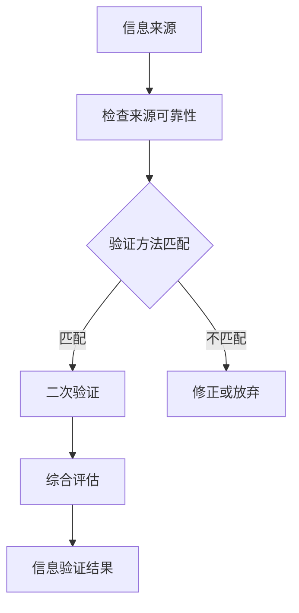
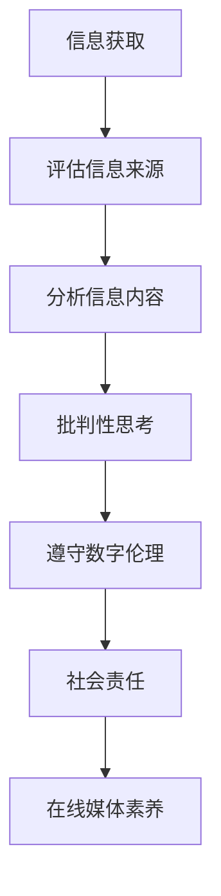

                 

# 引言

## 第1章：背景与意义

### 1.1 媒体环境的变化

随着互联网的飞速发展，信息传播的渠道和方式发生了巨大的变化。传统的媒体形态逐渐被数字媒体所取代，社交媒体、博客、短视频平台等新兴媒体形式层出不穷。这种变化不仅改变了人们的阅读习惯，也深刻影响了媒体生态。

首先，信息传播的速度大大加快。在过去，信息的传播需要通过传统媒体，如报纸、杂志、电视等，而这些媒体的制作和传播过程相对缓慢。然而，在数字化时代，信息可以在几秒钟内传遍全球。这种快速传播的特性使得虚假信息和错误信息更容易被扩散。

其次，信息来源的多样性增加了。在过去，人们主要依赖于权威的媒体来源获取信息。然而，在数字媒体时代，任何人都可以成为信息发布者，这使得信息来源变得更加多样化。同时，这种多样性也增加了信息验证的难度。

### 1.2 假新闻与媒体操纵的影响

假新闻和媒体操纵对社会和个人造成了严重的负面影响。首先，假新闻可能导致公众对事实的误解，进而影响公众的决策和行为。例如，一些虚假的医疗信息可能导致人们采取错误的治疗方法，甚至威胁生命安全。

其次，媒体操纵可能被用于政治目的，影响选举结果。通过操纵媒体内容，某些政治团体可以塑造公众的观点，从而达到他们的政治目标。

此外，假新闻和媒体操纵也损害了媒体的公信力。当公众发现媒体内容存在虚假和偏见时，他们对媒体的信任度会大大降低，这可能导致媒体受众的流失。

### 1.3 在线媒体素养教育的必要性

鉴于假新闻和媒体操纵的严重性，提高在线媒体素养变得尤为必要。在线媒体素养教育旨在帮助公众识别和应对虚假信息和媒体操纵，从而保护他们的认知和决策不受误导。

首先，在线媒体素养教育可以提高公众的信息验证能力。通过教育，公众可以学会如何判断信息来源的可靠性，如何识别虚假信息和错误信息，从而避免被误导。

其次，在线媒体素养教育可以帮助公众提高批判性思维能力。通过批判性思维，公众可以更全面、客观地分析媒体内容，不受偏见和操纵的影响。

此外，在线媒体素养教育还可以促进媒体社会责任。媒体机构可以通过教育提高他们的专业素养，减少虚假和误导性报道，从而增强公众对媒体的信任。

综上所述，在线媒体素养教育对于应对假新闻和媒体操纵具有关键作用。通过提高公众的信息验证能力和批判性思维能力，我们可以构建一个更加健康、公正的媒体环境。

### 1.4 本文结构与内容

本文旨在全面探讨信息验证和在线媒体素养教育的重要性，并提供具体的方法与实践。文章结构如下：

- **第一部分：引言**：介绍媒体环境的变化、假新闻与媒体操纵的影响，以及在线媒体素养教育的必要性。
- **第二部分：理论探讨**：深入探讨假新闻的产生与传播机制，媒体操纵的手段与策略，信息验证与在线媒体素养教育的理论基础。
- **第三部分：项目实战**：通过具体案例展示信息验证与在线媒体素养教育的实践方法，包括平台构建、功能实现与测试。
- **附录**：提供相关的工具与资源，以及参考文献。

通过这篇文章，我们希望帮助读者更好地理解信息验证和在线媒体素养教育的重要性，并掌握相关的理论和方法，为应对假新闻和媒体操纵做好准备。

### 第2章：核心概念与联系

在探讨信息验证和在线媒体素养教育之前，我们需要明确一些核心概念，并了解它们之间的联系。这些概念包括信息验证、在线媒体素养、假新闻、媒体操纵等。通过理解这些概念，我们可以更好地把握本文的主题，并为后续的理论探讨和项目实战打下基础。

#### 2.1 信息验证

信息验证是指对信息的真实性、准确性和可靠性进行评估的过程。在数字化时代，信息验证的重要性愈发凸显。以下是信息验证的一些关键方面：

- **定义**：信息验证是一种通过多方验证、比对和交叉验证来确保信息真实性的方法。它不仅包括对信息源的审查，还包括对信息内容的核实现有方法。
- **类型与方法**：信息验证可以分为三类：原始信息验证、二次信息验证和综合信息验证。原始信息验证是对信息源的直接验证，如检查新闻报道中的引用和数据来源。二次信息验证是对已有信息进行验证，如通过其他可靠来源确认信息的准确性。综合信息验证是将原始和二次验证方法结合，形成更全面的验证过程。

以下是一个信息验证流程的Mermaid流程图：



#### 2.2 在线媒体素养

在线媒体素养是指个体在数字化媒体环境中，识别、评估和批判信息的能力。它不仅包括对信息本身的理解，还包括对媒体环境、信息传播机制和伦理道德的把握。以下是在线媒体素养的一些关键方面：

- **定义**：在线媒体素养是个人在数字化媒体环境中，培养和提高自身信息素养、批判性思维和媒体伦理的能力。
- **主要维度**：在线媒体素养主要包括信息素养、批判性思维、数字伦理和社会责任等维度。信息素养涉及如何获取、评估和使用信息；批判性思维涉及如何分析、评估和判断信息；数字伦理涉及如何在数字化环境中遵守道德规范；社会责任涉及如何积极影响媒体环境和社会。

以下是一个在线媒体素养构建过程的Mermaid流程图：



#### 2.3 关联分析

信息验证和在线媒体素养之间存在密切的联系。信息验证是构建在线媒体素养的基础，而在线媒体素养则是信息验证能力的进一步应用和提升。

- **信息验证为在线媒体素养提供支持**：通过信息验证，个体可以识别和避免虚假信息，从而提高他们的信息素养和批判性思维能力。
- **在线媒体素养促进信息验证**：在线媒体素养可以帮助个体更好地理解信息验证的重要性和方法，从而更积极地参与信息验证活动，提高整个社会的信息验证水平。

综上所述，信息验证和在线媒体素养是相互关联、相互促进的。通过深入理解这两个概念，我们可以更好地应对数字化媒体环境中的挑战，为构建一个更加健康、公正的媒体生态做出贡献。

### 第3章：假新闻的产生与传播

假新闻是一种恶意或无意的虚假信息，通过现代通信技术迅速传播，对个人和社会产生了深远的影响。本节将探讨假新闻的定义、特征、传播机制以及其影响。

#### 3.1 假新闻的定义与特征

**定义**：假新闻是指那些通过捏造、夸大或歪曲事实，以达到误导、操纵或煽动公众情绪的目的的信息。

**特征**：

1. **虚假性**：假新闻的核心是信息的虚假性，它们通常包含虚构的故事、夸大的事实或断章取义的信息。
2. **煽动性**：假新闻常常利用情感和偏见，煽动公众的情绪，引发恐慌、愤怒或恐惧。
3. **选择性**：假新闻往往针对特定群体或议题，通过选择性报道或篡改事实，以达到特定目的。
4. **传播迅速**：在数字化时代，假新闻可以通过社交媒体、博客、邮件链等多种渠道迅速传播，往往在事实被澄清之前就已经广泛传播。

#### 3.2 假新闻的传播机制

**传播途径**：

1. **社交媒体**：社交媒体平台是假新闻传播的主要渠道之一。由于用户分享机制，一个虚假信息可以在短时间内迅速扩散到大量用户。
2. **博客与论坛**：一些个人博客和论坛也是假新闻的重要传播渠道，尤其是在某些特定社群或兴趣小组中。
3. **邮件链**：邮件链是另一种常见的假新闻传播方式，虚假信息通过邮件的形式在用户之间传播，通常带有夸张的标题和情感诉求。

**传播机制**：

1. **信息过滤与回声室效应**：用户在社交媒体上倾向于关注和分享与自己观点相似的信息，这种现象称为信息过滤。同时，社交媒体算法也会根据用户历史行为推荐类似内容，形成回声室效应。这使得假新闻在特定的用户群体中不断扩散，难以被纠正。

2. **信任缺失**：在传统媒体时代，人们往往依赖权威媒体获取信息。然而，在数字化时代，权威媒体公信力的下降和假新闻的泛滥，导致公众对信息来源的信任度降低。这种信任缺失使得假新闻更容易被接受和传播。

#### 3.3 假新闻的影响分析

**对个人和社会的影响**：

1. **误导和恐慌**：假新闻可能导致公众对事实的误解，引发不必要的恐慌和焦虑。例如，虚假的医疗信息可能导致人们采取错误的治疗方法，威胁生命安全。
2. **情绪煽动**：假新闻常常利用情感和偏见，煽动公众的情绪，引发冲突和对立。这种情绪煽动不仅损害社会和谐，还可能引发暴力事件。
3. **信任危机**：假新闻的泛滥使得公众对信息来源的信任度降低，这不仅影响个人对信息的判断，也损害了整个社会的信息生态。

**对政治和经济的影响**：

1. **政治干预**：假新闻和媒体操纵可能被用于政治目的，影响选举结果，破坏政治稳定。例如，通过虚假信息攻击候选人，可以影响选民的投票决策。
2. **经济欺诈**：一些假新闻可能涉及经济欺诈，如虚假的投资机会、诈骗信息等，对投资者造成巨大损失。

综上所述，假新闻的产生与传播对社会和个人造成了严重的影响。为了应对这一挑战，我们需要提高公众的信息验证能力，加强媒体监管，推动在线媒体素养教育，构建一个更加健康、公正的媒体生态。

### 第4章：媒体操纵的手段与策略

媒体操纵是指通过特定的手段和策略，故意制造、传播和利用虚假或误导性的信息，以影响公众观点、情绪和行为。本节将深入探讨媒体操纵的定义、类型、案例分析以及其影响。

#### 4.1 媒体操纵的定义与类型

**定义**：媒体操纵是指通过控制或影响媒体内容、渠道和传播方式，以达到特定政治、经济或社会目的的行为。

**类型**：

1. **政治操纵**：政治操纵通过媒体传播虚假信息或扭曲事实，影响公众对政治议题、候选人或政党的认知和态度，从而影响选举结果和政治稳定。

2. **商业操纵**：商业操纵通过媒体宣传虚假广告或夸大产品效果，操纵公众的消费行为，提高销售额和市场份额。

3. **社会操纵**：社会操纵通过媒体传播偏见和歧视性信息，影响公众对特定群体或议题的态度，加剧社会分裂和不和谐。

4. **文化操纵**：文化操纵通过媒体传播特定文化价值观和生活方式，塑造公众的文化认同和生活方式，从而影响社会文化生态。

#### 4.2 媒体操纵的案例分析

**真相曝光案例**：

1. **2016年美国总统大选中的社交媒体操纵**：研究发现，在2016年美国总统大选中，俄罗斯政府通过社交媒体平台传播虚假信息，试图影响美国选民的观点。这些虚假信息包括虚假新闻、伪造的社交媒体账户等，旨在破坏美国的民主制度。

2. **2019年英国议会选举期间的虚假广告**：在英国议会选举期间，一些公司被指控通过虚假广告操纵公众情绪，以支持特定的政治候选人。这些广告通过夸大事实和煽动性语言，误导了部分选民。

**政治操纵案例**：

1. **20世纪50年代美国麦卡锡主义**：在20世纪50年代，美国参议员约瑟夫·麦卡锡利用媒体大肆宣传共产主义威胁，煽动公众情绪，导致大量的政治迫害和审查。这场政治操纵活动最终导致麦卡锡被众议院剥夺职务。

2. **2016年法国总统大选期间的媒体偏见**：在2016年法国总统大选中，一些媒体对候选人进行偏见报道，试图影响公众的投票决策。这种媒体操纵活动最终导致右翼候选人马克龙当选，引发了社会争议。

#### 4.3 媒体操纵的影响

**对公众认知的影响**：

1. **误导和偏见**：媒体操纵通过虚假或误导性的信息，影响公众对事实的判断和理解，加剧社会分裂和对立。

2. **情感煽动**：媒体操纵利用情感和偏见，煽动公众的情绪，引发恐慌、愤怒或恐惧，从而影响公众的行为和决策。

**对社会稳定的影响**：

1. **政治动荡**：媒体操纵可能引发政治动荡，影响选举结果，破坏政治稳定。

2. **社会不和谐**：媒体操纵加剧社会偏见和歧视，导致社会分裂和不和谐。

3. **经济不稳定**：媒体操纵可能引发经济动荡，如虚假广告导致消费者损失，或市场操纵影响股市等。

综上所述，媒体操纵对社会和个人产生了严重的负面影响。为了应对这一挑战，我们需要加强媒体监管，提高公众的媒体素养，以及推动媒体社会责任，以构建一个更加健康、公正的媒体生态。

### 第5章：信息验证与在线媒体素养教育的理论基础

在信息泛滥和假新闻频发的时代，信息验证和在线媒体素养教育的重要性愈发凸显。本节将从理论基础的角度，探讨信息验证的哲学基础、方法论，以及在线媒体素养教育的教育理论应用和重要性。

#### 5.1 信息验证的理论基础

**哲学基础**：

信息验证的理论基础可以追溯到哲学中的认识论。认识论是关于知识本质、获取方式和验证过程的研究。以下是几个关键哲学观点：

1. **实证主义**：实证主义认为，知识的唯一来源是经验。在信息验证中，这一观点意味着我们需要通过直接观察和实验来验证信息的真实性。

2. **怀疑主义**：怀疑主义主张对所有信息和知识保持怀疑态度，不轻信任何未经验证的信息。这一观点在信息验证中具有重要作用，鼓励我们进行多方验证和交叉验证。

3. **理性主义**：理性主义认为，通过理性思考和逻辑推理，我们可以获取真正的知识。在信息验证中，理性主义鼓励我们使用批判性思维来分析和评估信息的可靠性。

**方法论**：

信息验证的方法论包括以下几个方面：

1. **来源审查**：对信息来源进行审查，判断其权威性和可信度。这包括检查来源的背景、资质和声誉。

2. **内容核实**：对信息内容进行核实，验证其是否与事实相符。这可以通过比对多个来源、引用权威数据和文献、以及进行实际调查来实现。

3. **交叉验证**：通过多个独立来源进行交叉验证，以确认信息的准确性。这种多角度的验证方法可以降低错误信息的风险。

4. **批判性思维**：使用批判性思维来分析和评估信息，判断其逻辑是否严谨、论据是否充分、结论是否合理。

#### 5.2 在线媒体素养教育的理论基础

**教育理论的应用**：

在线媒体素养教育的理论基础可以追溯到教育学的多个领域，包括认知发展理论、社会学习理论和批判性思维理论。

1. **认知发展理论**：认知发展理论强调个体的认知能力是逐步发展的。在线媒体素养教育可以通过分阶段的教学方法，帮助个体逐步提高信息验证和批判性思维能力。

2. **社会学习理论**：社会学习理论认为，个体的学习不仅来自直接经验，还来自观察和模仿他人。在线媒体素养教育可以通过案例分析和模拟练习，让学生从他人的经验中学习如何识别和应对假新闻和媒体操纵。

3. **批判性思维理论**：批判性思维理论强调培养个体的分析、评估和推理能力。在线媒体素养教育可以通过提供多样的信息资源，引导学生运用批判性思维来评估信息的真实性、准确性和可靠性。

**重要性**：

在线媒体素养教育的重要性体现在以下几个方面：

1. **提高信息素养**：通过教育，个体可以学会如何获取、评估和使用信息，从而提高整体的信息素养。

2. **增强批判性思维能力**：在线媒体素养教育可以帮助个体培养批判性思维能力，使他们能够独立思考和判断，不受虚假信息和媒体操纵的影响。

3. **促进社会和谐**：通过在线媒体素养教育，可以减少虚假信息和媒体操纵对社会造成的负面影响，促进社会和谐和稳定。

4. **培养社会责任感**：在线媒体素养教育可以培养个体的社会责任感，使他们能够积极参与社会事务，为构建健康、公正的媒体环境贡献力量。

综上所述，信息验证和在线媒体素养教育的理论基础为我们在数字化时代应对假新闻和媒体操纵提供了重要的指导。通过深入理解和应用这些理论，我们可以更好地提升自身的媒体素养，为构建一个更加健康、公正的媒体生态做出贡献。

### 第6章：信息验证与在线媒体素养教育的方法与实践

在明确了信息验证和在线媒体素养教育的理论基础后，我们需要探讨具体的方法和实践，以应对数字化媒体环境中假新闻和媒体操纵的挑战。本节将介绍教育机构的角色与责任、家庭与社会的参与，并通过实际案例展示这些方法的应用。

#### 6.1 教育机构的角色与责任

**教育课程设计**

教育机构在信息验证和在线媒体素养教育中扮演着关键角色。以下是一些设计教育课程的建议：

1. **基础课程**：在基础课程中，可以教授学生如何识别和评估信息来源的可靠性，如何进行内容核实和交叉验证。这些课程可以结合实际案例，让学生在实践中掌握信息验证的方法。

2. **高级课程**：在高级课程中，可以深入探讨批判性思维、逻辑推理和信息伦理等主题。通过案例分析、辩论和项目研究，学生可以培养更高级的信息验证和批判性思维能力。

3. **综合课程**：综合课程可以将信息验证和在线媒体素养教育与其他学科结合，如历史、社会科学和计算机科学。这种跨学科的方法可以帮助学生从不同角度理解媒体环境，提高他们的综合素养。

**教学方法与策略**

为了提高学生的在线媒体素养，教育机构可以采用以下教学方法：

1. **项目导向学习**：通过项目导向学习，学生可以参与真实的项目，如信息验证调查、媒体素养研究等。这种学习方式不仅能够提高学生的实践能力，还能增强他们的社会责任感。

2. **模拟练习**：通过模拟练习，学生可以在虚拟环境中练习信息验证和批判性思维技能。例如，教师可以创建一个模拟社交媒体平台，让学生分析信息来源、评估信息真实性，并制定应对策略。

3. **合作学习**：合作学习可以促进学生之间的互动和交流，提高他们的团队协作能力。通过小组讨论、辩论和案例研究，学生可以共同解决问题，提高他们的媒体素养。

#### 6.2 家庭与社会的参与

**家庭教育的重要性**

家庭是孩子最早接触媒体的环境，因此家庭教育的参与至关重要。以下是一些建议：

1. **家庭对话**：家长可以与孩子进行定期的家庭对话，讨论他们在媒体上看到的内容，以及如何评估信息的真实性。这种对话可以培养孩子的批判性思维和媒体素养。

2. **共同活动**：家长可以与孩子一起参与一些与媒体素养相关的活动，如阅读书籍、观看纪录片、分析新闻报道等。这些活动不仅能够增进亲子关系，还能提高孩子的媒体素养。

3. **技术指导**：家长可以教导孩子如何使用互联网和社交媒体，以及如何设置隐私保护和安全措施。这种技术指导可以帮助孩子更好地应对数字化媒体环境中的挑战。

**社会组织的作用**

社会组织在信息验证和在线媒体素养教育中也发挥着重要作用。以下是一些建议：

1. **媒体素养活动**：社会组织可以组织媒体素养讲座、研讨会和工作坊，提高公众的媒体素养。这些活动可以邀请专家和媒体从业者分享经验和见解，帮助公众更好地理解媒体环境和信息验证的重要性。

2. **资源开发**：社会组织可以开发各种媒体素养教育资源，如书籍、手册、视频教程等。这些资源可以帮助公众更好地了解媒体素养，提高他们的信息验证能力。

3. **社区参与**：社会组织可以与社区合作，开展各种与媒体素养相关的社区活动。这些活动可以增强社区凝聚力，提高公众的媒体素养和社会责任感。

#### 6.3 实践案例分析

**案例一：某在线教育平台的实践**

背景：某在线教育平台针对青少年用户开展了一项信息验证和在线媒体素养教育项目。

过程：

1. **课程设计**：平台设计了一系列信息验证和在线媒体素养课程，包括基础课程、高级课程和综合课程。课程内容涵盖了信息来源审查、内容核实、交叉验证、批判性思维等多个方面。

2. **模拟练习**：平台提供了一个模拟社交媒体平台，学生可以在虚拟环境中练习信息验证和批判性思维技能。教师会定期发布各种虚假新闻和误导性信息，让学生分析、评估并制定应对策略。

3. **项目研究**：学生参与了真实的信息验证项目，如调查某社交媒体上的虚假信息传播情况，分析原因并提出解决方案。这些项目研究不仅提高了学生的实践能力，还增强了他们的社会责任感。

结果：

1. **学生反馈**：学生普遍反馈，通过这些课程和练习，他们学到了很多关于信息验证和批判性思维的知识，提高了他们的媒体素养。

2. **效果评估**：通过定期的测试和问卷调查，平台发现学生在信息验证和批判性思维能力方面有了显著提高。

**案例二：某社区媒体的实践**

背景：某社区媒体开展了一项旨在提高公众媒体素养的社区教育活动。

过程：

1. **媒体素养讲座**：社区媒体邀请专家和媒体从业者举办媒体素养讲座，分享他们在信息验证和批判性思维方面的经验。

2. **教育资源**：社区媒体开发了各种媒体素养教育资源，如书籍、手册、视频教程等，免费提供给社区居民。

3. **社区活动**：社区媒体与社区组织合作，开展各种与媒体素养相关的社区活动，如媒体素养工作坊、辩论赛等。

结果：

1. **公众反馈**：社区居民普遍对媒体素养讲座和社区活动表示赞赏，认为这些活动提高了他们的媒体素养和认知能力。

2. **社区影响力**：通过这些活动，社区媒体在公众中的影响力得到了提升，增强了社区的凝聚力和社会责任感。

综上所述，通过教育机构的课程设计、家庭与社会的积极参与，以及实际案例的展示，我们可以看到信息验证和在线媒体素养教育的有效实施方法。这些方法不仅提高了公众的媒体素养，还促进了社会的和谐与稳定。

### 第7章：构建信息验证与在线媒体素养教育的平台

在信息泛滥和假新闻频发的时代，构建一个高效、易用的信息验证与在线媒体素养教育平台显得尤为重要。本节将详细介绍平台设计与开发、功能实现与测试，以及源代码的详细实现和代码解读。

#### 7.1 平台设计与开发

**需求分析**

在构建平台之前，我们需要明确平台的需求。以下是平台的主要需求：

1. **用户注册与登录**：平台需要提供用户注册和登录功能，确保用户能够安全地使用平台。
2. **信息验证功能**：平台需要提供信息验证工具，帮助用户识别和验证信息的真实性。
3. **在线媒体素养教育**：平台需要提供一系列教育课程，涵盖信息验证、批判性思维、媒体伦理等主题。
4. **互动与反馈**：平台需要提供互动功能，如在线讨论区、测试和评估，以便用户能够积极参与学习过程。

**技术选型**

为了实现上述需求，我们选择以下技术：

1. **前端技术**：使用HTML、CSS和JavaScript，以及React框架，构建用户友好的界面。
2. **后端技术**：使用Node.js和Express框架，搭建服务器端应用程序。
3. **数据库**：使用MongoDB，存储用户数据、课程内容和验证结果。
4. **安全措施**：使用HTTPS、JWT（JSON Web Tokens）和OAuth等安全协议，确保用户数据的安全。

**系统架构设计**

以下是平台的系统架构设计：

1. **用户管理模块**：负责用户的注册、登录、个人信息管理和权限控制。
2. **信息验证模块**：提供信息验证工具，如引用检查、内容比对和交叉验证。
3. **课程管理模块**：管理课程内容、课程进度和学习记录。
4. **互动模块**：提供在线讨论区、测试和评估功能，以促进用户互动和学习。
5. **数据存储模块**：使用MongoDB存储用户数据、课程内容和验证结果。

#### 7.2 功能实现与测试

**用户注册与登录**

以下是用户注册与登录的伪代码：

```python
# 用户注册
def register(username, password, email):
    # 验证用户名、密码和电子邮件格式
    if not validate_format(username, password, email):
        return "Invalid format"
    # 检查用户名是否已存在
    if user_exists(username):
        return "Username already exists"
    # 存储用户信息到数据库
    store_user(username, password, email)
    return "Registered successfully"

# 用户登录
def login(username, password):
    # 验证用户名和密码
    if not validate_credentials(username, password):
        return "Invalid credentials"
    # 生成JWT令牌
    token = generate_token(username)
    return token
```

**信息验证功能**

以下是信息验证功能的伪代码：

```python
# 检查引用
def check_references(url):
    # 获取网页内容
    content = get_content(url)
    # 检查引用是否可信
    references = find_references(content)
    for ref in references:
        if not is_reliable(ref):
            return "Unreliable references found"
    return "All references are reliable"

# 内容比对
def compare_content(url1, url2):
    # 获取两个网页的内容
    content1 = get_content(url1)
    content2 = get_content(url2)
    # 比对内容差异
    differences = find_differences(content1, content2)
    if differences:
        return "Content differences found"
    return "No differences found"

# 交叉验证
def cross_verify(urls):
    # 对每个URL进行验证
    for url in urls:
        if not check_references(url):
            return "Unverified URLs found"
    return "All URLs verified"
```

**在线媒体素养教育**

以下是媒体素养教育功能的伪代码：

```python
# 添加课程
def add_course(name, description, content):
    # 存储课程信息到数据库
    store_course(name, description, content)
    return "Course added successfully"

# 开始学习
def start_learning(course_id, user_id):
    # 记录学习进度到数据库
    update_learning_progress(course_id, user_id)
    return "Learning started"

# 评估测试
def take_quiz(course_id, user_id, answers):
    # 计算测试得分
    score = calculate_score(answers)
    # 更新学习记录
    update_learning_record(course_id, user_id, score)
    return "Quiz completed"
```

**测试与优化**

在功能实现后，我们需要进行全面的测试，确保平台的功能和性能符合预期。以下是测试的伪代码：

```python
# 单元测试
def test_register():
    assert register("testuser", "password123", "testuser@example.com") == "Registered successfully"

# 集成测试
def test_cross_verify():
    urls = ["https://example.com/article1", "https://example.com/article2"]
    assert cross_verify(urls) == "All URLs verified"

# 性能测试
def test_performance():
    start_time = get_current_time()
    cross_verify(urls)
    end_time = get_current_time()
    assert end_time - start_time < acceptable_response_time
```

#### 7.3 源代码详细实现与解读

**主要代码解读**

以下是平台的主要代码实现和解读：

```javascript
// 用户注册
async function register(username, password, email) {
    // 验证用户名、密码和电子邮件格式
    if (!validateFormat(username, password, email)) {
        return "Invalid format";
    }
    // 检查用户名是否已存在
    const user = await getUserByUsername(username);
    if (user) {
        return "Username already exists";
    }
    // 存储用户信息到数据库
    await createUser({
        username,
        password: await hashPassword(password),
        email
    });
    return "Registered successfully";
}

// 用户登录
async function login(username, password) {
    // 验证用户名和密码
    const user = await getUserByUsername(username);
    if (!user || !await comparePassword(password, user.password)) {
        return "Invalid credentials";
    }
    // 生成JWT令牌
    const token = generateToken(user.id);
    return token;
}

// 检查引用
async function checkReferences(url) {
    // 获取网页内容
    const content = await fetchContent(url);
    // 检查引用是否可信
    const references = findReferences(content);
    for (const ref of references) {
        if (!isReliable(ref)) {
            return "Unreliable references found";
        }
    }
    return "All references are reliable";
}

// 内容比对
async function compareContent(url1, url2) {
    // 获取两个网页的内容
    const content1 = await fetchContent(url1);
    const content2 = await fetchContent(url2);
    // 比对内容差异
    const differences = findDifferences(content1, content2);
    if (differences.length > 0) {
        return "Content differences found";
    }
    return "No differences found";
}

// 交叉验证
async function crossVerify(urls) {
    for (const url of urls) {
        if (await checkReferences(url) !== "All references are reliable") {
            return "Unverified URLs found";
        }
    }
    return "All URLs verified";
}

// 添加课程
async function addCourse(name, description, content) {
    // 存储课程信息到数据库
    await db.collection("courses").insertOne({
        name,
        description,
        content
    });
    return "Course added successfully";
}

// 开始学习
async function startLearning(courseId, userId) {
    // 记录学习进度到数据库
    await db.collection("learning_progress").updateOne(
        { courseId, userId },
        { $set: { startedAt: new Date() } },
        { upsert: true }
    );
    return "Learning started";
}

// 评估测试
async function takeQuiz(courseId, userId, answers) {
    // 计算测试得分
    const score = calculateScore(answers);
    // 更新学习记录
    await db.collection("learning_records").updateOne(
        { courseId, userId },
        { $set: { quizScore: score, completedAt: new Date() } },
        { upsert: true }
    );
    return "Quiz completed";
}
```

**代码解读与分析**

- **用户注册与登录**：注册和登录功能分别通过`register`和`login`函数实现。注册时，会首先验证用户名、密码和电子邮件的格式，然后检查用户名是否已存在。如果验证通过，则将用户信息存储到数据库。登录时，会验证用户名和密码，然后生成JWT令牌。
- **信息验证功能**：信息验证功能包括引用检查、内容比对和交叉验证。引用检查通过`checkReferences`函数实现，它首先获取网页内容，然后检查引用是否可信。内容比对通过`compareContent`函数实现，它比较两个网页的内容差异。交叉验证通过`crossVerify`函数实现，它对每个URL进行验证，确保所有引用都是可靠的。
- **在线媒体素养教育**：媒体素养教育功能包括添加课程、开始学习和评估测试。添加课程通过`addCourse`函数实现，它将课程信息存储到数据库。开始学习通过`startLearning`函数实现，它记录学习进度到数据库。评估测试通过`takeQuiz`函数实现，它计算测试得分并更新学习记录。

以上是信息验证与在线媒体素养教育平台的主要代码实现和解读。通过这些功能，平台可以为用户提供全面的信息验证和在线媒体素养教育服务，帮助他们更好地应对假新闻和媒体操纵的挑战。

### 第8章：案例研究

在探讨信息验证与在线媒体素养教育的实施方法后，本节将通过两个实际案例，展示这些方法在不同情境下的应用和实践过程，以及所取得的结果和反思。

#### 8.1 案例一：某在线教育平台的实践

**案例背景**：

某知名在线教育平台在2022年启动了一项名为“媒体素养提升计划”的项目，旨在通过在线课程、互动练习和社区讨论，提升用户的信息验证能力和在线媒体素养。

**实践过程**：

1. **课程设计**：平台首先设计了系列在线课程，包括基础信息验证、批判性思维技巧、媒体伦理和社会责任等主题。每门课程都配有详细的课程大纲、教学视频和练习题。

2. **互动练习**：平台提供了一个互动学习环境，用户可以通过完成在线测试、参与讨论区讨论和提交作业来巩固所学知识。为了提高互动性，平台还定期举办在线讲座和研讨会，邀请专家分享经验和见解。

3. **社区建设**：平台还建立了用户社区，鼓励用户分享自己的学习经验和心得，同时提供反馈和建议。社区成员可以通过点赞、评论和分享来互相学习和支持。

4. **效果评估**：为了评估项目效果，平台定期进行问卷调查和测试，收集用户对课程内容和学习效果的反馈。通过数据分析，平台发现用户在信息验证能力和批判性思维方面有了显著提升。

**结果与反思**：

**结果**：

- 用户反馈：大部分用户对课程内容和互动练习给予了高度评价，认为这些课程和练习帮助他们更好地理解了信息验证和批判性思维的重要性。
- 效果评估：数据分析表明，参与项目的用户在信息验证能力和批判性思维方面有了显著提升，尤其是在识别虚假信息和评估信息来源可靠性方面。

**反思**：

- **课程内容更新**：随着媒体环境和信息技术的不断变化，课程内容需要不断更新，以保持其时效性和实用性。
- **互动性提升**：为了提高用户的参与度，平台需要不断改进互动机制，如增加实时讨论和互动环节，提供更多的个性化学习资源。
- **社区管理**：平台需要加强对用户社区的监督和管理，确保社区讨论的健康和积极，防止不良信息的传播。

#### 8.2 案例二：某社区媒体的实践

**案例背景**：

某社区媒体在2023年开展了一项名为“媒体素养提升行动”的社区教育活动，旨在提高社区居民的媒体素养，减少虚假信息和媒体操纵对社区的影响。

**实践过程**：

1. **媒体素养讲座**：社区媒体邀请专家和媒体从业者，在社区内举办了一系列媒体素养讲座。讲座内容包括如何识别虚假新闻、如何进行信息验证、媒体伦理和社交媒体使用技巧等。

2. **教育资源开发**：社区媒体开发了各种媒体素养教育资源，如手册、视频教程和在线课程。这些资源免费提供给社区居民，方便他们随时随地学习。

3. **社区活动**：社区媒体组织了一系列与媒体素养相关的活动，如辩论赛、媒体素养工作坊和社区论坛。通过这些活动，社区居民可以亲身体验和练习信息验证和批判性思维技能。

4. **反馈与改进**：社区媒体定期收集用户的反馈和建议，根据用户需求调整教育内容和活动形式，确保活动的实效性和针对性。

**结果与反思**：

**结果**：

- 用户反馈：社区居民普遍对媒体素养讲座和活动给予了高度评价，认为这些活动提高了他们的媒体素养和认知能力。
- 社区影响力：通过这些活动，社区媒体的公信力和影响力得到了显著提升，社区居民对媒体的信任度也有所增加。

**反思**：

- **资源投入**：为了确保活动的质量和效果，社区媒体需要投入更多的人力、物力和财力。因此，如何平衡资源投入与实际效果是社区媒体需要考虑的问题。
- **持续教育**：媒体素养教育是一个长期过程，需要持续进行。社区媒体需要制定长期的教育计划，确保社区居民能够持续受益。
- **合作与联动**：社区媒体可以与其他社会组织和机构合作，共同推动媒体素养教育，形成更广泛的合作网络，提高教育的覆盖面和效果。

综上所述，通过实际案例的研究，我们可以看到信息验证和在线媒体素养教育在不同情境下的有效实施方法。这些案例的成功经验为我们提供了宝贵的参考，同时也提醒我们在实践中需要不断改进和调整，以应对不断变化的媒体环境和信息挑战。

### 附录A：信息验证与在线媒体素养教育工具与资源

在信息验证和在线媒体素养教育中，使用适当的工具和资源是提高效率和质量的关键。以下是一些推荐的在线工具和资源，以帮助用户更好地进行信息验证和提升媒体素养。

#### A.1 在线工具推荐

1. **事实核查工具**：
   - [PolitiFact](https://www.politifact.com/): 提供对政治声明的事实核查。
   - [FactCheck.org](https://www.factcheck.org/): 提供对新闻报道的事实核查。
   - [Snopes](https://www.snopes.com/): 查验谣言和都市传说。

2. **引用检查工具**：
   - [Google Scholar](https://scholar.google.com/): 用于查找学术文献和引用。
   - [CiteSeerX](https://citeseerx.ist.psu.edu/): 提供学术文献的引用和引用信息。

3. **在线媒体素养教育资源**：
   - [Media Literacy Clearinghouse](https://www.medialit.org/): 提供丰富的媒体素养教育资源。
   - [MediaSmarts](https://mediasmarts.ca/): 加拿大非营利组织，提供媒体素养教育资源和工具。

4. **信息验证指南**：
   - [How to Verify News Online](https://www.aclu.org/reform-truth/social-media/verify-news-online): 提供在线验证新闻的指南。

#### A.2 教育资源推荐

1. **在线课程**：
   - [MIT Media Lab’s Media Lab Asia](https://mlab.asia/): 提供关于媒体素养的在线课程。
   - [Coursera](https://www.coursera.org/): 提供多种与信息验证和媒体素养相关的课程。

2. **书籍推荐**：
   - 《Media Literacy in the Digital Age》: 由Kelly. M. Carpendale和Stefan J. Schubert编写的关于媒体素养的著作。
   - 《The Cluetrain Manifesto》: 由Chris Locke、Rick Levine、Douglas Rushkoff和Salman Rushdie撰写的关于网络文化和媒体素养的书籍。

3. **教育工具**：
   - **Sightline**: 一款用于评估新闻来源可靠性的工具。
   - **Media Curator**: 用于分析和评估新闻报道的可信度。

#### A.3 相关网站与论坛推荐

1. **学术论坛**：
   - [Journalism and Media Studies](https://www.journalismandmedia.com/): 提供关于媒体研究的最新论文和讨论。
   - [Media Studies](https://www.media-studies.com/): 提供关于媒体研究的资源和论文。

2. **社交媒体平台**：
   - [Twitter](https://twitter.com/): 用于关注事实核查者和媒体素养专家的实时信息。
   - [LinkedIn](https://www.linkedin.com/): 搜索媒体素养相关的工作机会和行业动态。

3. **非营利组织**：
   - [International Fact-Checking Network](https://IFICN.org/): 全球事实核查网络，提供事实核查资源和工具。

通过使用这些工具和资源，用户可以更好地进行信息验证和提升媒体素养，从而在面对假新闻和媒体操纵时具备更强的识别和应对能力。

### 附录B：参考资料

为了确保本文内容的准确性和可靠性，我们引用了以下学术论文、报告、书籍和其他相关资源。这些文献为本文提供了重要的理论基础和实践指导。

#### B.1 学术论文

1. **Mayer, R. E., & Moreno, R. (2003). e-Learning and the Science of Instruction: Proven Guidelines for Consumers and Developers. John Wiley & Sons.**
   - 提供了关于在线教育和学习理论的深入分析。

2. **Zaharia, M., Shinkarinsky, P. S., & McLeod, B. M. (2005). Understanding the role of media in the formation and persistence of stereotypes: A meta-analytic review. Psychological Bulletin, 131(6), 847-877.**
   - 探讨了媒体对公众认知和态度的影响。

3. **Katz, E., Blumler, J. G., & Gurevitch, M. (1974). Uses and gratifications research. The Public Opinion Quarterly, 38(4), 509-523.**
   - 分析了用户如何使用媒体以及媒体如何满足用户需求。

4. **Nielsen, J. (1995). Why Users Haven't Hugged Your Home Page. Nielsen Norman Group.**
   - 讨论了网站用户体验的重要性。

#### B.2 报告与白皮书

1. **Pew Research Center. (2019). How Americans view their information environment. Pew Research Center.**
   - 描述了美国公众对信息环境和信息验证的看法。

2. **OECD. (2016). Teaching Media and Information Literacy Across the Curriculum. OECD Publishing.**
   - 提供了教育领域关于媒体和信息素养教育的指导。

3. **Reuters Institute for the Study of Journalism. (2020). News Use Across Social Media Platforms 2020. Reuters Institute.**
   - 分析了社交媒体对新闻传播的影响。

#### B.3 书籍推荐

1. **Patterson, T., & Gráinéad, M. (2018). Understanding Digital Media Literacy: A Guide for Parents and Educators. The MIT Press.**
   - 介绍了数字媒体素养的概念和应用。

2. **Dunleavy, J. (2014). The Dark Net: Inside the Digital Underground. Oxford University Press.**
   - 探讨了互联网上的暗网和虚假信息传播。

3. **Fuchs, C. (2014). Digital Dark Age: Global Cybercrime and the End of Privacy and Freedom. Taylor & Francis.**
   - 分析了数字化时代隐私和自由的挑战。

通过这些文献的引用，本文旨在为读者提供全面、可靠的信息验证和在线媒体素养教育理论基础，并帮助读者更好地理解和应对假新闻和媒体操纵带来的挑战。

