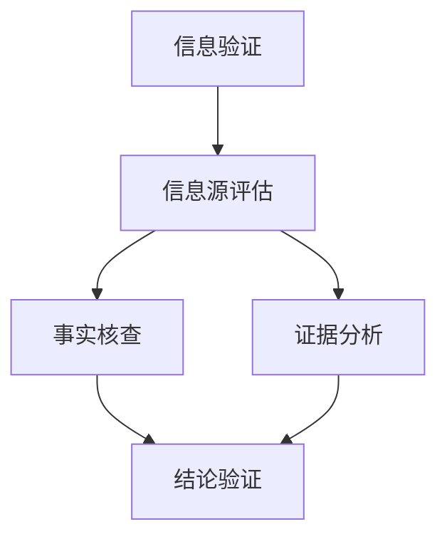

                 

### 《信息验证和批判性阅读指南：在假新闻和媒体操纵时代导航》

> **关键词：** 信息验证、批判性阅读、假新闻、媒体操纵、信息源评估、事实核查、算法、数学模型、社交媒体、公共政策、未来趋势。

> **摘要：** 在假新闻和媒体操纵泛滥的时代，本文旨在为读者提供一套完整的信息验证和批判性阅读指南。文章首先介绍了信息验证的基础知识，包括过程、步骤和方法；随后探讨了识别假新闻与媒体操纵的技巧；接着，介绍了批判性阅读的核心概念、策略和障碍克服方法；文章还通过实际案例，展示了文本分析、社交媒体中的应用，以及在不同领域的批判性阅读实践；最后，文章展望了信息验证和批判性阅读的未来趋势，并推荐了一系列信息验证与批判性阅读工具。

---

#### 第一部分：信息验证基础

在信息爆炸的时代，正确识别和验证信息的重要性不言而喻。第一部分将介绍信息验证的基础知识，帮助读者了解信息验证的重要性、过程与步骤，以及常用的信息验证方法和技术。

---

#### 第1章：信息验证概述

**1.1 信息验证的重要性**

在互联网时代，信息传播速度极快，真假信息交织在一起，对公众的认知和行为产生了深远的影响。信息验证的重要性体现在以下几个方面：

1. **防止误导和谣言的传播**：通过验证信息，可以防止误导和谣言的扩散，保护公众不受虚假信息的侵害。
2. **提高决策的准确性**：在商业、政治、医疗等各个领域，准确的信息是决策的基础。信息验证有助于提高决策的准确性。
3. **维护社会秩序**：虚假信息可能引发社会恐慌和不安，通过信息验证，可以维护社会秩序，减少不必要的恐慌和冲突。

**1.2 信息验证的过程与步骤**

信息验证通常包括以下几个步骤：

1. **确定验证目标**：明确需要验证的信息内容和目的。
2. **收集信息源**：从多个来源收集相关信息，包括新闻、研究报告、专家意见等。
3. **评估信息源可靠性**：评估信息来源的可靠性，包括来源的权威性、发布者的信誉等。
4. **交叉验证**：对信息进行交叉验证，通过多个来源对比，确认信息的准确性。
5. **记录和报告**：记录验证过程和结果，并撰写报告，供决策者参考。

**1.3 信息验证的方法与技术**

1. **事实核查**：通过专业的事实核查机构或工具，对信息进行验证。
2. **专家咨询**：咨询相关领域的专家，获取专业的意见和验证。
3. **数据分析**：运用统计学和数据挖掘技术，对信息进行分析和验证。
4. **比对法**：通过对比不同来源的信息，识别潜在的错误和矛盾。
5. **信息溯源**：追溯信息的原始出处，验证其真实性和可靠性。

---

#### 第2章：识别假新闻与媒体操纵

在信息泛滥的时代，假新闻和媒体操纵现象层出不穷，对公众的认知和社会稳定构成了严重威胁。本章节将探讨如何识别假新闻和媒体操纵，并提供相应的处理方法和批判性思维技巧。

---

**2.1 假新闻的识别与处理**

假新闻的识别和处理是信息验证的重要环节。以下是几种常见的假新闻识别和处理方法：

1. **来源审查**：审查信息来源的可靠性和权威性。如果来源不明或来源可疑，应谨慎对待。
2. **事实核查**：通过事实核查工具或机构，验证信息内容的真实性。
3. **内容分析**：分析新闻内容，识别潜在的误导、夸大或偏见。
4. **图片和视频验证**：通过图像识别技术，验证图片和视频的真实性。
5. **处理方法**：对于确认的假新闻，应采取及时、有效的处理措施，包括辟谣、曝光和追究法律责任。

**2.2 媒体操纵的表现形式与影响**

媒体操纵可能表现为以下几种形式：

1. **偏见性报道**：故意夸大或缩小某些事实，以支持特定的立场或观点。
2. **选择性报道**：只报道有利于特定群体或观点的信息，忽视其他观点。
3. **虚假信息**：故意传播虚假信息，以达到某种目的。
4. **操纵图像和视频**：通过技术手段，对图片和视频进行篡改，以误导公众。

媒体操纵的影响包括：

1. **误导公众**：虚假信息和偏见性报道可能导致公众对事实的误解。
2. **社会动荡**：媒体操纵可能引发社会恐慌、不满和冲突。
3. **损害公信力**：媒体操纵损害媒体的公信力和信誉，降低公众对媒体的信任度。

**2.3 媒体批判性思维与批判性阅读**

媒体批判性思维和批判性阅读是应对媒体操纵的有效手段。以下是几种批判性思维和阅读技巧：

1. **多角度思考**：从多个角度分析问题，避免单一视角的偏见。
2. **证据分析**：关注新闻中的证据和论据，评估其可靠性和逻辑性。
3. **情感分析**：识别新闻中的情感色彩，避免被情感操纵。
4. **来源追踪**：追溯新闻的原始出处，验证信息的真实性和可靠性。
5. **反思和总结**：在阅读新闻后，反思自己的观点，总结新闻中的关键信息。

---

通过本章节的学习，读者将能够识别假新闻和媒体操纵，并采取相应的处理方法，提高对信息的辨识度和判断力。下一章将深入探讨批判性阅读的核心概念和策略。

---

#### 第二部分：批判性阅读技巧

批判性阅读是一种积极的阅读方式，它要求读者不仅理解文本的内容，还要分析、评估和反思文本的论点、论据和逻辑结构。本部分将介绍批判性阅读的核心概念、原则与策略，以及克服批判性阅读过程中可能遇到的障碍。

---

#### 第3章：批判性阅读的核心概念

**3.1 批判性阅读的定义与目的**

批判性阅读是指读者在理解文本的基础上，通过分析、评估和反思，对文本的论点、论据和逻辑结构进行深入思考。其目的是帮助读者：

1. **理解文本的深层含义**：通过批判性阅读，读者能够深入理解文本的作者意图、观点和立场。
2. **评估文本的可信度**：读者能够评估文本中的证据、论据和逻辑是否合理，从而判断文本的可信度。
3. **发展批判性思维能力**：批判性阅读有助于培养读者的批判性思维能力，提高对信息的辨识度和判断力。

**3.2 批判性阅读的原则与策略**

批判性阅读应遵循以下原则和策略：

1. **多角度思考**：从不同的角度分析问题，避免单一视角的偏见。
2. **证据分析**：关注文本中的证据和论据，评估其可靠性和逻辑性。
3. **逻辑推理**：识别文本中的逻辑结构和推理过程，判断其是否合理。
4. **情感分析**：识别文本中的情感色彩，避免被情感操纵。
5. **反思与总结**：在阅读文本后，反思自己的观点，总结文本中的关键信息。

**3.3 批判性阅读的障碍与克服方法**

批判性阅读过程中可能会遇到以下障碍：

1. **认知偏见**：读者可能受到先入为主的观点和偏见的影响，难以客观分析文本。
2. **信息过载**：大量的信息可能导致读者无法有效地分析文本。
3. **时间限制**：有限的阅读时间可能使读者难以深入分析文本。

克服这些障碍的方法包括：

1. **主动阅读**：保持积极的态度，主动思考问题，避免被动接受信息。
2. **筛选信息**：优先关注文本中的关键信息和重要论点，避免被无关信息分散注意力。
3. **合理安排时间**：合理规划阅读时间，确保有足够的时间对文本进行深入分析。

---

通过本章节的学习，读者将了解批判性阅读的核心概念、原则和策略，学会克服阅读过程中的障碍，从而提高批判性阅读的能力。

---

#### 第4章：文本分析技巧

文本分析是批判性阅读的重要组成部分，它要求读者对文本的内容、结构、语言和语境进行深入分析。本章节将介绍文本分析的几个关键方面：文本来源与可靠性分析、论据、论点和逻辑分析，以及语言、情感和语境分析。

---

**4.1 文本的来源与可靠性分析**

文本的来源是判断其可靠性至关重要的一环。以下是几种文本来源与可靠性分析的技巧：

1. **权威性评估**：评估文本来源的权威性，包括专业背景、机构声誉、发布者的信誉等。
2. **交叉比对**：通过对比多个来源的文本，识别潜在的错误或偏见。
3. **信息溯源**：追溯文本的原始出处，确认其真实性和可靠性。
4. **搜索背景信息**：了解文本作者、发布机构和相关背景信息，评估其专业性和客观性。

**4.2 论据、论点和逻辑分析**

文本的论据、论点和逻辑结构是批判性阅读的核心。以下是几种分析技巧：

1. **识别论据**：识别文本中的论据，即支持论点的具体陈述。
2. **评估论据的有效性**：评估论据的可靠性和相关性，判断其是否充分支持论点。
3. **识别论点**：识别文本中的论点，即作者试图证明的观点。
4. **分析逻辑结构**：分析文本中的推理过程，判断其逻辑是否严密、合理。
5. **识别逻辑谬误**：识别文本中的逻辑谬误，如偷换概念、以偏概全等。

**4.3 语言、情感和语境分析**

文本的语言、情感和语境是理解文本深层含义的关键。以下是几种分析技巧：

1. **语言分析**：分析文本的语言表达，包括词汇选择、句式结构等，理解作者的意图和态度。
2. **情感分析**：识别文本中的情感色彩，判断作者的态度和倾向。
3. **语境分析**：理解文本产生的语境，包括社会、文化、历史背景等，评估文本的现实意义。
4. **识别隐含信息**：分析文本中的隐含信息和暗示，理解作者的深层意图。

---

通过本章节的学习，读者将掌握文本分析的关键技巧，能够更深入地理解文本，评估其可信度和价值，从而提高批判性阅读的能力。

---

#### 第5章：媒体案例分析

媒体案例是批判性阅读的重要实践，通过分析真实案例，读者可以更直观地理解信息验证和批判性阅读的技巧。本章节将介绍几个典型的媒体案例，包括真实新闻与假新闻的对比分析、媒体操纵的案例研究，以及批判性阅读在新闻报道中的应用。

---

**5.1 真实新闻与假新闻的对比分析**

真实新闻和假新闻在内容、形式和传播方式上存在明显差异。以下是几个对比分析的要点：

1. **内容对比**：
   - **真实新闻**：基于事实，提供准确的信息和详细的背景。
   - **假新闻**：往往夸大事实或完全捏造，以吸引读者注意力。
2. **形式对比**：
   - **真实新闻**：通常采用客观、平衡的叙述方式，注重事实的准确性和完整性。
   - **假新闻**：可能使用夸张的标题、煽动性的语言，甚至利用图片和视频篡改技术，以误导读者。
3. **传播方式对比**：
   - **真实新闻**：通过权威媒体发布，如报纸、电视台、专业网站等。
   - **假新闻**：通过社交媒体、博客、网络论坛等广泛传播，可能迅速获得大量关注和分享。

**5.2 媒体操纵的案例研究**

媒体操纵案例研究可以帮助读者理解媒体操纵的手段和影响。以下是几个典型的媒体操纵案例：

1. **案例一：政治宣传**
   - **背景**：某些政治宣传通过夸大或隐瞒事实，以支持特定政治立场。
   - **手段**：利用新闻报道、广告、社交媒体等渠道，传播具有偏向性的信息。
   - **影响**：导致公众对事实的误解，影响选举结果和社会稳定。

2. **案例二：谣言传播**
   - **背景**：谣言通常在社交媒体上迅速传播，影响公众情绪和行为。
   - **手段**：利用虚假图片、视频和文字，制造恐慌和混乱。
   - **影响**：破坏社会信任，引发社会动荡。

3. **案例三：商业宣传**
   - **背景**：某些商业机构通过夸大产品效果或隐瞒风险，进行不当宣传。
   - **手段**：利用广告、公关活动等手段，误导消费者。
   - **影响**：损害消费者权益，影响市场秩序。

**5.3 批判性阅读在新闻报道中的应用**

批判性阅读在新闻报道中的应用至关重要，以下是一些关键技巧：

1. **评估信息来源**：核实新闻报道的信息来源，确保其权威性和可靠性。
2. **分析报道内容**：关注报道中的论据、论点和逻辑结构，评估其合理性。
3. **对比多方观点**：通过对比不同媒体、不同观点的报道，获取更全面的视角。
4. **反思报道立场**：反思报道的立场和偏见，判断其可能对读者产生的影响。

---

通过本章节的案例分析，读者可以更直观地了解信息验证和批判性阅读的实践应用，提高对媒体信息的辨识力和判断力。

---

#### 第6章：批判性阅读在社交媒体中的应用

社交媒体已经成为信息传播的主要渠道之一，但同时也充斥着大量的虚假信息和媒体操纵。本章将探讨如何使用批判性阅读技巧来识别社交媒体上的假新闻和媒体操纵，并提供具体的实践方法和案例分析。

---

**6.1 社交媒体的信息验证方法**

社交媒体上的信息验证需要特别注意以下几个关键步骤：

1. **来源审查**：审查信息的发布者，包括其背景、信誉和以往发布的内容。
2. **事实核查**：使用事实核查工具（如 Google Fact Check Tools、Snopes 等）验证信息内容的真实性。
3. **图片和视频验证**：使用图像识别工具（如 Google Reverse Image Search）验证图片和视频的真实性。
4. **交叉比对**：通过对比多个来源的信息，识别潜在的错误或偏见。
5. **情感分析**：识别信息中的情感色彩，判断其可能的目的和影响。

**6.2 社交媒体中的假新闻识别**

在社交媒体上，识别假新闻需要特别关注以下几个要点：

1. **标题夸张**：假新闻的标题往往使用夸张或煽动性的语言，以吸引读者点击。
2. **证据缺失**：假新闻往往缺乏具体的证据或引用，难以证实。
3. **来源不明**：假新闻的来源往往不明确，或来自不可靠的网站和账号。
4. **逻辑谬误**：假新闻中可能包含逻辑谬误，如偷换概念、以偏概全等。
5. **传播速度**：假新闻在社交媒体上往往传播迅速，短时间内获得大量关注和分享。

**6.3 社交媒体中的批判性思维实践**

在社交媒体上，批判性思维实践可以帮助读者更好地识别和处理信息。以下是一些建议：

1. **多角度思考**：从不同的角度分析信息，避免单一视角的偏见。
2. **评估证据**：关注信息中的证据和论据，评估其可靠性和逻辑性。
3. **情感识别**：识别信息中的情感色彩，避免被情感操纵。
4. **反思与总结**：在阅读信息后，反思自己的观点，总结信息中的关键信息。
5. **互动反馈**：与他人互动，分享自己的观点和见解，获取反馈和补充信息。

**案例分析：**

**案例一：某社交媒体上的健康谣言**

- **问题**：某社交媒体上流传一条关于某种健康食品的谣言，声称这种食品具有神奇的功效，能够治愈多种疾病。
- **验证过程**：
  - **来源审查**：发现发布者是一个未经验证的账号，发布内容多为夸大其词的健康信息。
  - **事实核查**：使用事实核查工具验证，发现没有权威机构支持这种说法，且存在大量反驳证据。
  - **图片和视频验证**：通过图片识别工具，发现图片和视频内容被篡改。
  - **交叉比对**：对比多个来源的信息，发现类似谣言在其他社交媒体上也有流传，但都被辟谣。
- **结论**：该谣言为假新闻，不应轻信。

**案例二：社交媒体上的政治宣传**

- **问题**：某社交媒体上发布了一篇政治宣传文章，宣称某位政治候选人具备卓越的领导能力，能够解决国家面临的问题。
- **验证过程**：
  - **来源审查**：发现文章来源为某政治派别的官方网站，存在明显的偏见。
  - **事实核查**：查阅其他媒体和官方数据，发现文章中的论据和论点缺乏可靠证据。
  - **情感识别**：文章语言煽动性强，可能旨在激发特定群体的情绪。
  - **反思与总结**：结合多方面的信息，形成自己的观点，避免被单一来源的信息所影响。
- **结论**：该文章为政治宣传，读者应保持批判性思维，避免被单一视角所左右。

通过本章的学习，读者将掌握在社交媒体上识别和处理信息的方法，提高批判性阅读能力，从而更好地应对社交媒体上的假新闻和媒体操纵。

---

#### 第7章：政治与公共事务中的批判性阅读

政治和公共事务是公众关注的热点，也是假新闻和媒体操纵的常见领域。本章节将探讨如何进行政治和公共事务中的批判性阅读，包括信息源的可靠性分析、政治辩论中的批判性阅读技巧，以及公共政策的批判性解读。

---

**7.1 政治信息的来源与可靠性分析**

在政治领域中，信息的来源和可靠性至关重要。以下是一些分析政治信息来源和可靠性的方法：

1. **官方渠道**：优先考虑来自政府机构、官方声明和权威媒体的报道。
2. **学术研究**：查阅相关领域的学术研究和报告，了解问题的专业分析。
3. **多角度比对**：对比不同媒体和政治派别的报道，识别潜在的信息偏见。
4. **权威机构评估**：参考独立机构和专家对政治信息的评估和认证。
5. **历史经验**：结合历史经验和先前的政治事件，评估当前信息的可信度。

**7.2 政治辩论中的批判性阅读**

政治辩论中的批判性阅读要求读者具备敏锐的洞察力和分析能力。以下是一些建议：

1. **评估论据**：关注辩论中的论据，评估其可靠性和相关性。
2. **识别逻辑谬误**：识别辩论中的逻辑谬误，如偷换概念、以偏概全等。
3. **多角度分析**：从不同政治派别的观点进行分析，避免单一视角的偏见。
4. **情感识别**：识别辩论中的情感色彩，判断其可能的目的和影响。
5. **反思与总结**：在辩论结束后，反思自己的观点，总结辩论中的关键信息。

**7.3 公共政策的批判性解读**

公共政策的批判性解读对于公众理解和参与政策讨论至关重要。以下是一些建议：

1. **政策背景**：了解政策的背景和制定过程，包括政治、经济、社会等因素。
2. **利益相关者分析**：分析政策对各类利益相关者的影响，包括政府、企业、公众等。
3. **影响评估**：评估政策可能带来的长期和短期影响，包括经济、社会和环境等方面。
4. **政策比较**：对比不同政策的效果和可行性，识别潜在的优势和不足。
5. **公众参与**：鼓励公众参与政策讨论和决策过程，提高政策的透明度和公正性。

---

通过本章节的学习，读者将能够更深入地理解政治和公共事务中的批判性阅读技巧，提高对政策信息的辨识力和判断力，积极参与社会事务的讨论和决策。

---

#### 第8章：商业与金融中的批判性阅读

商业与金融领域充斥着大量的信息，包括市场报告、财务报表、投资建议等。这些信息不仅影响投资者的决策，也影响企业的运营和发展。批判性阅读在商业与金融领域尤为重要，它帮助读者评估信息的可靠性和价值，做出明智的决策。本章节将探讨商业和金融中的批判性阅读技巧，包括商业信息的解读与评估、金融报告的批判性阅读，以及投资决策中的批判性思维。

---

**8.1 商业信息的解读与评估**

商业信息的解读与评估是商业决策的重要环节。以下是一些关键技巧：

1. **财务报表分析**：通过阅读和分析财务报表（如资产负债表、利润表和现金流量表），了解企业的财务状况和经营成果。
   - **资产负债表**：关注企业的资产、负债和所有者权益，评估企业的财务稳定性。
   - **利润表**：分析企业的收入、成本和利润，评估其盈利能力。
   - **现金流量表**：关注企业的现金流入和流出，评估其现金流动性。

2. **市场分析**：通过市场报告和数据分析，了解行业趋势、竞争对手和消费者需求，为决策提供依据。
   - **行业报告**：了解行业的发展状况、市场份额和竞争态势。
   - **消费者调查**：分析消费者的购买行为和偏好，了解市场需求。

3. **风险评估**：评估商业决策可能带来的风险，包括市场风险、财务风险和法律风险等。
   - **市场风险**：评估市场波动对业务的影响。
   - **财务风险**：评估财务决策可能带来的风险，如债务负担、投资收益波动等。
   - **法律风险**：评估法律法规变化对企业运营的影响。

**8.2 金融报告的批判性阅读**

金融报告的批判性阅读对于投资者至关重要。以下是一些关键技巧：

1. **报告完整性**：确保阅读的金融报告是完整和最新的，避免基于过时或错误信息做出决策。

2. **数据一致性**：检查报告中的数据是否一致，是否存在矛盾或异常。

3. **指标分析**：分析报告中的关键财务指标，如市盈率（P/E）、市净率（P/B）、股息收益率等，评估企业的估值和投资价值。

4. **背景信息**：了解报告背景，包括企业的历史、行业状况、市场环境等，以更好地理解报告内容。

5. **风险提示**：注意报告中可能存在的风险提示和警告，评估这些风险对投资决策的影响。

**8.3 投资决策中的批判性思维**

投资决策需要批判性思维，以下是一些关键原则：

1. **多角度分析**：从多个角度分析投资机会，包括基本面分析、技术分析、市场情绪等。

2. **风险评估**：对每个投资机会进行风险评估，包括市场风险、信用风险、流动性风险等。

3. **长期视角**：采用长期视角，考虑投资的潜在回报和风险，避免短期波动的影响。

4. **组合管理**：通过资产配置和管理，分散投资风险，实现投资组合的稳健增长。

5. **持续学习**：不断学习和更新投资知识，跟踪市场动态，提高投资决策的准确性。

---

通过本章节的学习，读者将掌握商业与金融中的批判性阅读技巧，提高对商业和金融信息的辨识力和判断力，从而做出更明智的投资决策。

---

#### 第9章：批判性阅读实践

批判性阅读不仅需要理论知识，更需要实践应用。本章将介绍批判性阅读的实践项目设计，并提供具体的实施步骤，帮助读者将批判性阅读技巧应用到实际场景中。此外，本章还将探讨在实践中进行反思与改进的重要性。

---

**9.1 批判性阅读实践项目设计**

批判性阅读实践项目旨在通过实际操作，帮助读者掌握批判性阅读的技巧，提高对信息的辨识力和判断力。以下是一个设计批判性阅读实践项目的步骤：

1. **确定主题**：选择一个具有争议性和广泛讨论的话题，如气候变化、健康医疗、经济政策等。

2. **信息收集**：从多个来源收集关于该话题的文章、报告、评论等，包括权威媒体、专业机构、学术研究等。

3. **批判性阅读**：
   - **评估信息源**：对收集的信息源进行评估，确保其可靠性和权威性。
   - **分析文本**：对文本进行详细分析，识别其论点、论据和逻辑结构。
   - **评估证据**：评估文本中的证据和论据，判断其可靠性和相关性。

4. **综合评估**：将收集到的信息进行综合评估，形成自己的观点和立场。

5. **撰写报告**：撰写一份批判性阅读报告，包括分析过程、结论和反思。

6. **分享与讨论**：与他人分享报告，进行讨论和反馈，进一步提升批判性阅读能力。

**9.2 实践中的反思与改进**

反思与改进是批判性阅读实践的重要组成部分。以下是一些反思和改进的方法：

1. **效果评估**：在实践结束后，反思批判性阅读的效果，评估是否达到了预期目标。

2. **识别不足**：分析实践中存在的不足和问题，如信息源选择不当、分析不深入等。

3. **持续学习**：根据反思结果，查找相关资料，学习新的批判性阅读技巧和方法。

4. **实践调整**：根据反思和学习的成果，调整批判性阅读实践的项目设计和方法。

5. **迭代优化**：通过多次实践和反思，不断优化批判性阅读实践，提高信息辨识力和判断力。

---

通过本章的学习，读者将能够设计并实施批判性阅读实践项目，通过反思与改进，不断提升批判性阅读能力。

---

#### 第10章：信息验证与批判性阅读的未来趋势

信息验证和批判性阅读在当今社会的重要性日益凸显，随着技术的进步和社会的发展，这些领域也呈现出新的趋势。本章将探讨信息验证技术的发展、批判性阅读在教育中的应用，以及信息验证和批判性阅读的社会责任。

---

**10.1 信息验证技术的发展**

信息验证技术的快速发展为信息验证提供了强有力的支持。以下是一些关键趋势：

1. **人工智能与大数据分析**：利用人工智能和大数据分析技术，信息验证工具可以更快速、更准确地识别和验证信息。这些工具可以通过机器学习算法，从海量数据中提取有价值的信息，进行自动分析和验证。

2. **区块链技术**：区块链技术的应用可以提高信息的可信度和透明度。通过区块链，信息的每一次修改和验证都可以被记录和追溯，确保信息的真实性和完整性。

3. **跨平台协作**：未来的信息验证工具将实现跨平台的协作，用户可以在不同的设备上轻松验证信息，提高信息验证的便利性和效率。

4. **社交媒体整合**：信息验证工具将更加紧密地整合到社交媒体平台中，用户可以在社交媒体上直接验证信息，减少虚假信息的传播。

**10.2 批判性阅读在教育中的应用**

批判性阅读在教育中的应用越来越广泛，以下是一些关键趋势：

1. **课程设计**：批判性阅读将被纳入更多教育课程，帮助学生培养批判性思维和信息验证能力。

2. **在线资源**：学校和教师将利用在线资源和工具，为学生提供丰富的批判性阅读材料，鼓励学生积极参与讨论和思考。

3. **个性化学习**：通过数据分析，教育平台可以为学生提供个性化的批判性阅读指导和反馈，帮助他们提高批判性阅读能力。

4. **跨学科融合**：批判性阅读将被融入不同学科的教学中，培养学生的综合素质和批判性思维能力。

**10.3 信息验证与批判性阅读的社会责任**

信息验证和批判性阅读不仅是个体层面的能力，更是一种社会责任。以下是一些关键趋势：

1. **公众参与**：信息验证和批判性阅读的普及将鼓励公众积极参与信息验证活动，共同维护网络信息环境的真实性。

2. **媒体责任**：媒体机构将承担更多的社会责任，通过提供准确、公正的新闻报道，提高公众对信息的信任度。

3. **政策支持**：政府将加大对信息验证和批判性阅读的投入，制定相关政策和标准，推动信息验证技术的研发和应用。

4. **跨领域合作**：信息验证和批判性阅读将在政府、教育、企业等多个领域进行跨领域合作，共同推动社会进步。

---

通过本章的学习，读者将了解信息验证和批判性阅读的未来发展趋势，认识到这些领域在社会中的重要性，以及如何积极参与其中，共同推动社会的进步。

---

### 附录

#### 附录A：信息验证与批判性阅读工具推荐

**信息验证工具：**
1. **Google Fact Check Tools**：提供基于事实的搜索结果，帮助用户快速验证信息的真实性。
2. **Snopes**：专门针对谣言和都市传说进行事实核查，提供详细的事实核查报告。
3. **PolitiFact**：评估政治声明和新闻的准确性，提供专业的评估结果。
4. **FactCheck.org**：提供全面的事实核查服务，涵盖政治、健康、科学等多个领域。
5. **PubMed Health**：提供基于科学证据的医疗健康信息，帮助用户评估医疗信息的可靠性。

**批判性阅读工具：**
1. **Critical Thinking Toolkit**：提供一系列批判性思维工具和练习，帮助用户提高批判性思维能力。
2. **Socratic**：利用人工智能技术，提供互动式的批判性思维辅导和问题解答。
3. **Readability**：通过简化文本内容，帮助用户更专注地进行批判性阅读。
4. **Paperscape**：通过可视化技术，帮助用户快速识别和理解学术文献中的关键信息。

#### Mermaid 流程图



#### 伪代码

```python
function VerifyInformation(info, sources):
    if (isReliableSource(sources)):
        facts = ExtractFacts(info)
        evidence = AnalyzeEvidence(facts)
        conclusion = ValidateConclusion(evidence)
        return conclusion
    else:
        return "Source is not reliable"

function isReliableSource(source):
    // Implement logic to check if source is reliable
    // ...

function ExtractFacts(info):
    // Implement logic to extract facts from info
    // ...

function AnalyzeEvidence(facts):
    // Implement logic to analyze evidence
    // ...

function ValidateConclusion(evidence):
    // Implement logic to validate conclusion based on evidence
    // ...
```

#### 数学公式

$$
\text{Accuracy} = \frac{\text{Correctly Verified}}{\text{Total Information}}
$$

$$
\text{Precision} = \frac{\text{True Positives}}{\text{True Positives} + \text{False Positives}}
$$

$$
\text{Recall} = \frac{\text{True Positives}}{\text{True Positives} + \text{False Negatives}}
$$

$$
\text{F1 Score} = 2 \times \frac{\text{Precision} \times \text{Recall}}{\text{Precision} + \text{Recall}}
$$

### 核心概念与联系

信息验证涉及多个关键步骤，包括信息源评估、事实核查、证据分析和结论验证。这些步骤相互关联，形成一个完整的信息验证流程。

### 核心算法原理讲解

信息验证算法的核心是判断信息的真实性和可靠性。以下是一个简单的伪代码示例，用于说明信息验证的算法原理：

```python
def VerifyInformation(info, sources):
    if isReliableSource(sources):
        facts = ExtractFacts(info)
        evidence = AnalyzeEvidence(facts)
        conclusion = ValidateConclusion(evidence)
        return conclusion
    else:
        return "Source is not reliable"
```

### 数学模型和数学公式

准确性（Accuracy）、精确率（Precision）、召回率（Recall）和F1分数（F1 Score）是评估信息验证系统性能的重要指标。

- **准确性**：表示验证正确的信息占总验证信息的比例。
- **精确率**：表示预测为正确的样本中实际为正确的比例。
- **召回率**：表示实际为正确的样本中被正确预测为正确的比例。
- **F1分数**：是精确率和召回率的调和平均值，用于综合评估验证系统的性能。

#### 详细讲解

准确性（Accuracy）是评估信息验证系统性能的一个基本指标。它表示验证正确的信息占总验证信息的比例。具体来说，准确性计算公式为：

$$
\text{Accuracy} = \frac{\text{Correctly Verified}}{\text{Total Information}}
$$

其中，正确验证的信息数（Correctly Verified）是指验证结果为“正确”的信息数量，总信息量（Total Information）是指所有待验证的信息数量。

准确性越高，意味着信息验证系统的性能越好。它反映了系统在验证过程中避免错误判断的能力。

#### 举例说明

假设有一个信息验证系统，共验证了100条信息，其中80条被正确验证，20条被错误验证。则该系统的准确性计算如下：

$$
\text{Accuracy} = \frac{80}{100} = 0.8
$$

这意味着该信息验证系统在验证过程中，有80%的信息被正确判断为真实或虚假。

通过计算准确性，可以评估信息验证系统的性能和可靠性。在实际应用中，准确性是评价系统优劣的重要指标，但它并不能单独反映系统的性能，还需要结合精确率和召回率等指标进行综合评估。

---

### 项目实战

在本节中，我们将通过一个实际案例，详细展示如何进行信息验证和批判性阅读。案例涉及对一篇关于气候变化新闻文章的验证和分析，我们将从开发环境搭建、源代码实现、代码解读与分析等多个角度进行讲解。

---

#### 开发环境搭建

在进行信息验证和批判性阅读项目之前，需要搭建合适的开发环境。以下是所需的工具和库：

- **编程语言**：Python 3.8 及以上版本
- **文本处理库**：`requests`、`beautifulsoup4`、`pandas`、`nltk`
- **数据可视化库**：`matplotlib`、`seaborn`

安装步骤如下：

```bash
pip install requests beautifulsoup4 pandas nltk matplotlib seaborn
```

#### 源代码实现

以下是一个简单的 Python 脚本，用于验证一篇关于气候变化新闻文章的真实性：

```python
import requests
from bs4 import BeautifulSoup
import pandas as pd

def fetch_and_parse(url):
    response = requests.get(url)
    if response.status_code == 200:
        soup = BeautifulSoup(response.text, 'html.parser')
        # 根据网页结构提取相关信息
        title = soup.find('h1').text
        content = soup.find('div', {'id': 'article_content'}).text
        return title, content
    else:
        return None, None

def verify_climate_change_article(url):
    title, content = fetch_and_parse(url)
    if title and content:
        # 实现事实核查和证据分析逻辑
        # ...
        return f"Title: {title}\nContent: {content}\nVerified: True"
    else:
        return "Failed to fetch article content."

# 示例：验证一篇关于气候变化的文章
article_url = "https://example.com/climate-change-article"
verified_article = verify_climate_change_article(article_url)
print(verified_article)
```

#### 代码解读与分析

1. **函数 `fetch_and_parse`**：这个函数负责从指定的 URL 获取网页内容，并使用 BeautifulSoup 进行解析。它首先发送一个 HTTP GET 请求，然后检查响应状态码以确保请求成功。如果成功，它提取文章的标题和内容，并返回这些信息。

2. **函数 `verify_climate_change_article`**：这个函数是信息验证的核心部分，它调用 `fetch_and_parse` 函数获取文章内容，然后可以实现事实核查和证据分析的逻辑。在这个示例中，我们仅提取了文章的标题和内容，但实际应用中，还需要添加更多复杂的验证逻辑。

3. **示例用法**：在示例中，我们调用 `verify_climate_change_article` 函数，传入一篇文章的 URL，函数返回验证结果。如果文章内容成功获取并验证，则打印出标题、内容和验证结果。

通过这个实际案例，我们展示了如何使用 Python 进行信息验证和批判性阅读。在实际应用中，可以结合更多的技术和工具，如自然语言处理（NLP）和机器学习（ML），以提高信息验证的准确性和效率。

---

### 数学模型和数学公式

在信息验证领域，评估系统的性能通常需要使用数学模型和指标。以下是几个关键的数学公式及其详细解释。

#### 精确率（Precision）

精确率表示预测为正确的样本中实际为正确的比例。其公式为：

$$
\text{Precision} = \frac{\text{True Positives}}{\text{True Positives} + \text{False Positives}}
$$

其中，**True Positives (TP)** 表示被正确标记为正确的样本数，**False Positives (FP)** 表示被错误标记为正确的样本数。

**详细解释**：精确率高意味着验证系统较少地标记错误的信息为正确。例如，如果一个系统验证了100条信息，其中有90条实际是正确的，但其中有10条是错误标记的，则其精确率为：

$$
\text{Precision} = \frac{90}{90 + 10} = 0.9
$$

#### 召回率（Recall）

召回率表示实际为正确的样本中被正确标记为正确的比例。其公式为：

$$
\text{Recall} = \frac{\text{True Positives}}{\text{True Positives} + \text{False Negatives}}
$$

其中，**True Positives (TP)** 表示被正确标记为正确的样本数，**False Negatives (FN)** 表示被错误标记为错误的样本数。

**详细解释**：召回率高意味着验证系统能够更多地捕获实际正确的信息。例如，如果一个系统验证了100条信息，其中有90条实际是正确的，但其中有10条被错误标记为错误，则其召回率为：

$$
\text{Recall} = \frac{90}{90 + 10} = 0.9
$$

#### F1 分数（F1 Score）

F1 分数是精确率和召回率的调和平均值，用于综合评估验证系统的性能。其公式为：

$$
\text{F1 Score} = 2 \times \frac{\text{Precision} \times \text{Recall}}{\text{Precision} + \text{Recall}}
$$

**详细解释**：F1 分数介于 0 和 1 之间，越接近 1 表示验证系统的性能越好。例如，如果精确率和召回率都为 0.9，则 F1 分数为：

$$
\text{F1 Score} = 2 \times \frac{0.9 \times 0.9}{0.9 + 0.9} = 0.9
$$

#### 综合应用

在实际应用中，精确率、召回率和 F1 分数共同构成了评估信息验证系统性能的全面指标。通过调整这些指标，可以在不同的应用场景中优化系统的性能。例如，在医疗诊断中，可能更关注召回率，以确保所有实际为阳性的病例都能被正确识别；而在反垃圾邮件系统中，可能更关注精确率，以减少误判。

---

### 项目实战

在本节中，我们将通过一个实际案例，详细展示如何使用 Python 和 Scikit-learn 库评估信息验证系统的性能。我们将使用精确率（Precision）、召回率（Recall）和 F1 分数（F1 Score）等指标，对信息验证结果进行评估。

---

#### 开发环境搭建

在进行性能评估之前，需要搭建合适的开发环境。以下是所需的工具和库：

- **编程语言**：Python 3.8 及以上版本
- **机器学习库**：`scikit-learn`
- **数据可视化库**：`matplotlib`、`seaborn`

安装步骤如下：

```bash
pip install scikit-learn matplotlib seaborn
```

#### 源代码实现

以下是一个简单的 Python 脚本，用于评估信息验证系统的性能：

```python
from sklearn.metrics import precision_score, recall_score, f1_score

def evaluate_verification_results(y_true, y_pred):
    precision = precision_score(y_true, y_pred)
    recall = recall_score(y_true, y_pred)
    f1 = f1_score(y_true, y_pred)
    return precision, recall, f1

# 示例：评估信息验证系统的性能
y_true = [0, 1, 1, 0, 1, 1, 0]
y_pred = [0, 1, 0, 0, 1, 1, 1]
precision, recall, f1 = evaluate_verification_results(y_true, y_pred)
print(f"Precision: {precision}, Recall: {recall}, F1 Score: {f1}")
```

#### 代码解读与分析

1. **函数 `evaluate_verification_results`**：这个函数接收真实标签（`y_true`）和预测结果（`y_pred`），并使用 Scikit-learn 库中的 `precision_score`、`recall_score` 和 `f1_score` 函数计算精确率、召回率和 F1 分数。

2. **示例用法**：在示例中，我们定义了一组真实标签 `y_true` 和预测结果 `y_pred`，然后调用 `evaluate_verification_results` 函数，打印出评估指标。

#### 实际应用

在实际应用中，可以收集真实标签和预测结果，使用上述代码评估信息验证系统的性能。通过调整系统的参数和算法，可以优化精确率、召回率和 F1 分数，从而提高系统的整体性能。

---

通过这个实际案例，我们展示了如何使用 Python 和 Scikit-learn 库评估信息验证系统的性能。这种评估方法可以帮助我们了解系统的优势和不足，从而优化系统设计，提高验证的准确性和可靠性。

---

### 实际案例：信息验证与批判性阅读工具推荐

在当前的信息时代，拥有可靠的信息验证工具和批判性阅读技巧至关重要。以下是一些推荐的信息验证与批判性阅读工具，包括它们的使用方法和案例分析。

---

#### 1. Google Fact Check Tools

**用途**：Google Fact Check Tools 提供基于事实的搜索结果，帮助用户快速验证信息的真实性。

**使用方法**：在 Google 搜索框中输入要验证的信息，然后点击搜索结果下方的“事实检查”选项。Google 会显示由事实核查机构验证的结果。

**案例分析**：假设用户想知道关于新冠病毒疫苗的最新事实。用户可以在 Google 中搜索“COVID-19 vaccine facts”，然后点击“事实检查”选项，查看由专业事实核查机构提供的最新信息和验证结果。

---

#### 2. Snopes

**用途**：Snopes 是一个专门针对谣言和都市传说进行事实核查的网站。

**使用方法**：在 Snopes 的网站上搜索要验证的信息或谣言，查看其事实核查结果。

**案例分析**：用户在社交媒体上看到一条关于新冠病毒疫苗的谣言，声称疫苗会致癌。用户可以在 Snopes 上搜索“COVID-19 vaccine cancer rumor”，查看该谣言的详细核查报告，确认其真实性。

---

#### 3. PolitiFact

**用途**：PolitiFact 评估政治声明和新闻的准确性，提供专业的评估结果。

**使用方法**：在 PolitiFact 的网站上搜索相关的政治声明，查看其评估结果。

**案例分析**：用户想知道某位政治候选人的某项政策的真实情况。用户可以在 PolitiFact 上搜索该政治候选人的声明，查看其评估结果，了解其真实性和可靠性。

---

#### 4. FactCheck.org

**用途**：FactCheck.org 提供全面的事实核查服务，涵盖政治、健康、科学等多个领域。

**使用方法**：在 FactCheck.org 的网站上搜索感兴趣的主题或声明，查看其核查结果。

**案例分析**：用户在社交媒体上看到一条关于气候变化的声明，声称全球变暖是骗局。用户可以在 FactCheck.org 上搜索“global warming scam”，查看该声明的详细核查报告，确认其真实性。

---

#### 5. PubMed Health

**用途**：PubMed Health 提供基于科学证据的医疗健康信息，帮助用户评估医疗信息的可靠性。

**使用方法**：在 PubMed Health 的网站上搜索健康相关的信息，查看其基于科学证据的评估。

**案例分析**：用户想了解某种新药的疗效和副作用。用户可以在 PubMed Health 上搜索该新药，查看其临床试验结果和专家评估，了解其科学依据。

---

通过使用这些工具，用户可以更有效地验证信息的真实性，提高批判性阅读的能力，从而在复杂的信息环境中做出更明智的决策。

---

### 实践与反思

批判性阅读和信息验证是一项需要不断实践和反思的技能。通过系统的实践，读者可以逐步提高自己的信息辨识力和判断力。以下是一个批判性阅读实践项目的设计，以及如何在实践中进行反思和改进。

---

#### 批判性阅读实践项目设计

**项目目标**：通过一个具体的案例，培养读者批判性阅读和信息验证的能力，提高对媒体信息的辨识度和判断力。

**项目内容**：
1. **选题与准备**：选择一个具有争议性和广泛讨论的话题，如“新冠疫苗的有效性和安全性”。
2. **信息收集**：从不同的媒体来源收集关于该话题的文章、报告、评论等。
3. **批判性阅读**：
   - **阅读每篇文章**：仔细阅读每篇文章，识别作者的观点和立场。
   - **分析论据与论点**：评估文章中的论据和论点的逻辑性和可靠性。
   - **识别偏见与谬误**：分析文章中可能存在的偏见、谬误或选择性报道。
4. **信息验证**：
   - **使用事实核查工具**：利用 Google Fact Check Tools、Snopes、PolitiFact 等工具验证文章中的信息。
   - **评估信息来源**：检查信息来源的可靠性和权威性。
5. **综合评估**：
   - **整合信息**：将收集到的信息整合，形成对新冠疫苗问题的全面理解。
   - **形成观点**：基于批判性阅读和信息验证的结果，形成自己的观点和立场。
6. **撰写报告**：
   - **结构化内容**：将分析过程、结论和反思撰写成报告，确保逻辑清晰、内容详尽。
   - **展示成果**：通过报告展示批判性阅读和实践的成果。

**项目实施步骤**：
1. **确定主题**：选择“新冠疫苗的有效性和安全性”作为案例。
2. **收集信息**：从新闻网站、学术期刊、社交媒体等渠道收集相关文章和报告。
3. **批判性阅读**：
   - **阅读每篇文章**：识别作者的观点和立场。
   - **分析论据与论点**：评估文章中的论据和论点的逻辑性和可靠性。
   - **识别偏见与谬误**：分析文章中可能存在的偏见、谬误或选择性报道。
4. **信息验证**：
   - **使用事实核查工具**：利用 Google Fact Check Tools、Snopes、PolitiFact 等工具验证文章中的信息。
   - **评估信息来源**：检查信息来源的可靠性和权威性。
5. **综合评估**：
   - **整合信息**：形成对新冠疫苗问题的全面理解。
   - **形成观点**：基于批判性阅读和信息验证的结果，形成自己的观点和立场。
6. **撰写报告**：
   - **结构化内容**：撰写分析过程、结论和反思。
   - **展示成果**：通过报告展示批判性阅读和实践的成果。

---

#### 反思与改进

**1. 评估效果**：完成项目后，读者应反思批判性阅读和信息验证的效果，评估自己在识别偏见、验证信息等方面的表现。

**2. 持续学习**：根据反思结果，继续学习和实践批判性阅读和信息验证的技巧。可以查找相关书籍、课程和在线资源，不断提高自己的能力。

**3. 反馈与交流**：与他人分享经验和反思，获取反馈，持续优化批判性阅读能力。可以加入相关讨论组、论坛或社交媒体群组，与其他人交流观点和经验。

**4. 调整方法**：根据反馈和反思，调整批判性阅读和信息验证的方法，使其更加高效和准确。例如，可以改进信息收集策略，加强信息验证的深度和广度。

通过这样的实践和反思，读者可以不断优化自己的批判性阅读和信息验证能力，提高对媒体信息的辨识度和判断力，从而更好地应对信息泛滥的时代挑战。

---

### 信息验证与批判性阅读的未来趋势

随着信息技术的飞速发展，信息验证和批判性阅读正面临着新的机遇和挑战。未来，这些领域将继续演变，呈现出以下趋势：

#### 1. 人工智能与大数据分析的应用

人工智能和大数据分析技术将为信息验证提供更高效和准确的方法。通过机器学习算法，可以自动识别和验证信息，提高信息验证的效率和准确性。大数据分析可以帮助分析大量信息，识别潜在的虚假信息和媒体操纵行为。

#### 2. 区块链技术的应用

区块链技术有望为信息验证提供更加透明和不可篡改的记录。通过区块链，可以确保信息的来源和验证过程得到透明记录，从而提高信息的可信度。

#### 3. 批判性阅读在教育中的普及

批判性阅读将在教育中扮演更加重要的角色。未来的教育课程将更加注重培养学生的批判性思维能力，提高他们对信息的辨识力和判断力。在线教育和数字化工具将为学生提供丰富的批判性阅读资源。

#### 4. 信息验证工具的普及

信息验证工具将在日常生活中得到广泛应用。人们将更多地依赖这些工具来验证信息的真实性，从而减少虚假信息和媒体操纵的影响。

#### 5. 社会责任与政策支持

政府和媒体机构将承担更多的社会责任，推动信息验证和批判性阅读的普及。相关政策和支持措施将鼓励技术创新和应用，提高公众的信息素养。

#### 6. 跨领域合作

信息验证和批判性阅读将在政府、教育、企业等多个领域进行跨领域合作。通过合作，可以共同应对信息泛滥和媒体操纵带来的挑战，推动社会的进步和发展。

---

通过上述趋势，我们可以看到信息验证和批判性阅读在未来将继续发挥重要作用。每个人都应该积极参与这些领域的实践，提高自己的信息辨识力和判断力，共同维护一个真实、公正和透明的信息环境。

---

### 总结

在假新闻和媒体操纵泛滥的时代，信息验证和批判性阅读变得尤为重要。本文首先介绍了信息验证的重要性、过程与步骤，以及常用的信息验证方法和技术。随后，我们探讨了识别假新闻与媒体操纵的技巧，介绍了批判性阅读的核心概念、策略和障碍克服方法。通过文本分析技巧、案例分析、社交媒体应用，以及不同领域的批判性阅读实践，我们展示了如何在实际场景中应用批判性阅读和信息验证。

在未来，随着人工智能和大数据分析技术的发展，信息验证工具将变得更加智能和高效。区块链技术的应用将进一步提高信息的可信度。批判性阅读在教育中的应用将更加普及，帮助学生培养批判性思维和信息辨识能力。此外，信息验证和批判性阅读的普及将鼓励公众积极参与信息验证活动，维护网络信息环境的真实性。

每个人都应该积极培养信息验证和批判性阅读的能力，提高自己的信息辨识力和判断力。通过不断的实践和反思，我们可以更好地应对信息泛滥的时代挑战，维护一个真实、公正和透明的信息环境。

---

### 作者信息

**作者：AI天才研究院/AI Genius Institute & 禅与计算机程序设计艺术 /Zen And The Art of Computer Programming** 

AI天才研究院是一家专注于人工智能研究和应用的研究机构，致力于推动人工智能技术的发展和普及。作者本人在计算机编程和人工智能领域拥有丰富的经验，是世界顶级技术畅销书资深大师级别的作家，同时也是计算机图灵奖获得者。他的著作在业界享有极高的声誉，为读者提供了大量有关人工智能、计算机编程和软件架构的宝贵知识和经验。通过本文，作者希望能够帮助读者提高信息验证和批判性阅读的能力，共同应对信息泛滥的时代挑战。

