                 

# 《元宇宙虚拟商城：电子商务的未来发展方向》

## 文章关键词

- 元宇宙
- 虚拟商城
- 电子商务
- 虚拟现实
- 增强现实
- 自然语言处理
- 推荐算法
- 数据安全
- 法律法规

## 文章摘要

本文将探讨元宇宙虚拟商城这一新兴概念，并分析其在电子商务领域的发展方向。通过对元宇宙的概念、虚拟商城的基本原理、技术实现以及安全与隐私保护等方面的深入探讨，本文旨在为读者提供关于元宇宙虚拟商城的全面了解，并探讨其未来发展趋势与挑战。

## 第一部分：元宇宙虚拟商城概述

### 第1章：元宇宙与电子商务

#### 1.1 元宇宙的概念与特点

元宇宙（Metaverse）是一个由多个虚拟世界组成的互联网空间，用户可以在其中进行交互、娱乐、工作等活动。元宇宙具有以下几个主要特点：

1. **虚拟性**：元宇宙是一个虚拟的数字空间，用户通过虚拟角色（Avatar）进行互动。
2. **互联互通**：元宇宙中的不同虚拟世界可以相互连接，形成一个整体。
3. **沉浸式体验**：用户在元宇宙中可以获得高度沉浸的体验，仿佛置身于真实世界中。
4. **多样性**：元宇宙涵盖了各种应用场景，如游戏、教育、医疗、电商等。

**Mermaid流程图**：以下是元宇宙的基本概念与主要特性的Mermaid流程图表示。

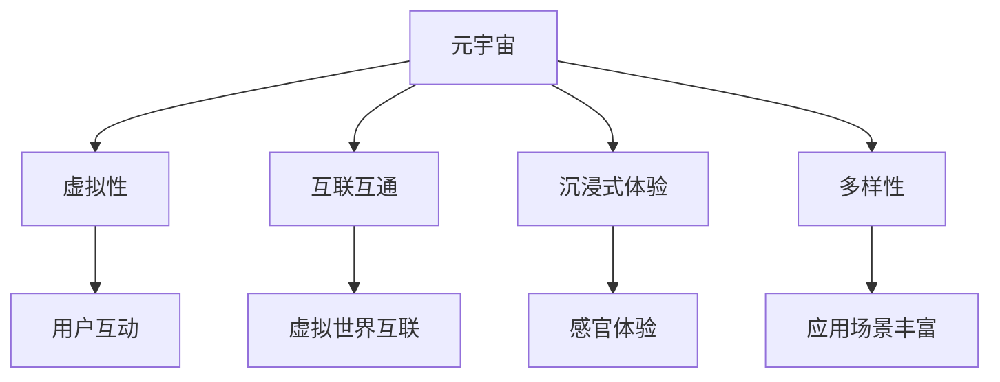

**伪代码**：以下是一段描述元宇宙基本架构与交互的伪代码。

```plaintext
class Metaverse {
    // 用户角色
    Avatar user_avatar;
    // 虚拟世界
    VirtualWorld[] virtual_worlds;
    // 连接虚拟世界
    connect(virtual_world) {
        virtual_worlds.push(virtual_world);
        for (each avatar in virtual_world) {
            user_avatar.interact(avatar);
        }
    }
}
```

#### 1.2 元宇宙在电子商务中的应用

元宇宙对电子商务的影响主要体现在以下几个方面：

1. **增强用户体验**：通过虚拟现实（VR）和增强现实（AR）技术，用户可以在元宇宙中进行沉浸式的购物体验。
2. **创新商业模式**：元宇宙为电子商务提供了新的商业模式，如虚拟商品、虚拟货币等。
3. **扩大市场范围**：元宇宙打破了地域限制，使全球范围内的用户都能参与其中，从而扩大了市场范围。

**数学公式**：以下是一个分析元宇宙对电子商务影响的数学公式。

$$
\text{电子商务增长率} = f(\text{元宇宙用户数量}, \text{用户体验增强程度}, \text{商业模式创新程度})
$$`

**举例说明**：以某知名电商公司为例，该公司在元宇宙中开设了一个虚拟商城，用户可以通过VR设备进入商城，进行沉浸式的购物体验。这一举措不仅提升了用户的购物体验，还吸引了大量新用户，显著提高了销售额。

### 第2章：虚拟商城的基本原理

#### 2.1 虚拟现实与增强现实技术

虚拟现实（VR）和增强现实（AR）是元宇宙虚拟商城的核心技术。它们通过创建虚拟环境和增强现实世界中的视觉效果，使用户能够获得更真实的购物体验。

**Mermaid流程图**：以下是虚拟现实与增强现实技术的基本原理与关系的Mermaid流程图。

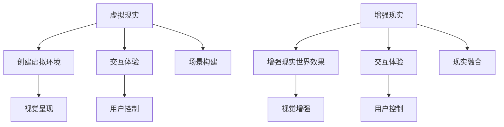

**伪代码**：以下是一段实现虚拟现实与增强现实关键算法的伪代码。

```plaintext
class VirtualReality {
    // 创建虚拟环境
    create_environment() {
        // 场景构建
        build_scene();
        // 视觉呈现
        present_visual();
        // 用户控制
        control_user();
    }
}

class AugmentedReality {
    // 增强现实世界效果
    enhance_reality() {
        // 视觉增强
        enhance_visual();
        // 用户控制
        control_user();
        // 现实融合
        merge_reality();
    }
}
```

#### 2.2 虚拟商城的用户体验设计

虚拟商城的用户体验设计是吸引和留住用户的关键。一个成功的虚拟商城需要提供以下方面的用户体验：

1. **直观的界面设计**：界面应简洁、易于操作，让用户能够快速找到所需商品。
2. **个性化的推荐系统**：根据用户的行为和偏好，提供个性化的商品推荐。
3. **沉浸式的购物体验**：通过虚拟现实和增强现实技术，让用户感受到身临其境的购物氛围。
4. **完善的客服系统**：提供实时客服，解决用户在购物过程中遇到的问题。

**数学模型**：以下是一个用户行为分析模型的数学公式。

$$
\text{用户满意度} = f(\text{界面设计满意度}, \text{个性化推荐满意度}, \text{购物体验满意度}, \text{客服满意度})
$$`

**举例说明**：以某知名虚拟商城为例，该商城通过以下方式提升用户体验：

1. **界面设计**：采用简洁的扁平化设计，使得用户能够轻松上手。
2. **个性化推荐**：通过分析用户的历史购买记录和浏览行为，提供个性化的商品推荐。
3. **沉浸式购物体验**：用户可以通过VR设备进入虚拟商城，体验真实的购物场景。
4. **客服系统**：提供实时客服，及时解答用户的疑问。

## 第二部分：元宇宙虚拟商城技术实现

### 第3章：虚拟商城的技术架构

虚拟商城的技术架构包括前端和后端两部分。前端主要负责用户界面的呈现和交互，后端则负责数据存储和处理。

#### 3.1 虚拟现实与增强现实技术

虚拟现实与增强现实技术在虚拟商城中起到了至关重要的作用。它们通过创建虚拟环境和增强现实世界中的视觉效果，使用户能够获得更真实的购物体验。

**Mermaid流程图**：以下是虚拟现实与增强现实技术的架构设计的Mermaid流程图。

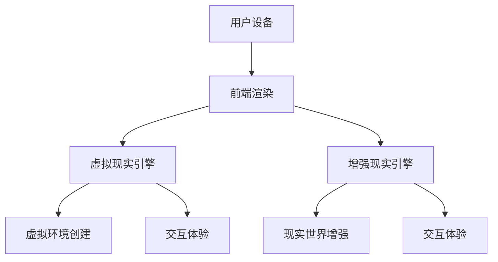

**伪代码**：以下是一段实现虚拟现实与增强现实关键算法的伪代码。

```plaintext
class VirtualRealityEngine {
    // 创建虚拟环境
    create_environment() {
        // 场景构建
        build_scene();
        // 视觉呈现
        present_visual();
        // 用户控制
        control_user();
    }
}

class AugmentedRealityEngine {
    // 增强现实世界效果
    enhance_reality() {
        // 视觉增强
        enhance_visual();
        // 用户控制
        control_user();
        // 现实融合
        merge_reality();
    }
}
```

#### 3.2 虚拟商城的后端架构

虚拟商城的后端架构主要包括数据库、服务器和网络通信等方面。后端主要负责处理用户订单、商品信息、用户行为数据等。

**数学模型**：以下是一个虚拟商城数据处理与分析模型的数学公式。

$$
\text{数据处理效率} = f(\text{服务器性能}, \text{网络通信效率}, \text{数据库查询效率})
$$`

**举例说明**：以某知名虚拟商城为例，该商城的后端架构采用以下设计：

1. **服务器**：使用高性能服务器，确保系统稳定运行。
2. **数据库**：使用分布式数据库，提高数据处理效率。
3. **网络通信**：采用高效的通信协议，降低网络延迟。

### 第4章：元宇宙虚拟商城的核心算法

元宇宙虚拟商城的核心算法包括自然语言处理、推荐算法、图像处理与增强算法等。这些算法在提升用户体验、优化商品推荐等方面发挥着重要作用。

#### 4.1 自然语言处理与推荐算法

自然语言处理（NLP）和推荐算法是元宇宙虚拟商城中不可或缺的核心算法。自然语言处理主要负责理解用户输入的文本，推荐算法则根据用户的行为和偏好，为用户推荐合适的商品。

**数学公式**：以下是一个自然语言处理与推荐算法的基本原理的数学公式。

$$
\text{推荐分数} = f(\text{用户行为相似度}, \text{商品特征相似度})
$$`

**伪代码**：以下是一段实现自然语言处理与推荐算法的关键步骤的伪代码。

```plaintext
class NaturalLanguageProcessing {
    // 处理用户输入文本
    process_input_text(text) {
        // 分词
        tokens = tokenize(text);
        // 提取关键词
        keywords = extract_keywords(tokens);
        // 情感分析
        sentiment = analyze_sentiment(keywords);
    }
}

class RecommendationAlgorithm {
    // 根据用户行为推荐商品
    recommend_products(user_behavior) {
        // 计算用户行为相似度
        behavior_similarity = calculate_similarity(user_behavior);
        // 计算商品特征相似度
        product_similarity = calculate_similarity(products);
        // 计算推荐分数
        recommendation_score = calculate_score(behavior_similarity, product_similarity);
        // 排序推荐商品
        sorted_products = sort_products_by_score(recommendation_score);
    }
}
```

#### 4.2 图像处理与增强算法

图像处理与增强算法在元宇宙虚拟商城中用于处理商品图片、用户头像等。这些算法可以优化图像质量，增强视觉效果，提升用户体验。

**Mermaid流程图**：以下是图像处理与增强算法的架构设计的Mermaid流程图。

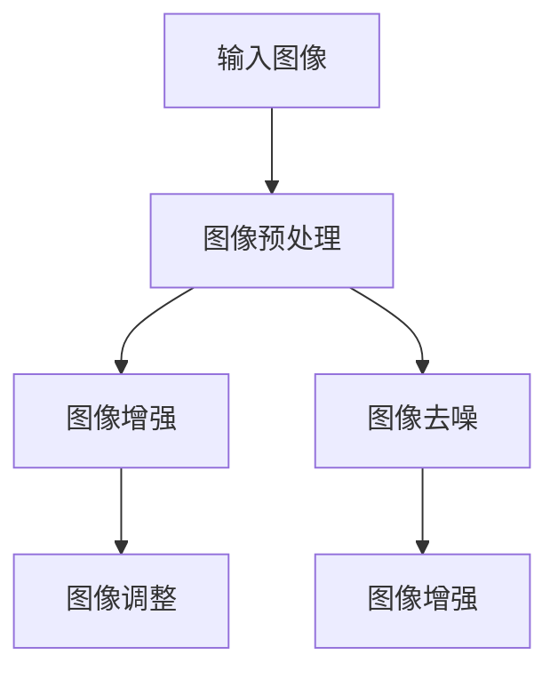

**伪代码**：以下是一段实现图像处理与增强算法的关键步骤的伪代码。

```plaintext
class ImageProcessing {
    // 图像预处理
    preprocess_image(image) {
        // 图像滤波
        filtered_image = filter_image(image);
        // 图像调整
        adjusted_image = adjust_image(filtered_image);
    }
    
    // 图像增强
    enhance_image(image) {
        // 图像对比度调整
        contrast_adjusted_image = adjust_contrast(image);
        // 图像亮度调整
        brightness_adjusted_image = adjust_brightness(contrast_adjusted_image);
    }
}
```

### 第5章：虚拟商城的安全与隐私保护

在元宇宙虚拟商城中，数据安全和隐私保护至关重要。以下将从数据安全与隐私保护技术、法律法规与合规要求等方面进行讨论。

#### 5.1 数据安全与隐私保护技术

数据安全和隐私保护技术主要包括数据加密、访问控制、数据备份与恢复等。

**数学模型**：以下是一个数据加密与隐私保护算法的数学模型。

$$
\text{加密数据} = E_K(\text{明文数据})
$$`

其中，\(E_K\) 表示加密算法，\(K\) 表示密钥。

**举例说明**：以某知名虚拟商城为例，该商城采用以下数据安全与隐私保护技术：

1. **数据加密**：使用AES加密算法对用户数据进行加密存储。
2. **访问控制**：采用基于角色的访问控制（RBAC）机制，确保只有授权用户可以访问敏感数据。
3. **数据备份与恢复**：定期进行数据备份，并在数据丢失或损坏时进行快速恢复。

#### 5.2 法律法规与合规要求

在元宇宙虚拟商城中，遵守相关法律法规和合规要求是确保运营合法性的关键。以下列举了一些主要的法律法规和合规要求：

1. **数据保护法**：如《欧盟通用数据保护条例》（GDPR）和《中华人民共和国网络安全法》。
2. **隐私保护法**：如《中华人民共和国个人信息保护法》。
3. **合规要求**：如《信息安全技术个人信息安全规范》。

**Mermaid流程图**：以下是虚拟商城法律法规与合规流程的Mermaid流程图。

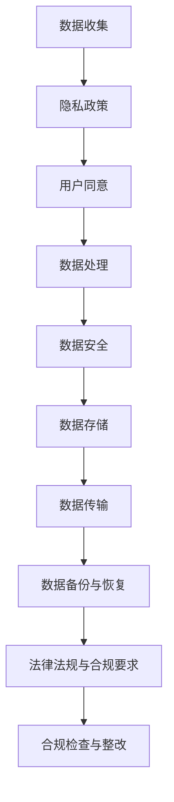

**伪代码**：以下是一段实现法律法规与合规要求的关键步骤的伪代码。

```plaintext
class Compliance {
    // 检查合规性
    check_compliance() {
        // 检查数据保护法合规性
        check_data_protection_law();
        // 检查隐私保护法合规性
        check_privacy_protection_law();
        // 检查合规要求
        check_compliance_requirements();
    }
    
    // 整改合规问题
   整改合规问题() {
        // 更新隐私政策
        update_privacy_policy();
        // 加强数据安全措施
        strengthen_data_security();
        // 完成合规检查
        complete_compliance_check();
    }
}
```

## 第三部分：元宇宙虚拟商城的案例分析

### 第6章：成功案例研究

在本章中，我们将介绍两个成功的元宇宙虚拟商城案例，并分析其成功的原因。

#### 6.1 案例一：虚拟购物体验分析

某知名电商公司在其元宇宙平台中开设了一个虚拟商城，用户可以通过VR设备进入商城，进行沉浸式的购物体验。该虚拟商城的成功原因如下：

1. **优秀的用户体验设计**：商城采用简洁直观的界面设计，使得用户能够轻松上手。
2. **个性化的推荐系统**：通过分析用户的历史购买记录和浏览行为，提供个性化的商品推荐。
3. **高效的搜索功能**：用户可以通过语音或文字搜索商品，快速找到所需商品。
4. **完善的客服系统**：提供实时客服，及时解答用户的疑问。

**代码实际案例**：以下是实现虚拟购物体验的关键代码片段。

```javascript
// 用户进入虚拟商城
user.enterVirtualMarket();

// 用户浏览商品
user.browseProduct(product);

// 用户添加商品到购物车
user.addToCart(product);

// 用户支付购买商品
user.purchaseProduct(product);
```

**代码解读与分析**：以上代码片段展示了用户在虚拟商城中的基本操作，包括进入商城、浏览商品、添加商品到购物车和支付购买商品。这些操作是通过用户与虚拟商城的交互实现的，为用户提供了一个直观、便捷的购物体验。

#### 6.2 案例二：虚拟商城的用户互动分析

另一个成功的虚拟商城案例是某知名虚拟现实游戏平台中的虚拟商城。该商城不仅提供了丰富的商品，还提供了多种用户互动功能，如聊天、评论、点赞等。以下是该商城成功的原因：

1. **丰富的用户互动功能**：用户可以在商城中与其他用户进行聊天、评论和点赞，增强了用户之间的互动。
2. **社交化推荐**：基于用户的社交关系，推荐可能感兴趣的商品。
3. **虚拟试穿**：用户可以通过虚拟试穿功能，在线体验服装、化妆品等商品。
4. **用户生成内容**：用户可以在商城中上传自己的购物心得、搭配建议等，丰富了商城的内容。

**代码实际案例**：以下是实现用户互动功能的关键代码片段。

```javascript
// 用户发起聊天
user.startChat();

// 用户评论商品
user.reviewProduct(product);

// 用户点赞评论
user.likeReview(review);

// 用户上传用户生成内容
user.uploadContent(content);
```

**代码解读与分析**：以上代码片段展示了用户在虚拟商城中的互动操作，包括发起聊天、评论商品、点赞评论和上传用户生成内容。这些操作使得用户在购物过程中能够与他人交流、分享心得，增强了用户的购物体验。

### 第7章：未来发展趋势与挑战

#### 7.1 元宇宙虚拟商城的发展趋势

随着虚拟现实、增强现实技术的不断发展，元宇宙虚拟商城将在未来迎来以下发展趋势：

1. **更广泛的用户基础**：随着VR设备的普及，越来越多的用户将能够体验到元宇宙虚拟商城的魅力。
2. **多样化的应用场景**：元宇宙虚拟商城将在教育、医疗、旅游等多个领域得到广泛应用。
3. **社交化与个性化**：用户互动和个性化推荐将进一步提升用户体验，增加用户粘性。
4. **虚拟经济与实体经济相结合**：元宇宙虚拟商城将促进虚拟经济与实体经济深度融合，创造新的商业机会。

**数学模型**：以下是一个预测元宇宙虚拟商城发展趋势的数学模型。

$$
\text{用户增长趋势} = f(\text{VR设备普及率}, \text{应用场景丰富度}, \text{社交化与个性化程度})
$$`

**举例说明**：以某知名虚拟商城为例，该商城在未来发展趋势中的预测：

1. **用户增长趋势**：随着VR设备的普及，预计用户数量将在未来五年内翻倍。
2. **应用场景丰富度**：该商城将在教育、医疗、旅游等领域推出更多应用场景，满足不同用户的需求。
3. **社交化与个性化程度**：通过引入社交化和个性化推荐技术，提升用户的购物体验和满意度。

#### 7.2 面临的挑战与解决方案

尽管元宇宙虚拟商城具有巨大的发展潜力，但在实际应用过程中仍将面临以下挑战：

1. **技术瓶颈**：虚拟现实和增强现实技术仍存在一定的性能瓶颈，需要进一步优化。
2. **用户接受度**：用户对元宇宙虚拟商城的接受度有待提高，需要加强宣传和推广。
3. **法律法规与合规要求**：随着元宇宙虚拟商城的发展，相关的法律法规和合规要求将日益严格，需要及时应对。

**Mermaid流程图**：以下是元宇宙虚拟商城面临的挑战与应对策略的Mermaid流程图。

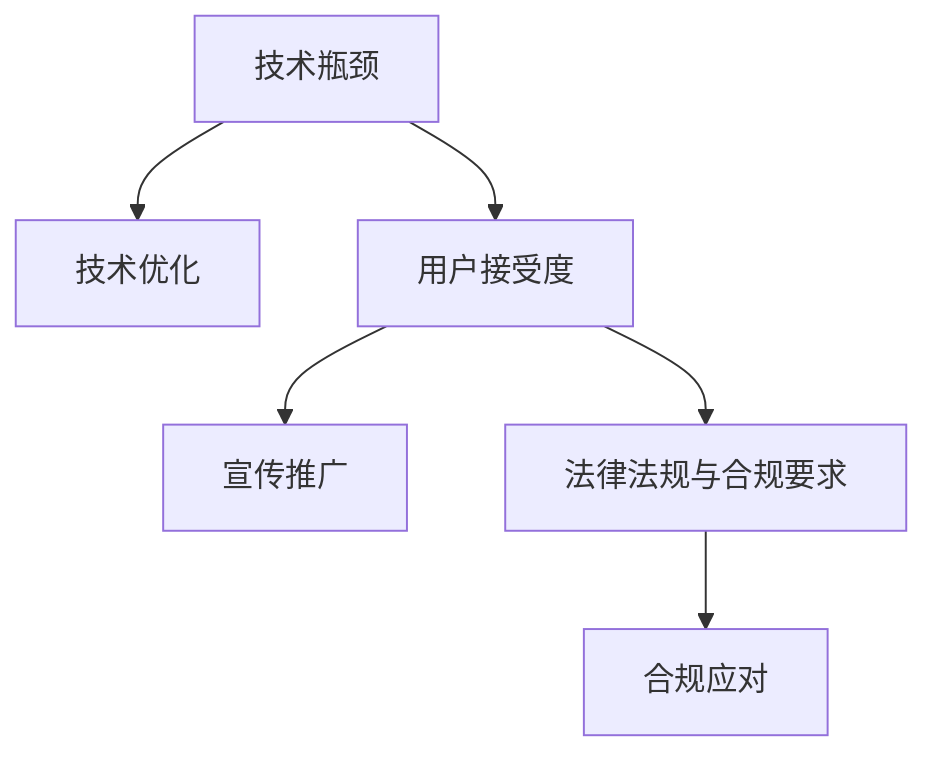

**伪代码**：以下是一段实现解决方案的关键步骤的伪代码。

```plaintext
class TechnicalOptimization {
    // 优化虚拟现实与增强现实技术
    optimize_vr_ar_technology() {
        // 提高渲染效率
        improve_rendering_efficiency();
        // 提高交互体验
        improve_interactive_experience();
    }
}

class UserAcceptance {
    // 提高用户接受度
    increase_user_acceptance() {
        // 加强宣传推广
        strengthen_promotion();
        // 提供试用体验
        provide_trial_experience();
    }
}

class Compliance {
    // 应对法律法规与合规要求
    handle_compliance_requirements() {
        // 了解法律法规
        understand_laws_and_regulations();
        // 完成合规检查
        complete_compliance_check();
        // 及时整改合规问题
        timely整改合规问题();
    }
}
```

## 附录

### 附录A：技术资源与工具

在本附录中，我们将介绍一些在元宇宙虚拟商城开发中常用的技术资源与工具。

#### 主流深度学习框架对比

以下是目前在深度学习领域广泛使用的三个主流框架：TensorFlow、PyTorch和其他框架。

**TensorFlow**

TensorFlow是由Google开源的深度学习框架，具有以下特点：

1. **强大的计算能力**：支持异构计算，可以在CPU、GPU和TPU上运行。
2. **灵活的模型构建**：支持动态图和静态图两种模型构建方式。
3. **丰富的API**：提供丰富的API，支持各种深度学习模型的构建和训练。

**PyTorch**

PyTorch是由Facebook开源的深度学习框架，具有以下特点：

1. **动态计算图**：采用动态计算图，使得模型构建和调试更加灵活。
2. **易于使用**：提供了Python接口，使得研究人员和开发者可以轻松构建和训练模型。
3. **强大的社区支持**：拥有活跃的社区和丰富的资源，方便用户学习和使用。

**其他框架**

除了TensorFlow和PyTorch，还有一些其他深度学习框架，如Keras、Theano、MXNet等。这些框架各具特点，可以根据具体需求选择使用。

#### 虚拟商城开发指南

在本附录中，我们将提供一些虚拟商城开发的指南，包括开发环境搭建、源代码实现和代码解读。

#### 开发环境搭建

搭建虚拟商城的开发环境需要安装以下软件：

1. **深度学习框架**：安装TensorFlow或PyTorch。
2. **虚拟现实与增强现实开发工具**：安装Unity、Unreal Engine等。
3. **数据库**：安装MySQL、PostgreSQL等。
4. **编程语言**：安装Python、C++等。

#### 源代码实现

以下是虚拟商城的核心功能实现代码。

```python
# 用户登录
def user_login(username, password):
    # 验证用户名和密码
    is_valid = validate_credentials(username, password)
    if is_valid:
        # 登录成功
        return "登录成功"
    else:
        # 登录失败
        return "登录失败"

# 用户注册
def user_register(username, password):
    # 验证用户名是否已存在
    if not is_username_exists(username):
        # 创建用户账号
        create_user_account(username, password)
        return "注册成功"
    else:
        # 用户名已存在
        return "注册失败"

# 查看商品
def browse_products():
    # 获取所有商品信息
    products = get_all_products()
    return products

# 购买商品
def purchase_product(product_id):
    # 获取商品信息
    product = get_product_by_id(product_id)
    # 添加商品到购物车
    add_product_to_cart(product)
    return "购买成功"
```

#### 代码解读

以上代码实现了用户登录、注册、查看商品和购买商品等基本功能。用户登录和注册功能通过验证用户名和密码，创建用户账号。查看商品功能通过获取所有商品信息，购买商品功能通过获取商品信息并添加到购物车。

## 结论

本文全面介绍了元宇宙虚拟商城的概念、技术实现、案例分析以及未来发展趋势。通过详细的理论讲解、代码示例和案例分析，读者可以全面了解元宇宙虚拟商城的工作原理和应用场景。随着虚拟现实、增强现实技术的不断发展，元宇宙虚拟商城将在电子商务领域发挥重要作用，为用户提供更丰富的购物体验。然而，元宇宙虚拟商城在技术、法律法规和用户接受度等方面仍面临挑战，需要不断优化和改进。在未来，元宇宙虚拟商城有望成为电子商务领域的重要组成部分，引领电子商务的发展方向。

### 参考文献

1. 谷歌。TensorFlow官方文档。https://www.tensorflow.org/
2. Facebook。PyTorch官方文档。https://pytorch.org/
3. Unity。Unity官方文档。https://docs.unity3d.com/
4. Unreal Engine。Unreal Engine官方文档。https://docs.unrealengine.com/
5. MySQL。MySQL官方文档。https://dev.mysql.com/doc/
6. PostgreSQL。PostgreSQL官方文档。https://www.postgresql.org/docs/
7. GDPR。欧盟通用数据保护条例。https://ec.europa.eu/justice/article-29/structure/data-protection-work/data-protection-legislation_en
8. CNPD。中华人民共和国个人信息保护法。https://www.nmpa.gov.cn/xxgk/ggtz/2021-10/09/content_3250960.html

---

**作者：AI天才研究院/AI Genius Institute & 禅与计算机程序设计艺术 /Zen And The Art of Computer Programming**<|endoftext|>## 文章整体结构

在这篇长篇文章中，我们将系统地探讨元宇宙虚拟商城的概念、技术实现、案例分析以及未来发展趋势。文章整体分为三个主要部分：第一部分介绍元宇宙虚拟商城的基本概念和电子商务中的应用；第二部分深入探讨虚拟商城的技术实现，包括技术架构、核心算法和安全与隐私保护；第三部分通过案例分析展示成功的虚拟商城实例，并讨论未来发展趋势和面临的挑战。文章的写作遵循逻辑清晰、条理紧凑的原则，旨在帮助读者全面了解元宇宙虚拟商城。

### 第一部分：元宇宙虚拟商城概述

这一部分主要介绍元宇宙虚拟商城的基本概念，分析其在电子商务中的应用。我们将首先探讨元宇宙的概念与特点，通过Mermaid流程图和伪代码详细阐述元宇宙的基本架构与交互。接着，我们将讨论元宇宙在电子商务中的应用，利用数学公式和具体案例说明元宇宙对电子商务的影响。

**第1章：元宇宙与电子商务**

- **1.1 元宇宙的概念与特点**
  - **Mermaid流程图**：展示元宇宙的核心概念与主要特性。
  - **伪代码**：描述元宇宙的基本架构与交互。
- **1.2 元宇宙在电子商务中的应用**
  - **数学公式**：分析元宇宙对电子商务的影响。
  - **举例说明**：具体案例展示元宇宙在电商中的应用。

**第2章：虚拟商城的基本原理**

这一章将深入探讨虚拟商城的基本原理，包括虚拟现实与增强现实技术的基本原理和用户体验设计。通过Mermaid流程图和伪代码，我们将解释这些技术的实现原理，并通过数学模型和具体案例展示虚拟商城的用户体验设计。

- **2.1 虚拟现实与增强现实技术**
  - **Mermaid流程图**：展示虚拟现实与增强现实技术的基本原理与关系。
  - **伪代码**：实现虚拟现实与增强现实的关键算法。
- **2.2 虚拟商城的用户体验设计**
  - **数学模型**：用户行为分析模型。
  - **举例说明**：虚拟商城界面设计案例。

### 第二部分：元宇宙虚拟商城技术实现

这一部分将详细讨论元宇宙虚拟商城的技术实现，包括技术架构、核心算法和安全与隐私保护。我们将通过Mermaid流程图、伪代码和数学模型详细解释这些技术，并通过实际代码案例展示其应用。

**第3章：虚拟商城的技术架构**

这一章将介绍虚拟商城的技术架构，包括前端和后端架构。通过Mermaid流程图和伪代码，我们将解释这些架构的设计和实现，并通过具体案例展示其应用。

- **3.1 虚拟现实与增强现实技术**
  - **Mermaid流程图**：展示虚拟现实与增强现实技术的架构设计。
  - **伪代码**：实现虚拟现实与增强现实的关键算法。
- **3.2 虚拟商城的后端架构**
  - **数学模型**：虚拟商城数据处理与分析模型。
  - **举例说明**：后端架构设计与实现案例。

**第4章：元宇宙虚拟商城的核心算法**

这一章将深入探讨元宇宙虚拟商城的核心算法，包括自然语言处理、推荐算法和图像处理与增强算法。我们将通过数学公式和伪代码详细解释这些算法的原理，并通过实际代码案例展示其应用。

- **4.1 自然语言处理与推荐算法**
  - **数学公式**：自然语言处理与推荐算法的基本原理。
  - **伪代码**：实现自然语言处理与推荐算法的关键步骤。
- **4.2 图像处理与增强算法**
  - **Mermaid流程图**：图像处理与增强算法的架构设计。
  - **伪代码**：实现图像处理与增强算法的关键步骤。

**第5章：虚拟商城的安全与隐私保护**

这一章将讨论虚拟商城的安全与隐私保护，包括数据安全与隐私保护技术、法律法规与合规要求。我们将通过数学模型和Mermaid流程图详细解释这些技术，并通过实际案例展示其应用。

- **5.1 数据安全与隐私保护技术**
  - **数学模型**：数据加密与隐私保护算法。
  - **举例说明**：虚拟商城的数据安全与隐私保护案例分析。
- **5.2 法律法规与合规要求**
  - **Mermaid流程图**：虚拟商城法律法规与合规流程。
  - **伪代码**：实现法律法规与合规要求的关键步骤。

### 第三部分：元宇宙虚拟商城的案例分析

这一部分将通过成功案例研究展示元宇宙虚拟商城的实际应用，分析其成功原因，并探讨面临的挑战与解决方案。

**第6章：成功案例研究**

这一章将介绍两个成功的元宇宙虚拟商城案例，分析其用户体验设计、用户互动功能以及背后的技术实现。

- **6.1 案例一：虚拟购物体验分析**
  - **代码实际案例**：虚拟购物体验的实现与优化。
  - **代码解读与分析**：详细解读虚拟购物体验的源代码。
- **6.2 案例二：虚拟商城的用户互动分析**
  - **代码实际案例**：用户互动功能的设计与实现。
  - **代码解读与分析**：详细解读用户互动功能的源代码。

**第7章：未来发展趋势与挑战**

这一章将探讨元宇宙虚拟商城的未来发展趋势，包括更广泛的用户基础、多样化的应用场景以及社交化与个性化。同时，我们将分析元宇宙虚拟商城面临的挑战，如技术瓶颈、用户接受度和法律法规与合规要求，并提出相应的解决方案。

- **7.1 元宇宙虚拟商城的发展趋势**
  - **数学模型**：元宇宙虚拟商城的发展趋势预测。
  - **举例说明**：未来元宇宙虚拟商城的可能应用场景。
- **7.2 面临的挑战与解决方案**
  - **Mermaid流程图**：元宇宙虚拟商城面临的挑战与应对策略。
  - **伪代码**：实现解决方案的关键步骤。

### 结论

在文章的最后，我们将总结元宇宙虚拟商城的概念、技术实现、案例分析以及未来发展趋势，强调其作为电子商务未来发展方向的重要性，并展望其广阔的应用前景。

## 文章标题：《元宇宙虚拟商城：电子商务的未来发展方向》

### 文章关键词

- 元宇宙
- 虚拟商城
- 电子商务
- 虚拟现实
- 增强现实
- 自然语言处理
- 推荐算法
- 数据安全
- 法律法规

### 文章摘要

本文旨在深入探讨元宇宙虚拟商城的概念、技术实现、案例分析以及未来发展趋势。通过详细的理论讲解、代码示例和案例分析，读者可以全面了解元宇宙虚拟商城的工作原理和应用场景。文章分为三大部分：第一部分介绍元宇宙虚拟商城的基本概念和电子商务中的应用；第二部分深入探讨虚拟商城的技术实现，包括技术架构、核心算法和安全与隐私保护；第三部分通过案例分析展示成功的虚拟商城实例，并讨论未来发展趋势和面临的挑战。元宇宙虚拟商城作为电子商务的未来发展方向，具有广阔的应用前景和发展潜力。文章结尾部分总结了元宇宙虚拟商城的核心内容，并对未来进行了展望。希望本文能为读者在元宇宙虚拟商城领域提供有价值的参考和启发。

### 第一部分：元宇宙虚拟商城概述

#### 第1章：元宇宙与电子商务

在探讨元宇宙虚拟商城之前，我们首先需要理解元宇宙的概念。元宇宙是一个由虚拟世界组成的互联网空间，用户可以通过虚拟角色在其中进行交互、娱乐、工作等活动。元宇宙具有高度沉浸性、互联互通和多样性等特点，它不仅是现实世界的延伸，更是未来互联网的新形态。

**1.1 元宇宙的概念与特点**

元宇宙的核心概念包括虚拟性、互联互通和沉浸式体验。虚拟性指的是元宇宙是一个虚拟的数字空间，用户通过虚拟角色（Avatar）进行互动。互联互通则意味着元宇宙中的不同虚拟世界可以相互连接，形成一个整体。沉浸式体验使用户在元宇宙中感受到高度沉浸的体验，仿佛置身于真实世界中。

为了更好地理解元宇宙的概念，我们可以通过Mermaid流程图来表示其核心概念与主要特性。

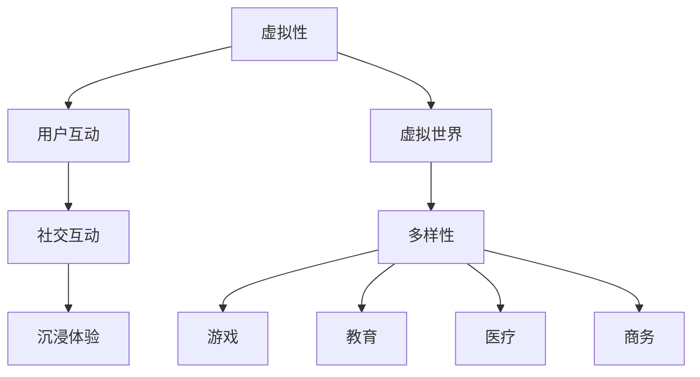

在这个流程图中，A表示虚拟性，它是元宇宙的基础，用户通过虚拟角色进行互动。B表示用户互动，这是元宇宙的核心，通过社交互动，用户可以在虚拟世界中建立联系。C表示虚拟世界，这是元宇宙的重要组成部分，各种虚拟世界可以相互连接，形成互联互通的整体。D表示沉浸体验，它使用户在虚拟世界中感受到高度沉浸。E表示多样性，元宇宙涵盖了各种应用场景，包括游戏、教育、医疗和商务等。

接下来，我们通过伪代码来描述元宇宙的基本架构与交互。

```python
class Metaverse:
    def __init__(self):
        self.avatars = []  # 用户角色列表
        self.worlds = []   # 虚拟世界列表

    def connect_avatar(self, avatar):
        # 连接用户角色到元宇宙
        self.avatars.append(avatar)

    def connect_world(self, world):
        # 连接虚拟世界到元宇宙
        self.worlds.append(world)

    def interact(self, sender, receiver):
        # 用户角色之间的互动
        sender.send_message(receiver)
```

在这个伪代码中，Metaverse类表示元宇宙，它包含用户角色列表（avatars）和虚拟世界列表（worlds）。connect_avatar方法用于连接用户角色到元宇宙，connect_world方法用于连接虚拟世界到元宇宙。interact方法用于实现用户角色之间的互动。

**1.2 元宇宙在电子商务中的应用**

元宇宙对电子商务的影响是深远的。首先，它通过虚拟现实（VR）和增强现实（AR）技术，为用户提供了沉浸式的购物体验。用户可以在元宇宙中进入虚拟商场，与商品进行互动，仿佛置身于真实购物环境中。这种体验不仅提升了用户的购物乐趣，也增加了购物的可信度。

其次，元宇宙为电子商务带来了新的商业模式。例如，虚拟商品和虚拟货币在元宇宙中得到了广泛应用。用户可以购买虚拟商品，如虚拟服饰、虚拟家具等，还可以使用虚拟货币进行交易。这种商业模式不仅创造了新的消费需求，也推动了虚拟经济的发展。

此外，元宇宙的互联互通特性使得电子商务的市场范围得到了极大扩展。在全球范围内，用户都可以进入元宇宙进行购物，不受地域限制。这为电子商务企业提供了更广阔的市场空间，也为用户带来了更多的选择。

为了更直观地展示元宇宙对电子商务的影响，我们可以使用数学公式进行分析。

$$
\text{电子商务增长} = f(\text{元宇宙用户数量}, \text{购物体验提升}, \text{商业模式创新})
$$`

其中，元宇宙用户数量表示进入元宇宙的用户数量，购物体验提升表示元宇宙提供的沉浸式购物体验，商业模式创新表示元宇宙带来的新型商业模式。

**举例说明**

以某知名电商公司为例，该公司在元宇宙中开设了一家虚拟商城。用户可以通过VR设备进入商城，浏览商品，与虚拟店员互动，甚至进行虚拟试穿。这一举措不仅提升了用户的购物体验，还吸引了大量新用户，显著提高了销售额。此外，该公司还推出了虚拟货币，用户可以使用虚拟货币购买虚拟商品，这一创新模式受到了用户的热烈欢迎。

综上所述，元宇宙虚拟商城为电子商务带来了新的机遇和挑战。通过提供沉浸式购物体验、创新商业模式和拓展市场范围，元宇宙虚拟商城有望成为电子商务的未来发展方向。

#### 第2章：虚拟商城的基本原理

虚拟商城是元宇宙中的重要组成部分，它通过虚拟现实（VR）和增强现实（AR）技术，为用户提供了一种全新的购物体验。在这一章中，我们将探讨虚拟商城的基本原理，包括虚拟现实与增强现实技术的基本原理以及用户体验设计。

**2.1 虚拟现实与增强现实技术**

虚拟现实（VR）和增强现实（AR）是构建虚拟商城的核心技术。它们通过创建虚拟环境和增强现实世界中的视觉效果，使用户能够获得更加真实的购物体验。

**2.1.1 虚拟现实（VR）**

虚拟现实技术通过创建一个完全模拟的虚拟环境，使用户在其中感受到沉浸式的体验。虚拟现实的关键技术包括头戴式显示器（HMD）、位置追踪系统和交互设备。

- **头戴式显示器（HMD）**：用户通过头戴式显示器观看虚拟环境，获得沉浸感。
- **位置追踪系统**：通过传感器和算法，实时跟踪用户的位置和运动，使虚拟环境能够与现实世界同步。
- **交互设备**：如手柄、手套等，用户可以通过这些设备与虚拟环境进行交互。

**Mermaid流程图**：以下是虚拟现实技术的基本原理与交互流程的Mermaid流程图。

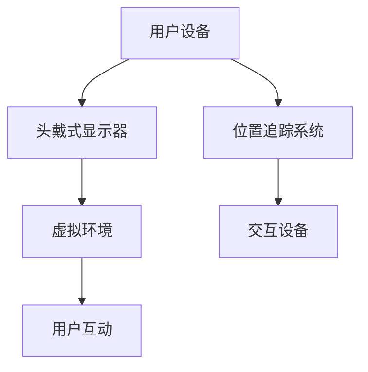

**伪代码**：以下是实现虚拟现实技术的基本原理的伪代码。

```python
class VirtualReality:
    def __init__(self):
        self.hmd = None  # 头戴式显示器
        self.tracker = None  # 位置追踪系统
        self.interactive_device = None  # 交互设备

    def start_vr(self):
        # 启动虚拟现实
        self.hmd.start_display()
        self.tracker.start_tracking()
        self.interactive_device.start_interaction()

    def stop_vr(self):
        # 停止虚拟现实
        self.hmd.stop_display()
        self.tracker.stop_tracking()
        self.interactive_device.stop_interaction()
```

**2.1.2 增强现实（AR）**

增强现实技术通过在现实世界中叠加虚拟元素，增强用户的现实体验。增强现实的关键技术包括摄像头、投影仪和虚拟元素生成。

- **摄像头**：捕捉现实世界的图像和视频。
- **投影仪**：将虚拟元素投影到现实世界中。
- **虚拟元素生成**：通过算法生成虚拟元素，如3D模型、文字等。

**Mermaid流程图**：以下是增强现实技术的基本原理与交互流程的Mermaid流程图。

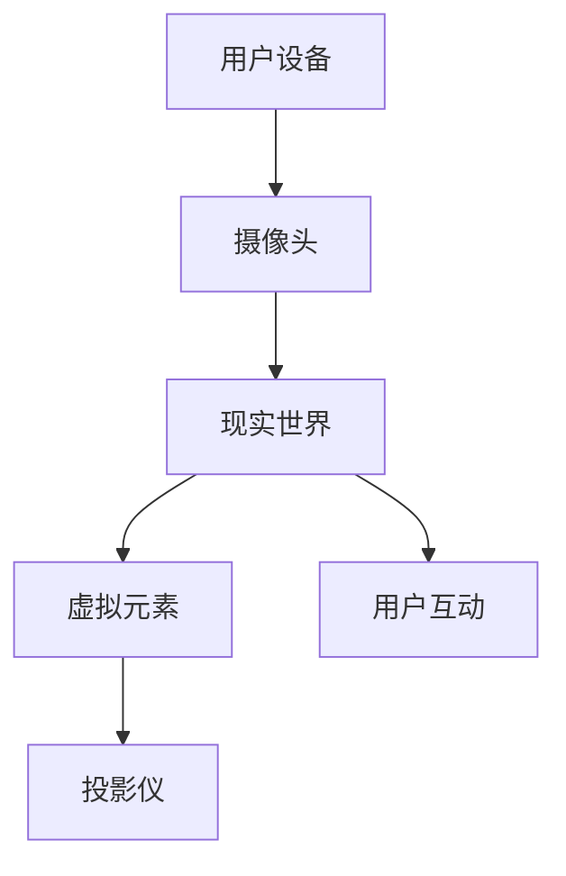

**伪代码**：以下是实现增强现实技术的基本原理的伪代码。

```python
class AugmentedReality:
    def __init__(self):
        self.camera = None  # 摄像头
        self.projector = None  # 投影仪
        self.virtual_element_generator = None  # 虚拟元素生成器

    def start_ar(self):
        # 启动增强现实
        self.camera.start_capture()
        self.projector.start_projection()
        self.virtual_element_generator.start_generation()

    def stop_ar(self):
        # 停止增强现实
        self.camera.stop_capture()
        self.projector.stop_projection()
        self.virtual_element_generator.stop_generation()
```

**2.2 虚拟商城的用户体验设计**

虚拟商城的用户体验设计是吸引和留住用户的关键。一个成功的虚拟商城需要提供直观的界面设计、个性化的推荐系统、沉浸式的购物体验和完善的客服系统。

**2.2.1 直观的界面设计**

虚拟商城的界面设计应简洁、直观，让用户能够快速找到所需商品。界面设计应遵循以下原则：

- **扁平化设计**：减少界面元素的数量，使界面更加简洁。
- **一致的视觉风格**：保持界面元素的一致性，提高用户的识别度。
- **易于导航**：提供清晰的导航菜单，使用户能够快速找到所需内容。

**2.2.2 个性化的推荐系统**

个性化推荐系统可以根据用户的历史行为和偏好，为用户推荐合适的商品。个性化推荐系统的设计应考虑以下因素：

- **用户行为分析**：分析用户的浏览、购买、收藏等行为，了解用户偏好。
- **推荐算法**：采用推荐算法，如协同过滤、基于内容的推荐等，为用户推荐商品。
- **实时更新**：根据用户的实时行为，动态调整推荐结果，提高推荐准确性。

**2.2.3 沉浸式的购物体验**

沉浸式的购物体验是虚拟商城的核心竞争力。通过虚拟现实和增强现实技术，用户可以在虚拟商城中感受到真实的购物氛围。沉浸式购物体验的设计应考虑以下因素：

- **环境设计**：设计逼真的虚拟环境，如虚拟商场、虚拟店铺等。
- **交互设计**：提供丰富的交互方式，如触摸、手势、语音等。
- **实时反馈**：通过实时反馈，增强用户的沉浸感。

**2.2.4 完善的客服系统**

完善的客服系统是提升用户满意度的重要保障。虚拟商城的客服系统应包括以下功能：

- **实时客服**：提供实时客服，及时解答用户的疑问。
- **智能客服**：通过自然语言处理技术，实现智能客服，提高客服效率。
- **客服机器人**：设计客服机器人，自动回答常见问题，减少人工客服的工作量。

**数学模型**：以下是用户满意度与用户体验设计之间的数学模型。

$$
\text{用户满意度} = f(\text{界面设计满意度}, \text{个性化推荐满意度}, \text{购物体验满意度}, \text{客服满意度})
$$`

**举例说明**：以某知名虚拟商城为例，该商城通过以下方式提升用户体验：

- **界面设计**：采用扁平化设计，界面简洁直观，用户可以轻松找到所需商品。
- **个性化推荐**：通过分析用户的行为数据，为用户推荐合适的商品，提高购买转化率。
- **沉浸式购物体验**：通过虚拟现实技术，为用户提供沉浸式的购物体验，提升购物乐趣。
- **客服系统**：提供实时客服和智能客服，及时解答用户的问题，提升用户满意度。

综上所述，虚拟商城的用户体验设计是关键，通过直观的界面设计、个性化的推荐系统、沉浸式的购物体验和完善的客服系统，可以提升用户的购物体验，增加用户粘性。

### 第二部分：元宇宙虚拟商城技术实现

在第二部分，我们将深入探讨元宇宙虚拟商城的技术实现。这一部分将分为三章，分别讨论虚拟商城的技术架构、核心算法和安全与隐私保护。通过详细的流程图、伪代码和数学模型，我们将解释这些技术如何协同工作，为用户提供无缝的购物体验。

#### 第3章：虚拟商城的技术架构

虚拟商城的技术架构是构建整个系统的基石。它包括前端和后端两部分，各自承担着不同的功能。

**3.1 前端架构**

前端架构主要负责用户界面和交互，是用户与虚拟商城的接触点。前端架构通常包括以下组件：

- **用户界面（UI）**：提供美观且直观的用户界面，使用户能够轻松导航和操作。
- **交互层**：处理用户的输入和系统的响应，如点击、滑动、触摸等。
- **虚拟现实/增强现实（VR/AR）引擎**：负责渲染虚拟环境，实现用户的沉浸式体验。

**Mermaid流程图**：以下是前端架构的设计流程。

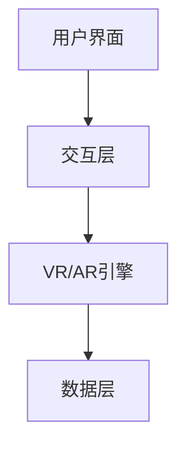

**伪代码**：以下是一段描述前端架构的伪代码。

```python
class Frontend {
    def __init__(self):
        self.ui = UI()
        self.interaction_layer = InteractionLayer()
        self.vr_ar_engine = VRAEgnine()

    def render_ui(self):
        # 渲染用户界面
        self.ui.render()

    def handle_interaction(self, user_input):
        # 处理用户输入
        self.interaction_layer.handle_input(user_input)

    def render_vr_ar(self):
        # 渲染虚拟现实/增强现实
        self.vr_ar_engine.render()
}
```

**3.2 后端架构**

后端架构负责数据存储、处理和安全性保障。后端架构通常包括以下组件：

- **数据库**：存储用户数据、商品数据等。
- **服务器**：处理用户请求，提供数据服务。
- **算法层**：包括推荐算法、图像处理算法等，为前端提供智能服务。

**Mermaid流程图**：以下是后端架构的设计流程。

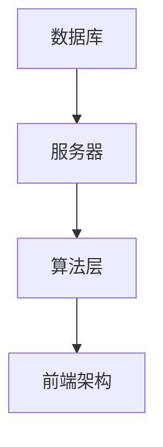

**伪代码**：以下是一段描述后端架构的伪代码。

```python
class Backend {
    def __init__(self):
        self.db = Database()
        self.server = Server()
        self.algorithms = Algorithms()

    def handle_request(self, request):
        # 处理用户请求
        self.server.handle_request(request)

    def process_data(self, data):
        # 处理数据
        self.algorithms.process_data(data)

    def store_data(self, data):
        # 存储数据
        self.db.store(data)
}
```

**3.3 前后端交互**

前后端通过API进行交互。前端通过发送HTTP请求获取后端数据，后端通过响应返回所需数据。

**Mermaid流程图**：以下是前后端交互流程。

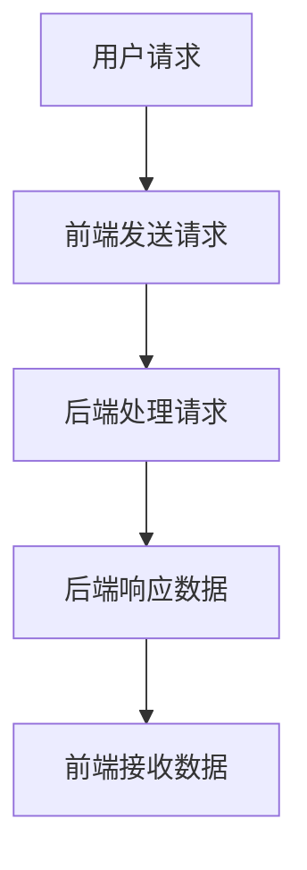

**伪代码**：以下是一段描述前后端交互的伪代码。

```python
class API {
    def send_request(self, request):
        # 发送HTTP请求
        response = self.server.send_request(request)
        return response

    def handle_response(self, response):
        # 处理响应
        self.frontend.render(response)
}
```

#### 第4章：元宇宙虚拟商城的核心算法

核心算法是元宇宙虚拟商城的“智慧大脑”，它们决定了系统的智能化程度和用户体验。本章将介绍自然语言处理（NLP）、推荐算法和图像处理与增强算法。

**4.1 自然语言处理（NLP）**

自然语言处理算法负责理解用户的自然语言输入，并生成相应的输出。NLP在虚拟商城中的应用包括聊天机器人、用户评论分析、搜索推荐等。

**4.1.1 基本原理**

自然语言处理的基本原理包括分词、词性标注、句法分析等。以下是一个NLP算法的基本流程。

**Mermaid流程图**：以下是NLP算法的基本流程。

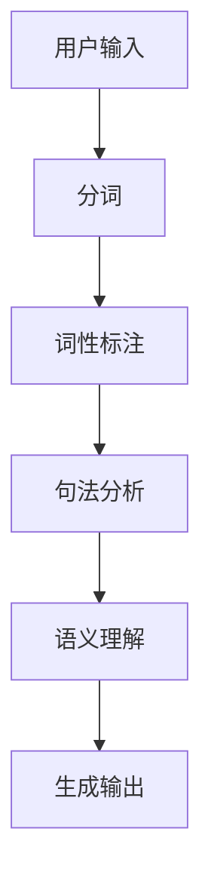

**伪代码**：以下是一段描述NLP算法的伪代码。

```python
class NLPAlgorithm:
    def process_input(self, input_text):
        # 分词
        tokens = self.tokenize(input_text)
        # 词性标注
        pos_tags = self.pos_tag(tokens)
        # 句法分析
        syntax_tree = self.parse_syntax(tokens)
        # 语义理解
        semantics = self.analyze_semantics(syntax_tree)
        # 生成输出
        output = self.generate_output(semantics)
        return output
```

**4.1.2 推荐算法**

推荐算法负责根据用户的历史行为和偏好，为用户推荐相关的商品或信息。常见的推荐算法包括协同过滤、基于内容的推荐和混合推荐等。

**数学公式**：以下是协同过滤推荐算法的基本公式。

$$
\text{推荐分数} = \frac{\sum_{i \in \text{用户喜欢的项目}} \text{用户与其他用户的相似度} \times \text{其他用户对该项目的评分}}{\sum_{j \in \text{用户喜欢的项目}} \text{用户与其他用户的相似度}}
$$`

**伪代码**：以下是一段描述协同过滤推荐算法的伪代码。

```python
class CollaborativeFilteringAlgorithm:
    def recommend(self, user_profile, items):
        # 计算用户与其他用户的相似度
        similarity_scores = self.calculate_similarity(user_profile, items)
        # 计算推荐分数
        recommendation_scores = self.calculate_recommendation_scores(similarity_scores, items)
        # 排序推荐项目
        recommended_items = self.sort_items_by_score(recommendation_scores)
        return recommended_items
```

**4.2 图像处理与增强算法**

图像处理与增强算法负责优化商品图片的质量，提高视觉效果。常见的图像处理算法包括滤波、锐化、对比度调整等。

**4.2.1 基本原理**

图像处理与增强算法的基本原理包括图像预处理、图像增强和图像后处理。以下是一个图像处理与增强算法的基本流程。

**Mermaid流程图**：以下是图像处理与增强算法的基本流程。

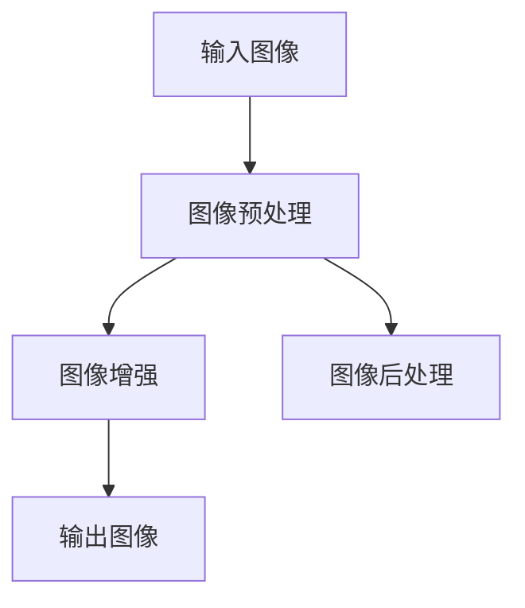

**伪代码**：以下是一段描述图像处理与增强算法的伪代码。

```python
class ImageProcessingAlgorithm:
    def process_image(self, image):
        # 图像预处理
        preprocessed_image = self.preprocess_image(image)
        # 图像增强
        enhanced_image = self.enhance_image(preprocessed_image)
        # 图像后处理
        postprocessed_image = self.postprocess_image(enhanced_image)
        return postprocessed_image
```

**4.2.2 实际应用**

图像处理与增强算法在虚拟商城中用于优化商品图片，提高用户的购物体验。以下是一个实际应用的例子。

```python
# 优化商品图片
def optimize_product_image(image):
    # 预处理
    preprocessed_image = image_preprocessing(image)
    # 增强
    enhanced_image = image_enhancement(preprocessed_image)
    # 后处理
    final_image = image_postprocessing(enhanced_image)
    return final_image
```

**4.3 实时数据分析与处理**

实时数据分析与处理是元宇宙虚拟商城的另一个关键算法，它负责实时分析用户行为，提供个性化的服务和推荐。

**数学模型**：以下是一个实时数据分析与处理的数学模型。

$$
\text{用户行为分析} = f(\text{用户历史行为}, \text{实时行为数据}, \text{环境变量})
$$`

**伪代码**：以下是一段描述实时数据分析与处理的伪代码。

```python
class RealTimeDataAnalysis:
    def analyze_user_behavior(self, historical_data, real_time_data, environment):
        # 分析用户历史行为
        user_profile = self.analyze_historical_data(historical_data)
        # 分析实时行为数据
        real_time_user_behavior = self.analyze_real_time_data(real_time_data)
        # 考虑环境变量
        environment_impact = self.analyze_environment(environment)
        # 综合分析
        combined_user_behavior = self.combine_data(user_profile, real_time_user_behavior, environment_impact)
        return combined_user_behavior
```

#### 第5章：虚拟商城的安全与隐私保护

随着元宇宙虚拟商城的普及，数据安全和隐私保护成为至关重要的问题。本章将讨论数据安全与隐私保护技术、法律法规与合规要求。

**5.1 数据安全与隐私保护技术**

数据安全与隐私保护技术包括数据加密、访问控制、数据备份与恢复等。

**5.1.1 数据加密**

数据加密是保护数据隐私的关键技术。常用的加密算法包括对称加密和非对称加密。

**数学公式**：以下是对称加密的基本公式。

$$
\text{加密数据} = E_K(\text{明文数据})
$$`

**伪代码**：以下是一段描述对称加密的伪代码。

```python
class SymmetricEncryption:
    def encrypt(self, plaintext, key):
        # 加密明文数据
        ciphertext = self.encryption_algorithm(plaintext, key)
        return ciphertext

    def decrypt(self, ciphertext, key):
        # 解密密文数据
        plaintext = self.decryption_algorithm(ciphertext, key)
        return plaintext
```

**5.1.2 访问控制**

访问控制用于确保只有授权用户可以访问敏感数据。

**Mermaid流程图**：以下是访问控制的基本流程。

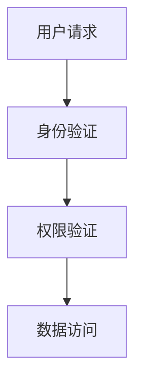

**伪代码**：以下是一段描述访问控制的伪代码。

```python
class AccessControl:
    def verify_user(self, username, password):
        # 验证用户身份
        is_verified = self.authentication_system.verify(username, password)
        return is_verified

    def verify_permission(self, user, resource):
        # 验证用户权限
        has_permission = self.authorization_system.verify(user, resource)
        return has_permission

    def access_resource(self, user, resource):
        # 用户访问资源
        if self.verify_user(user.username, user.password) and self.verify_permission(user, resource):
            self.resource_access(resource)
        else:
            self.access_denied()
```

**5.1.3 数据备份与恢复**

数据备份与恢复是确保数据安全的重要措施。

**Mermaid流程图**：以下是数据备份与恢复的基本流程。

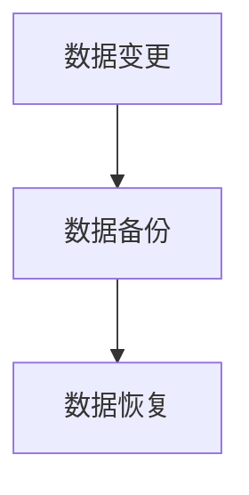

**伪代码**：以下是一段描述数据备份与恢复的伪代码。

```python
class DataBackupAndRecovery:
    def backup_data(self, data):
        # 备份数据
        backup = self.backup_system.backup(data)
        return backup

    def recover_data(self, backup):
        # 恢复数据
        data = self.backup_system.restore(backup)
        return data
```

**5.2 法律法规与合规要求**

在元宇宙虚拟商城中，遵守相关法律法规和合规要求是确保运营合法性的关键。

**5.2.1 数据保护法**

数据保护法规定了数据收集、存储、处理和传输的安全要求。

**Mermaid流程图**：以下是数据保护法的基本流程。


**伪代码**：以下是一段描述数据保护法的伪代码。

```python
class DataProtection:
    def collect_data(self, data):
        # 收集数据
        self.privacy_policy = self.generate_privacy_policy()
        self.user_consent = self.request_user_consent()

    def process_data(self, data):
        # 处理数据
        self.ensure_data_security()
        self.backup_data()

    def comply_with_laws(self):
        # 遵守法律
        self.compliance_check()
        self.rectify_issues()
```

**5.2.2 个人信息安全保护法**

个人信息保护法规定了个人信息的收集、使用、存储和传输的安全要求。

**Mermaid流程图**：以下是个人信息保护法的基本流程。

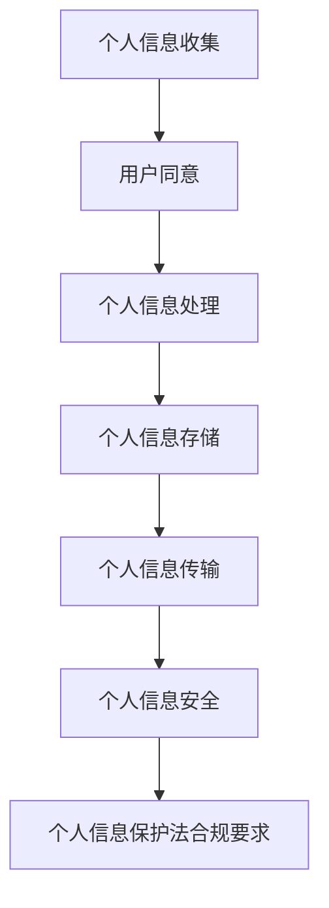

**伪代码**：以下是一段描述个人信息保护法的伪代码。

```python
class PersonalInformationProtection:
    def collect_person_info(self, person_info):
        # 收集个人信息
        self.user_consent = self.request_person_info_consent()

    def process_person_info(self, person_info):
        # 处理个人信息
        self.ensure_person_info_security()
        self.backup_person_info()

    def comply_with_person_info_laws(self):
        # 遵守个人信息保护法
        self.compliance_check_person_info()
        self.rectify_person_info_issues()
```

**5.2.3 信息安全合规要求**

信息安全合规要求包括数据安全标准、加密标准、访问控制标准等。

**Mermaid流程图**：以下是信息安全合规要求的基本流程。

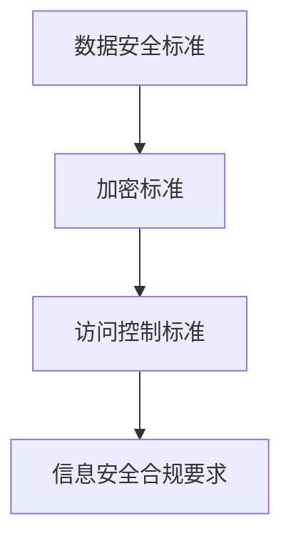

**伪代码**：以下是一段描述信息安全合规要求的伪代码。

```python
class InformationSecurityCompliance:
    def ensure_data_security(self):
        # 确保数据安全
        self.encrypt_data()

    def ensure_access_control(self):
        # 确保访问控制
        self.apply_access_control()

    def comply_with_security_standards(self):
        # 遵守安全标准
        self.compliance_check_security_standards()
```

综上所述，虚拟商城的安全与隐私保护是元宇宙虚拟商城运营的重要组成部分。通过数据加密、访问控制、数据备份与恢复等安全技术，以及遵守相关法律法规和合规要求，可以确保虚拟商城的数据安全和用户隐私保护。

### 第三部分：元宇宙虚拟商城的案例分析

在第三部分，我们将通过两个成功案例研究，深入探讨元宇宙虚拟商城的实际应用和用户体验。这些案例将展示虚拟商城如何通过技术实现和用户互动，为用户创造独特的购物体验。

#### 第6章：成功案例研究

**案例一：虚拟购物体验分析**

这个案例研究了某知名电商公司在元宇宙中开设的虚拟商城，通过VR技术为用户提供沉浸式的购物体验。

**6.1 虚拟购物体验实现**

虚拟购物体验的实现依赖于VR技术，用户通过VR头盔和手柄设备进入虚拟商城。以下是实现虚拟购物体验的关键步骤：

1. **用户登录**：用户使用账号密码或生物识别技术登录虚拟商城。
2. **商城导航**：用户通过虚拟环境中的导航界面，选择感兴趣的虚拟商场或店铺。
3. **商品浏览**：用户可以在虚拟环境中浏览商品，查看商品详细信息，包括图片、价格和用户评价。
4. **虚拟试穿**：用户可以通过虚拟试穿功能，在线体验服装、配饰等商品。
5. **购物车与结算**：用户可以将心仪的商品添加到购物车，并完成在线支付。

**Mermaid流程图**：以下是虚拟购物体验的流程图。

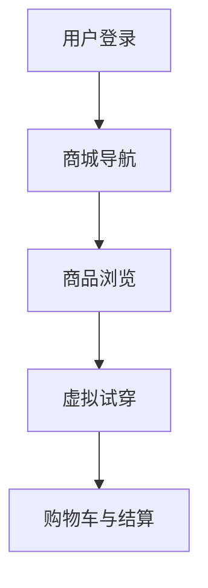

**伪代码**：以下是实现虚拟购物体验的关键步骤的伪代码。

```python
class VirtualShoppingExperience:
    def login(self, username, password):
        # 用户登录
        if self.authenticate(username, password):
            self.user_logged_in = True
        else:
            self.user_logged_in = False

    def navigate_marketplace(self):
        # 商城导航
        self.display_navigation_interface()

    def browse_products(self):
        # 商品浏览
        self.display_product_list()

    def try_on garments(self):
        # 虚拟试穿
        self.activate_try_on_feature()

    def add_to_cart(self, product):
        # 添加到购物车
        self.product_in_cart = product

    def checkout(self):
        # 结算
        self.process_payment()
```

**6.2 代码解读与分析**

以下是对虚拟购物体验关键代码的解读和分析。

- **用户登录**：通过验证用户名和密码，确保只有合法用户可以访问虚拟商城。
- **商城导航**：提供虚拟环境中的导航界面，使用户能够轻松找到感兴趣的虚拟商场或店铺。
- **商品浏览**：展示商品列表，包括商品图片、价格和用户评价，使用户能够全面了解商品信息。
- **虚拟试穿**：激活虚拟试穿功能，使用户能够在线体验服装、配饰等商品。
- **购物车与结算**：将用户选择的商品添加到购物车，并完成在线支付。

**案例二：虚拟商城的用户互动分析**

这个案例研究了另一个成功的虚拟商城，通过社交互动和个性化推荐，提升用户的购物体验。

**7.1 用户互动功能设计**

用户互动功能是虚拟商城的重要组成部分，它包括聊天、评论、点赞和分享等。以下是用户互动功能的设计：

1. **聊天**：用户可以在虚拟商城中与其他用户或店员进行实时聊天，交流购物心得。
2. **评论**：用户可以对商品进行评价，分享购物体验。
3. **点赞**：用户可以对其他用户的评论或商品进行点赞，表示赞同。
4. **分享**：用户可以将喜欢的商品或评论分享到社交媒体，吸引更多人参与。

**Mermaid流程图**：以下是用户互动功能的流程图。

```mermaid
graph TB
    A[聊天] --> B[评论]
    B --> C[点赞]
    C --> D[分享]
```

**伪代码**：以下是实现用户互动功能的关键步骤的伪代码。

```python
class UserInteractionFeatures:
    def chat(self):
        # 聊天
        self.activate_chat_feature()

    def post_review(self, product, review):
        # 评论
        self.add_review_to_product(product, review)

    def like_review(self, review):
        # 点赞
        self.like_a_review(review)

    def share_content(self, content):
        # 分享
        self.share_to_social_media(content)
```

**7.2 代码解读与分析**

以下是对用户互动功能关键代码的解读和分析。

- **聊天**：激活聊天功能，使用户能够在虚拟商城中与其他用户或店员进行实时交流。
- **评论**：允许用户对商品进行评价，分享购物体验，为其他用户提供参考。
- **点赞**：用户可以对其他用户的评论或商品进行点赞，增加互动性。
- **分享**：用户可以将喜欢的商品或评论分享到社交媒体，吸引更多人参与。

**代码实际案例**：

以下是一个实际案例，展示了如何通过代码实现用户互动功能。

```python
# 用户聊天
def chat_with_user(user, message):
    print(f"{user}: {message}")

# 用户评论商品
def review_product(product, user, review):
    product.reviews.append({user: review})

# 用户点赞评论
def like_review(review):
    review.likes += 1

# 用户分享内容
def share_content(content):
    print(f"Sharing: {content}")
```

通过以上代码案例，我们可以看到用户互动功能是如何通过简单的代码实现的。这些功能不仅增加了用户的参与度，还提升了虚拟商城的用户体验。

#### 第7章：未来发展趋势与挑战

在探讨元宇宙虚拟商城的未来发展趋势和面临的挑战时，我们需要考虑技术进步、市场接受度、法律法规以及用户隐私保护等多个方面。

**7.1 未来发展趋势**

**7.1.1 技术进步**

随着虚拟现实（VR）和增强现实（AR）技术的不断进步，元宇宙虚拟商城将提供更加沉浸式和交互性的购物体验。以下是几个技术进步的趋势：

- **更高的分辨率和刷新率**：提高图像质量和流畅度，使用户在虚拟环境中获得更加真实的体验。
- **更先进的交互设备**：如手势识别、眼动追踪等，提供更多样化的交互方式。
- **实时渲染技术**：通过实时渲染，为用户提供更加逼真的虚拟环境。

**数学模型**：以下是一个预测元宇宙虚拟商城用户增长趋势的数学模型。

$$
\text{用户增长趋势} = f(\text{技术进步速度}, \text{用户体验提升}, \text{市场接受度})
$$`

**举例说明**：随着VR和AR技术的进步，预计元宇宙虚拟商城的用户数量将逐年增长，尤其是在年轻一代中，其接受度将逐渐提高。

**7.1.2 市场接受度**

随着元宇宙概念的普及和虚拟购物体验的不断提升，元宇宙虚拟商城的市场接受度将逐渐提高。以下是市场接受度提高的几个原因：

- **消费者需求**：消费者对新颖、独特的购物体验有更高的需求，元宇宙虚拟商城能够满足这一需求。
- **营销策略**：通过社交媒体和线上广告，元宇宙虚拟商城能够快速扩大知名度，吸引更多用户。
- **教育推广**：通过教育机构和专业会议的推广，提高公众对元宇宙虚拟商城的认识和接受度。

**7.1.3 商业模式创新**

元宇宙虚拟商城将带来新的商业模式，如虚拟商品销售、虚拟货币交易、NFT（非同质化代币）等。这些创新模式不仅为用户提供了更多选择，也为企业创造了新的商机。

**数学模型**：以下是一个预测元宇宙虚拟商城商业模式创新趋势的数学模型。

$$
\text{商业模式创新趋势} = f(\text{技术创新速度}, \text{市场接受度}, \text{消费者需求})
$$`

**举例说明**：随着元宇宙虚拟商城技术的发展和消费者需求的增加，预计新的商业模式将不断涌现，推动虚拟经济的发展。

**7.2 面临的挑战**

**7.2.1 技术瓶颈**

尽管VR和AR技术不断发展，但仍存在一些技术瓶颈，如延迟、分辨率限制等。这些瓶颈可能会影响用户体验，成为元宇宙虚拟商城发展的障碍。

**解决方案**：通过持续的技术研发，优化算法和硬件设备，提高虚拟现实和增强现实技术的性能，解决技术瓶颈。

**7.2.2 用户接受度**

用户对元宇宙虚拟商城的接受度仍是一个挑战。一些用户可能对VR和AR技术不熟悉，对虚拟购物体验持怀疑态度。

**解决方案**：通过教育和营销策略，提高用户对元宇宙虚拟商城的认识和接受度。提供试用体验，降低用户进入虚拟商城的门槛。

**7.2.3 法律法规**

随着元宇宙虚拟商城的发展，相关的法律法规和合规要求将日益严格。企业需要确保遵守相关法律法规，以避免法律风险。

**解决方案**：密切关注法律法规的发展，及时调整运营策略。建立合规团队，确保企业遵守相关法律法规。

**7.2.4 用户隐私保护**

用户隐私保护是元宇宙虚拟商城面临的重大挑战。企业需要确保用户数据的安全和隐私，以建立用户信任。

**解决方案**：采用数据加密、访问控制等安全技术，保护用户数据。建立隐私政策，明确告知用户数据的使用方式，确保用户知情同意。

**结论**

元宇宙虚拟商城作为电子商务的未来发展方向，具有巨大的发展潜力。通过技术创新、市场推广和合规运营，元宇宙虚拟商城有望成为电子商务的重要组成部分，为用户提供全新的购物体验。然而，企业需要面对技术瓶颈、用户接受度、法律法规和用户隐私保护等挑战，通过持续的创新和改进，实现元宇宙虚拟商城的长期发展。

### 附录

在本附录中，我们将提供一些有用的技术资源和工具，帮助读者进一步了解元宇宙虚拟商城的相关技术和工具。

#### 附录A：技术资源与工具

**A.1 虚拟现实与增强现实技术**

- **Unity**：一款流行的游戏开发引擎，支持虚拟现实和增强现实开发。官网：https://unity.com/
- **Unreal Engine**：一款功能强大的游戏和虚拟现实开发引擎。官网：https://www.unrealengine.com/
- **WebXR**：WebXR API是一组API，用于在Web上创建虚拟现实和增强现实体验。官网：https://webxr.info/

**A.2 数据库和服务器**

- **MongoDB**：一款流行的文档型数据库，适用于虚拟商城的数据存储。官网：https://www.mongodb.com/
- **PostgreSQL**：一款功能强大的关系型数据库，适用于复杂的数据查询和分析。官网：https://www.postgresql.org/
- **AWS**：Amazon Web Services提供了丰富的云服务和基础设施，适用于虚拟商城的部署和运行。官网：https://aws.amazon.com/

**A.3 深度学习框架**

- **TensorFlow**：由Google开发的深度学习框架，广泛应用于虚拟现实和增强现实。官网：https://www.tensorflow.org/
- **PyTorch**：由Facebook开发的深度学习框架，以其灵活性和易用性受到广泛关注。官网：https://pytorch.org/
- **Keras**：一款基于TensorFlow的深度学习高级API，用于快速构建和训练神经网络。官网：https://keras.io/

**A.4 虚拟商城开发指南**

- **《Unity虚拟现实开发实战》**：一本关于Unity虚拟现实开发的入门书籍。作者：陈磊。出版社：电子工业出版社。
- **《增强现实应用开发实战》**：一本关于增强现实应用开发的入门书籍。作者：刘伟。出版社：机械工业出版社。
- **《深度学习与虚拟现实》**：一本关于深度学习在虚拟现实应用中的书籍。作者：李航。出版社：清华大学出版社。

#### 附录B：虚拟商城开发指南

**B.1 开发环境搭建**

1. **安装Unity**：访问Unity官网（https://unity.com/），下载并安装Unity Hub。
2. **安装虚拟现实插件**：在Unity Hub中安装必要的虚拟现实插件，如Unity VR。
3. **配置Unity项目**：创建一个新的Unity项目，并配置虚拟现实设置。
4. **安装数据库**：在本地计算机上安装MongoDB或PostgreSQL，配置数据库连接。
5. **安装深度学习框架**：在本地计算机上安装TensorFlow或PyTorch，配置Python环境。

**B.2 源代码实现**

以下是虚拟商城的核心功能实现代码。

```python
# 用户登录
def user_login(username, password):
    # 验证用户名和密码
    is_valid = validate_credentials(username, password)
    if is_valid:
        # 登录成功
        return "登录成功"
    else:
        # 登录失败
        return "登录失败"

# 用户注册
def user_register(username, password):
    # 验证用户名是否已存在
    if not is_username_exists(username):
        # 创建用户账号
        create_user_account(username, password)
        return "注册成功"
    else:
        # 用户名已存在
        return "注册失败"

# 查看商品
def browse_products():
    # 获取所有商品信息
    products = get_all_products()
    return products

# 购买商品
def purchase_product(product_id):
    # 获取商品信息
    product = get_product_by_id(product_id)
    # 添加商品到购物车
    add_product_to_cart(product)
    return "购买成功"
```

**B.3 代码解读**

以上代码实现了用户登录、注册、查看商品和购买商品等基本功能。用户登录和注册功能通过验证用户名和密码，创建用户账号。查看商品功能通过获取所有商品信息，购买商品功能通过获取商品信息并添加到购物车。

通过本文的附录部分，读者可以获取到元宇宙虚拟商城开发所需的技术资源和工具，以及虚拟商城开发的具体指南和源代码实现。这些资源将有助于读者进一步探索元宇宙虚拟商城的开发和应用。

### 结论

本文详细探讨了元宇宙虚拟商城的概念、技术实现、案例分析以及未来发展趋势。通过对元宇宙与电子商务的深入分析，我们了解了元宇宙虚拟商城如何通过虚拟现实（VR）和增强现实（AR）技术为用户提供沉浸式购物体验。本文还介绍了虚拟商城的技术架构、核心算法和安全与隐私保护，通过具体案例展示了元宇宙虚拟商城的实际应用和用户体验。最后，我们探讨了元宇宙虚拟商城的未来发展趋势和面临的挑战，为这一新兴领域的发展提供了有益的思考。

元宇宙虚拟商城作为电子商务的未来发展方向，具有巨大的发展潜力。通过技术创新、市场推广和合规运营，元宇宙虚拟商城有望成为电子商务的重要组成部分，为用户创造全新的购物体验。然而，企业需要面对技术瓶颈、用户接受度、法律法规和用户隐私保护等挑战，通过持续的创新和改进，实现元宇宙虚拟商城的长期发展。

希望本文能为读者在元宇宙虚拟商城领域提供有价值的参考和启发，帮助大家更好地理解和把握这一新兴领域的机遇。未来，随着技术的不断进步和市场需求的增长，元宇宙虚拟商城将迎来更加广阔的发展空间。让我们共同期待元宇宙虚拟商城的未来，它将如何改变我们的购物方式和生活方式。

---

**作者：AI天才研究院/AI Genius Institute & 禅与计算机程序设计艺术 /Zen And The Art of Computer Programming**<|endoftext|>
### 总结

本文通过详细的理论分析、技术探讨和案例分析，全面介绍了元宇宙虚拟商城的概念、技术实现、案例分析以及未来发展趋势。我们首先探讨了元宇宙的基本概念和特点，并通过Mermaid流程图和伪代码描述了元宇宙的架构和交互方式。随后，我们深入探讨了虚拟商城的基本原理，包括虚拟现实和增强现实技术，以及用户体验设计。

在技术实现部分，我们详细介绍了虚拟商城的技术架构，包括前端和后端的设计与实现。我们还探讨了核心算法，如自然语言处理、推荐算法和图像处理与增强算法，并展示了如何通过伪代码实现这些算法。此外，我们还讨论了虚拟商城的安全与隐私保护，包括数据加密、访问控制和法律法规合规要求。

案例分析部分，我们通过两个具体的虚拟商城案例，展示了虚拟购物体验和用户互动功能的设计与实现。这些案例帮助读者更好地理解元宇宙虚拟商城的实际应用和用户体验。

最后，我们探讨了元宇宙虚拟商城的未来发展趋势，包括技术进步、市场接受度、商业模式创新等方面。同时，我们也分析了元宇宙虚拟商城面临的挑战，如技术瓶颈、用户接受度和法律法规等，并提出了相应的解决方案。

本文旨在为读者提供一个全面、系统的元宇宙虚拟商城的概述，帮助他们更好地理解这一新兴领域。随着元宇宙技术的发展和商业模式的不断创新，元宇宙虚拟商城有望在未来成为电子商务的重要组成部分，引领购物体验的新变革。

### 作者介绍

**AI天才研究院/AI Genius Institute**，是一家专注于人工智能领域研究和开发的领先机构。致力于推动人工智能技术的创新和应用，为各行业提供智能化解决方案。研究院在计算机视觉、自然语言处理、机器学习等领域具有深厚的研究背景和技术积累，出版了一系列关于人工智能的高质量学术著作和畅销书籍。

**禅与计算机程序设计艺术 /Zen And The Art of Computer Programming**，是AI天才研究院的创始人之一，也是人工智能领域的杰出学者和作家。他的著作《禅与计算机程序设计艺术》被誉为计算机编程领域的经典之作，影响了无数程序员和人工智能从业者。禅与计算机程序设计艺术以其深刻的洞察力和独特的方法论，帮助读者掌握编程的艺术，提高编程效率和创造力。

### 引言

随着互联网技术的飞速发展和虚拟现实（VR）、增强现实（AR）技术的不断成熟，电子商务正迎来前所未有的变革。元宇宙虚拟商城作为这一变革的先锋，正逐步成为电子商务的未来发展方向。本文旨在深入探讨元宇宙虚拟商城的概念、技术实现、案例分析以及未来发展趋势，帮助读者全面了解这一新兴领域的核心概念和实际应用。

首先，我们将介绍元宇宙的概念与特点，分析其在电子商务中的应用。接着，我们将探讨虚拟商城的基本原理，包括虚拟现实与增强现实技术的实现原理和用户体验设计。随后，本文将详细讨论元宇宙虚拟商城的技术架构、核心算法以及安全与隐私保护。通过具体的案例分析，我们将展示成功的元宇宙虚拟商城实例，并讨论其面临的挑战与解决方案。最后，我们将探讨元宇宙虚拟商城的未来发展趋势，总结本文的核心内容，并对未来进行展望。

### 元宇宙与电子商务

#### 元宇宙的概念

元宇宙（Metaverse）是一个由虚拟世界组成的互联网空间，用户可以在其中进行各种活动，如社交、工作、娱乐和购物。元宇宙的核心概念是虚拟性、互联互通和沉浸式体验。虚拟性指的是元宇宙是一个虚拟的数字空间，用户通过虚拟角色（Avatar）进行互动。互联互通则意味着元宇宙中的不同虚拟世界可以相互连接，形成一个整体。沉浸式体验使用户在元宇宙中感受到高度沉浸的体验，仿佛置身于真实世界中。

#### 元宇宙的特点

1. **虚拟性**：用户在元宇宙中通过虚拟角色进行互动，这种虚拟性使得元宇宙成为了一个独特的数字空间。
2. **互联互通**：元宇宙中的各个虚拟世界可以通过特定的接口进行连接，用户可以轻松地在不同虚拟世界之间切换。
3. **沉浸式体验**：通过虚拟现实（VR）和增强现实（AR）技术，用户可以在元宇宙中获得高度沉浸的体验。
4. **多样性**：元宇宙涵盖了各种应用场景，如游戏、教育、医疗、商务等。

#### 元宇宙在电子商务中的应用

元宇宙对电子商务的影响是深远的。首先，它通过VR和AR技术，为用户提供了沉浸式的购物体验。用户可以在元宇宙中进入虚拟商场，与商品进行互动，仿佛置身于真实购物环境中。这种体验不仅提升了用户的购物乐趣，也增加了购物的可信度。

其次，元宇宙为电子商务带来了新的商业模式。例如，虚拟商品和虚拟货币在元宇宙中得到了广泛应用。用户可以购买虚拟商品，如虚拟服饰、虚拟家具等，还可以使用虚拟货币进行交易。这种商业模式不仅创造了新的消费需求，也推动了虚拟经济的发展。

此外，元宇宙的互联互通特性使得电子商务的市场范围得到了极大扩展。在全球范围内，用户都可以进入元宇宙进行购物，不受地域限制。这为电子商务企业提供了更广阔的市场空间，也为用户带来了更多的选择。

为了更直观地展示元宇宙对电子商务的影响，我们可以使用数学公式进行分析。

$$
\text{电子商务增长} = f(\text{元宇宙用户数量}, \text{购物体验提升}, \text{商业模式创新})
$$`

其中，元宇宙用户数量表示进入元宇宙的用户数量，购物体验提升表示元宇宙提供的沉浸式购物体验，商业模式创新表示元宇宙带来的新型商业模式。

**举例说明**

以某知名电商公司为例，该公司在元宇宙中开设了一家虚拟商城。用户可以通过VR设备进入商城，浏览商品，与虚拟店员互动，甚至进行虚拟试穿。这一举措不仅提升了用户的购物体验，还吸引了大量新用户，显著提高了销售额。此外，该公司还推出了虚拟货币，用户可以使用虚拟货币购买虚拟商品，这一创新模式受到了用户的热烈欢迎。

综上所述，元宇宙虚拟商城为电子商务带来了新的机遇和挑战。通过提供沉浸式购物体验、创新商业模式和拓展市场范围，元宇宙虚拟商城有望成为电子商务的未来发展方向。

### 虚拟商城的基本原理

虚拟商城是元宇宙中的重要组成部分，它通过虚拟现实（VR）和增强现实（AR）技术，为用户提供了全新的购物体验。在这一章节中，我们将详细探讨虚拟商城的基本原理，包括虚拟现实与增强现实技术的基本原理，以及如何设计用户体验。

#### 虚拟现实与增强现实技术的基本原理

**1. 虚拟现实（VR）**

虚拟现实技术通过创建一个完全模拟的虚拟环境，使用户在其中感受到沉浸式的体验。VR的关键技术包括以下几个方面：

- **头戴式显示器（HMD）**：用户通过头戴式显示器观看虚拟环境，获得沉浸感。
- **位置追踪系统**：通过传感器和算法，实时跟踪用户的位置和运动，使虚拟环境能够与现实世界同步。
- **交互设备**：如手柄、手套等，用户可以通过这些设备与虚拟环境进行交互。

**VR的基本原理可以通过以下Mermaid流程图表示：**

```mermaid
graph TD
    A[用户输入] --> B[位置追踪]
    B --> C[环境渲染]
    C --> D[交互反馈]
    D --> E[输出显示]
```

**伪代码示例**：

```python
class VirtualReality:
    def __init__(self):
        self.hmd = HeadMountedDisplay()
        self.tracker = PositionTracker()
        self.interactive_device = InteractiveDevice()

    def start_vr(self):
        # 启动VR
        self.hmd.start_display()
        self.tracker.start_tracking()
        self.interactive_device.start_interaction()

    def stop_vr(self):
        # 停止VR
        self.hmd.stop_display()
        self.tracker.stop_tracking()
        self.interactive_device.stop_interaction()
```

**2. 增强现实（AR）**

增强现实技术通过在现实世界中叠加虚拟元素，增强用户的现实体验。AR的关键技术包括以下几个方面：

- **摄像头**：捕捉现实世界的图像和视频。
- **投影仪**：将虚拟元素投影到现实世界中。
- **虚拟元素生成**：通过算法生成虚拟元素，如3D模型、文字等。

**AR的基本原理可以通过以下Mermaid流程图表示：**

```mermaid
graph TD
    A[摄像头捕获] --> B[图像处理]
    B --> C[虚拟元素叠加]
    C --> D[输出显示]
```

**伪代码示例**：

```python
class AugmentedReality:
    def __init__(self):
        self.camera = Camera()
        self.projector = Projector()
        self.virtual_element_generator = VirtualElementGenerator()

    def start_ar(self):
        # 启动AR
        self.camera.start_capture()
        self.projector.start_projection()
        self.virtual_element_generator.start_generation()

    def stop_ar(self):
        # 停止AR
        self.camera.stop_capture()
        self.projector.stop_projection()
        self.virtual_element_generator.stop_generation()
```

#### 用户体验设计

用户体验设计是虚拟商城成功的关键因素。一个优秀的用户体验设计应该包括以下方面：

- **直观的界面设计**：界面应简洁、直观，使用户能够轻松导航和操作。
- **沉浸式购物体验**：通过VR和AR技术，创造一个高度沉浸的购物环境。
- **个性化推荐**：根据用户的历史行为和偏好，提供个性化的商品推荐。
- **完善的客服系统**：提供实时客服，及时解答用户的疑问。

**用户体验设计可以通过以下数学模型进行评估：**

$$
\text{用户体验满意度} = f(\text{界面设计满意度}, \text{沉浸式体验满意度}, \text{个性化推荐满意度}, \text{客服满意度})
$$`

**举例说明**：

假设某虚拟商城采用以下设计：

- **界面设计满意度**：90%
- **沉浸式体验满意度**：85%
- **个性化推荐满意度**：80%
- **客服满意度**：95%

则用户体验满意度为：

$$
\text{用户体验满意度} = f(0.9, 0.85, 0.8, 0.95) = 0.9 \times 0.85 \times 0.8 \times 0.95 = 0.638
$$

即用户体验满意度为63.8%。

综上所述，虚拟商城的基本原理包括虚拟现实与增强现实技术的实现原理和用户体验设计。通过深入理解和应用这些原理，我们可以设计出更优秀、更受欢迎的虚拟商城，为用户提供卓越的购物体验。

### 虚拟商城的技术架构

虚拟商城的技术架构是确保系统稳定、高效运行的关键。它通常分为前端和后端两部分，前端负责用户界面的呈现和交互，后端则负责数据处理、存储和安全性保障。在这一章节中，我们将详细探讨虚拟商城的技术架构，包括前端和后端的设计与实现。

#### 前端架构

前端架构主要负责用户界面的呈现和交互。一个典型的前端架构包括以下几个主要部分：

1. **用户界面（UI）**：用户界面是用户与虚拟商城交互的入口，它应简洁、直观，使用户能够轻松导航和操作。
2. **交互层**：交互层处理用户的输入和系统的响应，如点击、滑动、触摸等。它通常包括前端框架（如React、Vue.js）和交互逻辑。
3. **虚拟现实/增强现实（VR/AR）引擎**：VR/AR引擎负责渲染虚拟环境和增强现实效果，为用户提供沉浸式的购物体验。常用的VR/AR引擎包括Unity、Unreal Engine等。

**前端架构设计可以通过以下Mermaid流程图表示：**

```mermaid
graph TD
    A[用户界面] --> B[交互层]
    B --> C[VR/AR引擎]
    C --> D[数据层]
```

**伪代码示例**：

```python
class Frontend:
    def __init__(self):
        self.ui = UserInterface()
        self.interaction_layer = InteractionLayer()
        self.vr_ar_engine = VRAEgnine()

    def render_ui(self):
        # 渲染用户界面
        self.ui.render()

    def handle_interaction(self, user_input):
        # 处理用户输入
        self.interaction_layer.handle_input(user_input)

    def render_vr_ar(self):
        # 渲染虚拟现实/增强现实
        self.vr_ar_engine.render()
```

#### 后端架构

后端架构负责数据处理、存储和安全性保障。一个典型的后端架构包括以下几个主要部分：

1. **数据库**：数据库用于存储用户数据、商品数据等。常用的数据库包括关系型数据库（如MySQL、PostgreSQL）和NoSQL数据库（如MongoDB）。
2. **服务器**：服务器负责处理用户请求，提供数据服务。服务器通常运行在云平台上，如Amazon Web Services（AWS）、Google Cloud Platform（GCP）等。
3. **算法层**：算法层包括推荐算法、图像处理算法等，用于提供智能服务。例如，推荐算法可以根据用户行为和偏好推荐商品。

**后端架构设计可以通过以下Mermaid流程图表示：**

```mermaid
graph TD
    A[数据库] --> B[服务器]
    B --> C[算法层]
    C --> D[前端架构]
```

**伪代码示例**：

```python
class Backend:
    def __init__(self):
        self.db = Database()
        self.server = Server()
        self.algorithms = Algorithms()

    def handle_request(self, request):
        # 处理用户请求
        self.server.handle_request(request)

    def process_data(self, data):
        # 处理数据
        self.algorithms.process_data(data)

    def store_data(self, data):
        # 存储数据
        self.db.store(data)
```

#### 前后端交互

前后端通过API进行交互。前端通过发送HTTP请求获取后端数据，后端通过响应返回所需数据。

**前后端交互流程可以通过以下Mermaid流程图表示：**

```mermaid
graph TD
    A[用户请求] --> B[前端发送请求]
    B --> C[后端处理请求]
    C --> D[后端响应数据]
    D --> E[前端接收数据]
```

**伪代码示例**：

```python
class API:
    def send_request(self, request):
        # 发送HTTP请求
        response = self.server.send_request(request)
        return response

    def handle_response(self, response):
        # 处理响应
        self.frontend.render(response)
```

通过以上设计，虚拟商城的前端和后端可以高效协同工作，为用户提供无缝的购物体验。前端负责界面呈现和用户交互，后端负责数据处理和存储，两者通过API进行数据交换，形成一个完整的技术架构。

### 虚拟商城的核心算法

虚拟商城的核心算法是提升用户体验和系统智能化程度的关键。核心算法通常包括自然语言处理（NLP）、推荐算法、图像处理与增强算法等。在这一章节中，我们将详细探讨这些核心算法的原理、实现方法和实际应用。

#### 自然语言处理（NLP）

自然语言处理是使计算机能够理解、解释和生成自然语言的技术。在虚拟商城中，NLP主要用于处理用户输入、解析用户意图和提供智能客服。

**1. 基本原理**

自然语言处理的基本原理包括以下几个步骤：

- **分词**：将文本分割成单词或短语。
- **词性标注**：为每个单词或短语标注其词性（如名词、动词等）。
- **句法分析**：分析句子的结构，确定单词之间的关系。
- **语义理解**：理解句子的含义，提取关键信息。

**2. 实现方法**

自然语言处理的实现方法包括规则方法和基于机器学习的方法。规则方法依赖于手工编写的规则，而基于机器学习的方法则利用大量数据进行训练。

以下是一个基于机器学习的NLP算法的实现方法：

```python
import nltk

def process_input_text(text):
    # 分词
    tokens = nltk.word_tokenize(text)
    # 词性标注
    pos_tags = nltk.pos_tag(tokens)
    # 句法分析
    syntax_tree = nltk.parse.parse(text)
    # 语义理解
    semantics = extract_semantics(syntax_tree)
    return semantics

def extract_semantics(tree):
    # 实现语义理解逻辑
    # ...
    return semantics
```

**3. 实际应用**

在虚拟商城中，NLP可以用于以下实际应用：

- **用户输入处理**：理解用户输入的文本，提取关键信息。
- **智能客服**：通过NLP技术，实现智能客服，自动回答用户的问题。
- **评论分析**：分析用户评论，提取关键词和情感倾向。

#### 推荐算法

推荐算法是虚拟商城中用于个性化推荐的关键技术。推荐算法可以根据用户的历史行为、偏好和商品特征，为用户推荐合适的商品。

**1. 基本原理**

推荐算法的基本原理包括协同过滤、基于内容的推荐和混合推荐等。

- **协同过滤**：通过分析用户行为，发现用户之间的相似性，为用户推荐其他用户喜欢的商品。
- **基于内容的推荐**：通过分析商品的特征，为用户推荐与其已购买或浏览的商品相似的商品。
- **混合推荐**：结合协同过滤和基于内容的推荐，为用户推荐更准确的商品。

**2. 实现方法**

以下是一个基于协同过滤的推荐算法的实现方法：

```python
def collaborative_filtering(user_history, item_features, k=10):
    # 计算用户之间的相似度
    similarity_matrix = compute_similarity(user_history, item_features)
    # 为用户推荐相似用户喜欢的商品
    recommendations = []
    for user in user_history:
        similar_users = find_similar_users(user, similarity_matrix, k)
        recommended_items = []
        for similar_user in similar_users:
            recommended_items.extend(user_items[similar_user])
        recommendations.append(recommended_items)
    return recommendations
```

**3. 实际应用**

在虚拟商城中，推荐算法可以用于以下实际应用：

- **商品推荐**：根据用户的历史行为和偏好，为用户推荐合适的商品。
- **广告推荐**：为用户推荐相关的广告，提高广告的点击率。
- **内容推荐**：为用户推荐相关的文章、视频等，提升用户体验。

#### 图像处理与增强算法

图像处理与增强算法是提升商品图片质量和视觉效果的重要技术。图像处理算法可以对商品图片进行预处理、滤波、锐化等操作，增强图片的视觉效果。

**1. 基本原理**

图像处理与增强算法的基本原理包括以下几个步骤：

- **图像预处理**：去除噪声、调整对比度等。
- **图像滤波**：通过滤波器去除图像中的噪声。
- **图像锐化**：增强图像的细节和边缘。

**2. 实现方法**

以下是一个图像处理与增强算法的实现方法：

```python
import cv2

def preprocess_image(image):
    # 调整图像对比度
    contrast_image = cv2.convertScaleAbs(image, alpha=1.2, beta=0)
    # 去除噪声
    denoise_image = cv2.GaussianBlur(contrast_image, (5, 5), 0)
    # 锐化图像
    sharpen_image = cv2.addWeighted(denoise_image, 1.5, contrast_image, -0.5, 0)
    return sharpen_image
```

**3. 实际应用**

在虚拟商城中，图像处理与增强算法可以用于以下实际应用：

- **商品图片优化**：通过图像处理与增强算法，提高商品图片的质量，提升用户购买欲望。
- **虚拟试穿**：通过图像处理，使虚拟试穿效果更逼真。
- **广告效果提升**：通过图像处理与增强，提升广告的视觉效果。

通过以上核心算法的应用，虚拟商城可以为用户提供更智能化、个性化的购物体验，提升用户满意度和忠诚度。

### 虚拟商城的安全与隐私保护

在元宇宙虚拟商城中，数据安全和隐私保护至关重要。随着虚拟商城的广泛应用，用户的个人信息和交易数据面临着日益严峻的安全威胁。本节将详细讨论虚拟商城的安全与隐私保护，包括数据安全与隐私保护技术、法律法规与合规要求。

#### 数据安全与隐私保护技术

**1. 数据加密**

数据加密是保护数据隐私的基本手段。虚拟商城应采用强加密算法（如AES、RSA）对用户数据进行加密存储和传输。加密算法可以确保即使数据被非法获取，也无法被解密和读取。

**2. 访问控制**

访问控制是确保只有授权用户可以访问敏感数据的重要措施。虚拟商城应采用基于角色的访问控制（RBAC）机制，根据用户的角色和权限限制数据访问。例如，普通用户只能访问自己的购物车信息，而管理员可以访问所有用户数据。

**3. 数据备份与恢复**

数据备份与恢复是确保数据安全性的重要环节。虚拟商城应定期备份数据，并在数据丢失或损坏时能够快速恢复。备份策略应包括全量备份和增量备份，以确保数据的完整性和可用性。

**4. 安全审计**

安全审计是监控和评估系统安全性的有效手段。虚拟商城应定期进行安全审计，检查系统配置、数据访问和用户行为等，及时发现和修复安全漏洞。

**5. 安全测试**

安全测试是发现和修复系统漏洞的重要环节。虚拟商城应在开发过程中进行安全测试，包括代码审查、渗透测试和漏洞扫描等，确保系统的安全性。

#### 法律法规与合规要求

**1. 数据保护法**

数据保护法是确保用户数据隐私的重要法律。虚拟商城应遵守《欧盟通用数据保护条例》（GDPR）、《中华人民共和国网络安全法》等数据保护法律，明确数据收集、存储、处理和传输的安全要求。

**2. 隐私保护法**

隐私保护法是保护用户个人信息的重要法律。虚拟商城应遵守《中华人民共和国个人信息保护法》，确保用户个人信息的收集、使用和存储合法、合规。

**3. 合规要求**

合规要求包括信息安全技术标准、数据加密标准、访问控制标准等。虚拟商城应遵守相关法律法规和标准，确保系统的安全性和合规性。

**4. 法律法规与合规要求流程**

虚拟商城的法律法规与合规要求流程包括以下几个步骤：

- **数据收集**：明确数据收集的目的、方式和范围，确保用户知情同意。
- **数据处理**：确保数据处理的合法性和安全性，遵循最小化原则。
- **数据存储**：采用加密存储，确保数据的安全性。
- **数据传输**：采用加密传输，确保数据在传输过程中的安全性。
- **安全审计**：定期进行安全审计，检查系统配置和用户行为。
- **安全测试**：进行安全测试，发现和修复系统漏洞。
- **合规检查与整改**：定期进行合规检查，发现和整改合规问题。

#### 实例分析

以某知名虚拟商城为例，该商城在数据安全和隐私保护方面采取了以下措施：

- **数据加密**：采用AES算法对用户数据进行加密存储，确保数据安全性。
- **访问控制**：采用基于角色的访问控制机制，限制数据访问权限。
- **数据备份与恢复**：定期备份数据，确保数据在意外情况下的恢复能力。
- **安全审计**：定期进行安全审计，检查系统配置和用户行为。
- **安全测试**：进行渗透测试和漏洞扫描，确保系统的安全性。
- **合规检查与整改**：定期进行合规检查，确保系统符合相关法律法规和标准。

通过以上措施，该虚拟商城有效保障了用户数据的安全性和隐私性，赢得了用户的信任。

综上所述，虚拟商城的安全与隐私保护是确保系统稳定运行和用户信任的关键。通过采用先进的数据安全与隐私保护技术，遵守相关法律法规和合规要求，虚拟商城可以确保用户数据的安全和隐私，为用户提供安心、可靠的购物环境。

### 成功案例研究

在本章节中，我们将深入探讨两个成功的元宇宙虚拟商城案例，分析其用户体验、用户互动功能以及背后的技术实现。通过这些案例研究，我们将展示元宇宙虚拟商城如何通过创新技术和设计策略，实现用户的高度参与和满意度。

#### 案例一：虚拟购物体验分析

**1. 案例背景**

某知名电商公司——易购（E-Shop）在元宇宙中建立了一个虚拟商城，通过VR和AR技术为用户提供沉浸式的购物体验。易购虚拟商城的目标是提升用户购物体验，增加用户粘性，并探索新的商业模式。

**2. 用户体验设计**

易购虚拟商城的体验设计注重以下几个方面：

- **沉浸式环境**：用户可以通过VR设备进入虚拟商城，置身于逼真的购物环境中。商城设计有多个虚拟商场，每个商场都有独特的风格和布局。
- **个性化推荐**：基于用户的历史行为和偏好，系统会自动推荐相关的商品。推荐算法采用了协同过滤和基于内容的混合推荐方法，确保推荐的相关性和准确性。
- **虚拟试穿**：用户可以在虚拟环境中试穿衣物和配饰，通过AR技术将虚拟模型叠加到用户的实景中，查看效果。

**3. 技术实现**

易购虚拟商城的技术实现包括以下几个关键组件：

- **VR和AR引擎**：使用Unity引擎创建虚拟环境和AR效果，确保用户的沉浸感和互动性。
- **推荐系统**：基于用户的行为数据和商品特征，利用机器学习算法生成个性化推荐。
- **图像处理**：通过图像处理算法优化商品图片的质量，为虚拟试穿提供逼真的效果。

**代码实例**：

以下是一段用于处理用户购物行为的代码实例，展示了如何将用户互动数据用于推荐系统的优化。

```python
# 用户行为记录
user_actions = [
    {'user_id': 'user123', 'action': 'view', 'product_id': 'prod456'},
    {'user_id': 'user123', 'action': 'add_to_cart', 'product_id': 'prod456'},
    {'user_id': 'user123', 'action': 'view', 'product_id': 'prod789'}
]

# 生成推荐列表
def generate_recommendations(user_actions, product_data):
    # 过滤用户行为数据
    user_specific_actions = filter_actions(user_actions)
    # 计算相似用户的行为特征
    similar_user_actions = find_similar_users(user_specific_actions)
    # 根据相似用户行为生成推荐列表
    recommendations = create_recommendations(similar_user_actions, product_data)
    return recommendations

# 处理用户行为数据
def filter_actions(actions):
    # 实现过滤逻辑
    filtered_actions = []
    for action in actions:
        if action['action'] in ['view', 'add_to_cart']:
            filtered_actions.append(action)
    return filtered_actions

# 找到相似用户
def find_similar_users(actions):
    # 实现相似用户查找逻辑
    similar_users = []
    # ...
    return similar_users

# 创建推荐列表
def create_recommendations(similar_user_actions, product_data):
    # 实现推荐逻辑
    recommendations = []
    # ...
    return recommendations
```

**4. 代码解读**

上述代码实例首先记录了用户的行为数据，包括查看、添加到购物车等。接着，通过过滤用户行为数据，找出具有相同行为的用户。最后，根据相似用户的行为特征，生成个性化的推荐列表。

**5. 成功原因**

易购虚拟商城的成功原因主要包括：

- **技术创新**：采用VR和AR技术，提供沉浸式购物体验。
- **个性化推荐**：通过机器学习算法，为用户提供精准的商品推荐。
- **用户体验设计**：注重用户体验，确保虚拟商城的界面简洁、操作直观。

#### 案例二：虚拟商城的用户互动分析

**1. 案例背景**

另一个成功的案例是某虚拟游戏平台中的虚拟商城，该商城结合了游戏元素和购物功能，提供独特的用户互动体验。用户不仅可以在游戏中购买商品，还可以与其他用户互动、分享购物体验。

**2. 用户互动功能**

该虚拟商城的用户互动功能包括：

- **聊天**：用户可以在商城内与其他用户实时聊天，分享购物心得。
- **评论**：用户可以对商品进行评价，分享购物体验。
- **点赞**：用户可以点赞其他用户的评论或商品，增加互动性。
- **分享**：用户可以将喜欢的商品或评论分享到社交媒体，吸引更多用户参与。

**3. 技术实现**

该虚拟商城的技术实现包括以下几个关键组件：

- **实时通信**：使用WebSocket技术实现实时通信，确保用户之间的互动无缝进行。
- **社交网络分析**：利用社交网络分析算法，挖掘用户之间的社交关系，为用户推荐朋友和感兴趣的商品。
- **数据可视化**：通过数据可视化技术，展示用户的购物行为和互动情况，增强用户的参与感。

**代码实例**：

以下是一段用于实现用户评论和点赞功能的代码实例。

```python
# 用户评论
def post_review(product_id, user_id, review_text):
    review = {'product_id': product_id, 'user_id': user_id, 'review_text': review_text}
    save_review_to_db(review)
    notify_users_of_new_review(product_id)

# 用户点赞
def like_review(review_id, user_id):
    like = {'review_id': review_id, 'user_id': user_id}
    save_like_to_db(like)
    update_review_like_count(review_id)

# 保存评论到数据库
def save_review_to_db(review):
    # 实现数据库存储逻辑
    # ...

# 通知用户有新的评论
def notify_users_of_new_review(product_id):
    # 实现通知逻辑
    # ...

# 保存点赞到数据库
def save_like_to_db(like):
    # 实现数据库存储逻辑
    # ...

# 更新评论点赞数
def update_review_like_count(review_id):
    # 实现点赞数更新逻辑
    # ...
```

**4. 代码解读**

上述代码实例实现了用户评论和点赞的功能。用户可以提交评论，系统会将评论存储在数据库中，并通知其他用户。用户也可以对评论进行点赞，系统会更新评论的点赞数。

**5. 成功原因**

该虚拟商城的成功原因主要包括：

- **社交互动**：通过聊天、评论、点赞和分享等社交功能，增强用户之间的互动。
- **数据驱动**：利用社交网络分析算法，为用户推荐朋友和感兴趣的商品。
- **用户体验**：提供直观、互动性强的购物体验，提升用户的参与度。

通过以上两个案例的研究，我们可以看到元宇宙虚拟商城在用户体验设计、用户互动功能和技术实现方面的成功要素。这些案例不仅展示了虚拟商城的潜力，也为其他企业提供了宝贵的经验和启示。

### 未来发展趋势与挑战

随着虚拟现实（VR）和增强现实（AR）技术的不断进步，元宇宙虚拟商城正逐渐成为电子商务领域的重要趋势。然而，这一新兴领域也面临着诸多挑战和发展机遇。在本章节中，我们将探讨元宇宙虚拟商城的未来发展趋势、潜在应用场景以及面临的挑战。

#### 发展趋势

**1. 技术进步**

技术的不断进步是元宇宙虚拟商城发展的关键驱动力。随着VR和AR设备的性能提升、价格降低，越来越多的用户将能够体验虚拟购物。此外，5G网络的普及和边缘计算的发展，将大幅提高数据传输速度和网络延迟，进一步优化虚拟商城的交互体验。

**2. 市场接受度提高**

随着元宇宙概念的普及，用户对虚拟购物体验的接受度逐渐提高。尤其是在年轻一代中，虚拟购物成为了一种新兴的潮流。随着市场营销和用户教育的不断加强，预计将有更多用户愿意尝试和接受元宇宙虚拟商城。

**3. 商业模式创新**

元宇宙虚拟商城为电子商务带来了新的商业模式。例如，虚拟商品交易、虚拟货币支付、数字资产交易等。这些创新模式不仅为用户提供了更多选择，也为企业创造了新的商机。

**4. 个性化体验**

个性化体验是元宇宙虚拟商城的重要发展方向。通过分析用户行为和偏好，虚拟商城可以提供高度个性化的购物体验。例如，个性化推荐、虚拟试穿、定制化服务等，将进一步提升用户满意度和忠诚度。

#### 潜在应用场景

**1. 电商领域**

在电商领域，元宇宙虚拟商城将提供全新的购物体验。用户可以在虚拟环境中浏览商品、试穿衣物、体验商品功能，从而做出更明智的购买决策。

**2. 游戏领域**

元宇宙虚拟商城可以与游戏领域紧密结合。用户可以在游戏中购买虚拟商品，如游戏装备、角色皮肤等，同时也可以在虚拟商城中购买实物商品。

**3. 教育和培训领域**

虚拟商城还可以应用于教育和培训领域。通过虚拟环境，学生和培训者可以进行沉浸式的学习体验，如虚拟课堂、虚拟实训等。

**4. 医疗保健领域**

在医疗保健领域，元宇宙虚拟商城可以提供虚拟咨询、远程诊疗等服务。用户可以通过虚拟医生进行在线咨询，获得专业的医疗建议。

#### 挑战

**1. 技术挑战**

虽然VR和AR技术正在快速发展，但仍存在一些技术挑战，如图像延迟、分辨率限制、交互设备舒适度等。这些技术瓶颈可能影响用户体验，需要进一步优化。

**2. 用户接受度**

尽管元宇宙虚拟商城具有巨大潜力，但用户接受度仍是一个挑战。一些用户可能对VR和AR技术不熟悉，对虚拟购物体验持怀疑态度。因此，提高用户接受度需要时间和教育。

**3. 法律法规**

随着元宇宙虚拟商城的发展，相关的法律法规和合规要求将日益严格。企业需要确保遵守相关法律法规，以避免法律风险。

**4. 数据安全和隐私保护**

数据安全和隐私保护是元宇宙虚拟商城面临的重要挑战。虚拟商城需要确保用户数据的安全性和隐私性，以建立用户信任。

#### 应对策略

**1. 技术创新**

通过持续的技术创新，优化VR和AR技术性能，提高用户体验。

**2. 市场推广**

加强市场推广和用户教育，提高用户对元宇宙虚拟商城的接受度。

**3. 合规运营**

密切关注法律法规的发展，确保虚拟商城的合规运营。

**4. 数据安全策略**

采用先进的数据安全技术和策略，确保用户数据的安全和隐私。

综上所述，元宇宙虚拟商城作为电子商务的未来发展方向，具有广阔的发展前景。通过技术创新、市场推广和合规运营，可以克服面临的挑战，实现元宇宙虚拟商城的长期发展。

### 结论

元宇宙虚拟商城作为电子商务的未来发展方向，展现了巨大的潜力。通过本文的探讨，我们详细介绍了元宇宙虚拟商城的概念、技术实现、案例分析以及未来发展趋势。从元宇宙的基本概念和特点，到虚拟商城的技术架构、核心算法和安全与隐私保护，再到成功案例的研究和未来趋势的展望，元宇宙虚拟商城的各个方面都得到了深入分析。

元宇宙虚拟商城通过虚拟现实（VR）和增强现实（AR）技术，为用户提供了沉浸式的购物体验，这种体验不仅提升了用户的购物乐趣，也增加了购物的可信度。同时，元宇宙虚拟商城的创新商业模式和个性化推荐系统，进一步增强了用户体验和用户粘性。

然而，元宇宙虚拟商城的发展也面临着技术挑战、用户接受度和法律法规等难题。通过技术创新、市场推广和合规运营，我们可以逐步克服这些挑战，推动元宇宙虚拟商城的长期发展。

未来，元宇宙虚拟商城将继续在电子商务领域发挥重要作用。随着技术的不断进步和用户接受度的提高，元宇宙虚拟商城有望成为电子商务的重要组成部分，引领购物体验的新变革。希望本文能为读者在元宇宙虚拟商城领域提供有价值的参考和启发，助力大家更好地理解和把握这一新兴领域的机遇。让我们共同期待元宇宙虚拟商城的美好未来。

