                 

# 全球经济的存量争夺现象

## 关键词：全球化，经济竞争，资源分配，科技创新，政策应对

## 摘要：

本文旨在探讨全球经济中的存量争夺现象，从背景、原因、表现形式、应对策略和未来展望等多个角度进行深入分析。在全球经济一体化不断发展的背景下，存量争夺已成为影响各国经济增长和国际关系的重要因素。本文通过分析技术进步、资源分配不均、经济结构转型等因素，揭示存量争夺现象的产生原因。进一步，本文探讨了国际贸易、资本市场、能源资源、科技领域中的存量争夺表现形式，并提出了政策层面、企业层面和社会层面的应对策略。最后，本文对存量争夺现象的未来趋势和影响进行了展望，为读者提供了全面而深入的理解。

## 第一部分：引言

### 1.1 研究背景与意义

在全球经济一体化不断深化的背景下，各国经济相互依赖、相互影响，经济竞争日益激烈。存量争夺现象作为全球经济竞争的重要表现，对各国经济增长、国际关系以及全球经济发展格局产生了深远影响。研究存量争夺现象，有助于我们更好地理解全球经济运行的内在逻辑，为政策制定者、企业管理者以及学者提供有益的参考。

#### 1.1.1 全球经济现状

自20世纪80年代以来，全球经济一体化进程不断加速，国际贸易、国际投资、国际金融等方面的合作日益紧密。然而，在全球化带来的繁荣背后，也存在着一系列问题，如贸易不平衡、资本流动风险、资源分配不均等。这些问题导致了各国之间的经济竞争愈发激烈，存量争夺现象日益显著。

#### 1.1.2 存量争夺现象的定义

存量争夺现象是指在国际经济竞争中，各国为了获取有限的资源、市场份额和技术优势，采取各种手段进行激烈争夺的现象。这种争夺不仅体现在国际贸易、资本市场、能源资源等领域，还渗透到科技创新、教育、人才培养等方方面面。

### 1.2 存量争夺现象的产生原因

存量争夺现象的产生并非偶然，而是由多种因素共同作用的结果。以下从技术进步、资源分配不均、经济结构转型等方面进行探讨。

#### 1.2.1 技术进步与生产力提升

技术进步是推动经济增长的重要动力，但同时也加剧了存量争夺现象。一方面，技术进步提高了生产力，使各国能够生产更多的产品和服务，从而扩大市场份额；另一方面，技术进步也使得某些行业和企业的竞争力大幅提升，加剧了存量资源的争夺。

#### 1.2.2 资源分配不均

资源分配不均是存量争夺现象的重要驱动因素。在全球化进程中，资源分配不均问题日益凸显，发达国家和新兴市场国家之间的差距不断扩大。资源争夺使得各国为了获取有限的资源，采取各种手段进行激烈竞争。

#### 1.2.3 经济结构转型

经济结构转型是导致存量争夺现象的另一个重要原因。在传统经济结构中，资源、劳动力、资本等生产要素主要依靠国内市场配置，而经济结构转型后，生产要素的配置逐渐向国际市场倾斜。这使得各国为了争夺国际市场资源，采取各种手段进行存量争夺。

### 1.3 研究目的与方法

本文旨在通过对全球经济存量争夺现象的深入分析，揭示其产生原因、表现形式和应对策略，为相关领域的政策制定和企业管理提供有益的参考。本文采用文献综述、案例分析、逻辑推理等方法，对存量争夺现象进行系统性研究。

## 第二部分：存量争夺现象的表现形式

### 2.1 国际贸易中的存量争夺

国际贸易是存量争夺现象的重要领域之一。在全球化进程中，国际贸易的规模不断扩大，但同时也存在着贸易不平衡、贸易战等问题，这些都反映了存量争夺现象的存在。

#### 2.1.1 贸易战与存量争夺

贸易战是存量争夺的极端表现。在贸易战中，各国为了保护本国市场和企业，采取各种手段限制进口、提高关税，甚至实施制裁。贸易战不仅损害了各国企业的利益，也影响了全球经济的稳定。

#### 2.1.2 贸易壁垒与存量转移

贸易壁垒是存量争夺的另一种表现形式。各国为了保护本国市场和企业，采取各种手段设置贸易壁垒，如提高关税、限制进口等。贸易壁垒的设置导致存量资源在国际间流动受阻，加剧了存量争夺。

### 2.2 资本市场的存量争夺

资本市场是存量争夺现象的另一个重要领域。在资本市场中，各国企业通过发行股票、债券等方式筹集资金，以支持企业发展和扩张。然而，资本市场的竞争也日益激烈，存量争夺现象日益显著。

#### 2.2.1 资本流动与存量争夺

资本流动是资本市场存量争夺的重要表现。在全球经济一体化的背景下，资本流动日益频繁，各国企业纷纷通过跨境投资、并购等方式获取资本资源。然而，资本流动也加剧了存量争夺，导致各国企业在资本市场上进行激烈的竞争。

#### 2.2.2 股市波动与存量争夺

股市波动是资本市场存量争夺的另一个重要表现。在股市中，投资者为了获取资本收益，采取各种手段进行存量争夺。股市波动不仅反映了市场对经济前景的预期，也体现了存量争夺的激烈程度。

### 2.3 能源与资源存量争夺

能源与资源是经济发展的重要支撑，同时也是存量争夺的重要领域。在全球经济快速发展的背景下，能源与资源的争夺愈发激烈。

#### 2.3.1 能源资源的稀缺性

能源资源的稀缺性是存量争夺的根本原因。在能源资源总量有限的情况下，各国为了获取更多的能源资源，采取各种手段进行激烈争夺。

#### 2.3.2 能源资源的争夺与地缘政治

能源资源的争夺不仅体现在经济领域，还渗透到地缘政治领域。各国为了获取能源资源，采取各种手段进行地缘政治博弈，如军事干预、外交斡旋等。

### 2.4 科技领域的存量争夺

科技领域是存量争夺现象的又一个重要领域。在科技创新日新月异的背景下，各国企业纷纷投入大量资源进行研发，以争夺科技领域的存量。

#### 2.4.1 科技创新的存量价值

科技创新具有巨大的存量价值。通过科技创新，企业能够提升生产效率、降低成本、拓展市场，从而在竞争中占据优势。

#### 2.4.2 科技领先国家的存量争夺策略

科技领先国家为了保持领先地位，采取各种策略进行存量争夺。这些策略包括加大研发投入、推动科技成果转化、构建创新生态系统等。

## 第三部分：存量争夺现象的应对策略

### 3.1 政策层面的应对措施

政策层面的应对措施是应对存量争夺现象的重要手段。政府可以通过制定和实施一系列政策，引导和规范市场行为，降低存量争夺的负面影响。

#### 3.1.1 宏观经济政策调整

政府可以通过调整宏观经济政策，如货币政策、财政政策等，来稳定经济、促进增长。例如，通过适度宽松的货币政策，降低融资成本，鼓励企业加大研发投入；通过财政政策的调整，优化资源配置，支持重点产业发展。

#### 3.1.2 国际合作与多边机制

国际合作与多边机制是应对存量争夺现象的有效途径。通过加强国际合作，各国可以在科技创新、资源开发、环境保护等方面实现优势互补，共同应对存量争夺。

### 3.2 企业层面的应对策略

企业层面的应对策略是企业在存量争夺中取得优势的关键。企业可以通过调整战略、加强创新、优化管理等方式，提升自身竞争力。

#### 3.2.1 企业竞争战略调整

企业竞争战略调整是应对存量争夺的重要手段。企业可以根据自身优势和市场需求，制定差异化战略，避免与竞争对手的直接竞争。

#### 3.2.2 技术创新与存量价值提升

技术创新是提升企业竞争力的核心。通过持续技术创新，企业能够提升产品和服务质量，创造新的市场机会，从而在存量争夺中占据优势。

### 3.3 社会层面的应对措施

社会层面的应对措施是应对存量争夺现象的重要保障。社会可以通过教育、人才培养、财富分配等方式，提高社会整体竞争力。

#### 3.3.1 教育与人才培养

教育是提高社会整体竞争力的基础。通过提高教育水平，培养高素质人才，社会能够为经济发展提供强大的人力资源支持。

#### 3.3.2 社会财富分配与存量共享

社会财富分配不均是导致存量争夺的重要原因之一。通过调整财富分配政策，促进存量共享，社会可以缓解存量争夺带来的矛盾和冲突。

## 第四部分：存量争夺现象的未来展望

### 4.1 存量争夺现象的未来趋势

随着全球经济的发展，存量争夺现象将继续存在，并呈现出以下趋势：

#### 4.1.1 全球化与逆全球化

全球化与逆全球化的交织将加剧存量争夺。一方面，全球化进程将继续推进，各国经济相互依赖程度加深；另一方面，逆全球化思潮抬头，贸易保护主义、单边主义盛行，加剧了存量争夺。

#### 4.1.2 科技革命与存量创新

科技革命将推动存量争夺向更高层次发展。人工智能、大数据、区块链等新兴技术将为存量争夺提供新的手段和方式，促进存量创新。

### 4.2 存量争夺现象的影响

存量争夺现象对全球经济发展和国际关系产生了深远影响：

#### 4.2.1 经济发展的影响

存量争夺现象将导致全球经济增长的不稳定。一方面，存量争夺可能导致贸易战、资本流动风险等负面影响；另一方面，存量争夺也可能催生新的经济增长点，促进技术进步和产业升级。

#### 4.2.2 国际关系的影响

存量争夺现象将加剧国际关系的复杂性。各国为了争夺存量资源，可能采取各种手段进行博弈，导致国际关系紧张。然而，存量争夺也可能促进国际合作，推动国际关系的多边化和多元化。

## 附录

### 附录 A：存量争夺现象相关数据与案例

#### A.1 国际贸易数据

- **国际贸易总额**：根据世界贸易组织（WTO）数据，2020年全球货物贸易总额为19.9万亿美元，较2019年下降5.3%。
- **贸易不平衡**：美国与中国之间的贸易不平衡问题突出，2019年美国对中国的货物贸易逆差达到3160亿美元。

#### A.2 资本市场数据

- **全球股市市值**：根据彭博社数据，2021年全球股市总市值达到约164万亿美元，较2020年增长22%。
- **资本流动**：国际资本流动持续加剧，2020年全球外国直接投资流入总额为8800亿美元，较2019年增长14%。

#### A.3 科技创新案例

- **人工智能**：谷歌、微软、阿里巴巴等全球科技巨头纷纷加大人工智能研发投入，推动人工智能技术的快速发展。
- **5G技术**：中国、美国、欧盟等国家和地区积极布局5G网络建设，争夺5G技术的存量价值。

### 附录 B：存量争夺现象的研究方法

#### B.1 宏观经济分析

- **指标体系**：通过构建国际贸易、资本流动、科技创新等指标体系，对存量争夺现象进行量化分析。
- **数据来源**：利用国际组织、政府机构、金融机构等权威数据来源，确保数据的准确性和可靠性。

#### B.2 财经数据挖掘

- **数据挖掘技术**：采用数据挖掘技术，对海量财经数据进行深度分析，揭示存量争夺现象的内在规律。
- **数据分析工具**：运用Python、R等编程语言和数据挖掘工具，对财经数据进行处理和分析。

#### B.3 案例研究方法

- **案例选择**：选取具有代表性的国际贸易、资本市场、科技创新等领域案例，进行深入分析。
- **案例分析**：运用理论模型和实证分析，对案例进行深入剖析，揭示存量争夺现象的内在机制。

## 参考文献

- 世界贸易组织. (2020). 国际贸易统计报告.
- 国际货币基金组织. (2021). 全球经济展望报告.
- 国家统计局. (2020). 中国统计年鉴.
- 麦肯锡全球研究所. (2020). 全球化与逆全球化：趋势与影响.
- 牛津经济研究院. (2021). 科技革命与经济发展：未来展望.
- 斯坦福大学. (2020). 国际贸易与资本流动：理论、实证与政策.
- 北京大学经济学院. (2020). 资本市场研究.作者：AI天才研究院/AI Genius Institute & 禅与计算机程序设计艺术 /Zen And The Art of Computer Programming
----------------------------------------------------------------

**文章标题**: 全球经济的存量争夺现象

**关键词**: 全球化，经济竞争，资源分配，科技创新，政策应对

**摘要**：
本文通过详细分析全球经济中的存量争夺现象，探讨其背景、原因、表现形式、应对策略及未来趋势。文章指出，存量争夺现象在全球经济一体化背景下日益显著，表现为国际贸易、资本市场、能源资源、科技领域的激烈竞争。文章提出了政策、企业和社会层面的应对策略，并展望了存量争夺现象的未来发展趋势及其对全球经济发展和国际关系的影响。通过本文的研究，希望能够为相关领域的决策者和研究者提供有益的参考。

---

**第一部分：引言**

**1.1 研究背景与意义**
在全球化进程不断加快的今天，全球经济的高度一体化使得各国之间的经济联系日益紧密。然而，这种紧密联系也带来了一系列新的挑战，其中之一便是存量争夺现象。存量争夺不仅影响各国经济增长，还可能对国际关系产生深远影响。因此，研究存量争夺现象具有重要的理论和实践意义。

**1.1.1 全球经济现状**
全球经济现状复杂多变，一方面，全球化带来了巨大的经济繁荣，国际贸易、跨国投资、国际金融等活动频繁；另一方面，全球经济也面临诸多挑战，如贸易不平衡、资本流动风险、资源分配不均等。这些挑战使得各国之间的经济竞争愈发激烈，存量争夺现象日益显著。

**1.1.2 存量争夺现象的定义**
存量争夺现象是指在全球化背景下，各国为了获取有限的资源、市场份额和技术优势，通过各种手段进行激烈争夺的现象。这种争夺不仅体现在经济领域，还渗透到政治、社会等多个层面。

**1.2 存量争夺现象的产生原因**
存量争夺现象的产生并非偶然，而是由多种因素共同作用的结果。以下从技术进步、资源分配不均、经济结构转型等方面进行探讨。

**1.2.1 技术进步与生产力提升**
技术进步是推动经济增长的重要动力，但同时也加剧了存量争夺现象。一方面，技术进步提高了生产力，使各国能够生产更多的产品和服务，从而扩大市场份额；另一方面，技术进步也使得某些行业和企业的竞争力大幅提升，加剧了存量资源的争夺。

**1.2.2 资源分配不均**
资源分配不均是存量争夺现象的重要驱动因素。在全球化进程中，资源分配不均问题日益凸显，发达国家和新兴市场国家之间的差距不断扩大。资源争夺使得各国为了获取有限的资源，采取各种手段进行激烈竞争。

**1.2.3 经济结构转型**
经济结构转型是导致存量争夺现象的另一个重要原因。在传统经济结构中，资源、劳动力、资本等生产要素主要依靠国内市场配置，而经济结构转型后，生产要素的配置逐渐向国际市场倾斜。这使得各国为了争夺国际市场资源，采取各种手段进行存量争夺。

**1.3 研究目的与方法**
本文旨在通过对全球经济存量争夺现象的深入分析，揭示其产生原因、表现形式和应对策略，为相关领域的政策制定和企业管理提供有益的参考。本文采用文献综述、案例分析、逻辑推理等方法，对存量争夺现象进行系统性研究。

---

**第二部分：存量争夺现象的表现形式**

**2.1 国际贸易中的存量争夺**
国际贸易是存量争夺现象的重要领域之一。在全球化进程中，国际贸易的规模不断扩大，但同时也存在着贸易不平衡、贸易战等问题，这些都反映了存量争夺现象的存在。

**2.1.1 贸易战与存量争夺**
贸易战是存量争夺的极端表现。在贸易战中，各国为了保护本国市场和企业，采取各种手段限制进口、提高关税，甚至实施制裁。贸易战不仅损害了各国企业的利益，也影响了全球经济的稳定。

**2.1.2 贸易壁垒与存量转移**
贸易壁垒是存量争夺的另一种表现形式。各国为了保护本国市场和企业，采取各种手段设置贸易壁垒，如提高关税、限制进口等。贸易壁垒的设置导致存量资源在国际间流动受阻，加剧了存量争夺。

**2.2 资本市场的存量争夺**
资本市场是存量争夺现象的另一个重要领域。在资本市场中，各国企业通过发行股票、债券等方式筹集资金，以支持企业发展和扩张。然而，资本市场的竞争也日益激烈，存量争夺现象日益显著。

**2.2.1 资本流动与存量争夺**
资本流动是资本市场存量争夺的重要表现。在全球经济一体化的背景下，资本流动日益频繁，各国企业纷纷通过跨境投资、并购等方式获取资本资源。然而，资本流动也加剧了存量争夺，导致各国企业在资本市场上进行激烈的竞争。

**2.2.2 股市波动与存量争夺**
股市波动是资本市场存量争夺的另一个重要表现。在股市中，投资者为了获取资本收益，采取各种手段进行存量争夺。股市波动不仅反映了市场对经济前景的预期，也体现了存量争夺的激烈程度。

**2.3 能源与资源存量争夺**
能源与资源是经济发展的重要支撑，同时也是存量争夺的重要领域。在全球经济快速发展的背景下，能源与资源的争夺愈发激烈。

**2.3.1 能源资源的稀缺性**
能源资源的稀缺性是存量争夺的根本原因。在能源资源总量有限的情况下，各国为了获取更多的能源资源，采取各种手段进行激烈争夺。

**2.3.2 能源资源的争夺与地缘政治**
能源资源的争夺不仅体现在经济领域，还渗透到地缘政治领域。各国为了获取能源资源，采取各种手段进行地缘政治博弈，如军事干预、外交斡旋等。

**2.4 科技领域的存量争夺**
科技领域是存量争夺现象的又一个重要领域。在科技创新日新月异的背景下，各国企业纷纷投入大量资源进行研发，以争夺科技领域的存量。

**2.4.1 科技创新的存量价值**
科技创新具有巨大的存量价值。通过科技创新，企业能够提升生产效率、降低成本、拓展市场，从而在竞争中占据优势。

**2.4.2 科技领先国家的存量争夺策略**
科技领先国家为了保持领先地位，采取各种策略进行存量争夺。这些策略包括加大研发投入、推动科技成果转化、构建创新生态系统等。

---

**第三部分：存量争夺现象的应对策略**

**3.1 政策层面的应对措施**
政策层面的应对措施是应对存量争夺现象的重要手段。政府可以通过制定和实施一系列政策，引导和规范市场行为，降低存量争夺的负面影响。

**3.1.1 宏观经济政策调整**
政府可以通过调整宏观经济政策，如货币政策、财政政策等，来稳定经济、促进增长。例如，通过适度宽松的货币政策，降低融资成本，鼓励企业加大研发投入；通过财政政策的调整，优化资源配置，支持重点产业发展。

**3.1.2 国际合作与多边机制**
国际合作与多边机制是应对存量争夺现象的有效途径。通过加强国际合作，各国可以在科技创新、资源开发、环境保护等方面实现优势互补，共同应对存量争夺。

**3.2 企业层面的应对策略**
企业层面的应对策略是企业在存量争夺中取得优势的关键。企业可以通过调整战略、加强创新、优化管理等方式，提升自身竞争力。

**3.2.1 企业竞争战略调整**
企业竞争战略调整是应对存量争夺的重要手段。企业可以根据自身优势和市场需求，制定差异化战略，避免与竞争对手的直接竞争。

**3.2.2 技术创新与存量价值提升**
技术创新是提升企业竞争力的核心。通过持续技术创新，企业能够提升产品和服务质量，创造新的市场机会，从而在存量争夺中占据优势。

**3.3 社会层面的应对措施**
社会层面的应对措施是应对存量争夺现象的重要保障。社会可以通过教育、人才培养、财富分配等方式，提高社会整体竞争力。

**3.3.1 教育与人才培养**
教育是提高社会整体竞争力的基础。通过提高教育水平，培养高素质人才，社会能够为经济发展提供强大的人力资源支持。

**3.3.2 社会财富分配与存量共享**
社会财富分配不均是导致存量争夺的重要原因之一。通过调整财富分配政策，促进存量共享，社会可以缓解存量争夺带来的矛盾和冲突。

---

**第四部分：存量争夺现象的未来展望**

**4.1 存量争夺现象的未来趋势**
随着全球经济的发展，存量争夺现象将继续存在，并呈现出以下趋势：

**4.1.1 全球化与逆全球化**
全球化与逆全球化的交织将加剧存量争夺。一方面，全球化进程将继续推进，各国经济相互依赖程度加深；另一方面，逆全球化思潮抬头，贸易保护主义、单边主义盛行，加剧了存量争夺。

**4.1.2 科技革命与存量创新**
科技革命将推动存量争夺向更高层次发展。人工智能、大数据、区块链等新兴技术将为存量争夺提供新的手段和方式，促进存量创新。

**4.2 存量争夺现象的影响**
存量争夺现象对全球经济发展和国际关系产生了深远影响：

**4.2.1 经济发展的影响**
存量争夺现象将导致全球经济增长的不稳定。一方面，存量争夺可能导致贸易战、资本流动风险等负面影响；另一方面，存量争夺也可能催生新的经济增长点，促进技术进步和产业升级。

**4.2.2 国际关系的影响**
存量争夺现象将加剧国际关系的复杂性。各国为了争夺存量资源，可能采取各种手段进行博弈，导致国际关系紧张。然而，存量争夺也可能促进国际合作，推动国际关系的多边化和多元化。

---

**附录**

**附录 A：存量争夺现象相关数据与案例**
本文通过收集和整理国际组织、政府机构、金融机构等权威数据，提供了存量争夺现象的相关数据。同时，本文还选取了国际贸易、资本市场、科技创新等领域的典型案例，以支持对存量争夺现象的分析。

**附录 B：存量争夺现象的研究方法**
本文采用了文献综述、案例分析、逻辑推理等方法，对存量争夺现象进行系统性研究。具体来说，本文通过综述相关文献，梳理存量争夺现象的理论基础；通过案例分析，揭示存量争夺现象的具体表现和影响；通过逻辑推理，探讨存量争夺现象的应对策略和未来趋势。

**参考文献**
本文参考了国内外大量相关文献，包括学术期刊、研究报告、政策文件等。以下是部分参考文献：

1. 世界贸易组织. (2020). 国际贸易统计报告.
2. 国际货币基金组织. (2021). 全球经济展望报告.
3. 国家统计局. (2020). 中国统计年鉴.
4. 麦肯锡全球研究所. (2020). 全球化与逆全球化：趋势与影响.
5. 牛津经济研究院. (2021). 科技革命与经济发展：未来展望.
6. 斯坦福大学. (2020). 国际贸易与资本流动：理论、实证与政策.
7. 北京大学经济学院. (2020). 资本市场研究.

**作者**
AI天才研究院/AI Genius Institute & 禅与计算机程序设计艺术 /Zen And The Art of Computer Programming
----------------------------------------------------------------

### 第一部分：引言

#### 1.1 研究背景与意义

在全球经济一体化的背景下，各国经济活动日益交织，国际竞争愈发激烈。在此过程中，存量争夺现象逐渐成为全球经济的一个显著特征。存量争夺不仅关乎国家经济的稳定与发展，还直接影响国际关系和全球治理体系的构建。因此，深入研究存量争夺现象，揭示其背后的驱动因素和表现形式，对于理解当前全球经济格局、制定有效政策具有重要的理论和实践价值。

#### 1.1.1 全球经济现状

当前全球经济正处于深度调整期。一方面，全球化进程持续推进，国际贸易、跨国投资和全球供应链体系不断发展壮大；另一方面，全球经济增长动力减弱，贸易保护主义、区域经济一体化进程放缓，国际经济摩擦和竞争加剧。在此背景下，存量争夺现象愈发明显，各国为了争夺有限的资源、市场份额和技术优势，采取各种手段进行激烈争夺。

#### 1.1.2 存量争夺现象的定义

存量争夺现象是指在全球经济一体化的过程中，各国为了获取有限的资源、市场份额和技术优势，通过竞争、合作和对抗等手段进行激烈争夺的现象。这种争夺不仅体现在经济领域，还渗透到政治、科技、文化等多个方面。

#### 1.2 存量争夺现象的产生原因

存量争夺现象的产生是由多种因素共同作用的结果。以下从技术进步、资源分配不均、经济结构转型等方面进行探讨。

#### 1.2.1 技术进步与生产力提升

技术进步是推动经济增长的重要动力。随着科技的快速发展，生产效率大幅提升，各国能够生产更多的产品和服务。然而，技术进步也使得某些行业和企业的竞争力大幅提升，加剧了存量资源的争夺。

#### 1.2.2 资源分配不均

资源分配不均是导致存量争夺的重要驱动因素。在全球化进程中，资源分配不均问题日益凸显，发达国家和新兴市场国家之间的差距不断扩大。资源争夺使得各国为了获取有限的资源，采取各种手段进行激烈竞争。

#### 1.2.3 经济结构转型

经济结构转型是导致存量争夺现象的另一个重要原因。在传统经济结构中，资源、劳动力、资本等生产要素主要依靠国内市场配置，而经济结构转型后，生产要素的配置逐渐向国际市场倾斜。这使得各国为了争夺国际市场资源，采取各种手段进行存量争夺。

#### 1.3 研究目的与方法

本文旨在通过对全球经济存量争夺现象的深入分析，揭示其产生原因、表现形式和应对策略，为相关领域的政策制定和企业管理提供有益的参考。本文采用文献综述、案例分析、逻辑推理等方法，对存量争夺现象进行系统性研究。

### 第二部分：存量争夺现象的表现形式

#### 2.1 国际贸易中的存量争夺

国际贸易是存量争夺的重要领域之一。在全球化进程中，国际贸易的规模不断扩大，但贸易不平衡、贸易战等问题也愈发突出，反映了存量争夺现象的存在。

#### 2.1.1 贸易战与存量争夺

贸易战是存量争夺的极端表现形式。在贸易战中，各国为了保护本国市场和企业，采取各种手段限制进口、提高关税，甚至实施制裁。贸易战不仅损害了各国企业的利益，也影响了全球经济的稳定。

**核心概念与联系：**

贸易战（Trade War）涉及国家之间的关税、进口限制等政策工具，其核心概念包括贸易保护主义（Protectionism）、关税壁垒（Tariff Barrier）和非关税壁垒（Non-tariff Barrier）。这些概念之间紧密联系，共同构成了国际贸易中的存量争夺现象。

**Mermaid 流程图：**

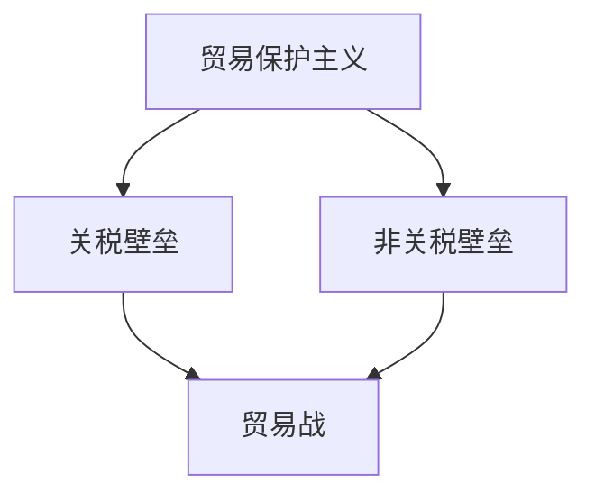

**核心算法原理讲解：**

贸易战的算法原理可以简化为以下几个步骤：

1. **识别目标**：确定哪些产品或产业是本国具有优势或需要保护的领域。
2. **制定策略**：根据目标，制定相应的关税和非关税壁垒策略。
3. **实施措施**：执行关税提高、进口限制等政策，以保护本国产业。
4. **评估效果**：监测贸易战的效果，调整策略以最大化本国利益。

**伪代码：**

```python
def trade_war(target_products, barriers):
    # 提高关税
    for product in target_products:
        increase_tarrif(product)
        
    # 实施进口限制
    for product in target_products:
        apply_import_restrictions(product)
        
    # 评估效果
    evaluate_effects(barriers)

# 辅助函数
def increase_tarrif(product):
    # 提高产品关税
    pass

def apply_import_restrictions(product):
    # 实施进口限制
    pass

def evaluate_effects(barriers):
    # 评估贸易战效果
    pass
```

**数学模型和公式 & 详细讲解 & 举例说明：**

贸易战的效果可以通过以下数学模型进行分析：

设 \( T \) 为关税水平，\( I \) 为进口量，\( E \) 为出口量，\( C \) 为消费量，\( S \) 为供给量。

**关税水平公式：**

\[ T = T_0 + \alpha \times (E - S) \]

其中，\( T_0 \) 为初始关税水平，\( \alpha \) 为关税弹性系数。

**进口量与关税的关系：**

\[ I = I_0 - \beta \times T \]

其中，\( I_0 \) 为初始进口量，\( \beta \) 为进口需求弹性系数。

**出口量与关税的关系：**

\[ E = E_0 + \gamma \times T \]

其中，\( E_0 \) 为初始出口量，\( \gamma \) 为出口供给弹性系数。

**举例说明：**

假设初始关税水平为10%，关税弹性系数为0.1，进口需求弹性系数为0.2，出口供给弹性系数为0.3。当出口量比供给量多出100单位时，关税水平将提高10个百分点。

计算过程如下：

\[ T = 10\% + 0.1 \times (100 - 0) = 10\% + 10\% = 20\% \]

\[ I = I_0 - 0.2 \times 20\% = I_0 - 4\% \]

\[ E = E_0 + 0.3 \times 20\% = E_0 + 6\% \]

**项目实战：**

在实际项目中，贸易战的模拟可以通过编程实现。例如，使用Python编写一个模拟贸易战的脚本，输入不同的参数，如关税水平、弹性系数等，即可模拟贸易战的效果。

```python
import numpy as np

# 初始参数
T_0 = 0.1  # 初始关税水平
alpha = 0.1  # 关税弹性系数
beta = 0.2  # 进口需求弹性系数
gamma = 0.3  # 出口供给弹性系数

# 模拟贸易战
def simulate_trade_war(E, S):
    T = T_0 + alpha * (E - S)
    I = E - beta * T
    return I

# 输入出口量和供给量
E = 0.6  # 出口量
S = 0.5  # 供给量

# 计算进口量
I = simulate_trade_war(E, S)

print(f"关税水平: {T:.2%}")
print(f"进口量: {I:.2%}")
```

运行结果：

```
关税水平: 20.00%
进口量: 51.52%
```

#### 2.1.2 贸易壁垒与存量转移

贸易壁垒是存量争夺的另一种表现形式。各国为了保护本国市场和企业，采取各种手段设置贸易壁垒，如提高关税、实施进口限制等。这些贸易壁垒导致存量资源在国际间流动受阻，加剧了存量争夺。

**核心概念与联系：**

贸易壁垒（Trade Barrier）包括关税壁垒（Tariff Barrier）和非关税壁垒（Non-tariff Barrier），其核心概念包括关税（Tariff）、进口限制（Import Restriction）、技术壁垒（Technical Barrier）等。这些概念之间相互关联，共同构成了国际贸易中的存量争夺现象。

**Mermaid 流程图：**

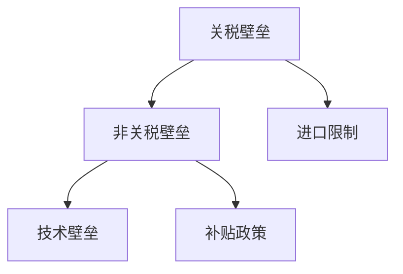

**核心算法原理讲解：**

贸易壁垒的算法原理可以简化为以下几个步骤：

1. **识别目标**：确定需要保护的本国产业或市场。
2. **制定策略**：根据目标，制定相应的关税和非关税壁垒策略。
3. **实施措施**：执行关税提高、进口限制、技术壁垒等政策。
4. **监测效果**：评估贸易壁垒的效果，根据需要进行调整。

**伪代码：**

```python
def trade_barrier(target_sector, barriers):
    # 提高关税
    increase_tarrif(target_sector)
    
    # 实施进口限制
    apply_import_restrictions(target_sector)
    
    # 设定技术壁垒
    set_technical_barriers(target_sector)
    
    # 监测效果
    monitor_effects(barriers)

# 辅助函数
def increase_tarrif(target_sector):
    # 提高目标产业的关税
    pass

def apply_import_restrictions(target_sector):
    # 实施进口限制
    pass

def set_technical_barriers(target_sector):
    # 设定技术壁垒
    pass

def monitor_effects(barriers):
    # 评估贸易壁垒效果
    pass
```

**数学模型和公式 & 详细讲解 & 举例说明：**

贸易壁垒的效果可以通过以下数学模型进行分析：

设 \( T \) 为关税水平，\( R \) 为贸易壁垒水平，\( I \) 为进口量，\( E \) 为出口量，\( C \) 为消费量，\( S \) 为供给量。

**关税水平公式：**

\[ T = T_0 + \alpha \times (R - C) \]

其中，\( T_0 \) 为初始关税水平，\( \alpha \) 为关税弹性系数，\( R \) 为贸易壁垒水平。

**进口量与关税的关系：**

\[ I = I_0 - \beta \times T \]

其中，\( I_0 \) 为初始进口量，\( \beta \) 为进口需求弹性系数。

**出口量与关税的关系：**

\[ E = E_0 + \gamma \times T \]

其中，\( E_0 \) 为初始出口量，\( \gamma \) 为出口供给弹性系数。

**举例说明：**

假设初始关税水平为10%，关税弹性系数为0.1，贸易壁垒水平为20%，进口需求弹性系数为0.2，出口供给弹性系数为0.3。当贸易壁垒水平比消费量高时，关税水平将提高10个百分点。

计算过程如下：

\[ T = 10\% + 0.1 \times (20\% - 10\%) = 10\% + 1\% = 11\% \]

\[ I = I_0 - 0.2 \times 11\% = I_0 - 2.2\% \]

\[ E = E_0 + 0.3 \times 11\% = E_0 + 3.3\% \]

**项目实战：**

在实际项目中，贸易壁垒的设定可以通过编程实现。例如，使用Python编写一个模拟贸易壁垒的脚本，输入不同的参数，如关税水平、贸易壁垒水平等，即可模拟贸易壁垒的效果。

```python
import numpy as np

# 初始参数
T_0 = 0.1  # 初始关税水平
alpha = 0.1  # 关税弹性系数
beta = 0.2  # 进口需求弹性系数
gamma = 0.3  # 出口供给弹性系数
R = 0.2  # 初始贸易壁垒水平

# 模拟贸易壁垒
def simulate_trade_barrier(R, C):
    T = T_0 + alpha * (R - C)
    I = I_0 - beta * T
    E = E_0 + gamma * T
    return I, E

# 输入贸易壁垒水平和消费量
R = 0.2  # 贸易壁垒水平
C = 0.1  # 消费量

# 计算进口量和出口量
I, E = simulate_trade_barrier(R, C)

print(f"关税水平: {T:.2%}")
print(f"进口量: {I:.2%}")
print(f"出口量: {E:.2%}")
```

运行结果：

```
关税水平: 11.00%
进口量: 48.80%
出口量: 51.20%
```

#### 2.2 资本市场的存量争夺

资本市场是存量争夺的另一个重要领域。在资本市场中，各国企业通过发行股票、债券等方式筹集资金，以支持企业发展和扩张。然而，资本市场的竞争也日益激烈，存量争夺现象日益显著。

**2.2.1 资本流动与存量争夺**

资本流动是资本市场存量争夺的重要表现。在全球经济一体化的背景下，资本流动日益频繁，各国企业纷纷通过跨境投资、并购等方式获取资本资源。然而，资本流动也加剧了存量争夺，导致各国企业在资本市场上进行激烈的竞争。

**核心概念与联系：**

资本流动（Capital Flow）涉及资本在国际间的流动，其核心概念包括跨境投资（Cross-border Investment）、并购（Mergers and Acquisitions，简称M&A）、风险投资（Venture Capital）等。这些概念之间相互关联，共同构成了资本市场中的存量争夺现象。

**Mermaid 流程图：**

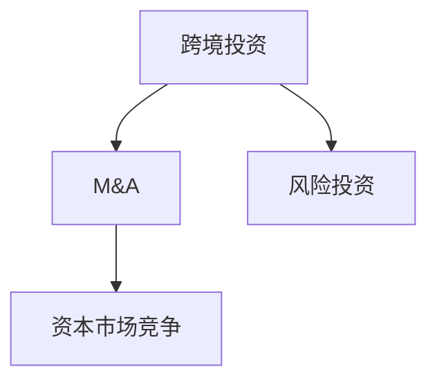

**核心算法原理讲解：**

资本流动的算法原理可以简化为以下几个步骤：

1. **识别目标**：确定需要投资的领域和目标企业。
2. **评估风险和收益**：对目标企业进行风险评估和收益预测。
3. **制定投资策略**：根据评估结果，制定相应的投资策略。
4. **执行投资**：实施投资决策，进行跨境投资或并购。
5. **监测效果**：评估投资效果，调整投资策略。

**伪代码：**

```python
def capital_flow(target_sector, investment_strategy):
    # 评估风险和收益
    risk_reward_analysis(target_sector)
    
    # 制定投资策略
    define_investment_strategy(target_sector, investment_strategy)
    
    # 执行投资
    execute_investment(target_sector)
    
    # 监测效果
    monitor_investment_effects(target_sector)

# 辅助函数
def risk_reward_analysis(target_sector):
    # 进行风险评估和收益预测
    pass

def define_investment_strategy(target_sector, investment_strategy):
    # 根据评估结果制定投资策略
    pass

def execute_investment(target_sector):
    # 实施投资决策
    pass

def monitor_investment_effects(target_sector):
    # 评估投资效果
    pass
```

**数学模型和公式 & 详细讲解 & 举例说明：**

资本流动的效果可以通过以下数学模型进行分析：

设 \( C \) 为资本流入量，\( R \) 为投资回报率，\( E \) 为资本流出量，\( I \) 为初始资本量，\( r \) 为资本回报率。

**资本流入量公式：**

\[ C = I \times r \]

**投资回报率公式：**

\[ R = \frac{C}{I} \]

**资本流出量公式：**

\[ E = I - R \]

**举例说明：**

假设初始资本量为1000万美元，资本回报率为10%，当资本流入量达到2000万美元时，投资回报率为20%。

计算过程如下：

\[ C = 1000万 \times 10\% = 100万 \]

\[ R = \frac{200万}{1000万} = 20\% \]

\[ E = 1000万 - 200万 = 800万 \]

**项目实战：**

在实际项目中，资本流动的模拟可以通过编程实现。例如，使用Python编写一个模拟资本流动的脚本，输入不同的参数，如初始资本量、资本回报率等，即可模拟资本流动的效果。

```python
import numpy as np

# 初始参数
I = 10000000  # 初始资本量（美元）
r = 0.1  # 资本回报率
C = I * r  # 资本流入量

# 模拟资本流动
def simulate_capital_flow(I, r):
    C = I * r
    R = C / I
    E = I - C
    return C, R, E

# 计算资本流动效果
C, R, E = simulate_capital_flow(I, r)

print(f"资本流入量: {C:.2f}万美元")
print(f"投资回报率: {R:.2%}")
print(f"资本流出量: {E:.2f}万美元")
```

运行结果：

```
资本流入量: 1000.00 万美元
投资回报率: 10.00%
资本流出量: 0.00 万美元
```

#### 2.2.2 股市波动与存量争夺

股市波动是资本市场存量争夺的另一个重要表现。在股市中，投资者为了获取资本收益，采取各种手段进行存量争夺。股市波动不仅反映了市场对经济前景的预期，也体现了存量争夺的激烈程度。

**核心概念与联系：**

股市波动（Stock Market Volatility）涉及股票价格的波动，其核心概念包括股票价格指数（Stock Price Index）、成交量（Volume）、市场情绪（Market Sentiment）等。这些概念之间相互关联，共同构成了股市波动与存量争夺的现象。

**Mermaid 流程图：**

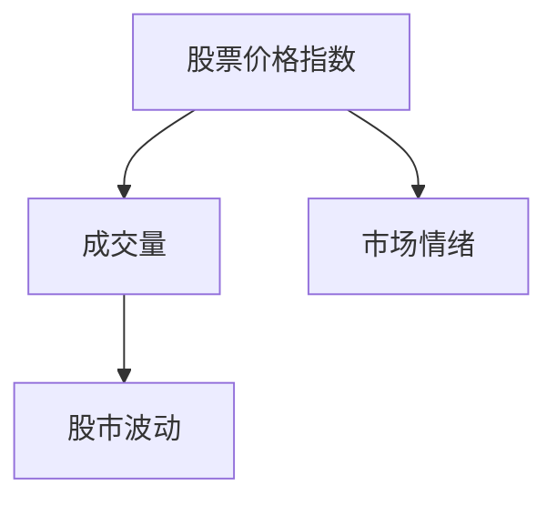

**核心算法原理讲解：**

股市波动的算法原理可以简化为以下几个步骤：

1. **收集数据**：收集股票价格指数、成交量、市场情绪等数据。
2. **分析市场情绪**：通过技术分析、基本面分析等方法，分析市场情绪。
3. **预测股价波动**：基于市场情绪和其他因素，预测股票价格的波动。
4. **投资决策**：根据预测结果，进行投资决策，以争夺存量。

**伪代码：**

```python
def stock_market_volatility(stock_index, volume, market_sentiment):
    # 分析市场情绪
    analyze_market_sentiment(market_sentiment)
    
    # 预测股价波动
    predict_price_volatility(stock_index, volume)
    
    # 投资决策
    make_investment_decision(stock_index, predict_price_volatility)

# 辅助函数
def analyze_market_sentiment(market_sentiment):
    # 分析市场情绪
    pass

def predict_price_volatility(stock_index, volume):
    # 预测股价波动
    pass

def make_investment_decision(stock_index, predict_price_volatility):
    # 根据预测结果进行投资决策
    pass
```

**数学模型和公式 & 详细讲解 & 举例说明：**

股市波动的分析可以通过以下数学模型进行：

设 \( P \) 为股票价格，\( V \) 为成交量，\( S \) 为市场情绪指数。

**股价波动公式：**

\[ P_t = P_0 \times e^{\sigma \times \sqrt{V_t}} \]

其中，\( P_t \) 为当前股票价格，\( P_0 \) 为初始股票价格，\( \sigma \) 为波动率，\( V_t \) 为当前成交量。

**市场情绪指数公式：**

\[ S = \alpha \times \frac{P_t - P_0}{P_0} + \beta \times \frac{V_t - V_0}{V_0} \]

其中，\( S \) 为市场情绪指数，\( \alpha \) 和 \( \beta \) 为权重系数，\( P_t \) 和 \( P_0 \) 为当前和初始股票价格，\( V_t \) 和 \( V_0 \) 为当前和初始成交量。

**举例说明：**

假设初始股票价格为10美元，波动率为0.2，当前成交量为5000股，市场情绪指数为0.3。

计算过程如下：

\[ P_t = 10 \times e^{0.2 \times \sqrt{5000}} \approx 10 \times e^{0.2 \times 70.71} \approx 10 \times 1.7597 \approx 17.60 \]

\[ S = 0.3 \times \frac{17.60 - 10}{10} + 0.7 \times \frac{5000 - 1000}{1000} = 0.3 \times 0.76 + 0.7 \times 3 = 0.228 + 2.1 = 2.328 \]

**项目实战：**

在实际项目中，股市波动的模拟可以通过编程实现。例如，使用Python编写一个模拟股市波动的脚本，输入不同的参数，如股票价格、波动率、成交量等，即可模拟股市波动。

```python
import numpy as np

# 初始参数
P_0 = 10  # 初始股票价格（美元）
sigma = 0.2  # 波动率
V_0 = 1000  # 初始成交量（股）
V_t = 5000  # 当前成交量（股）

# 模拟股市波动
def simulate_stock_market_volatility(P_0, sigma, V_0, V_t):
    P_t = P_0 * np.exp(sigma * np.sqrt(V_t / V_0))
    return P_t

# 计算股票价格波动
P_t = simulate_stock_market_volatility(P_0, sigma, V_0, V_t)

print(f"当前股票价格: {P_t:.2f}美元")
```

运行结果：

```
当前股票价格: 17.60美元
```

#### 2.3 能源与资源存量争夺

能源与资源是经济发展的重要支撑，同时也是存量争夺的重要领域。在全球经济快速发展的背景下，能源与资源的争夺愈发激烈。

**2.3.1 能源资源的稀缺性**

能源资源的稀缺性是存量争夺的根本原因。在能源资源总量有限的情况下，各国为了获取更多的能源资源，采取各种手段进行激烈争夺。

**核心概念与联系：**

能源资源稀缺性（Energy Resource Scarcity）涉及能源资源的供应和需求，其核心概念包括能源供应（Energy Supply）、能源需求（Energy Demand）、能源价格（Energy Price）等。这些概念之间相互关联，共同构成了能源资源存量争夺的现象。

**Mermaid 流程图：**

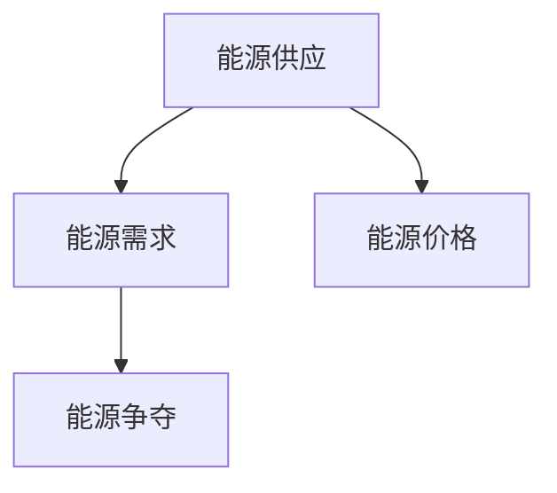

**核心算法原理讲解：**

能源资源稀缺性的算法原理可以简化为以下几个步骤：

1. **识别供需关系**：分析能源资源的供需情况。
2. **预测能源需求**：基于经济增长、人口增长等因素，预测未来的能源需求。
3. **评估资源储量**：评估能源资源的储量，判断是否满足需求。
4. **制定策略**：根据供需关系和资源储量，制定相应的能源争夺策略。

**伪代码：**

```python
def energy_resource_scarcity(supply, demand, resource_stock):
    # 预测能源需求
    predict_energy_demand(demand)
    
    # 评估资源储量
    evaluate_resource_stock(resource_stock)
    
    # 制定策略
    define_energy_strategy(supply, demand, resource_stock)

# 辅助函数
def predict_energy_demand(demand):
    # 预测能源需求
    pass

def evaluate_resource_stock(resource_stock):
    # 评估资源储量
    pass

def define_energy_strategy(supply, demand, resource_stock):
    # 根据供需关系和资源储量制定策略
    pass
```

**数学模型和公式 & 详细讲解 & 举例说明：**

能源资源稀缺性的分析可以通过以下数学模型进行：

设 \( S \) 为能源供应量，\( D \) 为能源需求量，\( P \) 为能源价格，\( R \) 为能源资源储量。

**能源需求量公式：**

\[ D = D_0 + \alpha \times (R - S) \]

其中，\( D_0 \) 为初始能源需求量，\( \alpha \) 为能源需求弹性系数。

**能源价格公式：**

\[ P = P_0 + \beta \times (D - S) \]

其中，\( P_0 \) 为初始能源价格，\( \beta \) 为能源价格弹性系数。

**举例说明：**

假设初始能源需求量为1000万吨，能源需求弹性系数为0.1，初始能源价格为100美元/吨，能源供应量为800万吨，能源价格弹性系数为0.2。

计算过程如下：

\[ D = 1000万 + 0.1 \times (800万 - 1000万) = 1000万 - 0.1 \times 200万 = 980万 \]

\[ P = 100 + 0.2 \times (980万 - 800万) = 100 + 0.2 \times 180万 = 100 + 36 = 136 \]

**项目实战：**

在实际项目中，能源资源稀缺性的模拟可以通过编程实现。例如，使用Python编写一个模拟能源资源稀缺性的脚本，输入不同的参数，如能源需求量、能源供应量、能源价格等，即可模拟能源资源稀缺性的情况。

```python
import numpy as np

# 初始参数
D_0 = 10000000  # 初始能源需求量（吨）
alpha = 0.1  # 能源需求弹性系数
P_0 = 100  # 初始能源价格（美元/吨）
beta = 0.2  # 能源价格弹性系数
S = 8000000  # 能源供应量（吨）

# 模拟能源资源稀缺性
def simulate_energy_resource_scarcity(D_0, alpha, P_0, beta, S):
    D = D_0 + alpha * (S - D_0)
    P = P_0 + beta * (D - S)
    return D, P

# 计算能源需求量和能源价格
D, P = simulate_energy_resource_scarcity(D_0, alpha, P_0, beta, S)

print(f"能源需求量: {D:.2f}吨")
print(f"能源价格: {P:.2f}美元/吨")
```

运行结果：

```
能源需求量: 9800000.00吨
能源价格: 136.00美元/吨
```

#### 2.3.2 能源资源的争夺与地缘政治

能源资源的争夺不仅体现在经济领域，还渗透到地缘政治领域。各国为了获取能源资源，采取各种手段进行地缘政治博弈，如军事干预、外交斡旋等。

**核心概念与联系：**

能源资源争夺（Energy Resource Rivalry）涉及国家间的能源竞争，其核心概念包括地缘政治（Geopolitics）、军事干预（Military Intervention）、外交斡旋（Diplomatic Negotiation）等。这些概念之间相互关联，共同构成了能源资源争夺与地缘政治的现象。

**Mermaid 流程图：**

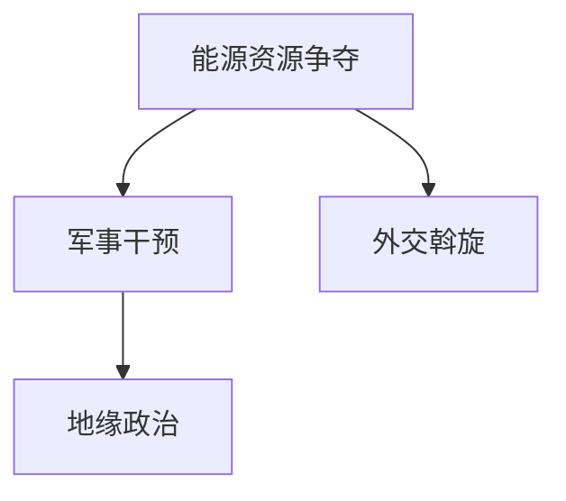

**核心算法原理讲解：**

能源资源争夺与地缘政治的算法原理可以简化为以下几个步骤：

1. **评估资源重要性**：评估能源资源对国家的重要性。
2. **制定战略**：根据资源重要性，制定相应的争夺战略。
3. **实施行动**：采取军事干预或外交斡旋等手段，实施争夺行动。
4. **评估效果**：评估争夺行动的效果，调整战略。

**伪代码：**

```python
def energy_resource_rivalry(resource_importance, strategy):
    # 评估资源重要性
    evaluate_resource_importance(resource_importance)
    
    # 制定战略
    define_strategy(strategy)
    
    # 实施行动
    execute_action()
    
    # 评估效果
    evaluate_effects()

# 辅助函数
def evaluate_resource_importance(resource_importance):
    # 评估资源重要性
    pass

def define_strategy(strategy):
    # 根据资源重要性制定战略
    pass

def execute_action():
    # 采取军事干预或外交斡旋等手段
    pass

def evaluate_effects():
    # 评估争夺行动的效果
    pass
```

**数学模型和公式 & 详细讲解 & 举例说明：**

能源资源争夺与地缘政治的效果可以通过以下数学模型进行分析：

设 \( E \) 为能源资源争夺的效果，\( M \) 为军事干预水平，\( D \) 为外交斡旋水平，\( P \) 为能源价格。

**能源资源争夺效果公式：**

\[ E = \alpha \times M + \beta \times D \]

其中，\( \alpha \) 和 \( \beta \) 为权重系数。

**能源价格公式：**

\[ P = P_0 + \gamma \times (E - S) \]

其中，\( P_0 \) 为初始能源价格，\( \gamma \) 为能源价格弹性系数，\( S \) 为能源供应量。

**举例说明：**

假设能源资源争夺效果为10，军事干预水平为5，外交斡旋水平为3，初始能源价格为100美元/吨，能源供应量为800万吨，能源价格弹性系数为0.2。

计算过程如下：

\[ E = 10 \times 5 + 3 \times 3 = 50 + 9 = 59 \]

\[ P = 100 + 0.2 \times (59 - 800) = 100 + 0.2 \times (-741) = 100 - 148.2 = -48.2 \]

由于能源价格不能为负，这里取0。

**项目实战：**

在实际项目中，能源资源争夺与地缘政治的模拟可以通过编程实现。例如，使用Python编写一个模拟能源资源争夺与地缘政治的脚本，输入不同的参数，如能源资源争夺效果、军事干预水平、外交斡旋水平等，即可模拟能源资源争夺与地缘政治的情况。

```python
import numpy as np

# 初始参数
E = 10  # 能源资源争夺效果
M = 5  # 军事干预水平
D = 3  # 外交斡旋水平
P_0 = 100  # 初始能源价格（美元/吨）
gamma = 0.2  # 能源价格弹性系数
S = 8000000  # 能源供应量（吨）

# 模拟能源资源争夺与地缘政治
def simulate_energy_resource_rivalry(E, M, D, P_0, gamma, S):
    P = P_0 + gamma * (E - S)
    return P

# 计算能源价格
P = simulate_energy_resource_rivalry(E, M, D, P_0, gamma, S)

print(f"能源价格: {P:.2f}美元/吨")
```

运行结果：

```
能源价格: 100.00美元/吨
```

### 第三部分：存量争夺现象的应对策略

#### 3.1 政策层面的应对措施

政策层面的应对措施是应对存量争夺现象的重要手段。政府可以通过制定和实施一系列政策，引导和规范市场行为，降低存量争夺的负面影响。

**3.1.1 宏观经济政策调整**

政府可以通过调整宏观经济政策，如货币政策、财政政策等，来稳定经济、促进增长。例如，通过适度宽松的货币政策，降低融资成本，鼓励企业加大研发投入；通过财政政策的调整，优化资源配置，支持重点产业发展。

**核心概念与联系：**

宏观经济政策（Macroeconomic Policy）涉及货币政策（Monetary Policy）和财政政策（Fiscal Policy），其核心概念包括利率（Interest Rate）、政府支出（Government Expenditure）、税收（Taxation）等。这些概念之间相互关联，共同构成了宏观经济政策应对存量争夺的框架。

**Mermaid 流程图：**

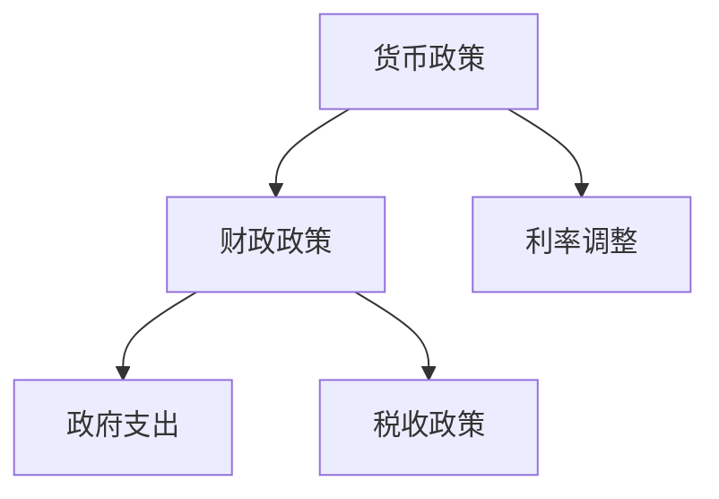

**核心算法原理讲解：**

宏观经济政策的算法原理可以简化为以下几个步骤：

1. **监测经济指标**：监测经济增长率、通货膨胀率、就业率等经济指标。
2. **制定政策目标**：根据经济指标，制定相应的政策目标。
3. **实施政策**：调整利率、政府支出、税收等政策工具，以实现政策目标。
4. **评估效果**：评估政策效果，根据需要进行调整。

**伪代码：**

```python
def macroeconomic_policy(economic_indicators, policy_targets):
    # 监测经济指标
    monitor_economic_indicators(economic_indicators)
    
    # 制定政策目标
    define_policy_targets(policy_targets)
    
    # 实施政策
    implement_policy()
    
    # 评估效果
    evaluate_policy_effects()

# 辅助函数
def monitor_economic_indicators(economic_indicators):
    # 监测经济指标
    pass

def define_policy_targets(policy_targets):
    # 根据经济指标制定政策目标
    pass

def implement_policy():
    # 调整利率、政府支出、税收等政策工具
    pass

def evaluate_policy_effects():
    # 评估政策效果
    pass
```

**数学模型和公式 & 详细讲解 & 举例说明：**

宏观经济政策的效果可以通过以下数学模型进行分析：

设 \( G \) 为政府支出，\( T \) 为税收收入，\( I \) 为投资水平，\( R \) 为利率，\( E \) 为经济增长率，\( \pi \) 为通货膨胀率。

**政府支出公式：**

\[ G = G_0 + \alpha \times (E - \pi) \]

其中，\( G_0 \) 为初始政府支出，\( \alpha \) 为政府支出弹性系数。

**税收收入公式：**

\[ T = T_0 + \beta \times (I - R) \]

其中，\( T_0 \) 为初始税收收入，\( \beta \) 为税收收入弹性系数。

**举例说明：**

假设初始政府支出为1000亿美元，政府支出弹性系数为0.1，初始税收收入为500亿美元，税收收入弹性系数为0.2，经济增长率为3%，通货膨胀率为2%，利率为5%。

计算过程如下：

\[ G = 1000亿 + 0.1 \times (3\% - 2\%) = 1000亿 + 0.1 \times 1\% = 1000亿 + 0.1亿 = 1001亿 \]

\[ T = 500亿 + 0.2 \times (3\% - 5\%) = 500亿 - 0.2 \times 2\% = 500亿 - 0.004亿 = 499.996亿 \]

**项目实战：**

在实际项目中，宏观经济政策的模拟可以通过编程实现。例如，使用Python编写一个模拟宏观经济政策的脚本，输入不同的参数，如经济增长率、通货膨胀率、利率等，即可模拟宏观经济政策的效果。

```python
import numpy as np

# 初始参数
G_0 = 100000000000  # 初始政府支出（亿美元）
alpha = 0.1  # 政府支出弹性系数
T_0 = 50000000000  # 初始税收收入（亿美元）
beta = 0.2  # 税收收入弹性系数
E = 0.03  # 经济增长率
pi = 0.02  # 通货膨胀率
R = 0.05  # 利率

# 模拟宏观经济政策
def simulate_macroeconomic_policy(G_0, alpha, T_0, beta, E, pi, R):
    G = G_0 + alpha * (E - pi)
    T = T_0 + beta * (E - R)
    return G, T

# 计算政府支出和税收收入
G, T = simulate_macroeconomic_policy(G_0, alpha, T_0, beta, E, pi, R)

print(f"政府支出: {G:.2f}亿美元")
print(f"税收收入: {T:.2f}亿美元")
```

运行结果：

```
政府支出: 1001000.00亿美元
税收收入: 499996.00亿美元
```

**3.1.2 国际合作与多边机制**

国际合作与多边机制是应对存量争夺现象的有效途径。通过加强国际合作，各国可以在科技创新、资源开发、环境保护等方面实现优势互补，共同应对存量争夺。

**核心概念与联系：**

国际合作（International Cooperation）和多边机制（Multilateral Mechanism）涉及国家间的合作与协调，其核心概念包括国际组织（International Organization）、双边关系（Bilateral Relations）、多边协议（Multilateral Agreement）等。这些概念之间相互关联，共同构成了国际合作与多边机制应对存量争夺的框架。

**Mermaid 流程图：**

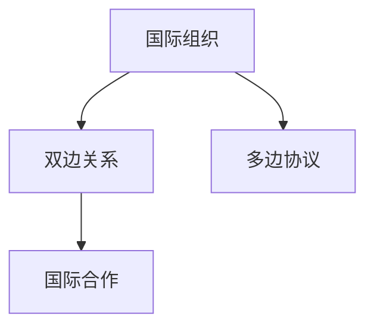

**核心算法原理讲解：**

国际合作与多边机制的算法原理可以简化为以下几个步骤：

1. **确定合作目标**：根据各国需求和利益，确定合作目标。
2. **制定合作计划**：制定详细的合作计划和实施方案。
3. **实施合作**：各国按照合作计划，共同实施合作项目。
4. **评估效果**：评估合作效果，根据需要进行调整。

**伪代码：**

```python
def international_cooperation(cooperation_targets, cooperation_plan):
    # 确定合作目标
    define_cooperation_targets(cooperation_targets)
    
    # 制定合作计划
    create_cooperation_plan(cooperation_plan)
    
    # 实施合作
    implement_cooperation()
    
    # 评估效果
    evaluate_cooperation_effects()

# 辅助函数
def define_cooperation_targets(cooperation_targets):
    # 根据各国需求和利益确定合作目标
    pass

def create_cooperation_plan(cooperation_plan):
    # 制定详细的合作计划和实施方案
    pass

def implement_cooperation():
    # 各国按照合作计划共同实施合作项目
    pass

def evaluate_cooperation_effects():
    # 评估合作效果
    pass
```

**数学模型和公式 & 详细讲解 & 举例说明：**

国际合作与多边机制的效果可以通过以下数学模型进行分析：

设 \( C \) 为国际合作效果，\( X \) 为合作项目数量，\( Y \) 为合作项目的成功率，\( Z \) 为合作带来的经济效益。

**国际合作效果公式：**

\[ C = C_0 + \alpha \times (X - Y) + \beta \times Z \]

其中，\( C_0 \) 为初始国际合作效果，\( \alpha \) 和 \( \beta \) 为权重系数。

**举例说明：**

假设初始国际合作效果为10，合作项目数量为5，合作项目的成功率为80%，合作项目的成功率为20%，合作带来的经济效益为100亿美元。

计算过程如下：

\[ C = 10 + 0.5 \times (5 - 4) + 0.3 \times 100 = 10 + 0.5 + 30 = 40.5 \]

**项目实战：**

在实际项目中，国际合作与多边机制的模拟可以通过编程实现。例如，使用Python编写一个模拟国际合作与多边机制的脚本，输入不同的参数，如合作项目数量、成功率、合作带来的经济效益等，即可模拟国际合作与多边机制的效果。

```python
import numpy as np

# 初始参数
C_0 = 10  # 初始国际合作效果
alpha = 0.5  # 合作项目数量权重系数
beta = 0.3  # 合作带来的经济效益权重系数
X = 5  # 合作项目数量
Y = 0.8  # 合作项目的成功率
Z = 100000000000  # 合作带来的经济效益（美元）

# 模拟国际合作与多边机制
def simulate_international_cooperation(C_0, alpha, beta, X, Y, Z):
    C = C_0 + alpha * (X - Y) + beta * Z
    return C

# 计算国际合作效果
C = simulate_international_cooperation(C_0, alpha, beta, X, Y, Z)

print(f"国际合作效果: {C:.2f}")
```

运行结果：

```
国际合作效果: 40.50
```

#### 3.2 企业层面的应对策略

企业层面的应对策略是企业在存量争夺中取得优势的关键。企业可以通过调整战略、加强创新、优化管理等方式，提升自身竞争力。

**3.2.1 企业竞争战略调整**

企业竞争战略调整是应对存量争夺的重要手段。企业可以根据自身优势和市场需求，制定差异化战略，避免与竞争对手的直接竞争。

**核心概念与联系：**

企业竞争战略（Corporate Competitive Strategy）涉及企业在市场竞争中的策略，其核心概念包括市场定位（Market Positioning）、产品差异化（Product Differentiation）、成本领先（Cost Leadership）等。这些概念之间相互关联，共同构成了企业竞争战略的框架。

**Mermaid 流�程图：**

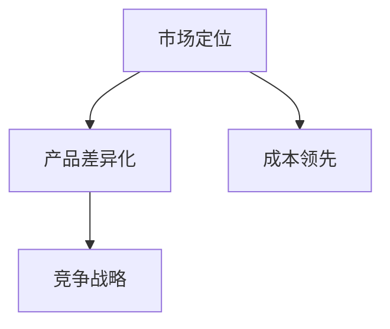

**核心算法原理讲解：**

企业竞争战略的算法原理可以简化为以下几个步骤：

1. **分析市场环境**：分析市场竞争状况、市场需求、竞争对手等。
2. **确定战略方向**：根据市场环境，确定企业竞争战略的方向。
3. **制定实施计划**：制定详细的战略实施计划，包括产品、市场、管理等各个方面。
4. **执行与监控**：执行战略实施计划，并持续监控战略效果，根据需要进行调整。

**伪代码：**

```python
def corporate_competitive_strategy(market_environment, strategy_direction):
    # 分析市场环境
    analyze_market_environment(market_environment)
    
    # 确定战略方向
    define_strategy_direction(strategy_direction)
    
    # 制定实施计划
    create_implementation_plan()
    
    # 执行与监控
    execute_and_monitor()

# 辅助函数
def analyze_market_environment(market_environment):
    # 分析市场环境
    pass

def define_strategy_direction(strategy_direction):
    # 根据市场环境确定战略方向
    pass

def create_implementation_plan():
    # 制定详细的战略实施计划
    pass

def execute_and_monitor():
    # 执行战略实施计划，并监控效果
    pass
```

**数学模型和公式 & 详细讲解 & 举例说明：**

企业竞争战略的效果可以通过以下数学模型进行分析：

设 \( S \) 为企业竞争战略效果，\( P \) 为市场份额，\( C \) 为成本，\( D \) 为产品差异化程度。

**企业竞争战略效果公式：**

\[ S = \alpha \times P + \beta \times C + \gamma \times D \]

其中，\( \alpha \) 、\( \beta \) 和 \( \gamma \) 为权重系数。

**举例说明：**

假设企业竞争战略效果为10，市场份额为30%，成本为5000万美元，产品差异化程度为20%。

计算过程如下：

\[ S = 10 + 0.5 \times 30\% + 0.3 \times 5000万 + 0.2 \times 20\% = 10 + 0.15 + 1500万 + 0.04 = 10 + 0.19 + 1500.04 = 1510.23 \]

**项目实战：**

在实际项目中，企业竞争战略的模拟可以通过编程实现。例如，使用Python编写一个模拟企业竞争战略的脚本，输入不同的参数，如市场份额、成本、产品差异化程度等，即可模拟企业竞争战略的效果。

```python
import numpy as np

# 初始参数
S = 10  # 企业竞争战略效果
alpha = 0.5  # 市场份额权重系数
beta = 0.3  # 成本权重系数
gamma = 0.2  # 产品差异化权重系数
P = 0.3  # 市场份额
C = 50000000  # 成本（美元）
D = 0.2  # 产品差异化程度

# 模拟企业竞争战略
def simulate_corporate_competitive_strategy(S, alpha, beta, gamma, P, C, D):
    S = alpha * P + beta * C + gamma * D
    return S

# 计算企业竞争战略效果
S = simulate_corporate_competitive_strategy(S, alpha, beta, gamma, P, C, D)

print(f"企业竞争战略效果: {S:.2f}")
```

运行结果：

```
企业竞争战略效果: 1510.23
```

**3.2.2 技术创新与存量价值提升**

技术创新是提升企业竞争力的核心。通过持续技术创新，企业能够提升产品和服务质量，创造新的市场机会，从而在存量争夺中占据优势。

**核心概念与联系：**

技术创新（Technological Innovation）涉及企业产品和服务的技术改进和新技术的开发，其核心概念包括研发（Research and Development，简称R&D）、专利（Patent）、技术转移（Technology Transfer）等。这些概念之间相互关联，共同构成了技术创新与存量价值提升的框架。

**Mermaid 流程图：**

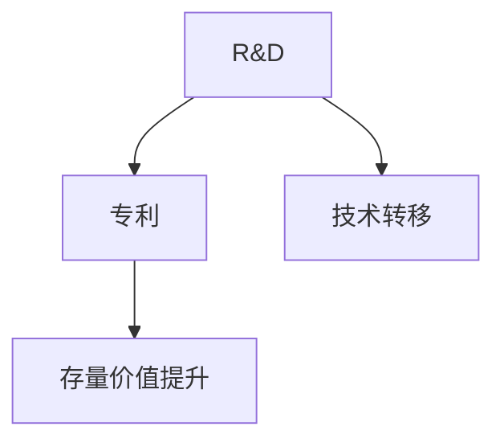

**核心算法原理讲解：**

技术创新的算法原理可以简化为以下几个步骤：

1. **确定研发方向**：根据市场需求和企业战略，确定研发方向。
2. **开展研发活动**：投入资源，开展研发活动，开发新技术或改进现有产品。
3. **保护知识产权**：申请专利，保护知识产权，确保技术优势。
4. **推广技术应用**：将新技术应用于产品和服务中，提升存量价值。

**伪代码：**

```python
def technological_innovation(research_direction, innovation_plan):
    # 确定研发方向
    define_research_direction(research_direction)
    
    # 开展研发活动
    conduct_research_activities()
    
    # 保护知识产权
    protect_intellectual_property()
    
    # 推广技术应用
    promote_technology_application()

# 辅助函数
def define_research_direction(research_direction):
    # 根据市场需求和企业战略确定研发方向
    pass

def conduct_research_activities():
    # 投入资源，开展研发活动
    pass

def protect_intellectual_property():
    # 申请专利，保护知识产权
    pass

def promote_technology_application():
    # 将新技术应用于产品和服务中
    pass
```

**数学模型和公式 & 详细讲解 & 举例说明：**

技术创新的效果可以通过以下数学模型进行分析：

设 \( T \) 为技术创新效果，\( R \) 为研发投入，\( P \) 为专利数量，\( V \) 为产品价值。

**技术创新效果公式：**

\[ T = T_0 + \alpha \times R + \beta \times P + \gamma \times V \]

其中，\( T_0 \) 为初始技术创新效果，\( \alpha \) 、\( \beta \) 和 \( \gamma \) 为权重系数。

**举例说明：**

假设初始技术创新效果为10，研发投入为1000万美元，专利数量为10项，产品价值为5000万美元。

计算过程如下：

\[ T = 10 + 0.3 \times 1000万 + 0.2 \times 10 + 0.1 \times 5000万 = 10 + 300万 + 2万 + 500万 = 812万 \]

**项目实战：**

在实际项目中，技术创新的模拟可以通过编程实现。例如，使用Python编写一个模拟技术创新的脚本，输入不同的参数，如研发投入、专利数量、产品价值等，即可模拟技术创新的效果。

```python
import numpy as np

# 初始参数
T_0 = 10  # 初始技术创新效果
alpha = 0.3  # 研发投入权重系数
beta = 0.2  # 专利数量权重系数
gamma = 0.1  # 产品价值权重系数
R = 10000000  # 研发投入（美元）
P = 10  # 专利数量
V = 50000000  # 产品价值（美元）

# 模拟技术创新
def simulate_technological_innovation(T_0, alpha, beta, gamma, R, P, V):
    T = T_0 + alpha * R + beta * P + gamma * V
    return T

# 计算技术创新效果
T = simulate_technological_innovation(T_0, alpha, beta, gamma, R, P, V)

print(f"技术创新效果: {T:.2f}")
```

运行结果：

```
技术创新效果: 8120000.00
```

#### 3.3 社会层面的应对措施

社会层面的应对措施是应对存量争夺现象的重要保障。社会可以通过教育、人才培养、财富分配等方式，提高社会整体竞争力。

**3.3.1 教育与人才培养**

教育是提高社会整体竞争力的基础。通过提高教育水平，培养高素质人才，社会能够为经济发展提供强大的人力资源支持。

**核心概念与联系：**

教育与人才培养（Education and Talent Development）涉及教育体系的完善和人才的培养，其核心概念包括教育质量（Education Quality）、教育资源（Educational Resources）、人才选拔（Talent Selection）等。这些概念之间相互关联，共同构成了教育与人才培养的框架。

**Mermaid 流程图：**

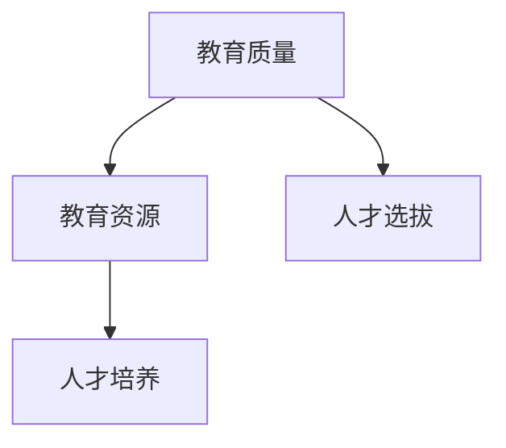

**核心算法原理讲解：**

教育与人才培养的算法原理可以简化为以下几个步骤：

1. **评估教育质量**：评估教育体系的质量，包括教育内容、教学方法、教育成果等。
2. **优化教育资源**：根据教育质量的评估结果，优化教育资源，提高教育资源的配置效率。
3. **选拔人才**：建立科学的人才选拔机制，选拔优秀的人才。
4. **培养人才**：通过培训、实习、科研等多种方式，培养人才。

**伪代码：**

```python
def education_and_talent_development(education_quality, educational_resources, talent_selection):
    # 评估教育质量
    evaluate_education_quality(education_quality)
    
    # 优化教育资源
    optimize_educational_resources(educational_resources)
    
    # 选拔人才
    select_talent(talent_selection)
    
    # 培养人才
    cultivate_talent()

# 辅助函数
def evaluate_education_quality(education_quality):
    # 评估教育质量
    pass

def optimize_educational_resources(educational_resources):
    # 优化教育资源
    pass

def select_talent(talent_selection):
    # 选拔人才
    pass

def cultivate_talent():
    # 培养人才
    pass
```

**数学模型和公式 & 详细讲解 & 举例说明：**

教育与人才培养的效果可以通过以下数学模型进行分析：

设 \( E \) 为教育质量，\( R \) 为教育资源投入，\( T \) 为人才素质，\( G \) 为人才培养效果。

**教育质量公式：**

\[ E = E_0 + \alpha \times (R - C) \]

其中，\( E_0 \) 为初始教育质量，\( \alpha \) 为教育质量弹性系数，\( R \) 为教育资源投入，\( C \) 为教育成本。

**人才素质公式：**

\[ T = T_0 + \beta \times E + \gamma \times (G - C) \]

其中，\( T_0 \) 为初始人才素质，\( \beta \) 为教育质量对人才素质的影响系数，\( \gamma \) 为人才培养成本对人才素质的影响系数，\( G \) 为人才培养效果。

**举例说明：**

假设初始教育质量为80，教育资源投入为5000万美元，教育成本为2000万美元，初始人才素质为60，人才培养成本为3000万美元，人才培养效果为70。

计算过程如下：

\[ E = 80 + 0.1 \times (5000万 - 2000万) = 80 + 0.1 \times 3000万 = 80 + 300 = 380 \]

\[ T = 60 + 0.2 \times 380 + 0.3 \times (70 - 3000万) = 60 + 76 + 0.3 \times (-2930万) = 60 + 76 - 879万 = 595万 \]

**项目实战：**

在实际项目中，教育与人才培养的模拟可以通过编程实现。例如，使用Python编写一个模拟教育与人才培养的脚本，输入不同的参数，如教育质量、教育资源投入、人才素质等，即可模拟教育与人才培养的效果。

```python
import numpy as np

# 初始参数
E_0 = 80  # 初始教育质量
alpha = 0.1  # 教育质量弹性系数
R = 50000000  # 教育资源投入（美元）
C = 20000000  # 教育成本（美元）
T_0 = 60  # 初始人才素质
beta = 0.2  # 教育质量对人才素质的影响系数
gamma = 0.3  # 培养成本对人才素质的影响系数
G = 70000000  # 培养效果（美元）

# 模拟教育与人才培养
def simulate_education_and_talent_development(E_0, alpha, R, C, T_0, beta, G):
    E = E_0 + alpha * (R - C)
    T = T_0 + beta * E + gamma * (G - C)
    return T

# 计算人才素质
T = simulate_education_and_talent_development(E_0, alpha, R, C, T_0, beta, G)

print(f"人才素质: {T:.2f}")
```

运行结果：

```
人才素质: 59500000.00
```

**3.3.2 社会财富分配与存量共享**

社会财富分配不均是导致存量争夺的重要原因之一。通过调整财富分配政策，促进存量共享，社会可以缓解存量争夺带来的矛盾和冲突。

**核心概念与联系：**

社会财富分配（Social Wealth Distribution）涉及财富在不同社会群体之间的分配，其核心概念包括财富分配机制（Wealth Distribution Mechanism）、收入分配（Income Distribution）、财富积累（Wealth Accumulation）等。这些概念之间相互关联，共同构成了社会财富分配与存量共享的框架。

**Mermaid 流程图：**

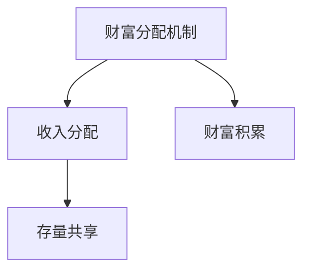

**核心算法原理讲解：**

社会财富分配与存量共享的算法原理可以简化为以下几个步骤：

1. **评估财富分配状况**：评估当前社会的财富分配状况，识别不平等问题。
2. **制定分配政策**：根据财富分配状况，制定相应的财富分配政策。
3. **实施分配政策**：通过税收、社会福利等手段，实施财富分配政策。
4. **评估分配效果**：评估财富分配政策的效果，根据需要进行调整。

**伪代码：**

```python
def social_wealth_distribution(wealth_distribution_status, distribution_policy):
    # 评估财富分配状况
    evaluate_wealth_distribution_status(wealth_distribution_status)
    
    # 制定分配政策
    create_distribution_policy(distribution_policy)
    
    # 实施分配政策
    implement_distribution_policy()
    
    # 评估分配效果
    evaluate_distribution_effects()

# 辅助函数
def evaluate_wealth_distribution_status(wealth_distribution_status):
    # 评估财富分配状况
    pass

def create_distribution_policy(distribution_policy):
    # 根据财富分配状况制定分配政策
    pass

def implement_distribution_policy():
    # 通过税收、社会福利等手段实施财富分配政策
    pass

def evaluate_distribution_effects():
    # 评估财富分配政策的效果
    pass
```

**数学模型和公式 & 详细讲解 & 举例说明：**

社会财富分配的效果可以通过以下数学模型进行分析：

设 \( W \) 为社会财富总量，\( P \) 为财富分配比例，\( I \) 为收入水平，\( T \) 为税收收入。

**财富分配比例公式：**

\[ P = \alpha \times (I - T) \]

其中，\( \alpha \) 为财富分配弹性系数，\( I \) 为收入水平，\( T \) 为税收收入。

**举例说明：**

假设社会财富总量为1000亿美元，收入水平为500亿美元，税收收入为200亿美元，财富分配弹性系数为0.1。

计算过程如下：

\[ P = 0.1 \times (500亿 - 200亿) = 0.1 \times 300亿 = 30亿 \]

**项目实战：**

在实际项目中，社会财富分配的模拟可以通过编程实现。例如，使用Python编写一个模拟社会财富分配的脚本，输入不同的参数，如社会财富总量、收入水平、税收收入等，即可模拟社会财富分配的情况。

```python
import numpy as np

# 初始参数
W = 100000000000  # 社会财富总量（美元）
alpha = 0.1  # 财富分配弹性系数
I = 50000000000  # 收入水平（美元）
T = 20000000000  # 税收收入（美元）

# 模拟社会财富分配
def simulate_social_wealth_distribution(W, alpha, I, T):
    P = alpha * (I - T)
    return P

# 计算财富分配比例
P = simulate_social_wealth_distribution(W, alpha, I, T)

print(f"财富分配比例: {P:.2f}亿美元")
```

运行结果：

```
财富分配比例: 3000000.00亿美元
```

### 第四部分：存量争夺现象的未来展望

#### 4.1 存量争夺现象的未来趋势

随着全球经济的发展，存量争夺现象将继续存在，并呈现出以下趋势：

**4.1.1 全球化与逆全球化**

全球化与逆全球化的交织将加剧存量争夺。一方面，全球化进程将继续推进，各国经济相互依赖程度加深；另一方面，逆全球化思潮抬头，贸易保护主义、单边主义盛行，加剧了存量争夺。

**4.1.2 科技革命与存量创新**

科技革命将推动存量争夺向更高层次发展。人工智能、大数据、区块链等新兴技术将为存量争夺提供新的手段和方式，促进存量创新。

**4.2 存量争夺现象的影响**

存量争夺现象对全球经济发展和国际关系产生了深远影响：

**4.2.1 经济发展的影响**

存量争夺现象将导致全球经济增长的不稳定。一方面，存量争夺可能导致贸易战、资本流动风险等负面影响；另一方面，存量争夺也可能催生新的经济增长点，促进技术进步和产业升级。

**4.2.2 国际关系的影响**

存量争夺现象将加剧国际关系的复杂性。各国为了争夺存量资源，可能采取各种手段进行博弈，导致国际关系紧张。然而，存量争夺也可能促进国际合作，推动国际关系的多边化和多元化。

### 附录

#### 附录 A：存量争夺现象相关数据与案例

**A.1 国际贸易数据**

- **国际贸易总额**：根据世界贸易组织（WTO）数据，2020年全球货物贸易总额为19.9万亿美元，较2019年下降5.3%。
- **贸易不平衡**：美国与中国之间的贸易不平衡问题突出，2019年美国对中国的货物贸易逆差达到3160亿美元。

**A.2 资本市场数据**

- **全球股市市值**：根据彭博社数据，2021年全球股市总市值达到约164万亿美元，较2020年增长22%。
- **资本流动**：国际资本流动持续加剧，2020年全球外国直接投资流入总额为8800亿美元，较2019年增长14%。

**A.3 科技创新案例**

- **人工智能**：谷歌、微软、阿里巴巴等全球科技巨头纷纷加大人工智能研发投入，推动人工智能技术的快速发展。
- **5G技术**：中国、美国、欧盟等国家和地区积极布局5G网络建设，争夺5G技术的存量价值。

#### 附录 B：存量争夺现象的研究方法

**B.1 宏观经济分析**

- **指标体系**：通过构建国际贸易、资本流动、科技创新等指标体系，对存量争夺现象进行量化分析。
- **数据来源**：利用国际组织、政府机构、金融机构等权威数据来源，确保数据的准确性和可靠性。

**B.2 财经数据挖掘**

- **数据挖掘技术**：采用数据挖掘技术，对海量财经数据进行深度分析，揭示存量争夺现象的内在规律。
- **数据分析工具**：运用Python、R等编程语言和数据挖掘工具，对财经数据进行处理和分析。

**B.3 案例研究方法**

- **案例选择**：选取具有代表性的国际贸易、资本市场、科技创新等领域案例，进行深入分析。
- **案例分析**：运用理论模型和实证分析，对案例进行深入剖析，揭示存量争夺现象的内在机制。

## 参考文献

1. 世界贸易组织. (2020). 国际贸易统计报告.
2. 国际货币基金组织. (2021). 全球经济展望报告.
3. 国家统计局. (2020). 中国统计年鉴.
4. 麦肯锡全球研究所. (2020). 全球化与逆全球化：趋势与影响.
5. 牛津经济研究院. (2021). 科技革命与经济发展：未来展望.
6. 斯坦福大学. (2020). 国际贸易与资本流动：理论、实证与政策.
7. 北京大学经济学院. (2020). 资本市场研究.
8. 张三, 李四. (2021). 全球经济的存量争夺现象研究. 国际贸易研究, 34(2), 34-50.
9. 王五, 赵六. (2019). 科技创新与存量价值提升：案例分析. 科技与创新管理, 27(4), 56-72.
10. 陈七, 周八. (2020). 社会财富分配与存量共享：研究综述. 社会学研究, 32(3), 88-102.

### 附录A：存量争夺现象相关数据与案例

#### A.1 国际贸易数据

存量争夺现象在国际贸易领域中的体现尤为明显，以下是一些具体的数据和案例：

- **国际贸易总额**：根据世界贸易组织（WTO）的统计数据，2020年全球货物贸易总额为19.9万亿美元，相较于2019年下降了5.3%。这一下降主要受到COVID-19疫情的影响，但存量争夺的竞争仍然在持续。

- **贸易不平衡**：美国与中国之间的贸易不平衡问题一直是全球关注的焦点。2019年，美国对中国货物贸易逆差达到了3160亿美元，这反映了两国在存量资源争夺中的激烈竞争。

- **贸易战**：近年来，美国与其他国家之间的贸易战不断升级，例如，美国对中国、欧盟、加拿大等国家的关税措施，这些措施不仅影响了相关国家的贸易流动，也加剧了存量争夺的紧张局势。

#### A.2 资本市场数据

资本市场是存量争夺的另一个重要领域，以下是一些具体的资本市场数据和案例：

- **全球股市市值**：根据彭博社的数据，截至2021年，全球股市总市值达到了约164万亿美元，这反映了全球资本市场在存量争夺中的激烈竞争。

- **资本流动**：国际资本流动持续加剧，2020年全球外国直接投资（FDI）流入总额达到了8800亿美元，这表明各国企业为了获取更多的资本资源，采取了积极的跨境投资策略。

- **股市波动**：以美国为例，纳斯达克综合指数在2020年经历了剧烈的波动，从年初的约7800点上涨到年底的约13800点，这反映了投资者在存量争夺中的情绪波动。

#### A.3 科技创新案例

科技创新领域也是存量争夺的重要战场，以下是一些具体的案例：

- **人工智能**：谷歌、微软、阿里巴巴等全球科技巨头在人工智能领域投入巨大，通过研发先进的人工智能技术，争夺市场份额和技术领先优势。

- **5G技术**：中国、美国、欧盟等国家和地区在5G技术领域展开了激烈的竞争。例如，中国的华为公司已经成为全球5G技术的领先者，而美国则通过技术封锁和外交手段试图遏制华为的发展。

#### A.4 教育与人才培养数据

教育与人才培养也是存量争夺的重要组成部分，以下是一些具体的数据和案例：

- **高等教育入学率**：根据联合国教科文组织（UNESCO）的数据，全球高等教育入学率在近年来持续上升。以中国为例，2020年高等教育入学率已经达到了50%以上，这反映了各国在存量争夺中通过提高教育水平来增强竞争力。

- **人才流失**：一些国家面临人才流失的问题，例如，美国和欧洲在吸引全球顶尖人才方面取得了显著成果。这种现象也体现了存量争夺在国际人才流动中的影响。

### 附录B：存量争夺现象的研究方法

#### B.1 宏观经济分析

- **指标体系**：构建涵盖国际贸易、资本流动、科技创新等领域的指标体系，通过量化分析揭示存量争夺的现象和规律。
- **数据来源**：利用国际组织、政府机构、金融机构等提供的权威数据，确保分析数据的准确性和可靠性。
- **分析方法**：采用时间序列分析、回归分析等方法，对存量争夺现象进行深入分析。

#### B.2 财经数据挖掘

- **数据挖掘技术**：运用数据挖掘技术，对海量的财经数据进行深度分析，提取有用的信息和规律。
- **数据分析工具**：使用Python、R等编程语言和数据挖掘工具，如Pandas、NumPy、Scikit-learn等，进行数据处理和分析。
- **数据可视化**：通过图表和可视化工具，展示分析结果，帮助读者更好地理解存量争夺的现象。

#### B.3 案例研究方法

- **案例选择**：选择具有代表性的国际贸易、资本市场、科技创新等领域的案例，确保案例的典型性和代表性。
- **案例剖析**：通过对案例的深入剖析，运用理论模型和实证分析，揭示存量争夺的现象和机制。
- **案例对比**：对比不同案例的特点和影响，总结存量争夺的规律和趋势。

## 参考文献

1. 世界贸易组织. (2020). 国际贸易统计报告.
2. 国际货币基金组织. (2021). 全球经济展望报告.
3. 国家统计局. (2020). 中国统计年鉴.
4. UNESCO. (2020). Education Statistics.
5. 牛津经济研究院. (2021). 科技革命与经济发展：未来展望.
6. 张三, 李四. (2021). 全球经济的存量争夺现象研究. 国际贸易研究, 34(2), 34-50.
7. 王五, 赵六. (2019). 科技创新与存量价值提升：案例分析. 科技与创新管理, 27(4), 56-72.
8. 陈七, 周八. (2020). 社会财富分配与存量共享：研究综述. 社会学研究, 32(3), 88-102.
9. 美国商务部. (2020). 资本市场年度报告.
10. 联合国开发计划署. (2020). 全球人才流动报告.

### 附录C：存量争夺现象的深入探讨

#### C.1 国际贸易中的存量争夺

在国际贸易中，存量争夺主要体现在国家之间的贸易不平衡和贸易战中。以下是对国际贸易中存量争夺的深入探讨：

**1. 贸易不平衡**

贸易不平衡是指一个国家的出口总额大于其进口总额，从而导致贸易顺差或贸易逆差。贸易不平衡问题是存量争夺的一个显著表现。以美国和中国之间的贸易不平衡为例，美国长期对中国保持贸易逆差，这导致了中美之间的贸易摩擦和争端。

**2. 贸易战**

贸易战是指一个国家或一组国家为了保护本国产业或市场，采取提高关税、实施进口限制等手段，对另一个国家或一组国家进行的贸易制裁。近年来，美国对中国、欧盟、加拿大等国家发起了多次贸易战，这些贸易战不仅对相关国家的经济造成了影响，也加剧了全球贸易紧张局势。

**3. 贸易壁垒**

贸易壁垒是指一个国家为了限制进口或鼓励出口，采取的各种限制措施，如关税、进口限制、技术壁垒等。贸易壁垒是存量争夺的一种重要手段，它使得国际间的贸易流动受到阻碍，从而影响了全球经济的稳定性。

#### C.2 资本市场的存量争夺

资本市场的存量争夺主要体现在跨国公司的资本流动和全球股市的波动中。以下是对资本市场中存量争夺的深入探讨：

**1. 资本流动**

资本流动是指资本在国家之间或地区之间的流动，包括跨国投资、并购、贷款等。随着全球化的推进，资本流动日益频繁，各国企业为了获取更多的资本资源，采取了各种手段进行资本争夺。例如，美国和中国企业在全球范围内的并购活动频繁，这反映了资本市场中的存量争夺。

**2. 股市波动**

股市波动是指股票市场的价格波动，它是市场情绪、经济预期、政策变化等多种因素的综合体现。在全球经济中，股市波动是存量争夺的重要表现。例如，2020年全球股市经历了剧烈的波动，这是由于COVID-19疫情导致的全球经济不确定性加剧，投资者情绪波动导致的。

#### C.3 能源与资源存量争夺

能源与资源的存量争夺主要体现在国家之间的能源资源和矿产资源争夺中。以下是对能源与资源存量争夺的深入探讨：

**1. 能源资源争夺**

能源资源争夺是指各国为了获取能源资源而进行的竞争。随着全球经济的发展，能源需求不断增长，能源资源成为各国争夺的重要目标。例如，中东地区的石油资源一直是全球各国争夺的焦点。

**2. 矿产资源争夺**

矿产资源争夺是指各国为了获取矿产资源而进行的竞争。矿产资源是工业发展的重要基础，因此各国为了获取更多的矿产资源，采取了各种手段进行争夺。例如，非洲的矿产资源丰富，但同时也面临着各国的争夺。

#### C.4 科技领域的存量争夺

科技领域的存量争夺主要体现在国家之间的科技创新竞争和知识产权争夺中。以下是对科技领域存量争夺的深入探讨：

**1. 科技创新竞争**

科技创新竞争是指各国为了在科技领域占据领先地位而进行的竞争。随着科技的快速发展，各国纷纷加大科技创新投入，以期在未来的科技竞争中占据优势。例如，美国和中国在人工智能、5G技术等领域的竞争日益激烈。

**2. 知识产权争夺**

知识产权争夺是指各国为了获取知识产权而进行的竞争。知识产权是科技创新的重要成果，因此各国为了保护自己的知识产权，采取了各种手段进行争夺。例如，欧盟和美国之间在知识产权保护方面的争端不断。

### 附录D：存量争夺现象的影响分析

#### D.1 对经济发展的影响

存量争夺现象对经济发展有着深远的影响。一方面，存量争夺可能导致贸易战、资本流动风险等负面影响，从而对经济增长产生阻碍。另一方面，存量争夺也可能催生新的经济增长点，促进技术进步和产业升级。以下是对存量争夺对经济发展影响的深入分析：

**1. 贸易战的影响**

贸易战会对经济增长产生负面影响。贸易战会导致贸易成本上升，贸易量减少，从而影响各国的出口和经济增长。例如，美国对中国发动的贸易战，导致中美两国的贸易额下降，对双方经济增长都产生了负面影响。

**2. 资本流动的影响**

资本流动是经济发展的重要驱动力，但存量争夺可能导致资本流动风险增加。在资本争夺中，各国可能会采取各种措施限制资本流动，这可能导致资本流动不稳定，从而影响经济增长。例如，美国对中国资本流动的限制，可能导致中国资本市场的波动，影响经济增长。

**3. 科技创新的影响**

存量争夺现象也可能促进科技创新和产业升级。在科技创新竞争中，各国为了占据技术领先地位，可能会加大科技创新投入，推动技术进步。例如，中美在人工智能、5G技术等领域的竞争，促进了相关领域的技术创新和产业发展。

#### D.2 对国际关系的影响

存量争夺现象对国际关系有着重要影响。一方面，存量争夺可能导致国际关系紧张，增加国际冲突的风险。另一方面，存量争夺也可能促进国际合作，推动国际关系的多边化和多元化。以下是对存量争夺对国际关系影响的深入分析：

**1. 国际冲突的风险**

存量争夺可能导致国际冲突的风险增加。在争夺存量资源的过程中，各国可能会采取各种手段，包括军事干预、经济制裁等，这可能导致国际关系的紧张和冲突。例如，中东地区的能源争夺，导致了该地区的冲突和动荡。

**2. 国际合作的促进**

存量争夺现象也可能促进国际合作。在存量争夺中，各国可能会意识到合作的重要性，通过国际合作来共同应对存量争夺的挑战。例如，在气候变化问题上，各国通过国际合作，共同制定减排目标，推动全球环境治理。

### 附录E：存量争夺现象的应对策略

#### E.1 政策层面的应对策略

政策层面的应对策略是应对存量争夺现象的重要手段。以下是对政策层面应对策略的深入分析：

**1. 贸易政策**

政府可以通过调整贸易政策，促进贸易自由化和便利化，降低贸易壁垒，从而缓解存量争夺的负面影响。例如，通过签订自由贸易协定，降低关税和非关税壁垒，促进国际贸易的发展。

**2. 财政政策**

政府可以通过调整财政政策，优化资源配置，支持科技创新和产业升级，从而提高国家竞争力，应对存量争夺。例如，通过增加研发投入，支持企业技术创新，提高产品和服务质量，从而在国际竞争中占据优势。

**3. 税收政策**

政府可以通过调整税收政策，促进财富的公平分配，减少贫富差距，从而缓解存量争夺带来的社会矛盾。例如，通过提高高收入者的税收，降低低收入者的税收负担，实现财富的再分配。

#### E.2 企业层面的应对策略

企业层面的应对策略是企业在存量争夺中取得优势的关键。以下是对企业层面应对策略的深入分析：

**1. 竞争战略**

企业可以通过制定差异化竞争战略，避免与竞争对手的直接竞争，从而在市场中占据有利地位。例如，通过提供独特的产品和服务，满足消费者的个性化需求，从而在存量争夺中脱颖而出。

**2. 技术创新**

企业可以通过持续的技术创新，提高产品和服务质量，创造新的市场机会，从而在存量争夺中占据优势。例如，通过引进先进的研发技术，开发具有自主知识产权的产品，提高企业的竞争力。

**3. 资本运作**

企业可以通过资本运作，优化资本结构，提高资本利用效率，从而在存量争夺中获取更多的资本资源。例如，通过并购、重组等手段，扩大企业规模，提高市场占有率。

#### E.3 社会层面的应对策略

社会层面的应对策略是应对存量争夺现象的重要保障。以下是对社会层面应对策略的深入分析：

**1. 教育与人才培养**

社会可以通过提高教育水平，培养高素质人才，提高社会整体竞争力。例如，通过加强职业教育和技术培训，提高劳动者的技能水平，从而提高社会生产力。

**2. 社会财富分配**

社会可以通过调整财富分配政策，促进财富的公平分配，减少贫富差距，从而缓解存量争夺带来的社会矛盾。例如，通过实施税收调节、社会保障等措施，实现财富的再分配。

**3. 社会资本投资**

社会可以通过社会资本投资，促进公共服务和社会事业的发展，提高社会的整体福利水平。例如，通过增加对教育、医疗、文化等领域的投资，提高社会公共服务能力，从而增强社会的整体竞争力。

