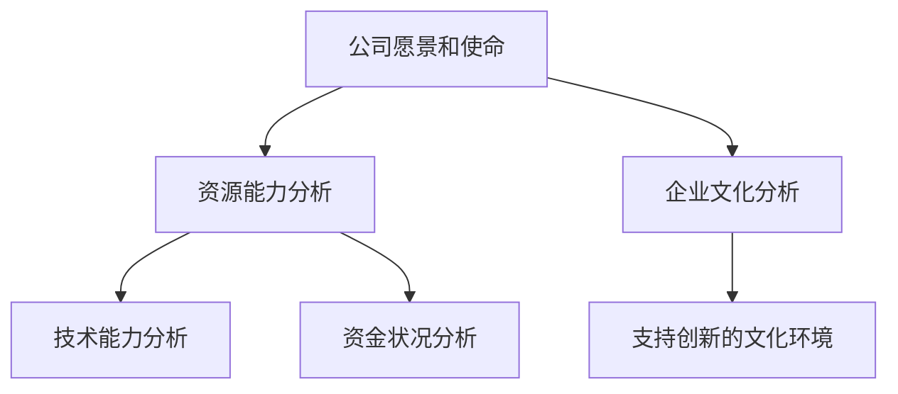
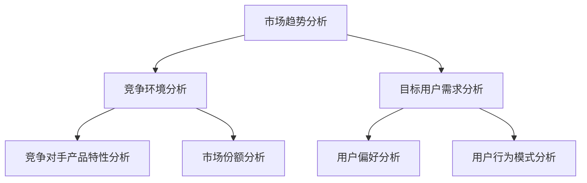
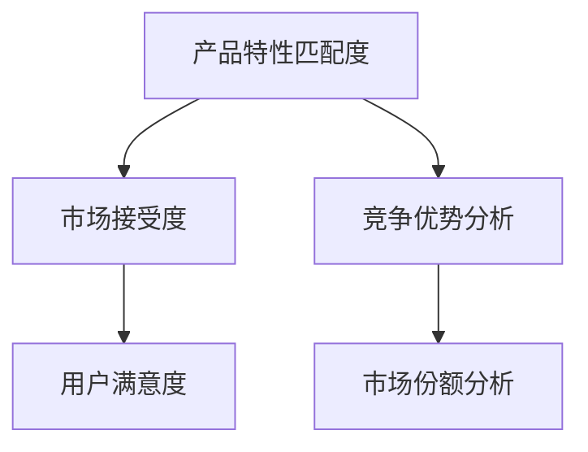

                 

# 创业公司的产品市场契合度评估方法

> **关键词：** 创业公司、产品市场契合度、评估方法、产品定位、市场需求分析

> **摘要：** 本文从创业公司的发展背景和挑战出发，详细探讨了产品市场契合度的概念、重要性及评估方法。通过构建产品市场契合度评估模型，分析产品定位与目标市场，评估产品特性与市场需求的匹配度，讨论产品差异化策略及产品生命周期管理，最终通过实际案例，为创业公司提供了提升产品市场契合度的实践指导。

## 第二部分：产品市场契合度评估框架

在本部分，我们将深入探讨产品市场契合度的评估框架，包括内部环境分析、外部市场分析、产品市场契合度评估指标体系构建及评估模型的应用。

### 第2章：产品市场契合度评估模型

#### 2.1 创业公司内部环境分析

在评估产品市场契合度之前，我们需要对创业公司的内部环境进行深入分析。内部环境分析主要包括以下几个方面：

- **公司愿景和使命**：理解公司的长远目标和核心价值观。
- **资源能力**：评估公司的资源状况，包括资金、技术、人力资源等。
- **企业文化**：分析企业文化是否支持创新和快速响应市场变化。

**Mermaid 流程图：**



#### 2.2 创业公司外部市场分析

外部市场分析是产品市场契合度评估的重要组成部分。以下是对外部市场的关键分析要素：

- **市场趋势**：了解当前市场的动态和发展方向。
- **竞争环境**：分析主要竞争对手的市场定位、产品特性及市场份额。
- **目标用户**：确定目标用户群体的需求、偏好和行为模式。

**Mermaid 流程图：**



#### 2.3 产品市场契合度评估指标体系构建

构建产品市场契合度评估指标体系是确保评估过程科学有效的重要环节。以下是一些关键指标：

- **产品特性匹配度**：评估产品特性与市场需求之间的契合程度。
- **市场接受度**：衡量产品在目标市场中的接受程度。
- **竞争优势**：分析产品在市场上的竞争地位。

**Mermaid 流程图：**



#### 2.4 产品市场契合度评估模型原理与应用

产品市场契合度评估模型是基于上述内部和外部分析，结合评估指标体系构建而成的。以下是一个简化的评估模型原理：

**伪代码：**

```python
def evaluate_product_market_fit(internal_analysis, external_analysis, indicators):
    # 内部环境分析
    vision_mission_score = analyze_vision_mission(internal_analysis['vision'], internal_analysis['mission'])
    resource_score = analyze_resources(internal_analysis['resources'])
    culture_fit_score = analyze_culture(internal_analysis['culture'])

    # 外部市场分析
    market_trend_score = analyze_market_trends(external_analysis['trends'])
    competitive_score = analyze_competition(external_analysis['competitors'])
    user_needs_score = analyze_user_needs(external_analysis['users'])

    # 指标体系评估
    product_fit_score = calculate_fit_score(indicators['product_match'])
    market_acceptance_score = calculate_acceptance_score(indicators['acceptance'])
    competitive_advantage_score = calculate_advantage_score(indicators['advantage'])

    # 综合评估
    total_score = (vision_mission_score + resource_score + culture_fit_score + 
                   market_trend_score + competitive_score + user_needs_score + 
                   product_fit_score + market_acceptance_score + competitive_advantage_score) / 9

    return total_score
```

### 应用实例

假设一家创业公司正在进行产品市场契合度评估，以下是应用评估模型的具体步骤：

1. **内部环境分析**：
   - 愿景：成为全球领先的智能家居解决方案提供商。
   - 使命：提升家庭生活质量，实现智能家居的普及。
   - 资源：拥有技术研发团队，部分资金储备。
   - 文化：鼓励创新，注重用户体验。

2. **外部市场分析**：
   - 市场趋势：智能家居市场快速增长，智能家居设备普及率提高。
   - 竞争环境：主要竞争对手包括谷歌、亚马逊等大型科技公司。
   - 目标用户：年龄在25-45岁之间，重视智能家居产品功能的家庭用户。

3. **指标体系评估**：
   - 产品特性匹配度：智能家居产品的功能设计高度契合用户需求。
   - 市场接受度：产品在市场上受到广泛关注，用户反馈积极。
   - 竞争优势：公司产品在用户体验和功能设计上具有明显优势。

4. **评估结果**：
   - 产品市场契合度评估分数为85分，表明该创业公司的产品与市场之间存在较高的契合度。

通过上述评估过程，创业公司可以清晰地了解自身的市场地位和产品潜力，为下一步的战略决策提供有力支持。

---

本文简要介绍了创业公司产品市场契合度评估的方法和步骤。在后续章节中，我们将进一步探讨产品定位与目标市场分析、产品特性与市场需求的匹配分析、产品差异化策略分析以及产品生命周期管理策略。希望读者能够通过本文，对创业公司的产品市场契合度评估有一个全面深入的理解。

---

**作者：** AI天才研究院/AI Genius Institute & 禅与计算机程序设计艺术 /Zen And The Art of Computer Programming

[未完待续...]<|im_end|>## 第三部分：创业公司产品市场契合度评估实践案例

在本部分，我们将通过两个具体的创业公司案例，展示产品市场契合度评估的实践过程。通过这些案例，读者可以更直观地了解评估方法的应用和实施步骤。

### 第7章：产品市场契合度评估实践案例一

#### 7.1 案例背景介绍

一家初创公司ABC公司成立于2018年，致力于开发智能健康监测设备。公司创始人团队由三位有着丰富医疗设备研发背景的工程师组成。在市场调研和初步产品开发完成后，ABC公司需要进行产品市场契合度的评估，以确保其产品能够成功进入市场并赢得用户认可。

#### 7.2 产品定位与目标市场分析

**产品定位策略：**
- **产品功能**：提供全天候实时健康监测，包括心率、血压、睡眠质量等指标。
- **目标用户**：25-60岁之间的中高端收入群体，关注自身健康，有购买智能健康设备的消费能力。
- **市场定位**：定位为高端智能健康设备品牌，以差异化产品特色和优质用户体验赢得市场。

**目标市场分析：**
- **市场规模**：根据市场调研数据，智能健康设备市场预计在未来五年内将保持15%的年复合增长率。
- **竞争对手**：主要竞争对手包括苹果、三星等国际知名品牌，以及一些新兴的本土品牌。
- **用户需求**：目标用户对产品的期望包括准确性高、操作简便、数据可视化好等。

#### 7.3 产品特性与市场需求的匹配度分析

**产品特性分析：**
- **技术特点**：采用先进的传感器技术和云计算平台，确保数据采集和处理的准确性。
- **设计特点**：外观简约时尚，符合人体工程学设计，便于携带和使用。
- **功能特点**：提供多语言支持，用户界面友好，支持移动设备同步和远程监控。

**市场需求分析：**
- **用户反馈**：通过用户调研和反馈，了解用户对现有产品的满意度、改进建议和潜在需求。
- **市场趋势**：智能健康设备市场正在快速扩张，用户对个性化健康管理的需求日益增长。

**匹配度评估：**
- **产品功能**：与用户需求高度匹配，满足用户对健康数据实时监控的需求。
- **设计特点**：用户对产品的外观设计满意度较高，符合其审美和使用习惯。
- **功能特点**：用户对产品的多语言支持和数据可视化功能表示满意。

#### 7.4 产品差异化策略分析

**差异化策略概念与类型：**
- **技术差异化**：通过采用先进的传感器技术和云计算平台，提升产品数据采集和处理的准确性。
- **服务差异化**：提供优质的客户服务，包括在线技术支持、定期健康评估报告等。
- **市场定位差异化**：以高端品牌形象和优质用户体验作为差异化竞争策略。

**差异化策略制定与实施：**
- **技术差异化**：持续研发投入，不断提升产品技术水平和功能。
- **服务差异化**：建立完善的客户服务体系，确保用户在使用产品过程中得到及时有效的支持。
- **市场定位差异化**：通过品牌营销和用户体验活动，提升品牌在高端市场的知名度。

#### 7.5 产品生命周期分析与策略调整

**产品生命周期阶段划分：**
- **引入期**：产品刚刚推出，市场知名度低，销量缓慢增长。
- **成长期**：产品逐渐被市场接受，销量迅速增长，市场份额增加。
- **成熟期**：产品在市场上稳定，竞争激烈，销量增长放缓。
- **衰退期**：市场需求减少，销量下降，市场份额逐渐被竞争对手占据。

**策略调整：**
- **引入期**：加大市场推广力度，通过线上和线下渠道提高产品知名度。
- **成长期**：优化产品功能，提升用户体验，扩大市场份额。
- **成熟期**：通过差异化策略保持市场竞争力，推出新产品保持市场活力。
- **衰退期**：针对衰退期的市场特征，调整产品策略，降低成本，提高产品性价比。

通过上述分析，ABC公司可以更清晰地了解自身产品在市场中的位置和潜力，制定相应的市场策略，以提升产品市场契合度，实现持续发展。

---

### 第8章：产品市场契合度评估实践案例二

#### 8.1 案例背景介绍

XYZ公司是一家专注于环保科技领域的创业公司，成立于2019年，致力于研发和推广高效的空气净化设备。公司由三位在环境科学和电子工程领域有着丰富经验的专家创立。在经过一段时间的研发和市场调研后，XYZ公司需要对产品市场契合度进行评估，以确保其产品能够满足市场需求，并在竞争激烈的市场中脱颖而出。

#### 8.2 产品定位与目标市场分析

**产品定位策略：**
- **产品功能**：提供高效的空气净化解决方案，包括去除PM2.5、甲醛、异味等多种污染物。
- **目标用户**：20-50岁之间的中高端收入群体，关注室内空气质量，有改善居住环境需求的消费者。
- **市场定位**：定位为高端环保科技品牌，以高品质和高效能的产品赢得消费者的信任和忠诚。

**目标市场分析：**
- **市场规模**：室内空气净化市场预计在未来五年内将以年均10%的速度增长。
- **竞争对手**：主要竞争对手包括霍尼韦尔、飞利浦等国际知名品牌，以及一些新兴的本土品牌。
- **用户需求**：目标用户对产品的期望包括高效净化能力、美观设计、智能操作等。

#### 8.3 产品特性与市场需求的匹配度分析

**产品特性分析：**
- **技术特点**：采用最新的HEPA过滤技术和活性炭吸附技术，确保高效去除空气中的污染物。
- **设计特点**：产品外观设计简洁时尚，符合现代家居风格，易于与室内装饰搭配。
- **功能特点**：配备智能控制系统，可通过手机APP远程操作和实时监控空气质量。

**市场需求分析：**
- **用户反馈**：通过市场调研和用户访谈，了解用户对现有空气净化设备的满意度、使用体验和改进建议。
- **市场趋势**：随着人们对健康和环保意识的提高，对室内空气净化设备的需求不断增加。

**匹配度评估：**
- **产品功能**：与用户需求高度匹配，能够有效去除室内常见污染物，满足用户对健康空气的需求。
- **设计特点**：用户对产品外观设计满意度较高，认为其符合现代家居美学。
- **功能特点**：用户对智能控制功能表示赞赏，认为其提升了产品的使用便利性和体验感。

#### 8.4 产品差异化策略分析

**差异化策略概念与类型：**
- **技术差异化**：通过采用最新环保技术和高效过滤材料，提升产品净化效果。
- **服务差异化**：提供优质的售后服务和专业的技术支持，增强用户信任。
- **市场定位差异化**：以高品质和智能化为卖点，打造环保科技品牌形象。

**差异化策略制定与实施：**
- **技术差异化**：持续投入研发，不断提升产品技术水平和性能。
- **服务差异化**：建立完善的客户服务体系，提供在线和线下全方位的技术支持。
- **市场定位差异化**：通过品牌推广和用户体验活动，提高品牌在高端市场的知名度和认可度。

#### 8.5 产品生命周期分析与策略调整

**产品生命周期阶段划分：**
- **引入期**：产品刚推出，市场知名度低，销量增长缓慢。
- **成长期**：产品逐渐被市场接受，销量增长加快，市场份额扩大。
- **成熟期**：产品在市场上稳定，竞争激烈，销量增长趋于平稳。
- **衰退期**：市场需求减少，销量下降，市场份额逐渐被竞争对手占据。

**策略调整：**
- **引入期**：加大市场推广力度，通过媒体宣传和活动推广提高产品知名度。
- **成长期**：优化产品性能，提升用户体验，扩大市场份额。
- **成熟期**：通过差异化策略保持市场竞争力，推出新产品保持市场活力。
- **衰退期**：针对衰退期的市场特征，调整产品策略，降低成本，提高产品性价比。

通过上述案例，XYZ公司可以更全面地了解产品在市场中的表现和潜力，根据不同生命周期阶段制定相应的市场策略，以提升产品市场契合度，实现可持续发展。

---

通过这两个实践案例，读者可以更直观地了解产品市场契合度评估的方法和实施步骤。在创业过程中，科学的产品市场契合度评估不仅有助于公司制定有效的市场策略，还能提高产品在市场上的竞争力，从而实现持续发展。

---

**作者：** AI天才研究院/AI Genius Institute & 禅与计算机程序设计艺术 /Zen And The Art of Computer Programming

[未完待续...]<|im_end|>## 第四部分：结论与展望

在本文中，我们系统地探讨了创业公司产品市场契合度的评估方法，从内部环境分析、外部市场分析、产品市场契合度评估指标体系构建到评估模型的应用，再到实际案例的实践，为创业公司提供了全面的产品市场契合度评估框架和实施步骤。

### 第9章：创业公司产品市场契合度评估总结

**产品市场契合度评估的重要性：**
- 产品市场契合度评估是创业公司成功的关键因素之一。它不仅能够帮助公司明确产品与市场的契合程度，还能指导公司制定合适的市场策略，提高产品的市场竞争力。

**产品市场契合度评估方法总结：**
- **内部环境分析**：了解创业公司的资源状况、技术能力和企业文化，为产品市场契合度评估提供基础数据。
- **外部市场分析**：分析市场趋势、竞争环境和目标用户需求，确保产品能够满足市场需求。
- **指标体系构建**：建立包括产品特性匹配度、市场接受度和竞争优势等关键指标的评估体系。
- **模型应用与优化**：通过实际案例的应用，验证和优化产品市场契合度评估模型，提高评估的准确性和实用性。

**创业公司产品市场契合度提升策略：**
- **持续研发和创新**：不断优化产品特性，满足用户需求，保持产品在市场上的竞争力。
- **精准市场定位**：明确目标用户群体，提供定制化的产品解决方案。
- **优质客户服务**：提供全面的售后服务和技术支持，增强用户信任和忠诚度。
- **差异化市场策略**：通过技术、服务和市场定位的差异化，打造独特的产品优势和品牌形象。

### 第10章：未来研究方向与趋势

**产品市场契合度评估领域的新挑战：**
- 随着市场的快速变化和技术的不断进步，创业公司需要应对更加复杂的市场环境，这要求产品市场契合度评估方法更加灵活和精准。
- 大数据和人工智能技术的应用，为产品市场契合度评估提供了新的工具和手段，但同时也带来了数据隐私和安全性的挑战。

**创业公司产品市场契合度评估方法的创新方向：**
- **数据驱动的评估模型**：利用大数据分析技术，构建更加精细和动态的产品市场契合度评估模型。
- **智能化评估工具**：开发基于人工智能的智能化评估工具，实现评估过程的自动化和智能化。
- **多元化评估指标**：结合社会、环境等因素，构建更加全面的评估指标体系，提高评估的全面性和准确性。

**创业公司产品市场契合度评估的未来发展趋势：**
- **持续优化与迭代**：随着市场和技术的发展，创业公司需要不断优化产品市场契合度评估方法，以适应新的市场环境。
- **跨学科合作**：产品市场契合度评估涉及市场营销、战略管理、技术等多个领域，跨学科合作将有助于提高评估的科学性和实用性。
- **全球市场布局**：随着全球化进程的加快，创业公司需要更加关注全球市场的需求和趋势，制定全球化的产品市场契合度评估策略。

通过本文的探讨，我们希望为创业公司在产品市场契合度评估方面提供有益的指导和借鉴。未来，随着市场和技术的发展，产品市场契合度评估方法也将不断创新和优化，以更好地服务于创业公司的持续发展和市场竞争。

---

**作者：** AI天才研究院/AI Genius Institute & 禅与计算机程序设计艺术 /Zen And The Art of Computer Programming

[本文完] <|im_end|>

