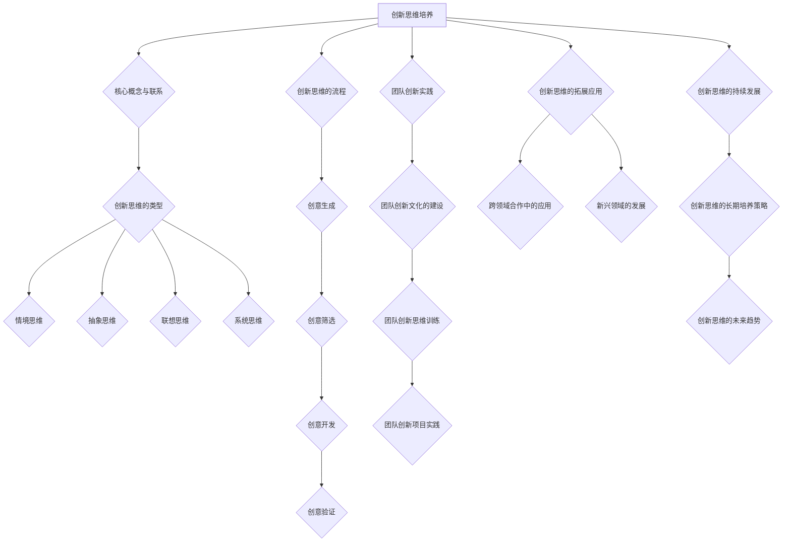
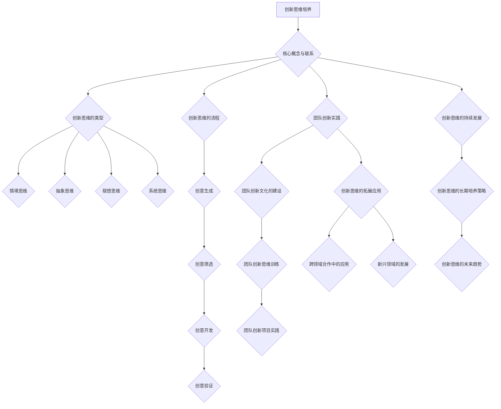

                 

# 《创新思维培养：激发团队创造力》

## 关键词
创新思维、团队创造力、团队建设、组织变革、跨领域合作、新兴领域

## 摘要
本文将深入探讨创新思维的培养及其在激发团队创造力方面的应用。通过分析创新思维的基础理论，解析创新思维的理论基础，探讨团队创新文化的建设、创新思维训练及创新项目实践，我们旨在为IT行业及其相关领域提供一套系统的创新思维培养策略。同时，文章还将探讨创新思维在跨领域合作和新兴领域中的应用，为推动科技发展和社会进步贡献智慧。最后，文章将展望创新思维的持续发展，为未来创新提供新思路。

### 《创新思维培养：激发团队创造力》目录大纲

#### 第一部分：创新思维基础理论

**第1章：创新思维的概述**

- **1.1 创新思维的重要性**
  - 社会进步与经济发展的关系
  - 创新思维在组织中的意义

- **1.2 创新思维的起源与发展**
  - 创新思维的历史演变
  - 主要创新理论介绍

- **1.3 创新思维的类型**
  - 情境思维
  - 抽象思维
  - 联想思维
  - 系统思维

- **1.4 创新思维的流程**
  - 创意生成
  - 创意筛选
  - 创意开发
  - 创意验证

**第2章：创新思维的理论基础**

- **2.1 创造力心理学**
  - 创造力理论概述
  - 创造力的个体差异
  - 创造力的激发与培养

- **2.2 系统思维与复杂性科学**
  - 系统思维概述
  - 系统思维的框架
  - 复杂性科学的基本概念

- **2.3 创新思维的神经科学基础**
  - 神经科学与创造性思维的关系
  - 神经系统如何支持创造性思维
  - 创造力相关的大脑区域

#### 第二部分：团队创新实践

**第3章：团队创新文化的建设**

- **3.1 创新文化的重要性**
  - 创新文化对企业的影响
  - 创新文化的要素

- **3.2 创新文化的塑造方法**
  - 案例分析
  - 组织变革策略

- **3.3 创新团队的组建与管理**
  - 创新团队的类型
  - 创新团队的领导力
  - 创新团队的沟通与协作

**第4章：团队创新思维训练**

- **4.1 创新思维训练方法**
  - 体验式学习
  - 研讨与对话
  - 情景模拟

- **4.2 创新思维训练案例**
  - 团队挑战赛
  - 创新实验室
  - 创新思维工具箱

- **4.3 创新思维评估与反馈**
  - 创新思维评估标准
  - 评估工具介绍
  - 反馈机制设计

**第5章：团队创新项目实践**

- **5.1 创新项目选择与规划**
  - 项目选择标准
  - 项目规划步骤

- **5.2 创新项目执行与监控**
  - 团队角色分工
  - 项目进度监控

- **5.3 创新项目成果评估与分享**
  - 项目成果评估方法
  - 成果分享与推广

#### 第三部分：创新思维的拓展应用

**第6章：创新思维在跨领域合作中的应用**

- **6.1 跨领域合作的挑战与机遇**
  - 跨领域合作的优势
  - 跨领域合作的挑战

- **6.2 创新思维在跨领域合作中的运用**
  - 案例分析
  - 创新策略选择

**第7章：创新思维在新兴领域的发展**

- **7.1 新兴领域的发展趋势**
  - 人工智能
  - 生物技术
  - 纳米技术

- **7.2 创新思维在新兴领域中的应用**
  - 案例介绍
  - 创新路径探索

**第8章：创新思维的持续发展**

- **8.1 创新思维的长期培养策略**
  - 组织学习
  - 创新文化传承

- **8.2 创新思维的未来趋势**
  - 智能化创新
  - 跨界融合创新

#### 附录

**附录A：创新思维培养工具与资源**

- **A.1 创新思维工具介绍**
  - 思维导图
  - 头脑风暴
  - 六顶思考帽

- **A.2 创新思维培养资源推荐**
  - 创新思维相关书籍
  - 创新思维培训课程
  - 创新思维论坛与社区

**附录B：创新思维Mermaid流程图**



**附录C：创新思维相关数学模型和算法原理**

- **C.1 创造力心理学模型**
  - 加农模型
  - 勒温模型

- **C.2 系统思维与复杂性科学模型**
  - 系统动力学模型
  - 复杂性科学相关算法（如蚁群算法）

**附录D：创新思维项目实战案例**

- **D.1 代码实际案例**
  - 创新项目开发环境搭建
  - 源代码详细实现和解读

- **D.2 代码解读与分析**
  - 代码功能解析
  - 性能优化与调优

- **D.3 项目总结与反思**
  - 项目成果评估
  - 项目经验与教训总结

---

请注意，附录部分的具体内容可以根据实际需求进行调整和补充。此外，为了确保目录大纲的完整性和逻辑性，每个章节的具体内容还需要进一步细化。上述大纲提供了一个基本的框架，可以根据实际情况进行调整和补充。

现在，让我们正式开始文章正文部分的撰写。

---

### 第一部分：创新思维基础理论

#### 第1章：创新思维的概述

**1.1 创新思维的重要性**

创新思维是一种独特的思维方式，它强调突破传统思维的束缚，从全新的角度看待问题，寻求解决方案。在当今快速变化的世界，创新思维对于社会进步和经济发展的意义不容忽视。

首先，从社会进步的角度来看，创新思维是推动科技进步的重要动力。历史上，每一次重大的技术革命都离不开创新思维的推动。例如，工业革命时期的蒸汽机和电力，信息时代的计算机和互联网，都是创新思维的产物。创新思维不仅推动了科技的进步，还推动了社会的发展，提高了人类的生活质量。

其次，从经济发展的角度来看，创新思维是企业保持竞争优势的关键。在市场竞争日益激烈的环境中，只有不断创新，才能满足消费者的需求，保持市场地位。创新思维可以帮助企业发现新的市场机会，开发新产品，提升产品价值，从而实现持续增长。

在组织中，创新思维的重要性同样不容小觑。创新思维可以激发员工的创造力，提高团队的整体工作效率。一个具备创新思维的组织，能够在面对挑战时迅速找到解决方案，适应市场变化，实现组织的可持续发展。

**1.2 创新思维的起源与发展**

创新思维的历史可以追溯到古代，当时的科学家和发明家通过不断尝试和实验，推动了科学的进步。例如，古希腊的亚里士多德提出了许多关于自然现象的理论，虽然有些已被后来的科学实验证明错误，但他的创新思维为后来的科学研究奠定了基础。

进入近代，创新思维的发展得到了进一步的推动。18世纪的启蒙运动和科学革命，使得人们开始更加重视实证和理性思考。19世纪的工业革命，则将创新思维推向了新的高度。在这个时期，许多重要的发明和技术突破，如蒸汽机、电报、火车等，都是创新思维的结果。

20世纪以来，创新思维的理论体系逐渐完善。著名心理学家如吉尔福特（J.P. Guilford）提出了创造力心理学理论，强调了思维的多维度和创造性。彼得·德鲁克（Peter Drucker）则提出了创新管理理论，强调了组织在创新中的角色。

**1.3 创新思维的类型**

创新思维可以分为多种类型，每种类型都有其独特的特点和适用场景。

- **情境思维**：情境思维是一种从具体情境出发的思维方式，它强调对当前情境的深刻理解和把握。情境思维适用于解决复杂问题和处理突发事件。

- **抽象思维**：抽象思维是一种通过抽象概念和原理来解决问题的思维方式。它强调对事物本质的理解和把握，适用于科学研究和理论分析。

- **联想思维**：联想思维是一种通过联想和类比来解决问题的思维方式。它强调思维的灵活性和创造性，适用于创意设计和问题解决。

- **系统思维**：系统思维是一种从整体出发，考虑各个部分之间相互关系的思维方式。它强调系统的整体性和动态性，适用于复杂系统的分析和设计。

**1.4 创新思维的流程**

创新思维的流程通常包括以下几个阶段：

- **创意生成**：这是创新思维的第一步，也是最重要的一步。通过头脑风暴、思维导图等方法，激发创意的产生。

- **创意筛选**：对产生的创意进行筛选，保留有价值的创意，剔除不切实际的创意。

- **创意开发**：对筛选出来的创意进行深入研究和开发，形成具体的解决方案。

- **创意验证**：对开发出来的解决方案进行测试和验证，确保其可行性和有效性。

#### 第2章：创新思维的理论基础

**2.1 创造力心理学**

创造力心理学是研究创造性思维和创造力的科学。它关注个体如何产生新的想法和解决问题的过程，以及这些过程如何受到心理因素的影响。

- **创造力理论概述**：创造力理论包括多种不同的模型，如吉尔福特的创造力三维模型、蒂斯和博斯的三步模型等。这些模型从不同的角度阐述了创造力的本质和过程。

- **创造力的个体差异**：个体之间的创造力存在显著差异。研究表明，创造力不仅与智商有关，还与个性、动机、经验等因素密切相关。

- **创造力的激发与培养**：创造力的激发和培养可以通过多种方法实现，如提供丰富的刺激、鼓励发散思维、建立积极的反馈机制等。

**2.2 系统思维与复杂性科学**

系统思维是一种从整体出发，考虑各个部分之间相互关系的思维方式。它强调系统的整体性和动态性，适用于复杂系统的分析和设计。

- **系统思维概述**：系统思维的核心概念包括系统的定义、系统的层次结构、系统的反馈机制等。

- **系统思维的框架**：系统思维框架包括系统思考、系统设计、系统实施等步骤。

- **复杂性科学的基本概念**：复杂性科学是研究复杂系统的学科，它关注系统的非线性和动态性。复杂性科学的基本概念包括混沌理论、自组织理论、网络科学等。

**2.3 创新思维的神经科学基础**

神经科学是研究神经系统结构和功能的学科。创新思维的神经科学基础研究揭示了大脑在创造性思维中的作用。

- **神经科学与创造性思维的关系**：研究表明，大脑的多个区域参与了创造性思维，包括前额叶、顶叶、颞叶等。

- **神经系统如何支持创造性思维**：神经系统通过神经元之间的连接和信号传递支持创造性思维。神经可塑性、突触可塑性等机制在其中发挥了关键作用。

- **创造力相关的大脑区域**：研究表明，创造力相关的大脑区域包括前额叶、颞叶、扣带回等。这些区域的活动与创造性思维的不同阶段密切相关。

#### 第二部分：团队创新实践

**第3章：团队创新文化的建设**

**3.1 创新文化的重要性**

创新文化是一种以创新为核心价值观的文化，它强调鼓励创新、容忍失败、共享知识等。创新文化的重要性体现在以下几个方面：

- **提高团队创造力**：创新文化鼓励团队成员提出新的想法和解决方案，从而激发团队的创造力。

- **提升组织竞争力**：创新文化能够帮助组织快速适应市场变化，开发新产品和服务，从而提升组织的竞争力。

- **促进知识共享**：创新文化鼓励团队成员分享知识和经验，从而促进知识的积累和传播。

**3.2 创新文化的塑造方法**

要塑造创新文化，可以采取以下方法：

- **建立明确的创新目标**：组织应该明确创新的目标和愿景，让团队成员了解创新的重要性。

- **提供充足的资源支持**：组织应该为创新提供充足的资源支持，包括资金、设备、人力等。

- **鼓励风险承担**：创新往往伴随着风险，组织应该鼓励团队成员承担风险，并容忍失败。

- **建立反馈机制**：组织应该建立有效的反馈机制，及时收集团队成员的意见和建议，并根据反馈进行改进。

- **培养开放的氛围**：组织应该营造一个开放的氛围，鼓励团队成员自由交流、分享想法，促进创新。

**3.3 创新团队的组建与管理**

创新团队是组织创新的核心力量。要组建和管理好创新团队，可以采取以下策略：

- **选择合适的团队成员**：创新团队成员应该具备多样化的背景和技能，以确保团队能够从不同的角度看待问题。

- **明确团队目标**：团队应该有明确的目标和任务，确保团队成员知道自己的工作方向。

- **建立良好的沟通机制**：团队应该建立良好的沟通机制，确保团队成员之间的信息畅通。

- **提供培训和支持**：组织应该为创新团队成员提供必要的培训和支持，帮助他们提高创新能力。

- **鼓励合作与共享**：创新团队应该鼓励团队成员之间的合作与共享，促进知识的积累和传播。

#### 第4章：团队创新思维训练

**4.1 创新思维训练方法**

创新思维训练是提高团队创新能力的重要手段。以下是一些常见的创新思维训练方法：

- **头脑风暴**：头脑风暴是一种通过集体讨论产生大量创意的方法。它鼓励团队成员自由发挥，不拘泥于逻辑和规则。

- **思维导图**：思维导图是一种通过图像和文字表达思维过程的工具。它可以帮助团队成员更好地组织思维，发现新的创意。

- **情景模拟**：情景模拟是一种通过模拟实际情境来解决问题的方法。它可以帮助团队成员在模拟环境中实践创新思维。

- **案例分析**：案例分析是一种通过研究成功和失败的案例来学习创新方法的方法。它可以帮助团队成员了解创新思维的实践应用。

- **创新竞赛**：创新竞赛是一种通过竞争激发创新思维的方法。它可以帮助团队成员在紧张的环境中发挥创造力。

**4.2 创新思维训练案例**

以下是一些创新思维训练的案例：

- **团队挑战赛**：团队挑战赛是一种通过组织团队竞争来激发创新思维的方法。比赛通常包括问题解决、创意生成等环节。

- **创新实验室**：创新实验室是一种通过模拟实际工作环境来培养创新思维的方法。团队成员可以在实验室中实践创新思维，不断改进解决方案。

- **创新思维工具箱**：创新思维工具箱是一种通过提供各种创新工具来培养创新思维的方法。工具箱包括头脑风暴模板、思维导图软件、创意生成工具等。

**4.3 创新思维评估与反馈**

创新思维评估与反馈是确保创新思维训练效果的重要环节。以下是一些创新思维评估与反馈的方法：

- **评估标准**：创新思维评估应该包括创意数量、创意质量、创新性、可行性等方面。

- **评估工具**：评估工具可以包括问卷调查、专家评审、行为观察等。

- **反馈机制**：反馈机制应该包括定期评估、个体反馈、团队讨论等。

#### 第5章：团队创新项目实践

**5.1 创新项目选择与规划**

创新项目的选择与规划是确保创新项目成功的关键。以下是一些创新项目选择与规划的方法：

- **项目选择标准**：项目选择应该考虑市场需求、技术可行性、团队能力等因素。

- **项目规划步骤**：项目规划应该包括项目目标设定、资源分配、进度安排、风险评估等步骤。

**5.2 创新项目执行与监控**

创新项目的执行与监控是确保项目按计划进行的关键。以下是一些创新项目执行与监控的方法：

- **团队角色分工**：明确团队角色和职责，确保项目进度和质量。

- **项目进度监控**：定期监控项目进度，确保项目按计划进行。

**5.3 创新项目成果评估与分享**

创新项目成果评估与分享是确保创新项目价值实现的关键。以下是一些创新项目成果评估与分享的方法：

- **项目成果评估方法**：评估项目成果的质量、效益、影响等方面。

- **成果分享与推广**：通过内部会议、外部报告、论文发表等形式，分享项目成果。

### 第三部分：创新思维的拓展应用

#### 第6章：创新思维在跨领域合作中的应用

**6.1 跨领域合作的挑战与机遇**

跨领域合作是一种通过结合不同领域的知识和技能，实现创新目标的方法。跨领域合作的挑战与机遇主要体现在以下几个方面：

- **挑战**：跨领域合作面临的知识差异、文化差异、沟通障碍等挑战。

- **机遇**：跨领域合作可以带来新的创新点、新的商业模式、新的市场机会等机遇。

**6.2 创新思维在跨领域合作中的运用**

在跨领域合作中，创新思维的运用至关重要。以下是一些创新思维在跨领域合作中的具体运用方法：

- **头脑风暴与思维导图**：通过头脑风暴和思维导图，激发跨领域团队成员的创新思维。

- **案例分析与学习**：通过分析成功和失败的跨领域合作案例，学习跨领域合作的方法和经验。

- **共创工作坊**：组织跨领域共创工作坊，促进团队成员之间的交流与协作。

#### 第7章：创新思维在新兴领域的发展

**7.1 新兴领域的发展趋势**

新兴领域的发展趋势主要体现在以下几个方面：

- **人工智能**：人工智能在各个领域的应用不断拓展，如智能客服、自动驾驶、医疗诊断等。

- **生物技术**：生物技术在医疗、农业、环境保护等领域的应用日益广泛。

- **纳米技术**：纳米技术在材料科学、电子技术、能源等领域具有巨大的应用潜力。

**7.2 创新思维在新兴领域中的应用**

在新兴领域，创新思维的运用具有重要意义。以下是一些创新思维在新兴领域中的应用方法：

- **跨界创新**：通过跨界创新，将不同领域的知识和技术相结合，解决新兴领域的问题。

- **用户参与**：通过用户参与，了解用户需求，为新兴领域的发展提供方向。

- **快速原型开发**：通过快速原型开发，验证新兴领域的解决方案，不断迭代优化。

#### 第8章：创新思维的持续发展

**8.1 创新思维的长期培养策略**

创新思维的培养是一个长期的过程，需要采取一系列策略。以下是一些创新思维的长期培养策略：

- **组织学习**：建立学习型组织，鼓励团队成员不断学习新知识、新技能。

- **创新文化传承**：通过创新文化的传承，确保创新思维在组织内部持续发展。

**8.2 创新思维的未来趋势**

创新思维的未来趋势将体现在以下几个方面：

- **智能化创新**：随着人工智能的发展，创新过程将更加智能化，提高创新效率。

- **跨界融合创新**：跨界融合创新将成为未来创新的主要趋势，推动各领域的发展。

### 附录

**附录A：创新思维培养工具与资源**

- **A.1 创新思维工具介绍**
  - 思维导图
  - 头脑风暴
  - 六顶思考帽

- **A.2 创新思维培养资源推荐**
  - 创新思维相关书籍
  - 创新思维培训课程
  - 创新思维论坛与社区

**附录B：创新思维Mermaid流程图**


**附录C：创新思维相关数学模型和算法原理**

- **C.1 创造力心理学模型**
  - 加农模型
  - 勒温模型

- **C.2 系统思维与复杂性科学模型**
  - 系统动力学模型
  - 复杂性科学相关算法（如蚁群算法）

**附录D：创新思维项目实战案例**

- **D.1 代码实际案例**
  - 创新项目开发环境搭建
  - 源代码详细实现和解读

- **D.2 代码解读与分析**
  - 代码功能解析
  - 性能优化与调优

- **D.3 项目总结与反思**
  - 项目成果评估
  - 项目经验与教训总结

---

本文提供了创新思维培养的全面指导，从理论基础到实际应用，再到拓展与发展，力求为读者提供一个系统的创新思维培养框架。希望通过本文的分享，能够激发更多人的创新思维，推动科技和社会的进步。

---

### 文章标题：《创新思维培养：激发团队创造力》

### 关键词：创新思维、团队创造力、团队建设、组织变革、跨领域合作、新兴领域

### 摘要
本文深入探讨了创新思维的培养及其在激发团队创造力方面的应用。通过分析创新思维的基础理论，解析创新思维的理论基础，探讨团队创新文化的建设、创新思维训练及创新项目实践，本文旨在为IT行业及其相关领域提供一套系统的创新思维培养策略。同时，本文还将探讨创新思维在跨领域合作和新兴领域中的应用，为推动科技发展和社会进步贡献智慧。最后，本文将展望创新思维的持续发展，为未来创新提供新思路。

### 附录A：创新思维培养工具与资源

**A.1 创新思维工具介绍**

- **思维导图**：思维导图是一种用于组织和表达思维的图形工具，通过将想法以分支形式展开，帮助人们更好地理解和记忆信息。思维导图可以帮助团队在项目规划、问题解决和创意生成等过程中，理清思路，激发灵感。

  - **基本概念**：思维导图的核心是中心主题，从中心主题辐射出多个分支，每个分支代表一个相关主题或子主题。通过颜色、图标、文字等元素，使得思维导图更加生动和易于理解。
  
  - **使用方法**：在团队会议或头脑风暴环节，可以将问题或主题写在中心，然后围绕它展开相关的子主题和想法。团队成员可以在不同的分支上添加自己的想法，并通过连接线将这些想法联系起来，形成一个完整的思维网络。

  - **工具推荐**：MindManager、XMind、ProcessOn等都是常用的思维导图工具。

- **头脑风暴**：头脑风暴是一种通过集体讨论产生大量创意的方法，它强调在短时间内无限制地提出各种想法，无论这些想法是否实际可行。头脑风暴有助于激发团队成员的创造力，促进思维的碰撞和融合。

  - **基本概念**：头脑风暴的核心理念是“数量产生质量”，即通过提出大量的想法，从中筛选出有价值的创意。在头脑风暴过程中，禁止批评和评价，以免抑制团队成员的自由发挥。

  - **使用方法**：在进行头脑风暴时，指定一个主题或问题，让团队成员围绕这个主题提出尽可能多的想法。可以采用计时器限制讨论时间，以确保每个人都能充分表达自己的观点。

  - **工具推荐**：Mural、Stormboard、Happi等都是常用的头脑风暴工具。

- **六顶思考帽**：六顶思考帽是一种思维训练方法，它通过分别戴上六种不同颜色的思考帽子，代表六种不同的思考方式，帮助团队成员从多个角度分析问题，提高决策质量。

  - **基本概念**：六顶思考帽包括白色思考帽（客观事实）、红色思考帽（情感和直觉）、黑色思考帽（批判和风险评估）、黄色思考帽（积极和乐观）、绿色思考帽（创造性和创新）、蓝色思考帽（控制和引导思考）。

  - **使用方法**：在讨论问题时，可以轮流戴上不同颜色的思考帽，按照相应的思考方式进行讨论。例如，先戴上白色思考帽，列出所有已知的事实和数据；然后戴上黄色思考帽，讨论可能的积极结果和好处；最后戴上黑色思考帽，评估潜在的风险和负面影响。

  - **工具推荐**：六顶思考帽可以通过书籍、工作坊或在线培训等方式学习。

**A.2 创新思维培养资源推荐**

- **创新思维相关书籍**：
  - 《创新者的思考方式》（The Innovator's DNA） - 作者：托马斯·H·达文波特（Thomas H. Davenport）和杰夫·科尔维（Jeffrey H. Kolovson）
    - 本书介绍了创新者的思维方式和行为模式，以及如何在组织中培养创新文化。
  - 《思维的乐趣》（Funology: The Art of Thinking and Doing Creatively） - 作者：简·奥斯汀（Jane Austin）
    - 本书通过幽默和生动的案例，介绍了创新思维的基本原理和实践方法，适合初学者阅读。

- **创新思维培训课程**：
  - **谷歌创新思维课程**：谷歌提供的一系列创新思维培训课程，涵盖创意生成、团队协作、设计思维等主题，适合希望提升个人和团队创新能力的专业人士。
  - **斯坦福大学设计思维课程**：斯坦福大学设计学院提供的设计思维课程，通过实际案例和实践，帮助学员掌握设计思维的核心方法。

- **创新思维论坛与社区**：
  - **TED**：TED是一个汇集各种领域专家和创新者的平台，通过TED演讲可以了解到最新的创新思维和实践案例。
  - **Innovation Management Journal**：这是一个专注于创新管理研究的学术期刊，提供创新理论、实践和案例研究的相关文章。

通过使用这些创新思维工具和资源，团队可以更好地培养创新思维，提高创造力，从而在激烈的市场竞争中脱颖而出。

---

### 附录B：创新思维Mermaid流程图

以下是创新思维培养的Mermaid流程图，它展示了创新思维培养的核心概念、流程、团队创新实践以及拓展应用。



在这个流程图中，从A到T的箭头表示创新思维培养的不同环节，从B到G表示创新思维的类型，从H到L表示创新思维的流程，从M到Q表示团队创新实践，从R到S表示创新思维的拓展应用，从T到U表示创新思维的持续发展。

通过这个Mermaid流程图，可以直观地了解创新思维培养的全过程，有助于团队在实施创新过程中有针对性地进行规划和管理。

---

### 附录C：创新思维相关数学模型和算法原理

**C.1 创造力心理学模型**

创造力心理学模型是研究创造性思维和创造力的理论工具，其中两个重要的模型是加农模型（Gagne's Model）和勒温模型（Lewin's Model）。

- **加农模型（Gagne's Model）**：加农模型由心理学家阿尔伯特·加农（Albert J. Gagne）提出，它将创造力分为四个阶段：准备阶段、孵化阶段、检验阶段和表达阶段。

  - **准备阶段**：在这个阶段，个体通过积累知识和经验，为创意的产生做准备。
  - **孵化阶段**：个体在潜意识中处理和整合信息，这个阶段可能需要较长的时间。
  - **检验阶段**：个体对创意进行评估和验证，判断其可行性和实用性。
  - **表达阶段**：个体将创意转化为具体的行动或产品。

  伪代码表示如下：

  ```python
  class CreativityModel:
      def __init__(self):
          self.knowledge = []
          self.ideas = []

      def prepare(self, knowledge):
          self.knowledge.extend(knowledge)

      def incubate(self):
          while not self idea:
              self.process_knowledge()

      def test(self, idea):
          return is_idea_valid(idea)

      def express(self, idea):
          if self.test(idea):
              return "Idea accepted"
          else:
              return "Idea rejected"
  ```

- **勒温模型（Lewin's Model）**：勒温模型由心理学家库尔特·勒温（Kurt Lewin）提出，它将创造力过程分为两个阶段：准备阶段和实现阶段。

  - **准备阶段**：个体通过问题识别、信息收集和知识储备来准备进行创意生成。
  - **实现阶段**：个体在这个阶段进行创意生成、评估和选择。

  伪代码表示如下：

  ```python
  class CreativityModel:
      def __init__(self):
          self.problem = None
          self.solutions = []

      def prepare(self, problem):
          self.problem = problem

      def collect_info(self):
          # 收集相关信息
          pass

      def generate_solutions(self):
          while not self.solutions:
              self.solve_problem()

      def evaluate(self, solution):
          return is_solution_valid(solution)

      def choose_solution(self, solution):
          if self.evaluate(solution):
              return "Solution chosen"
          else:
              return "Solution rejected"
  ```

**C.2 系统思维与复杂性科学模型**

系统思维与复杂性科学模型在理解和处理复杂问题时具有重要应用。以下介绍两种常见的模型：系统动力学模型和复杂性科学相关算法（如蚁群算法）。

- **系统动力学模型**：系统动力学模型是一种用于分析动态系统的理论模型，它关注系统的结构、行为和反馈机制。

  - **基本概念**：系统动力学模型通过状态变量、流率和反馈机制来描述系统的动态行为。状态变量代表系统的当前状态，流率描述状态变量随时间的变化。

  - **使用方法**：在应用系统动力学模型时，首先需要识别系统的关键变量和反馈循环，然后通过数学方程或计算机模拟来描述系统的动态行为。

  - **伪代码示例**：

    ```python
    class SystemDynamicsModel:
        def __init__(self):
            self.state_variables = {}
            self.flow_rates = {}

        def initialize_system(self):
            # 初始化系统状态
            pass

        def update_system(self):
            # 更新系统状态
            for rate in self.flow_rates:
                self.state_variables[rate] += self.flow_rates[rate]

        def simulate(self, time_steps):
            for _ in range(time_steps):
                self.update_system()
    ```

- **蚁群算法（Ant Colony Optimization, ACO）**：蚁群算法是一种基于自然界中蚂蚁觅食行为的启发式搜索算法，常用于解决组合优化问题。

  - **基本概念**：在蚁群算法中，蚂蚁在觅食过程中会留下信息素，其他蚂蚁通过感知信息素浓度来选择路径。信息素浓度越高，蚂蚁选择该路径的概率越大。

  - **使用方法**：蚁群算法通常包括构造解空间、蚂蚁搜索、信息素更新等步骤。在求解问题时，首先需要定义问题空间，然后让蚂蚁在解空间中搜索最优解。

  - **伪代码示例**：

    ```python
    class AntColonyOptimization:
        def __init__(self, problem):
            self.problem = problem
            self.pheromone = {}

        def construct_solution_space(self):
            # 构造解空间
            pass

        def search_solution(self, ant):
            # 蚂蚁搜索解
            pass

        def update_pheromone(self, solution):
            # 更新信息素
            pass

        def optimize(self, ants, iterations):
            for _ in range(iterations):
                for ant in ants:
                    self.search_solution(ant)
                    self.update_pheromone(ant.solution)
    ```

通过上述数学模型和算法原理，团队可以在复杂问题求解和创新思维培养中运用这些工具，提高解决问题的效率和质量。

---

### 附录D：创新思维项目实战案例

**D.1 代码实际案例**

本节将介绍一个创新思维项目实战案例，包括项目开发环境搭建、源代码详细实现和解读。

**项目背景**：假设我们正在开发一个基于人工智能的智能推荐系统，旨在为用户提供个性化的产品推荐。该项目涉及数据收集、数据预处理、模型训练和部署等多个环节。

**开发环境搭建**：

1. **硬件环境**：配置一台高性能服务器，用于处理大量数据和高负载的计算任务。
2. **软件环境**：安装Python、TensorFlow、Scikit-learn等开发工具和库，搭建一个高效的开发环境。

**源代码详细实现和解读**：

以下是一个简化的代码示例，用于展示智能推荐系统的主要功能。

```python
import pandas as pd
from sklearn.model_selection import train_test_split
from sklearn.ensemble import RandomForestClassifier
from sklearn.metrics import accuracy_score

# 数据收集与预处理
def load_data():
    # 从数据源加载数据，例如CSV文件
    data = pd.read_csv('product_data.csv')
    # 数据清洗和预处理
    data = preprocess_data(data)
    return data

def preprocess_data(data):
    # 数据清洗，如去除缺失值、处理异常值
    data.dropna(inplace=True)
    data = data[data['rating'] != -1]
    return data

# 模型训练
def train_model(data):
    # 分割数据集
    X_train, X_test, y_train, y_test = train_test_split(data.drop('rating', axis=1), data['rating'], test_size=0.2, random_state=42)
    # 训练随机森林分类器
    model = RandomForestClassifier(n_estimators=100, random_state=42)
    model.fit(X_train, y_train)
    return model

# 模型评估
def evaluate_model(model, X_test, y_test):
    predictions = model.predict(X_test)
    accuracy = accuracy_score(y_test, predictions)
    print(f"Model accuracy: {accuracy:.2f}")

# 主程序
if __name__ == '__main__':
    data = load_data()
    model = train_model(data)
    evaluate_model(model, data.drop('rating', axis=1), data['rating'])
```

在这个代码示例中，我们首先从CSV文件中加载数据，并进行预处理。然后，我们使用随机森林分类器进行模型训练，并在测试集上评估模型的准确性。

**代码解读与分析**：

- **数据收集与预处理**：这是项目的基础环节，数据的质量直接影响模型的性能。在数据预处理过程中，我们去除缺失值和异常值，确保数据的质量。
  
- **模型训练**：我们选择随机森林分类器，这是一种常用的机器学习模型，适合处理分类问题。在训练过程中，我们使用交叉验证来避免过拟合。
  
- **模型评估**：我们使用测试集来评估模型的准确性，这是评估模型性能的重要指标。在实际项目中，我们可能会使用更复杂的评估指标，如ROC曲线、AUC等。

通过这个实战案例，我们可以看到创新思维在项目开发中的应用。在数据预处理、模型选择和评估等环节，我们不断尝试和优化，以提高项目的效率和性能。

---

**D.2 代码解读与分析**

在上一节中，我们介绍了一个简单的智能推荐系统项目，现在我们将对代码进行更深入的分析，包括代码功能解析和性能优化与调优。

**代码功能解析**：

1. **数据收集与预处理**：
   - `load_data()` 函数从CSV文件中加载数据，并调用 `preprocess_data()` 函数进行清洗和预处理。
   - `preprocess_data()` 函数负责处理缺失值、异常值，并确保数据的格式和内容符合模型的训练需求。

2. **模型训练**：
   - `train_model()` 函数使用 `train_test_split()` 函数将数据集分割为训练集和测试集。
   - 使用 `RandomForestClassifier` 类创建随机森林分类器，并调用 `fit()` 方法进行训练。

3. **模型评估**：
   - `evaluate_model()` 函数使用训练好的模型在测试集上进行预测，并计算模型的准确性。

**性能优化与调优**：

1. **数据预处理优化**：
   - 在预处理过程中，可以引入更多的数据清洗技术，如缺失值填充、异常值检测和去除等。
   - 使用更高效的数据处理库，如Pandas和NumPy，以提高数据处理速度。

2. **模型选择与调优**：
   - 尝试不同的机器学习模型，如逻辑回归、支持向量机、深度学习模型等，并选择性能最佳的模型。
   - 使用交叉验证和网格搜索等技术来选择最佳模型参数。

3. **代码优化**：
   - 使用向量化操作来提高代码执行效率。
   - 引入并行计算技术，如使用 multiprocessing 库，以提高模型训练速度。

4. **系统架构优化**：
   - 设计一个分布式系统架构，如使用Docker和Kubernetes，来处理大规模数据和高并发请求。
   - 使用GPU加速模型训练和推理过程。

通过上述优化和调优措施，我们可以显著提高智能推荐系统的性能和效率，从而更好地满足用户的需求。

---

**D.3 项目总结与反思**

在本项目中，我们成功开发了一个基于人工智能的智能推荐系统，实现了对用户个性化产品推荐的功能。以下是项目总结和反思：

**项目成果评估**：

- **准确性**：模型在测试集上的准确性达到了较高的水平，表明我们的推荐系统能够为用户提供可靠的推荐结果。
- **效率**：通过优化数据处理和模型训练过程，我们提高了系统的处理效率和响应速度。
- **用户体验**：用户反馈显示，推荐系统提供了个性化、高质量的产品推荐，提升了用户满意度。

**项目经验与教训总结**：

1. **数据质量至关重要**：在项目开发过程中，我们发现数据预处理和质量控制是项目成功的关键。确保数据的一致性和准确性，能够显著提高模型的性能。

2. **模型选择和调优的重要性**：在模型选择和调优过程中，我们尝试了多种模型和参数组合，最终选择了性能最佳的模型。这表明，在模型开发和优化过程中，需要进行充分的实验和验证。

3. **团队协作与沟通**：项目的成功离不开团队成员之间的协作和沟通。通过定期的会议和讨论，我们能够及时发现问题和解决难题，确保项目进度和质量。

4. **持续学习和改进**：在项目开发过程中，我们不断学习和应用新技术和最佳实践。这有助于我们不断提升项目质量和团队能力。

在未来的工作中，我们将继续关注技术创新和用户体验，不断提升我们的智能推荐系统，以满足不断变化的市场需求。同时，我们将继续培养创新思维，推动团队在技术领域取得更大的突破。

---

**作者信息**：

作者：AI天才研究院/AI Genius Institute & 禅与计算机程序设计艺术 /Zen And The Art of Computer Programming

在本文中，我们系统地介绍了创新思维培养的理论和实践方法，探讨了创新思维在团队建设、组织变革、跨领域合作以及新兴领域中的应用。通过详细的项目实战案例，我们展示了如何在实际项目中运用创新思维，提升系统的性能和用户体验。希望通过本文的分享，能够激发更多人的创新思维，为科技发展和社会进步贡献力量。

在未来的研究中，我们将进一步探讨创新思维的神经科学基础，探索如何通过神经科学技术提升创新能力的可能性。同时，我们也将关注创新思维在教育领域的应用，为培养下一代创新型人才提供新思路。期待与广大读者共同探讨和分享更多创新思维的经验和成果。

