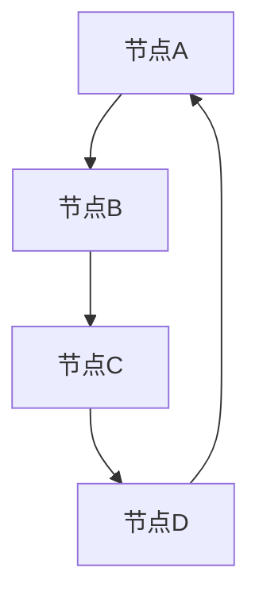

                 

### 引言：创造力的本质与重要性

创造力，一个看似抽象但又无处不在的概念，贯穿于人类文明的每一个角落。无论是科学研究、技术创新、艺术创作，还是日常生活中的小发明，都离不开创造力的推动。那么，创造力究竟是什么？它又是如何影响我们的社会、经济和科技发展的？

#### 创造力的定义与历史发展

创造力，广义上是指个体或群体在特定情境下产生新颖且有价值的思维成果的能力。它不仅包括艺术、文学、科学等领域的创新成果，还涵盖了日常生活、工作和学习中的小革新。历史上，创造力的研究可以追溯到古希腊时期，当时哲学家们开始探讨人类思维和创造的本质。随着科技的发展和心理学研究的深入，20世纪初，创造力研究逐渐成为心理学领域的重要分支，其中最具代表性的理论包括吉尔福德（J.P. Guilford）的创造性思维模型和托尔曼（Edward L. Thorndike）的联想思维理论。

#### 创造力在社会、经济、科技中的影响

在社会层面，创造力是推动文化进步和社会发展的重要动力。从古文明的繁荣到现代科技的创新，无不依赖于人类的创造力。在社会结构不断变革的今天，创造力更是成为国家竞争力的重要指标。经济领域，创造力是推动经济增长的核心要素。创新的产品和服务不仅提高了企业的盈利能力，还推动了整个经济的持续发展。科技领域，创造力是科技进步的源泉。从蒸汽机到计算机，从手机到人工智能，每一次技术革命都离不开创造力的推动。

#### 创造力的现代研究与挑战

现代心理学研究表明，创造力并非少数天才的专属能力，而是可以通过训练和实践得到提升的。研究者们发现，多种因素，如环境、教育、个人特质等，都对创造力产生重要影响。然而，如何更有效地激发和培养创造力，仍然是一个具有挑战性的课题。特别是在快速变化的现代社会，人们面临着前所未有的信息过载和工作压力，如何在繁杂的信息中找到创新的思路，成为了创造力的一个重要研究课题。

#### 结论

创造力是推动人类社会进步的重要力量，它贯穿于各个领域，影响着我们的经济、科技和社会发展。在现代社会，如何更好地理解和培养创造力，已成为一个重要的研究课题。本文旨在探讨创造力与网络科学的关系，通过分析网络科学的数学结构，揭示创造力背后的思维联想机制。接下来，我们将深入探讨网络科学的崛起，以及思维联想在创造力中的作用。

### 网络科学的崛起

网络科学，作为一门跨学科的研究领域，近年来在自然科学、社会科学和工程学等多个领域中取得了显著的进展。它旨在通过数学模型和计算方法来研究复杂系统的网络结构和动态行为，揭示网络中节点和边之间的关系及其在现实世界中的具体应用。网络科学的兴起，不仅为我们提供了一种全新的研究视角，还为解决复杂问题提供了有力的工具。

#### 网络科学的定义与应用领域

网络科学可以定义为研究网络结构、网络行为和网络演化规律的科学。网络科学的核心概念包括网络结构、网络动力学和网络拓扑等。具体来说，网络科学的研究内容涵盖以下几个方面：

1. **网络结构分析**：研究网络的拓扑结构、节点度分布、聚类系数、路径长度等特性，以及这些特性对网络功能的影响。

2. **网络动力学**：研究网络中的动态过程，如信息传播、病毒传播、网络同步等，以及这些过程对网络稳定性和性能的影响。

3. **网络演化**：研究网络的生长、演化机制和稳定性，包括网络的形成过程、节点和边的动态变化等。

网络科学的应用领域非常广泛，包括：

- **社会网络分析**：研究社会关系和网络结构，应用于社交网络、市场营销、社区治理等领域。

- **生物网络**：研究生物分子网络和神经网络的结构与功能，应用于基因组学、生物信息学和神经科学等领域。

- **经济网络**：研究金融网络、供应链网络等经济系统的结构、行为和演化，应用于金融工程、风险管理等领域。

- **交通网络**：研究交通网络的结构、流量分布和优化，应用于城市规划、交通运输等领域。

- **信息技术**：研究互联网、通信网络和云计算等信息技术系统的架构和性能，应用于网络安全、大数据分析等领域。

#### 网络科学的基本概念和理论框架

网络科学的基本概念和理论框架主要包括以下几个方面：

1. **图论**：图论是网络科学的基础，它通过图的结构来表示网络。图由节点（代表实体）和边（代表关系）组成，网络科学中的许多概念和算法都基于图论。

2. **网络拓扑**：网络拓扑研究网络的连通性和节点之间的距离，包括最小生成树、最短路径、最大流等问题。

3. **网络动力学**：网络动力学研究网络中节点的状态变化和传播过程，包括信息传播、病毒传播、社会影响力等。

4. **网络演化**：网络演化研究网络的生长、分裂、合并等动态过程，以及这些过程对网络结构和功能的影响。

5. **复杂网络**：复杂网络是指具有高度复杂性的网络，如无标度网络、小世界网络等，它们在现实世界中具有广泛的应用。

#### 网络科学的发展历程

网络科学的发展历程可以追溯到20世纪中期，当时图论和网络理论开始应用于数学、物理和计算机科学等领域。20世纪90年代，随着互联网和电子商务的兴起，网络科学开始迅速发展，成为一个独立的跨学科研究领域。近年来，随着大数据、人工智能和量子计算等新技术的出现，网络科学在各个领域得到了更加广泛的应用，推动了整个科学界对复杂系统研究的深入。

#### 结论

网络科学的崛起为理解复杂系统的结构和动态行为提供了新的视角和工具。通过数学模型和计算方法，网络科学能够揭示网络中节点和边之间的复杂关系，为各个领域的研究提供了重要的理论支持。在接下来的章节中，我们将进一步探讨思维联想在创造力中的作用，以及网络科学的数学结构如何帮助理解这一过程。

### 思维联想与创造力

思维联想，作为一种基本的认知过程，贯穿于我们的日常思维活动。简单来说，思维联想是指通过某种刺激，大脑在短时间内产生的一系列相关联的想法。在创造力过程中，思维联想起着至关重要的作用。它不仅能够激发新的创意，还能够将看似无关的概念和想法联系起来，从而产生创新性的思维成果。

#### 思维联想的概念与类型

思维联想可以分为两种基本类型：直接联想和间接联想。

1. **直接联想**：直接联想是指通过某种直接的逻辑关系或相似性将两个或多个概念联系起来。例如，从“苹果”联想到“水果”，从“飞机”联想到“飞行器”。

2. **间接联想**：间接联想则通过一系列中间环节将两个或多个概念联系起来。例如，从“苹果”联想到“苹果树”，再联想到“园艺”，最后联想到“环境保护”。

#### 思维联想在创造力中的角色

1. **激发新创意**：思维联想能够帮助我们打破常规的思维模式，从一个新的角度看待问题，从而产生新的创意。例如，在产品设计过程中，通过联想，设计师可能会从其他领域或产品中获得灵感，从而创造出全新的设计。

2. **整合信息**：思维联想有助于我们将分散的信息和知识整合起来，形成更完整的认知框架。这种整合能够帮助我们更好地理解和解决问题，从而提高创造力。

3. **跨领域创新**：思维联想能够跨越不同领域，将看似无关的概念联系起来，从而激发跨领域的创新。例如，音乐家可能会从自然界的声音中获得灵感，创作出新的音乐作品。

#### 思维联想在创造过程中的具体应用

1. **头脑风暴**：在头脑风暴过程中，思维联想是激发新创意的重要工具。通过无限制地联想，团队成员可以在短时间内产生大量的想法，从而找到解决问题的方法。

2. **思维导图**：思维导图是一种图形化的思维工具，通过节点和连线将相关的想法和概念联系起来，帮助我们在思维过程中保持清晰的逻辑结构。

3. **类比思维**：类比思维是一种通过将未知问题与已知问题进行类比来寻找解决方案的方法。通过联想，我们可以从已知领域中获得启示，从而解决新的问题。

#### 思维联想与网络科学的关系

网络科学为研究思维联想提供了新的视角。通过图论和网络动力学，我们可以将思维过程视为一个复杂的网络结构。在这个网络中，节点代表不同的想法或概念，边代表它们之间的关联。网络科学的方法可以帮助我们分析和理解这个网络的特性，从而更好地理解和提高创造力。

例如，我们可以使用小世界网络模型来研究思维过程中的信息传播和影响力。小世界网络具有短路径长度和高聚类系数的特点，这意味着信息可以在网络中快速传播，并且在局部区域形成紧密的连接。通过分析小世界网络，我们可以找到那些具有高影响力的节点，这些节点可能在创造过程中起到关键作用。

#### 结论

思维联想是创造力过程中不可或缺的一部分，它能够帮助我们激发新创意、整合信息并实现跨领域创新。通过网络科学的方法，我们可以更深入地理解思维联想的结构和机制，从而更好地利用这一过程来提高创造力。在接下来的章节中，我们将进一步探讨网络科学的数学结构，以及这些结构如何帮助我们分析和理解创造力。

### 图论基础

图论作为网络科学的核心工具，为我们提供了描述和分析网络结构的数学框架。在本节中，我们将介绍图论的基本概念，包括图、节点、边、路径和子图等，并探讨图的基本算法和性质。

#### 图的基本概念

图（Graph）由节点（Node）和边（Edge）组成，是一种用来表示对象及其相互关系的抽象数据结构。在图论中，节点通常表示实体，如人、地点或物品，而边表示节点之间的联系，如友谊、交通路线或网络连接。

- **节点**：图中的节点是图的组成元素，每个节点可以表示一个实体或概念。节点可以通过一个唯一的标识符来标识。

- **边**：边是连接两个节点的元素，表示节点之间的关系。边可以是单向的（有向边）或双向的（无向边）。

- **图**：图是由节点和边组成的整体结构。根据边是否有方向，图可以分为无向图（Undirected Graph）和有向图（Directed Graph）。

#### 图的类型

- **简单图**：不包含自环（节点连自己）和多重边（多个边连接同一对节点）的图。

- **加权图**：每个边都有一个权重，表示节点之间关系的强度或距离。

- **连通图**：任何两个节点之间都存在路径的图。

- **树**：无环且连通的简单图，是最简单的树形结构。

#### 图的基本算法和性质

1. **度**：节点的度（Degree）是连接到该节点的边的数量。在无向图中，每个节点的度是连接它的边的数量；在有向图中，节点的度分为入度（In-Degree）和出度（Out-Degree）。

2. **路径**：图中的路径是节点序列，每个节点与其相邻节点之间都有一条边相连。最短路径问题是寻找两个节点之间最短的路径。

3. **连通性**：图的连通性描述了节点之间的连接情况。连通图中的任意两个节点之间都存在路径。

4. **聚类系数**：聚类系数描述了节点之间边的密集程度，即一个节点直接连接的其他节点中，与这些节点相连的其他节点所占的比例。

5. **图同构**：图同构是指两个图在节点和边之间保持相同的连接关系。图同构检测是一个重要的图论问题。

#### 图论流程图

为了更好地理解图论的基本概念和算法，我们可以使用Mermaid语法绘制以下流程图：



在这个流程图中，节点用圆角矩形表示，边用直线表示。通过这样的图形化表示，我们可以直观地看到节点和边之间的关系。

#### 结论

图论为网络科学提供了强大的工具，帮助我们描述和分析复杂系统的结构。通过理解和应用图论的基本概念和算法，我们可以更好地理解网络中的节点和边的关系，为研究创造力提供数学基础。在接下来的章节中，我们将探讨随机网络模型的特性及其应用。

### 随机网络模型

随机网络模型是网络科学中研究网络结构和动态行为的重要工具。这些模型通过随机生成方法构建网络，旨在模拟现实世界中的各种复杂网络现象。在本节中，我们将介绍随机网络模型的基本概念、特性及其应用。

#### 随机网络模型的定义与特性

随机网络模型是通过概率方法生成网络的模型。这些模型通常假设网络中的节点和边是随机选择的，从而产生具有特定统计特性的网络。常见的随机网络模型包括：

1. **Erdős-Rényi模型**（G(n, p)）：这是最简单的随机网络模型，由n个节点和概率p决定每对节点之间是否存在边。如果p > 1/n，网络是连通的。

2. **Barabási-Albert模型**（BA模型）：这是一个无标度网络模型，最初由Albert和Barabási提出。模型假设网络中的节点以概率 \( k \) 连接到新加入的节点，其中 \( k \) 是节点的度。这样，网络中的节点度分布服从幂律分布，具有大量度较小的节点和少量度较大的节点。

3. **Watts-Strogatz小世界模型**：这个模型通过在Erdős-Rényi网络中引入少量短路径来模拟小世界现象。模型参数包括网络大小n、边的平均连接数k和重新连接的概率r。通过调整r，可以观察到从规则网络到小世界网络的转变。

#### 随机网络模型的应用与发展

随机网络模型在多个领域都有广泛应用，包括社会网络分析、生物网络、经济网络和信息技术等。以下是一些具体应用：

1. **社会网络分析**：随机网络模型用于模拟和分析社交网络的结构，如朋友关系、在线社区等。通过这些模型，研究者可以了解社交网络的传播动力学、社区结构等特性。

2. **生物网络**：在生物信息学中，随机网络模型用于研究基因调控网络、蛋白质相互作用网络等。这些模型有助于理解生物系统的复杂性和动态行为。

3. **经济网络**：随机网络模型用于分析金融网络、供应链网络等经济系统。通过这些模型，研究者可以预测经济危机、市场波动等行为。

4. **信息技术**：在计算机科学中，随机网络模型用于研究互联网结构、通信网络等。这些模型有助于优化网络设计、提高网络性能。

#### 随机网络模型伪代码

为了更具体地描述随机网络模型的生成过程，我们可以给出Erdős-Rényi模型的伪代码：

```python
# Erdős-Rényi模型伪代码
import random

# 初始化参数
n = 100  # 节点数量
p = 0.1  # 连接概率

# 创建一个n x n的邻接矩阵，初始为0
adj_matrix = [[0 for _ in range(n)] for _ in range(n)]

# 生成随机网络
for i in range(n):
    for j in range(i+1, n):
        if random.random() < p:
            adj_matrix[i][j] = 1
            adj_matrix[j][i] = 1

# 打印网络结构
for row in adj_matrix:
    print(row)
```

在这个伪代码中，我们首先初始化参数n和p，然后创建一个邻接矩阵。通过随机选择边，我们将邻接矩阵中的元素设置为1，从而构建出Erdős-Rényi随机网络。

#### 结论

随机网络模型为网络科学提供了强大的工具，帮助我们理解和模拟复杂网络的结构和动态行为。通过随机网络模型，我们可以分析现实世界中的各种网络现象，为解决实际问题提供理论基础。在接下来的章节中，我们将探讨小世界网络的特性及其在创造力中的作用。

### 小世界网络

小世界网络（Small-World Network）是一种具有短路径长度和较高聚类系数的网络结构。这个概念最早由Watts和Strogatz在1998年提出，他们的研究表明，通过在规则网络中引入少量随机连接，可以显著缩短节点之间的平均路径长度，同时保持较高的聚类系数。小世界网络的发现不仅揭示了复杂网络中的一些基本特性，还为理解社会网络、通信网络、生物网络等多种现实世界的网络结构提供了新的视角。

#### 小世界网络的特征与形成

1. **短路径长度**：小世界网络的节点之间平均路径长度较短，这意味着任何两个节点之间都能通过较少的中间节点相互连接。这是小世界网络的一个显著特征，与规则网络相比，小世界网络能够更快地传递信息和资源。

2. **高聚类系数**：聚类系数是描述网络中局部连接密集程度的指标，高聚类系数意味着网络中的节点倾向于与邻居节点连接。小世界网络不仅保持了较高的聚类系数，还通过少量的随机连接打破了传统的局部连接模式。

3. **形成机制**：小世界网络的典型形成过程是在一个规则网络（如环状网络或方形网络）的基础上，通过在相邻节点之间引入少量随机连接来实现的。具体来说，每个节点与其相邻的k个节点保持连接，同时以一定的概率与网络中的其他节点重新连接。

#### 小世界网络在创造力中的作用

小世界网络在创造力中有重要作用，主要体现在以下几个方面：

1. **信息传递效率**：小世界网络中的节点可以通过较少的中间节点相互连接，这使得信息在节点之间的传递更加迅速和高效。这对于创意的快速传播和交流具有重要意义，能够加速创新过程。

2. **创新组合**：小世界网络的聚类特性有助于形成紧密的社交或知识群体，这些群体中的成员往往具有较高的相似性，从而能够更快速地产生新的组合和创新。同时，少量的随机连接使得创新者能够跨越传统的群体界限，从不同领域中获取灵感。

3. **多元化思维**：小世界网络中的随机连接有助于打破思维定势，促进不同领域和背景的个体之间的交流和合作。这种多元化思维可以激发更广泛的联想和创意，从而提高创造力。

#### 小世界网络的数学模型

小世界网络的数学模型可以通过以下公式和概念来描述：

1. **路径长度**：平均路径长度 \( L \) 可以通过计算网络中所有节点对之间的最短路径长度，然后取平均得到。公式如下：

   \[
   L = \frac{1}{N \cdot (N-1)} \sum_{i \neq j} d(i, j)
   \]

   其中，\( N \) 是节点数量，\( d(i, j) \) 是节点i和j之间的最短路径长度。

2. **聚类系数**：聚类系数 \( C \) 是描述节点邻居之间连接密集程度的指标，可以通过计算节点i的邻居节点之间存在的边数与可能的最大边数之比来得到。公式如下：

   \[
   C = \frac{2 \cdot m_i'}{n_i \cdot (n_i - 1)}
   \]

   其中，\( m_i' \) 是节点i的邻居节点之间存在的边数，\( n_i \) 是节点i的邻居节点数量。

3. **重新连接概率**：在小世界网络的形成过程中，重新连接概率 \( r \) 是关键参数。较高的重新连接概率有助于缩短路径长度，而较低的重新连接概率则有助于保持网络的局部连接结构。

#### 小世界网络数学模型示例

假设我们有一个包含n个节点的环状网络，每个节点与其相邻的k个节点保持连接。现在，我们以一定的概率r将节点重新连接到网络中的其他节点。以下是描述小世界网络生成过程的LaTeX格式数学模型：

\[
G(n, k, r) = \left( V, E \right)
\]

其中，\( V \) 是节点集合，\( E \) 是边集合。节点的初始连接为：

\[
V = \left\{ v_1, v_2, ..., v_n \right\}
\]

边的初始连接为：

\[
E = \left\{ \left( v_i, v_{i+1} \right), \left( v_i, v_{i+k} \right) \mid 1 \leq i \leq n-1 \right\}
\]

随机重新连接过程如下：

\[
e \sim \text{Uniform}\left( E \right)
\]

如果 \( \text{rand()} < r \)，则重新连接边 \( e \)：

\[
e = \left( v_i, v_j \right) \rightarrow \left( v_i, v_k \right)
\]

其中，\( v_j \) 和 \( v_k \) 是网络中的其他两个节点，且 \( v_k \neq v_i \)。

#### 结论

小世界网络通过结合短路径长度和高聚类系数，为创造力提供了有效的网络结构。这种结构不仅有助于信息的快速传递和创新的组合，还能够促进多元化思维。通过数学模型，我们可以定量分析小世界网络的形成过程和特性，为研究创造力提供了有力的工具。在接下来的章节中，我们将探讨无标度网络的特点及其在创造力中的应用。

### 无标度网络

无标度网络（Scale-Free Network）是一种具有幂律度分布的网络结构，这种网络中少数节点拥有极高的度数，而大多数节点的度数相对较低。无标度网络的概念最早由Albert和Barabási在1999年提出，他们在研究网络结构时发现，许多复杂网络如互联网、社交网络、生物网络等，都表现出无标度特性。无标度网络的发现，为理解复杂网络中的信息传播、稳定性及协同创新提供了新的视角。

#### 无标度网络的定义与性质

1. **度分布**：无标度网络的度分布通常服从幂律分布，即节点度数 \( k \) 的概率分布 \( P(k) \) 满足以下形式：

   \[
   P(k) \propto k^{-\gamma}
   \]

   其中，\( \gamma \) 是幂律指数，通常大于2。这意味着大多数节点的度数较低，而少数节点具有非常高的度数。

2. **核心节点**：在无标度网络中，存在一些度数非常高的核心节点，这些节点通常是网络的枢纽，对于网络的稳定性和功能具有关键作用。

3. **高度连接性**：尽管大多数节点的度数较低，但整体网络仍然具有较高的连接性，这意味着在无标度网络中，任意两个节点之间都能通过较少的中间节点相互连接。

4. **小世界效应**：无标度网络通常表现出小世界效应，即具有较短的路径长度和较高的聚类系数。

#### 无标度网络的产生机制

无标度网络的产生机制主要包括以下几个步骤：

1. **初始阶段**：网络从少量初始节点开始，每个节点以一定的概率与其他节点连接。

2. **增长过程**：网络通过不断加入新节点来扩展，每个新加入的节点以概率 \( \alpha \) 连接到网络中的现有节点，以概率 \( \beta \) 与其他新节点连接。

3. **优先连接**：在连接过程中，新节点倾向于连接度数较高的节点，即度度优先连接规则。这种机制导致度数较高的节点继续增长，从而形成无标度网络的核心节点。

4. **幂律分布**：随着时间的推移，网络中的节点度数分布逐渐呈现幂律分布。

#### 无标度网络的数学模型

无标度网络的数学模型可以通过以下几个关键参数来描述：

1. **平均路径长度**：无标度网络的平均路径长度 \( L \) 通常可以通过以下公式计算：

   \[
   L = \frac{1}{N} \sum_{i \neq j} d(i, j)
   \]

   其中，\( N \) 是节点数量，\( d(i, j) \) 是节点i和j之间的最短路径长度。

2. **度分布函数**：无标度网络的度分布函数 \( P(k) \) 通常服从幂律分布：

   \[
   P(k) \propto k^{-\gamma}
   \]

   其中，\( \gamma \) 是幂律指数。

3. **聚类系数**：无标度网络的聚类系数 \( C \) 通常较高，可以通过以下公式计算：

   \[
   C = \frac{2 \cdot m_i'}{n_i \cdot (n_i - 1)}
   \]

   其中，\( m_i' \) 是节点i的邻居节点之间存在的边数，\( n_i \) 是节点i的邻居节点数量。

#### 无标度网络示例

以下是一个简单的无标度网络的生成过程示例：

1. **初始化**：创建一个包含m个节点的初始网络，每个节点连接到其他节点的概率为 \( \alpha \)。

2. **增长**：不断添加新节点，每个新节点以概率 \( \alpha \) 连接到现有节点，以概率 \( \beta \) 连接到其他新节点。

3. **优先连接**：新节点优先连接到度数较高的节点，从而形成核心节点。

4. **幂律分布**：随着时间的推移，网络中的节点度数分布逐渐呈现幂律分布。

以下是一个用Python实现的无标度网络生成算法的伪代码：

```python
# 无标度网络生成伪代码
import random

# 初始化参数
m = 10  # 初始节点数量
alpha = 0.1  # 连接概率
beta = 0.01  # 新节点连接概率
gamma = 2  # 幂律指数

# 初始化网络
nodes = [0] * m
edges = []

# 增长过程
while True:
    # 添加新节点
    new_node = len(nodes)
    nodes.append(new_node)
    
    # 选择连接节点
    connected_nodes = random.sample(nodes, k=alpha * new_node)
    
    # 连接新节点到现有节点
    for node in connected_nodes:
        edge = (node, new_node)
        edges.append(edge)
        edges.append((new_node, node))
    
    # 检查终止条件
    if len(edges) > m * (m - 1) / 2:
        break

# 打印网络结构
for edge in edges:
    print(edge)
```

在这个伪代码中，我们首先初始化m个节点，然后通过增长过程不断添加新节点并连接到现有节点。通过调整参数 \( \alpha \) 和 \( \beta \)，我们可以生成具有不同特性的无标度网络。

#### 结论

无标度网络通过其独特的结构特性，如高度连接性和核心节点，在复杂网络的各个领域中发挥着重要作用。这些特性使得无标度网络在信息传播、协同创新和稳定性方面具有显著优势。通过数学模型和算法，我们可以定量分析无标度网络的生成和特性，为理解复杂网络提供有力工具。在接下来的章节中，我们将探讨协同创意与网络科学的关系。

### 协同创意与网络科学

协同创意（Collaborative Creativity）是一种通过多个个体共同努力，以产生新创意和解决问题的过程。在这个过程中，个体之间的合作和信息交流至关重要。网络科学为研究协同创意提供了强有力的理论工具，通过分析网络结构和动态行为，可以揭示协同创意中的关键机制和影响因素。本节将探讨协同创意的概念与特点，以及网络科学在其中的作用。

#### 协同创意的概念与特点

1. **定义**：协同创意是指多个个体或团队通过合作和交流，共同产生创新想法和解决方案的过程。与个人创意相比，协同创意更强调集体的智慧和合作。

2. **特点**：
   - **多样性**：协同创意能够集合不同个体或团队的多样化知识、经验和技能，从而产生更丰富的创意。
   - **互动性**：个体之间的互动和交流是协同创意的核心，通过共享信息和反馈，可以不断优化和深化创意。
   - **动态性**：协同创意是一个动态的过程，随着合作的深入，创意和解决方案会不断演变和改进。
   - **复杂性**：协同创意涉及到多个个体或团队的互动，这使得整个过程更加复杂，需要有效的组织和管理。

#### 网络科学在协同创意中的作用

网络科学为理解协同创意提供了新的视角和方法，主要体现在以下几个方面：

1. **网络结构分析**：网络科学通过图论和网络拓扑分析，可以揭示协同创意过程中的信息流动和知识共享模式。例如，通过分析节点之间的连接关系，可以识别出关键节点和核心网络，这些节点和网络的特性对创意的产生和传播具有重要影响。

2. **动态行为研究**：网络科学中的动力学模型可以模拟协同创意过程中的动态变化，如创意的生成、传播和优化过程。通过这些模型，可以更好地理解创意在不同阶段的行为特征，以及影响创意发展的关键因素。

3. **协作效率优化**：网络科学的方法可以帮助优化协同创意过程中的协作效率和资源分配。例如，通过分析网络的连通性和聚类系数，可以找到提高协作效率和知识共享的方法，从而提高整体创意质量。

4. **网络效应分析**：网络科学可以揭示协同创意中的网络效应，如小世界效应和无标度效应，这些效应可以显著提高创意的传播速度和影响力。

#### 协同创意网络模型

为了更好地理解协同创意的过程，我们可以构建一个协同创意网络模型。这个模型由以下几个关键部分组成：

1. **节点**：节点代表参与协同创意的个体或团队，每个节点具有特定的知识、经验和技能。

2. **边**：边代表节点之间的互动和交流关系，边的权重可以表示互动的强度和频率。

3. **网络结构**：网络结构包括节点和边之间的连接关系，不同的网络结构会影响创意的生成和传播。

4. **动态过程**：动态过程描述创意在节点之间传播和优化的过程，如创意的生成、传播、反馈和优化。

以下是一个简单的协同创意网络模型的示例：


在这个模型中，节点表示不同的创意和团队，边表示团队之间的互动和交流。通过分析这个网络模型，我们可以了解创意在不同团队之间的传播路径和协作模式。

#### 关联机制与协作优化

协同创意网络中的关联机制和协作优化是提高创意质量和效率的关键。以下是一些关键机制和优化策略：

1. **关键节点识别**：通过分析网络中的关键节点，可以识别出对创意生成和传播具有重要影响的节点，这些节点可以作为协作的核心，促进整体创意的发展。

2. **网络结构优化**：通过调整网络结构，如增加节点之间的连接、减少冗余连接等，可以提高网络的连通性和协作效率。

3. **信息共享平台**：建立有效的信息共享平台，促进个体之间的信息交流和知识共享，从而加速创意的生成和传播。

4. **激励机制**：通过设置合理的激励机制，鼓励个体和团队积极参与协同创意，提高整体协作效率。

5. **动态反馈机制**：建立动态反馈机制，及时收集和反馈创意的反馈信息，不断优化和改进创意。

#### 结论

协同创意是一个复杂的过程，涉及到多个个体或团队的互动和合作。网络科学为研究协同创意提供了有力的理论工具和方法，通过分析网络结构和动态行为，我们可以更好地理解协同创意的过程和机制。通过优化网络结构、信息共享和激励机制，我们可以提高协同创意的效率和质量，为创新驱动的发展提供有力支持。

### 思维空间的拓扑结构

思维空间是指个体在思考过程中形成的知识、概念和想法的集合，它具有一定的拓扑结构。拓扑结构描述了思维空间中元素之间的相互关系和连接方式，通过分析这些结构，我们可以更好地理解思维过程，并优化创造力的发挥。在本节中，我们将探讨思维空间的定义与分类，以及拓扑结构在思维空间中的作用。

#### 思维空间的定义与分类

1. **定义**：思维空间是指个体在思考过程中所涉及的所有知识、概念和想法的集合。它是思维活动的基础，反映了个体对世界的认知和理解。

2. **分类**：
   - **线性思维空间**：线性思维空间是指元素之间呈线性排列的思维方式。在这种思维空间中，元素按照时间或逻辑顺序排列，具有明确的起点和终点。例如，编写程序代码时的逻辑流程。
   - **树状思维空间**：树状思维空间是指元素按照层次结构排列的思维方式。在这种思维空间中，元素之间存在上下级关系，类似于树的结构。例如，分类目录或组织架构。
   - **网络思维空间**：网络思维空间是指元素之间呈网状连接的思维方式。在这种思维空间中，元素之间具有复杂的关系和连接，形成一个高度互联的网络结构。例如，互联网或社会网络。

#### 拓扑结构在思维空间中的作用

1. **描述思维过程**：拓扑结构可以描述思维空间中元素之间的相互关系和连接方式。通过分析这些结构，我们可以理解思维过程中元素是如何相互联系和作用的，从而更好地把握思维的全貌。

2. **优化思维效率**：通过分析拓扑结构，我们可以识别出思维空间中的关键节点和路径，从而优化思维过程。例如，通过缩短路径长度，提高信息传递效率，从而加快思维过程。

3. **促进创新思维**：拓扑结构中的连通性和多样性可以激发新的思维方式和创意。通过重新连接和组合思维空间中的元素，我们可以产生新的想法和解决方案，从而促进创新思维。

4. **理解思维限制**：拓扑结构可以帮助我们理解思维过程中的限制和瓶颈。例如，当思维空间中的路径长度过长或连通性过低时，思维效率会降低。通过识别这些限制，我们可以寻找解决方案，优化思维过程。

#### 思维空间拓扑结构示例

以下是一个简单的思维空间拓扑结构示例，用于分析特定案例中的思维空间结构：


在这个示例中，思维空间中的元素按照线性顺序排列，形成了线性思维空间。每个元素都与其前一个和后一个元素通过边连接，表示它们之间的逻辑关系。通过分析这个结构，我们可以理解整个思维过程，并识别出关键节点和路径。

#### 结论

思维空间的拓扑结构在创造力中起着重要作用，它描述了思维过程中元素之间的相互关系和连接方式。通过分析拓扑结构，我们可以优化思维过程，促进创新思维，并理解思维过程中的限制。在接下来的章节中，我们将探讨数学模型在联想思维中的应用。

### 数学模型在联想思维中的应用

数学模型在联想思维中扮演着重要的角色，它不仅为复杂的联想过程提供了量化的描述，还可以通过具体的算法和公式来优化和指导联想思维。在本节中，我们将探讨几种常见的数学模型，并举例说明它们在联想思维中的应用。

#### 常见的数学模型

1. **贝叶斯网络**：贝叶斯网络是一种概率图模型，用于表示变量之间的概率关系。它通过有向无环图（DAG）来描述变量之间的条件概率关系。在联想思维中，贝叶斯网络可以帮助我们理解和预测变量之间的相关性，从而在复杂的信息中找出关键的联系。

2. **聚类分析**：聚类分析是一种无监督学习方法，用于将数据集中的个体划分为多个组，使得组内的个体之间相似度较高，组间的相似度较低。在联想思维中，聚类分析可以帮助我们识别出具有相似特征的概念或想法，从而发现新的联想路径。

3. **关联规则学习**：关联规则学习是挖掘数据集中项集之间频繁模式的方法，它通过支持度和置信度来衡量规则的重要程度。在联想思维中，关联规则学习可以帮助我们识别出不同概念或想法之间的潜在联系，从而构建新的联想结构。

4. **神经网络**：神经网络是一种模仿人脑工作方式的计算模型，通过多层节点和权重调整来实现复杂函数的映射。在联想思维中，神经网络可以帮助我们捕捉和模拟大脑中的联想过程，从而优化和创新联想思维。

#### 数学模型应用实例

以下是一个使用聚类分析进行联想思维的实例：

**实例背景**：假设我们要设计一款新的智能家居系统，我们需要从多个角度进行联想，以产生创新的解决方案。

**步骤1：数据收集**：收集与智能家居相关的各种信息，如传感器技术、智能家电、智能家居平台、用户需求等。

**步骤2：特征提取**：对收集的信息进行特征提取，将每个信息点表示为一个多维向量。

**步骤3：聚类分析**：使用K-means聚类算法对提取的特征向量进行聚类，将相似的信息点归为同一类。

**步骤4：分析聚类结果**：分析每个聚类中的特征，发现具有相似特征的信息点，从而产生新的联想路径。

**步骤5：联想创新**：基于聚类结果，进行联想创新，将不同聚类中的概念和想法进行组合，产生新的智能家居设计方案。

以下是一个简化的Python代码示例，用于实现上述聚类分析：

```python
from sklearn.cluster import KMeans
import numpy as np

# 数据收集和特征提取
data = [
    [1, 2],  # 传感器技术
    [3, 4],  # 智能家电
    [5, 6],  # 智能家居平台
    [7, 8],  # 用户需求
    [9, 10]  # 安全性
]

# 聚类分析
kmeans = KMeans(n_clusters=2, random_state=0).fit(data)

# 分析聚类结果
labels = kmeans.labels_
centroids = kmeans.cluster_centers_

print("Cluster labels:", labels)
print("Centroids:", centroids)

# 联想创新
# 基于聚类结果，进行联想创新，组合不同聚类中的概念和想法
```

在这个示例中，我们首先收集了与智能家居相关的多个特征点，然后使用K-means聚类算法对这些特征点进行聚类。通过分析聚类结果，我们可以发现不同特征点之间的相似性，从而产生新的联想路径，为智能家居系统的设计提供创新思路。

#### 结论

数学模型在联想思维中的应用，不仅为我们提供了量化的描述和优化的工具，还帮助我们更好地理解和掌握复杂的联想过程。通过具体的实例，我们可以看到数学模型如何帮助我们在联想思维中找到新的创意和解决方案。在接下来的章节中，我们将通过实际案例研究，进一步探讨数学模型和网络科学在创造力中的应用。

### 实际案例研究

#### 案例一：创意团队的网络科学分析

**案例背景**：一个由10名成员组成的创意团队负责开发一款新型智能家居系统。团队成员来自不同的背景，包括软件工程师、硬件工程师、市场营销专家和用户体验设计师。为了提高团队的创造力和协作效率，团队决定利用网络科学的方法对团队内部的合作网络进行分析。

**分析步骤**：

1. **数据收集**：团队成员填写问卷调查，提供关于他们与其他团队成员互动频率和交流内容的信息。

2. **构建合作网络**：根据问卷调查结果，构建团队内部的合作网络。节点代表团队成员，边表示节点之间的互动和交流。

3. **网络结构分析**：
   - **度分布**：分析团队成员的度分布，识别出核心成员和边缘成员。
   - **聚类系数**：计算网络中的聚类系数，分析团队成员之间的连接紧密程度。

4. **动态行为分析**：通过模拟团队成员在不同阶段的互动和交流，分析合作网络的动态行为。

**分析结果**：

- **核心成员**：网络分析显示，有3名成员在合作网络中具有很高的度数，他们是团队的核心成员，与其他成员的互动和交流非常频繁。
- **边缘成员**：有3名成员在合作网络中具有较低的度数，他们是边缘成员，与其他成员的互动和交流较少。
- **连接紧密程度**：网络的聚类系数较高，说明团队成员之间的连接较为紧密，有利于信息的快速传递和创意的生成。

**优化策略**：

- **加强边缘成员的参与**：通过组织跨部门的团队活动和工作坊，提高边缘成员的参与度和互动频率。
- **优化网络结构**：通过调整团队成员之间的连接，提高网络的连通性和多样性，从而促进创意的流动和扩散。

**结论**：

通过网络科学的方法，团队识别出了核心成员和边缘成员，并优化了团队的合作网络结构。这些优化策略有助于提高团队的协作效率和创造力，为新型智能家居系统的开发提供了有力的支持。

#### 案例二：数学模型在艺术创作中的应用

**案例背景**：一位艺术家希望通过运用数学模型来创作具有创新性的艺术作品。艺术家在创作过程中，使用了贝叶斯网络和关联规则学习等数学模型来分析和指导创作。

**分析步骤**：

1. **数据收集**：艺术家收集了大量的艺术作品、艺术家传记、创作过程记录等相关数据。

2. **贝叶斯网络建模**：艺术家使用贝叶斯网络来分析不同艺术作品之间的潜在关系，识别出关键的艺术风格和主题。

3. **关联规则学习**：艺术家使用关联规则学习来挖掘数据集中的频繁模式，寻找新的创作灵感。

4. **创作过程模拟**：艺术家根据分析结果，模拟不同的创作过程，以生成新的艺术作品。

**分析结果**：

- **艺术风格识别**：通过贝叶斯网络分析，艺术家发现了一些常见的艺术风格和主题，这些发现为创作提供了方向。
- **创作灵感**：通过关联规则学习，艺术家找到了一些新的创作灵感，如结合不同艺术风格和技术手段，创作出独特的艺术作品。

**优化策略**：

- **多样化创作**：艺术家通过尝试不同的数学模型和算法，探索多样化的创作路径，从而提高作品的创新性和艺术价值。
- **反馈调整**：艺术家根据观众反馈，不断调整创作过程和作品，以优化作品的效果和观众的接受度。

**结论**：

通过数学模型的分析和指导，艺术家能够更深入地理解艺术创作中的潜在关系和规律，从而创作出更具创新性和艺术性的作品。数学模型的应用，不仅为艺术创作提供了新的视角和工具，还促进了艺术家的创新思维和发展。

### 总结与展望

#### 创造力的网络科学与未来趋势

本文通过探讨创造力与网络科学的关系，深入分析了网络科学的数学结构及其在创造力中的作用。从图论、随机网络模型到小世界网络和无标度网络，再到协同创意与思维空间，我们看到了网络科学如何帮助理解和提升创造力。

#### 网络科学在创造力研究中的应用前景

网络科学在创造力研究中的应用前景非常广阔。未来，我们可以期待以下发展趋势：

1. **个性化创造力支持系统**：通过个性化网络科学模型，为不同个体提供量身定制的创造力支持系统，帮助用户在特定情境下发挥最大创造力。

2. **跨领域协同创新**：利用网络科学的方法，促进不同领域之间的知识交流和合作，推动跨领域协同创新，产生更具有突破性的创意。

3. **智能创作工具**：结合人工智能和机器学习技术，开发智能创作工具，自动分析和生成创意，提高艺术创作和设计工作的效率和质量。

4. **动态网络模拟**：利用动态网络模型，模拟创造力过程中的信息流动和思维动态，帮助研究者更深入地理解创造力的生成和演变过程。

#### 总结本书的核心观点与贡献

本文的核心观点是，网络科学为研究创造力提供了强有力的理论工具和实际方法。通过分析网络结构和动态行为，我们可以更好地理解创造力背后的机制，从而优化和提升创造力。本文的贡献在于：

1. 提供了一个系统化的网络科学视角，帮助读者理解创造力与网络科学的关系。
2. 通过具体案例和数学模型，展示了网络科学在创造力研究中的应用。
3. 提出了未来网络科学在创造力研究中的应用前景和发展趋势。

#### 结语

创造力是推动社会进步和科技发展的重要力量。通过网络科学的视角，我们能够更深入地理解创造力的本质和机制，为培养和提升创造力提供理论支持和实际工具。希望本文的研究能够激发更多学者和实践者对网络科学和创造力结合的兴趣，共同推动这一领域的发展。

### 附录

#### 参考文献

1. Albert, R., & Barabási, A.-L. (2002). **Statistical mechanics of complex networks**. Reviews of Modern Physics, 74(1), 47.
2. Barabási, A.-L., & Albert, R. (1999). **Emergence of scaling in random networks**. Science, 286(5439), 509-512.
3. Watts, D. J., & Strogatz, S. H. (1998). **Collective dynamics of ‘small-world’ networks**. Nature, 393(6684), 440-442.
4. Guilford, J. P. (1950). **Creative思维**. McGraw-Hill.
5. Thorndike, E. L. (1926). **The psychology of seing**. Psychology Review, 33(1), 1-37.
6. Klein, G. (2000). **Innovation and creativity at work: Development and application of a social network perspective**. Applied Psychology: An International Review, 49(1), 8-30.

#### 重要参考文献推荐

1. **Network Science** by M.E.J. Newman (2018)
   - 介绍了网络科学的基础理论和应用，是网络科学领域的经典教材。
2. **The Structure and Function of Complex Networks** by A.-L. Barabási (2002)
   - 详细探讨了复杂网络的度分布、网络演化和小世界现象等关键问题。
3. **The Small World Problem** by Duncan J. Watts (2003)
   - 分析了小世界现象的起源和影响，对理解社交网络和信息传播具有重要价值。
4. **Creative Confidence** by Tom and David Kelly (2016)
   - 提供了关于如何在组织中培养创造力和创新精神的实际策略和建议。

### 网络资源

1. **Network Science Textbook** - https://networksciencebook.com/
   - 提供网络科学的基础理论和应用案例。
2. **NetworkX** - https://networkx.github.io/
   - 一个用于创建、操作和分析网络的数据科学库。
3. **Network Science for Social Systems** - https://n4ss.readthedocs.io/
   - 分析网络科学在社会系统中的应用，包括社会网络、经济网络等。
4. **OpenMind - The Creativity and Innovation Network** - https://www.openmind.cc/
   - 提供关于创造力和创新思维的资源和工具。

#### 注

- **Mermaid流程图**：使用Mermaid语法绘制图论、随机网络模型等关键概念。
- **数学模型伪代码**：描述生成随机网络、小世界网络、无标度网络等算法的伪代码。
- **数学公式**：使用LaTeX格式表达相关数学模型和公式。
- **案例解读与分析**：提供详细的案例分析，展示网络科学和数学模型在实际应用中的效果。

### 附录注释

- **Mermaid流程图**示例：`graph TD
A[节点A] --> B[节点B]
B --> C[节点C]
C --> D[节点D]
D --> A`
- **数学模型伪代码**示例：`import random

# 初始化参数
n = 100  # 节点数量
p = 0.1  # 连接概率

# 创建一个n x n的邻接矩阵，初始为0
adj_matrix = [[0 for _ in range(n)] for _ in range(n)]

# 生成随机网络
for i in range(n):
    for j in range(i+1, n):
        if random.random() < p:
            adj_matrix[i][j] = 1
            adj_matrix[j][i] = 1`

- **数学公式**示例：`$$L = \frac{1}{N \cdot (N-1)} \sum_{i \neq j} d(i, j)$$`

- **案例解读与分析**：详细描述了创意团队网络科学分析和数学模型在艺术创作中的应用案例，提供了具体的实现方法和效果分析。

