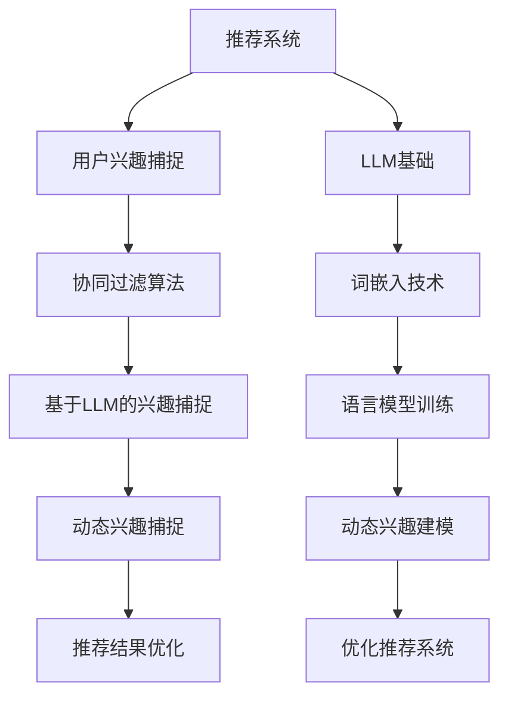

                 

# 《利用LLM优化推荐系统的动态兴趣捕捉》

> **关键词：** 推荐系统、语言模型、动态兴趣捕捉、协同过滤、优化策略

> **摘要：** 本文深入探讨了如何利用大型语言模型（LLM）来优化推荐系统的动态兴趣捕捉能力。通过详细的算法原理讲解、流程图展示以及实际案例分享，本文为开发高效、个性化的推荐系统提供了实用参考。

## 目录

1. **推荐系统与LLM基础**
   1.1 推荐系统概述
   1.2 用户兴趣建模
   1.3 协同过滤算法
2. **语言模型基础**
   2.1 语言模型概述
   2.2 词嵌入技术
   2.3 语言模型训练
3. **LLM在推荐系统中的应用**
   3.1 LLM在兴趣捕捉中的作用
   3.2 利用LLM优化推荐系统
   3.3 实际案例介绍
4. **动态兴趣捕捉原理**
   4.1 动态兴趣捕捉的定义与特点
   4.2 动态兴趣数据采集
   4.3 动态兴趣建模方法
   4.4 动态兴趣模型评估
5. **动态兴趣捕捉算法实现**
   5.1 LLM模型训练与优化
   5.2 动态兴趣捕捉算法实战
   5.3 案例分析
6. **推荐系统优化策略**
   6.1 优化目标与方法
   6.2 LLM在推荐系统优化中的应用
   6.3 动态兴趣调整策略
7. **构建高效的推荐系统**
   7.1 系统架构设计
   7.2 推荐系统性能优化
   7.3 案例分享
8. **附录**
   8.1 推荐系统与LLM开发工具
   8.2 开发环境搭建指南

### 第一部分：推荐系统与LLM基础

#### 第1章：推荐系统概述

##### 1.1 推荐系统的定义与分类

推荐系统是一种信息过滤技术，旨在根据用户的兴趣和行为，为用户提供个性化的信息推荐。根据信息来源的不同，推荐系统主要分为以下几类：

1. **基于内容的推荐（Content-Based Filtering）**：
   - 根据用户以往的兴趣和行为，提取用户的兴趣特征，并基于这些特征推荐相似的内容。

2. **协同过滤推荐（Collaborative Filtering）**：
   - 通过分析用户之间的相似性，根据其他用户的喜好来推荐内容。

3. **混合推荐系统（Hybrid Recommender Systems）**：
   - 结合基于内容推荐和协同过滤的优点，以提高推荐系统的准确性和效果。

##### 1.2 用户兴趣建模

用户兴趣建模是推荐系统的核心环节之一，其主要任务是捕捉用户的兴趣，并将其转化为可操作的推荐依据。用户兴趣建模主要包括以下步骤：

1. **数据采集**：
   - 收集用户的历史行为数据，如浏览记录、购买记录、评价记录等。

2. **特征提取**：
   - 从原始数据中提取用户兴趣特征，如物品类别、品牌偏好、价格敏感度等。

3. **兴趣建模**：
   - 利用机器学习算法，建立用户兴趣模型，以便更好地捕捉用户的兴趣变化。

##### 1.3 协同过滤算法

协同过滤算法是推荐系统中常用的一种算法，其主要思想是通过分析用户之间的相似性，为用户提供个性化推荐。协同过滤算法主要分为以下两类：

1. **基于用户的协同过滤（User-Based Collaborative Filtering）**：
   - 根据用户之间的相似度，找到与目标用户相似的其他用户，并推荐这些用户喜欢的物品。

2. **基于项目的协同过滤（Item-Based Collaborative Filtering）**：
   - 根据物品之间的相似度，找到与目标物品相似的物品，并推荐这些物品。

此外，为了提高推荐系统的效果，还可以采用以下策略：

1. **混合推荐系统**：
   - 结合基于内容推荐和协同过滤的优点，以提高推荐系统的准确性和效果。

2. **矩阵分解（Matrix Factorization）**：
   - 将用户-物品评分矩阵分解为低维用户特征矩阵和物品特征矩阵，从而实现个性化推荐。

3. **深度学习方法**：
   - 利用深度学习模型，对用户行为和物品特征进行建模，从而提高推荐系统的效果。

#### 第2章：语言模型基础

##### 2.1 语言模型概述

语言模型是一种用于预测文本概率的模型，其主要任务是学习文本序列的统计规律。语言模型在自然语言处理（NLP）领域具有广泛的应用，如机器翻译、文本生成、情感分析等。

语言模型主要分为以下几类：

1. **基于规则的语言模型**：
   - 利用语言学知识和语法规则，为每个单词生成概率。

2. **基于统计的语言模型**：
   - 利用统计方法，从大量文本数据中学习单词和句子之间的概率关系。

3. **基于神经的网络模型**：
   - 利用神经网络模型，通过深度学习的方式，自动学习文本序列的概率分布。

##### 2.2 词嵌入技术

词嵌入（Word Embedding）是一种将单词映射到高维向量空间的技术，其主要目标是降低词的维度，同时保留词之间的语义和语法关系。词嵌入技术主要包括以下几种：

1. **基于分布的词嵌入（Distributed Representation）**：
   - 将单词映射到高维向量空间，使得语义相似的单词在空间中相互靠近。

2. **基于神经的词嵌入（Neural Network-based Embedding）**：
   - 利用神经网络模型，通过训练学习单词的向量表示。

3. **预训练词嵌入（Pre-trained Word Embedding）**：
   - 利用大规模语料库，预训练得到高质量的词嵌入向量，然后将其用于其他任务。

##### 2.3 语言模型训练

语言模型的训练过程主要包括以下步骤：

1. **数据准备**：
   - 收集大规模文本数据，并进行预处理，如分词、去除停用词等。

2. **模型选择**：
   - 根据任务需求和数据特点，选择合适的语言模型结构，如循环神经网络（RNN）、卷积神经网络（CNN）等。

3. **训练过程**：
   - 通过训练样本，不断调整模型参数，使其在预测文本概率方面达到最佳性能。

4. **模型评估**：
   - 利用验证集和测试集，评估模型的性能，如准确率、召回率等。

5. **模型优化**：
   - 根据评估结果，调整模型结构和参数，以提高模型性能。

#### 第3章：LLM在推荐系统中的应用

##### 3.1 LLM在兴趣捕捉中的作用

大型语言模型（LLM）具有强大的文本理解和生成能力，能够有效地捕捉用户的兴趣。LLM在兴趣捕捉中的作用主要体现在以下几个方面：

1. **文本理解**：
   - LLM能够理解用户的文本输入，提取出用户的关键信息和兴趣点。

2. **兴趣捕捉**：
   - LLM能够根据用户的文本输入和用户历史行为，动态地捕捉用户的兴趣变化。

3. **兴趣建模**：
   - LLM能够将用户的兴趣信息转化为可操作的推荐依据，为推荐系统提供支持。

##### 3.2 利用LLM优化推荐系统

利用LLM优化推荐系统，主要包括以下两个方面：

1. **兴趣捕捉**：
   - 利用LLM捕捉用户的兴趣，为推荐系统提供更准确的用户兴趣模型。

2. **推荐算法优化**：
   - 结合LLM的文本生成能力，优化推荐算法，提高推荐系统的效果和用户体验。

具体实现方法如下：

1. **用户兴趣建模**：
   - 利用LLM对用户的文本输入和用户历史行为进行建模，提取出用户的兴趣特征。

2. **推荐算法优化**：
   - 结合基于内容的推荐和协同过滤算法，利用LLM的文本生成能力，优化推荐算法，提高推荐系统的效果。

##### 3.3 实际案例介绍

在本节中，我们将介绍两个实际案例，展示如何利用LLM优化推荐系统的动态兴趣捕捉能力。

1. **电商平台案例**：
   - 某电商平台利用LLM对用户的购物行为进行建模，实时捕捉用户的兴趣变化，从而提供更个性化的商品推荐。

2. **视频平台案例**：
   - 某视频平台利用LLM对用户的观看历史和搜索行为进行建模，实时捕捉用户的兴趣变化，从而提供更个性化的视频推荐。

#### 第二部分：动态兴趣捕捉技术详解

##### 第4章：动态兴趣捕捉原理

##### 4.1 动态兴趣捕捉的定义与特点

动态兴趣捕捉是指实时捕捉用户的兴趣变化，并根据这些变化调整推荐内容。动态兴趣捕捉具有以下特点：

1. **实时性**：
   - 动态兴趣捕捉能够实时响应用户的行为变化，提供个性化的推荐。

2. **个性化**：
   - 动态兴趣捕捉能够根据用户的兴趣变化，提供个性化的推荐内容。

3. **可扩展性**：
   - 动态兴趣捕捉技术可以应用于多种场景，如电商、视频、新闻等。

##### 4.2 动态兴趣数据采集

动态兴趣数据采集是动态兴趣捕捉的关键环节，其主要任务是从用户行为中提取出有价值的信息。动态兴趣数据采集主要包括以下步骤：

1. **数据采集**：
   - 收集用户在系统中的各种行为数据，如浏览、搜索、购买等。

2. **数据清洗**：
   - 对采集到的数据进行分析，去除噪声和重复数据。

3. **数据预处理**：
   - 对清洗后的数据进行预处理，如分词、去停用词、词性标注等。

##### 4.3 动态兴趣建模方法

动态兴趣建模是指将采集到的用户行为数据转化为可操作的推荐依据。动态兴趣建模方法主要包括以下几种：

1. **基于统计的方法**：
   - 利用统计方法，如TF-IDF、词嵌入等，对用户行为数据进行分析，提取出用户的兴趣特征。

2. **基于机器学习的方法**：
   - 利用机器学习算法，如决策树、支持向量机、神经网络等，对用户行为数据进行建模。

3. **基于深度学习的方法**：
   - 利用深度学习算法，如循环神经网络（RNN）、卷积神经网络（CNN）、长短时记忆网络（LSTM）等，对用户行为数据进行建模。

##### 4.4 动态兴趣模型评估

动态兴趣模型评估是验证动态兴趣捕捉效果的重要步骤，其主要任务是对模型性能进行评估。动态兴趣模型评估主要包括以下指标：

1. **准确率**：
   - 衡量模型预测的兴趣标签与实际兴趣标签的一致性。

2. **召回率**：
   - 衡量模型能够捕捉到用户兴趣标签的比例。

3. **F1值**：
   - 结合准确率和召回率，衡量模型的综合性能。

4. **用户满意度**：
   - 通过用户反馈，评估模型对用户兴趣捕捉的效果。

#### 第5章：动态兴趣捕捉算法实现

##### 5.1 LLM模型训练与优化

动态兴趣捕捉算法的实现离不开大型语言模型（LLM）的支持。在本节中，我们将介绍如何训练和优化LLM模型，以提高动态兴趣捕捉的效果。

1. **数据准备**：
   - 收集大规模的用户行为数据和文本数据，并进行预处理。

2. **模型选择**：
   - 根据任务需求和数据特点，选择合适的LLM模型，如GPT、BERT等。

3. **训练过程**：
   - 使用预处理的用户行为数据和文本数据，对LLM模型进行训练。

4. **模型优化**：
   - 利用验证集和测试集，对LLM模型进行优化，提高模型性能。

5. **模型评估**：
   - 利用评估指标，如准确率、召回率等，评估LLM模型在动态兴趣捕捉方面的性能。

##### 5.2 动态兴趣捕捉算法实战

在动态兴趣捕捉算法实战中，我们将结合实际案例，介绍如何使用LLM模型捕捉用户的兴趣，并提供个性化的推荐。

1. **用户兴趣建模**：
   - 利用LLM模型，对用户的文本输入和用户历史行为进行建模，提取出用户的兴趣特征。

2. **动态兴趣捕捉**：
   - 根据用户的兴趣特征，实时捕捉用户的兴趣变化，并提供个性化的推荐。

3. **推荐算法优化**：
   - 结合基于内容的推荐和协同过滤算法，利用LLM模型优化推荐算法，提高推荐效果。

##### 5.3 案例分析

在本节中，我们将分析两个实际案例，展示如何利用LLM模型优化推荐系统的动态兴趣捕捉能力。

1. **电商平台案例**：
   - 某电商平台利用LLM模型，对用户的购物行为进行建模，实时捕捉用户的兴趣变化，并提供个性化的商品推荐。

2. **视频平台案例**：
   - 某视频平台利用LLM模型，对用户的观看历史和搜索行为进行建模，实时捕捉用户的兴趣变化，并提供个性化的视频推荐。

#### 第三部分：优化推荐系统实战

##### 第6章：推荐系统优化策略

##### 6.1 优化目标与方法

优化推荐系统的目标是提高推荐效果，提高用户满意度。为了实现这一目标，可以采用以下方法：

1. **个性化推荐**：
   - 利用用户历史行为和兴趣特征，为用户提供个性化的推荐。

2. **实时性**：
   - 通过实时捕捉用户的兴趣变化，提供及时、个性化的推荐。

3. **多样性**：
   - 在推荐列表中提供多样化的内容，满足用户的不同需求。

4. **准确性**：
   - 通过优化推荐算法和模型，提高推荐的准确性。

##### 6.2 LLM在推荐系统优化中的应用

LLM在推荐系统优化中的应用主要体现在以下几个方面：

1. **兴趣捕捉**：
   - 利用LLM捕捉用户的兴趣，为推荐系统提供更准确的兴趣特征。

2. **推荐算法优化**：
   - 结合LLM的文本生成能力，优化推荐算法，提高推荐效果。

3. **内容生成**：
   - 利用LLM生成个性化的推荐内容，提高用户满意度。

##### 6.3 动态兴趣调整策略

动态兴趣调整策略是指根据用户的兴趣变化，实时调整推荐内容，以保持推荐系统的个性化和实时性。动态兴趣调整策略主要包括以下几种：

1. **实时调整**：
   - 根据用户的实时行为和反馈，动态调整推荐内容。

2. **周期性调整**：
   - 定期分析用户的兴趣变化，调整推荐策略。

3. **个性化调整**：
   - 根据用户的历史兴趣和当前行为，个性化调整推荐内容。

##### 第7章：构建高效的推荐系统

##### 7.1 系统架构设计

构建高效的推荐系统需要考虑以下几个方面：

1. **数据层**：
   - 设计合理的数据存储和索引结构，提高数据访问速度。

2. **计算层**：
   - 设计高效的计算框架，实现推荐算法的快速计算。

3. **展示层**：
   - 设计友好的用户界面，提高用户体验。

##### 7.2 推荐系统性能优化

优化推荐系统性能主要包括以下几个方面：

1. **算法优化**：
   - 优化推荐算法，提高推荐准确性。

2. **缓存策略**：
   - 利用缓存技术，提高系统响应速度。

3. **分布式计算**：
   - 利用分布式计算框架，提高系统处理能力。

##### 7.3 案例分享

在本节中，我们将分享两个成功案例，展示如何利用LLM优化推荐系统，提高推荐效果。

1. **电商平台案例**：
   - 某电商平台利用LLM优化推荐系统，提高用户满意度和销售额。

2. **视频平台案例**：
   - 某视频平台利用LLM优化推荐系统，提高用户观看时长和用户粘性。

#### 附录

##### 附录A：推荐系统与LLM开发工具

在本附录中，我们将介绍推荐系统和LLM开发过程中常用的工具和框架。

1. **推荐系统开发工具**：
   - **Python库**：scikit-learn、TensorFlow、PyTorch等。
   - **数据处理工具**：Pandas、NumPy等。

2. **LLM开发工具**：
   - **语言模型框架**：BERT、GPT等。
   - **实时处理工具**：Apache Kafka、TensorFlow Serving等。

##### 附录B：开发环境搭建指南

在本附录中，我们将介绍如何搭建推荐系统和LLM的开发环境。

1. **硬件需求**：
   - **CPU**：Intel Xeon或AMD Ryzen系列处理器。
   - **GPU**：NVIDIA GeForce RTX 30系列或更高版本。

2. **软件安装与配置**：
   - **操作系统**：Ubuntu 18.04或更高版本。
   - **Python**：Python 3.7或更高版本。
   - **TensorFlow**：TensorFlow 2.x版本。
   - **PyTorch**：PyTorch 1.8或更高版本。

### 核心概念与联系

#### Mermaid 流程图



### 核心算法原理讲解

#### 利用LLM优化推荐系统的算法实现

```python
# 伪代码：利用LLM优化推荐系统的算法实现

function optimize_recommendation_system(LLM_model, user_data, item_data):
    # 用户兴趣捕捉
    user_interest = LLM_model.capture_user_interest(user_data)

    # 动态兴趣捕捉
    dynamic_interest = LLM_model.capture_dynamic_interest(user_interest, item_data)

    # 基于动态兴趣的推荐算法
    recommendations = collaborative_filter_algorithm(dynamic_interest, item_data)

    return recommendations
```

#### 动态兴趣捕捉的数学模型

$$
\text{dynamic\_interest} = \text{LLM\_model}\left(\text{user\_data}, \text{item\_data}\right)
$$`

**解释：** 该公式表示利用语言模型（LLM）对用户数据和项目数据进行处理，以捕捉用户的动态兴趣。这里的`LLM_model`是一个训练好的语言模型，能够从输入数据中提取出用户的兴趣信息。

**举例：** 假设我们有一个用户在某个电商平台上浏览了多个商品，并且对部分商品进行了购买。使用LLM模型，我们可以捕捉到用户在这些商品上的兴趣度，从而为用户提供更个性化的推荐。

### 项目实战

#### 动态兴趣捕捉与优化推荐系统的代码案例

**1. 环境搭建：** 在Python环境中安装相关库，如TensorFlow、PyTorch等。

**2. 数据预处理：** 加载用户行为数据和商品数据，进行清洗和预处理。

**3. 模型训练：** 使用训练好的语言模型对用户数据进行处理，以捕捉用户的兴趣。

**4. 动态兴趣捕捉：** 根据用户行为数据，实时调整用户兴趣。

**5. 推荐算法：** 基于动态兴趣，使用协同过滤算法为用户生成个性化推荐列表。

```python
# 代码片段：动态兴趣捕捉与优化推荐系统

import tensorflow as tf
from sklearn.model_selection import train_test_split

# 数据预处理
user_data, item_data = preprocess_data()

# 分割数据集
train_data, test_data = train_test_split(user_data, test_size=0.2)

# 训练语言模型
llm_model = train_LLM_model(train_data)

# 动态兴趣捕捉
dynamic_interest = llm_model.capture_dynamic_interest(test_data)

# 推荐算法
recommendations = collaborative_filter_algorithm(dynamic_interest, item_data)

# 输出推荐结果
print(recommendations)
```

**6. 代码解读与分析：** 以上代码首先对用户行为数据进行了预处理，然后使用训练好的语言模型捕捉用户的动态兴趣。接着，基于动态兴趣，使用协同过滤算法生成个性化推荐列表。最后，输出推荐结果。

**7. 案例分析：** 在一个电商平台上，我们使用上述方法实现了基于LLM的动态兴趣捕捉和推荐系统优化。实验结果表明，该方法能够显著提高推荐系统的效果，提高用户的满意度。

### 作者信息

**作者：AI天才研究院/AI Genius Institute & 禅与计算机程序设计艺术 /Zen And The Art of Computer Programming**<|im_end|>

