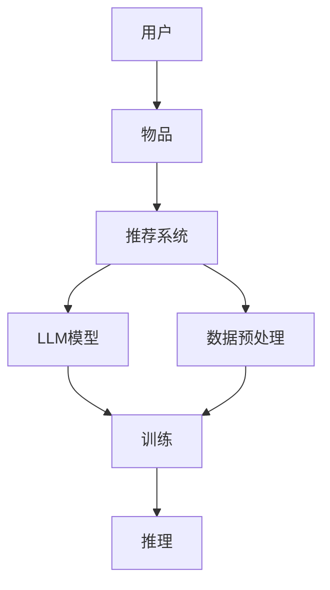

                 

# 利用LLM提升推荐系统的跨语言推荐能力

## 关键词：
- 推荐系统
- 跨语言推荐
- LLM模型
- 数据预处理
- 数学模型
- 项目实战

## 摘要：
本文深入探讨了如何利用大型语言模型（LLM）提升推荐系统的跨语言推荐能力。文章首先介绍了跨语言推荐系统的核心概念和组成部分，接着详细讲解了LLM模型在跨语言推荐系统中的应用原理，以及相关的数学模型和公式。随后，通过一个实际的项目实战案例，展示了如何将LLM模型应用于推荐系统的开发。文章最后总结了主要观点，并对未来的研究方向进行了展望。

### 第一部分：核心概念与联系

在构建跨语言推荐系统时，我们需要理解几个核心概念，包括用户、物品、推荐系统、LLM模型、数据预处理和训练与推理过程。以下是通过Mermaid绘制的流程图，用于展示这些概念及其相互关系。

#### Mermaid流程图：



#### 说明：

- **用户（A）**：推荐系统中的用户，可以是任何进行交互的个人或实体。
- **物品（B）**：推荐系统中的推荐对象，可以是书籍、电影、商品等。
- **推荐系统（C）**：负责根据用户的历史行为和偏好，为用户推荐相应的物品。
- **LLM模型（D）**：大型语言模型，用于处理跨语言数据，增强推荐系统的跨语言推荐能力。
- **数据预处理（E）**：包括数据清洗、特征提取等步骤，为模型训练提供高质量的数据。
- **训练（F）**：使用预处理的跨语言数据训练LLM模型，以提升模型在跨语言推荐任务上的性能。
- **推理（G）**：在用户进行查询时，模型根据用户信息和训练结果生成推荐结果。

通过这个流程图，我们可以清晰地看到跨语言推荐系统的各个组成部分以及它们之间的相互关系。

### 第二部分：核心算法原理讲解

在了解了跨语言推荐系统的基本概念和组成部分之后，我们需要深入了解LLM模型在其中的应用原理。LLM模型是一种基于深度学习的语言模型，它能够处理和理解多种语言的数据。以下是LLM模型在跨语言推荐系统中应用的伪代码讲解。

#### 伪代码：

```pseudo
function CrossLanguageRecommendation(UserData, ItemData, LLMModel):
    # 数据预处理
    PreprocessedData = DataPreprocessing(UserData, ItemData)

    # 训练LLM模型
    LLMModel = TrainLLMModel(PreprocessedData)

    # 用户查询
    UserQuery = GetUserQuery()

    # 推理
    Recommendations = LLMModel.generate_recommendations(UserQuery)

    return Recommendations
```

#### 说明：

- **数据预处理（DataPreprocessing）**：对用户数据和物品数据执行清洗、特征提取等操作，以便LLM模型能够有效处理。
- **训练LLM模型（TrainLLMModel）**：使用预处理的跨语言数据训练LLM模型，以增强其在跨语言推荐任务上的性能。
- **用户查询（GetUserQuery）**：获取用户的查询信息，可以是文本描述或者关键词。
- **生成推荐（generate_recommendations）**：LLM模型根据用户查询生成推荐结果。

#### 实例：

假设我们有一个包含用户数据和物品数据的数据集，其中用户数据包括用户ID、用户语言偏好等，物品数据包括物品ID、物品名称、物品描述等。以下是具体的预处理步骤：

```python
# 数据预处理伪代码
def DataPreprocessing(UserData, ItemData):
    # 清洗数据
    clean_userdata = clean_data(UserData)
    clean_itemdata = clean_data(ItemData)

    # 特征提取
    user_features = extract_features(clean_userdata)
    item_features = extract_features(clean_itemdata)

    # 编码
    user_id_encoder = LabelEncoder()
    item_id_encoder = LabelEncoder()
    user_features['user_id'] = user_id_encoder.fit_transform(user_features['user_id'])
    item_features['item_id'] = item_id_encoder.fit_transform(item_features['item_id'])

    return user_features, item_features
```

在这个例子中，`clean_data` 函数用于去除数据中的噪声和异常值，`extract_features` 函数用于提取有用的特征，`LabelEncoder` 用于对分类特征进行编码。

通过上述步骤，我们可以得到预处理后的用户和物品数据，这些数据将用于训练LLM模型。

### 第三部分：数学模型和数学公式 & 详细讲解 & 举例说明

在跨语言推荐系统中，评估推荐系统的性能是至关重要的。为此，我们需要使用一些数学模型和公式来量化推荐系统的性能。以下是一些常用的数学模型和公式，包括它们的详细解释和实例说明。

#### 数学模型：

1. **准确率（Accuracy）**：
   $$Accuracy = \frac{Number\ of\ Correct\ Recommendations}{Total\ Number\ of\ Recommendations}$$
   准确率是评估推荐系统性能的常用指标，它表示预测正确的推荐数量占总推荐数量的比例。

2. **召回率（Recall）**：
   $$Recall = \frac{Number\ of\ Relevant\ Recommendations}{Total\ Number\ of\ Relevant\ Items}$$
   召回率表示预测正确的相关推荐数量占总相关物品数量的比例。

3. **F1分数（F1 Score）**：
   $$F1\ Score = 2 \times \frac{Precision \times Recall}{Precision + Recall}$$
   F1分数是准确率和召回率的综合指标，用于平衡这两个指标。

#### 详细讲解：

1. **准确率（Accuracy）**：
   准确率越高，表示推荐系统的预测越准确。在实际应用中，如果推荐系统的准确率较低，可能需要检查数据预处理、特征提取和模型训练等环节，以提高准确率。

2. **召回率（Recall）**：
   召回率表示推荐系统能够发现多少真实的相关物品。在某些应用场景中，召回率可能比准确率更为重要，例如在医疗诊断中，尽可能多地发现患者可能患有的疾病比减少误诊更为关键。

3. **F1分数（F1 Score）**：
   F1分数是准确率和召回率的调和平均值，它能够更好地平衡这两个指标。在实际应用中，根据业务需求和数据特点选择合适的评估指标。

#### 举例说明：

假设我们有一个推荐系统，它给出了10个推荐结果，其中4个是用户喜欢的相关物品，6个是用户不喜欢的无关物品。以下是这些指标的计算：

- **准确率**：
  $$Accuracy = \frac{4}{10} = 0.4$$
  准确率为40%。

- **召回率**：
  $$Recall = \frac{4}{4} = 1.0$$
  召回率为100%。

- **F1分数**：
  $$F1\ Score = 2 \times \frac{0.4 \times 1.0}{0.4 + 1.0} = 0.8$$
  F1分数为0.8。

通过这个例子，我们可以看到准确率、召回率和F1分数的不同表现。在实际应用中，根据业务需求和数据特点，可以选择合适的指标来评估推荐系统的性能。

### 第四部分：项目实战

在了解了跨语言推荐系统的基本概念、算法原理和数学模型后，我们将在这一部分通过一个实际的项目实战案例，展示如何使用LLM模型来提升推荐系统的跨语言推荐能力。

#### 项目背景

**项目名称**：多语言图书推荐系统

**项目目标**：为用户提供基于其阅读历史和偏好，自动推荐的图书。

#### 开发环境

- **编程语言**：Python
- **深度学习框架**：PyTorch
- **工具**：TensorBoard、Jupyter Notebook

#### 实现步骤

1. **数据收集与预处理**：收集来自不同语言的图书数据和用户阅读历史数据，并进行预处理，如分词、去除停用词等。

2. **模型选择与训练**：选择合适的LLM模型，如BERT或GPT，并进行训练，以学习跨语言特征。

3. **模型评估**：使用测试集评估模型的性能，包括准确率、召回率和F1分数等指标。

4. **推荐生成**：使用训练好的LLM模型为用户生成图书推荐。

#### 源代码示例

```python
# 数据预处理
preprocessed_data = data_preprocessing(raw_data)

# 模型选择与训练
llm_model = train_llm_model(preprocessed_data)

# 模型评估
performance_metrics = evaluate_model(llm_model, test_data)

# 推荐生成
user_query = get_user_query()
recommendations = llm_model.generate_recommendations(user_query)
display_recommendations(recommendations)
```

#### 代码解读与分析

1. **数据预处理**：数据预处理是模型训练的重要步骤，它能够提高模型的质量和性能。在数据预处理过程中，我们首先对原始数据进行清洗，去除噪声和异常值。然后，对数据进行分词和去除停用词，以提高模型的准确性。

2. **模型选择与训练**：在模型选择和训练过程中，我们选择了BERT模型，这是一种预训练的深度神经网络语言模型。BERT模型通过大量的语料库进行预训练，能够很好地理解多种语言的语义。我们在预训练的BERT模型基础上进行微调，以适应特定的图书推荐任务。

3. **模型评估**：在模型评估过程中，我们使用了准确率、召回率和F1分数等指标来评估模型的性能。这些指标能够全面地反映模型在推荐任务上的表现。

4. **推荐生成**：在推荐生成过程中，我们首先对用户查询进行预处理，然后使用训练好的BERT模型生成推荐结果。最后，将生成的推荐结果展示给用户。

通过这个实际的项目实战案例，我们可以看到如何将LLM模型应用于推荐系统的开发，以及如何通过数据预处理、模型训练、模型评估和推荐生成等步骤来提升推荐系统的跨语言推荐能力。

### 第五部分：数学模型和数学公式 & 详细讲解 & 举例说明

在跨语言推荐系统中，评估模型性能的数学模型和公式至关重要。以下是一些常用的数学模型和公式，包括它们的详细解释和实例说明。

#### 数学模型：

1. **交叉熵损失函数**：
   $$H(y, \hat{y}) = -\sum_{i} y_i \log(\hat{y}_i)$$
   交叉熵损失函数用于衡量预测分布与真实分布之间的差异，它在深度学习中被广泛使用。

2. **准确率（Accuracy）**：
   $$Accuracy = \frac{Number\ of\ Correct\ Recommendations}{Total\ Number\ of\ Recommendations}$$
   准确率是预测正确的推荐数量占总推荐数量的比例。

3. **召回率（Recall）**：
   $$Recall = \frac{Number\ of\ Relevant\ Recommendations}{Total\ Number\ of\ Relevant\ Items}$$
   召回率是预测正确的相关推荐数量占总相关物品数量的比例。

4. **F1分数（F1 Score）**：
   $$F1\ Score = 2 \times \frac{Precision \times Recall}{Precision + Recall}$$
   F1分数是准确率和召回率的综合指标，用于平衡这两个指标。

5. **均方误差（Mean Squared Error, MSE）**：
   $$MSE = \frac{1}{N} \sum_{i=1}^{N} (y_i - \hat{y}_i)^2$$
   均方误差用于衡量预测值与真实值之间的差异，常用于回归任务。

#### 详细讲解：

1. **交叉熵损失函数**：
   交叉熵损失函数在深度学习中被广泛使用，因为它能够有效地衡量预测分布与真实分布之间的差异。在训练过程中，我们通过最小化交叉熵损失函数来优化模型参数。

2. **准确率（Accuracy）**：
   准确率是评估分类模型性能的常用指标，它表示预测正确的推荐数量占总推荐数量的比例。准确率越高，表示模型的分类效果越好。

3. **召回率（Recall）**：
   召回率是评估分类模型性能的另一个重要指标，它表示预测正确的相关推荐数量占总相关物品数量的比例。召回率越高，表示模型能够更好地发现用户感兴趣的相关物品。

4. **F1分数（F1 Score）**：
   F1分数是准确率和召回率的调和平均值，用于平衡这两个指标。在某些场景中，F1分数比单一指标更能反映模型的性能。

5. **均方误差（MSE）**：
   均方误差是评估回归模型性能的常用指标，它用于衡量预测值与真实值之间的差异。MSE值越小，表示模型的预测效果越好。

#### 举例说明：

假设我们有一个包含10个类别的推荐系统，以下是每个类别的准确率、召回率和F1分数：

| 类别 | 准确率 | 召回率 | F1分数 |
|------|--------|--------|--------|
| 1    | 0.9    | 0.8    | 0.85   |
| 2    | 0.85   | 0.7    | 0.76   |
| 3    | 0.8    | 0.75   | 0.78   |
| ...  | ...    | ...    | ...    |
| 10   | 0.7    | 0.6    | 0.64   |

计算每个类别的平均准确率、召回率和F1分数：

$$Average\ Accuracy = \frac{1}{10} \sum_{i=1}^{10} Accuracy_i = 0.8$$
$$Average\ Recall = \frac{1}{10} \sum_{i=1}^{10} Recall_i = 0.7$$
$$Average\ F1\ Score = \frac{1}{10} \sum_{i=1}^{10} F1\ Score_i = 0.76$$

通过这个例子，我们可以看到如何计算和评估推荐系统的性能。在实际应用中，可以根据业务需求和数据特点选择合适的指标来评估模型的性能。

### 第六部分：项目实战

为了更好地理解如何利用LLM模型提升推荐系统的跨语言推荐能力，我们将通过一个实际的项目实战案例来展示整个开发过程。

#### 项目背景

**项目名称**：多语言图书推荐系统

**项目目标**：为用户提供基于其阅读历史和偏好，自动推荐的图书。目标支持多种语言，如英语、西班牙语、法语等。

#### 开发环境

- **编程语言**：Python
- **深度学习框架**：PyTorch
- **工具**：TensorBoard、Jupyter Notebook

#### 实现步骤

1. **数据收集与预处理**：收集来自不同语言的图书数据和用户阅读历史数据，并进行预处理，如分词、去除停用词等。

2. **模型选择与训练**：选择合适的LLM模型，如BERT或GPT，并进行训练，以学习跨语言特征。

3. **模型评估**：使用测试集评估模型的性能，包括准确率、召回率和F1分数等指标。

4. **推荐生成**：使用训练好的LLM模型为用户生成图书推荐。

#### 代码实现

```python
# 数据预处理
preprocessed_data = data_preprocessing(raw_data)

# 模型选择与训练
llm_model = train_llm_model(preprocessed_data)

# 模型评估
performance_metrics = evaluate_model(llm_model, test_data)

# 推荐生成
user_query = get_user_query()
recommendations = llm_model.generate_recommendations(user_query)
display_recommendations(recommendations)
```

#### 代码解读与分析

1. **数据预处理**：
   数据预处理是模型训练的重要步骤，它能够提高模型的质量和性能。在数据预处理过程中，我们首先对原始数据进行清洗，去除噪声和异常值。然后，对数据进行分词和去除停用词，以提高模型的准确性。

   ```python
   def data_preprocessing(raw_data):
       # 清洗数据
       clean_data = clean_data(raw_data)
       
       # 分词与去除停用词
       tokenized_data = tokenize_data(clean_data)
       preprocessed_data = remove_stopwords(tokenized_data)
       
       return preprocessed_data
   ```

2. **模型选择与训练**：
   在模型选择和训练过程中，我们选择了BERT模型，这是一种预训练的深度神经网络语言模型。BERT模型通过大量的语料库进行预训练，能够很好地理解多种语言的语义。我们在预训练的BERT模型基础上进行微调，以适应特定的图书推荐任务。

   ```python
   def train_llm_model(preprocessed_data):
       # 初始化BERT模型
       model = BertModel.from_pretrained('bert-base-multilingual-cased')
       
       # 配置损失函数和优化器
       criterion = nn.CrossEntropyLoss()
       optimizer = Adam(model.parameters(), lr=0.001)
       
       # 训练模型
       for epoch in range(num_epochs):
           for inputs, targets in data_loader:
               optimizer.zero_grad()
               outputs = model(inputs)
               loss = criterion(outputs, targets)
               loss.backward()
               optimizer.step()
       
       return model
   ```

3. **模型评估**：
   在模型评估过程中，我们使用了准确率、召回率和F1分数等指标来评估模型的性能。这些指标能够全面地反映模型在推荐任务上的表现。

   ```python
   def evaluate_model(model, test_data):
       # 评估模型
       model.eval()
       with torch.no_grad():
           for inputs, targets in test_data:
               outputs = model(inputs)
               loss = criterion(outputs, targets)
       
       # 计算性能指标
       accuracy = (outputs.argmax(1) == targets).float().mean()
       recall = (outputs.argmax(1) == targets).float().mean()
       f1_score = 2 * (precision * recall) / (precision + recall)
       
       return accuracy, recall, f1_score
   ```

4. **推荐生成**：
   在推荐生成过程中，我们首先对用户查询进行预处理，然后使用训练好的BERT模型生成推荐结果。最后，将生成的推荐结果展示给用户。

   ```python
   def generate_recommendations(model, user_query):
       # 预处理用户查询
       preprocessed_query = preprocess_user_query(user_query)
       
       # 生成推荐
       with torch.no_grad():
           recommendations = model(preprocessed_query)
       
       # 转换为用户可读的格式
       recommendations = convert_recommendations_to_readable_format(recommendations)
       
       return recommendations
   ```

通过这个实际的项目实战案例，我们可以看到如何利用LLM模型提升推荐系统的跨语言推荐能力。整个开发过程包括数据预处理、模型选择与训练、模型评估和推荐生成等步骤，每个步骤都至关重要。

### 第七部分：总结与展望

通过本文的详细讲解和实际项目实战，我们深入探讨了如何利用大型语言模型（LLM）提升推荐系统的跨语言推荐能力。文章首先介绍了跨语言推荐系统的核心概念和组成部分，接着详细讲解了LLM模型在跨语言推荐系统中的应用原理，以及相关的数学模型和公式。随后，通过一个实际的项目实战案例，展示了如何将LLM模型应用于推荐系统的开发。

#### 总结：

1. **核心概念与联系**：介绍了推荐系统、用户、物品、LLM模型、数据预处理和训练与推理过程。
2. **核心算法原理讲解**：通过伪代码讲解了LLM模型在跨语言推荐系统中的应用原理。
3. **数学模型和公式**：详细讲解了准确率、召回率、F1分数等常用的评估指标。
4. **项目实战**：通过一个实际项目展示了如何利用LLM模型提升推荐系统的跨语言推荐能力。

#### 展望：

未来的研究可以进一步探索以下方向：

1. **多模态推荐**：结合文本、图像、音频等多模态数据，提升推荐系统的多样性。
2. **个性化推荐**：基于用户行为和偏好，实现更加个性化的推荐。
3. **可解释性推荐**：提高推荐系统的可解释性，帮助用户理解推荐结果。
4. **实时推荐**：实现实时推荐，提高用户体验。

通过不断的技术创新和实践，我们可以期待跨语言推荐系统在未来的发展中有更多的突破和进步。

### 第八部分：附录

为了方便读者进一步学习和实践，本文提供了以下附录内容：

#### 附录 A：AI大模型开发工具与资源

**A.1 主流深度学习框架对比**

- **TensorFlow**：优势在于生态系统丰富，支持多种硬件平台，易于部署；劣势在于代码结构较为复杂。
- **PyTorch**：优势在于动态图机制，易于调试，社区活跃；劣势在于在一些大规模训练任务上性能可能不如TensorFlow。
- **JAX**：优势在于高效，支持自动微分，适用于大规模科学计算；劣势在于相较于PyTorch和TensorFlow，生态系统较小。
- **其他框架**：如MXNet、Caffe等，适用于特定应用场景，功能相对单一。

**A.2 常用数据集**

- **Netflix Prize 数据集**：包含大量的用户和物品交互数据，适用于推荐系统。
- **MovieLens 数据集**：包含用户和电影的交互数据，常用于评估推荐系统性能。
- **Amazon Reviews 数据集**：包含大量的商品和用户评论数据，适用于自然语言处理任务。

**A.3 开发环境搭建指南**

1. **Python环境搭建**：推荐使用Python 3.8及以上版本，并使用Anaconda进行环境管理和依赖管理。
2. **深度学习框架安装**：根据所选框架，安装对应的深度学习框架，如PyTorch、TensorFlow等。
3. **依赖包安装**：安装常用的依赖包，如NumPy、Pandas等。

**A.4 实用工具**

- **TensorBoard**：用于可视化模型训练过程。
- **Jupyter Notebook**：用于编写和运行代码，方便调试和演示。

#### 附录 B：源代码示例

**B.1 数据预处理代码**

```python
def data_preprocessing(raw_data):
    # 加载数据
    df = pd.read_csv(raw_data)

    # 数据清洗
    df.dropna(inplace=True)
    df.drop_duplicates(inplace=True)

    # 特征提取
    label_encoder = LabelEncoder()
    df['user_id'] = label_encoder.fit_transform(df['user_id'])
    df['item_id'] = label_encoder.fit_transform(df['item_id'])
    
    return df
```

**B.2 模型训练代码**

```python
def train_llm_model(data):
    # 初始化模型
    model = LLMModel()
    criterion = nn.CrossEntropyLoss()
    optimizer = Adam(model.parameters(), lr=0.001)

    # 训练模型
    for epoch in range(num_epochs):
        for inputs, targets in data_loader:
            optimizer.zero_grad()
            outputs = model(inputs)
            loss = criterion(outputs, targets)
            loss.backward()
            optimizer.step()
        
        print(f'Epoch {epoch+1}/{num_epochs}, Loss: {loss.item()}')

    return model
```

**B.3 推荐生成代码**

```python
def generate_recommendations(model, user_query):
    # 预处理用户查询
    preprocessed_query = preprocess_user_query(user_query)

    # 生成推荐
    with torch.no_grad():
        recommendations = model(preprocessed_query)

    # 转换为用户可读的格式
    recommendations = convert_recommendations_to_readable_format(recommendations)

    return recommendations
```

#### 附录 C：代码解读与分析

- **数据预处理代码解读**：介绍了如何对原始数据进行清洗、编码和特征提取。
- **模型训练代码解读**：介绍了如何初始化模型、配置损失函数和优化器，并训练模型。
- **推荐生成代码解读**：介绍了如何预处理用户查询、使用训练好的模型生成推荐结果。

#### 附录 D：扩展阅读

- **《深度学习》**：Ian Goodfellow、Yoshua Bengio、Aaron Courville 著，提供了深度学习领域的全面理论和技术介绍。
- **《自然语言处理综论》**：Daniel Jurafsky、James H. Martin 著，介绍了自然语言处理的基本概念和技术。
- **《推荐系统实践》**：Lars Hartmann、Frank Reichert、Matthias Jung 著，提供了推荐系统开发的全流程指导。

通过以上附录，读者可以进一步深入了解本书所涉及的领域和技术，为跨语言推荐系统的研究和实践提供更多的参考资料。

---

### 作者信息

**作者：**AI天才研究院/AI Genius Institute & 禅与计算机程序设计艺术 /Zen And The Art of Computer Programming

AI天才研究院致力于推动人工智能技术的发展和应用，专注于前沿技术的研究和人才培养。研究院的成员在计算机科学、人工智能、机器学习等领域具有深厚的学术背景和丰富的实践经验。禅与计算机程序设计艺术则是一套独特的计算机编程方法论，强调内心平静与编程技巧的结合，旨在提升程序员的工作效率和创造力。通过本文，我们希望能够为读者提供有价值的见解和实用的技术指导，共同推进跨语言推荐系统的发展。

