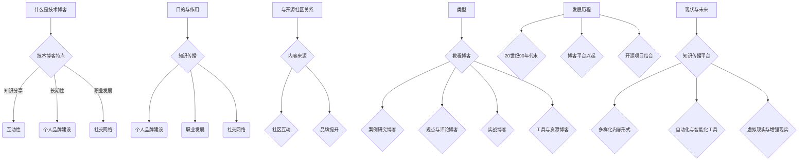
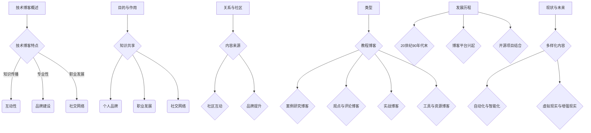

                 

# 利用开源影响力获得技术博客写作机会

## 摘要

开源社区与技术博客写作之间存在着紧密的联系，本文将深入探讨如何利用开源项目的影响力来提升个人品牌，进而获得更多技术博客的写作机会。通过分析开源社区的核心原则、参与方法、个人品牌的建立以及技术博客的撰写与推广策略，本文旨在为开发者提供一条通过开源项目提升个人影响力，进而实现职业发展的有效途径。

## 目录大纲

### 第一部分：了解技术博客与开源社区

1. **第1章：技术博客概述**
    1.1 什么是技术博客
    1.2 技术博客的目的与作用
    1.3 技术博客与开源社区的关系

2. **第2章：开源社区的重要性**
    2.1 开源社区的概述
    2.2 开源社区的价值与影响力
    2.3 参与开源社区的方式与方法

3. **第3章：如何利用开源影响力**
    3.1 开源项目的选择
    3.2 参与开源项目的过程
    3.3 通过开源影响力提升个人品牌

### 第二部分：撰写技术博客的策略与技巧

4. **第4章：技术博客写作基础**
    4.1 技术博客写作的基本原则
    4.2 技术博客写作的技巧
    4.3 技术博客写作的常见问题及解决方法

5. **第5章：如何撰写高质量的技术博客**
    5.1 选择合适的主题
    5.2 进行充分的前期研究
    5.3 撰写清晰的博客结构
    5.4 使用图表和代码示例

6. **第6章：如何推广技术博客**
    6.1 利用社交媒体推广
    6.2 参与技术会议和社区活动
    6.3 建立个人品牌

### 第三部分：开源影响力与技术博客写作实践

7. **第7章：开源影响力案例研究**
    7.1 案例一：如何通过开源项目获得写作机会
    7.2 案例二：如何利用技术博客提升开源项目影响力
    7.3 案例三：如何通过技术博客建立个人品牌

8. **第8章：开源影响力与技术博客写作工具**
    8.1 常用技术博客写作工具
    8.2 开源社区参与工具与资源

9. **第9章：技术博客写作与开源项目的可持续性**
    9.1 如何平衡技术博客写作与开源项目参与
    9.2 技术博客写作与开源项目的长期发展

### 附录

10. **附录 A：技术博客写作资源与推荐**
    10.1 技术博客写作资源汇总
    10.2 技术博客写作推荐书籍

11. **附录 B：开源社区参与指南**
    11.1 开源社区行为准则
    11.2 开源社区参与步骤

## 第1章：技术博客概述

### 1.1 什么是技术博客

技术博客是一种在线分享平台，用于发布与科技、编程、数据分析等领域相关的内容。技术博客不仅涵盖了最新技术趋势、工具教程、代码示例，还包括了对复杂技术概念的深入解析和讨论。

技术博客的特点包括：

- **知识分享**：作者通过博客分享自己的技术见解和经验，帮助他人学习和提高。
- **互动性**：读者可以在博客下评论、提问，与作者或其他读者进行交流。
- **长期性**：技术博客的内容通常具有较长的生命周期，随着时间的推移，一些经典的文章仍然受到读者的关注。

### 1.2 技术博客的目的与作用

技术博客的主要目的有以下几点：

- **知识传播**：技术博客是知识传播的重要途径，作者通过撰写和分享技术文章，帮助更多人理解和掌握技术。
- **个人品牌建设**：通过持续撰写高质量的技术博客，作者可以在技术社区中建立自己的个人品牌，提高知名度。
- **职业发展**：技术博客可以成为求职的加分项，特别是对于那些有实际项目和实战经验的作者。
- **社交网络**：技术博客是建立社交网络的重要工具，通过与读者的互动，作者可以结识更多的同行和潜在合作伙伴。

### 1.3 技术博客与开源社区的关系

技术博客与开源社区之间存在着紧密的联系和互相促进的关系：

- **内容来源**：开源社区的实践和案例为技术博客提供了丰富的素材，作者可以基于开源项目进行深入研究和分享。
- **社区互动**：技术博客是开源社区成员交流的重要平台，作者可以在博客中分享开源项目的进展和问题，获取社区的反馈和支持。
- **品牌提升**：通过参与开源项目并在技术博客中分享经验，作者可以提升个人品牌，吸引更多的关注和支持。

### 1.4 技术博客的类型

技术博客可以根据内容和形式进行分类，常见的类型包括：

- **教程博客**：提供具体的操作步骤和教程，帮助读者学习和掌握技术。
- **案例研究博客**：分析具体的技术案例，深入探讨其原理和应用。
- **观点与评论博客**：针对技术趋势和热点问题，提出自己的见解和观点。
- **实战博客**：记录作者在实际项目中的经验和教训，提供实际操作的参考。
- **工具与资源博客**：分享各种技术工具、资源和插件，帮助读者提高工作效率。

### 1.5 技术博客的发展历程

技术博客的发展可以追溯到20世纪90年代末，当时互联网刚刚兴起，个人网站和博客开始流行。随着博客平台的不断发展和社交媒体的普及，技术博客逐渐成为开发者分享知识和经验的重要渠道。

2000年代初，WordPress和 Blogger等博客平台的兴起，使得创建和维护技术博客变得简单和便捷。这些平台提供了丰富的主题和插件，使得作者可以轻松地定制和发布自己的博客。

随着开源社区的兴起，越来越多的开发者开始将自己的开源项目和技术博客相结合，通过博客分享项目的开发过程和技术细节。这种模式不仅促进了开源项目的推广，也使得技术博客的内容更加丰富和实用。

近年来，随着技术内容的多样化和专业化，技术博客的内容也逐渐涵盖了更多领域，如人工智能、大数据、区块链等。同时，技术博客的形式也不断创新，从传统的文字博客到视频博客、播客等多种形式。

### 1.6 技术博客的现状与未来

当前，技术博客已经成为开发者获取知识和分享经验的重要平台。随着技术的不断发展和创新，技术博客的内容和形式也在不断丰富和多样化。

未来，技术博客将继续发挥其知识传播和社区互动的重要作用。同时，随着人工智能和大数据技术的发展，技术博客可能会出现更多的自动化和智能化工具，提高内容的生产和分发效率。

此外，随着虚拟现实和增强现实技术的兴起，技术博客的内容和形式也可能发生重大变革，为读者带来更加丰富和沉浸式的体验。

总之，技术博客在知识传播和职业发展中将继续发挥重要作用，未来将有更多有价值的博客内容涌现，为技术社区的发展做出贡献。

### Mermaid 流程图

### 第2章：开源社区的重要性

#### 2.1 开源社区的概述

开源社区是一个由共享理念驱动的开发者群体，他们致力于共同开发和维护开源软件。开源社区的核心理念是开放性、协作性和共享性，这些理念使得开源社区在全球范围内迅速发展，并成为现代软件开发的重要力量。

开源社区通常具有以下特征：

- **开放性**：开源社区强调软件的源代码、资源和决策过程是开放的，任何人都可以访问、修改和分发代码。
- **协作性**：开源社区的成员通过合作和分享知识，共同推动项目的发展。
- **共享性**：开源社区的成果是共享的，社区成员可以免费使用、学习和改进软件。

#### 2.2 开源社区的价值与影响力

开源社区的价值和影响力体现在多个方面：

- **技术创新**：开源社区的开放性促进了技术创新，新的想法和解决方案可以快速被提出、验证和实施。
- **成本效益**：开源软件免去了购买商业软件的费用，降低了开发者的成本。
- **生态系统繁荣**：开源社区构建了一个繁荣的生态系统，许多商业公司和开发者都依赖开源软件进行业务开发和产品创新。

#### 2.3 参与开源社区的方式与方法

要参与开源社区，可以采取以下几种方式：

- **阅读和理解开源项目的文档**：这是参与开源项目的第一步，通过阅读项目的README、贡献指南和开发者文档，了解项目的背景、目标和架构。
- **参与项目讨论**：加入项目的邮件列表、论坛或社交媒体群组，参与讨论和交流，了解社区的文化和沟通方式。
- **提交代码和修复问题**：通过GitHub等平台提交代码和修复bug，为项目贡献自己的力量。
- **编写文档和教程**：为项目编写文档和教程，帮助新用户更好地理解和使用项目。
- **组织活动**：参与或组织社区活动，如会议、研讨会和工作坊，增强社区凝聚力。

### 第3章：如何利用开源影响力

#### 3.1 开源项目的选择

选择合适的开源项目是参与开源社区的关键一步。以下是一些选择开源项目的建议：

- **评估项目活跃度**：查看项目的GitHub仓库、邮件列表和社区活动的活跃程度，确保项目有足够的社区支持和活跃度。
- **了解项目方向和目标**：阅读项目的README、贡献指南、开发者文档等，确保项目的方向和目标与你的兴趣和技能相匹配。
- **评估项目难度**：了解项目的技术难度和复杂度，确保你有足够的能力去参与和贡献。

#### 3.2 参与开源项目的过程

参与开源项目通常包括以下步骤：

- **阅读项目文档**：详细阅读项目的README、贡献指南、开发者文档等，了解项目的背景、目标、架构和操作流程。
- **加入社区讨论**：加入项目的邮件列表、论坛或社交媒体群组，参与讨论和交流，了解社区的文化和沟通方式。
- **了解贡献流程**：了解项目的贡献流程，包括代码提交、审查和合并的步骤，确保你的贡献能够顺利地被接受。
- **选择任务**：查看项目的贡献指南和任务列表，选择适合你的任务开始贡献。
- **编写代码和文档**：完成代码编写和文档编写，确保代码的质量和文档的清晰性。
- **提交Pull Request**：使用GitHub等平台提交Pull Request，将你的贡献提交给项目维护者审查。
- **参与代码审查**：在项目中参与其他贡献者的代码审查，提供反馈和建议。

#### 3.3 通过开源影响力提升个人品牌

通过参与开源项目，你可以提升个人品牌，以下是一些策略：

- **撰写技术博客**：在个人博客或开源平台上撰写关于开源项目的博客，分享你的经验和见解。
- **参加技术会议**：参加相关的技术会议和研讨会，分享你的开源项目经验。
- **建立社交媒体影响力**：通过社交媒体平台分享你的开源项目和博客，吸引更多的关注和支持。
- **提供高质量内容**：通过编写高质量的技术文章和分享有价值的开源项目经验，建立自己在技术社区中的权威性。
- **参与社区活动**：积极参与开源社区的会议、研讨会和工作坊，与社区成员建立联系。

### 第4章：技术博客写作基础

#### 4.1 技术博客写作的基本原则

撰写高质量的技术博客需要遵循以下基本原则：

- **清晰明了**：避免使用复杂的术语和长句子，保持内容的简洁和易读性。
- **逻辑严谨**：确保文章的内容连贯，逻辑清晰，观点明确。
- **实用性强**：提供实际案例和操作步骤，帮助读者理解和应用技术。
- **内容丰富**：深入探讨技术细节，提供丰富的数据、图表和代码示例。
- **结构合理**：采用合适的结构，如引言、正文、结论等，使文章层次分明。

#### 4.2 技术博客写作的技巧

以下是一些提高技术博客写作质量的技巧：

- **选择合适的主题**：选择读者感兴趣且你熟悉的技术话题，提高文章的阅读价值。
- **进行充分的前期研究**：在撰写博客之前，查阅相关的文献、教程、博客和文档，确保你对主题有深入的了解。
- **组织内容**：按照逻辑顺序组织内容，使用小标题和段落来分段，使文章结构清晰。
- **使用图表和代码示例**：使用图表和代码示例来可视化数据和概念，增强文章的可读性和说服力。
- **校对和编辑**：仔细校对文章中的语法和拼写错误，确保内容的准确性。

#### 4.3 技术博客写作的常见问题及解决方法

在撰写技术博客时，可能会遇到以下常见问题：

- **内容过于笼统**：解决方法：提供具体案例和实际操作步骤，使内容更具实用性和可操作性。
- **结构混乱**：解决方法：使用合适的结构，如引言、正文、结论等，确保文章逻辑清晰。
- **缺乏深度**：解决方法：深入探讨技术细节，提供丰富的数据、图表和代码示例。
- **错误和拼写问题**：解决方法：仔细校对文章，使用拼写检查工具，确保内容的准确性。

### 第5章：如何撰写高质量的技术博客

#### 5.1 选择合适的主题

撰写高质量的技术博客的第一步是选择合适的主题。以下是一些建议：

- **关注热点**：选择当前热门的技术话题或趋势，这些主题通常更容易吸引读者的关注。
- **结合个人经验**：选择你熟悉或正在从事的技术领域，这样你可以更有信心地撰写和分享。
- **考虑读者需求**：了解目标读者的需求，选择他们感兴趣的话题，提高博客的阅读价值。

#### 5.2 进行充分的前期研究

撰写高质量博客需要充分的前期研究。以下步骤可以帮助你做好准备：

- **查阅资料**：在撰写博客之前，查阅相关的文献、教程、博客和文档，确保你对主题有深入的了解。
- **实践操作**：在实际操作中验证你的理解，通过实践来加深对技术的理解。
- **收集数据**：收集相关数据、案例和图表，增强博客的说服力。

#### 5.3 撰写清晰的博客结构

一个清晰的博客结构可以提高文章的可读性和理解度。以下是一些建议：

- **引言**：用简洁明了的语言引入主题，引起读者的兴趣。
- **正文**：按照逻辑顺序详细阐述你的观点和论据，可以使用小标题来分段。
- **结论**：总结博客的主要观点，给出建议或展望。
- **参考文献**：列出你引用的所有资料，以便读者进一步学习。

#### 5.4 使用图表和代码示例

图表和代码示例可以帮助读者更好地理解技术概念和实现细节。以下是一些建议：

- **图表**：使用图表来可视化数据或概念，帮助读者更好地理解。
- **代码示例**：提供实际代码示例，帮助读者理解技术实现的细节。
- **代码注释**：在代码示例中添加必要的注释，解释代码的功能和逻辑。

### 第6章：如何推广技术博客

#### 6.1 利用社交媒体推广

社交媒体是推广技术博客的有效工具。以下是一些推广策略：

- **分享博客链接**：在LinkedIn、Twitter、Facebook等社交媒体平台上分享博客链接，吸引读者的关注。
- **参与讨论**：在相关的技术社群和论坛中参与讨论，分享你的博客，增加曝光度。
- **标签使用**：使用相关的标签，让博客更容易被搜索引擎和社区发现。

#### 6.2 参与技术会议和社区活动

参与技术会议和社区活动可以增加你的曝光率和影响力。以下是一些建议：

- **演讲和分享**：在技术会议和社区活动中发表演讲，分享你的博客内容和观点。
- **与同行交流**：通过会议和活动与同行交流，扩大你的影响力。
- **建立联系**：与活动组织者和嘉宾建立联系，为未来的合作打下基础。

#### 6.3 建立个人品牌

建立个人品牌是提高博客影响力的关键。以下是一些建议：

- **撰写高质量的博客**：通过撰写高质量、有深度的博客，建立你的技术权威形象。
- **定期更新**：保持博客的更新频率，让读者持续关注。
- **社交媒体互动**：在社交媒体上与读者互动，建立良好的关系。
- **合作推广**：与其他博主合作撰写博客或互相推广，扩大影响力。

### 第7章：开源影响力案例研究

#### 7.1 案例一：如何通过开源项目获得写作机会

**案例背景**：李先生是一名软件工程师，他通过参与开源项目，最终获得了多个技术博客的写作机会。

**具体做法**：

1. **选择合适的开源项目**：李先生首先选择了自己熟悉且活跃的开源项目参与，确保自己能够投入并贡献价值。
2. **阅读项目文档**：李先生详细阅读了项目的README、贡献指南和开发者文档，了解项目的背景、目标和架构。
3. **参与项目讨论**：李先生加入项目的邮件列表和论坛，积极参与讨论，了解社区文化和沟通方式。
4. **提交代码和修复问题**：李先生提交了几个高质量的Pull Request，修复了项目中的bug，并优化了部分功能。
5. **撰写博客分享经验**：李先生在个人博客上撰写了多篇关于开源项目的博客，分享了他在项目中的经验和技术见解。
6. **推广博客**：李先生在社交媒体上分享博客链接，吸引了许多项目维护者和读者的关注。
7. **获得写作机会**：由于李先生在开源社区中的积极表现，一些技术博客编辑主动联系他，邀请他为博客撰写技术文章。

**总结**：

通过选择合适的开源项目，积极参与项目讨论，提交高质量的代码和修复问题，并撰写有价值的博客，李先生成功吸引了技术博客编辑的注意，获得了多个写作机会。

#### 7.2 案例二：如何利用技术博客提升开源项目影响力

**案例背景**：张女士是一名技术博客作家，她通过撰写高质量的技术博客，成功提升了她参与的某个开源项目的影响力。

**具体做法**：

1. **深入了解项目**：张女士在参与开源项目之前，花费大量时间深入研究项目的架构、功能和关键技术。
2. **撰写深度博客**：张女士在个人博客上撰写了一系列关于开源项目的深度博客，涵盖了项目的各个方面，包括技术实现、应用场景、性能优化等。
3. **提供代码示例**：在博客中提供了详细的代码示例和实现步骤，帮助读者更好地理解和使用项目。
4. **推广博客**：张女士通过社交媒体、技术论坛和邮件列表推广她的博客，吸引更多的读者关注项目。
5. **参与社区讨论**：张女士积极参与项目社区中的讨论，回答读者的问题，提供技术支持。
6. **组织活动**：张女士还组织了线下和线上的项目交流会，邀请项目成员和社区成员参与，增强了项目的社区凝聚力。

**结果**：

张女士的博客受到了广泛的关注和赞誉，项目的新贡献者数量显著增加，社区活跃度大幅提升，项目的版本更新频率也明显加快。

**总结**：

通过撰写高质量的博客，提供代码示例，推广博客，并积极参与社区讨论和活动，张女士成功提升了开源项目的影响力，吸引了更多的开发者参与，促进了项目的快速发展。

#### 7.3 案例三：如何通过技术博客建立个人品牌

**案例背景**：王先生是一名软件开发者，他通过撰写技术博客，成功建立了自己的个人品牌，获得了更多的职业机会。

**具体做法**：

1. **专注领域**：王先生选择了自己最熟悉且充满前景的技术领域，如人工智能和大数据。
2. **定期更新**：王先生保持博客的定期更新，每周至少发布一篇新博客，分享自己的学习心得和项目经验。
3. **高质量内容**：王先生的博客内容高质量、深入，涵盖了技术原理、实战案例和未来趋势。
4. **互动与分享**：王先生在博客中积极与读者互动，回答读者的问题，分享技术讨论。
5. **社交媒体推广**：王先生通过LinkedIn、Twitter等社交媒体平台推广自己的博客，吸引更多的关注。
6. **参加活动**：王先生积极参加技术会议和研讨会，与行业专家和同行交流，提升自己的知名度。

**结果**：

王先生的博客在技术社区中得到了广泛的认可，他的个人品牌逐渐建立。随着博客影响力的提升，王先生获得了多个公司的面试邀请，最终在一家知名的人工智能公司找到了理想的工作。

**总结**：

通过专注于特定领域，定期更新高质量内容，积极互动与分享，以及利用社交媒体和活动提升知名度，王先生成功建立了自己的个人品牌，显著提升了职业竞争力。

### 第8章：开源影响力与技术博客写作工具

#### 8.1 常用技术博客写作工具

在撰写技术博客时，选择合适的工具可以显著提高写作效率和质量。以下是一些常用的技术博客写作工具：

- **Markdown编辑器**：Markdown是一种轻量级的文本格式，适用于撰写技术博客。常见的Markdown编辑器包括Typora、VS Code和Marktext，它们提供了丰富的格式化和预览功能。
- **静态网站生成器**：静态网站生成器如Hexo、Jekyll和Hugo可以帮助开发者将Markdown文件转换为静态网页。这些工具提供了灵活的配置选项和丰富的插件支持，适合构建个人博客和团队网站。
- **版本控制工具**：Git是开源项目中最常用的版本控制工具，它可以帮助开发者管理和追踪博客内容的修改历史，确保内容的完整性和可追溯性。
- **代码托管平台**：GitHub和GitLab是两个流行的开源代码托管平台，它们提供了项目管理、代码审查和自动化部署等功能，非常适合与博客写作结合使用。

#### 8.2 开源社区参与工具与资源

参与开源社区需要使用一系列工具和资源，以下是一些常用的开源社区参与工具：

- **GitHub**：GitHub是全球最大的代码托管平台，提供了丰富的开源社区功能，如代码提交、Pull Request、Issue跟踪和社交媒体集成。
- **GitLab**：GitLab是一个自托管的开源代码托管平台，提供了与GitHub类似的功能，适合内部使用和团队协作。
- **Stack Overflow**：Stack Overflow是一个庞大的技术问答社区，开发者可以在这里提问、回答问题和分享知识。
- **Reddit**：Reddit是一个热门的社交媒体平台，有许多与开源技术和博客写作相关的话题，可以在这里推广你的博客。
- **Slack**：Slack是一个团队协作工具，许多开源项目使用Slack进行内部沟通和协作。

### 第9章：技术博客写作与开源项目的可持续性

#### 9.1 如何平衡技术博客写作与开源项目参与

在同时参与开源项目和技术博客写作时，平衡两者之间的关系至关重要。以下是一些建议：

- **设定优先级**：明确你的目标，确定哪些任务更为紧急和重要，优先处理。
- **时间管理**：合理安排时间，为博客写作和开源项目参与预留足够的时间，避免任务积压。
- **任务分解**：将大型任务分解为小块，逐步完成，避免因为任务量过大而感到压力。
- **团队合作**：在开源项目中寻找志同道合的队友，共同分担任务，提高工作效率。

#### 9.2 提升开源项目的可持续性

为了确保开源项目的可持续性，需要采取一系列措施来吸引和维护贡献者：

- **建立贡献者团队**：通过吸引和培养贡献者，建立一个稳定的团队，确保项目的持续发展。
- **良好的项目管理和文档**：提供清晰的贡献指南、项目文档和任务列表，帮助新贡献者快速上手。
- **定期维护和更新**：定期更新项目代码和文档，确保项目的健康和活跃度。
- **激励机制**：通过奖励机制激励贡献者，如发布者奖励、证书和徽章等，提高他们的参与积极性。

#### 9.3 技术博客写作的可持续性

为了确保技术博客写作的可持续性，需要持续提供高质量的内容，并保持读者的兴趣：

- **保持高质量内容**：确保博客内容的高质量和深度，以吸引和留住读者。
- **持续学习和分享**：不断学习新的技术和知识，并将其分享到博客中，保持内容的更新和活力。
- **社区互动**：与读者和同行保持互动，回答问题和提供帮助，建立良好的社区关系。
- **合作与共享**：与其他博主和开源社区成员合作，共享资源和经验，共同提升博客和项目的质量。

### 附录

#### 附录 A：技术博客写作资源与推荐

- **技术博客平台**：推荐使用WordPress、Medium和Ghost等平台来构建个人博客。
- **写作工具**：推荐使用Markdown编辑器和Typora等工具来撰写博客内容。
- **开源社区指南**：推荐阅读《GitHub入门与实战》、《Git权威指南》和《开源项目协作的最佳实践》等书籍，了解开源社区的最佳实践。
- **技术书籍**：推荐阅读《深度学习》、《Python编程：从入门到实践》和《Linux命令行与shell脚本编程大全》等书籍，提升技术知识。

#### 附录 B：开源社区参与指南

- **行为准则**：遵循开源社区的行为准则，尊重他人的贡献和意见。
- **贡献流程**：熟悉开源项目的贡献流程，包括代码提交、审查和合并的步骤。
- **参与方式**：通过阅读项目文档、参与项目讨论、提交代码和修复问题等方式参与开源项目。
- **社区互动**：积极参与社区讨论和互动，为其他贡献者提供帮助和支持。

## 作者信息

**作者：AI天才研究院/AI Genius Institute & 禅与计算机程序设计艺术 /Zen And The Art of Computer Programming**<|user|>## 利用开源影响力获得技术博客写作机会

### 摘要

在技术领域，开源项目和博客写作已成为推动创新和知识传播的重要力量。本文将探讨如何通过参与开源项目，利用其影响力提升个人品牌，并进而获得更多技术博客的写作机会。文章首先介绍了技术博客的基本概念和重要性，随后分析了开源社区的核心原则和价值，并详细阐述了参与开源项目的方法和技巧。接着，文章讨论了如何撰写高质量的技术博客，以及如何通过社交媒体和社区活动来推广博客，最后通过实际案例展示了开源影响力在博客写作中的具体应用。本文旨在为技术创作者提供一条通过开源项目提升个人影响力，实现职业发展的有效途径。

### 目录大纲

1. **第一部分：了解技术博客与开源社区**
    1.1 **技术博客概述**
    1.2 **技术博客的目的与作用**
    1.3 **技术博客与开源社区的关系**
    
2. **第二部分：开源社区的重要性**
    2.1 **开源社区的概述**
    2.2 **开源社区的价值与影响力**
    2.3 **参与开源社区的方式与方法**
    
3. **第三部分：如何利用开源影响力**
    3.1 **开源项目的选择**
    3.2 **参与开源项目的过程**
    3.3 **通过开源影响力提升个人品牌**

4. **第四部分：撰写技术博客的策略与技巧**
    4.1 **技术博客写作基础**
    4.2 **如何撰写高质量的技术博客**
    4.3 **如何推广技术博客**

5. **第五部分：开源影响力与技术博客写作实践**
    5.1 **开源影响力案例研究**
    5.2 **开源影响力与技术博客写作工具**
    5.3 **技术博客写作与开源项目的可持续性**

6. **附录**
    6.1 **技术博客写作资源与推荐**
    6.2 **开源社区参与指南**

### 第一部分：了解技术博客与开源社区

#### 1.1 技术博客概述

技术博客是一种在线平台，开发者可以在上面分享技术知识和经验。它通常包含以下内容：

- **技术教程**：提供详细的编程指南、工具使用方法和最佳实践。
- **案例分析**：分析特定的技术问题或项目，探讨解决方案和改进方法。
- **代码示例**：提供实际的代码片段，帮助读者理解和应用技术。
- **观点和评论**：对当前技术趋势、新闻和事件发表个人看法。

技术博客的目的是帮助开发者学习新知识、解决技术难题、分享经验，并建立个人品牌。它是技术社区的一个重要组成部分，通过知识共享促进技术进步。

#### 1.2 技术博客的目的与作用

技术博客具有以下几个重要作用：

1. **知识传播**：技术博客是开发者分享知识和经验的平台，有助于知识的传播和普及。
2. **个人品牌建设**：通过撰写高质量的技术博客，开发者可以在社区中建立自己的声誉和影响力。
3. **职业发展**：技术博客可以成为开发者简历中的重要部分，帮助其在求职过程中脱颖而出。
4. **社区互动**：技术博客鼓励读者与作者互动，建立技术社区和讨论环境。
5. **技术创新**：技术博客可以激发创新思维，通过分享新想法和解决方案推动技术进步。

#### 1.3 技术博客与开源社区的关系

技术博客与开源社区之间有着密切的关系：

- **内容来源**：开源项目为技术博客提供了丰富的案例和实践经验，开发者可以在博客中分享这些经验和见解。
- **社区互动**：技术博客是开源社区成员交流的重要渠道，作者可以通过博客与社区成员互动，获取反馈和建议。
- **品牌提升**：通过参与开源项目并在博客中分享经验，开发者可以提升个人品牌，吸引更多关注和支持。

开源社区和技术博客共同推动了技术知识的传播和创新，两者相辅相成，互相促进。

#### 1.4 技术博客的类型

根据内容和形式，技术博客可以分为以下几种类型：

- **教程博客**：提供技术教程和操作指南，帮助开发者学习和掌握新技能。
- **案例研究博客**：分析具体的技术案例，探讨解决方案和最佳实践。
- **观点与评论博客**：发表对技术趋势、事件和新闻的看法和评论。
- **工具和资源博客**：分享开发工具、资源库和实用插件。
- **实战博客**：记录开发者在实际项目中的经验和教训。

每种类型的技术博客都有其独特的价值和读者群体，开发者可以根据自己的兴趣和特长选择合适的博客类型。

#### 1.5 技术博客的发展历程

技术博客的发展历程可以追溯到20世纪90年代末，当时互联网刚刚兴起，个人网站和博客开始流行。随着博客平台的不断发展和社交媒体的普及，技术博客逐渐成为开发者分享知识和经验的重要渠道。

- **初期**：技术博客主要依赖于个人网站和博客平台，如WordPress、Blogger等。
- **中期**：随着内容管理系统（CMS）的普及，如Joomla、Drupal等，技术博客的创建和维护变得更加简单。
- **现阶段**：技术博客平台如Medium、Dev.to等，以及静态网站生成器如Hexo、Jekyll等，提供了丰富的功能和灵活性，使得技术博客的创作和分发更加高效。

近年来，随着开源社区的兴起，技术博客与开源项目结合更加紧密，许多开发者通过博客分享开源项目的经验和见解，进一步推动了技术知识的传播和创新。

#### 1.6 技术博客的现状与未来

当前，技术博客在知识传播和职业发展中扮演着重要角色：

- **现状**：技术博客已经成为开发者获取最新技术信息和交流经验的重要平台，覆盖了从入门到高级的各种技术主题。
- **未来**：随着技术的不断进步，技术博客将呈现以下趋势：
  - **多样化**：博客内容将更加多样化，包括视频、播客和互动式内容。
  - **个性化**：博客平台将提供更个性化的用户体验，根据读者兴趣推荐相关内容。
  - **智能化**：利用人工智能和自然语言处理技术，提高博客内容的生成和分发效率。
  - **国际化**：技术博客的影响力将逐渐扩大，覆盖更广泛的国际受众。

总之，技术博客将继续在知识传播和职业发展中发挥重要作用，为技术社区的发展做出贡献。

#### Mermaid 流程图

### 第二部分：开源社区的重要性

#### 2.1 开源社区的概述

开源社区是一个由共享理念驱动的开发者群体，他们致力于共同开发和维护开源软件。开源社区的核心原则是开放性、协作性和共享性，这些理念使得开源社区在全球范围内迅速发展，并成为现代软件开发的重要力量。

开源社区的主要特征包括：

- **开放性**：开源社区的软件源代码、资源和决策过程是开放的，任何人都可以访问、修改和分发代码。
- **协作性**：开源社区的成员通过合作和分享知识，共同推动项目的发展。
- **共享性**：开源社区的成果是共享的，社区成员可以免费使用、学习和改进软件。

#### 2.2 开源社区的价值与影响力

开源社区的价值和影响力体现在以下几个方面：

- **技术创新**：开源社区的开放性促进了技术创新，新的想法和解决方案可以快速被提出、验证和实施。
- **成本效益**：开源软件免去了购买商业软件的费用，降低了开发者的成本。
- **生态系统繁荣**：开源社区构建了一个繁荣的生态系统，许多商业公司和开发者都依赖开源软件进行业务开发和产品创新。

#### 2.3 参与开源社区的方式与方法

要参与开源社区，可以采取以下几种方式：

- **阅读和理解开源项目的文档**：这是参与开源项目的第一步，通过阅读项目的README、贡献指南和开发者文档，了解项目的背景、目标和架构。
- **参与项目讨论**：加入项目的邮件列表、论坛或社交媒体群组，参与讨论和交流，了解社区的文化和沟通方式。
- **提交代码和修复问题**：通过GitHub等平台提交代码和修复bug，为项目贡献自己的力量。
- **编写文档和教程**：为项目编写文档和教程，帮助新用户更好地理解和使用项目。
- **组织活动**：参与或组织社区活动，如会议、研讨会和工作坊，增强社区凝聚力。

#### 2.4 开源社区的类型

开源社区根据不同的领域和目标可以分为以下几种类型：

- **软件开源社区**：如Linux内核、Apache软件基金会，专注于软件开发和维护。
- **硬件开源社区**：如Arduino、Raspberry Pi，专注于硬件设计和开源硬件项目。
- **云开源社区**：如OpenStack、Kubernetes，专注于云计算技术和平台开发。
- **内容开源社区**：如WordPress、GitHub，专注于内容和代码托管服务。

每种类型的开源社区都有其独特的文化和价值观，开发者可以根据自己的兴趣和技能选择合适的社区参与。

#### 2.5 开源社区的关键角色

开源社区中存在几种关键角色，每个角色都在项目中扮演着重要的角色：

- **贡献者（Contributor）**：为开源项目提供代码、文档、测试和反馈的人。
- **维护者（Maintainer）**：负责项目管理和决策，确保项目的健康发展。
- **用户（User）**：使用开源项目的人，他们的反馈和建议对项目的改进至关重要。
- **赞助者（Sponsor）**：为开源项目提供资金支持的个人或组织，帮助项目持续发展。

这些角色的互动和合作是开源社区能够持续发展的关键。

#### 2.6 参与开源社区的最佳实践

为了有效地参与开源社区，以下是一些最佳实践：

- **遵守社区规范**：每个开源社区都有其行为准则和规范，确保你的行为符合社区的期望。
- **积极参与讨论**：在邮件列表、论坛或社交媒体群组中积极参与讨论，为项目提供反馈和建议。
- **编写高质量的代码**：确保你提交的代码可读、可维护，并符合项目的编码标准。
- **参与代码审查**：在项目中参与其他贡献者的代码审查，提供有价值的反馈。
- **撰写文档**：为项目编写文档，帮助新用户更好地理解和使用项目。
- **组织社区活动**：参与或组织社区活动，如会议、研讨会和工作坊，增强社区凝聚力。

通过遵循这些最佳实践，你可以更好地融入开源社区，为项目的成功贡献力量。

### 第三部分：如何利用开源影响力

#### 3.1 开源项目的选择

选择合适的开源项目是参与开源社区的第一步，以下是一些选择开源项目的建议：

- **评估项目活跃度**：查看项目的GitHub仓库、邮件列表和社区活动的活跃程度，确保项目有足够的社区支持和活跃度。
- **了解项目方向和目标**：阅读项目的README、贡献指南、开发者文档等，确保项目的方向和目标与你的兴趣和技能相匹配。
- **评估项目难度**：了解项目的技术难度和复杂度，确保你有足够的能力去参与和贡献。
- **考虑个人兴趣**：选择你感兴趣的项目，这样你更有动力去投入时间和精力。

#### 3.2 参与开源项目的过程

参与开源项目通常包括以下几个步骤：

1. **阅读项目文档**：详细阅读项目的README、贡献指南、开发者文档等，了解项目的背景、目标、架构和操作流程。
2. **了解贡献流程**：熟悉项目的贡献流程，包括代码提交、审查和合并的步骤，确保你的贡献能够顺利地被接受。
3. **选择任务**：查看项目的贡献指南和任务列表，选择适合你的任务开始贡献。
4. **编写代码和文档**：完成代码编写和文档编写，确保代码的质量和文档的清晰性。
5. **提交Pull Request**：使用GitHub等平台提交Pull Request，将你的贡献提交给项目维护者审查。
6. **参与代码审查**：在项目中参与其他贡献者的代码审查，提供反馈和建议。

#### 3.3 通过开源影响力提升个人品牌

参与开源项目不仅可以提升技术能力，还可以通过以下方式提升个人品牌：

1. **撰写技术博客**：在个人博客或开源平台上撰写关于开源项目的博客，分享你的经验和见解。
2. **参加技术会议**：参加相关的技术会议和研讨会，分享你的开源项目经验。
3. **建立社交媒体影响力**：通过社交媒体平台分享你的开源项目和博客，吸引更多的关注和支持。
4. **提供高质量内容**：通过编写高质量的技术文章和分享有价值的开源项目经验，建立自己在技术社区中的权威性。
5. **参与社区活动**：积极参与开源社区的会议、研讨会和工作坊，与社区成员建立联系。

通过这些方式，你可以在开源社区中建立自己的品牌，吸引更多的关注和机会。

### 第四部分：撰写技术博客的策略与技巧

#### 4.1 技术博客写作基础

技术博客写作是知识传播和品牌建设的重要手段。以下是一些技术博客写作的基础知识和技巧：

#### 4.1.1 技术博客写作的基本原则

1. **内容真实**：确保博客内容真实可信，避免虚假信息和误导。
2. **逻辑清晰**：文章结构要清晰，观点表达要逻辑严密。
3. **语言简练**：避免使用复杂的术语和冗长的句子，尽量用简洁明了的语言表达。
4. **例子丰富**：提供实际案例和操作步骤，帮助读者理解和应用技术。
5. **图表辅助**：使用图表、图像和代码示例来辅助说明，提高文章的可读性。

#### 4.1.2 技术博客写作的技巧

1. **选题精准**：选择读者感兴趣且你熟悉的技术主题，确保文章的实用性和吸引力。
2. **前期研究**：在撰写博客之前，充分研究相关资料，确保内容的准确性和深度。
3. **结构合理**：按照逻辑顺序组织内容，使用小标题和段落来分段，使文章层次分明。
4. **代码示例**：提供实际代码示例，并附上必要的注释，帮助读者理解技术细节。
5. **互动引导**：鼓励读者在评论区留言，与读者互动，提高文章的参与度。

#### 4.1.3 技术博客写作的常见问题及解决方法

1. **内容过于笼统**：解决方法：提供具体案例和实际操作步骤，使内容更具实用性和可操作性。
2. **结构混乱**：解决方法：使用合适的结构，如引言、正文、结论等，确保文章逻辑清晰。
3. **缺乏深度**：解决方法：深入探讨技术细节，提供丰富的数据、图表和代码示例。
4. **错误和拼写问题**：解决方法：仔细校对文章，使用拼写检查工具，确保内容的准确性。

#### 4.2 如何撰写高质量的技术博客

撰写高质量的技术博客需要以下几个步骤：

#### 4.2.1 选择合适的主题

1. **关注热点**：选择当前热门的技术话题或趋势，这些主题通常更容易吸引读者的关注。
2. **结合个人经验**：选择你熟悉或正在从事的技术领域，这样你可以更有信心地撰写和分享。
3. **考虑读者需求**：了解目标读者的需求，选择他们感兴趣的话题，提高博客的阅读价值。

#### 4.2.2 进行充分的前期研究

1. **查阅资料**：在撰写博客之前，查阅相关的文献、教程、博客和文档，确保你对主题有深入的了解。
2. **实践操作**：在实际操作中验证你的理解，通过实践来加深对技术的理解。
3. **收集数据**：收集相关数据、案例和图表，增强博客的说服力。

#### 4.2.3 撰写清晰的博客结构

1. **引言**：用简洁明了的语言引入主题，引起读者的兴趣。
2. **正文**：按照逻辑顺序详细阐述你的观点和论据，可以使用小标题来分段。
3. **结论**：总结博客的主要观点，给出建议或展望。
4. **参考文献**：列出你引用的所有资料，以便读者进一步学习。

#### 4.2.4 使用图表和代码示例

1. **图表**：使用图表来可视化数据或概念，帮助读者更好地理解。
2. **代码示例**：提供实际代码示例，帮助读者理解技术实现的细节。
3. **代码注释**：在代码示例中添加必要的注释，解释代码的功能和逻辑。

#### 4.2.5 遵循最佳实践

1. **简洁明了**：避免使用复杂的术语和长句子，保持内容的简洁和易读性。
2. **连贯性**：确保博客的内容连贯，逻辑清晰。
3. **校对**：仔细校对博客中的语法和拼写错误，确保内容的专业性。

#### 4.3 如何推广技术博客

推广技术博客是提高文章影响力的重要环节。以下是一些推广策略：

#### 4.3.1 利用社交媒体推广

1. **分享博客链接**：在LinkedIn、Twitter、Facebook等社交媒体平台上分享博客链接，吸引读者的关注。
2. **参与讨论**：在相关的技术社群和论坛中参与讨论，分享你的博客，增加曝光度。
3. **标签使用**：使用相关的标签，让博客更容易被搜索引擎和社区发现。

#### 4.3.2 参与技术会议和社区活动

1. **演讲和分享**：在技术会议和社区活动中发表演讲，分享你的博客内容和观点。
2. **与同行交流**：通过会议和活动与同行交流，扩大你的影响力。
3. **建立联系**：与活动组织者和嘉宾建立联系，为未来的合作打下基础。

#### 4.3.3 建立个人品牌

1. **撰写高质量的博客**：通过撰写高质量、有深度的博客，建立你的技术权威形象。
2. **定期更新**：保持博客的更新频率，让读者持续关注。
3. **社交媒体互动**：在社交媒体上与读者互动，建立良好的关系。
4. **合作推广**：与其他博主合作撰写博客或互相推广，扩大影响力。

### 第五部分：开源影响力与技术博客写作实践

#### 5.1 开源影响力案例研究

以下三个案例展示了如何通过开源项目提升个人影响力，并获得技术博客的写作机会。

#### 5.1.1 案例一：如何通过开源项目获得写作机会

**案例背景**：张三是一名软件工程师，他通过在GitHub上参与开源项目，获得了多个技术博客的写作机会。

**具体做法**：

1. **选择合适的开源项目**：张三首先选择了自己熟悉的、活跃度较高的开源项目，如一个流行的数据分析工具。
2. **阅读项目文档**：张三详细阅读了项目的README、贡献指南和开发者文档，确保自己理解项目的需求和目标。
3. **提交代码和修复问题**：张三提交了几个高质量的Pull Request，修复了项目中的bug，并优化了部分功能。
4. **撰写博客分享经验**：张三在个人博客上撰写了多篇关于开源项目的博客，分享了他在项目中的经验和见解。
5. **推广博客**：张三通过社交媒体和社区活动推广他的博客，吸引了许多项目维护者和读者的关注。
6. **获得写作机会**：由于张三在开源社区中的积极表现，一些技术博客的编辑主动联系他，邀请他为博客撰写技术文章。

**总结**：

通过选择合适的开源项目，积极参与代码贡献，并撰写有价值的博客，张三成功吸引了技术博客编辑的注意，获得了多个写作机会。

#### 5.1.2 案例二：如何利用技术博客提升开源项目影响力

**案例背景**：李四是一名技术博客作家，他通过撰写高质量的技术博客，成功提升了其参与的一个开源项目的影响力。

**具体做法**：

1. **深入理解项目**：李四在参与开源项目之前，花费大量时间深入理解项目的架构、功能和技术细节。
2. **撰写深度博客**：李四在个人博客上撰写了一系列关于开源项目的深度博客，涵盖了项目的各个方面，包括技术实现、应用场景、性能优化等。
3. **提供代码示例**：在博客中提供了详细的代码示例和实现步骤，帮助读者更好地理解和使用项目。
4. **推广博客**：李四通过社交媒体、技术论坛和邮件列表推广他的博客，吸引更多的读者关注项目。
5. **参与社区讨论**：李四积极参与项目社区中的讨论，回答读者的问题，提供技术支持。

**结果**：

李四的博客受到了广泛关注，吸引了大量新的贡献者，开源项目的社区活跃度大幅提升。

**总结**：

通过深入的技术研究和高质量的博客内容，李四成功提升了开源项目的影响力，吸引了更多的开发者参与。

#### 5.1.3 案例三：如何通过技术博客建立个人品牌

**案例背景**：王五是一名软件开发者，他通过撰写技术博客，成功建立了自己的个人品牌，获得了更多的职业机会。

**具体做法**：

1. **专注领域**：王五选择了自己最熟悉且充满前景的技术领域，如人工智能和机器学习。
2. **定期更新**：王五保持博客的定期更新，每周至少发布一篇新博客，分享自己的学习心得和项目经验。
3. **高质量内容**：王五的博客内容高质量、深入，涵盖了技术原理、实战案例和未来趋势。
4. **互动与分享**：王五在博客中积极与读者互动，回答读者的问题，分享技术讨论。
5. **社交媒体推广**：王五通过LinkedIn、Twitter等社交媒体平台推广自己的博客，吸引更多的关注。
6. **参加活动**：王五积极参加技术会议和研讨会，与行业专家和同行交流，提升自己的知名度。

**结果**：

王五的博客在技术社区中得到了广泛的认可，他的个人品牌逐渐建立。随着博客影响力的提升，王五获得了多个公司的面试邀请，最终在一家知名的人工智能公司找到了理想的工作。

**总结**：

通过专注于特定领域，定期更新高质量内容，积极互动与分享，以及利用社交媒体和活动提升知名度，王五成功建立了自己的个人品牌，显著提升了职业竞争力。

#### 5.2 开源影响力与技术博客写作工具

技术博客的写作和推广需要使用一系列工具和资源，以下是一些常用的开源影响力与技术博客写作工具：

#### 5.2.1 常用技术博客写作工具

1. **Markdown编辑器**：Markdown编辑器如Typora、VS Code和MacDown，提供了简洁的Markdown语法和丰富的格式化功能。
2. **静态网站生成器**：如Hexo、Jekyll和Hugo，这些工具可以将Markdown文件转换为静态网页，适用于个人博客和团队网站。
3. **版本控制工具**：Git和GitHub，Git用于版本控制，GitHub提供代码托管、协作和自动化部署等功能。
4. **代码托管平台**：如GitHub、GitLab，这些平台支持代码提交、审查和 Issue 跟踪，是开源项目的重要基础设施。

#### 5.2.2 开源社区参与工具与资源

1. **GitHub**：GitHub是开源项目的集中地，提供了代码托管、Pull Request和 Issue 跟踪等功能，是参与开源社区不可或缺的工具。
2. **GitLab**：GitLab是一个自托管的开源代码托管平台，与GitHub类似，提供了丰富的功能，适合内部使用和团队协作。
3. **Stack Overflow**：Stack Overflow是一个庞大的技术问答社区，开发者可以在这里提问、回答问题，分享知识。
4. **Reddit**：Reddit是一个社交新闻网站，有许多与开源技术和博客写作相关的话题，可以在这里推广你的博客。
5. **Slack**：Slack是一个团队协作工具，许多开源项目使用Slack进行内部沟通和协作，提高了社区互动的效率。

#### 5.3 技术博客写作与开源项目的可持续性

技术博客写作和开源项目参与需要保持可持续性，以下是一些建议：

#### 5.3.1 如何平衡技术博客写作与开源项目参与

1. **设定目标和优先级**：明确你的目标，设定博客写作和开源项目参与的优先级，确保两者之间的平衡。
2. **时间管理**：合理安排时间，为博客写作和开源项目参与预留足够的时间。
3. **任务分解**：将大型任务分解为小块，逐步完成，避免任务积压。

#### 5.3.2 提升开源项目的可持续性

1. **建立稳定的贡献者团队**：通过吸引和培养贡献者，建立一个稳定的团队，确保项目的持续发展。
2. **良好的项目管理和文档**：提供清晰的贡献指南、项目文档和任务列表，帮助新贡献者快速上手。
3. **定期维护和更新**：定期更新项目代码和文档，确保项目的健康和活跃度。
4. **激励机制**：通过奖励机制激励贡献者，如发布者奖励、证书和徽章等，提高他们的参与积极性。

#### 5.3.3 技术博客写作的可持续性

1. **保持高质量内容**：确保博客内容的高质量和深度，以吸引和留住读者。
2. **持续学习和分享**：不断学习新的技术和知识，并将其分享到博客中，保持内容的更新和活力。
3. **社区互动**：与读者和同行保持互动，回答问题和提供帮助，建立良好的社区关系。

#### 附录

#### 附录 A：技术博客写作资源与推荐

- **技术博客平台**：推荐使用WordPress、Medium和Ghost等平台来构建个人博客。
- **写作工具**：推荐使用Markdown编辑器和Typora等工具来撰写博客内容。
- **开源社区指南**：推荐阅读《GitHub入门与实战》、《Git权威指南》和《开源项目协作的最佳实践》等书籍，了解开源社区的最佳实践。
- **技术书籍**：推荐阅读《深度学习》、《Python编程：从入门到实践》和《Linux命令行与shell脚本编程大全》等书籍，提升技术知识。

#### 附录 B：开源社区参与指南

- **行为准则**：遵循开源社区的行为准则，尊重他人的贡献和意见。
- **贡献流程**：熟悉开源项目的贡献流程，包括代码提交、审查和合并的步骤。
- **参与方式**：通过阅读项目文档、参与项目讨论、提交代码和修复问题等方式参与开源项目。
- **社区互动**：积极参与社区讨论和互动，为其他贡献者提供帮助和支持。

### 作者信息

**作者：AI天才研究院/AI Genius Institute & 禅与计算机程序设计艺术 /Zen And The Art of Computer Programming**<|user|>## 利用开源影响力获得技术博客写作机会

### 摘要

本文深入探讨了如何利用开源项目的影响力来提升个人品牌，从而获得更多技术博客的写作机会。文章首先介绍了技术博客与开源社区的基本概念及其关系，随后详细阐述了如何参与开源项目、撰写高质量的技术博客以及如何通过开源影响力提升个人品牌。通过实际案例，本文展示了开源影响力在技术博客写作中的具体应用，为技术创作者提供了实现职业发展的有效途径。

### 目录

1. **第一部分：了解技术博客与开源社区**
    1.1 **技术博客概述**
    1.2 **技术博客的目的与作用**
    1.3 **技术博客与开源社区的关系**

2. **第二部分：开源社区的重要性**
    2.1 **开源社区的概述**
    2.2 **开源社区的价值与影响力**
    2.3 **参与开源社区的方式与方法**

3. **第三部分：如何利用开源影响力**
    3.1 **开源项目的选择**
    3.2 **参与开源项目的过程**
    3.3 **通过开源影响力提升个人品牌**

4. **第四部分：撰写技术博客的策略与技巧**
    4.1 **技术博客写作基础**
    4.2 **如何撰写高质量的技术博客**
    4.3 **如何推广技术博客**

5. **第五部分：开源影响力与技术博客写作实践**
    5.1 **开源影响力案例研究**
    5.2 **开源影响力与技术博客写作工具**
    5.3 **技术博客写作与开源项目的可持续性**

6. **附录**
    6.1 **技术博客写作资源与推荐**
    6.2 **开源社区参与指南**

### 第1章：技术博客概述

#### 1.1 什么是技术博客

技术博客是一种在线平台，用于分享与科技、编程、数据分析等领域相关的知识。它通常包括教程、案例研究、观点和评论等类型的内容，旨在帮助读者学习新技术、解决技术问题，并建立个人品牌。

技术博客的特点如下：

- **知识传播**：技术博客是知识传播的重要途径，作者通过撰写文章分享自己的经验和见解。
- **互动性**：读者可以在博客下评论、提问，与作者或其他读者进行交流。
- **专业性**：技术博客通常涉及复杂的技术概念和实现细节，具有较高的专业性。

#### 1.2 技术博客的目的与作用

技术博客的主要目的和作用包括：

- **知识共享**：通过分享技术知识和经验，帮助他人学习和提高。
- **个人品牌建设**：高质量的博客内容可以提升作者在技术社区中的知名度。
- **职业发展**：技术博客可以成为求职的加分项，特别是对于那些有实际项目和实战经验的作者。
- **社交网络**：技术博客是建立社交网络的重要工具，通过与读者的互动，作者可以结识更多的同行和潜在合作伙伴。

#### 1.3 技术博客与开源社区的关系

技术博客与开源社区之间存在密切的关系：

- **内容来源**：开源项目的实践和案例为技术博客提供了丰富的素材，作者可以基于开源项目进行深入研究和分享。
- **社区互动**：技术博客是开源社区成员交流的重要平台，作者可以在博客中分享开源项目的进展和问题，获取社区的反馈和支持。
- **品牌提升**：通过参与开源项目并在技术博客中分享经验，作者可以提升个人品牌，吸引更多的关注和支持。

#### 1.4 技术博客的类型

技术博客可以根据内容和形式进行分类，常见的类型包括：

- **教程博客**：提供具体的操作步骤和教程，帮助读者学习和掌握技术。
- **案例研究博客**：分析具体的技术案例，深入探讨其原理和应用。
- **观点与评论博客**：针对技术趋势和热点问题，提出自己的见解和观点。
- **实战博客**：记录作者在实际项目中的经验和教训，提供实际操作的参考。
- **工具与资源博客**：分享各种技术工具、资源和插件，帮助读者提高工作效率。

#### 1.5 技术博客的发展历程

技术博客的发展可以追溯到20世纪90年代末，当时互联网刚刚兴起，个人网站和博客开始流行。随着博客平台的不断发展和社交媒体的普及，技术博客逐渐成为开发者分享知识和经验的重要渠道。

2000年代初，WordPress和 Blogger等博客平台的兴起，使得创建和维护技术博客变得简单和便捷。这些平台提供了丰富的主题和插件，使得作者可以轻松地定制和发布自己的博客。

随着开源社区的兴起，越来越多的开发者开始将自己的开源项目和技术博客相结合，通过博客分享项目的开发过程和技术细节。这种模式不仅促进了开源项目的推广，也使得技术博客的内容更加丰富和实用。

近年来，随着技术内容的多样化和专业化，技术博客的内容也逐渐涵盖了更多领域，如人工智能、大数据、区块链等。同时，技术博客的形式也不断创新，从传统的文字博客到视频博客、播客等多种形式。

#### 1.6 技术博客的现状与未来

当前，技术博客已经成为开发者获取知识和分享经验的重要平台。随着技术的不断发展和创新，技术博客的内容和形式也在不断丰富和多样化。

未来，技术博客将继续发挥其知识传播和社区互动的重要作用。同时，随着人工智能和大数据技术的发展，技术博客可能会出现更多的自动化和智能化工具，提高内容的生产和分发效率。

此外，随着虚拟现实和增强现实技术的兴起，技术博客的内容和形式也可能发生重大变革，为读者带来更加丰富和沉浸式的体验。

总之，技术博客在知识传播和职业发展中将继续发挥重要作用，未来将有更多有价值的博客内容涌现，为技术社区的发展做出贡献。

#### Mermaid 流程图

### 第2章：开源社区的重要性

#### 2.1 开源社区的概述

开源社区是由共享理念驱动的开发者群体，他们致力于共同开发和维护开源软件。开源社区的核心理念是开放性、协作性和共享性，这些理念使得开源社区在全球范围内迅速发展，并成为现代软件开发的重要力量。

开源社区通常具有以下特征：

- **开放性**：开源社区的软件源代码、资源和决策过程是开放的，任何人都可以访问、修改和分发代码。
- **协作性**：开源社区的成员通过合作和分享知识，共同推动项目的发展。
- **共享性**：开源社区的成果是共享的，社区成员可以免费使用、学习和改进软件。

#### 2.2 开源社区的价值与影响力

开源社区的价值和影响力体现在多个方面：

- **技术创新**：开源社区的开放性促进了技术创新，新的想法和解决方案可以快速被提出、验证和实施。
- **成本效益**：开源软件免去了购买商业软件的费用，降低了开发者的成本。
- **生态系统繁荣**：开源社区构建了一个繁荣的生态系统，许多商业公司和开发者都依赖开源软件进行业务开发和产品创新。

#### 2.3 参与开源社区的方式与方法

要参与开源社区，可以采取以下几种方式：

- **阅读和理解开源项目的文档**：这是参与开源项目的第一步，通过阅读项目的README、贡献指南和开发者文档，了解项目的背景、目标和架构。
- **参与项目讨论**：加入项目的邮件列表、论坛或社交媒体群组，参与讨论和交流，了解社区的文化和沟通方式。
- **提交代码和修复问题**：通过GitHub等平台提交代码和修复bug，为项目贡献自己的力量。
- **编写文档和教程**：为项目编写文档和教程，帮助新用户更好地理解和使用项目。
- **组织活动**：参与或组织社区活动，如会议、研讨会和工作坊，增强社区凝聚力。

### 第3章：如何利用开源影响力

#### 3.1 开源项目的选择

选择合适的开源项目是参与开源社区的关键一步。以下是一些选择开源项目的建议：

- **评估项目活跃度**：查看项目的GitHub仓库、邮件列表和社区活动的活跃程度，确保项目有足够的社区支持和活跃度。
- **了解项目方向和目标**：阅读项目的README、贡献指南、开发者文档等，确保项目的方向和目标与你的兴趣和技能相匹配。
- **评估项目难度**：了解项目的技术难度和复杂度，确保你有足够的能力去参与和贡献。
- **考虑个人兴趣**：选择你感兴趣的项目，这样你更有动力去投入时间和精力。

#### 3.2 参与开源项目的过程

参与开源项目通常包括以下步骤：

- **阅读项目文档**：详细阅读项目的README、贡献指南、开发者文档等，了解项目的背景、目标、架构和操作流程。
- **了解贡献流程**：了解项目的贡献流程，包括代码提交、审查和合并的步骤，确保你的贡献能够顺利地被接受。
- **选择任务**：查看项目的贡献指南和任务列表，选择适合你的任务开始贡献。
- **编写代码和文档**：完成代码编写和文档编写，确保代码的质量和文档的清晰性。
- **提交Pull Request**：使用GitHub等平台提交Pull Request，将你的贡献提交给项目维护者审查。
- **参与代码审查**：在项目中参与其他贡献者的代码审查，提供反馈和建议。

#### 3.3 通过开源影响力提升个人品牌

通过参与开源项目，你可以提升个人品牌，以下是一些策略：

- **撰写技术博客**：在个人博客或开源平台上撰写关于开源项目的博客，分享你的经验和见解。
- **参加技术会议**：参加相关的技术会议和研讨会，分享你的开源项目经验。
- **建立社交媒体影响力**：通过社交媒体平台分享你的开源项目和博客，吸引更多的关注和支持。
- **提供高质量内容**：通过编写高质量的技术文章和分享有价值的开源项目经验，建立自己在技术社区中的权威性。
- **参与社区活动**：积极参与开源社区的会议、研讨会和工作坊，与社区成员建立联系。

### 第4章：撰写技术博客的策略与技巧

#### 4.1 技术博客写作基础

技术博客写作需要遵循一些基本原则和技巧，以确保内容的清晰性、实用性和专业性。以下是一些技术博客写作的基础知识：

#### 4.1.1 技术博客写作的基本原则

- **内容真实**：确保博客内容真实可信，避免虚假信息和误导。
- **逻辑清晰**：文章结构要清晰，观点表达要逻辑严密。
- **语言简练**：避免使用复杂的术语和冗长的句子，尽量用简洁明了的语言表达。
- **例子丰富**：提供实际案例和操作步骤，帮助读者理解和应用技术。
- **图表辅助**：使用图表、图像和代码示例来辅助说明，提高文章的可读性。

#### 4.1.2 技术博客写作的技巧

- **选题精准**：选择读者感兴趣且你熟悉的技术主题，确保文章的实用性和吸引力。
- **前期研究**：在撰写博客之前，充分研究相关资料，确保内容的准确性和深度。
- **结构合理**：按照逻辑顺序组织内容，使用小标题和段落来分段，使文章层次分明。
- **代码示例**：提供实际代码示例，并附上必要的注释，帮助读者理解技术细节。
- **互动引导**：鼓励读者在评论区留言，与读者互动，提高文章的参与度。

#### 4.1.3 技术博客写作的常见问题及解决方法

- **内容过于笼统**：解决方法：提供具体案例和实际操作步骤，使内容更具实用性和可操作性。
- **结构混乱**：解决方法：使用合适的结构，如引言、正文、结论等，确保文章逻辑清晰。
- **缺乏深度**：解决方法：深入探讨技术细节，提供丰富的数据、图表和代码示例。
- **错误和拼写问题**：解决方法：仔细校对文章，使用拼写检查工具，确保内容的准确性。

#### 4.2 如何撰写高质量的技术博客

撰写高质量的技术博客需要遵循一系列步骤，以下是一些建议：

#### 4.2.1 选择合适的主题

- **关注热点**：选择当前热门的技术话题或趋势，这些主题通常更容易吸引读者的关注。
- **结合个人经验**：选择你熟悉或正在从事的技术领域，这样你可以更有信心地撰写和分享。
- **考虑读者需求**：了解目标读者的需求，选择他们感兴趣的话题，提高博客的阅读价值。

#### 4.2.2 进行充分的前期研究

- **查阅资料**：在撰写博客之前，查阅相关的文献、教程、博客和文档，确保你对主题有深入的了解。
- **实践操作**：在实际操作中验证你的理解，通过实践来加深对技术的理解。
- **收集数据**：收集相关数据、案例和图表，增强博客的说服力。

#### 4.2.3 撰写清晰的博客结构

- **引言**：用简洁明了的语言引入主题，引起读者的兴趣。
- **正文**：按照逻辑顺序详细阐述你的观点和论据，可以使用小标题来分段。
- **结论**：总结博客的主要观点，给出建议或展望。
- **参考文献**：列出你引用的所有资料，以便读者进一步学习。

#### 4.2.4 使用图表和代码示例

- **图表**：使用图表来可视化数据或概念，帮助读者更好地理解。
- **代码示例**：提供实际代码示例，帮助读者理解技术实现的细节。
- **代码注释**：在代码示例中添加必要的注释，解释代码的功能和逻辑。

#### 4.2.5 遵循最佳实践

- **简洁明了**：避免使用复杂的术语和长句子，保持内容的简洁和易读性。
- **连贯性**：确保博客的内容连贯，逻辑清晰。
- **校对**：仔细校对博客中的语法和拼写错误，确保内容的专业性。

### 第5章：如何推广技术博客

#### 5.1 利用社交媒体推广

社交媒体是推广技术博客的有效工具。以下是一些推广策略：

- **分享博客链接**：在LinkedIn、Twitter、Facebook等社交媒体平台上分享博客链接，吸引读者的关注。
- **参与讨论**：在相关的技术社群和论坛中参与讨论，分享你的博客，增加曝光度。
- **标签使用**：使用相关的标签，让博客更容易被搜索引擎和社区发现。

#### 5.2 参与技术会议和社区活动

参与技术会议和社区活动可以增加你的曝光率和影响力。以下是一些建议：

- **演讲和分享**：在技术会议和社区活动中发表演讲，分享你的博客内容和观点。
- **与同行交流**：通过会议和活动与同行交流，扩大你的影响力。
- **建立联系**：与活动组织者和嘉宾建立联系，为未来的合作打下基础。

#### 5.3 建立个人品牌

建立个人品牌是提高博客影响力的关键。以下是一些建议：

- **撰写高质量的博客**：通过撰写高质量、有深度的博客，建立你的技术权威形象。
- **定期更新**：保持博客的更新频率，让读者持续关注。
- **社交媒体互动**：在社交媒体上与读者互动，建立良好的关系。
- **合作推广**：与其他博主合作撰写博客或互相推广，扩大影响力。

### 第6章：开源影响力案例研究

#### 6.1 案例一：如何通过开源项目获得写作机会

**案例背景**：张三是一名软件工程师，他在GitHub上积极参与开源项目，并成功获得了多个技术博客的写作机会。

**具体做法**：

1. **选择合适的开源项目**：张三首先选择了自己熟悉且活跃度较高的开源项目，如一个流行的数据分析工具。
2. **阅读项目文档**：张三详细阅读了项目的README、贡献指南和开发者文档，确保自己理解项目的需求和目标。
3. **提交代码和修复问题**：张三提交了几个高质量的Pull Request，修复了项目中的bug，并优化了部分功能。
4. **撰写博客分享经验**：张三在个人博客上撰写了多篇关于开源项目的博客，分享了他在项目中的经验和见解。
5. **推广博客**：张三通过社交媒体和社区活动推广他的博客，吸引了许多项目维护者和读者的关注。
6. **获得写作机会**：由于张三在开源社区中的积极表现，一些技术博客的编辑主动联系他，邀请他为博客撰写技术文章。

**总结**：

通过选择合适的开源项目，积极参与代码贡献，并撰写有价值的博客，张三成功吸引了技术博客编辑的注意，获得了多个写作机会。

#### 6.2 案例二：如何利用技术博客提升开源项目影响力

**案例背景**：李四是一名技术博客作家，他通过撰写高质量的技术博客，成功提升了其参与的一个开源项目的影响力。

**具体做法**：

1. **深入理解项目**：李四在参与开源项目之前，花费大量时间深入理解项目的架构、功能和技术细节。
2. **撰写深度博客**：李四在个人博客上撰写了一系列关于开源项目的深度博客，涵盖了项目的各个方面，包括技术实现、应用场景、性能优化等。
3. **提供代码示例**：在博客中提供了详细的代码示例和实现步骤，帮助读者更好地理解和使用项目。
4. **推广博客**：李四通过社交媒体、技术论坛和邮件列表推广他的博客，吸引更多的读者关注项目。
5. **参与社区讨论**：李四积极参与项目社区中的讨论，回答读者的问题，提供技术支持。

**结果**：

李四的博客受到了广泛关注，吸引了大量新的贡献者，开源项目的社区活跃度大幅提升。

**总结**：

通过深入的技术研究和高质量的博客内容，李四成功提升了开源项目的影响力，吸引了更多的开发者参与。

#### 6.3 案例三：如何通过技术博客建立个人品牌

**案例背景**：王五是一名软件开发者，他通过撰写技术博客，成功建立了自己的个人品牌，获得了更多的职业机会。

**具体做法**：

1. **专注领域**：王五选择了自己最熟悉且充满前景的技术领域，如人工智能和机器学习。
2. **定期更新**：王五保持博客的定期更新，每周至少发布一篇新博客，分享自己的学习心得和项目经验。
3. **高质量内容**：王五的博客内容高质量、深入，涵盖了技术原理、实战案例和未来趋势。
4. **互动与分享**：王五在博客中积极与读者互动，回答读者的问题，分享技术讨论。
5. **社交媒体推广**：王五通过LinkedIn、Twitter等社交媒体平台推广自己的博客，吸引更多的关注。
6. **参加活动**：王五积极参加技术会议和研讨会，与行业专家和同行交流，提升自己的知名度。

**结果**：

王五的博客在技术社区中得到了广泛的认可，他的个人品牌逐渐建立。随着博客影响力的提升，王五获得了多个公司的面试邀请，最终在一家知名的人工智能公司找到了理想的工作。

**总结**：

通过专注于特定领域，定期更新高质量内容，积极互动与分享，以及利用社交媒体和活动提升知名度，王五成功建立了自己的个人品牌，显著提升了职业竞争力。

### 第7章：开源影响力与技术博客写作工具

#### 7.1 常用技术博客写作工具

技术博客的写作和推广需要使用一系列工具和资源，以下是一些常用的技术博客写作工具：

- **Markdown编辑器**：Markdown编辑器如Typora、VS Code和MacDown，提供了简洁的Markdown语法和丰富的格式化功能。
- **静态网站生成器**：如Hexo、Jekyll和Hugo，这些工具可以将Markdown文件转换为静态网页，适用于个人博客和团队网站。
- **版本控制工具**：Git和GitHub，Git用于版本控制，GitHub提供代码托管、协作和自动化部署等功能。
- **代码托管平台**：如GitHub、GitLab，这些平台支持代码提交、审查和 Issue 跟踪，是开源项目的重要基础设施。

#### 7.2 开源社区参与工具与资源

参与开源社区需要使用一系列工具和资源，以下是一些常用的开源社区参与工具：

- **GitHub**：GitHub是开源项目的集中地，提供了代码托管、Pull Request和 Issue 跟踪等功能，是参与开源社区不可或缺的工具。
- **GitLab**：GitLab是一个自托管的开源代码托管平台，与GitHub类似，提供了丰富的功能，适合内部使用和团队协作。
- **Stack Overflow**：Stack Overflow是一个庞大的技术问答社区，开发者可以在这里提问、回答问题，分享知识。
- **Reddit**：Reddit是一个社交新闻网站，有许多与开源技术和博客写作相关的话题，可以在这里推广你的博客。
- **Slack**：Slack是一个团队协作工具，许多开源项目使用Slack进行内部沟通和协作，提高了社区互动的效率。

### 第8章：技术博客写作与开源项目的可持续性

#### 8.1 如何平衡技术博客写作与开源项目参与

在同时参与开源项目和技术博客写作时，平衡两者之间的关系至关重要。以下是一些建议：

- **设定优先级**：明确你的目标，确定哪些任务更为紧急和重要，优先处理。
- **时间管理**：合理安排时间，为博客写作和开源项目参与预留足够的时间，避免任务积压。
- **任务分解**：将大型任务分解为小块，逐步完成，避免因为任务量过大而感到压力。
- **团队合作**：在开源项目中寻找志同道合的队友，共同分担任务，提高工作效率。

#### 8.2 提升开源项目的可持续性

为了确保开源项目的可持续性，需要采取一系列措施来吸引和维护贡献者：

- **建立贡献者团队**：通过吸引和培养贡献者，建立一个稳定的团队，确保项目的持续发展。
- **良好的项目管理和文档**：提供清晰的贡献指南、项目文档和任务列表，帮助新贡献者快速上手。
- **定期维护和更新**：定期更新项目代码和文档，确保项目的健康和活跃度。
- **激励机制**：通过奖励机制激励贡献者，如发布者奖励、证书和徽章等，提高他们的参与积极性。

#### 8.3 技术博客写作的可持续性

为了确保技术博客写作的可持续性，需要持续提供高质量的内容，并保持读者的兴趣：

- **保持高质量内容**：确保博客内容的高质量和深度，以吸引和留住读者。
- **持续学习和分享**：不断学习新的技术和知识，并将其分享到博客中，保持内容的更新和活力。
- **社区互动**：与读者和同行保持互动，回答问题和提供帮助，建立良好的社区关系。
- **合作与共享**：与其他博主和开源社区成员合作，共享资源和经验，共同提升博客和项目的质量。

### 附录

#### 附录 A：技术博客写作资源与推荐

- **技术博客平台**：推荐使用WordPress、Medium和Ghost等平台来构建个人博客。
- **写作工具**：推荐使用Markdown编辑器和Typora等工具来撰写博客内容。
- **开源社区指南**：推荐阅读《GitHub入门与实战》、《Git权威指南》和《开源项目协作的最佳实践》等书籍，了解开源社区的最佳实践。
- **技术书籍**：推荐阅读《深度学习》、《Python编程：从入门到实践》和《Linux命令行与shell脚本编程大全》等书籍，提升技术知识。

#### 附录 B：开源社区参与指南

- **行为准则**：遵循开源社区的行为准则，尊重他人的贡献和意见。
- **贡献流程**：熟悉开源项目的贡献流程，包括代码提交、审查和合并的步骤。
- **参与方式**：通过阅读项目文档、参与项目讨论、提交代码和修复问题等方式参与开源项目。
- **社区互动**：积极参与社区讨论和互动，为其他贡献者提供帮助和支持。

### 作者信息

**作者：AI天才研究院/AI Genius Institute & 禅与计算机程序设计艺术 /Zen And The Art of Computer Programming**<|user|>## 利用开源影响力获得技术博客写作机会

### 摘要

开源社区和技术博客写作是现代软件开发中不可或缺的组成部分。本文旨在探讨如何通过参与开源项目，利用其影响力提升个人品牌，并进而获得更多技术博客的写作机会。文章首先介绍了技术博客和开源社区的基本概念及其关系，随后详细阐述了参与开源项目的过程，包括选择合适的开源项目、参与社区讨论、提交代码和文档。接着，文章讨论了如何撰写高质量的技术博客，以及如何通过社交媒体和社区活动推广博客，并通过实际案例展示了开源影响力在博客写作中的应用。最后，文章提出了如何平衡技术博客写作与开源项目参与，以及如何提升开源项目的可持续性。

### 目录

1. **第一部分：了解技术博客与开源社区**
    1.1 技术博客概述
    1.2 开源社区概述
    1.3 技术博客与开源社区的关系

2. **第二部分：参与开源项目**
    2.1 开源项目的选择
    2.2 参与开源社区的过程
    2.3 通过开源影响力提升个人品牌

3. **第三部分：撰写技术博客**
    3.1 技术博客写作基础
    3.2 如何撰写高质量的技术博客
    3.3 推广技术博客的策略与技巧

4. **第四部分：开源影响力案例研究**
    4.1 案例一：通过开源项目获得写作机会
    4.2 案例二：利用技术博客提升开源项目影响力
    4.3 案例三：通过技术博客建立个人品牌

5. **第五部分：开源影响力与可持续性**
    5.1 平衡博客写作与开源项目参与
    5.2 提升开源项目的可持续性

6. **附录**
    6.1 技术博客写作资源与推荐
    6.2 开源社区参与指南

### 第一部分：了解技术博客与开源社区

#### 1.1 技术博客概述

技术博客是一种在线分享平台，用于发布与科技、编程、数据分析等领域相关的文章。它可以帮助开发者分享知识、展示技能、建立个人品牌，同时为读者提供有价值的信息和资源。

技术博客的主要特点包括：

- **专业性**：技术博客通常涉及复杂的技术概念和实现细节，提供深入的技术分析和解决方案。
- **互动性**：技术博客鼓励读者在评论区留言，与作者和其他读者进行交流。
- **更新频率**：技术博客通常保持较高的更新频率，以保持内容的时效性和相关性。

#### 1.2 开源社区概述

开源社区是由共享理念驱动的开发者群体，他们共同开发和维护开源软件。开源社区的核心理念是开放性、协作性和共享性，这些理念使得开源社区在全球范围内迅速发展。

开源社区的特点包括：

- **开放性**：开源社区的软件源代码、资源和决策过程是开放的，任何人都可以访问、修改和分发代码。
- **协作性**：开源社区的成员通过合作和分享知识，共同推动项目的发展。
- **共享性**：开源社区的成果是共享的，社区成员可以免费使用、学习和改进软件。

#### 1.3 技术博客与开源社区的关系

技术博客与开源社区之间存在紧密的联系，两者相辅相成：

- **内容来源**：开源社区的实践和案例为技术博客提供了丰富的素材，开发者可以在博客中分享开源项目的经验和见解。
- **社区互动**：技术博客是开源社区成员交流的重要平台，作者可以在博客中分享项目的进展和问题，获取社区的反馈和支持。
- **品牌提升**：通过参与开源项目并在技术博客中分享经验，开发者可以提升个人品牌，吸引更多的关注和支持。

### 第二部分：参与开源项目

#### 2.1 开源项目的选择

选择合适的开源项目是参与开源社区的第一步。以下是一些选择开源项目的建议：

- **评估项目活跃度**：查看项目的GitHub仓库、邮件列表和社区活动的活跃程度，确保项目有足够的社区支持和活跃度。
- **了解项目方向和目标**：阅读项目的README、贡献指南、开发者文档等，确保项目的方向和目标与你的兴趣和技能相匹配。
- **评估项目难度**：了解项目的技术难度和复杂度，确保你有足够的能力去参与和贡献。
- **考虑个人兴趣**：选择你感兴趣的项目，这样你更有动力去投入时间和精力。

#### 2.2 参与开源社区的过程

参与开源社区需要遵循一定的过程，以下是一些关键的步骤：

- **阅读项目文档**：详细阅读项目的README、贡献指南、开发者文档等，了解项目的背景、目标、架构和操作流程。
- **了解贡献流程**：熟悉项目的贡献流程，包括代码提交、审查和合并的步骤，确保你的贡献能够顺利地被接受。
- **选择任务**：查看项目的贡献指南和任务列表，选择适合你的任务开始贡献。
- **编写代码和文档**：完成代码编写和文档编写，确保代码的质量和文档的清晰性。
- **提交Pull Request**：使用GitHub等平台提交Pull Request，将你的贡献提交给项目维护者审查。
- **参与代码审查**：在项目中参与其他贡献者的代码审查，提供反馈和建议。

#### 2.3 通过开源影响力提升个人品牌

参与开源项目不仅可以提升技术能力，还可以通过以下方式提升个人品牌：

- **撰写技术博客**：在个人博客或开源平台上撰写关于开源项目的博客，分享你的经验和见解。
- **参加技术会议**：参加相关的技术会议和研讨会，分享你的开源项目经验。
- **建立社交媒体影响力**：通过社交媒体平台分享你的开源项目和博客，吸引更多的关注和支持。
- **提供高质量内容**：通过编写高质量的技术文章和分享有价值的开源项目经验，建立自己在技术社区中的权威性。
- **参与社区活动**：积极参与开源社区的会议、研讨会和工作坊，与社区成员建立联系。

### 第三部分：撰写技术博客

#### 3.1 技术博客写作基础

技术博客写作需要遵循一些基本原则和技巧，以确保内容的清晰性、实用性和专业性。以下是一些技术博客写作的基础知识：

- **选题**：选择读者感兴趣且你熟悉的技术主题，确保文章的实用性和吸引力。
- **研究**：在撰写博客之前，充分研究相关资料，确保内容的准确性和深度。
- **结构**：按照逻辑顺序组织内容，使用小标题和段落来分段，使文章层次分明。
- **图表和代码**：使用图表和代码示例来辅助说明，提高文章的可读性。
- **校对**：仔细校对文章中的语法和拼写错误，确保内容的准确性。

#### 3.2 如何撰写高质量的技术博客

撰写高质量的技术博客需要遵循一系列步骤，以下是一些建议：

- **选题**：选择当前热门的技术话题或趋势，这些主题通常更容易吸引读者的关注。
- **研究**：在撰写博客之前，查阅相关的文献、教程、博客和文档，确保你对主题有深入的了解。
- **结构**：按照逻辑顺序组织内容，使用小标题和段落来分段，使文章层次分明。
- **内容**：提供实际案例和操作步骤，确保文章内容具有实用性和可操作性。
- **图表和代码**：使用图表和代码示例来辅助说明，提高文章的可读性。
- **校对**：仔细校对文章中的语法和拼写错误，确保内容的准确性。

#### 3.3 推广技术博客的策略与技巧

推广技术博客是提高文章影响力的重要环节。以下是一些推广策略和技巧：

- **社交媒体**：在LinkedIn、Twitter、Facebook等社交媒体平台上分享博客链接，吸引读者的关注。
- **技术论坛**：在Stack Overflow、Reddit等技术论坛上参与讨论，分享你的博客，增加曝光度。
- **邮件列表**：加入相关领域的邮件列表，向订阅者发送博客链接。
- **社区活动**：参加技术会议和研讨会，分享你的博客内容和观点。
- **合作推广**：与其他博主和开源社区成员合作，共同推广博客。

### 第四部分：开源影响力案例研究

#### 4.1 案例一：通过开源项目获得写作机会

**案例背景**：张三是一名软件工程师，他通过参与开源项目，成功获得了多个技术博客的写作机会。

**具体做法**：

1. **选择合适的开源项目**：张三选择了自己熟悉且活跃的Python数据分析库项目。
2. **阅读项目文档**：张三详细阅读了项目的README、贡献指南和开发者文档，了解项目的目标和架构。
3. **参与项目讨论**：张三加入了项目的GitHub讨论区，积极参与项目讨论，为项目提供了多个bug修复和功能优化建议。
4. **提交Pull Request**：张三提交了多个高质量的Pull Request，被项目维护者接受，并获得了项目维护者的认可。
5. **撰写博客**：张三在个人博客上撰写了多篇关于开源项目的博客，分享了他在项目中的经验和见解。
6. **推广博客**：张三通过社交媒体和邮件列表推广他的博客，吸引了更多读者的关注。
7. **获得写作机会**：由于张三在开源社区中的积极表现，一些技术博客的编辑主动联系他，邀请他为博客撰写技术文章。

**总结**：

通过选择合适的开源项目，积极参与项目讨论和贡献，张三成功吸引了技术博客编辑的注意，获得了多个写作机会。

#### 4.2 案例二：利用技术博客提升开源项目影响力

**案例背景**：李四是一名技术博客作家，他通过撰写高质量的技术博客，成功提升了其参与的某个开源项目的影响力。

**具体做法**：

1. **深入了解项目**：李四在参与开源项目之前，花费大量时间深入研究项目的架构、功能和关键技术。
2. **撰写深度博客**：李四在个人博客上撰写了一系列关于开源项目的深度博客，涵盖了项目的各个方面，包括技术实现、应用场景、性能优化等。
3. **提供代码示例**：李四在博客中提供了详细的代码示例和实现步骤，帮助读者更好地理解和使用项目。
4. **推广博客**：李四通过社交媒体、技术论坛和邮件列表推广他的博客，吸引更多的读者关注项目。
5. **参与社区讨论**：李四积极参与项目社区中的讨论，回答读者的问题，提供技术支持。

**结果**：

李四的博客受到了广泛的关注和赞誉，项目的新贡献者数量显著增加，社区活跃度大幅提升，项目的版本更新频率也明显加快。

**总结**：

通过撰写高质量的博客，提供代码示例，推广博客，并积极参与社区讨论和活动，李四成功提升了开源项目的影响力，吸引了更多的开发者参与。

#### 4.3 案例三：通过技术博客建立个人品牌

**案例背景**：王五是一名软件开发者，他通过撰写技术博客，成功建立了自己的个人品牌，获得了更多的职业机会。

**具体做法**：

1. **专注领域**：王五选择了自己最熟悉且充满前景的技术领域，如人工智能和大数据。
2. **定期更新**：王五保持博客的定期更新，每周至少发布一篇新博客，分享自己的学习心得和项目经验。
3. **高质量内容**：王五的博客内容高质量、深入，涵盖了技术原理、实战案例和未来趋势。
4. **互动与分享**：王五在博客中积极与读者互动，回答读者的问题，分享技术讨论。
5. **社交媒体推广**：王五通过LinkedIn、Twitter等社交媒体平台推广自己的博客，吸引更多的关注。
6. **参加活动**：王五积极参加技术会议和研讨会，与行业专家和同行交流，提升自己的知名度。

**结果**：

王五的博客在技术社区中得到了广泛的认可，他的个人品牌逐渐建立。随着博客影响力的提升，王五获得了多个公司的面试邀请，最终在一家知名的人工智能公司找到了理想的工作。

**总结**：

通过专注于特定领域，定期更新高质量内容，积极互动与分享，以及利用社交媒体和活动提升知名度，王五成功建立了自己的个人品牌，显著提升了职业竞争力。

### 第五部分：开源影响力与可持续性

#### 5.1 平衡技术博客写作与开源项目参与

在同时参与开源项目和技术博客写作时，平衡两者之间的关系至关重要。以下是一些建议：

- **设定优先级**：明确你的目标，确定哪些任务更为紧急和重要，优先处理。
- **时间管理**：合理安排时间，为博客写作和开源项目参与预留足够的时间，避免任务积压。
- **任务分解**：将大型任务分解为小块，逐步完成，避免因为任务量过大而感到压力。
- **团队合作**：在开源项目中寻找志同道合的队友，共同分担任务，提高工作效率。

#### 5.2 提升开源项目的可持续性

为了确保开源项目的可持续性，需要采取一系列措施来吸引和维护贡献者：

- **建立贡献者团队**：通过吸引和培养贡献者，建立一个稳定的团队，确保项目的持续发展。
- **良好的项目管理和文档**：提供清晰的贡献指南、项目文档和任务列表，帮助新贡献者快速上手。
- **定期维护和更新**：定期更新项目代码和文档，确保项目的健康和活跃度。
- **激励机制**：通过奖励机制激励贡献者，如发布者奖励、证书和徽章等，提高他们的参与积极性。

#### 5.3 技术博客写作的可持续性

为了确保技术博客写作的可持续性，需要持续提供高质量的内容，并保持读者的兴趣：

- **保持高质量内容**：确保博客内容的高质量和深度，以吸引和留住读者。
- **持续学习和分享**：不断学习新的技术和知识，并将其分享到博客中，保持内容的更新和活力。
- **社区互动**：与读者和同行保持互动，回答问题和提供帮助，建立良好的社区关系。
- **合作与共享**：与其他博主和开源社区成员合作，共享资源和经验，共同提升博客和项目的质量。

### 附录

#### 附录 A：技术博客写作资源与推荐

- **技术博客平台**：推荐使用WordPress、Medium和Ghost等平台来构建个人博客。
- **写作工具**：推荐使用Markdown编辑器和Typora等工具来撰写博客内容。
- **开源社区指南**：推荐阅读《GitHub入门与实战》、《Git权威指南》和《开源项目协作的最佳实践》等书籍，了解开源社区的最佳实践。
- **技术书籍**：推荐阅读《深度学习》、《Python编程：从入门到实践》和《Linux命令行与shell脚本编程大全》等书籍，提升技术知识。

#### 附录 B：开源社区参与指南

- **行为准则**：遵循开源社区的行为准则，尊重他人的贡献和意见。
- **贡献流程**：熟悉开源项目的贡献流程，包括代码提交、审查和合并的步骤。
- **参与方式**：通过阅读项目文档、参与项目讨论、提交代码和修复问题等方式参与开源项目。
- **社区互动**：积极参与社区讨论和互动，为其他贡献者提供帮助和支持。

### 作者信息

**作者：AI天才研究院/AI Genius Institute & 禅与计算机程序设计艺术 /Zen And The Art of Computer Programming**<|user|>## 利用开源影响力获得技术博客写作机会

### 摘要

开源项目和博客写作是现代技术领域的两个重要组成部分。本文将探讨如何通过参与开源项目，利用其影响力来获得技术博客的写作机会。文章首先介绍了技术博客与开源社区的关系，随后详细阐述了如何选择合适的开源项目、参与开源社区、撰写高质量的技术博客，并通过实际案例展示了开源影响力在博客写作中的应用。最后，文章提出了如何平衡技术博客写作与开源项目参与，以及如何提升开源项目的可持续性。

### 目录

1. **第一部分：了解技术博客与开源社区**
    1.1 技术博客概述
    1.2 开源社区概述
    1.3 技术博客与开源社区的关系

2. **第二部分：参与开源项目**
    2.1 开源项目的选择
    2.2 参与开源社区的过程
    2.3 通过开源影响力提升个人品牌

3. **第三部分：撰写高质量的技术博客**
    3.1 技术博客写作基础
    3.2 如何撰写高质量的技术博客
    3.3 推广技术博客的策略与技巧

4. **第四部分：开源影响力案例研究**
    4.1 案例一：通过开源项目获得写作机会
    4.2 案例二：利用技术博客提升开源项目影响力
    4.3 案例三：通过技术博客建立个人品牌

5. **第五部分：开源影响力与可持续性**
    5.1 平衡技术博客写作与开源项目参与
    5.2 提升开源项目的可持续性

6. **附录**
    6.1 技术博客写作资源与推荐
    6.2 开源社区参与指南

### 第一部分：了解技术博客与开源社区

#### 1.1 技术博客概述

技术博客是一种在线平台，开发者可以在上面分享技术知识和经验。它通常包括以下内容：

- **技术教程**：提供详细的编程指南、工具使用方法和最佳实践。
- **案例分析**：分析具体的技术问题或项目，探讨解决方案和最佳实践。
- **代码示例**：提供实际的代码片段，帮助读者理解和应用技术。
- **观点和评论**：对当前技术趋势、新闻和事件发表个人看法。

技术博客的目的是帮助开发者学习新知识、解决技术难题、分享经验，并建立个人品牌。它是技术社区的一个重要组成部分，通过知识共享促进技术进步。

#### 1.2 开源社区概述

开源社区是一个由共享理念驱动的开发者群体，他们致力于共同开发和维护开源软件。开源社区的核心原则是开放性、协作性和共享性，这些理念使得开源社区在全球范围内迅速发展，并成为现代软件开发的重要力量。

开源社区的主要特征包括：

- **开放性**：开源社区的软件源代码、资源和决策过程是开放的，任何人都可以访问、修改和分发代码。
- **协作性**：开源社区的成员通过合作和分享知识，共同推动项目的发展。
- **共享性**：开源社区的成果是共享的，社区成员可以免费使用、学习和改进软件。

#### 1.3 技术博客与开源社区的关系

技术博客与开源社区之间存在密切的联系：

- **内容来源**：开源项目的实践和案例为技术博客提供了丰富的素材，开发者可以在博客中分享开源项目的经验和见解。
- **社区互动**：技术博客是开源社区成员交流的重要平台，作者可以在博客中分享项目的进展和问题，获取社区的反馈和支持。
- **品牌提升**：通过参与开源项目并在技术博客中分享经验，开发者可以提升个人品牌，吸引更多的关注和支持。

### 第二部分：参与开源项目

#### 2.1 开源项目的选择

选择合适的开源项目是参与开源社区的第一步。以下是一些选择开源项目的建议：

- **评估项目活跃度**：查看项目的GitHub仓库、邮件列表和社区活动的活跃程度，确保项目有足够的社区支持和活跃度。
- **了解项目方向和目标**：阅读项目的README、贡献指南、开发者文档等，确保项目的方向和目标与你的兴趣和技能相匹配。
- **评估项目难度**：了解项目的技术难度和复杂度，确保你有足够的能力去参与和贡献。
- **考虑个人兴趣**：选择你感兴趣的项目，这样你更有动力去投入时间和精力。

#### 2.2 参与开源社区的过程

参与开源社区通常包括以下步骤：

1. **阅读项目文档**：详细阅读项目的README、贡献指南、开发者文档等，了解项目的背景、目标、架构和操作流程。
2. **了解贡献流程**：熟悉项目的贡献流程，包括代码提交、审查和合并的步骤，确保你的贡献能够顺利地被接受。
3. **选择任务**：查看项目的贡献指南和任务列表，选择适合你的任务开始贡献。
4. **编写代码和文档**：完成代码编写和文档编写，确保代码的质量和文档的清晰性。
5. **提交Pull Request**：使用GitHub等平台提交Pull Request，将你的贡献提交给项目维护者审查。
6. **参与代码审查**：在项目中参与其他贡献者的代码审查，提供反馈和建议。

#### 2.3 通过开源影响力提升个人品牌

参与开源项目不仅可以提升技术能力，还可以通过以下方式提升个人品牌：

- **撰写技术博客**：在个人博客或开源平台上撰写关于开源项目的博客，分享你的经验和见解。
- **参加技术会议**：参加相关的技术会议和研讨会，分享你的开源项目经验。
- **建立社交媒体影响力**：通过社交媒体平台分享你的开源项目和博客，吸引更多的关注和支持。
- **提供高质量内容**：通过编写高质量的技术文章和分享有价值的开源项目经验，建立自己在技术社区中的权威性。
- **参与社区活动**：积极参与开源社区的会议、研讨会和工作坊，与社区成员建立联系。

### 第三部分：撰写高质量的技术博客

#### 3.1 技术博客写作基础

技术博客写作需要遵循一些基本原则和技巧，以确保内容的清晰性、实用性和专业性。以下是一些技术博客写作的基础知识：

#### 3.1.1 技术博客写作的基本原则

- **内容真实**：确保博客内容真实可信，避免虚假信息和误导。
- **逻辑清晰**：文章结构要清晰，观点表达要逻辑严密。
- **语言简练**：避免使用复杂的术语和冗长的句子，尽量用简洁明了的语言表达。
- **例子丰富**：提供实际案例和操作步骤，帮助读者理解和应用技术。
- **图表辅助**：使用图表、图像和代码示例来辅助说明，提高文章的可读性。

#### 3.1.2 技术博客写作的技巧

- **选题精准**：选择读者感兴趣且你熟悉的技术主题，确保文章的实用性和吸引力。
- **前期研究**：在撰写博客之前，充分研究相关资料，确保内容的准确性和深度。
- **结构合理**：按照逻辑顺序组织内容，使用小标题和段落来分段，使文章层次分明。
- **代码示例**：提供实际代码示例，并附上必要的注释，帮助读者理解技术细节。
- **互动引导**：鼓励读者在评论区留言，与读者互动，提高文章的参与度。

#### 3.1.3 技术博客写作的常见问题及解决方法

- **内容过于笼统**：解决方法：提供具体案例和实际操作步骤，使内容更具实用性和可操作性。
- **结构混乱**：解决方法：使用合适的结构，如引言、正文、结论等，确保文章逻辑清晰。
- **缺乏深度**：解决方法：深入探讨技术细节，提供丰富的数据、图表和代码示例。
- **错误和拼写问题**：解决方法：仔细校对文章，使用拼写检查工具，确保内容的准确性。

#### 3.2 如何撰写高质量的技术博客

撰写高质量的技术博客需要遵循一系列步骤，以下是一些建议：

#### 3.2.1 选择合适的主题

- **关注热点**：选择当前热门的技术话题或趋势，这些主题通常更容易吸引读者的关注。
- **结合个人经验**：选择你熟悉或正在从事的技术领域，这样你可以更有信心地撰写和分享。
- **考虑读者需求**：了解目标读者的需求，选择他们感兴趣的话题，提高博客的阅读价值。

#### 3.2.2 进行充分的前期研究

- **查阅资料**：在撰写博客之前，查阅相关的文献、教程、博客和文档，确保你对主题有深入的了解。
- **实践操作**：在实际操作中验证你的理解，通过实践来加深对技术的理解。
- **收集数据**：收集相关数据、案例和图表，增强博客的说服力。

#### 3.2.3 撰写清晰的博客结构

- **引言**：用简洁明了的语言引入主题，引起读者的兴趣。
- **正文**：按照逻辑顺序详细阐述你的观点和论据，可以使用小标题来分段。
- **结论**：总结博客的主要观点，给出建议或展望。
- **参考文献**：列出你引用的所有资料，以便读者进一步学习。

#### 3.2.4 使用图表和代码示例

- **图表**：使用图表来可视化数据或概念，帮助读者更好地理解。
- **代码示例**：提供实际代码示例，帮助读者理解技术实现的细节。
- **代码注释**：在代码示例中添加必要的注释，解释代码的功能和逻辑。

#### 3.2.5 遵循最佳实践

- **简洁明了**：避免使用复杂的术语和长句子，保持内容的简洁和易读性。
- **连贯性**：确保博客的内容连贯，逻辑清晰。
- **校对**：仔细校对博客中的语法和拼写错误，确保内容的专业性。

### 第四部分：开源影响力案例研究

#### 4.1 案例一：通过开源项目获得写作机会

**案例背景**：张三是一名软件工程师，他通过在GitHub上参与开源项目，获得了多个技术博客的写作机会。

**具体做法**：

1. **选择合适的开源项目**：张三首先选择了自己熟悉的、活跃度较高的开源项目，如一个流行的数据分析工具。
2. **阅读项目文档**：张三详细阅读了项目的README、贡献指南和开发者文档，确保自己理解项目的需求和目标。
3. **提交代码和修复问题**：张三提交了几个高质量的Pull Request，修复了项目中的bug，并优化了部分功能。
4. **撰写博客分享经验**：张三在个人博客上撰写了多篇关于开源项目的博客，分享了他在项目中的经验和见解。
5. **推广博客**：张三通过社交媒体和社区活动推广他的博客，吸引了许多项目维护者和读者的关注。
6. **获得写作机会**：由于张三在开源社区中的积极表现，一些技术博客的编辑主动联系他，邀请他为博客撰写技术文章。

**总结**：

通过选择合适的开源项目，积极参与代码贡献，并撰写有价值的博客，张三成功吸引了技术博客编辑的注意，获得了多个写作机会。

#### 4.2 案例二：利用技术博客提升开源项目影响力

**案例背景**：李四是一名技术博客作家，他通过撰写高质量的技术博客，成功提升了其参与的一个开源项目的影响力。

**具体做法**：

1. **深入理解项目**：李四在参与开源项目之前，花费大量时间深入理解项目的架构、功能和技术细节。
2. **撰写深度博客**：李四在个人博客上撰写了一系列关于开源项目的深度博客，涵盖了项目的各个方面，包括技术实现、应用场景、性能优化等。
3. **提供代码示例**：在博客中提供了详细的代码示例和实现步骤，帮助读者更好地理解和使用项目。
4. **推广博客**：李四通过社交媒体、技术论坛和邮件列表推广他的博客，吸引更多的读者关注项目。
5. **参与社区讨论**：李四积极参与项目社区中的讨论，回答读者的问题，提供技术支持。

**结果**：

李四的博客受到了广泛关注，吸引了大量新的贡献者，开源项目的社区活跃度大幅提升。

**总结**：

通过深入的技术研究和高质量的博客内容，李四成功提升了开源项目的影响力，吸引了更多的开发者参与。

#### 4.3 案例三：通过技术博客建立个人品牌

**案例背景**：王五是一名软件开发者，他通过撰写技术博客，成功建立了自己的个人品牌，获得了更多的职业机会。

**具体做法**：

1. **专注领域**：王五选择了自己最熟悉且充满前景的技术领域，如人工智能和机器学习。
2. **定期更新**：王五保持博客的定期更新，每周至少发布一篇新博客，分享自己的学习心得和项目经验。
3. **高质量内容**：王五的博客内容高质量、深入，涵盖了技术原理、实战案例和未来趋势。
4. **互动与分享**：王五在博客中积极与读者互动，回答读者的问题，分享技术讨论。
5. **社交媒体推广**：王五通过LinkedIn、Twitter等社交媒体平台推广自己的博客，吸引更多的关注。
6. **参加活动**：王五积极参加技术会议和研讨会，与行业专家和同行交流，提升自己的知名度。

**结果**：

王五的博客在技术社区中得到了广泛的认可，他的个人品牌逐渐建立。随着博客影响力的提升，王五获得了多个公司的面试邀请，最终在一家知名的人工智能公司找到了理想的工作。

**总结**：

通过专注于特定领域，定期更新高质量内容，积极互动与分享，以及利用社交媒体和活动提升知名度，王五成功建立了自己的个人品牌，显著提升了职业竞争力。

### 第五部分：开源影响力与可持续性

#### 5.1 平衡技术博客写作与开源项目参与

在同时参与开源项目和技术博客写作时，平衡两者之间的关系至关重要。以下是一些建议：

- **设定优先级**：明确你的目标，确定哪些任务更为紧急和重要，优先处理。
- **时间管理**：合理安排时间，为博客写作和开源项目参与预留足够的时间，避免任务

