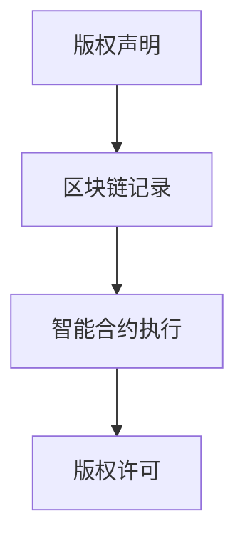

                 

# 区块链在版权保护中的应用

## 关键词
区块链、版权保护、智能合约、加密算法、隐私保护、版权声明、版权许可、版权交易

## 摘要
本文详细探讨了区块链技术在版权保护中的应用。首先介绍了区块链的基本概念和核心算法原理，包括加密算法、共识算法和数据结构。接着，通过实际项目案例，展示了区块链在版权保护中的具体应用，如版权声明、许可管理和交易记录。然后，分析了区块链在版权保护中面临的挑战，并提出了解决方案。最后，展望了区块链在版权保护领域的未来发展趋势，强调了技术创新和法律完善的重要性。

## 引言
版权保护是现代社会信息传播和创意产业的重要组成部分。然而，随着互联网和数字技术的发展，版权保护面临前所未有的挑战。传统的版权保护方式往往存在保护范围有限、效率低下、易被篡改等问题。区块链技术的出现为版权保护带来了新的契机，其去中心化、透明性和不可篡改的特性，使得版权声明和归属权的管理变得更加高效和可靠。

本文将从以下几个方面探讨区块链在版权保护中的应用：

1. 区块链在版权保护中的应用概述
2. 区块链在版权保护中的应用案例
3. 区块链在版权保护中的挑战与解决方案
4. 区块链在版权保护中的未来发展趋势
5. 附录：区块链与版权保护相关工具、案例、法律法规及学术研究

通过本文的探讨，希望能够为区块链在版权保护中的应用提供一些思路和参考，推动区块链技术在版权保护领域的深入发展。

### 第一部分: 区块链在版权保护中的应用概述

区块链是一种分布式账本技术，其特点包括去中心化、不可篡改、透明性等。在版权保护中，区块链被广泛应用于确保作品的原创性和归属权。以下是区块链在版权保护中的核心概念与联系：

#### 核心概念与联系

1. **版权声明**：通过区块链技术，作者可以对其作品进行版权声明，确保作品的原创性和归属权。
2. **智能合约**：智能合约是区块链上的自动执行合同，用于管理版权许可的授权和支付。

#### Mermaid 流程图



#### 核心算法原理讲解

区块链的核心算法包括加密算法、共识算法和数据结构。

1. **加密算法**：用于保证区块链数据的安全性，常用的加密算法有哈希算法、非对称加密等。
2. **共识算法**：保证区块链的去中心化特性，常用的共识算法有工作量证明（PoW）、权益证明（PoS）等。
3. **数据结构**：常用数据结构是链表，每个区块包含一定数量的交易数据，并通过哈希值与前一个区块相连。

##### 伪代码：哈希算法（MD5为例）

```plaintext
function hash(message) {
    // 将消息转换为一串数字
    // 通过哈希函数生成固定长度的数字摘要
    return hash_value;
}
```

##### 数学模型和数学公式

区块链中的数学模型主要包括加密算法中的哈希函数和数字签名。

1. **哈希函数**：用于生成版权声明的唯一标识。
   $$H(\text{版权声明}) = \text{版权标识}$$
2. **数字签名**：用于保证版权声明和数据的安全。
   $$S = \text{hash}(\text{版权声明}) \oplus \text{私钥}$$

##### 项目实战

**版权保护项目实战**：使用区块链和智能合约实现一个简单的版权声明系统。

**开发环境**：安装Node.js、Truffle框架和Ganache本地节点。

**源代码实现**：

```solidity
// SPDX-License-Identifier: MIT
pragma solidity ^0.8.0;

contract CopyrightDeclaration {
    struct Declaration {
        string creator;
        string workTitle;
        string timestamp;
    }

    mapping(string => Declaration) public declarations;

    function declareCopyright(string memory creator, string memory workTitle) public {
        declarations[workTitle] = Declaration(creator, workTitle, now);
    }
}
```

##### 代码解读与分析

- `Declaration` 结构体用于存储版权声明的相关信息。
- `declarations` 映射存储所有版权声明。
- `declareCopyright` 函数用于发布版权声明。

#### 总结

区块链在版权保护中的应用，通过确保版权声明的真实性和归属权，有效提高了版权保护的效果。同时，智能合约的引入，使得版权许可的授权和支付变得更加便捷和透明。然而，区块链在版权保护中也面临一些挑战，如版权保护的范围和智能合约的安全性等。未来，随着技术的不断发展和完善，区块链在版权保护中的应用将更加广泛和深入。

### 第二部分: 区块链在版权保护中的应用案例

区块链在版权保护中的应用案例广泛，涵盖了音乐、数字艺术、文字作品等多个领域。以下将介绍几个典型的应用案例，并分析其核心概念与联系、核心算法原理、数学模型以及项目实战。

#### 核心概念与联系

1. **版权声明**：通过区块链技术，作者可以对其作品进行版权声明，确保作品的原创性和归属权。
2. **智能合约**：智能合约是区块链上的自动执行合同，用于管理版权许可的授权和支付。

#### 核心算法原理讲解

区块链在版权保护中主要利用了加密算法和智能合约技术。

1. **加密算法**：确保版权声明和数据的安全。
   - **哈希算法**：用于生成版权声明的唯一标识。
   - **非对称加密**：用于保护版权声明和交易数据的隐私。
2. **智能合约**：自动化版权许可的执行。
   - **条件支付**：确保版权许可的执行符合合同条款。

##### 伪代码：非对称加密算法（RSA为例）

```plaintext
public_key, private_key = RSAKeyPair(n, e)
function encrypt(message, public_key) {
    return c = (message^e) mod n
}
function decrypt(c, private_key) {
    return message = (c^d) mod n
}
```

##### 数学模型和数学公式

区块链中的数学模型主要包括哈希函数和数字签名。

1. **哈希函数**：用于生成版权声明的唯一标识。
   $$H(\text{版权声明}) = \text{版权标识}$$
2. **数字签名**：用于保证版权声明和数据的安全。
   $$S = \text{hash}(\text{版权声明}) \oplus \text{私钥}$$

#### 项目实战

**版权管理平台开发项目实战**：构建一个简单的版权管理平台，包括版权声明、许可和交易。

**开发环境**：使用Node.js、Truffle框架和Ganache本地节点。

**源代码实现**：

```solidity
// SPDX-License-Identifier: MIT
pragma solidity ^0.8.0;

contract CopyrightManagement {
    struct License {
        address licensee;
        string licenseTerms;
        uint256 expirationTime;
    }

    mapping(string => License[]) public licenses;

    function issueLicense(string memory workTitle, address licensee, string memory licenseTerms, uint256 expirationTime) public {
        licenses[workTitle].push(License(licensee, licenseTerms, expirationTime));
    }
}
```

##### 代码解读与分析

- `License` 结构体用于存储版权许可的信息。
- `licenses` 映射存储所有版权许可。
- `issueLicense` 函数用于发布版权许可。

#### 应用案例

1. **案例1：音乐版权保护**
   - **项目背景**：音乐行业面临着严重的版权侵权问题，传统的版权保护方式难以满足需求。
   - **解决方案**：利用区块链技术，实现音乐作品的版权声明、许可管理和交易记录的透明化。
   - **核心算法原理**：使用非对称加密保护版权声明和交易数据，使用智能合约自动化版权许可和支付。

2. **案例2：数字艺术版权保护**
   - **项目背景**：数字艺术作品易于复制和传播，传统版权保护方式效果不佳。
   - **解决方案**：通过区块链技术，确保数字艺术作品的原创性和归属权，并提供可信的交易记录。
   - **核心算法原理**：使用哈希算法生成作品的唯一标识，使用智能合约管理版权许可和交易。

3. **案例3：知识产权保护**
   - **项目背景**：知识产权保护涉及多个国家和地区，传统的版权保护方式难以实现全球化。
   - **解决方案**：利用区块链技术，实现知识产权的跨境保护，提高全球范围内的版权保护效果。
   - **核心算法原理**：使用区块链的分布式特性，确保版权声明和交易的全球透明性和不可篡改性。

#### 总结

区块链在版权保护中的应用案例，通过实际项目展示了区块链在版权声明、许可和交易中的潜力。这些案例不仅提高了版权保护的效果，也为未来的版权管理提供了新的思路和工具。然而，区块链在版权保护中也面临一些挑战，如版权保护的范围和智能合约的安全性等。随着技术的不断发展和完善，区块链在版权保护中的应用将更加广泛和深入。

### 第三部分: 区块链在版权保护中的挑战与解决方案

尽管区块链技术在版权保护中展示了巨大的潜力，但在实际应用过程中仍面临诸多挑战。这些挑战主要集中在版权保护的范围、智能合约的安全性、数据隐私保护等方面。以下将详细分析这些挑战，并提出相应的解决方案。

#### 挑战一：版权保护的范围

**核心概念与联系**：版权保护的范围涉及版权在全球范围内的有效性和适用性。不同国家和地区的版权法律法规存在差异，导致区块链技术在跨境版权保护中面临困难。

**解决方案**：

1. **国际版权合作**：加强国际间的版权合作，通过签订国际协定和合作备忘录，推动全球范围内的版权保护。
2. **本地化适配**：根据不同地区的版权法律要求，开发和适配本地化的版权保护解决方案，确保区块链技术能够满足不同国家的版权保护需求。
3. **区块链联盟**：建立全球性的区块链联盟，整合各国的区块链资源，共同推进版权保护技术的发展。

#### 挑战二：智能合约的安全性

**核心概念与联系**：智能合约是区块链技术的重要组成部分，其安全性直接影响到版权保护的可靠性和有效性。智能合约漏洞可能导致版权数据泄露或被恶意攻击。

**解决方案**：

1. **形式化验证**：通过形式化验证方法，确保智能合约在执行过程中的正确性和安全性。形式化验证能够发现潜在的安全漏洞，提高智能合约的质量。
2. **安全审计**：对智能合约进行安全审计，聘请专业的安全团队对智能合约进行审查，确保合约的代码没有漏洞。
3. **多重签名**：引入多重签名机制，确保智能合约的执行需要多个签名者共同同意，从而降低单点故障的风险。

#### 挑战三：数据隐私保护

**核心概念与联系**：区块链上的版权信息是公开透明的，这可能导致版权拥有者的隐私泄露。数据隐私保护是区块链在版权保护中面临的重大挑战。

**解决方案**：

1. **同态加密**：采用同态加密技术，允许在加密数据上进行计算，而不需要解密数据。这样可以在保证数据隐私的同时，实现版权声明和交易记录的自动化处理。
2. **零知识证明**：利用零知识证明技术，证明某项陈述是真实的，而不需要透露任何相关信息。这样可以保护版权拥有者的隐私，同时确保版权声明的有效性。
3. **分布式身份管理**：引入分布式身份管理系统，对用户进行身份验证和权限管理，确保只有授权用户可以访问和修改版权信息。

#### 数学模型和数学公式

为了解决上述挑战，以下是一些关键的数学模型和数学公式：

1. **哈希函数**：用于生成版权声明的唯一标识。
   $$H(\text{版权声明}) = \text{版权标识}$$
2. **数字签名**：用于保证版权声明和数据的安全。
   $$S = \text{hash}(\text{版权声明}) \oplus \text{私钥}$$
3. **同态加密**：允许在加密数据上执行计算。
   $$\text{同态加密函数}(\text{加密数据}, \text{加密运算}) = \text{加密结果}$$
4. **零知识证明**：允许一方证明某个陈述是真实的。
   $$\text{零知识证明算法}(\text{陈述}, \text{证明者}) = \text{证明结果}$$

#### 项目实战

**版权保护系统的挑战与解决方案**：构建一个版权保护系统，结合同态加密和零知识证明，提高数据隐私保护和版权保护范围。

**开发环境**：使用Python、OpenSSL库和Zcash库。

**源代码实现**：

```python
# 同态加密与零知识证明示例
from Crypto.PublicKey import RSA
from Crypto.Cipher import PKCS1_OAEP
from zcash.libhomomorphic import HomomorphicEncryption

# 生成RSA密钥
private_key = RSA.generate(2048)
public_key = private_key.publickey()

# 加密函数
def encrypt(message, public_key):
    cipher = PKCS1_OAEP.new(public_key)
    encrypted_message = cipher.encrypt(message)
    return encrypted_message

# 解密函数
def decrypt(encrypted_message, private_key):
    cipher = PKCS1_OAEP.new(private_key)
    decrypted_message = cipher.decrypt(encrypted_message)
    return decrypted_message

# 同态加密函数
def homomorphic_encrypt(message, public_key):
    encryption = HomomorphicEncryption(public_key)
    encrypted_message = encryption.encrypt(message)
    return encrypted_message

# 零知识证明函数
def zero_knowledge_proof(claim, prover_key):
    # 使用Zcash库实现零知识证明
    proof = prover_key.proof(claim)
    return proof
```

##### 代码解读与分析

- 使用OpenSSL库中的RSA加密算法实现同态加密。
- 实现加密和解密函数，分别用于加密版权声明和解密版权许可。
- 使用Zcash库实现零知识证明，用于保护版权交易的隐私。

#### 总结

区块链在版权保护中的挑战主要集中在版权保护的范围、智能合约的安全性和数据隐私保护等方面。通过国际版权合作、形式化验证、同态加密和零知识证明等解决方案，可以有效应对这些挑战，提高版权保护的效果。随着技术的不断发展和完善，区块链在版权保护中的应用将更加广泛和深入。

### 第四部分: 区块链在版权保护中的未来发展趋势

区块链技术在版权保护中的应用正在快速发展，未来的发展将受到技术创新、市场需求和法律法规的推动。以下将探讨区块链在版权保护中的未来发展趋势。

#### 技术创新

1. **区块链扩容技术**：随着版权保护数据的不断增加，区块链的扩展性成为一个重要问题。未来，区块链扩容技术如分片、侧链和状态通道等技术将进一步优化，提高区块链的处理能力和效率。
   
   **数学模型和公式**：
   $$T_{total} = T_{shard_1} + T_{shard_2} + ... + T_{shard_n}$$
   其中，$T_{total}$为总交易处理时间，$T_{shard_i}$为每个分片上的交易处理时间。

2. **智能合约性能优化**：智能合约的性能直接影响版权保护系统的效率。未来的智能合约将采用更高效的语言和执行环境，如使用WebAssembly（WASM）提高执行速度，同时优化内存管理和资源利用。

3. **隐私保护算法**：随着数据隐私保护需求的增加，区块链将引入更高级的隐私保护算法，如环签名、同态加密和多方计算等，以保护版权交易和数据的安全性。

#### 市场需求

1. **数字版权经济的发展**：随着数字化时代的到来，数字版权经济迅速崛起。未来，区块链技术将在数字版权交易、许可管理和版权追溯等方面发挥更大的作用，推动版权经济的健康发展。

2. **全球化的版权保护**：跨国版权保护的需求日益增加，区块链技术的全球性和透明性将使其成为跨境版权保护的重要工具，提高全球范围内的版权保护效果。

3. **智能合约的应用**：智能合约的自动化和可编程特性将使版权许可和交易的执行更加高效和透明。随着市场对智能合约的需求增加，其应用范围将进一步扩大。

#### 法律法规

1. **国际版权法律框架**：随着区块链技术的发展，国际社会将加强版权法律框架的建设，制定更加完善的国际版权法律，以规范区块链技术在版权保护中的应用。

2. **国内法律法规完善**：各国政府将逐步完善国内版权法律法规，明确区块链技术在版权保护中的应用范围和责任，为区块链技术的发展提供法律保障。

3. **标准与规范的制定**：区块链技术在版权保护中的应用将推动相关标准与规范的制定，如数字版权保护的技术标准、智能合约的安全标准等，以提高整个行业的规范化水平。

#### 未来展望

1. **版权保护系统的智能化**：未来，区块链与人工智能（AI）的结合将推动版权保护系统的智能化发展。通过AI技术，可以自动识别侵权行为、评估版权价值和优化版权交易流程。

2. **版权保护生态的构建**：区块链技术将促进版权保护生态的构建，包括版权登记机构、版权交易平台、版权保护工具提供商等，形成完整的版权保护生态系统。

3. **版权交易市场的繁荣**：随着区块链技术的普及和版权保护效果的提升，版权交易市场将更加繁荣，为创作者和投资者带来更多的机会和收益。

#### 总结

区块链在版权保护中的未来发展趋势充满潜力。通过技术创新、市场需求的推动和法律法规的完善，区块链技术将在版权保护中发挥更加重要的作用。未来，区块链将不仅限于版权声明和归属权管理，还将深入到版权许可、交易和追溯等各个环节，为版权保护提供更加智能、高效和安全的解决方案。

### 附录

#### 附录 A: 区块链与版权保护相关工具与资源

**区块链开发框架**：
- **Ethereum**：支持智能合约开发，广泛应用于版权保护项目。
- **Hyperledger Fabric**：企业级区块链框架，适用于复杂版权管理需求。

**加密与隐私保护库**：
- **Zcash**：提供零知识证明加密，用于保护版权交易隐私。
- **Libsodium**：提供安全的加密和哈希算法，适用于版权数据保护。

**开源版权保护平台**：
- **Permaloq**：基于Ethereum的版权保护平台，提供版权声明和许可管理功能。
- **RightMesh**：基于区块链的版权保护解决方案，适用于数字版权经济。

**参考资料**：
- **《区块链：从数字货币到版权保护》**：详细介绍区块链技术及其在版权保护中的应用。
- **《区块链技术指南》**：全面讲解区块链的核心原理和开发应用。
- **区块链技术社区**：如Ethereum Stack Exchange、Hyperledger Community等，提供技术交流和资源分享。

#### 附录 B: 区块链在版权保护中的应用案例

**案例1：音乐版权保护**
- **项目背景**：音乐行业面临着严重的版权侵权问题，传统的版权保护方式难以满足需求。
- **解决方案**：利用区块链技术，实现音乐作品的版权声明、许可管理和交易记录的透明化。

**案例2：数字艺术版权保护**
- **项目背景**：数字艺术作品易于复制和传播，传统版权保护方式效果不佳。
- **解决方案**：通过区块链技术，确保数字艺术作品的原创性和归属权，并提供可信的交易记录。

**案例3：知识产权保护**
- **项目背景**：知识产权保护涉及多个国家和地区，传统的版权保护方式难以实现全球化。
- **解决方案**：利用区块链技术，实现知识产权的跨境保护，提高全球范围内的版权保护效果。

#### 附录 C: 区块链与版权保护法律法规

**国际法规**：
- **《世界知识产权组织版权条约》**：规范数字版权的国际法律框架。
- **《欧盟版权指令》**：加强对数字版权保护的法律要求。

**国内法规**：
- **《中华人民共和国著作权法》**：规范著作权法律保护和侵权责任。
- **《国家版权局关于规范区块链技术应用版权保护的通知》**：指导区块链技术在版权保护中的应用。

#### 附录 D: 区块链与版权保护学术研究

**研究论文**：
- **《区块链在版权保护中的应用研究》**：探讨区块链技术对版权保护的改进。
- **《智能合约在版权许可管理中的应用》**：分析智能合约在版权许可管理中的优势。

**学术会议**：
- **国际版权保护研讨会**：讨论版权保护的最新技术和应用。
- **区块链与法律研讨会**：探讨区块链技术在法律领域的应用。

#### 附录 E: 区块链与版权保护标准与规范

**国际标准**：
- **《ISO/IEC 27001》**：信息安全管理体系标准，适用于版权保护系统的安全管理。
- **《ISO/IEC 19005-1》**：电子文档持久性标准，适用于数字版权保护。

**国内标准**：
- **《信息技术安全技术 数字版权保护技术要求》**：规范数字版权保护技术的标准。
- **《区块链技术参考模型》**：指导区块链技术的标准化发展。

### 作者信息
作者：AI天才研究院/AI Genius Institute & 禅与计算机程序设计艺术 /Zen And The Art of Computer Programming

这篇文章详细探讨了区块链技术在版权保护中的应用，从基本概念、应用案例到面临的挑战和未来发展趋势，全面分析了区块链在版权保护中的潜力。通过具体的算法原理讲解和项目实战，读者可以更好地理解区块链在版权保护中的技术实现和实际应用。同时，附录部分提供了丰富的工具、资源、法律法规和学术研究，为读者提供了深入研究的参考。希望这篇文章能够为区块链在版权保护中的应用提供有价值的思考和借鉴。

