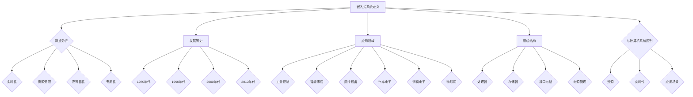

                 

# 华为2024校招嵌入式软件工程师面试题汇总

> **关键词：** 华为校招、嵌入式软件工程师、面试题、技术解析、编程实践

> **摘要：** 本文详细整理了华为2024校招嵌入式软件工程师的面试题，涵盖了嵌入式系统概述、处理器架构、软件开发环境、硬件设计、编程、安全和项目实战等多个方面。通过本文，读者可以全面了解嵌入式软件工程师所需掌握的知识点，并为即将参加华为校招的同学提供有针对性的备考建议。

### 第1章 嵌入式系统概述

#### 1.1 嵌入式系统的定义与特点

嵌入式系统是一种专用的计算机系统，其核心是嵌入式处理器（CPU）和各种外部设备的接口电路。它们通常用于控制、监测或处理特定的任务，如工业自动化、智能家居、医疗设备和汽车电子等。

**特点：**

1. **实时性**：嵌入式系统通常需要处理实时任务，保证任务在规定的时间内完成。
2. **资源受限**：嵌入式系统资源有限，包括内存、处理能力和能量等。
3. **高可靠性**：嵌入式系统要求在恶劣环境下稳定运行，具有较高的可靠性。
4. **专用性**：嵌入式系统通常针对特定的应用进行定制，具有较高的专用性。

#### 1.2 嵌入式系统的发展历史

**1980年代**：嵌入式系统开始广泛应用于工业控制和通信领域。

**1990年代**：嵌入式系统在消费电子领域得到了广泛应用，如手机、家电等。

**2000年代**：随着嵌入式处理器性能的提升和无线通信技术的发展，嵌入式系统在物联网（IoT）领域得到广泛应用。

**2010年代**：嵌入式系统与人工智能、云计算等技术相结合，应用场景更加广泛。

#### 1.3 嵌入式系统的应用领域

1. **工业控制**：如数控机床、工业机器人等。
2. **智能家居**：如智能音箱、智能门锁等。
3. **医疗设备**：如心脏起搏器、血糖监测仪等。
4. **汽车电子**：如自动驾驶系统、车联网等。
5. **消费电子**：如手机、平板电脑等。
6. **物联网**：如智能家居、智能城市等。

#### 1.4 嵌入式系统的组成结构

1. **处理器**：嵌入式系统的核心，负责数据处理和控制。
2. **存储器**：包括内存和外部存储设备，用于存储程序和数据。
3. **接口电路**：包括GPIO、UART、SPI、I2C等，用于与其他设备通信。
4. **电源管理**：负责嵌入式系统的电源供应和能量管理。

#### 1.5 嵌入式系统与计算机系统的区别

**资源**：嵌入式系统资源受限，计算机系统资源丰富。

**实时性**：嵌入式系统通常需要处理实时任务，计算机系统实时性要求较低。

**应用场景**：嵌入式系统应用场景多样化，计算机系统主要用于办公、娱乐等。

### Mermaid 流程图

### 总结

本章对嵌入式系统的定义、特点、发展历史、应用领域、组成结构和与计算机系统的区别进行了详细讲解。通过本章的学习，读者可以全面了解嵌入式系统的基本概念和特点，为后续章节的学习打下基础。在接下来的章节中，我们将进一步探讨嵌入式处理器的架构、软件开发环境、硬件设计、编程、安全和项目实战等方面的内容。|>

