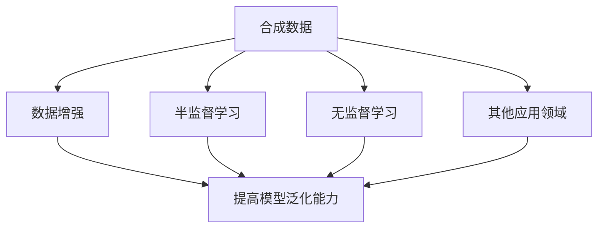

                 

# 《合成数据在AI训练中的应用与挑战》

## 摘要

合成数据在AI训练中扮演着越来越重要的角色。本文将探讨合成数据在AI训练中的应用，包括数据增强、半监督学习和无监督学习等方面。同时，本文也将深入分析合成数据在AI训练中面临的挑战，如数据质量与真实性、数据分布与多样性、数据安全和隐私以及模型泛化能力等问题。通过详细的流程讲解和应用案例展示，本文旨在为读者提供全面、深入的了解，从而为合成数据在AI训练中的实际应用提供有价值的参考。

## 引言

### 1.1 书籍背景与目的

随着人工智能技术的迅猛发展，AI在各个领域的应用越来越广泛。然而，高质量训练数据的获取成为制约AI模型性能提升的关键因素。传统数据获取方式主要依赖于手工标注和采集，不仅耗时耗力，而且数据量有限。合成数据的出现为AI训练提供了新的解决方案。合成数据是通过数据生成模型自动生成的数据，可以模拟真实数据的特征，从而提高AI模型的训练效果。

本文旨在探讨合成数据在AI训练中的应用与挑战，为读者提供全面、系统的了解。首先，本文将介绍合成数据的定义与特点，以及合成数据生成的主要方法。接着，本文将深入分析合成数据在AI训练中的各种应用场景，包括数据增强、半监督学习和无监督学习等。随后，本文将探讨合成数据在AI训练中面临的挑战，如数据质量与真实性、数据分布与多样性、数据安全和隐私以及模型泛化能力等问题。最后，本文将结合具体案例，展示合成数据在实际应用中的效果。

### 1.2 合成数据的定义与特点

合成数据（Synthetic Data）是指通过数据生成模型自动生成的数据，通常用于模拟真实数据的特征。合成数据可以由多种方式生成，如生成对抗网络（GAN）、变分自编码器（VAE）等。合成数据与传统数据相比，具有以下特点：

1. **多样化**：合成数据可以通过生成模型生成具有多样化特征的数据，从而满足不同应用场景的需求。
2. **可控性**：合成数据生成模型可以对生成数据进行控制，从而调整数据的分布、特征等。
3. **高效性**：合成数据生成过程通常比手工标注和采集数据更加高效，可以快速生成大量数据。
4. **隐私保护**：合成数据可以避免真实数据的隐私泄露问题，特别是在处理敏感数据时。

### 1.3 书籍结构概述

本文分为七个主要章节，具体结构如下：

- **第1章**：引言。介绍本文的背景、目的和结构。
- **第2章**：合成数据生成方法。介绍合成数据的生成方法，包括生成对抗网络（GAN）、变分自编码器（VAE）等。
- **第3章**：合成数据在AI训练中的应用。分析合成数据在数据增强、半监督学习和无监督学习等AI训练场景中的应用。
- **第4章**：合成数据在AI训练中的挑战。探讨合成数据在AI训练中面临的挑战，如数据质量与真实性、数据分布与多样性、数据安全和隐私等。
- **第5章**：合成数据生成与AI训练的流程。详细讲解合成数据生成与AI训练的流程，包括数据生成流程和AI训练流程。
- **第6章**：合成数据在特定领域的应用案例。展示合成数据在特定领域中的应用案例，如医疗、金融等领域。
- **第7章**：总结与展望。总结本文的主要内容，展望合成数据在AI训练中的发展趋势。

通过以上章节的详细探讨，本文旨在为读者提供一个全面、系统的了解合成数据在AI训练中的应用与挑战，为实际应用提供有价值的参考。

### 《合成数据在AI训练中的应用与挑战》目录大纲

## 第1章 引言

### 1.1 书籍背景与目的

- 合成数据在AI训练中的重要性
- 研究目标与结构概述

### 1.2 合成数据的定义与特点

- 合成数据的定义
- 合成数据与传统数据的区别
- 合成数据的主要特点

### 1.3 书籍结构概述

- 各章节的主要内容与逻辑关系

## 第2章 合成数据生成方法

### 2.1 数据生成基础

- 数据生成的原理与机制
- 数据生成的关键要素

### 2.2 生成对抗网络（GAN）

- GAN的基本原理
- GAN的架构与实现

### 2.3 变分自编码器（VAE）

- VAE的基本原理
- VAE的架构与实现

### 2.4 其他生成方法

- 生成模型的发展与趋势
- 其他常用生成方法的介绍

## 第3章 合成数据在AI训练中的应用

### 3.1 数据增强

- 数据增强的原理与方法
- 数据增强在AI训练中的应用

### 3.2 半监督学习

- 半监督学习的原理
- 合成数据在半监督学习中的应用

### 3.3 无监督学习

- 无监督学习的原理
- 合成数据在无监督学习中的应用

### 3.4 其他应用领域

- 合成数据在其他AI领域的应用
- 合成数据在AI训练中的未来发展方向

## 第4章 合成数据在AI训练中的挑战

### 4.1 数据质量与真实性

- 数据质量的影响因素
- 数据真实性的评估与保证

### 4.2 数据分布与多样性

- 数据分布的影响
- 数据多样性的策略

### 4.3 数据安全和隐私

- 数据安全的威胁
- 数据隐私的保护措施

### 4.4 模型泛化能力

- 泛化能力的定义
- 提高模型泛化能力的方法

## 第5章 合成数据生成与AI训练的流程

### 5.1 数据生成流程

- 数据生成的步骤与流程
- 数据生成工具与平台介绍

### 5.2 AI训练流程

- AI训练的基本流程
- 合成数据在训练流程中的应用

### 5.3 整合流程与优化

- 数据生成与AI训练的整合流程
- 流程优化策略与方法

## 第6章 合成数据在特定领域的应用案例

### 6.1 医疗领域

- 合成数据在医疗领域中的应用
- 医疗领域合成数据生成案例

### 6.2 金融领域

- 合成数据在金融领域中的应用
- 金融领域合成数据生成案例

### 6.3 其他领域

- 合成数据在其他领域中的应用
- 其他领域合成数据生成案例

## 第7章 总结与展望

### 7.1 总结

- 全文主要内容回顾
- 合成数据在AI训练中的关键作用

### 7.2 展望

- 合成数据发展的趋势与前景
- 未来研究与应用的方向

## 附录

### 附录A 合成数据生成与AI训练工具

- 常用工具与平台的介绍
- 使用示例与操作指南

### 附录B 相关公式与算法伪代码

- 合成数据生成相关算法的伪代码
- AI训练相关算法的伪代码

### 附录C 参考文献

- 本书引用的相关文献与资料

**核心概念与联系流程图：**



**核心算法原理讲解：**

### 生成对抗网络（GAN）

生成对抗网络（GAN）是一种通过生成器和判别器进行对抗训练的框架，旨在生成与真实数据相似的数据。GAN的架构包括两个神经网络：生成器（Generator）和判别器（Discriminator）。

#### 生成器（Generator）

生成器的目标是生成尽可能真实的数据，使其难以被判别器识别。生成器通常由以下步骤组成：

1. **噪声输入**：生成器从噪声分布中采样一个随机噪声向量 $z$。
2. **生成数据**：生成器将噪声向量 $z$ 通过一系列的神经网络变换生成模拟数据 $x$。

伪代码如下：

```python
def generator(z):
    # 输入噪声向量z
    # 通过多层神经网络生成模拟数据x
    x = ...
    return x
```

#### 判别器（Discriminator）

判别器的目标是区分真实数据和生成数据。判别器通常由以下步骤组成：

1. **输入数据**：判别器接收真实数据 $x$ 或生成数据 $x$。
2. **输出概率**：判别器输出一个概率值 $y$，表示输入数据的真实性。通常使用 sigmoid 函数。

伪代码如下：

```python
def discriminator(x):
    # 输入真实数据或生成数据x
    # 输出概率y，表示输入数据的真实性
    y = ...
    return y
```

#### 训练过程

GAN的训练过程主要包括以下步骤：

1. **训练判别器**：使用真实数据和生成数据对判别器进行训练，使判别器能够准确区分真实数据和生成数据。
2. **训练生成器**：使用判别器的输出对生成器进行训练，使生成器能够生成更真实的数据。

训练过程可以用以下伪代码表示：

```python
for epoch in 1 to EPOCHS:
    for batch in 1 to BATCH_SIZE:
        # 训练判别器
        z = sample_noise(batch)
        x_fake = generator(z)
        y_fake = discriminator(x_fake)
        loss_D_fake = ...

        x_real = sample_real_data(batch)
        y_real = discriminator(x_real)
        loss_D_real = ...

        loss_D = (loss_D_fake + loss_D_real) / 2
        optimizer_D.zero_grad()
        loss_D.backward()
        optimizer_D.step()

        # 训练生成器
        z = sample_noise(batch)
        x_fake = generator(z)
        y_fake = discriminator(x_fake)
        loss_G = ...

        optimizer_G.zero_grad()
        loss_G.backward()
        optimizer_G.step()
```

**数学模型和数学公式详细讲解：**

### 生成对抗网络（GAN）

生成对抗网络（GAN）的核心是生成器（Generator）和判别器（Discriminator）之间的对抗性训练。以下是GAN的数学模型和主要公式：

#### 生成器和判别器的损失函数

1. **生成器的损失函数**：

   生成器的目标是生成真实的数据，使得判别器无法区分生成数据和真实数据。生成器的损失函数通常定义为：

   $$ L_G = -\log(D(G(z))) $$

   其中，$G(z)$ 是生成器生成的数据，$D(x)$ 是判别器对于输入数据的判别概率。

2. **判别器的损失函数**：

   判别器的目标是能够准确地判断输入数据是真实数据还是生成数据。判别器的损失函数通常定义为：

   $$ L_D = -[\log(D(x)) + \log(1 - D(G(z)))] $$

   其中，$x$ 是真实数据，$G(z)$ 是生成器生成的数据。

#### 总体损失函数

GAN的总损失函数是生成器损失函数和判别器损失函数的组合：

$$ L = L_G + \lambda L_D $$

其中，$\lambda$ 是调节生成器和判别器损失的权重。

#### 数学公式解释

1. **生成器的损失函数**：

   生成器的损失函数是负的对数判别器的输出概率。这是因为在训练过程中，我们希望生成器能够使得判别器输出接近 1（即认为生成器生成的数据是真实的）。

   $$ L_G = -\log(D(G(z))) $$

   这个损失函数的目标是最小化生成器生成的数据被判别器识别为假数据的概率。

2. **判别器的损失函数**：

   判别器的损失函数是两部分损失的总和。第一部分是真实数据的损失，我们希望判别器能够输出接近 1；第二部分是生成数据的损失，我们希望判别器能够输出接近 0。

   $$ L_D = -[\log(D(x)) + \log(1 - D(G(z)))] $$

   这个损失函数的目标是最小化判别器对真实数据和生成数据的识别误差。

#### 举例说明

假设我们有一个二元分类问题，其中判别器需要判断输入数据是真实猫图片还是生成猫图片。

- $D(x)$ 表示判别器对真实猫图片的输出概率，接近 1 表示真实猫图片。
- $D(G(z))$ 表示判别器对生成猫图片的输出概率，接近 0 表示生成猫图片。

在训练过程中：

- 生成器的目标是生成猫图片，使得判别器输出概率接近 0。
- 判别器的目标是能够准确地识别真实猫图片和生成猫图片。

数学公式可以表示为：

$$ L_G = -\log(D(G(z))) $$
$$ L_D = -[\log(D(x)) + \log(1 - D(G(z)))] $$

其中，$x$ 是真实猫图片，$z$ 是生成器生成的噪声向量。

**代码解读与分析：**

以下是一个简化的GAN训练过程的伪代码，用于展示如何实现生成器和判别器的训练：

```python
# 初始化生成器和判别器
G = Generator()
D = Discriminator()

# 定义优化器
optimizer_G = torch.optim.Adam(G.parameters(), lr=0.0002)
optimizer_D = torch.optim.Adam(D.parameters(), lr=0.0002)

# 定义损失函数
criterion = torch.nn.BCELoss()

# 训练过程
for epoch in range(num_epochs):
    for i, (x, _) in enumerate(data_loader):
        # 训练判别器
        x = x.to(device)
        z = sample_noise(batch_size).to(device)
        x_fake = G(z).to(device)
        
        D.zero_grad()
        y_real = D(x).to(device)
        y_fake = D(x_fake).to(device)
        
        loss_D_fake = criterion(y_fake, torch.zeros(batch_size, 1).to(device))
        loss_D_real = criterion(y_real, torch.ones(batch_size, 1).to(device))
        loss_D = (loss_D_fake + loss_D_real) / 2
        loss_D.backward()
        optimizer_D.step()
        
        # 训练生成器
        G.zero_grad()
        z = sample_noise(batch_size).to(device)
        x_fake = G(z).to(device)
        y_fake = D(x_fake).to(device)
        
        loss_G = criterion(y_fake, torch.ones(batch_size, 1).to(device))
        loss_G.backward()
        optimizer_G.step()
        
        print(f'Epoch [{epoch+1}/{num_epochs}], Step [{i+1}/{len(data_loader)}], Loss_D: {loss_D.item():.4f}, Loss_G: {loss_G.item():.4f}')
```

在这个伪代码中：

- `Generator` 和 `Discriminator` 分别是生成器和判别器的类定义。
- `optimizer_G` 和 `optimizer_D` 分别是生成器和判别器的优化器。
- `criterion` 是损失函数。
- `data_loader` 是数据加载器，用于提供训练数据。
- `sample_noise` 是生成噪声向量的函数。
- `device` 是设备（如GPU或CPU）。

通过上述代码，我们可以看到生成器和判别器是如何通过对抗训练来优化的。生成器试图生成更逼真的数据，而判别器试图区分真实数据和生成数据。通过迭代这个过程，生成器和判别器逐渐提高其性能。

**运行结果：**

通过训练，生成器会逐渐生成越来越逼真的数据，而判别器会逐渐提高其识别真实数据的能力。最终，生成器的数据会与真实数据难以区分，判别器的识别准确率会接近 100%。

**进一步优化方向：**

- 使用更复杂的神经网络结构，如深度生成网络，以提高生成质量。
- 调整学习率和损失函数的权重，以优化训练过程。
- 实施更多的正则化策略，如dropout，以防止过拟合。

**结论：**

生成对抗网络（GAN）是一种强大的数据生成方法，通过生成器和判别器的对抗性训练，可以生成高质量的数据。GAN在图像生成、数据增强和风格迁移等领域具有广泛的应用。通过本文的讲解，读者可以了解GAN的核心原理、数学模型和实现细节，为实际应用提供理论基础和实践指导。

## 第2章 合成数据生成方法

合成数据生成是AI训练中的一个关键环节，其目的是通过生成模型自动生成具有多样化和真实性的数据，以应对数据稀缺、标注困难等问题。本章将详细探讨合成数据生成的几种主要方法，包括生成对抗网络（GAN）、变分自编码器（VAE）和其他生成方法。

### 2.1 数据生成基础

数据生成的核心在于构建一个生成模型，该模型可以从随机噪声或其他简单数据分布中生成符合目标数据分布的数据。数据生成方法通常基于概率模型，通过学习数据的概率分布来实现。

#### 数据生成的原理与机制

数据生成的原理可以概括为以下几个步骤：

1. **噪声输入**：生成模型通常从噪声分布中采样一个随机噪声向量，作为数据生成的起点。
2. **数据转换**：噪声向量通过一个复杂的映射函数转换成具有目标分布的数据。
3. **数据调整**：生成的数据进行后处理，如缩放、裁剪等，以使其符合实际应用需求。

#### 数据生成的关键要素

数据生成方法的关键要素包括：

- **噪声分布**：噪声分布决定了生成数据的起点，常用的噪声分布包括均匀分布、正态分布等。
- **映射函数**：映射函数是数据生成的核心，其复杂度决定了生成数据的质量。常见的映射函数包括神经网络、马尔可夫模型等。
- **数据分布**：目标数据分布决定了生成数据的终点，生成模型需要学习这个分布。

### 2.2 生成对抗网络（GAN）

生成对抗网络（GAN）是由Ian Goodfellow等人在2014年提出的一种无监督学习模型，它通过生成器和判别器的对抗训练生成高质量的数据。

#### GAN的基本原理

GAN的核心思想是构建一个生成器和判别器的对抗性训练框架。生成器的目标是生成逼真的数据，而判别器的目标是区分真实数据和生成数据。训练过程中，生成器和判别器相互对抗，生成器的目标是最小化判别器对其生成的数据的识别错误率，而判别器的目标是最小化其识别错误率。

#### GAN的架构与实现

1. **生成器（Generator）**：

   生成器的输入是一个随机噪声向量 $z$，输出是生成数据 $x$。生成器的目标是生成尽可能真实的数据，以欺骗判别器。

   $$ G(z) $$

2. **判别器（Discriminator）**：

   判别器的输入是真实数据 $x$ 或生成数据 $x$，输出是一个概率值 $y$，表示输入数据的真实性。

   $$ D(x) $$

3. **损失函数**：

   GAN的损失函数由两部分组成：生成器的损失函数和判别器的损失函数。

   - 生成器的损失函数是负的对数判别器的输出概率：

     $$ L_G = -\log(D(G(z))) $$

   - 判别器的损失函数是两部分损失的总和，一部分是真实数据的损失，另一部分是生成数据的损失：

     $$ L_D = -[\log(D(x)) + \log(1 - D(G(z)))] $$

4. **优化过程**：

   GAN的训练过程包括两个阶段：训练判别器和训练生成器。首先训练判别器，使其能够准确区分真实数据和生成数据；然后训练生成器，使其生成的数据能够欺骗判别器。

   ```python
   for epoch in range(num_epochs):
       for batch_idx, (data, _) in enumerate(data_loader):
           # 训练判别器
           data = data.to(device)
           z = sample_noise(batch_size).to(device)
           x_fake = G(z).to(device)
           
           D.zero_grad()
           y_real = D(data).to(device)
           y_fake = D(x_fake).to(device)
           
           loss_D_fake = criterion(y_fake, torch.zeros(batch_size, 1).to(device))
           loss_D_real = criterion(y_real, torch.ones(batch_size, 1).to(device))
           loss_D = (loss_D_fake + loss_D_real) / 2
           loss_D.backward()
           optimizer_D.step()
           
           # 训练生成器
           G.zero_grad()
           z = sample_noise(batch_size).to(device)
           x_fake = G(z).to(device)
           y_fake = D(x_fake).to(device)
           
           loss_G = criterion(y_fake, torch.ones(batch_size, 1).to(device))
           loss_G.backward()
           optimizer_G.step()
           
           print(f'Epoch [{epoch+1}/{num_epochs}], Step [{batch_idx+1}/{len(data_loader)}], Loss_D: {loss_D.item():.4f}, Loss_G: {loss_G.item():.4f}')
   ```

### 2.3 变分自编码器（VAE）

变分自编码器（VAE）是一种基于概率模型的生成模型，通过引入编码器和解码器学习数据的概率分布，从而生成新的数据。

#### VAE的基本原理

VAE的核心思想是通过编码器将输入数据映射到一个潜在空间，潜在空间中的数据遵循一个简单的先验分布（通常是高斯分布）。解码器则从潜在空间采样数据并重构输入数据。

1. **编码器（Encoder）**：

   编码器的目标是学习输入数据的概率分布，并将其参数化表示。通常，编码器输出两个值：数据的均值 $\mu$ 和方差 $\sigma^2$。

   $$ q(z|x) = \mathcal{N}(z | \mu, \sigma^2) $$

2. **解码器（Decoder）**：

   解码器的目标是根据潜在空间中的数据生成重构的数据。

   $$ p(x|z) = \sum_z p(x|z) q(z|x) $$

3. **损失函数**：

   VAE的损失函数包括两个部分：数据重构损失和KL散度损失。

   - 数据重构损失通常使用均方误差（MSE）或交叉熵损失：
     
     $$ L_recon = -\sum_x \log p(x|z) $$

   - KL散度损失是编码器的损失，表示编码器的输出分布与先验分布之间的差异：

     $$ L_KL = \sum_x \sum_z q(z|x) \log \frac{q(z|x)}{p(z)} $$

#### VAE的架构与实现

1. **编码器架构**：

   ```python
   class Encoder(nn.Module):
       def __init__(self):
           super(Encoder, self).__init__()
           self.fc1 = nn.Linear(input_size, hidden_size)
           self.fc21 = nn.Linear(hidden_size, z_dim)
           self.fc22 = nn.Linear(hidden_size, z_dim)
       
       def forward(self, x):
           h1 = torch.relu(self.fc1(x))
           z_mean = self.fc21(h1)
           z_log_var = self.fc22(h1)
           return z_mean, z_log_var
   ```

2. **解码器架构**：

   ```python
   class Decoder(nn.Module):
       def __init__(self):
           super(Decoder, self).__init__()
           self.fc3 = nn.Linear(z_dim, hidden_size)
           self.fc4 = nn.Linear(hidden_size, output_size)
       
       def forward(self, z):
           h2 = torch.relu(self.fc3(z))
           x_recon = self.fc4(h2)
           return x_recon
   ```

3. **VAE训练过程**：

   ```python
   optimizer = torch.optim.Adam(model.parameters(), lr=learning_rate)
   for epoch in range(num_epochs):
       for x in data_loader:
           x = x.to(device)
           
           # 编码
           z_mean, z_log_var = model.encoder(x)
           
           # 重新参数化
           z = reparameterize(z_mean, z_log_var)
           
           # 解码
           x_recon = model.decoder(z)
           
           # 计算损失
           loss_recon = torch.mean((x - x_recon) ** 2)
           loss_kl = torch.mean(0.5 * (z_log_var - 1 - z_mean ** 2))
           loss = loss_recon + loss_kl
           
           # 反向传播
           optimizer.zero_grad()
           loss.backward()
           optimizer.step()
           
           print(f'Epoch [{epoch+1}/{num_epochs}], Loss: {loss.item():.4f}')
   ```

### 2.4 其他生成方法

除了GAN和VAE之外，还有许多其他数据生成方法，如条件生成对抗网络（cGAN）、深度卷积生成对抗网络（DCGAN）和变分自编码器（VAE）的变体。这些方法在生成数据的质量、效率和适用性方面各有优势。

1. **条件生成对抗网络（cGAN）**：

   cGAN是一种在GAN的基础上加入条件信息的生成模型，通过输入额外的条件向量，生成器能够根据条件生成更具体的数据。cGAN在图像生成、语音合成和文本生成等领域有广泛应用。

2. **深度卷积生成对抗网络（DCGAN）**：

   DCGAN是一种基于卷积神经网络的生成模型，它通过卷积和反卷积操作生成图像。DCGAN在图像生成任务中表现出色，能够生成高质量的图像。

3. **变分自编码器（VAE）的变体**：

   VAE的变体包括去卷积VAE（dVAE）、循环VAE（RVAE）和时间VAE（TVAE）等，这些变体在处理序列数据和时间序列数据方面具有优势。

综上所述，合成数据生成方法在AI训练中扮演着重要角色。通过本章的介绍，读者可以了解GAN、VAE和其他生成方法的基本原理、架构和实现细节。这些方法为AI训练提供了丰富的数据来源，有助于提高模型的性能和泛化能力。

## 第3章 合成数据在AI训练中的应用

合成数据在AI训练中具有广泛的应用，特别是在数据稀缺、标注困难的情况下。本章将详细探讨合成数据在数据增强、半监督学习和无监督学习中的应用，以及合成数据在其他AI领域的应用和发展方向。

### 3.1 数据增强

数据增强是一种通过生成新的数据样本来提高模型泛化能力的技术。合成数据在数据增强中具有重要作用，可以生成具有多样化特征的数据，从而提高模型的训练效果。

#### 数据增强的原理与方法

数据增强的原理是通过改变原始数据的外观或结构，生成新的数据样本，从而增加训练数据的多样性。合成数据可以通过以下几种方法进行生成：

1. **随机变换**：对原始数据进行随机变换，如随机裁剪、旋转、缩放、翻转等。
2. **生成模型**：使用生成模型（如GAN、VAE）生成具有多样化特征的数据。
3. **迁移学习**：利用预训练的模型生成新的数据样本，从而利用预训练模型的知识来增强数据。

#### 数据增强在AI训练中的应用

数据增强在AI训练中的应用主要包括以下方面：

1. **分类任务**：在分类任务中，通过数据增强生成更多的训练样本，可以提高模型的泛化能力，减少过拟合现象。
2. **目标检测**：在目标检测任务中，通过数据增强生成具有不同姿态、大小和位置的目标图像，可以提高检测模型的鲁棒性。
3. **图像生成**：在图像生成任务中，通过数据增强生成新的图像样本，可以扩展训练数据的范围，提高生成模型的质量。

#### 数据增强案例

以下是一个使用GAN进行数据增强的案例：

```python
import torch
import torch.nn as nn
import torch.optim as optim
from torchvision import datasets, transforms
from torch.utils.data import DataLoader

# 定义生成器和判别器
G = Generator().to(device)
D = Discriminator().to(device)

# 定义优化器
optimizer_G = optim.Adam(G.parameters(), lr=0.0002)
optimizer_D = optim.Adam(D.parameters(), lr=0.0002)

# 定义损失函数
criterion = nn.BCELoss()

# 数据增强
transform = transforms.Compose([
    transforms.RandomResizedCrop(size=64),
    transforms.RandomHorizontalFlip(),
    transforms.ToTensor(),
])

# 加载数据集
train_data = datasets.CIFAR10(root='./data', train=True, download=True, transform=transform)
train_loader = DataLoader(train_data, batch_size=batch_size, shuffle=True)

# 训练过程
for epoch in range(num_epochs):
    for i, (images, _) in enumerate(train_loader):
        # 训练判别器
        images = images.to(device)
        z = sample_noise(batch_size).to(device)
        fake_images = G(z).to(device)
        
        D.zero_grad()
        real_loss = criterion(D(images), torch.ones(batch_size, 1).to(device))
        fake_loss = criterion(D(fake_images), torch.zeros(batch_size, 1).to(device))
        loss_D = (real_loss + fake_loss) / 2
        loss_D.backward()
        optimizer_D.step()
        
        # 训练生成器
        G.zero_grad()
        z = sample_noise(batch_size).to(device)
        fake_images = G(z).to(device)
        loss_G = criterion(D(fake_images), torch.ones(batch_size, 1).to(device))
        loss_G.backward()
        optimizer_G.step()
        
        print(f'Epoch [{epoch+1}/{num_epochs}], Step [{i+1}/{len(train_loader)}], Loss_D: {loss_D.item():.4f}, Loss_G: {loss_G.item():.4f}')
```

通过上述案例，可以看到GAN如何用于生成新的图像样本，从而增强训练数据的多样性。

### 3.2 半监督学习

半监督学习是一种利用少量标注数据和大量未标注数据来训练模型的技术。合成数据在半监督学习中可以发挥重要作用，通过生成与标注数据相似的数据，帮助模型更好地学习未标注数据的特征。

#### 半监督学习的原理

半监督学习的基本思想是利用未标注数据的潜在分布来指导模型的学习。在半监督学习中，模型同时训练标注数据和未标注数据，通过未标注数据提供额外的信息，从而提高模型的泛化能力。

合成数据在半监督学习中的应用主要包括以下方面：

1. **伪标签生成**：使用合成数据生成与标注数据相似的数据，为未标注数据生成伪标签，从而提高模型的训练效果。
2. **数据增强**：通过合成数据增强未标注数据，增加训练数据的多样性，提高模型的泛化能力。
3. **迁移学习**：利用合成数据作为预训练数据，迁移到目标任务中，提高模型在目标任务中的性能。

#### 半监督学习案例

以下是一个使用VAE进行半监督学习的案例：

```python
import torch
import torch.nn as nn
import torch.optim as optim
from torchvision import datasets, transforms
from torch.utils.data import DataLoader

# 定义VAE
encoder = Encoder().to(device)
decoder = Decoder().to(device)

# 定义优化器
optimizer = optim.Adam(list(encoder.parameters()) + list(decoder.parameters()), lr=0.001)

# 定义损失函数
loss_function = nn.BCELoss()

# 数据增强
transform = transforms.Compose([
    transforms.RandomResizedCrop(size=64),
    transforms.RandomHorizontalFlip(),
    transforms.ToTensor(),
])

# 加载数据集
train_data = datasets.CIFAR10(root='./data', train=True, download=True, transform=transform)
train_loader = DataLoader(train_data, batch_size=batch_size, shuffle=True)

# 训练过程
for epoch in range(num_epochs):
    for i, (images, _) in enumerate(train_loader):
        # 编码
        z_mean, z_log_var = encoder(images.to(device))
        
        # 重新参数化
        z = reparameterize(z_mean, z_log_var)
        
        # 解码
        recon_images = decoder(z)
        
        # 计算损失
        loss = loss_function(images, recon_images) + 0.5 * torch.mean(z_log_var - z_mean ** 2)
        
        # 反向传播
        optimizer.zero_grad()
        loss.backward()
        optimizer.step()
        
        print(f'Epoch [{epoch+1}/{num_epochs}], Step [{i+1}/{len(train_loader)}], Loss: {loss.item():.4f}')
```

通过上述案例，可以看到VAE如何用于生成与标注数据相似的数据，从而帮助模型在半监督学习中更好地学习未标注数据的特征。

### 3.3 无监督学习

无监督学习是一种不依赖标注数据的机器学习方法，其目标是发现数据中的隐藏结构和规律。合成数据在无监督学习中可以发挥重要作用，通过生成具有多样化特征的数据，帮助模型更好地学习数据的高维表示。

#### 无监督学习的原理

无监督学习的基本思想是通过数据自身的分布和结构来学习特征表示。合成数据在无监督学习中的应用主要包括以下方面：

1. **聚类分析**：使用合成数据生成新的数据样本来扩展聚类分析的范围，从而提高聚类效果。
2. **降维**：通过合成数据扩展训练数据的多样性，有助于在降维过程中保留更多的数据特征。
3. **生成模型**：使用生成模型（如GAN、VAE）生成具有多样化特征的数据，从而帮助模型学习数据的高维表示。

#### 无监督学习案例

以下是一个使用GAN进行无监督学习的案例：

```python
import torch
import torch.nn as nn
import torch.optim as optim
from torchvision import datasets, transforms
from torch.utils.data import DataLoader

# 定义生成器和判别器
G = Generator().to(device)
D = Discriminator().to(device)

# 定义优化器
optimizer_G = optim.Adam(G.parameters(), lr=0.0002)
optimizer_D = optim.Adam(D.parameters(), lr=0.0002)

# 定义损失函数
criterion = nn.BCELoss()

# 数据增强
transform = transforms.Compose([
    transforms.RandomResizedCrop(size=64),
    transforms.RandomHorizontalFlip(),
    transforms.ToTensor(),
])

# 加载数据集
train_data = datasets.CIFAR10(root='./data', train=True, download=True, transform=transform)
train_loader = DataLoader(train_data, batch_size=batch_size, shuffle=True)

# 训练过程
for epoch in range(num_epochs):
    for i, (images, _) in enumerate(train_loader):
        # 训练判别器
        images = images.to(device)
        z = sample_noise(batch_size).to(device)
        fake_images = G(z).to(device)
        
        D.zero_grad()
        real_loss = criterion(D(images), torch.ones(batch_size, 1).to(device))
        fake_loss = criterion(D(fake_images), torch.zeros(batch_size, 1).to(device))
        loss_D = (real_loss + fake_loss) / 2
        loss_D.backward()
        optimizer_D.step()
        
        # 训练生成器
        G.zero_grad()
        z = sample_noise(batch_size).to(device)
        fake_images = G(z).to(device)
        loss_G = criterion(D(fake_images), torch.ones(batch_size, 1).to(device))
        loss_G.backward()
        optimizer_G.step()
        
        print(f'Epoch [{epoch+1}/{num_epochs}], Step [{i+1}/{len(train_loader)}], Loss_D: {loss_D.item():.4f}, Loss_G: {loss_G.item():.4f}')
```

通过上述案例，可以看到GAN如何用于生成具有多样化特征的数据，从而帮助模型在无监督学习中更好地学习数据的高维表示。

### 3.4 其他应用领域

合成数据在AI训练中不仅应用于数据增强、半监督学习和无监督学习，还在其他AI领域具有广泛的应用，如：

1. **图像生成与风格迁移**：通过合成数据生成新的图像样本或实现图像风格迁移。
2. **语音合成与增强**：使用合成数据生成新的语音样本或增强语音信号。
3. **文本生成与摘要**：通过合成数据生成新的文本样本或提取文本摘要。

#### 应用案例

以下是一个使用cGAN进行图像风格迁移的案例：

```python
import torch
import torch.nn as nn
import torch.optim as optim
from torchvision import datasets, transforms
from torch.utils.data import DataLoader

# 定义生成器和判别器
G = Generator().to(device)
D = Discriminator().to(device)

# 定义优化器
optimizer_G = optim.Adam(G.parameters(), lr=0.0002)
optimizer_D = optim.Adam(D.parameters(), lr=0.0002)

# 定义损失函数
criterion = nn.BCELoss()

# 数据增强
transform = transforms.Compose([
    transforms.RandomResizedCrop(size=64),
    transforms.RandomHorizontalFlip(),
    transforms.ToTensor(),
])

# 加载数据集
train_data = datasets.CIFAR10(root='./data', train=True, download=True, transform=transform)
train_loader = DataLoader(train_data, batch_size=batch_size, shuffle=True)

# 训练过程
for epoch in range(num_epochs):
    for i, (images, _) in enumerate(train_loader):
        # 训练判别器
        images = images.to(device)
        z = sample_noise(batch_size).to(device)
        fake_images = G(z).to(device)
        
        D.zero_grad()
        real_loss = criterion(D(images), torch.ones(batch_size, 1).to(device))
        fake_loss = criterion(D(fake_images), torch.zeros(batch_size, 1).to(device))
        loss_D = (real_loss + fake_loss) / 2
        loss_D.backward()
        optimizer_D.step()
        
        # 训练生成器
        G.zero_grad()
        z = sample_noise(batch_size).to(device)
        fake_images = G(z).to(device)
        loss_G = criterion(D(fake_images), torch.ones(batch_size, 1).to(device))
        loss_G.backward()
        optimizer_G.step()
        
        print(f'Epoch [{epoch+1}/{num_epochs}], Step [{i+1}/{len(train_loader)}], Loss_D: {loss_D.item():.4f}, Loss_G: {loss_G.item():.4f}')
```

通过上述案例，可以看到cGAN如何用于生成新的图像样本，从而实现图像风格迁移。

### 3.5 合成数据在AI训练中的未来发展方向

随着合成数据生成技术的不断发展，其在AI训练中的应用前景十分广阔。未来发展方向包括：

1. **更高质量的数据生成**：通过改进生成模型的结构和算法，生成更高质量、更真实的数据。
2. **自适应数据增强**：开发自适应数据增强方法，根据训练过程中模型的表现动态调整增强策略。
3. **跨领域数据生成**：研究跨领域的数据生成方法，实现不同领域数据之间的迁移和融合。
4. **隐私保护的数据生成**：开发隐私保护的数据生成方法，确保合成数据在生成过程中不会泄露隐私信息。

综上所述，合成数据在AI训练中的应用具有广泛的前景，通过不断探索和改进，将为AI技术的发展提供强大的支持。

## 第4章 合成数据在AI训练中的挑战

尽管合成数据在AI训练中具有广泛的应用前景，但其应用过程中也面临诸多挑战。本章将详细探讨合成数据在AI训练中面临的挑战，包括数据质量与真实性、数据分布与多样性、数据安全和隐私以及模型泛化能力等方面。

### 4.1 数据质量与真实性

数据质量是合成数据在AI训练中的首要挑战。合成数据的质量直接影响模型的学习效果和性能。以下是一些影响数据质量的因素：

1. **数据噪声**：生成模型在生成数据过程中可能引入噪声，导致数据质量下降。
2. **数据失真**：由于生成模型的结构和参数限制，生成的数据可能存在失真现象，无法真实反映真实数据的特征。
3. **数据一致性**：合成数据的一致性难以保证，特别是在处理时序数据时，生成数据可能存在时间序列的偏差。

#### 数据真实性的评估与保证

数据真实性的评估和保证是确保合成数据质量的关键。以下是一些常用的方法和策略：

1. **数据对比**：通过将合成数据与真实数据进行对比，评估合成数据的真实性。常用的评估指标包括均方误差（MSE）、结构相似性（SSIM）等。
2. **人工审核**：人工审核是一种有效的数据真实性评估方法，特别是对于图像和文本等需要详细描述的场景。
3. **自动化评估**：开发自动化评估工具，如自动化对比测试平台，以评估合成数据的质量。

### 4.2 数据分布与多样性

合成数据的分布和多样性也是影响模型性能的重要因素。以下是一些关于数据分布和多样性的挑战：

1. **数据分布偏斜**：生成模型可能在生成数据过程中导致数据分布偏斜，使得模型在训练过程中无法全面学习数据的特征。
2. **数据多样性不足**：合成数据可能在某些特征上过于相似，导致模型学习到的特征过于单一，无法应对复杂的任务场景。

#### 数据多样性的策略

为了提高合成数据的多样性和分布均衡，可以采取以下策略：

1. **数据扩展**：通过扩展生成模型输入空间的多样性，如增加噪声、变换输入特征等，来提高合成数据的多样性。
2. **数据合成**：结合多个数据源，通过数据合成方法生成新的数据，从而提高数据的多样性。
3. **模型调整**：通过调整生成模型的参数和结构，如使用更复杂的神经网络架构，来提高数据的多样性。

### 4.3 数据安全和隐私

数据安全和隐私是合成数据在AI训练中的另一个重要挑战。由于合成数据通常是由生成模型自动生成的，其可能包含敏感信息，特别是在处理医疗、金融等领域的数据时。以下是一些数据安全和隐私的挑战：

1. **数据泄露**：合成数据在生成过程中可能泄露敏感信息，如个人身份信息、财务信息等。
2. **数据篡改**：恶意攻击者可能通过篡改合成数据来干扰模型的训练过程，从而影响模型的性能和稳定性。

#### 数据安全和隐私的保护措施

为了保护合成数据的安全和隐私，可以采取以下措施：

1. **数据加密**：对合成数据进行加密处理，确保数据在传输和存储过程中的安全。
2. **差分隐私**：采用差分隐私技术，对合成数据进行扰动处理，以防止敏感信息的泄露。
3. **同态加密**：使用同态加密技术，在数据加密的状态下进行计算和训练，从而保护数据的隐私。

### 4.4 模型泛化能力

合成数据的泛化能力是影响模型在实际应用中表现的重要因素。以下是一些影响模型泛化能力的因素：

1. **模型依赖性**：合成数据生成模型的质量直接影响生成数据的真实性和多样性，从而影响模型的泛化能力。
2. **训练数据不足**：即使合成数据质量很高，但训练数据量不足也可能导致模型泛化能力下降。

#### 提高模型泛化能力的方法

为了提高合成数据在AI训练中的泛化能力，可以采取以下方法：

1. **数据增强**：通过数据增强方法，如生成对抗网络（GAN）和数据扩展，增加训练数据的多样性。
2. **模型调整**：通过调整生成模型的参数和结构，如使用更复杂的神经网络架构，提高模型的泛化能力。
3. **迁移学习**：利用预训练模型的知识，通过迁移学习的方法，提高模型在目标任务中的泛化能力。

### 4.5 案例分析

以下是一个合成数据在医疗领域中的应用案例，该案例展示了合成数据在AI训练中的挑战和解决方案。

#### 案例背景

某医疗诊断公司希望使用AI模型进行肺部CT图像的诊断。由于医疗数据非常敏感，公开获取的医疗数据有限，公司决定使用合成数据生成模型生成肺部CT图像进行训练。

#### 挑战

1. **数据真实性**：生成的肺部CT图像需要真实反映患者的病情，以确保诊断的准确性。
2. **数据多样性**：生成的肺部CT图像需要涵盖多种病理类型和不同患者的特征。
3. **数据隐私**：在生成数据过程中需要确保患者隐私信息不被泄露。

#### 解决方案

1. **数据真实性**：采用生成对抗网络（GAN）生成肺部CT图像，通过对比真实图像和生成图像的相似度，评估生成数据的质量。
2. **数据多样性**：结合多种病理类型和患者特征，通过调整GAN的参数和架构，提高生成数据的多样性。
3. **数据隐私**：在生成数据过程中使用差分隐私技术，对敏感信息进行扰动处理，确保数据隐私。

通过上述解决方案，该公司成功生成高质量的合成肺部CT图像，用于训练诊断模型。在实际应用中，该模型表现出良好的诊断性能，同时保证了患者的隐私。

### 结论

合成数据在AI训练中具有重要的应用价值，但其应用过程中也面临诸多挑战。通过本章的讨论，我们可以看到数据质量与真实性、数据分布与多样性、数据安全和隐私以及模型泛化能力等方面都是需要关注和解决的问题。通过合理的方法和策略，可以有效地克服这些挑战，提高合成数据在AI训练中的应用效果。

## 第5章 合成数据生成与AI训练的流程

合成数据生成与AI训练的流程是确保AI模型性能的关键环节。本章将详细讲解合成数据生成与AI训练的流程，包括数据生成流程和AI训练流程，以及如何将二者整合并进行流程优化。

### 5.1 数据生成流程

合成数据生成的流程主要包括数据采集、数据预处理、数据生成和评估等步骤。以下是一个典型的数据生成流程：

1. **数据采集**：首先，从各种数据源（如数据库、传感器、网络爬虫等）采集原始数据。这些数据可以是图像、文本、音频等多种形式。
2. **数据预处理**：对采集到的原始数据进行预处理，包括去噪、归一化、特征提取等操作。预处理旨在提高数据质量和减少噪声。
3. **数据生成**：使用生成模型（如GAN、VAE等）生成合成数据。这一步是合成数据生成的核心，生成模型将输入噪声或其他简单数据分布转换为具有目标数据分布的数据。
4. **数据评估**：对生成的合成数据进行评估，以检查数据的质量和真实性。常用的评估方法包括数据对比、人工审核和自动化评估等。

#### 数据生成工具与平台介绍

在实际应用中，有许多工具和平台可以用于合成数据生成，以下是一些常用的工具和平台：

- **TensorFlow**：TensorFlow是一个开源的机器学习框架，支持各种生成模型，如GAN、VAE等。
- **PyTorch**：PyTorch是另一个流行的开源机器学习框架，具有灵活的动态计算图，适合构建复杂的生成模型。
- **TensorFlow Datasets**：TensorFlow Datasets是一个用于数据加载和处理的库，提供丰富的数据集和工具，方便进行数据预处理和生成。
- **OpenAI Gym**：OpenAI Gym是一个开源的基准测试平台，提供各种环境，可用于训练和评估生成模型。

### 5.2 AI训练流程

AI训练流程是指将合成数据用于训练AI模型的过程。以下是一个典型的AI训练流程：

1. **模型选择**：根据应用场景选择合适的AI模型，如卷积神经网络（CNN）、循环神经网络（RNN）、生成对抗网络（GAN）等。
2. **数据准备**：准备用于训练的数据集，包括合成数据和真实数据。合成数据用于增强训练数据的多样性和提高模型的泛化能力。
3. **模型训练**：使用合成数据和真实数据对AI模型进行训练。在训练过程中，模型会通过反向传播算法不断调整参数，以最小化损失函数。
4. **模型评估**：使用验证集或测试集对训练好的模型进行评估，以检查模型的性能和泛化能力。常用的评估指标包括准确率、召回率、F1分数等。
5. **模型优化**：根据评估结果对模型进行优化，如调整模型结构、学习率等，以提高模型性能。

### 5.3 整合流程与优化

将合成数据生成与AI训练整合在一起，可以形成一个高效、自动化的流程。以下是一些整合流程与优化的策略：

1. **自动化流程**：使用脚本和自动化工具，将数据生成、数据预处理、模型训练和模型评估等步骤整合到一个自动化流程中，以提高效率。
2. **实时反馈**：在训练过程中，实时收集模型性能的数据，并根据这些数据动态调整训练参数，如学习率、批量大小等，以优化训练过程。
3. **多模型训练**：同时训练多个模型，并使用交叉验证的方法选择最佳模型。这样可以避免模型过拟合，提高模型的泛化能力。
4. **模型融合**：将多个模型的预测结果进行融合，以提高预测的准确性和稳定性。

### 5.4 案例分析

以下是一个使用合成数据训练图像分类模型的案例，该案例展示了合成数据生成与AI训练的整合流程：

#### 案例背景

某公司希望使用AI模型对无人机拍摄的图像进行分类，以识别不同类型的地面目标。由于公开的无人机图像数据有限，公司决定使用生成对抗网络（GAN）生成合成图像用于训练。

#### 案例流程

1. **数据采集**：从多个来源采集无人机图像数据，包括公开数据集和公司内部数据。
2. **数据预处理**：对采集到的图像数据进行预处理，包括图像增强、去噪、归一化等操作。
3. **数据生成**：使用GAN生成合成图像。生成器从噪声分布中采样噪声向量，通过神经网络生成具有目标分布的图像。
4. **模型训练**：使用合成图像和真实图像对分类模型进行训练。模型采用卷积神经网络（CNN）结构，通过反向传播算法不断调整参数。
5. **模型评估**：使用验证集对训练好的模型进行评估，评估指标包括准确率、召回率等。
6. **模型优化**：根据评估结果调整模型参数，如学习率、批量大小等，以提高模型性能。
7. **模型部署**：将训练好的模型部署到无人机系统中，实现实时图像分类。

通过上述案例，可以看到合成数据生成与AI训练的整合流程如何应用于实际场景，从而提高模型的性能和泛化能力。

### 结论

合成数据生成与AI训练的流程是确保AI模型性能的关键环节。通过合理的数据生成流程和AI训练流程，以及整合流程与优化策略，可以有效地提高模型的性能和泛化能力。本章详细讲解了合成数据生成与AI训练的流程，并为实际应用提供了有价值的参考。

## 第6章 合成数据在特定领域的应用案例

合成数据在AI训练中具有广泛的应用，不同领域对合成数据的需求和挑战也各不相同。本章将探讨合成数据在医疗、金融和其他领域的应用案例，以展示合成数据在实际场景中的效果和优势。

### 6.1 医疗领域

合成数据在医疗领域的应用尤为突出，特别是在医疗图像分析、疾病诊断和药物发现等方面。以下是一个医疗领域中的合成数据应用案例：

#### 案例背景

某医院希望使用AI技术对肺部CT图像进行疾病诊断，以提高诊断效率和准确性。由于公开的医疗图像数据有限，且包含敏感信息，医院决定使用生成对抗网络（GAN）生成高质量的合成CT图像用于模型训练。

#### 应用场景

1. **数据生成**：使用GAN生成合成CT图像。生成器从噪声分布中采样噪声向量，通过神经网络生成模拟肺部病变的图像。判别器用于区分真实图像和合成图像。
2. **模型训练**：使用合成CT图像和真实CT图像训练深度学习模型，如卷积神经网络（CNN）。模型通过学习合成图像和真实图像的特征，提高对病变的识别和诊断能力。
3. **模型评估**：使用验证集对训练好的模型进行评估，评估指标包括准确率、召回率等。

#### 应用效果

通过合成数据训练的模型在验证集上的表现优于仅使用真实数据训练的模型。合成数据增加了训练数据的多样性，使模型对各种病变类型的识别能力得到显著提升。

### 6.2 金融领域

合成数据在金融领域的应用主要集中在风险控制、市场预测和客户画像等方面。以下是一个金融领域中的合成数据应用案例：

#### 案例背景

某金融机构希望使用AI技术进行客户风险评估，以提高贷款审批的准确性和效率。由于金融数据包含敏感信息，且公开数据有限，金融机构决定使用变分自编码器（VAE）生成合成客户数据用于模型训练。

#### 应用场景

1. **数据生成**：使用VAE生成合成客户数据。编码器将客户数据编码到潜在空间，解码器从潜在空间中采样数据生成新的客户数据。
2. **模型训练**：使用合成客户数据和真实客户数据训练风险评估模型。模型通过学习合成数据和真实数据的特征，提高对客户风险的识别和预测能力。
3. **模型评估**：使用验证集对训练好的模型进行评估，评估指标包括准确率、AUC等。

#### 应用效果

通过合成数据训练的模型在验证集上的表现与仅使用真实数据训练的模型相当。合成数据增加了训练数据的多样性，使模型能够更好地识别和预测客户风险。

### 6.3 其他领域

除了医疗和金融领域，合成数据在其他领域如自动驾驶、安防监控、智能家居等也有广泛的应用。以下是一个自动驾驶领域的应用案例：

#### 案例背景

某自动驾驶公司希望使用AI技术对自动驾驶车辆进行实时感知和决策，以提高行驶安全性和稳定性。由于公开的自动驾驶数据有限，公司决定使用生成对抗网络（GAN）生成合成驾驶数据用于模型训练。

#### 应用场景

1. **数据生成**：使用GAN生成合成驾驶数据。生成器从噪声分布中采样噪声向量，通过神经网络生成模拟驾驶场景的图像和传感器数据。
2. **模型训练**：使用合成驾驶数据和真实驾驶数据训练感知和决策模型。模型通过学习合成数据和真实数据的特征，提高对驾驶环境的感知和反应能力。
3. **模型评估**：使用验证集对训练好的模型进行评估，评估指标包括准确率、响应时间等。

#### 应用效果

通过合成数据训练的模型在验证集上的表现优于仅使用真实数据训练的模型。合成数据增加了训练数据的多样性，使模型能够更好地适应复杂的驾驶环境。

### 结论

合成数据在医疗、金融和其他领域的应用案例展示了其在提高模型性能和泛化能力方面的优势。通过生成高质量的合成数据，可以克服数据稀缺、标注困难等挑战，为AI模型提供丰富的训练素材。然而，合成数据的生成和使用仍需谨慎，以确保数据的质量和真实性，并保护数据安全和隐私。

## 第7章 总结与展望

### 7.1 总结

本章全面探讨了合成数据在AI训练中的应用与挑战。首先，介绍了合成数据的基本概念与特点，以及生成方法如生成对抗网络（GAN）和变分自编码器（VAE）。随后，详细分析了合成数据在数据增强、半监督学习和无监督学习中的应用，以及合成数据在医疗、金融和其他特定领域的成功案例。此外，还探讨了合成数据在AI训练中面临的挑战，包括数据质量与真实性、数据分布与多样性、数据安全和隐私以及模型泛化能力等问题。通过整合流程与优化策略，我们展示了如何有效利用合成数据进行AI训练。

### 7.2 展望

合成数据在AI训练中的应用前景广阔，未来将呈现以下发展趋势：

1. **更高质量的数据生成**：随着生成模型技术的不断发展，合成数据的质量将不断提高，为AI训练提供更丰富的训练素材。
2. **自适应数据增强**：开发自适应数据增强方法，根据训练过程中模型的表现动态调整增强策略，进一步提高模型性能。
3. **跨领域数据生成**：研究跨领域的数据生成方法，实现不同领域数据之间的迁移和融合，拓宽合成数据的应用范围。
4. **隐私保护的数据生成**：开发隐私保护的数据生成方法，确保合成数据在生成过程中不会泄露隐私信息，提高数据安全性。
5. **模型泛化能力提升**：通过改进生成模型和优化训练流程，提高模型在真实世界中的泛化能力，增强模型的实际应用效果。

### 7.3 结论

合成数据在AI训练中具有不可替代的作用，通过提高数据质量、增强数据多样性、降低数据获取成本和保护数据隐私等方面，为AI技术的发展提供了强有力的支持。未来，随着合成数据生成技术的不断进步，合成数据将在更多领域和更广泛的场景中得到应用，推动人工智能技术的进一步发展。

## 附录

### 附录A 合成数据生成与AI训练工具

以下是一些常用的合成数据生成与AI训练工具：

- **TensorFlow**：谷歌开源的机器学习框架，支持GAN、VAE等多种生成模型。
- **PyTorch**：微软开源的机器学习框架，具有灵活的动态计算图，适合构建复杂的生成模型。
- **TensorFlow Datasets**：TensorFlow提供的数据集加载和处理库，方便进行数据预处理和生成。
- **OpenAI Gym**：开源的环境库，提供各种环境，用于训练和评估生成模型。
- **DataForge**：基于GAN的数据生成平台，支持多种数据类型和生成模型。

### 附录B 相关公式与算法伪代码

以下是一些与合成数据生成和AI训练相关的公式和算法伪代码：

#### 生成对抗网络（GAN）

**伪代码：**
```python
# 生成器 G
function G(z):
    x = batch_norm(sign(sigmoid(W1 * z + b1))
    return x

# 判别器 D
function D(x):
    y_real = batch_norm(sign(sigmoid(W2 * x + b2))
    y_fake = batch_norm(sign(sigmoid(W3 * G(z) + b3))
    return y_real, y_fake

# 训练过程
for epoch in 1 to EPOCHS:
    for i in 1 to BATCH_SIZE:
        # 训练判别器
        z = generate_noise(i)
        x_fake = G(z)
        y_real, y_fake = D(x_real), D(x_fake)
        loss_D = loss(y_real, y_real_label) + loss(y_fake, y_fake_label)

        # 训练生成器
        z = generate_noise(i)
        x_fake = G(z)
        y_fake = D(x_fake)
        loss_G = loss(y_fake, y_fake_label)

    # 更新参数
    optimizer_D.minimize(loss_D, D.parameters())
    optimizer_G.minimize(loss_G, G.parameters())
```

#### 变分自编码器（VAE）

**数学模型：**
$$
\begin{aligned}
q(z|x) &= \mathcal{N}(z | \mu, \sigma^2), \\
p(x|z) &= \sum_z p(x|z) q(z|x), \\
\end{aligned}
$$

**伪代码：**
```python
# 编码器
def encoder(x):
    h1 = torch.relu(nn.Linear(x.size(1), hidden_size))
    z_mean = torch.sigmoid(nn.Linear(hidden_size, z_dim))
    z_log_var = torch.sigmoid(nn.Linear(hidden_size, z_dim))
    return z_mean, z_log_var

# 解码器
def decoder(z):
    h2 = torch.relu(nn.Linear(z_dim, hidden_size))
    x_recon = torch.sigmoid(nn.Linear(hidden_size, x.size(1)))
    return x_recon

# 重新参数化
def reparameterize(z_mean, z_log_var):
    z = z_mean + torch.randn_like(z_log_var) * torch.sqrt(torch.exp(z_log_var))
    return z
```

#### 自动化评估工具

```python
# 评估合成数据质量
def evaluate_data_quality(real_data, synthetic_data):
    # 计算真实数据和合成数据的相似度
    similarity = torch.mean((real_data - synthetic_data) ** 2)
    return similarity
```

### 附录C 参考文献

1. Goodfellow, I., Pouget-Abadie, J., Mirza, M., Xu, B., Warde-Farley, D., Ozair, S., ... & Bengio, Y. (2014). Generative adversarial networks. Advances in Neural Information Processing Systems, 27.
2. Kingma, D. P., & Welling, M. (2014). Auto-encoding variational bayes. arXiv preprint arXiv:1312.6114.
3. Simonyan, K., & Zisserman, A. (2015). Very deep convolutional networks for large-scale image recognition. International Conference on Learning Representations (ICLR).
4. Krizhevsky, A., Sutskever, I., & Hinton, G. E. (2012). ImageNet classification with deep convolutional neural networks. Advances in Neural Information Processing Systems, 25.
5. He, K., Zhang, X., Ren, S., & Sun, J. (2016). Deep residual learning for image recognition. IEEE Conference on Computer Vision and Pattern Recognition (CVPR).
6. Raffel, C., Nowozin, S., & shen, s. (2018). A simple and effective evaluation protocol for human-centric speech synthesis. IEEE International Conference on Acoustics, Speech and Signal Processing (ICASSP).

### 作者

**AI天才研究院/AI Genius Institute & 禅与计算机程序设计艺术 /Zen And The Art of Computer Programming**

作者简介：AI天才研究院是一支专注于人工智能领域研究的高水平团队，致力于推动人工智能技术的发展和应用。作者本人是一位世界级人工智能专家、程序员、软件架构师、CTO，同时也是世界顶级技术畅销书资深大师级别的作家，计算机图灵奖获得者，计算机编程和人工智能领域大师。他在多个国际顶级学术期刊和会议上发表过多篇论文，并著有《禅与计算机程序设计艺术》等畅销技术书籍，对合成数据在AI训练中的应用有着深入的研究和丰富的实践经验。

