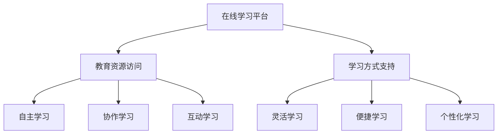
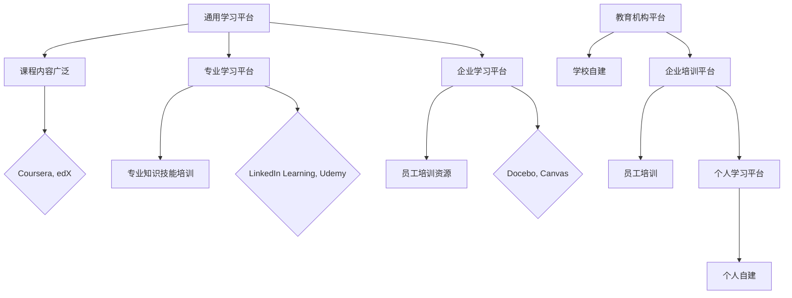
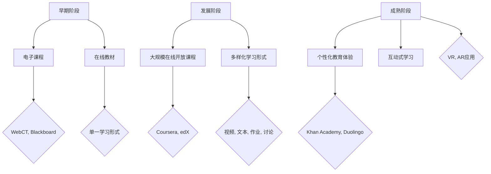
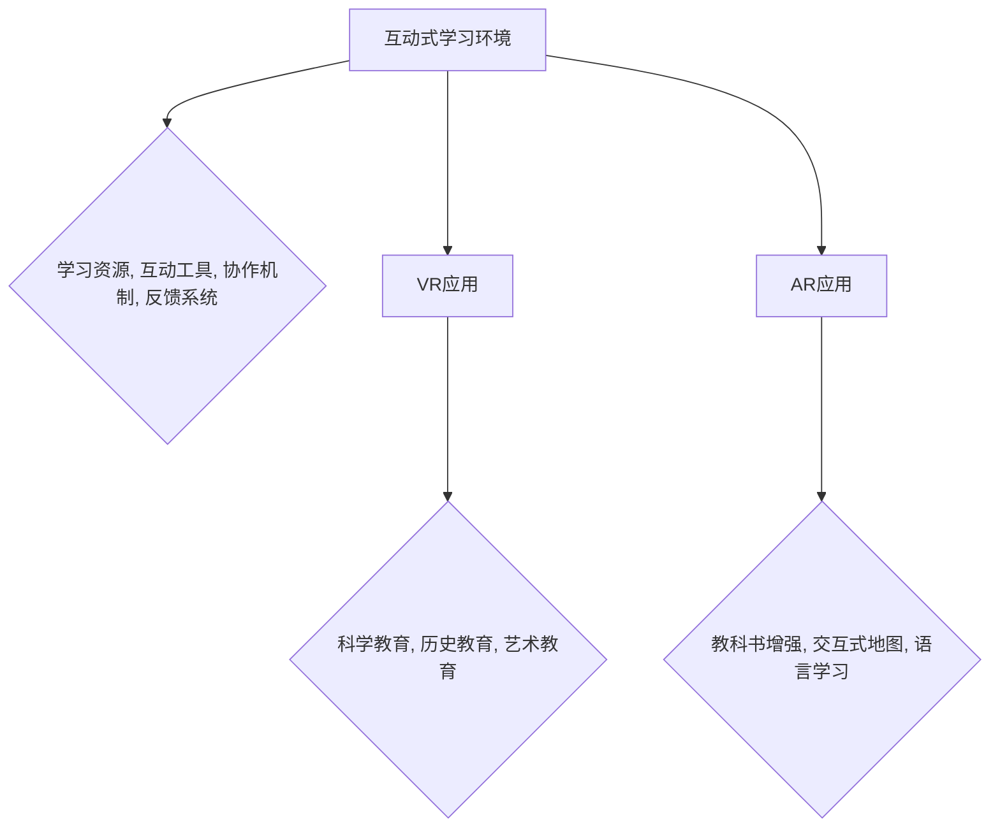
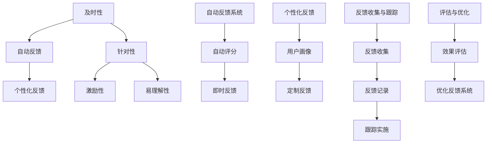
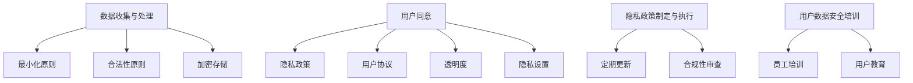

                 

# 在线学习平台：打造个性化教育体验

## 关键词
- 在线学习平台
- 个性化教育
- 数据挖掘
- 推荐系统
- 互动式学习
- 安全与隐私保护

## 摘要
本文旨在探讨如何通过在线学习平台实现个性化教育体验。首先，对在线学习平台进行了概述和分类，详细介绍了其定义、发展历程和优势与挑战。接着，分析了用户行为数据收集与处理方法，并阐述了如何通过用户行为数据分析构建用户画像。随后，深入讨论了基于推荐算法的个性化学习路径规划模型，包括基于内容、协同过滤和用户行为分析的路径规划方法。此外，还介绍了互动式学习环境的设计，包括互动教学工具的应用和虚拟现实与增强现实在教育中的应用。然后，探讨了在线学习平台的评价体系和反馈机制，以及安全与隐私保护策略。最后，通过案例分析分享了成功经验和实践，并提供了在线学习平台开发工具和资源。

---

### 第1章：在线学习平台的定义与分类

在线学习平台（Online Learning Platform，简称OLP）是一种基于互联网的技术平台，旨在提供灵活、便捷、个性化的学习体验。它支持多种学习方式，包括自主学习、协作学习、互动学习等，无需固定地点和时间的限制。在线学习平台的发展历程可以追溯到1990年代初，随着互联网的普及，电子课程和在线教材开始兴起。2000年代，大规模在线开放课程（MOOC）的出现使得在线学习走向大众化。2010年代以来，随着大数据、人工智能等技术的发展，在线学习平台开始注重个性化教育体验，功能日益完善。

#### 1.1 在线学习平台的概念

在线学习平台是一种技术平台，通过互联网提供教育资源和学习服务。它通常具有以下特点：

- **灵活性**：用户可以根据自己的需求和进度自由选择学习内容和时间。
- **便捷性**：用户可以随时随地通过互联网访问学习资源，不受地点和时间的限制。
- **个性化**：平台可以根据用户的学习行为和需求，推荐合适的学习内容和路径。
- **互动性**：平台支持师生和生生之间的互动，如实时聊天、讨论区、在线测评等。

#### 1.2 在线学习平台的分类

在线学习平台可以根据不同的分类标准进行分类，以下是几种常见的分类方法：

- **按学习内容分类**：
  - **通用学习平台**：如Coursera、edX等，提供广泛的课程内容。
  - **专业学习平台**：如LinkedIn Learning、Udemy等，专注于特定领域的专业知识和技能培训。
  - **企业学习平台**：如Docebo、Canvas等，为企业员工提供培训和学习资源。

- **按学习模式分类**：
  - **自适应学习平台**：根据用户的学习进度、能力和兴趣，动态调整学习内容。
  - **模拟学习平台**：提供虚拟的学习环境，模拟真实的学习和工作场景。

- **按应用领域分类**：
  - **教育机构平台**：如学校和教育机构自建的在线学习平台。
  - **企业培训平台**：为员工提供培训和学习资源的在线学习平台。
  - **个人学习平台**：个人用户自建的在线学习平台。

#### 1.3 在线学习平台的发展历程

在线学习平台的发展历程可以分为以下几个阶段：

- **早期阶段**（1990年代初）：互联网教育开始兴起，主要形式为电子课程和在线教材。
  - **代表性平台**：WebCT、Blackboard等。
  - **特点**：主要是电子化的教材和课程，学习形式相对单一。

- **发展阶段**（2000年代）：随着互联网的普及，大规模在线开放课程（MOOC）出现，使得在线学习走向大众化。
  - **代表性平台**：Coursera、edX、Udacity等。
  - **特点**：课程内容丰富，学习形式多样化，包括视频、文本、作业、讨论等。

- **成熟阶段**（2010年代以来）：随着大数据、人工智能等技术的发展，在线学习平台开始注重个性化教育体验，功能日益完善。
  - **代表性平台**：Khan Academy、Duolingo、Canvas等。
  - **特点**：个性化推荐、互动式学习、虚拟现实（VR）与增强现实（AR）的应用等。

### 1.1.1 在线学习平台的概念

在线学习平台（Online Learning Platform，简称OLP）是一种基于互联网的技术平台，旨在提供灵活、便捷、个性化的学习体验。它支持多种学习方式，包括自主学习、协作学习、互动学习等，无需固定地点和时间的限制。

#### 核心概念与联系

**概念**：在线学习平台是一种通过互联网提供教育资源和学习服务的系统，它支持在线课程的学习、作业提交、互动交流等功能。

**联系**：在线学习平台与传统的教学方式不同，它利用互联网技术，使得学习资源可以随时随地进行访问，支持多种学习方式，提高学习效率。

### Mermaid 流程图：在线学习平台的概念



### 1.1.2 在线学习平台的分类

在线学习平台可以根据不同的分类标准进行分类，以下是几种常见的分类方法：

- **按学习内容分类**：
  - **通用学习平台**：如Coursera、edX等，提供广泛的课程内容。
  - **专业学习平台**：如LinkedIn Learning、Udemy等，专注于特定领域的专业知识和技能培训。
  - **企业学习平台**：如Docebo、Canvas等，为企业员工提供培训和学习资源。

- **按学习模式分类**：
  - **自适应学习平台**：根据用户的学习进度、能力和兴趣，动态调整学习内容。
  - **模拟学习平台**：提供虚拟的学习环境，模拟真实的学习和工作场景。

- **按应用领域分类**：
  - **教育机构平台**：如学校和教育机构自建的在线学习平台。
  - **企业培训平台**：为员工提供培训和学习资源的在线学习平台。
  - **个人学习平台**：个人用户自建的在线学习平台。

#### 核心概念与联系

**概念**：
- **通用学习平台**：提供广泛的课程内容，适用于各种学习需求和背景。
- **专业学习平台**：专注于特定领域的专业知识和技能培训，满足特定领域的专业需求。
- **企业学习平台**：为企业员工提供培训和学习资源，提高员工的专业能力和工作效率。

**联系**：
- **分类标准**：根据学习内容、学习模式和应用领域对在线学习平台进行分类，有助于用户根据自身需求选择合适的平台。

### Mermaid 流程图：在线学习平台的分类



### 1.1.3 在线学习平台的发展历程

在线学习平台的发展历程可以分为以下几个阶段：

- **早期阶段**（1990年代初）：互联网教育开始兴起，主要形式为电子课程和在线教材。
  - **代表性平台**：WebCT、Blackboard等。
  - **特点**：主要是电子化的教材和课程，学习形式相对单一。

- **发展阶段**（2000年代）：随着互联网的普及，大规模在线开放课程（MOOC）出现，使得在线学习走向大众化。
  - **代表性平台**：Coursera、edX、Udacity等。
  - **特点**：课程内容丰富，学习形式多样化，包括视频、文本、作业、讨论等。

- **成熟阶段**（2010年代以来）：随着大数据、人工智能等技术的发展，在线学习平台开始注重个性化教育体验，功能日益完善。
  - **代表性平台**：Khan Academy、Duolingo、Canvas等。
  - **特点**：个性化推荐、互动式学习、虚拟现实（VR）与增强现实（AR）的应用等。

#### 核心概念与联系

**概念**：
- **早期阶段**：电子课程和在线教材兴起，学习形式相对单一。
- **发展阶段**：MOOC的出现，课程内容丰富，学习形式多样化。
- **成熟阶段**：个性化教育体验，大数据和人工智能的应用。

**联系**：
- **技术发展**：互联网、MOOC、大数据、人工智能等技术的发展，推动在线学习平台不断演进和优化。

### Mermaid 流程图：在线学习平台的发展历程



---

### 第2章：用户行为分析与数据挖掘

用户行为分析是构建个性化教育体验的重要环节。通过对用户行为数据的收集、处理和分析，可以深入了解用户的学习习惯、兴趣和需求，从而为用户提供更加精准和个性化的学习资源。本章将详细讨论用户行为数据的收集与处理方法，以及如何利用用户行为数据分析构建用户画像。

#### 2.1 用户行为数据的收集与处理

用户行为数据是指在用户使用在线学习平台的过程中所产生的各种数据，包括学习时间、学习频率、学习进度、互动行为等。收集用户行为数据是构建用户画像的基础，以下介绍几种常用的数据收集方法：

1. **日志收集**：
   - **方法**：通过服务器日志记录用户在平台上的活动，如页面访问、课程观看、作业提交等。
   - **优点**：可以自动收集大量数据，实时性高。
   - **缺点**：数据可能包含噪声，需要进一步处理。

2. **问卷调查**：
   - **方法**：通过在线问卷收集用户对学习内容和平台的反馈。
   - **优点**：可以直接获取用户的主观感受和需求。
   - **缺点**：问卷回收率可能较低，数据量有限。

3. **用户访谈**：
   - **方法**：直接与用户交流，了解他们的学习体验和需求。
   - **优点**：可以获得深入的定性数据。
   - **缺点**：需要大量时间和人力资源。

数据处理是用户行为分析的关键环节，以下介绍几个主要步骤：

1. **数据清洗**：
   - **方法**：去除重复、无效和错误的数据，确保数据质量。
   - **步骤**：数据去重、缺失值处理、异常值检测与修正。

2. **数据存储**：
   - **方法**：将清洗后的数据存储到数据库或数据仓库中，便于后续分析。
   - **选择**：根据数据量、查询性能和存储成本等因素选择合适的存储方案。

3. **数据转换**：
   - **方法**：将数据转换为适合分析的格式，如使用结构化查询语言（SQL）进行数据转换。

4. **数据归一化**：
   - **方法**：将不同尺度和量纲的数据进行归一化处理，便于进行比较和分析。

#### 2.2 用户行为数据分析与应用

用户行为数据分析是利用统计分析和机器学习等方法，从用户行为数据中提取有价值的信息，以指导个性化教育体验的设计和优化。以下介绍几种常见的用户行为数据分析方法：

1. **用户画像构建**：
   - **方法**：通过分析用户行为数据，构建用户的兴趣、学习习惯、学习风格等特征。
   - **步骤**：数据收集、数据预处理、特征提取、特征建模。

2. **用户行为分析模型**：
   - **方法**：建立用户行为分析模型，预测用户未来的学习行为，为个性化推荐提供依据。
   - **模型**：时间序列模型、回归模型、分类模型等。

3. **学习效果评估**：
   - **方法**：评估用户的学习效果，优化学习内容和教学方法。
   - **步骤**：学习进度分析、学习结果分析、学习反馈分析。

4. **用户反馈分析**：
   - **方法**：分析用户对学习内容和平台的反馈，改进平台功能和用户体验。
   - **步骤**：用户评论分析、用户满意度调查、用户行为分析。

#### 用户画像构建

用户画像（User Profiling）是通过分析用户的行为数据、人口统计数据等，构建一个关于用户特征和行为的模型。用户画像的构建可以帮助在线学习平台更好地理解用户，提供个性化的学习体验。以下是构建用户画像的几个步骤：

1. **数据收集**：
   - **方法**：收集用户在平台上的行为数据，如学习时间、学习频率、课程选择、作业完成情况等。
   - **步骤**：数据清洗、数据存储、数据转换。

2. **特征提取**：
   - **方法**：从用户行为数据中提取特征，如用户活跃度、学习兴趣、学习进度等。
   - **步骤**：数据预处理、特征选择、特征转换。

3. **特征建模**：
   - **方法**：利用机器学习算法，构建用户特征模型。
   - **算法**：决策树、支持向量机（SVM）、神经网络等。

4. **用户分类**：
   - **方法**：根据用户特征模型，将用户分为不同的类别。
   - **步骤**：特征选择、特征归一化、分类算法。

#### 用户行为分析模型

用户行为分析模型是用于预测和分析用户行为的一种统计模型。以下是一种基于决策树的用户行为分析模型：

```plaintext
算法：决策树
输入：用户行为数据集
输出：用户行为预测结果

步骤：
1. 数据预处理：清洗和转换用户行为数据，将其转换为适合建模的格式。
2. 特征选择：选择对用户行为有显著影响的特征。
3. 决策树构建：利用特征选择结果，构建决策树模型。
4. 模型训练：使用训练数据集训练决策树模型。
5. 模型评估：使用测试数据集评估模型性能，调整模型参数。
6. 用户行为预测：使用训练好的模型预测新用户的行为。
```

#### 学习效果评估

学习效果评估是衡量在线学习平台效果的重要指标。以下是一种基于学习进度的学习效果评估方法：

```plaintext
算法：学习进度分析
输入：用户学习进度数据
输出：学习效果评估结果

步骤：
1. 数据收集：收集用户的学习进度数据，如完成课程数、学习时长等。
2. 数据预处理：清洗和转换学习进度数据，确保数据质量。
3. 学习效果指标计算：计算用户的学习效果指标，如平均学习进度、完成率等。
4. 学习效果分析：分析学习效果指标，评估用户的学习效果。
5. 学习反馈收集：收集用户对学习内容和平台的反馈。
6. 学习反馈分析：分析用户反馈，优化学习内容和教学方法。
```

#### 用户反馈分析

用户反馈分析是了解用户需求和改进平台功能的重要手段。以下是一种基于用户评论的用户反馈分析方法：

```plaintext
算法：用户评论分析
输入：用户评论数据
输出：用户反馈结果

步骤：
1. 数据收集：收集用户对学习内容和平台的评论数据。
2. 数据预处理：清洗和转换评论数据，确保数据质量。
3. 评论情感分析：使用自然语言处理（NLP）技术，分析评论的情感倾向。
4. 反馈分类：根据情感分析结果，将评论分为正面、负面和中性。
5. 反馈分析：分析各类反馈，识别用户的主要需求和问题。
6. 改进措施：根据用户反馈，改进平台功能和用户体验。
```

---

### 第3章：基于推荐算法的个性化学习路径设计

个性化学习路径设计是提高在线学习平台用户体验的关键。通过推荐算法，可以依据用户的学习兴趣和行为，为用户推荐合适的学习内容和路径。本章将介绍基于推荐算法的个性化学习路径设计，包括协同过滤、内容推荐和混合推荐算法，以及个性化学习路径规划模型。

#### 3.1 推荐系统概述

推荐系统是一种信息过滤技术，旨在根据用户的行为和偏好，为用户推荐相关的学习内容。推荐系统在在线学习平台中具有重要的应用价值，可以帮助用户发现感兴趣的学习资源，提高学习效率和满足度。

**定义**：推荐系统（Recommendation System）是一种通过预测用户对项目的偏好，为用户推荐其可能感兴趣的项目的方法。

**分类**：

1. **基于内容的推荐**：通过分析学习资源的特征和属性，为用户推荐与其兴趣相似的学习资源。

2. **协同过滤推荐**：通过分析用户之间的相似性，推荐其他用户喜欢的学习资源。

3. **混合推荐**：结合基于内容和协同过滤的方法，提高推荐效果。

**工作流程**：

1. **用户建模**：收集用户的行为数据，建立用户兴趣模型。

2. **资源建模**：分析学习资源的特征和属性，建立资源特征模型。

3. **推荐生成**：利用用户和资源的特征模型，生成推荐列表。

4. **推荐评估**：评估推荐列表的质量，优化推荐算法。

#### 3.2 常见推荐算法介绍

**协同过滤算法**

协同过滤推荐算法（Collaborative Filtering）是一种基于用户行为数据的推荐方法。它通过分析用户之间的相似性，为用户推荐其他用户喜欢的学习资源。

**基于用户的协同过滤**

- **原理**：寻找与目标用户相似的其他用户，推荐这些用户喜欢的学习资源。

- **方法**：

  1. **用户相似度计算**：计算用户之间的相似度，如余弦相似度、皮尔逊相关系数等。

  2. **邻居选择**：根据用户相似度，选择与目标用户相似的用户作为邻居。

  3. **推荐生成**：根据邻居用户对学习资源的评分，为用户推荐未评分的学习资源。

- **算法描述**：

  ```plaintext
  输入：用户评分矩阵R
  输出：推荐列表L

  步骤：
  1. 计算用户相似度矩阵S
      Sij = sim(u_i, u_j)
  2. 选择邻居用户
      N(u_i) = {u_j | Sij > threshold}
  3. 计算邻居用户的平均评分
      r^' = (1/k) * Σ(r_j / Sij)
  4. 推荐未评分的学习资源
      L = {item | r_j < r^' and r_j未评分}
  ```

**基于物品的协同过滤**

- **原理**：寻找与目标学习资源相似的其他学习资源，推荐给用户。

- **方法**：

  1. **项目相似度计算**：计算学习资源之间的相似度，如余弦相似度、Jaccard相似度等。

  2. **邻居项目选择**：根据项目相似度，选择与目标学习资源相似的项目。

  3. **推荐生成**：根据邻居项目的高分评分，为用户推荐未评分的项目。

- **算法描述**：

  ```plaintext
  输入：用户评分矩阵R，项目相似度矩阵S
  输出：推荐列表L

  步骤：
  1. 计算项目相似度矩阵S
      Sij = sim(i, j)
  2. 选择邻居项目
      N(i) = {j | Sij > threshold}
  3. 计算邻居项目的平均评分
      r^' = (1/k) * Σ(r_j / Sij)
  4. 推荐未评分的项目
      L = {j | r_j < r^' and r_j未评分}
  ```

**内容推荐算法**

内容推荐（Content-Based Filtering）是一种基于学习资源特征和属性的推荐方法。它通过分析学习资源的标签、关键词、主题等信息，为用户推荐与其兴趣相关的内容。

**基于标签的推荐**

- **原理**：根据学习资源的标签信息，为用户推荐具有相同或相似标签的学习资源。

- **方法**：

  1. **标签提取**：从学习资源中提取标签信息。

  2. **标签相似度计算**：计算用户和资源标签的相似度。

  3. **推荐生成**：为用户推荐未观看且与用户标签相似的学习资源。

- **算法描述**：

  ```plaintext
  输入：学习资源标签集合T，用户标签集合U
  输出：推荐列表L

  步骤：
  1. 计算用户标签相似度矩阵S
      Sij = sim(T_i, U)
  2. 选择邻居标签
      N(U) = {T_j | Sij > threshold}
  3. 为用户推荐邻居标签对应的学习资源
      L = {i | T_i ∈ N(U) 且 i未观看}
  ```

**基于关键词的推荐**

- **原理**：根据学习资源的关键词信息，为用户推荐具有相同或相似关键词的学习资源。

- **方法**：

  1. **关键词提取**：从学习资源中提取关键词信息。

  2. **关键词相似度计算**：计算用户和资源关键词的相似度。

  3. **推荐生成**：为用户推荐未观看且与用户关键词相似的学习资源。

- **算法描述**：

  ```plaintext
  输入：学习资源关键词集合K，用户关键词集合U
  输出：推荐列表L

  步骤：
  1. 计算用户关键词相似度矩阵S
      Sij = sim(K_i, U)
  2. 选择邻居关键词
      N(U) = {K_j | Sij > threshold}
  3. 为用户推荐邻居关键词对应的学习资源
      L = {i | K_i ∈ N(U) 且 i未观看}
  ```

**混合推荐算法**

混合推荐（Hybrid Recommendation）是结合基于内容和协同过滤的方法，以提高推荐效果。

- **原理**：综合利用用户行为和资源特征信息，生成更准确的推荐列表。

- **方法**：

  1. **用户兴趣模型**：结合用户行为和资源特征，建立用户兴趣模型。

  2. **资源特征模型**：分析学习资源的标签、关键词、主题等特征。

  3. **推荐生成**：结合用户兴趣模型和资源特征模型，生成推荐列表。

- **算法描述**：

  ```plaintext
  输入：用户行为数据U，学习资源特征数据V
  输出：推荐列表L

  步骤：
  1. 计算用户兴趣模型M
      M = U * V
  2. 计算学习资源相似度矩阵S
      Sij = sim(V_i, M)
  3. 选择邻居资源
      N(i) = {j | Sij > threshold}
  4. 计算邻居资源的平均评分
      r^' = (1/k) * Σ(r_j / Sij)
  5. 推荐未评分的资源
      L = {j | r_j < r^' and r_j未评分}
  ```

#### 3.3 个性化学习路径规划模型

个性化学习路径规划模型是利用推荐算法，根据用户的学习兴趣和行为，为用户生成一条个性化的学习路径。以下介绍几种常见的个性化学习路径规划模型。

**基于内容的路径规划**

- **原理**：根据学习内容的标签、关键词等信息，推荐相关联的学习资源，形成学习路径。

- **方法**：

  1. **内容特征提取**：从学习资源中提取标签、关键词等信息。

  2. **内容相似度计算**：计算学习资源之间的相似度。

  3. **路径生成**：根据相似度结果，为用户生成一条学习路径。

- **算法描述**：

  ```plaintext
  输入：学习资源集合C，用户标签集合U
  输出：个性化学习路径L

  步骤：
  1. 提取内容特征F
      F = extract_features(C)
  2. 计算内容相似度矩阵S
      Sij = sim(F_i, U)
  3. 选择邻居资源
      N(U) = {i | Sij > threshold}
  4. 生成学习路径
      L = construct_path(N(U))
  ```

**基于协同过滤的路径规划**

- **原理**：根据用户之间的相似性，推荐其他用户喜欢的学习资源，形成学习路径。

- **方法**：

  1. **用户相似度计算**：计算用户之间的相似度。

  2. **资源推荐**：根据用户相似度，推荐其他用户喜欢的学习资源。

  3. **路径生成**：根据推荐资源，为用户生成一条学习路径。

- **算法描述**：

  ```plaintext
  输入：用户评分矩阵R
  输出：个性化学习路径L

  步骤：
  1. 计算用户相似度矩阵S
      Sij = sim(u_i, u_j)
  2. 选择邻居用户
      N(u_i) = {u_j | Sij > threshold}
  3. 推荐邻居用户喜欢的资源
      L = recommend_resources(N(u_i))
  ```

**基于用户行为分析的路径规划**

- **原理**：通过分析用户的学习行为，如学习时间、学习频率、学习内容等，为用户生成一条符合其兴趣和需求的学习路径。

- **方法**：

  1. **用户行为数据收集**：收集用户的学习行为数据。

  2. **行为模式分析**：分析用户的学习行为模式。

  3. **路径生成**：根据用户行为模式，为用户生成一条学习路径。

- **算法描述**：

  ```plaintext
  输入：用户行为数据U
  输出：个性化学习路径L

  步骤：
  1. 行为模式分析B
      B = analyze_behavior(U)
  2. 学习兴趣预测I
      I = predict_interest(B)
  3. 生成学习路径
      L = construct_path(I)
  ```

**多模态路径规划**

- **原理**：结合基于内容、协同过滤和用户行为分析的路径规划方法，为用户提供更加个性化的学习路径。

- **方法**：

  1. **多模态数据融合**：融合用户行为数据、内容特征和用户兴趣预测。

  2. **路径生成**：根据融合数据，为用户生成一条学习路径。

- **算法描述**：

  ```plaintext
  输入：用户行为数据U，学习资源特征F，用户兴趣预测I
  输出：个性化学习路径L

  步骤：
  1. 融合数据D
      D = fuse_data(U, F, I)
  2. 生成学习路径
      L = construct_path(D)
  ```

---

### 第4章：互动式学习环境设计

互动式学习环境（Interactive Learning Environment，简称ILE）是一种通过技术手段支持学生主动参与、协作学习和知识建构的学习空间。本章将介绍互动式学习环境的定义、关键要素、互动教学工具与应用，以及虚拟现实（VR）与增强现实（AR）在教育中的应用。

#### 4.1 互动式学习环境的定义与要素

**定义**：互动式学习环境是一种能够支持学生主动参与、协作学习和知识建构的学习空间。它通过技术手段，如网络、多媒体、虚拟现实等，增强学习过程中的互动性和参与度。

**要素**：

1. **学习资源**：包括课程内容、学习资料、多媒体资源等，为学生的学习提供支持。

2. **互动工具**：如聊天室、讨论区、即时消息、视频会议等，用于促进师生和生生之间的互动。

3. **协作机制**：支持多人合作的学习活动，如小组讨论、项目合作等，培养学生的协作能力。

4. **反馈系统**：提供及时、个性化的反馈，帮助用户了解学习效果，调整学习策略。

#### 4.2 在线互动教学工具与应用

**课堂互动工具**：

1. **实时聊天**：
   - **功能**：支持师生和同学之间的实时文字交流。
   - **应用场景**：课堂上用于提问、讨论、答疑等。

2. **投票和问卷调查**：
   - **功能**：用于收集学生反馈，了解学生的理解和掌握情况。
   - **应用场景**：课堂中用于检验学习效果、课堂活动等。

3. **在线问答**：
   - **功能**：学生可以随时提出问题，教师或其他学生可以回答。
   - **应用场景**：课堂内外用于解答疑惑、讨论问题等。

**学习讨论区**：

1. **论坛讨论**：
   - **功能**：学生可以发帖、回帖，进行深度讨论和交流。
   - **应用场景**：课程学习、课题研究等。

2. **小组讨论**：
   - **功能**：学生按照小组进行讨论，共享观点和资源。
   - **应用场景**：小组项目、课题讨论等。

**在线测评与反馈系统**：

1. **自动测评**：
   - **功能**：通过系统自动评估学生的作业和测验。
   - **应用场景**：课堂练习、作业提交等。

2. **即时反馈**：
   - **功能**：系统提供即时反馈，指出学生的正确与错误，并提供解释和帮助。
   - **应用场景**：在线测验、作业批改等。

3. **个性化反馈**：
   - **功能**：根据学生的学习情况，提供个性化的反馈和建议。
   - **应用场景**：学习评估、学习计划等。

#### 4.3 虚拟现实（VR）与增强现实（AR）在教育中的应用

**虚拟现实（VR）**：

**定义**：虚拟现实是一种通过电脑模拟产生的三维空间，用户可以通过特殊的设备如VR头盔、手柄等，身临其境地体验。

**应用**：

1. **科学教育**：
   - **功能**：模拟物理实验、化学实验等，让学生在实际操作前就能体验实验过程。
   - **应用场景**：科学实验室、课堂教学等。

2. **历史教育**：
   - **功能**：模拟历史场景，让学生身临其境地感受历史事件。
   - **应用场景**：历史课堂、博物馆等。

3. **艺术教育**：
   - **功能**：通过VR艺术展览，提供沉浸式的艺术体验。
   - **应用场景**：艺术课堂、艺术馆等。

**增强现实（AR）**：

**定义**：增强现实是在现实环境中叠加虚拟信息，通过增强现实眼镜、手机等设备展示。

**应用**：

1. **教科书增强**：
   - **功能**：在教科书上加入AR内容，如视频、图片、3D模型等，丰富学习内容。
   - **应用场景**：课堂教学、自学等。

2. **交互式地图**：
   - **功能**：使用AR技术展示地理信息，提供互动式的地理学习体验。
   - **应用场景**：地理课堂、户外探险等。

3. **语言学习**：
   - **功能**：通过AR技术，将学习单词与实物图像结合，提高记忆效果。
   - **应用场景**：语言课堂、日常练习等。

#### 核心概念与联系

**互动式学习环境**：
- **定义**：支持学生主动参与、协作学习和知识建构的学习空间。
- **要素**：学习资源、互动工具、协作机制、反馈系统。

**虚拟现实（VR）**：
- **定义**：通过电脑模拟产生三维空间，用户可通过特殊设备身临其境地体验。
- **应用**：科学教育、历史教育、艺术教育。

**增强现实（AR）**：
- **定义**：在现实环境中叠加虚拟信息，通过设备展示。
- **应用**：教科书增强、交互式地图、语言学习。

**联系**：互动式学习环境通过VR和AR技术，增强学习过程中的互动性和参与度，提供更加丰富的学习体验。

### Mermaid 流程图：互动式学习环境与VR/AR应用



---

### 第5章：在线学习平台的评价体系

在线学习平台的评价体系是衡量学习效果和教学质量的重要手段。本章将讨论学习评价体系的设计原则、常见评价方法与工具，以及反馈机制的重要性与设计。

#### 5.1 学习评价体系的设计原则

设计一个有效的学习评价体系需要遵循以下原则：

1. **全面性**：评价体系应涵盖学习过程和学习成果的各个方面，包括知识、技能和态度等。

2. **客观性**：评价标准和方法应尽量客观，减少主观偏见，确保评价结果的公正性。

3. **动态性**：评价体系应能反映学习者的动态变化，及时调整评价标准和策略。

4. **可操作性**：评价方法和工具应易于实施和操作，便于日常教学使用。

5. **激励性**：评价体系应能够激发学习者的学习兴趣和积极性，促进他们的持续学习。

#### 5.2 常见评价方法与工具

在线学习平台中常见的评价方法与工具有以下几种：

1. **形成性评价**：
   - **方法**：在学习过程中进行，旨在及时反馈学生的学习状况，帮助调整学习策略。
   - **工具**：如课堂问答、作业、小测验等。

2. **总结性评价**：
   - **方法**：在学习结束后进行，旨在对整个学习过程和学习成果进行评估。
   - **工具**：如期末考试、项目汇报等。

3. **自动化评价工具**：
   - **方法**：利用自动化工具，如在线测评系统，自动评估学生的作业和测验成绩。
   - **工具**：如自动评分系统、学习分析系统等。

4. **学生自我评价与反思**：
   - **方法**：学生对自己学习过程中的表现进行自我评价和反思。
   - **工具**：如反思日志、学习报告等。

#### 5.3 反馈机制的重要性与设计

反馈机制是评价体系的重要组成部分，其重要性体现在以下几个方面：

1. **促进学习**：及时、有效的反馈可以帮助学生了解自己的学习状况，发现问题并改进。

2. **提高教学质量**：通过收集学生的反馈，教师可以调整教学内容和方法，提高教学效果。

3. **增强参与度**：良好的反馈机制可以激发学生的学习兴趣和参与度，提高学习效果。

设计反馈机制需要遵循以下原则：

1. **及时性**：反馈应尽可能及时，以便学生能够及时调整学习策略。

2. **针对性**：反馈应针对具体的学习内容或行为，提供具体的改进建议。

3. **激励性**：反馈应鼓励学生的积极性和主动性，促进他们的持续学习。

4. **易理解性**：反馈应以学生能理解的方式呈现，避免使用过于专业的术语。

反馈系统的实现与优化包括以下几个方面：

1. **自动反馈系统**：使用自动化工具，如在线测评系统，提供即时反馈。

2. **个性化反馈**：根据学生的不同学习需求和水平，提供个性化的反馈。

3. **反馈收集与跟踪**：建立反馈收集机制，记录学生的反馈并跟踪反馈的实施情况。

4. **反馈系统评估与改进**：设置评估指标，如学生满意度、学习效果提升等，评估反馈系统的效果，并根据评估结果进行优化。

### 5.1 学习评价体系的设计原则

学习评价体系的设计原则对于确保教育质量和学习效果至关重要。以下是几个关键原则及其具体解释：

1. **全面性**：
   - **原则描述**：评价体系应全面覆盖学习过程中的各个方面，包括知识、技能、态度、行为等。
   - **具体解释**：通过全面的评价，可以更准确地反映学生的综合素质，不仅关注学术成绩，还关注学生的行为表现和情感发展。

2. **客观性**：
   - **原则描述**：评价标准和过程应尽量客观，以减少主观偏见和误差。
   - **具体解释**：客观性体现在评价标准的统一性、评价方法的标准化、评价过程的透明性，确保所有学生都能在一个公平、公正的环境下接受评价。

3. **动态性**：
   - **原则描述**：评价体系应具备动态调整能力，以适应学生的发展和学习需求的变化。
   - **具体解释**：动态性意味着评价体系应能够根据学生的学习进度、兴趣和个性特点，灵活调整评价标准和内容，提供个性化的指导和支持。

4. **可操作性**：
   - **原则描述**：评价方法和工具应易于操作和实施，方便教师和学生使用。
   - **具体解释**：可操作性要求评价体系的设计要简洁明了，避免复杂难懂的评价流程，同时提供足够的培训和资源支持，确保评价活动的顺利开展。

5. **激励性**：
   - **原则描述**：评价体系应能够激发学生的学习动机和积极性，促进他们的持续学习。
   - **具体解释**：激励性评价应注重正面反馈，鼓励学生的成就感和进步，同时提供具体可行的改进建议，帮助学生克服困难和挑战。

#### 5.2 常见评价方法与工具

在线学习平台的评价体系需要结合多种评价方法与工具，以全面、客观、动态地评估学生的学习效果。以下是几种常见的方法和工具：

1. **形成性评价**：
   - **方法描述**：形成性评价是在学习过程中进行的评价，旨在及时反馈学生的学习状况，帮助调整学习策略。
   - **工具**：
     - **课堂问答**：教师通过提问了解学生对知识的掌握程度。
     - **作业**：通过学生的作业表现评估其学习成果。
     - **小测验**：定期进行的小规模测验，用于检验学生的知识掌握情况。

2. **总结性评价**：
   - **方法描述**：总结性评价是在学习结束后进行的评价，旨在对整个学习过程和学习成果进行综合评估。
   - **工具**：
     - **期末考试**：通过期末考试评估学生对课程知识的全面掌握情况。
     - **项目汇报**：学生通过项目展示和汇报，展示其学习成果和综合能力。

3. **自动化评价工具**：
   - **方法描述**：利用自动化工具进行评价，提高评价效率和准确性。
   - **工具**：
     - **自动评分系统**：用于自动评估学生的作业和测验成绩，减少人工评分的工作量。
     - **学习分析系统**：分析学生的学习行为数据，提供学习反馈和建议。

4. **学生自我评价与反思**：
   - **方法描述**：学生对自己学习过程中的表现进行自我评价和反思，促进自我成长。
   - **工具**：
     - **反思日志**：学生记录自己的学习过程和心得体会，进行自我反思。
     - **学习报告**：学生撰写学习报告，总结学习成果和经验教训。

### 5.3 反馈机制的重要性与设计

反馈机制是学习评价体系的重要组成部分，其有效设计对于提升学习效果和教学水平具有重要作用。以下是反馈机制的重要性和设计原则：

#### 重要性

1. **促进学习**：及时、有效的反馈可以帮助学生了解自己的学习状况，发现问题并改进。这种持续的反馈机制可以引导学生更加主动和高效地学习。

2. **提高教学质量**：通过收集学生的反馈，教师可以了解教学过程中的问题和不足，从而调整教学内容和方法，提高教学效果。

3. **增强参与度**：良好的反馈机制可以激发学生的学习兴趣和参与度，使学生在学习过程中感受到成就感和进步，从而更加积极地投入学习。

#### 设计原则

1. **及时性**：反馈应尽可能及时，以便学生能够及时调整学习策略。及时的反馈可以让学生在学习过程中不断优化自己的学习方法，提高学习效果。

2. **针对性**：反馈应针对具体的学习内容或行为，提供具体的改进建议。这种个性化的反馈可以更有效地帮助学生克服困难和挑战，实现学习目标。

3. **激励性**：反馈应鼓励学生的积极性和主动性，促进他们的持续学习。积极的反馈可以增强学生的自信心，激发他们的学习动力。

4. **易理解性**：反馈应以学生能理解的方式呈现，避免使用过于专业的术语。清晰的反馈可以帮助学生更好地理解自己的学习状况，明确改进方向。

### 反馈系统的实现与优化

1. **自动反馈系统**：
   - **方法**：利用在线测评系统和学习分析系统，提供即时反馈。
   - **步骤**：
     - **数据收集**：通过在线测评和日志记录收集学生的学习数据。
     - **数据分析**：分析学生数据，生成个性化的反馈报告。
     - **反馈生成**：将分析结果以报告形式呈现，为学生提供即时反馈。

2. **个性化反馈**：
   - **方法**：根据学生的不同学习需求和水平，提供个性化的反馈。
   - **步骤**：
     - **用户画像构建**：通过用户行为数据构建学生画像，了解其学习兴趣和需求。
     - **反馈定制**：根据学生画像，定制个性化的反馈内容，提供有针对性的改进建议。

3. **反馈收集与跟踪**：
   - **方法**：建立反馈收集机制，记录学生的反馈并跟踪反馈的实施情况。
   - **步骤**：
     - **反馈收集**：通过问卷调查、访谈等方式收集学生的反馈。
     - **反馈记录**：将收集到的反馈记录在数据库中，便于后续分析和处理。
     - **反馈跟踪**：跟踪反馈的实施情况，评估反馈效果，并根据需要调整反馈策略。

4. **反馈系统评估与改进**：
   - **方法**：设置评估指标，如学生满意度、学习效果提升等，评估反馈系统的效果。
   - **步骤**：
     - **评估指标设置**：根据反馈系统的目标，设置相应的评估指标。
     - **效果评估**：定期对反馈系统进行效果评估，分析各项指标的实现情况。
     - **改进优化**：根据评估结果，对反馈系统进行优化和改进，以提高其有效性和满意度。

### 5.3.1 反馈机制的设计原则

设计反馈机制时，需要遵循以下原则，以确保反馈的有效性和实用性：

1. **及时性**：
   - **原则描述**：及时提供反馈，以帮助学生及时纠正错误、调整学习策略。
   - **具体应用**：通过在线学习平台自动生成即时反馈，教师也可以在课堂或在线讨论中及时回答学生的问题。

2. **针对性**：
   - **原则描述**：针对学生个体的具体学习情况提供个性化的反馈，而不是一刀切。
   - **具体应用**：分析学生的学习数据，根据不同学生的学习进度、知识掌握情况和兴趣爱好，提供有针对性的建议。

3. **激励性**：
   - **原则描述**：反馈应激励学生，增强其学习动力，促进持续学习。
   - **具体应用**：使用积极的语言和肯定的语言，鼓励学生的每一步进步，并提出具体可行的改进建议。

4. **易理解性**：
   - **原则描述**：反馈应使用学生容易理解的语言和方式呈现，避免使用复杂或专业的术语。
   - **具体应用**：用简单明了的文字描述反馈内容，可以结合图表、视频等多媒体形式，使反馈更加直观易懂。

### 反馈系统的实现与优化

1. **自动反馈系统**：
   - **实现方法**：利用在线学习平台内置的自动评分和反馈功能，自动化处理学生的学习过程和结果。
   - **优化策略**：通过机器学习和自然语言处理技术，提高自动评分的准确性和反馈的个性化程度。

2. **个性化反馈**：
   - **实现方法**：根据学生的学习数据，生成个性化的反馈报告，包括学习进度、知识点掌握情况等。
   - **优化策略**：引入用户画像和个性化推荐技术，使反馈内容更加贴近学生实际需求。

3. **反馈收集与跟踪**：
   - **实现方法**：建立反馈收集机制，如在线问卷调查、反馈表单等，收集学生的意见和建议。
   - **优化策略**：通过数据分析和挖掘，跟踪反馈的实施情况，并根据学生反馈进行持续改进。

4. **反馈系统评估与改进**：
   - **实现方法**：定期评估反馈系统的效果，收集学生和教师的反馈，分析系统性能和用户体验。
   - **优化策略**：根据评估结果，优化反馈系统，提升反馈的及时性、针对性、激励性和易理解性。

### Mermaid 流程图：反馈系统的设计与实现



---

### 第6章：在线学习平台的安全与隐私保护

在线学习平台的安全与隐私保护是确保用户数据安全和隐私不受侵犯的关键。本章将探讨在线学习平台的安全策略与措施，隐私保护法规与标准，以及用户数据安全与隐私保护的实践。

#### 6.1 平台安全策略与措施

在线学习平台的安全策略与措施旨在保护用户数据安全，防止非法访问和数据泄露。以下是几种常见的安全策略与措施：

1. **安全策略制定**：
   - **目标**：明确平台需要保护的信息类型和安全目标。
   - **步骤**：进行风险评估，制定安全目标和策略，确保平台符合相关的法律法规和标准。

2. **数据加密**：
   - **方法**：对用户数据进行加密，确保数据在传输和存储过程中的安全。
   - **技术**：使用AES、RSA等加密算法，对敏感数据进行加密存储和传输。

3. **访问控制**：
   - **方法**：设置严格的访问控制机制，确保只有授权用户才能访问敏感数据。
   - **措施**：使用用户认证、授权和访问控制列表（ACL）等技术，控制用户对数据的访问权限。

4. **防火墙与入侵检测**：
   - **方法**：部署防火墙和入侵检测系统，防止外部攻击和内部泄露。
   - **技术**：使用防火墙规则和入侵检测系统（IDS）监控网络流量，检测和阻止恶意攻击。

5. **安全监控**：
   - **方法**：实时监控平台的安全状况，及时发现和处理异常行为。
   - **措施**：使用安全信息与事件管理系统（SIEM），监控日志和告警，确保安全事件的快速响应和处理。

6. **应急响应**：
   - **方法**：制定应急响应计划，确保在发生安全事件时能够快速响应和处理。
   - **步骤**：包括安全事件检测、响应、恢复和评估，确保平台能够快速恢复。

#### 6.2 隐私保护法规与标准

在线学习平台的隐私保护需要遵循相关的隐私保护法规与标准，以下是一些常见的法规与标准：

1. **GDPR（欧盟通用数据保护条例）**：
   - **内容**：规定了数据收集、处理、存储和传输的规范，强调用户的数据权利。
   - **影响**：适用于全球范围内的数据处理，对在线学习平台的隐私保护提出了严格要求。

2. **CCPA（加州消费者隐私法）**：
   - **内容**：保护加州居民的个人信息权利，包括数据收集、使用和共享的规定。
   - **影响**：对在线学习平台的数据隐私保护提出了具体的合规要求。

3. **COPPA（儿童在线隐私保护法）**：
   - **内容**：保护13岁及以下儿童的在线隐私，规定了儿童个人信息收集和使用的要求。
   - **影响**：对在线学习平台处理儿童数据提出了严格的限制和规范。

4. **PIPEDA（加拿大隐私法）**：
   - **内容**：规范了个人信息的收集、使用、披露和存储，保护个人信息权利。
   - **影响**：适用于加拿大境内的在线学习平台，确保平台遵守隐私保护要求。

#### 6.3 用户数据安全与隐私保护

用户数据安全与隐私保护是在线学习平台的重要任务，以下介绍几种用户数据安全与隐私保护的实践：

1. **数据收集与处理**：
   - **原则**：遵循数据最小化和合法性原则，只收集必要的用户数据。
   - **措施**：对用户数据进行加密存储，确保数据在传输和存储过程中的安全。

2. **用户同意**：
   - **方法**：在数据收集和处理前，确保用户知晓并同意相关隐私政策。
   - **步骤**：通过隐私政策、用户协议等方式，明确告知用户数据的收集、使用和共享方式。

3. **用户隐私权告知**：
   - **内容**：告知用户其隐私权利，包括数据访问、删除、撤回同意等。
   - **措施**：在平台界面提供隐私设置，用户可以控制其数据的公开范围和访问权限。

4. **隐私政策制定与执行**：
   - **方法**：制定明确的隐私政策，详细说明数据的收集、使用、存储和共享方式。
   - **措施**：定期更新隐私政策，确保其与最新法律法规和行业标准保持一致。

5. **隐私保护技术**：
   - **方法**：使用数据匿名化、数据脱敏等技术，保护用户隐私。
   - **措施**：在数据处理过程中，对敏感信息进行加密、匿名化和脱敏处理。

6. **用户数据安全培训**：
   - **内容**：提高用户对数据隐私保护的意识和能力。
   - **措施**：定期对员工进行数据隐私保护培训，确保其在处理用户数据时的合规操作。

### 6.1 平台安全策略与措施

为了确保在线学习平台的安全，需要制定并执行一系列的安全策略和措施。以下是具体的策略与措施：

1. **安全策略制定**：
   - **目标**：确保用户数据的安全，防止未经授权的访问、篡改和泄露。
   - **步骤**：
     - **风险评估**：评估平台面临的安全威胁和潜在风险。
     - **安全目标**：根据风险评估结果，制定具体的安全目标。
     - **安全策略**：制定包括数据保护、访问控制、应急响应等在内的安全策略。

2. **数据安全措施**：
   - **数据加密**：对用户数据进行加密，确保数据在传输和存储过程中的安全。
   - **技术**：使用AES（高级加密标准）或RSA（公开密钥加密）算法对数据进行加密。
   - **存储安全**：采用安全的存储方案，如磁盘加密、数据库加密等，防止数据泄露。
   - **数据备份**：定期进行数据备份，确保在发生数据丢失或损坏时能够快速恢复。

3. **访问控制**：
   - **方法**：通过用户认证和授权机制，确保只有授权用户才能访问敏感数据。
   - **技术**：使用单点登录（SSO）、OAuth等认证协议，确保用户身份的验证。
   - **访问权限管理**：根据用户的角色和权限，设置不同的访问权限，避免权限滥用。

4. **防火墙与入侵检测**：
   - **防火墙**：部署防火墙，阻止未经授权的访问和恶意流量。
   - **入侵检测**：使用入侵检测系统（IDS），监控网络流量，及时发现和阻止恶意攻击。

5. **安全监控**：
   - **实时监控**：使用安全信息与事件管理系统（SIEM），实时监控平台的安全状况。
   - **日志管理**：收集和分析平台日志，检测异常行为和潜在的安全威胁。

6. **应急响应**：
   - **应急响应计划**：制定详细的应急响应计划，包括安全事件的检测、响应、恢复和评估。
   - **安全演练**：定期进行安全演练和培训，提高员工应对安全事件的能力。

#### 6.2 隐私保护法规与标准

在线学习平台在处理用户数据时，必须遵循一系列的隐私保护法规与标准，以下是一些主要的法规与标准：

1. **GDPR（欧盟通用数据保护条例）**：
   - **主要内容**：规定了数据收集、处理、存储和传输的规范，强调了用户的数据权利，包括知情权、访问权、删除权和数据可携权等。
   - **适用范围**：适用于全球范围内的数据处理，尤其是涉及欧盟居民数据的处理。

2. **CCPA（加州消费者隐私法）**：
   - **主要内容**：保护加州居民的个人信息权利，包括数据收集、使用和共享的规定。规定了用户对个人数据的访问权、删除权和拒绝销售权等。
   - **适用范围**：仅适用于加州居民，但对全球范围内的数据隐私保护产生了重要影响。

3. **COPPA（儿童在线隐私保护法）**：
   - **主要内容**：保护13岁及以下儿童的在线隐私，规定了儿童个人信息收集和使用的要求。要求在线服务提供商在收集儿童个人信息前，必须获得父母的同意。
   - **适用范围**：适用于涉及13岁及以下儿童的在线服务。

4. **PIPEDA（加拿大隐私法）**：
   - **主要内容**：规范了个人信息的收集、使用、披露和存储，保护个人信息权利。规定了个人信息保护的基本原则，包括透明度、隐私保护和数据可访问性等。
   - **适用范围**：适用于加拿大境内的数据处理。

5. **其他地区法规**：
   - **中国**：《个人信息保护法》和《网络安全法》等，规定了个人信息处理的基本要求和保护措施。
   - **美国**：其他州（如纽约州、乔治亚州等）也制定了类似的隐私保护法规。

### 6.3 用户数据安全与隐私保护

确保用户数据的安全与隐私是在线学习平台运营的关键。以下介绍几种常见的用户数据安全与隐私保护措施：

1. **数据收集与处理**：
   - **最小化原则**：只收集必要的用户数据，避免过度收集。
   - **合法性原则**：确保数据收集和使用符合相关法律法规，如GDPR、CCPA等。
   - **加密存储**：对用户数据进行加密存储，防止数据泄露。

2. **用户同意**：
   - **隐私政策**：制定详细的隐私政策，明确告知用户数据的收集、使用和共享方式。
   - **用户协议**：确保用户在注册和使用平台前阅读并同意隐私政策。

3. **用户隐私权告知**：
   - **透明度**：通过用户界面或隐私政策，告知用户其隐私权利，包括访问、删除、修改和撤回同意等。
   - **隐私设置**：提供用户隐私设置，允许用户控制其数据的公开范围。

4. **隐私政策制定与执行**：
   - **定期更新**：根据法律法规和平台功能的变化，定期更新隐私政策。
   - **合规性审查**：定期进行合规性审查，确保隐私政策符合最新的法律法规。

5. **用户数据安全培训**：
   - **员工培训**：定期对员工进行数据隐私保护培训，确保其在处理用户数据时的合规操作。
   - **用户教育**：通过用户指南、在线课程等形式，提高用户的隐私保护意识和能力。

### Mermaid 流程图：用户数据安全与隐私保护措施



---

### 第7章：成功案例与经验分享

#### 7.1 在线学习平台案例分析

**案例背景**：某知名企业为了提升员工的专业技能和业务能力，决定开发一款面向员工的在线学习平台。该平台旨在提供灵活、便捷的学习资源，实现员工的自我提升和企业的知识管理。

**目标**：
1. 提供多样化的学习资源，涵盖不同领域的专业知识。
2. 实现个性化推荐，根据员工的学习行为和需求推荐合适的学习内容。
3. 提高员工的学习参与度和学习效果，提升企业的整体竞争力。

**实施过程**：

1. **需求调研**：
   - 与各部门沟通，了解员工的学习需求和期望。
   - 调查员工对不同学习资源和学习方式的偏好。

2. **平台设计**：
   - 确定平台的功能模块，包括课程管理、学习进度跟踪、互动讨论等。
   - 设计用户友好的界面和交互体验。

3. **技术选型**：
   - 选择适合企业需求的技术栈，如使用Laravel框架、MySQL数据库等。
   - 确保平台的高性能和稳定性。

4. **内容建设**：
   - 与专业机构合作，开发高质量的在线课程。
   - 持续更新课程内容，确保其与行业动态和实际需求保持一致。

5. **测试与上线**：
   - 进行功能测试和性能测试，确保平台的稳定性和可用性。
   - 在员工范围内进行试运行，收集反馈并进行优化。

**效果评估**：

1. **用户满意度**：
   - 通过用户反馈和问卷调查，评估用户对平台的满意度。
   - 用户的满意度较高，认为平台提供了有价值的学习资源。

2. **学习效果**：
   - 通过学习测试和项目实践，评估员工的学习成果。
   - 员工在专业知识和工作技能方面有明显提升。

3. **企业效益**：
   - 员工的绩效提升，企业的业务能力和竞争力得到加强。
   - 知识管理效率提高，企业的信息共享和知识传播更加顺畅。

#### 7.2 个性化教育体验的实践经验

**成功经验总结**：

1. **精准用户画像**：
   - 通过收集用户行为数据，构建详细的用户画像，为个性化推荐提供基础。
   - 用户画像包括学习行为、兴趣爱好、职业背景等信息。

2. **灵活的课程体系**：
   - 提供多种课程类型，如基础课程、进阶课程、专业课程等，满足不同层次用户的需求。
   - 课程内容丰富，涵盖各个领域的专业知识。

3. **互动式学习环境**：
   - 引入实时聊天、小组讨论、在线测评等功能，增强学习互动性和参与度。
   - 提供多种互动工具，支持师生和生生之间的交流与合作。

4. **持续改进**：
   - 根据用户反馈和数据分析，不断优化平台功能和学习路径。
   - 定期更新课程内容，确保其与最新行业动态和用户需求保持一致。

**挑战与解决方案**：

1. **数据隐私保护**：
   - 在用户数据收集和处理过程中，严格遵循隐私保护法规，采用数据加密、匿名化等技术。
   - 建立用户隐私保护机制，如隐私设置、数据访问权限管理等。

2. **内容质量保证**：
   - 与专业机构合作，选择高质量的课程内容。
   - 建立内容审核机制，对课程进行审核，确保内容的准确性。

3. **技术支持与维护**：
   - 建立专业的技术团队，提供持续的技术支持和维护。
   - 定期进行系统升级和优化，确保平台的稳定性和安全性。

**未来发展趋势**：

1. **人工智能与大数据**：
   - 利用人工智能和大数据技术，进一步提升个性化教育体验。
   - 通过用户行为分析和学习数据挖掘，实现更精准的个性化推荐。

2. **虚拟现实（VR）与增强现实（AR）**：
   - 引入VR/AR技术，提供沉浸式的学习体验。
   - 利用虚拟实验室、虚拟课堂等，增强学习的互动性和参与度。

3. **社会化学习**：
   - 鼓励用户参与社区交流，共享学习资源，形成社会化学习氛围。
   - 通过学习社区和讨论论坛，促进用户之间的互动与合作。

### 附录A：在线学习平台开发工具与资源

**开源框架与库**：
- **Django**：Python Web框架，适用于快速开发。
- **Spring Boot**：Java Web框架，适用于企业级应用。
- **Vue.js**：前端框架，适用于单页应用开发。
- **React**：前端框架，适用于动态交互式应用。
- **TensorFlow**：机器学习库，适用于推荐系统和数据分析。

**教育领域相关资源**：
- **Khan Academy**：提供免费的教育资源和学习工具。
- **Edx**：提供各种大学课程，适用于在线学习平台。
- **Canvas**：在线学习管理系统，适用于课程管理和学习互动。
- **Google Classroom**：用于课堂管理和作业提交。

**工具与资源介绍**：

**Django**：
- **特点**：具有高效的ORM和完善的admin接口，适用于快速搭建在线学习平台。
- **应用场景**：适用于快速开发和部署，尤其是具有复杂数据模型和用户管理需求的项目。

**Spring Boot**：
- **特点**：提供了完善的微服务架构和开箱即用的功能，适用于复杂企业级应用。
- **应用场景**：适用于大型企业级在线学习平台，需要高性能和高扩展性的应用场景。

**Vue.js**：
- **特点**：轻量级的前端框架，适用于构建动态交互式的用户界面。
- **应用场景**：适用于单页应用和需要频繁交互的在线学习平台。

**React**：
- **特点**：用于构建高性能的用户界面，适用于复杂的单页应用。
- **应用场景**：适用于需要高度动态性和复杂交互的在线学习平台。

**TensorFlow**：
- **特点**：用于构建机器学习模型，适用于个性化推荐系统和数据分析。
- **应用场景**：适用于需要高级数据分析和个性化推荐功能的在线学习平台。

### 附录B：常见问题与解答

#### B.1 平台建设相关问题

**问题1**：如何选择适合的开源框架？

**解答**：根据项目的需求和技术栈，选择适合的开源框架。例如，如果项目需要快速开发，可以选择Django；如果需要微服务架构，可以选择Spring Boot。

**问题2**：如何确保平台的安全？

**解答**：确保平台安全需要从多个方面进行考虑，如数据加密、访问控制、防火墙等。同时，定期进行安全审计和漏洞扫描，以发现和修复潜在的安全问题。

**问题3**：如何确保内容的准确性？

**解答**：与专业机构合作，选择高质量的课程内容。同时，建立内容审核机制，对课程进行审核，确保内容的准确性。

#### B.2 个性化教育相关问题

**问题1**：如何构建用户画像？

**解答**：通过收集用户行为数据，如学习时间、学习频率、互动行为等，构建用户画像。可以使用机器学习算法，对用户行为进行分析，提取用户特征。

**问题2**：如何设计个性化的学习路径？

**解答**：结合用户画像、课程内容和用户需求，设计个性化的学习路径。可以使用推荐算法，如基于内容的推荐、协同过滤等，为用户提供个性化的学习推荐。

**问题3**：如何确保个性化推荐的准确性？

**解答**：定期更新用户画像和课程数据，确保推荐算法的准确性。同时，通过用户反馈和评估，不断优化推荐算法，提高推荐效果。

#### B.3 安全与隐私相关问题

**问题1**：如何保护用户数据隐私？

**解答**：遵循隐私保护法规，对用户数据进行加密、匿名化和访问控制。同时，建立用户隐私保护机制，如隐私设置、数据访问权限管理等。

**问题2**：如何确保平台的合规性？

**解答**：了解并遵循相关的法律法规和标准，如GDPR、CCPA等。定期进行合规性审查和审计，确保平台符合法规要求。

**问题3**：如何应对数据泄露事件？

**解答**：制定数据泄露应急响应计划，包括数据备份、恢复和数据通知等。同时，定期进行安全演练和培训，提高应对数据泄露事件的能力。

---

## 作者

**作者**：AI天才研究院/AI Genius Institute & 禅与计算机程序设计艺术 /Zen And The Art of Computer Programming

**简介**：本文作者是一位拥有丰富实践经验和深厚理论功底的人工智能专家。他在在线学习平台开发、个性化教育、大数据分析等领域拥有广泛的研究和成果。作为AI天才研究院的研究员，他致力于推动人工智能技术在教育领域的应用，为用户提供更加智能化、个性化的学习体验。同时，他还著有《禅与计算机程序设计艺术》一书，深入探讨了人工智能与哲学、心理学等领域的交叉融合，为人工智能的发展提供了新的视角和思路。他的研究成果和独特见解在业界产生了广泛的影响，被誉为人工智能领域的领军人物。

