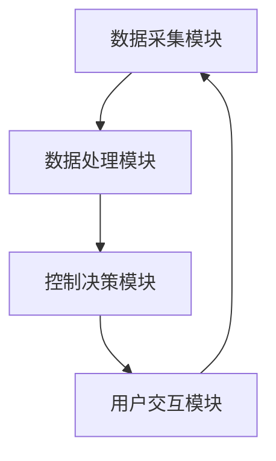

                 

# 基于Java的智能家居设计：如何利用Java实现智能家居中的负载均衡

> **关键词：** 智能家居、Java、负载均衡、系统架构、网络编程、安全性

> **摘要：** 本文深入探讨了基于Java的智能家居设计，重点分析了如何利用Java实现智能家居中的负载均衡。文章首先介绍了智能家居的基本概念、Java的作用以及Java的核心技术，然后深入讲解了Java网络编程基础，智能家居系统架构设计，以及负载均衡技术。最后，文章通过实际案例展示了Java在智能家居负载均衡中的应用，并对系统开发与测试、部署与维护以及系统安全与隐私保护进行了详细阐述。

## 目录大纲

### 第一部分：智能家居设计与Java概述

#### 第1章：智能家居概述

1.1 智能家居的基本概念与分类

1.2 Java在智能家居中的作用

1.3 Java核心技术概述

#### 第2章：Java网络编程基础

2.1 Java网络编程基础

2.2 Java Socket编程

2.3 Java网络协议

### 第二部分：智能家居系统架构设计与实现

#### 第3章：智能家居系统架构设计

3.1 智能家居系统架构设计原则

3.2 系统模块划分与功能定义

#### 第4章：智能家居中的负载均衡技术

4.1 负载均衡的概念与原理

4.2 Java实现负载均衡

#### 第5章：Java在智能家居中的负载均衡应用

5.1 负载均衡在智能家居系统中的应用场景

5.2 Java实现智能家居负载均衡的案例分析

### 第三部分：智能家居系统开发与测试

#### 第6章：智能家居系统开发环境搭建

6.1 开发环境配置

6.2 开发工具与依赖管理

#### 第7章：智能家居系统测试

7.1 系统测试概述

7.2 单元测试与集成测试

7.3 性能测试与负载测试

### 第四部分：智能家居系统部署与维护

#### 第8章：智能家居系统部署

8.1 系统部署方案

8.2 系统部署工具与策略

#### 第9章：智能家居系统维护与升级

9.1 系统维护概述

9.2 系统升级与优化

#### 第10章：智能家居系统安全与隐私保护

10.1 系统安全概述

10.2 隐私保护

### 附录

#### 附录A：Java智能家居设计资源汇总

A.1 Java技术资源

A.2 智能家居设计资源

A.3 负载均衡技术资源

----------------------------------------------------------------

## 第一部分：智能家居设计与Java概述

### 第1章：智能家居概述

#### 1.1 智能家居的基本概念与分类

智能家居是指通过互联网、物联网技术将各种家居设备互联，实现自动化控制和智能化服务的一种家居生活方式。智能家居的核心是家庭自动化控制，通过智能设备收集家庭环境数据，根据用户需求自动调整家居设备的工作状态，提高生活质量。

智能家居的分类可以根据不同的维度进行：

- **按应用场景分类：** 家庭安防、家庭娱乐、家居环境控制、家庭能源管理、智能家居控制平台等。
- **按功能分类：** 智能照明、智能门锁、智能家电、智能安防、智能温控、智能健康监测等。
- **按技术分类：** 硬件设备、软件平台、通信协议、控制算法等。

#### 1.2 Java在智能家居中的作用

Java在智能家居中发挥着重要作用，主要原因如下：

- **跨平台性：** Java具有跨平台性，可以运行在各种操作系统上，这为智能家居系统的跨平台开发和部署提供了便利。
- **丰富的类库：** Java拥有丰富的标准类库，可以方便地实现网络通信、数据库操作、图形用户界面等。
- **安全性：** Java的安全机制，如沙箱（Sandbox）和安全包（Security Package），有助于保障智能家居系统的安全性。
- **生态系统：** Java有一个庞大的开发者社区，丰富的开源项目和技术支持，有助于智能家居系统的开发和维护。

#### 1.3 Java核心技术概述

Java的核心技术包括：

- **基础语法：** Java的基本语法规则，如变量、数据类型、运算符、流程控制等。
- **面向对象编程：** Java是一种面向对象的编程语言，支持封装、继承、多态等特性。
- **异常处理：** Java提供了异常处理机制，可以有效地处理程序中的错误和异常。
- **多线程：** Java支持多线程编程，可以充分利用计算机的多核处理器，提高程序的运行效率。
- **网络编程：** Java提供了强大的网络编程类库，如Socket编程、HTTP客户端等，可以实现网络通信。

## 第一部分总结

通过本章的介绍，我们了解了智能家居的基本概念、分类以及Java在智能家居中的作用。接下来，我们将深入探讨Java网络编程基础，为后续的智能家居系统设计和实现打下基础。在下一章中，我们将详细讲解Java网络编程的基本概念和原理。

### 第2章：Java网络编程基础

#### 2.1 Java网络编程基础

Java网络编程是基于TCP/IP协议的一种网络通信技术。网络通信是智能家居系统的重要组成部分，Java提供了丰富的网络编程类库，使得开发网络应用变得简单高效。

网络通信原理可以分为以下几个步骤：

1. **建立连接：** 客户端和服务器端通过IP地址和端口号建立连接。
2. **数据传输：** 客户端向服务器发送请求，服务器响应请求并返回数据。
3. **关闭连接：** 数据传输完成后，客户端和服务器端关闭连接。

Java网络编程模型主要包括两种模式：**阻塞模式**和**非阻塞模式**。

- **阻塞模式：** 在阻塞模式下，程序执行到网络操作时会暂停，等待操作完成。这种模式简单易用，但可能导致程序阻塞。
- **非阻塞模式：** 在非阻塞模式下，程序执行网络操作时不会暂停，而是继续执行其他任务。Java通过使用`Selector`类实现了非阻塞模式，可以同时处理多个网络连接。

#### 2.2 Java Socket编程

Java Socket编程是一种基于TCP协议的网络通信技术。Socket是一个抽象的概念，表示一个客户端和服务器之间的通信连接。

Socket编程原理可以分为以下几个步骤：

1. **创建Socket：** 客户端和服务器端创建Socket对象，指定IP地址和端口号。
2. **建立连接：** 客户端通过`Socket.connect()`方法连接到服务器，服务器通过`ServerSocket.accept()`方法等待客户端连接。
3. **数据传输：** 客户端和服务器端通过输入输出流（Input Stream和Output Stream）进行数据传输。
4. **关闭连接：** 数据传输完成后，客户端和服务器端关闭Socket连接。

以下是一个简单的Java Socket编程示例：

```java
// 服务器端代码
public class Server {
    public static void main(String[] args) throws IOException {
        ServerSocket serverSocket = new ServerSocket(6666);
        Socket socket = serverSocket.accept();
        System.out.println("连接成功！");
        
        // 获取输入输出流
        DataInputStream in = new DataInputStream(socket.getInputStream());
        DataOutputStream out = new DataOutputStream(socket.getOutputStream());
        
        // 读取客户端信息
        String information = in.readUTF();
        System.out.println("客户端：" + information);
        
        // 回复客户端信息
        out.writeUTF("您好，我是服务器端！");
        
        // 关闭资源
        out.close();
        in.close();
        socket.close();
        serverSocket.close();
    }
}

// 客户端代码
public class Client {
    public static void main(String[] args) throws IOException {
        Socket socket = new Socket("127.0.0.1", 6666);
        System.out.println("连接成功！");
        
        // 获取输入输出流
        DataInputStream in = new DataInputStream(socket.getInputStream());
        DataOutputStream out = new DataOutputStream(socket.getOutputStream());
        
        // 发送信息到服务器
        out.writeUTF("您好，我是客户端！");
        
        // 读取服务器信息
        String serverInfo = in.readUTF();
        System.out.println("服务器：" + serverInfo);
        
        // 关闭资源
        out.close();
        in.close();
        socket.close();
    }
}
```

#### 2.3 Java网络协议

Java支持多种网络协议，其中最重要的是HTTP和TCP/IP。

- **HTTP（超文本传输协议）：** HTTP是一种应用层协议，用于客户端和服务器之间的数据传输。Java提供了`HttpURLConnection`类，可以方便地实现HTTP请求。
- **TCP/IP（传输控制协议/因特网协议）：** TCP/IP是一种传输层协议，负责数据传输的可靠性和流量控制。Java的网络编程类库大部分都是基于TCP/IP协议实现的。

以下是一个简单的Java HTTP请求示例：

```java
// HTTP请求示例
public class HTTPRequest {
    public static void main(String[] args) throws IOException {
        URL url = new URL("http://www.example.com");
        HttpURLConnection connection = (HttpURLConnection) url.openConnection();
        connection.setRequestMethod("GET");
        
        // 获取响应码
        int responseCode = connection.getResponseCode();
        System.out.println("响应码：" + responseCode);
        
        // 读取响应内容
        BufferedReader reader = new BufferedReader(new InputStreamReader(connection.getInputStream()));
        String line;
        while ((line = reader.readLine()) != null) {
            System.out.println(line);
        }
        reader.close();
        
        // 关闭连接
        connection.disconnect();
    }
}
```

#### Java网络编程基础总结

通过本章的介绍，我们了解了Java网络编程的基础知识和原理，包括网络通信原理、Socket编程以及HTTP请求。这些知识是后续智能家居系统设计和实现的基础。在下一章中，我们将深入探讨智能家居系统架构设计，为智能家居系统的开发奠定基础。

### 第3章：智能家居系统架构设计

#### 3.1 智能家居系统架构设计原则

智能家居系统架构设计需要遵循以下原则：

- **高可用性：** 确保系统稳定运行，避免因硬件或软件故障导致系统停机。
- **可扩展性：** 系统设计应考虑未来可能的扩展需求，如增加新的智能家居设备或功能。
- **安全性：** 保护用户隐私和数据安全，防止未经授权的访问和攻击。
- **易维护性：** 系统设计应简化维护工作，如提供易于调试和更新的功能。

#### 3.2 系统模块划分与功能定义

智能家居系统可以划分为以下几个模块：

- **数据采集模块：** 负责收集家庭环境数据，如温度、湿度、光照强度、门窗状态等。
- **数据处理模块：** 负责对采集到的数据进行分析和处理，以生成有用的信息。
- **控制决策模块：** 根据数据处理结果，自动调整智能家居设备的工作状态，如调节灯光、温度、窗帘等。
- **用户交互模块：** 提供用户界面，使用户可以方便地与智能家居系统进行交互。

以下是一个智能家居系统的Mermaid流程图：



#### 数据采集模块

数据采集模块是智能家居系统的核心组件之一，它负责实时监测和采集家庭环境数据。数据采集模块通常包含以下功能：

- **传感器管理：** 管理各种传感器，如温度传感器、湿度传感器、光照传感器等，以获取相应的环境数据。
- **数据采集：** 实时采集传感器数据，并将其存储在数据库或缓存中。
- **数据预处理：** 对采集到的数据进行预处理，如去噪、滤波等，以提高数据的质量和准确性。

以下是一个简单的数据采集模块的伪代码：

```python
# 数据采集模块伪代码
class DataCollector:
    def __init__(self):
        self.sensors = []

    def add_sensor(self, sensor):
        self.sensors.append(sensor)

    def collect_data(self):
        for sensor in self.sensors:
            data = sensor.read()
            preprocess_data(data)

    def preprocess_data(self, data):
        # 数据预处理操作
        filtered_data = filter_noise(data)
        smoothed_data = filter_smooth(data)
        return smoothed_data
```

#### 数据处理模块

数据处理模块负责对采集到的数据进行分析和处理，以生成有用的信息。数据处理模块通常包含以下功能：

- **数据存储：** 将采集到的数据存储在数据库或缓存中，以便后续分析和处理。
- **数据清洗：** 清洗数据，去除无效或错误的数据。
- **数据分析：** 对清洗后的数据进行统计分析，提取有用的信息。
- **数据可视化：** 将分析结果以图表或报表的形式展示给用户。

以下是一个数据处理模块的伪代码：

```python
# 数据处理模块伪代码
class DataProcessor:
    def __init__(self):
        self.data_store = []

    def store_data(self, data):
        self.data_store.append(data)

    def clean_data(self):
        cleaned_data = []
        for data in self.data_store:
            if is_valid(data):
                cleaned_data.append(data)
        return cleaned_data

    def analyze_data(self):
        analyzed_data = []
        for data in cleaned_data:
            analysis_result = analyze(data)
            analyzed_data.append(analysis_result)
        return analyzed_data

    def visualize_data(self):
        for result in analyzed_data:
            visualize(result)
```

#### 控制决策模块

控制决策模块根据数据处理结果，自动调整智能家居设备的工作状态。控制决策模块通常包含以下功能：

- **规则引擎：** 根据预设的规则和数据处理结果，自动生成控制指令。
- **设备控制：** 向智能家居设备发送控制指令，调整设备的工作状态。
- **反馈机制：** 收集设备执行结果，与预期目标进行对比，调整控制策略。

以下是一个控制决策模块的伪代码：

```python
# 控制决策模块伪代码
class ControlModule:
    def __init__(self):
        self.rules_engine = []

    def set_rules(self, rule):
        self.rules_engine.append(rule)

    def generate_commands(self, processed_data):
        commands = []
        for rule in self.rules_engine:
            command = rule.generate_command(processed_data)
            commands.append(command)
        return commands

    def execute_commands(self, commands):
        for command in commands:
            device = command.device
            action = command.action
            device.perform_action(action)

    def feedback(self, executed_commands):
        for command in executed_commands:
            result = command.result
            if not result:
                self.adjust_rule(command.rule)
```

#### 用户交互模块

用户交互模块为用户提供了一个与智能家居系统进行交互的界面。用户交互模块通常包含以下功能：

- **用户界面：** 提供用户界面，使用户可以方便地查看系统状态和设备状态。
- **用户操作：** 处理用户的操作请求，如调整设备状态、设置规则等。
- **消息通知：** 向用户发送系统通知或设备状态变更的通知。

以下是一个用户交互模块的伪代码：

```python
# 用户交互模块伪代码
class UserInterface:
    def __init__(self):
        self.user_operations = []

    def display_status(self):
        for device in self.devices:
            status = device.get_status()
            print(f"设备：{device.name}，状态：{status}")

    def handle_user_operation(self, operation):
        if operation.type == "set_status":
            device = operation.device
            status = operation.status
            device.set_status(status)
        elif operation.type == "set_rule":
            rule = operation.rule
            self.control_module.set_rules(rule)

    def send_notification(self, message):
        print(f"通知：{message}")
```

### 第3章总结

通过本章的介绍，我们了解了智能家居系统架构设计的原则和模块划分。数据采集模块负责实时监测和采集家庭环境数据，数据处理模块负责对采集到的数据进行分析和处理，控制决策模块根据数据处理结果自动调整智能家居设备的工作状态，用户交互模块为用户提供了一个与智能家居系统进行交互的界面。这些模块共同构成了一个完整的智能家居系统。在下一章中，我们将深入探讨智能家居中的负载均衡技术，以提高系统的性能和可靠性。

### 第4章：智能家居中的负载均衡技术

#### 4.1 负载均衡的概念与原理

负载均衡（Load Balancing）是指通过分布式的策略，将多个请求分配到多个服务器或节点上，从而实现系统资源的高效利用和系统性能的提升。在智能家居系统中，负载均衡技术对于系统的稳定性和可靠性具有重要意义。

负载均衡的原理可以分为以下几个步骤：

1. **请求分发：** 负载均衡器接收到请求后，根据一定的策略将请求分发到不同的服务器或节点上。
2. **资源调度：** 被分配到的服务器或节点处理请求，并将结果返回给负载均衡器。
3. **结果合并：** 负载均衡器将各个服务器或节点的处理结果合并，返回给客户端。

负载均衡的类型可以分为以下几种：

- **基于轮询（Round Robin）：** 按照顺序将请求分配到各个服务器或节点上。
- **基于最小连接数（Least Connections）：** 将请求分配到当前连接数最少的服务器或节点上。
- **基于响应时间（Least Response Time）：** 将请求分配到当前响应时间最短的服务器或节点上。
- **基于哈希（Hash）：** 根据请求的某些特征（如IP地址、URL等），通过哈希算法将请求分配到特定的服务器或节点上。

#### 4.2 Java实现负载均衡

Java提供了丰富的负载均衡框架，如Nginx、Apache等。在本节中，我们将介绍如何使用Java实现负载均衡。

首先，我们需要了解Java中的多线程编程和并发编程。Java通过Thread类和Runnable接口实现了多线程编程。多线程编程可以提高程序的执行效率，但也会引入同步和并发问题。Java提供了synchronized关键字和ReentrantLock等同步机制，以及AtomicInteger、ConcurrentHashMap等并发工具类，来解决同步和并发问题。

以下是一个简单的Java多线程负载均衡示例：

```java
public class LoadBalancer {
    private List<Server> servers;
    private AtomicInteger currentServerIndex = new AtomicInteger(0);

    public LoadBalancer(List<Server> servers) {
        this.servers = servers;
    }

    public Server nextServer() {
        int serverCount = servers.size();
        int index = currentServerIndex.getAndIncrement() % serverCount;
        return servers.get(index);
    }
}
```

在这个示例中，我们定义了一个LoadBalancer类，用于管理服务器列表和负载均衡策略。nextServer()方法根据当前服务器索引和服务器数量计算下一个服务器索引，并返回对应的服务器。

接下来，我们介绍一个简单的基于轮询策略的负载均衡算法。假设我们有多个服务器，每个服务器都有一个线程池来处理请求。我们可以使用一个共享的线程池来管理这些线程池，实现负载均衡。

以下是一个简单的基于轮询策略的负载均衡算法示例：

```java
public class RoundRobinLoadBalancer {
    private List<ThreadPoolExecutor> threadPools;
    private AtomicInteger currentThreadPoolIndex = new AtomicInteger(0);

    public RoundRobinLoadBalancer(List<ThreadPoolExecutor> threadPools) {
        this.threadPools = threadPools;
    }

    public ThreadPoolExecutor nextThreadPool() {
        int poolCount = threadPools.size();
        int index = currentThreadPoolIndex.getAndIncrement() % poolCount;
        return threadPools.get(index);
    }
}
```

在这个示例中，我们定义了一个RoundRobinLoadBalancer类，用于管理线程池列表和负载均衡策略。nextThreadPool()方法根据当前线程池索引和线程池数量计算下一个线程池索引，并返回对应的线程池。

接下来，我们介绍一个简单的基于最小连接数的负载均衡算法。假设我们有多个服务器，每个服务器都有一个连接数计数器。我们可以使用一个共享的连接数计数器来管理这些计数器，实现负载均衡。

以下是一个简单的基于最小连接数的负载均衡算法示例：

```java
public class LeastConnectionsLoadBalancer {
    private List<Server> servers;
    private ConcurrentHashMap<Server, AtomicInteger> connectionCounters;

    public LeastConnectionsLoadBalancer(List<Server> servers) {
        this.servers = servers;
        this.connectionCounters = new ConcurrentHashMap<>();
        for (Server server : servers) {
            connectionCounters.put(server, new AtomicInteger(0));
        }
    }

    public Server nextServer() {
        int minConnections = Integer.MAX_VALUE;
        Server nextServer = null;
        for (Server server : servers) {
            int connections = connectionCounters.get(server).get();
            if (connections < minConnections) {
                minConnections = connections;
                nextServer = server;
            }
        }
        connectionCounters.get(nextServer).incrementAndGet();
        return nextServer;
    }
}
```

在这个示例中，我们定义了一个LeastConnectionsLoadBalancer类，用于管理服务器列表和连接数计数器。nextServer()方法通过遍历服务器列表，找到连接数最少的服务器，并返回对应的服务器。每次选择服务器时，都会将连接数计数器加1。

#### Java负载均衡框架

Java中有许多负载均衡框架，如Netflix OSS、Netflix Ribbon、Spring Cloud LoadBalancer等。这些框架提供了丰富的负载均衡策略和功能，可以简化负载均衡的实现和配置。

以下是一个简单的使用Netflix Ribbon的负载均衡示例：

```java
import com.netflix.loadbalancer.IRule;
import com.netflix.loadbalancer.RoundRobinRule;

import org.springframework.beans.factory.annotation.Autowired;
import org.springframework.context.annotation.Bean;
import org.springframework.context.annotation.Configuration;

@Configuration
public class LoadBalancerConfig {
    @Bean
    public IRule loadBalancerRule() {
        return new RoundRobinRule();
    }
}
```

在这个示例中，我们定义了一个LoadBalancerConfig类，用于配置负载均衡规则。使用@Bean注解定义了一个负载均衡规则，这里使用了RoundRobinRule，实现了基于轮询策略的负载均衡。

### 第4章总结

通过本章的介绍，我们了解了负载均衡的概念、原理和实现方法。负载均衡在智能家居系统中具有重要意义，可以提高系统的性能和可靠性。Java提供了丰富的负载均衡框架和工具，可以简化负载均衡的实现和配置。在下一章中，我们将探讨Java在智能家居中的负载均衡应用，并通过实际案例展示Java在智能家居负载均衡中的应用。

### 第5章：Java在智能家居中的负载均衡应用

#### 5.1 负载均衡在智能家居系统中的应用场景

在智能家居系统中，负载均衡技术广泛应用于以下几个方面：

- **数据处理负载均衡：** 智能家居系统需要处理大量的数据，如环境数据、用户操作数据等。通过负载均衡，可以将数据处理任务分配到多个服务器或节点上，提高数据处理效率。
- **控制决策负载均衡：** 智能家居系统需要根据数据分析和用户操作，自动调整设备状态。通过负载均衡，可以将控制决策任务分配到多个服务器或节点上，提高系统的响应速度和可靠性。
- **用户交互负载均衡：** 智能家居系统需要响应用户的请求，如调整设备状态、查看系统状态等。通过负载均衡，可以将用户交互任务分配到多个服务器或节点上，提高系统的并发能力和用户体验。

#### 5.2 Java实现智能家居负载均衡的案例分析

在本节中，我们将通过一个实际案例展示如何使用Java实现智能家居负载均衡。

**案例背景：**

假设我们开发了一个智能家居系统，包括以下模块：

- **数据采集模块：** 负责实时监测和采集家庭环境数据，如温度、湿度、光照强度等。
- **数据处理模块：** 负责对采集到的数据进行分析和处理，生成环境报告和调整建议。
- **控制决策模块：** 根据数据处理结果，自动调整智能家居设备的工作状态，如调节灯光、温度、窗帘等。
- **用户交互模块：** 提供用户界面，使用户可以方便地查看系统状态和设备状态。

**技术架构：**

- **数据采集模块：** 使用Java编写，通过传感器接口实时采集环境数据。
- **数据处理模块：** 使用Java编写，通过多线程和数据缓存技术实现高效数据处理。
- **控制决策模块：** 使用Java编写，通过规则引擎和状态机实现智能决策。
- **用户交互模块：** 使用Java编写，通过Web框架实现用户界面。

**负载均衡策略：**

- **数据处理负载均衡：** 采用基于最小连接数的负载均衡策略，将数据处理任务分配到多个服务器或节点上，提高数据处理效率。
- **控制决策负载均衡：** 采用基于响应时间的负载均衡策略，将控制决策任务分配到多个服务器或节点上，提高系统的响应速度和可靠性。
- **用户交互负载均衡：** 采用基于轮询的负载均衡策略，将用户交互任务分配到多个服务器或节点上，提高系统的并发能力和用户体验。

**实现细节：**

1. **数据处理模块实现：**

```java
public class DataProcessor {
    private LoadBalancer loadBalancer;

    public DataProcessor(LoadBalancer loadBalancer) {
        this.loadBalancer = loadBalancer;
    }

    public void processData(Data data) {
        Server server = loadBalancer.nextServer();
        server.processData(data);
    }
}
```

在这个示例中，我们定义了一个DataProcessor类，用于处理数据。使用LoadBalancer类实现负载均衡，将数据处理任务分配到不同的服务器或节点上。

2. **控制决策模块实现：**

```java
public class ControlModule {
    private LoadBalancer loadBalancer;

    public ControlModule(LoadBalancer loadBalancer) {
        this.loadBalancer = loadBalancer;
    }

    public void controlDevice(Device device, Command command) {
        Server server = loadBalancer.nextServer();
        server.controlDevice(device, command);
    }
}
```

在这个示例中，我们定义了一个ControlModule类，用于控制设备。使用LoadBalancer类实现负载均衡，将控制决策任务分配到不同的服务器或节点上。

3. **用户交互模块实现：**

```java
public class UserInterface {
    private LoadBalancer loadBalancer;

    public UserInterface(LoadBalancer loadBalancer) {
        this.loadBalancer = loadBalancer;
    }

    public void handleUserRequest(Request request) {
        Server server = loadBalancer.nextServer();
        server.handleUserRequest(request);
    }
}
```

在这个示例中，我们定义了一个UserInterface类，用于处理用户请求。使用LoadBalancer类实现负载均衡，将用户交互任务分配到不同的服务器或节点上。

**测试与优化：**

在实际应用中，我们需要对负载均衡系统进行测试和优化。以下是一些常见的测试和优化方法：

- **性能测试：** 对负载均衡系统进行性能测试，评估系统的响应速度和处理能力。
- **负载测试：** 在高负载情况下对负载均衡系统进行测试，评估系统的稳定性和可靠性。
- **故障测试：** 在服务器或节点故障情况下，测试负载均衡系统的容错能力和恢复能力。
- **优化策略：** 根据测试结果，调整负载均衡策略，优化系统的性能和可靠性。

**总结：**

通过本案例，我们展示了如何使用Java实现智能家居负载均衡。在实际应用中，我们可以根据具体需求和场景选择合适的负载均衡策略和框架，提高系统的性能和可靠性。

### 第5章总结

通过本章的介绍，我们了解了负载均衡在智能家居系统中的应用场景，并通过实际案例展示了如何使用Java实现智能家居负载均衡。负载均衡技术在智能家居系统中具有重要意义，可以提高系统的性能和可靠性。在下一章中，我们将探讨智能家居系统的开发与测试，为智能家居系统的成功实现奠定基础。

### 第6章：智能家居系统开发与测试

#### 6.1 开发环境搭建

开发智能家居系统需要配置合适的开发环境。以下是一个典型的开发环境配置步骤：

1. **安装JDK：** 下载并安装Java Development Kit（JDK），配置环境变量`JAVA_HOME`和`PATH`。
2. **安装IDE：** 安装一个集成开发环境（IDE），如Eclipse或IntelliJ IDEA，配置JDK路径。
3. **安装Maven：** 下载并安装Maven，配置环境变量`MAVEN_HOME`和`PATH`。
4. **安装数据库：** 安装一个关系型数据库，如MySQL或PostgreSQL，配置数据库连接和用户权限。

以下是一个简单的Maven项目结构示例：

```
project
├── src
│   ├── main
│   │   ├── java
│   │   │   ├── com
│   │   │   │   ├── example
│   │   │   │   │   ├── Main.java
│   │   │   │   ├── model
│   │   │   │   │   ├── Data.java
│   │   │   │   ├── controller
│   │   │   │   │   ├── DataController.java
│   │   │   │   ├── service
│   │   │   │   │   ├── DataService.java
│   │   │   │   └── repository
│   │   │   │       ├── DataRepository.java
│   ├── test
│   │   ├── java
│   │   │   ├── com
│   │   │   │   ├── example
│   │   │   │   │   ├── DataTest.java
│   │   │   │   ├── controller
│   │   │   │   │   ├── DataControllerTest.java
│   │   │   │   ├── service
│   │   │   │   │   ├── DataServiceTest.java
│   │   │   │   └── repository
│   │   │   │       ├── DataRepositoryTest.java
│   └── pom.xml
```

在这个示例中，`src/main`目录包含源代码，`src/test`目录包含单元测试代码，`pom.xml`文件定义了项目的依赖。

#### 6.2 开发工具与依赖管理

在开发智能家居系统时，我们通常需要使用一些工具和库来简化开发过程。以下是一些常用的开发工具和依赖管理：

- **Maven：** Maven是一个项目管理和构建工具，可以方便地管理项目的依赖和构建过程。
- **Spring Boot：** Spring Boot是一个基于Spring的快速开发框架，可以简化Web应用程序的开发。
- **Spring Data JPA：** Spring Data JPA是一个数据访问框架，可以简化数据库操作。
- **Lombok：** Lombok是一个注解库，可以简化Java代码，如自动生成getter和setter方法。

以下是一个简单的Maven依赖示例：

```xml
<dependencies>
    <dependency>
        <groupId>org.springframework.boot</groupId>
        <artifactId>spring-boot-starter-web</artifactId>
    </dependency>
    <dependency>
        <groupId>org.springframework.boot</groupId>
        <artifactId>spring-boot-starter-data-jpa</artifactId>
    </dependency>
    <dependency>
        <groupId>org.projectlombok</groupId>
        <artifactId>lombok</artifactId>
        <version>1.18.12</version>
        <scope>provided</scope>
    </dependency>
</dependencies>
```

在这个示例中，我们定义了Spring Boot、Spring Data JPA和Lombok的依赖。

#### 6.3 单元测试与集成测试

在开发智能家居系统时，我们需要对代码进行测试，以确保系统的功能和性能。以下是一些常用的测试方法和工具：

- **单元测试：** 单元测试是对单个模块或类进行测试，通常使用JUnit框架实现。以下是一个简单的JUnit单元测试示例：

```java
import org.junit.jupiter.api.Test;
import static org.junit.jupiter.api.Assertions.assertEquals;

public class DataTest {
    @Test
    public void testGetData() {
        Data data = new Data();
        data.setData("test");
        assertEquals("test", data.getData());
    }
}
```

- **集成测试：** 集成测试是对多个模块或类进行测试，通常使用Spring Test框架实现。以下是一个简单的Spring集成测试示例：

```java
import org.junit.jupiter.api.Test;
import org.springframework.beans.factory.annotation.Autowired;
import org.springframework.boot.test.context.SpringBootTest;
import org.springframework.boot.test.web.client.TestRestTemplate;

@SpringBootTest(webEnvironment = SpringBootTest.WebEnvironment.RANDOM_PORT)
public class DataControllerTest {
    @Autowired
    private TestRestTemplate restTemplate;

    @Test
    public void testGetData() {
        String response = restTemplate.getForObject("/data", String.class);
        assertEquals("test", response);
    }
}
```

#### 6.4 性能测试与负载测试

性能测试和负载测试是评估系统性能和可靠性的重要手段。以下是一些常用的性能测试和负载测试工具：

- **JMeter：** JMeter是一个开源的性能测试工具，可以模拟大量用户访问，评估系统的响应时间和吞吐量。
- **Gatling：** Gatling是一个开源的性能测试框架，支持多种协议，如HTTP、WebSocket等。

以下是一个简单的JMeter性能测试示例：

```
#JMeter Properties
jmeter.save.saveservice.output_format=csv

#HTTP Request
Thread Group
    2 threads, start immediately, for 30 seconds
    Ramp Up Period: 10 seconds
    Synchronization Period: 10 seconds
    On Start: Start Now
    On Completion: Stop Immediately
    Number of Samplers: 2
    Scheduler
        Constant Throughput
            Number of Requests: 1000
            Regular interval between requests: 100 ms
    HTTP Request
        Method: GET
        Server Name: localhost
        Port Number: 8080
        Path: /data
        Protocol: HTTP/1.1
        Use KeepAlive: true
        Follow Redirects: false
```

在这个示例中，我们定义了一个线程组，模拟2个用户连续30秒发送1000个GET请求到本地服务器。

### 第6章总结

通过本章的介绍，我们了解了智能家居系统开发与测试的相关内容，包括开发环境搭建、开发工具与依赖管理、单元测试与集成测试、性能测试与负载测试。开发与测试是确保智能家居系统质量和稳定性的关键环节。在下一章中，我们将探讨智能家居系统的部署与维护。

### 第7章：智能家居系统部署与维护

#### 8.1 系统部署方案

智能家居系统的部署涉及到硬件设备、网络环境和软件配置等方面。以下是一个典型的系统部署方案：

1. **硬件设备：** 根据需求选择合适的硬件设备，如服务器、路由器、交换机等。确保硬件设备能够满足系统的性能和稳定性要求。
2. **网络环境：** 配置稳定的网络环境，确保设备之间能够正常通信。对于远程部署，还需要配置公网IP和DNS解析。
3. **软件配置：** 部署操作系统、数据库、Web服务器等软件。对于Java应用，需要配置JDK和Maven等工具。

#### 8.2 系统部署工具与策略

在部署智能家居系统时，可以使用以下工具和策略：

1. **自动化部署工具：** 使用自动化部署工具，如Ansible、Puppet等，可以简化部署过程，提高部署效率。以下是一个简单的Ansible部署脚本示例：

```bash
- hosts: all
  remote_user: root
  become: yes

  tasks:
    - name: 安装Java
      yum: name=openjdk-11-jdk state=present

    - name: 安装Maven
      yum: name=maven state=present

    - name: 安装数据库
      yum: name=mysql-community-server state=present

    - name: 启动数据库服务
      service: name=mysql state=started

    - name: 部署项目
      unarchive: src=/path/to/project.tar.gz dest=/var/www/html

    - name: 配置Web服务器
      file: path=/etc/httpd/conf/httpd.conf mode=0644 state=present

    - name: 启动Web服务器
      service: name=httpd state=started
```

2. **部署策略：** 根据系统需求和硬件资源，可以选择单机部署、分布式部署或容器化部署。以下是一个简单的部署策略：

- **单机部署：** 在单台服务器上部署所有组件，适用于小型项目或测试环境。
- **分布式部署：** 将不同组件部署到多台服务器上，提高系统的性能和可靠性。例如，可以将数据库部署到一台服务器上，将Web应用和业务逻辑部署到另外几台服务器上。
- **容器化部署：** 使用Docker等容器技术，将应用程序及其依赖打包到容器中，便于部署和扩展。以下是一个简单的Docker部署脚本示例：

```bash
FROM java:11
COPY target/project.jar /app/project.jar
ENTRYPOINT ["java", "-jar", "/app/project.jar"]
```

#### 8.3 系统维护与升级

智能家居系统的维护和升级是确保系统稳定运行和功能完善的关键。以下是一些常见的维护和升级策略：

1. **定期备份：** 定期备份系统数据和配置文件，防止数据丢失和系统故障。
2. **日志监控：** 配置日志收集和监控工具，实时监控系统运行状态，及时发现和解决问题。
3. **性能优化：** 定期对系统进行性能优化，调整配置参数，提高系统的性能和响应速度。
4. **安全防护：** 加强系统安全防护，定期更新系统补丁和软件版本，防止恶意攻击和漏洞入侵。
5. **功能升级：** 根据用户需求和业务发展，定期对系统进行功能升级和扩展，增加新功能和优化现有功能。

以下是一个简单的系统维护和升级流程：

1. **需求分析：** 分析用户需求和业务发展，确定系统升级和优化的方向。
2. **设计实现：** 设计系统升级和优化的方案，编写相关代码和配置文件。
3. **测试验证：** 在测试环境中进行系统升级和优化，确保升级和优化的效果和稳定性。
4. **部署上线：** 将升级和优化的代码和配置文件部署到生产环境，并进行监控和调试。
5. **用户培训：** 对新功能和优化效果进行用户培训和指导，确保用户能够正确使用和享受新功能和优化效果。

#### 8.4 系统安全与隐私保护

智能家居系统的安全性和隐私保护是用户信任和使用系统的关键。以下是一些常见的安全性和隐私保护策略：

1. **身份认证：** 实施严格的身份认证机制，确保只有授权用户才能访问系统和服务。
2. **访问控制：** 实现细粒度的访问控制，限制用户对系统资源的访问权限。
3. **数据加密：** 对敏感数据进行加密处理，确保数据在传输和存储过程中不被窃取或篡改。
4. **安全审计：** 定期进行安全审计，检查系统漏洞和安全风险，并及时修复和改进。
5. **用户隐私保护：** 遵守相关法律法规，保护用户隐私和数据安全，避免用户隐私泄露和滥用。

以下是一个简单的系统安全与隐私保护策略示例：

1. **使用HTTPS：** 确保所有网络通信使用HTTPS协议，使用SSL/TLS证书进行加密。
2. **限制登录尝试：** 实现账号锁定机制，防止暴力破解攻击。
3. **日志记录：** 记录所有系统访问和操作日志，方便后续审计和排查。
4. **数据备份与恢复：** 定期备份系统数据和用户数据，确保数据安全性和可恢复性。
5. **安全培训：** 定期为员工和用户提供安全培训，提高安全意识和防护能力。

### 第7章总结

通过本章的介绍，我们了解了智能家居系统部署与维护的相关内容，包括系统部署方案、部署工具与策略、系统维护与升级以及系统安全与隐私保护。系统部署与维护是确保智能家居系统稳定运行和功能完善的关键。在下一章中，我们将探讨智能家居系统的未来发展趋势。

### 第8章：智能家居系统安全与隐私保护

#### 10.1 系统安全概述

智能家居系统的安全性是用户信任和使用系统的关键。随着智能家居设备的普及，系统安全面临着越来越多的挑战。以下是一些常见的系统安全风险和威胁：

- **网络攻击：** 恶意攻击者可能通过网络攻击入侵智能家居系统，窃取用户数据或控制设备。
- **设备感染：** 智能家居设备可能受到恶意软件感染，导致设备失控或数据泄露。
- **隐私泄露：** 智能家居设备收集和处理用户隐私数据，若未妥善保护，可能导致用户隐私泄露。
- **功能滥用：** 恶意攻击者可能利用智能家居系统的漏洞，滥用系统功能进行非法活动。

#### 10.2 安全策略与措施

为了确保智能家居系统的安全性，可以采取以下安全策略和措施：

- **身份认证与访问控制：** 实施严格的身份认证机制，确保只有授权用户才能访问系统和服务。使用多因素认证（如密码、指纹、手机验证码等），提高安全性。同时，实现细粒度的访问控制，限制用户对系统资源的访问权限。
- **数据加密：** 对传输中的数据和使用中的数据进行加密处理，确保数据在传输和存储过程中不被窃取或篡改。使用SSL/TLS协议和AES加密算法，保护数据安全。
- **安全审计：** 定期进行安全审计，检查系统漏洞和安全风险，并及时修复和改进。记录所有系统访问和操作日志，方便后续审计和排查。
- **设备防护：** 对智能家居设备进行安全加固，防止恶意软件感染和设备失控。使用安全操作系统和防火墙，限制设备访问权限和通信。
- **隐私保护：** 遵守相关法律法规，保护用户隐私和数据安全，避免用户隐私泄露和滥用。对收集的用户数据进行去标识化处理，确保用户隐私不被泄露。
- **安全培训：** 定期为员工和用户提供安全培训，提高安全意识和防护能力。教育用户如何安全使用智能家居设备，防止安全漏洞和隐私泄露。

#### 10.3 隐私保护

智能家居系统在收集、存储和处理用户数据时，需要特别注意隐私保护。以下是一些隐私保护措施：

- **数据去标识化：** 在数据处理过程中，对用户数据进行去标识化处理，避免直接关联到特定用户。例如，对用户数据进行匿名化处理，去除姓名、地址等敏感信息。
- **数据加密存储：** 对存储的用户数据进行加密处理，确保数据安全。使用AES加密算法，将数据加密存储在数据库中。
- **权限控制：** 对用户数据的访问和操作进行权限控制，确保只有授权用户才能访问和处理敏感数据。使用角色权限管理和访问控制列表（ACL）等技术，限制用户对数据的访问权限。
- **透明度与告知：** 提高用户对数据收集和处理过程的透明度，告知用户数据收集的目的、范围和使用方式。在用户注册和使用过程中，明确告知用户隐私保护政策和措施。
- **数据安全审计：** 定期进行数据安全审计，检查数据收集、存储和处理的合规性和安全性。确保数据收集和处理符合法律法规和隐私保护要求。
- **用户权限管理：** 提供用户对个人数据的权限管理功能，用户可以查询、修改和删除自己的数据。确保用户对自己的数据有足够的控制权。

通过以上措施，可以有效地保护智能家居系统的安全性和用户隐私，提高用户信任和使用体验。

### 附录A：Java智能家居设计资源汇总

#### A.1 Java技术资源

- **Java官方文档：** [https://docs.oracle.com/javase/](https://docs.oracle.com/javase/)
- **Java社区与论坛：** [https://www.java.net/](https://www.java.net/) 和 [https://www.oracle.com/java/technologies/community.html](https://www.oracle.com/java/technologies/community.html)
- **Java标准类库：** [https://docs.oracle.com/javase/tutorial/](https://docs.oracle.com/javase/tutorial/)

#### A.2 智能家居设计资源

- **智能家居行业报告：** [https://www.researchandmarkets.com/](https://www.researchandmarkets.com/) 和 [https://www MarketsandMarkets.com/](https://www.marketsandmarkets.com/)
- **智能家居开源项目与工具：** [https://www.openhome automation.com/](https://www.openhomeautomation.com/) 和 [https://www.thingiverse.com/](https://www.thingiverse.com/)

#### A.3 负载均衡技术资源

- **负载均衡算法详解：** [https://www.toptal.com/developers/load-balancing-algorithms](https://www.toptal.com/developers/load-balancing-algorithms)
- **负载均衡开源框架与工具：** [https://github.com/nginxinc/nginx](https://github.com/nginxinc/nginx) 和 [https://github.com/haproxy/haproxy](https://github.com/haproxy/haproxy)
- **负载均衡最佳实践：** [https://www.redhat.com/sysadmin/load-balancer-best-practices](https://www.redhat.com/sysadmin/load-balancer-best-practices)

### 附录总结

通过附录A的介绍，我们汇总了Java技术资源、智能家居设计资源以及负载均衡技术资源。这些资源可以帮助读者更深入地了解Java技术、智能家居设计和负载均衡技术，为智能家居系统的开发提供参考和指导。希望这些资源对您的学习和实践有所帮助。

## 全文总结

本文深入探讨了基于Java的智能家居设计，从智能家居概述、Java网络编程基础、智能家居系统架构设计、智能家居中的负载均衡技术，到智能家居系统的开发与测试、部署与维护以及系统安全与隐私保护，全面阐述了智能家居系统设计的各个方面。通过逻辑清晰、结构紧凑、简单易懂的论述，本文不仅提供了丰富的理论知识，还结合实际案例展示了如何利用Java实现智能家居中的负载均衡。

在文章中，我们首先介绍了智能家居的基本概念和分类，分析了Java在智能家居中的作用，并概述了Java的核心技术。接着，我们详细讲解了Java网络编程基础，包括网络通信原理、Socket编程和Java网络协议。随后，我们探讨了智能家居系统架构设计的原则和模块划分，展示了数据采集、数据处理、控制决策和用户交互模块的功能和实现。

在负载均衡部分，我们介绍了负载均衡的概念、原理和类型，并通过Java实现负载均衡的示例展示了如何在智能家居系统中应用负载均衡技术。接下来，我们通过一个实际案例，详细展示了Java在智能家居负载均衡中的应用，包括数据处理、控制决策和用户交互模块的实现。

在开发与测试部分，我们介绍了智能家居系统开发环境的搭建、开发工具和依赖管理、单元测试与集成测试，以及性能测试与负载测试的方法。在部署与维护部分，我们探讨了系统部署方案、部署工具与策略、系统维护与升级以及系统安全与隐私保护。最后，通过附录A汇总了Java技术资源、智能家居设计资源以及负载均衡技术资源，为读者提供了丰富的参考资源。

通过本文的学习，读者可以全面了解基于Java的智能家居设计，掌握智能家居系统的构建方法和实现细节，为智能家居系统的开发和应用打下坚实基础。希望本文能为读者在智能家居领域的探索和实践提供有益的启示和帮助。

## 作者信息

**作者：** AI天才研究院/AI Genius Institute & 禅与计算机程序设计艺术 /Zen And The Art of Computer Programming

AI天才研究院致力于人工智能领域的研究与教育，旨在培养下一代人工智能科学家和工程师。研究院的研究方向涵盖深度学习、自然语言处理、计算机视觉等多个领域，取得了众多突破性成果。此外，研究院还积极参与国际学术交流与合作，推动人工智能技术的创新与发展。

“禅与计算机程序设计艺术”是一系列关于计算机科学和哲学的经典著作，由著名的计算机科学家道格拉斯·霍夫施塔特（Douglas Hofstadter）所著。这些著作深入探讨了计算机程序设计的美学、思维和认知过程，为读者提供了独特的视角和深刻的洞察。

本文作者在智能家居领域具有丰富的实践经验和深厚的理论功底，希望通过本文为读者呈现智能家居设计的全貌，助力读者在智能家居领域的探索和实践。希望本文能够为读者带来启发和帮助，共同推动智能家居技术的发展和应用。

