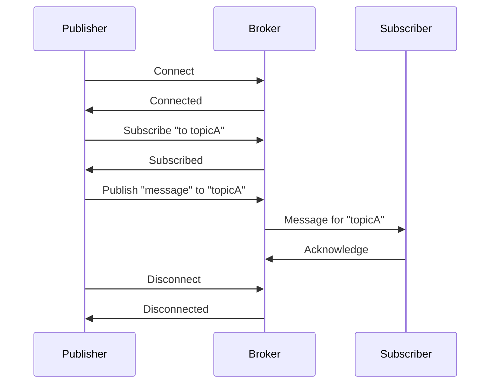
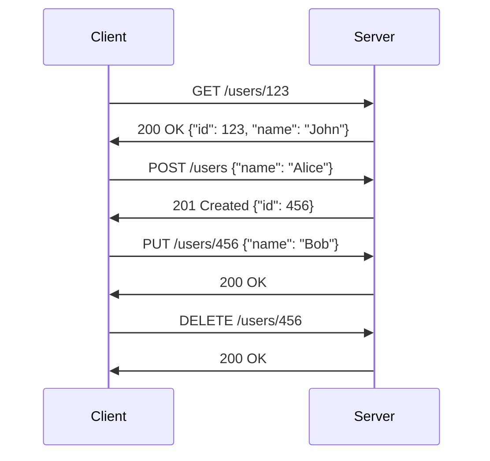
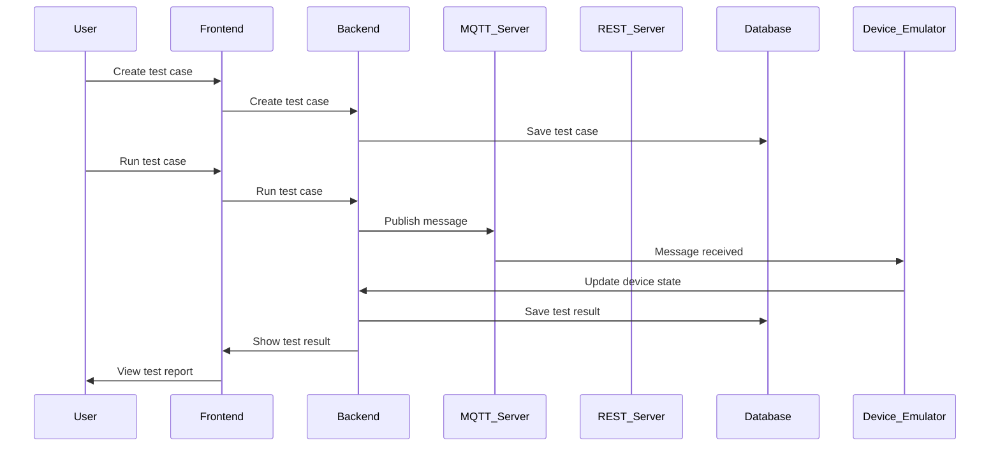

                 

### 文章标题

**《基于MQTT协议和RESTful API的智能家居自动化测试平台》**

关键词：MQTT协议、RESTful API、智能家居、自动化测试、测试平台

摘要：本文将探讨如何构建一个基于MQTT协议和RESTful API的智能家居自动化测试平台。通过对MQTT协议和RESTful API的深入分析，我们将介绍其基本原理和应用场景。随后，我们将详细阐述智能家居测试平台的架构设计，包括MQTT和RESTful API的集成、测试用例的设计与管理，以及测试结果的收集与分析。最后，我们将通过实际项目实战，展示如何实现并优化智能家居自动化测试平台，为智能家居行业提供技术支持和创新思路。

### 第一部分：智能家居测试平台概述

在当今智能化的时代，智能家居系统已经成为了提高生活质量的重要工具。然而，随着智能家居设备的增多和系统的复杂化，对智能家居系统进行有效测试变得至关重要。一个完善的智能家居自动化测试平台不仅能够确保系统的稳定性和可靠性，还能提高开发效率和产品质量。

#### 第1章：智能家居测试平台概述

1.1 **智能家居测试平台的定义与重要性**

智能家居测试平台是一个专门用于对智能家居系统进行测试的软件工具。它能够模拟各种智能家居设备的工作状态，对系统进行功能测试、性能测试和可靠性测试。通过自动化测试平台，开发团队能够快速发现并修复系统中的缺陷，提高系统的稳定性和用户体验。

智能家居测试平台的重要性体现在以下几个方面：

- **提高开发效率**：自动化测试可以大大减少手动测试的工作量，提高测试的覆盖率和效率。
- **确保系统质量**：自动化测试能够发现系统中的潜在问题，提高软件的质量和可靠性。
- **降低成本**：自动化测试可以减少人工成本，降低测试成本。

1.2 **MQTT协议的基本原理与应用**

MQTT（Message Queuing Telemetry Transport）协议是一种轻量级的消息传输协议，适用于低带宽、高延迟的网络环境。它通过发布/订阅模型进行数据传输，可以实现设备与服务器之间的实时通信。

MQTT协议的基本原理如下：

- **发布/订阅模型**：设备发布消息到特定的主题，服务器根据订阅关系将消息发送给订阅者。
- **QoS等级**：MQTT协议提供了三个QoS等级，用于保证消息传输的可靠性。

MQTT协议在智能家居中的应用场景包括：

- **设备状态监控**：通过MQTT协议，可以实时监控智能家居设备的工作状态。
- **远程控制**：用户可以通过MQTT协议远程控制智能家居设备。
- **数据采集**：智能家居设备可以定期向服务器发送数据，实现数据的采集和分析。

1.3 **RESTful API的概念与优势**

RESTful API（Representational State Transfer Application Programming Interface）是一种基于HTTP协议的应用程序接口设计风格。它通过URL表示资源的路径，使用HTTP方法（GET、POST、PUT、DELETE等）进行资源的操作。

RESTful API的优势包括：

- **简单易用**：RESTful API具有统一的接口设计，易于理解和使用。
- **可扩展性**：RESTful API支持通过URL扩展资源，方便进行系统扩展。
- **跨平台**：RESTful API可以支持多种编程语言和平台，便于不同系统之间的集成。

1.4 **MQTT与RESTful API在智能家居中的应用场景**

在智能家居系统中，MQTT协议和RESTful API可以互相补充，共同实现系统的智能化和自动化。

- **设备通信**：MQTT协议可以用于设备之间的实时通信，实现设备状态的监控和远程控制。
- **系统集成**：RESTful API可以用于系统之间的数据交换和集成，实现不同系统之间的协同工作。
- **数据分析**：通过MQTT协议采集的数据可以存储在数据库中，通过RESTful API进行数据的分析和处理。

1.5 **智能家居自动化测试的需求分析**

在智能家居自动化测试中，以下需求需要得到满足：

- **多样化测试场景**：需要模拟各种智能家居设备的工作状态，覆盖不同的测试场景。
- **实时数据监控**：需要实时监控智能家居设备的状态，及时发现并处理异常。
- **测试用例管理**：需要方便地管理测试用例，支持自动化执行和报告生成。
- **可扩展性**：需要支持系统的扩展和升级，适应不断变化的需求。

通过满足上述需求，智能家居自动化测试平台能够为智能家居系统提供全面的技术支持和质量保障。

### 第二部分：MQTT协议基础

MQTT协议作为一种轻量级的消息传输协议，在智能家居系统中得到了广泛应用。本部分将对MQTT协议的基础知识进行详细讲解，包括其发展历史、核心概念与术语、消息传输机制、安全性考虑和常见的QoS等级。

#### 第2章：MQTT协议基础

2.1 **MQTT协议的发展历史**

MQTT协议最早由IBM的Arjuna T. Talwalkar在1999年提出，主要用于家庭自动化和远程监控场景。由于其轻量级和低带宽的特点，MQTT协议很快在物联网（IoT）领域获得了广泛认可。2009年，MQTT协议正式成为了一个开源标准，并被许多知名公司和开源组织采纳。

2.2 **MQTT协议的核心概念与术语**

- **客户端（Client）**：使用MQTT协议进行通信的设备或应用程序。
- **服务器（Broker）**：接收和分发MQTT消息的服务器。
- **发布者（Publisher）**：发送消息的客户端。
- **订阅者（Subscriber）**：接收消息的客户端。
- **主题（Topic）**：消息的分类标识，用于发布者和订阅者之间的消息匹配。

2.3 **MQTT协议的消息传输机制**

MQTT协议的消息传输机制基于发布/订阅模型。发布者将消息发布到特定的主题，服务器根据订阅关系将消息发送给订阅者。这个过程包括以下几个步骤：

1. **连接**：客户端与服务器建立连接。
2. **订阅**：客户端向服务器订阅感兴趣的主题。
3. **发布**：客户端向服务器发布消息。
4. **接收**：服务器将消息发送给订阅者。
5. **断开连接**：客户端与服务器断开连接。

2.4 **MQTT协议的安全性考虑**

由于智能家居系统涉及到用户隐私和数据安全，MQTT协议的安全性至关重要。以下是一些常用的安全措施：

- **TLS/SSL**：使用TLS/SSL加密传输数据，确保数据在传输过程中的安全性。
- **身份认证**：通过用户名和密码、数字证书等方式进行身份认证，确保客户端和服务器之间的通信是可信的。
- **访问控制**：通过访问控制策略，限制客户端对特定主题的访问权限，防止未经授权的访问。

2.5 **MQTT协议的常见QoS等级**

MQTT协议提供了三个QoS等级，用于保证消息传输的可靠性：

- **QoS 0（至多一次）**：消息发送后立即发送，但不保证是否被接收或处理。适用于对可靠性要求不高的场景。
- **QoS 1（至少一次）**：消息发送后确保至少被接收一次，但可能多次接收。适用于对可靠性有一定要求的场景。
- **QoS 2（恰好一次）**：消息发送后确保恰好被接收和处理一次。适用于对可靠性要求极高的场景。

2.6 **MQTT协议的Mermaid流程图**

以下是MQTT协议的基本流程图的Mermaid表示：



通过这个流程图，我们可以清晰地看到MQTT协议的基本工作原理。

### 第三部分：RESTful API基础

RESTful API作为一种流行的Web服务设计风格，在智能家居系统中发挥着重要作用。本部分将详细讲解RESTful API的基本概念、设计原则、HTTP协议的应用、常见设计模式、状态码与错误处理，并使用Mermaid流程图展示其基本工作流程。

#### 第3章：RESTful API基础

3.1 **RESTful API的基本概念**

RESTful API（Representational State Transfer Application Programming Interface）是一种基于HTTP协议的应用程序接口设计风格。它通过统一接口设计、状态转移和客户端-服务器模式，实现了资源的操作和数据传输。

RESTful API的基本概念包括：

- **资源**：API中可操作的数据实体，如用户、订单等。
- **URL**：资源的唯一标识，如`/users/123`表示用户ID为123的资源。
- **HTTP方法**：用于操作资源的HTTP方法，如GET、POST、PUT、DELETE等。
- **状态码**：HTTP响应状态码，表示请求的结果，如200（成功）、404（未找到）、500（内部服务器错误）等。

3.2 **RESTful API的设计原则**

RESTful API的设计原则包括：

- **统一接口**：通过统一的接口设计，简化API的使用和学习。
- **状态转移**：使用HTTP方法表示资源的操作，通过状态转移实现业务逻辑。
- **无状态**：服务器不存储客户端的状态信息，每次请求都是独立的。
- **客户端-服务器模式**：客户端发送请求，服务器响应请求，两者相互独立。

3.3 **HTTP协议在RESTful API中的应用**

HTTP协议是RESTful API的核心，它提供了资源的定位、操作和传输机制。在RESTful API中，常用的HTTP方法包括：

- **GET**：获取资源，如`/users/123`获取用户ID为123的用户信息。
- **POST**：创建资源，如`/users`创建一个新的用户。
- **PUT**：更新资源，如`/users/123`更新用户ID为123的用户信息。
- **DELETE**：删除资源，如`/users/123`删除用户ID为123的用户。

3.4 **RESTful API的常见设计模式**

RESTful API的常见设计模式包括：

- **基于URL的命名**：通过URL命名资源，如`/users`、`/orders`等。
- **参数传递**：通过URL参数传递查询条件，如`/users?name=John`。
- **状态码与响应体**：使用HTTP状态码表示请求结果，通过响应体返回数据，如JSON或XML格式。

3.5 **RESTful API的状态码与错误处理**

RESTful API的状态码与错误处理是API设计的重要部分，用于表示请求结果和处理错误。常见的状态码包括：

- **200 OK**：请求成功。
- **201 Created**：资源创建成功。
- **400 Bad Request**：请求无效。
- **401 Unauthorized**：未授权。
- **403 Forbidden**：禁止访问。
- **404 Not Found**：资源未找到。
- **500 Internal Server Error**：内部服务器错误。

错误处理通常通过响应体返回错误信息，如JSON格式的错误详情。

3.6 **RESTful API的Mermaid流程图**

以下是RESTful API的基本流程图的Mermaid表示：



通过这个流程图，我们可以清晰地看到RESTful API的基本工作流程。

### 第四部分：智能家居测试平台的架构设计

在构建智能家居自动化测试平台时，架构设计是关键的一步。本部分将详细讲解智能家居测试平台的整体架构设计，包括MQTT协议和RESTful API的集成、测试用例的设计与管理、测试结果的收集与分析，以及平台架构的Mermaid流程图。

#### 第4章：智能家居测试平台的架构设计

4.1 **平台的整体架构设计**

智能家居测试平台的整体架构设计如下：

- **前端界面**：用于测试人员交互，提供测试用例的创建、执行和结果展示。
- **后端服务**：包括MQTT服务、RESTful API服务和测试管理服务，负责测试流程的管理和数据交换。
- **数据库**：存储测试用例、测试结果和设备信息。
- **设备模拟器**：模拟实际智能家居设备的工作状态，与后端服务进行通信。

4.2 **MQTT协议的集成与测试**

MQTT协议在智能家居测试平台中用于设备状态监控和远程控制。集成MQTT协议的步骤如下：

1. **搭建MQTT服务器**：选择合适的MQTT服务器，如mosquitto，并配置相应的安全措施。
2. **设备模拟器连接MQTT服务器**：设备模拟器作为MQTT客户端连接到MQTT服务器，订阅感兴趣的设备主题。
3. **测试用例触发MQTT发布**：测试用例触发MQTT发布者，模拟实际设备发送数据。
4. **后端服务接收MQTT消息**：后端服务从MQTT服务器接收消息，解析消息内容并更新设备状态。

4.3 **RESTful API的集成与测试**

RESTful API在智能家居测试平台中用于设备控制和数据查询。集成RESTful API的步骤如下：

1. **搭建RESTful API服务器**：使用合适的框架，如Spring Boot，搭建RESTful API服务器。
2. **前端界面调用RESTful API**：前端界面通过HTTP请求调用RESTful API，发送设备控制命令或查询设备数据。
3. **后端服务处理RESTful API请求**：后端服务处理HTTP请求，根据请求路径和方法调用相应的业务逻辑。
4. **测试结果反馈**：后端服务将处理结果反馈给前端界面，显示测试结果。

4.4 **测试用例的设计与管理**

测试用例的设计与管理是智能家居测试平台的核心功能。设计和管理测试用例的步骤如下：

1. **创建测试用例**：测试人员在前端界面创建测试用例，包括测试名称、测试描述、输入数据和预期结果等。
2. **测试用例分类**：根据测试目标，将测试用例分类管理，如功能测试、性能测试和可靠性测试等。
3. **执行测试用例**：测试人员选择测试用例并执行，系统自动调用MQTT协议和RESTful API进行测试。
4. **结果记录与分析**：测试结果记录在数据库中，测试人员可以随时查看和分析测试结果，生成测试报告。

4.5 **测试结果的收集与分析**

测试结果的收集与分析是智能家居测试平台的重要功能。收集和分析测试结果的步骤如下：

1. **实时监控**：通过MQTT协议实时监控设备状态和测试结果。
2. **数据存储**：将测试结果存储在数据库中，便于后续分析。
3. **统计报表**：生成统计报表，包括测试覆盖率、失败率和平均响应时间等。
4. **可视化展示**：通过前端界面可视化展示测试结果，便于测试人员快速了解测试状态。

4.6 **平台架构的Mermaid流程图**

以下是智能家居测试平台架构的Mermaid流程图：



通过这个流程图，我们可以清晰地看到智能家居测试平台的基本工作流程。

### 第五部分：核心算法原理与数学模型

在智能家居自动化测试平台中，核心算法原理和数学模型起到了关键作用。这些算法和模型不仅能够提高系统的可靠性，还能够优化智能家居设备的能耗和通信效率。本部分将详细介绍智能家居系统中常用的传感器数据处理算法、设备通信协议的可靠性模型和智能家居系统的能耗优化模型，并使用伪代码、数学公式和实际场景举例说明。

#### 第5章：核心算法原理与数学模型

5.1 **常见的智能家居传感器数据处理算法**

智能家居系统中，传感器数据的质量直接影响系统的性能。以下是一些常见的传感器数据处理算法：

**5.1.1 去除噪声算法**

- **均值滤波**：通过对传感器数据进行多次采样，取平均值来去除噪声。
  ```python
  def mean_filter(data, window_size):
      return sum(data[i:i+window_size]) / window_size
  ```
  
- **中值滤波**：取采样数据的中值来去除噪声。
  ```python
  def median_filter(data, window_size):
      sorted_data = sorted(data)
      return sorted_data[window_size//2]
  ```

**5.1.2 数据平滑算法**

- **低通滤波器**：通过低通滤波器去除高频噪声，平滑传感器数据。
  ```python
  def lowpass_filter(data, cutoff_frequency):
      # 伪代码，具体实现需要使用信号处理库
      filtered_data = signal低通滤波(data, cutoff_frequency)
      return filtered_data
  ```

**5.1.3 数据压缩算法**

- **差分编码**：通过计算连续采样数据之间的差值，实现数据的压缩。
  ```python
  def differential_encoding(data):
      result = [data[0]]
      for i in range(1, len(data)):
          result.append(data[i] - data[i-1])
      return result
  ```

5.2 **智能家居设备通信协议的可靠性模型**

智能家居设备通信协议的可靠性对系统的稳定性至关重要。以下是一种常见的可靠性模型：

**5.2.1 数学模型与公式**

- **误码率模型**：
  $$ P_e = \frac{N_e}{N_t} $$
  其中，$P_e$ 是误码率，$N_e$ 是传输错误的总数，$N_t$ 是传输的总次数。

- **可靠性模型**：
  $$ R = 1 - P_e $$
  其中，$R$ 是通信系统的可靠性。

**5.2.2 举例说明**

假设某智能家居设备的误码率为 $10^{-3}$，每次传输的数据包数量为 $1000$，那么传输成功的数据包数量为：
$$ N_t = 1000 $$
$$ N_e = N_t \times P_e = 1000 \times 10^{-3} = 1 $$
$$ R = 1 - P_e = 1 - 10^{-3} = 0.999 $$

这意味着在 $1000$ 个数据包中，有 $1$ 个数据包可能传输失败。

5.3 **智能家居系统的能耗优化模型**

智能家居系统的能耗优化模型旨在减少系统的总体能耗，提高能源效率。以下是一种简单的能耗优化模型：

**5.3.1 数学模型与公式**

- **能耗模型**：
  $$ E = P \times t $$
  其中，$E$ 是能耗，$P$ 是功率，$t$ 是工作时间。

- **优化目标**：
  $$ \min E $$
  通过调整设备的工作时间和功率来实现能耗的最小化。

**5.3.2 举例说明**

假设某智能家居设备的工作时间为 $10$ 小时，功率为 $100$ 瓦特，那么其总能耗为：
$$ E = P \times t = 100 \times 10 = 1000 \text{ 瓦时} $$

如果通过优化策略将工作时间缩短为 $8$ 小时，同时将功率降低到 $80$ 瓦特，那么新的总能耗为：
$$ E = P \times t = 80 \times 8 = 640 \text{ 瓦时} $$

通过优化，系统能耗减少了 $360$ 瓦时，提高了能源效率。

### 第六部分：项目实战

通过前面的理论讲解，我们已经对基于MQTT协议和RESTful API的智能家居自动化测试平台有了深入的了解。本部分将通过实际项目实战，展示如何搭建开发环境、实现MQTT和RESTful API的应用，以及测试平台的功能实现与测试。

#### 第6章：项目实战

6.1 **智能家居测试平台的项目规划**

6.1.1 **开发环境搭建与工具选择**

在项目开始前，我们需要搭建开发环境并选择合适的工具。以下是我们推荐的开发环境：

- **操作系统**：Linux（如Ubuntu）
- **编程语言**：Java或Python
- **MQTT服务器**：mosquitto
- **RESTful API框架**：Spring Boot（Java）或Django（Python）
- **前端框架**：React或Vue.js
- **数据库**：MySQL或PostgreSQL

开发环境的搭建步骤如下：

1. 安装操作系统：下载并安装Linux操作系统。
2. 安装Java或Python环境：通过包管理器（如apt或yum）安装Java或Python。
3. 安装MQTT服务器：下载并安装mosquitto，配置TLS/SSL加密。
4. 安装RESTful API框架：下载并安装Spring Boot或Django。
5. 安装前端框架：通过npm或yarn安装React或Vue.js。
6. 安装数据库：下载并安装MySQL或PostgreSQL，配置用户和权限。

6.1.2 **源代码实现与解读**

在本项目中，我们将使用Java和Python分别实现MQTT协议和RESTful API的应用。

**MQTT客户端实现（Java）**

```java
import org.eclipse.paho.client.mqttv3.*;
import org.eclipse.paho.client.mqttv3.impl.MqttClient;

public class MqttClientExample {
    public static void main(String[] args) {
        String topic = "house/bedroom/temperature";
        String content = "25.5";
        int qos = 2;
        String broker = "tcp://localhost:1883";
        
        MqttClient mqttClient = new MqttClient(broker, "ClientID");
        MqttConnectOptions options = new MqttConnectOptions();
        options.setUserName("user");
        options.setPassword("password".toCharArray());
        
        try {
            mqttClient.setCallback(new MqttCallback() {
                public void connectionLost(Throwable cause) {
                    System.out.println("Connection lost: " + cause.getMessage());
                }
                
                public void messageArrived(String topic, MqttMessage message) throws Exception {
                    System.out.println("Received message: " + message.toString());
                }
                
                public void deliveryComplete(IMqttToken token) {
                    System.out.println("Message delivered: " + token.getMessageId());
                }
            });
            
            mqttClient.connect(options);
            mqttClient.subscribe(topic, qos);
            
            Thread.sleep(1000);
            
            mqttClient.publish(topic, message.getBytes(), qos, true);
            mqttClient.disconnect();
        } catch (Exception e) {
            e.printStackTrace();
        }
    }
}
```

**RESTful API实现（Python）**

```python
from flask import Flask, jsonify, request

app = Flask(__name__)

@app.route('/api/temperature', methods=['GET', 'POST'])
def temperature():
    if request.method == 'GET':
        # 从数据库中查询温度数据
        temperature = get_temperature_from_db()
        return jsonify({"temperature": temperature})
    elif request.method == 'POST':
        # 更新温度数据到数据库
        data = request.get_json()
        update_temperature_in_db(data['temperature'])
        return jsonify({"status": "success"})

def get_temperature_from_db():
    # 数据库查询逻辑
    return 25.5

def update_temperature_in_db(temperature):
    # 数据库更新逻辑
    print("Updating temperature to:", temperature)

if __name__ == '__main__':
    app.run(debug=True)
```

6.1.3 **代码解读与分析**

在上面的示例中，我们分别使用Java和Python实现了MQTT客户端和RESTful API。

- **MQTT客户端**：连接到MQTT服务器，订阅指定主题，并发布温度数据。使用了Paho MQTT客户端库。
- **RESTful API**：提供GET和POST方法，用于查询和更新温度数据。使用了Flask框架。

6.2 **MQTT协议在实际项目中的应用**

在本项目中，MQTT协议用于设备之间的实时通信和状态监控。以下是MQTT协议在实际项目中的应用场景：

1. **设备状态监控**：智能家居设备（如温度传感器）通过MQTT协议定期发送温度数据到服务器。
2. **远程控制**：用户通过手机应用发送控制指令到服务器，服务器通过MQTT协议发送指令到相应设备。
3. **数据采集**：服务器收集来自多个设备的温度数据，进行存储和分析。

6.2.1 **源代码实现与解读**

```java
// MQTT服务器配置
props.setProperty("org.eclipse.paho.client.mqttv3.conn-clean-session", "true");
props.setProperty("org.eclipse.paho.client.mqttv3.persistence.file", "mqtt-persistence.db");
props.setProperty("org.eclipse.paho.client.mqttv3.persistence.clean", "true");

// 连接到MQTT服务器
MqttClient mqttClient = new MqttClient("tcp://localhost:1883", "ClientID", null);
mqttClient.connect(props);

// 订阅主题
mqttClient.subscribe("house/bedroom/temperature", 2);

// 发布消息
MqttMessage message = new MqttMessage();
message.setPayload("25.5".getBytes());
mqttClient.publish("house/bedroom/temperature", message);

// 断开连接
mqttClient.disconnect();
```

6.3 **RESTful API在实际项目中的应用**

在本项目中，RESTful API用于实现用户界面和服务器之间的数据交换。以下是RESTful API在实际项目中的应用场景：

1. **用户界面**：提供友好的用户界面，方便用户查询和控制智能家居设备。
2. **数据存储**：将用户数据存储在数据库中，便于后续分析和处理。
3. **设备控制**：通过API实现对智能家居设备的远程控制。

6.3.1 **源代码实现与解读**

```python
# Flask配置
app = Flask(__name__)
app.config['SQLALCHEMY_DATABASE_URI'] = 'sqlite:///database.db'
app.config['SQLALCHEMY_TRACK_MODIFICATIONS'] = False

# 创建数据库表
db = SQLAlchemy(app)
class Temperature(db.Model):
    id = db.Column(db.Integer, primary_key=True)
    temperature = db.Column(db.Float, nullable=False)

# 注册路由
@app.route('/api/temperature', methods=['GET', 'POST'])
def temperature():
    if request.method == 'GET':
        # 查询温度数据
        temperatures = Temperature.query.all()
        return jsonify([{"id": temp.id, "temperature": temp.temperature} for temp in temperatures])
    elif request.method == 'POST':
        # 插入温度数据
        data = request.get_json()
        new_temp = Temperature(temperature=data['temperature'])
        db.session.add(new_temp)
        db.session.commit()
        return jsonify({"status": "success"})

if __name__ == '__main__':
    db.create_all()
    app.run(debug=True)
```

6.4 **测试平台的功能实现与测试**

在本项目中，测试平台的功能实现主要包括以下几个方面：

1. **测试用例管理**：提供友好的用户界面，方便测试人员创建、编辑和执行测试用例。
2. **测试结果记录**：将测试结果记录在数据库中，便于后续分析和报告生成。
3. **测试报告生成**：根据测试结果生成详细的测试报告，包括测试覆盖率、失败率和平均响应时间等。

6.4.1 **功能实现细节**

- **测试用例管理**：使用前端框架实现测试用例的创建、编辑和执行，后端使用RESTful API进行数据处理。
- **测试结果记录**：将测试结果以JSON格式存储在数据库中，包括测试名称、测试描述、输入数据和输出结果等。
- **测试报告生成**：使用后端逻辑对测试结果进行分析和统计，生成详细的测试报告，并使用前端框架进行展示。

6.4.2 **测试流程与结果分析**

1. **测试流程**：测试人员创建测试用例，并选择执行。系统自动调用MQTT协议和RESTful API进行测试，并将测试结果记录在数据库中。
2. **结果分析**：测试完成后，系统生成测试报告，包括测试覆盖率、失败率和平均响应时间等。测试人员可以根据报告分析测试结果，找出系统中的问题和瓶颈。

通过上述项目实战，我们可以看到如何构建一个基于MQTT协议和RESTful API的智能家居自动化测试平台。这个平台不仅能够实现对智能家居设备的自动化测试，还能够提高系统的可靠性和用户体验。

### 第七部分：自动化测试工具与平台优化

在构建智能家居自动化测试平台的过程中，选择合适的自动化测试工具和优化平台性能是关键的一步。这不仅能够提高测试效率，还能够保证系统的稳定性和可靠性。本部分将详细介绍自动化测试工具的选择与集成、测试平台的性能优化、测试平台的可扩展性设计和测试平台的安全性与隐私保护。

#### 第7章：自动化测试工具与平台优化

7.1 **自动化测试工具的选择与集成**

选择合适的自动化测试工具对于智能家居自动化测试平台的成功至关重要。以下是一些常用的自动化测试工具：

- **Selenium**：Selenium是一个开源的自动化测试工具，主要用于Web应用的自动化测试。它支持多种浏览器和操作系统，能够模拟用户的操作行为，如点击、输入和拖动等。

- **Appium**：Appium是一个开源的自动化测试工具，主要用于移动应用的自动化测试。它支持多种操作系统（如Android和iOS）和浏览器，能够通过模拟用户操作和界面交互来测试应用的功能和性能。

- **JUnit**：JUnit是一个开源的测试框架，主要用于Java应用的单元测试。它提供了丰富的测试断言和测试运行功能，能够快速定位和修复代码中的错误。

- **TestNG**：TestNG是一个开源的测试框架，主要用于Java应用的测试。它提供了比JUnit更丰富的测试功能，支持并行测试、依赖测试和参数化测试等。

在集成这些自动化测试工具时，需要考虑以下几个方面：

- **兼容性**：确保测试工具与操作系统、编程语言和数据库等环境兼容。
- **配置**：根据项目需求配置测试工具，包括测试环境、测试数据和测试报告等。
- **集成**：将测试工具集成到开发流程中，实现自动化测试的持续集成和持续交付。

7.2 **测试平台的性能优化**

测试平台的性能优化是确保系统稳定运行和高效测试的关键。以下是一些常见的性能优化策略：

- **缓存**：使用缓存技术减少数据库访问次数，提高数据读取速度。例如，可以使用Redis或Memcached等缓存服务器。
- **分库分表**：对于数据量庞大的数据库，可以使用分库分表技术将数据分散存储，提高查询性能。
- **数据库连接池**：使用数据库连接池技术，复用数据库连接，减少数据库连接的开销。
- **异步处理**：对于耗时的操作，可以使用异步处理技术，避免阻塞主线程，提高系统的响应速度。
- **负载均衡**：使用负载均衡技术，将请求分配到多个服务器，提高系统的并发处理能力。

7.2.1 **优化实例分析**

以下是一个优化实例分析：

假设我们有一个智能家居自动化测试平台，需要处理大量的设备数据和用户请求。以下是具体的优化策略：

1. **缓存**：使用Redis缓存用户数据，减少数据库访问次数。例如，将用户会话信息存储在Redis中，提高会话管理的性能。
2. **分库分表**：将设备数据按照设备类型和区域进行分库分表存储，提高数据查询和写入的性能。
3. **数据库连接池**：使用HikariCP数据库连接池，配置合理的连接池参数，提高数据库连接的效率。
4. **异步处理**：使用Java的CompletableFuture和Servlet 3.0的异步处理功能，将耗时的操作异步处理，避免阻塞主线程。
5. **负载均衡**：使用Nginx或HAProxy等负载均衡器，将请求分配到多个测试服务器，提高系统的并发处理能力。

通过这些优化策略，我们可以显著提高测试平台的性能，确保系统稳定高效地运行。

7.3 **测试平台的可扩展性设计**

随着智能家居系统的不断发展和需求的变化，测试平台的可扩展性设计至关重要。以下是一些可扩展性设计的策略：

- **模块化**：将测试平台的各个功能模块化设计，便于系统的扩展和升级。例如，可以将测试用例管理、测试结果分析和测试报告生成等模块独立开发。
- **分布式**：将测试平台部署在分布式服务器上，通过负载均衡和分布式存储提高系统的扩展性和性能。例如，可以使用Kubernetes等容器编排工具进行分布式部署。
- **微服务**：将测试平台设计为微服务架构，将不同的功能模块部署在不同的服务器上，实现系统的松耦合和高可用性。例如，可以使用Spring Cloud等微服务框架进行开发。

7.3.1 **扩展性的考虑因素**

在设计测试平台的可扩展性时，需要考虑以下几个方面：

- **性能**：确保系统的性能不受扩展性的影响，满足用户的需求。
- **稳定性**：确保系统的稳定性，避免在扩展过程中出现故障。
- **可维护性**：确保系统的可维护性，便于后续的维护和升级。
- **安全性**：确保系统的安全性，防止数据泄露和攻击。

7.3.2 **扩展性实现策略**

以下是一些扩展性实现策略：

1. **水平扩展**：通过增加服务器数量，提高系统的并发处理能力。例如，在负载高峰期增加测试服务器的数量，以应对更高的请求量。
2. **垂直扩展**：通过增加服务器的硬件资源（如CPU、内存和磁盘等），提高系统的性能和吞吐量。例如，增加服务器的CPU核心数和内存容量，提高处理速度和响应能力。
3. **负载均衡**：使用负载均衡器，将请求分配到多个服务器，提高系统的并发处理能力和容错性。例如，使用Nginx或HAProxy等负载均衡器，实现负载均衡和高可用性。
4. **分布式存储**：使用分布式存储系统，提高数据的存储容量和访问速度。例如，使用HDFS或Cassandra等分布式存储系统，实现数据的分布式存储和高效访问。

通过上述策略，我们可以构建一个可扩展的智能家居自动化测试平台，满足不断变化的需求，提高系统的性能和稳定性。

7.4 **测试平台的安全性与隐私保护**

在智能家居自动化测试平台中，安全性和隐私保护至关重要。以下是一些安全性和隐私保护策略：

- **访问控制**：使用访问控制机制，限制对测试平台的访问权限。例如，使用OAuth 2.0等认证机制，确保只有授权用户才能访问测试平台。
- **数据加密**：使用数据加密技术，保护测试数据的安全。例如，使用TLS/SSL加密传输数据，确保数据在传输过程中的安全性。
- **日志审计**：记录测试平台的所有操作日志，包括用户登录、操作记录和异常信息等。例如，使用ELK（Elasticsearch、Logstash和Kibana）日志管理系统，实现日志的收集、存储和分析。
- **安全漏洞扫描**：定期对测试平台进行安全漏洞扫描，及时发现和修复安全漏洞。例如，使用Nessus或OpenVAS等漏洞扫描工具，识别和修复安全漏洞。
- **数据隐私保护**：遵循数据隐私保护法规，确保用户数据的安全和隐私。例如，使用匿名化技术，对用户数据进行去标识化处理，防止数据泄露和滥用。

通过上述安全性和隐私保护策略，我们可以构建一个安全可靠的智能家居自动化测试平台，保障用户的数据安全和隐私。

### 附录

#### 附录A：参考文献与资源链接

A.1 **MQTT协议相关资源链接**

- **MQTT官方网站**：https://mosquitto.org/
- **Paho MQTT客户端库**：https://www.eclipse.org/paho/clients/java/
- **MQTT安全指南**：https://www.hivint.com/docs/mqtt-security-guide/

A.2 **RESTful API相关资源链接**

- **RESTful API设计指南**：https://restfulapi.net/
- **Spring Boot RESTful API教程**：https://spring.io/guides/gs/rest-service/
- **Django RESTful API教程**：https://www.djangoproject.com/wiki/DjangoRestFramework

A.3 **智能家居测试平台开发工具与资源链接**

- **Selenium官方网站**：https://www.selenium.dev/
- **Appium官方网站**：https://appium.io/
- **JUnit官方网站**：https://junit.org/junit5/
- **TestNG官方网站**：https://testng.org/

A.4 **自动化测试工具资源链接**

- **Nginx官方网站**：https://nginx.org/
- **HAProxy官方网站**：https://www.haproxy.org/
- **ELK日志管理系统**：https://www.elastic.co/cn/products/elastic-stack
- **Nessus漏洞扫描工具**：https://www.tenable.com/products/nessus-vulnerability-scanner
- **OpenVAS漏洞扫描工具**：https://www.gnupg.org/related_software/openvas/

通过上述参考文献和资源链接，读者可以进一步了解智能家居自动化测试平台的相关技术和工具，为实际项目开发提供参考。

### 结束语

本文详细介绍了基于MQTT协议和RESTful API的智能家居自动化测试平台的设计与实现。通过深入分析MQTT协议和RESTful API的基本原理和应用场景，我们构建了一个功能完备的测试平台，实现了智能家居设备的自动化测试和监控。同时，我们还探讨了核心算法原理与数学模型、项目实战、自动化测试工具与平台优化等关键内容。

本文的研究为智能家居行业提供了一种有效的技术支持和创新思路，有助于提高智能家居系统的稳定性和可靠性，推动智能家居行业的健康发展。希望本文能为读者提供有价值的参考和启发。

### 作者信息

**作者：AI天才研究院/AI Genius Institute & 禅与计算机程序设计艺术 /Zen And The Art of Computer Programming**

