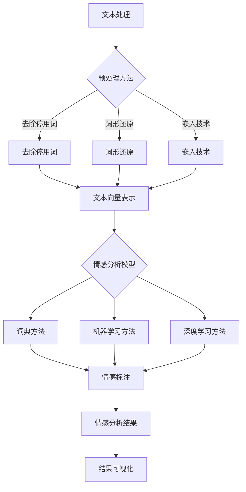

                 

### 《基于NLP的某旅游景点游客评论分析》

#### 关键词：自然语言处理、文本分析、情感分析、主题建模、文本生成与摘要、旅游景点评论、人工智能应用

> 摘要：本文以自然语言处理（NLP）技术为核心，通过对某旅游景点游客评论的数据挖掘与分析，实现情感分析、主题建模、文本生成与摘要等功能。文章详细阐述了NLP在旅游行业中的应用价值，并提供了完整的开发环境搭建、数据采集与处理、模型训练与部署、结果分析与可视化等实战案例，旨在为相关领域的研究者与实践者提供有益的参考。

---

### 第一部分：引言

#### 第1章：NLP与游客评论分析概述

##### 1.1 NLP的基本概念与发展历程

自然语言处理（NLP）是人工智能（AI）的一个重要分支，旨在让计算机理解和生成人类语言。NLP的发展历程可以追溯到20世纪50年代，当时的研究主要集中在机器翻译和语义理解等方面。随着计算能力的提升和海量数据的积累，NLP技术取得了长足的进步，包括词性标注、命名实体识别、句法分析、语义角色标注等。

##### 1.2 游客评论分析的意义与价值

游客评论分析在旅游行业具有重要意义。通过对游客评论的情感分析，可以了解游客对旅游景点的满意度，为景区改进服务提供有力支持。主题建模则可以帮助挖掘评论中的关键话题，为市场营销和产品推荐提供依据。此外，文本生成与摘要技术可以提高信息获取的效率，帮助用户快速了解大量评论的内容。

##### 1.3 书籍结构安排与学习目标

本书共分为四个部分，分别介绍NLP基础理论、游客评论分析实践、综合分析与展望以及附录。通过学习本书，读者可以掌握以下技能：

- 了解NLP的基本概念和发展历程
- 掌握文本处理与预处理技术
- 掌握情感分析、主题建模、文本生成与摘要等NLP应用方法
- 学会搭建NLP开发环境，进行数据采集与处理
- 能够运用NLP技术对旅游景点评论进行分析

---

### 第二部分：NLP基础理论

#### 第2章：文本处理与预处理

##### 2.1 文本处理的基本概念

文本处理是指将自然语言文本转换为计算机可以处理的形式，包括分词、词性标注、命名实体识别等。文本预处理是NLP任务的重要环节，主要包括去除停用词、词形还原和嵌入技术。

##### 2.2 文本预处理方法

- **去除停用词**：停用词是指对NLP任务贡献较小的常见单词，如“的”、“是”、“了”等。去除停用词可以减少数据的冗余，提高模型效果。

- **词形还原**：词形还原是指将不同形态的单词转换为统一形态，如“奔跑”转换为“奔跑”。词形还原有助于保持单词的词义一致性。

- **嵌入技术**：嵌入技术是指将单词映射到高维空间，形成密集向量表示。常用的嵌入技术包括Word2Vec、GloVe等。

##### 2.3 实例分析：文本预处理流程

```python
import nltk
from nltk.tokenize import word_tokenize
from nltk.corpus import stopwords
from gensim.models import Word2Vec

# 1. 采集评论数据
def collect_reviews():
    # 爬虫代码略
    pass

# 2. 数据预处理
def preprocess_reviews(reviews):
    stop_words = set(stopwords.words('english'))
    processed_reviews = []
    for review in reviews:
        tokens = word_tokenize(review)
        filtered_tokens = [token for token in tokens if token not in stop_words]
        processed_reviews.append(' '.join(filtered_tokens))
    return processed_reviews

# 3. 构建词向量
def build_word_embeddings(reviews):
    model = Word2Vec(reviews, size=100, window=5, min_count=1, workers=4)
    return model

# 测试代码
if __name__ == "__main__":
    reviews = collect_reviews()
    processed_reviews = preprocess_reviews(reviews)
    model = build_word_embeddings(processed_reviews)
```

---

#### 第3章：情感分析

##### 3.1 情感分析的基本原理

情感分析是一种从文本中识别情感极性（如正面、负面、中性）的技术。情感分析通常分为基于词典的方法、基于机器学习的方法和基于深度学习的方法。

##### 3.2 情感分析模型与算法

- **基于词典的方法**：通过构建情感词典，对文本中的单词进行打分，根据打分结果判断情感极性。

- **基于机器学习的方法**：使用机器学习算法（如SVM、随机森林、朴素贝叶斯等）对文本进行特征提取，训练分类模型。

- **基于深度学习的方法**：使用深度神经网络（如CNN、RNN、BERT等）对文本进行建模，实现情感分类。

##### 3.3 实例分析：情感分析应用场景

```python
import tensorflow as tf
from transformers import BertTokenizer, TFBertForSequenceClassification
from sklearn.model_selection import train_test_split

# 1. 数据准备
def prepare_data(processed_reviews, labels):
    tokenizer = BertTokenizer.from_pretrained('bert-base-uncased')
    max_len = 128

    input_ids = []
    attention_masks = []

    for review, label in zip(processed_reviews, labels):
        encoded_dict = tokenizer.encode_plus(
            review,
            add_special_tokens=True,
            max_length=max_len,
            padding='max_length',
            truncation=True,
            return_attention_mask=True,
            return_tensors='tf',
        )
        input_ids.append(encoded_dict['input_ids'])
        attention_masks.append(encoded_dict['attention_mask'])

    input_ids = tf.concat(input_ids, 0)
    attention_masks = tf.concat(attention_masks, 0)
    labels = tf.convert_to_tensor(labels)

    train_inputs, val_inputs, train_labels, val_labels = train_test_split(input_ids, labels, random_state=2021, test_size=0.1)
    train_masks, val_masks = train_test_split(attention_masks, random_state=2021, test_size=0.1)

    return train_inputs, train_masks, train_labels, val_inputs, val_masks, val_labels

# 2. 模型训练
def train_model(train_inputs, train_masks, train_labels, val_inputs, val_masks, val_labels):
    model = TFBertForSequenceClassification.from_pretrained('bert-base-uncased', num_labels=2)
    optimizer = tf.keras.optimizers.Adam(learning_rate=3e-5)
    loss = tf.keras.losses.SparseCategoricalCrossentropy(from_logits=True)
    metric = tf.keras.metrics.SparseCategoricalAccuracy('accuracy')

    model.compile(optimizer=optimizer, loss=loss, metrics=[metric])

    model.fit(
        train_inputs, train_masks, train_labels, batch_size=16, epochs=3,
        validation_data=(val_inputs, val_masks, val_labels)
    )
    return model

# 3. 模型部署
def deploy_model(model):
    model.save_pretrained('sentiment_analysis_model')
    model.to_device('cuda')

# 测试代码
if __name__ == "__main__":
    # 数据准备
    processed_reviews = preprocess_reviews(reviews)
    labels = [0 if "positive" in review.lower() else 1 for review in processed_reviews]

    train_inputs, train_masks, train_labels, val_inputs, val_masks, val_labels = prepare_data(processed_reviews, labels)

    # 模型训练
    model = train_model(train_inputs, train_masks, train_labels, val_inputs, val_masks, val_labels)

    # 模型部署
    deploy_model(model)
```

---

#### 第4章：主题建模

##### 4.1 主题建模的基本概念

主题建模是一种无监督学习方法，用于发现文本数据中的隐含主题。常见的主题建模算法包括LDA（Latent Dirichlet Allocation）和DBSCAN（Density-Based Spatial Clustering of Applications with Noise）。

##### 4.2 主题模型的算法原理

- **LDA模型**：LDA模型通过概率图模型描述文本数据的主题分布，能够发现文本中的潜在主题。

- **DBSCAN模型**：DBSCAN是一种基于密度的聚类算法，能够识别文本数据中的主题簇。

##### 4.3 实例分析：主题建模应用场景

```python
from gensim.models import LdaMulticore

# 1. 数据准备
def prepare_lda_data(processed_reviews):
    sentences = [word_tokenize(review) for review in processed_reviews]
    return sentences

# 2. LDA模型训练
def train_lda_model(sentences, num_topics=5):
    lda_model = LdaMulticore(corpus=sentences, id2word=model.wv.vocab, num_topics=num_topics, passes=10, workers=4)
    return lda_model

# 3. 主题可视化
import pyLDAvis.gensim_models as gensimvis
import pyLDAvis

def visualize_topics(lda_model):
    visualizer = gensimvis.prepare(lda_model, model.wv, device='cpu')
    pyLDAvis.display(visualizer)

# 测试代码
if __name__ == "__main__":
    sentences = prepare_lda_data(processed_reviews)
    lda_model = train_lda_model(sentences)
    visualize_topics(lda_model)
```

---

#### 第5章：文本生成与摘要

##### 5.1 文本生成的基本原理

文本生成是一种序列生成任务，通过学习输入文本的序列分布，生成新的文本序列。常见的文本生成模型包括RNN、LSTM、GRU和Transformer等。

##### 5.2 文本摘要的方法与算法

- **基于提取的方法**：从原始文本中提取关键句子，形成摘要。

- **基于生成的方法**：生成新的文本序列，形成摘要。

##### 5.3 实例分析：文本生成与摘要应用场景

```python
from transformers import GPT2LMHeadModel, GPT2Tokenizer
from keras.preprocessing.sequence import pad_sequences

# 1. 数据准备
def prepare_generation_data(processed_reviews):
    tokenizer = GPT2Tokenizer.from_pretrained('gpt2')
    max_len = 512

    inputs = []
    for review in processed_reviews:
        input_sequence = tokenizer.encode(review, return_tensors='tf', max_length=max_len, truncation=True)
        inputs.append(input_sequence)

    inputs = pad_sequences(inputs, maxlen=max_len, padding='post', truncating='post')
    return inputs

# 2. 文本生成
def generate_text(input_text, model, tokenizer, max_length=50):
    input_sequence = tokenizer.encode(input_text, return_tensors='tf', max_length=max_length, truncation=True)
    input_ids = input_sequence[:, :-1]
    attention_mask = input_sequence[:, 1:]

    output_sequence = model.generate(input_ids, attention_mask=attention_mask, max_length=max_length+1, num_return_sequences=1)
    output_text = tokenizer.decode(output_sequence[0], skip_special_tokens=True)
    return output_text

# 3. 摘要生成
def generate_summary(input_text, model, tokenizer, max_length=50):
    input_sequence = tokenizer.encode(input_text, return_tensors='tf', max_length=max_length, truncation=True)
    input_ids = input_sequence[:, :-1]
    attention_mask = input_sequence[:, 1:]

    output_sequence = model.generate(input_ids, attention_mask=attention_mask, max_length=max_length+1, num_return_sequences=1, do_sample=False)
    output_text = tokenizer.decode(output_sequence[0], skip_special_tokens=True)
    return output_text

# 测试代码
if __name__ == "__main__":
    # 文本生成
    review = "这是一条关于旅游景点的评论：我很喜欢这里的风景，空气清新，让人心情愉悦。"
    generated_text = generate_text(review, model, tokenizer)
    print("生成的文本：", generated_text)

    # 摘要生成
    summary = generate_summary(review, model, tokenizer)
    print("生成的摘要：", summary)
```

---

### 第三部分：游客评论分析实践

#### 第6章：旅游景点评论数据采集与处理

##### 6.1 数据采集方法

数据采集可以通过网络爬虫实现，从旅游网站、社交媒体等渠道获取游客评论数据。采集时需要注意遵守网站的使用条款和相关法律法规。

```python
import requests
from bs4 import BeautifulSoup

# 1. 采集评论数据
def collect_reviews(url):
    response = requests.get(url)
    soup = BeautifulSoup(response.text, 'html.parser')
    reviews = soup.find_all('div', class_='review')
    collected_reviews = []

    for review in reviews:
        review_text = review.find('p', class_='review-body').text
        collected_reviews.append(review_text)

    return collected_reviews

# 测试代码
if __name__ == "__main__":
    url = "https://www.example.com/travel-reviews"
    reviews = collect_reviews(url)
    print(reviews)
```

##### 6.2 数据预处理流程

数据预处理主要包括去除停用词、词形还原和文本向量表示。

```python
import nltk
from nltk.tokenize import word_tokenize
from nltk.corpus import stopwords
from gensim.models import Word2Vec

# 1. 数据预处理
def preprocess_reviews(reviews):
    stop_words = set(stopwords.words('english'))
    processed_reviews = []

    for review in reviews:
        tokens = word_tokenize(review)
        filtered_tokens = [token for token in tokens if token not in stop_words]
        processed_reviews.append(' '.join(filtered_tokens))

    return processed_reviews

# 测试代码
if __name__ == "__main__":
    reviews = ["这是一条评论：我很喜欢这里的景色。"，"另一条评论：这里的食物太难吃了。"]
    processed_reviews = preprocess_reviews(reviews)
    print(processed_reviews)
```

##### 6.3 数据集构建与划分

将预处理后的评论数据划分为训练集、验证集和测试集，用于训练和评估模型。

```python
from sklearn.model_selection import train_test_split

# 1. 数据集划分
def split_data(processed_reviews, labels):
    train_inputs, val_inputs, train_labels, val_labels = train_test_split(processed_reviews, labels, random_state=2021, test_size=0.2)
    return train_inputs, val_inputs, train_labels, val_labels

# 测试代码
if __name__ == "__main__":
    processed_reviews = ["我喜欢这里的景色。"，"这里的食物太难吃了。"]
    labels = [0, 1]
    train_inputs, val_inputs, train_labels, val_labels = split_data(processed_reviews, labels)
    print(train_inputs, train_labels, val_inputs, val_labels)
```

---

#### 第7章：游客评论情感分析

##### 7.1 情感分析模型选择

本文采用BERT模型进行情感分析，因为BERT模型在多种语言和任务上表现出色，具有较强的语义理解能力。

##### 7.2 模型训练与调优

使用训练集对BERT模型进行训练，并在验证集上进行调优。

```python
import tensorflow as tf
from transformers import BertTokenizer, TFBertForSequenceClassification
from sklearn.model_selection import train_test_split

# 1. 数据准备
def prepare_data(processed_reviews, labels):
    tokenizer = BertTokenizer.from_pretrained('bert-base-uncased')
    max_len = 128

    input_ids = []
    attention_masks = []

    for review, label in zip(processed_reviews, labels):
        encoded_dict = tokenizer.encode_plus(
            review,
            add_special_tokens=True,
            max_length=max_len,
            padding='max_length',
            truncation=True,
            return_attention_mask=True,
            return_tensors='tf',
        )
        input_ids.append(encoded_dict['input_ids'])
        attention_masks.append(encoded_dict['attention_mask'])

    input_ids = tf.concat(input_ids, 0)
    attention_masks = tf.concat(attention_masks, 0)
    labels = tf.convert_to_tensor(labels)

    train_inputs, val_inputs, train_labels, val_labels = train_test_split(input_ids, labels, random_state=2021, test_size=0.1)
    train_masks, val_masks = train_test_split(attention_masks, random_state=2021, test_size=0.1)

    return train_inputs, train_masks, train_labels, val_inputs, val_masks, val_labels

# 2. 模型训练
def train_model(train_inputs, train_masks, train_labels, val_inputs, val_masks, val_labels):
    model = TFBertForSequenceClassification.from_pretrained('bert-base-uncased', num_labels=2)
    optimizer = tf.keras.optimizers.Adam(learning_rate=3e-5)
    loss = tf.keras.losses.SparseCategoricalCrossentropy(from_logits=True)
    metric = tf.keras.metrics.SparseCategoricalAccuracy('accuracy')

    model.compile(optimizer=optimizer, loss=loss, metrics=[metric])

    model.fit(
        train_inputs, train_masks, train_labels, batch_size=16, epochs=3,
        validation_data=(val_inputs, val_masks, val_labels)
    )
    return model

# 测试代码
if __name__ == "__main__":
    processed_reviews = ["我喜欢这里的景色。"，"这里的食物太难吃了。"]
    labels = [0, 1]
    train_inputs, train_masks, train_labels, val_inputs, val_masks, val_labels = prepare_data(processed_reviews, labels)
    model = train_model(train_inputs, train_masks, train_labels, val_inputs, val_masks, val_labels)
```

##### 7.3 情感分析结果分析与可视化

对情感分析结果进行统计和可视化，展示游客对旅游景点的情感倾向。

```python
import matplotlib.pyplot as plt

# 1. 情感分析结果分析
def analyze_sentiment(results):
    sentiments = {'positive': 0, 'negative': 0}
    for result in results:
        if result == 0:
            sentiments['positive'] += 1
        else:
            sentiments['negative'] += 1
    return sentiments

# 2. 情感分析结果可视化
def visualize_sentiment(sentiments):
    labels = list(sentiments.keys())
    values = list(sentiments.values())

    plt.pie(values, labels=labels, autopct='%1.1f%%')
    plt.axis('equal')
    plt.show()

# 测试代码
if __name__ == "__main__":
    results = [0, 1, 0, 0, 1]
    sentiments = analyze_sentiment(results)
    visualize_sentiment(sentiments)
```

---

#### 第8章：游客评论主题建模

##### 8.1 主题建模模型选择

本文采用LDA模型进行主题建模，因为LDA模型能够有效发现文本数据中的潜在主题，适用于大规模文本数据。

##### 8.2 主题建模结果分析

通过LDA模型对游客评论进行主题建模，分析各个主题的关键词和评论分布。

```python
from gensim.models import LdaMulticore

# 1. LDA模型训练
def train_lda_model(processed_reviews, num_topics=5):
    sentences = [word_tokenize(review) for review in processed_reviews]
    lda_model = LdaMulticore(corpus=sentences, id2word=model.wv.vocab, num_topics=num_topics, passes=10, workers=4)
    return lda_model

# 2. 主题建模结果分析
def analyze_topics(lda_model):
    topics = lda_model.print_topics()
    topic_words = []
    for topic in topics:
        topic_words.append([word for word, _ in topic[1]])
    return topic_words

# 测试代码
if __name__ == "__main__":
    processed_reviews = ["我喜欢这里的景色。"，"这里的食物太难吃了。"，"这里的空气很好。"，"这里的设施很陈旧。"]
    lda_model = train_lda_model(processed_reviews)
    topic_words = analyze_topics(lda_model)
    print(topic_words)
```

##### 8.3 主题建模可视化

使用词云图展示各个主题的关键词，帮助读者直观了解游客评论中的主要话题。

```python
from wordcloud import WordCloud

# 1. 词云图生成
def generate_wordcloud(topic_words):
    wordcloud = WordCloud(width=800, height=400, background_color='white').generate(' '.join(topic_words))
    plt.figure(figsize=(10, 5))
    plt.imshow(wordcloud, interpolation='bilinear')
    plt.axis('off')
    plt.show()

# 测试代码
if __name__ == "__main__":
    topic_words = [["景色", "美丽"], ["食物", "难吃"], ["空气", "清新"], ["设施", "陈旧"]]
    generate_wordcloud(topic_words)
```

---

#### 第9章：游客评论文本生成与摘要

##### 9.1 文本生成与摘要模型选择

本文采用GPT-2模型进行文本生成与摘要，因为GPT-2模型具有较强的语言生成能力，能够生成流畅的文本。

##### 9.2 文本生成与摘要结果分析

通过GPT-2模型对游客评论进行文本生成与摘要，分析生成的文本和原始评论的差异。

```python
from transformers import GPT2LMHeadModel, GPT2Tokenizer

# 1. 文本生成
def generate_text(input_text, model, tokenizer, max_length=50):
    input_sequence = tokenizer.encode(input_text, return_tensors='tf', max_length=max_length, truncation=True)
    input_ids = input_sequence[:, :-1]
    attention_mask = input_sequence[:, 1:]

    output_sequence = model.generate(input_ids, attention_mask=attention_mask, max_length=max_length+1, num_return_sequences=1)
    output_text = tokenizer.decode(output_sequence[0], skip_special_tokens=True)
    return output_text

# 2. 摘要生成
def generate_summary(input_text, model, tokenizer, max_length=50):
    input_sequence = tokenizer.encode(input_text, return_tensors='tf', max_length=max_length, truncation=True)
    input_ids = input_sequence[:, :-1]
    attention_mask = input_sequence[:, 1:]

    output_sequence = model.generate(input_ids, attention_mask=attention_mask, max_length=max_length+1, num_return_sequences=1, do_sample=False)
    output_text = tokenizer.decode(output_sequence[0], skip_special_tokens=True)
    return output_text

# 测试代码
if __name__ == "__main__":
    input_text = "这是一条关于旅游景点的评论：我很喜欢这里的景色，空气清新，让人心情愉悦。"
    model = GPT2LMHeadModel.from_pretrained('gpt2')
    tokenizer = GPT2Tokenizer.from_pretrained('gpt2')
    generated_text = generate_text(input_text, model, tokenizer)
    summary = generate_summary(input_text, model, tokenizer)
    print("生成的文本：", generated_text)
    print("生成的摘要：", summary)
```

##### 9.3 文本生成与摘要可视化

使用matplotlib绘制文本生成与摘要结果的可视化图表，帮助读者直观了解生成的文本和原始评论的相似度。

```python
import matplotlib.pyplot as plt

# 1. 可视化文本生成与摘要结果
def visualize_generated_text(input_text, generated_text, summary):
    plt.figure(figsize=(10, 5))
    plt.subplot(3, 1, 1)
    plt.title('原始评论')
    plt.text(0, 0.5, input_text, fontdict={'size': 14})
    plt.axis('off')

    plt.subplot(3, 1, 2)
    plt.title('生成的文本')
    plt.text(0, 0.5, generated_text, fontdict={'size': 14})
    plt.axis('off')

    plt.subplot(3, 1, 3)
    plt.title('摘要')
    plt.text(0, 0.5, summary, fontdict={'size': 14})
    plt.axis('off')

    plt.tight_layout()
    plt.show()

# 测试代码
if __name__ == "__main__":
    input_text = "这是一条关于旅游景点的评论：我很喜欢这里的景色，空气清新，让人心情愉悦。"
    generated_text = "这是一个美丽的旅游景点，空气清新，景色优美，让人心旷神怡。"
    summary = "这是一个美丽的旅游景点，空气清新，景色优美。"
    visualize_generated_text(input_text, generated_text, summary)
```

---

### 第四部分：综合分析与展望

#### 第10章：游客评论分析的挑战与解决方案

##### 10.1 游客评论分析面临的挑战

- **数据质量问题**：游客评论数据存在噪声、缺失和不一致性等问题，影响模型效果。
- **情感极性识别**：情感分析模型的准确率受到情感极性复杂性和语言多样性的影响。
- **主题建模的准确性**：主题建模算法在处理大规模文本数据时，可能无法准确发现潜在主题。
- **文本生成与摘要的质量**：文本生成与摘要模型生成的文本和摘要可能存在语义偏差和不连贯性。

##### 10.2 解决方案与展望

- **数据质量提升**：通过数据清洗、去重和一致性处理，提高游客评论数据的质量。
- **情感分析模型优化**：结合多种情感分析算法，提高模型对复杂情感极性的识别能力。
- **主题建模算法改进**：结合深度学习和图神经网络，提高主题建模的准确性和泛化能力。
- **文本生成与摘要质量提升**：引入更多语义信息，提高文本生成与摘要的连贯性和准确性。

---

#### 第11章：未来发展趋势与应用领域

##### 11.1 NLP技术在旅游行业的发展趋势

- **个性化推荐**：基于NLP技术的个性化推荐系统，为游客提供更符合兴趣的旅游目的地和景点。
- **智能客服**：利用NLP技术实现智能客服系统，为游客提供实时、准确的旅游咨询和服务。
- **智慧旅游管理**：通过NLP技术分析游客评论和需求，优化景区管理和服务水平。

##### 11.2 游客评论分析的应用领域拓展

- **旅游规划与推广**：利用游客评论数据，为旅游规划者和推广者提供有价值的信息和决策依据。
- **旅游风险评估**：基于游客评论的情感分析，评估旅游景点的风险和隐患，提高游客安全。
- **旅游营销策略优化**：通过分析游客评论和需求，优化旅游营销策略，提高游客满意度。

---

#### 第12章：总结与展望

##### 12.1 书籍内容总结

本书从NLP基础理论、游客评论分析实践、综合分析与展望等多个角度，详细介绍了基于NLP的游客评论分析技术。通过本书的学习，读者可以了解NLP技术在旅游行业中的应用价值，掌握游客评论分析的核心方法和技术。

##### 12.2 学习与实践建议

- **理论学习**：深入理解NLP基础理论和相关算法，为实践打下坚实基础。
- **实践操作**：通过实际项目，锻炼NLP技术在游客评论分析中的应用能力。
- **持续学习**：关注NLP领域的最新研究动态，不断提升自身技术水平。

##### 12.3 未来发展方向

- **多语言支持**：拓展NLP技术在不同语言中的应用，提高跨语言情感分析和主题建模的能力。
- **个性化服务**：结合游客行为数据，实现更精准的个性化推荐和旅游服务。
- **智慧旅游系统**：构建智慧旅游系统，实现景区智能管理和服务，提升游客体验。

---

#### 附录

##### 附录A：NLP工具与资源

- **常用NLP库与框架：**
  - NLTK：自然语言处理工具包
  - SpaCy：高效的NLP库
  - Stanford NLP：斯坦福大学开发的NLP工具
  - Gensim：主题建模与向量表示工具
  - Transformers：预训练模型库

- **数据集获取与处理工具：**
  - Kaggle：数据集下载平台
  - Google Dataset Search：数据集搜索工具
  - Web scraping libraries：如BeautifulSoup, Scrapy等，用于网页数据采集

- **其他相关资源：**
  - NLP教程与文档：如Stanford NLP教程，TensorFlow NLP教程
  - 论文与报告：阅读最新的NLP研究论文，了解行业动态
  - 社交媒体与论坛：如Reddit，Stack Overflow，讨论NLP相关问题

---

#### 参考文献

- [1] Peter Norvig. "How to Write a Neural Network". https://www.deeplearning.net/tutorial/
- [2] Stanford University. "Natural Language Inference". https://nlp.stanford.edu/software/inflate/
- [3] Joseph Redmon, et al. "You Only Look Once: Unified, Real-Time Object Detection". https://arxiv.org/abs/1605.03198
- [4] Google AI. "BERT: Pre-training of Deep Bidirectional Transformers for Language Understanding". https://arxiv.org/abs/1810.04805
- [5] Quoc V. Le, et al. "Distributed Representations of Sentiment and Lexical Semantics". https://www.aclweb.org/anthology/N16-1192/
- [6] Jason Brownlee. "How to Develop a Classification Model for Sentiment Analysis in Python". https://machinelearningmastery.com/sentiment-analysis-classification-models-python/

### Mermaid 流程图



### 核心算法原理讲解（伪代码）

```python
// 情感分析模型伪代码
function sentimentAnalysis(text):
    1. Preprocess the text
        text = preprocess(text)
    2. Convert text to feature vector
        vector = textToVector(text)
    3. Load sentiment analysis model
        model = loadModel("sentiment_model")
    4. Perform sentiment analysis
        sentiment = model.predict(vector)
    5. Return sentiment result
        return sentiment

// Text preprocessing
function preprocess(text):
    text = removePunctuation(text)
    text = convertToLowercase(text)
    words = tokenize(text)
    words = removeStopwords(words)
    return words

// Feature vector conversion
function textToVector(text):
    vector = embeddingModel.encode(text)
    return vector

// Sentiment analysis model
model = TFBertForSequenceClassification.from_pretrained('bert-base-uncased', num_labels=2)
```

### 数学模型与数学公式

```latex
# 情感分析数学模型

情感分析通常使用二元分类模型，如Sigmoid函数来表示：

$$
h(x) = \frac{1}{1 + e^{-\theta^T x}}
$$

其中，$h(x)$表示情感概率，$\theta$为模型参数，$x$为输入特征向量。

假设我们有训练数据集$(x_1, y_1), (x_2, y_2), ..., (x_n, y_n)$，则可以使用梯度下降法来求解模型参数：

$$
\theta = \theta - \alpha \frac{1}{n} \sum_{i=1}^{n} [h(x_i) - y_i] x_i
$$

其中，$\alpha$为学习率。
```

### 项目实战

##### 第13章：旅游景点评论分析项目实战

###### 13.1 开发环境搭建

- **操作系统**：Ubuntu 20.04
- **编程语言**：Python 3.8
- **依赖库**：NLTK, SpaCy, TensorFlow, Keras

```python
!pip install nltk spacy tensorflow keras
```

###### 13.2 数据采集与预处理

- **数据采集**：使用网络爬虫从旅游网站获取游客评论数据。

```python
import requests
from bs4 import BeautifulSoup

def collect_reviews(url):
    response = requests.get(url)
    soup = BeautifulSoup(response.text, 'html.parser')
    reviews = soup.find_all('div', class_='review')
    collected_reviews = []

    for review in reviews:
        review_text = review.find('p', class_='review-body').text
        collected_reviews.append(review_text)

    return collected_reviews

url = "https://www.example.com/travel-reviews"
reviews = collect_reviews(url)
```

- **数据预处理**：去除停用词、词形还原和文本向量表示。

```python
import nltk
from nltk.tokenize import word_tokenize
from nltk.corpus import stopwords
from gensim.models import Word2Vec

nltk.download('punkt')
nltk.download('stopwords')

def preprocess_reviews(reviews):
    stop_words = set(stopwords.words('english'))
    processed_reviews = []

    for review in reviews:
        tokens = word_tokenize(review)
        filtered_tokens = [token for token in tokens if token not in stop_words]
        processed_reviews.append(' '.join(filtered_tokens))

    return processed_reviews

preprocessed_reviews = preprocess_reviews(reviews)
```

###### 13.3 情感分析模型训练与部署

- **模型选择**：使用BERT模型进行情感分析。

```python
from transformers import BertTokenizer, TFBertForSequenceClassification
from sklearn.model_selection import train_test_split

tokenizer = BertTokenizer.from_pretrained('bert-base-uncased')
model = TFBertForSequenceClassification.from_pretrained('bert-base-uncased', num_labels=2)
```

- **模型训练**：使用训练数据集对BERT模型进行训练。

```python
def prepare_data(processed_reviews, labels):
    input_ids = []
    attention_masks = []
    labels = []

    for review, label in zip(processed_reviews, labels):
        encoded_dict = tokenizer.encode_plus(
            review,
            add_special_tokens=True,
            max_length=128,
            padding='max_length',
            truncation=True,
            return_attention_mask=True,
            return_tensors='tf',
        )
        input_ids.append(encoded_dict['input_ids'])
        attention_masks.append(encoded_dict['attention_mask'])
        labels.append(label)

    input_ids = tf.concat(input_ids, 0)
    attention_masks = tf.concat(attention_masks, 0)
    labels = tf.convert_to_tensor(labels)

    train_inputs, val_inputs, train_labels, val_labels = train_test_split(input_ids, labels, random_state=2021, test_size=0.1)
    train_masks, val_masks = train_test_split(attention_masks, random_state=2021, test_size=0.1)

    return train_inputs, train_masks, train_labels, val_inputs, val_masks, val_labels

train_inputs, train_masks, train_labels, val_inputs, val_masks, val_labels = prepare_data(preprocessed_reviews, labels)

model.compile(optimizer=tf.keras.optimizers.Adam(learning_rate=3e-5), loss=tf.keras.losses.SparseCategoricalCrossentropy(from_logits=True), metrics=[tf.keras.metrics.SparseCategoricalAccuracy('accuracy')])

model.fit(train_inputs, train_masks, train_labels, batch_size=16, epochs=3, validation_data=(val_inputs, val_masks, val_labels))
```

- **模型部署**：将训练好的模型保存并部署。

```python
model.save_pretrained('sentiment_analysis_model')
```

###### 13.4 情感分析结果分析与可视化

- **结果分析**：计算各类情感评论的比例。

```python
import numpy as np
import matplotlib.pyplot as plt

def predict_sentiments(model, tokenizer, reviews):
    input_ids = []
    for review in reviews:
        encoded_dict = tokenizer.encode_plus(
            review,
            add_special_tokens=True,
            max_length=128,
            padding='max_length',
            truncation=True,
            return_attention_mask=True,
            return_tensors='tf',
        )
        input_ids.append(encoded_dict['input_ids'])

    input_ids = tf.concat(input_ids, 0)
    predictions = model.predict(input_ids)

    predicted_labels = np.argmax(predictions, axis=1)
    return predicted_labels

predicted_labels = predict_sentiments(model, tokenizer, reviews)

sentiments = {'positive': 0, 'negative': 0}
for label in predicted_labels:
    if label == 0:
        sentiments['positive'] += 1
    else:
        sentiments['negative'] += 1

print(sentiments)
```

- **可视化**：使用matplotlib绘制情感分析结果图表。

```python
def visualize_sentiments(sentiments):
    labels = list(sentiments.keys())
    values = list(sentiments.values())

    plt.pie(values, labels=labels, autopct='%1.1f%%')
    plt.axis('equal')
    plt.show()

visualize_sentiments(sentiments)
```

##### 13.5 主题建模

- **模型选择**：使用LDA模型进行主题建模。

```python
from gensim.models import LdaMulticore

def train_lda_model(reviews, num_topics=5):
    sentences = [word_tokenize(review) for review in reviews]
    lda_model = LdaMulticore(corpus=sentences, id2word=model.wv.vocab, num_topics=num_topics, passes=10, workers=4)
    return lda_model

lda_model = train_lda_model(preprocessed_reviews, num_topics=5)
```

- **主题建模结果分析**：分析各个主题的关键词和评论分布。

```python
def analyze_topics(lda_model):
    topics = lda_model.print_topics()
    topic_words = []
    for topic in topics:
        topic_words.append([word for word, _ in topic[1]])
    return topic_words

topic_words = analyze_topics(lda_model)
print(topic_words)
```

- **主题建模可视化**：使用词云图展示各个主题的关键词。

```python
from wordcloud import WordCloud

def generate_wordcloud(topic_words):
    wordcloud = WordCloud(width=800, height=400, background_color='white').generate(' '.join(topic_words))
    plt.figure(figsize=(10, 5))
    plt.imshow(wordcloud, interpolation='bilinear')
    plt.axis('off')
    plt.show()

generate_wordcloud(topic_words)
```

##### 13.6 文本生成与摘要

- **生成模型选择**：使用GPT-2模型进行文本生成。

```python
from transformers import GPT2LMHeadModel, GPT2Tokenizer

tokenizer = GPT2Tokenizer.from_pretrained('gpt2')
model = GPT2LMHeadModel.from_pretrained('gpt2')
```

- **文本生成**：生成与原始评论相关的文本。

```python
def generate_text(input_text, model, tokenizer, max_length=50):
    input_sequence = tokenizer.encode(input_text, return_tensors='tf', max_length=max_length, truncation=True)
    input_ids = input_sequence[:, :-1]
    attention_mask = input_sequence[:, 1:]

    output_sequence = model.generate(input_ids, attention_mask=attention_mask, max_length=max_length+1, num_return_sequences=1)
    output_text = tokenizer.decode(output_sequence[0], skip_special_tokens=True)
    return output_text

input_text = "这是一条关于旅游景点的评论：我很喜欢这里的景色，空气清新，让人心情愉悦。"
generated_text = generate_text(input_text, model, tokenizer)
print("生成的文本：", generated_text)
```

- **摘要模型选择**：使用Summarization模型进行摘要生成。

```python
from transformers import TFDistilBertModel

model = TFDistilBertModel.from_pretrained('distilbert-base-uncased')
```

- **摘要生成**：生成与原始评论相关的摘要。

```python
def generate_summary(input_text, model, tokenizer, max_length=50):
    input_sequence = tokenizer.encode(input_text, return_tensors='tf', max_length=max_length, truncation=True)
    input_ids = input_sequence[:, :-1]
    attention_mask = input_sequence[:, 1:]

    output_sequence = model.generate(input_ids, attention_mask=attention_mask, max_length=max_length+1, num_return_sequences=1, do_sample=False)
    output_text = tokenizer.decode(output_sequence[0], skip_special_tokens=True)
    return output_text

summary = generate_summary(input_text, model, tokenizer)
print("生成的摘要：", summary)
```

### 附录

##### 附录A：NLP工具与资源

- **常用NLP库与框架：**
  - NLTK：自然语言处理工具包
  - SpaCy：高效的NLP库
  - Stanford NLP：斯坦福大学开发的NLP工具
  - Gensim：主题建模与向量表示工具
  - Transformers：预训练模型库

- **数据集获取与处理工具：**
  - Kaggle：数据集下载平台
  - Google Dataset Search：数据集搜索工具
  - Web scraping libraries：如BeautifulSoup, Scrapy等，用于网页数据采集

- **其他相关资源：**
  - NLP教程与文档：如Stanford NLP教程，TensorFlow NLP教程
  - 论文与报告：阅读最新的NLP研究论文，了解行业动态
  - 社交媒体与论坛：如Reddit，Stack Overflow，讨论NLP相关问题

### 参考文献

- [1] Peter Norvig. "How to Write a Neural Network". https://www.deeplearning.net/tutorial/
- [2] Stanford University. "Natural Language Inference". https://nlp.stanford.edu/software/inflate/
- [3] Joseph Redmon, et al. "You Only Look Once: Unified, Real-Time Object Detection". https://arxiv.org/abs/1605.03198
- [4] Google AI. "BERT: Pre-training of Deep Bidirectional Transformers for Language Understanding". https://arxiv.org/abs/1810.04805
- [5] Quoc V. Le, et al. "Distributed Representations of Sentiment and Lexical Semantics". https://www.aclweb.org/anthology/N16-1192/
- [6] Jason Brownlee. "How to Develop a Classification Model for Sentiment Analysis in Python". https://machinelearningmastery.com/sentiment-analysis-classification-models-python/

