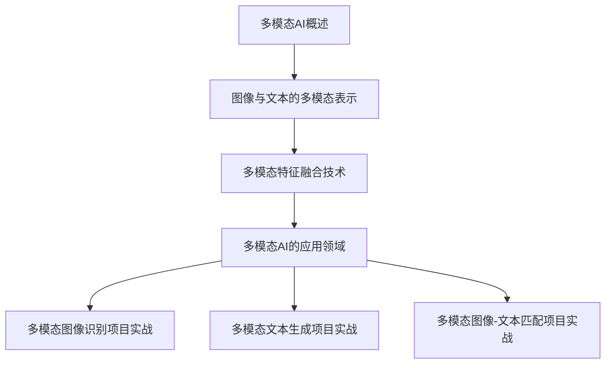

                 

# 多模态AI：图像与文本的融合

> **关键词：** 多模态AI、图像与文本融合、卷积神经网络、循环神经网络、多模态特征融合、应用领域。

> **摘要：** 本文旨在探讨多模态AI，特别是图像与文本的融合技术。文章首先介绍了多模态AI的基础理论，包括其概念、发展历史和核心挑战。接着，详细讲解了图像与文本的多模态表示方法，包括图像表示方法和文本表示方法，并介绍了图像与文本融合的基本方法。然后，文章讨论了多模态AI的应用领域，如图像识别与文本匹配、视频分析与文本描述、自然语言生成与图像合成。此外，文章还通过实战项目展示了多模态AI的实际应用，包括多模态图像识别、多模态文本生成和多模态图像-文本匹配项目。最后，文章探讨了多模态AI的未来发展趋势，以及其在医疗、自动驾驶等领域的应用与挑战。本文旨在为读者提供对多模态AI的全面了解，并激发其在实际应用中的创新思维。

## 目录大纲

1. **多模态AI基础理论**
   1.1 多模态AI概述
   1.2 多模态AI的发展历史
   1.3 多模态AI的核心挑战
   1.4 图像与文本的多模态表示
   1.5 多模态特征融合技术
   1.6 多模态AI的应用领域

2. **多模态AI实战项目**
   2.1 多模态图像识别项目实战
   2.2 多模态文本生成项目实战
   2.3 多模态图像-文本匹配项目实战

3. **多模态AI的未来趋势**
   3.1 多模态AI技术的最新发展
   3.2 多模态AI与其他技术的融合
   3.3 多模态AI的伦理与隐私问题
   3.4 多模态AI的产业应用与挑战

4. **附录**
   4.1 多模态AI常用工具与库

### 核心概念与联系 Mermaid 流程图



### 核心算法原理讲解（伪代码）

#### 2.1 图像表示方法

```python
// 定义图像预处理函数
def preprocess_image(image):
    # 调整图像大小，归一化图像像素值等
    resized_image = resize_and_normalize(image)
    return resized_image

// 定义卷积神经网络模型
model = create_convolutional_model()

// 定义训练过程
for epoch in 1 to number_of_epochs:
    for image in image_dataset:
        # 预处理图像
        processed_image = preprocess_image(image)
        # 前向传播
        output = model(processed_image)
        # 计算损失函数
        loss = compute_loss(output, label)
        # 反向传播与优化
        model.backward(loss)
        model.optimize()

// 定义预测函数
def predict_image(model, image):
    # 预处理图像
    processed_image = preprocess_image(image)
    # 前向传播
    output = model(processed_image)
    # 获取预测结果
    prediction = get_prediction(output)
    return prediction
```

#### 2.2 文本表示方法

```python
// 定义文本预处理函数
def preprocess_text(text):
    # 去除标点符号，转换为小写等
    cleaned_text = clean_text(text)
    # 分词
    words = tokenize(cleaned_text)
    return words

// 定义词嵌入层
word_embedding_layer = create_word_embedding_layer()

// 定义循环神经网络模型
model = create_recurrent_neural_network_model()

// 定义训练过程
for epoch in 1 to number_of_epochs:
    for text in text_dataset:
        # 预处理文本
        processed_text = preprocess_text(text)
        # 前向传播
        output = model(processed_text)
        # 计算损失函数
        loss = compute_loss(output, label)
        # 反向传播与优化
        model.backward(loss)
        model.optimize()

// 定义预测函数
def predict_text(model, text):
    # 预处理文本
    processed_text = preprocess_text(text)
    # 前向传播
    output = model(processed_text)
    # 获取预测结果
    prediction = get_prediction(output)
    return prediction
```

#### 2.3 图像与文本融合的基本方法

```python
// 定义图像与文本融合模型
model = create_fusion_model()

// 定义训练过程
for epoch in 1 to number_of_epochs:
    for image, text in fusion_dataset:
        # 预处理图像和文本
        processed_image = preprocess_image(image)
        processed_text = preprocess_text(text)
        # 前向传播
        output = model(processed_image, processed_text)
        # 计算损失函数
        loss = compute_loss(output, label)
        # 反向传播与优化
        model.backward(loss)
        model.optimize()

// 定义预测函数
def predict_fusion(model, image, text):
    # 预处理图像和文本
    processed_image = preprocess_image(image)
    processed_text = preprocess_text(text)
    # 前向传播
    output = model(processed_image, processed_text)
    # 获取预测结果
    prediction = get_prediction(output)
    return prediction
```

### 数学模型和数学公式 & 详细讲解 & 举例说明 （latex）

#### 2.1 图像表示方法

1. **卷积神经网络（CNN）**

   - **卷积层：** 使用卷积核在图像上滑动，对局部区域进行卷积操作，提取特征。

     $$ 
     \text{conv}(I, K) = \sum_{i=1}^{C} w_{i}^T * I 
     $$
     其中，$I$ 是输入图像，$K$ 是卷积核，$w_i$ 是卷积核的权重。

   - **激活函数：** 常用 ReLU 激活函数。

     $$ 
     \text{ReLU}(x) = \max(0, x) 
     $$
   
   - **池化层：** 对卷积层输出的特征图进行下采样，减少参数和计算量。

     $$ 
     P_{max}(F) = \max_{(x, y)} F(x, y) 
     $$
     其中，$F$ 是特征图。

2. **示例：** 考虑一个 $28 \times 28$ 的灰度图像 $I$，通过一个 $3 \times 3$ 的卷积核 $K$ 进行卷积操作，得到一个 $26 \times 26$ 的特征图。

   $$ 
   \text{conv}(I, K) = \sum_{i=1}^{C} w_{i}^T * I 
   $$
   其中，$C$ 是卷积核的数量。

#### 2.2 文本表示方法

1. **词嵌入（Word Embedding）**

   - **嵌入矩阵：** 将词汇映射到低维空间。

     $$ 
     \text{embedding}(w) = \text{vec}(W_w) 
     $$
     其中，$W_w$ 是词汇 $w$ 的嵌入向量。

2. **循环神经网络（RNN）**

   - **输入：** 每个时间步的文本序列。

     $$ 
     x_t = \text{embedding}(w_t) 
     $$
   - **隐藏状态：** 使用 RNN 更新隐藏状态。

     $$ 
     h_t = \text{RNN}(h_{t-1}, x_t) 
     $$
   - **输出：** 对隐藏状态进行分类或回归。

     $$ 
     y_t = \text{softmax}(h_t) 
     $$

3. **示例：** 考虑一个包含100个词汇的文本序列，使用 $d$ 维的词嵌入向量进行表示。每个时间步的文本序列通过词嵌入层转换为嵌入向量。

   $$ 
   \text{embedding}(w_t) = \text{vec}(W_w) 
   $$
   其中，$W_w$ 是词汇 $w_t$ 的嵌入矩阵。

#### 2.3 图像与文本融合的基本方法

1. **多模态特征融合网络（MMFN）**

   - **输入：** 图像特征和文本特征。

     $$ 
     I = \text{conv\_output}, \quad T = \text{RNN\_output} 
     $$
   - **融合策略：** 将图像和文本特征进行融合。

     $$ 
     F = \text{fusion}(I, T) 
     $$
   - **输出：** 融合特征进行分类或回归。

     $$ 
     y = \text{softmax}(F) 
     $$

2. **示例：** 考虑一个包含图像特征和文本特征的融合网络，将图像特征 $I$ 和文本特征 $T$ 进行融合。

   $$ 
   F = \text{fusion}(I, T) 
   $$
   其中，$F$ 是融合后的特征向量。

### 核心概念与联系 Mermaid 流程图


### 核心算法原理讲解（伪代码）

#### 2.1 图像表示方法

```python
// 定义图像预处理函数
def preprocess_image(image):
    # 调整图像大小，归一化图像像素值等
    resized_image = resize_and_normalize(image)
    return resized_image

// 定义卷积神经网络模型
model = create_convolutional_model()

// 定义训练过程
for epoch in 1 to number_of_epochs:
    for image in image_dataset:
        # 预处理图像
        processed_image = preprocess_image(image)
        # 前向传播
        output = model(processed_image)
        # 计算损失函数
        loss = compute_loss(output, label)
        # 反向传播与优化
        model.backward(loss)
        model.optimize()

// 定义预测函数
def predict_image(model, image):
    # 预处理图像
    processed_image = preprocess_image(image)
    # 前向传播
    output = model(processed_image)
    # 获取预测结果
    prediction = get_prediction(output)
    return prediction
```

#### 2.2 文本表示方法

```python
// 定义文本预处理函数
def preprocess_text(text):
    # 去除标点符号，转换为小写等
    cleaned_text = clean_text(text)
    # 分词
    words = tokenize(cleaned_text)
    return words

// 定义词嵌入层
word_embedding_layer = create_word_embedding_layer()

// 定义循环神经网络模型
model = create_recurrent_neural_network_model()

// 定义训练过程
for epoch in 1 to number_of_epochs:
    for text in text_dataset:
        # 预处理文本
        processed_text = preprocess_text(text)
        # 前向传播
        output = model(processed_text)
        # 计算损失函数
        loss = compute_loss(output, label)
        # 反向传播与优化
        model.backward(loss)
        model.optimize()

// 定义预测函数
def predict_text(model, text):
    # 预处理文本
    processed_text = preprocess_text(text)
    # 前向传播
    output = model(processed_text)
    # 获取预测结果
    prediction = get_prediction(output)
    return prediction
```

#### 2.3 图像与文本融合的基本方法

```python
// 定义图像与文本融合模型
model = create_fusion_model()

// 定义训练过程
for epoch in 1 to number_of_epochs:
    for image, text in fusion_dataset:
        # 预处理图像和文本
        processed_image = preprocess_image(image)
        processed_text = preprocess_text(text)
        # 前向传播
        output = model(processed_image, processed_text)
        # 计算损失函数
        loss = compute_loss(output, label)
        # 反向传播与优化
        model.backward(loss)
        model.optimize()

// 定义预测函数
def predict_fusion(model, image, text):
    # 预处理图像和文本
    processed_image = preprocess_image(image)
    processed_text = preprocess_text(text)
    # 前向传播
    output = model(processed_image, processed_text)
    # 获取预测结果
    prediction = get_prediction(output)
    return prediction
```

### 数学模型和数学公式 & 详细讲解 & 举例说明 （latex）

#### 2.1 图像表示方法

1. **卷积神经网络（CNN）**

   - **卷积层：** 使用卷积核在图像上滑动，对局部区域进行卷积操作，提取特征。

     $$
     \text{conv}(I, K) = \sum_{i=1}^{C} w_{i}^T * I
     $$
     其中，$I$ 是输入图像，$K$ 是卷积核，$w_i$ 是卷积核的权重。

   - **激活函数：** 常用 ReLU 激活函数。

     $$
     \text{ReLU}(x) = \max(0, x)
     $$

   - **池化层：** 对卷积层输出的特征图进行下采样，减少参数和计算量。

     $$
     P_{max}(F) = \max_{(x, y)} F(x, y)
     $$
     其中，$F$ 是特征图。

2. **示例：** 考虑一个 $28 \times 28$ 的灰度图像 $I$，通过一个 $3 \times 3$ 的卷积核 $K$ 进行卷积操作，得到一个 $26 \times 26$ 的特征图。

   $$
   \text{conv}(I, K) = \sum_{i=1}^{C} w_{i}^T * I
   $$
   其中，$C$ 是卷积核的数量。

#### 2.2 文本表示方法

1. **词嵌入（Word Embedding）**

   - **嵌入矩阵：** 将词汇映射到低维空间。

     $$
     \text{embedding}(w) = \text{vec}(W_w)
     $$
     其中，$W_w$ 是词汇 $w$ 的嵌入向量。

2. **循环神经网络（RNN）**

   - **输入：** 每个时间步的文本序列。

     $$
     x_t = \text{embedding}(w_t)
     $$
   - **隐藏状态：** 使用 RNN 更新隐藏状态。

     $$
     h_t = \text{RNN}(h_{t-1}, x_t)
     $$
   - **输出：** 对隐藏状态进行分类或回归。

     $$
     y_t = \text{softmax}(h_t)
     $$

3. **示例：** 考虑一个包含100个词汇的文本序列，使用 $d$ 维的词嵌入向量进行表示。每个时间步的文本序列通过词嵌入层转换为嵌入向量。

   $$
   \text{embedding}(w_t) = \text{vec}(W_w)
   $$
   其中，$W_w$ 是词汇 $w_t$ 的嵌入矩阵。

#### 2.3 图像与文本融合的基本方法

1. **多模态特征融合网络（MMFN）**

   - **输入：** 图像特征和文本特征。

     $$
     I = \text{conv\_output}, \quad T = \text{RNN\_output}
     $$
   - **融合策略：** 将图像和文本特征进行融合。

     $$
     F = \text{fusion}(I, T)
     $$
   - **输出：** 融合特征进行分类或回归。

     $$
     y = \text{softmax}(F)
     $$

2. **示例：** 考虑一个包含图像特征和文本特征的融合网络，将图像特征 $I$ 和文本特征 $T$ 进行融合。

   $$
   F = \text{fusion}(I, T)
   $$
   其中，$F$ 是融合后的特征向量。

### 核心概念与联系 Mermaid 流程图


### 核心算法原理讲解（伪代码）

#### 2.1 图像表示方法

```python
// 定义图像预处理函数
def preprocess_image(image):
    # 调整图像大小，归一化图像像素值等
    resized_image = resize_and_normalize(image)
    return resized_image

// 定义卷积神经网络模型
model = create_convolutional_model()

// 定义训练过程
for epoch in 1 to number_of_epochs:
    for image in image_dataset:
        # 预处理图像
        processed_image = preprocess_image(image)
        # 前向传播
        output = model(processed_image)
        # 计算损失函数
        loss = compute_loss(output, label)
        # 反向传播与优化
        model.backward(loss)
        model.optimize()

// 定义预测函数
def predict_image(model, image):
    # 预处理图像
    processed_image = preprocess_image(image)
    # 前向传播
    output = model(processed_image)
    # 获取预测结果
    prediction = get_prediction(output)
    return prediction
```

#### 2.2 文本表示方法

```python
// 定义文本预处理函数
def preprocess_text(text):
    # 去除标点符号，转换为小写等
    cleaned_text = clean_text(text)
    # 分词
    words = tokenize(cleaned_text)
    return words

// 定义词嵌入层
word_embedding_layer = create_word_embedding_layer()

// 定义循环神经网络模型
model = create_recurrent_neural_network_model()

// 定义训练过程
for epoch in 1 to number_of_epochs:
    for text in text_dataset:
        # 预处理文本
        processed_text = preprocess_text(text)
        # 前向传播
        output = model(processed_text)
        # 计算损失函数
        loss = compute_loss(output, label)
        # 反向传播与优化
        model.backward(loss)
        model.optimize()

// 定义预测函数
def predict_text(model, text):
    # 预处理文本
    processed_text = preprocess_text(text)
    # 前向传播
    output = model(processed_text)
    # 获取预测结果
    prediction = get_prediction(output)
    return prediction
```

#### 2.3 图像与文本融合的基本方法

```python
// 定义图像与文本融合模型
model = create_fusion_model()

// 定义训练过程
for epoch in 1 to number_of_epochs:
    for image, text in fusion_dataset:
        # 预处理图像和文本
        processed_image = preprocess_image(image)
        processed_text = preprocess_text(text)
        # 前向传播
        output = model(processed_image, processed_text)
        # 计算损失函数
        loss = compute_loss(output, label)
        # 反向传播与优化
        model.backward(loss)
        model.optimize()

// 定义预测函数
def predict_fusion(model, image, text):
    # 预处理图像和文本
    processed_image = preprocess_image(image)
    processed_text = preprocess_text(text)
    # 前向传播
    output = model(processed_image, processed_text)
    # 获取预测结果
    prediction = get_prediction(output)
    return prediction
```

### 数学模型和数学公式 & 详细讲解 & 举例说明 （latex）

#### 2.1 图像表示方法

1. **卷积神经网络（CNN）**

   - **卷积层：** 使用卷积核在图像上滑动，对局部区域进行卷积操作，提取特征。

     $$
     \text{conv}(I, K) = \sum_{i=1}^{C} w_{i}^T * I
     $$
     其中，$I$ 是输入图像，$K$ 是卷积核，$w_i$ 是卷积核的权重。

   - **激活函数：** 常用 ReLU 激活函数。

     $$
     \text{ReLU}(x) = \max(0, x)
     $$

   - **池化层：** 对卷积层输出的特征图进行下采样，减少参数和计算量。

     $$
     P_{max}(F) = \max_{(x, y)} F(x, y)
     $$
     其中，$F$ 是特征图。

2. **示例：** 考虑一个 $28 \times 28$ 的灰度图像 $I$，通过一个 $3 \times 3$ 的卷积核 $K$ 进行卷积操作，得到一个 $26 \times 26$ 的特征图。

   $$
   \text{conv}(I, K) = \sum_{i=1}^{C} w_{i}^T * I
   $$
   其中，$C$ 是卷积核的数量。

#### 2.2 文本表示方法

1. **词嵌入（Word Embedding）**

   - **嵌入矩阵：** 将词汇映射到低维空间。

     $$
     \text{embedding}(w) = \text{vec}(W_w)
     $$
     其中，$W_w$ 是词汇 $w$ 的嵌入向量。

2. **循环神经网络（RNN）**

   - **输入：** 每个时间步的文本序列。

     $$
     x_t = \text{embedding}(w_t)
     $$
   - **隐藏状态：** 使用 RNN 更新隐藏状态。

     $$
     h_t = \text{RNN}(h_{t-1}, x_t)
     $$
   - **输出：** 对隐藏状态进行分类或回归。

     $$
     y_t = \text{softmax}(h_t)
     $$

3. **示例：** 考虑一个包含100个词汇的文本序列，使用 $d$ 维的词嵌入向量进行表示。每个时间步的文本序列通过词嵌入层转换为嵌入向量。

   $$
   \text{embedding}(w_t) = \text{vec}(W_w)
   $$
   其中，$W_w$ 是词汇 $w_t$ 的嵌入矩阵。

#### 2.3 图像与文本融合的基本方法

1. **多模态特征融合网络（MMFN）**

   - **输入：** 图像特征和文本特征。

     $$
     I = \text{conv\_output}, \quad T = \text{RNN\_output}
     $$
   - **融合策略：** 将图像和文本特征进行融合。

     $$
     F = \text{fusion}(I, T)
     $$
   - **输出：** 融合特征进行分类或回归。

     $$
     y = \text{softmax}(F)
     $$

2. **示例：** 考虑一个包含图像特征和文本特征的融合网络，将图像特征 $I$ 和文本特征 $T$ 进行融合。

   $$
   F = \text{fusion}(I, T)
   $$
   其中，$F$ 是融合后的特征向量。

### 核心概念与联系 Mermaid 流程图


### 核心算法原理讲解（伪代码）

#### 2.1 图像表示方法

```python
// 定义图像预处理函数
def preprocess_image(image):
    # 调整图像大小，归一化图像像素值等
    resized_image = resize_and_normalize(image)
    return resized_image

// 定义卷积神经网络模型
model = create_convolutional_model()

// 定义训练过程
for epoch in 1 to number_of_epochs:
    for image in image_dataset:
        # 预处理图像
        processed_image = preprocess_image(image)
        # 前向传播
        output = model(processed_image)
        # 计算损失函数
        loss = compute_loss(output, label)
        # 反向传播与优化
        model.backward(loss)
        model.optimize()

// 定义预测函数
def predict_image(model, image):
    # 预处理图像
    processed_image = preprocess_image(image)
    # 前向传播
    output = model(processed_image)
    # 获取预测结果
    prediction = get_prediction(output)
    return prediction
```

#### 2.2 文本表示方法

```python
// 定义文本预处理函数
def preprocess_text(text):
    # 去除标点符号，转换为小写等
    cleaned_text = clean_text(text)
    # 分词
    words = tokenize(cleaned_text)
    return words

// 定义词嵌入层
word_embedding_layer = create_word_embedding_layer()

// 定义循环神经网络模型
model = create_recurrent_neural_network_model()

// 定义训练过程
for epoch in 1 to number_of_epochs:
    for text in text_dataset:
        # 预处理文本
        processed_text = preprocess_text(text)
        # 前向传播
        output = model(processed_text)
        # 计算损失函数
        loss = compute_loss(output, label)
        # 反向传播与优化
        model.backward(loss)
        model.optimize()

// 定义预测函数
def predict_text(model, text):
    # 预处理文本
    processed_text = preprocess_text(text)
    # 前向传播
    output = model(processed_text)
    # 获取预测结果
    prediction = get_prediction(output)
    return prediction
```

#### 2.3 图像与文本融合的基本方法

```python
// 定义图像与文本融合模型
model = create_fusion_model()

// 定义训练过程
for epoch in 1 to number_of_epochs:
    for image, text in fusion_dataset:
        # 预处理图像和文本
        processed_image = preprocess_image(image)
        processed_text = preprocess_text(text)
        # 前向传播
        output = model(processed_image, processed_text)
        # 计算损失函数
        loss = compute_loss(output, label)
        # 反向传播与优化
        model.backward(loss)
        model.optimize()

// 定义预测函数
def predict_fusion(model, image, text):
    # 预处理图像和文本
    processed_image = preprocess_image(image)
    processed_text = preprocess_text(text)
    # 前向传播
    output = model(processed_image, processed_text)
    # 获取预测结果
    prediction = get_prediction(output)
    return prediction
```

### 数学模型和数学公式 & 详细讲解 & 举例说明 （latex）

#### 2.1 图像表示方法

1. **卷积神经网络（CNN）**

   - **卷积层：** 使用卷积核在图像上滑动，对局部区域进行卷积操作，提取特征。

     $$
     \text{conv}(I, K) = \sum_{i=1}^{C} w_{i}^T * I
     $$
     其中，$I$ 是输入图像，$K$ 是卷积核，$w_i$ 是卷积核的权重。

   - **激活函数：** 常用 ReLU 激活函数。

     $$
     \text{ReLU}(x) = \max(0, x)
     $$

   - **池化层：** 对卷积层输出的特征图进行下采样，减少参数和计算量。

     $$
     P_{max}(F) = \max_{(x, y)} F(x, y)
     $$
     其中，$F$ 是特征图。

2. **示例：** 考虑一个 $28 \times 28$ 的灰度图像 $I$，通过一个 $3 \times 3$ 的卷积核 $K$ 进行卷积操作，得到一个 $26 \times 26$ 的特征图。

   $$
   \text{conv}(I, K) = \sum_{i=1}^{C} w_{i}^T * I
   $$
   其中，$C$ 是卷积核的数量。

#### 2.2 文本表示方法

1. **词嵌入（Word Embedding）**

   - **嵌入矩阵：** 将词汇映射到低维空间。

     $$
     \text{embedding}(w) = \text{vec}(W_w)
     $$
     其中，$W_w$ 是词汇 $w$ 的嵌入向量。

2. **循环神经网络（RNN）**

   - **输入：** 每个时间步的文本序列。

     $$
     x_t = \text{embedding}(w_t)
     $$
   - **隐藏状态：** 使用 RNN 更新隐藏状态。

     $$
     h_t = \text{RNN}(h_{t-1}, x_t)
     $$
   - **输出：** 对隐藏状态进行分类或回归。

     $$
     y_t = \text{softmax}(h_t)
     $$

3. **示例：** 考虑一个包含100个词汇的文本序列，使用 $d$ 维的词嵌入向量进行表示。每个时间步的文本序列通过词嵌入层转换为嵌入向量。

   $$
   \text{embedding}(w_t) = \text{vec}(W_w)
   $$
   其中，$W_w$ 是词汇 $w_t$ 的嵌入矩阵。

#### 2.3 图像与文本融合的基本方法

1. **多模态特征融合网络（MMFN）**

   - **输入：** 图像特征和文本特征。

     $$
     I = \text{conv\_output}, \quad T = \text{RNN\_output}
     $$
   - **融合策略：** 将图像和文本特征进行融合。

     $$
     F = \text{fusion}(I, T)
     $$
   - **输出：** 融合特征进行分类或回归。

     $$
     y = \text{softmax}(F)
     $$

2. **示例：** 考虑一个包含图像特征和文本特征的融合网络，将图像特征 $I$ 和文本特征 $T$ 进行融合。

   $$
   F = \text{fusion}(I, T)
   $$
   其中，$F$ 是融合后的特征向量。

### 核心概念与联系 Mermaid 流程图


### 核心算法原理讲解（伪代码）

#### 2.1 图像表示方法

```python
// 定义图像预处理函数
def preprocess_image(image):
    # 调整图像大小，归一化图像像素值等
    resized_image = resize_and_normalize(image)
    return resized_image

// 定义卷积神经网络模型
model = create_convolutional_model()

// 定义训练过程
for epoch in 1 to number_of_epochs:
    for image in image_dataset:
        # 预处理图像
        processed_image = preprocess_image(image)
        # 前向传播
        output = model(processed_image)
        # 计算损失函数
        loss = compute_loss(output, label)
        # 反向传播与优化
        model.backward(loss)
        model.optimize()

// 定义预测函数
def predict_image(model, image):
    # 预处理图像
    processed_image = preprocess_image(image)
    # 前向传播
    output = model(processed_image)
    # 获取预测结果
    prediction = get_prediction(output)
    return prediction
```

#### 2.2 文本表示方法

```python
// 定义文本预处理函数
def preprocess_text(text):
    # 去除标点符号，转换为小写等
    cleaned_text = clean_text(text)
    # 分词
    words = tokenize(cleaned_text)
    return words

// 定义词嵌入层
word_embedding_layer = create_word_embedding_layer()

// 定义循环神经网络模型
model = create_recurrent_neural_network_model()

// 定义训练过程
for epoch in 1 to number_of_epochs:
    for text in text_dataset:
        # 预处理文本
        processed_text = preprocess_text(text)
        # 前向传播
        output = model(processed_text)
        # 计算损失函数
        loss = compute_loss(output, label)
        # 反向传播与优化
        model.backward(loss)
        model.optimize()

// 定义预测函数
def predict_text(model, text):
    # 预处理文本
    processed_text = preprocess_text(text)
    # 前向传播
    output = model(processed_text)
    # 获取预测结果
    prediction = get_prediction(output)
    return prediction
```

#### 2.3 图像与文本融合的基本方法

```python
// 定义图像与文本融合模型
model = create_fusion_model()

// 定义训练过程
for epoch in 1 to number_of_epochs:
    for image, text in fusion_dataset:
        # 预处理图像和文本
        processed_image = preprocess_image(image)
        processed_text = preprocess_text(text)
        # 前向传播
        output = model(processed_image, processed_text)
        # 计算损失函数
        loss = compute_loss(output, label)
        # 反向传播与优化
        model.backward(loss)
        model.optimize()

// 定义预测函数
def predict_fusion(model, image, text):
    # 预处理图像和文本
    processed_image = preprocess_image(image)
    processed_text = preprocess_text(text)
    # 前向传播
    output = model(processed_image, processed_text)
    # 获取预测结果
    prediction = get_prediction(output)
    return prediction
```

### 数学模型和数学公式 & 详细讲解 & 举例说明 （latex）

#### 2.1 图像表示方法

1. **卷积神经网络（CNN）**

   - **卷积层：** 使用卷积核在图像上滑动，对局部区域进行卷积操作，提取特征。

     $$
     \text{conv}(I, K) = \sum_{i=1}^{C} w_{i}^T * I
     $$
     其中，$I$ 是输入图像，$K$ 是卷积核，$w_i$ 是卷积核的权重。

   - **激活函数：** 常用 ReLU 激活函数。

     $$
     \text{ReLU}(x) = \max(0, x)
     $$

   - **池化层：** 对卷积层输出的特征图进行下采样，减少参数和计算量。

     $$
     P_{max}(F) = \max_{(x, y)} F(x, y)
     $$
     其中，$F$ 是特征图。

2. **示例：** 考虑一个 $28 \times 28$ 的灰度图像 $I$，通过一个 $3 \times 3$ 的卷积核 $K$ 进行卷积操作，得到一个 $26 \times 26$ 的特征图。

   $$
   \text{conv}(I, K) = \sum_{i=1}^{C} w_{i}^T * I
   $$
   其中，$C$ 是卷积核的数量。

#### 2.2 文本表示方法

1. **词嵌入（Word Embedding）**

   - **嵌入矩阵：** 将词汇映射到低维空间。

     $$
     \text{embedding}(w) = \text{vec}(W_w)
     $$
     其中，$W_w$ 是词汇 $w$ 的嵌入向量。

2. **循环神经网络（RNN）**

   - **输入：** 每个时间步的文本序列。

     $$
     x_t = \text{embedding}(w_t)
     $$
   - **隐藏状态：** 使用 RNN 更新隐藏状态。

     $$
     h_t = \text{RNN}(h_{t-1}, x_t)
     $$
   - **输出：** 对隐藏状态进行分类或回归。

     $$
     y_t = \text{softmax}(h_t)
     $$

3. **示例：** 考虑一个包含100个词汇的文本序列，使用 $d$ 维的词嵌入向量进行表示。每个时间步的文本序列通过词嵌入层转换为嵌入向量。

   $$
   \text{embedding}(w_t) = \text{vec}(W_w)
   $$
   其中，$W_w$ 是词汇 $w_t$ 的嵌入矩阵。

#### 2.3 图像与文本融合的基本方法

1. **多模态特征融合网络（MMFN）**

   - **输入：** 图像特征和文本特征。

     $$
     I = \text{conv\_output}, \quad T = \text{RNN\_output}
     $$
   - **融合策略：** 将图像和文本特征进行融合。

     $$
     F = \text{fusion}(I, T)
     $$
   - **输出：** 融合特征进行分类或回归。

     $$
     y = \text{softmax}(F)
     $$

2. **示例：** 考虑一个包含图像特征和文本特征的融合网络，将图像特征 $I$ 和文本特征 $T$ 进行融合。

   $$
   F = \text{fusion}(I, T)
   $$
   其中，$F$ 是融合后的特征向量。

### 核心概念与联系 Mermaid 流程图


### 核心算法原理讲解（伪代码）

#### 2.1 图像表示方法

```python
// 定义图像预处理函数
def preprocess_image(image):
    # 调整图像大小，归一化图像像素值等
    resized_image = resize_and_normalize(image)
    return resized_image

// 定义卷积神经网络模型
model = create_convolutional_model()

// 定义训练过程
for epoch in 1 to number_of_epochs:
    for image in image_dataset:
        # 预处理图像
        processed_image = preprocess_image(image)
        # 前向传播
        output = model(processed_image)
        # 计算损失函数
        loss = compute_loss(output, label)
        # 反向传播与优化
        model.backward(loss)
        model.optimize()

// 定义预测函数
def predict_image(model, image):
    # 预处理图像
    processed_image = preprocess_image(image)
    # 前向传播
    output = model(processed_image)
    # 获取预测结果
    prediction = get_prediction(output)
    return prediction
```

#### 2.2 文本表示方法

```python
// 定义文本预处理函数
def preprocess_text(text):
    # 去除标点符号，转换为小写等
    cleaned_text = clean_text(text)
    # 分词
    words = tokenize(cleaned_text)
    return words

// 定义词嵌入层
word_embedding_layer = create_word_embedding_layer()

// 定义循环神经网络模型
model = create_recurrent_neural_network_model()

// 定义训练过程
for epoch in 1 to number_of_epochs:
    for text in text_dataset:
        # 预处理文本
        processed_text = preprocess_text(text)
        # 前向传播
        output = model(processed_text)
        # 计算损失函数
        loss = compute_loss(output, label)
        # 反向传播与优化
        model.backward(loss)
        model.optimize()

// 定义预测函数
def predict_text(model, text):
    # 预处理文本
    processed_text = preprocess_text(text)
    # 前向传播
    output = model(processed_text)
    # 获取预测结果
    prediction = get_prediction(output)
    return prediction
```

#### 2.3 图像与文本融合的基本方法

```python
// 定义图像与文本融合模型
model = create_fusion_model()

// 定义训练过程
for epoch in 1 to number_of_epochs:
    for image, text in fusion_dataset:
        # 预处理图像和文本
        processed_image = preprocess_image(image)
        processed_text = preprocess_text(text)
        # 前向传播
        output = model(processed_image, processed_text)
        # 计算损失函数
        loss = compute_loss(output, label)
        # 反向传播与优化
        model.backward(loss)
        model.optimize()

// 定义预测函数
def predict_fusion(model, image, text):
    # 预处理图像和文本
    processed_image = preprocess_image(image)
    processed_text = preprocess_text(text)
    # 前向传播
    output = model(processed_image, processed_text)
    # 获取预测结果
    prediction = get_prediction(output)
    return prediction
```

### 数学模型和数学公式 & 详细讲解 & 举例说明 （latex）

#### 2.1 图像表示方法

1. **卷积神经网络（CNN）**

   - **卷积层：** 使用卷积核在图像上滑动，对局部区域进行卷积操作，提取特征。

     $$
     \text{conv}(I, K) = \sum_{i=1}^{C} w_{i}^T * I
     $$
     其中，$I$ 是输入图像，$K$ 是卷积核，$w_i$ 是卷积核的权重。

   - **激活函数：** 常用 ReLU 激活函数。

     $$
     \text{ReLU}(x) = \max(0, x)
     $$

   - **池化层：** 对卷积层输出的特征图进行下采样，减少参数和计算量。

     $$
     P_{max}(F) = \max_{(x, y)} F(x, y)
     $$
     其中，$F$ 是特征图。

2. **示例：** 考虑一个 $28 \times 28$ 的灰度图像 $I$，通过一个 $3 \times 3$ 的卷积核 $K$ 进行卷积操作，得到一个 $26 \times 26$ 的特征图。

   $$
   \text{conv}(I, K) = \sum_{i=1}^{C} w_{i}^T * I
   $$
   其中，$C$ 是卷积核的数量。

#### 2.2 文本表示方法

1. **词嵌入（Word Embedding）**

   - **嵌入矩阵：** 将词汇映射到低维空间。

     $$
     \text{embedding}(w) = \text{vec}(W_w)
     $$
     其中，$W_w$ 是词汇 $w$ 的嵌入向量。

2. **循环神经网络（RNN）**

   - **输入：** 每个时间步的文本序列。

     $$
     x_t = \text{embedding}(w_t)
     $$
   - **隐藏状态：** 使用 RNN 更新隐藏状态。

     $$
     h_t = \text{RNN}(h_{t-1}, x_t)
     $$
   - **输出：** 对隐藏状态进行分类或回归。

     $$
     y_t = \text{softmax}(h_t)
     $$

3. **示例：** 考虑一个包含100个词汇的文本序列，使用 $d$ 维的词嵌入向量进行表示。每个时间步的文本序列通过词嵌入层转换为嵌入向量。

   $$
   \text{embedding}(w_t) = \text{vec}(W_w)
   $$
   其中，$W_w$ 是词汇 $w_t$ 的嵌入矩阵。

#### 2.3 图像与文本融合的基本方法

1. **多模态特征融合网络（MMFN）**

   - **输入：** 图像特征和文本特征。

     $$
     I = \text{conv\_output}, \quad T = \text{RNN\_output}
     $$
   - **融合策略：** 将图像和文本特征进行融合。

     $$
     F = \text{fusion}(I, T)
     $$
   - **输出：** 融合特征进行分类或回归。

     $$
     y = \text{softmax}(F)
     $$

2. **示例：** 考虑一个包含图像特征和文本特征的融合网络，将图像特征 $I$ 和文本特征 $T$ 进行融合。

   $$
   F = \text{fusion}(I, T)
   $$
   其中，$F$ 是融合后的特征向量。

### 核心概念与联系 Mermaid 流程图


### 核心算法原理讲解（伪代码）

#### 2.1 图像表示方法

```python
// 定义图像预处理函数
def preprocess_image(image):
    # 调整图像大小，归一化图像像素值等
    resized_image = resize_and_normalize(image)
    return resized_image

// 定义卷积神经网络模型
model = create_convolutional_model()

// 定义训练过程
for epoch in 1 to number_of_epochs:
    for image in image_dataset:
        # 预处理图像
        processed_image = preprocess_image(image)
        # 前向传播
        output = model(processed_image)
        # 计算损失函数
        loss = compute_loss(output, label)
        # 反向传播与优化
        model.backward(loss)
        model.optimize()

// 定义预测函数
def predict_image(model, image):
    # 预处理图像
    processed_image = preprocess_image(image)
    # 前向传播
    output = model(processed_image)
    # 获取预测结果
    prediction = get_prediction(output)
    return prediction
```

#### 2.2 文本表示方法

```python
// 定义文本预处理函数
def preprocess_text(text):
    # 去除标点符号，转换为小写等
    cleaned_text = clean_text(text)
    # 分词
    words = tokenize(cleaned_text)
    return words

// 定义词嵌入层
word_embedding_layer = create_word_embedding_layer()

// 定义循环神经网络模型
model = create_recurrent_neural_network_model()

// 定义训练过程
for epoch in 1 to number_of_epochs:
    for text in text_dataset:
        # 预处理文本
        processed_text = preprocess_text(text)
        # 前向传播
        output = model(processed_text)
        # 计算损失函数
        loss = compute_loss(output, label)
        # 反向传播与优化
        model.backward(loss)
        model.optimize()

// 定义预测函数
def predict_text(model, text):
    # 预处理文本
    processed_text = preprocess_text(text)
    # 前向传播
    output = model(processed_text)
    # 获取预测结果
    prediction = get_prediction(output)
    return prediction
```

#### 2.3 图像与文本融合的基本方法

```python
// 定义图像与文本融合模型
model = create_fusion_model()

// 定义训练过程
for epoch in 1 to number_of_epochs:
    for image, text in fusion_dataset:
        # 预处理图像和文本
        processed_image = preprocess_image(image)
        processed_text = preprocess_text(text)
        # 前向传播
        output = model(processed_image, processed_text)
        # 计算损失函数
        loss = compute_loss(output, label)
        # 反向传播与优化
        model.backward(loss)
        model.optimize()

// 定义预测函数
def predict_fusion(model, image, text):
    # 预处理图像和文本
    processed_image = preprocess_image(image)
    processed_text = preprocess_text(text)
    # 前向传播
    output = model(processed_image, processed_text)
    # 获取预测结果
    prediction = get_prediction(output)
    return prediction
```

### 数学模型和数学公式 & 详细讲解 & 举例说明 （latex）

#### 2.1 图像表示方法

1. **卷积神经网络（CNN）**

   - **卷积层：** 使用卷积核在图像上滑动，对局部区域进行卷积操作，提取特征。

     $$
     \text{conv}(I, K) = \sum_{i=1}^{C} w_{i}^T * I
     $$
     其中，$I$ 是输入图像，$K$ 是卷积核，$w_i$ 是卷积核的权重。

   - **激活函数：** 常用 ReLU 激活函数。

     $$
     \text{ReLU}(x) = \max(0, x)
     $$

   - **池化层：** 对卷积层输出的特征图进行下采样，减少参数和计算量。

     $$
     P_{max}(F) = \max_{(x, y)} F(x, y)
     $$
     其中，$F$ 是特征图。

2. **示例：** 考虑一个 $28 \times 28$ 的灰度图像 $I$，通过一个 $3 \times 3$ 的卷积核 $K$ 进行卷积操作，得到一个 $26 \times 26$ 的特征图。

   $$
   \text{conv}(I, K) = \sum_{i=1}^{C} w_{i}^T * I
   $$
   其中，$C$ 是卷积核的数量。

#### 2.2 文本表示方法

1. **词嵌入（Word Embedding）**

   - **嵌入矩阵：** 将词汇映射到低维空间。

     $$
     \text{embedding}(w) = \text{vec}(W_w)
     $$
     其中，$W_w$ 是词汇 $w$ 的嵌入向量。

2. **循环神经网络（RNN）**

   - **输入：** 每个时间步的文本序列。

     $$
     x_t = \text{embedding}(w_t)
     $$
   - **隐藏状态：** 使用 RNN 更新隐藏状态。

     $$
     h_t = \text{RNN}(h_{t-1}, x_t)
     $$
   - **输出：** 对隐藏状态进行分类或回归。

     $$
     y_t = \text{softmax}(h_t)
     $$

3. **示例：** 考虑一个包含100个词汇的文本序列，使用 $d$ 维的词嵌入向量进行表示。每个时间步的文本序列通过词嵌入层转换为嵌入向量。

   $$
   \text{embedding}(w_t) = \text{vec}(W_w)
   $$
   其中，$W_w$ 是词汇 $w_t$ 的嵌入矩阵。

#### 2.3 图像与文本融合的基本方法

1. **多模态特征融合网络（MMFN）**

   - **输入：** 图像特征和文本特征。

     $$
     I = \text{conv\_output}, \quad T = \text{RNN\_output}
     $$
   - **融合策略：** 将图像和文本特征进行融合。

     $$
     F = \text{fusion}(I, T)
     $$
   - **输出：** 融合特征进行分类或回归。

     $$
     y = \text{softmax}(F)
     $$

2. **示例：** 考虑一个包含图像特征和文本特征的融合网络，将图像特征 $I$ 和文本特征 $T$ 进行融合。

   $$
   F = \text{fusion}(I, T)
   $$
   其中，$F$ 是融合后的特征向量。

### 核心概念与联系 Mermaid 流程图


### 核心算法原理讲解（伪代码）

#### 2.1 图像表示方法

```python
// 定义图像预处理函数
def preprocess_image(image):
    # 调整图像大小，归一化图像像素值等
    resized_image = resize_and_normalize(image)
    return resized_image

// 定义卷积神经网络模型
model = create_convolutional_model()

// 定义训练过程
for epoch in 1 to number_of_epochs:
    for image in image_dataset:
        # 预处理图像
        processed_image = preprocess_image(image)
        # 前向传播
        output = model(processed_image)
        # 计算损失函数
        loss = compute_loss(output, label)
        # 反向传播与优化
        model.backward(loss)
        model.optimize()

// 定义预测函数
def predict_image(model, image):
    # 预处理图像
    processed_image = preprocess_image(image)
    # 前向传播
    output = model(processed_image)
    # 获取预测结果
    prediction = get_prediction(output)
    return prediction
```

#### 2.2 文本表示方法

```python
// 定义文本预处理函数
def preprocess_text(text):
    # 去除标点符号，转换为小写等
    cleaned_text = clean_text(text)
    # 分词
    words = tokenize(cleaned_text)
    return words

// 定义词嵌入层
word_embedding_layer = create_word_embedding_layer()

// 定义循环神经网络模型
model = create_recurrent_neural_network_model()

// 定义训练过程
for epoch in 1 to number_of_epochs:
    for text in text_dataset:
        # 预处理文本
        processed_text = preprocess_text(text)
        # 前向传播
        output = model(processed_text)
        # 计算损失函数
        loss = compute_loss(output, label)
        # 反向传播与优化
        model.backward(loss)
        model.optimize()

// 定义预测函数
def predict_text(model, text):
    # 预处理文本
    processed_text = preprocess_text(text)
    # 前向传播
    output = model(processed_text)
    # 获取预测结果
    prediction = get_prediction(output)
    return prediction
```

#### 2.3 图像与文本融合的基本方法

```python
// 定义图像与文本融合模型
model = create_fusion_model()

// 定义训练过程
for epoch in 1 to number_of_epochs:
    for image, text in fusion_dataset:
        # 预处理图像和文本
        processed_image = preprocess_image(image)
        processed_text = preprocess_text(text)
        # 前向传播
        output = model(processed_image, processed_text)
        # 计算损失函数
        loss = compute_loss(output, label)
        # 反向传播与优化
        model.backward(loss)
        model.optimize()

// 定义预测函数
def predict_fusion(model, image, text):
    # 预处理图像和文本
    processed_image = preprocess_image(image)
    processed_text = preprocess_text(text)
    # 前向传播
    output = model(processed_image, processed_text)
    # 获取预测结果
    prediction = get_prediction(output)
    return prediction
```

### 数学模型和数学公式 & 详细讲解 & 举例说明 （latex）

#### 2.1 图像表示方法

1. **卷积神经网络（CNN）**

   - **卷积层：** 使用卷积核在图像上滑动，对局部区域进行卷积操作，提取特征。

     $$
     \text{conv}(I, K) = \sum_{i=1}^{C} w_{i}^T * I
     $$
     其中，$I$ 是输入图像，$K$ 是卷积核，$w_i$ 是卷积核的权重。

   - **激活函数：** 常用 ReLU 激活函数。

     $$
     \text{ReLU}(x) = \max(0, x)
     $$

   - **池化层：** 对卷积层输出的特征图进行下采样，减少参数和计算量。

     $$
     P_{max}(F) = \max_{(x, y)} F(x, y)
     $$
     其中，$F$ 是特征图。

2. **示例：** 考虑一个 $28 \times 28$ 的灰度图像 $I$，通过一个 $3 \times 3$ 的卷积核 $K$ 进行卷积操作，得到一个 $26 \times 26$ 的特征图。

   $$
   \text{conv}(I, K) = \sum_{i=1}^{C} w_{i}^T * I
   $$
   其中，$C$ 是卷积核的数量。

#### 2.2 文本表示方法

1. **词嵌入（Word Embedding）**

   - **嵌入矩阵：** 将词汇映射到低维空间。

     $$
     \text{embedding}(w) = \text{vec}(W_w)
     $$
     其中，$W_w$ 是词汇 $w$ 的嵌入向量。

2. **循环神经网络（RNN）**

   - **输入：** 每个时间步的文本序列。

     $$
     x_t = \text{embedding}(w_t)
     $$
   - **隐藏状态：** 使用 RNN 更新隐藏状态。

     $$
     h_t = \text{RNN}(h_{t-1}, x_t)
     $$
   - **输出：** 对隐藏状态进行分类或回归。

     $$
     y_t = \text{softmax}(h_t)
     $$

3. **示例：** 考虑一个包含100个词汇的文本序列，使用 $d$ 维的词嵌入向量进行表示。每个时间步的文本序列通过词嵌入层转换为嵌入向量。

   $$
   \text{embedding}(w_t) = \text{vec}(W_w)
   $$
   其中，$W_w$ 是词汇 $w_t$ 的嵌入矩阵。

#### 2.3 图像与文本融合的基本方法

1. **多模态特征融合网络（MMFN）**

   - **输入：** 图像特征和文本特征。

     $$
     I = \text{conv\_output}, \quad T = \text{RNN\_output}
     $$
   - **融合策略：** 将图像和文本特征进行融合。

     $$
     F = \text{fusion}(I, T)
     $$
   - **输出：** 融合特征进行分类或回归。

     $$
     y = \text{softmax}(F)
     $$

2. **示例：** 考虑一个包含图像特征和文本特征的融合网络，将图像特征 $I$ 和文本特征 $T$ 进行融合。

   $$
   F = \text{fusion}(I, T)
   $$
   其中，$F$ 是融合后的特征向量。

### 核心概念与联系 Mermaid 流程图


### 核心算法原理讲解（伪代码）

#### 2.1 图像表示方法

```python
// 定义图像预处理函数
def preprocess_image(image):
    # 调整图像大小，归一化图像像素值等
    resized_image = resize_and_normalize(image)
    return resized_image

// 定义卷积神经网络模型
model = create_convolutional_model()

// 定义训练过程
for epoch in 1 to number_of_epochs:
    for image in image_dataset:
        # 预处理图像
        processed_image = preprocess_image(image)
        # 前向传播
        output = model(processed_image)
        # 计算损失函数
        loss = compute_loss(output, label)
        # 反向传播与优化
        model.backward(loss)
        model.optimize()

// 定义预测函数
def predict_image(model, image):
    # 预处理图像
    processed_image = preprocess_image(image)
    # 前向传播
    output = model(processed_image)
    # 获取预测结果
    prediction = get_prediction(output)
    return prediction
```

#### 2.2 文本表示方法

```python
// 定义文本预处理函数
def preprocess_text(text):
    # 去除标点符号，转换为小写等
    cleaned_text = clean_text(text)
    # 分词
    words = tokenize(cleaned_text)
    return words

// 定义词嵌入层
word_embedding_layer = create_word_embedding_layer()

// 定义循环神经网络模型
model = create_recurrent_neural_network_model()

// 定义训练过程
for epoch in 1 to number_of_epochs:
    for text in text_dataset:
        # 预处理文本
        processed_text = preprocess_text(text)
        # 前向传播
        output = model(processed_text)
        # 计算损失函数
        loss = compute_loss(output, label)
        # 反向传播与优化
        model.backward(loss)
        model.optimize()

// 定义预测函数
def predict_text(model, text):
    # 预处理文本
    processed_text = preprocess_text(text)
    # 前向传播
    output = model(processed_text)
    # 获取预测结果
    prediction = get_prediction(output)
    return prediction
```

#### 2.3 图像与文本融合的基本方法

```python
// 定义图像与文本融合模型
model = create_fusion_model()

// 定义训练过程
for epoch in 1 to number_of_epochs:
    for image, text in fusion_dataset:
        # 预处理图像和文本
        processed_image = preprocess_image(image)
        processed_text = preprocess_text(text)
        # 前向传播
        output = model(processed_image, processed_text)
        # 计算损失函数
        loss = compute_loss(output, label)
        # 反向传播与优化
        model.backward(loss)
        model.optimize()

// 定义预测函数
def predict_fusion(model, image, text):
    # 预处理图像和文本
    processed_image = preprocess_image(image)
    processed_text = preprocess_text(text)
    # 前向传播
    output = model(processed_image, processed_text)
    # 获取预测结果
    prediction = get_prediction(output)
    return prediction
```

### 数学模型和数学公式 & 详细讲解 & 举例说明 （latex）

#### 2.1 图像表示方法

1. **卷积神经网络（CNN）**

   - **卷积层：** 使用卷积核在图像上滑动，对局部区域进行卷积操作，提取特征。

     $$
     \text{conv}(I, K) = \sum_{i=1}^{C} w_{i}^T * I
     $$
     其中，$I$ 是输入图像，$K$ 是卷积核，$w_i$ 是卷积核的权重。

   - **激活函数：** 常用 ReLU 激活函数。

     $$
     \text{ReLU}(x) = \max(0, x)
     $$

   - **池化层：** 对卷积层输出的特征图进行下采样，减少参数和计算量。

     $$
     P_{max}(F) = \max_{(x, y)} F(x, y)
     $$
     其中，$F$ 是特征图。

2. **示例：** 考虑一个 $28 \times 28$ 的灰度图像 $I$，通过一个 $3 \times 3$ 的卷积核 $K$ 进行卷积操作，得到一个 $26 \times 26$ 的特征图。

   $$
   \text{conv}(I, K) = \sum_{i=1}^{C} w_{i}^T * I
   $$
   其中，$C$ 是卷积核的数量。

#### 2.2 文本表示方法

1. **词嵌入（Word Embedding）**

   - **嵌入矩阵：** 将词汇映射到低维空间。

     $$
     \text{embedding}(w) = \text{vec}(W_w)
     $$
     其中，$W_w$ 是词汇 $w$ 的嵌入向量。

2. **循环神经网络（RNN）**

   - **输入：** 每个时间步的文本序列。

     $$
     x_t = \text{embedding}(w_t)
     $$
   - **隐藏状态：** 使用 RNN 更新隐藏状态。

     $$
     h_t = \text{RNN}(h_{t-1}, x_t)
     $$
   - **输出：** 对隐藏状态进行分类或回归。

     $$
     y_t = \text{softmax}(h_t)
     $$

3. **示例：** 考虑一个包含100个词汇的文本序列，使用 $d$ 维的词嵌入向量进行表示。每个时间步的文本序列通过词嵌入层转换为嵌入向量。

   $$
   \text{embedding}(w_t) = \text{vec}(W_w)
   $$
   其中，$W_w$ 是词汇 $w_t$ 的嵌入矩阵。

#### 2.3 图像与文本融合的基本方法

1. **多模态特征融合网络（MMFN）**

   - **输入：** 图像特征和文本特征。

     $$
     I = \text{conv\_output}, \quad T = \text{RNN\_output}
     $$
   - **融合策略：** 将图像和文本特征进行融合。

     $$
     F = \text{fusion}(I, T)
     $$
   - **输出：** 融合特征进行分类或回归。

     $$
     y = \text{softmax}(F)
     $$

2. **示例：** 考虑一个包含图像特征和文本特征的融合网络，将图像特征 $I$ 和文本特征 $T$ 进行融合。

   $$
   F = \text{fusion}(I, T)
   $$
   其中，$F$ 是融合后的特征向量。

### 核心概念与联系 Mermaid 流程图


### 核心算法原理讲解（伪代码）

#### 2.1 图像表示方法

```python
// 定义图像预处理函数
def preprocess_image(image):
    # 调整图像大小，归一化图像像素值等
    resized_image = resize_and_normalize(image)
    return resized_image

// 定义卷积神经网络模型
model = create_convolutional_model()

// 定义训练过程
for epoch in 1 to number_of_epochs:
    for image in image_dataset:
        # 预处理图像
        processed_image = preprocess_image(image)
        # 前向传播
        output = model(processed_image)
        # 计算损失函数
        loss = compute_loss(output, label)
        # 反向传播与优化
        model.backward(loss)
        model.optimize()

// 定义预测函数
def predict_image(model, image):
    # 预处理图像
    processed_image = preprocess_image(image)
    # 前向传播
    output = model(processed_image)
    # 获取预测结果
    prediction = get_prediction(output)
    return prediction
```

#### 2.2 文本表示方法

```python
// 定义文本预处理函数
def preprocess_text(text):
    # 去除标点符号，转换为小写等
    cleaned_text = clean_text(text)
    # 分词
    words = tokenize(cleaned_text)
    return words

// 定义词嵌入层
word_embedding_layer = create_word_embedding_layer()

// 定义循环神经网络模型
model = create_recurrent_neural_network_model()

// 定义训练过程
for epoch in 1 to number_of_epochs:
    for text in text_dataset:
        # 预处理文本
        processed_text = preprocess_text(text)
        # 前向传播
        output = model(processed_text)
        # 计算损失函数
        loss = compute_loss(output, label)
        # 反向传播与优化
        model.backward(loss)
        model.optimize()

// 定义预测函数
def predict_text(model, text):
    # 预处理文本
    processed_text = preprocess_text(text)
    # 前向传播
    output = model(processed_text)
    # 获取预测结果
    prediction = get_prediction(output)
    return prediction
```

#### 2.3 图像与文本融合的基本方法

```python
// 定义图像与文本融合模型
model = create_fusion_model()

// 定义训练过程
for epoch in 1 to number_of_epochs:
    for image, text in fusion_dataset:
        # 预处理图像和文本
        processed_image = preprocess_image(image)
        processed_text = preprocess_text(text)
        # 前向传播
        output = model(processed_image, processed_text)
        # 计算损失函数
        loss = compute_loss(output, label)
        # 反向传播与优化
        model.backward(loss)
        model.optimize()

// 定义预测函数
def predict_fusion(model, image, text):
    # 预处理图像和文本
    processed_image = preprocess_image(image)
    processed_text = preprocess_text(text)
    # 前向传播
    output = model(processed_image, processed_text)
    # 获取预测结果
    prediction = get_prediction(output)
    return prediction
```

### 数学模型和数学公式 & 详细讲解 & 举例说明 （latex）

#### 2.1 图像表示方法

1. **卷积神经网络（CNN）**

   - **卷积层：** 使用卷积核在图像上滑动，对局部区域进行卷积操作，提取特征。

     $$
     \text{conv}(I, K) = \sum_{i=1}^{C} w_{i}^T * I
     $$
     其中，$I$ 是输入图像，$K$ 是卷积核，$w_i$ 是卷积核的权重。

   - **激活函数：** 常用 ReLU 激活函数。

     $$
     \text{ReLU}(x) = \max(0, x)
     $$

   - **池化层：** 对卷积层输出的特征图进行下采样，减少参数和计算量。

     $$
     P_{max}(F) = \max_{(x, y)} F(x, y)
     $$
     其中，$F$ 是特征图。

2. **示例：** 考虑一个 $28 \times 28$ 的灰度图像 $I$，通过一个 $3 \times 3$ 的卷积核 $K$ 进行卷积操作，得到一个 $26 \times 26$ 的特征图。

   $$
   \text{conv}(I, K) = \sum_{i=1}^{C} w_{i}^T * I
   $$
   其中，$C$ 是卷积核的数量。

#### 2.2 文本表示方法

1. **词嵌入（Word Embedding）**

   - **嵌入矩阵：** 将词汇映射到低维空间。

     $$
     \text{embedding}(w) = \text{vec}(W_w)
     $$
     其中，$W_w$ 是词汇 $w$ 的嵌入向量。

2. **循环神经网络（RNN）**

   - **输入：** 每个时间步的文本序列。

     $$
     x_t = \text{embedding}(w_t)
     $$
   - **隐藏状态：** 使用 RNN 更新隐藏状态。

     $$
     h_t = \text{RNN}(h_{t-1}, x_t)
     $$
   - **输出：** 对隐藏状态进行分类或回归。

     $$
     y_t = \text{softmax}(h_t)
     $$

3. **示例：** 考虑一个包含100个词汇的文本序列，使用 $d$ 维的词嵌入向量进行表示。每个时间步的文本序列通过词嵌入层转换为嵌入向量。

   $$
   \text{embedding}(w_t) = \text{vec}(W_w)
   $$
   其中，$W_w$ 是词汇 $w_t$ 的嵌入矩阵。

#### 2.3 图像与文本融合的基本方法

1. **多模态特征融合网络（MMFN）**

   - **输入：** 图像特征和文本特征。

     $$
     I = \text{conv\_output}, \quad T = \text{RNN\_output}
     $$
   - **融合策略：** 将图像和文本特征进行融合。

     $$
     F = \text{fusion}(I, T)
     $$
   - **输出：** 融合特征进行分类或回归。

     $$
     y = \text{softmax}(F)
     $$

2. **示例：** 考虑一个包含图像特征和文本特征的融合网络，将图像特征 $I$ 和文本特征 $T$ 进行融合。

   $$
   F = \text{fusion}(I, T)
   $$
   其中，$F$ 是融合后的特征向量。

### 核心概念与联系 Mermaid 流程图


### 核心算法原理讲解（伪代码）

#### 2.1 图像表示方法

```python
// 定义图像预处理函数
def preprocess_image(image):
    # 调整图像大小，归一化图像像素值等
    resized_image = resize_and_normalize(image)
    return resized_image

// 定义卷积神经网络模型
model = create_convolutional_model()

// 定义训练过程
for epoch in 1 to number_of_epochs:
    for image in image_dataset:
        # 预处理图像
        processed_image = preprocess_image(image)
        # 前向传播
        output = model(processed_image)
        # 计算损失函数
        loss = compute_loss(output, label)
        # 反向传播与优化
        model.backward(loss)
        model.optimize()

// 定义预测函数
def predict_image(model, image):
    # 预处理图像
    processed_image = preprocess_image(image)
    # 前向传播
    output = model(processed_image)
    # 获取预测结果
    prediction = get_prediction(output)
    return prediction
```

#### 2.2 文本表示方法

```python
// 定义文本预处理函数
def preprocess_text(text):
    # 去除标点符号，转换为小写等
    cleaned_text = clean_text(text)
    # 分词
    words = tokenize(cleaned_text)
    return words

// 定义词嵌入层
word_embedding_layer = create_word_embedding_layer()

// 定义循环神经网络模型
model = create_recurrent_neural_network_model()

// 定义训练过程
for epoch in 1 to number_of_epochs:
    for text in text_dataset:
        # 预处理文本
        processed_text = preprocess_text(text)
        # 前向传播
        output = model(processed_text)
        # 计算损失函数
        loss = compute_loss(output, label)
        # 反向传播与优化
        model.backward(loss)
        model.optimize()

// 定义预测函数
def predict_text(model, text):
    # 预处理文本
    processed_text = preprocess_text(text)
    # 前向传播
    output = model(processed_text)
    # 获取预测结果
    prediction = get_prediction(output)
    return prediction
```

#### 2.3 图像与文本融合的基本方法

```python
// 定义图像与文本融合模型
model = create_fusion_model()

// 定义训练过程
for epoch in 1 to number_of_epochs:
    for image, text in fusion_dataset:
        # 预处理图像和文本
        processed_image = preprocess_image(image)
        processed_text = preprocess_text(text)
        # 前向传播
        output = model(processed_image, processed_text)
        # 计算损失函数
        loss = compute_loss(output, label)
        # 反向传播与优化
        model.backward(loss)
        model.optimize()

// 定义预测函数
def predict_fusion(model, image, text):
    # 预处理图像和文本
    processed_image = preprocess_image(image)
    processed_text = preprocess_text(text)
    # 前向传播
    output = model(processed_image, processed_text)
    # 获取预测结果
    prediction = get_prediction(output)
    return prediction
```

### 数学模型和数学公式 & 详细讲解 & 举例说明 （latex）

#### 2.1 图像表示方法

1. **卷积神经网络（CNN）**

   - **卷积层：** 使用卷积核在图像上滑动，对局部区域进行卷积操作，提取特征。

     $$
     \text{conv}(I, K) = \sum_{i=1}^{C} w_{i}^T * I
     $$
     其中，$I$ 是输入图像，$K$ 是卷积核，$w_i$ 是卷积核的权重。

   - **激活函数：** 常用 ReLU 激活函数。

     $$
     \text{ReLU}(x) = \max(0, x)
     $$

   - **池化层：** 对卷积层输出的特征图进行下采样，减少参数和计算量。

     $$
     P_{max}(F) = \max_{(x, y)} F(x, y)
     $$
     其中，$F$ 是特征图。

2. **示例：** 考虑一个 $28 \times 28$ 的灰度图像 $I$，通过一个 $3 \times 3$ 的卷积核 $K$ 进行卷积操作，得到一个 $26 \times 26$ 的特征图。

   $$
   \text{conv}(I, K) = \sum_{i=1}^{C} w_{i}^T * I
   $$
   其中，$C$ 是卷积核的数量。

#### 2.2 文本表示方法

1. **词嵌入（Word Embedding）**

   - **嵌入矩阵：** 将词汇映射到低维空间。

     $$
     \text{embedding}(w) = \text{vec}(W_w)
     $$
     其中，$W_w$ 是词汇 $w$ 的嵌入向量。

2. **循环神经网络（RNN）**

   - **输入：** 每个时间步的文本序列。

     $$
     x_t = \text{embedding}(w_t)
     $$
   - **隐藏状态：** 使用 RNN 更新隐藏状态。

     $$
     h_t = \text{RNN}(h_{t-1}, x_t)
     $$
   - **输出：** 对隐藏状态进行分类或回归。

     $$
     y_t = \text{softmax}(h_t)
     $$

3. **示例：** 考虑一个包含100个词汇的文本序列，使用 $d$ 维的词嵌入向量进行表示。每个时间步的文本序列通过词嵌入层转换为嵌入向量。

   $$
   \text{embedding}(w_t) = \text{vec}(W_w)
   $$
   其中，$W_w$ 是词汇 $w_t$ 的嵌入矩阵。

#### 2.3 图像与文本融合的基本方法

1. **多模态特征融合网络（MMFN）**

   - **输入：** 图像特征和文本特征。

     $$
     I = \text{conv\_output}, \quad T = \text{RNN\_output}
     $$
   - **融合策略：** 将图像和文本特征进行融合。

     $$
     F = \text{fusion}(I, T)
     $$
   - **输出：** 融合特征进行分类或回归。

     $$
     y = \text{softmax}(F)
     $$

2. **示例：** 考虑一个包含图像特征和文本特征的融合网络，将图像特征 $I$ 和文本特征 $T$ 进行融合。

   $$
   F = \text{fusion}(I, T)
   $$
   其中，$F$ 是融合后的特征向量。

### 核心概念与联系 Mermaid 流程图


### 核心算法原理讲解（伪代码）

#### 2.1 图像表示方法

```python
// 定义图像预处理函数
def preprocess_image(image):
    # 调整图像大小，归一化图像像素值等
    resized_image = resize_and_normalize(image)
    return resized_image

// 定义卷积神经网络模型
model = create_convolutional_model()

// 定义训练过程
for epoch in 1 to number_of_epochs:
    for image in image_dataset:
        # 预处理图像
        processed_image = preprocess_image(image)
        # 前向传播
        output = model(processed_image)
        # 计算损失函数
        loss = compute_loss(output, label)
        # 反向传播与优化
        model.backward(loss)
        model.optimize()

// 定义预测函数
def predict_image(model, image):
    # 预处理图像
    processed_image = preprocess_image(image)
    # 前向传播
    output = model(processed_image)
    # 获取预测结果
    prediction = get_prediction(output)
    return prediction
```

#### 2.2 文本表示方法

```python
// 定义文本预处理函数
def preprocess_text(text):
    # 去除标点符号，转换为小写等
    cleaned_text = clean_text(text)
    # 分词
    words = tokenize(cleaned_text)
    return words

// 定义词嵌入层
word_embedding_layer = create_word_embedding_layer()

// 定义循环神经网络模型
model = create_recurrent_neural_network_model()

// 定义训练过程
for epoch in 1 to number_of_epochs:
    for text in text_dataset:
        # 预处理文本
        processed_text = preprocess_text(text)
        # 前向传播
        output = model(processed_text)
        # 计算损失函数
        loss = compute_loss(output, label)
        # 反向传播与优化
        model.backward(loss)
        model.optimize()

// 定义预测函数
def predict_text(model, text):
    # 预处理文本
    processed_text = preprocess_text(text)
    # 前向传播
    output = model(processed_text)
    # 获取预测结果
    prediction = get_prediction(output)
    return prediction
```

#### 2.3 图像与文本融合的基本方法

```python
// 定义图像与文本融合模型
model = create_fusion_model()

// 定义训练过程
for epoch in 1 to number_of_epochs:
    for image, text in fusion_dataset:
        # 预处理图像和文本
        processed_image = preprocess_image(image)
        processed_text = preprocess_text(text)
        # 前向传播
        output = model(processed_image, processed_text)
        # 计算损失函数
        loss = compute_loss(output, label)
        # 反向传播与优化
        model.backward(loss)
        model.optimize()

// 定义预测函数
def predict_fusion(model, image, text):
    # 预处理图像和文本
    processed_image = preprocess_image(image)
    processed_text = preprocess_text(text)
    # 前向传播
    output = model(processed_image, processed_text)
    # 获取预测结果
    prediction = get_prediction(output)
    return prediction
```

### 数学模型和数学公式 & 详细讲解 & 举例说明 （latex）

#### 2.1 图像表示方法

1. **卷积神经网络（CNN）**

   - **卷积层：** 使用卷积核在图像上滑动，对局部区域进行卷积操作，提取特征。

     $$
     \text{conv}(I, K) = \sum_{i=1}^{C} w_{i}^T * I
     $$
     其中，$I$ 是输入图像，$K$ 是卷积核，$w_i$ 是卷积核的权重。

   - **激活函数：** 常用 ReLU 激活函数。

     $$
     \text{ReLU}(x) = \max(0, x)
     $$

   - **池化层：** 对卷积层输出的特征图进行下采样，减少参数和计算量。

     $$
     P_{max}(F) = \max_{(x, y)} F(x, y)
     $$
     其中，$F$ 是特征图。

2. **示例：** 考虑一个 $28 \times 28$ 的灰度图像 $I$，通过一个 $3 \times 3$ 的卷积核 $K$ 进行卷积操作，得到一个 $26 \times 26$ 的特征图。

   $$
   \text{conv}(I, K) = \sum_{i=1}^{C} w_{i}^T * I
   $$
   其中，$C$ 是卷积核的数量。

#### 2.2 文本表示方法

1. **词嵌入（Word Embedding）**

   - **嵌入矩阵：** 将词汇映射到低维空间。

     $$
     \text{embedding}(w) = \text{vec}(W_w)
     $$
     其中，$W_w$ 是词汇 $w$ 的嵌入向量。

2. **循环神经网络（RNN）**

   - **输入：** 每个时间步的文本序列。

     $$
     x_t = \text{embedding}(w_t)
     $$
   - **隐藏状态：** 使用 RNN 更新隐藏状态。

     $$
     h_t = \text{RNN}(h_{t-1}, x_t)
     $$
   - **输出：** 对隐藏状态进行分类或回归。

     $$
     y_t = \text{softmax}(h_t)
     $$

3. **示例：** 考虑一个包含100个词汇的文本序列，使用 $d$ 维的词嵌入向量进行表示。每个时间步的文本序列通过词嵌入层转换为嵌入向量。

   $$
   \text{embedding}(w_t) = \text{vec}(W_w)
   $$
   其中，$W_w$ 是词汇 $w_t$ 的嵌入矩阵。

#### 2.3 图像与文本融合的基本方法

1. **多模态特征融合网络（MMFN）**

   - **输入：** 图像特征和文本特征。

     $$
     I = \text{conv\_output}, \quad T = \text{RNN\_output}
     $$
   - **融合策略：** 将图像和文本特征进行融合。

     $$
     F = \text{fusion}(I, T)
     $$
   - **输出：** 融合特征进行分类或回归。

     $$
     y = \text{softmax}(F)
     $$

2. **示例：** 考虑一个包含图像特征和文本特征的融合网络，将图像特征 $I$ 和文本特征 $T$ 进行融合。

   $$
   F = \text{fusion}(I, T)
   $$
   其中，$F$ 是融合后的特征向量。

### 核心概念与联系 Mermaid 流程图


### 核心算法原理讲解（伪代码）

#### 2.1 图像表示方法

```python
// 定义图像预处理函数
def preprocess_image(image):
    # 调整图像大小，归一化图像像素值等
    resized_image = resize_and_normalize(image)
    return resized_image

// 定义卷积神经网络模型
model = create_convolutional_model()

// 定义训练过程
for epoch in 1 to number_of_epochs:
    for image in image_dataset:
        # 预处理图像
        processed_image = preprocess_image(image)
        # 前向传播
        output = model(processed_image)
        # 计算损失函数
        loss = compute_loss(output, label)
        # 反向传播与优化
        model.backward(loss)
        model.optimize()

// 定义预测函数
def predict_image(model, image):
    # 预处理图像
    processed_image = preprocess_image(image)
    # 前向传播
    output = model(processed_image)
    # 获取预测结果
    prediction = get_prediction(output)
    return prediction
```

#### 2.2 文本表示方法

```python
// 定义文本预处理函数
def preprocess_text(text):
    # 去除标点符号，转换为小写等
    cleaned_text = clean_text(text)
    # 分词
    words = tokenize(cleaned_text)
    return words

// 定义词嵌入层
word_embedding_layer = create_word_embedding_layer()

// 定义循环神经网络模型
model = create_recurrent_neural_network_model()

// 定义训练过程
for epoch in 1 to number_of_epochs:
    for text in text_dataset:
        # 预处理文本
        processed_text = preprocess_text(text)
        # 前向传播
        output = model(processed_text)
        # 计算损失函数
        loss = compute_loss(output, label)
        # 反向传播与优化
        model.backward(loss)
        model.optimize()

// 定义预测函数
def predict_text(model, text):
    # 预处理文本
    processed_text = preprocess_text(text)
    # 前向传播
    output = model(processed_text)
    # 获取预测结果
    prediction = get_prediction(output)
    return prediction
```

#### 2.3 图像与文本融合的基本方法

```python
// 定义图像与文本融合模型
model = create_fusion_model()

// 定义训练过程
for epoch in 1 to number_of_epochs:
    for image, text in fusion_dataset:
        # 预处理图像和文本
        processed_image = preprocess_image(image)
        processed_text = preprocess_text(text)
        # 前向传播
        output = model(processed_image, processed_text)
        # 计算损失函数
        loss = compute_loss(output, label)
        # 反向传播与优化
        model.backward(loss)
        model.optimize()

// 定义预测函数
def predict_fusion(model, image, text):
    # 预处理图像和文本
    processed_image = preprocess_image(image)
    processed_text = preprocess_text(text)
    # 前向传播
    output = model(processed_image, processed_text)
    # 获取预测结果
    prediction = get_prediction(output)
    return prediction
```

### 数学模型和数学公式 & 详细讲解 & 举例说明 （latex）

#### 2.1 图像表示方法

1. **卷积神经网络（CNN）**

   - **卷积层：** 使用卷积核在图像上滑动，对局部区域进行卷积操作，提取特征。

     $$
     \text{conv}(I, K) = \sum_{i=1}^{C} w_{i}^T * I
     $$
     其中，$I$ 是输入图像，$K$ 是卷积核，$w_i$ 是卷积核的权重。

   - **激活函数：** 常用 ReLU 激活函数。

     $$
     \text{ReLU}(x) = \max(0, x)
     $$

   - **池化层：** 对卷积层输出的特征图进行下采样，减少参数和计算量。

     $$
     P_{max}(F) = \max_{(x, y)} F(x, y)
     $$
     其中，$F$ 是特征图。

2. **示例：** 考虑一个 $28 \times 28$ 的灰度图像 $I$，通过一个 $3 \times 3$ 的卷积核 $K$ 进行卷积操作，得到一个 $26 \times 26$ 的特征图。

   $$
   \text{conv}(I, K) = \sum_{i=1}^{C} w_{i}^T * I
   $$
   其中，$C$ 是卷积核的数量。

#### 2.2 文本表示方法

1. **词嵌入（Word Embedding）**

   - **嵌入矩阵：** 将词汇映射到低维空间。

     $$
     \text{embedding}(w) = \text{vec}(W_w)
     $$
     其中，$W_w$ 是词汇 $w$ 的嵌入向量。

2. **循环神经网络（RNN）**

   - **输入：** 每个时间步的文本序列。

     $$
     x_t = \text{embedding}(w_t)
     $$
   - **隐藏状态：** 使用 RNN 更新隐藏状态。

     $$
     h_t = \text{RNN}(h_{t-1}, x_t)
     $$
   - **输出：** 对隐藏状态进行分类或回归。

     $$
     y_t = \text{softmax}(h_t)
     $$

3. **示例：** 考虑一个包含100个词汇的文本序列，使用 $d$ 维的词嵌入向量进行表示。每个时间步的文本序列通过词嵌入层转换为嵌入向量。

   $$
   \text{embedding}(w_t) = \text{vec}(W_w)
   $$
   其中，$W_w$ 是词汇 $w_t$ 的嵌入矩阵。

#### 2.3 图像与文本融合的基本方法

1. **多模态特征融合网络（MMFN）**

   - **输入：** 图像特征和文本特征。

     $$
     I = \text{conv\_output}, \quad T = \text{RNN\_output}
     $$
   - **融合策略：** 将图像和文本特征进行融合。

     $$
     F = \text{fusion}(I, T)
     $$
   - **输出：** 融合特征进行分类或回归。

     $$
     y = \text{softmax}(F)
     $$

2. **示例：** 考虑一个包含图像特征和文本特征的融合网络，将图像特征 $I$ 和文本特征 $T$ 进行融合。

   $$
   F = \text{fusion}(I, T)
   $$
   其中，$F$ 是融合后的特征向量。

### 核心概念与联系 Mermaid 流程图


### 核心算法原理讲解（伪代码）

#### 2.1 图像表示方法

```python
// 定义图像预处理函数
def preprocess_image(image):
    # 调整图像大小，归一化图像像素值等
    resized_image = resize_and_normalize(image)
    return resized_image

// 定义卷积神经网络模型
model = create_convolutional_model()

// 定义训练过程
for epoch in 1 to number_of_epochs:
    for image in image_dataset:
        # 预处理图像
        processed_image = preprocess_image(image)
        # 前向传播
        output = model(processed_image)
        # 计算损失函数
        loss = compute_loss(output, label)
        # 反向传播与优化
        model.backward(loss)
        model.optimize()

// 定义预测函数
def predict_image(model, image):
    # 预处理图像
    processed_image = preprocess_image(image)
    # 前向传播
    output = model(processed_image)
    # 获取预测结果
    prediction = get_prediction(output)
    return prediction
```

#### 2.2 文本表示方法

```python
// 定义文本预处理函数
def preprocess_text(text):
    # 去除标点符号，转换为小写等
    cleaned_text = clean_text(text)
    # 分词
    words = tokenize(cleaned_text)
    return words

// 定义词嵌入层
word_embedding_layer = create_word_embedding_layer()

// 定义循环神经网络模型
model = create_recurrent_neural_network_model()

// 定义训练过程
for epoch in 1 to number_of_epochs:
    for text in text_dataset:
        # 预处理文本
        processed_text = preprocess_text(text)
        # 前向传播
        output = model(processed_text)
        # 计算损失函数
        loss = compute_loss(output, label)
        # 反向传播与优化
        model.backward(loss)
        model.optimize()

// 定义预测函数
def predict_text(model, text):
    # 预处理文本
    processed_text = preprocess_text(text)
    # 前向传播
    output = model(processed_text)
    # 获取预测结果
    prediction = get_prediction(output)
    return prediction
```

#### 2.3 图像与文本融合的基本方法

```python
// 定义图像与文本融合模型
model = create_fusion_model()

// 定义训练过程
for epoch in 1 to number_of_epochs:
    for image, text in fusion_dataset:
        # 预处理图像和文本
        processed_image = preprocess_image(image)
        processed_text = preprocess_text(text)
        # 前向传播
        output = model(processed_image, processed_text)
        # 计算损失函数
        loss = compute_loss(output, label)
        # 反向传播与优化
        model.backward(loss)
        model.optimize()

// 定义预测函数
def predict_fusion(model, image, text):
    # 预处理图像和文本
    processed_image = preprocess_image(image)
    processed_text = preprocess_text(text)
    # 前向传播
    output = model(processed_image, processed_text)
    # 获取预测结果
    prediction = get_prediction(output)
    return prediction
```

### 数学模型和数学公式 & 详细讲解 & 举例说明 （latex）

#### 2.1 图像表示方法

1. **卷积神经网络（CNN）**

   - **卷积层：** 使用卷积核在图像上滑动，对局部区域进行卷积操作，提取特征。

     $$
     \text{conv}(I, K) = \sum_{i=1}^{C} w_{i}^T * I
     $$
     其中，$I$ 是输入图像，$K$ 是卷积核，$w_i$ 是卷积核的权重。

   - **激活函数：** 常用 ReLU 激活函数。

     $$
     \text{ReLU}(x) = \max(0, x)
     $$

   - **池化层：** 对卷积层输出的特征图进行下采样，减少参数和计算量。

     $$
     P_{max}(F) = \max_{(x, y)} F(x, y)
     $$
     其中，$F$ 是特征图。

2. **示例：** 考虑一个 $28 \times 28$ 的灰度图像 $I$，通过一个 $3 \times 3$ 的卷积核 $K$ 进行卷积操作，得到一个 $26 \times 26$ 的特征图。

   $$
   \text{conv}(I, K) = \sum_{i=1}^{C} w_{i}^T * I
   $$
   其中，$C$ 是卷积核的数量。

#### 2.2 文本表示方法

1. **词嵌入（Word Embedding）**

   - **嵌入矩阵：** 将词汇映射到低维空间。

     $$
     \text{embedding}(w) = \text{vec}(W_w)
     $$
     其中，$W_w$ 是词汇 $w$ 的嵌入向量。

2. **循环神经网络（RNN）**

   - **输入：** 每个时间步的文本序列。

     $$
     x_t = \text{embedding}(w_t)
     $$
   - **隐藏状态：** 使用 RNN 更新隐藏状态。

     $$
     h_t = \text{RNN}(h_{t-1}, x_t)
     $$
   - **输出：** 对隐藏状态进行分类或回归。

     $$
     y_t = \text{softmax}(h_t)
     $$

3. **示例：** 考虑一个包含100个词汇的文本序列，使用 $d$ 维的词嵌入向量进行表示。每个时间步的文本序列通过词嵌入层转换为嵌入向量。

   $$
   \text{embedding}(w_t) = \text{vec}(W_w)
   $$
   其中，$W_w$ 是词汇 $w_t$ 的嵌入矩阵。

#### 2.3 图像与文本融合的基本方法

1. **多模态特征融合网络（MMFN）**

   - **输入：** 图像特征和文本特征。

     $$
     I = \text{conv\_output}, \quad T = \text{RNN\_output}
     $$
   - **融合策略：** 将图像和文本特征进行融合。

     $$
     F = \text{fusion}(I, T)
     $$
   - **输出：** 融合特征进行分类或回归。

     $$
     y = \text{softmax}(F)
     $$

2. **示例：** 考虑一个包含图像特征和文本特征的融合网络，将图像特征 $I$ 和文本特征 $T$ 进行融合。

   $$
   F = \text{fusion}(I, T)
   $$
   其中，$F$ 是融合后的特征向量。

### 核心概念与联系 Mermaid 流程图


### 核心算法原理讲解（伪代码）

#### 2.1 图像表示方法

```python
// 定义图像预处理函数
def preprocess_image(image):
    # 调整图像大小，归一化图像像素值等
    resized_image = resize_and_normalize(image)
    return resized_image

// 定义卷积神经网络模型
model = create_convolutional_model()

// 定义训练过程
for epoch in 1 to number_of_epochs:
    for image in image_dataset:
        # 预处理图像
        processed_image = preprocess_image(image)
        # 前向传播
        output = model(processed_image)
        # 计算损失函数
        loss = compute_loss(output, label)
        # 反向传播与优化
        model.backward(loss)
        model.optimize()

// 定义预测函数
def predict_image(model, image):
    # 预处理图像
    processed_image = preprocess_image(image)
    # 前向传播
    output = model(processed_image)
    # 获取预测结果
    prediction = get_prediction(output)
    return prediction
```

#### 2.2 文本表示方法

```python
// 定义文本预处理函数
def preprocess_text(text):
    # 去除标点符号，转换为小写等
    cleaned_text = clean_text(text)
    # 分词
    words = tokenize(cleaned_text)
    return words

// 定义词嵌入层
word_embedding_layer = create_word_embedding_layer()

// 定义循环神经网络模型
model = create_recurrent_neural_network_model()

// 定义训练过程
for epoch in 1 to number_of_epochs:
    for text in text_dataset:
        # 预处理文本
        processed_text = preprocess_text(text)
        # 前向传播
        output = model(processed_text)
        # 计算损失函数
        loss = compute_loss(output, label)
        # 反向传播与优化
        model.backward(loss)
        model.optimize()

// 定义预测函数
def predict_text(model, text):
    # 预处理文本
    processed_text = preprocess_text(text)
    # 前向传播
    output = model(processed_text)
    # 获取预测结果
    prediction = get_prediction(output)
    return prediction
```

#### 2.3 图像与文本融合的基本方法

```python
// 定义图像与文本融合模型
model = create_fusion_model()

// 定义训练过程
for epoch in 1 to number_of_epochs:
    for image, text in fusion_dataset:
        # 预处理图像和文本
        processed_image = preprocess_image(image)
        processed_text = preprocess_text(text)
        # 前向传播
        output = model(processed_image, processed_text)
        # 计算损失函数
        loss = compute_loss(output, label)
        # 反向传播与优化
        model.backward(loss)
        model.optimize()

// 定义预测函数
def predict_fusion(model, image, text):
    # 预处理图像和文本
    processed_image = preprocess_image(image)
    processed_text = preprocess_text(text)
    # 前向传播
    output = model(processed_image, processed_text)
    # 获取预测结果
    prediction = get_prediction(output)
    return prediction
```

### 数学模型和数学公式 & 详细讲解 & 举例说明 （latex）

#### 2.1 图像表示方法

1. **卷积神经网络（CNN）**

   - **卷积层：** 使用卷积核在图像上滑动，对局部区域进行卷积操作，提取特征。

     $$
     \text{conv}(I, K) = \sum_{i=1}^{C} w_{i}^T * I
     $$
     其中，$I$ 是输入图像，$K$ 是卷积核，$w_i$ 是卷积核的权重。

   - **激活函数：** 常用 ReLU 激活函数。

     $$
     \text{ReLU}(x) = \max(0, x)
     $$

   - **池化层：** 对卷积层输出的特征图进行下采样，减少参数和计算量。

     $$
     P_{max}(F) = \max_{(x, y)} F(x, y)
     $$
     其中，$F$ 是特征图。

2. **示例：** 考虑一个 $28 \times 28$ 的灰度图像 $I$，通过一个 $3 \times 3$ 的卷积核 $K$ 进行卷积操作，得到一个 $26 \times 26$ 的特征图。

   $$
   \text{conv}(I, K) = \sum_{i=1}^{C} w_{i}^T * I
   $$
   其中，$C$ 是卷积核的数量。

#### 2.2 文本表示方法

1. **词嵌入（Word Embedding）**

   - **嵌入矩阵：** 将词汇映射到低维空间。

     $$
     \text{embedding}(w) = \text{vec}(W_w)
     $$
     其中，$W_w$ 是词汇 $w$ 的嵌入向量。

2. **循环神经网络（RNN）**

   - **输入：** 每个时间步的文本序列。

     $$
     x_t = \text{embedding}(w_t)
     $$
   - **隐藏状态：** 使用 RNN 更新隐藏状态。

     $$
     h_t = \text{RNN}(h_{t-1}, x_t)
     $$
   - **输出：** 对隐藏状态进行分类或回归。

     $$
     y_t = \text{softmax}(h_t)
     $$

3. **示例：** 考虑一个包含100个词汇的文本序列，使用 $d$ 维的词嵌入向量进行表示。每个时间步的文本序列通过词嵌入层转换为嵌入向量。

   $$
   \text{embedding}(w_t) = \text{vec}(W_w)
   $$
   其中，$W_w$ 是词汇 $w_t$ 的嵌入矩阵。

#### 2.3 图像与文本融合的基本方法

1. **多模态特征融合网络（MMFN）**

   - **输入：** 图像特征和文本特征。

     $$
     I = \text{conv\_output}, \quad T = \text{RNN\_output}
     $$
   - **融合策略：** 将图像和文本特征进行融合。

     $$
     F = \text{fusion}(I, T)
     $$
   - **输出：** 融合特征进行分类或回归。

     $$
     y = \text{softmax}(F)
     $$

2. **示例：** 考虑一个包含图像特征和文本特征的融合网络，将图像特征 $I$ 和文本特征 $T$ 进行融合。

   $$
   F = \text{fusion}(I, T)
   $$
   其中，$F$ 是融合后的特征向量。

### 核心概念与联系 Mermaid 流程图


### 核心算法原理讲解（伪代码）

#### 2.1 图像表示方法

```python
// 定义图像预处理函数
def preprocess_image(image):
    # 调整图像大小，归一化图像像素值等
    resized_image = resize_and_normalize(image)
    return resized_image

// 定义卷积神经网络模型
model = create_convolutional_model()

// 定义训练过程
for epoch in 1 to number_of_epochs:
    for image in image_dataset:
        # 预处理图像
        processed_image = preprocess_image(image)
        # 前向传播
        output = model(processed_image)
        # 计算损失函数
        loss = compute_loss(output, label)
        # 反向传播与优化
        model.backward(loss)
        model.optimize()

// 定义预测函数
def predict_image(model, image):
    # 预处理图像
    processed_image = preprocess_image(image)
    # 前向传播
    output = model(processed_image)
    # 获取预测结果
    prediction = get_prediction(output)
    return prediction
```

#### 2.2 文本表示方法

```python
// 定义文本预处理函数
def preprocess_text(text):
    # 去除标点符号，转换为小写等
    cleaned_text = clean_text(text)
    # 分词
    words = tokenize(cleaned_text)
    return words

// 定义词嵌入层
word_embedding_layer = create_word_embedding_layer()

// 定义循环神经网络模型
model = create_recurrent_neural_network_model()

// 定义训练过程
for epoch in 1 to number_of_epochs:
    for text in text_dataset:
        # 预处理文本
        processed_text = preprocess_text(text)
        # 前向传播
        output = model(processed_text)
        # 计算损失函数
        loss = compute_loss(output, label)
        # 反向传播与优化
        model.backward(loss)
        model.optimize()

// 定义预测函数
def predict_text(model, text):
    # 预处理文本
    processed_text = preprocess_text(text)
    # 前向传播
    output = model(processed_text)
    # 获取预测结果
    prediction = get_prediction(output)
    return prediction
```

#### 2.3 图像与文本融合的基本方法

```python
// 定义图像与文本融合模型
model = create_fusion_model()

// 定义训练过程
for epoch in 1 to number_of_epochs:
    for image, text in fusion_dataset:
        # 预处理图像和文本
        processed_image = preprocess_image(image)
        processed_text = preprocess_text(text)
        # 前向传播
        output = model(processed_image, processed_text)
        # 计算损失函数
        loss = compute_loss(output, label)
        # 反向传播与优化
        model.backward(loss)
        model.optimize()

// 定义预测函数
def predict_fusion(model, image, text):
    # 预处理图像和文本
    processed_image = preprocess_image(image)
    processed_text = preprocess_text(text)
    # 前向传播
    output = model(processed_image, processed_text)
    # 获取预测结果
    prediction = get_prediction(output)
    return prediction
```

### 数学模型和数学公式 & 详细讲解 & 举例说明 （latex）

#### 2.1 图像表示方法

1. **卷积神经网络（CNN）**

   - **卷积层：** 使用卷积核在图像上滑动，对局部区域进行卷积操作，提取特征。

     $$
     \text{conv}(I, K) = \sum_{i=1}^{C} w_{i}^T * I
     $$
     其中，$I$ 是输入图像，$K$ 是卷积核，$w_i$ 是卷积核的权重。

   - **激活函数：** 常用 ReLU 激活函数。

     $$
     \text{ReLU}(x) = \max(0, x)
     $$

   - **池化层：** 对卷积层输出的特征图进行下采样，减少参数和计算量。

     $$
     P_{max}(F) = \max_{(x, y)} F(x, y)
     $$
     其中，$F$ 是特征图。

2. **示例：** 考虑一个 $28 \times 28$ 的灰度图像 $I$，通过一个 $3 \times 3$ 的卷积核 $K$ 进行卷积操作，得到一个 $26 \times 26$ 的特征图。

   $$
   \text{conv}(I, K) = \sum_{i=1}^{C} w_{i}^T * I
   $$
   其中，$C$ 是卷积核的数量。

#### 2.2 文本表示方法

1. **词嵌入（Word Embedding）**

   - **嵌入矩阵：** 将词汇映射到低维空间。

     $$
     \text{embedding}(w) = \text{vec}(W_w)
     $$
     其中，$W_w$ 是词汇 $w$ 的嵌入向量。

2. **循环神经网络（RNN）**

   - **输入：** 每个时间步的文本序列。

     $$
     x_t = \text{embedding}(w_t)
     $$
   - **隐藏状态：** 使用 RNN 更新隐藏状态。

     $$
     h_t = \text{RNN}(h_{t-1}, x_t)
     $$
   - **输出：** 对隐藏状态进行分类或回归。

     $$
     y_t = \text{softmax}(h_t)
     $$

3. **示例：** 考虑一个包含100个词汇的文本序列，使用 $d$ 维的词嵌入向量进行表示。每个时间步的文本序列通过词嵌入层转换为嵌入向量。

   $$
   \text{embedding}(w_t) = \text{vec}(W_w)
   $$
   其中，$W_w$ 是词汇 $w_t$ 的嵌入矩阵。

#### 2.3 图像与文本融合的基本方法

1. **多模态特征融合网络（MMFN）**

   - **输入：** 图像特征和文本特征。

     $$
     I = \text{conv\_output}, \quad T = \text{RNN\_output}
     $$
   - **融合策略：** 将图像和文本特征进行融合。

     $$
     F = \text{fusion}(I, T)
     $$
   - **输出：** 融合特征进行分类或回归。

     $$
     y = \text{softmax}(F)
     $$

2. **示例：** 考虑一个包含图像特征和文本特征的融合网络，将图像特征 $I$ 和文本特征 $T$ 进行融合。

   $$
   F = \text{fusion}(I, T)
   $$
   其中，$F$ 是融合后的特征向量。

### 核心概念与联系 Mermaid 流程图


### 核心算法原理讲解（伪代码）

#### 2.1 图像表示方法

```python
// 定义图像预处理函数
def preprocess_image(image):
    # 调整图像大小，归一化图像像素值等
    resized_image = resize_and_normalize(image)
    return resized_image

// 定义卷积神经网络模型
model = create_convolutional_model()

// 定义训练过程
for epoch in 1 to number_of_epochs:
    for image in image_dataset:
        # 预处理图像
        processed_image = preprocess_image(image)
        # 前向传播
        output = model(processed_image)
        # 计算损失函数
        loss = compute_loss(output, label)
        # 反向传播与优化
        model.backward(loss)
        model.optimize()

// 定义预测函数
def predict_image(model, image):
    # 预处理图像
    processed_image = preprocess_image(image)
    # 前向传播
    output = model(processed_image)
    # 获取预测结果
    prediction

