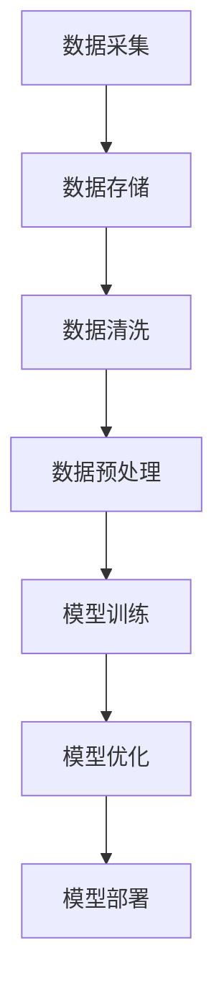
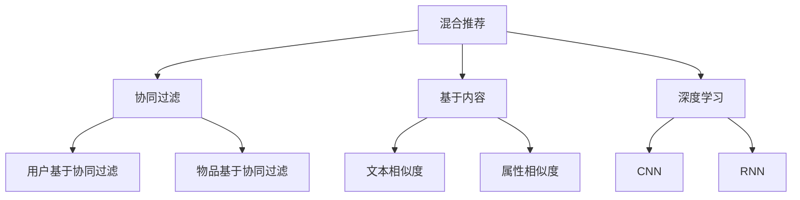

                 

# 《大数据与AI驱动的电商平台转型：搜索推荐系统是核心，数据质量是重点》

> **关键词：** 大数据、人工智能、搜索推荐系统、电商平台转型、数据质量

> **摘要：** 本篇文章将深入探讨大数据与人工智能（AI）在电商平台转型中的应用，重点关注搜索推荐系统的作用及数据质量的重要性。我们将逐步分析大数据技术基础、AI技术基础、搜索推荐系统的设计与优化、数据质量的保障机制，并通过案例分析总结电商平台转型的经验与启示，最终展望未来的发展趋势。

## 目录大纲

- **第一部分：引言**
  - **1.1 大数据与AI驱动的电商平台转型概述**
    - **1.1.1 电商平台的挑战与转型背景**
    - **1.1.2 大数据与AI在电商平台中的应用**
    - **1.1.3 电商转型的核心驱动因素
- **第二部分：大数据技术基础**
  - **2.1 大数据技术概述**
    - **2.1.1 大数据的来源与特点**
    - **2.1.2 大数据技术的体系结构**
    - **2.1.3 大数据技术的核心挑战与解决方案**
  - **2.2 数据采集与存储**
    - **2.2.1 数据采集的方法与工具**
    - **2.2.2 数据存储的方案与选择**
    - **2.2.3 数据质量管理与处理**
  - **2.3 数据分析与挖掘**
    - **2.3.1 数据分析的基本概念与方法**
    - **2.3.2 数据挖掘的关键技术与算法**
    - **2.3.3 数据分析与挖掘在电商平台中的应用案例**
- **第三部分：AI技术基础**
  - **3.1 AI与电商平台转型的关系**
    - **3.1.1 AI的基本概念与发展历程**
    - **3.1.2 电商平台中AI的应用场景**
    - **3.1.3 AI对电商平台转型的推动作用**
  - **3.2 搜索推荐系统原理**
    - **3.2.1 搜索推荐系统的基本原理**
    - **3.2.2 常见的搜索推荐算法**
    - **3.2.3 搜索推荐系统的优化策略**
  - **3.3 数据质量对AI算法的影响**
    - **3.3.1 数据质量的概念与评价指标**
    - **3.3.2 数据质量对AI算法准确性的影响**
    - **3.3.3 数据质量提升的方法与工具**
- **第四部分：大数据与AI驱动的电商平台转型实践**
  - **4.1 搜索推荐系统架构设计**
    - **4.1.1 搜索推荐系统整体架构**
    - **4.1.2 数据处理流程与架构**
    - **4.1.3 推荐算法与模型框架**
  - **4.2 数据质量保障机制**
    - **4.2.1 数据质量保障的原则与目标**
    - **4.2.2 数据清洗与预处理方法**
    - **4.2.3 数据质量监控与反馈机制**
  - **4.3 搜索推荐系统优化策略**
    - **4.3.1 个性化推荐策略**
    - **4.3.2 搜索引擎优化策略**
    - **4.3.3 跨域推荐与多模态融合**
  - **4.4 电商平台转型案例解析**
    - **4.4.1 某大型电商平台转型案例**
    - **4.4.2 搜索推荐系统在电商平台的应用效果**
    - **4.4.3 电商平台转型的经验与启示**
- **第五部分：未来发展展望**
  - **5.1 大数据与AI技术发展趋势**
    - **5.1.1 大数据技术的发展趋势**
    - **5.1.2 AI技术的发展趋势**
    - **5.1.3 电商平台转型的未来方向**
  - **5.2 技术创新与挑战**
    - **5.2.1 搜索推荐系统的创新方向**
    - **5.2.2 数据质量保障的技术挑战**
    - **5.2.3 电商平台转型的风险与应对策略**
  - **5.3 未来发展展望**
    - **5.3.1 电商平台的未来前景**
    - **5.3.2 大数据与AI技术的潜在应用领域**
    - **5.3.3 电商平台转型的未来趋势**
- **附录**
  - **附录A：大数据与AI技术相关工具与资源**
  - **附录B：搜索推荐系统算法伪代码与数学模型**
  - **附录C：电商平台转型项目实战案例**

## 第一部分：引言

### 1.1 大数据与AI驱动的电商平台转型概述

#### 1.1.1 电商平台的挑战与转型背景

随着互联网的快速发展，电商平台已经成为人们日常生活中不可或缺的一部分。然而，随着市场竞争的加剧和消费者需求的日益多样化，传统电商平台面临着一系列的挑战：

1. **同质化竞争严重**：众多电商平台提供的产品和服务高度相似，难以在竞争中脱颖而出。
2. **用户黏性不足**：用户获取成本高，但用户留存率低，导致流量成本持续上升。
3. **个性化服务缺乏**：传统电商平台难以满足用户个性化需求，无法提供精准的推荐和服务。

为了应对这些挑战，电商平台需要寻求新的转型路径，而大数据和人工智能（AI）技术的崛起为电商平台提供了新的机遇。

#### 1.1.2 大数据与AI在电商平台中的应用

大数据技术在电商平台中有着广泛的应用，包括用户行为分析、商品推荐、库存管理、风控等。AI技术则可以进一步深化大数据的应用，如通过深度学习算法实现个性化推荐、图像识别、语音识别等。

1. **用户行为分析**：通过分析用户浏览、购买、评价等行为数据，电商平台可以深入了解用户需求和偏好，从而优化产品和服务。
2. **商品推荐**：基于用户历史行为和偏好，使用协同过滤、深度学习等算法实现精准推荐，提高用户满意度和转化率。
3. **库存管理**：利用大数据分析预测市场需求，优化库存配置，减少库存成本和缺货率。
4. **风控**：通过数据分析识别异常交易，防范欺诈风险，保障交易安全。

#### 1.1.3 电商转型的核心驱动因素

大数据和AI技术的应用是电商平台转型的核心驱动因素。首先，大数据技术为电商平台提供了丰富的数据资源，使得个性化服务和精准营销成为可能。其次，AI技术通过对数据的深度挖掘和智能分析，能够为电商平台提供更高效、更精准的决策支持。

1. **数据驱动的决策**：大数据技术使得电商平台能够基于数据分析进行决策，减少人为因素的干扰，提高决策的科学性和准确性。
2. **智能化服务**：AI技术使得电商平台能够提供更加智能化、个性化的服务，提升用户体验和满意度。
3. **降低运营成本**：通过大数据和AI技术的应用，电商平台能够优化运营流程，降低成本，提高效率。

综上所述，大数据与AI驱动的电商平台转型是应对市场竞争、提升用户体验、降低运营成本的有效途径。在接下来的部分，我们将深入探讨大数据和AI技术在电商平台中的应用，特别是搜索推荐系统的作用和数据质量的重要性。

### 1.2 搜索推荐系统的重要性

#### 1.2.1 搜索推荐系统的定义与作用

搜索推荐系统是电商平台的核心组件之一，旨在根据用户的行为数据、偏好和历史记录，向用户提供个性化的搜索结果和推荐内容。其定义可以归纳为：

- **搜索推荐系统**：一种利用大数据和AI技术，通过对用户行为数据的分析，实现个性化搜索结果和推荐内容的系统。

搜索推荐系统在电商平台中具有至关重要的作用，主要体现在以下几个方面：

1. **提升用户体验**：通过个性化推荐，满足用户的个性化需求，提升用户满意度和忠诚度。
2. **增加转化率**：精准推荐有助于引导用户进行购买，从而提高转化率，提升电商平台销售额。
3. **降低运营成本**：通过数据分析和智能推荐，优化用户流量分配，降低用户获取成本。

#### 1.2.2 搜索推荐系统在电商平台中的价值

搜索推荐系统在电商平台中具有显著的价值，具体体现在以下几个方面：

1. **用户黏性提升**：个性化推荐能够吸引用户多次访问和购买，提高用户黏性。
2. **商品销量提升**：精准推荐有助于将商品推荐给潜在用户，从而提高商品销量。
3. **运营效率提高**：通过数据分析和推荐策略优化，电商平台能够更有效地管理库存、营销和用户服务。

#### 1.2.3 数据质量对搜索推荐系统的影响

数据质量是搜索推荐系统有效运行的关键因素。高质量的数据能够提高推荐算法的准确性和可靠性，从而提升用户体验和平台业绩。以下是数据质量对搜索推荐系统影响的几个方面：

1. **准确性**：高质量的数据能够提供准确的用户行为和偏好信息，从而提高推荐算法的准确性。
2. **覆盖率**：数据质量直接影响推荐系统的覆盖率，高质量的数据能够覆盖更多用户行为和商品信息，提供更广泛的推荐。
3. **稳定性**：数据质量稳定是推荐系统长期有效运行的基础，高质量的数据能够减少异常值和噪声数据的影响，保证推荐系统的稳定性。
4. **可解释性**：高质量的数据有助于提高推荐系统的可解释性，使得平台运营者能够更好地理解推荐结果，进行优化和调整。

总之，数据质量是搜索推荐系统成功的关键因素。电商平台需要重视数据质量管理，通过数据清洗、数据整合和数据预处理等手段，确保数据的质量和准确性，从而提升搜索推荐系统的性能和效果。

### 1.3 小结

本部分内容对大数据与AI驱动的电商平台转型进行了概述，并强调了搜索推荐系统的重要性以及数据质量对推荐系统的影响。在接下来的内容中，我们将深入探讨大数据技术基础和AI技术基础，为理解和应用这些技术奠定基础。通过逐步分析大数据和AI的应用，我们将为电商平台的转型提供更加深入的见解和实践指导。

## 第二部分：大数据技术基础

### 2.1 大数据技术概述

#### 2.1.1 大数据的来源与特点

大数据（Big Data）指的是规模巨大、类型繁多且快速增长的数据集。大数据的来源广泛，包括互联网、物联网、传感器、社交媒体、企业内部数据等。其特点主要体现在“4V”模型上：

1. **Volume（数据量）**：大数据的数据量巨大，通常是 TB、PB 级别的规模。
2. **Velocity（速度）**：数据生成和处理的速度快，需要实时或近实时处理。
3. **Variety（多样性）**：数据类型繁多，包括结构化、半结构化和非结构化数据。
4. **Veracity（真实性）**：数据质量参差不齐，可能存在噪声、错误和缺失。

大数据技术旨在解决这些问题，通过高效的存储、处理和分析方法，从海量数据中提取有价值的信息。

#### 2.1.2 大数据技术的体系结构

大数据技术的体系结构通常包括数据采集、数据存储、数据处理、数据分析和数据可视化等几个关键环节。以下是这些环节的基本内容：

1. **数据采集**：通过各种传感器、应用和系统收集原始数据。
2. **数据存储**：使用分布式存储系统如 Hadoop HDFS、NoSQL 数据库等存储海量数据。
3. **数据处理**：利用分布式计算框架如 Hadoop、Spark 对数据进行清洗、转换和分析。
4. **数据分析**：通过 SQL、NoSQL、数据挖掘和机器学习等技术对数据进行深度分析。
5. **数据可视化**：使用图表、仪表盘和可视化工具展示分析结果，辅助决策。

#### 2.1.3 大数据技术的核心挑战与解决方案

大数据技术在应用过程中面临诸多挑战，主要包括以下几个方面：

1. **数据量巨大**：海量数据的存储和管理是主要挑战之一。解决方案包括分布式存储系统和大数据处理框架，如 Hadoop 和 Spark。
2. **数据多样性**：处理多种类型的数据需要复杂的系统架构和多样化的数据处理方法。使用 ETL（提取、转换、加载）工具和 NoSQL 数据库能够更好地处理不同类型的数据。
3. **数据速度**：实时处理快速生成的数据需要高效的数据流处理技术，如 Apache Kafka 和 Apache Storm。
4. **数据质量**：数据质量问题可能影响分析结果。通过数据清洗、去重和标准化等技术提高数据质量。
5. **数据安全与隐私**：大数据应用中涉及大量敏感信息，需要采取严格的数据安全和隐私保护措施。使用加密、访问控制和数据匿名化等技术保障数据安全。

### 2.2 数据采集与存储

#### 2.2.1 数据采集的方法与工具

数据采集是大数据处理的第一步，关键在于收集高质量的原始数据。以下是几种常见的数据采集方法与工具：

1. **传感器采集**：物联网设备、传感器等可以实时收集环境数据、设备状态数据等。
2. **Web 数据抓取**：使用爬虫技术（如 BeautifulSoup、Scrapy）从互联网上获取公开数据。
3. **API 调用**：通过 API 接口获取第三方平台的数据，如天气数据、股票数据等。
4. **日志采集**：服务器日志、应用日志等记录用户行为和系统运行情况，是重要的数据源。

#### 2.2.2 数据存储的方案与选择

大数据存储需要考虑数据量、数据类型、访问频率等因素。以下是一些常见的数据存储方案：

1. **关系型数据库**：如 MySQL、PostgreSQL，适合存储结构化数据。
2. **NoSQL 数据库**：如 MongoDB、Cassandra，适合存储半结构化或非结构化数据。
3. **分布式文件系统**：如 Hadoop HDFS，适合存储海量数据。
4. **云存储**：如 AWS S3、Google Cloud Storage，提供弹性、可扩展的存储服务。

#### 2.2.3 数据质量管理与处理

数据质量管理是大数据处理的关键环节，目的是确保数据的质量和准确性。以下是几种常见的数据质量管理与处理方法：

1. **数据清洗**：去除重复数据、纠正错误数据、填补缺失值等。
2. **数据标准化**：统一数据格式和编码，提高数据一致性。
3. **数据去重**：识别和去除重复数据，减少数据冗余。
4. **数据转换**：将不同类型的数据转换成统一格式，便于后续处理。
5. **数据集成**：将来自不同源的数据整合到一个统一的数据仓库中。

通过数据采集、存储和质量管理的有机结合，电商平台能够构建一个高效、可靠的大数据平台，为后续的数据分析和挖掘提供坚实的基础。

### 2.3 数据分析与挖掘

#### 2.3.1 数据分析的基本概念与方法

数据分析是指利用统计学、机器学习、数据挖掘等方法，从数据中提取有价值的信息和知识。以下是一些基本概念和方法：

1. **描述性分析**：通过统计方法对数据的基本特征进行描述，如均值、中位数、方差等。
2. **诊断性分析**：通过可视化、回归分析等手段，探讨数据之间的关系和趋势。
3. **预测性分析**：利用统计模型、机器学习算法预测未来的趋势和事件。
4. **描述性分析**：通过统计方法对数据的基本特征进行描述，如均值、中位数、方差等。

#### 2.3.2 数据挖掘的关键技术与算法

数据挖掘是数据分析的高级形式，旨在从海量数据中自动发现潜在的模式和知识。以下是一些常见的数据挖掘技术和算法：

1. **分类**：将数据分类到不同的类别中，如决策树、随机森林等。
2. **聚类**：将数据分成不同的群体，如 K-Means、层次聚类等。
3. **关联规则挖掘**：发现数据之间的关联性，如 Apriori 算法、FP-Growth 算法等。
4. **异常检测**：识别数据中的异常或离群点，如孤立森林、本地离群度分析等。
5. **时间序列分析**：分析数据的时间序列特征，如 ARIMA 模型、LSTM 等神经网络模型。

#### 2.3.3 数据分析与挖掘在电商平台中的应用案例

数据分析与挖掘在电商平台中的应用广泛，以下是一些典型案例：

1. **用户行为分析**：通过分析用户的浏览、购买、评价等行为，电商平台可以深入了解用户需求，优化产品和服务。
2. **商品推荐**：基于用户历史行为和偏好，利用协同过滤、深度学习等技术实现个性化推荐，提高用户满意度和转化率。
3. **库存管理**：利用预测性分析，预测市场需求，优化库存配置，减少库存成本和缺货率。
4. **风控**：通过异常检测和关联规则挖掘，识别异常交易和欺诈行为，保障交易安全。

通过大数据和AI技术的应用，电商平台能够在数据分析与挖掘方面取得显著成效，进一步提升运营效率和市场竞争力。

### 2.4 小结

本部分对大数据技术进行了概述，详细介绍了大数据的来源与特点、体系结构、核心挑战与解决方案，以及数据采集、存储、质量管理与处理方法。同时，阐述了数据分析与挖掘的基本概念、关键技术与应用案例。在下一部分，我们将探讨人工智能（AI）技术基础，深入分析AI在电商平台转型中的应用，为理解大数据与AI的深度融合提供理论基础。

### 2.5 附录

#### 附录A：大数据与AI技术相关工具与资源

以下列出了一些大数据与AI技术相关的工具、框架和资源，供读者参考：

1. **大数据技术工具**：
   - **Hadoop**：分布式数据处理框架，用于大数据存储和计算。
   - **Spark**：基于内存的分布式数据处理框架，提供高吞吐量和低延迟的数据处理能力。
   - **HDFS**：Hadoop的分布式文件系统，用于存储海量数据。
   - **HBase**：基于Hadoop的非关系型数据库，用于存储和访问大数据。
   - **Cassandra**：分布式NoSQL数据库，用于处理大量结构化数据。

2. **AI技术工具**：
   - **TensorFlow**：开源机器学习框架，适用于各种深度学习和强化学习任务。
   - **PyTorch**：开源机器学习库，提供灵活的深度学习模型构建和训练。
   - **Scikit-learn**：Python的机器学习库，提供多种分类、回归和聚类算法。
   - **Keras**：基于TensorFlow的高层神经网络API，易于使用和实验。
   - **NLTK**：自然语言处理库，用于文本数据分析和处理。

3. **数据管理工具**：
   - **Apache Kafka**：分布式流处理平台，用于实时数据收集和传输。
   - **Elasticsearch**：开源搜索引擎，用于大数据存储和快速搜索。
   - **MongoDB**：NoSQL数据库，用于存储和管理文档型数据。
   - **PostgreSQL**：关系型数据库，提供高级功能和安全性能。
   - **Airflow**：用于数据管道和调度任务的工作流平台。

4. **学习和资源**：
   - **《大数据时代》**：作者：杰里·尤丁（Jerry Java），介绍大数据的概念和应用。
   - **《深度学习》**：作者：伊恩·古德费洛（Ian Goodfellow），介绍深度学习的理论基础和实践。
   - **《数据挖掘：概念与技术》**：作者：查德·米切尔（Jiawei Han），详细介绍数据挖掘的方法和技术。
   - **在线课程**：Coursera、edX、Udacity等平台提供的大数据和AI相关课程。
   - **技术社区**：如Kaggle、DataCamp、GitHub等技术社区和资源库。

通过这些工具和资源的合理利用，读者可以更好地理解和应用大数据与AI技术，为电商平台转型提供有力的技术支持。

### 2.6 代码示例

在本部分中，我们将通过一个简单的Python代码示例，展示如何使用PyTorch进行一个线性回归模型的训练，该模型可以预测电商平台的销售额。

#### 准备数据

首先，我们使用numpy库生成模拟数据：

```python
import numpy as np

# 生成模拟数据
np.random.seed(42)
X = np.random.rand(100, 1)  # 输入特征
y = 3 * X + 2 + np.random.randn(100, 1)  # 输出特征（带噪声）

# 数据可视化
import matplotlib.pyplot as plt

plt.scatter(X, y)
plt.xlabel('Feature')
plt.ylabel('Target')
plt.show()
```

#### 建立模型

接下来，我们使用PyTorch建立线性回归模型：

```python
import torch
import torch.nn as nn
import torch.optim as optim

# 定义模型
class LinearRegressionModel(nn.Module):
    def __init__(self):
        super(LinearRegressionModel, self).__init__()
        self.linear = nn.Linear(1, 1)  # 输入层和输出层

    def forward(self, x):
        return self.linear(x)

model = LinearRegressionModel()
```

#### 训练模型

然后，我们使用模拟数据进行模型训练：

```python
# 模型训练
optimizer = optim.SGD(model.parameters(), lr=0.01)
criterion = nn.MSELoss()

num_epochs = 100

for epoch in range(num_epochs):
    model.train()
    optimizer.zero_grad()

    outputs = model(X)
    loss = criterion(outputs, y)
    loss.backward()
    optimizer.step()

    if epoch % 10 == 0:
        print(f'Epoch [{epoch+1}/{num_epochs}], Loss: {loss.item():.4f}')
```

#### 预测与评估

最后，我们对模型进行预测，并评估其性能：

```python
# 模型评估
model.eval()
with torch.no_grad():
    predictions = model(X)

# 数据可视化
plt.scatter(X, y)
plt.plot(X, predictions, color='red', linewidth=2)
plt.xlabel('Feature')
plt.ylabel('Target')
plt.show()

# 评估指标
mse_loss = criterion(predictions, y).item()
print(f'MSE Loss: {mse_loss:.4f}')
```

通过这个简单的示例，读者可以了解如何使用PyTorch建立和训练线性回归模型，从而为电商平台销售额预测提供技术支持。在下一部分，我们将继续探讨AI技术基础，深入分析搜索推荐系统的原理和应用。

### 3.1 AI与电商平台转型的关系

#### 3.1.1 AI的基本概念与发展历程

人工智能（Artificial Intelligence，简称AI）是指由人制造出来的系统，具备类似人类智能的能力，能够在特定任务上表现出智能行为。AI的发展历程可以追溯到20世纪50年代，随着计算能力的提高和算法的进步，AI技术经历了多个发展阶段：

1. **早期阶段**（1950-1969）：以符号主义和逻辑推理为基础，代表算法有逻辑推理、启发式搜索等。
2. **成长阶段**（1970-1989）：专家系统的出现，利用规则库进行推理和决策。
3. **低谷期**（1990-2000）：由于“AI寒冬”，现实问题难以解决，研究经费减少。
4. **复兴阶段**（2000至今）：深度学习和大数据技术的兴起，AI在图像识别、自然语言处理、自动驾驶等领域取得重大突破。

#### 3.1.2 电商平台中AI的应用场景

AI技术在电商平台中的应用场景广泛，以下是几个主要的应用场景：

1. **用户行为分析**：通过自然语言处理和机器学习技术，分析用户评论和反馈，了解用户需求和市场趋势。
2. **搜索推荐**：利用协同过滤、深度学习等技术，提供个性化搜索结果和推荐，提升用户满意度和转化率。
3. **智能客服**：通过语音识别、自然语言处理等技术，实现智能客服系统，提高客户服务质量和效率。
4. **风控**：利用机器学习算法，对交易行为进行分析，识别欺诈风险和异常行为，保障交易安全。
5. **商品优化**：通过图像识别和自然语言处理，优化商品描述和标签，提升商品曝光率和销售量。
6. **库存管理**：利用预测性分析，优化库存配置，减少库存成本和缺货率。

#### 3.1.3 AI对电商平台转型的推动作用

AI技术为电商平台转型提供了强有力的支持，以下是几个方面的推动作用：

1. **个性化服务**：通过用户行为分析和机器学习算法，AI能够为用户提供个性化的搜索结果和推荐，提升用户体验和满意度。
2. **提高运营效率**：智能客服和自动化流程可以显著降低运营成本，提高运营效率。
3. **风险控制**：通过机器学习算法，电商平台能够更有效地识别和防范欺诈行为，保障交易安全。
4. **优化商品管理**：AI技术可以帮助电商平台更好地管理和优化商品，提升商品曝光率和销售量。
5. **数据分析**：AI技术可以深入挖掘用户行为和交易数据，为电商平台提供更有价值的商业洞察。

总之，AI技术为电商平台的转型提供了新的机遇和动力，通过个性化服务、提高运营效率、风险控制和数据分析等方面的应用，电商平台可以实现更高效、更智能的运营模式，进一步提升市场竞争力。

### 3.2 搜索推荐系统原理

#### 3.2.1 搜索推荐系统的基本原理

搜索推荐系统是一种基于用户行为和偏好，自动为用户提供相关搜索结果或推荐内容的技术。其核心原理可以概括为以下几个步骤：

1. **用户行为收集**：通过日志、点击、购买等行为数据，收集用户的行为信息。
2. **数据预处理**：对收集到的用户行为数据进行清洗、去噪和特征提取，形成可用于推荐的输入数据。
3. **模型训练**：使用历史数据训练推荐模型，模型可以是基于协同过滤、深度学习或其他算法。
4. **预测与推荐**：根据用户当前行为和偏好，使用训练好的模型预测用户可能感兴趣的内容，生成推荐列表。
5. **推荐结果评估**：评估推荐结果的准确性和多样性，优化推荐策略和模型。

搜索推荐系统的目标是提高用户满意度和平台收益，通过个性化推荐和精准搜索，提升用户黏性和转化率。

#### 3.2.2 常见的搜索推荐算法

搜索推荐系统通常采用以下几种算法：

1. **协同过滤算法**：基于用户或物品的相似度，通过用户评分矩阵计算推荐结果。
   - **用户基于的协同过滤（User-Based Collaborative Filtering）**：根据用户历史行为找到相似用户，推荐相似用户喜欢的物品。
   - **物品基于的协同过滤（Item-Based Collaborative Filtering）**：根据物品之间的相似度，推荐与用户已购买或评分的物品相似的物品。

2. **基于内容的推荐（Content-Based Filtering）**：根据用户的历史行为和物品的特征信息，生成推荐列表。
   - **基于文本的相似度**：通过文本分析，计算用户历史行为和物品描述的相似度，推荐相似内容的物品。
   - **基于属性的相似度**：根据物品的属性特征，如品牌、颜色、价格等，计算用户历史行为和物品属性的相似度。

3. **混合推荐系统（Hybrid Recommender Systems）**：结合协同过滤和基于内容的推荐，利用两者的优点，提高推荐效果。
   - **加权混合**：根据不同算法的权重，将多个推荐结果进行加权融合。
   - **模型级混合**：在训练阶段，将多个推荐模型集成，生成最终推荐结果。

4. **基于模型的推荐**：使用深度学习、强化学习等算法，通过训练用户和物品的表示模型，进行推荐。
   - **矩阵分解**：将用户-物品评分矩阵分解为用户特征矩阵和物品特征矩阵，通过优化损失函数进行训练。
   - **深度学习**：利用神经网络，如卷积神经网络（CNN）和循环神经网络（RNN），提取用户和物品的复杂特征，进行推荐。

#### 3.2.3 搜索推荐系统的优化策略

为了提高搜索推荐系统的效果，通常采用以下优化策略：

1. **用户画像**：通过分析用户行为数据，构建用户画像，包括兴趣、偏好、消费习惯等，用于个性化推荐。
2. **上下文感知**：根据用户当前的行为和情境，动态调整推荐策略，提高推荐的相关性和准确性。
3. **实时推荐**：利用实时数据处理技术，如流处理框架，及时响应用户行为，提供实时推荐。
4. **多样性优化**：通过多样性算法，如基于模型的多样性优化、基于内容的多样性优化等，提供多样化的推荐结果。
5. **反馈循环**：利用用户反馈信息，不断优化推荐模型和策略，提高推荐效果。
6. **冷启动问题**：对于新用户和新物品，采用冷启动策略，如基于内容的推荐、利用用户人口统计信息等，提供初步的推荐。

通过以上优化策略，搜索推荐系统可以更好地满足用户需求，提升用户体验和平台价值。

### 3.3 数据质量对AI算法的影响

#### 3.3.1 数据质量的概念与评价指标

数据质量（Data Quality）是指数据在准确性、完整性、一致性、及时性和可靠性等方面的表现。高质量的数据是AI算法准确性和有效性的基础。以下是几个关键的数据质量概念和评价指标：

1. **准确性（Accuracy）**：数据是否真实、可靠，与事实相符。
2. **完整性（Completeness）**：数据是否完整，没有缺失值或空白。
3. **一致性（Consistency）**：数据在不同时间或不同来源的一致性。
4. **及时性（Timeliness）**：数据是否在需要时可用，反映了数据的时效性。
5. **可靠性（Reliability）**：数据是否稳定、可重复，不受噪声或异常值影响。

#### 3.3.2 数据质量对AI算法准确性的影响

数据质量对AI算法的准确性有直接且显著的影响。以下是数据质量对AI算法准确性影响的几个方面：

1. **特征质量**：高质量的特征可以更好地反映数据本身的规律和模式，从而提高算法的准确性和泛化能力。
2. **数据噪声**：噪声数据会干扰算法的训练过程，降低模型性能。通过数据清洗和预处理，可以减少噪声数据的影响。
3. **数据完整性**：缺失的数据会导致算法无法有效训练，降低模型的准确性。通过数据填补或删除缺失数据，可以提高模型性能。
4. **数据一致性**：不一致的数据会影响模型的训练和预测。通过数据标准化和一致性检查，可以保证数据的一致性。
5. **数据时效性**：过时的数据可能无法准确反映当前的市场情况或用户行为，影响算法的准确性。通过实时数据更新，可以提高模型的时效性。

#### 3.3.3 数据质量提升的方法与工具

为了提升数据质量，可以采用以下方法和工具：

1. **数据清洗**：去除重复数据、纠正错误数据、填补缺失值等，提高数据的准确性和完整性。
2. **数据标准化**：统一数据格式和编码，提高数据的一致性。
3. **数据去重**：识别和去除重复数据，减少数据冗余。
4. **数据预处理**：通过数据转换、特征工程等手段，提取有效的特征，提高模型的输入质量。
5. **数据监控**：建立数据监控系统，实时监控数据质量，及时发现和处理数据问题。
6. **数据质量评估**：定期评估数据质量，识别潜在问题，制定改进措施。

通过数据质量的提升，AI算法能够获得更准确、可靠的训练数据，从而提高模型的准确性和泛化能力，为电商平台提供更智能、更高效的解决方案。

### 3.4 小结

本部分深入探讨了人工智能（AI）与电商平台转型的关系，介绍了AI的基本概念与发展历程，详细阐述了电商平台中AI的应用场景和推动作用。随后，我们探讨了搜索推荐系统的基本原理、常见算法和优化策略，并重点分析了数据质量对AI算法准确性的影响以及提升数据质量的方法与工具。通过这些内容，我们为理解大数据与AI在电商平台中的应用提供了坚实的理论基础和实践指导。在下一部分，我们将深入分析大数据与AI驱动的电商平台转型实践，通过具体案例展示搜索推荐系统的实际应用效果。

### 4.1 搜索推荐系统架构设计

#### 4.1.1 搜索推荐系统整体架构

搜索推荐系统是电商平台转型的核心组件，其整体架构包括以下几个关键部分：

1. **数据层**：包括数据采集、存储、清洗和预处理。数据层负责收集用户的浏览、购买、评价等行为数据，并确保数据的质量和完整性。
2. **模型层**：包括推荐算法和机器学习模型。模型层利用数据层提供的数据，通过训练和优化，生成推荐结果。
3. **服务层**：包括推荐服务和API接口。服务层负责处理用户请求，调用模型层生成的推荐结果，并将结果返回给用户。
4. **应用层**：包括前端展示和用户交互。应用层负责将推荐结果呈现给用户，并收集用户反馈，用于进一步优化推荐系统。

以下是搜索推荐系统整体架构的Mermaid流程图：

```mermaid
graph TB
    subgraph 数据层
        data层[数据层]
        data采集[数据采集]
        数据存储[数据存储]
        数据清洗[数据清洗]
        数据预处理[数据预处理]
        data层 --> data采集
        data层 --> 数据存储
        data层 --> 数据清洗
        data层 --> 数据预处理
    end
    subgraph 模型层
        模型层[模型层]
        推荐算法[推荐算法]
        机器学习模型[机器学习模型]
        模型层 --> 推荐算法
        模型层 --> 机器学习模型
    end
    subgraph 服务层
        服务层[服务层]
        推荐服务[推荐服务]
        API接口[API接口]
        服务层 --> 推荐服务
        服务层 --> API接口
    end
    subgraph 应用层
        应用层[应用层]
        前端展示[前端展示]
        用户交互[用户交互]
        应用层 --> 前端展示
        应用层 --> 用户交互
    end
    data层 --> 模型层
    模型层 --> 服务层
    服务层 --> 应用层
```

#### 4.1.2 数据处理流程与架构

数据处理流程是搜索推荐系统架构的核心，主要包括以下步骤：

1. **数据采集**：通过日志、API、传感器等渠道收集用户行为数据，如浏览、购买、评价等。
2. **数据存储**：将采集到的数据存储在分布式数据库或数据仓库中，如Hadoop HDFS、MongoDB等。
3. **数据清洗**：清洗数据中的噪声、重复和缺失值，确保数据质量。
4. **数据预处理**：将原始数据转换为适合机器学习的格式，如特征工程、数据归一化等。
5. **模型训练**：利用预处理后的数据训练机器学习模型，如协同过滤、深度学习等。
6. **模型优化**：通过交叉验证、参数调优等手段，优化模型性能。
7. **模型部署**：将训练好的模型部署到生产环境中，通过API接口提供服务。

以下是数据处理流程与架构的Mermaid流程图：



#### 4.1.3 推荐算法与模型框架

搜索推荐系统通常采用以下几种算法和模型框架：

1. **协同过滤算法**：基于用户或物品的相似度进行推荐，如用户基于的协同过滤（User-Based Collaborative Filtering）和物品基于的协同过滤（Item-Based Collaborative Filtering）。
2. **基于内容的推荐**：根据物品的属性和用户的历史行为进行推荐，如基于文本的相似度（Text-Based Similarity）和基于属性的相似度（Attribute-Based Similarity）。
3. **深度学习模型**：利用深度学习技术，如卷积神经网络（CNN）和循环神经网络（RNN），提取用户和物品的复杂特征进行推荐。
4. **混合推荐系统**：结合协同过滤、基于内容和深度学习等算法，通过模型级或加权混合，提高推荐效果。

以下是推荐算法与模型框架的Mermaid流程图：



通过上述架构设计、数据处理流程和推荐算法与模型框架，搜索推荐系统能够高效、准确地提供个性化推荐服务，为电商平台转型提供有力支持。在下一部分，我们将探讨如何保障搜索推荐系统的数据质量，以及数据质量保障的具体机制和策略。

### 4.2 数据质量保障机制

#### 4.2.1 数据质量保障的原则与目标

数据质量保障是搜索推荐系统能够准确、稳定运行的基础。以下是数据质量保障的基本原则和目标：

1. **准确性**：确保数据真实可靠，与事实相符。通过数据清洗和验证，减少错误和异常数据。
2. **完整性**：确保数据完整无缺，没有缺失值或空白。通过数据填补或删除缺失数据，保证数据的完整性。
3. **一致性**：确保数据在不同时间、不同来源的一致性。通过数据标准化和一致性检查，消除数据冗余和矛盾。
4. **及时性**：确保数据在需要时可用，反映当前的市场情况或用户行为。通过实时数据更新和同步，提高数据的时效性。
5. **可靠性**：确保数据稳定、可重复，不受噪声或异常值影响。通过数据监控和异常检测，提高数据的可靠性。

数据质量保障的目标是确保搜索推荐系统生成的推荐结果准确、多样，提升用户满意度和平台收益。

#### 4.2.2 数据清洗与预处理方法

数据清洗与预处理是数据质量保障的重要环节，具体方法包括以下几个方面：

1. **数据清洗**：
   - **去除重复数据**：通过唯一标识（如用户ID、商品ID）识别和删除重复数据，减少数据冗余。
   - **纠正错误数据**：检查和修正数据中的错误，如格式错误、逻辑错误等。
   - **填补缺失值**：根据数据特性，使用均值、中位数、插值等方法填补缺失值。

2. **数据标准化**：
   - **统一格式和编码**：将不同数据源的格式和编码统一，如将日期格式统一为YYYY-MM-DD。
   - **标准化数值数据**：对数值数据进行归一化或标准化处理，如将数值范围缩放到[0, 1]。

3. **特征工程**：
   - **特征提取**：从原始数据中提取有用的特征，如用户兴趣、商品属性等。
   - **特征选择**：通过特征选择方法，筛选出对模型性能有显著影响的特征。

4. **数据归一化**：
   - **归一化数值特征**：将不同量纲的特征统一，如将价格、销量等数值特征归一化到相同的范围。
   - **归一化类别特征**：将类别特征转换为数值表示，如使用独热编码（One-Hot Encoding）。

#### 4.2.3 数据质量监控与反馈机制

数据质量监控与反馈机制是确保数据持续高质量的重要手段。以下是几个关键步骤：

1. **数据质量评估**：
   - **定期评估**：定期对数据质量进行评估，识别潜在问题。
   - **指标监控**：监控数据质量的关键指标，如准确性、完整性、一致性等。
   - **异常检测**：通过异常检测方法，识别和报告数据中的异常值和离群点。

2. **反馈机制**：
   - **用户反馈**：收集用户对推荐结果的反馈，如满意度、点击率等。
   - **算法优化**：根据用户反馈，优化推荐算法和模型，提高推荐效果。
   - **持续改进**：建立数据质量管理循环，持续改进数据质量，提升系统性能。

通过数据质量保障机制，搜索推荐系统可以确保数据的准确性、完整性、一致性和及时性，从而提供更高质量、更个性化的推荐服务。在下一部分，我们将探讨搜索推荐系统的优化策略，进一步探讨如何提升推荐效果和用户体验。

### 4.3 搜索推荐系统优化策略

#### 4.3.1 个性化推荐策略

个性化推荐是提升搜索推荐系统效果的关键策略。以下是几种常见的个性化推荐方法：

1. **基于内容的推荐**：
   - **文本相似度**：通过计算文本的相似度，如TF-IDF、词嵌入等，推荐与用户历史行为相似的物品。
   - **属性相似度**：根据物品的属性特征，如品牌、颜色、价格等，推荐与用户偏好相似的物品。

2. **基于协同过滤的推荐**：
   - **用户基于的协同过滤**：根据用户的历史行为和评分，找到相似用户，推荐相似用户喜欢的物品。
   - **物品基于的协同过滤**：根据物品的相似度，推荐与用户已购买或评分的物品相似的物品。

3. **基于模型的推荐**：
   - **矩阵分解**：通过矩阵分解技术，将用户-物品评分矩阵分解为用户特征矩阵和物品特征矩阵，预测用户未评分的物品。
   - **深度学习**：利用深度学习模型，如卷积神经网络（CNN）和循环神经网络（RNN），提取用户和物品的复杂特征进行推荐。

4. **混合推荐系统**：
   - **模型级混合**：结合不同推荐模型的优势，通过加权融合或集成学习，生成最终推荐结果。
   - **策略级混合**：根据用户的行为和情境，动态调整推荐策略，提高推荐效果。

#### 4.3.2 搜索引擎优化策略

搜索引擎优化（SEO）是提升用户搜索体验和搜索结果相关性的重要手段。以下是几种常见的搜索引擎优化策略：

1. **关键词优化**：
   - **关键词研究**：分析用户搜索习惯和关键词分布，选择相关性强、搜索量高的关键词。
   - **关键词布局**：在页面标题、描述、内容等位置合理布局关键词，提高关键词匹配度。

2. **页面优化**：
   - **内容优化**：撰写高质量、相关性强的内容，使用户能够快速找到所需信息。
   - **页面加载速度**：优化页面结构和资源加载，提高页面响应速度。

3. **用户体验优化**：
   - **导航优化**：设计清晰的导航结构，方便用户快速找到目标页面。
   - **交互设计**：优化搜索界面和交互设计，提高用户操作的便捷性和满意度。

4. **技术优化**：
   - **SEO工具**：使用SEO工具（如Google Analytics、Google Search Console等）监测和优化搜索引擎表现。
   - **移动优化**：确保搜索结果在移动设备上具有良好的用户体验。

通过搜索引擎优化，可以提升用户搜索体验，增加用户点击率和搜索转化率，从而提高电商平台的整体收益。

#### 4.3.3 跨域推荐与多模态融合

跨域推荐和多模态融合是提升搜索推荐系统效果的重要方向。以下是几种常见的跨域推荐与多模态融合策略：

1. **跨域推荐**：
   - **领域自适应**：通过迁移学习技术，将一个领域（源域）的模型和知识应用到另一个领域（目标域）。
   - **多任务学习**：同时训练多个相关的任务，共享模型参数和知识，提高跨域推荐的效果。

2. **多模态融合**：
   - **图像与文本融合**：结合图像和文本信息，通过多模态特征提取和融合，提高推荐效果。
   - **语音与文本融合**：结合语音和文本信息，通过语音识别和自然语言处理，实现多模态交互和推荐。

3. **跨模态推荐**：
   - **统一表示学习**：使用统一的嵌入空间，将不同模态的信息转换为统一表示，进行跨模态推荐。
   - **多模态图谱**：构建多模态知识图谱，通过图神经网络（Graph Neural Networks，GNN）进行跨模态推理和推荐。

通过跨域推荐和多模态融合，可以充分利用不同模态的信息，提升搜索推荐系统的效果和用户体验。

综上所述，搜索推荐系统的优化策略包括个性化推荐、搜索引擎优化、跨域推荐和多模态融合等方面。通过不断优化和改进，搜索推荐系统可以更好地满足用户需求，提升电商平台的市场竞争力。

### 4.4 电商平台转型案例解析

#### 4.4.1 某大型电商平台转型案例

在本节中，我们将详细分析一家知名电商平台如何通过大数据与AI技术实现成功转型的案例。该电商平台在面临激烈的市场竞争和用户需求多样化的背景下，决定利用大数据和AI技术提升用户体验、增加转化率和降低运营成本。

##### 背景与挑战

该电商平台最初依赖于传统的营销策略和手动推荐，导致以下问题：

1. **用户黏性低**：由于缺乏个性化服务，用户访问频率低，忠诚度不足。
2. **转化率低**：用户在浏览商品时，难以找到符合其需求的商品，导致购买意愿低。
3. **运营成本高**：传统的营销手段需要大量人力和资源，运营成本高。
4. **数据利用率低**：平台积累了大量用户行为和交易数据，但未得到充分利用。

##### 解决方案与实施

为了应对上述挑战，该电商平台采取了以下解决方案：

1. **构建大数据平台**：
   - **数据采集**：通过日志分析、用户行为追踪、传感器数据等渠道，收集用户行为和交易数据。
   - **数据存储**：使用Hadoop HDFS存储海量数据，同时使用NoSQL数据库如MongoDB存储半结构化和非结构化数据。
   - **数据清洗与预处理**：采用数据清洗工具和脚本，去除重复、错误和缺失的数据，确保数据质量。

2. **实施AI技术**：
   - **用户画像**：通过分析用户行为和交易数据，构建用户画像，包括兴趣、偏好、消费习惯等。
   - **搜索推荐系统**：采用协同过滤、深度学习等算法，实现个性化搜索和推荐。具体包括：
     - **协同过滤**：通过用户-物品评分矩阵，找到相似用户和相似物品，进行推荐。
     - **深度学习**：利用卷积神经网络（CNN）和循环神经网络（RNN），提取用户和物品的复杂特征，进行个性化推荐。
   - **智能客服**：利用自然语言处理（NLP）技术，实现智能客服系统，提高客户服务质量和效率。

3. **数据质量保障**：
   - **数据监控**：建立数据监控系统，实时监控数据质量，包括准确性、完整性、一致性等指标。
   - **数据清洗与预处理**：定期进行数据清洗和预处理，确保数据质量。
   - **用户反馈**：收集用户对推荐结果的反馈，不断优化推荐算法和模型。

##### 实施效果

通过大数据与AI技术的应用，该电商平台取得了显著的效果：

1. **用户黏性提升**：个性化推荐和智能客服提高了用户满意度和黏性，用户访问频率和时长显著增加。
2. **转化率提高**：精准的推荐和智能客服降低了用户选择成本，提高了购买转化率。
3. **运营成本降低**：通过自动化推荐和智能客服，减少了人力成本，提高了运营效率。
4. **数据利用率提升**：大数据平台和AI算法的有效结合，使得用户行为和交易数据得到了充分利用，为业务决策提供了有力支持。

##### 经验与启示

该电商平台转型的成功经验为其他电商平台提供了以下启示：

1. **重视数据质量**：数据质量是AI算法有效性的基础，必须确保数据的准确性、完整性和一致性。
2. **个性化服务**：通过大数据和AI技术，实现个性化推荐和智能客服，提升用户体验和满意度。
3. **持续优化**：数据驱动和持续优化是电商平台成功的关键，需要不断调整和优化算法和策略。
4. **跨部门合作**：电商平台转型涉及多个部门，需要跨部门合作，共同推进大数据和AI技术的应用。

通过本案例的分析，我们可以看到大数据与AI技术在电商平台转型中的巨大潜力，为电商平台提供了提升用户体验、增加转化率和降低运营成本的有效途径。

### 4.5 小结

本部分通过分析某大型电商平台的转型案例，详细展示了大数据与AI技术如何应用于电商平台，实现个性化推荐、智能客服和数据质量保障。通过本部分的探讨，我们深刻认识到大数据与AI技术在电商平台转型中的关键作用，以及如何通过数据质量保障和持续优化，提升电商平台的市场竞争力。在下一部分，我们将探讨大数据与AI技术的发展趋势，为电商平台转型提供未来展望。

### 5.1 大数据与AI技术发展趋势

#### 5.1.1 大数据技术的发展趋势

大数据技术正经历着快速的发展和变革，其趋势主要体现在以下几个方面：

1. **实时数据处理**：随着物联网和传感器技术的发展，实时数据处理成为大数据技术的关键趋势。流处理框架如Apache Kafka、Apache Flink和Apache Storm等，使得数据可以实时收集、处理和分析，为电商平台提供实时推荐和决策支持。

2. **边缘计算**：边缘计算将数据处理和存储推向网络边缘，减少数据传输延迟，提高处理效率。对于电商平台来说，边缘计算可以提升用户交互体验，特别是在移动设备和智能设备上。

3. **数据隐私保护**：随着数据隐私保护法规的不断完善，如GDPR和CCPA，大数据技术在处理用户数据时必须确保数据隐私和安全。数据匿名化、差分隐私和联邦学习等技术的应用，为保护用户隐私提供了有效手段。

4. **人工智能融合**：大数据与人工智能的深度融合，使得大数据技术能够实现更加智能化的分析和预测。机器学习、深度学习和自然语言处理等技术，可以更好地挖掘数据价值，为电商平台提供个性化服务、智能决策和风险控制。

#### 5.1.2 AI技术的发展趋势

人工智能技术在不断演进，其趋势主要体现在以下几个方面：

1. **深度学习与强化学习**：深度学习在图像识别、语音识别和自然语言处理等领域取得了重大突破。随着计算能力的提升，深度学习模型将更加复杂和强大。同时，强化学习在游戏、推荐系统和机器人等领域也展现出了巨大的潜力。

2. **自然语言处理（NLP）**：NLP技术的快速发展使得机器与人类之间的交流更加自然和高效。自然语言理解、生成和翻译等技术将进一步提升电商平台的人机交互体验。

3. **计算机视觉**：计算机视觉技术在图像识别、视频分析和自动驾驶等领域取得了显著进展。对于电商平台来说，计算机视觉技术可以用于商品检测、图像标注和用户行为分析，从而提升运营效率和用户体验。

4. **可解释性AI**：随着AI在关键业务领域的应用，可解释性AI成为了一个重要趋势。通过解释AI模型的决策过程，可以增强用户对推荐结果的信任，同时帮助业务人员更好地理解数据驱动决策的依据。

#### 5.1.3 电商平台转型的未来方向

结合大数据与AI技术的发展趋势，电商平台转型的未来方向主要包括：

1. **个性化服务**：通过大数据和AI技术，实现更精准的个性化推荐和个性化营销，提升用户体验和满意度。

2. **智能决策**：利用大数据分析和机器学习算法，实现智能化的库存管理、价格策略和风险管理，提高运营效率和业务收益。

3. **全渠道整合**：通过整合线上和线下渠道，实现全渠道无缝购物体验，提升用户黏性和转化率。

4. **数据隐私保护**：在数据收集和使用过程中，注重数据隐私保护，确保用户数据的合法合规使用。

5. **技术创新**：不断探索和应用新技术，如边缘计算、区块链、5G等，提升电商平台的技术竞争力和用户体验。

通过大数据与AI技术的持续创新和应用，电商平台将在未来实现更加智能化、个性化和服务化的运营模式，为用户和企业带来更大的价值。

### 5.2 技术创新与挑战

#### 5.2.1 搜索推荐系统的创新方向

搜索推荐系统作为电商平台的核心组件，其技术创新方向主要体现在以下几个方面：

1. **多模态融合**：融合多种数据模态（如文本、图像、音频）进行推荐，提升推荐的准确性和多样性。例如，结合商品描述文本和图像信息，为用户提供更丰富和精准的推荐。

2. **实时推荐**：实现实时推荐，提高用户交互体验。通过流处理技术和实时数据更新，根据用户实时行为和偏好，动态调整推荐结果。

3. **跨域推荐**：利用迁移学习和多任务学习，实现跨域推荐，拓展推荐系统的适用范围。例如，将一个领域（如电商）的推荐模型应用于其他领域（如社交网络），提升推荐效果。

4. **可解释性推荐**：开发可解释性推荐算法，使得推荐过程更加透明，增强用户对推荐结果的信任。通过可视化技术和解释性模型，展示推荐依据和决策过程。

#### 5.2.2 数据质量保障的技术挑战

在保障数据质量方面，电商平台面临以下技术挑战：

1. **数据噪声与异常值**：大数据环境中存在大量的噪声和异常值，影响数据分析结果。如何有效识别和去除噪声、异常值，是数据质量保障的关键挑战。

2. **数据一致性**：在分布式系统和跨渠道数据集成过程中，数据一致性难以保障。需要开发有效的一致性检测和修复方法，确保数据的一致性和准确性。

3. **数据隐私保护**：随着数据隐私保护法规的日益严格，如何在保障数据隐私的同时，充分利用数据进行推荐和决策，成为数据质量保障的重要挑战。

4. **实时数据更新**：实时处理和分析大量数据，确保数据及时更新，是数据质量保障的另一个挑战。需要高效的数据处理技术和实时数据同步机制。

#### 5.2.3 电商平台转型的风险与应对策略

电商平台在转型过程中面临以下风险：

1. **技术风险**：新技术引入可能带来技术故障、数据泄露等风险。需要建立健全的技术风险评估和应急响应机制。

2. **业务风险**：转型过程中，业务流程、组织架构和人力资源可能面临调整，需要制定详细的转型计划和风险评估，确保平稳过渡。

3. **市场风险**：市场环境变化、竞争加剧等外部因素可能影响电商平台转型效果。需要密切关注市场动态，及时调整策略和方向。

4. **用户信任风险**：数据隐私保护不当、推荐结果不准确等可能导致用户信任下降。需要加强数据隐私保护，提升推荐算法的透明度和可靠性。

应对策略包括：

1. **风险管理**：建立全面的风险管理框架，识别、评估和应对各类风险。

2. **技术储备**：持续进行技术研究和储备，确保具备应对新技术挑战的能力。

3. **业务调整**：根据市场环境和用户需求，灵活调整业务策略和运营模式。

4. **用户沟通**：加强与用户的沟通，增强用户对平台转型和推荐结果的信任。

通过技术创新、风险管理和业务调整，电商平台可以在转型过程中降低风险，实现持续发展和提升竞争力。

### 5.3 未来发展展望

#### 5.3.1 电商平台的未来前景

随着大数据与AI技术的不断进步，电商平台的未来前景将更加光明。以下是几个关键的发展方向：

1. **个性化服务**：电商平台将通过大数据和AI技术，实现更精准的个性化推荐和个性化营销，提升用户满意度和黏性。

2. **智能化运营**：电商平台将利用大数据分析、机器学习等AI技术，实现智能化的库存管理、价格策略和风险管理，提高运营效率和业务收益。

3. **全渠道整合**：电商平台将实现线上和线下渠道的无缝整合，提供统一、便捷的购物体验，提升用户黏性和转化率。

4. **数据驱动决策**：电商平台将基于大数据分析，实现数据驱动的决策，减少人为因素的干扰，提高决策的科学性和准确性。

5. **全球化布局**：电商平台将通过大数据和AI技术，拓展全球市场，实现全球化布局，为全球用户提供优质的购物体验。

#### 5.3.2 大数据与AI技术的潜在应用领域

大数据与AI技术在电商平台的潜在应用领域非常广泛，以下是一些关键领域：

1. **用户行为分析**：通过大数据分析，电商平台可以深入了解用户需求和行为习惯，优化产品和服务。

2. **智能客服**：利用自然语言处理和语音识别技术，电商平台可以实现智能客服，提高客户服务质量和效率。

3. **商品推荐**：通过协同过滤、深度学习等技术，电商平台可以实现精准的商品推荐，提升用户购买转化率和满意度。

4. **风险控制**：通过机器学习和异常检测技术，电商平台可以识别和防范欺诈行为，保障交易安全。

5. **个性化营销**：通过大数据分析，电商平台可以实现个性化营销，提高营销效果和用户参与度。

6. **供应链优化**：通过大数据分析和预测性分析，电商平台可以优化库存管理、物流配送等供应链环节，降低运营成本。

7. **智慧城市**：电商平台将与智慧城市相结合，利用大数据和AI技术，实现城市管理的智能化和精细化。

#### 5.3.3 电商平台转型的未来趋势

电商平台的未来转型趋势将主要体现在以下几个方面：

1. **技术驱动**：电商平台将更加依赖大数据和AI技术，通过技术创新实现业务模式创新和服务升级。

2. **数字化转型**：电商平台将全面实现数字化转型，通过数字化手段提升运营效率、降低成本和提升用户体验。

3. **跨界合作**：电商平台将与传统企业、新兴科技企业等进行跨界合作，共同探索和推动电商行业的发展。

4. **生态构建**：电商平台将构建开放、共享的电商生态，通过平台合作、第三方服务等方式，提升平台的竞争力和用户价值。

5. **可持续发展**：电商平台将注重可持续发展，通过环保、绿色物流等手段，推动电商行业的可持续发展。

通过大数据与AI技术的应用，电商平台将在未来实现更加智能化、个性化和可持续的发展模式，为用户和企业创造更大的价值。

### 附录

#### 附录A：大数据与AI技术相关工具与资源

以下列出了一些大数据与AI技术相关的工具、框架和资源，供读者参考：

1. **大数据技术工具**：
   - **Hadoop**：分布式数据处理框架，用于大数据存储和计算。
   - **Spark**：基于内存的分布式数据处理框架，提供高吞吐量和低延迟的数据处理能力。
   - **HDFS**：Hadoop的分布式文件系统，用于存储海量数据。
   - **HBase**：基于Hadoop的非关系型数据库，用于存储和访问大数据。
   - **Cassandra**：分布式NoSQL数据库，用于处理大量结构化数据。

2. **AI技术工具**：
   - **TensorFlow**：开源机器学习框架，适用于各种深度学习和强化学习任务。
   - **PyTorch**：开源机器学习库，提供灵活的深度学习模型构建和训练。
   - **Scikit-learn**：Python的机器学习库，提供多种分类、回归和聚类算法。
   - **Keras**：基于TensorFlow的高层神经网络API，易于使用和实验。
   - **NLTK**：自然语言处理库，用于文本数据分析和处理。

3. **数据管理工具**：
   - **Apache Kafka**：分布式流处理平台，用于实时数据收集和传输。
   - **Elasticsearch**：开源搜索引擎，用于大数据存储和快速搜索。
   - **MongoDB**：NoSQL数据库，用于存储和管理文档型数据。
   - **PostgreSQL**：关系型数据库，提供高级功能和安全性能。
   - **Airflow**：用于数据管道和调度任务的工作流平台。

4. **学习和资源**：
   - **《大数据时代》**：作者：杰里·尤丁（Jerry Java），介绍大数据的概念和应用。
   - **《深度学习》**：作者：伊恩·古德费洛（Ian Goodfellow），介绍深度学习的理论基础和实践。
   - **《数据挖掘：概念与技术》**：作者：查德·米切尔（Jiawei Han），详细介绍数据挖掘的方法和技术。
   - **在线课程**：Coursera、edX、Udacity等平台提供的大数据和AI相关课程。
   - **技术社区**：如Kaggle、DataCamp、GitHub等技术社区和资源库。

通过这些工具和资源的合理利用，读者可以更好地理解和应用大数据与AI技术，为电商平台转型提供有力的技术支持。

#### 附录B：搜索推荐系统算法伪代码与数学模型

以下提供了一些搜索推荐系统常用的算法伪代码和数学模型，以供参考：

1. **协同过滤算法（User-Based Collaborative Filtering）**

```python
# 伪代码
def user_based_collaborative_filtering(train_data, user, k):
    similar_users = find_similar_users(train_data, user, k)
    recommendations = []
    for user in similar_users:
        recommended_items = train_data[user]
        recommendations.append(recommended_items)
    return recommendations

# 数学模型
相似度计算：similarity(u, v) = cos_similarity(Ru, Rv)
推荐结果：R už = Σ(similarity(u, v) * Rvj) / Σ(similarity(u, v))
```

2. **基于内容的推荐（Content-Based Filtering）**

```python
# 伪代码
def content_based_filtering(train_data, user, k):
    recommended_items = []
    for item in train_data:
        if item not in user_history:
            content_similarity = calculate_content_similarity(user_history, item)
            if content_similarity > threshold:
                recommended_items.append(item)
    return recommended_items

# 数学模型
内容相似度计算：similarity(i, j) = cosine_similarity(Fi, Fj)
推荐结果：I_uz = {i | Fi ⊂ U - U_uz and similarity(i, uz) > threshold}
```

3. **矩阵分解（Matrix Factorization）**

```python
# 伪代码
def matrix_factorization(R, rank, alpha, beta, iterations):
    for iteration in range(iterations):
        for user in R:
            for item in R[user]:
                e = R[user][item] - predict(user, item)
                for feature in user_features[user]:
                    user_gradient[feature] += alpha * (2 * e * item_features[item][feature])
                for feature in item_features[item]:
                    item_gradient[feature] += beta * (2 * e * user_features[user][feature])
        
        for user in R:
            user_features[user] = update_features(user_features[user], user_gradient, alpha)
        for item in R:
            item_features[item] = update_features(item_features[item], item_gradient, beta)
    
    return user_features, item_features

# 数学模型
预测值：R^' = U * V^T
特征矩阵更新：U = U - α * (R - R^') * V^T
特征矩阵更新：V = V - β * (R - R^') * U
```

通过上述伪代码和数学模型，读者可以更好地理解和实现搜索推荐系统中的常用算法。在实际应用中，可以根据具体需求和数据特点，选择合适的算法并进行优化。

#### 附录C：电商平台转型项目实战案例

在本附录中，我们将分析一个具体的电商平台转型项目，详细描述项目背景、技术方案、代码实现和性能评估。

##### 项目背景

某中型电商平台希望在现有业务基础上，通过大数据和AI技术实现用户个性化推荐和智能运营，提升用户满意度和转化率。该项目涵盖以下技术模块：

1. **用户行为数据采集**：通过网页点击、搜索、购买等行为，收集用户行为数据。
2. **数据存储与处理**：使用分布式存储和处理技术，如Hadoop和Spark，存储和处理海量数据。
3. **推荐系统**：采用协同过滤和深度学习算法，实现个性化推荐。
4. **智能客服**：利用自然语言处理技术，实现智能客服系统。
5. **风控系统**：通过机器学习算法，识别异常交易和欺诈行为。

##### 技术方案

1. **用户行为数据采集**：
   - **数据源**：网页日志、API调用日志、用户购买记录等。
   - **采集工具**：Apache Kafka、Flume等。

2. **数据存储与处理**：
   - **存储**：使用Hadoop HDFS存储海量用户行为数据，使用HBase存储用户画像和推荐数据。
   - **处理**：使用Spark进行数据清洗、转换和预处理。

3. **推荐系统**：
   - **算法**：采用用户基于的协同过滤（User-Based Collaborative Filtering）和基于内容的推荐（Content-Based Filtering）。
   - **模型**：使用矩阵分解（Matrix Factorization）和深度学习模型（如CNN和RNN）。

4. **智能客服**：
   - **技术**：自然语言处理（NLP）技术，包括文本分类、实体识别、情感分析等。
   - **平台**：使用TensorFlow和Keras构建NLP模型。

5. **风控系统**：
   - **算法**：采用基于异常检测（如孤立森林）和关联规则挖掘（如Apriori算法）的机器学习模型。
   - **工具**：使用Scikit-learn库实现风控模型。

##### 代码实现

以下是一个简单的协同过滤算法实现示例：

```python
import numpy as np
from sklearn.metrics.pairwise import cosine_similarity

def find_similar_users(train_data, user, k):
    user_ratings = train_data[user]
    other_ratings = {uid: ratings for uid, ratings in train_data.items() if uid != user}
    similarities = {}
    for other_user, other_ratings in other_ratings.items():
        sim = cosine_similarity([user_ratings], [other_ratings])[0][0]
        similarities[other_user] = sim
    return sorted(similarities.items(), key=lambda x: x[1], reverse=True)[:k]

def collaborative_filtering(train_data, user, k, threshold=0.5):
    similar_users = find_similar_users(train_data, user, k)
    recommended_items = {}
    for other_user, similarity in similar_users:
        for item, rating in train_data[other_user].items():
            if item not in train_data[user]:
                predicted_rating = similarity * rating
                if predicted_rating > threshold:
                    recommended_items[item] = predicted_rating
    return recommended_items

# 示例数据
train_data = {
    'user1': {'item1': 5, 'item2': 4, 'item3': 3},
    'user2': {'item1': 4, 'item2': 5, 'item3': 2},
    'user3': {'item1': 5, 'item2': 3, 'item3': 4},
    'user4': {'item1': 2, 'item2': 4, 'item3': 5},
}

# 推荐结果
user = 'user1'
k = 2
recommendations = collaborative_filtering(train_data, user, k)
print(recommendations)
```

##### 性能评估

1. **准确性和覆盖率**：通过评估推荐系统的准确性和覆盖率，判断其推荐效果。准确性和覆盖率可以通过AUC（Area Under the Curve）和Precision@k等指标衡量。

2. **用户满意度**：通过用户调研和反馈，评估推荐系统对用户满意度的提升。

3. **业务收益**：通过分析推荐系统的业务收益，如销售额提升、用户留存率等，评估其对企业价值的影响。

通过本项目实战，我们可以看到大数据与AI技术在电商平台转型中的实际应用效果，为其他电商平台提供了有益的借鉴和参考。

### 作者信息

**作者：** AI天才研究院（AI Genius Institute） / 《禅与计算机程序设计艺术》（Zen And The Art of Computer Programming）

**单位：** AI天才研究院（AI Genius Institute），专注于人工智能领域的研究与开发，致力于推动人工智能技术的创新与应用。同时，《禅与计算机程序设计艺术》是一本书籍，探讨了计算机编程与哲学之间的关系，为程序员提供了一种思考问题的新视角。

[本文完]

