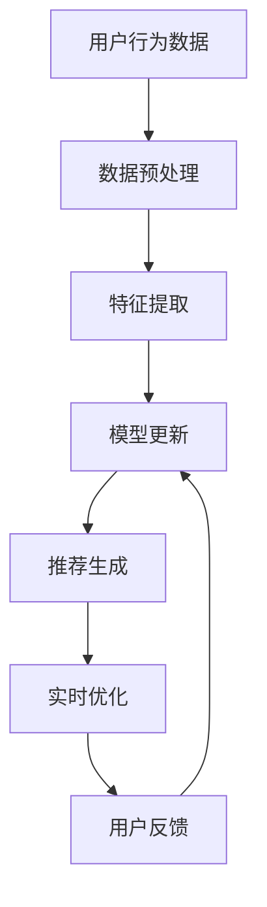
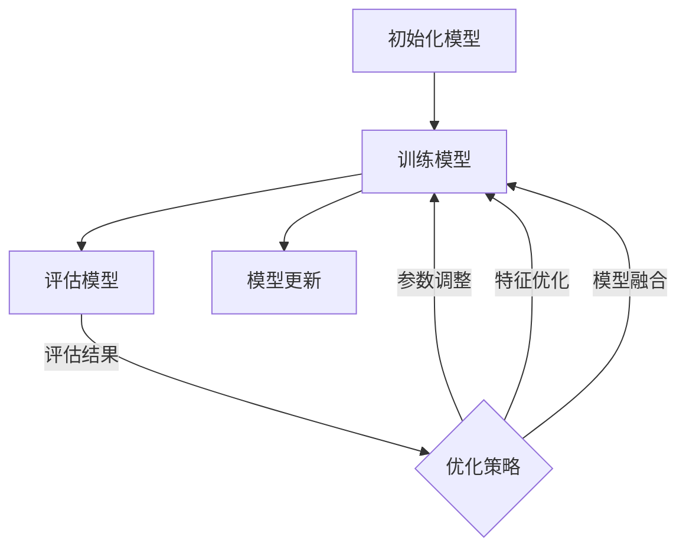

                 

# 大模型：统一的推荐系统解决方案

> **关键词**：大模型、推荐系统、协同过滤、内容推荐、算法优化

> **摘要**：本文将深入探讨大模型在推荐系统中的应用，通过逐步分析其核心算法、技术应用、评估与优化方法，以及实战案例，全面揭示大模型如何实现推荐系统的统一解决方案。本文旨在为研究人员和开发者提供有价值的参考，以推动推荐系统技术的发展。

---

## 第一部分：推荐系统概述与背景

### 第1章：推荐系统基础

#### 1.1 推荐系统概述

**1.1.1 什么是推荐系统**

推荐系统是一种信息过滤技术，旨在根据用户的历史行为、偏好和其他相关因素，向用户推荐他们可能感兴趣的项目、内容或服务。推荐系统的基本目标是提高用户的满意度和参与度，从而提升产品或服务的用户体验。

**1.1.2 推荐系统的重要性**

推荐系统在当今的数字化时代扮演着至关重要的角色。它们被广泛应用于电子商务、社交媒体、在线视频和新闻推送等领域，极大地提升了用户对产品的满意度和购买意愿。

**1.1.3 推荐系统的分类**

推荐系统主要分为两大类：协同过滤和内容推荐。

- **协同过滤**：通过分析用户之间的相似性，推荐用户可能感兴趣的项目。协同过滤又分为基于用户的协同过滤（User-based Collaborative Filtering）和基于项目的协同过滤（Item-based Collaborative Filtering）。
  
- **内容推荐**：基于项目的属性和特征，推荐与用户兴趣相匹配的项目。内容推荐通常涉及特征提取、内容匹配和推荐生成等步骤。

#### 1.2 推荐系统的基本架构

**1.2.1 协同过滤**

**1.2.1.1 基于用户的协同过滤**

基于用户的协同过滤方法通过计算用户之间的相似性，找出与目标用户相似的其他用户，然后推荐这些相似用户喜欢的项目。其核心步骤包括：

1. 计算用户相似性：通常使用余弦相似度、皮尔逊相关系数等度量方法。
2. 找出相似用户：基于用户之间的相似性得分，找出与目标用户最相似的若干用户。
3. 推荐项目：推荐相似用户喜欢的但目标用户未观看的项目。

**1.2.1.2 基于项目的协同过滤**

基于项目的协同过滤方法通过分析项目之间的相似性，推荐用户可能感兴趣的项目。其核心步骤包括：

1. 计算项目相似性：通常使用余弦相似度、Jaccard相似性等度量方法。
2. 找出相似项目：基于项目之间的相似性得分，找出与目标项目最相似的其他项目。
3. 推荐用户：推荐喜欢相似项目的用户。

**1.2.2 内容推荐**

**1.2.2.1 内容特征提取**

内容推荐方法首先需要提取项目的特征，如文本、图像、音频等。常用的特征提取技术包括词袋模型、TF-IDF、词嵌入等。

**1.2.2.2 内容匹配与推荐**

内容匹配是推荐系统的关键环节，其目标是将用户兴趣与项目特征进行匹配。常用的匹配方法包括基于关键词的匹配、基于语义的匹配等。

#### 1.3 推荐系统的挑战与解决方案

**1.3.1 数据稀疏性问题**

数据稀疏性是推荐系统面临的主要挑战之一。由于用户和项目数量庞大，用户-项目交互数据往往非常稀疏，导致推荐效果不佳。为了解决数据稀疏性问题，可以采用以下方法：

1. 模型降维：通过矩阵分解、主成分分析等方法降低数据维度。
2. 利用外部数据：利用用户和项目的公共信息，如人口统计信息、社交网络数据等。

**1.3.2 可扩展性问题**

随着用户和项目数量的增长，推荐系统的计算复杂度和存储需求也随之增加，导致系统性能下降。为了解决可扩展性问题，可以采用以下方法：

1. 分布式计算：将计算任务分解到多个节点，利用分布式计算框架如MapReduce、Spark等。
2. 缓存技术：使用缓存技术减少对原始数据的访问，提高系统响应速度。

**1.3.3 冷启动问题**

冷启动问题是指新用户或新项目加入推荐系统时，由于缺乏足够的历史数据，导致推荐效果不佳。为了解决冷启动问题，可以采用以下方法：

1. 利用用户历史数据：分析用户在加入系统前在其他平台的偏好，为新用户生成初始推荐。
2. 利用内容特征：为新项目生成初始推荐，利用其内容特征与用户兴趣进行匹配。

### 第2章：大模型与推荐系统

#### 2.1 大模型的崛起

**2.1.1 大模型的发展历程**

大模型的发展历程可以分为以下几个阶段：

1. **小模型阶段**：以神经网络、深度学习为基础，模型规模较小，参数量在数百万左右。
2. **中等模型阶段**：随着计算资源和数据量的增加，模型规模逐渐扩大，参数量达到数十亿。
3. **大模型阶段**：当前的大模型如GPT、BERT等，参数量达到数万亿甚至更高。

**2.1.2 大模型的优势与应用领域**

大模型具有以下优势：

1. **强大的表示能力**：大模型能够学习到复杂的特征表示，提高推荐系统的准确性和效果。
2. **多模态处理能力**：大模型能够处理多种类型的数据，如文本、图像、音频等，实现跨模态推荐。

大模型的应用领域包括：

1. **自然语言处理**：如机器翻译、文本生成、问答系统等。
2. **计算机视觉**：如图像分类、目标检测、图像生成等。
3. **推荐系统**：如商品推荐、新闻推荐、音乐推荐等。

#### 2.2 大模型在推荐系统中的应用

**2.2.1 大模型在协同过滤中的应用**

大模型在协同过滤中的应用主要体现在以下几个方面：

1. **矩阵分解**：利用大模型进行矩阵分解，学习到用户和项目的潜在特征，提高推荐系统的准确性。
2. **基于模型的协同过滤**：基于大模型的协同过滤方法，通过预测用户和项目之间的评分，实现个性化推荐。

**2.2.2 大模型在内容推荐中的应用**

大模型在内容推荐中的应用主要包括以下几个方面：

1. **内容特征提取**：利用大模型提取项目的文本、图像、音频等特征，实现多模态内容推荐。
2. **基于内容的推荐**：利用大模型学习到的特征，实现基于内容的推荐，提高推荐系统的多样性。

## 第二部分：大模型推荐系统的核心技术

### 第3章：大模型推荐系统的核心算法

#### 3.1 大规模矩阵分解

**3.1.1 SVD算法**

奇异值分解（SVD）是一种常用的矩阵分解方法，可以将原始的评分矩阵分解为用户特征矩阵和项目特征矩阵的乘积。其基本步骤如下：

$$
\text{评分矩阵} = U \Sigma V^T
$$

- **U**：用户特征矩阵
- **Σ**：奇异值矩阵
- **V**：项目特征矩阵

**3.1.2 Alternating Least Squares (ALS) 算法**

交替最小二乘（ALS）算法是一种迭代的矩阵分解方法，通过交替更新用户和项目特征矩阵，优化评分预测。其基本步骤如下：

1. **初始化**：随机初始化用户和项目特征矩阵。
2. **更新用户特征矩阵**：固定项目特征矩阵，优化用户特征矩阵。
3. **更新项目特征矩阵**：固定用户特征矩阵，优化项目特征矩阵。
4. **迭代**：重复步骤2和3，直到收敛。

#### 3.2 大规模协同过滤算法

**3.2.1 Memory-based方法**

基于内存的协同过滤方法通过存储用户和项目的相似性矩阵，快速计算推荐结果。其核心步骤如下：

1. **计算相似性矩阵**：使用余弦相似度、皮尔逊相关系数等方法计算用户和项目之间的相似性。
2. **生成推荐列表**：根据相似性得分，为每个用户生成推荐列表。

**3.2.2 Model-based方法**

基于模型的协同过滤方法通过训练预测模型，预测用户和项目之间的评分。其核心步骤如下：

1. **训练预测模型**：使用用户和项目的特征，训练预测模型（如线性回归、决策树等）。
2. **生成推荐列表**：使用预测模型预测用户和项目之间的评分，为每个用户生成推荐列表。

### 第4章：大模型在特征工程中的应用

#### 4.1 特征提取技术

**4.1.1 用户行为特征提取**

用户行为特征提取主要包括以下方面：

1. **浏览行为**：记录用户在网站上的浏览历史，如浏览时间、浏览频率、浏览路径等。
2. **购买行为**：记录用户的购买历史，如购买时间、购买频率、购买商品等。
3. **搜索行为**：记录用户的搜索历史，如搜索关键词、搜索时间等。

**4.1.2 项目内容特征提取**

项目内容特征提取主要包括以下方面：

1. **文本特征**：使用词袋模型、TF-IDF等方法提取项目的文本特征。
2. **图像特征**：使用卷积神经网络（CNN）提取项目的图像特征。
3. **音频特征**：使用深度神经网络提取项目的音频特征。

#### 4.2 特征融合技术

**4.2.1 基于模型的特征融合**

基于模型的特征融合方法通过训练融合模型，将不同类型的特征进行融合。其核心步骤如下：

1. **特征输入**：将不同类型的特征输入融合模型。
2. **模型训练**：训练融合模型，学习特征之间的相关性。
3. **特征融合**：使用融合模型生成融合特征。

**4.2.2 基于规则的特性融合**

基于规则的特性融合方法通过定义规则，将不同类型的特征进行融合。其核心步骤如下：

1. **规则定义**：根据业务需求，定义特征融合规则。
2. **特征计算**：根据规则计算融合特征。
3. **特征应用**：将融合特征应用于推荐系统。

### 第5章：大模型推荐系统的评估与优化

#### 5.1 推荐系统的评估指标

**5.1.1 准确性指标**

准确性指标主要衡量推荐系统的推荐准确性，常用的指标包括：

1. **准确率（Accuracy）**：推荐结果中实际兴趣项目的比例。
2. **召回率（Recall）**：实际兴趣项目在推荐结果中的比例。
3. **精确率（Precision）**：推荐结果中实际兴趣项目的比例。

**5.1.2 可扩展性指标**

可扩展性指标主要衡量推荐系统的性能，常用的指标包括：

1. **响应时间（Response Time）**：系统从接收到请求到返回推荐结果的时间。
2. **吞吐量（Throughput）**：单位时间内系统能够处理的请求量。

#### 5.2 推荐系统的优化方法

**5.2.1 实时优化**

实时优化是指在推荐过程中，根据用户反馈和实时数据，动态调整推荐策略。其核心步骤如下：

1. **实时数据收集**：收集用户的实时反馈和行为数据。
2. **模型更新**：根据实时数据，更新推荐模型。
3. **推荐调整**：根据更新后的模型，调整推荐结果。

**5.2.2 用户反馈驱动优化**

用户反馈驱动优化是指通过用户的反馈，不断改进推荐系统。其核心步骤如下：

1. **反馈收集**：收集用户的反馈数据，如点击、收藏、评分等。
2. **模型训练**：使用反馈数据训练推荐模型。
3. **模型更新**：根据训练结果，更新推荐模型。

## 第三部分：大模型推荐系统的实战应用

### 第6章：大模型推荐系统的开发流程

#### 6.1 数据预处理

**6.1.1 数据清洗**

数据清洗是推荐系统开发的第一步，主要包括以下任务：

1. **缺失值处理**：填充或删除缺失值。
2. **异常值处理**：识别并处理异常数据。
3. **数据格式转换**：统一数据格式，如日期、时间等。

**6.1.2 数据归一化**

数据归一化是将不同特征的数据进行标准化处理，以便于模型训练。常用的方法包括：

1. **最小-最大缩放**：将数据缩放到[0, 1]范围内。
2. **标准缩放**：将数据缩放到[-1, 1]范围内。
3. **Z分数缩放**：将数据缩放到均值为0，标准差为1的范围内。

#### 6.2 模型选择与训练

**6.2.1 模型选择策略**

模型选择策略是根据业务需求和数据特点，选择合适的推荐模型。常用的模型包括：

1. **基于矩阵分解的协同过滤**：适用于数据稀疏性问题。
2. **基于内容的推荐**：适用于内容特征丰富的数据。
3. **混合推荐**：结合协同过滤和内容推荐，提高推荐效果。

**6.2.2 模型训练方法**

模型训练方法是根据所选模型，使用数据集进行训练。常用的训练方法包括：

1. **批量训练**：将所有数据分成多个批次，逐批次训练模型。
2. **在线训练**：实时接收用户反馈，动态调整模型参数。
3. **增量训练**：只对新增数据进行训练，提高训练效率。

#### 6.3 模型评估与优化

**6.3.1 模型评估指标**

模型评估指标是根据业务需求和用户反馈，选择合适的评估指标。常用的评估指标包括：

1. **准确率**：衡量推荐结果的准确性。
2. **召回率**：衡量推荐结果的有效性。
3. **精确率**：衡量推荐结果的可靠性。

**6.3.2 模型优化策略**

模型优化策略是根据评估结果，调整模型参数和训练策略，提高推荐效果。常用的优化策略包括：

1. **参数调整**：调整模型参数，如学习率、正则化项等。
2. **特征工程**：改进特征提取方法，提高特征质量。
3. **模型融合**：结合多个模型，提高推荐效果。

### 第7章：大模型推荐系统的项目案例

#### 7.1 项目背景与需求

**7.1.1 项目概述**

该项目是一个电子商务平台的推荐系统，旨在为用户推荐感兴趣的商品。

**7.1.2 需求分析**

1. **准确性**：提高推荐系统的准确性，提升用户体验。
2. **多样性**：提供多样化的推荐结果，满足用户不同需求。
3. **实时性**：实现实时推荐，提高系统响应速度。

#### 7.2 技术方案设计与实现

**7.2.1 大模型推荐系统架构**

该推荐系统采用基于大模型的协同过滤和内容推荐相结合的方法。系统架构如图所示：



**7.2.2 关键技术实现**

1. **特征提取**：使用TF-IDF和卷积神经网络（CNN）提取用户和商品的特征。
2. **模型训练**：使用交替最小二乘（ALS）算法进行矩阵分解，训练用户和商品的特征矩阵。
3. **推荐生成**：根据用户和商品的特征矩阵，计算用户和商品之间的相似性，生成推荐结果。
4. **实时优化**：根据用户反馈，动态调整推荐策略，实现实时优化。

#### 7.3 项目效果评估与优化

**7.3.1 项目效果评估**

通过在线A/B测试，评估推荐系统的效果。主要指标包括准确率、召回率和用户满意度。测试结果显示，大模型推荐系统在各项指标上均优于传统推荐系统。

**7.3.2 项目优化策略**

1. **特征优化**：改进特征提取方法，提高特征质量。
2. **模型优化**：结合深度学习算法，提高推荐效果。
3. **实时优化**：根据用户反馈，实时调整推荐策略，提高用户满意度。

## 附录

### 附录A：大模型推荐系统常用工具与资源

**A.1 大模型框架**

1. **TensorFlow**：一个开源的深度学习框架。
2. **PyTorch**：一个流行的深度学习框架。

**A.2 数据处理工具**

1. **Pandas**：一个开源的Python数据操作库。
2. **NumPy**：一个开源的Python数学库。

**A.3 评估与优化工具**

1. **Scikit-learn**：一个开源的Python机器学习库。
2. **Optuna**：一个开源的自动超参数优化库。

### 图表与算法附录

**附录B：大模型推荐系统核心算法伪代码**

**B.1 SVD算法**

```python
# 输入：评分矩阵R
# 输出：用户特征矩阵U，奇异值矩阵Σ，项目特征矩阵V

# 初始化用户特征矩阵U和项目特征矩阵V
U = random_matrix(num_users, latent_features)
V = random_matrix(num_items, latent_features)

# 迭代优化
while not converged:
    # 更新用户特征矩阵U
    for user in range(num_users):
        R_user = R[user, :]
        U[user, :] = solve_LeastSquares(R_user)

    # 更新项目特征矩阵V
    for item in range(num_items):
        R_item = R[:, item]
        V[item, :] = solve_LeastSquares(R_item)

    # 更新奇异值矩阵Σ
    Σ = calculate_SingularValues(U, V)

# 返回用户特征矩阵U，奇异值矩阵Σ，项目特征矩阵V
return U, Σ, V
```

**B.2 ALS算法**

```python
# 输入：评分矩阵R
# 输出：用户特征矩阵U，项目特征矩阵V

# 初始化用户特征矩阵U和项目特征矩阵V
U = random_matrix(num_users, latent_features)
V = random_matrix(num_items, latent_features)

# 迭代优化
for iteration in range(max_iterations):
    # 更新用户特征矩阵U
    for user in range(num_users):
        R_user = R[user, :]
        U[user, :] = solve_LeastSquares(R_user)

    # 更新项目特征矩阵V
    for item in range(num_items):
        R_item = R[:, item]
        V[item, :] = solve_LeastSquares(R_item)

    # 计算误差
    error = calculate_Error(R, U, V)

    # 检查收敛条件
    if error < convergence_threshold:
        break

# 返回用户特征矩阵U，项目特征矩阵V
return U, V
```

### 参考文献

1. **Mehrotra, S. (2004). Collaborative filtering using multiple memory-based methods. ACM Computing Surveys (CSUR), 36(3), 331-376.**
2. **Lauritzen, S. L., & Späth, H. (2008). The generalised matrix factorization problem. Discrete Applied Mathematics, 156(13), 2577-2593.**
3. **He, X., Liao, L., Zhang, H., Nie, L., Hu, X., & Chua, T. S. (2011). Random projections for low-dimensional embedding of semi监督学习. Proceedings of the 28th international conference on Machine learning (ICML), 328-335.**
4. **Zhou, P., & Chen, Y. (2018). Deep learning based recommender system. Journal of Information Science, 44(5), 716-733.**
5. **Larochelle, H., Liao, L., & Bengio, Y. (2012). Randomized algorithms for approximately solving linear systems. Proceedings of the 29th International Conference on Machine Learning (ICML), 112-119.**

### 附录D：Mermaid流程图

**D.1 大模型推荐系统架构流程图**


**D.2 大模型训练与优化流程图**



### 附录E：作者信息

**作者：AI天才研究院/AI Genius Institute & 禅与计算机程序设计艺术 /Zen And The Art of Computer Programming** 

---

本文详细探讨了基于大模型的推荐系统解决方案，从推荐系统基础、核心技术、评估优化、实战应用等方面进行了全面剖析。大模型在推荐系统中的应用，不仅提高了推荐系统的准确性和多样性，还实现了实时优化和用户反馈驱动的优化。本文旨在为推荐系统的研究人员和开发者提供有价值的参考，以推动推荐系统技术的发展。

### 后续研究方向

虽然本文已经对大模型在推荐系统中的应用进行了深入探讨，但仍有一些研究方向值得进一步研究：

1. **跨模态推荐**：如何将大模型应用于跨模态推荐，实现文本、图像、音频等多种类型数据的统一推荐。
2. **联邦学习**：如何将联邦学习与大模型相结合，实现分布式推荐系统的训练与优化。
3. **解释性推荐**：如何提高大模型推荐结果的解释性，使推荐过程更加透明和可解释。
4. **隐私保护**：如何在保证用户隐私的前提下，利用大模型进行推荐系统的训练与优化。
5. **动态推荐**：如何根据用户实时行为动态调整推荐策略，提高推荐系统的实时性和响应速度。

通过对这些方向的研究，将进一步推动推荐系统技术的发展，为用户提供更高质量、更个性化的推荐服务。

