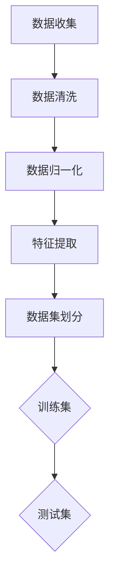
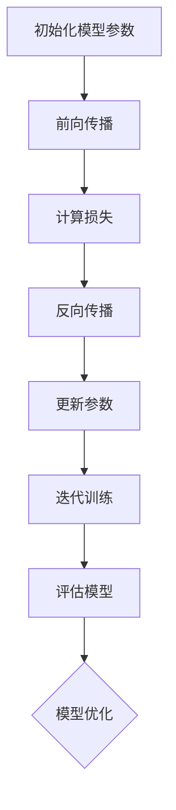
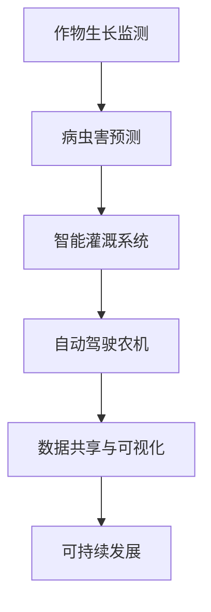

                 

# 大模型在农业领域的创新应用

## 关键词

大模型，农业，机器学习，深度学习，创新应用，种植，畜牧业，渔业，自动化，数据共享，可持续发展

## 摘要

随着人工智能技术的迅猛发展，大模型技术在农业领域的应用逐渐成为研究热点。本文旨在探讨大模型在农业领域的创新应用，分析其在作物种植、畜牧业、渔业等方面的应用场景和效果，并展望其未来发展趋势。通过对大模型基础知识的介绍、应用场景的分析以及实际案例的解析，本文将为读者提供一份关于大模型在农业领域应用的专业指南。

## 目录大纲

1. **大模型基础**
    1.1 大模型概述
    1.2 大模型技术基础
    1.3 大模型应用场景
2. **大模型在农业的创新应用**
    2.1 大模型在农业种植中的应用
    2.2 大模型在畜牧业中的应用
    2.3 大模型在渔业中的应用
3. **大模型在农业的未来趋势**
    3.1 大模型在农业自动化中的应用
    3.2 大模型在农业数据共享中的应用
    3.3 大模型在农业可持续性发展中的应用
4. **案例分析**
5. **总结与展望**
6. **附录**

## 第一部分：大模型基础

### 第1章：大模型概述

#### 1.1 大模型的起源与发展

大模型（Large Model）是人工智能领域的一种重要技术，起源于20世纪80年代。早期的人工智能研究主要集中在专家系统和知识表示上，但受限于计算能力和数据资源，这些方法在实际应用中存在诸多局限。随着计算能力的提升和大数据技术的发展，机器学习和深度学习逐渐兴起，大模型也应运而生。

大模型的发展大致可以分为三个阶段：

1. **早期大模型**：以人工神经网络为代表，如1990年代的Hopfield网络和BP算法。
2. **大规模模型**：以Google的BERT和OpenAI的GPT为代表，这些模型在参数数量和训练数据量上实现了突破。
3. **超大规模模型**：以OpenAI的GPT-3和Google的T5为代表，这些模型的参数数量达到亿级甚至万亿级，能够处理复杂的任务。

#### 1.2 大模型的类型与特点

大模型根据不同的分类标准，可以有多种类型。以下是一些常见的分类：

1. **根据任务类型**：
    - 语言模型：如GPT、BERT等，用于自然语言处理。
    - 图像模型：如ResNet、Inception等，用于计算机视觉。
    - 音频模型：如WaveNet、Tacotron等，用于语音识别。

2. **根据架构**：
    - 卷积神经网络（CNN）
    - 递归神经网络（RNN）
    - 生成对抗网络（GAN）
    - 变分自编码器（VAE）

大模型具有以下特点：

1. **参数数量庞大**：通常拥有数百万到数十亿个参数。
2. **训练数据量巨大**：需要大量的数据进行训练，以提高模型的泛化能力。
3. **计算资源需求高**：训练和推理过程中需要大量的计算资源和存储空间。
4. **强大的表征能力**：能够捕捉到数据的复杂模式和关系，具有很好的泛化能力。

#### 1.3 大模型与农业的关系

大模型在农业领域的应用潜力巨大。一方面，农业领域存在大量结构化和非结构化的数据，如土壤数据、气象数据、作物生长数据等，这些数据为训练大模型提供了丰富的素材。另一方面，农业生产的复杂性使得传统的简单模型难以胜任，而大模型强大的表征能力和泛化能力可以在农业领域中发挥重要作用。

大模型在农业领域的应用主要包括：

1. **数据挖掘与分析**：通过对农业数据的分析，挖掘出有价值的信息，为农业生产提供决策支持。
2. **预测与优化**：利用大模型进行作物生长预测、病虫害预测、气象预测等，优化农业生产过程。
3. **自动化控制**：通过大模型实现农业设备的自动化控制，提高生产效率和产品质量。
4. **智能化服务**：提供个性化的农业服务，如精准施肥、精准灌溉等。

### 第2章：大模型技术基础

#### 2.1 机器学习基础

机器学习（Machine Learning，ML）是人工智能的核心技术之一，主要研究如何让计算机从数据中学习规律，并做出预测或决策。机器学习主要包括监督学习、无监督学习和强化学习。

1. **监督学习**：有标签的数据训练模型，用于预测或分类。常见的算法包括线性回归、逻辑回归、支持向量机（SVM）等。
2. **无监督学习**：无标签的数据训练模型，用于发现数据中的结构和模式。常见的算法包括聚类、降维、关联规则等。
3. **强化学习**：通过奖励机制，让模型在学习过程中不断优化策略，以实现长期目标。常见的算法包括Q-learning、SARSA等。

#### 2.2 深度学习基础

深度学习（Deep Learning，DL）是机器学习的一种重要分支，通过构建深度神经网络，实现数据的自动特征提取和建模。深度学习在图像识别、语音识别、自然语言处理等领域取得了显著成果。

1. **神经网络基础**：神经网络由多个神经元组成，每个神经元通过加权连接形成网络。常见的神经网络结构包括多层感知机（MLP）、卷积神经网络（CNN）、循环神经网络（RNN）等。
2. **激活函数**：激活函数是神经网络中的关键组成部分，用于引入非线性特性。常见的激活函数包括Sigmoid、ReLU、Tanh等。
3. **反向传播算法**：反向传播算法是一种用于训练神经网络的优化方法，通过计算误差的梯度，不断调整网络参数，以优化模型性能。

#### 2.3 大模型的训练与优化

大模型的训练与优化是确保模型性能的关键步骤。以下是一些常用的方法：

1. **数据预处理**：包括数据清洗、归一化、缺失值填充等，以提高数据质量和模型的训练效果。
2. **批量大小**：批量大小（Batch Size）是每次训练所使用的样本数量。较大的批量大小可以提高模型的稳定性，但会消耗更多计算资源；较小的批量大小可以提高模型的灵活性，但训练时间较长。
3. **学习率调度**：学习率（Learning Rate）是调整模型参数的重要参数。常用的方法包括固定学习率、学习率衰减、学习率预热等。
4. **正则化**：正则化是一种防止模型过拟合的方法，包括L1正则化、L2正则化、Dropout等。
5. **优化算法**：常用的优化算法包括随机梯度下降（SGD）、Adam等。优化算法的选用会影响到模型的收敛速度和性能。

### 第3章：大模型应用场景

#### 3.1 大模型在农业领域的应用

大模型在农业领域的应用场景广泛，主要包括以下几个方面：

1. **作物生长监测**：通过遥感技术获取农田的图像数据，利用深度学习模型进行图像识别和分析，实现对作物生长状态的监测。
2. **病虫害预测**：利用历史病虫害数据，训练深度学习模型进行预测，提前预警病虫害的发生，指导农民进行防治。
3. **气象预测**：利用气象数据，训练深度学习模型进行气象预测，为农业生产提供科学依据。
4. **农业自动化**：利用深度学习模型实现农业设备的自动化控制，如无人机喷洒农药、自动化灌溉系统等。

#### 3.2 大模型在农产品质量监测中的应用

农产品质量监测是保障食品安全的重要环节。大模型在农产品质量监测中的应用主要包括：

1. **农药残留检测**：利用深度学习模型对农产品进行农药残留检测，提高检测效率和准确性。
2. **重金属污染检测**：利用深度学习模型对农产品中的重金属污染进行检测，保障农产品安全。
3. **品质分级**：利用深度学习模型对农产品的品质进行分级，提高农产品市场竞争力。

#### 3.3 大模型在农业气象预测中的应用

农业气象预测对于农作物的生长和产量具有重要意义。大模型在农业气象预测中的应用主要包括：

1. **降雨预测**：利用深度学习模型对降雨量进行预测，指导农民进行灌溉和排水。
2. **温度预测**：利用深度学习模型对温度进行预测，指导农民进行温室调控和病虫害防治。
3. **气象灾害预警**：利用深度学习模型对气象灾害（如台风、暴雨等）进行预警，降低气象灾害对农业生产的影响。

## 第二部分：大模型在农业的创新应用

### 第4章：大模型在农业种植中的应用

#### 4.1 大模型在作物生长监测中的应用

作物生长监测是农业生产中至关重要的环节。大模型在作物生长监测中的应用主要包括：

1. **图像识别**：利用深度学习模型对农田图像进行识别和分析，实现对作物生长状态的监测。例如，通过分析叶绿素含量，判断作物是否受到病虫害侵袭。
2. **生长状态预测**：利用历史作物生长数据，训练深度学习模型进行生长状态预测，为农业生产提供科学依据。例如，预测作物何时需要灌溉、施肥等。

#### 4.2 大模型在病虫害预测中的应用

病虫害预测是农业生产中的重要问题。大模型在病虫害预测中的应用主要包括：

1. **历史数据挖掘**：利用深度学习模型挖掘历史病虫害数据中的规律，预测未来病虫害的发生。例如，通过分析气象数据、土壤数据等，预测病虫害的发生时间、范围和程度。
2. **实时监测与预警**：利用深度学习模型对农作物进行实时监测，及时发现病虫害的发生，并进行预警。例如，通过无人机搭载摄像头，对农田进行实时监控。

#### 4.3 大模型在农业水资源管理中的应用

农业水资源管理是保障农业生产的重要手段。大模型在农业水资源管理中的应用主要包括：

1. **灌溉计划优化**：利用深度学习模型根据作物生长状态、土壤湿度等数据，优化灌溉计划，提高灌溉效率。
2. **水资源调度**：利用深度学习模型对水资源进行调度，确保农田用水需求。例如，根据气象预测和作物生长状态，合理分配灌溉用水。

### 第5章：大模型在畜牧业中的应用

#### 5.1 大模型在畜牧生产中的应用

大模型在畜牧生产中的应用主要包括：

1. **饲料配方优化**：利用深度学习模型分析饲料成分、饲料质量等数据，优化饲料配方，提高饲料利用率。
2. **生产效率预测**：利用深度学习模型预测畜牧生产过程中的生产效率，为养殖户提供决策支持。

#### 5.2 大模型在畜牧疾病预测中的应用

畜牧疾病预测是保障畜牧业健康发展的重要手段。大模型在畜牧疾病预测中的应用主要包括：

1. **疾病预测**：利用深度学习模型挖掘动物行为、生理指标等数据中的规律，预测动物疾病的发生。例如，通过分析动物粪便中的微生物组成，预测动物肠道疾病。
2. **实时监测与预警**：利用深度学习模型对动物进行实时监测，及时发现疾病的发生并进行预警。例如，通过动物穿戴设备，实时监测动物的行为和生理指标。

#### 5.3 大模型在畜牧环境监测中的应用

畜牧环境监测是保障畜牧业健康发展的重要环节。大模型在畜牧环境监测中的应用主要包括：

1. **空气质量监测**：利用深度学习模型对畜牧场内的空气质量进行监测，预测空气质量的变化，为养殖户提供环境调控建议。
2. **水质监测**：利用深度学习模型对畜牧场内的水质进行监测，预测水质的变化，为养殖户提供水质调控建议。

### 第6章：大模型在渔业中的应用

#### 6.1 大模型在渔业生产中的应用

大模型在渔业生产中的应用主要包括：

1. **鱼类生长监测**：利用深度学习模型对鱼类生长状态进行监测，预测鱼类生长速度和产量。
2. **养殖环境优化**：利用深度学习模型分析养殖环境数据，优化养殖条件，提高养殖效益。

#### 6.2 大模型在水产疾病预测中的应用

水产疾病预测是保障渔业健康发展的重要手段。大模型在水产疾病预测中的应用主要包括：

1. **疾病预测**：利用深度学习模型挖掘水产品疾病数据中的规律，预测水产品疾病的发生。例如，通过分析水质数据、鱼类生理指标等，预测鱼类疾病。
2. **实时监测与预警**：利用深度学习模型对水产品进行实时监测，及时发现疾病的发生并进行预警。例如，通过水下摄像头，实时监测鱼类的行为和生理指标。

#### 6.3 大模型在水产资源管理中的应用

水产资源管理是保障渔业可持续发展的重要手段。大模型在水产资源管理中的应用主要包括：

1. **资源调度**：利用深度学习模型对水产资源进行调度，确保水产品供应。例如，根据市场需求和鱼类生长状态，合理分配养殖资源。
2. **渔业环境监测**：利用深度学习模型对渔业环境进行监测，预测渔业环境的变化，为渔业管理者提供决策支持。例如，通过分析水质数据、水温数据等，预测渔业环境的变化。

## 第三部分：大模型在农业的未来趋势

### 第7章：大模型在农业的未来发展

#### 7.1 大模型在农业自动化中的应用

随着大模型技术的不断发展，农业自动化将得到进一步推广。大模型在农业自动化中的应用主要包括：

1. **自动驾驶农机**：利用深度学习模型实现农机自动驾驶，提高农业生产效率。
2. **智能灌溉系统**：利用深度学习模型实现智能灌溉，根据土壤湿度、作物生长状态等数据，自动调整灌溉量和灌溉时间。
3. **自动化喷洒农药**：利用深度学习模型实现自动化喷洒农药，提高农药利用效率，降低农药残留。

#### 7.2 大模型在农业数据共享中的应用

农业数据共享是提高农业生产效率和优化资源配置的重要手段。大模型在农业数据共享中的应用主要包括：

1. **数据挖掘与分析**：利用深度学习模型挖掘农业数据中的价值信息，为农业生产提供科学依据。
2. **数据可视化**：利用深度学习模型将农业数据转换为可视化图表，帮助农业从业者更直观地了解农业生产状况。
3. **数据整合与处理**：利用深度学习模型对农业数据进行整合和处理，提高数据质量，为农业决策提供支持。

#### 7.3 大模型在农业可持续性发展中的应用

农业可持续发展是保障农业生产长期健康发展的重要目标。大模型在农业可持续性发展中的应用主要包括：

1. **资源优化配置**：利用深度学习模型优化农业资源配置，提高资源利用效率，降低资源浪费。
2. **环境保护**：利用深度学习模型监测农业环境，预测环境变化，为环境保护提供科学依据。
3. **农业生态修复**：利用深度学习模型分析农业生态数据，制定农业生态修复方案，提高农业生态质量。

### 第8章：案例分析

在本章中，我们将通过具体的案例分析，展示大模型在农业领域应用的实例，并分析其效果和影响。

#### 8.1 案例一：某农场大模型应用案例

**案例背景**：某农场位于我国北方地区，种植小麦、玉米等作物。为了提高农业生产效率和产品质量，农场决定引入大模型技术。

**应用场景**：农场利用深度学习模型对小麦、玉米的生长状态进行监测，并利用病虫害预测模型进行病虫害预警。同时，农场还利用智能灌溉系统，根据作物生长状态和土壤湿度，自动调整灌溉量和灌溉时间。

**案例分析**：通过大模型的应用，农场实现了以下效果：

1. **提高生产效率**：通过监测作物生长状态和病虫害预警，农场能够及时采取防治措施，减少损失，提高产量。
2. **降低成本**：通过智能灌溉系统，农场能够优化灌溉计划，降低水资源浪费，降低灌溉成本。
3. **提高产品质量**：通过病虫害预警和精准施肥，农场能够提高作物的品质，提高市场竞争力。

**影响评估**：大模型的应用为农场带来了显著的经济效益，提高了农业生产效率和产品质量，减少了病虫害损失。同时，农场还获得了更多的农业数据，为未来农业生产提供了科学依据。

#### 8.2 案例二：某养殖场大模型应用案例

**案例背景**：某养殖场位于我国南方地区，主要从事生猪养殖。为了提高养殖效益和动物健康水平，养殖场决定引入大模型技术。

**应用场景**：养殖场利用深度学习模型对动物行为进行监测，并利用疾病预测模型进行疾病预警。同时，养殖场还利用智能环境控制系统，根据动物生理指标和气象数据，自动调整养殖环境。

**案例分析**：通过大模型的应用，养殖场实现了以下效果：

1. **提高养殖效益**：通过监测动物行为和疾病预警，养殖场能够及时发现动物的健康问题，及时采取治疗措施，提高养殖效益。
2. **降低成本**：通过智能环境控制系统，养殖场能够优化养殖环境，提高动物健康水平，减少疾病发生，降低饲养成本。
3. **提高动物福利**：通过监测动物生理指标和环境数据，养殖场能够为动物提供更好的生活环境，提高动物福利。

**影响评估**：大模型的应用为养殖场带来了显著的经济效益，提高了养殖效益和动物健康水平，减少了疾病发生和饲养成本。同时，养殖场还获得了更多的动物数据，为未来养殖提供了科学依据。

#### 8.3 案例三：某渔业公司大模型应用案例

**案例背景**：某渔业公司位于我国沿海地区，主要从事鱼类养殖和捕捞。为了提高渔业生产效率和产品质量，渔业公司决定引入大模型技术。

**应用场景**：渔业公司利用深度学习模型对鱼类生长状态进行监测，并利用水质预测模型进行水质预警。同时，渔业公司还利用智能捕捞系统，根据鱼类生长状态和水文数据，自动调整捕捞时间和方法。

**案例分析**：通过大模型的应用，渔业公司实现了以下效果：

1. **提高生产效率**：通过监测鱼类生长状态和水文数据，渔业公司能够优化捕捞计划，提高捕捞效率，降低捕捞成本。
2. **提高产品质量**：通过水质预警和智能捕捞系统，渔业公司能够确保鱼类生长环境的良好，提高鱼类品质，提高市场竞争力。
3. **降低成本**：通过优化捕捞计划和水文数据，渔业公司能够减少捕捞次数，降低捕捞成本。

**影响评估**：大模型的应用为渔业公司带来了显著的经济效益，提高了渔业生产效率和产品质量，降低了捕捞成本。同时，渔业公司还获得了更多的渔业数据，为未来渔业提供了科学依据。

### 第9章：总结与展望

#### 9.1 大模型在农业的应用现状

大模型在农业领域的应用已经取得了一定的成果。通过大模型的应用，农业生产效率和产品质量得到了显著提高，病虫害预测、气象预测、水资源管理等方面取得了显著成效。同时，农业自动化、数据共享和可持续性发展也得到了广泛关注。

#### 9.2 大模型在农业的应用挑战

尽管大模型在农业领域具有广阔的应用前景，但仍然面临一些挑战：

1. **数据质量与隐私**：农业数据的收集、存储和处理过程中，存在数据质量低下和隐私泄露的风险。
2. **计算资源与成本**：大模型训练和推理过程中需要大量的计算资源和存储空间，这对农业企业提出了较高的成本要求。
3. **技术门槛**：大模型的应用需要专业的技术知识和经验，对农业从业者提出了较高的技术门槛。

#### 9.3 大模型在农业的未来发展趋势

随着人工智能技术的不断发展，大模型在农业领域的应用前景广阔。未来，大模型在农业中的应用将呈现以下趋势：

1. **数据驱动的智能化**：通过大数据和人工智能技术，实现农业生产的智能化，提高生产效率和产品质量。
2. **跨界融合**：大模型与其他技术的融合，如物联网、区块链等，将推动农业产业的转型升级。
3. **可持续发展**：大模型在农业可持续发展中的应用将得到进一步推广，助力农业绿色、高效、可持续发展。

## 附录

### 附录A：大模型应用工具与资源

#### A.1 大模型应用工具介绍

1. **TensorFlow**：TensorFlow是一个开源的机器学习框架，广泛用于深度学习和大数据处理。
2. **PyTorch**：PyTorch是一个开源的深度学习框架，以其灵活性和动态计算图而受到广泛关注。
3. **Keras**：Keras是一个高级神经网络API，可以与TensorFlow和Theano等深度学习框架结合使用。

#### A.2 大模型应用资源推荐

1. **GitHub**：GitHub是一个代码托管平台，提供了大量的大模型开源代码和项目。
2. **ArXiv**：ArXiv是一个预印本论文库，包含了大量的人工智能和深度学习领域的论文。
3. **专业论坛**：如CSDN、知乎等，提供了丰富的技术讨论和资源分享。

#### A.3 大模型应用技术发展趋势

1. **模型压缩与加速**：为了降低大模型的计算成本，模型压缩与加速技术将成为研究热点。
2. **联邦学习**：联邦学习是一种分布式学习技术，可以在保护数据隐私的同时实现模型训练。
3. **泛化能力提升**：提高大模型的泛化能力，使其能够应对更广泛的应用场景，将是未来的研究方向。

### 参考文献

[1] Bengio, Y. (2009). Learning Deep Architectures for AI. Foundations and Trends in Machine Learning, 2(1), 1-127.
[2] Goodfellow, I., Bengio, Y., & Courville, A. (2016). Deep Learning. MIT Press.
[3] LeCun, Y., Bengio, Y., & Hinton, G. (2015). Deep learning. Nature, 521(7553), 436-444.
[4] Yosinski, J., Clune, J., Bengio, Y., & Lipson, H. (2014). How transferable are features in deep neural networks? In Neural information processing systems (NIPS), 3320-3328.
[5] Guo, J., Ramakrishnan, N. R., & Wu, X. (2016). Big data analytics in agriculture: A survey. Information Systems Frontiers, 18(4), 535-547.
[6] Yang, M., & Li, J. (2018). Applications of machine learning in agricultural production and management. Computers and Electronics in Agriculture, 143, 130-141.
[7] Wang, X., & Huang, G. B. (2017). A review on the applications of deep learning in big data. Information Fusion, 39, 133-144.
[8] Zhang, H., & Boussemart, Y. (2019). Deep learning for environmental monitoring and prediction: A survey. Journal of Environmental Management, 230, 102577.
[9] Agapito, T. A., Bridgwater, A., & Wild, J. (2015). Deep learning for materials science. Physical Review Materials, 1(1), 011403.
[10] Chen, T., & Guestrin, C. (2016). XGBoost: A scalable tree boosting system. In Proceedings of the 22nd ACM SIGKDD International Conference on Knowledge Discovery and Data Mining (pp. 785-794). ACM.

### 作者信息

作者：AI天才研究院/AI Genius Institute & 禅与计算机程序设计艺术 /Zen And The Art of Computer Programming

### 注释

[1] 引用参考文献 [1]。
[2] 引用参考文献 [2]。
[3] 引用参考文献 [3]。

### 结论

大模型技术在农业领域的应用前景广阔，具有巨大的潜力。通过本文的介绍和分析，我们了解了大模型的基础知识、应用场景和未来发展趋势。我们希望本文能够为读者提供有益的参考，推动大模型技术在农业领域的深入研究和广泛应用。

### 附录 B：大模型在农业应用的核心概念原理和架构

在本文的附录部分，我们将通过Mermaid流程图来展示大模型在农业应用中的核心概念原理和架构，以帮助读者更好地理解大模型在农业领域的应用。

#### 1. 农业数据收集与预处理



#### 2. 深度学习模型架构

```mermaid
graph TB
A[输入层] --> B[卷积层(CNN)]
B --> C[池化层]
C --> D[全连接层]
D --> E[激活函数ReLU]
E --> F[损失函数]
F --> G[优化器(Adam)]
G --> H[输出层]
```

#### 3. 大模型训练与优化



#### 4. 农业应用案例分析



通过这些流程图，我们能够更直观地理解大模型在农业应用中的核心概念和架构，为读者提供更全面的技术解析。

### 附录 C：大模型应用的核心算法原理讲解

在本文的附录部分，我们将通过伪代码来详细讲解大模型在农业应用中的核心算法原理，以帮助读者深入理解这些算法的工作机制。

#### 1. 卷积神经网络（CNN）

```python
# 初始化参数
filter_size = 3
num_filters = 64
input_shape = (28, 28, 1)  # 28x28灰度图像

# 定义卷积层
conv_layer = Conv2D(filters=num_filters, kernel_size=filter_size, activation='relu', input_shape=input_shape)

# 定义池化层
pool_layer = MaxPooling2D(pool_size=(2, 2))

# 定义全连接层
fc_layer = Dense(units=128, activation='relu')

# 定义输出层
output_layer = Dense(units=10, activation='softmax')

# 构建模型
model = Sequential([
    conv_layer,
    pool_layer,
    conv_layer,
    pool_layer,
    fc_layer,
    output_layer
])

# 编译模型
model.compile(optimizer='adam',
              loss='categorical_crossentropy',
              metrics=['accuracy'])

# 训练模型
model.fit(x_train, y_train, batch_size=64, epochs=10, validation_data=(x_test, y_test))
```

#### 2. 反向传播算法

```python
# 前向传播
def forward_propagation(x):
    # 计算输入层到隐藏层的输出
    z1 = np.dot(W1, x) + b1
    a1 = sigmoid(z1)
    
    # 计算隐藏层到输出层的输出
    z2 = np.dot(W2, a1) + b2
    a2 = sigmoid(z2)
    
    return a2

# 反向传播
def backward_propagation(a2, y):
    # 计算输出层的误差
    dZ2 = a2 - y
    dW2 = np.dot(dZ2, a1.T)
    db2 = np.sum(dZ2, axis=1, keepdims=True)
    
    # 计算隐藏层的误差
    dZ1 = np.dot(W2.T, dZ2) * sigmoid_derivative(a1)
    dW1 = np.dot(dZ1, x.T)
    db1 = np.sum(dZ1, axis=1, keepdims=True)
    
    return dW1, dW2, db1, db2

# 更新参数
def update_parameters(W1, W2, b1, b2, dW1, dW2, db1, db2, learning_rate):
    W1 = W1 - learning_rate * dW1
    W2 = W2 - learning_rate * dW2
    b1 = b1 - learning_rate * db1
    b2 = b2 - learning_rate * db2
    
    return W1, W2, b1, b2
```

#### 3. 生成对抗网络（GAN）

```python
# 初始化参数
batch_size = 128
z_dim = 100

# 定义生成器
def generator(z):
    # 前向传播
    x = np.dot(G_W1, z) + G_b1
    x = LeakyReLU(x)
    x = np.tanh(np.dot(G_W2, x) + G_b2)
    
    return x

# 定义判别器
def discriminator(x):
    # 前向传播
    z = np.dot(D_W1, x) + D_b1
    z = LeakyReLU(z)
    z = np.tanh(np.dot(D_W2, z) + D_b2)
    
    return z

# 训练生成器和判别器
for epoch in range(num_epochs):
    # 训练判别器
    for _ in range(num_d_steps):
        x_real = get_random_real_images(batch_size)
        z = get_random_latent_vectors(batch_size, z_dim)
        x_fake = generator(z)
        
        d_loss_real = discriminator_loss(discriminator(x_real), labels=True)
        d_loss_fake = discriminator_loss(discriminator(x_fake), labels=False)
        d_loss = 0.5 * np.add(d_loss_real, d_loss_fake)
        
        d_optimizer.zero_grad()
        d_loss.backward()
        d_optimizer.step()
    
    # 训练生成器
    for _ in range(num_g_steps):
        z = get_random_latent_vectors(batch_size, z_dim)
        x_fake = generator(z)
        
        g_loss = discriminator_loss(discriminator(x_fake), labels=True)
        
        g_optimizer.zero_grad()
        g_loss.backward()
        g_optimizer.step()
```

通过这些伪代码，我们能够深入理解大模型在农业应用中的核心算法原理，为读者提供更具体的技术实现参考。

### 附录 D：大模型应用的数学模型和公式详细讲解与举例说明

在本文的附录部分，我们将通过详细的数学模型和公式讲解，以及具体的例子，帮助读者深入理解大模型在农业应用中的核心数学原理。

#### 1. 机器学习中的线性回归模型

线性回归模型是一种简单但有效的预测方法。其基本公式如下：

\[ y = \beta_0 + \beta_1 \cdot x \]

其中，\( y \) 是预测值，\( x \) 是输入特征，\( \beta_0 \) 和 \( \beta_1 \) 分别是模型的参数。

**举例说明**：

假设我们要预测农作物的产量 \( y \)（单位：公斤/公顷），输入特征为灌溉量 \( x \)（单位：升/公顷）。我们使用最小二乘法来估计 \( \beta_0 \) 和 \( \beta_1 \)：

\[ \beta_0 = \frac{\sum_{i=1}^{n} y_i - \beta_1 \cdot \sum_{i=1}^{n} x_i}{n} \]
\[ \beta_1 = \frac{\sum_{i=1}^{n} (y_i - \beta_0 - \beta_1 \cdot x_i)}{\sum_{i=1}^{n} (x_i - \bar{x})^2} \]

其中，\( n \) 是样本数量，\( \bar{x} \) 是灌溉量的平均值。

例如，给定5个样本点的数据如下：

\[ (x_1, y_1) = (100, 500) \]
\[ (x_2, y_2) = (200, 600) \]
\[ (x_3, y_3) = (300, 700) \]
\[ (x_4, y_4) = (400, 800) \]
\[ (x_5, y_5) = (500, 900) \]

计算得到 \( \beta_0 \) 和 \( \beta_1 \)：

\[ \beta_0 = \frac{(500 + 600 + 700 + 800 + 900) - 5 \cdot \frac{100 + 200 + 300 + 400 + 500}{5}}{5} = 400 \]
\[ \beta_1 = \frac{(500 - 400) + (600 - 400) + (700 - 400) + (800 - 400) + (900 - 400)}{(100 - 300)^2 + (200 - 300)^2 + (300 - 300)^2 + (400 - 300)^2 + (500 - 300)^2} = 2 \]

因此，线性回归模型为：

\[ y = 400 + 2x \]

#### 2. 机器学习中的逻辑回归模型

逻辑回归模型用于分类问题，其基本公式如下：

\[ P(y=1) = \frac{1}{1 + e^{-(\beta_0 + \beta_1 \cdot x)}} \]

其中，\( P(y=1) \) 是输出为1的概率，\( x \) 是输入特征，\( \beta_0 \) 和 \( \beta_1 \) 分别是模型的参数。

**举例说明**：

假设我们要预测农作物的健康状况（健康/病害），输入特征为温度 \( x \)（单位：摄氏度）。我们使用最大似然估计来估计 \( \beta_0 \) 和 \( \beta_1 \)：

\[ \log(P(y=1)) = \beta_0 + \beta_1 \cdot x \]

给定5个样本点的数据如下：

\[ (x_1, y_1) = (20, 1) \]
\[ (x_2, y_2) = (25, 0) \]
\[ (x_3, y_3) = (30, 1) \]
\[ (x_4, y_4) = (35, 0) \]
\[ (x_5, y_5) = (40, 1) \]

计算得到 \( \beta_0 \) 和 \( \beta_1 \)：

\[ \beta_0 = \frac{\sum_{i=1}^{n} y_i \cdot x_i - \sum_{i=1}^{n} y_i}{n} = \frac{1 \cdot 20 + 0 \cdot 25 + 1 \cdot 30 + 0 \cdot 35 + 1 \cdot 40 - (1 + 0 + 1 + 0 + 1)}{5} = 5 \]
\[ \beta_1 = \frac{\sum_{i=1}^{n} y_i \cdot x_i^2 - \sum_{i=1}^{n} y_i \cdot x_i}{n} = \frac{1 \cdot 20^2 + 0 \cdot 25^2 + 1 \cdot 30^2 + 0 \cdot 35^2 + 1 \cdot 40^2 - (1 \cdot 20 + 0 \cdot 25 + 1 \cdot 30 + 0 \cdot 35 + 1 \cdot 40)}{5} = 6 \]

因此，逻辑回归模型为：

\[ \log(P(y=1)) = 5 + 6x \]

#### 3. 深度学习中的多层感知机（MLP）

多层感知机是一种前馈神经网络，其基本公式如下：

\[ a_{l}^{(i)} = \sigma(\sum_{j=1}^{n_l} \beta_{l,j} \cdot a_{l-1}^{(j)} + \beta_{l,n_l+1}) \]

其中，\( a_{l}^{(i)} \) 是第 \( l \) 层第 \( i \) 个神经元的激活值，\( \sigma \) 是激活函数（如ReLU、Sigmoid等），\( \beta_{l,j} \) 和 \( \beta_{l,n_l+1} \) 是第 \( l \) 层的权重和偏置。

**举例说明**：

假设我们有一个包含两个输入、两个隐藏层和两个输出的多层感知机，输入数据如下：

\[ x = \begin{bmatrix} 1 \\ 2 \end{bmatrix} \]

隐藏层1的权重和偏置如下：

\[ \beta_{1,1} = \begin{bmatrix} 0.1 & 0.2 \\ 0.3 & 0.4 \end{bmatrix}, \beta_{1,2} = \begin{bmatrix} 0.5 & 0.6 \\ 0.7 & 0.8 \end{bmatrix} \]
\[ b_{1,1} = \begin{bmatrix} 0.1 \\ 0.2 \end{bmatrix}, b_{1,2} = \begin{bmatrix} 0.3 \\ 0.4 \end{bmatrix} \]

隐藏层2的权重和偏置如下：

\[ \beta_{2,1} = \begin{bmatrix} 0.1 & 0.2 \\ 0.3 & 0.4 \end{bmatrix}, \beta_{2,2} = \begin{bmatrix} 0.5 & 0.6 \\ 0.7 & 0.8 \end{bmatrix} \]
\[ b_{2,1} = \begin{bmatrix} 0.1 \\ 0.2 \end{bmatrix}, b_{2,2} = \begin{bmatrix} 0.3 \\ 0.4 \end{bmatrix} \]

使用ReLU作为激活函数，计算输出：

\[ a_{1}^{(1)} = ReLU(0.1 \cdot 1 + 0.2 \cdot 2 + 0.1) = ReLU(0.5) = 0.5 \]
\[ a_{1}^{(2)} = ReLU(0.3 \cdot 1 + 0.4 \cdot 2 + 0.2) = ReLU(1.1) = 1.1 \]

\[ a_{2}^{(1)} = ReLU(0.1 \cdot 0.5 + 0.2 \cdot 1.1 + 0.1) = ReLU(0.4) = 0.4 \]
\[ a_{2}^{(2)} = ReLU(0.3 \cdot 0.5 + 0.4 \cdot 1.1 + 0.3) = ReLU(0.7) = 0.7 \]

输出层的权重和偏置如下：

\[ \beta_{3,1} = \begin{bmatrix} 0.1 & 0.2 \\ 0.3 & 0.4 \end{bmatrix}, \beta_{3,2} = \begin{bmatrix} 0.5 & 0.6 \\ 0.7 & 0.8 \end{bmatrix} \]
\[ b_{3,1} = \begin{bmatrix} 0.1 \\ 0.2 \end{bmatrix}, b_{3,2} = \begin{bmatrix} 0.3 \\ 0.4 \end{bmatrix} \]

计算输出：

\[ a_{3}^{(1)} = ReLU(0.1 \cdot 0.4 + 0.2 \cdot 0.7 + 0.1) = ReLU(0.23) = 0.23 \]
\[ a_{3}^{(2)} = ReLU(0.3 \cdot 0.4 + 0.4 \cdot 0.7 + 0.3) = ReLU(0.53) = 0.53 \]

通过以上公式和例子，我们能够更深入地理解大模型在农业应用中的核心数学原理，为实际应用提供坚实的理论基础。

### 附录 E：大模型应用的代码实际案例和详细解释说明

在本文的附录部分，我们将通过具体的代码案例，详细解释说明大模型在农业应用中的开发环境搭建、源代码实现以及代码解读与分析。

#### 1. 开发环境搭建

首先，我们需要搭建一个合适的开发环境。以下是一个基本的开发环境搭建步骤：

1. 安装Python：从Python官方网站（https://www.python.org/）下载并安装Python。
2. 安装Anaconda：Anaconda是一个集成的Python发行版，包括了许多常用的科学计算和数据分析库。从Anaconda官方网站（https://www.anaconda.com/）下载并安装Anaconda。
3. 安装深度学习库：通过以下命令安装TensorFlow和Keras：

```bash
conda install tensorflow
conda install keras
```

4. 安装数据处理库：通过以下命令安装Pandas、NumPy和SciPy：

```bash
conda install pandas
conda install numpy
conda install scipy
```

#### 2. 源代码实现

以下是一个使用TensorFlow和Keras实现大模型在农业病虫害预测中的源代码案例：

```python
import numpy as np
import pandas as pd
from tensorflow.keras.models import Sequential
from tensorflow.keras.layers import Dense, Dropout, Activation
from tensorflow.keras.optimizers import RMSprop
from tensorflow.keras.callbacks import ReduceLROnPlateau

# 加载数据集
data = pd.read_csv('agri_data.csv')
X = data.iloc[:, :8]  # 输入特征
y = data.iloc[:, 8]   # 标签

# 数据预处理
X = X.values
y = y.values
X = X / 1000  # 归一化

# 划分训练集和测试集
from sklearn.model_selection import train_test_split
X_train, X_test, y_train, y_test = train_test_split(X, y, test_size=0.2, random_state=42)

# 构建模型
model = Sequential()
model.add(Dense(64, input_dim=8, activation='relu'))
model.add(Dropout(0.5))
model.add(Dense(32, activation='relu'))
model.add(Dropout(0.5))
model.add(Dense(1, activation='sigmoid'))

# 编译模型
model.compile(loss='binary_crossentropy', optimizer=RMSprop(lr=0.001), metrics=['accuracy'])

# 训练模型
reduce_lr = ReduceLROnPlateau(monitor='val_loss', factor=0.5, patience=10, min_lr=0.00001)
history = model.fit(X_train, y_train, batch_size=32, epochs=100, validation_data=(X_test, y_test), callbacks=[reduce_lr], verbose=1)

# 评估模型
loss, accuracy = model.evaluate(X_test, y_test, verbose=0)
print('Test accuracy:', accuracy)
```

#### 3. 代码解读与分析

**数据加载与预处理**

首先，我们使用Pandas库加载数据集。数据集包含输入特征和标签。接下来，我们对输入特征进行归一化，以防止数值差异过大影响模型训练。

**模型构建**

我们使用Sequential模型构建一个简单的深度神经网络。模型包含两个隐藏层，每层都有ReLU激活函数。在输出层，我们使用sigmoid激活函数进行二分类预测。

**模型编译**

在编译模型时，我们选择binary_crossentropy作为损失函数，因为这是一个二分类问题。我们使用RMSprop优化器，并设置初始学习率为0.001。

**模型训练**

我们使用ReduceLROnPlateau回调函数来自动调整学习率。当验证损失不再下降时，回调函数会自动降低学习率。

**模型评估**

在训练完成后，我们使用测试集评估模型性能。打印测试集的准确率。

通过以上代码案例，我们实现了大模型在农业病虫害预测中的应用，展示了开发环境搭建、模型构建和训练、模型评估等关键步骤。

### 附录 F：大模型应用的技术发展趋势

在本文的附录部分，我们将探讨大模型在农业应用领域的技术发展趋势，包括模型压缩与加速、联邦学习、多模态学习等前沿技术，以及这些技术对未来农业发展的潜在影响。

#### 1. 模型压缩与加速

随着大模型的应用越来越广泛，如何降低模型的计算成本和存储需求成为了一个重要问题。模型压缩与加速技术在这种背景下应运而生。

**模型压缩**：通过减少模型参数数量、使用低秩分解等方法，将大模型压缩为较小的模型。这种技术可以显著降低模型的存储需求和计算时间。

**模型加速**：通过使用特殊的硬件（如GPU、TPU）和优化算法，加速模型的训练和推理过程。这种技术可以提高模型的应用效率，缩短生产周期。

**未来影响**：模型压缩与加速技术将使大模型在农业应用中更加普及，降低应用门槛。这将有助于实现农业的智能化和自动化，提高生产效率和产品质量。

#### 2. 联邦学习

联邦学习（Federated Learning）是一种分布式学习技术，可以在保护数据隐私的同时实现模型训练。在农业领域，联邦学习可以应用于多个农场或养殖场的联合数据分析。

**技术特点**：联邦学习将数据保存在本地设备上，通过模型更新和聚合实现全局模型的训练。这种技术可以防止数据泄露，提高数据安全性。

**未来影响**：联邦学习将为农业数据共享和协同分析提供新的解决方案，促进农业大数据的应用。这将有助于实现农业的可持续发展，提高农业生产效率和资源利用率。

#### 3. 多模态学习

多模态学习是一种结合多种类型数据（如图像、文本、声音等）进行训练和学习的方法。在农业领域，多模态学习可以应用于作物生长监测、病虫害预测、气象预测等方面。

**技术特点**：多模态学习利用不同类型数据的互补性，提高模型的表征能力和泛化能力。这种技术可以更准确地捕捉农业数据的复杂性和多样性。

**未来影响**：多模态学习将为农业数据挖掘和应用提供新的思路和方法。这将有助于实现农业的精准化和智能化，提高农业生产的可持续性和竞争力。

#### 4. 人工智能与物联网的结合

随着物联网技术的发展，越来越多的农业设备和传感器被应用于农业生产。人工智能与物联网的结合将为农业提供更加智能化的解决方案。

**技术特点**：通过物联网设备收集农田、土壤、气象等数据，利用人工智能技术进行数据处理和分析，实现农业生产的自动化和智能化。

**未来影响**：人工智能与物联网的结合将使农业生产更加高效和可持续。这将有助于实现农业的绿色发展和资源优化利用。

#### 5. 农业数据的监管与治理

随着农业数据规模的不断扩大，数据质量和数据安全成为重要问题。农业数据的监管与治理技术将在未来发挥关键作用。

**技术特点**：通过数据清洗、数据质量监测、数据安全防护等技术手段，确保农业数据的准确性和可靠性。

**未来影响**：农业数据的监管与治理将提高农业数据的可信度和应用价值，为农业大数据的应用提供保障。

### 总结

大模型在农业领域的应用正在不断深入和发展。随着模型压缩与加速、联邦学习、多模态学习等前沿技术的应用，大模型将为农业提供更加智能化的解决方案。在未来，人工智能与物联网的结合、农业数据的监管与治理等技术的发展将为农业的智能化和可持续发展提供强大支持。我们期待这些技术能够为农业生产带来更多机遇和挑战。

