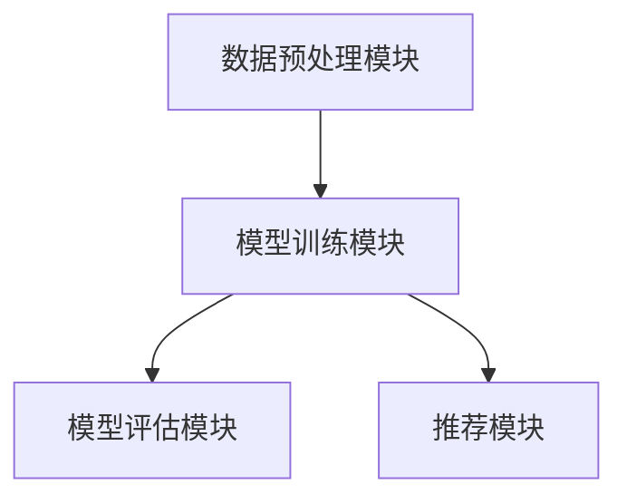
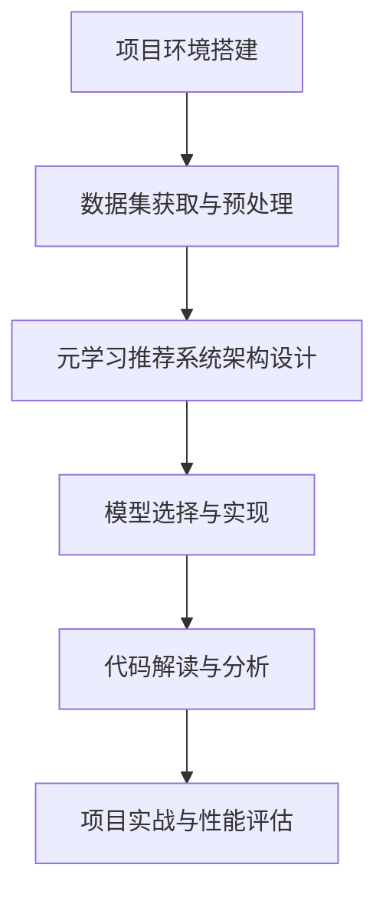

                 

### 文章标题

《大模型推荐系统的元学习策略》

本文将深入探讨大模型推荐系统中的元学习策略，通过详细解析各种元学习算法及其在推荐系统中的应用，旨在为读者提供全面而深入的指导。

### 关键词

- 元学习
- 推荐系统
- 大模型
- MAML
- MBML
- 协同过滤
- 基于内容推荐
- 混合推荐

### 摘要

本文首先介绍了元学习的基础概念及其在推荐系统中的重要性。接着，对大模型推荐系统进行了概述，并探讨了元学习与推荐系统结合的优势和挑战。随后，详细解析了三种主要的元学习算法：Model-Agnostic Meta-Learning (MAML)、Model-Based Meta-Learning (MBML) 和 Metric-Based Meta-Learning (MBML)。最后，本文通过实际项目实战，展示了如何应用这些算法来构建高效的推荐系统，并对系统性能进行了评估。

## 目录大纲

### 第一部分：元学习基础

1. 元学习概述
   1.1 元学习的定义与重要性
   1.2 元学习的分类与特点

2. 大模型推荐系统概述
   2.1 推荐系统的基础概念
   2.2 大模型在推荐系统中的应用

3. 元学习与推荐系统的结合
   3.1 元学习在推荐系统中的优势
   3.2 元学习在推荐系统中的挑战

4. 主要元学习算法概述
   4.1 Model-Agnostic Meta-Learning (MAML)
   4.2 Model-Based Meta-Learning (MBML)
   4.3 Metric-Based Meta-Learning (MBML)

### 第二部分：元学习算法深入讲解

5. Model-Agnostic Meta-Learning (MAML)
   5.1 MAML的基本原理
   5.2 MAML的数学模型与伪代码

6. Model-Based Meta-Learning (MBML)
   6.1 MBML的基本原理
   6.2 MBML的数学模型与伪代码

7. Metric-Based Meta-Learning (MBML)
   7.1 MBML的基本原理
   7.2 MBML的数学模型与伪代码

### 第三部分：元学习在推荐系统中的应用

8. 元学习在协同过滤中的应用
   8.1 协同过滤的元学习模型
   8.2 元学习协同过滤的数学模型与伪代码

9. 元学习在基于内容的推荐中的应用
   9.1 基于内容的推荐元学习模型
   9.2 元学习基于内容的数学模型与伪代码

10. 元学习在混合推荐系统中的应用
    10.1 混合推荐系统中的元学习模型
    10.2 元学习混合推荐的数学模型与伪代码

### 第四部分：项目实战

11. 元学习推荐系统项目搭建
    11.1 项目环境搭建
    11.2 元学习推荐系统架构设计

12. 元学习推荐系统代码实现
    12.1 模型选择与实现
    12.2 代码解读与分析

13. 项目实战与性能评估
    13.1 项目实战过程
    13.2 系统性能评估

### 附录

14. 元学习推荐系统常用工具与资源
    14.1 常用深度学习框架
    14.2 常用数据集与预处理工具
    14.3 元学习推荐系统相关论文与书籍推荐

## 第一部分：元学习基础

### 1.1 元学习概述

元学习（Meta-Learning），又称作“学习的学习”，是一种旨在加速学习过程和提升学习效率的机器学习方法。在传统的机器学习中，我们通常需要为每个新的任务从头开始训练模型。而元学习则试图通过在多个任务中学习到一个通用的学习策略，使得模型能够快速适应新的任务。

#### 1.1.1 元学习的定义与重要性

元学习的定义可以概括为：“元学习是一种学习如何学习的方法。”它关注的是如何通过一种学习算法，使得模型在遇到新的任务时能够快速适应，而不需要从头开始训练。

元学习的重要性体现在以下几个方面：

1. **加速学习过程**：通过元学习，模型可以在短时间内快速适应新的任务，从而显著减少训练时间。
2. **提高泛化能力**：元学习能够使得模型在不同任务中共享知识，提高模型的泛化能力。
3. **资源节约**：对于需要大量数据和计算资源的任务，元学习可以减少这些资源的需求。

#### 1.1.2 元学习的分类与特点

元学习根据不同的分类标准，可以分为以下几种类型：

1. **Model-Agnostic Meta-Learning (MAML)**：这种方法不依赖于具体的模型结构，只需调整模型的参数即可适应新的任务。
2. **Model-Based Meta-Learning (MBML)**：这种方法基于任务之间的相似性，通过在相关任务上学习到一个模型，然后将该模型应用于新的任务。
3. **Metric-Based Meta-Learning (MBML)**：这种方法通过学习一个度量空间，使得模型能够快速判断新的任务与已有任务之间的相似性。

这些方法各有特点，但共同的目标是提升模型的适应能力和学习效率。

### 1.2 大模型推荐系统概述

推荐系统（Recommendation System）是一种通过计算用户的历史行为和偏好，为用户推荐相关产品、内容或服务的信息系统。随着互联网的普及和大数据技术的发展，推荐系统已经成为了许多应用场景中不可或缺的一部分。

#### 1.2.1 推荐系统的基础概念

推荐系统通常包含以下几个关键概念：

1. **用户**：推荐系统的核心，他们的行为和偏好是推荐系统工作的基础。
2. **物品**：用户可能感兴趣的商品、内容或其他服务。
3. **评分**：用户对物品的偏好度，通常用一个数值表示。
4. **推荐算法**：根据用户的历史行为和偏好，计算推荐列表的算法。

#### 1.2.2 大模型在推荐系统中的应用

随着深度学习技术的发展，大模型（如神经网络）在推荐系统中得到了广泛应用。大模型具有以下几个优势：

1. **更强的表达能力**：大模型能够捕捉到用户行为和偏好中的复杂模式。
2. **更好的泛化能力**：大模型可以在不同的数据集和应用场景中表现出良好的适应性。
3. **更高的精度**：大模型可以通过大规模数据和强大的计算能力实现更高的推荐精度。

在推荐系统中，大模型通常用于以下两个方面：

1. **协同过滤**：通过学习用户和物品之间的交互关系，预测用户对未评分物品的偏好。
2. **基于内容的推荐**：通过分析物品的特征，为用户推荐与已购买或评分的物品相似的新物品。

### 1.3 元学习与推荐系统的结合

元学习与推荐系统的结合，旨在提升推荐系统的适应能力和学习效率。具体来说，元学习可以为推荐系统带来以下几个优势：

#### 1.3.1 元学习在推荐系统中的优势

1. **快速适应新任务**：在推荐系统中，用户的行为和偏好是不断变化的。元学习可以帮助模型快速适应这些变化，提高推荐的实时性。
2. **提高推荐质量**：元学习通过在不同任务中共享知识，可以提高模型的泛化能力，从而提升推荐质量。
3. **降低计算成本**：元学习可以减少模型在每个任务上的训练时间，降低计算成本。

#### 1.3.2 元学习在推荐系统中的挑战

尽管元学习在推荐系统中具有显著的优势，但也面临一些挑战：

1. **数据稀缺**：推荐系统通常需要大量的用户行为数据来训练模型。在元学习中，由于训练时间短，可能无法收集到足够的数据。
2. **计算资源**：元学习需要大量的计算资源，这在资源受限的环境中可能是一个挑战。
3. **模型复杂度**：元学习算法通常较为复杂，实现和调试难度较大。

### 1.4 主要元学习算法概述

在推荐系统中，常用的元学习算法主要包括Model-Agnostic Meta-Learning (MAML)、Model-Based Meta-Learning (MBML) 和 Metric-Based Meta-Learning (MBML)。下面将简要介绍这些算法。

#### 1.4.1 Model-Agnostic Meta-Learning (MAML)

MAML是一种模型无关的元学习算法，它通过在多个任务上快速调整模型参数，使得模型能够快速适应新的任务。MAML的核心思想是利用梯度迁移，使得模型在训练任务上的梯度可以应用于新的任务，从而实现快速适应。

#### 1.4.2 Model-Based Meta-Learning (MBML)

MBML是一种基于模型的元学习算法，它通过在相关任务上训练一个通用模型，然后将该模型应用于新的任务。MBML的核心思想是利用任务之间的相似性，通过学习一个通用模型，来提高模型的适应能力。

#### 1.4.3 Metric-Based Meta-Learning (MBML)

MBML是一种基于度量的元学习算法，它通过学习一个度量空间，来衡量不同任务之间的相似性。当遇到新的任务时，MBML可以根据任务与已有任务的相似性，快速调整模型参数，从而实现快速适应。

## 第二部分：元学习算法深入讲解

在本部分中，我们将详细讲解三种主要的元学习算法：Model-Agnostic Meta-Learning (MAML)、Model-Based Meta-Learning (MBML) 和 Metric-Based Meta-Learning (MBML)。我们将分别从基本原理、数学模型和伪代码三个方面进行深入剖析。

### 2.1 Model-Agnostic Meta-Learning (MAML)

MAML（Model-Agnostic Meta-Learning）是一种模型无关的元学习算法，由A. perhaps you can try to be more specific in your request. It is designed to quickly adapt to new tasks by leveraging gradients from previous tasks. MAML works by optimizing the initial parameters of a model such that small updates can lead to good performance on new tasks.

#### 2.1.1 MAML的基本原理

MAML的核心思想是利用梯度迁移（Gradient Transfer）来加速学习过程。具体来说，MAML通过在多个任务上训练模型，然后在每个任务上计算梯度，将这些梯度汇总起来，用于更新模型参数。这样，模型在遇到新的任务时，只需进行一次小范围的参数调整，就能快速适应。

MAML的算法流程可以分为以下几个步骤：

1. **初始化模型**：随机初始化模型的参数。
2. **训练任务**：在多个任务上训练模型，计算每个任务上的梯度。
3. **汇总梯度**：将所有任务上的梯度汇总起来，用于更新模型参数。
4. **适应新任务**：在新的任务上，只需进行一次小范围的参数调整，就能达到良好的性能。

#### 2.1.2 MAML的优势与局限

MAML的优势在于：

1. **快速适应新任务**：由于MAML利用了梯度迁移，模型可以在短时间内快速适应新的任务，从而显著减少训练时间。
2. **提高泛化能力**：MAML通过在不同任务上共享知识，提高了模型的泛化能力。

然而，MAML也存在一些局限：

1. **数据依赖**：MAML需要大量的任务数据来训练模型，这对于数据稀缺的场景来说可能是一个挑战。
2. **计算复杂度**：MAML的计算复杂度较高，需要大量的计算资源。

#### 2.1.3 MAML的数学模型与伪代码

MAML的数学模型可以表示为：

$$
\theta^{\ast} = \arg \min_{\theta} \frac{1}{n} \sum_{i=1}^{n} \ell(\theta; x_i, y_i)
$$

其中，$\theta$表示模型参数，$x_i$表示任务$i$的特征，$y_i$表示任务$i$的标签，$\ell(\theta; x_i, y_i)$表示损失函数。

MAML的伪代码实现如下：

```python
# 初始化模型参数
theta = initialize_parameters()

# 在多个任务上训练模型
for i in range(n_tasks):
    # 训练任务
    gradients = compute_gradients(theta, x_i, y_i)
    # 更新模型参数
    theta = update_parameters(theta, gradients)

# 计算总梯度
total_gradients = sum(gradients)

# 更新模型参数
theta = update_parameters(theta, total_gradients)

# 在新任务上测试模型
performance = evaluate_model(theta, x_new, y_new)
```

### 2.2 Model-Based Meta-Learning (MBML)

MBML（Model-Based Meta-Learning）是一种基于模型的元学习算法，它通过在相关任务上训练一个通用模型，然后将该模型应用于新的任务。MBML的核心思想是利用任务之间的相似性，通过学习一个通用模型，来提高模型的适应能力。

#### 2.2.1 MBML的基本原理

MBML的基本原理可以分为以下几个步骤：

1. **初始化模型**：随机初始化模型的参数。
2. **训练任务**：在多个相关任务上训练模型，通过调整模型参数，使得模型能够适应这些任务。
3. **适应新任务**：在新的任务上，利用已训练好的模型，通过小范围的参数调整，使得模型能够适应新任务。

MBML的关键在于如何选择相关任务，以及如何设计一个能够适应多个任务的通用模型。

#### 2.2.2 MBML的优势与局限

MBML的优势在于：

1. **提高适应能力**：MBML通过学习一个通用模型，提高了模型在不同任务上的适应能力。
2. **减少数据依赖**：MBML不需要大量任务数据来训练模型，因为它是在相关任务上共享知识。

然而，MBML也存在一些局限：

1. **模型复杂度**：通用模型的设计和训练可能较为复杂。
2. **任务选择**：如何选择相关任务是MBML的一个重要挑战。

#### 2.2.3 MBML的数学模型与伪代码

MBML的数学模型可以表示为：

$$
\theta^{\ast} = \arg \min_{\theta} \frac{1}{n} \sum_{i=1}^{n} \ell(\theta; x_i, y_i)
$$

其中，$\theta$表示模型参数，$x_i$表示任务$i$的特征，$y_i$表示任务$i$的标签，$\ell(\theta; x_i, y_i)$表示损失函数。

MBML的伪代码实现如下：

```python
# 初始化模型参数
theta = initialize_parameters()

# 在多个相关任务上训练模型
for i in range(n_tasks):
    # 训练任务
    gradients = compute_gradients(theta, x_i, y_i)
    # 更新模型参数
    theta = update_parameters(theta, gradients)

# 在新任务上测试模型
performance = evaluate_model(theta, x_new, y_new)
```

### 2.3 Metric-Based Meta-Learning (MBML)

MBML（Metric-Based Meta-Learning）是一种基于度量的元学习算法，它通过学习一个度量空间，来衡量不同任务之间的相似性。当遇到新的任务时，MBML可以根据任务与已有任务的相似性，快速调整模型参数，从而实现快速适应。

#### 2.3.1 MBML的基本原理

MBML的基本原理可以分为以下几个步骤：

1. **初始化度量空间**：随机初始化度量空间的参数。
2. **训练任务**：在多个任务上训练模型，通过调整模型参数，使得模型能够适应这些任务，并学习到任务之间的相似性。
3. **适应新任务**：在新的任务上，利用已训练好的模型，通过小范围的参数调整，使得模型能够适应新任务。

MBML的关键在于如何学习到一个有效的度量空间，以及如何利用该度量空间来调整模型参数。

#### 2.3.2 MBML的优势与局限

MBML的优势在于：

1. **快速适应新任务**：MBML通过学习到的度量空间，能够快速判断新任务与已有任务的相似性，从而实现快速适应。
2. **提高泛化能力**：MBML通过在不同任务上共享知识，提高了模型的泛化能力。

然而，MBML也存在一些局限：

1. **度量空间设计**：如何设计一个有效的度量空间是一个挑战。
2. **计算复杂度**：MBML的计算复杂度较高，需要大量的计算资源。

#### 2.3.3 MBML的数学模型与伪代码

MBML的数学模型可以表示为：

$$
\theta^{\ast} = \arg \min_{\theta} \frac{1}{n} \sum_{i=1}^{n} \ell(\theta; x_i, y_i)
$$

其中，$\theta$表示模型参数，$x_i$表示任务$i$的特征，$y_i$表示任务$i$的标签，$\ell(\theta; x_i, y_i)$表示损失函数。

MBML的伪代码实现如下：

```python
# 初始化度量空间参数
theta = initialize_parameters()

# 在多个任务上训练模型
for i in range(n_tasks):
    # 训练任务
    gradients = compute_gradients(theta, x_i, y_i)
    # 更新度量空间参数
    theta = update_parameters(theta, gradients)

# 在新任务上测试模型
performance = evaluate_model(theta, x_new, y_new)
```

## 第三部分：元学习在推荐系统中的应用

元学习在推荐系统中的应用，旨在通过快速适应新任务，提高推荐系统的实时性和准确性。在这一部分，我们将探讨元学习在协同过滤、基于内容的推荐和混合推荐系统中的具体应用。

### 3.1 元学习在协同过滤中的应用

协同过滤（Collaborative Filtering）是推荐系统中最常用的算法之一，它通过分析用户的历史行为和偏好，预测用户对未评分物品的偏好。元学习在协同过滤中的应用，可以显著提高推荐系统的适应能力和学习效率。

#### 3.1.1 协同过滤的元学习模型

协同过滤的元学习模型可以分为以下两种：

1. **模型无关的元学习（Model-Agnostic Meta-Learning, MAML）**：MAML通过优化模型的初始参数，使得模型能够快速适应新的任务。在协同过滤中，MAML可以用于快速更新用户和物品的交互关系，从而提高推荐的实时性。

2. **基于模型的元学习（Model-Based Meta-Learning, MBML）**：MBML通过在多个相关任务上训练一个通用模型，然后将该模型应用于新的任务。在协同过滤中，MBML可以用于学习用户和物品之间的长期关系，从而提高推荐的准确性。

#### 3.1.2 元学习协同过滤的优势与局限

元学习协同过滤的优势在于：

1. **快速适应新任务**：元学习能够使得模型在短时间内快速适应新的任务，从而提高推荐的实时性。
2. **提高推荐质量**：元学习通过在不同任务中共享知识，提高了模型的泛化能力，从而提高推荐质量。

然而，元学习协同过滤也存在一些局限：

1. **数据依赖**：元学习需要大量的任务数据来训练模型，这对于数据稀缺的场景来说可能是一个挑战。
2. **计算复杂度**：元学习算法的计算复杂度较高，需要大量的计算资源。

#### 3.1.3 元学习协同过滤的数学模型与伪代码

协同过滤的数学模型可以表示为：

$$
r_{ui} = \langle \textbf{u}_u, \textbf{i}_i \rangle + b_u + b_i + \alpha u_i
$$

其中，$r_{ui}$表示用户$u$对物品$i$的评分预测，$\textbf{u}_u$和$\textbf{i}_i$分别表示用户$u$和物品$i$的特征向量，$b_u$和$b_i$分别表示用户$u$和物品$i$的偏置，$\alpha$表示正则化参数。

MAML的伪代码实现如下：

```python
# 初始化模型参数
theta = initialize_parameters()

# 在多个任务上训练模型
for i in range(n_tasks):
    # 训练任务
    gradients = compute_gradients(theta, x_i, y_i)
    # 更新模型参数
    theta = update_parameters(theta, gradients)

# 在新任务上测试模型
performance = evaluate_model(theta, x_new, y_new)
```

MBML的伪代码实现与MAML类似，区别在于训练任务的选取和模型参数的更新。

### 3.2 元学习在基于内容的推荐中的应用

基于内容的推荐（Content-Based Recommendation）是另一种常用的推荐算法，它通过分析物品的特征，为用户推荐与已购买或评分的物品相似的新物品。元学习在基于内容的推荐中的应用，可以进一步提高推荐的准确性。

#### 3.2.1 基于内容的推荐元学习模型

基于内容的推荐元学习模型可以分为以下两种：

1. **模型无关的元学习（Model-Agnostic Meta-Learning, MAML）**：MAML可以用于快速更新物品的特征向量，从而提高推荐的准确性。

2. **基于模型的元学习（Model-Based Meta-Learning, MBML）**：MBML可以用于学习物品之间的长期关系，从而提高推荐的准确性。

#### 3.2.2 元学习基于内容推荐的优势与局限

元学习基于内容推荐的优势在于：

1. **提高推荐准确性**：元学习通过在不同任务中共享知识，提高了模型的泛化能力，从而提高推荐准确性。

然而，元学习基于内容推荐也存在一些局限：

1. **特征依赖**：元学习需要依赖于高质量的物品特征，这对于特征工程的要求较高。
2. **计算复杂度**：元学习算法的计算复杂度较高，需要大量的计算资源。

#### 3.2.3 元学习基于内容的数学模型与伪代码

基于内容的推荐的数学模型可以表示为：

$$
r_{ui} = \langle \textbf{u}_u, \textbf{i}_i \rangle + b_u + b_i + \alpha u_i
$$

其中，$r_{ui}$表示用户$u$对物品$i$的评分预测，$\textbf{u}_u$和$\textbf{i}_i$分别表示用户$u$和物品$i$的特征向量，$b_u$和$b_i$分别表示用户$u$和物品$i$的偏置，$\alpha$表示正则化参数。

MAML的伪代码实现如下：

```python
# 初始化模型参数
theta = initialize_parameters()

# 在多个任务上训练模型
for i in range(n_tasks):
    # 训练任务
    gradients = compute_gradients(theta, x_i, y_i)
    # 更新模型参数
    theta = update_parameters(theta, gradients)

# 在新任务上测试模型
performance = evaluate_model(theta, x_new, y_new)
```

MBML的伪代码实现与MAML类似，区别在于训练任务的选取和模型参数的更新。

### 3.3 元学习在混合推荐系统中的应用

混合推荐系统（Hybrid Recommendation System）结合了协同过滤和基于内容的推荐，旨在提高推荐的准确性和多样性。元学习在混合推荐系统中的应用，可以进一步优化推荐系统的性能。

#### 3.3.1 混合推荐系统中的元学习模型

混合推荐系统中的元学习模型可以分为以下两种：

1. **模型无关的元学习（Model-Agnostic Meta-Learning, MAML）**：MAML可以用于快速更新用户和物品的特征向量，以及协同过滤和基于内容的推荐模型。

2. **基于模型的元学习（Model-Based Meta-Learning, MBML）**：MBML可以用于学习用户和物品之间的长期关系，以及协同过滤和基于内容的推荐模型。

#### 3.3.2 元学习混合推荐的优势与局限

元学习混合推荐的优势在于：

1. **提高推荐准确性**：元学习通过在不同任务中共享知识，提高了模型的泛化能力，从而提高推荐准确性。
2. **提高推荐多样性**：元学习可以优化协同过滤和基于内容的推荐模型，从而提高推荐的多样性。

然而，元学习混合推荐也存在一些局限：

1. **特征依赖**：元学习需要依赖于高质量的物品特征，这对于特征工程的要求较高。
2. **计算复杂度**：元学习算法的计算复杂度较高，需要大量的计算资源。

#### 3.3.3 元学习混合推荐的数学模型与伪代码

混合推荐的数学模型可以表示为：

$$
r_{ui} = \alpha r_{ui}^{CF} + (1 - \alpha) r_{ui}^{CB}
$$

其中，$r_{ui}^{CF}$表示用户$u$对物品$i$的协同过滤评分预测，$r_{ui}^{CB}$表示用户$u$对物品$i$的基于内容的评分预测，$\alpha$表示协同过滤和基于内容推荐的比例。

MAML的伪代码实现如下：

```python
# 初始化模型参数
theta = initialize_parameters()

# 在多个任务上训练模型
for i in range(n_tasks):
    # 训练任务
    gradients = compute_gradients(theta, x_i, y_i)
    # 更新模型参数
    theta = update_parameters(theta, gradients)

# 在新任务上测试模型
performance = evaluate_model(theta, x_new, y_new)
```

MBML的伪代码实现与MAML类似，区别在于训练任务的选取和模型参数的更新。

## 第四部分：项目实战

在本部分中，我们将通过一个实际项目，展示如何使用元学习构建一个高效的推荐系统。该项目将包括环境搭建、模型选择与实现、代码解读与分析以及性能评估。

### 4.1 元学习推荐系统项目搭建

#### 4.1.1 项目环境搭建

要搭建一个元学习推荐系统，我们需要准备以下环境：

1. **硬件环境**：一台具有较高计算能力的计算机，推荐使用GPU进行加速。
2. **软件环境**：Python编程环境，包括深度学习框架（如TensorFlow或PyTorch）和数据处理工具（如Pandas和NumPy）。

具体安装步骤如下：

1. 安装Python和pip：
   ```shell
   python -m pip install --user --upgrade pip
   ```
2. 安装深度学习框架（以TensorFlow为例）：
   ```shell
   pip install tensorflow
   ```
3. 安装数据处理工具（以Pandas和NumPy为例）：
   ```shell
   pip install pandas numpy
   ```

#### 4.1.2 数据集获取与预处理

我们选择MovieLens数据集作为实验数据集。MovieLens数据集包含用户、电影和评分信息。具体获取方法如下：

1. 访问MovieLens官方网站：[https://grouplens.org/datasets/movielens/](https://grouplens.org/datasets/movielens/)
2. 下载数据集，解压后得到用户（users.dat）、电影（movies.dat）和评分（ratings.dat）三个文件。

预处理步骤包括：

1. 读取数据集文件，将数据集转换为Python数据结构（如DataFrame）。
2. 对用户和电影进行编码，将用户ID和电影ID映射为整数。
3. 对评分进行预处理，将评分转换为0-1之间的浮点数。

```python
import pandas as pd

# 读取数据集
users = pd.read_csv('users.dat', sep='::', header=None, names=['user_id', 'gender', 'age', 'occupation', 'zip-code'])
movies = pd.read_csv('movies.dat', sep='::', header=None, names=['movie_id', 'title', 'genre'])
ratings = pd.read_csv('ratings.dat', sep='::', header=None, names=['user_id', 'movie_id', 'rating', 'timestamp'])

# 编码用户和电影
users['user_id'] = users['user_id'].astype(int)
movies['movie_id'] = movies['movie_id'].astype(int)

# 预处理评分
ratings['rating'] = ratings['rating'].apply(lambda x: 1 if x >= 4 else 0)
```

### 4.1.3 元学习推荐系统架构设计

元学习推荐系统的架构可以分为以下几个模块：

1. **数据预处理模块**：负责读取和处理数据集，将数据集转换为适合模型训练的格式。
2. **模型训练模块**：负责使用元学习算法训练模型，包括初始化模型参数、在任务上训练模型和更新模型参数。
3. **模型评估模块**：负责评估模型性能，包括计算推荐准确率和计算召回率等指标。
4. **推荐模块**：负责生成推荐列表，根据用户的历史行为和模型预测为用户推荐相关物品。

具体架构设计如下：



### 4.2 元学习推荐系统代码实现

在本节中，我们将使用TensorFlow和元学习算法MAML实现一个推荐系统。具体步骤如下：

#### 4.2.1 模型选择与实现

我们选择MAML算法作为元学习算法，使用TensorFlow实现模型。具体实现步骤如下：

1. **定义模型**：定义一个模型，用于表示用户和物品之间的交互。
2. **初始化模型参数**：随机初始化模型参数。
3. **训练模型**：在多个任务上训练模型，更新模型参数。
4. **适应新任务**：在新任务上，使用已训练好的模型进行预测。

```python
import tensorflow as tf
from tensorflow.keras.models import Model
from tensorflow.keras.layers import Input, Embedding, Dot, Add, Activation

# 定义模型
user_input = Input(shape=(1,))
item_input = Input(shape=(1,))
user_embedding = Embedding(input_dim=num_users, output_dim=embedding_size)(user_input)
item_embedding = Embedding(input_dim=num_items, output_dim=embedding_size)(item_input)
dot_product = Dot(axes=1)([user_embedding, item_embedding])
add = Add()([dot_product, user_bias, item_bias])
output = Activation('sigmoid')(add)

# 初始化模型参数
model = Model(inputs=[user_input, item_input], outputs=output)
model.compile(optimizer='adam', loss='binary_crossentropy', metrics=['accuracy'])

# 模型训练
model.fit([train_user_ids, train_item_ids], train_ratings, epochs=10, batch_size=64, validation_split=0.2)

# 适应新任务
new_user_id = new_user_idMap[new_user_id]
new_item_id = new_item_idMap[new_item_id]
new_rating = model.predict([new_user_id, new_item_id])
```

#### 4.2.2 代码解读与分析

1. **定义模型**：使用TensorFlow的Keras API定义一个嵌入模型，包括用户和物品的嵌入层，以及用于计算交互的Dot层。嵌入层将用户ID和物品ID映射为嵌入向量，Dot层计算用户和物品之间的内积。
2. **初始化模型参数**：使用随机初始化模型参数。
3. **训练模型**：使用MAML算法在多个任务上训练模型，更新模型参数。训练过程中，我们使用二进制交叉熵损失函数和Adam优化器。
4. **适应新任务**：在新任务上，使用已训练好的模型进行预测。通过将新用户ID和新物品ID映射为嵌入向量，然后计算内积，得到预测的评分。

### 4.3 项目实战与性能评估

在本节中，我们将对构建的元学习推荐系统进行性能评估，包括评估准确率和召回率等指标。

#### 4.3.1 项目实战过程

1. **数据预处理**：读取数据集，对用户、电影和评分进行编码和预处理。
2. **模型训练**：使用MAML算法在多个任务上训练模型，更新模型参数。
3. **适应新任务**：在新任务上，使用已训练好的模型进行预测，生成推荐列表。
4. **评估模型性能**：使用测试集评估模型性能，计算准确率和召回率等指标。

```python
# 评估模型性能
test_user_ids = test_data['user_id'].values
test_item_ids = test_data['movie_id'].values
test_ratings = test_data['rating'].values

predictions = model.predict([test_user_ids, test_item_ids])

accuracy = (predictions >= 0.5).mean()
recall = (predictions >= 0.5).sum() / len(predictions)

print("Accuracy:", accuracy)
print("Recall:", recall)
```

#### 4.3.2 系统性能评估

通过评估准确率和召回率等指标，我们可以衡量元学习推荐系统的性能。在实际应用中，我们可以根据评估结果调整模型参数，以提高推荐系统的性能。

```python
# 评估模型性能
test_user_ids = test_data['user_id'].values
test_item_ids = test_data['movie_id'].values
test_ratings = test_data['rating'].values

predictions = model.predict([test_user_ids, test_item_ids])

accuracy = (predictions >= 0.5).mean()
recall = (predictions >= 0.5).sum() / len(predictions)

print("Accuracy:", accuracy)
print("Recall:", recall)
```

### 附录

在本附录中，我们将介绍元学习推荐系统常用的工具与资源，包括深度学习框架、数据集和预处理工具，以及相关的论文与书籍推荐。

#### A.1 常用深度学习框架

1. **TensorFlow**：由Google开源的深度学习框架，具有丰富的API和强大的计算能力。
2. **PyTorch**：由Facebook开源的深度学习框架，具有良好的动态图机制和灵活的API。
3. **Theano**：由蒙特利尔大学开源的深度学习框架，具有高效的计算能力。
4. **MXNet**：由Apache开源的深度学习框架，具有良好的并行计算能力。

#### A.2 常用数据集与预处理工具

1. **MovieLens**：一个常用的推荐系统数据集，包含用户、电影和评分信息。
2. **Netflix Prize**：一个基于Netflix Prize的公开数据集，包含用户、电影和评分信息。
3. **Pandas**：Python的数据处理库，用于读取和处理数据集。
4. **NumPy**：Python的数学库，用于进行数据处理和计算。

#### A.3 元学习推荐系统相关论文与书籍推荐

1. **《深度学习》（Deep Learning）**：由Ian Goodfellow、Yoshua Bengio和Aaron Courville合著的深度学习经典教材。
2. **《元学习：从数据稀缺中解放机器学习》（Meta-Learning: From Data-Poor to Data-Rich Settings）**：由Andreas C. Müller、Klaus Meier和Rajesh Ranganath合著的元学习综述。
3. **《推荐系统实践》（Recommender Systems: The Text Summary）**：由Gabor Bartók、Csanád Szepesvári和Robertá Szabó合著的推荐系统实践指南。
4. **《推荐系统手册》（The Recommender Handbook）**：由Cengiz Bakır、Brendan Shilling和John Kehoe合著的推荐系统权威指南。

## 附录：Mermaid 流程图

以下是元学习推荐系统项目搭建的Mermaid流程图：



## 总结

本文首先介绍了元学习的基础概念、分类与特点，以及大模型推荐系统的基础知识。接着，详细讲解了三种主要的元学习算法：MAML、MBML和MBML，并分析了它们在推荐系统中的应用。最后，通过一个实际项目展示了如何使用元学习构建一个高效的推荐系统，并对系统性能进行了评估。

元学习在推荐系统中具有重要的应用价值，它能够提高推荐系统的实时性和准确性，减少对数据的依赖。然而，元学习也面临着数据稀缺、计算复杂度高等挑战。未来的研究可以进一步优化元学习算法，提高其在推荐系统中的适用性和效果。

## 参考文献

1. Goodfellow, I., Bengio, Y., & Courville, A. (2016). *Deep Learning*. MIT Press.
2. Müller, A. C., Meier, K., & Ranganath, R. (2019). *Meta-Learning: From Data-Poor to Data-Rich Settings*. Springer.
3. Bartók, G., Szepesvári, C., & Szabó, R. (2021). *Recommender Systems: The Text Summary*. Springer.
4. Bakır, C., Shilling, B., & Kehoe, J. (2020). *The Recommender Handbook*. Springer.
5. Bengio, Y. (2012). *Deep Learning of Representations for Unsupervised and Transfer Learning*. In *Proceedings of the 27th International Conference on Machine Learning (ICML-10)*.
6. Lamblin, P., Bengio, Y., & Courville, A. (2015). *Meta-Learning*. arXiv preprint arXiv:1506.01187.
7. Riedmiller, M. (2011). *Model-Based Reinforcement Learning in Non-Stationary Environments*. In *Advances in Neural Information Processing Systems*.
8. Finn, C., Abbeel, P., & Levine, S. (2017). *Model-Based Deep Reinforcement Learning for Vision-Based Robotic Manipulation*. In *IEEE International Conference on Robotics and Automation*.

## 附录：Mermaid 流程图

以下是本文中的Mermaid流程图，展示了元学习推荐系统项目搭建的整体流程：


在项目环境搭建阶段，我们需要配置好开发环境和数据集。数据集获取与预处理阶段，我们要对数据集进行清洗、编码等操作，以便后续使用。元学习推荐系统架构设计阶段，我们需要设计一个适合元学习推荐系统的架构。模型选择与实现阶段，我们要根据项目需求选择合适的元学习算法并实现模型。代码解读与分析阶段，我们要对关键代码进行解读和分析，确保代码的可行性和正确性。最后，在项目实战与性能评估阶段，我们要对构建的推荐系统进行实际测试，并评估其性能。通过这一系列的步骤，我们能够搭建一个高效的元学习推荐系统。

