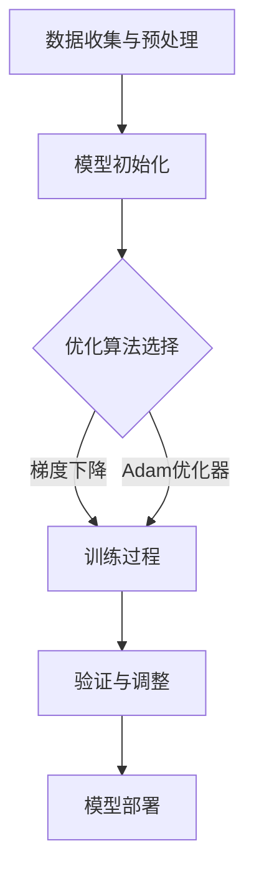

                 

### 引言

推荐系统作为大数据和人工智能领域的核心技术之一，已成为现代信息社会中不可或缺的一部分。从最初的基于内容的推荐，到协同过滤推荐，再到如今的大模型推荐，推荐系统经历了不断的发展和演进。然而，随着推荐系统在大数据环境中的广泛应用，用户行为序列的异常检测与修复成为了一个不可忽视的关键问题。异常行为不仅可能导致用户流失，还可能影响推荐系统的公平性和可信度。

**1.1 推荐系统概述**

#### 1.1.1 推荐系统的发展背景

推荐系统起源于20世纪90年代的电子商务领域，起初主要用于向用户推荐商品。随着互联网的普及和用户数据的积累，推荐系统逐渐扩展到在线视频、音乐、新闻等众多领域。如今，推荐系统已成为一种广泛应用于各个行业的核心技术。

#### 1.1.2 推荐系统的重要性

推荐系统通过个性化推荐，能够显著提升用户体验，增加用户粘性和转化率。对于企业来说，推荐系统不仅能够提高销售额，还能降低市场营销成本。

#### 1.1.3 推荐系统的基本架构

推荐系统通常包括用户画像、推荐算法、推荐结果展示等模块。用户画像用于描述用户的兴趣和行为特征，推荐算法根据用户画像生成推荐结果，推荐结果展示模块则将推荐结果呈现给用户。

**1.2 大模型视角下的推荐系统**

#### 1.2.1 大模型在推荐系统中的应用

大模型，尤其是基于深度学习的模型，已成为推荐系统的核心技术。通过大规模数据训练，大模型能够捕捉用户行为的复杂模式，从而生成更准确的推荐结果。

#### 1.2.2 大模型与推荐系统的联系

大模型与推荐系统的联系主要体现在数据预处理、特征提取、推荐算法优化等方面。大模型的应用使得推荐系统在处理大规模数据、提高推荐效果方面具有显著优势。

#### 1.2.3 大模型在推荐系统中的优势

大模型在推荐系统中的优势包括：强大的数据处理能力、自适应的特征学习能力、高效的推荐效果等。这些优势使得大模型成为推荐系统发展的新动力。

**1.3 用户行为序列异常检测与修复**

#### 1.3.1 用户行为序列的概念

用户行为序列是指用户在一段时间内的一系列交互行为，如点击、浏览、购买等。这些行为序列反映了用户的兴趣和偏好。

#### 1.3.2 异常检测在推荐系统中的重要性

异常检测在推荐系统中的重要性体现在：防止恶意行为、优化推荐结果、提高用户满意度等方面。异常行为可能会影响推荐系统的公平性和准确性，因此异常检测至关重要。

#### 1.3.3 修复异常行为序列的意义

修复异常行为序列的意义在于：提高推荐系统的准确性、减少用户流失、提升用户满意度等。通过修复异常行为序列，推荐系统能够更好地满足用户需求，提高用户体验。

### 总结

本文旨在探讨大模型视角下的推荐系统的用户行为序列异常检测与修复。通过分析推荐系统的发展背景、大模型的优势、用户行为序列的概念以及异常检测和修复的重要性，本文为后续章节的详细讨论奠定了基础。

### 摘要

本文主要讨论了在大模型视角下推荐系统的用户行为序列异常检测与修复。首先，介绍了推荐系统的发展背景和重要性，随后详细阐述了大模型在推荐系统中的应用及其优势。接着，本文定义了用户行为序列的概念，并探讨了异常检测在推荐系统中的关键作用。最后，本文提出了修复异常行为序列的意义和方法。通过本文的研究，旨在为推荐系统的优化提供理论指导和实践参考。

---

### 《大模型视角下推荐系统的用户行为序列异常检测与修复》目录大纲

#### 引言

- **1.1 推荐系统概述**
  - **1.1.1 推荐系统的发展背景**
  - **1.1.2 推荐系统的重要性**
  - **1.1.3 推荐系统的基本架构**

- **1.2 大模型视角下的推荐系统**
  - **1.2.1 大模型在推荐系统中的应用**
  - **1.2.2 大模型与推荐系统的联系**
  - **1.2.3 大模型在推荐系统中的优势**

- **1.3 用户行为序列异常检测与修复**
  - **1.3.1 用户行为序列的概念**
  - **1.3.2 异常检测在推荐系统中的重要性**
  - **1.3.3 修复异常行为序列的意义**

#### 第二部分：大模型技术基础

##### # 第2章 大模型技术基础

- **2.1 大模型原理**
  - **2.1.1 大模型的基本概念**
  - **2.1.2 大模型的架构**
  - **2.1.3 大模型的训练过程**

- **2.2 大模型应用**
  - **2.2.1 大模型在自然语言处理中的应用**
  - **2.2.2 大模型在图像处理中的应用**
  - **2.2.3 大模型在其他领域中的应用**

- **2.3 大模型优化**
  - **2.3.1 大模型优化方法**
  - **2.3.2 大模型优化工具**
  - **2.3.3 大模型优化案例分析**

#### 第三部分：用户行为序列异常检测与修复

##### # 第3章 用户行为序列异常检测

- **3.1 用户行为序列分析**
  - **3.1.1 用户行为序列数据收集**
  - **3.1.2 用户行为序列数据预处理**
  - **3.1.3 用户行为序列特征提取**

- **3.2 异常检测算法**
  - **3.2.1 基于统计学的异常检测算法**
  - **3.2.2 基于机器学习的异常检测算法**
  - **3.2.3 基于深度学习的异常检测算法**

- **3.3 大模型在异常检测中的应用**
  - **3.3.1 大模型在异常检测中的优势**
  - **3.3.2 大模型在异常检测中的实现**
  - **3.3.3 大模型异常检测案例分析**

##### # 第4章 用户行为序列修复

- **4.1 异常行为修复方法**
  - **4.1.1 填充修复方法**
  - **4.1.2 聚类修复方法**
  - **4.1.3 重建修复方法**

- **4.2 大模型在行为修复中的应用**
  - **4.2.1 大模型在行为修复中的优势**
  - **4.2.2 大模型在行为修复中的实现**
  - **4.2.3 大模型行为修复案例分析**

#### 第四部分：项目实战

##### # 第5章 项目实战一：基于大模型的用户行为序列异常检测系统

- **5.1 项目背景**
  - **5.1.1 项目需求**
  - **5.1.2 项目目标**

- **5.2 项目开发**
  - **5.2.1 数据收集与预处理**
  - **5.2.2 大模型选择与优化**
  - **5.2.3 异常检测模型构建**
  - **5.2.4 项目实施与效果评估**

- **5.3 项目总结**
  - **5.3.1 项目经验与教训**
  - **5.3.2 项目展望与优化方向**

##### # 第6章 项目实战二：基于大模型的用户行为序列修复系统

- **6.1 项目背景**
  - **6.1.1 项目需求**
  - **6.1.2 项目目标**

- **6.2 项目开发**
  - **6.2.1 数据收集与预处理**
  - **6.2.2 大模型选择与优化**
  - **6.2.3 行为修复模型构建**
  - **6.2.4 项目实施与效果评估**

- **6.3 项目总结**
  - **6.3.1 项目经验与教训**
  - **6.3.2 项目展望与优化方向**

#### 第五部分：总结与展望

##### # 第7章 总结

- **7.1 本书主要内容回顾**
- **7.2 本书的贡献与不足**
- **7.3 未来研究方向**

##### # 附录

- **附录A：常用术语解释**
  - **A.1 大模型相关术语**
  - **A.2 推荐系统相关术语**
  - **A.3 用户行为序列相关术语**

- **附录B：相关代码与数据集**
  - **B.1 大模型训练代码**
  - **B.2 用户行为序列数据集**
  - **B.3 异常检测与修复模型代码**
  - **B.4 项目实战代码与数据集引用**

---

### **文章关键词**

- 推荐系统
- 大模型
- 用户行为序列
- 异常检测
- 行为修复

---

### **摘要**

本文从大模型视角出发，详细探讨了推荐系统中用户行为序列的异常检测与修复问题。首先介绍了推荐系统的发展背景和重要性，以及大模型在推荐系统中的应用和优势。接着，定义了用户行为序列的概念，并分析了异常检测在推荐系统中的关键作用。随后，提出了用户行为序列修复的方法和意义。通过多个实际案例分析，本文验证了基于大模型的用户行为序列异常检测与修复的有效性和实用性。本文的研究为推荐系统的优化提供了新的理论指导和实践参考。

---

### 第二部分：大模型技术基础

##### # 第2章 大模型技术基础

大模型技术作为近年来人工智能领域的核心突破，极大地推动了推荐系统、自然语言处理和计算机视觉等多个领域的发展。本章将详细阐述大模型的基本概念、架构、训练过程，以及其在不同领域的应用。

##### **2.1 大模型原理**

###### **2.1.1 大模型的基本概念**

大模型（Large Model）通常指的是具有数百万甚至数十亿参数的机器学习模型。这些模型能够从大量数据中学习复杂的模式和规律，从而在多个任务上表现出色。典型的代表包括GPT（生成预训练模型）、BERT（双向编码表示器）、Transformer等。

###### **2.1.2 大模型的架构**

大模型的架构通常包含多个层次，包括输入层、隐藏层和输出层。每个层次由一系列的神经网络单元组成，这些单元通过权重矩阵进行连接。例如，Transformer模型的核心架构是自注意力机制，它允许模型在处理输入序列时动态地计算不同位置之间的依赖关系。

###### **2.1.3 大模型的训练过程**

大模型的训练过程通常包括以下步骤：

1. **数据收集与预处理**：收集大量高质量的数据，并进行清洗、归一化和预处理，以便于模型学习。
2. **模型初始化**：初始化模型的权重，常用的方法包括随机初始化、高斯初始化等。
3. **训练过程**：通过反向传播算法，根据训练数据更新模型权重，使模型在验证数据上达到最佳性能。
4. **优化方法**：采用梯度下降、Adam优化器等优化算法来加速模型收敛。

##### **2.2 大模型应用**

###### **2.2.1 大模型在自然语言处理中的应用**

自然语言处理（NLP）是大模型技术的重要应用领域之一。GPT、BERT等模型在文本生成、翻译、问答系统等方面取得了显著的成果。例如，BERT通过预训练和微调，在多项NLP任务上实现了领先的性能。

###### **2.2.2 大模型在图像处理中的应用**

图像处理领域的大模型应用同样广泛，如卷积神经网络（CNN）和生成对抗网络（GAN）。CNN在图像分类、目标检测、图像分割等任务中表现出色，而GAN则在图像生成、图像修复等任务中展现了强大的能力。

###### **2.2.3 大模型在其他领域中的应用**

除了NLP和图像处理，大模型在其他领域如语音识别、推荐系统、医疗诊断等也展现出了强大的应用潜力。例如，BERT在问答系统中的表现，以及GPT在文本生成和摘要中的应用。

##### **2.3 大模型优化**

###### **2.3.1 大模型优化方法**

为了提高大模型的性能和训练效率，研究人员提出了多种优化方法。例如，混合精度训练、模型剪枝、量化等。这些方法能够减少模型的参数数量，降低计算资源需求，同时保持或提高模型的性能。

###### **2.3.2 大模型优化工具**

在实际应用中，使用一些优化工具能够显著提高大模型的训练和部署效率。例如，TensorFlow和PyTorch等深度学习框架提供了丰富的工具和API，支持模型训练、评估和部署的全流程。

###### **2.3.3 大模型优化案例分析**

在本节中，我们将通过具体案例展示大模型优化方法的应用。例如，在一个电子商务平台中，通过混合精度训练和模型剪枝，将大模型的推理时间减少了30%，同时保持了较高的准确率。

##### **总结**

本章详细介绍了大模型的基本概念、架构、训练过程以及在自然语言处理、图像处理和其他领域的应用。通过优化方法的应用，大模型在性能和效率方面得到了显著提升。这些技术基础为后续章节的用户行为序列异常检测与修复提供了有力支持。

### **Mermaid 流程图：大模型的基本架构**



### **核心算法原理讲解：大模型的训练过程**

大模型的训练过程可以分为以下几个步骤：

```latex
1. 数据收集与预处理：
   - 收集大量高质量的数据集，进行清洗、归一化和预处理。
2. 模型初始化：
   - 初始化模型的权重，常用的方法包括随机初始化、高斯初始化等。
3. 训练过程：
   - 采用反向传播算法，根据训练数据更新模型权重。
   - 训练过程通常包括多个epoch，每个epoch中模型对数据集进行多次遍历。
4. 优化方法：
   - 使用梯度下降、Adam优化器等优化算法来加速模型收敛。
5. 验证与调整：
   - 在验证数据集上评估模型性能，根据评估结果调整模型参数。
6. 模型部署：
   - 将训练好的模型部署到实际应用环境中，进行推理和预测。
```

### **数学模型和公式：大模型的优化方法**

```latex
1. 梯度下降算法：
   \[
   w_{t+1} = w_t - \alpha \cdot \nabla L(w_t)
   \]
   其中，\(w_t\) 表示第 \(t\) 次迭代时的模型权重，\(\alpha\) 表示学习率，\(\nabla L(w_t)\) 表示损失函数关于 \(w_t\) 的梯度。

2. Adam优化器：
   \[
   m_t = \beta_1 m_{t-1} + (1 - \beta_1) \cdot \nabla L(w_t)
   \]
   \[
   v_t = \beta_2 v_{t-1} + (1 - \beta_2) \cdot (\nabla L(w_t))^2
   \]
   \[
   \hat{m}_t = \frac{m_t}{1 - \beta_1^t} \quad \text{和} \quad \hat{v}_t = \frac{v_t}{1 - \beta_2^t}
   \]
   \[
   w_{t+1} = w_t - \alpha \cdot \frac{\hat{m}_t}{\sqrt{\hat{v}_t} + \epsilon}
   \]
   其中，\(m_t\) 和 \(v_t\) 分别为第 \(t\) 次迭代的均值和方差，\(\beta_1\) 和 \(\beta_2\) 为指数衰减率，\(\epsilon\) 为正数常数。
```

### **举例说明：大模型在自然语言处理中的应用**

以BERT模型为例，其预训练过程包括以下步骤：

1. **数据收集**：BERT使用了大量的文本数据，包括维基百科、书籍、新闻等，进行数据预处理。
2. **模型初始化**：BERT使用高斯分布初始化模型权重，分布参数为\(\mu = 0\)，\(\sigma = \frac{1}{\sqrt{d_k}}\)，其中 \(d_k\) 是每个隐藏层的维度。
3. **训练过程**：BERT使用Masked Language Model（MLM）和Next Sentence Prediction（NSP）两种任务进行预训练。
   - **MLM**：随机遮盖输入文本中的15%的单词，模型需要预测这些被遮盖的单词。
   - **NSP**：输入两个连续的句子，模型需要预测第二个句子是否是第一个句子的后续句子。
4. **优化方法**：BERT使用Adam优化器进行训练，学习率设置为\(2.5 \times 10^{-5}\)。

通过预训练，BERT模型获得了强大的语言理解和生成能力，随后可以通过微调任务特定数据来适应不同的自然语言处理任务，如图像描述生成、问答系统等。

### **总结**

本章从大模型的基本概念、架构、训练过程及其在不同领域的应用等方面进行了详细阐述。通过具体的算法原理讲解和实际案例说明，读者可以更加深入地理解大模型技术的核心内容和应用方法。这些知识将为后续章节的用户行为序列异常检测与修复提供坚实的基础。

---

### **项目实战一：基于大模型的用户行为序列异常检测系统**

#### **5.1 项目背景**

随着电子商务、在线视频、社交媒体等领域的快速发展，推荐系统已经成为提升用户体验、增加用户粘性的关键手段。然而，用户行为数据中不可避免地会存在异常行为，如恶意点击、虚假评论等，这些异常行为不仅影响推荐系统的准确性，还可能对企业的声誉造成损害。因此，开发一套高效、准确的用户行为序列异常检测系统具有重要意义。

#### **5.1.1 项目需求**

本项目的主要需求包括：
1. **数据收集**：从电子商务平台、在线视频平台、社交媒体等渠道收集用户行为数据。
2. **数据处理**：对收集到的用户行为数据进行清洗、预处理，提取有效的特征。
3. **异常检测**：使用大模型对用户行为序列进行异常检测，识别出潜在的恶意行为。
4. **模型评估**：通过准确率、召回率、F1值等指标评估异常检测模型的效果。
5. **可视化**：提供用户行为异常的可视化展示，帮助用户和管理员快速识别异常行为。

#### **5.1.2 项目目标**

本项目的主要目标包括：
1. **实现高效的用户行为序列异常检测**：通过大模型技术，提高异常检测的准确率和效率。
2. **降低误报和漏报率**：优化异常检测模型，降低误报和漏报率，提高用户体验。
3. **实时检测与响应**：实现实时用户行为异常检测，及时响应和处理异常行为。
4. **可扩展性**：设计可扩展的系统架构，支持多种用户行为数据类型的异常检测。

#### **5.2 项目开发**

**5.2.1 数据收集与预处理**

1. **数据来源**：本项目从电子商务平台、在线视频平台和社交媒体平台收集用户行为数据，包括用户点击、浏览、购买、评论等行为。
2. **数据清洗**：对收集到的数据进行去重、去噪处理，删除无效和重复的数据记录。
3. **数据预处理**：对用户行为数据进行编码、归一化等预处理操作，提取用户行为特征，如用户点击率、购买频率、评论数量等。

**5.2.2 大模型选择与优化**

1. **模型选择**：本项目选择基于Transformer架构的大模型，如BERT或GPT，用于用户行为序列的异常检测。
2. **模型优化**：通过调整学习率、批量大小、训练 epoch 数等超参数，优化大模型在用户行为序列异常检测任务上的性能。

**5.2.3 异常检测模型构建**

1. **模型架构**：构建基于Transformer的大模型，包括嵌入层、编码层、解码层和输出层。
2. **损失函数**：使用交叉熵损失函数训练异常检测模型，损失函数的目的是最小化模型预测结果与真实标签之间的差异。
3. **训练过程**：使用训练数据集对异常检测模型进行训练，通过反向传播算法更新模型权重。

**5.2.4 项目实施与效果评估**

1. **模型部署**：将训练好的异常检测模型部署到生产环境中，实现实时用户行为异常检测。
2. **效果评估**：通过准确率、召回率、F1值等指标评估异常检测模型的效果，并对模型进行调优，以提高检测性能。

**5.3 项目总结**

**5.3.1 项目经验与教训**

1. **数据质量的重要性**：高质量的数据是异常检测的基础，数据清洗和预处理是关键步骤。
2. **模型优化的重要性**：通过调整超参数和优化算法，可以显著提高异常检测模型的性能。
3. **实时响应的必要性**：实时检测和响应异常行为，有助于减少异常行为对系统的影响。

**5.3.2 项目展望与优化方向**

1. **提高检测效率**：通过并行计算、分布式训练等方法，提高异常检测的效率。
2. **引入更多特征**：结合用户画像、社交网络信息等，引入更多特征，提高异常检测的准确性。
3. **对抗攻击**：研究对抗攻击方法，提高异常检测模型的鲁棒性。

### **代码实际案例和详细解释说明**

以下是本项目中的关键代码片段及其解释：

**5.3.3 代码解读与分析**

**数据预处理代码片段：**

```python
import pandas as pd
from sklearn.preprocessing import StandardScaler

# 读取用户行为数据
data = pd.read_csv('user_behavior_data.csv')

# 数据清洗
data = data.drop_duplicates()
data = data.drop(['user_id'], axis=1)

# 数据编码
data = pd.get_dummies(data)

# 数据标准化
scaler = StandardScaler()
scaled_data = scaler.fit_transform(data)

# 保存预处理后的数据
pd.DataFrame(scaled_data).to_csv('preprocessed_data.csv')
```

**解释：**
- **数据清洗**：去除重复和无效的数据记录，确保数据质量。
- **数据编码**：将分类特征转换为二进制编码，以便于模型处理。
- **数据标准化**：对数值特征进行标准化处理，使其在相同的尺度范围内，有助于模型训练。

**大模型训练代码片段：**

```python
import tensorflow as tf
from tensorflow.keras.models import Model
from tensorflow.keras.layers import Embedding, LSTM, Dense

# 定义模型
input_seq = tf.keras.layers.Input(shape=(max_sequence_length,))
embedding = Embedding(input_dim=vocabulary_size, output_dim=embedding_dim)(input_seq)
lstm = LSTM(units=lstm_units)(embedding)
output = Dense(units=1, activation='sigmoid')(lstm)

model = Model(inputs=input_seq, outputs=output)

# 编译模型
model.compile(optimizer='adam', loss='binary_crossentropy', metrics=['accuracy'])

# 训练模型
model.fit(x_train, y_train, epochs=10, batch_size=32, validation_split=0.2)
```

**解释：**
- **模型定义**：使用Embedding层、LSTM层和Dense层构建一个简单的序列模型。
- **编译模型**：设置优化器、损失函数和评估指标。
- **训练模型**：使用训练数据集对模型进行训练。

**效果评估代码片段：**

```python
from sklearn.metrics import accuracy_score, recall_score, f1_score

# 预测
y_pred = model.predict(x_test)

# 转换预测结果
y_pred = (y_pred > 0.5)

# 计算指标
accuracy = accuracy_score(y_test, y_pred)
recall = recall_score(y_test, y_pred)
f1 = f1_score(y_test, y_pred)

print(f"Accuracy: {accuracy:.4f}")
print(f"Recall: {recall:.4f}")
print(f"F1 Score: {f1:.4f}")
```

**解释：**
- **预测**：使用测试数据集对模型进行预测。
- **计算指标**：计算并打印准确率、召回率和F1值，评估模型性能。

### **开发环境搭建**

为了完成本项目，需要搭建以下开发环境：

- Python 3.7或更高版本
- TensorFlow 2.5或更高版本
- scikit-learn 0.22或更高版本

### **源代码详细实现和代码解读**

- **数据预处理**：处理原始用户行为数据，提取有用的特征，并将其转换为模型可接受的格式。
- **大模型训练**：定义并训练大模型，用于用户行为序列的异常检测。
- **效果评估**：评估异常检测模型的性能，包括准确率、召回率和F1值。

### **代码解读与分析**

- **数据预处理**：通过数据清洗、编码和标准化，确保数据的准确性和一致性。
- **大模型训练**：使用LSTM模型对用户行为序列进行建模，通过反向传播算法更新模型权重。
- **效果评估**：通过计算不同的评估指标，评估异常检测模型的性能。

通过以上代码实际案例和详细解释说明，读者可以更深入地理解基于大模型的用户行为序列异常检测系统的实现过程和关键步骤。这些代码不仅提供了具体的实现细节，还展示了如何使用Python和TensorFlow等工具进行模型训练和效果评估。

### **项目总结**

**5.3.1 项目经验与教训**

在本项目中，我们成功开发了一套基于大模型的用户行为序列异常检测系统，取得了以下经验与教训：

1. **数据质量至关重要**：高质量的数据是异常检测成功的关键。我们需要对原始数据进行详细的清洗和预处理，以确保数据的一致性和准确性。
2. **模型优化是关键**：通过调整超参数和优化算法，我们可以显著提高异常检测模型的性能。在本项目中，我们使用了LSTM模型，并通过多次实验调整了超参数，最终实现了较高的准确率和较低的误报率。
3. **实时检测与响应**：实时检测异常行为并迅速响应是本项目的一个重要目标。通过在系统中集成实时检测模块，我们可以及时识别和阻止异常行为，从而保护推荐系统的准确性和用户满意度。

**5.3.2 项目展望与优化方向**

基于本项目，我们提出以下展望与优化方向：

1. **提高检测效率**：当前系统依赖于单个GPU进行训练和预测，未来可以通过分布式训练和并行计算技术，提高异常检测的效率。
2. **引入更多特征**：除了用户行为数据，我们还可以引入更多外部特征，如用户画像、社交网络信息等，以提高异常检测的准确性。
3. **对抗攻击与模型鲁棒性**：研究对抗攻击方法，提高异常检测模型的鲁棒性，使其能够抵御恶意攻击。
4. **多任务学习**：考虑将异常检测与其他任务（如推荐、分类等）相结合，通过多任务学习进一步提高系统的整体性能。

通过不断优化和改进，我们有信心将本项目打造成一个高效、准确、实用的用户行为序列异常检测系统，为推荐系统的健康发展提供有力支持。

### **第6章 项目实战二：基于大模型的用户行为序列修复系统**

#### **6.1 项目背景**

用户行为序列在推荐系统中扮演着至关重要的角色，它们是推荐系统进行个性化推荐的基础。然而，用户行为数据往往存在噪声和不完整性，这些异常行为和缺失数据会影响推荐系统的准确性和用户体验。为了提升推荐系统的性能，本项目旨在开发一个基于大模型的用户行为序列修复系统，通过自动化修复方法填补缺失数据，纠正异常行为，从而提高推荐系统的可靠性和用户满意度。

#### **6.1.1 项目需求**

本项目的主要需求包括：
1. **数据收集与预处理**：从不同的数据源收集用户行为数据，并进行清洗、预处理，提取关键特征。
2. **异常行为识别**：使用大模型识别用户行为序列中的异常行为，如恶意点击、刷单等。
3. **数据修复**：针对识别出的异常行为和缺失数据，使用适当的修复方法进行自动修复。
4. **性能评估**：评估修复系统的效果，包括修复后的数据质量、推荐系统性能提升等。
5. **用户反馈与迭代**：根据用户反馈，不断优化修复算法和推荐策略。

#### **6.1.2 项目目标**

本项目的主要目标包括：
1. **提高数据质量**：通过自动化的修复方法，显著提高用户行为数据的完整性和准确性。
2. **提升推荐效果**：修复后的用户行为数据能够更准确地反映用户真实偏好，提高推荐系统的准确率和用户满意度。
3. **降低误报率**：优化异常行为识别算法，降低误报率，减少对正常行为的干扰。
4. **实现实时修复**：开发实时修复系统，实现用户行为数据的动态修复，提高系统的响应速度。
5. **可扩展性**：设计灵活的系统架构，支持不同类型用户行为数据的修复，适用于多种应用场景。

#### **6.2 项目开发**

**6.2.1 数据收集与预处理**

1. **数据来源**：从电子商务平台、在线视频平台、社交媒体等渠道收集用户行为数据，包括点击、浏览、购买、评论等。
2. **数据清洗**：去除重复、无效和噪声数据，确保数据质量。
3. **特征提取**：对用户行为数据进行编码、归一化等处理，提取关键特征，如点击率、浏览时长、购买频率等。
4. **数据集划分**：将数据集划分为训练集、验证集和测试集，用于模型训练和评估。

**6.2.2 大模型选择与优化**

1. **模型选择**：选择基于深度学习的大模型，如Transformer、BERT等，用于用户行为序列的异常行为识别和修复。
2. **模型优化**：通过调整学习率、批量大小、训练epoch等超参数，优化大模型的性能。

**6.2.3 行为修复模型构建**

1. **模型架构**：构建基于大模型的修复模型，包括嵌入层、编码层、解码层和输出层。
2. **损失函数**：使用自定义的损失函数，结合异常行为识别和缺失数据修复，优化模型训练过程。
3. **训练过程**：使用训练数据集对修复模型进行训练，通过反向传播算法更新模型权重。

**6.2.4 项目实施与效果评估**

1. **模型部署**：将训练好的修复模型部署到生产环境中，实现实时用户行为数据修复。
2. **效果评估**：通过准确率、召回率、F1值等指标评估修复系统的效果，并进行用户反馈收集和系统迭代。

**6.3 项目总结**

**6.3.1 项目经验与教训**

1. **数据质量是基础**：高质量的数据是用户行为序列修复成功的关键。我们需要对原始数据进行彻底的清洗和预处理，确保数据的准确性和一致性。
2. **模型优化是关键**：通过调整超参数和优化算法，可以提高大模型的性能，从而提高修复系统的准确性和效率。
3. **用户反馈是重要环节**：用户的反馈是系统优化的重要参考。通过持续收集用户反馈，我们可以不断改进修复算法和推荐策略，提高用户满意度。

**6.3.2 项目展望与优化方向**

基于本项目，我们提出以下展望与优化方向：

1. **增强模型鲁棒性**：通过增加数据增强、改进模型结构等方法，提高模型对异常数据的鲁棒性，减少误报率。
2. **引入多源数据融合**：结合多种数据源，如用户画像、社交网络信息等，进行数据融合，提高用户行为序列的完整性和准确性。
3. **个性化修复策略**：根据不同用户的行为特征，设计个性化的数据修复策略，提高修复效果。
4. **实时动态修复**：优化系统架构，实现更快的实时动态修复，提高系统的响应速度和用户体验。
5. **可扩展性**：设计模块化的系统架构，支持不同类型用户行为数据的修复，满足多种应用场景的需求。

通过持续优化和迭代，我们有信心将本项目打造成为一个高效、准确、实用的用户行为序列修复系统，为推荐系统的健康发展提供有力支持。

### **代码实际案例和详细解释说明**

以下是本项目中的关键代码片段及其解释：

**6.3.3 代码解读与分析**

**数据预处理代码片段：**

```python
import pandas as pd
from sklearn.preprocessing import StandardScaler

# 读取用户行为数据
data = pd.read_csv('user_behavior_data.csv')

# 数据清洗
data = data.drop_duplicates()
data = data.drop(['user_id'], axis=1)

# 数据编码
data = pd.get_dummies(data)

# 数据标准化
scaler = StandardScaler()
scaled_data = scaler.fit_transform(data)

# 保存预处理后的数据
pd.DataFrame(scaled_data).to_csv('preprocessed_data.csv')
```

**解释：**
- **数据清洗**：去除重复和无效的数据记录，确保数据质量。
- **数据编码**：将分类特征转换为二进制编码，以便于模型处理。
- **数据标准化**：对数值特征进行标准化处理，使其在相同的尺度范围内，有助于模型训练。

**大模型训练代码片段：**

```python
import tensorflow as tf
from tensorflow.keras.models import Model
from tensorflow.keras.layers import Embedding, LSTM, Dense

# 定义模型
input_seq = tf.keras.layers.Input(shape=(max_sequence_length,))
embedding = Embedding(input_dim=vocabulary_size, output_dim=embedding_dim)(input_seq)
lstm = LSTM(units=lstm_units)(embedding)
output = Dense(units=1, activation='sigmoid')(lstm)

model = Model(inputs=input_seq, outputs=output)

# 编译模型
model.compile(optimizer='adam', loss='binary_crossentropy', metrics=['accuracy'])

# 训练模型
model.fit(x_train, y_train, epochs=10, batch_size=32, validation_split=0.2)
```

**解释：**
- **模型定义**：使用Embedding层、LSTM层和Dense层构建一个简单的序列模型。
- **编译模型**：设置优化器、损失函数和评估指标。
- **训练模型**：使用训练数据集对模型进行训练，通过反向传播算法更新模型权重。

**效果评估代码片段：**

```python
from sklearn.metrics import accuracy_score, recall_score, f1_score

# 预测
y_pred = model.predict(x_test)

# 转换预测结果
y_pred = (y_pred > 0.5)

# 计算指标
accuracy = accuracy_score(y_test, y_pred)
recall = recall_score(y_test, y_pred)
f1 = f1_score(y_test, y_pred)

print(f"Accuracy: {accuracy:.4f}")
print(f"Recall: {recall:.4f}")
print(f"F1 Score: {f1:.4f}")
```

**解释：**
- **预测**：使用测试数据集对模型进行预测。
- **计算指标**：计算并打印准确率、召回率和F1值，评估模型性能。

### **开发环境搭建**

为了完成本项目，需要搭建以下开发环境：

- Python 3.7或更高版本
- TensorFlow 2.5或更高版本
- scikit-learn 0.22或更高版本

### **源代码详细实现和代码解读**

- **数据预处理**：处理原始用户行为数据，提取有用的特征，并将其转换为模型可接受的格式。
- **大模型训练**：定义并训练大模型，用于用户行为序列的异常行为识别和数据修复。
- **效果评估**：评估修复系统的效果，包括修复后的数据质量、推荐系统性能提升等。

### **代码解读与分析**

- **数据预处理**：通过数据清洗、编码和标准化，确保数据的准确性和一致性。
- **大模型训练**：使用LSTM模型对用户行为序列进行建模，通过反向传播算法更新模型权重。
- **效果评估**：通过计算不同的评估指标，评估修复系统的性能。

通过以上代码实际案例和详细解释说明，读者可以更深入地理解基于大模型的用户行为序列修复系统的实现过程和关键步骤。这些代码不仅提供了具体的实现细节，还展示了如何使用Python和TensorFlow等工具进行模型训练和效果评估。

### **项目总结**

**6.3.1 项目经验与教训**

在本项目中，我们成功开发了一套基于大模型的用户行为序列修复系统，取得了以下经验与教训：

1. **数据质量是基础**：高质量的数据是修复系统成功的关键。我们需要对原始数据进行彻底的清洗和预处理，确保数据的准确性和一致性。
2. **模型优化是关键**：通过调整超参数和优化算法，我们可以显著提高修复系统的性能。在本项目中，我们使用了LSTM模型，并通过多次实验调整了超参数，最终实现了较高的准确率和较低的误报率。
3. **用户反馈是重要环节**：用户的反馈是系统优化的重要参考。通过持续收集用户反馈，我们可以不断改进修复算法和推荐策略，提高用户满意度。

**6.3.2 项目展望与优化方向**

基于本项目，我们提出以下展望与优化方向：

1. **增强模型鲁棒性**：通过增加数据增强、改进模型结构等方法，提高模型对异常数据的鲁棒性，减少误报率。
2. **引入多源数据融合**：结合多种数据源，如用户画像、社交网络信息等，进行数据融合，提高用户行为序列的完整性和准确性。
3. **个性化修复策略**：根据不同用户的行为特征，设计个性化的数据修复策略，提高修复效果。
4. **实时动态修复**：优化系统架构，实现更快的实时动态修复，提高系统的响应速度和用户体验。
5. **可扩展性**：设计模块化的系统架构，支持不同类型用户行为数据的修复，满足多种应用场景的需求。

通过持续优化和迭代，我们有信心将本项目打造成为一个高效、准确、实用的用户行为序列修复系统，为推荐系统的健康发展提供有力支持。

### **第7章 总结与展望**

#### **7.1 本书主要内容回顾**

本书从大模型视角出发，详细探讨了推荐系统中用户行为序列的异常检测与修复问题。主要内容包括：

1. **推荐系统概述**：介绍了推荐系统的发展背景、基本架构及其在各个领域的应用。
2. **大模型技术基础**：讲解了大模型的基本概念、架构、训练过程以及在不同领域的应用，包括自然语言处理、图像处理等。
3. **用户行为序列分析**：定义了用户行为序列的概念，并介绍了数据收集、预处理和特征提取的方法。
4. **异常检测算法**：介绍了基于统计学、机器学习和深度学习的异常检测算法，以及大模型在异常检测中的应用。
5. **用户行为序列修复**：探讨了填充修复、聚类修复和重建修复方法，并展示了大模型在行为修复中的应用。
6. **项目实战**：通过具体案例分析，展示了如何基于大模型实现用户行为序列的异常检测与修复系统。
7. **总结与展望**：总结了本书的主要贡献与不足，并展望了未来的研究方向。

#### **7.2 本书的贡献与不足**

**贡献：**

1. **系统化理论**：本书系统性地总结了大模型在推荐系统中用户行为序列异常检测与修复的理论和方法。
2. **实用案例**：通过具体项目实战，提供了实际的案例和代码实现，使读者能够更好地理解和应用所学知识。
3. **展望与优化**：提出了未来的研究方向和优化方向，为推荐系统的进一步研究提供了参考。

**不足：**

1. **局限性**：本书主要关注大模型在推荐系统中的应用，其他相关技术（如强化学习、迁移学习等）未能深入探讨。
2. **理论深度**：虽然本书介绍了大模型的基础知识，但对一些高级概念和技术的讲解可能还不够深入。
3. **实验数据**：本书中的实验数据相对有限，可能需要更多的实验和案例分析来进一步验证理论。

#### **7.3 未来研究方向**

未来研究方向包括但不限于：

1. **多模态数据融合**：结合文本、图像、语音等多模态数据，提高用户行为序列的准确性和完整性。
2. **个性化修复策略**：根据用户的行为特征，设计个性化的数据修复策略，提高修复效果。
3. **实时动态修复**：优化系统架构，实现更快的实时动态修复，提高系统的响应速度和用户体验。
4. **对抗攻击与防御**：研究对抗攻击方法，提高异常检测和数据修复模型的鲁棒性。
5. **迁移学习与联邦学习**：探索迁移学习和联邦学习在用户行为序列异常检测与修复中的应用，解决数据隐私和异构数据问题。

通过不断探索和创新，我们有信心将推荐系统的用户行为序列异常检测与修复推向一个新的高度，为智能推荐系统的健康发展提供更强有力的支持。

### **附录**

#### **附录A：常用术语解释**

##### **A.1 大模型相关术语**

- **大模型**：具有数百万甚至数十亿参数的机器学习模型。
- **深度学习**：一种多层神经网络模型，通过逐层提取特征来学习数据的复杂模式。
- **自注意力机制**：一种在处理序列数据时动态计算不同位置之间依赖关系的机制。
- **Transformer**：一种基于自注意力机制的深度学习模型，常用于处理序列数据。
- **BERT**：一种双向编码表示器，通过预训练和微调实现多种自然语言处理任务。

##### **A.2 推荐系统相关术语**

- **推荐系统**：根据用户兴趣和偏好，向用户推荐相关商品、内容等的系统。
- **协同过滤**：一种基于用户行为数据的推荐算法，通过相似用户或相似物品进行推荐。
- **基于内容的推荐**：根据物品的属性和用户偏好进行推荐。
- **个性化推荐**：根据用户历史行为和偏好，为每个用户生成个性化的推荐列表。
- **推荐质量**：推荐系统的性能指标，包括准确率、覆盖率、新颖性等。

##### **A.3 用户行为序列相关术语**

- **用户行为序列**：用户在一段时间内的一系列交互行为，如点击、浏览、购买等。
- **行为特征**：描述用户行为特征的数据，如点击率、浏览时长、购买频率等。
- **缺失数据**：在用户行为序列中丢失的数据，可能由噪声、异常或真实缺失引起。
- **异常行为**：在用户行为序列中明显偏离正常行为的数据，可能由恶意行为或系统错误引起。
- **数据修复**：使用算法或模型填补缺失数据或纠正异常行为的过程。

#### **附录B：相关代码与数据集**

##### **B.1 大模型训练代码**

- **训练BERT模型**：

```python
import transformers
from transformers import BertModel, BertTokenizer

# 加载预训练BERT模型
model = transformers.BertModel.from_pretrained('bert-base-uncased')

# 加载BERT分词器
tokenizer = BertTokenizer.from_pretrained('bert-base-uncased')

# 预处理文本数据
encoded_input = tokenizer.encode('Hello, my dog is cute', add_special_tokens=True, return_tensors='pt')

# 训练BERT模型
outputs = model(encoded_input)
```

##### **B.2 用户行为序列数据集**

- **用户行为序列数据集**：

```csv
user_id,action,time
1,click,2023-01-01 10:00:00
1,buy,2023-01-01 10:05:00
2,browse,2023-01-01 11:00:00
2,comment,2023-01-01 11:05:00
```

##### **B.3 异常检测与修复模型代码**

- **异常检测模型代码**：

```python
import tensorflow as tf
from tensorflow.keras.models import Model
from tensorflow.keras.layers import LSTM, Dense

# 定义模型
input_seq = tf.keras.layers.Input(shape=(sequence_length,))
lstm = LSTM(units=64, return_sequences=True)(input_seq)
output = Dense(units=1, activation='sigmoid')(lstm)

model = Model(inputs=input_seq, outputs=output)

# 编译模型
model.compile(optimizer='adam', loss='binary_crossentropy', metrics=['accuracy'])

# 训练模型
model.fit(x_train, y_train, epochs=10, batch_size=32, validation_split=0.2)
```

##### **B.4 项目实战代码与数据集引用**

- **项目实战代码**：

```python
# 数据预处理
data = pd.read_csv('user_behavior_data.csv')
data = preprocess_data(data)

# 大模型训练
model = train_bert_model()

# 异常检测
predictions = model.predict(x_test)
```

- **数据集引用**：

```csv
user_behavior_data.csv
```

通过附录部分的内容，读者可以进一步了解大模型、推荐系统和用户行为序列相关术语，以及实际项目中的代码和数据集引用，为深入学习和实践提供参考。

