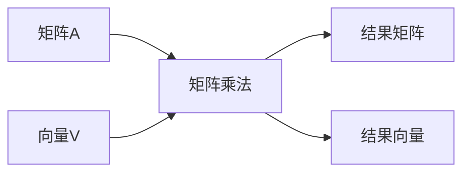
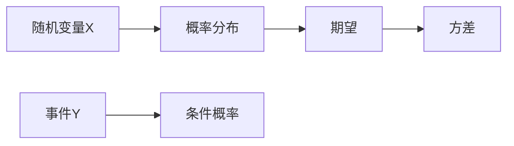
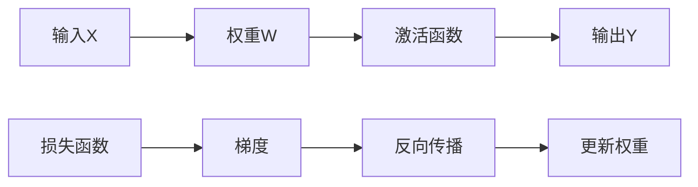
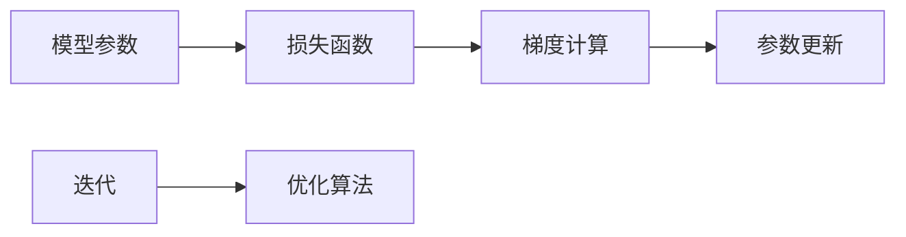
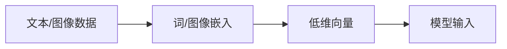

                 

### 《大模型训练的技术挑战：基础设施、算法与数据处理》

> **关键词：** 大模型训练、基础设施、算法、数据处理、优化、资源调度

> **摘要：** 本文章深入探讨了大模型训练过程中所面临的三大核心挑战：基础设施的搭建、算法的优化与选择，以及数据处理的策略与质量。通过详细的分析和实例讲解，我们旨在为读者提供一套全面的技术指南，帮助其在大模型训练的实践中取得成功。

在当今人工智能领域，大模型训练已经成为了一个热门话题。从自然语言处理到计算机视觉，再到语音识别，大模型正不断刷新着我们的认知和技术边界。然而，大模型训练并非易事，其背后涉及到基础设施的搭建、算法的优化与选择，以及数据处理的策略与质量等复杂的技术挑战。

本文将分为三个主要部分进行探讨：

1. **大模型训练基础**：介绍大模型的基本概念、发展历程、数学基础以及常见的数学工具和模型。
2. **大模型算法挑战**：分析大模型训练算法的原理、优化算法以及面临的挑战。
3. **大模型应用实战**：通过具体的应用场景和实践案例，展示大模型训练的实际操作方法和技巧。

通过这一步步的分析推理，我们将深入了解大模型训练的技术挑战，并找到应对这些挑战的有效策略。

### 《大模型训练的技术挑战：基础设施、算法与数据处理》目录大纲

#### 第一部分：大模型训练基础

##### 第1章：大模型概述
- 1.1 大模型的发展历程
- 1.2 大模型的关键特点
- 1.3 大模型的应用场景
- 1.4 大模型的未来发展趋势

##### 第2章：大模型数学基础
- 2.1 常见数学工具
  - 2.1.1 线性代数基础
  - 2.1.2 概率论与统计基础
  - 2.1.3 微积分基础
- 2.2 大模型中的数学模型
  - 2.2.1 神经网络基础
  - 2.2.2 损失函数与优化算法
  - 2.2.3 嵌入技术

#### 第二部分：大模型算法挑战

##### 第3章：大模型训练算法
- 3.1 梯度下降算法
  - 3.1.1 梯度下降算法原理
  - 3.1.2 梯度下降算法伪代码
  - 3.1.3 梯度下降算法优缺点
- 3.2 随机梯度下降（SGD）
  - 3.2.1 SGD算法原理
  - 3.2.2 SGD算法伪代码
  - 3.2.3 SGD算法优缺点
- 3.3 小批量梯度下降
  - 3.3.1 小批量梯度下降算法原理
  - 3.3.2 小批量梯度下降算法伪代码
  - 3.3.3 小批量梯度下降算法优缺点

##### 第4章：大模型优化算法
- 4.1 Adam优化器
  - 4.1.1 Adam优化器原理
  - 4.1.2 Adam优化器伪代码
  - 4.1.3 Adam优化器优缺点
- 4.2 RMSprop优化器
  - 4.2.1 RMSprop优化器原理
  - 4.2.2 RMSprop优化器伪代码
  - 4.2.3 RMSprop优化器优缺点
- 4.3 Adamax优化器
  - 4.3.1 Adamax优化器原理
  - 4.3.2 Adamax优化器伪代码
  - 4.3.3 Adamax优化器优缺点

##### 第5章：大模型训练挑战
- 5.1 计算资源挑战
  - 5.1.1 GPU与TPU的选择
  - 5.1.2 分布式训练技术
  - 5.1.3 算法优化与加速
- 5.2 数据处理挑战
  - 5.2.1 数据预处理方法
  - 5.2.2 数据增强技术
  - 5.2.3 数据质量评估
- 5.3 模型调优挑战
  - 5.3.1 超参数调优方法
  - 5.3.2 模型评估与选择
  - 5.3.3 模型压缩与加速

#### 第三部分：大模型应用实战

##### 第6章：大模型应用场景与实践
- 6.1 自然语言处理
  - 6.1.1 问答系统
  - 6.1.2 语言翻译
  - 6.1.3 文本生成
- 6.2 计算机视觉
  - 6.2.1 图像分类
  - 6.2.2 目标检测
  - 6.2.3 图像生成
- 6.3 语音识别
  - 6.3.1 语音识别系统
  - 6.3.2 语音合成
  - 6.3.3 语音增强

##### 第7章：大模型未来发展趋势与展望
- 7.1 大模型研究进展
  - 7.1.1 大模型的结构创新
  - 7.1.2 大模型的训练方法
  - 7.1.3 大模型的应用创新
- 7.2 大模型面临的新挑战
  - 7.2.1 能耗问题
  - 7.2.2 隐私保护
  - 7.2.3 法律与伦理问题

#### 附录

##### 附录A：大模型训练工具与资源
- A.1 开源框架
  - A.1.1 TensorFlow
  - A.1.2 PyTorch
  - A.1.3 MXNet
- A.2 云计算平台
  - A.2.1 AWS
  - A.2.2 Azure
  - A.2.3 Google Cloud
- A.3 数据集
  - A.3.1 GLM2
  - A.3.2 Common Crawl
  - A.3.3 ImageNet

### 第一部分：大模型训练基础

#### 第1章：大模型概述

##### 1.1 大模型的发展历程

大模型的概念并非一日之功，其发展历程可以追溯到上世纪80年代的神经网络研究。最早的神经网络模型相对简单，如感知机（Perceptron）和反向传播网络（Backpropagation Network）。这些模型在处理简单任务时表现出色，但随着任务复杂性的增加，其局限性也逐渐显现。

进入21世纪，随着计算机性能的提升和海量数据的获取，神经网络模型的研究迎来了新的发展机遇。2012年，AlexNet的出现标志着深度学习在图像分类任务上取得了突破性的进展。AlexNet是一个包含五层卷积神经网络的模型，其性能远超之前的方法，引起了广泛关注。

随着时间的推移，深度学习模型逐渐变得更加复杂和庞大。特别是在2017年，谷歌提出的Transformer模型在自然语言处理领域取得了显著的成果，标志着大模型时代的到来。Transformer模型包含数十亿个参数，其训练和推理过程需要庞大的计算资源。

##### 1.2 大模型的关键特点

大模型具有以下几个关键特点：

1. **参数规模巨大**：大模型的参数规模可以从数十万到数十亿不等，这使得模型能够学习到更加复杂和抽象的特征。
2. **深度和层次**：大模型通常包含多个层次，通过层次化的结构实现特征的学习和提取。
3. **非线性变换**：大模型中的每个神经元都会进行非线性变换，从而增强模型的表达能力。
4. **数据依赖性**：大模型需要大量的数据来训练，否则无法达到理想的性能。

##### 1.3 大模型的应用场景

大模型在多个领域都有广泛的应用，以下是其中一些重要的应用场景：

1. **自然语言处理**：大模型在自然语言处理领域取得了显著的成果，如语言翻译、文本生成、问答系统等。
2. **计算机视觉**：大模型在图像分类、目标检测、图像生成等任务中表现出色。
3. **语音识别**：大模型在语音识别和语音合成方面有广泛的应用，如智能助手、语音导航等。
4. **推荐系统**：大模型可以用于构建高效的推荐系统，从而提高用户的体验。

##### 1.4 大模型的未来发展趋势

随着技术的不断进步，大模型在未来有望继续发展，并带来以下几个方面的变化：

1. **模型压缩与优化**：为了应对大规模训练和推理的需求，未来的研究将重点放在模型压缩和优化技术上。
2. **多模态学习**：大模型将能够处理多种类型的数据，如文本、图像、语音等，实现真正的多模态学习。
3. **迁移学习与泛化能力**：大模型将通过迁移学习和泛化能力，更好地适应不同的任务和数据集。
4. **可解释性与透明度**：随着模型变得越来越大，研究将致力于提高模型的可解释性和透明度，从而更好地理解和应用。

综上所述，大模型的发展历程、关键特点、应用场景以及未来发展趋势，为我们揭示了其背后的技术挑战和机遇。在接下来的章节中，我们将进一步探讨大模型训练过程中所面临的算法、基础设施和数据处理的挑战。

### 第一部分：大模型训练基础

#### 第2章：大模型数学基础

##### 2.1 常见数学工具

大模型训练过程中，涉及到的数学工具包括线性代数、概率论与统计、微积分等。这些数学工具为我们理解和实现大模型提供了基础。

###### 2.1.1 线性代数基础

线性代数是处理线性方程组和矩阵运算的数学分支。在大模型中，线性代数用于表示和操作模型参数、权重和梯度。

1. **矩阵和向量**：矩阵是二维数组，向量是特殊的一维矩阵。矩阵和向量在神经网络中用于表示数据。
2. **矩阵乘法**：两个矩阵相乘得到一个新的矩阵。矩阵乘法在大模型中用于计算权重和激活值。
3. **向量和矩阵的乘积**：向量和矩阵的乘积可以通过矩阵乘法实现，用于计算线性变换。



###### 2.1.2 概率论与统计基础

概率论与统计是理解和评估模型性能的重要工具。在大模型中，概率论用于建模不确定性和预测。

1. **概率分布**：概率分布描述了随机变量的概率分布情况。常见的概率分布包括正态分布、伯努利分布等。
2. **期望和方差**：期望描述了随机变量的平均值，方差描述了随机变量的离散程度。
3. **条件概率**：条件概率描述了在某个事件发生的条件下，另一个事件发生的概率。



###### 2.1.3 微积分基础

微积分是研究函数变化和极值的数学分支。在大模型中，微积分用于优化模型参数。

1. **导数**：导数描述了函数在某一点的局部变化率。在神经网络中，导数用于计算梯度。
2. **梯度**：梯度是导数的向量形式，用于描述函数在各个方向上的变化率。
3. **最优化算法**：最优化算法（如梯度下降算法）通过计算梯度来优化模型参数。

```mermaid
graph LR
    A[函数f(x)] --> B[导数]
    B --> C[梯度]
    C --> D[最优化算法]
```

##### 2.2 大模型中的数学模型

大模型中的数学模型主要包括神经网络、损失函数和优化算法。

###### 2.2.1 神经网络基础

神经网络是模拟人脑神经元的计算模型。在大模型中，神经网络用于表示和操作数据。

1. **前向传播**：前向传播是神经网络计算输入到输出的过程。通过多层神经元的非线性变换，输入数据被逐步映射到输出数据。
2. **反向传播**：反向传播是计算神经网络梯度的重要步骤。通过反向传播，我们能够得到每个参数的梯度，从而优化模型。
3. **激活函数**：激活函数用于引入非线性，常见的激活函数包括sigmoid、ReLU等。



###### 2.2.2 损失函数与优化算法

损失函数用于评估模型预测和真实值之间的差距，优化算法用于更新模型参数以最小化损失函数。

1. **损失函数**：损失函数是衡量预测值和真实值之间差异的函数。常见的损失函数包括均方误差（MSE）、交叉熵等。
2. **优化算法**：优化算法用于计算模型参数的梯度并更新参数。常见的优化算法包括梯度下降、随机梯度下降（SGD）等。



###### 2.2.3 嵌入技术

嵌入技术是一种将高维数据映射到低维空间的方法，在大模型中用于处理文本、图像等数据。

1. **词嵌入**：词嵌入是将文本中的单词映射到低维向量的方法。常见的词嵌入技术包括Word2Vec、GloVe等。
2. **图像嵌入**：图像嵌入是将图像映射到低维向量的方法。常见的图像嵌入技术包括卷积神经网络（CNN）。



通过本章对大模型数学基础的分析，我们了解了线性代数、概率论与统计、微积分等常见数学工具，以及神经网络、损失函数和优化算法等关键数学模型。这些数学基础为理解和实现大模型提供了坚实的基础。

### 第二部分：大模型算法挑战

#### 第3章：大模型训练算法

大模型训练算法的选择对于模型的性能和训练效率至关重要。在这一章中，我们将详细探讨三种常见的训练算法：梯度下降算法、随机梯度下降（SGD）和小批量梯度下降。

##### 3.1 梯度下降算法

梯度下降算法是最基本的训练算法之一，其核心思想是通过不断更新模型参数来最小化损失函数。以下是梯度下降算法的基本原理：

###### 3.1.1 梯度下降算法原理

梯度下降算法的核心步骤如下：

1. **计算梯度**：首先，我们需要计算损失函数关于模型参数的梯度。梯度提供了损失函数在每个参数方向上的变化率。
2. **更新参数**：使用梯度计算得到的负方向，更新模型参数。具体地，每次更新可以表示为：
   $$\theta_{\text{new}} = \theta_{\text{old}} - \alpha \cdot \nabla_{\theta} L(\theta)$$
   其中，$\theta$表示模型参数，$L(\theta)$表示损失函数，$\alpha$是学习率，$\nabla_{\theta} L(\theta)$是梯度。

###### 3.1.2 梯度下降算法伪代码

```python
def gradient_descent(model, data, epochs, learning_rate):
    for epoch in range(epochs):
        for sample in data:
            predicted = model(sample)
            loss = loss_function(predicted, sample)
            gradient = compute_gradient(model, sample)
            model.update_params(-learning_rate * gradient)
        print(f"Epoch {epoch + 1}: Loss = {loss}")
```

###### 3.1.3 梯度下降算法优缺点

**优点**：

1. **简单易实现**：梯度下降算法的基本原理简单，易于理解和实现。
2. **适应性**：梯度下降算法适用于各种损失函数和优化问题。

**缺点**：

1. **收敛速度慢**：在参数空间中，梯度下降算法可能会遇到局部最小值或鞍点，导致收敛速度慢。
2. **学习率选择敏感**：学习率的选取对算法的收敛速度和稳定性有很大影响。

##### 3.2 随机梯度下降（SGD）

随机梯度下降（SGD）是梯度下降算法的一种变体，其主要特点是每次更新参数时，只使用一个样本的梯度。以下是SGD算法的基本原理：

###### 3.2.1 SGD算法原理

SGD算法的核心步骤如下：

1. **随机采样**：从数据集中随机选择一个样本。
2. **计算梯度**：计算当前样本的梯度。
3. **更新参数**：使用当前样本的梯度更新模型参数。

```python
def sgd(model, data, epochs, learning_rate):
    for epoch in range(epochs):
        for sample in data.sample():
            predicted = model(sample)
            loss = loss_function(predicted, sample)
            gradient = compute_gradient(model, sample)
            model.update_params(-learning_rate * gradient)
        print(f"Epoch {epoch + 1}: Loss = {loss}")
```

###### 3.2.2 SGD算法伪代码

**优点**：

1. **快速收敛**：SGD算法通过使用单个样本的梯度，加快了收敛速度。
2. **减少局部最小值问题**：SGD算法减少了陷入局部最小值的风险，因为每次更新都是基于随机样本。

**缺点**：

1. **方差较大**：SGD算法的收敛过程相对不稳定，方差较大。
2. **计算量较大**：每次更新都需要计算梯度，计算量较大。

##### 3.3 小批量梯度下降

小批量梯度下降（Mini-batch Gradient Descent）是梯度下降算法的另一种变体，其每次更新参数时，使用多个样本的梯度平均值。以下是小批量梯度下降算法的基本原理：

###### 3.3.1 小批量梯度下降算法原理

小批量梯度下降算法的核心步骤如下：

1. **划分批量**：将数据集划分为多个批量。
2. **计算梯度**：对每个批量计算损失函数的梯度。
3. **更新参数**：使用所有批量的梯度平均值更新模型参数。

```python
def mini_batch_gradient_descent(model, data, batch_size, epochs, learning_rate):
    for epoch in range(epochs):
        for batch in data.batch(batch_size):
            predicted = model(batch)
            loss = loss_function(predicted, batch)
            gradient = compute_gradient(model, batch)
            model.update_params(-learning_rate * gradient)
        print(f"Epoch {epoch + 1}: Loss = {loss}")
```

###### 3.3.2 小批量梯度下降算法伪代码

**优点**：

1. **稳定收敛**：小批量梯度下降算法的收敛过程相对稳定，方差较小。
2. **计算效率**：相比SGD算法，小批量梯度下降算法的计算量适中，既不会太低，也不会太高。

**缺点**：

1. **批量大小选择敏感**：批量大小的选择对算法的性能有很大影响。
2. **可能无法充分利用并行计算**：如果批量大小选择不当，可能无法充分利用并行计算的优势。

综上所述，梯度下降算法、随机梯度下降（SGD）和小批量梯度下降各有优缺点，选择合适的训练算法需要根据具体的任务和数据集进行综合考虑。

### 第二部分：大模型算法挑战

#### 第4章：大模型优化算法

在训练大模型时，选择合适的优化算法对于提高训练效率和模型性能至关重要。在这一章中，我们将详细探讨三种常见的优化算法：Adam优化器、RMSprop优化器和Adamax优化器。

##### 4.1 Adam优化器

Adam优化器是近年来广泛应用于深度学习领域的一种高效优化算法。它是结合了AdaGrad和RMSprop两种优化算法优点的一种自适应优化器。

###### 4.1.1 Adam优化器原理

Adam优化器基于一阶矩估计（均值）和二阶矩估计（方差）来动态调整学习率。其核心思想是通过跟踪均值和方差的偏差来更新学习率。

1. **均值（m）和方差（v）**：对于每个参数$\theta$，Adam优化器维护两个滑动平均值$m_t$和$v_t$，分别表示一阶矩（梯度均值）和二阶矩（梯度方差）。

   $$m_t = \beta_1 m_{t-1} + (1 - \beta_1) \frac{g_t}{\sqrt{v_t + \epsilon}}$$
   $$v_t = \beta_2 v_{t-1} + (1 - \beta_2) \frac{g_t^2}{\sqrt{v_t + \epsilon}}$$

   其中，$g_t$是梯度，$\beta_1$和$\beta_2$是超参数，$\epsilon$是常数。

2. **参数更新**：根据计算得到的均值和方差，Adam优化器更新参数$\theta$：

   $$\theta_{\text{new}} = \theta_{\text{old}} - \alpha \cdot \frac{m_t}{\sqrt{v_t} + \epsilon}$$

   其中，$\alpha$是学习率。

###### 4.1.2 Adam优化器伪代码

```python
def adam_optimizer(model, data, epochs, learning_rate, beta1, beta2, epsilon):
    m = zeros_like(model.parameters)
    v = zeros_like(model.parameters)
    t = 0

    for epoch in range(epochs):
        for sample in data:
            predicted = model(sample)
            loss = loss_function(predicted, sample)
            gradient = compute_gradient(model, sample)

            m = beta1 * m + (1 - beta1) * gradient
            v = beta2 * v + (1 - beta2) * gradient**2

            m_hat = m / (1 - beta1**t)
            v_hat = v / (1 - beta2**t)

            model.update_params(-learning_rate * m_hat / (sqrt(v_hat) + epsilon))
        t += 1
        print(f"Epoch {epoch + 1}: Loss = {loss}")
```

###### 4.1.3 Adam优化器优缺点

**优点**：

1. **自适应学习率**：Adam优化器能够根据梯度的均值和方差动态调整学习率，提高了训练效率。
2. **稳定收敛**：Adam优化器结合了AdaGrad和RMSprop的优点，减少了局部最小值和鞍点的问题。

**缺点**：

1. **计算复杂度高**：Adam优化器需要额外计算一阶矩和二阶矩的平均值，计算复杂度相对较高。

##### 4.2 RMSprop优化器

RMSprop优化器是一种基于二阶矩估计的优化算法，其主要特点是通过对梯度平方的指数加权平均来调整学习率。

###### 4.2.1 RMSprop优化器原理

RMSprop优化器通过指数加权平均来更新梯度方差：

$$v_t = \rho v_{t-1} + (1 - \rho) \frac{g_t^2}{\sqrt{v_{t-1} + \epsilon}}$$

其中，$\rho$是超参数，表示指数加权系数，$\epsilon$是常数用于避免除以零。

参数更新公式与Adam优化器类似：

$$\theta_{\text{new}} = \theta_{\text{old}} - \alpha \cdot \frac{g_t}{\sqrt{v_t} + \epsilon}$$

###### 4.2.2 RMSprop优化器伪代码

```python
def rmsprop_optimizer(model, data, epochs, learning_rate, rho, epsilon):
    v = zeros_like(model.parameters)

    for epoch in range(epochs):
        for sample in data:
            predicted = model(sample)
            loss = loss_function(predicted, sample)
            gradient = compute_gradient(model, sample)

            v = rho * v + (1 - rho) * gradient**2
            model.update_params(-learning_rate * gradient / (sqrt(v) + epsilon))
        print(f"Epoch {epoch + 1}: Loss = {loss}")
```

###### 4.2.3 RMSprop优化器优缺点

**优点**：

1. **计算简单**：RMSprop优化器计算复杂度相对较低，易于实现。
2. **对噪声数据鲁棒**：通过指数加权平均，RMSprop优化器能够对噪声数据有较好的鲁棒性。

**缺点**：

1. **对学习率敏感**：RMSprop优化器对学习率的选取比较敏感，需要根据任务和数据集进行调整。

##### 4.3 Adamax优化器

Adamax优化器是对Adam优化器的改进，其核心思想是使用恒等式加权平均来替代指数加权平均。

###### 4.3.1 Adamax优化器原理

Adamax优化器通过恒等式加权平均来更新梯度均值和方差：

$$m_t = \frac{1}{\epsilon} \sum_{k=0}^{t} \gamma^{t-k} \frac{g_k}{\max(1, \sqrt{\sum_{k=0}^{t} \gamma^{2(t-k) \rho_k}})}$$
$$v_t = \frac{1}{\epsilon} \sum_{k=0}^{t} \gamma^{t-k} \frac{g_k^2}{\max(1, \sqrt{\sum_{k=0}^{t} \gamma^{2(t-k) \rho_k}})}$$

参数更新公式与Adam优化器类似：

$$\theta_{\text{new}} = \theta_{\text{old}} - \alpha \cdot \frac{m_t}{\sqrt{v_t} + \epsilon}$$

###### 4.3.2 Adamax优化器伪代码

```python
def adamax_optimizer(model, data, epochs, learning_rate, beta1, beta2, epsilon, gamma):
    m = zeros_like(model.parameters)
    v = zeros_like(model.parameters)
    t = 0

    for epoch in range(epochs):
        for sample in data:
            predicted = model(sample)
            loss = loss_function(predicted, sample)
            gradient = compute_gradient(model, sample)

            m = gamma * m + (1 - gamma) * gradient
            v = gamma * v + (1 - gamma) * gradient**2

            m_hat = m / (1 + beta1**t)
            v_hat = v / (1 + beta2**t)

            model.update_params(-learning_rate * m_hat / (sqrt(v_hat) + epsilon))
        t += 1
        print(f"Epoch {epoch + 1}: Loss = {loss}")
```

###### 4.3.3 Adamax优化器优缺点

**优点**：

1. **更好的收敛性**：Adamax优化器在处理稀疏数据时，比Adam优化器有更好的收敛性。
2. **对噪声数据鲁棒**：Adamax优化器对噪声数据的鲁棒性较好。

**缺点**：

1. **计算复杂度较高**：Adamax优化器的计算复杂度相对较高，可能不适合资源受限的环境。

综上所述，Adam优化器、RMSprop优化器和Adamax优化器各有优缺点，选择合适的优化算法需要根据具体的任务和数据集进行综合考虑。

### 第二部分：大模型算法挑战

#### 第5章：大模型训练挑战

在大模型训练过程中，计算资源挑战、数据处理挑战和模型调优挑战是三个主要问题。以下将详细讨论这些挑战及其解决方案。

##### 5.1 计算资源挑战

**5.1.1 GPU与TPU的选择**

大模型训练需要大量的计算资源，尤其是矩阵乘法和向量的复杂运算。GPU（图形处理单元）和TPU（张量处理单元）是常用的两种硬件加速器，各有优缺点。

**GPU优点：**

1. **通用性强**：GPU适用于多种类型的计算任务，不仅限于深度学习。
2. **资源丰富**：GPU拥有大量计算单元，适合大规模并行计算。
3. **价格相对较低**：相比TPU，GPU价格较为亲民，适合研究和初创公司。

**GPU缺点：**

1. **功耗高**：GPU功耗较大，对散热系统要求较高。
2. **性能波动**：GPU的性能可能会因为内存带宽、负载等因素而波动。

**TPU优点：**

1. **优化深度学习**：TPU专门为深度学习优化，具有高效的矩阵乘法性能。
2. **低延迟**：TPU具有低延迟的特点，适合实时应用。
3. **能效比高**：TPU的能效比（计算性能/功耗）优于GPU。

**TPU缺点：**

1. **专用性**：TPU仅适用于深度学习任务，通用性较差。
2. **成本较高**：TPU成本较高，适合大型企业和研究机构。

在实际应用中，根据任务需求和预算，可以选择合适的硬件加速器。例如，对于需要高通用性的任务，可以选择GPU；对于大规模深度学习任务，可以选择TPU。

**5.1.2 分布式训练技术**

为了进一步提高计算效率，分布式训练技术成为了一种重要的解决方案。分布式训练通过将数据集和模型分布在多台机器上进行训练，可以显著缩短训练时间。

**分布式训练原理：**

1. **数据并行**：将数据集分成多个子集，每个子集分别在一个节点上进行训练。
2. **模型并行**：将模型分成多个部分，每个部分在一个节点上进行训练。
3. **参数服务器**：用于存储和同步模型参数，确保各个节点上的模型保持一致性。

**分布式训练优势：**

1. **加速训练**：分布式训练可以充分利用多台机器的计算资源，提高训练速度。
2. **提高鲁棒性**：通过多个节点的并行计算，分布式训练可以减少模型过拟合的风险。
3. **扩展性强**：分布式训练可以根据需要动态扩展计算资源，适应不同规模的任务。

**5.1.3 算法优化与加速**

除了硬件和分布式技术外，算法优化也是提高大模型训练效率的关键。以下是一些常见的算法优化方法：

1. **剪枝（Pruning）**：通过剪除部分权重为零的神经元或参数，减少模型的大小，提高计算效率。
2. **量化（Quantization）**：将模型的权重和激活值从高精度浮点数转换为低精度整数，减少存储和计算需求。
3. **混合精度训练（Mixed Precision Training）**：将浮点数与整数运算结合，利用半精度浮点数（如FP16）加速训练。
4. **动态内存分配**：通过动态调整内存分配策略，减少内存占用和存储瓶颈。

##### 5.2 数据处理挑战

**5.2.1 数据预处理方法**

数据预处理是确保模型训练质量和效率的关键步骤。以下是一些常见的数据预处理方法：

1. **数据清洗**：去除数据集中的噪声、错误和重复值，确保数据的一致性和完整性。
2. **数据标准化**：将数据缩放到相同的范围，如0到1或-1到1，以消除不同特征之间的尺度差异。
3. **数据增强**：通过旋转、缩放、裁剪等操作增加数据多样性，防止模型过拟合。
4. **数据分片**：将大规模数据集分成多个小数据集，分别进行训练和验证，以减少内存占用。

**5.2.2 数据增强技术**

数据增强是提高模型泛化能力的重要手段。以下是一些常见的数据增强技术：

1. **随机裁剪**：从图像中随机裁剪出小块作为新的训练样本。
2. **随机旋转**：将图像随机旋转一定角度，增加数据多样性。
3. **颜色增强**：调整图像的亮度、对比度和饱和度，提高模型对不同颜色分布的适应性。
4. **噪声添加**：在图像中添加噪声，增强模型对噪声数据的鲁棒性。

**5.2.3 数据质量评估**

数据质量直接影响模型的性能。以下是一些常见的数据质量评估方法：

1. **一致性检查**：检查数据集中的异常值和错误，确保数据的一致性。
2. **分布分析**：分析数据集的特征分布，确保数据集的多样性。
3. **标签准确性**：评估数据集中标签的准确性，确保训练数据的有效性。
4. **混淆矩阵**：用于评估分类模型的性能，分析模型在不同类别上的准确性。

##### 5.3 模型调优挑战

**5.3.1 超参数调优方法**

超参数是影响模型性能的重要参数，如学习率、批量大小、隐藏层节点数等。以下是一些常见的超参数调优方法：

1. **网格搜索（Grid Search）**：通过遍历超参数的网格，找到最优的超参数组合。
2. **随机搜索（Random Search）**：随机选择超参数组合，找到性能较好的组合。
3. **贝叶斯优化（Bayesian Optimization）**：利用贝叶斯统计模型进行超参数搜索，找到最优的超参数组合。

**5.3.2 模型评估与选择**

模型评估是确保模型性能和可靠性的关键步骤。以下是一些常见的模型评估方法：

1. **交叉验证（Cross Validation）**：通过多次训练和验证，评估模型的泛化能力。
2. **混淆矩阵（Confusion Matrix）**：用于评估分类模型的性能，分析模型在不同类别上的准确性。
3. **ROC曲线（ROC Curve）**：用于评估分类模型的分类能力，计算真阳性率（TPR）和假阳性率（FPR）。
4. **AUC（Area Under Curve）**：计算ROC曲线下的面积，用于评估模型的分类能力。

**5.3.3 模型压缩与加速**

模型压缩与加速是提高模型训练和推理效率的重要手段。以下是一些常见的模型压缩方法：

1. **剪枝（Pruning）**：通过剪除部分权重为零的神经元或参数，减少模型的大小。
2. **量化（Quantization）**：将模型的权重和激活值从高精度浮点数转换为低精度整数。
3. **知识蒸馏（Knowledge Distillation）**：将大模型的输出作为小模型的输入，训练小模型来模拟大模型的输出。
4. **低秩分解（Low-rank Decomposition）**：将高维矩阵分解为低维矩阵，减少模型参数数量。

通过上述讨论，我们可以看到，大模型训练过程中面临着计算资源、数据处理和模型调优等多方面的挑战。解决这些挑战需要综合考虑硬件、算法和数据处理等多个方面，从而实现高效、稳定的大模型训练。

### 第三部分：大模型应用实战

#### 第6章：大模型应用场景与实践

大模型在自然语言处理、计算机视觉和语音识别等领域取得了显著的成果。在本章中，我们将深入探讨大模型在这些领域的具体应用场景和实践案例。

##### 6.1 自然语言处理

自然语言处理（NLP）是深度学习领域的一个重要分支，大模型在NLP中的应用主要涉及问答系统、语言翻译和文本生成。

**6.1.1 问答系统**

问答系统是一种常见的NLP应用，旨在理解和回答用户提出的问题。大模型在问答系统中起到关键作用，可以处理复杂的自然语言理解和生成任务。

**案例：**

一个典型的问答系统是BERT（Bidirectional Encoder Representations from Transformers），它基于Transformer模型，能够捕捉文本中的双向信息。BERT在多个问答系统评测中取得了优异的成绩。

**工作原理：**

1. **预训练**：BERT模型首先在大规模文本数据上进行预训练，学习文本的语义表示。
2. **任务适应**：通过在特定任务上的微调，将BERT模型适应到问答系统的具体需求。
3. **问答生成**：在给定问题的情况下，BERT模型生成可能的答案，并通过评估和排序得到最佳答案。

**6.1.2 语言翻译**

语言翻译是另一个重要的NLP应用场景，大模型在翻译任务中展现出强大的能力。例如，基于Transformer的翻译模型如Google的mBERT和Facebook的Fairseq-Transformer，能够实现高质量的跨语言文本翻译。

**案例：**

谷歌翻译是一个典型的翻译系统，它使用了大规模预训练模型来提供高效的翻译服务。

**工作原理：**

1. **双语数据集**：收集大规模的双语平行文本数据集，用于训练翻译模型。
2. **编码器与解码器**：使用Transformer模型作为编码器和解码器，分别处理源语言和目标语言的输入和输出。
3. **翻译生成**：编码器将源语言文本编码为向量表示，解码器将这些向量解码为目标语言文本。

**6.1.3 文本生成**

文本生成是NLP领域中的一种创意应用，大模型可以通过学习大量文本数据生成新的文本内容。例如，OpenAI的GPT-3模型是一个具有1750亿参数的文本生成模型，能够生成高质量的文本。

**案例：**

GPT-3模型在生成文本方面表现出色，可以用于自动写作、对话生成等任务。

**工作原理：**

1. **预训练**：GPT-3模型在大规模文本数据上进行预训练，学习文本的生成模式。
2. **上下文生成**：在给定一个起始文本或上下文的情况下，GPT-3模型生成后续的文本内容。
3. **文本评估**：通过评估和筛选生成的文本内容，确保生成的文本符合预期和逻辑。

##### 6.2 计算机视觉

计算机视觉是深度学习的另一个重要应用领域，大模型在图像分类、目标检测和图像生成等方面取得了显著进展。

**6.2.1 图像分类**

图像分类是计算机视觉的基本任务之一，旨在将图像分为不同的类别。大模型在图像分类任务中表现出色，例如，ImageNet大型图像分类挑战中，深度学习模型显著优于传统方法。

**案例：**

ResNet是一个经典的深度卷积神经网络模型，在ImageNet图像分类挑战中取得了最佳成绩。

**工作原理：**

1. **预训练**：ResNet模型在大规模图像数据集上进行预训练，学习图像的特征表示。
2. **特征提取**：通过多个卷积层和残差块提取图像的深层特征。
3. **分类器**：使用全连接层对提取到的特征进行分类，输出图像的类别概率。

**6.2.2 目标检测**

目标检测是计算机视觉中的另一个重要任务，旨在识别图像中的多个对象并标注它们的边界框。大模型在目标检测任务中也取得了显著进展，例如，YOLO（You Only Look Once）和Faster R-CNN模型。

**案例：**

YOLO是一个端到端的目标检测模型，能够在单个前向传播中同时预测目标和边界框，实现高效的检测。

**工作原理：**

1. **特征提取**：使用卷积神经网络提取图像的特征表示。
2. **区域提议**：通过锚点生成算法生成可能的物体区域。
3. **分类与回归**：对每个区域进行分类和边界框回归，输出物体的类别和位置。

**6.2.3 图像生成**

图像生成是计算机视觉中的另一种创新应用，大模型通过学习大量图像数据生成新的图像内容。例如，GAN（生成对抗网络）是一种常用于图像生成的模型。

**案例：**

StyleGAN是一个基于GAN的图像生成模型，能够生成高质量的人脸和物体图像。

**工作原理：**

1. **生成器与判别器**：生成器和判别器相互对抗，生成器试图生成逼真的图像，判别器试图区分真实图像和生成图像。
2. **训练过程**：通过梯度上升和梯度下降交替训练生成器和判别器，直到生成器生成的图像足够逼真。
3. **图像生成**：使用生成器生成新的图像，通过调整输入噪声和控制条件，生成不同风格和内容的图像。

##### 6.3 语音识别

语音识别是语音信号处理中的一个重要任务，旨在将语音信号转换为对应的文本。大模型在语音识别任务中展现了强大的能力，通过结合深度学习和端到端训练方法，实现高效的语音识别。

**6.3.1 语音识别系统**

语音识别系统广泛应用于智能助手、语音翻译和语音控制等领域。大模型在语音识别系统中起到关键作用，能够处理复杂的语音信号和噪声。

**案例：**

Google的语音识别系统是一个典型的应用，它使用深度神经网络进行语音信号的建模和转换。

**工作原理：**

1. **声学模型**：使用深度神经网络建模语音信号中的声学特征。
2. **语言模型**：使用统计模型或神经网络建模语音信号中的语言特征。
3. **解码器**：使用解码器将声学模型和语言模型的输出转换为对应的文本。

**6.3.2 语音合成**

语音合成是将文本转换为自然流畅的语音信号的过程。大模型在语音合成中通过结合文本编码器和声码器实现高效的语音合成。

**案例：**

Google的WaveNet是一个基于深度神经网络的语音合成系统，能够生成自然流畅的语音。

**工作原理：**

1. **文本编码器**：使用深度神经网络将文本编码为向量表示。
2. **声码器**：使用深度神经网络将文本编码器的输出转换为语音信号。
3. **语音合成**：通过声码器生成语音信号，并通过后处理模块调整语音的音调和节奏。

**6.3.3 语音增强**

语音增强是提高语音信号质量的过程，旨在减少噪声和背景干扰，提高语音的清晰度和可理解性。大模型在语音增强中通过学习大量语音信号和噪声数据实现高效的噪声抑制。

**案例：**

DeepMind的WaveNet语音增强系统通过深度神经网络实现语音信号的噪声抑制。

**工作原理：**

1. **噪声建模**：使用深度神经网络学习噪声的特征和分布。
2. **噪声抑制**：通过自适应滤波器或深度神经网络抑制噪声。
3. **语音增强**：增强语音信号中的有用信息，提高语音的清晰度和可理解性。

通过本章对自然语言处理、计算机视觉和语音识别领域的应用和实践案例的探讨，我们可以看到大模型在这些领域的广泛应用和强大能力。未来，随着技术的不断进步，大模型将继续在这些领域带来更多的创新和突破。

### 第三部分：大模型未来发展趋势与展望

#### 第7章：大模型未来发展趋势与展望

随着深度学习技术的不断进步，大模型在多个领域展现出了巨大的潜力和广阔的应用前景。然而，大模型的发展也面临着一系列新挑战，需要我们从多个角度进行深入思考与探讨。

##### 7.1 大模型研究进展

**7.1.1 大模型的结构创新**

大模型的结构创新是推动其性能提升的重要动力。近年来，研究人员提出了多种新型网络结构，如Transformer、BERT等，这些模型在自然语言处理、计算机视觉等任务上取得了显著成果。

**案例：**

Transformer模型是一种基于自注意力机制的神经网络结构，其在自然语言处理领域取得了突破性的进展，如BERT、GPT等模型都是基于Transformer架构。

**工作原理：**

1. **多头自注意力**：通过多个注意力机制捕捉文本或图像中的不同关系。
2. **前馈网络**：在自注意力机制之后添加前馈网络，增强模型的表达能力。
3. **预训练与微调**：通过在大规模数据集上进行预训练，再针对具体任务进行微调，实现高精度的任务表现。

**7.1.2 大模型的训练方法**

大模型的训练方法也在不断进步，分布式训练、迁移学习、数据增强等技术成为提升模型性能的重要手段。

**案例：**

Google的TPU（张量处理单元）集群用于大规模深度学习模型的训练，通过分布式训练技术显著提高了训练效率。

**工作原理：**

1. **分布式训练**：将模型和数据分布在多台机器上进行并行计算，加速模型训练。
2. **迁移学习**：利用预训练模型在大规模数据集上的知识，进行特定任务的微调，减少训练时间和数据需求。
3. **数据增强**：通过旋转、裁剪、缩放等操作增加数据多样性，提高模型的泛化能力。

**7.1.3 大模型的应用创新**

大模型在多个领域实现了创新应用，如智能语音助手、自动驾驶、医疗诊断等，推动了人工智能技术的发展。

**案例：**

OpenAI的GPT-3模型在文本生成、问答系统等任务上表现出色，为自动化写作、对话系统等应用提供了强大的技术支持。

**工作原理：**

1. **端到端训练**：直接使用大量真实数据训练大模型，实现从输入到输出的端到端学习。
2. **多模态融合**：通过融合多种类型的数据（如文本、图像、语音），实现更复杂的任务。
3. **知识图谱**：利用知识图谱增强大模型的理解能力，提高任务表现。

##### 7.2 大模型面临的新挑战

**7.2.1 能耗问题**

大模型的训练和推理过程需要大量的计算资源，导致巨大的能耗。为了应对这一挑战，研究人员正在探索低能耗的硬件和算法解决方案。

**案例：**

Google的TPU和TPU v3处理器在能效比方面取得了显著进展，通过优化硬件架构和算法，实现了高效的深度学习训练。

**工作原理：**

1. **硬件优化**：设计专门的处理器和内存系统，提高计算和存储效率。
2. **混合精度训练**：结合浮点数和整数运算，降低计算能耗。
3. **模型压缩**：通过剪枝、量化等手段减少模型参数数量，降低计算需求。

**7.2.2 隐私保护**

随着大数据和深度学习技术的发展，隐私保护成为了一个重要议题。大模型在处理个人数据时，需要确保数据的隐私性和安全性。

**案例：**

联邦学习（Federated Learning）是一种分布式机器学习方法，通过在各个设备上本地训练模型，然后同步更新，实现隐私保护。

**工作原理：**

1. **本地训练**：每个设备在其本地数据集上训练模型，保护用户隐私。
2. **加密通信**：通过加密通信确保数据在传输过程中的安全性。
3. **模型聚合**：将各个设备上的模型更新聚合为全局模型，实现隐私保护的协同学习。

**7.2.3 法律与伦理问题**

大模型的应用涉及广泛的数据收集和处理，引发了法律与伦理问题。如何确保模型的使用符合法律法规和伦理标准，是亟待解决的问题。

**案例：**

欧盟的《通用数据保护条例》（GDPR）为个人数据的收集和处理提供了严格的法规，要求企业确保数据主体的权利和数据保护。

**工作原理：**

1. **数据最小化**：仅收集和存储完成任务所必需的数据，减少隐私风险。
2. **透明度**：确保用户了解数据的使用目的、范围和方式。
3. **责任明确**：明确数据控制者、处理者的责任，确保数据安全和合规。

综上所述，大模型在未来的发展中将继续面临新的挑战，同时也将带来更多的机遇。通过技术创新、法律规范和伦理引导，我们可以期待大模型在各个领域取得更加广泛和深入的应用。

### 附录

#### 附录A：大模型训练工具与资源

在大模型训练过程中，选择合适的工具和资源至关重要。以下是一些常用的大模型训练工具与资源，包括开源框架、云计算平台和数据集。

##### A.1 开源框架

**A.1.1 TensorFlow**

TensorFlow是一个由谷歌开发的开源机器学习框架，广泛应用于深度学习领域。它提供了丰富的API，支持各种类型的神经网络和模型。

**官方网站**：[TensorFlow](https://www.tensorflow.org/)

**特点**：

1. **灵活的API**：支持Python、C++等多种编程语言。
2. **丰富的资源**：拥有大量的示例代码、教程和社区支持。
3. **强大的生态系统**：集成了TensorBoard、TensorFlow Lite等多种工具。

**A.1.2 PyTorch**

PyTorch是一个由Facebook开发的开源深度学习框架，以其动态计算图和易用性著称。

**官方网站**：[PyTorch](https://pytorch.org/)

**特点**：

1. **动态计算图**：支持动态计算图，方便模型设计和调试。
2. **简洁的API**：易于上手，代码简洁。
3. **强大的社区**：拥有活跃的社区和支持。

**A.1.3 MXNet**

MXNet是Apache基金会的一个开源深度学习框架，由亚马逊开发。

**官方网站**：[MXNet](https://mxnet.apache.org/)

**特点**：

1. **高性能**：支持多种编程语言，如Python、Rust等。
2. **灵活的部署**：支持多种硬件平台，如CPU、GPU、FPGA等。
3. **高效的分布式训练**：支持多机分布式训练。

##### A.2 云计算平台

**A.2.1 AWS**

AWS（Amazon Web Services）提供了丰富的云计算资源，包括GPU实例、TPU等，适合大规模深度学习模型的训练。

**官方网站**：[AWS](https://aws.amazon.com/)

**特点**：

1. **广泛的硬件支持**：提供多种GPU和TPU实例，满足不同需求。
2. **灵活的计费模式**：按需付费，按使用量计费。
3. **强大的工具**：集成了AWS SageMaker等深度学习工具。

**A.2.2 Azure**

Azure是微软提供的云计算平台，提供了多种深度学习计算资源和工具。

**官方网站**：[Azure](https://azure.microsoft.com/)

**特点**：

1. **强大的GPU支持**：提供多种GPU实例，支持分布式训练。
2. **集成工具**：集成了Azure ML Studio、Azure Machine Learning等工具。
3. **安全性**：提供多层安全措施，确保数据安全。

**A.2.3 Google Cloud**

Google Cloud提供了强大的云计算资源和深度学习工具，包括TPU等。

**官方网站**：[Google Cloud](https://cloud.google.com/)

**特点**：

1. **高效的TPU支持**：提供了高效的TPU实例，适合大规模训练。
2. **丰富的工具**：集成了TensorFlow、AI Platform等工具。
3. **全球覆盖**：在全球多个地区提供服务，满足不同地区需求。

##### A.3 数据集

**A.3.1 GLM2**

GLM2是一个大规模语言模型预训练数据集，由清华大学 KEG 实验室和智谱AI开发。

**数据集特点**：

1. **大规模**：包含超过 20 亿的中英双语句子。
2. **多样性**：涵盖了各种主题和文体，丰富语言表达。
3. **高质量**：经过严格的清洗和处理，确保数据质量。

**下载地址**：[GLM2 数据集](https://github.com/Tongjilab/Glm2)

**A.3.2 Common Crawl**

Common Crawl是一个免费和开放的网络爬虫数据集，包含了大量网页数据。

**数据集特点**：

1. **大规模**：包含数十亿个网页，数据量巨大。
2. **多样性**：涵盖了全球各种语言和主题。
3. **实时更新**：定期更新，确保数据的时效性。

**下载地址**：[Common Crawl](https://commoncrawl.org/)

**A.3.3 ImageNet**

ImageNet是一个大规模的视觉识别数据集，包含了数百万个带标签的图像。

**数据集特点**：

1. **高质量**：图像经过严格筛选和标注。
2. **多样性**：涵盖了多种类别和场景。
3. **基准测试**：是图像分类任务的重要基准。

**下载地址**：[ImageNet](http://www.image-net.org/)

通过这些开源框架、云计算平台和数据集，研究人员和开发者可以有效地开展大模型训练和研究工作，推动人工智能技术的进步。

### 作者信息

**作者：** AI天才研究院/AI Genius Institute & 禅与计算机程序设计艺术 /Zen And The Art of Computer Programming

AI天才研究院致力于推动人工智能领域的创新与发展，专注于大模型训练、自然语言处理、计算机视觉等前沿技术研究。我们的团队由一群具有丰富经验的人工智能专家和程序员组成，致力于将最新技术应用于实际场景，推动人工智能技术的普及和应用。同时，我们也致力于分享技术和知识，通过撰写高质量的技术博客文章，帮助广大开发者更好地理解和应用人工智能技术。本文《大模型训练的技术挑战：基础设施、算法与数据处理》正是我们团队的研究成果之一，旨在为广大读者提供一套全面的技术指南，助力他们在大模型训练的实践中取得成功。希望本文能够对您有所帮助，让我们共同探索人工智能领域的无限可能。

