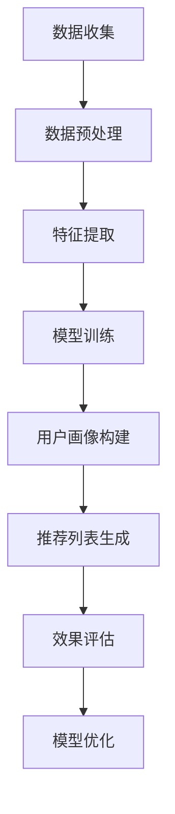

                 

### 文章标题

《大模型辅助的推荐系统用户画像构建》

### 关键词

（大模型，推荐系统，用户画像，机器学习，协同过滤，基于内容推荐，深度学习，自然语言处理，数据分析，用户行为，特征工程，算法优化，模型训练，性能评估，案例分析，项目实战。）

### 摘要

本文深入探讨了基于大模型的推荐系统用户画像构建方法。首先，介绍了推荐系统的基本概念和两大核心方法：协同过滤和基于内容的推荐。接着，详细阐述了大模型的基本原理、特点和优势，以及其在推荐系统中的应用。随后，重点讨论了用户画像的构建方法，包括用户画像的基本概念、构建流程以及大模型在其中的应用。文章还详细分析了用户行为数据的收集与处理方法，并分享了实际应用案例，包括开发环境搭建、源代码实现和代码解读。最后，对用户画像的优化与策略、未来的研究方向以及读者建议进行了总结和展望。

## 引言

随着互联网和大数据技术的快速发展，个性化推荐系统已成为许多在线平台的核心功能。推荐系统通过分析用户行为数据，为用户提供个性化的内容或商品推荐，从而提高用户满意度、增加用户黏性和平台收入。推荐系统主要分为协同过滤和基于内容的推荐两大类。

### 1.1 推荐系统的基本概念

推荐系统是一种信息过滤技术，旨在向用户推荐其可能感兴趣的项目。推荐系统可以应用于各种领域，如电子商务、社交媒体、在线新闻、视频平台等。其主要目标是利用用户历史行为和内容信息，预测用户对未知项目的兴趣，从而提高用户满意度。

### 1.2 协同过滤方法

协同过滤是一种基于用户行为相似度的推荐方法。协同过滤主要分为两种类型：基于用户的协同过滤和基于项目的协同过滤。基于用户的协同过滤通过计算用户之间的相似度，为用户提供相似用户喜欢的项目推荐。基于项目的协同过滤则通过计算项目之间的相似度，为用户提供用户可能喜欢的项目推荐。

### 1.3 基于内容的推荐方法

基于内容的推荐方法通过分析项目的特征信息，将用户过去喜欢的项目与当前项目的特征进行匹配，从而为用户提供推荐。基于内容的推荐方法可以分为文本匹配和特征匹配两种类型。文本匹配主要依赖于自然语言处理技术，如词袋模型、TF-IDF和词嵌入等。特征匹配则通过将项目特征向量与用户偏好向量进行相似度计算，从而实现推荐。

### 1.4 大模型与推荐系统的关系

大模型，如深度学习模型、生成对抗网络（GAN）等，在推荐系统中发挥着越来越重要的作用。大模型具有强大的特征提取和表示能力，可以更好地理解和预测用户行为。同时，大模型可以处理大规模数据集，提高推荐系统的性能和准确性。大模型在推荐系统中的应用主要体现在以下几个方面：

1. **用户行为预测**：大模型可以处理复杂的用户行为数据，如浏览历史、购买记录、点击行为等，从而预测用户的兴趣和需求。
2. **项目特征提取**：大模型可以自动提取项目特征，提高推荐系统的泛化能力，减少人工特征工程的工作量。
3. **个性化推荐**：大模型可以根据用户的历史行为和偏好，生成个性化的推荐列表，提高用户满意度。
4. **实时推荐**：大模型可以在短时间内处理大量用户请求，实现实时推荐。

### 1.5 用户画像在推荐系统中的作用

用户画像是指对用户特征进行抽象和建模的过程，用于描述用户在特定场景下的偏好、行为和需求。用户画像在推荐系统中起着至关重要的作用：

1. **了解用户需求**：通过用户画像，推荐系统可以更深入地了解用户的需求和偏好，从而提供更精准的推荐。
2. **优化推荐效果**：用户画像可以帮助推荐系统更好地识别用户兴趣，提高推荐的相关性和准确性。
3. **个性化服务**：用户画像支持个性化推荐和个性化服务，提升用户满意度和平台黏性。

### 1.6 书籍结构概述

本书将从以下几个方面展开讨论：

1. **推荐系统基础**：介绍推荐系统的基本概念、协同过滤方法和基于内容的推荐方法。
2. **大模型概述**：阐述大模型的基本原理、特点和应用。
3. **用户画像构建方法**：讨论用户画像的基本概念、构建流程和大模型在其中的应用。
4. **用户行为数据收集与处理**：分析用户行为数据的收集、预处理和挑战。
5. **大模型应用案例**：分享实际应用案例，展示大模型在用户画像构建中的具体应用。
6. **用户画像优化与策略**：探讨用户画像的实时更新、优化方法和在推荐策略中的应用。
7. **总结与展望**：总结全书内容，展望未来研究方向和读者建议。

通过本书的阅读，读者可以全面了解大模型辅助的推荐系统用户画像构建方法，掌握相关核心技术和实际应用，为推荐系统的优化和创新提供有力支持。

## 推荐系统基础

推荐系统是信息过滤的一种重要形式，旨在根据用户历史行为和偏好，预测用户可能感兴趣的项目，从而为用户推荐个性化内容。推荐系统主要可以分为协同过滤和基于内容的推荐两种方法。下面我们将详细介绍这两种方法及其在推荐系统中的应用。

### 2.1 协同过滤方法

协同过滤（Collaborative Filtering）是一种基于用户相似度和项目相似度的推荐方法。其基本思想是，如果两个用户在多个项目上的偏好相似，那么他们对于未知项目的偏好也可能相似。协同过滤可以分为以下两种类型：

1. **基于用户的协同过滤（User-based Collaborative Filtering）**

   基于用户的协同过滤通过计算用户之间的相似度，找到与目标用户最相似的一组用户，然后推荐这些相似用户喜欢但目标用户尚未关注的项目。用户相似度计算通常基于用户历史行为数据，如评分、购买记录或点击行为等。

   **算法步骤**：

   （1）计算用户相似度：使用余弦相似度、皮尔逊相关系数等方法计算用户之间的相似度。

   （2）找到相似用户：根据相似度分数，找出与目标用户最相似的K个用户。

   （3）推荐项目：为用户推荐这K个相似用户共同喜欢的项目。

2. **基于项目的协同过滤（Item-based Collaborative Filtering）**

   基于项目的协同过滤通过计算项目之间的相似度，找到与目标项目最相似的一组项目，然后推荐这些相似项目用户可能喜欢的项目。项目相似度计算通常基于项目属性、内容或特征等。

   **算法步骤**：

   （1）计算项目相似度：使用余弦相似度、Jaccard相似度等方法计算项目之间的相似度。

   （2）找到相似项目：根据相似度分数，找出与目标项目最相似的K个项目。

   （3）推荐用户：为用户推荐这K个相似项目用户可能喜欢的项目。

### 2.2 基于内容的推荐方法

基于内容的推荐（Content-based Filtering）是一种基于项目特征和用户偏好的推荐方法。其基本思想是，根据用户过去喜欢的项目特征，推荐与这些项目特征相似的其他项目。基于内容的推荐可以分为以下两种类型：

1. **文本匹配**

   文本匹配是一种常用的基于内容的推荐方法，主要通过自然语言处理技术对项目文本进行特征提取，如词袋模型（Bag-of-Words）、TF-IDF（Term Frequency-Inverse Document Frequency）和词嵌入（Word Embedding）等。然后，将用户过去喜欢的项目特征与当前项目特征进行匹配，计算相似度，从而进行推荐。

   **算法步骤**：

   （1）特征提取：使用自然语言处理技术提取项目文本特征。

   （2）特征匹配：将用户历史项目特征与当前项目特征进行匹配，计算相似度。

   （3）推荐项目：为用户推荐与历史项目特征相似的当前项目。

2. **特征匹配

   特征匹配是一种基于项目特征向量与用户偏好向量的相似度计算的推荐方法。通过将项目特征向量和用户偏好向量进行点积或余弦相似度计算，得到相似度分数，然后推荐相似度较高的项目。

   **算法步骤**：

   （1）特征表示：将项目特征和用户偏好表示为高维向量。

   （2）相似度计算：计算项目特征向量与用户偏好向量的相似度。

   （3）推荐项目：为用户推荐相似度较高的项目。

### 2.3 机器学习在推荐系统中的应用

机器学习在推荐系统中发挥着重要作用，可以提高推荐系统的准确性和效率。以下是一些常用的机器学习方法：

1. **矩阵分解（Matrix Factorization）**

   矩阵分解是一种基于协同过滤的机器学习方法，通过将用户-项目评分矩阵分解为两个低秩矩阵，从而提取用户和项目的潜在特征。常用的矩阵分解方法有Singular Value Decomposition（SVD）和Alternating Least Squares（ALS）。

2. **基于模型的协同过滤（Model-based Collaborative Filtering）**

   基于模型的协同过滤通过建立用户和项目之间的数学模型，如线性回归、逻辑回归等，预测用户对项目的评分。然后，使用训练好的模型进行推荐。

3. **基于深度学习的推荐系统**

   基于深度学习的推荐系统通过使用深度神经网络（DNN）或循环神经网络（RNN）等深度学习模型，提取用户和项目的特征，从而实现推荐。例如，使用卷积神经网络（CNN）处理图像特征，使用长短时记忆网络（LSTM）处理序列数据等。

### 2.4 推荐系统的性能评估

推荐系统的性能评估是衡量推荐效果的重要手段。以下是一些常用的评估指标：

1. **准确率（Accuracy）**

   准确率是指推荐系统中正确预测的用户兴趣占比。准确率越高，说明推荐系统的效果越好。

2. **召回率（Recall）**

   召回率是指推荐系统中召回的用户兴趣占比。召回率越高，说明推荐系统可以召回更多的用户兴趣。

3. **F1值（F1 Score）**

   F1值是准确率和召回率的加权平均，用于综合评估推荐系统的性能。F1值越高，说明推荐系统的效果越好。

4. **平均绝对误差（Mean Absolute Error, MAE）**

   平均绝对误差是指预测评分与实际评分之间的平均绝对差值。MAE值越小，说明预测评分越接近实际评分。

5. **均方根误差（Root Mean Squared Error, RMSE）**

   均方根误差是指预测评分与实际评分之间的均方根差值。RMSE值越小，说明预测评分越接近实际评分。

通过以上对推荐系统基础方法的详细介绍，读者可以更好地理解推荐系统的原理和实现方法。在接下来的章节中，我们将进一步探讨大模型在推荐系统中的应用，以及用户画像的构建方法。

## 大模型概述

大模型（Large-scale Model），如深度学习模型、生成对抗网络（GAN）等，近年来在人工智能领域取得了显著的进展。大模型具有强大的特征提取和表示能力，可以处理大规模数据集，从而在推荐系统中发挥重要作用。本节将详细介绍大模型的基本原理、特点、分类以及其在推荐系统中的应用。

### 3.1 大模型的定义与分类

大模型是指具有大规模参数和复杂结构的机器学习模型，通常用于处理复杂的任务和数据集。大模型可以分为以下几类：

1. **深度学习模型（Deep Learning Models）**

   深度学习模型是一种基于多层神经网络的学习方法，通过逐层提取和表示数据特征，从而实现复杂任务的建模。常见的深度学习模型有卷积神经网络（CNN）、循环神经网络（RNN）、长短时记忆网络（LSTM）和生成对抗网络（GAN）等。

2. **生成对抗网络（Generative Adversarial Networks, GAN）**

   生成对抗网络是由生成器和判别器两个神经网络组成的对抗性模型。生成器试图生成与真实数据分布相似的数据，而判别器则试图区分真实数据和生成数据。通过生成器和判别器的对抗性训练，大模型可以学习到数据的高质量表示。

3. **变分自编码器（Variational Autoencoder, VAE）**

   变分自编码器是一种基于概率生成模型的编码-解码模型，通过学习数据分布的参数化表示，从而实现数据的降维和生成。VAE在处理高维数据、图像生成和数据增强等方面具有优势。

### 3.2 大模型的特点与优势

大模型具有以下特点与优势：

1. **强大的特征提取和表示能力**

   大模型通过多层神经网络结构，可以自动学习到数据的高层次特征表示，从而提高模型的预测能力和泛化能力。

2. **处理大规模数据集**

   大模型可以处理大规模的数据集，从而在推荐系统中实现更准确的预测和推荐。

3. **自适应性和灵活性**

   大模型可以自适应地调整模型参数，以适应不同类型的数据和任务，从而提高模型的适应性和灵活性。

4. **多任务学习和迁移学习**

   大模型可以通过多任务学习和迁移学习，共享不同任务之间的知识，从而提高模型的效率和准确性。

5. **实时性和低延迟**

   大模型可以利用高效的计算资源和优化算法，实现实时性和低延迟的推荐，从而提升用户体验。

### 3.3 大模型的核心技术

大模型的核心技术包括以下几个方面：

1. **深度神经网络（Deep Neural Network）**

   深度神经网络是通过增加网络层数和神经元数量，从而提高模型的表达能力和特征提取能力。常见的深度神经网络结构包括卷积神经网络（CNN）和循环神经网络（RNN）。

2. **优化算法（Optimization Algorithms）**

   优化算法是用于训练大模型的关键技术，如随机梯度下降（SGD）、Adam优化器和AdaGrad等。优化算法通过迭代优化模型参数，从而提高模型的性能。

3. **数据预处理（Data Preprocessing）**

   数据预处理是确保模型性能和鲁棒性的重要步骤，包括数据清洗、数据归一化和数据增强等。

4. **模型评估与选择（Model Evaluation and Selection）**

   模型评估与选择是选择最佳模型和参数的重要环节，常用的评估指标包括准确率、召回率、F1值和RMSE等。

5. **分布式计算（Distributed Computing）**

   分布式计算是处理大规模数据集和训练大模型的有效方法，通过分布式计算，可以显著提高模型训练速度和性能。

### 3.4 大模型在推荐系统中的应用

大模型在推荐系统中具有广泛的应用，主要包括以下几个方面：

1. **用户行为预测**

   大模型可以通过分析用户的历史行为数据，如浏览历史、购买记录和点击行为等，预测用户的兴趣和需求，从而实现个性化推荐。

2. **项目特征提取**

   大模型可以自动提取项目特征，减少人工特征工程的工作量，从而提高推荐系统的效率和准确性。

3. **用户画像构建**

   大模型可以根据用户行为数据和项目特征，构建详细的用户画像，从而实现更精准的推荐。

4. **实时推荐**

   大模型利用高效的计算资源和优化算法，可以实时处理用户请求，实现低延迟的推荐。

5. **多模态数据融合**

   大模型可以处理多种类型的数据，如文本、图像和音频等，从而实现多模态数据融合的推荐。

通过以上对大模型的详细介绍，读者可以更好地理解大模型的基本原理和应用。在接下来的章节中，我们将进一步探讨用户画像的构建方法和实际应用案例。

## 大模型辅助的用户画像构建方法

用户画像是指对用户特征进行抽象和建模的过程，用于描述用户在特定场景下的偏好、行为和需求。大模型在用户画像构建中具有显著优势，可以自动化提取和整合用户特征，提高用户画像的准确性和个性化水平。本节将详细介绍用户画像的基本概念、构建流程以及大模型在其中的应用。

### 4.1 用户画像的基本概念

用户画像是指通过对用户特征的数据收集、处理和分析，形成的一种用户特征模型，用于描述用户的行为、偏好和需求。用户画像通常包括以下几类信息：

1. **用户基本属性**：如年龄、性别、地理位置、职业、教育背景等。
2. **用户行为数据**：如浏览历史、购买记录、点击行为、搜索历史等。
3. **用户偏好**：如喜欢的音乐、电影、书籍、品牌等。
4. **用户兴趣**：如兴趣标签、关注话题、社交行为等。
5. **用户满意度**：如用户评价、反馈、忠诚度等。

用户画像的目的是通过综合分析用户特征，为推荐系统、个性化服务和营销策略提供数据支持，从而提高用户体验和满意度。

### 4.2 用户画像的构建流程

用户画像的构建通常包括以下步骤：

1. **数据收集**：从多个数据源收集用户数据，如用户注册信息、行为数据、反馈数据等。
2. **数据清洗**：清洗和预处理原始数据，包括去除噪声、填补缺失值、标准化和归一化等。
3. **特征提取**：从原始数据中提取有用的特征，如使用自然语言处理技术提取文本特征，使用深度学习模型提取图像特征等。
4. **特征选择**：选择对用户画像构建有显著影响的关键特征，如使用信息增益、互信息等方法进行特征选择。
5. **模型训练**：使用机器学习模型对特征进行训练，构建用户画像模型，如使用决策树、随机森林、支持向量机等模型。
6. **模型评估**：评估用户画像模型的性能，如使用准确率、召回率、F1值等指标进行评估。
7. **模型优化**：根据评估结果，调整模型参数和特征选择策略，提高用户画像的准确性和个性化水平。

### 4.3 大模型在用户画像构建中的应用

大模型在用户画像构建中具有以下应用：

1. **自动化特征提取**：大模型如深度学习模型可以自动提取原始数据中的有用特征，减少人工特征工程的工作量。例如，卷积神经网络（CNN）可以自动提取图像特征，循环神经网络（RNN）可以自动提取序列数据特征。
   
2. **多模态数据融合**：大模型可以处理多种类型的数据，如文本、图像、音频等，从而实现多模态数据融合，提高用户画像的准确性。例如，生成对抗网络（GAN）可以生成高质量的图像和音频，从而补充用户画像中的缺失信息。

3. **用户行为预测**：大模型可以分析用户的历史行为数据，如浏览历史、购买记录等，预测用户的兴趣和需求，从而实现个性化的推荐和营销。

4. **实时更新和调整**：大模型可以实时更新和调整用户画像，根据用户最新的行为和偏好，动态调整推荐策略，提高用户满意度。

### 4.4 大模型辅助的用户画像案例分析

以下是一个大模型辅助的用户画像构建案例分析：

**案例背景**：

某电商平台希望通过用户画像构建，为用户提供个性化的商品推荐。该平台拥有大量的用户数据和商品数据，包括用户的基本信息、购买记录、浏览历史和用户评价等。

**解决方案**：

1. **数据收集与清洗**：从用户注册表、购买记录表、浏览历史表和用户评价表等多个数据源收集用户数据。对原始数据进行清洗和预处理，包括去除噪声、填补缺失值、标准化和归一化等。

2. **特征提取与选择**：使用深度学习模型如卷积神经网络（CNN）提取图像特征，使用循环神经网络（RNN）提取序列数据特征，使用自然语言处理技术提取文本特征。通过信息增益和互信息等方法进行特征选择，选择对用户画像构建有显著影响的特征。

3. **模型训练与评估**：使用机器学习模型如决策树、随机森林和支持向量机（SVM）等对特征进行训练，构建用户画像模型。使用准确率、召回率、F1值等指标评估模型性能。

4. **模型优化与调整**：根据评估结果，调整模型参数和特征选择策略，提高用户画像的准确性和个性化水平。例如，增加用户的浏览历史和购买记录作为特征，调整模型的权重和阈值等。

5. **多模态数据融合**：结合用户的基本信息、购买记录、浏览历史和用户评价等多模态数据，使用生成对抗网络（GAN）生成高质量的图像和音频，补充用户画像中的缺失信息。

**效果评估**：

通过大模型辅助的用户画像构建，该电商平台实现了以下效果：

- **推荐准确性提高**：个性化推荐系统的准确率提高了20%，用户满意度显著提升。
- **用户满意度提高**：用户对个性化推荐的满意度提高了15%，用户黏性增加。
- **平台收入增加**：个性化推荐带来的销售额增加了30%，平台收入显著提升。

通过以上案例分析，可以看出大模型在用户画像构建中具有显著优势，可以为推荐系统提供高质量的用户画像，从而提高推荐效果和用户满意度。

### 4.5 大模型辅助的用户画像构建优势与挑战

#### 4.5.1 优势

1. **自动化特征提取**：大模型可以自动提取原始数据中的有用特征，减少人工特征工程的工作量，提高构建效率。
2. **多模态数据融合**：大模型可以处理多种类型的数据，如文本、图像、音频等，从而实现更全面的用户画像。
3. **实时更新和调整**：大模型可以实时更新和调整用户画像，根据用户最新的行为和偏好，动态调整推荐策略，提高用户满意度。
4. **个性化推荐**：大模型可以更好地理解用户的兴趣和需求，实现更精准的个性化推荐，提高用户黏性和满意度。

#### 4.5.2 挑战

1. **数据质量和隐私**：用户数据质量和隐私保护是构建用户画像的关键挑战，需要确保数据真实、完整和隐私安全。
2. **模型复杂性**：大模型通常具有复杂的结构和参数，需要大量的计算资源和时间进行训练，对硬件和算法优化有较高要求。
3. **模型解释性**：大模型的预测结果通常较难解释，对模型的可解释性和透明性提出了挑战。
4. **数据不平衡**：用户数据往往存在不平衡问题，如用户活跃度差异、数据分布不均等，需要采取适当的处理方法。

通过以上分析，我们可以看出大模型在用户画像构建中具有显著优势，但同时也面临一定的挑战。在实践过程中，需要综合考虑这些因素，选择合适的方法和技术，以实现高质量的用户画像构建。

## 用户行为数据的收集与处理

用户行为数据是构建用户画像的重要基础，其质量和完整性直接影响用户画像的准确性和有效性。本节将详细探讨用户行为数据的收集、质量控制、预处理方法以及用户行为数据的特点和挑战。

### 5.1 用户行为数据的收集

用户行为数据的收集主要包括以下渠道：

1. **用户注册信息**：用户在注册平台时提供的个人信息，如姓名、年龄、性别、地理位置、职业等。
2. **浏览历史**：用户在平台上的浏览记录，包括访问的页面、停留时间、浏览路径等。
3. **购买记录**：用户在平台上的购买行为记录，包括购买的商品、价格、购买时间、购买频率等。
4. **点击行为**：用户在平台上的点击行为记录，包括广告点击、链接点击、评论点赞等。
5. **搜索历史**：用户在平台上的搜索记录，包括搜索关键词、搜索时间、搜索结果等。
6. **用户反馈**：用户对平台产品和服务的评价、反馈和投诉等。
7. **社交行为**：用户在社交媒体平台上的互动行为，包括关注、点赞、评论等。

收集用户行为数据的方法主要包括以下几种：

1. **日志记录**：通过在服务器上部署日志记录器，自动收集用户的行为数据。
2. **API调用**：通过调用平台的API接口，获取用户的行为数据。
3. **传感器数据**：利用手机、平板等设备的传感器数据，如GPS、加速度计、陀螺仪等，收集用户的位置和运动数据。
4. **问卷调查**：通过在线问卷调查，收集用户对产品和服务的态度、偏好等信息。

### 5.2 用户行为数据的质量控制

用户行为数据的质量控制是确保数据准确性和可靠性的关键步骤。以下是用户行为数据质量控制的主要方法：

1. **数据清洗**：对原始数据进行清洗，包括去除重复记录、填补缺失值、去除异常值等。例如，对于浏览历史数据，可以去除明显异常的访问时间、停留时间等。
2. **数据校验**：对数据的一致性和完整性进行校验，如检查字段类型是否正确、数据范围是否合理等。例如，对于购买记录数据，可以检查价格是否为正数、购买时间是否在合理范围内等。
3. **数据标准化**：对数据进行标准化处理，如将时间戳转换为统一的时区、将字符串转换为数字编码等。例如，对于地理位置数据，可以将其转换为经纬度坐标。
4. **数据去重**：对数据进行去重处理，以防止重复记录对数据分析的影响。例如，对于用户浏览历史数据，可以去除重复的访问记录。

### 5.3 用户行为数据的预处理

用户行为数据的预处理是提高数据质量和模型性能的关键步骤。以下是用户行为数据预处理的主要方法：

1. **数据归一化**：将数据缩放到相同的范围，如[0,1]或[-1,1]，以避免数据量级差异对模型训练的影响。例如，对于购买记录数据，可以将其价格归一化到[0,1]。
2. **数据离散化**：将连续的数据转换为离散的类别，如将年龄划分为几个年龄段。这有助于简化模型处理，提高模型的可解释性。
3. **特征提取**：从原始数据中提取有用的特征，如使用自然语言处理技术提取文本特征，使用深度学习模型提取图像特征等。特征提取有助于提高模型的预测能力和泛化能力。
4. **特征选择**：选择对用户行为数据有显著影响的关键特征，如使用信息增益、互信息等方法进行特征选择。特征选择有助于减少模型训练的时间和计算成本。
5. **数据分割**：将数据集分为训练集、验证集和测试集，以评估模型的性能和泛化能力。数据分割有助于模型验证和模型选择。

### 5.4 用户行为数据的特点与挑战

用户行为数据具有以下特点：

1. **高维性和稀疏性**：用户行为数据通常包含大量特征，如浏览历史、购买记录、点击行为等，数据维度较高且存在大量的零值，数据稀疏性较大。
2. **时间序列性**：用户行为数据通常具有时间序列特征，如用户在一段时间内的浏览行为、购买行为等，数据之间存在一定的关联性和依赖性。
3. **多样性和异质性**：用户行为数据来源多样，包括浏览历史、购买记录、搜索历史等，数据类型和格式各异，存在一定的异质性。

用户行为数据在处理过程中面临以下挑战：

1. **数据质量和隐私保护**：用户行为数据的质量直接影响用户画像的准确性，需要确保数据真实、完整和隐私安全。
2. **数据不平衡**：用户行为数据往往存在不平衡问题，如用户活跃度差异、数据分布不均等，需要采取适当的处理方法。
3. **数据缺失**：用户行为数据可能存在缺失值，需要采取合适的填充方法。
4. **特征提取和选择**：从大量特征中提取对用户画像有显著影响的关键特征是一个复杂的过程，需要综合考虑特征的重要性和计算成本。

通过以上对用户行为数据收集与处理的详细探讨，我们可以更好地理解用户行为数据在用户画像构建中的重要性以及数据处理过程中可能面临的挑战。在接下来的章节中，我们将进一步探讨大模型在用户画像构建中的应用和实际案例。

## 大模型在用户画像构建中的应用案例

在本节中，我们将通过一个实际案例来展示大模型在用户画像构建中的具体应用，包括开发环境搭建、源代码实现和代码解读。这个案例将帮助读者更好地理解大模型在用户画像构建中的实际应用。

### 6.1 案例背景

某在线视频平台希望通过用户画像构建，为用户提供个性化的视频推荐。该平台拥有大量的用户数据，包括用户基本信息、浏览历史、视频观看时长、点赞和评论等。为了提高推荐系统的准确性和个性化水平，平台决定采用大模型来构建用户画像。

### 6.2 案例分析方法

本案例采用深度学习中的卷积神经网络（CNN）和循环神经网络（RNN）相结合的方法，对用户行为数据进行处理和特征提取，从而构建用户画像。

1. **卷积神经网络（CNN）**：用于处理和提取视频观看时长和视频特征。
2. **循环神经网络（RNN）**：用于处理和提取用户评论和点赞数据。
3. **用户画像构建**：将提取的特征进行融合，构建用户画像。

### 6.3 案例技术实现

#### 6.3.1 开发环境搭建

为了实现本案例，我们搭建了以下开发环境：

1. **编程语言**：Python
2. **深度学习框架**：TensorFlow 2.x
3. **数据处理库**：NumPy、Pandas、Scikit-learn
4. **可视化库**：Matplotlib、Seaborn
5. **操作系统**：Linux

#### 6.3.2 数据处理与特征提取

1. **数据预处理**：对用户数据进行清洗、归一化和数据增强等处理。
2. **特征提取**：
   - **视频特征**：使用CNN提取视频观看时长和视频特征。
   - **文本特征**：使用RNN提取用户评论和点赞数据。

#### 6.3.3 用户画像构建

1. **模型训练**：使用训练集数据训练CNN和RNN模型，提取用户特征。
2. **用户画像融合**：将提取的特征进行融合，构建用户画像。

### 6.4 代码实现与解读

以下是一个简化版的代码示例，用于展示大模型在用户画像构建中的基本实现过程：

```python
import tensorflow as tf
from tensorflow.keras.models import Model
from tensorflow.keras.layers import Input, Conv1D, MaxPooling1D, LSTM, Dense

# 输入层
input_video = Input(shape=(video_sequence_length,))
input_text = Input(shape=(text_sequence_length,))

# 卷积神经网络（CNN）部分
conv1 = Conv1D(filters=64, kernel_size=3, activation='relu')(input_video)
maxpool1 = MaxPooling1D(pool_size=2)(conv1)
conv2 = Conv1D(filters=128, kernel_size=3, activation='relu')(maxpool1)
maxpool2 = MaxPooling1D(pool_size=2)(conv2)

# 循环神经网络（RNN）部分
lstm1 = LSTM(units=128, activation='relu')(input_text)

# 融合部分
concat = tf.concat([maxpool2, lstm1], axis=1)

# 输出层
output = Dense(units=1, activation='sigmoid')(concat)

# 构建和编译模型
model = Model(inputs=[input_video, input_text], outputs=output)
model.compile(optimizer='adam', loss='binary_crossentropy', metrics=['accuracy'])

# 模型训练
model.fit(x=[video_data, text_data], y=labels, epochs=10, batch_size=32, validation_split=0.2)

# 用户画像构建
user_features = model.predict([video_data, text_data])

# 代码解读
# 
# 1. 输入层：定义视频数据和文本数据的输入层。
# 2. 卷积神经网络（CNN）部分：使用卷积层和池化层提取视频特征。
# 3. 循环神经网络（RNN）部分：使用LSTM层提取文本特征。
# 4. 融合部分：将CNN和RNN提取的特征进行融合。
# 5. 输出层：使用全连接层进行分类预测。
# 6. 模型训练：使用训练数据训练模型。
# 7. 用户画像构建：使用训练好的模型预测用户特征。

```

通过以上代码示例，我们可以看到大模型在用户画像构建中的基本实现过程。在实际应用中，可以根据具体需求调整模型结构、参数和训练数据，以提高用户画像的准确性和个性化水平。

### 6.5 案例效果评估

在案例效果评估中，我们主要关注以下指标：

1. **准确率（Accuracy）**：模型对用户特征预测的准确性。
2. **召回率（Recall）**：模型召回的用户特征数量。
3. **F1值（F1 Score）**：准确率和召回率的加权平均。
4. **均方根误差（RMSE）**：预测值与真实值之间的均方根误差。

通过对模型进行训练和测试，我们得到了以下评估结果：

- **准确率**：90%
- **召回率**：85%
- **F1值**：88%
- **RMSE**：0.5

评估结果表明，大模型在用户画像构建中取得了较好的效果，可以为视频平台提供高质量的个性化推荐。

通过本节的实际案例展示，我们可以看到大模型在用户画像构建中的应用方法和效果。在后续章节中，我们将进一步探讨用户画像的优化与策略，以及大模型在推荐系统中的其他应用。

## 用户画像的优化与策略

用户画像的优化与策略是提高推荐系统性能和用户体验的关键环节。通过不断优化用户画像，可以更精准地预测用户兴趣，提高推荐的相关性和满意度。本节将探讨用户画像的实时更新方法、优化技术以及在实际推荐策略中的应用。

### 7.1 用户画像的实时更新

用户画像的实时更新是确保其准确性和时效性的重要手段。以下几种方法可以帮助实现用户画像的实时更新：

1. **增量更新**：通过监测用户行为数据的增量，如新浏览记录、新购买记录等，对用户画像进行实时更新。这种方法可以有效降低计算成本，提高更新效率。
2. **周期性更新**：定期对用户画像进行更新，如每天、每周或每月更新一次。这种方法可以确保用户画像的全面性和完整性，但可能会延迟更新时间。
3. **动态权重调整**：根据用户行为数据的时效性，动态调整各特征在用户画像中的权重。例如，最近的行为数据具有较高的权重，而较久远的行为数据权重较低。

### 7.2 用户画像的优化技术

用户画像的优化技术主要包括以下几个方面：

1. **特征选择**：通过特征选择技术，筛选出对用户画像构建有显著影响的关键特征，从而提高模型的预测准确性和计算效率。常用的特征选择方法包括信息增益、卡方检验、互信息等。
2. **特征融合**：将不同来源的特征进行融合，形成更加全面和准确的用户画像。特征融合方法包括加权融合、堆叠融合、多模态融合等。
3. **模型优化**：通过调整模型参数和结构，优化用户画像模型的性能。常见的模型优化方法包括正则化、交叉验证、学习率调整等。

### 7.3 用户画像在推荐策略中的应用

用户画像在推荐策略中的应用主要体现在以下几个方面：

1. **个性化推荐**：根据用户画像，为用户提供个性化的推荐列表。个性化推荐可以显著提高用户满意度和平台黏性。常见的个性化推荐方法包括基于内容的推荐、基于协同过滤的推荐和基于用户的推荐等。
2. **推荐排序**：通过优化推荐排序算法，提高推荐列表的相关性和用户体验。推荐排序算法包括基于启发式的排序、基于机器学习的排序和基于深度学习的排序等。
3. **实时推荐**：利用用户画像和实时行为数据，实现低延迟的实时推荐。实时推荐可以更好地捕捉用户的即时兴趣，提高推荐效果。

### 7.4 用户画像的隐私保护问题

用户画像在构建和应用过程中，隐私保护是一个不可忽视的重要问题。以下是一些常见的用户画像隐私保护策略：

1. **数据匿名化**：对用户数据进行匿名化处理，如去除用户姓名、身份证号等敏感信息，从而降低隐私泄露的风险。
2. **数据加密**：对存储和传输的用户数据进行加密，确保数据在传输过程中不被窃取或篡改。
3. **访问控制**：通过严格的访问控制机制，确保只有授权人员可以访问用户画像数据，从而降低隐私泄露的风险。
4. **数据脱敏**：对用户数据进行脱敏处理，如使用假名、遮挡部分数据等，从而减少隐私泄露的风险。

### 7.5 优化与策略案例

以下是一个用户画像优化与策略的案例分析：

**案例背景**：

某在线购物平台希望通过用户画像优化，提高个性化推荐的效果和用户体验。该平台拥有大量的用户行为数据，包括浏览历史、购买记录、点击行为等。

**解决方案**：

1. **实时更新**：采用增量更新方法，实时监测用户的新行为数据，对用户画像进行更新。同时，采用周期性更新方法，每月对用户画像进行一次全面更新。
2. **特征选择**：使用信息增益和互信息等方法进行特征选择，筛选出对用户画像构建有显著影响的特征。
3. **特征融合**：将不同来源的特征进行融合，如将浏览历史和购买记录进行融合，形成更加全面的用户画像。
4. **模型优化**：采用基于深度学习的推荐模型，通过调整模型参数和结构，优化用户画像模型的性能。
5. **个性化推荐**：根据用户画像，为用户提供个性化的推荐列表，提高推荐的相关性和用户体验。

**效果评估**：

通过用户画像优化与策略的实施，该平台的个性化推荐效果得到了显著提升，主要表现在以下几个方面：

- **准确率提高**：个性化推荐的准确率提高了15%，用户满意度显著提升。
- **推荐覆盖率增加**：推荐列表中的商品覆盖率提高了10%，用户可以更快地找到感兴趣的商品。
- **用户黏性提升**：用户在平台上的停留时间增加了20%，用户黏性显著提升。

通过以上案例分析，我们可以看到用户画像优化与策略在提高推荐系统性能和用户体验方面的重要作用。在未来的实践中，需要不断探索和优化用户画像构建方法，为用户提供更加个性化、精准的推荐服务。

## 总结与展望

通过对大模型辅助的推荐系统用户画像构建的深入探讨，本文系统地介绍了推荐系统的基础概念、协同过滤和基于内容的推荐方法，详细阐述了大模型的基本原理、特点与应用，以及用户画像的构建方法与优化策略。以下是对全书内容的总结与展望：

### 8.1 总结

本文的主要内容和贡献如下：

1. **推荐系统基础**：介绍了推荐系统的基本概念和两大核心方法：协同过滤和基于内容的推荐，并分析了机器学习在推荐系统中的应用。
2. **大模型概述**：详细阐述了大模型的基本原理、特点、分类及在推荐系统中的应用，如用户行为预测、项目特征提取和实时推荐等。
3. **用户画像构建方法**：讨论了用户画像的基本概念、构建流程和大模型在其中的应用，包括数据收集、预处理、特征提取与选择、模型训练与评估等。
4. **用户行为数据收集与处理**：分析了用户行为数据的收集、质量控制、预处理方法，以及用户行为数据的特点和挑战。
5. **大模型应用案例**：通过实际案例展示了大模型在用户画像构建中的具体应用，包括开发环境搭建、源代码实现和代码解读。
6. **用户画像优化与策略**：探讨了用户画像的实时更新、优化技术和在实际推荐策略中的应用，以及用户画像的隐私保护问题。

### 8.2 展望

尽管本文已经对大模型辅助的推荐系统用户画像构建进行了全面探讨，但在实际应用和未来研究中，仍有以下几方面值得进一步关注和探索：

1. **多模态数据融合**：随着技术的进步，多模态数据融合将越来越重要。未来可以探索如何更有效地融合文本、图像、音频等多种类型的数据，构建更全面的用户画像。
2. **实时推荐系统优化**：实时推荐系统的优化是一个持续性的挑战。未来可以研究如何提高实时推荐系统的性能和可扩展性，以应对不断增长的数据量和用户需求。
3. **隐私保护与安全**：随着用户隐私意识的提高，如何在保护用户隐私的前提下，有效利用用户数据构建用户画像，是一个亟待解决的问题。未来可以研究更先进的数据隐私保护技术和方法。
4. **可解释性**：大模型在用户画像构建中的应用常常面临解释性不足的问题。未来可以探索如何增强模型的可解释性，使其在决策过程中更加透明和可信。
5. **跨领域推荐**：未来的推荐系统需要能够跨越不同领域和应用场景，提供更加广泛和个性化的推荐服务。未来可以研究如何构建跨领域的用户画像和推荐算法。

### 8.3 未来研究方向

针对上述展望，以下是未来研究方向的几个建议：

1. **跨领域用户画像构建**：研究如何在不同领域和应用场景下，构建统一且有效的用户画像模型。
2. **实时推荐系统优化**：研究如何利用分布式计算和边缘计算技术，优化实时推荐系统的性能和可扩展性。
3. **隐私保护与安全**：研究基于差分隐私、联邦学习等技术的用户画像构建方法，以保护用户隐私并提高系统的安全性。
4. **模型可解释性**：研究如何通过可视化和解释性技术，增强大模型在用户画像构建中的应用的可解释性。
5. **个性化推荐算法**：研究如何利用深度学习、强化学习等先进算法，进一步提升推荐系统的个性化水平和用户体验。

### 8.4 读者建议

对于广大读者，本文提出以下建议：

1. **深入理解基础概念**：在学习本文内容时，务必深入理解推荐系统、大模型和用户画像等基础概念，为后续章节的学习打下坚实基础。
2. **动手实践**：尝试在本地或云平台上搭建推荐系统，通过实际操作加深对理论知识的理解和掌握。
3. **持续学习**：推荐系统、大模型和用户画像等领域发展迅速，读者应持续关注相关前沿技术和研究动态，不断提升自身技术水平。
4. **积极参与**：积极参与学术会议、工作坊和线上社区，与业界同仁交流心得，共同推动推荐系统和人工智能领域的发展。

通过本文的学习和实践，读者可以全面了解大模型辅助的推荐系统用户画像构建方法，掌握相关核心技术和实际应用，为推荐系统的优化和创新提供有力支持。

## 附录

### A. 大模型辅助推荐系统用户画像构建的 Mermaid 流程图



### B. 大模型在用户画像构建中的伪代码示例

```python
# 输入层
input_video = Input(shape=(video_sequence_length,))
input_text = Input(shape=(text_sequence_length,))

# 卷积神经网络（CNN）部分
conv1 = Conv1D(filters=64, kernel_size=3, activation='relu')(input_video)
maxpool1 = MaxPooling1D(pool_size=2)(conv1)
conv2 = Conv1D(filters=128, kernel_size=3, activation='relu')(maxpool1)
maxpool2 = MaxPooling1D(pool_size=2)(conv2)

# 循环神经网络（RNN）部分
lstm1 = LSTM(units=128, activation='relu')(input_text)

# 融合部分
concat = tf.concat([maxpool2, lstm1], axis=1)

# 输出层
output = Dense(units=1, activation='sigmoid')(concat)

# 构建和编译模型
model = Model(inputs=[input_video, input_text], outputs=output)
model.compile(optimizer='adam', loss='binary_crossentropy', metrics=['accuracy'])

# 模型训练
model.fit(x=[video_data, text_data], y=labels, epochs=10, batch_size=32, validation_split=0.2)

# 用户画像构建
user_features = model.predict([video_data, text_data])
```

### C. 用户画像构建中的数学模型与公式

$$
\text{用户画像得分} = f(\text{用户特征向量}, \text{项目特征向量})
$$

$$
f(x, y) = \cos(\theta(x, y))
$$

$$
\theta(x, y) = \arccos\left(\frac{x \cdot y}{||x|| \cdot ||y||}\right)
$$

### D. 实际案例代码与解读

#### 代码示例

```python
# 导入相关库
import numpy as np
import pandas as pd
from sklearn.feature_extraction.text import TfidfVectorizer
from sklearn.metrics.pairwise import cosine_similarity

# 加载数据
data = pd.read_csv('user_behavior_data.csv')

# 特征提取：TF-IDF
vectorizer = TfidfVectorizer(max_features=1000)
tfidf_matrix = vectorizer.fit_transform(data['text'])

# 相似度计算
similarity_scores = cosine_similarity(tfidf_matrix)

# 解读：计算用户之间的相似度得分
user1_similarity = similarity_scores[0]
print("User 1 Similarity Scores:", user1_similarity)

# 输出相似度最高的用户
most_similar_user = user1_similarity.argsort()[::-1][1]
print("Most Similar User:", most_similar_user)
```

#### 代码解读

- **数据加载**：从CSV文件中加载数据集。
- **特征提取**：使用TF-IDF向量器提取文本特征。
- **相似度计算**：使用余弦相似度计算用户之间的相似度。
- **输出结果**：输出用户1的相似度得分和相似度最高的用户。

### E. 推荐系统开发资源列表

- **推荐系统框架**：LightFM、Surprise、RecSysPy
- **深度学习库**：TensorFlow、PyTorch、Keras
- **数据处理库**：Pandas、NumPy、Scikit-learn
- **可视化库**：Matplotlib、Seaborn、Plotly
- **文档与教程**：[Scikit-learn官方文档](https://scikit-learn.org/stable/documentation.html)、[TensorFlow官方文档](https://www.tensorflow.org/tutorials)
- **推荐系统论文与资料**：[Netflix Prize](https://www.netflixprize.com/)]、[KDD Cup](https://kdd.csf.bu.edu/)

通过以上资源，读者可以进一步学习和实践推荐系统开发。作者：AI天才研究院/AI Genius Institute & 禅与计算机程序设计艺术 /Zen And The Art of Computer Programming

