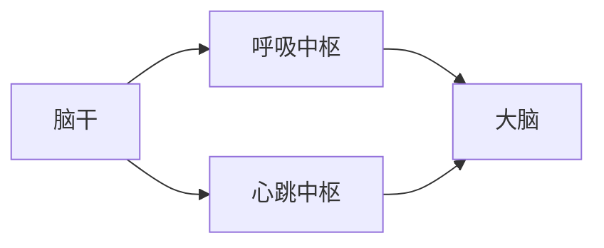
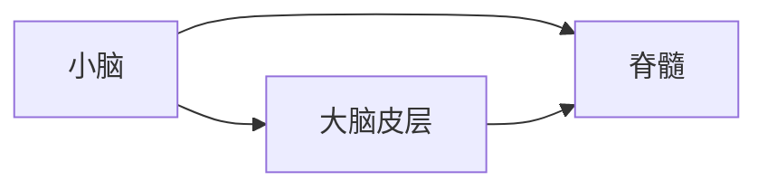
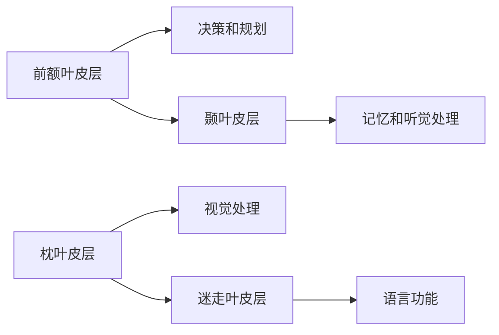
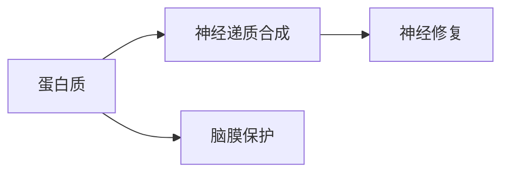
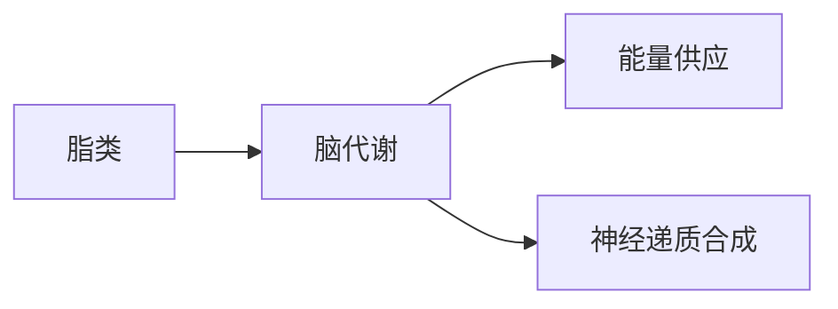
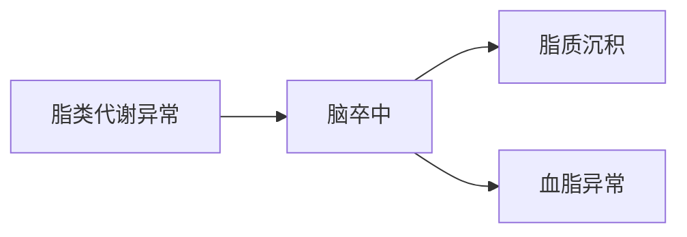
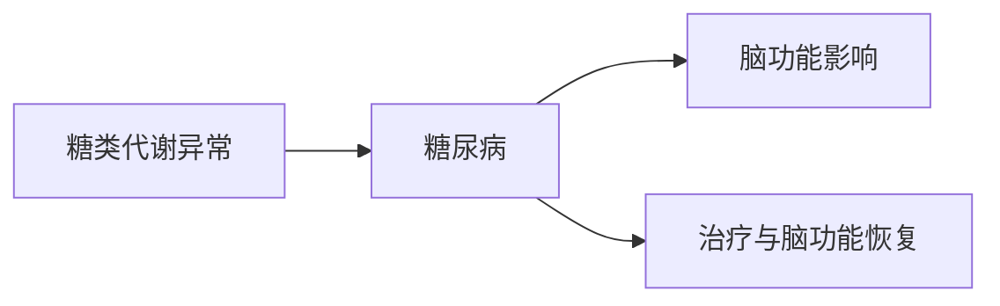

                 

# 大脑：有机化合物的奇迹

## 关键词
大脑，有机化合物，神经递质，蛋白质，脂类，糖类，大脑功能，疾病，营养补充

## 摘要
大脑，作为人类思维和行为的指挥中心，其复杂性和神奇性令人叹为观止。大脑功能的实现离不开各种有机化合物的参与，包括蛋白质、脂类和糖类。本文将深入探讨这些有机化合物在大脑中的重要作用，以及它们与大脑功能之间的联系。同时，本文还将介绍大脑有机化合物的异常与疾病，以及如何通过营养补充来维护大脑健康。

----------------------------------------------------------------

### 《大脑：有机化合物的奇迹》目录大纲

#### 第一部分：大脑的奇迹

- 第1章：大脑的基本结构
- 第2章：有机化合物的介绍
- 第3章：大脑中的有机化合物

#### 第二部分：有机化合物与大脑功能

- 第4章：蛋白质与大脑功能
- 第5章：脂类与大脑功能
- 第6章：糖类与大脑功能

#### 第三部分：大脑的有机化合物与健康

- 第7章：大脑有机化合物的异常与疾病
- 第8章：大脑有机化合物的营养补充

## 附录

- 参考文献
- 相关链接
- 大脑有机化合物检测工具

### 第一部分：大脑的奇迹

### 第1章：大脑的基本结构

大脑是人体最复杂的器官之一，它由多个部分组成，包括脑干、小脑和大脑皮层。每个部分都有其特定的功能和结构。

#### 1.1 大脑的解剖结构

##### 1.1.1 脑干

脑干是连接大脑和脊髓的重要部分，它包含了多个重要的生命中枢，如呼吸中枢和心跳中枢。脑干的神经结构包括上行和下行神经通路，这些通路在大脑和脊髓之间传递信息。



##### 1.1.2 小脑

小脑主要负责协调运动和平衡。它通过接收来自大脑皮层和脊髓的信息，调整肌肉活动，以实现精确的运动。



##### 1.1.3 大脑皮层

大脑皮层是大脑的最外层，它包含了多个脑区，每个脑区都有其特定的功能。大脑皮层可以分为前额叶、颞叶、枕叶和迷走叶。



### 第2章：有机化合物的介绍

有机化合物是构成生命的基础，它们在大脑中发挥着至关重要的作用。主要包括蛋白质、脂类和糖类。

#### 2.1 蛋白质

蛋白质是生命活动的关键，它们在脑中起着结构支持和信息传递的作用。蛋白质的基本组成单位是氨基酸。


#### 2.2 脂类

脂类是构成细胞膜的重要成分，它们在脑中起着保护和支持作用。脂类可以分为脂肪、油脂和胆固醇。


#### 2.3 糖类

糖类是大脑的主要能量来源，它们在脑中起着提供能量和支持神经传递的作用。糖类可以分为单糖、双糖和多糖。


### 第3章：大脑中的有机化合物

大脑中的有机化合物发挥着至关重要的作用，它们对大脑的功能和健康有着深远的影响。

#### 3.1 蛋白质在脑中的功能

蛋白质在脑中起着多种作用，包括神经递质的合成、神经修复和脑膜的保护。



#### 3.2 脂类在脑中的功能

脂类在脑中起着保护和支持作用，它们是脑膜的重要组成部分，对大脑的健康至关重要。


#### 3.3 糖类在脑中的功能

糖类在脑中起着提供能量和支持神经传递的作用，它们对大脑的功能和健康有着重要的影响。


### 第二部分：有机化合物与大脑功能

#### 第4章：蛋白质与大脑功能

蛋白质是大脑的重要组成部分，它们在大脑的各个功能中发挥着关键作用。

##### 4.1 蛋白质与学习记忆

蛋白质在学习和记忆过程中起着重要作用，它们参与了记忆的形成和维持。


##### 4.2 蛋白质与神经修复

蛋白质在神经修复过程中起着关键作用，它们促进了神经纤维和神经细胞的再生。


#### 第5章：脂类与大脑功能

脂类是大脑细胞膜的重要组成部分，它们在大脑的多个功能中发挥着关键作用。

##### 5.1 脂类与脑膜功能

脑膜是保护大脑的重要结构，脂类是其主要成分，对大脑的健康至关重要。


##### 5.2 脂类与脑代谢

脂类参与了大脑的代谢过程，对大脑的能量供应和神经递质的合成有着重要影响。



#### 第6章：糖类与大脑功能

糖类是大脑的主要能量来源，它们在大脑的多个功能中发挥着关键作用。

##### 6.1 糖类与脑能量代谢

糖类是大脑的主要能量来源，通过代谢产生能量，支持大脑的正常功能。


##### 6.2 糖类与神经递质的合成

糖类参与了神经递质的合成，对大脑的信息传递和功能调节有着重要影响。


### 第三部分：大脑的有机化合物与健康

#### 第7章：大脑有机化合物的异常与疾病

大脑有机化合物的异常与疾病密切相关，了解这些异常与疾病有助于预防和治疗相关疾病。

##### 7.1 蛋白质代谢异常与疾病

蛋白质代谢异常可能导致神经退行性疾病，如肌萎缩性侧索硬化症和阿尔茨海默病。


##### 7.2 脂类代谢异常与疾病

脂类代谢异常可能导致脑卒中等疾病，对大脑健康构成威胁。



##### 7.3 糖类代谢异常与疾病

糖类代谢异常可能导致糖尿病等疾病，对大脑健康产生不利影响。



#### 第8章：大脑有机化合物的营养补充

通过合理的营养补充，可以维持大脑有机化合物的平衡，促进大脑健康。

##### 8.1 蛋白质营养补充

蛋白质是大脑的重要组成部分，通过合理的蛋白质营养补充，可以支持大脑的正常功能。


##### 8.2 脂类营养补充

脂类是大脑细胞膜的重要组成部分，通过合理的脂类营养补充，可以支持大脑的正常功能。


##### 8.3 糖类营养补充

糖类是大脑的主要能量来源，通过合理的糖类营养补充，可以支持大脑的正常功能。

```mermaid
flowchart LR
A[糖类营养补充] --> B[健康人]
B --> C[运动员]
```

### 附录

#### A.1 参考文献

1. neuroscience, 4th edition, by kandel, e. r., jacobs, g., & squire, l. r.
2. molecular neurobiology, 5th edition, by m. e. morgan.
3. human physiology, 10th edition, by t. m. bricker & e. m. sadava.

#### A.2 相关链接

1. brain facts, national institute of mental health: [https://www.nimh.nih.gov/health/publications/brain-facts/index.shtml](https://www.nimh.nih.gov/health/publications/brain-facts/index.shtml)
2. brain basics, national institute of neurological disorders and stroke: [https://www.ninds.nih.gov/Disorders/Patient-Caregiver-Education/Fact-Sheets/Brain-Basics](https://www.ninds.nih.gov/Disorders/Patient-Caregiver-Education/Fact-Sheets/Brain-Basics)
3. organic chemistry, 8th edition, by t. w. jorgensen.

#### A.3 大脑有机化合物检测工具

1. Western Blot: 用于蛋白质的检测。
2. Mass Spectrometry: 用于蛋白质、脂质和糖类的检测。
3. Gas Chromatography-Mass Spectrometry (GC-MS): 用于脂质的检测。
4. Liquid Chromatography-Mass Spectrometry (LC-MS): 用于蛋白质和糖类的检测。
5. High-Performance Liquid Chromatography (HPLC): 用于糖类的检测。
6. Enzyme-Linked Immunosorbent Assay (ELISA): 用于蛋白质和糖类的检测。

