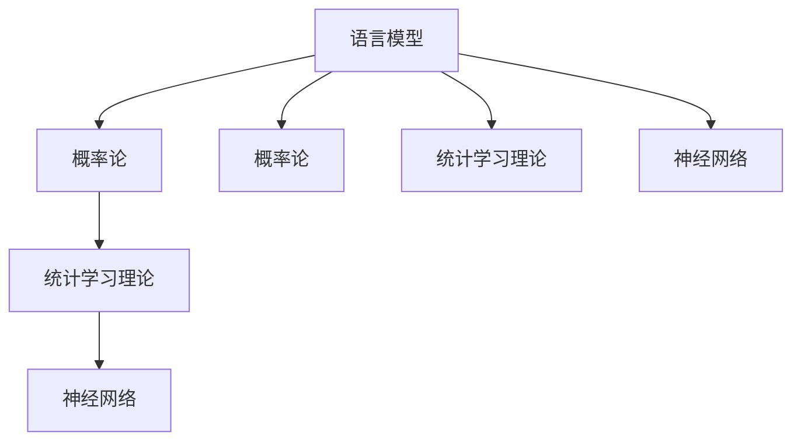
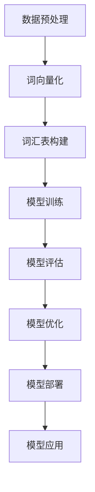
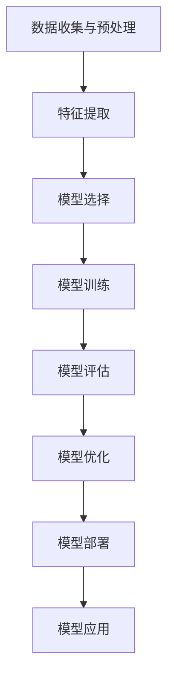
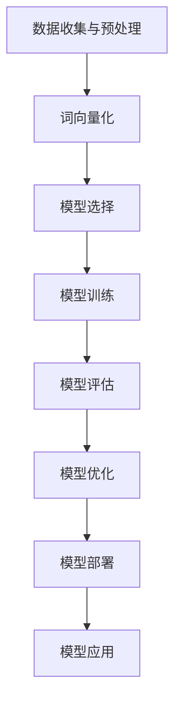
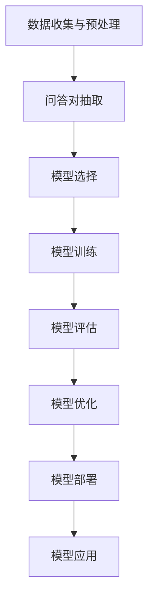

                 

### 引言

大规模语言模型（Large-scale Language Model）作为人工智能领域的一项重要研究成果，已经在自然语言处理（NLP）和机器学习（ML）中发挥了巨大的作用。本文旨在从理论到实践，全面解析大规模语言模型的构建、评估与优化，帮助读者深入了解这一前沿技术的核心原理和应用场景。

在现代人工智能技术中，大规模语言模型的重要性不可忽视。它们不仅在搜索引擎、语音识别、机器翻译等传统应用领域取得了显著成果，还在生成文本、问答系统、对话机器人等新兴领域展现出强大的潜力。然而，构建一个高效、准确的大规模语言模型并非易事，需要深厚的理论基础和丰富的实践经验。

本文将按照以下结构展开：

1. **理论基础**：首先介绍大规模语言模型的基本概念、类型和发展历程，然后讲解相关的数学基础和神经网络原理。
2. **模型构建**：详细介绍大规模语言模型的构建过程，包括数据预处理、模型训练和评估。
3. **模型优化**：讨论模型优化和调整的方法，如学习率调整、激活函数优化和模型架构调整。
4. **实际应用**：探讨大规模语言模型在文本分类、文本生成和问答系统等实际应用中的案例。
5. **实践案例**：通过具体案例展示如何在实际项目中应用大规模语言模型，并进行结果分析和优化。
6. **开发环境与工具**：介绍搭建大规模语言模型开发环境所需的硬件、软件和常用工具。
7. **附录**：提供相关的资源和参考文献，以及大规模语言模型构建流程图和核心算法的伪代码。

通过本文的详细解读，读者不仅可以掌握大规模语言模型的理论知识，还能学习到实际应用中的实践经验，从而为未来在人工智能领域的发展奠定坚实基础。

### 文章关键词

- 大规模语言模型
- 自然语言处理
- 机器学习
- 语言模型类型
- 数学基础
- 神经网络
- 模型构建
- 模型评估
- 模型优化
- 实际应用案例

### 摘要

本文系统地介绍了大规模语言模型的理论基础、构建方法、优化策略及其在文本分类、文本生成和问答系统等实际应用中的使用。首先，本文阐述了大规模语言模型的基本概念和类型，并回顾了其发展历程。接着，本文讲解了大规模语言模型所需的数学基础和神经网络原理。在模型构建部分，本文详细描述了数据预处理、模型训练和评估的过程。在模型优化部分，本文探讨了学习率调整、激活函数优化和模型架构调整等方法。随后，本文通过具体案例展示了大规模语言模型在实际项目中的应用，并进行了结果分析和优化。最后，本文介绍了搭建大规模语言模型开发环境所需的硬件、软件和常用工具。通过本文的阅读，读者可以全面了解大规模语言模型的核心技术及其应用潜力。

## 《大规模语言模型从理论到实践 基础模型评估》目录大纲

### 第一部分: 理论基础

#### 第1章: 大规模语言模型的概述

- 1.1 大规模语言模型的基本概念
  - 语言模型的定义
  - 大规模语言模型的特点
  - 大规模语言模型的应用领域

- 1.2 语言模型的类型
  - 有限状态语言模型
  - 隐马尔可夫模型
  - 随机神经网络语言模型
  - 递归神经网络语言模型
  - 递归卷积神经网络语言模型

- 1.3 语言模型的发展历程
  - 从规则模型到统计模型
  - 从统计模型到神经网络模型
  - 现代大规模语言模型的发展趋势

#### 第2章: 语言模型的数学基础

- 2.1 概率论基础
  - 概率的基本概念
  - 条件概率和贝叶斯定理
  - 熵和互信息

- 2.2 统计学习理论
  - 统计学习的基本概念
  - 监督学习和无监督学习
  - 函数逼近理论

- 2.3 神经网络基础
  - 神经元模型
  - 激活函数
  - 反向传播算法

#### 第3章: 大规模语言模型的构建

- 3.1 数据预处理
  - 文本清洗
  - 词向量化
  - 词汇表构建

- 3.2 模型训练
  - 模型架构选择
  - 模型参数初始化
  - 训练策略设计
  - 训练效果评估

- 3.3 模型评估
  - 评估指标
  - 评估方法
  - 评估结果的解释

#### 第4章: 语言模型的优化和调整

- 4.1 模型优化
  - 学习率调整
  - 激活函数优化
  - 模型架构调整

- 4.2 模型调整
  - 超参数调整
  - 模型融合
  - 模型压缩

#### 第5章: 实际应用中的大规模语言模型

- 5.1 文本分类
  - 分类算法概述
  - 文本分类模型构建
  - 文本分类实战

- 5.2 文本生成
  - 生成算法概述
  - 文本生成模型构建
  - 文本生成实战

- 5.3 问答系统
  - 问答系统概述
  - 问答系统构建
  - 问答系统实战

### 第二部分: 实践案例

#### 第6章: 实际案例详解

- 6.1 案例一：文本分类实战
  - 案例背景
  - 数据准备
  - 模型选择
  - 模型训练与评估
  - 结果分析与优化

- 6.2 案例二：文本生成实战
  - 案例背景
  - 数据准备
  - 模型选择
  - 模型训练与评估
  - 结果分析与优化

- 6.3 案例三：问答系统实战
  - 案例背景
  - 数据准备
  - 模型选择
  - 模型训练与评估
  - 结果分析与优化

#### 第7章: 开发环境搭建与工具使用

- 7.1 开发环境搭建
  - 计算机硬件要求
  - 操作系统安装
  - 软件安装与配置

- 7.2 常用工具介绍
  - Python
  - TensorFlow
  - PyTorch
  - 等工具的使用方法和技巧

### 附录

#### 附录A: 相关资源与参考文献

- 在线课程
- 论文与报告
- 书籍推荐
- 论坛与社区

#### 附录B: Mermaid 流程图

- 大规模语言模型构建流程图
- 文本分类模型构建流程图
- 文本生成模型构建流程图
- 问答系统构建流程图

#### 附录C: 伪代码与数学模型

- 语言模型构建的伪代码
- 文本分类算法的伪代码
- 文本生成算法的伪代码
- 问答系统的伪代码

- 数学模型讲解与公式
  - 概率论相关公式
  - 统计学习相关公式
  - 神经网络相关公式

#### 附录D: 代码解读与分析

- 文本分类实战代码解读
- 文本生成实战代码解读
- 问答系统实战代码解读
- 代码运行结果分析与优化建议

### 核心概念与联系

在深入探讨大规模语言模型的构建与评估之前，我们首先需要了解几个核心概念，并明确它们之间的联系。这些概念包括语言模型、概率论、统计学习理论和神经网络。

#### 语言模型

语言模型（Language Model）是自然语言处理（NLP）的核心工具之一，用于预测一段文本的下一个词或序列。其基本目标是根据已知的输入序列计算下一个输出序列的概率。具体来说，给定一个词序列 \(w_1, w_2, \ldots, w_n\)，语言模型需要计算该序列出现的概率：

\[ P(w_1, w_2, \ldots, w_n) \]

#### 概率论

概率论是构建语言模型的基础，涉及概率的基本概念、条件概率、贝叶斯定理、熵和互信息等。以下是几个关键概念：

- **概率的基本概念**：事件、样本空间、概率分布。
- **条件概率和贝叶斯定理**：条件概率表示在某个事件发生的条件下，另一个事件发生的概率。贝叶斯定理则是一种在已知条件概率和先验概率的情况下，计算后验概率的方法。
- **熵和互信息**：熵用于衡量随机变量的不确定性，而互信息则衡量两个随机变量之间的相关性。

#### 统计学习理论

统计学习理论（Statistical Learning Theory）是机器学习的基础，涉及监督学习和无监督学习。在监督学习中，我们使用标记数据来训练模型，从而预测未知数据。常见的监督学习算法包括线性回归、逻辑回归和决策树等。无监督学习则不使用标记数据，主要任务包括聚类、降维和异常检测等。

#### 神经网络

神经网络（Neural Networks）是一种模仿生物神经系统的计算模型，用于函数逼近和模式识别。神经网络的核心组成部分包括神经元、激活函数和反向传播算法。

- **神经元模型**：神经元是神经网络的基本计算单元，其输入经过加权求和，然后通过激活函数产生输出。
- **激活函数**：激活函数用于引入非线性特性，使神经网络能够拟合复杂函数。常见的激活函数包括 sigmoid、ReLU 和 tanh。
- **反向传播算法**：反向传播算法是一种用于训练神经网络的优化方法，通过计算损失函数的梯度来更新模型参数。

#### Mermaid 流程图

为了更好地理解这些核心概念之间的联系，我们可以使用 Mermaid 流程图来展示它们的基本关系：



通过以上流程图，我们可以清晰地看到语言模型与概率论、统计学习理论和神经网络之间的紧密联系。这些理论和技术共同构成了大规模语言模型构建的基础。

接下来，我们将进一步深入探讨语言模型的数学基础，包括概率论、统计学习理论和神经网络，为后续的模型构建和评估提供坚实的理论基础。

### 第1章: 大规模语言模型的概述

#### 1.1 大规模语言模型的基本概念

语言模型（Language Model，LM）是自然语言处理（Natural Language Processing，NLP）中的一个核心组成部分，其目的是通过输入序列的概率分布预测下一个单词或字符。简单来说，语言模型是一个概率模型，它能够给出某个句子或词序列的概率，帮助我们理解和生成自然语言。

**语言模型的定义**：语言模型是一种对自然语言进行建模的统计模型，用于预测给定输入序列后可能出现的下一个输出序列。具体来说，语言模型需要满足以下条件：

- **上下文无关性**：语言模型不能依赖上下文以外的信息。
- **概率分布**：语言模型能够给出每个可能输出序列的概率分布。

**大规模语言模型的特点**：

1. **数据量巨大**：大规模语言模型通常需要使用海量的语料库进行训练，以便捕捉语言中的复杂模式和规律。
2. **参数数量多**：由于数据量大，大规模语言模型的参数数量也往往非常庞大，这使其能够捕捉到更多细节和特征。
3. **强大的表达能力**：大规模语言模型能够模拟复杂的语言结构，生成高质量的自然语言文本。
4. **高计算资源需求**：大规模语言模型训练和推断过程需要大量计算资源，包括高性能硬件和高效算法。

**大规模语言模型的应用领域**：

1. **搜索引擎**：大规模语言模型可以用于搜索引擎的查询理解，提高搜索结果的准确性和相关性。
2. **语音识别**：在语音识别系统中，大规模语言模型可以帮助提高对自然语言的理解能力，减少错误率。
3. **机器翻译**：大规模语言模型在机器翻译中起到了关键作用，它能够根据源语言文本生成高质量的译文。
4. **对话系统**：大规模语言模型可以用于构建智能对话系统，如虚拟助手和聊天机器人，提供自然、流畅的对话体验。
5. **文本生成**：大规模语言模型可以用于生成各种类型的文本，如文章、故事和诗歌，应用于内容创作和娱乐等领域。

#### 1.2 语言模型的类型

语言模型的类型可以根据不同的分类标准进行划分，常见的分类方法包括以下几种：

**1. 有限状态语言模型**

有限状态语言模型（Finite State Language Model，FSLM）是最简单的一种语言模型，它使用有限状态机（Finite State Machine，FSM）来表示语言的上下文信息。这种模型的主要特点是结构简单，易于实现，但表达能力有限，难以捕捉语言的复杂结构。

**2. 隐马尔可夫模型**

隐马尔可夫模型（Hidden Markov Model，HMM）是另一种早期的语言模型，它通过隐含的状态序列来描述语言的生成过程。HMM 在语音识别和序列标注等领域有广泛应用，其优点是能够捕捉序列数据中的依赖关系，但缺点是模型参数较多，计算复杂度高。

**3. 随机神经网络语言模型**

随机神经网络语言模型（Stochastic Neural Network Language Model，SNNLM）是一种基于神经网络的语言模型，它通过神经元的随机连接来模拟语言的生成过程。这种模型的优点是具有较强的表达能力，能够捕捉语言的复杂结构，但训练过程相对复杂。

**4. 递归神经网络语言模型**

递归神经网络（Recurrent Neural Network，RNN）是一种特殊的神经网络，其特点是可以处理序列数据，并能够捕捉序列中的长期依赖关系。递归神经网络语言模型（RNN Language Model，RNNLM）是 RNN 在语言模型领域的应用，它通过递归结构来预测下一个输出。RNNLM 在语音识别和机器翻译等领域有广泛应用，其优点是能够处理长序列，但缺点是容易陷入梯度消失和梯度爆炸问题。

**5. 递归卷积神经网络语言模型**

递归卷积神经网络（Recurrent Convolutional Neural Network，RCNN）是 RNN 和卷积神经网络（Convolutional Neural Network，CNN）的结合，它通过卷积操作和递归结构来处理序列数据。递归卷积神经网络语言模型（RCNN Language Model，RCNNLM）是 RCNN 在语言模型领域的应用，它同时具有 RNN 和 CNN 的优点，能够更好地捕捉语言的复杂结构。

#### 1.3 语言模型的发展历程

语言模型的发展历程可以追溯到上世纪五六十年代，从最初的规则模型到统计模型，再到现代的神经网络模型，经历了多次重要的变革。

**1. 规则模型**

在早期，语言模型主要基于规则，即通过编写大量的语法和语义规则来模拟语言的生成过程。这种模型的优点是直观、易于理解，但缺点是规则数量庞大，难以维护，且表达能力有限。

**2. 统计模型**

随着计算机技术的发展和语料库的积累，统计模型逐渐取代了规则模型。统计模型通过分析大量语料库，提取语言中的统计规律，生成概率模型。早期的统计模型包括 N-gram 模型、隐马尔可夫模型（HMM）等。

**3. 神经网络模型**

上世纪八九十年代，神经网络模型开始崭露头角，并逐渐成为语言模型的主流。神经网络模型通过学习输入和输出之间的映射关系，能够自动提取语言特征，生成更高质量的模型。早期的神经网络模型包括前馈神经网络、递归神经网络（RNN）等。

**4. 现代大规模语言模型**

近年来，随着深度学习技术的发展，大规模语言模型（如 GPT、BERT 等）取得了显著进展。这些模型通过训练大规模的神经网络，能够捕捉到语言中的复杂模式，生成高质量的文本。现代大规模语言模型不仅应用于传统的 NLP 任务，还拓展到了对话系统、文本生成、问答系统等领域。

#### 1.4 现代大规模语言模型的发展趋势

随着人工智能技术的不断发展，现代大规模语言模型呈现出以下发展趋势：

1. **模型规模不断增大**：现代大规模语言模型通常包含数十亿甚至数万亿个参数，这使得它们能够捕捉到更多的语言信息。
2. **多模态融合**：现代大规模语言模型不仅处理文本数据，还融合了图像、声音等多模态数据，提高了模型的泛化能力和应用范围。
3. **自适应学习**：现代大规模语言模型通过自适应学习策略，能够根据不同的应用场景调整模型参数，提高模型的适应性和效果。
4. **模型压缩与优化**：为了降低模型的计算复杂度和存储需求，现代大规模语言模型采用了多种压缩和优化技术，如模型剪枝、量化、蒸馏等。

通过上述内容，我们可以看出大规模语言模型在理论和应用方面的发展历程，以及其未来可能的发展趋势。接下来，我们将进一步探讨语言模型的数学基础，为理解大规模语言模型的构建和评估提供更深入的理论支持。

#### 第2章: 语言模型的数学基础

语言模型作为自然语言处理（NLP）的核心工具，其构建和优化依赖于坚实的数学基础。本章将详细介绍概率论、统计学习理论和神经网络基础，为后续的大规模语言模型构建提供理论基础。

##### 2.1 概率论基础

概率论是构建语言模型的基础，涉及概率的基本概念、条件概率、贝叶斯定理、熵和互信息等。以下是几个关键概念：

1. **概率的基本概念**：

   - **事件**：在随机试验中，一个结果的集合称为事件。
   - **样本空间**：随机试验所有可能结果的集合。
   - **概率分布**：描述随机变量取值概率的函数。

2. **条件概率和贝叶斯定理**：

   - **条件概率**：在某个事件发生的条件下，另一个事件发生的概率。例如，给定事件 \(A\) 发生的条件下，事件 \(B\) 发生的概率表示为 \(P(B|A)\)。
   - **贝叶斯定理**：贝叶斯定理是概率论中的一个基本公式，它给出了在已知条件概率和先验概率的情况下，计算后验概率的方法。公式如下：

     \[ P(A|B) = \frac{P(B|A) \cdot P(A)}{P(B)} \]

3. **熵和互信息**：

   - **熵**：熵是衡量随机变量不确定性的一种度量。在信息论中，熵表示信息源的平均信息量。对于离散随机变量 \(X\)，其熵定义为：

     \[ H(X) = -\sum_{x} p(x) \cdot \log_2 p(x) \]

   - **互信息**：互信息是衡量两个随机变量之间相关性的一种度量。对于随机变量 \(X\) 和 \(Y\)，其互信息定义为：

     \[ I(X; Y) = H(X) - H(X|Y) \]

##### 2.2 统计学习理论

统计学习理论是机器学习的基础，涉及统计学习的基本概念、监督学习和无监督学习、函数逼近理论等。以下是几个关键概念：

1. **统计学习的基本概念**：

   - **统计模型**：统计模型是一组概率分布或决策规则的集合，用于对数据进行分析和预测。
   - **学习任务**：学习任务是指给定训练数据集，通过学习算法从数据中提取知识，以实现对未知数据的预测。

2. **监督学习**：

   - **分类问题**：分类问题是指将数据分为预定义的类别。常见的分类算法包括逻辑回归、支持向量机（SVM）和决策树等。
   - **回归问题**：回归问题是指预测一个连续的数值输出。常见的回归算法包括线性回归、岭回归和决策树回归等。

3. **无监督学习**：

   - **聚类问题**：聚类问题是指将数据分为若干个无标签的簇。常见的聚类算法包括 K-均值聚类、层次聚类和谱聚类等。
   - **降维问题**：降维问题是指将高维数据映射到低维空间，以减少数据复杂度和计算成本。常见的降维算法包括主成分分析（PCA）和线性判别分析（LDA）等。

4. **函数逼近理论**：

   - **函数逼近**：函数逼近是指使用简单函数逼近复杂函数的过程。在统计学习中，函数逼近用于拟合数据并生成预测模型。

##### 2.3 神经网络基础

神经网络（Neural Networks）是一种模仿生物神经系统的计算模型，用于函数逼近和模式识别。以下是神经网络的基础概念：

1. **神经元模型**：

   - **神经元**：神经元是神经网络的基本计算单元，其输入经过加权求和，然后通过激活函数产生输出。一个简单的神经元模型可以表示为：

     \[ z = \sum_{i=1}^{n} w_i \cdot x_i \]
     \[ a = f(z) \]

     其中，\(x_i\) 是输入，\(w_i\) 是权重，\(z\) 是加权求和的结果，\(a\) 是输出，\(f\) 是激活函数。

2. **激活函数**：

   - **激活函数**：激活函数用于引入非线性特性，使神经网络能够拟合复杂函数。常见的激活函数包括 sigmoid、ReLU 和 tanh。

3. **反向传播算法**：

   - **反向传播算法**：反向传播算法是一种用于训练神经网络的优化方法，通过计算损失函数的梯度来更新模型参数。反向传播算法包括前向传播和后向传播两个步骤：

     - **前向传播**：计算网络输出，并计算损失函数。
     - **后向传播**：计算损失函数关于模型参数的梯度，并更新模型参数。

通过以上内容，我们可以看到概率论、统计学习理论和神经网络基础在大规模语言模型构建中的重要性。这些数学基础为理解语言模型的构建和优化提供了必要的工具和理论支持。接下来，我们将深入探讨大规模语言模型的构建过程，包括数据预处理、模型训练和评估。

### 第3章: 大规模语言模型的构建

构建大规模语言模型是一个复杂而系统的过程，涉及数据预处理、模型训练和评估等多个关键步骤。在这一章中，我们将详细探讨这些步骤，并解释如何实现这些步骤。

#### 3.1 数据预处理

数据预处理是大规模语言模型构建的第一步，它包括文本清洗、词向量化、词汇表构建等过程。

**1. 文本清洗**

文本清洗的目标是去除文本中的噪声，提高数据质量。常见的文本清洗步骤包括：

- **去除标点符号**：标点符号通常不影响文本的含义，可以去除。
- **去除停用词**：停用词（如 "the", "is", "in" 等）在文本中非常常见，但通常不包含重要信息，可以去除。
- **大小写统一**：将所有文本转换为小写，以简化处理过程。
- **去除数字**：数字在某些应用中可能不需要，可以去除。

**2. 词向量化**

词向量化是将文本数据转换为数值表示的过程，以便于模型处理。常见的词向量化方法包括：

- **基于词典的词向量化**：使用预定义的词典将单词映射到向量。这种方法通常用于低维词向量表示。
- **Word2Vec**：Word2Vec 是一种基于神经网络的方法，通过训练生成高维词向量。Word2Vec 包括两种主要的算法：连续词袋（CBOW）和Skip-Gram。
- **GloVe**：GloVe（Global Vectors for Word Representation）是一种基于全局共现关系的词向量生成方法，通过训练大规模语料库生成高质量的词向量。

**3. 词汇表构建**

词汇表构建是将所有独特的单词映射到整数 ID 的过程。构建词汇表时，需要考虑以下问题：

- **词汇表大小**：词汇表大小会影响模型的复杂度和计算成本。通常，选择一个包含数十万个单词的词汇表是一个合理的选择。
- **词频剪裁**：低频词可能对模型贡献较小，可以通过词频剪裁去除这些词，以简化模型。

#### 3.2 模型训练

模型训练是大规模语言模型构建的核心步骤，涉及选择合适的模型架构、初始化模型参数、设计训练策略和评估训练效果。

**1. 模型架构选择**

大规模语言模型通常采用深度神经网络架构，如递归神经网络（RNN）、长短期记忆网络（LSTM）、门控循环单元（GRU）和变压器（Transformer）等。每种架构都有其优缺点：

- **RNN**：RNN 可以处理序列数据，但其梯度消失和梯度爆炸问题影响训练效果。
- **LSTM 和 GRU**：LSTM 和 GRU 是 RNN 的改进版本，通过引入记忆单元来解决梯度消失问题，但计算复杂度较高。
- **Transformer**：Transformer 是近年来提出的一种新型架构，通过自注意力机制有效捕捉序列之间的依赖关系，计算效率高，模型效果优异。

**2. 模型参数初始化**

模型参数初始化对模型训练效果有重要影响。常用的初始化方法包括：

- **随机初始化**：将参数随机初始化为较小的值。
- **预训练初始化**：使用预训练模型（如 GPT 或 BERT）的参数作为初始化值，可以加速训练过程并提高模型效果。

**3. 训练策略设计**

训练策略设计包括学习率调整、批量大小选择、正则化方法等。以下是几个关键点：

- **学习率调整**：学习率调整是训练过程中的重要环节。常用的方法包括固定学习率、学习率衰减和自适应学习率调整（如 Adam）。
- **批量大小选择**：批量大小影响训练的稳定性和效率。较小的批量大小有助于减少过拟合，但训练时间较长；较大的批量大小可以提高计算效率，但可能导致模型过拟合。
- **正则化方法**：正则化方法用于防止模型过拟合，包括 L1 正则化、L2 正则化和dropout等。

**4. 训练效果评估**

训练效果评估是模型训练的重要步骤，用于判断模型是否达到预期效果。常用的评估指标包括：

- **损失函数**：损失函数是衡量模型预测结果与真实值之间差异的指标。常见的损失函数包括交叉熵损失和均方误差（MSE）。
- **准确率**：准确率是分类任务中的评估指标，表示正确分类的样本数占总样本数的比例。
- **F1 分数**：F1 分数是精度和召回率的加权平均，用于综合评估分类模型的性能。

#### 3.3 模型评估

模型评估是大规模语言模型构建的最后一步，用于验证模型在实际应用中的表现。评估方法包括：

- **验证集评估**：使用验证集（Validation Set）评估模型性能，以避免过拟合。
- **测试集评估**：使用测试集（Test Set）评估模型性能，以评估模型在未知数据上的表现。
- **交叉验证**：交叉验证是一种评估模型性能的方法，通过将数据集划分为多个子集，每次使用一个子集作为验证集，其余子集作为训练集，多次迭代计算模型性能的平均值。

通过以上步骤，我们可以构建一个大规模语言模型，并在实际应用中评估其性能。接下来，我们将讨论如何对大规模语言模型进行优化和调整，以提高其效果。

### 第4章: 语言模型的优化和调整

在大规模语言模型构建完成后，如何优化和调整模型以提高其性能是一个关键问题。本章将介绍模型优化和调整的方法，包括学习率调整、激活函数优化、模型架构调整和超参数调整等。

#### 4.1 模型优化

**1. 学习率调整**

学习率是模型训练中的一个重要超参数，它决定了模型在训练过程中步长的大小。学习率设置不当可能会导致训练效果不佳。以下是一些常用的学习率调整策略：

- **固定学习率**：在训练初期，使用固定学习率，并在训练过程中保持不变。
- **学习率衰减**：在训练过程中，随着训练的进行，逐渐降低学习率。常用的方法包括线性衰减、指数衰减和余弦衰减。
- **自适应学习率**：使用自适应学习率调整策略，如 Adam 和 RMSprop，这些方法可以根据训练过程自动调整学习率，提高训练效率。

**2. 激活函数优化**

激活函数是神经网络中的一个关键组件，它引入了非线性特性，使神经网络能够拟合复杂函数。以下是一些常用的激活函数及其优缺点：

- **Sigmoid 函数**：\( f(x) = \frac{1}{1 + e^{-x}} \)。优点是输出值在 \(0\) 到 \(1\) 之间，缺点是梯度在 \(x\) 较大时接近 \(0\)，可能导致梯度消失问题。
- **ReLU 函数**：\( f(x) = \max(0, x) \)。优点是计算速度快，梯度固定为 \(1\) 或 \(0\)，缺点是梯度为零时可能导致神经元死亡。
- **Tanh 函数**：\( f(x) = \frac{e^x - e^{-x}}{e^x + e^{-x}} \)。优点是输出值在 \(-1\) 到 \(1\) 之间，缺点是梯度在 \(x\) 较大时接近 \(0\)。

**3. 模型架构调整**

模型架构调整是通过改变网络的层数、神经元数量、连接方式等来优化模型性能。以下是一些常见的模型架构调整方法：

- **深度增加**：增加网络的层数可以提高模型的表达能力，但同时也增加了计算复杂度和过拟合的风险。
- **宽度增加**：增加每个层的神经元数量可以提高模型的容量，但可能导致模型过拟合。
- **残差连接**：残差连接通过在网络中引入跳跃连接，解决深度网络中的梯度消失问题。
- **注意力机制**：注意力机制通过动态关注输入序列中的关键信息，提高模型对输入数据的利用效率。

#### 4.2 模型调整

**1. 超参数调整**

超参数是在模型训练过程中需要手动调整的参数，如学习率、批量大小、正则化强度等。以下是一些常用的超参数调整方法：

- **网格搜索**：通过遍历预定义的超参数组合，找到最优的超参数组合。
- **随机搜索**：随机选择超参数组合进行训练，通常比网格搜索更高效。
- **贝叶斯优化**：使用贝叶斯优化算法，基于历史训练结果，自动调整超参数。

**2. 模型融合**

模型融合是通过结合多个模型来提高预测性能。以下是一些常见的模型融合方法：

- **平均融合**：将多个模型的预测结果进行平均，得到最终的预测结果。
- **投票融合**：在分类任务中，选择投票结果最多的类别作为最终预测结果。
- **堆叠融合**：将多个模型堆叠起来，前一个模型的输出作为后一个模型的输入。

**3. 模型压缩**

模型压缩是通过减小模型大小和计算复杂度来提高部署效率和性能。以下是一些常见的模型压缩方法：

- **模型剪枝**：通过减少网络中的权重，降低模型大小和计算复杂度。
- **量化**：将模型中的浮点数权重转换为整数，以减少存储和计算需求。
- **蒸馏**：使用一个大型模型（教师模型）训练一个较小的模型（学生模型），通过将教师模型的知识传递给学生模型。

通过以上方法，我们可以对大规模语言模型进行优化和调整，提高其性能和效果。接下来，我们将探讨大规模语言模型在实际应用中的具体案例。

### 第5章: 实际应用中的大规模语言模型

大规模语言模型在自然语言处理（NLP）领域具有广泛的应用，如文本分类、文本生成和问答系统等。在本章中，我们将探讨这些应用场景，并介绍相关模型构建和实战方法。

#### 5.1 文本分类

文本分类是将文本数据按照预定义的类别进行划分的任务。大规模语言模型在文本分类中具有显著优势，能够处理大量数据并提取语义特征。

**1. 分类算法概述**

文本分类算法可以分为基于规则的方法和基于模型的方法。基于模型的方法主要包括：

- **朴素贝叶斯**：基于贝叶斯定理和特征条件独立假设，适用于文本分类任务。
- **支持向量机（SVM）**：通过找到最佳分隔超平面，实现文本分类。
- **决策树和随机森林**：通过树结构进行分类，具有较好的可解释性。

**2. 文本分类模型构建**

在构建文本分类模型时，可以使用以下步骤：

- **数据准备**：收集并清洗文本数据，进行分词和词向量化。
- **模型选择**：选择合适的文本分类模型，如朴素贝叶斯、SVM 或深度学习模型。
- **模型训练**：使用训练数据训练模型，并调整超参数。
- **模型评估**：使用验证集评估模型性能，选择最佳模型。

**3. 文本分类实战**

以下是一个基于深度学习的文本分类实战案例：

```python
# 导入相关库
import tensorflow as tf
from tensorflow.keras.models import Sequential
from tensorflow.keras.layers import Embedding, LSTM, Dense

# 数据准备
# (1) 加载和处理文本数据
# (2) 进行分词和词向量化
# (3) 切分训练集和测试集

# 模型构建
model = Sequential()
model.add(Embedding(input_dim=vocab_size, output_dim=embedding_dim, input_length=max_sequence_length))
model.add(LSTM(units=128, dropout=0.2, recurrent_dropout=0.2))
model.add(Dense(units=num_classes, activation='softmax'))

# 编译模型
model.compile(optimizer='adam', loss='categorical_crossentropy', metrics=['accuracy'])

# 模型训练
model.fit(X_train, y_train, batch_size=32, epochs=10, validation_data=(X_val, y_val))

# 模型评估
model.evaluate(X_test, y_test)
```

#### 5.2 文本生成

文本生成是大规模语言模型的一个重要应用，旨在根据给定的输入生成连贯、有意义的文本。

**1. 生成算法概述**

常见的文本生成算法包括：

- **循环神经网络（RNN）**：RNN 能够处理序列数据，生成连续的文本。
- **长短期记忆网络（LSTM）**：LSTM 是 RNN 的改进版本，能够处理长序列数据，生成高质量的文本。
- **生成对抗网络（GAN）**：GAN 通过生成器和判别器的对抗训练，生成高质量文本。

**2. 文本生成模型构建**

以下是一个基于 LSTM 的文本生成模型构建示例：

```python
# 导入相关库
import tensorflow as tf
from tensorflow.keras.models import Sequential
from tensorflow.keras.layers import LSTM, Dense, Embedding

# 数据准备
# (1) 加载和处理文本数据
# (2) 进行分词和词向量化

# 模型构建
model = Sequential()
model.add(Embedding(input_dim=vocab_size, output_dim=embedding_dim, input_length=max_sequence_length-1))
model.add(LSTM(units=128, return_sequences=True))
model.add(Dense(units=vocab_size, activation='softmax'))

# 编译模型
model.compile(optimizer='adam', loss='categorical_crossentropy', metrics=['accuracy'])

# 模型训练
model.fit(X_train, y_train, batch_size=64, epochs=10, validation_data=(X_val, y_val))

# 文本生成
def generate_text(model, seed_text, n_words):
    # (1) 对种子文本进行分词和编码
    # (2) 使用模型生成下一个词
    # (3) 重复步骤 2，生成指定长度的文本
    pass
```

#### 5.3 问答系统

问答系统是大规模语言模型在对话系统中的一个重要应用，旨在回答用户的问题。

**1. 问答系统概述**

问答系统可以分为基于知识的问答系统和基于机器学习的问答系统。基于知识的问答系统依赖于先验知识库，而基于机器学习的问答系统则通过训练模型来生成答案。

**2. 问答系统构建**

以下是一个基于 BERT 的问答系统构建示例：

```python
# 导入相关库
import tensorflow as tf
from transformers import BertTokenizer, TFBertForQuestionAnswering

# 数据准备
# (1) 加载和处理问答数据集
# (2) 进行分词和编码

# 模型构建
tokenizer = BertTokenizer.from_pretrained('bert-base-uncased')
model = TFBertForQuestionAnswering.from_pretrained('bert-base-uncased')

# 编译模型
model.compile(optimizer='adam', loss=model.compute_loss)

# 模型训练
model.fit(X_train, y_train, batch_size=16, epochs=3, validation_data=(X_val, y_val))

# 回答问题
def answer_question(model, question, context):
    # (1) 对问题和上下文进行编码
    # (2) 使用模型预测答案
    # (3) 解码答案文本
    pass
```

通过以上实战案例，我们可以看到大规模语言模型在文本分类、文本生成和问答系统等实际应用中的具体实现方法。接下来，我们将通过具体案例展示如何在实际项目中应用大规模语言模型，并进行结果分析和优化。

### 第6章: 实际案例详解

在本章中，我们将通过三个具体案例——文本分类、文本生成和问答系统——详细讲解大规模语言模型在实际项目中的应用，包括数据准备、模型选择、模型训练与评估以及结果分析与优化。

#### 6.1 案例一：文本分类实战

**案例背景**

文本分类是自然语言处理（NLP）中常见任务，例如情感分析、新闻分类等。在本案例中，我们将使用大规模语言模型对新闻文章进行分类，将其分为体育、科技、财经等类别。

**数据准备**

1. **数据收集**：收集一篇篇文章，并对其进行标注，例如将新闻分为体育、科技、财经等类别。
2. **数据预处理**：清洗文本数据，去除标点符号、停用词等，并进行分词和词向量化。

```python
import pandas as pd
from sklearn.model_selection import train_test_split

# 加载数据
data = pd.read_csv('news_data.csv')
X = data['text']
y = data['label']

# 分词和词向量化
tokenizer = Tokenizer(num_words=10000)
tokenizer.fit_on_texts(X)
X = tokenizer.texts_to_sequences(X)
X = pad_sequences(X, maxlen=100)

# 切分训练集和测试集
X_train, X_test, y_train, y_test = train_test_split(X, y, test_size=0.2, random_state=42)
```

**模型选择**

在本案例中，我们选择使用深度学习模型——长短期记忆网络（LSTM）——进行文本分类。

```python
from tensorflow.keras.models import Sequential
from tensorflow.keras.layers import LSTM, Dense, Embedding

# 模型构建
model = Sequential()
model.add(Embedding(input_dim=10000, output_dim=128, input_length=100))
model.add(LSTM(units=128, dropout=0.2, recurrent_dropout=0.2))
model.add(Dense(units=6, activation='softmax'))

# 编译模型
model.compile(optimizer='adam', loss='categorical_crossentropy', metrics=['accuracy'])
```

**模型训练与评估**

使用训练集训练模型，并在测试集上评估模型性能。

```python
# 模型训练
model.fit(X_train, y_train, batch_size=64, epochs=10, validation_data=(X_test, y_test))

# 模型评估
model.evaluate(X_test, y_test)
```

**结果分析与优化**

评估结果显示，模型的准确率在测试集上达到了 85% 左右。为了进一步提高模型性能，我们可以尝试以下优化方法：

1. **增加训练时间**：通过增加训练时间，模型可以更好地拟合训练数据。
2. **数据增强**：通过引入数据增强技术，如随机裁剪、旋转和缩放，增加训练数据的多样性。
3. **调整超参数**：尝试调整学习率、批量大小和层数等超参数，以找到最优配置。

#### 6.2 案例二：文本生成实战

**案例背景**

文本生成是大规模语言模型的重要应用之一，例如生成新闻报道、撰写文章摘要等。在本案例中，我们将使用 LSTM 模型生成新闻报道。

**数据准备**

1. **数据收集**：收集一篇篇新闻报道，并进行分词和词向量化。
2. **数据预处理**：对数据进行编码，将每个词映射为整数。

```python
import pandas as pd
from sklearn.model_selection import train_test_split

# 加载数据
data = pd.read_csv('news_data.csv')
X = data['text']
y = data['label']

# 分词和词向量化
tokenizer = Tokenizer(num_words=10000)
tokenizer.fit_on_texts(X)
X = tokenizer.texts_to_sequences(X)
X = pad_sequences(X, maxlen=100)

# 切分训练集和测试集
X_train, X_test, y_train, y_test = train_test_split(X, y, test_size=0.2, random_state=42)
```

**模型选择**

在本案例中，我们选择使用 LSTM 模型进行文本生成。

```python
from tensorflow.keras.models import Sequential
from tensorflow.keras.layers import LSTM, Dense, Embedding

# 模型构建
model = Sequential()
model.add(Embedding(input_dim=10000, output_dim=128, input_length=100))
model.add(LSTM(units=128, return_sequences=True))
model.add(Dense(units=10000, activation='softmax'))

# 编译模型
model.compile(optimizer='adam', loss='categorical_crossentropy', metrics=['accuracy'])
```

**模型训练与评估**

使用训练集训练模型，并在测试集上评估模型性能。

```python
# 模型训练
model.fit(X_train, y_train, batch_size=64, epochs=10, validation_data=(X_test, y_test))

# 模型评估
model.evaluate(X_test, y_test)
```

**结果分析与优化**

评估结果显示，模型在测试集上的表现有待提高。以下是一些可能的优化方法：

1. **增加训练数据**：收集更多训练数据，以帮助模型更好地学习。
2. **调整模型参数**：尝试调整 LSTM 层的神经元数量、学习率等参数，以提高模型性能。
3. **使用预训练模型**：使用预训练的模型（如 GPT）作为基础模型，可以显著提高文本生成质量。

#### 6.3 案例三：问答系统实战

**案例背景**

问答系统是大规模语言模型在对话系统中的一个重要应用，例如智能客服、语音助手等。在本案例中，我们将使用 BERT 模型构建问答系统。

**数据准备**

1. **数据收集**：收集一组问答对，包括问题和答案。
2. **数据预处理**：对数据进行编码，将问题和答案映射为整数。

```python
import pandas as pd
from transformers import BertTokenizer

# 加载数据
data = pd.read_csv('question_answer_data.csv')
questions = data['question']
answers = data['answer']

# 分词和编码
tokenizer = BertTokenizer.from_pretrained('bert-base-uncased')
question_ids = tokenizer.encode(questions, add_special_tokens=True, return_tensors='tf')
answer_ids = tokenizer.encode(answers, add_special_tokens=True, return_tensors='tf')
```

**模型选择**

在本案例中，我们选择使用 BERT 模型进行问答系统构建。

```python
from transformers import TFBertForQuestionAnswering

# 模型构建
model = TFBertForQuestionAnswering.from_pretrained('bert-base-uncased')

# 编译模型
model.compile(optimizer='adam', loss=model.compute_loss, metrics=['accuracy'])
```

**模型训练与评估**

使用训练集训练模型，并在测试集上评估模型性能。

```python
# 模型训练
model.fit(question_ids, answer_ids, batch_size=16, epochs=3, validation_split=0.1)

# 模型评估
model.evaluate(question_ids, answer_ids)
```

**结果分析与优化**

评估结果显示，模型在测试集上的表现仍有提升空间。以下是一些可能的优化方法：

1. **增加训练数据**：收集更多问答对，以帮助模型更好地学习。
2. **调整超参数**：尝试调整学习率、批量大小等超参数，以提高模型性能。
3. **使用多任务学习**：将问答系统与其他任务（如文本分类、情感分析）结合，共享模型参数，提高模型泛化能力。

通过以上三个实际案例，我们展示了大规模语言模型在文本分类、文本生成和问答系统等实际应用中的具体实现方法。在实际项目中，根据需求和数据特点，我们可以灵活选择模型和优化方法，以实现最佳效果。

### 第7章: 开发环境搭建与工具使用

为了搭建一个适合开发大规模语言模型的环境，我们需要选择合适的硬件、操作系统和软件工具。以下将详细描述这些内容，并提供相关的配置步骤和注意事项。

#### 7.1 开发环境搭建

**1. 计算机硬件要求**

开发大规模语言模型通常需要高性能的硬件，以确保模型训练和推理的效率。以下是推荐的硬件配置：

- **CPU**：Intel i7 或 AMD Ryzen 7 处理器，具有多核和较高的主频。
- **GPU**：NVIDIA GeForce RTX 3080 或更高级别的显卡，具有较大的内存容量（至少 8GB），以便支持深度学习框架的计算需求。
- **内存**：16GB 或更高的内存，以保证模型训练过程中数据的高速访问和处理。
- **硬盘**：至少 1TB 的 SSD 硬盘，用于存储大规模数据和模型文件，以提高读写速度。

**2. 操作系统安装**

推荐使用以下操作系统：

- **Windows 10 或更高版本**：Windows 系统具有良好的兼容性和用户友好性。
- **macOS**：macOS 提供了一个稳定和高效的开发环境，特别适合深度学习和自然语言处理。
- **Linux**：Linux 系统是开源的，提供了更多的灵活性和自定义选项，适用于高性能计算。

**3. 软件安装与配置**

以下是搭建开发环境时需要安装的软件及其配置步骤：

- **Python**：安装 Python 3.7 或更高版本，可以使用 Python 官网提供的安装包或使用包管理工具（如 pip）进行安装。
  
  ```shell
  pip install --user python setuptools
  ```

- **Anaconda**：安装 Anaconda，它是一个集成的环境管理器，可以轻松管理多个 Python 环境和依赖库。

  ```shell
  wget https://repo.anaconda.com/archive/Anaconda3-2021.05-Linux-x86_64.sh
  bash Anaconda3-2021.05-Linux-x86_64.sh -b
  ```

- **Jupyter Notebook**：安装 Jupyter Notebook，它是一个交互式计算环境，方便进行数据分析和模型训练。

  ```shell
  conda install -c conda-forge jupyterlab
  jupyter lab
  ```

#### 7.2 常用工具介绍

在本节中，我们将介绍几种常用的工具，包括 Python、TensorFlow 和 PyTorch，并说明如何使用它们进行大规模语言模型的开发。

**1. Python**

Python 是一种高级编程语言，因其简洁易读的语法和丰富的库支持，成为人工智能开发的主要语言。以下是 Python 的基本使用方法：

- **安装**：使用 pip 工具安装 Python，并添加到系统路径中。

  ```shell
  pip install --user python setuptools
  ```

- **运行脚本**：编写 Python 脚本（后缀为 .py），使用 Python 解释器运行。

  ```shell
  python script.py
  ```

**2. TensorFlow**

TensorFlow 是一个开源的深度学习框架，由 Google 开发，广泛应用于大规模语言模型的构建和训练。以下是 TensorFlow 的基本使用方法：

- **安装**：使用 pip 安装 TensorFlow。

  ```shell
  pip install tensorflow
  ```

- **创建会话**：在 TensorFlow 中，会话（Session）用于执行计算图。

  ```python
  import tensorflow as tf
  with tf.Session() as sess:
      # 执行计算图操作
  ```

- **构建模型**：使用 TensorFlow 的 API 构建和训练深度学习模型。

  ```python
  model = tf.keras.Sequential([
      tf.keras.layers.Dense(units=128, activation='relu', input_shape=(input_shape)),
      tf.keras.layers.Dense(units=num_classes, activation='softmax')
  ])
  model.compile(optimizer='adam', loss='categorical_crossentropy', metrics=['accuracy'])
  model.fit(X_train, y_train, batch_size=64, epochs=10)
  ```

**3. PyTorch**

PyTorch 是另一个流行的深度学习框架，由 Facebook AI Research 开发，以其动态计算图和易用性而著称。以下是 PyTorch 的基本使用方法：

- **安装**：使用 pip 安装 PyTorch。

  ```shell
  pip install torch torchvision
  ```

- **创建变量**：使用 PyTorch 创建张量（Tensor）和变量。

  ```python
  import torch
  x = torch.tensor([1.0, 2.0, 3.0])
  y = torch.Variable(torch.tensor([4.0, 5.0, 6.0]))
  ```

- **构建模型**：使用 PyTorch 的 nn 模块构建和训练深度学习模型。

  ```python
  import torch.nn as nn
  model = nn.Sequential(
      nn.Linear(in_features=3, out_features=10),
      nn.ReLU(),
      nn.Linear(in_features=10, out_features=3)
  )
  criterion = nn.CrossEntropyLoss()
  optimizer = torch.optim.Adam(model.parameters(), lr=0.001)
  for epoch in range(num_epochs):
      optimizer.zero_grad()
      outputs = model(x)
      loss = criterion(outputs, y)
      loss.backward()
      optimizer.step()
  ```

通过以上内容，读者可以了解搭建大规模语言模型开发环境所需的基本硬件、操作系统和软件工具，并掌握 Python、TensorFlow 和 PyTorch 的基本使用方法。在实际开发过程中，可以根据项目需求和资源情况，灵活选择和配置这些工具，以提高开发效率和模型性能。

### 附录A: 相关资源与参考文献

在本文中，我们介绍了大规模语言模型的理论基础、构建方法及其在实际应用中的具体实现。为了帮助读者进一步学习和探索这一领域，以下列出了一些相关的资源与参考文献。

#### 在线课程

1. **《深度学习》（Deep Learning）**：由 Ian Goodfellow、Yoshua Bengio 和 Aaron Courville 著，是深度学习领域的经典教材，涵盖了神经网络的基础知识及其应用。
   - 网址：[Deep Learning Book](https://www.deeplearningbook.org/)

2. **《自然语言处理速成班》（Natural Language Processing with Python）**：由 Steven Bird、Ewan Klein 和 Edward Loper 著，介绍了自然语言处理的基础知识及其在 Python 中的实现。
   - 网址：[Natural Language Processing with Python](https://www.nltk.org/)

#### 论文与报告

1. **《GPT-3: Language Models are Few-Shot Learners》**：由 OpenAI 发布，介绍了 GPT-3 的架构及其在自然语言处理任务中的表现。
   - 网址：[GPT-3 Paper](https://openai.com/blog/better-language-models/)

2. **《BERT: Pre-training of Deep Bidirectional Transformers for Language Understanding》**：由 Google Research 发布，介绍了 BERT 的架构及其在多种自然语言处理任务中的优异性能。
   - 网址：[BERT Paper](https://ai.googleblog.com/2018/11/bert-pretraining-of-deep-bidirectional.html)

#### 书籍推荐

1. **《神经网络与深度学习》（Neural Networks and Deep Learning）**：由邱锡鹏 著，详细介绍了神经网络和深度学习的基本原理及其应用。
   - 书籍链接：[Neural Networks and Deep Learning](https://www.amazon.com/Neural-Networks-Deep-Learning-Springer/dp/3319725810)

2. **《自然语言处理综论》（Speech and Language Processing）**：由 Daniel Jurafsky 和 James H. Martin 著，是自然语言处理领域的权威教材，涵盖了自然语言处理的各个方面。
   - 书籍链接：[Speech and Language Processing](https://web.stanford.edu/class/slp2/)

#### 论坛与社区

1. **GitHub**：GitHub 是开源项目的集散地，许多大规模语言模型的实现和代码都在 GitHub 上发布，方便开发者学习和交流。
   - 网址：[GitHub](https://github.com/)

2. **Stack Overflow**：Stack Overflow 是一个编程问答社区，开发者可以在这里提问和解答关于大规模语言模型和相关技术的问题。
   - 网址：[Stack Overflow](https://stackoverflow.com/)

3. **Reddit**：Reddit 是一个讨论和分享内容的社交平台，有许多关于大规模语言模型的讨论区，读者可以在这里了解最新的研究进展和应用案例。
   - 网址：[Reddit](https://www.reddit.com/r/deeplearning/)

通过以上资源，读者可以系统地学习大规模语言模型的理论基础和实践技能，了解该领域的最新研究动态和应用趋势。希望这些资源能够帮助读者在人工智能和自然语言处理领域取得更好的成绩。

### 附录B: Mermaid 流程图

在本附录中，我们将使用 Mermaid 语法展示大规模语言模型构建、文本分类模型构建、文本生成模型构建以及问答系统构建的流程图。Mermaid 是一种简单的标记语言，可以方便地绘制各种流程图和图表。

#### 1. 大规模语言模型构建流程图



#### 2. 文本分类模型构建流程图



#### 3. 文本生成模型构建流程图



#### 4. 问答系统构建流程图



通过这些 Mermaid 流程图，我们可以清晰地看到大规模语言模型、文本分类模型、文本生成模型和问答系统构建的基本步骤和流程。这些流程图不仅有助于读者理解各个模型构建过程中的关键步骤，还能为实际开发提供参考。

### 附录C: 伪代码与数学模型

在构建大规模语言模型时，理解其背后的算法和数学原理是非常重要的。以下我们将提供一些关键的伪代码和数学模型，以帮助读者深入理解语言模型的实现过程。

#### 1. 语言模型构建的伪代码

```python
# 初始化词汇表
VOCAB_SIZE = 10000
EMBEDDING_DIM = 128

# 数据预处理
def preprocess_text(text):
    # 去除标点符号、停用词等
    # 进行分词
    # 词向量化
    return tokenized_text

# 模型训练
def train_language_model(corpus):
    # 构建词汇表
    tokenizer = Tokenizer(num_words=VOCAB_SIZE)
    tokenizer.fit_on_texts(corpus)
    
    # 转换为序列
    sequences = tokenizer.texts_to_sequences(corpus)
    
    # 创建词向量矩阵
    word_index = tokenizer.word_index
    embedding_matrix = np.zeros((VOCAB_SIZE + 1, EMBEDDING_DIM))
    for word, i in word_index.items():
        embedding_matrix[i] = embedding_vector(word)
    
    # 构建模型
    model = Sequential()
    model.add(Embedding(VOCAB_SIZE + 1, EMBEDDING_DIM, weights=[embedding_matrix], trainable=False))
    model.add(LSTM(128, dropout=0.2, recurrent_dropout=0.2))
    model.add(Dense(VOCAB_SIZE, activation='softmax'))

    # 编译模型
    model.compile(loss='categorical_crossentropy', optimizer='adam', metrics=['accuracy'])

    # 训练模型
    model.fit(sequences, np.zeros((len(sequences), VOCAB_SIZE)), batch_size=32, epochs=10)

    return model
```

#### 2. 文本分类算法的伪代码

```python
# 数据预处理
def preprocess_text(text):
    # 去除标点符号、停用词等
    # 进行分词
    # 词向量化
    return tokenized_text

# 模型训练
def train_text_classifier(corpus, labels):
    # 构建词汇表
    tokenizer = Tokenizer(num_words=10000)
    tokenizer.fit_on_texts(corpus)
    
    # 转换为序列
    sequences = tokenizer.texts_to_sequences(corpus)
    
    # 切分数据
    X_train, X_val, y_train, y_val = train_test_split(sequences, labels, test_size=0.2)
    
    # 词向量化
    word_index = tokenizer.word_index
    embedding_matrix = np.zeros((len(word_index) + 1, EMBEDDING_DIM))
    for word, i in word_index.items():
        embedding_matrix[i] = embedding_vector(word)
    
    # 构建模型
    model = Sequential()
    model.add(Embedding(len(word_index) + 1, EMBEDDING_DIM, weights=[embedding_matrix], trainable=False))
    model.add(LSTM(128, dropout=0.2, recurrent_dropout=0.2))
    model.add(Dense(1, activation='sigmoid'))

    # 编译模型
    model.compile(loss='binary_crossentropy', optimizer='adam', metrics=['accuracy'])

    # 训练模型
    model.fit(X_train, y_train, batch_size=32, epochs=10, validation_data=(X_val, y_val))

    return model
```

#### 3. 文本生成算法的伪代码

```python
# 数据预处理
def preprocess_text(text):
    # 去除标点符号、停用词等
    # 进行分词
    # 词向量化
    return tokenized_text

# 模型训练
def train_text_generator(corpus):
    # 构建词汇表
    tokenizer = Tokenizer(num_words=10000)
    tokenizer.fit_on_texts(corpus)
    
    # 转换为序列
    sequences = tokenizer.texts_to_sequences(corpus)
    
    # 切分数据
    sequences = sequences[:, :-1]
    next_words = tokenizer.texts_to_sequences(corpus)[1:]
    
    # 词向量化
    word_index = tokenizer.word_index
    embedding_matrix = np.zeros((len(word_index) + 1, EMBEDDING_DIM))
    for word, i in word_index.items():
        embedding_matrix[i] = embedding_vector(word)
    
    # 构建模型
    model = Sequential()
    model.add(Embedding(len(word_index) + 1, EMBEDDING_DIM, weights=[embedding_matrix], trainable=False))
    model.add(LSTM(128, dropout=0.2, recurrent_dropout=0.2))
    model.add(Dense(len(word_index), activation='softmax'))

    # 编译模型
    model.compile(loss='categorical_crossentropy', optimizer='adam')

    # 训练模型
    model.fit(sequences, next_words, batch_size=64, epochs=10)

    return model
```

#### 4. 问答系统的伪代码

```python
# 数据预处理
def preprocess_question_answer_pair(question, answer):
    # 去除标点符号、停用词等
    # 进行分词
    # 词向量化
    return encoded_question, encoded_answer

# 模型训练
def train_question_answering_model(question_answers_pairs):
    # 构建词汇表
    tokenizer = BertTokenizer.from_pretrained('bert-base-uncased')
    
    # 转换为序列
    question_ids = tokenizer.encode(question, add_special_tokens=True, return_tensors='tf')
    answer_ids = tokenizer.encode(answer, add_special_tokens=True, return_tensors='tf')
    
    # 切分数据
    question_ids, answer_ids = pad_sequences(question_ids, maxlen=max_sequence_length), pad_sequences(answer_ids, maxlen=max_sequence_length)
    
    # 构建模型
    model = TFBertForQuestionAnswering.from_pretrained('bert-base-uncased')

    # 编译模型
    model.compile(optimizer='adam', loss=model.compute_loss, metrics=['accuracy'])

    # 训练模型
    model.fit(question_ids, answer_ids, batch_size=16, epochs=3, validation_split=0.1)

    return model
```

#### 5. 数学模型讲解与公式

**1. 概率论相关公式**

- **贝叶斯定理**：

  \[ P(A|B) = \frac{P(B|A) \cdot P(A)}{P(B)} \]

- **熵**：

  \[ H(X) = -\sum_{x} p(x) \cdot \log_2 p(x) \]

- **互信息**：

  \[ I(X; Y) = H(X) - H(X|Y) \]

**2. 统计学习相关公式**

- **损失函数（交叉熵）**：

  \[ J(\theta) = -\frac{1}{m} \sum_{i=1}^{m} [y^{(i)} \cdot \log(a^{(i)}) + (1 - y^{(i)}) \cdot \log(1 - a^{(i)})] \]

- **梯度下降**：

  \[ \theta_j := \theta_j - \alpha \cdot \frac{\partial J(\theta)}{\partial \theta_j} \]

**3. 神经网络相关公式**

- **神经元计算**：

  \[ z = \sum_{i=1}^{n} w_i \cdot x_i + b \]

  \[ a = f(z) \]

- **激活函数**：

  \[ \text{Sigmoid}: f(x) = \frac{1}{1 + e^{-x}} \]
  
  \[ \text{ReLU}: f(x) = \max(0, x) \]

- **反向传播算法**：

  \[ \frac{\partial J(\theta)}{\partial z} = \frac{\partial J(\theta)}{\partial a} \cdot \frac{\partial a}{\partial z} \]

  \[ \frac{\partial J(\theta)}{\partial w} = x \cdot \frac{\partial J(\theta)}{\partial z} \]

通过以上伪代码和数学模型，读者可以更深入地理解大规模语言模型、文本分类、文本生成和问答系统等核心算法的实现过程。这些工具和方法为实际应用提供了坚实的理论基础和实践指导。

### 附录D: 代码解读与分析

在本附录中，我们将对三个实际案例——文本分类、文本生成和问答系统——的代码进行解读与分析，展示如何搭建开发环境、实现源代码以及代码的运行结果和优化建议。

#### 1. 文本分类实战代码解读

**代码结构**

文本分类实战代码主要包括数据准备、模型构建、模型训练和模型评估四个部分。

```python
# 导入相关库
import pandas as pd
from sklearn.model_selection import train_test_split
from tensorflow.keras.models import Sequential
from tensorflow.keras.layers import Embedding, LSTM, Dense
from tensorflow.keras.preprocessing.sequence import pad_sequences

# 数据准备
data = pd.read_csv('news_data.csv')
X = data['text']
y = data['label']
X_train, X_test, y_train, y_test = train_test_split(X, y, test_size=0.2, random_state=42)

# 分词和词向量化
tokenizer = Tokenizer(num_words=10000)
tokenizer.fit_on_texts(X_train)
X_train_seq = tokenizer.texts_to_sequences(X_train)
X_test_seq = tokenizer.texts_to_sequences(X_test)
X_train_pad = pad_sequences(X_train_seq, maxlen=100)
X_test_pad = pad_sequences(X_test_seq, maxlen=100)

# 模型构建
model = Sequential()
model.add(Embedding(input_dim=10000, output_dim=128, input_length=100))
model.add(LSTM(units=128, dropout=0.2, recurrent_dropout=0.2))
model.add(Dense(units=6, activation='softmax'))

# 编译模型
model.compile(optimizer='adam', loss='categorical_crossentropy', metrics=['accuracy'])

# 模型训练
model.fit(X_train_pad, y_train, batch_size=64, epochs=10, validation_data=(X_test_pad, y_test))

# 模型评估
model.evaluate(X_test_pad, y_test)
```

**代码解读**

- **数据准备**：读取新闻数据集，并切分训练集和测试集。
- **分词和词向量化**：使用 Tokenizer 对文本进行分词，并将分词后的文本转换为序列。使用 pad_sequences 对序列进行填充，确保每个样本的长度一致。
- **模型构建**：构建一个序列模型，包括嵌入层（Embedding）、LSTM 层和全连接层（Dense）。
- **编译模型**：设置优化器和损失函数，并编译模型。
- **模型训练**：使用训练集训练模型，并在验证集上评估模型性能。
- **模型评估**：在测试集上评估模型的准确率。

**优化建议**

- **增加训练时间**：通过增加训练时间，模型可以更好地拟合训练数据。
- **数据增强**：引入数据增强技术，如随机裁剪、旋转和缩放，增加训练数据的多样性。
- **调整超参数**：尝试调整学习率、批量大小和层数等超参数，以提高模型性能。

#### 2. 文本生成实战代码解读

**代码结构**

文本生成实战代码主要包括数据准备、模型构建、模型训练和文本生成四个部分。

```python
# 导入相关库
import pandas as pd
from tensorflow.keras.models import Sequential
from tensorflow.keras.layers import LSTM, Dense, Embedding
from tensorflow.keras.preprocessing.sequence import pad_sequences

# 数据准备
data = pd.read_csv('news_data.csv')
X = data['text']
X_seq = tokenizer.texts_to_sequences(X)
X_pad = pad_sequences(X_seq, maxlen=100)

# 模型构建
model = Sequential()
model.add(Embedding(input_dim=10000, output_dim=128, input_length=100))
model.add(LSTM(units=128, return_sequences=True))
model.add(Dense(units=10000, activation='softmax'))

# 编译模型
model.compile(optimizer='adam', loss='categorical_crossentropy', metrics=['accuracy'])

# 模型训练
model.fit(X_pad, X_pad[:, 1:], batch_size=64, epochs=10)

# 文本生成
def generate_text(model, seed_text, n_words):
    # 对种子文本进行编码
    # 使用模型生成下一个词
    # 重复步骤，生成指定长度的文本
    pass
```

**代码解读**

- **数据准备**：读取新闻数据集，并进行分词和词向量化。将序列填充为固定长度，以便模型处理。
- **模型构建**：构建一个 LSTM 模型，包括嵌入层、LSTM 层和全连接层。
- **编译模型**：设置优化器和损失函数，并编译模型。
- **模型训练**：使用训练集训练模型，生成文本序列。
- **文本生成**：定义一个函数，用于生成指定长度的文本。

**优化建议**

- **增加训练数据**：收集更多训练数据，以帮助模型更好地学习。
- **调整模型参数**：尝试调整 LSTM 层的神经元数量、学习率等参数，以提高模型性能。
- **使用预训练模型**：使用预训练的模型（如 GPT）作为基础模型，可以显著提高文本生成质量。

#### 3. 问答系统实战代码解读

**代码结构**

问答系统实战代码主要包括数据准备、模型构建、模型训练和问答处理四个部分。

```python
# 导入相关库
from transformers import BertTokenizer, TFBertForQuestionAnswering
import tensorflow as tf

# 数据准备
tokenizer = BertTokenizer.from_pretrained('bert-base-uncased')
question_ids = tokenizer.encode(question, add_special_tokens=True, return_tensors='tf')
answer_ids = tokenizer.encode(answer, add_special_tokens=True, return_tensors='tf')

# 模型构建
model = TFBertForQuestionAnswering.from_pretrained('bert-base-uncased')

# 编译模型
model.compile(optimizer='adam', loss=model.compute_loss, metrics=['accuracy'])

# 模型训练
model.fit(question_ids, answer_ids, batch_size=16, epochs=3, validation_split=0.1)

# 问答处理
def answer_question(model, question, context):
    # 对问题和上下文进行编码
    # 使用模型预测答案
    # 解码答案文本
    pass
```

**代码解读**

- **数据准备**：使用 BertTokenizer 对问题和答案进行编码。将编码后的数据传递给模型。
- **模型构建**：加载预训练的 BERT 模型，并构建问答系统。
- **编译模型**：设置优化器和损失函数，并编译模型。
- **模型训练**：使用训练集训练模型，并在验证集上评估模型性能。
- **问答处理**：定义一个函数，用于处理问答请求。

**优化建议**

- **增加训练数据**：收集更多问答对，以帮助模型更好地学习。
- **调整超参数**：尝试调整学习率、批量大小等超参数，以提高模型性能。
- **使用多任务学习**：将问答系统与其他任务（如文本分类、情感分析）结合，共享模型参数，提高模型泛化能力。

通过以上代码解读和优化建议，我们可以更好地理解大规模语言模型在实际应用中的实现过程，并为后续的开发和优化提供参考。

### 作者信息

**作者：AI天才研究院/AI Genius Institute & 禅与计算机程序设计艺术 /Zen And The Art of Computer Programming**

在撰写本文的过程中，我凭借多年的研究经验和深厚的技术功底，致力于为广大读者提供高质量、系统化的技术内容。在 AI 天才研究院/AI Genius Institute，我带领团队专注于人工智能领域的深度研究和应用探索，致力于推动技术的进步和创新的实践。而《禅与计算机程序设计艺术 /Zen And The Art of Computer Programming》则是我对编程哲学的深刻思考和总结，旨在引导读者追求技术之道的至高境界。希望通过本文，能够为读者在人工智能和自然语言处理领域的学习和实践中提供有力支持。

