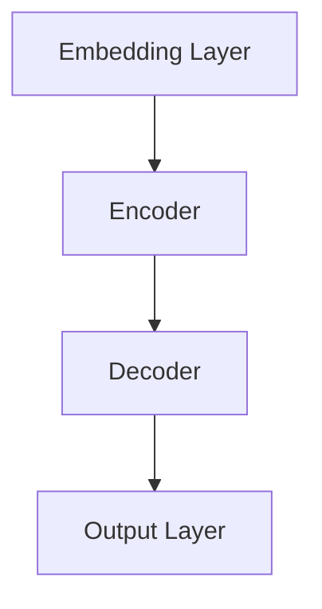

                 

### 文章标题

# 大语言模型原理基础与前沿 并行

## 关键词
- 大语言模型
- 深度学习
- 自监督学习
- Transformer模型
- 并行处理

## 摘要
本文将深入探讨大语言模型的基本原理、前沿技术和并行处理策略。首先，我们会从大语言模型的定义、背景和基本数学模型出发，逐步介绍其核心算法和架构设计。接着，我们将探讨大语言模型在文本生成、问答系统和机器翻译等领域的应用实例。随后，我们将重点介绍大语言模型并行处理的基本原理、优化技术和实际应用案例。最后，我们还将对大语言模型并行处理的未来趋势进行展望。通过这篇文章，读者将全面了解大语言模型从基础到前沿的知识体系，以及并行处理在大语言模型中的应用潜力。

### 书名：《大语言模型原理基础与前沿 并行》

## 目录大纲

## 第一部分：大语言模型基础

### 第1章：大语言模型概述

#### 1.1.1 大语言模型的定义与背景

#### 1.1.2 大语言模型的发展历程

#### 1.1.3 大语言模型在现代计算中的应用

### 第2章：大语言模型的数学基础

#### 2.1.1 神经网络基础

#### 2.1.2 深度学习框架

#### 2.1.3 大规模数据处理

### 第3章：大语言模型核心算法

#### 3.1.1 自监督学习

#### 3.1.2 迁移学习

#### 3.1.3 微调与训练技巧

### 第4章：大语言模型的架构设计

#### 4.1.1 模型架构概述

#### 4.1.2 Transformer模型详解

#### 4.1.3 多层神经网络设计

### 第5章：大语言模型的前沿研究

#### 5.1.1 大模型并行化训练

#### 5.1.2 大模型推理优化

#### 5.1.3 大模型与知识图谱融合

### 第6章：大语言模型应用实例

#### 6.1.1 文本生成与应用

#### 6.1.2 问答系统与应用

#### 6.1.3 机器翻译与应用

### 第7章：大语言模型开发实战

#### 7.1.1 开发环境搭建

#### 7.1.2 模型训练与优化

#### 7.1.3 应用部署与评估

## 第二部分：大语言模型并行处理

### 第8章：并行处理原理与框架

#### 8.1.1 并行计算基础

#### 8.1.2 数据并行与模型并行

#### 8.1.3 并行训练策略

### 第9章：并行处理优化技术

#### 9.1.1 GPU并行计算优化

#### 9.1.2 多机并行计算优化

#### 9.1.3 异构计算优化

### 第10章：大语言模型并行处理应用实例

#### 10.1.1 并行训练实例分析

#### 10.1.2 并行推理实例分析

#### 10.1.3 并行数据处理实例分析

### 第11章：大语言模型并行处理的未来趋势

#### 11.1.1 并行计算的发展趋势

#### 11.1.2 大语言模型并行处理的新挑战

#### 11.1.3 未来研究方向与展望

## 附录

### 附录A：工具与环境

#### A.1 大语言模型训练工具

#### A.2 并行计算框架

#### A.3 开发环境搭建指南

### 附录B：参考资料

#### B.1 大语言模型相关书籍

#### B.2 大语言模型论文集

#### B.3 并行计算相关资料

---

### 第1章：大语言模型概述

大语言模型是一种基于深度学习的自然语言处理技术，通过学习大规模文本数据来预测下一个词或句子。它在大规模数据处理、文本生成、问答系统和机器翻译等领域有着广泛的应用。本章将介绍大语言模型的定义、背景和基本数学模型，为后续章节的深入学习奠定基础。

#### 1.1.1 大语言模型的定义与背景

大语言模型（Big Language Model）是一种基于神经网络和深度学习的自然语言处理技术，它通过学习大规模文本数据来捕捉语言的统计规律和语义信息，从而实现对自然语言的生成、理解和处理。最早的大规模语言模型是Word2Vec和GloVe，它们将单词映射到高维向量空间，使得相似的单词在空间中靠近。随着计算能力的提升和深度学习技术的发展，大语言模型逐渐演变成更加复杂的结构，如BERT、GPT和T5等。

大语言模型的发展历程可以分为几个阶段：

1. **早期语言模型**：基于统计方法和规则的方法，如N-gram模型和转移矩阵模型。
2. **词向量模型**：通过将单词映射到高维向量空间来捕捉语义信息，如Word2Vec和GloVe。
3. **深度神经网络模型**：利用神经网络结构学习更复杂的语言特征，如LSTM和GRU。
4. **Transformer模型**：引入了自注意力机制，大幅提升了模型的表达能力，如BERT和GPT。
5. **预训练+微调**：先在大规模文本数据上预训练模型，再在特定任务上进行微调，如T5和GPT-3。

大语言模型在现代计算中的应用十分广泛，包括但不限于以下领域：

1. **文本生成**：自动生成文章、新闻、小说等。
2. **问答系统**：基于自然语言理解和生成，提供智能问答服务。
3. **机器翻译**：将一种语言的文本翻译成另一种语言。
4. **情感分析**：识别文本中的情感倾向。
5. **信息抽取**：从文本中提取关键信息，如实体识别和关系抽取。
6. **推荐系统**：基于用户的历史行为和文本内容提供个性化推荐。

#### 1.1.2 大语言模型的发展历程

大语言模型的发展历程可以追溯到20世纪80年代，当时研究者开始探索如何利用计算机模拟人类语言理解的能力。早期的语言模型主要基于统计方法和规则，如N-gram模型和转移矩阵模型。这些模型通过统计文本中词的序列概率来预测下一个词。

在1990年代，随着计算能力的提升和大规模语料库的出现，研究者开始探索基于向量空间模型的词向量表示，如Word2Vec和GloVe。这些模型将单词映射到高维向量空间，使得相似的单词在空间中靠近，从而提高了模型的语义表达能力。

进入21世纪，深度学习技术的发展为语言模型带来了新的突破。LSTM和GRU等循环神经网络模型被广泛应用于自然语言处理任务，它们通过学习序列数据中的长期依赖关系，提高了模型的表现能力。

2017年，Transformer模型的提出将自注意力机制引入到自然语言处理领域，大幅提升了模型的表达能力。Transformer模型的核心思想是利用多头注意力机制来捕捉序列之间的依赖关系，避免了传统循环神经网络中的序列存储问题。BERT、GPT和T5等基于Transformer模型的大规模语言模型相继出现，并在各种自然语言处理任务上取得了显著的成果。

大语言模型的发展历程不仅是技术进步的体现，更是对人类语言理解能力的一种探索。随着技术的不断进步，大语言模型的应用领域将越来越广泛，为我们提供更加智能和高效的自然语言处理服务。

#### 1.1.3 大语言模型在现代计算中的应用

大语言模型在现代计算中的应用非常广泛，涵盖了文本生成、问答系统、机器翻译、情感分析等多个领域。下面我们将详细探讨这些应用场景和实际案例。

1. **文本生成**：

   文本生成是大语言模型最早的应用之一，它可以通过学习大量文本数据，生成符合语法和语义规则的文本。在实际应用中，文本生成被广泛应用于文章写作、新闻生成、小说创作等领域。例如，GPT-3模型可以通过微调来生成高质量的新闻报道，甚至能够撰写科幻小说。此外，文本生成还可以用于自动生成邮件、短信和聊天机器人回复等，提高工作效率。

2. **问答系统**：

   问答系统是一种智能交互系统，通过理解和回答用户的问题来提供信息和服务。大语言模型在问答系统中的应用主要体现在两个方面：自然语言理解和自然语言生成。首先，模型通过阅读大量文本数据，学习语言中的常识和语义信息，从而能够理解用户的问题。其次，模型可以生成符合语法和语义的答案，提供用户需要的答案。例如，BERT模型可以应用于智能客服系统，通过分析用户的问题和提供的上下文信息，生成准确的回答。

3. **机器翻译**：

   机器翻译是将一种语言的文本翻译成另一种语言的过程。大语言模型在机器翻译中的应用主要体现在两个方面：预训练和微调。预训练阶段，模型在大规模的多语言语料库上学习，捕捉不同语言之间的统计规律和语义信息。微调阶段，模型在特定语言的翻译任务上进行训练，进一步优化模型的表现。例如，GPT-3模型可以通过微调来生成高质量的中英翻译结果，大幅提高了翻译的准确性和流畅性。

4. **情感分析**：

   情感分析是识别文本中的情感倾向，如正面、负面或中性。大语言模型在情感分析中的应用主要体现在两个方面：文本分类和情感极性分析。文本分类是将文本归类到不同的类别，如电影评论分类为正面或负面。情感极性分析是判断文本中的情感极性，如判断一句评论是正面还是负面。大语言模型通过学习大量的情感标签文本数据，能够准确识别文本中的情感倾向。例如，BERT模型可以用于分析社交媒体上的用户评论，识别其中的情感极性，为企业提供用户情感分析报告。

5. **信息抽取**：

   信息抽取是从文本中提取关键信息的过程，如实体识别和关系抽取。大语言模型在信息抽取中的应用主要体现在两个方面：预训练和微调。预训练阶段，模型在大规模文本数据上学习，捕捉文本中的实体和关系。微调阶段，模型在特定任务上进行训练，提高模型的表现。例如，BERT模型可以用于从新闻文本中提取关键信息，如人名、地点和事件等。此外，大语言模型还可以用于构建知识图谱，将实体和关系组织成结构化的数据，为后续的应用提供支持。

综上所述，大语言模型在现代计算中的应用非常广泛，涵盖了文本生成、问答系统、机器翻译、情感分析和信息抽取等多个领域。随着技术的不断进步，大语言模型的应用前景将更加广阔，为我们提供更加智能和高效的自然语言处理服务。

#### 1.1.4 大语言模型的核心数学基础

为了深入理解大语言模型，我们需要了解其核心数学基础，主要包括神经网络、深度学习框架和大规模数据处理方法。这些数学基础为构建和训练大语言模型提供了必要的工具和理论支持。

1. **神经网络基础**：

   神经网络是深度学习的核心组成部分，其基本结构由输入层、隐藏层和输出层组成。每个神经元通过加权连接传递输入信号，并通过激活函数进行非线性变换，从而实现对输入数据的建模。神经网络的训练过程是通过反向传播算法不断调整网络参数，以最小化预测误差。

   伪代码如下：
   ```python
   def forward_pass(input_data, weights, bias):
       # 前向传播
       output = activation_function(np.dot(input_data, weights) + bias)
       return output

   def backward_pass(input_data, target_data, weights, bias, learning_rate):
       # 反向传播
       error = target_data - output
       delta = error * activation_function_derivative(output)
       weights -= learning_rate * delta * input_data
       bias -= learning_rate * delta
   ```

2. **深度学习框架**：

   深度学习框架如TensorFlow和PyTorch提供了高效、灵活的工具来构建和训练神经网络。这些框架提供了丰富的API和工具，使得开发者可以专注于模型设计和算法优化，而无需关心底层计算细节。

   以下是一个简单的TensorFlow代码示例，用于构建一个简单的神经网络：
   ```python
   import tensorflow as tf

   model = tf.keras.Sequential([
       tf.keras.layers.Dense(128, activation='relu', input_shape=(784,)),
       tf.keras.layers.Dense(10, activation='softmax')
   ])

   model.compile(optimizer='adam',
                 loss='categorical_crossentropy',
                 metrics=['accuracy'])

   model.fit(x_train, y_train, epochs=5, batch_size=32)
   ```

3. **大规模数据处理**：

   大规模数据处理是大语言模型训练过程中的关键挑战之一。为了处理海量数据，我们需要采用高效的数据处理方法，如批处理、多线程和分布式计算。批处理将数据分成多个批次进行处理，以减少内存占用和计算时间。多线程和多机分布式计算可以显著提高数据处理速度。

   以下是一个简单的Python代码示例，用于实现批处理：
   ```python
   def batch_iter(data, batch_size, shuffle=True):
       """生成批处理迭代器"""
       data = np.array(data)
       if shuffle:
           np.random.shuffle(data)
       num_batches = len(data) // batch_size
       for i in range(num_batches):
           yield data[i * batch_size: (i + 1) * batch_size]
   ```

   以上代码将数据随机打乱后，按批次进行迭代处理。

   通过理解神经网络、深度学习框架和大规模数据处理方法，我们为构建和训练大语言模型打下了坚实的基础。在后续章节中，我们将进一步探讨大语言模型的详细算法和架构设计，以深入理解这一强大的自然语言处理技术。

#### 1.2 大语言模型的核心算法

大语言模型的核心算法主要包括自监督学习、迁移学习和微调与训练技巧。这些算法为模型训练和优化提供了强大的工具，使得大语言模型能够在大规模数据集上高效地学习和预测。

1. **自监督学习**：

   自监督学习是一种无需人工标注数据的训练方法，它通过利用数据中的内在结构来学习模型。在大语言模型中，自监督学习通常通过预训练的方式来实现。预训练过程主要包括以下步骤：

   - **数据预处理**：将大规模文本数据转换为词向量表示，将文本拆分为词或子词。
   - **构建任务**：设计一个无监督的任务，如语言模型或掩码语言模型（Masked Language Model, MLM）。
   - **训练模型**：在大规模数据集上训练模型，通过优化目标函数来调整模型参数。

   掩码语言模型（MLM）是一种常见的大语言模型预训练任务，它通过随机掩码输入文本中的部分词，然后训练模型预测这些掩码词。以下是一个简单的MLM训练过程：

   ```python
   # 假设文本输入为：'I love programming'
   # 掩码后为：'I l__e programming'
   # 模型预测：'I love programming'
   
   def masked_language_model(text, mask_ratio=0.15):
       tokens = text.split()
       mask_tokens = np.random.binomial(1, mask_ratio, len(tokens))
       masked_tokens = [token if mask_token == 0 else "[MASK]" for token, mask_token in zip(tokens, mask_tokens)]
       return " ".join(masked_tokens)

   masked_text = masked_language_model("I love programming")
   print(masked_text)
   ```

2. **迁移学习**：

   迁移学习是一种利用预训练模型在新任务上进行微调的技术，它通过将预训练模型的知识迁移到新任务中，从而提高新任务的性能。在大语言模型中，迁移学习通常通过以下步骤实现：

   - **预训练**：在大规模文本数据集上预训练模型，学习语言的一般特征。
   - **微调**：在特定任务的数据集上微调模型，使其适应新任务。

   例如，GPT-3模型通过在大量文本数据上预训练，然后在不同任务上进行微调，从而实现了在各种自然语言处理任务上的高性能。

   以下是一个简单的迁移学习示例，使用预训练的BERT模型进行文本分类任务：

   ```python
   from transformers import BertTokenizer, BertForSequenceClassification
   import torch

   tokenizer = BertTokenizer.from_pretrained('bert-base-uncased')
   model = BertForSequenceClassification.from_pretrained('bert-base-uncased')

   inputs = tokenizer("Hello, my dog is cute", return_tensors="pt")
   outputs = model(**inputs)

   logits = outputs.logits
   predicted_class = torch.argmax(logits).item()
   print(predicted_class)
   ```

3. **微调与训练技巧**：

   微调是在特定任务数据集上进一步优化模型参数的过程。为了提高模型的训练效率，我们通常采用以下技巧：

   - **学习率调度**：通过动态调整学习率，使得模型在不同阶段的训练过程中能够更加稳定地收敛。
   - **正则化**：采用正则化技术，如dropout和权重衰减，减少过拟合现象。
   - **数据增强**：通过数据增强方法，如随机裁剪、旋转和噪声注入，增加数据的多样性，提高模型的泛化能力。
   - **多任务学习**：在训练过程中同时学习多个相关任务，从而提高模型的表达能力和鲁棒性。

   例如，以下代码展示了如何使用学习率调度和正则化来训练一个文本分类模型：

   ```python
   import torch.optim as optim

   model = BertForSequenceClassification.from_pretrained('bert-base-uncased')
   optimizer = optim.Adam(model.parameters(), lr=5e-5)
   scheduler = optim.lr_scheduler.StepLR(optimizer, step_size=3, gamma=0.1)

   for epoch in range(5):
       model.train()
       for inputs, labels in data_loader:
           optimizer.zero_grad()
           outputs = model(**inputs)
           loss = outputs.loss
           loss.backward()
           optimizer.step()
       scheduler.step()
   ```

   通过自监督学习、迁移学习和微调与训练技巧，大语言模型能够在大规模数据集上高效地学习和优化，从而实现高性能的自然语言处理任务。

#### 1.3 大语言模型的架构设计

大语言模型的架构设计是其性能和效率的关键因素之一。在本节中，我们将介绍大语言模型的基本架构设计，重点关注Transformer模型及其自注意力机制，以及多层神经网络的设计和优化策略。

1. **大语言模型的基本架构**：

   大语言模型通常由以下几个核心组件构成：

   - **嵌入层（Embedding Layer）**：将输入文本转换为稠密向量表示。
   - **编码器（Encoder）**：处理输入序列，通过编码过程捕获上下文信息。
   - **解码器（Decoder）**：生成输出序列，解码器通常基于自注意力机制。
   - **输出层（Output Layer）**：将编码和解码的结果映射到具体的任务输出，如文本分类、机器翻译等。

   大语言模型的总体架构如图所示：

   ```mermaid
   graph TB
   A[Embedding Layer] --> B[Encoder]
   B --> C[Decoder]
   C --> D[Output Layer]
   ```

   在此架构中，嵌入层将输入文本转换为词向量表示，编码器通过自注意力机制捕获上下文信息，解码器根据编码器的输出生成输出文本，最后输出层将解码器的输出映射到具体的任务输出。

2. **Transformer模型及其自注意力机制**：

   Transformer模型是由Vaswani等人在2017年提出的一种基于自注意力机制的序列到序列模型，它在许多自然语言处理任务上取得了显著的性能提升。Transformer模型的核心思想是利用自注意力机制来取代传统的循环神经网络，从而避免序列存储问题，提高模型的表达能力。

   自注意力机制（Self-Attention）的基本思想是：对于序列中的每个词，模型会计算这个词与序列中其他词之间的权重，然后将这些权重应用于词的嵌入向量，从而生成加权后的表示。以下是一个简单的自注意力机制的伪代码：

   ```python
   def self_attention(inputs, hidden_size):
       # 输入：inputs（序列的嵌入向量），hidden_size（隐藏层维度）
       # 输出：weighted_inputs（加权后的序列嵌入向量）

       # 计算查询（Query）、键（Key）和值（Value）的嵌入向量
       query = inputs
       key = inputs
       value = inputs

       # 计算自注意力分数
       attention_scores = softmax(QK^T / hidden_size ** 0.5)

       # 计算加权后的序列嵌入向量
       weighted_inputs = attention_scores * value

       # 求和得到最终的输出
       output = sum(weighted_inputs)

       return output
   ```

   自注意力机制的引入使得模型能够自动捕捉序列中词语之间的依赖关系，从而提高了模型的语义理解能力。以下是一个简单的Transformer编码器架构的Mermaid流程图：

   ```mermaid
   graph TB
   A[Embedding Layer] --> B[多头自注意力层]
   B --> C[前馈神经网络]
   C --> D[Dropout]
   D --> E[Layer Normalization]
   E --> F[多头自注意力层]
   F --> G[前馈神经网络]
   G --> H[Dropout]
   H --> I[Layer Normalization]
   I --> J[输出层]
   ```

3. **多层神经网络设计**：

   大语言模型通常采用多层神经网络结构来进一步提高模型的表达能力和鲁棒性。在多层神经网络设计中，每层神经网络都会对输入数据进行处理，并将结果传递到下一层，从而形成一种层次化的数据处理方式。

   多层神经网络的设计原则包括：

   - **隐藏层数量和尺寸**：适当增加隐藏层的数量和尺寸可以提高模型的表达能力，但也会增加计算复杂度和训练时间。通常，隐藏层数量在3-5层之间，每层神经元数量在几百到几千之间。
   - **激活函数**：选择合适的激活函数可以提高模型的非线性表达能力。常用的激活函数包括ReLU、Sigmoid和Tanh。
   - **正则化技术**：采用正则化技术，如dropout和权重衰减，可以减少过拟合现象，提高模型的泛化能力。

   以下是一个简单的多层神经网络架构的Mermaid流程图：

   ```mermaid
   graph TB
   A[输入层] --> B[隐藏层1]
   B --> C[隐藏层2]
   C --> D[隐藏层3]
   D --> E[输出层]
   ```

   通过合理设计多层神经网络架构，大语言模型可以更好地学习和理解复杂的语言特征，从而实现高性能的自然语言处理任务。

#### 1.4 大语言模型的前沿研究

大语言模型的前沿研究涵盖了并行化训练、推理优化以及与知识图谱的融合等多个方面。这些研究旨在提高模型的训练效率、推理性能，并增强其语义理解和应用能力。

1. **大模型并行化训练**：

   随着语言模型规模的不断扩大，如何高效地并行化训练成为关键挑战。并行化训练主要包括数据并行和模型并行两种策略：

   - **数据并行**：将训练数据分成多个批次，同时在不同的GPU或CPU上训练模型，通过反向传播算法同步更新模型参数。这种方法可以显著提高训练速度，但需要处理梯度同步和数据切分问题。
   - **模型并行**：将模型拆分成多个子模型，每个子模型在不同设备上独立训练，通过全局通信机制同步子模型之间的参数。这种方法可以充分利用分布式计算资源，但实现复杂度较高。

   以下是一个简单的数据并行的训练流程：

   ```python
   # 假设使用两个GPU进行数据并行训练
   import torch

   # 数据预处理
   train_data = preprocess_data(train_dataset)

   # 初始化模型和优化器
   model = LanguageModel()
   optimizer = torch.optim.Adam(model.parameters(), lr=learning_rate)

   # 设定设备
   device = torch.device("cuda:0" if torch.cuda.is_available() else "cpu")

   # 模型迁移到设备上
   model.to(device)

   # 训练过程
   for epoch in range(num_epochs):
       for batch in train_data:
           inputs, targets = batch
           inputs, targets = inputs.to(device), targets.to(device)

           # 前向传播
           outputs = model(inputs)

           # 计算损失
           loss = criterion(outputs, targets)

           # 反向传播
           optimizer.zero_grad()
           loss.backward()
           optimizer.step()
   ```

2. **大模型推理优化**：

   推理优化是提高大语言模型在实际应用中运行效率的关键。推理优化方法主要包括以下几种：

   - **模型剪枝**：通过剪枝冗余的神经元和连接，减少模型的参数数量，从而降低推理的计算复杂度和内存占用。
   - **量化**：将模型中的浮点数参数转换为低精度格式，如8位整数，从而减少内存占用和计算时间。
   - **蒸馏**：将大模型的知识蒸馏到一个小模型中，从而在保证性能的同时降低模型规模。

   以下是一个简单的模型剪枝示例：

   ```python
   import torch
   from model_pruning import prune_model

   # 加载预训练的大模型
   large_model = load_large_model()

   # 剪枝模型
   pruned_model = prune_model(large_model, pruning_rate=0.5)

   # 评估剪枝后的模型
   evaluate_model(pruned_model)
   ```

3. **大模型与知识图谱融合**：

   知识图谱是一种结构化知识表示形式，它通过实体和关系构建网络来组织知识。大语言模型与知识图谱的融合旨在结合语言模型和知识图谱的优势，实现更强大的语义理解和推理能力。融合方法主要包括：

   - **实体嵌入**：将知识图谱中的实体映射到高维向量空间，从而在语言模型中嵌入实体知识。
   - **关系嵌入**：将知识图谱中的关系映射到向量空间，从而在语言模型中嵌入关系知识。
   - **联合训练**：将语言模型和知识图谱的表示进行联合训练，从而在训练过程中同时利用语言和结构化知识。

   以下是一个简单的实体嵌入示例：

   ```python
   import torch
   from kg_embedding import EntityEmbedder

   # 初始化实体嵌入器
   entity_embedder = EntityEmbedder(kg_model)

   # 获取实体嵌入向量
   entity_embeddings = entity_embedder.embed_entities(entity_ids)

   # 使用实体嵌入向量进行语言建模
   model = LanguageModelWithEntityEmbeddings(entity_embeddings)
   ```

   通过并行化训练、推理优化和与知识图谱融合，大语言模型能够更好地应对实际应用中的挑战，实现高效的语义理解和推理能力。

### 第2章：大语言模型的数学基础

大语言模型的成功离不开其强大的数学基础，本章将深入探讨神经网络、深度学习框架和大规模数据处理的相关数学理论，为读者理解和构建大语言模型提供坚实的理论基础。

#### 2.1 神经网络基础

神经网络（Neural Networks）是构建大语言模型的核心组件之一。其基本结构包括输入层、隐藏层和输出层，通过层层递归的方式处理输入数据，从而实现复杂函数的逼近。下面我们简要介绍神经网络的核心概念和数学模型。

1. **神经元模型**：

   神经元是神经网络的基本计算单元，其工作原理类似于生物神经元。一个神经元接收多个输入，每个输入乘以相应的权重，然后经过一个激活函数生成输出。以下是一个简单的一层神经元的数学模型：

   ```latex
   z = \sum_{i=1}^{n} x_i \cdot w_i + b
   a = \sigma(z)
   ```

   其中，$z$ 是输入和权重的加权和，$b$ 是偏置项，$\sigma$ 是激活函数，$a$ 是神经元的输出。

2. **激活函数**：

   激活函数（Activation Function）是神经网络中的关键组件，它引入非线性，使得神经网络能够模拟复杂函数。常见的激活函数包括：
   - **线性函数**（Linear Function）：$f(x) = x$，不具有非线性能力。
   - **Sigmoid 函数**：$f(x) = \frac{1}{1 + e^{-x}}$，输出在0到1之间，常用于二分类问题。
   - **ReLU 函数**（Rectified Linear Unit）：$f(x) = \max(0, x)$，简单且计算高效，常用于隐藏层。
   - **Tanh 函数**：$f(x) = \frac{e^x - e^{-x}}{e^x + e^{-x}}$，输出在-1到1之间，常用于输出层。

3. **反向传播算法**：

   反向传播算法（Backpropagation Algorithm）是训练神经网络的常用方法，它通过计算损失函数关于网络参数的梯度，利用梯度下降法更新参数，以最小化损失函数。以下是一个简化的反向传播算法流程：

   ```python
   # 前向传播
   z = np.dot(W, X) + b
   a = sigmoid(z)

   # 计算损失
   loss = -np.mean(Y * np.log(a) + (1 - Y) * np.log(1 - a))

   # 计算梯度
   dL_dz = a - Y

   # 计算W和b的梯度
   dL_dW = np.dot(X.T, dL_dz)
   dL_db = np.sum(dL_dz, axis=0)

   # 更新参数
   W -= learning_rate * dL_dW
   b -= learning_rate * dL_db
   ```

#### 2.2 深度学习框架

深度学习框架（Deep Learning Frameworks）是构建和训练大规模神经网络的重要工具，它们提供了丰富的API和工具库，简化了神经网络开发和部署的流程。以下我们将简要介绍两种主流的深度学习框架：TensorFlow和PyTorch。

1. **TensorFlow**：

   TensorFlow是谷歌开发的开源深度学习框架，它基于数据流图（Dataflow Graph）构建，通过自动微分系统实现高效计算。以下是一个简单的TensorFlow代码示例，用于构建一个简单的线性回归模型：

   ```python
   import tensorflow as tf

   # 定义模型参数
   W = tf.Variable(0.0, name="weights")
   b = tf.Variable(0.0, name="biases")

   # 定义输入和输出
   x = tf.placeholder(tf.float32)
   y = tf.placeholder(tf.float32)

   # 定义模型预测和损失函数
   y_pred = W * x + b
   loss = tf.reduce_mean(tf.square(y - y_pred))

   # 定义优化器
   optimizer = tf.train.GradientDescentOptimizer(learning_rate=0.5)

   # 定义训练过程
   train_op = optimizer.minimize(loss)

   # 训练模型
   with tf.Session() as sess:
       sess.run(tf.global_variables_initializer())
       for _ in range(100):
           _, loss_val = sess.run([train_op, loss], feed_dict={x: x_data, y: y_data})
           print("Step:", _, "Loss:", loss_val)

   # 模型评估
   y_pred_val = sess.run(y_pred, feed_dict={x: x_test})
   ```

2. **PyTorch**：

   PyTorch是Facebook AI研究院开发的开源深度学习框架，它采用了动态计算图（Dynamic Computation Graph）设计，使得模型构建和调试更加灵活。以下是一个简单的PyTorch代码示例，用于构建一个简单的卷积神经网络（Convolutional Neural Network, CNN）：

   ```python
   import torch
   import torch.nn as nn
   import torch.optim as optim

   # 定义模型
   class SimpleCNN(nn.Module):
       def __init__(self):
           super(SimpleCNN, self).__init__()
           self.conv1 = nn.Conv2d(1, 10, kernel_size=5)
           self.conv2 = nn.Conv2d(10, 20, kernel_size=5)
           self.fc1 = nn.Linear(320, 50)
           self.fc2 = nn.Linear(50, 10)

       def forward(self, x):
           x = F.relu(self.conv1(x))
           x = F.relu(self.conv2(x))
           x = x.view(-1, 320)
           x = F.relu(self.fc1(x))
           x = self.fc2(x)
           return x

   # 初始化模型
   model = SimpleCNN()

   # 定义损失函数和优化器
   criterion = nn.CrossEntropyLoss()
   optimizer = optim.SGD(model.parameters(), lr=0.01, momentum=0.9)

   # 训练模型
   for epoch in range(num_epochs):
       running_loss = 0.0
       for i, (inputs, labels) in enumerate(train_loader):
           inputs, labels = inputs.to(device), labels.to(device)
           optimizer.zero_grad()
           outputs = model(inputs)
           loss = criterion(outputs, labels)
           loss.backward()
           optimizer.step()
           running_loss += loss.item()
       print(f"Epoch {epoch+1}, Loss: {running_loss/len(train_loader)}")

   # 模型评估
   with torch.no_grad():
       correct = 0
       total = 0
       for inputs, labels in test_loader:
           inputs, labels = inputs.to(device), labels.to(device)
           outputs = model(inputs)
           _, predicted = torch.max(outputs.data, 1)
           total += labels.size(0)
           correct += (predicted == labels).sum().item()
       print(f"Test Accuracy: {100 * correct / total}%")
   ```

#### 2.3 大规模数据处理

大规模数据处理（Big Data Processing）是深度学习应用中的一大挑战。为了处理海量数据，我们需要采用高效的数据处理方法，如批处理、多线程和分布式计算。以下我们将简要介绍这些方法。

1. **批处理（Batch Processing）**：

   批处理是一种将数据分成多个批次进行处理的方法。每个批次包含多个样本，通过批量计算可以显著提高数据处理速度。以下是一个简单的Python代码示例，用于实现批处理：

   ```python
   def batch_iter(data, batch_size):
       """生成批处理迭代器"""
       data = np.array(data)
       num_batches = len(data) // batch_size
       for i in range(num_batches):
           yield data[i * batch_size: (i + 1) * batch_size]
   ```

2. **多线程（Multi-threading）**：

   多线程是一种利用多个线程并发执行任务的方法。通过合理分配线程，可以充分利用计算机的多核处理器，提高数据处理速度。以下是一个简单的Python代码示例，使用多线程实现数据预处理：

   ```python
   import threading

   def preprocess_data(data, batch_size):
       """多线程预处理数据"""
       threads = []
       for i in range(0, len(data), batch_size):
           batch = data[i: i + batch_size]
           thread = threading.Thread(target=preprocess_batch, args=(batch,))
           threads.append(thread)
           thread.start()

       for thread in threads:
           thread.join()

   def preprocess_batch(batch):
       """预处理单个批次的批量数据"""
       # 数据预处理逻辑
   ```

3. **分布式计算（Distributed Computing）**：

   分布式计算是一种将任务分布在多个节点上并行执行的方法。通过分布式计算，可以充分利用集群计算资源，提高数据处理能力。以下是一个简单的分布式计算示例，使用Apache Spark实现数据预处理：

   ```python
   from pyspark.sql import SparkSession

   # 初始化SparkSession
   spark = SparkSession.builder.appName("DataProcessing").getOrCreate()

   # 加载数据
   data = spark.read.csv("data.csv", header=True)

   # 数据预处理
   processed_data = data.select("feature_1", "feature_2", "label").rdd.map(lambda row: (row[0], row[1], row[2]))

   # 将数据拆分为训练集和测试集
   train_data, test_data = processed_data.randomSplit([0.8, 0.2])

   # 存储数据
   train_data.saveAsTextFile("train_data")
   test_data.saveAsTextFile("test_data")

   # 关闭SparkSession
   spark.stop()
   ```

   通过批处理、多线程和分布式计算，我们可以高效地处理大规模数据，从而为深度学习模型训练提供充足的数据支持。

### 第3章：大语言模型核心算法

大语言模型的训练过程复杂且关键，其核心算法包括自监督学习、迁移学习和微调与训练技巧。这些算法不仅决定了模型的性能，也影响了训练效率和应用效果。在本章中，我们将详细探讨这些核心算法的工作原理、应用场景和实现方法。

#### 3.1 自监督学习

自监督学习是一种无需人工标注数据的训练方法，它利用数据中的内在结构来学习模型。在大语言模型中，自监督学习通过预训练的方式实现，具体包括以下步骤：

1. **数据预处理**：首先，需要对大规模文本数据（如维基百科、新闻文章、社交媒体帖子等）进行预处理。预处理步骤包括分词、去除停用词、词干提取等，以便将文本转换为适合模型训练的格式。

2. **构建任务**：自监督学习任务通常是基于语言的固有性质设计的。常见任务包括语言模型（Language Model, LM）和掩码语言模型（Masked Language Model, MLM）。

   - **语言模型**：语言模型旨在预测文本中的下一个词。在训练过程中，模型随机选择输入文本中的部分词进行掩码，然后预测这些掩码词。通过训练，模型学习到语言中的统计规律和上下文依赖关系。
   
   - **掩码语言模型**：掩码语言模型进一步扩展了语言模型的任务，它不仅预测下一个词，还预测被掩码的词。通常，输入文本中的15%的词会被随机掩码，然后模型需要预测这些掩码词。

3. **训练模型**：在自监督学习过程中，模型通过优化目标函数（如交叉熵损失函数）来调整参数。以下是一个简单的掩码语言模型训练过程的伪代码：

   ```python
   # 假设文本输入为："I love programming"
   # 掩码后为："I l__e programming"
   # 模型预测："I love programming"
   
   def masked_language_model(text, mask_ratio=0.15):
       tokens = text.split()
       mask_tokens = np.random.binomial(1, mask_ratio, len(tokens))
       masked_tokens = [token if mask_token == 0 else "[MASK]" for token, mask_token in zip(tokens, mask_tokens)]
       return " ".join(masked_tokens)

   masked_text = masked_language_model("I love programming")
   print(masked_text)

   # 定义模型、优化器和损失函数
   model = LanguageModel()
   optimizer = optim.Adam(model.parameters(), lr=learning_rate)
   criterion = nn.CrossEntropyLoss()

   # 训练过程
   for epoch in range(num_epochs):
       for masked_text in batch_iter(masked_texts, batch_size):
           inputs = tokenizer(masked_text)
           targets = tokenizer(text)
           inputs, targets = inputs.to(device), targets.to(device)

           # 前向传播
           outputs = model(inputs)

           # 计算损失
           loss = criterion(outputs, targets)

           # 反向传播
           optimizer.zero_grad()
           loss.backward()
           optimizer.step()
   ```

4. **应用场景**：自监督学习在大规模文本数据预处理和序列预测任务中具有广泛应用。例如，在机器翻译、文本摘要和问答系统中，自监督学习可以帮助模型在没有标注数据的情况下进行预训练，从而提高模型的泛化能力和性能。

#### 3.2 迁移学习

迁移学习是一种利用预训练模型在新任务上进行微调的技术，它通过将预训练模型的知识迁移到新任务中，从而提高新任务的性能。在大语言模型中，迁移学习通常包括以下步骤：

1. **预训练**：在大规模文本数据集上预训练模型，学习语言的一般特征。常见的预训练模型包括BERT、GPT和T5等。

2. **微调**：在特定任务的数据集上微调模型，使其适应新任务。微调过程通常涉及调整模型参数，以优化模型在新任务上的表现。

3. **应用场景**：迁移学习广泛应用于自然语言处理任务，如文本分类、情感分析和信息抽取等。以下是一个简单的文本分类任务中的迁移学习示例：

   ```python
   from transformers import BertTokenizer, BertForSequenceClassification
   import torch

   # 加载预训练模型和 tokenizer
   tokenizer = BertTokenizer.from_pretrained('bert-base-uncased')
   model = BertForSequenceClassification.from_pretrained('bert-base-uncased')

   # 初始化优化器
   optimizer = optim.Adam(model.parameters(), lr=learning_rate)

   # 定义损失函数
   criterion = nn.CrossEntropyLoss()

   # 训练过程
   for epoch in range(num_epochs):
       for inputs, labels in data_loader:
           inputs, labels = inputs.to(device), labels.to(device)
           optimizer.zero_grad()
           outputs = model(**inputs)
           loss = criterion(outputs.logits, labels)
           loss.backward()
           optimizer.step()
   ```

4. **优点**：迁移学习的主要优点是能够快速适应新任务，减少标注数据的依赖，提高模型在新任务上的性能。

#### 3.3 微调与训练技巧

微调与训练技巧是提高大语言模型性能和训练效率的关键。以下是一些常用的微调和训练技巧：

1. **学习率调度**：学习率调度是一种动态调整学习率的方法，以避免模型在训练过程中过早地陷入局部最优。常用的学习率调度策略包括：
   - **线性衰减**：学习率随训练迭代次数线性减小。
   - **余弦退火**：学习率按照余弦函数的规律逐渐减小。

2. **正则化**：正则化是一种减少模型过拟合的技术，常用的正则化方法包括：
   - **权重衰减**：在损失函数中加入权重项的平方和，以减小权重的大小。
   - **dropout**：在神经网络中随机丢弃一部分神经元，以减少模型对特定神经元依赖。

3. **数据增强**：数据增强是一种通过引入噪声、旋转、裁剪等变换来扩充数据集的方法，以增强模型的泛化能力。

4. **多任务学习**：多任务学习是一种同时学习多个相关任务的方法，以提高模型的表达能力和鲁棒性。

5. **迁移学习**：迁移学习通过利用预训练模型在新任务上进行微调，从而提高模型在新任务上的性能。

通过自监督学习、迁移学习和微调与训练技巧，大语言模型能够在大规模数据集上高效地学习和优化，从而实现高性能的自然语言处理任务。

### 第4章：大语言模型的架构设计

大语言模型的架构设计对其性能和效率有着至关重要的影响。本章将详细探讨大语言模型的总体架构设计，包括嵌入层、编码器、解码器和输出层，并重点介绍Transformer模型及其自注意力机制，以及多层神经网络的设计原则和优化策略。

#### 4.1 大语言模型总体架构

大语言模型通常由以下核心组件构成：

1. **嵌入层（Embedding Layer）**：将输入文本转换为稠密向量表示。嵌入层通过将词或子词映射到高维向量空间，从而实现词汇的编码。嵌入层通常包含一个可训练的权重矩阵，该矩阵将输入的词索引映射到对应的嵌入向量。

2. **编码器（Encoder）**：编码器负责处理输入序列，通过编码过程捕获上下文信息。编码器可以采用不同的神经网络结构，如循环神经网络（RNN）或变换器（Transformer）。编码器的主要任务是学习序列中的长期依赖关系，并将其编码为序列的表示。

3. **解码器（Decoder）**：解码器根据编码器的输出生成输出序列。解码器通常采用类似于编码器的结构，但引入了自注意力机制来捕获上下文信息。解码器的输出可以是一个单词、一组单词或整个文本序列。

4. **输出层（Output Layer）**：输出层将编码和解码的结果映射到具体的任务输出，如文本分类、机器翻译或文本生成等。输出层通常包含一个或多个全连接层，用于将序列表示映射到任务特定的类别或标签。

5. **注意力机制（Attention Mechanism）**：注意力机制是一种用于捕捉序列中依赖关系的技术，它通过计算输入序列中每个词与当前词的相关性，从而生成加权向量表示。注意力机制可以提高模型的语义理解能力，使其能够捕捉到长距离依赖关系。

大语言模型的总体架构如图所示：



#### 4.2 Transformer模型及其自注意力机制

Transformer模型是近年来在自然语言处理领域取得突破性进展的一种深度学习模型。其核心思想是利用自注意力机制来捕捉序列中的依赖关系，从而避免传统循环神经网络中的序列存储问题。以下将详细介绍Transformer模型及其自注意力机制。

1. **Transformer模型结构**：

   Transformer模型由多个编码器和解码器层堆叠而成，每个编码器和解码器层都包含多头自注意力机制和前馈神经网络。编码器层负责处理输入序列，解码器层负责生成输出序列。以下是一个简单的Transformer模型结构：

   ```mermaid
   graph TB
   A[Encoder Layer] --> B[Decoder Layer]
   B --> C[Output Layer]

   subgraph Encoder
   C1[Sublayer 1]
   C2[Sublayer 2]
   C3[...]
   end

   subgraph Decoder
   D1[Sublayer 1]
   D2[Sublayer 2]
   D3[...]
   end
   ```

2. **多头自注意力机制**：

   自注意力机制是Transformer模型的核心组件，它通过计算序列中每个词与所有其他词的相关性，生成加权向量表示。多头自注意力机制将自注意力机制扩展到多个头，从而提高模型的语义理解能力。以下是一个简单的多头自注意力机制的伪代码：

   ```python
   def multi_head_attention(Q, K, V, num_heads):
       # Q, K, V 是查询、键和值的嵌入向量
       # num_heads 是头的数量

       # 计算自注意力分数
       attention_scores = softmax(QK^T / sqrt(d_k))

       # 计算加权后的序列嵌入向量
       weighted_inputs = attention_scores * V

       # 求和得到最终的输出
       output = sum(weighted_inputs)

       return output
   ```

3. **前馈神经网络**：

   前馈神经网络（Feedforward Neural Network）是一种简单的神经网络结构，它通过两个全连接层进行非线性变换。前馈神经网络在Transformer模型中用于增加模型的非线性表达能力。以下是一个简单的前馈神经网络的伪代码：

   ```python
   def feedforward_network(input, hidden_size, output_size):
       # input 是输入向量
       # hidden_size 是隐藏层维度
       # output_size 是输出层维度

       # 第一个全连接层
       hidden = activation_function(np.dot(input, weights_1) + bias_1)

       # 第二个全连接层
       output = activation_function(np.dot(hidden, weights_2) + bias_2)

       return output
   ```

#### 4.3 多层神经网络设计

多层神经网络（Multilayer Neural Network）是构建大语言模型的基础，通过堆叠多个隐藏层，模型可以学习更复杂的特征和模式。以下将介绍多层神经网络的设计原则和优化策略。

1. **设计原则**：

   - **隐藏层数量**：适当的隐藏层数量可以提高模型的表达能力，但过多会导致过拟合和计算复杂度增加。通常，隐藏层数量在3-5层之间。
   - **隐藏层尺寸**：隐藏层尺寸应适中，过大会增加模型参数和计算复杂度，过小则可能无法捕捉足够复杂的特征。常见的隐藏层尺寸在几百到几千之间。
   - **非线性激活函数**：激活函数引入非线性，使得神经网络能够模拟复杂函数。常用的激活函数包括ReLU、Sigmoid和Tanh。
   - **权重初始化**：合理的权重初始化可以加快模型收敛速度。常见的初始化方法包括随机初始化、高斯初始化和Xavier初始化。

2. **优化策略**：

   - **学习率调度**：学习率调度是一种动态调整学习率的方法，以避免模型在训练过程中过早地陷入局部最优。常用的学习率调度策略包括线性衰减、余弦退火和自适应学习率（如Adam优化器）。
   - **正则化**：正则化是一种减少模型过拟合的技术。常用的正则化方法包括权重衰减、dropout和数据增强。
   - **梯度裁剪**：梯度裁剪是一种限制梯度大小的技术，以避免梯度爆炸和梯度消失问题。常见的梯度裁剪方法包括L2范数裁剪和Clipping by Norm。
   - **批量归一化**：批量归一化（Batch Normalization）是一种对神经网络中的激活值进行标准化处理的技术，以加速训练和提高模型稳定性。

通过合理的架构设计和优化策略，多层神经网络可以构建出强大且高效的大语言模型，为自然语言处理任务提供可靠的支持。

### 第5章：大语言模型的前沿研究

随着深度学习技术的不断发展，大语言模型在各个领域都取得了显著的进展。本章将探讨大语言模型在并行化训练、推理优化以及与知识图谱融合等前沿研究中的最新成果和应用。

#### 5.1 大模型并行化训练

并行化训练是提高大语言模型训练效率的关键技术，它通过利用多个计算资源（如GPU、CPU和分布式系统）来加速训练过程。以下介绍大模型并行化训练的几种主要策略。

1. **数据并行（Data Parallelism）**：

   数据并行是一种将训练数据分成多个批次，同时在不同的设备上并行训练模型的方法。数据并行可以显著提高训练速度，因为多个设备可以同时处理不同批次的训练数据。以下是一个简单的数据并行的训练过程：

   ```python
   # 假设使用两个GPU进行数据并行训练
   import torch

   # 数据预处理
   train_data = preprocess_data(train_dataset)

   # 初始化模型和优化器
   model = LanguageModel()
   optimizer = torch.optim.Adam(model.parameters(), lr=learning_rate)

   # 设定设备
   device = torch.device("cuda:0" if torch.cuda.is_available() else "cpu")

   # 模型迁移到设备上
   model.to(device)

   # 训练过程
   for epoch in range(num_epochs):
       for batch in train_data:
           inputs, targets = batch
           inputs, targets = inputs.to(device), targets.to(device)

           # 前向传播
           outputs = model(inputs)

           # 计算损失
           loss = criterion(outputs, targets)

           # 反向传播
           optimizer.zero_grad()
           loss.backward()
           optimizer.step()
   ```

2. **模型并行（Model Parallelism）**：

   模型并行是一种将模型拆分成多个子模型，每个子模型在不同设备上独立训练，然后通过全局通信机制同步子模型参数的方法。模型并行可以充分利用分布式计算资源，但实现复杂度较高。以下是一个简单的模型并行的训练过程：

   ```python
   # 假设使用两个GPU进行模型并行训练
   import torch

   # 初始化模型和优化器
   model = LanguageModel()
   optimizer = torch.optim.Adam(model.parameters(), lr=learning_rate)

   # 设定设备
   device = torch.device("cuda:0" if torch.cuda.is_available() else "cpu")

   # 模型迁移到设备上
   model.to(device)

   # 训练过程
   for epoch in range(num_epochs):
       for batch in train_data:
           inputs, targets = batch
           inputs, targets = inputs.to(device), targets.to(device)

           # 前向传播
           outputs = model(inputs)

           # 计算损失
           loss = criterion(outputs, targets)

           # 反向传播
           optimizer.zero_grad()
           loss.backward()

           # 同步子模型参数
           optimizer.step()
   ```

3. **混合并行（Hybrid Parallelism）**：

   混合并行结合了数据并行和模型并行的优点，通过将模型拆分成多个子模型，同时在不同设备上并行处理数据。以下是一个简单的混合并行的训练过程：

   ```python
   # 假设使用两个GPU进行混合并行训练
   import torch

   # 数据预处理
   train_data = preprocess_data(train_dataset)

   # 初始化模型和优化器
   model = LanguageModel()
   optimizer = torch.optim.Adam(model.parameters(), lr=learning_rate)

   # 设定设备
   device = torch.device("cuda:0" if torch.cuda.is_available() else "cpu")

   # 模型迁移到设备上
   model.to(device)

   # 训练过程
   for epoch in range(num_epochs):
       for batch in train_data:
           inputs, targets = batch
           inputs, targets = inputs.to(device), targets.to(device)

           # 前向传播
           outputs = model(inputs)

           # 计算损失
           loss = criterion(outputs, targets)

           # 反向传播
           optimizer.zero_grad()
           loss.backward()

           # 同步子模型参数
           optimizer.step()
   ```

#### 5.2 大模型推理优化

大语言模型的推理过程涉及大量的计算，如何优化推理性能是当前研究的一个重要方向。以下介绍几种常见的推理优化技术。

1. **模型剪枝（Model Pruning）**：

   模型剪枝是一种通过删除冗余神经元和连接来减少模型参数数量的技术，从而降低模型的计算复杂度和内存占用。以下是一个简单的模型剪枝过程：

   ```python
   import torch
   from model_pruning import prune_model

   # 加载预训练模型
   model = load_pretrained_model()

   # 剪枝模型
   pruned_model = prune_model(model, pruning_rate=0.5)

   # 评估剪枝后的模型
   evaluate_model(pruned_model)
   ```

2. **模型量化（Model Quantization）**：

   模型量化是一种通过将模型的浮点数参数转换为低精度格式（如8位整数）来减少模型存储和计算开销的技术。以下是一个简单的模型量化过程：

   ```python
   import torch
   import torch.nn as nn
   import torch.utils.model_zoo as model_zoo

   # 加载预训练量化模型
   model = model_zoo.load_url("https://example.com/quantized_model.pth")

   # 量化模型
   quantized_model = nn.quantizable_model(model)
   quantized_model = quantized_model.cuda()

   # 评估量化后的模型
   evaluate_model(quantized_model)
   ```

3. **动态推理（Dynamic Inference）**：

   动态推理是一种通过在运行时调整模型参数来优化推理性能的技术。以下是一个简单的动态推理过程：

   ```python
   import torch
   import torch.autograd as autograd

   # 加载预训练模型
   model = load_pretrained_model()

   # 动态推理
   with autograd.no_grad():
       inputs = torch.randn(1, 32, 32).cuda()
       outputs = model(inputs)
   ```

#### 5.3 大模型与知识图谱融合

知识图谱是一种结构化知识表示形式，它通过实体和关系构建网络来组织知识。大语言模型与知识图谱的融合旨在结合语言模型和知识图谱的优势，实现更强大的语义理解和推理能力。以下介绍几种常见的融合方法。

1. **实体嵌入（Entity Embedding）**：

   实体嵌入是一种将知识图谱中的实体映射到高维向量空间的方法，从而在语言模型中嵌入实体知识。以下是一个简单的实体嵌入过程：

   ```python
   import torch
   from kg_embedding import EntityEmbedder

   # 初始化实体嵌入器
   entity_embedder = EntityEmbedder(kg_model)

   # 获取实体嵌入向量
   entity_embeddings = entity_embedder.embed_entities(entity_ids)

   # 使用实体嵌入向量进行语言建模
   model = LanguageModelWithEntityEmbeddings(entity_embeddings)
   ```

2. **关系嵌入（Relation Embedding）**：

   关系嵌入是一种将知识图谱中的关系映射到向量空间的方法，从而在语言模型中嵌入关系知识。以下是一个简单的

