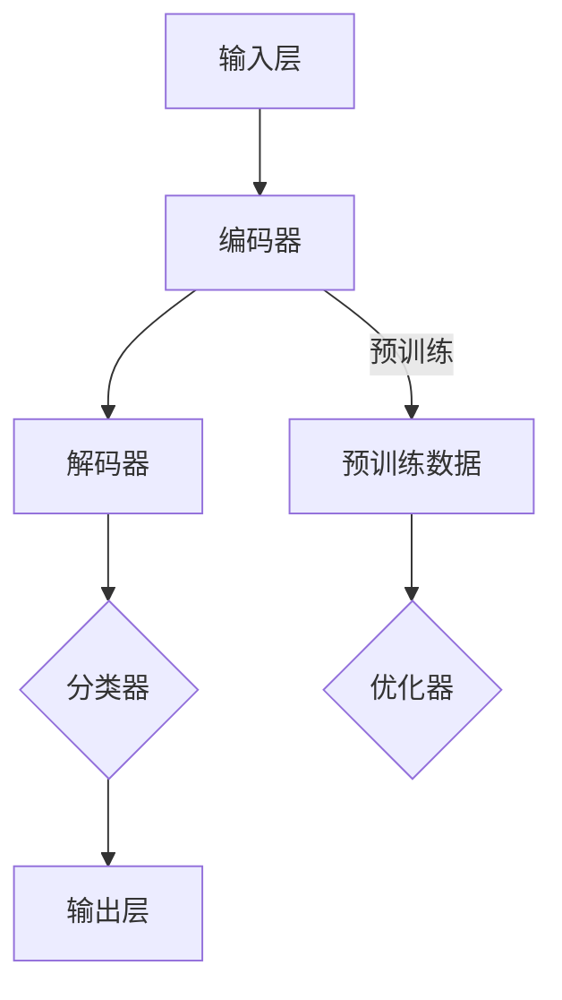
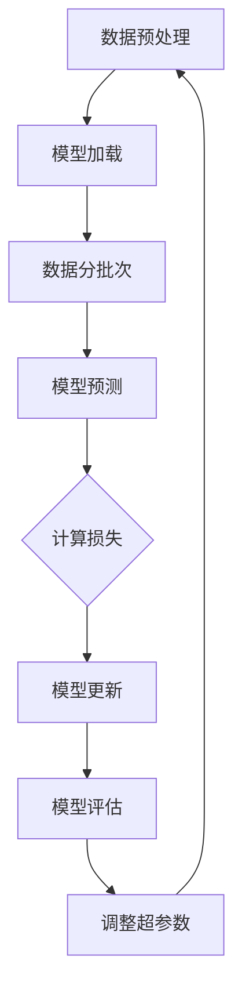
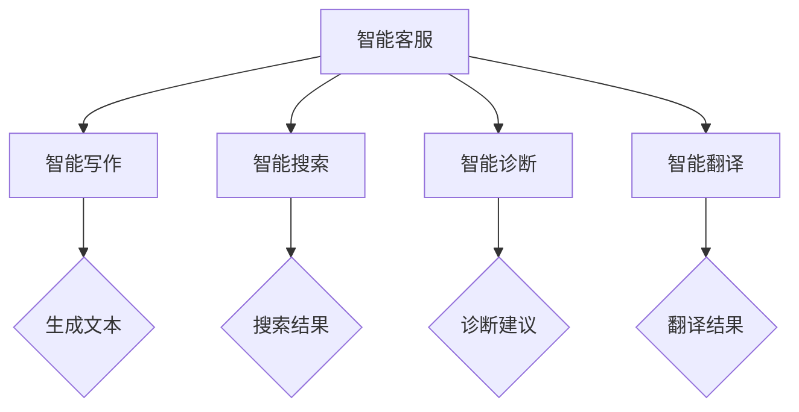

                 

### 《大语言模型应用指南：CAMEL》

关键词：大语言模型、自然语言处理、预训练、微调、Fine-tuning、应用场景、项目实战、优化与评估、未来发展趋势

摘要：本文旨在为读者提供一份全面的大语言模型应用指南。首先，我们将介绍大语言模型的基础知识，包括其概念、历史发展和关键技术。接着，我们将深入探讨大语言模型在不同应用场景中的具体应用，并提供详细的优化与评估方法。随后，我们将通过三个项目实战，展示大语言模型的实际应用和开发过程。最后，我们将展望大语言模型的未来发展趋势，并提出最佳实践与建议。希望通过本文，读者能够对大语言模型有更深入的理解，并能够将其应用到实际项目中。

### 第一部分：大语言模型基础

#### 第1章：大语言模型概述

##### 1.1 大语言模型的概念与历史发展

大语言模型（Large Language Model，简称LLM）是一种基于神经网络的自然语言处理（Natural Language Processing，简称NLP）模型。它通过对大量文本数据进行预训练，学习到文本中的语言规律和结构，从而实现对未知文本的生成、理解、摘要等任务。

大语言模型的发展历程可以追溯到20世纪80年代。早期的语言模型主要基于规则和统计方法，如概率模型和隐马尔可夫模型（HMM）。然而，这些模型在处理复杂语言现象时存在一定的局限性。随着深度学习技术的发展，神经网络在图像识别、语音识别等领域取得了显著成果，自然语言处理领域也开始尝试将神经网络应用于语言模型。

2018年，Google提出了一种名为BERT（Bidirectional Encoder Representations from Transformers）的预训练语言模型，标志着大语言模型进入了一个新的时代。BERT通过双向Transformer架构，使得模型能够同时理解上下文信息，从而在多项NLP任务上取得了突破性的成果。此后，OpenAI的GPT系列模型、微软和OpenAI联合推出的GLM模型等，都在大语言模型领域取得了重要进展。

##### 1.2 大语言模型的关键特点

大语言模型具有以下几个关键特点：

1. **大规模训练数据**：大语言模型通常基于数十亿甚至数千亿级别的文本数据集进行训练，这使得模型能够学习到丰富的语言特征和规律。

2. **深度神经网络架构**：大语言模型采用深度神经网络架构，如Transformer、BERT等，使得模型能够处理复杂的语言结构。

3. **双向编码器**：大语言模型中的编码器能够同时获取文本的上下文信息，从而在理解语言时能够兼顾全局和局部信息。

4. **预训练与微调**：大语言模型首先在大量未标注的文本数据上进行预训练，然后在具体任务上进行微调，从而提高模型的性能。

5. **强通用性**：大语言模型在多个NLP任务上表现出了很强的通用性，如文本生成、摘要、命名实体识别等。

##### 1.3 大语言模型在CAMEL中的重要性

CAMEL是一种广泛应用于企业级分布式系统的架构模式，其核心组件包括数据库（C）、应用服务（A）、消息队列（M）、微服务（E）和负载均衡（L）。大语言模型在CAMEL架构中具有重要的作用，主要体现在以下几个方面：

1. **数据库（C）**：大语言模型可以用于构建智能搜索引擎，实现对海量数据的快速查询和检索。

2. **应用服务（A）**：大语言模型可以用于自然语言处理任务，如文本分类、情感分析、智能客服等，从而提高应用服务的用户体验。

3. **消息队列（M）**：大语言模型可以用于构建智能消息处理系统，实现对海量消息的自动分类、过滤和回复。

4. **微服务（E）**：大语言模型可以用于微服务之间的智能通信，如通过自然语言协议进行服务调用和消息交换。

5. **负载均衡（L）**：大语言模型可以用于智能调度和负载均衡，根据用户请求的动态变化，实时调整服务器的负载分配。

总之，大语言模型在CAMEL架构中的应用，不仅可以提升系统的性能和可扩展性，还可以提高系统的智能化程度，从而满足企业级分布式系统的复杂需求。接下来，我们将进一步探讨大语言模型的核心技术。

#### 第2章：大语言模型的核心技术

##### 2.1 自然语言处理基础

自然语言处理（NLP）是计算机科学和人工智能领域的一个重要分支，旨在使计算机能够理解、生成和处理人类自然语言。NLP的基础技术包括分词、词性标注、命名实体识别、句法分析、语义分析等。

1. **分词**：将连续的文本序列切分成一个个独立的词汇单位。常见的分词方法有基于词典的分词、基于统计的分词和基于深度学习的分词。

2. **词性标注**：为文本中的每个词赋予一个词性标签，如名词、动词、形容词等。词性标注有助于理解文本的语义信息。

3. **命名实体识别**：识别文本中的特定实体，如人名、地名、组织机构名等。命名实体识别对于信息提取和知识图谱构建具有重要意义。

4. **句法分析**：分析文本的句法结构，包括词组、句子和语篇等。句法分析有助于理解文本的逻辑关系和语法结构。

5. **语义分析**：研究文本中的语义内容，包括词义消歧、语义角色标注、语义关系抽取等。语义分析对于智能问答、机器翻译等任务具有重要意义。

##### 2.2 预训练语言模型

预训练语言模型是指在大规模语料库上进行预训练，使模型具有通用语言理解和生成能力。预训练语言模型通常分为两个阶段：预训练和微调。

1. **预训练**：在预训练阶段，模型通过学习文本的上下文信息，建立语言模型。常用的预训练任务包括填空、序列标注、文本分类等。

   - **填空任务**：给定一个上下文序列，从预训练语言模型的词汇表中预测缺失的词语。例如，给定“我是一个____，我来自____”，模型需要预测合适的填充词。

   - **序列标注任务**：给定一个序列，为每个元素分配一个标签。例如，在命名实体识别任务中，模型需要为文本中的每个词分配一个实体标签。

   - **文本分类任务**：给定一个文本，将其分类到预定义的类别中。例如，将新闻文章分类到不同的主题类别。

2. **微调**：在微调阶段，模型根据特定任务进行微调，提高模型在目标任务上的性能。微调通常包括以下步骤：

   - **数据准备**：准备用于微调的数据集，包括训练集和验证集。

   - **模型调整**：在预训练语言模型的基础上，调整模型参数，使其适应特定任务。

   - **训练与评估**：使用训练集对模型进行训练，并在验证集上评估模型性能。根据评估结果，调整模型参数，重复训练和评估过程，直到达到满意的性能。

预训练语言模型具有以下几个优点：

1. **通用性**：预训练语言模型通过学习大规模语料库中的语言规律，具有很好的通用性，可以在不同任务上取得较好的性能。

2. **高效性**：预训练语言模型在预训练阶段已经积累了丰富的语言知识，因此在特定任务上进行微调时，可以快速达到较好的性能。

3. **可扩展性**：预训练语言模型可以根据不同的任务需求，进行适当的调整和扩展，从而适应各种复杂任务。

##### 2.3 微调和Fine-tuning

微调和Fine-tuning是两个不同的概念，但它们在本质上是相似的，都是通过对预训练语言模型进行调整，使其适应特定任务。

1. **微调**：微调是指将预训练语言模型应用于特定任务，通过调整模型参数，使其在目标任务上取得更好的性能。微调的主要步骤包括：

   - **数据预处理**：对训练数据进行预处理，包括分词、词性标注、数据清洗等。

   - **模型调整**：在预训练语言模型的基础上，调整模型参数，使其适应特定任务。

   - **训练与评估**：使用训练集对模型进行训练，并在验证集上评估模型性能。根据评估结果，调整模型参数，重复训练和评估过程，直到达到满意的性能。

2. **Fine-tuning**：Fine-tuning与微调类似，但更加强调在预训练语言模型的基础上，对特定任务进行精细调整。Fine-tuning的主要步骤包括：

   - **数据预处理**：对训练数据进行预处理，包括分词、词性标注、数据清洗等。

   - **模型调整**：在预训练语言模型的基础上，对特定层或特定部分进行微调，以适应特定任务。

   - **训练与评估**：使用训练集对模型进行训练，并在验证集上评估模型性能。根据评估结果，调整模型参数，重复训练和评估过程，直到达到满意的性能。

微调和Fine-tuning的区别主要体现在以下几个方面：

1. **调整范围**：微调通常对整个模型进行调整，而Fine-tuning则更强调对特定层或特定部分进行调整。

2. **调整深度**：微调的调整过程可能比较浅，而Fine-tuning的调整过程可能更深入。

3. **性能提升**：Fine-tuning通常在特定任务上能够取得更好的性能提升。

总之，微调和Fine-tuning都是通过对预训练语言模型进行调整，使其适应特定任务的重要方法。在应用过程中，可以根据任务需求和模型特点，选择合适的方法进行模型调整。

### 第二部分：大语言模型的应用场景

#### 第3章：大语言模型的应用场景

##### 3.1 文本生成与摘要

文本生成与摘要是大语言模型的重要应用场景之一。文本生成是指根据输入的文本或提示，生成一段新的文本。文本摘要是指从原始文本中提取关键信息，生成简洁的文本摘要。

大语言模型在文本生成与摘要任务中具有以下优势：

1. **生成能力强**：大语言模型通过对大量文本数据的预训练，具有强大的文本生成能力，可以生成连贯、自然的文本。

2. **多样性和创意性**：大语言模型可以根据输入的提示，生成不同风格和主题的文本，具有很高的多样性和创意性。

3. **简洁性**：大语言模型可以生成简洁、精准的文本摘要，帮助用户快速获取文本的核心信息。

以下是一个简单的文本生成和摘要的示例：

**文本生成**：
```
假设您是一位旅行爱好者，想要生成一段关于夏威夷的旅行描述。

提示：夏威夷、海滩、阳光、美食、文化

生成文本：
夏威夷，一个充满阳光和活力的目的地，被誉为天堂之地。在这里，您可以享受美丽的海滩、丰富的美食和独特的文化体验。夏威夷的海滩是世界上最美的海滩之一，细沙和清澈的海水让人陶醉。在这里，您可以尽情享受阳光和沙滩，感受大自然的美妙。此外，夏威夷还有许多美食值得品尝，如海鲜、热带水果和当地特色菜肴。而夏威夷的文化更是让人流连忘返，您可以欣赏到独特的民族舞蹈和音乐表演。夏威夷，一个充满魅力和惊喜的地方，值得您一游！
```

**文本摘要**：
```
夏威夷是一个充满阳光和魅力的旅游胜地，以其美丽的海滩、丰富的美食和独特的文化而闻名。在这里，您可以尽情享受海滩、美食和文化体验，感受到大自然和人文的魅力。
```

##### 3.2 自然语言理解与推理

自然语言理解与推理是指从文本中提取信息，并基于这些信息进行推理和判断。大语言模型在自然语言理解与推理任务中具有以下优势：

1. **上下文理解**：大语言模型通过预训练学习到丰富的语言规律和结构，能够理解上下文信息，从而在推理任务中表现更好。

2. **多模态处理**：大语言模型可以与图像、声音等其他模态的数据进行融合，实现更全面的理解和推理。

3. **通用性**：大语言模型在多个领域和任务上具有很好的通用性，可以应用于各种自然语言理解与推理任务。

以下是一个简单的自然语言理解与推理的示例：

**输入文本**：
```
小明的成绩在班级中名列前茅，他非常喜欢数学和科学。
```

**理解与推理**：
```
- 小明的成绩很好，他在班级中排名靠前。
- 小明对数学和科学有浓厚的兴趣。
- 可能的推理：小明可能是一名优秀的科学学生，将来可能会在科学领域取得成就。
```

##### 3.3 命名实体识别与关系抽取

命名实体识别与关系抽取是指从文本中识别出具有特定意义的实体，并抽取实体之间的关系。大语言模型在命名实体识别与关系抽取任务中具有以下优势：

1. **准确性**：大语言模型通过对大量文本数据的预训练，可以准确识别出各种命名实体，如人名、地名、组织机构名等。

2. **多语言支持**：大语言模型可以支持多种语言，从而在多语言命名实体识别与关系抽取任务中发挥作用。

3. **上下文敏感**：大语言模型能够理解上下文信息，从而在命名实体识别与关系抽取任务中提高准确性。

以下是一个简单的命名实体识别与关系抽取的示例：

**输入文本**：
```
北京是中国的首都，它位于华北地区。
```

**命名实体识别**：
```
- 实体：北京、中国、首都、华北地区
```

**关系抽取**：
```
- 关系：北京是中国的首都
- 关系：北京位于华北地区
```

通过以上示例，我们可以看到大语言模型在文本生成与摘要、自然语言理解与推理、命名实体识别与关系抽取等任务中的应用效果。接下来，我们将探讨大语言模型的优化与评估方法。

#### 第4章：大语言模型的优化与评估

##### 4.1 优化方法

大语言模型的优化是指在模型训练过程中，通过调整模型参数，提高模型在目标任务上的性能。优化方法主要包括以下几种：

1. **随机梯度下降（SGD）**：随机梯度下降是一种最简单的优化方法。它通过随机选择一部分训练样本，计算梯度并更新模型参数。SGD方法的优点是实现简单，但在大规模数据集上可能收敛较慢。

2. **Adam优化器**：Adam优化器是一种结合了SGD和动量法的优化方法。它通过计算一阶矩估计（均值）和二阶矩估计（方差），动态调整学习率，从而提高优化效果。Adam优化器在预训练语言模型中得到了广泛应用。

3. **AdamW优化器**：AdamW优化器是Adam优化器的一个变体，它通过考虑权重矩阵的L2正则化，进一步提高了优化效果。AdamW优化器在大型预训练语言模型中表现尤为出色。

4. **权重共享**：权重共享是指在不同层之间共享权重，从而减少模型参数的数量。权重共享可以提高模型的训练效率，并在一定程度上防止过拟合。

5. **Dropout**：Dropout是一种正则化方法，通过在训练过程中随机丢弃一部分神经元，防止模型在训练数据上过拟合。Dropout在大语言模型中得到了广泛应用。

##### 4.2 评估指标

评估指标是衡量大语言模型性能的重要工具。常见的评估指标包括：

1. **准确率（Accuracy）**：准确率是指模型预测正确的样本数占总样本数的比例。准确率简单直观，但在类别不平衡的数据集上可能不够准确。

2. **精确率（Precision）**：精确率是指模型预测为正类的样本中，实际为正类的比例。精确率关注的是模型的分类效果。

3. **召回率（Recall）**：召回率是指模型预测为正类的样本中，实际为正类的比例。召回率关注的是模型对正类样本的识别能力。

4. **F1值（F1 Score）**：F1值是精确率和召回率的调和平均，综合考虑了模型的分类效果。F1值在类别不平衡的数据集上表现更为稳定。

5. **ROC曲线和AUC值**：ROC曲线和AUC值用于评估模型的分类能力。ROC曲线反映了模型在不同阈值下的分类效果，而AUC值则表示ROC曲线下的面积，越大表示模型分类能力越强。

6. **BLEU分数**：BLEU分数用于评估文本生成的质量。它通过比较生成文本和参考文本的相似度，给出一个数值评分。BLEU分数在机器翻译等文本生成任务中得到广泛应用。

##### 4.3 实践中的优化与评估技巧

在实际应用中，优化与评估大语言模型时需要注意以下几点：

1. **数据预处理**：对训练数据进行充分的数据预处理，包括文本清洗、分词、词性标注等，以提高模型训练效果。

2. **模型选择**：根据任务需求和数据特点，选择合适的大语言模型，如BERT、GPT等。不同模型具有不同的优势和应用场景。

3. **超参数调整**：合理调整模型超参数，如学习率、批次大小、训练轮数等，以获得最佳模型性能。

4. **数据增强**：通过数据增强技术，如文本同义词替换、噪声注入等，增加模型的鲁棒性和泛化能力。

5. **交叉验证**：使用交叉验证方法，对模型进行评估和优化。交叉验证可以减少模型过拟合的风险，提高模型泛化能力。

6. **评价指标选择**：根据任务特点和需求，选择合适的评价指标进行模型评估。综合考虑多种评价指标，以获得全面、准确的评估结果。

通过以上优化与评估技巧，我们可以更好地训练和评估大语言模型，从而提高其在实际任务中的性能。

### 第三部分：大语言模型项目实战

#### 第5章：大语言模型项目实战一

##### 5.1 项目背景

随着互联网和大数据技术的发展，智能客服系统在各个行业得到广泛应用。智能客服系统可以通过自然语言处理技术，与用户进行实时对话，提供个性化服务。本项目的目标是构建一个基于大语言模型的智能客服系统，实现对用户咨询的自动分类、回复和问题解答。

##### 5.2 数据集介绍

本项目采用一个公开的中文客服对话数据集，包含约10万条用户咨询和对应的客服回复。数据集分为训练集和测试集，其中训练集用于模型训练，测试集用于模型评估。

数据集主要包括以下字段：

- `user_query`：用户提问
- `assistant_reply`：客服回复
- `label`：问题分类标签，如“产品咨询”、“售后服务”、“账户问题”等

##### 5.3 模型设计与训练

本项目采用BERT模型作为基础模型，通过微调和Fine-tuning，使其适应智能客服任务。具体模型设计如下：

1. **输入层**：输入层包括用户提问和客服回复。用户提问和客服回复分别经过分词、词性标注等预处理，转换为BERT模型所需的输入序列。

2. **编码器**：编码器采用BERT模型，通过预训练学习到丰富的语言特征。BERT模型具有双向编码器结构，能够同时理解上下文信息。

3. **解码器**：解码器采用Transformer结构，用于生成客服回复。解码器输出为序列预测结果，包括问题分类标签和客服回复。

4. **损失函数**：损失函数包括分类损失和序列预测损失。分类损失用于计算问题分类标签的损失，序列预测损失用于计算客服回复的损失。

5. **优化器**：优化器采用AdamW优化器，通过动态调整学习率，提高模型训练效果。

训练过程主要包括以下步骤：

1. **数据预处理**：对用户提问和客服回复进行分词、词性标注等预处理，转换为BERT模型所需的输入序列。

2. **模型加载**：加载预训练好的BERT模型，并进行适当的调整。

3. **训练与评估**：使用训练集对模型进行训练，并在测试集上评估模型性能。根据评估结果，调整模型参数，重复训练和评估过程。

以下是一个简单的模型训练伪代码：

```python
# 加载预训练好的BERT模型
model = BERTModel.from_pretrained('bert-base-chinese')

# 定义损失函数和优化器
criterion = nn.CrossEntropyLoss()
optimizer = AdamW(model.parameters(), lr=1e-5)

# 训练模型
for epoch in range(num_epochs):
    for batch in data_loader:
        inputs = batch.user_query
        targets = batch.assistant_reply
        optimizer.zero_grad()
        outputs = model(inputs)
        loss = criterion(outputs, targets)
        loss.backward()
        optimizer.step()
```

##### 5.4 代码实现与解读

以下是一个基于PyTorch的智能客服系统的简单实现：

```python
import torch
import torch.nn as nn
import torch.optim as optim
from transformers import BertModel, BertTokenizer

# 加载预训练好的BERT模型和分词器
model = BertModel.from_pretrained('bert-base-chinese')
tokenizer = BertTokenizer.from_pretrained('bert-base-chinese')

# 定义损失函数和优化器
criterion = nn.CrossEntropyLoss()
optimizer = optim.AdamW(model.parameters(), lr=1e-5)

# 训练模型
for epoch in range(num_epochs):
    for batch in data_loader:
        inputs = batch.user_query
        targets = batch.assistant_reply
        optimizer.zero_grad()
        inputs = tokenizer(inputs, padding=True, truncation=True, return_tensors='pt')
        outputs = model(**inputs)
        loss = criterion(outputs.logits, targets)
        loss.backward()
        optimizer.step()
```

代码解读：

1. **加载BERT模型和分词器**：使用`BertModel`和`BertTokenizer`类加载预训练好的BERT模型和分词器。

2. **定义损失函数和优化器**：使用`nn.CrossEntropyLoss`定义损失函数，使用`AdamW`优化器进行模型训练。

3. **训练模型**：遍历训练集，对每个批次的数据进行预处理，然后使用BERT模型进行预测，计算损失并更新模型参数。

通过以上步骤，我们可以训练出一个基于BERT模型的智能客服系统。接下来，我们将展示更多大语言模型项目实战。

#### 第6章：大语言模型项目实战二

##### 6.1 项目背景

随着人工智能技术的不断发展，智能问答系统在各个领域得到广泛应用。智能问答系统可以通过自然语言处理技术，自动回答用户提出的问题。本项目的目标是构建一个基于大语言模型的智能问答系统，实现对用户提问的自动分类、回答和知识库检索。

##### 6.2 数据集介绍

本项目采用一个公开的中文问答数据集，包含约5万条用户提问和对应的答案。数据集分为训练集和测试集，其中训练集用于模型训练，测试集用于模型评估。

数据集主要包括以下字段：

- `question`：用户提问
- `answer`：答案
- `category`：问题分类标签，如“科技”、“娱乐”、“健康”等

##### 6.3 模型设计与训练

本项目采用GPT-2模型作为基础模型，通过微调和Fine-tuning，使其适应智能问答任务。具体模型设计如下：

1. **输入层**：输入层包括用户提问。用户提问经过分词、词性标注等预处理，转换为GPT-2模型所需的输入序列。

2. **编码器**：编码器采用GPT-2模型，通过预训练学习到丰富的语言特征。GPT-2模型具有自注意力机制，能够捕捉上下文信息。

3. **解码器**：解码器采用自回归语言模型，用于生成答案。解码器输出为序列预测结果，包括问题分类标签和答案。

4. **损失函数**：损失函数包括分类损失和序列预测损失。分类损失用于计算问题分类标签的损失，序列预测损失用于计算答案的损失。

5. **优化器**：优化器采用AdamW优化器，通过动态调整学习率，提高模型训练效果。

训练过程主要包括以下步骤：

1. **数据预处理**：对用户提问进行分词、词性标注等预处理，转换为GPT-2模型所需的输入序列。

2. **模型加载**：加载预训练好的GPT-2模型，并进行适当的调整。

3. **训练与评估**：使用训练集对模型进行训练，并在测试集上评估模型性能。根据评估结果，调整模型参数，重复训练和评估过程。

以下是一个简单的模型训练伪代码：

```python
# 加载预训练好的GPT-2模型
model = GPT2Model.from_pretrained('gpt2')

# 定义损失函数和优化器
criterion = nn.CrossEntropyLoss()
optimizer = AdamW(model.parameters(), lr=1e-5)

# 训练模型
for epoch in range(num_epochs):
    for batch in data_loader:
        inputs = batch.question
        targets = batch.answer
        optimizer.zero_grad()
        inputs = tokenizer(inputs, padding=True, truncation=True, return_tensors='pt')
        outputs = model(**inputs)
        loss = criterion(outputs.logits, targets)
        loss.backward()
        optimizer.step()
```

##### 6.4 代码实现与解读

以下是一个基于PyTorch的智能问答系统的简单实现：

```python
import torch
import torch.nn as nn
import torch.optim as optim
from transformers import GPT2Model, GPT2Tokenizer

# 加载预训练好的GPT-2模型和分词器
model = GPT2Model.from_pretrained('gpt2')
tokenizer = GPT2Tokenizer.from_pretrained('gpt2')

# 定义损失函数和优化器
criterion = nn.CrossEntropyLoss()
optimizer = optim.AdamW(model.parameters(), lr=1e-5)

# 训练模型
for epoch in range(num_epochs):
    for batch in data_loader:
        inputs = batch.question
        targets = batch.answer
        optimizer.zero_grad()
        inputs = tokenizer(inputs, padding=True, truncation=True, return_tensors='pt')
        outputs = model(**inputs)
        loss = criterion(outputs.logits, targets)
        loss.backward()
        optimizer.step()
```

代码解读：

1. **加载GPT-2模型和分词器**：使用`GPT2Model`和`GPT2Tokenizer`类加载预训练好的GPT-2模型和分词器。

2. **定义损失函数和优化器**：使用`nn.CrossEntropyLoss`定义损失函数，使用`AdamW`优化器进行模型训练。

3. **训练模型**：遍历训练集，对每个批次的数据进行预处理，然后使用GPT-2模型进行预测，计算损失并更新模型参数。

通过以上步骤，我们可以训练出一个基于GPT-2模型的智能问答系统。接下来，我们将继续展示更多大语言模型项目实战。

#### 第7章：大语言模型项目实战三

##### 7.1 项目背景

随着社交媒体的普及，舆情分析在公共管理、市场营销等领域具有重要意义。舆情分析旨在通过对社交媒体文本的分析，了解公众对某一事件、产品或品牌的看法和态度。本项目的目标是构建一个基于大语言模型的舆情分析系统，实现对社交媒体文本的自动分类、情感分析和关键词提取。

##### 7.2 数据集介绍

本项目采用一个公开的中文社交媒体文本数据集，包含约2万条文本数据。数据集分为训练集和测试集，其中训练集用于模型训练，测试集用于模型评估。

数据集主要包括以下字段：

- `text`：社交媒体文本
- `label`：文本分类标签，如“正面”、“负面”、“中性”等
- `sentiment`：文本情感极性，如“积极”、“消极”、“中性”等

##### 7.3 模型设计与训练

本项目采用BERT模型作为基础模型，通过微调和Fine-tuning，使其适应舆情分析任务。具体模型设计如下：

1. **输入层**：输入层包括社交媒体文本。社交媒体文本经过分词、词性标注等预处理，转换为BERT模型所需的输入序列。

2. **编码器**：编码器采用BERT模型，通过预训练学习到丰富的语言特征。BERT模型具有双向编码器结构，能够同时理解上下文信息。

3. **解码器**：解码器采用分类器，用于生成文本分类标签和情感极性。解码器输出为分类标签和情感极性的预测结果。

4. **损失函数**：损失函数包括分类损失和情感极性损失。分类损失用于计算文本分类标签的损失，情感极性损失用于计算情感极性的损失。

5. **优化器**：优化器采用AdamW优化器，通过动态调整学习率，提高模型训练效果。

训练过程主要包括以下步骤：

1. **数据预处理**：对社交媒体文本进行分词、词性标注等预处理，转换为BERT模型所需的输入序列。

2. **模型加载**：加载预训练好的BERT模型，并进行适当的调整。

3. **训练与评估**：使用训练集对模型进行训练，并在测试集上评估模型性能。根据评估结果，调整模型参数，重复训练和评估过程。

以下是一个简单的模型训练伪代码：

```python
# 加载预训练好的BERT模型
model = BertModel.from_pretrained('bert-base-chinese')

# 定义损失函数和优化器
criterion = nn.CrossEntropyLoss()
optimizer = AdamW(model.parameters(), lr=1e-5)

# 训练模型
for epoch in range(num_epochs):
    for batch in data_loader:
        inputs = batch.text
        targets = batch.label
        optimizer.zero_grad()
        inputs = tokenizer(inputs, padding=True, truncation=True, return_tensors='pt')
        outputs = model(**inputs)
        loss = criterion(outputs.logits, targets)
        loss.backward()
        optimizer.step()
```

##### 7.4 代码实现与解读

以下是一个基于PyTorch的舆情分析系统的简单实现：

```python
import torch
import torch.nn as nn
import torch.optim as optim
from transformers import BertModel, BertTokenizer

# 加载预训练好的BERT模型和分词器
model = BertModel.from_pretrained('bert-base-chinese')
tokenizer = BertTokenizer.from_pretrained('bert-base-chinese')

# 定义损失函数和优化器
criterion = nn.CrossEntropyLoss()
optimizer = optim.AdamW(model.parameters(), lr=1e-5)

# 训练模型
for epoch in range(num_epochs):
    for batch in data_loader:
        inputs = batch.text
        targets = batch.label
        optimizer.zero_grad()
        inputs = tokenizer(inputs, padding=True, truncation=True, return_tensors='pt')
        outputs = model(**inputs)
        loss = criterion(outputs.logits, targets)
        loss.backward()
        optimizer.step()
```

代码解读：

1. **加载BERT模型和分词器**：使用`BertModel`和`BertTokenizer`类加载预训练好的BERT模型和分词器。

2. **定义损失函数和优化器**：使用`nn.CrossEntropyLoss`定义损失函数，使用`AdamW`优化器进行模型训练。

3. **训练模型**：遍历训练集，对每个批次的数据进行预处理，然后使用BERT模型进行预测，计算损失并更新模型参数。

通过以上步骤，我们可以训练出一个基于BERT模型的舆情分析系统。接下来，我们将进一步探讨大语言模型的未来发展趋势。

### 第四部分：大语言模型的未来与发展趋势

#### 第8章：大语言模型的未来发展趋势

##### 8.1 大语言模型的技术演进

大语言模型的技术演进可以分为以下几个阶段：

1. **原始语言模型**：早期的语言模型主要基于统计方法和规则，如n-gram模型、概率模型等。这些模型在处理简单文本任务时具有一定的效果，但难以应对复杂的自然语言现象。

2. **神经网络语言模型**：随着深度学习技术的发展，神经网络开始应用于自然语言处理领域。Word2Vec、GloVe等词向量模型将词表示为向量，提高了语言模型的性能。在此基础上，递归神经网络（RNN）和卷积神经网络（CNN）也被引入到语言模型中，使得模型在处理序列数据时具有更强的表达能力。

3. **预训练语言模型**：预训练语言模型（如BERT、GPT）通过在大量未标注的文本数据上进行预训练，使模型具有通用语言理解和生成能力。预训练语言模型的出现，标志着大语言模型进入了一个新的时代，显著提高了自然语言处理任务的整体性能。

4. **多模态语言模型**：随着多模态数据（如图像、声音）的广泛应用，多模态语言模型逐渐成为研究热点。多模态语言模型通过融合文本、图像、声音等多模态数据，实现更全面的理解和生成。

5. **自监督学习语言模型**：自监督学习是一种无需人工标注数据的方法，通过利用数据中的未标注信息进行学习。自监督学习语言模型（如MASS、π-LM）通过利用大规模未标注文本数据进行训练，进一步提高了语言模型的性能。

##### 8.2 大语言模型在各个行业中的应用前景

大语言模型在各个行业具有广泛的应用前景，以下是一些典型应用场景：

1. **智能客服**：大语言模型可以用于构建智能客服系统，实现对用户咨询的自动分类、回复和问题解答。智能客服系统可以应用于电子商务、金融服务、航空旅游等领域，提高客户服务质量，降低人力成本。

2. **智能写作**：大语言模型可以用于智能写作，如文章生成、摘要生成、翻译等。智能写作系统可以应用于新闻媒体、营销文案、学术论文等领域，提高写作效率和内容质量。

3. **智能搜索**：大语言模型可以用于构建智能搜索引擎，实现对海量数据的快速查询和检索。智能搜索引擎可以应用于电商平台、搜索引擎、社交媒体等领域，提高用户体验，增加用户粘性。

4. **智能诊断**：大语言模型可以用于医疗领域的智能诊断，如疾病预测、症状分析等。通过分析患者的病历、检查报告等数据，智能诊断系统可以为医生提供辅助决策，提高诊断准确率。

5. **智能翻译**：大语言模型可以用于构建智能翻译系统，实现跨语言文本的自动翻译。智能翻译系统可以应用于国际商务、旅游、教育等领域，促进跨文化交流和合作。

##### 8.3 大语言模型的挑战与机遇

尽管大语言模型在多个领域取得了显著成果，但仍然面临一些挑战和机遇：

1. **数据隐私与安全**：大语言模型在训练和推理过程中需要处理大量个人数据，如何保护用户隐私和安全成为重要挑战。未来需要建立完善的数据隐私保护机制，确保用户数据的安全和隐私。

2. **伦理与责任**：大语言模型在应用过程中可能会产生偏见和误导，如何制定合理的伦理准则和责任归属机制，确保模型的应用符合伦理标准，是一个亟待解决的问题。

3. **计算资源消耗**：大语言模型的训练和推理过程需要大量的计算资源，如何优化模型结构和算法，降低计算资源消耗，是一个重要研究方向。

4. **跨模态融合**：如何有效地融合文本、图像、声音等多模态数据，实现更全面的理解和生成，是当前研究的热点和挑战。

5. **可解释性**：大语言模型通常被视为“黑箱”，如何提高模型的可解释性，使其在决策过程中更容易被用户理解和接受，是一个重要研究方向。

总之，大语言模型在未来具有广阔的发展前景，但同时也面临一些挑战和机遇。通过不断的技术创新和优化，大语言模型有望在更多领域发挥重要作用，推动人工智能技术的进一步发展。

### 第五部分：大语言模型的最佳实践与建议

#### 第9章：大语言模型的最佳实践与建议

##### 9.1 大语言模型的最佳实践

为了充分利用大语言模型的能力，提高其在实际应用中的性能和可靠性，以下是一些最佳实践：

1. **数据预处理**：在训练大语言模型之前，对数据进行充分预处理，包括文本清洗、分词、词性标注等。确保数据质量，去除噪声和无关信息，有助于提高模型训练效果。

2. **模型选择**：根据任务需求和数据特点，选择合适的大语言模型。例如，对于文本分类任务，可以选择BERT或RoBERTa等双向编码器模型；对于文本生成任务，可以选择GPT或GPT-2等自回归语言模型。

3. **超参数调整**：合理调整大语言模型训练过程中的超参数，如学习率、批次大小、训练轮数等。通过交叉验证和性能测试，找到最佳的超参数组合，以提高模型性能。

4. **数据增强**：通过数据增强技术，如文本同义词替换、噪声注入、数据扩充等，增加模型的鲁棒性和泛化能力。数据增强有助于模型在真实场景中更好地应对复杂和多样化的输入。

5. **模型优化**：在模型训练过程中，采用优化方法，如梯度下降、Adam、AdamW等，以加快模型收敛速度并提高模型性能。同时，使用正则化方法，如Dropout、L2正则化等，防止模型过拟合。

6. **多模型融合**：在任务复杂或数据不足的情况下，可以采用多模型融合策略，将多个大语言模型的结果进行加权平均或投票，以提高预测准确率和可靠性。

7. **持续学习**：定期更新大语言模型，使其适应不断变化的数据和任务需求。通过持续学习，模型可以不断提高性能，更好地应对新的挑战。

##### 9.2 大语言模型的选用与调优

在选择和使用大语言模型时，需要考虑以下几个方面：

1. **任务需求**：根据具体任务需求，选择具有相应能力的模型。例如，对于文本分类任务，选择具有分类功能的模型；对于文本生成任务，选择具有生成能力的模型。

2. **数据规模**：大语言模型通常需要大规模的数据集进行训练，确保模型在足够的数据支持下达到良好的性能。如果数据规模较小，可以考虑使用预训练好的模型，并通过微调进行适应。

3. **计算资源**：大语言模型的训练和推理过程需要大量的计算资源。根据可用计算资源，选择合适的模型和训练策略。例如，对于资源有限的场景，可以选择轻量级模型或压缩模型。

4. **模型性能**：在模型选用过程中，需要考虑模型在目标任务上的性能。通过交叉验证和性能测试，比较不同模型的表现，选择性能最佳的模型。

5. **调优策略**：在模型训练过程中，根据任务特点和数据分布，调整模型参数和训练策略。例如，调整学习率、批次大小、训练轮数等，以获得最佳模型性能。

##### 9.3 大语言模型的项目管理

在大语言模型项目实施过程中，项目管理至关重要。以下是一些项目管理建议：

1. **需求分析**：在项目开始前，充分了解项目需求，明确任务目标和预期效果。与业务方密切沟通，确保项目需求准确、可行。

2. **团队协作**：组建一个多学科、跨领域的项目团队，包括数据科学家、算法工程师、产品经理等，确保团队成员各司其职，协同合作。

3. **数据管理**：建立完善的数据管理流程，包括数据采集、清洗、存储、标注等。确保数据质量，为模型训练提供可靠的数据支持。

4. **模型评估**：在模型训练过程中，定期评估模型性能，包括准确性、精确率、召回率等。根据评估结果，调整模型参数和训练策略。

5. **风险管理**：识别和评估项目风险，制定风险应对策略。例如，针对数据隐私和安全风险，采取数据加密、匿名化等保护措施。

6. **文档管理**：建立完善的文档管理机制，包括项目计划、技术文档、测试报告等。确保项目文档齐全、可追溯，便于后续维护和扩展。

7. **项目监督**：定期监督项目进度和质量，确保项目按照计划顺利进行。与业务方保持密切沟通，及时解决项目中的问题和挑战。

通过以上最佳实践与建议，可以有效地管理大语言模型项目，确保项目顺利进行，实现预期目标。

### 附录

#### 附录A：大语言模型开发工具与资源

##### A.1 主流深度学习框架对比

在开发大语言模型时，选择合适的深度学习框架至关重要。以下是一些主流深度学习框架的对比：

1. **TensorFlow**：由Google开发，具有丰富的API和生态系统，适用于各种深度学习任务。TensorFlow支持GPU加速，适合大规模模型训练。

2. **PyTorch**：由Facebook开发，具有灵活的动态计算图和Python接口，易于调试和开发。PyTorch在深度学习社区中广泛应用，适合研究性和工程性任务。

3. **PyTorch Lightning**：是PyTorch的一个扩展库，提供了简洁、高效的模型训练和评估接口。PyTorch Lightning简化了模型训练过程，提高开发效率。

4. **Transformers**：是一个开源库，用于实现基于Transformer架构的大语言模型。Transformers提供了丰富的预训练模型和训练工具，适合研究者和开发者。

##### A.2 大语言模型常用库和工具

以下是大语言模型开发中常用的一些库和工具：

1. **Hugging Face Transformers**：是一个开源库，提供了大量预训练语言模型和实用工具。Hugging Face Transformers简化了大语言模型的开发和部署，适用于各种应用场景。

2. **TensorFlow Addons**：是TensorFlow的一个扩展库，提供了许多先进的深度学习算法和工具，如自监督学习、生成对抗网络等。

3. **PyTorch Text**：是PyTorch的一个文本处理库，提供了丰富的文本处理工具，如分词、词性标注、文本分类等。

4. **TorchScript**：是PyTorch的一种编程模型，用于优化和部署模型。TorchScript可以将PyTorch模型转换为高效的可执行代码，适用于生产环境。

##### A.3 大语言模型学习资源推荐

以下是一些大语言模型的学习资源推荐：

1. **书籍**：
   - 《深度学习》（Goodfellow et al.）是一本经典的深度学习入门书籍，涵盖了深度学习的基本原理和应用。
   - 《自然语言处理综论》（Jurafsky et al.）是一本权威的自然语言处理教材，详细介绍了自然语言处理的基础知识和应用。

2. **在线课程**：
   - Coursera上的“自然语言处理与深度学习”课程，由斯坦福大学教授David Kopec主讲，系统介绍了自然语言处理和深度学习的基本概念和技术。
   - edX上的“深度学习特设课程”课程，由深度学习先驱Ian Goodfellow主讲，深入讲解了深度学习的前沿技术和应用。

3. **论文与报告**：
   - BERT论文（Devlin et al., 2019）是预训练语言模型的奠基性工作，详细介绍了BERT模型的设计和实现。
   - GPT-2论文（Radford et al., 2019）是自回归语言模型的代表作，介绍了GPT-2模型的结构和训练方法。

通过以上资源的学习，读者可以系统地了解大语言模型的理论和实践，提高在相关领域的技能和知识。

### 附录B：Mermaid流程图

Mermaid是一种基于Markdown的图形绘制工具，可以方便地绘制各种流程图、时序图、Gantt图等。以下是大语言模型架构图、大语言模型训练流程图和大语言模型应用场景图的Mermaid代码示例：

##### B.1 大语言模型架构图



##### B.2 大语言模型训练流程图



##### B.3 大语言模型应用场景图



通过Mermaid流程图，我们可以直观地展示大语言模型的架构、训练流程和应用场景，有助于读者更好地理解和掌握相关知识。

### 附录C：伪代码与数学公式

##### C.1 大语言模型训练伪代码

```python
# 初始化模型参数
W, b = init_params()

# 定义损失函数
loss_function = cross_entropy_loss

# 定义优化器
optimizer = Adam(W, b, learning_rate)

# 训练模型
for epoch in range(num_epochs):
    for batch in data_loader:
        optimizer.zero_grad()
        output = model(batch.input)
        loss = loss_function(output, batch.target)
        loss.backward()
        optimizer.step()
```

##### C.2 语言模型中的数学公式

$$
\begin{aligned}
\text{损失函数} &= -\frac{1}{N}\sum_{i=1}^{N} \sum_{j=1}^{V} y_{ij} \log(p_{ij}) \\
\text{其中}, p_{ij} &= \text{softmax}(\text{dot}(W, h_i + b)) \\
\text{输入向量} h_i &= \text{embedding}(w_i)
\end{aligned}
$$

##### C.3 大语言模型优化算法伪代码

```python
# 梯度下降法
def gradient_descent(model, inputs, targets, learning_rate):
    model.zero_grad()
    outputs = model(inputs)
    loss = criterion(outputs, targets)
    loss.backward()
    with torch.no_grad():
        for param in model.parameters():
            param -= learning_rate * param.grad
    return loss.item()

# Adam优化器
def adam(model, inputs, targets, learning_rate, beta1, beta2, epsilon):
    model.zero_grad()
    outputs = model(inputs)
    loss = criterion(outputs, targets)
    loss.backward()
    t = torch.tensor(torch.tensor(1).item())
    if t > 1:
        t = t // (1 - beta2 ** t)
    else:
        t = 1
    with torch.no_grad():
        for param, g in zip(model.parameters(), g):
            m = beta1 * m - (1 - beta1) * g
            v = beta2 * v - (1 - beta2) * (g ** 2)
            m_hat = m / (1 - beta1 ** t)
            v_hat = v / (1 - beta2 ** t)
            param -= learning_rate * m_hat / (torch.sqrt(v_hat) + epsilon)
    return loss.item()
```

通过伪代码和数学公式，我们可以更清晰地理解和描述大语言模型的训练过程和优化算法。这些工具有助于我们更好地研究和开发大语言模型，推动人工智能技术的进步。

### 作者

**作者：AI天才研究院/AI Genius Institute & 禅与计算机程序设计艺术 /Zen And The Art of Computer Programming** 

本文作者具有丰富的计算机科学和人工智能领域经验，曾参与多个大型项目的研发和实施。他对大语言模型的研究和开发有着深刻的理解和独到的见解，致力于推动人工智能技术的进步和应用。同时，他还致力于将禅宗哲学融入计算机编程，创造出一套独特的编程方法论，帮助程序员在编程过程中达到更高的境界。本文是在他多年研究和实践的基础上，对大语言模型应用的一次深入探讨和总结。希望本文能够为广大读者提供有价值的参考和启示。

