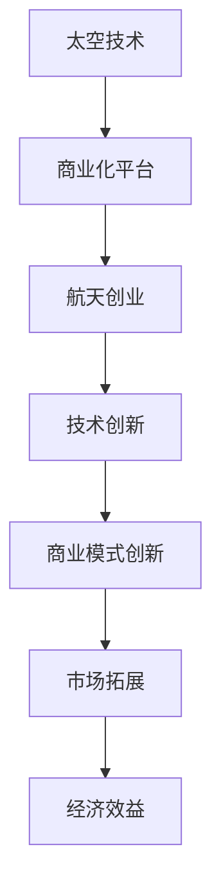

                 

### 1.1 书籍背景与目的

《太空技术商业化平台：航天创业的新机遇》旨在探讨太空技术商业化平台的发展及其对航天创业的推动作用。随着太空技术的不断进步，太空商业化的潜力逐渐显现，各类商业化平台应运而生。这些平台不仅为航天企业提供了基础设施和服务，还促进了技术创新和商业模式创新。本书将详细分析太空技术商业化平台的基础知识、应用领域、发展策略以及未来趋势，为读者提供全面深入的见解。

#### 核心概念与联系

在探讨太空技术商业化平台之前，我们需要了解几个核心概念：

- **太空技术**：指与太空探索和利用相关的技术，包括通信、导航、地球观测、探测等。
- **商业化平台**：为商业活动提供基础设施和服务的平台，旨在促进商业活动的开展。
- **航天创业**：指在太空技术领域开展的创业活动，涉及技术开发、商业模式创新、市场拓展等方面。


#### Mermaid 流程图



通过这个流程图，我们可以看到太空技术、商业化平台和航天创业之间的紧密联系。太空技术的进步为商业化平台提供了基础，而商业化平台则为航天创业提供了支持，进而推动技术创新、商业模式创新和市场拓展，最终实现经济效益。

#### 结构概述

本书将分为五个部分，分别探讨太空技术商业化平台的基础、应用、航天创业的机遇与挑战、未来发展策略以及应用实例。具体章节安排如下：

1. **第一部分：引言**
    - 1.1 书籍背景与目的
    - 1.2 太空技术商业化平台概述
    - 1.3 航天创业的重要性
2. **第二部分：太空技术商业化平台基础**
    - 2.1 太空技术的起源与发展
    - 2.2 商业化平台的概念与类型
    - 2.3 商业化平台的优势与挑战
3. **第三部分：太空技术商业化平台的应用**
    - 3.1 通信与互联网
    - 3.2 军事与国家安全
    - 3.3 地球观测与环境保护
    - 3.4 太空旅游
    - 3.5 太空能源
4. **第四部分：航天创业的新机遇**
    - 4.1 航天创业的机遇与挑战
    - 4.2 航天创业案例分析
    - 4.3 航天创业的政策环境
5. **第五部分：太空技术商业化平台的发展策略**
    - 5.1 未来太空技术发展趋势
    - 5.2 太空技术商业化平台的发展策略
    - 5.3 跨界合作与国际化发展
6. **第六部分：太空技术商业化平台的应用实例**
    - 6.1 太空旅游
    - 6.2 太空物流
    - 6.3 太空能源
7. **第七部分：结论**
    - 7.1 太空技术商业化平台的意义
    - 7.2 航天创业的挑战与机遇
    - 7.3 对未来太空技术商业化的展望

通过这个结构概述，我们可以清晰地了解本书的内容框架，为后续章节的深入探讨打下基础。

### 1.2 太空技术商业化平台概述

太空技术商业化平台是指利用太空技术为商业活动提供基础设施和服务的平台。随着太空技术的不断进步，商业化平台的范围和功能也在不断扩大。这些平台不仅为航天企业提供了基础设施和服务，还促进了技术创新和商业模式创新，为航天创业提供了强有力的支持。

#### 商业化平台的定义与类型

商业化平台可以定义为为商业活动提供基础设施和服务的平台，旨在促进商业活动的开展。根据提供的服务和功能，商业化平台可以分为以下几种类型：

- **通信平台**：提供通信服务，如卫星通信、互联网接入等。
- **导航平台**：提供导航服务，如全球定位系统（GPS）等。
- **地球观测平台**：提供地球观测服务，如遥感卫星等。
- **探测平台**：为太空探测任务提供基础设施，如月球和火星探测平台等。
- **能源平台**：提供太空能源服务，如太阳能电池等。

#### 商业化平台的优势

商业化平台在太空技术领域具有明显的优势：

- **提高资源利用率**：通过集成多种服务，商业化平台可以提高资源利用率，降低运营成本。
- **降低商业风险**：商业化平台为航天企业提供了基础设施和服务，降低了企业的商业风险。
- **促进技术创新**：商业化平台为技术创新提供了良好的环境，推动了新技术的研究和应用。
- **拓展市场空间**：商业化平台可以拓展企业的市场空间，提高企业的竞争力。

#### 商业化平台的挑战

尽管商业化平台具有众多优势，但其在发展过程中也面临着一些挑战：

- **技术瓶颈**：太空技术的高门槛，对商业化平台的技术水平提出了挑战。
- **市场竞争**：商业化平台面临着激烈的市场竞争，需要不断创新和优化服务。
- **政策法规限制**：政策法规的制约，可能对商业化平台的发展产生一定影响。

#### 商业化平台的发展趋势

随着太空技术的不断进步，商业化平台的发展趋势主要包括：

- **平台化发展**：商业化平台将进一步向平台化发展，提供一站式服务，提高用户体验。
- **产业链整合**：商业化平台将整合上下游产业链，实现资源优化配置。
- **国际化发展**：商业化平台将加强国际合作，拓展全球市场。

#### 核心算法原理讲解

在太空技术商业化平台中，核心算法原理主要包括数据传输优化、资源调度和故障检测等。以下是一个简单的数据传输优化算法的伪代码示例：

```plaintext
输入：数据传输需求列表
输出：最优传输方案

1. 初始化传输方案为空
2. 对数据传输需求列表进行排序（根据传输优先级或带宽需求）
3. 遍历排序后的传输需求列表：
    3.1 如果当前传输需求有可用带宽，将传输需求添加到传输方案中
    3.2 如果当前传输需求没有可用带宽，尝试重新安排其他传输需求
4. 返回传输方案
```

这个算法的核心思想是通过优化数据传输需求，提高带宽利用率和传输效率。在实际应用中，还需要考虑传输延迟、数据完整性等因素。

#### 数学模型和公式

在太空技术商业化平台中，数学模型和公式广泛应用于资源调度、故障检测和风险评估等领域。以下是一个简单的资源调度模型：

$$
\text{资源调度模型} = \frac{\text{总资源}}{\text{需求资源}}
$$

其中，总资源表示平台可用的总资源量，需求资源表示各个任务的需求资源量。该模型用于计算平台资源的利用率。

#### 举例说明

假设一个商业化平台有100个CPU核心，需要为10个任务提供CPU服务，每个任务的需求资源如下：

- 任务1：20个CPU核心
- 任务2：15个CPU核心
- 任务3：10个CPU核心
- 任务4：5个CPU核心
- 任务5：25个CPU核心
- 任务6：30个CPU核心
- 任务7：10个CPU核心
- 任务8：5个CPU核心
- 任务9：15个CPU核心
- 任务10：10个CPU核心

根据资源调度模型，平台的总资源为100个CPU核心，需求资源为20 + 15 + 10 + 5 + 25 + 30 + 10 + 5 + 15 + 10 = 160个CPU核心。

$$
\text{资源调度模型} = \frac{100}{160} = 0.625
$$

这个结果表明，平台的资源利用率为62.5%，说明有37.5%的资源未被充分利用。

通过这个例子，我们可以看到数学模型和公式在资源调度中的应用，有助于优化资源利用率和提高平台效率。

### 1.3 航天创业的重要性

航天创业作为一种新兴的商业活动，在全球范围内引起了广泛关注。其重要性主要体现在以下几个方面：

#### 推动科技进步

航天创业不仅是商业活动，也是推动科技进步的重要力量。在航天领域，创业者们需要不断突破技术瓶颈，研发新技术和新产品。这些创新不仅为航天产业注入了新的活力，也为其他领域的技术进步提供了启示和借鉴。例如，火箭技术的不断进步，不仅推动了航天产业的发展，也为军事、通信等领域的技术进步做出了重要贡献。

#### 拓展商业市场

航天创业为创业者提供了广阔的商业市场。随着太空技术的不断进步，太空商业化的潜力逐渐显现。从卫星通信到太空旅游，从太空能源到太空物流，各类商业活动都在蓬勃发展。航天创业不仅为企业带来了巨大的经济效益，也为投资者提供了丰富的投资机会。

#### 促进国际合作

航天创业作为一种全球性的商业活动，需要各国企业之间的紧密合作。通过国际合作，企业可以共享资源、技术和市场，实现互利共赢。例如，国际空间站的建造和运营就是各国企业合作的典范。通过国际合作，各国可以共同推动航天技术的发展，提高全球航天产业的竞争力。

#### 推动社会进步

航天创业不仅为商业和经济带来了机遇，也为社会进步做出了贡献。通过太空技术的应用，我们可以更好地解决地球上的问题，如气候变化、自然灾害预警、环境保护等。航天创业不仅提高了人类对地球和宇宙的认识，也为人类带来了更多福祉。

### 航天创业的机遇与挑战

航天创业面临着前所未有的机遇和挑战：

#### 机遇

1. **政策支持**：各国政府对航天产业的支持力度不断加大，为航天创业提供了良好的发展环境。
2. **技术创新**：新技术的不断涌现，为航天创业提供了丰富的创新空间。
3. **市场需求**：随着人们对太空探索的兴趣日益增加，太空市场需求不断增长。

#### 挑战

1. **技术风险**：航天技术的高风险特性，对创业者的技术能力提出了挑战。
2. **资金压力**：航天项目的投资大、周期长，对创业者的资金实力提出了挑战。
3. **市场竞争**：航天市场的竞争激烈，对创业者的市场开拓能力提出了挑战。

### 航天创业者的素质与能力

航天创业者需要具备以下素质与能力：

1. **技术能力**：掌握航天技术的基本原理和最新进展，能够解决技术难题。
2. **创新能力**：具备创新思维，能够发现和解决新问题，推动技术创新。
3. **团队协作能力**：能够组建和带领一个高效的团队，实现共同目标。
4. **市场开拓能力**：了解市场需求，具备市场开拓和品牌建设的能力。

### 航天创业案例分析

以下是一些典型的航天创业案例分析：

#### 国内航天创业案例分析

1. **星河动力**：星河动力是一家专注于火箭研发的公司，其自主研发的液氧甲烷火箭“谷神星一号”成功完成了多次发射任务，成为中国航天创业的典范。

2. **九天微星**：九天微星是一家专注于卫星互联网的公司，其自主研发的卫星通信系统成功实现了全球覆盖，为太空互联网的商业化应用提供了有力支持。

#### 国际航天创业案例分析

1. **SpaceX**：SpaceX是一家全球知名的航天公司，其创始人埃隆·马斯克通过创新和创业，成功推动了火箭回收技术、太空旅游等领域的进步。

2. **Blue Origin**：Blue Origin是一家专注于太空探索的公司，其创始人杰夫·贝索斯通过自主研发的亚轨道火箭和新谢泼德飞船，成功实现了商业载人航天飞行。

### 成功经验与启示

航天创业的成功经验主要包括：

1. **技术创新**：通过技术创新，降低成本、提高性能，实现技术突破。

2. **商业模式创新**：通过创新的商业模式，实现商业价值的最大化，如太空旅游、卫星互联网等。

3. **团队协作**：组建高效的团队，发挥团队优势，实现共同目标。

4. **持续投入**：持续投入研发和运营，保持技术创新和竞争力。

这些经验为航天创业者提供了宝贵的启示，有助于他们在航天创业的道路上取得成功。

### 2.1 太空技术的起源与发展

#### 2.1.1 太空技术的早期发展

太空技术的起源可以追溯到20世纪中叶。1957年，苏联成功发射了第一颗人造卫星“斯普特尼克1号”，这一事件标志着人类太空时代的开始。苏联的胜利激发了美国对太空竞赛的兴趣，美国随后发射了“探险者1号”，成为第二个将卫星送入轨道的国家。

早期的太空技术主要集中在卫星发射和轨道控制上。1961年，苏联宇航员尤里·加加林成为了第一个进入太空的人类。此后，美国也成功地将宇航员送入太空。1969年，美国宇航局（NASA）成功执行了阿波罗11号任务，宇航员尼尔·阿姆斯特朗和巴兹·奥尔德林成为了第一个登上月球的人类。这些早期成就为后续的太空探索奠定了基础。

#### 2.1.2 太空技术的主要领域

随着时间的推移，太空技术逐渐发展出了多个主要领域，包括通信技术、导航技术、地球观测技术和探测技术。

- **通信技术**：卫星通信技术的发展使得全球范围内的通信变得更加便捷和高效。1960年代，第一颗通信卫星发射，标志着卫星通信时代的到来。随着高通量卫星和低轨卫星（LEO）的出现，卫星通信的应用范围进一步扩大。

- **导航技术**：全球定位系统（GPS）是导航技术的一个典型代表。GPS由美国国防部开发，最初主要用于军事目的，但后来逐渐向民用和商业领域扩展。GPS的精确导航能力为交通运输、农业、救灾等多个领域提供了重要支持。

- **地球观测技术**：地球观测技术利用卫星对地球表面进行监测，涵盖了气象监测、环境监测、农业监测等多个方面。遥感卫星技术的发展使得我们能够更精确地了解地球的变化，为环境保护、资源管理、城市规划等领域提供了重要数据支持。

- **探测技术**：探测技术主要用于月球、火星等行星的探索。自1960年代以来，多个国家和私营公司已经成功执行了月球探测任务，并计划在未来几十年内开展火星探测任务。这些探测任务不仅增加了我们对太阳系的了解，也为未来的太空探索奠定了基础。

#### 2.1.3 太空技术的未来趋势

太空技术的未来趋势将继续朝着更高、更深、更广的方向发展。以下是一些值得关注的趋势：

- **太空资源开发**：随着技术的进步，太空资源的开发逐渐成为可能。例如，月球和火星上的水、氧气、稀有金属等资源将被用于支持未来的太空探索和商业活动。

- **低轨卫星互联网**：低轨卫星互联网（LEO）的发展将为全球范围内的互联网接入提供新的解决方案。低轨卫星具有覆盖范围广、通信速度快等优点，有望改变现有的通信格局。

- **空间太阳能**：空间太阳能技术利用太阳能在太空中进行能量收集，并通过无线传输将能量传回地球。这种技术有望解决地球上的能源问题，并提供清洁、可持续的能源供应。

- **太空探索与利用**：未来的太空探索将不仅仅局限于地球附近的行星，还将扩展到更远的星系和行星。随着探测技术的进步，人类对宇宙的认识将更加深入，太空旅游业也可能成为一种新兴的商业模式。

#### 核心算法原理讲解

在太空技术的早期发展中，核心算法原理主要涉及轨道计算和卫星通信。以下是一个简单的轨道计算算法的伪代码示例：

```plaintext
输入：初始位置和速度
输出：卫星的轨道

1. 初始化轨道参数
2. 循环计算：
    2.1 计算地球引力
    2.2 计算卫星的加速度
    2.3 更新卫星的位置和速度
    2.4 检查是否满足轨道条件（如进入预定轨道）
3. 返回轨道参数
```

这个算法的核心思想是通过迭代计算，确定卫星的轨道参数，使其进入预定的轨道。在实际应用中，还需要考虑大气阻力、太阳能帆板的影响等因素。

#### 数学模型和公式

在轨道计算中，常用的数学模型和公式包括开普勒定律和牛顿引力定律。以下是一个简单的开普勒定律的公式：

$$
T^2 = k \cdot a^3
$$

其中，$T$ 表示轨道周期，$a$ 表示轨道半长轴，$k$ 是一个常数。

#### 举例说明

假设我们要计算一颗卫星的轨道周期，已知其轨道半长轴为 $a = 6.67 \times 10^6$ 米。根据开普勒定律，我们可以计算轨道周期：

$$
T^2 = k \cdot a^3
$$

$$
T^2 = k \cdot (6.67 \times 10^6)^3
$$

$$
T = \sqrt{k \cdot (6.67 \times 10^6)^3}
$$

通过查表或计算，我们可以得到常数 $k$ 的值，然后计算出轨道周期 $T$。这个结果将告诉我们卫星绕地球一周所需的时间。

通过这个例子，我们可以看到数学模型和公式在轨道计算中的应用，有助于确定卫星的轨道参数，实现精确的轨道控制。

### 2.2 商业化平台的概念与类型

商业化平台是一个为商业活动提供基础设施和服务的综合性平台。在太空技术领域，商业化平台的重要性不言而喻。它不仅为航天企业提供了必要的支持，还推动了太空商业化的进程。本节将详细探讨商业化平台的概念、类型、优势以及面临的挑战。

#### 商业化平台的概念

商业化平台可以被定义为一种为商业活动提供基础设施和服务的综合性平台。它旨在通过整合资源、优化服务，降低企业的运营成本，提高市场竞争力。在太空技术领域，商业化平台通常包括以下几种类型：

1. **通信平台**：提供卫星通信、互联网接入等服务，为各类商业活动提供通信保障。
2. **导航平台**：提供全球定位系统（GPS）等服务，为交通运输、物流等领域提供精准导航。
3. **地球观测平台**：提供遥感卫星、气象卫星等服务，为环境保护、资源管理等领域提供数据支持。
4. **探测平台**：为太空探测任务提供基础设施，如发射场、控制中心等。
5. **能源平台**：提供太空能源服务，如太阳能电池、核能电池等。

#### 商业化平台的类型

商业化平台在太空技术领域有多种类型，每种类型都有其特定的功能和应用场景。以下是几种常见的商业化平台类型：

1. **综合服务平台**：这种平台整合了多种服务，为用户提供一站式解决方案。例如，一个综合服务平台可以同时提供通信、导航、地球观测等服务，满足用户的不同需求。

2. **专业服务平台**：这种平台专注于某一特定领域，提供专业的服务和技术支持。例如，一个专业的通信服务平台可以提供高质量的卫星通信服务，满足用户的特定通信需求。

3. **共享服务平台**：这种平台通过共享资源，提高资源利用率。例如，一个共享的卫星发射平台可以让多个用户共享发射资源，降低运营成本。

4. **云计算平台**：这种平台利用云计算技术，为用户提供强大的数据处理和分析能力。例如，一个云计算平台可以为地球观测数据提供高效的处理和分析服务。

#### 商业化平台的优势

商业化平台在太空技术领域具有明显的优势，主要体现在以下几个方面：

1. **降低成本**：通过整合资源、优化服务，商业化平台可以降低企业的运营成本，提高市场竞争力。

2. **提高效率**：商业化平台提供了一站式服务，用户可以方便地获得所需的服务和技术支持，提高工作效率。

3. **促进创新**：商业化平台为技术创新提供了良好的环境，创业者可以在平台上尝试新的技术和商业模式，推动科技进步。

4. **扩展市场**：商业化平台可以帮助企业拓展市场，提高企业的知名度和影响力。

#### 商业化平台面临的挑战

尽管商业化平台具有众多优势，但在发展过程中也面临着一些挑战：

1. **技术瓶颈**：太空技术的高门槛，对商业化平台的技术水平提出了挑战。平台需要不断研发新技术，提高服务质量。

2. **市场竞争**：商业化平台面临着激烈的市场竞争，需要不断创新和优化服务，以保持竞争优势。

3. **政策法规**：政策法规的制约，可能对商业化平台的发展产生一定影响。平台需要遵守相关法规，确保合规运营。

4. **资金压力**：商业化平台的建设和运营需要大量资金投入，对企业的资金实力提出了挑战。

#### 核心算法原理讲解

在商业化平台中，核心算法原理主要包括数据传输优化、资源调度和故障检测等。以下是一个简单的数据传输优化算法的伪代码示例：

```plaintext
输入：数据传输需求列表
输出：最优传输方案

1. 初始化传输方案为空
2. 对数据传输需求列表进行排序（根据传输优先级或带宽需求）
3. 遍历排序后的传输需求列表：
    3.1 如果当前传输需求有可用带宽，将传输需求添加到传输方案中
    3.2 如果当前传输需求没有可用带宽，尝试重新安排其他传输需求
4. 返回传输方案
```

这个算法的核心思想是通过优化数据传输需求，提高带宽利用率和传输效率。在实际应用中，还需要考虑传输延迟、数据完整性等因素。

#### 数学模型和公式

在商业化平台中，数学模型和公式广泛应用于资源调度、故障检测和风险评估等领域。以下是一个简单的资源调度模型：

$$
\text{资源调度模型} = \frac{\text{总资源}}{\text{需求资源}}
$$

其中，总资源表示平台可用的总资源量，需求资源表示各个任务的需求资源量。该模型用于计算平台资源的利用率。

#### 举例说明

假设一个商业化平台有100个CPU核心，需要为10个任务提供CPU服务，每个任务的需求资源如下：

- 任务1：20个CPU核心
- 任务2：15个CPU核心
- 任务3：10个CPU核心
- 任务4：5个CPU核心
- 任务5：25个CPU核心
- 任务6：30个CPU核心
- 任务7：10个CPU核心
- 任务8：5个CPU核心
- 任务9：15个CPU核心
- 任务10：10个CPU核心

根据资源调度模型，平台的总资源为100个CPU核心，需求资源为20 + 15 + 10 + 5 + 25 + 30 + 10 + 5 + 15 + 10 = 160个CPU核心。

$$
\text{资源调度模型} = \frac{100}{160} = 0.625
$$

这个结果表明，平台的资源利用率为62.5%，说明有37.5%的资源未被充分利用。

通过这个例子，我们可以看到数学模型和公式在资源调度中的应用，有助于优化资源利用率和提高平台效率。

### 2.3 商业化平台的优势与挑战

#### 2.3.1 优势

商业化平台在太空技术领域具有显著的优势，这些优势不仅推动了太空商业化的进程，也为航天企业提供了有力支持。

1. **提高资源利用率**：商业化平台通过整合资源，实现了资源的高效利用。例如，一个共享的卫星发射平台可以让多个用户共享发射资源，从而降低成本，提高资源利用率。

2. **降低运营成本**：通过提供一站式服务，商业化平台降低了企业的运营成本。企业不需要自行建设和维护基础设施，只需支付服务费用，从而节省了大量的资金。

3. **促进技术创新**：商业化平台为技术创新提供了良好的环境。创业者可以在平台上尝试新的技术和商业模式，推动科技进步。例如，共享的地球观测平台可以为企业提供大量的观测数据，支持其研发新的应用。

4. **拓展市场空间**：商业化平台可以帮助企业拓展市场，提高企业的知名度和影响力。例如，一个综合的通信平台可以为全球范围内的用户提供服务，从而扩大企业的客户群。

5. **提高服务质量**：商业化平台通过专业化服务和资源整合，提高了服务质量。例如，一个专业的导航平台可以提供精确的导航服务，满足不同客户的需求。

#### 2.3.2 挑战

尽管商业化平台具有众多优势，但在发展过程中也面临着一些挑战。

1. **技术瓶颈**：太空技术的高门槛，对商业化平台的技术水平提出了挑战。平台需要不断研发新技术，提高服务质量。例如，低轨卫星（LEO）技术的发展，对商业化平台的数据传输能力和网络覆盖范围提出了更高的要求。

2. **市场竞争**：商业化平台面临着激烈的市场竞争。企业需要不断创新和优化服务，以保持竞争优势。例如，卫星通信领域的竞争日益激烈，企业需要通过技术创新和服务优化，吸引更多客户。

3. **政策法规**：政策法规的制约，可能对商业化平台的发展产生一定影响。平台需要遵守相关法规，确保合规运营。例如，太空资源开发的法律环境尚不完善，平台需要密切关注政策变化，确保合法合规。

4. **资金压力**：商业化平台的建设和运营需要大量资金投入，对企业的资金实力提出了挑战。平台需要寻找合适的融资渠道，确保资金充足。

5. **安全风险**：商业化平台在太空技术领域面临着安全风险。例如，卫星系统可能受到黑客攻击或空间碎片的撞击，导致系统故障。平台需要制定严格的安全措施，确保系统稳定运行。

#### 2.3.3 面临的挑战

尽管商业化平台在太空技术领域具有巨大的潜力，但在发展过程中仍面临诸多挑战。以下是一些主要挑战：

1. **技术成熟度**：一些关键技术的成熟度仍需提高，如低轨卫星（LEO）通信技术、空间太阳能技术等。这些技术的不成熟可能导致商业化平台的运行效率不高。

2. **市场竞争**：随着越来越多的企业进入太空技术领域，市场竞争将愈发激烈。企业需要通过不断创新和优化服务，提高市场占有率。

3. **政策环境**：政策环境的稳定性对商业化平台的发展至关重要。政策的不确定性可能导致投资风险增加，影响商业化平台的长期发展。

4. **国际合作**：在国际合作方面，太空技术商业化平台需要克服跨国运营的障碍，如政策法规差异、技术标准不一致等。国际合作有助于整合全球资源，推动商业化平台的全球化发展。

5. **社会接受度**：太空技术的商业化需要公众的接受和支持。公众对太空技术的认知和理解程度，将直接影响商业化平台的推广和普及。

通过分析商业化平台的优势与挑战，我们可以看到，虽然商业化平台在太空技术领域具有巨大的潜力，但发展过程中仍面临诸多挑战。只有通过不断创新和优化，克服这些挑战，商业化平台才能在太空技术领域取得长期成功。

### 3.1 通信与互联网

#### 3.1.1 卫星通信的发展历程

卫星通信技术是太空技术商业化平台中最为成熟和应用最广泛的领域之一。自20世纪中叶以来，卫星通信技术经历了从概念提出到广泛应用的过程，其发展历程可以分为以下几个阶段：

- **起步阶段**（1950年代末 - 1960年代初）：1957年，苏联发射了第一颗人造卫星“斯普特尼克1号”，标志着太空时代的到来。1958年，美国发射了“探险者1号”，成为第二个将卫星送入轨道的国家。同年，美国还建立了世界上第一个低轨道通信卫星系统“信使卫星系统”。这些早期成就为卫星通信技术的发展奠定了基础。

- **初级发展阶段**（1960年代 - 1970年代）：1960年代，第一颗地球同步轨道通信卫星“国际通信卫星1号”（Intelsat-1）发射，标志着卫星通信进入了新的发展阶段。地球同步轨道通信卫星具有覆盖范围广、通信稳定性高等优点，为全球通信提供了新的解决方案。1970年代，国际电信联盟（ITU）分配了卫星频段，为卫星通信的商业化提供了基础。

- **成熟阶段**（1980年代 - 2000年代）：1980年代，高通量卫星的出现提高了通信容量和效率。高通量卫星通过使用多个高增益天线和先进的数字信号处理技术，能够提供更高的带宽和更稳定的通信服务。2000年代，低轨卫星（LEO）技术的发展进一步扩展了卫星通信的应用场景，使得卫星通信可以覆盖偏远地区和海上移动设备。

- **创新阶段**（2010年代至今）：随着互联网技术的进步，卫星通信与互联网技术相结合，形成了卫星互联网。低轨卫星群（如Starlink）的出现，使得卫星通信的应用范围更加广泛，从全球覆盖到移动通信，再到物联网（IoT），卫星通信技术的创新不断推动其商业化进程。

#### 3.1.2 卫星互联网的应用场景

卫星互联网是一种通过卫星提供互联网连接的技术，其应用场景广泛，涵盖了多个领域：

- **全球通信**：卫星互联网可以覆盖地球表面的绝大部分地区，为偏远地区和海洋、空中等移动设备提供互联网连接。这在通信基础设施建设薄弱的地区尤为重要。

- **移动通信**：卫星互联网可以作为移动通信的补充或替代方案，为海上、空中等移动设备提供稳定的通信服务。例如，船舶和飞机可以通过卫星互联网实现全球范围内的高速数据传输。

- **物联网（IoT）**：卫星互联网可以支持物联网设备的远程监控和管理，特别是在偏远地区和海洋环境中。例如，卫星互联网可以用于监控海洋环境、监测渔场资源等。

- **应急通信**：在自然灾害和紧急情况下，卫星互联网可以作为主要的通信手段，为救援行动提供支持。卫星通信具有快速部署、不易受破坏等优点，使得其在应急通信中具有独特的优势。

- **卫星遥感**：卫星互联网可以支持卫星遥感数据的实时传输和处理，为地球观测提供高效的数据传输通道。这在气候变化监测、环境保护等领域具有重要意义。

#### 3.1.3 卫星通信与互联网的商业模式

卫星通信与互联网的商业模式多样化，以下是几种常见的商业模式：

- **服务订阅**：用户通过订阅卫星互联网服务，按月或按年支付费用。这是最常见的一种商业模式，适用于个人用户和企业用户。

- **按需购买**：用户按需购买卫星通信服务，如数据传输或带宽租赁。这种模式适用于对通信需求不稳定的用户，如临时需要远程通信的船舶和飞机。

- **内容分发**：卫星互联网提供商可以提供互联网内容分发服务，如在线视频、音乐、游戏等。这种模式通过内容收费，实现了商业模式多元化。

- **平台合作**：卫星互联网平台可以与互联网服务提供商（ISP）合作，共同为用户提供一站式服务。这种模式通过资源整合，提高了服务质量和用户体验。

- **B2B服务**：卫星互联网平台为企业用户提供定制化的通信解决方案，如企业专网、远程办公等。这种模式通过为企业提供定制服务，实现了高附加值。

#### 核心算法原理讲解

在卫星通信与互联网领域，核心算法原理主要涉及数据传输优化、网络路由和信号处理等。以下是一个简单的数据传输优化算法的伪代码示例：

```plaintext
输入：数据传输需求列表
输出：最优传输方案

1. 初始化传输方案为空
2. 对数据传输需求列表进行排序（根据传输优先级或带宽需求）
3. 遍历排序后的传输需求列表：
    3.1 如果当前传输需求有可用带宽，将传输需求添加到传输方案中
    3.2 如果当前传输需求没有可用带宽，尝试重新安排其他传输需求
4. 返回传输方案
```

这个算法的核心思想是通过优化数据传输需求，提高带宽利用率和传输效率。在实际应用中，还需要考虑传输延迟、数据完整性等因素。

#### 数学模型和公式

在卫星通信与互联网领域，数学模型和公式广泛应用于网络性能分析、资源调度和信号处理等。以下是一个简单的网络性能分析模型的公式：

$$
P = \frac{C \cdot B}{L + D}
$$

其中，$P$ 表示网络性能，$C$ 表示通信容量，$B$ 表示带宽，$L$ 表示传输延迟，$D$ 表示数据丢失率。

#### 举例说明

假设一个卫星互联网系统具有100 Mbps的带宽，平均传输延迟为10 ms，数据丢失率为1%。根据网络性能分析模型，我们可以计算网络性能：

$$
P = \frac{100 \cdot 10^6}{10 \times 10^3 + 10^6} = \frac{100 \times 10^6}{10^4 + 10^6} = \frac{100 \times 10^6}{1.1 \times 10^6} \approx 90.91\%
$$

这个结果表明，网络性能约为90.91%，说明网络的传输效率较高。

通过这个例子，我们可以看到数学模型和公式在卫星通信与互联网领域的应用，有助于优化网络性能和传输效率。

### 3.2 军事与国家安全

#### 3.2.1 军事应用的发展

太空技术在军事领域的应用已有数十年的历史，其重要性在冷战时期尤为突出。当时的太空竞赛不仅推动了太空技术的发展，也使太空技术在军事应用中得到了广泛的应用。以下是军事应用的发展历程：

- **侦察与监视**：早期的军事卫星主要用于侦察和监视。1959年，美国发射了第一颗军事侦察卫星“发现者13号”，用于侦察苏联的军事设施。此后，侦察卫星的技术不断进步，能够提供高分辨率图像和实时数据传输，为军事指挥提供重要信息。

- **导航与定位**：全球定位系统（GPS）最初是作为军事用途开发的。1978年，第一颗GPS卫星发射升空，1989年开始提供全球服务。GPS的精确定位能力为军事行动提供了强大的支持，如导航、战术规划和导弹制导等。

- **通信**：卫星通信在军事行动中发挥着关键作用。通过卫星通信系统，军队可以在任何地点保持通信联系，确保指挥系统的高效运行。1960年，美国发射了第一颗军事通信卫星“通信卫星1号”（COMSAT-1），标志着军事卫星通信的起步。

- **太空态势感知**：太空态势感知（SSO）是指通过观测和跟踪太空中的卫星、火箭和其他物体，了解太空环境的动态。SSO对于防御敌对卫星、保护本国的卫星系统和应对潜在威胁具有重要意义。1971年，美国首次进行了敌对卫星的碰撞实验，展示了其太空防御能力。

- **武器系统**：太空技术还被用于开发各种先进武器系统。例如，卫星制导武器、反卫星武器和太空激光武器等。这些武器系统不仅提高了作战效能，也增强了国家的防御能力。

#### 3.2.2 国家安全的太空需求

国家安全对太空技术有着重要的需求，以下是一些关键领域：

- **太空态势感知**：实时监测太空环境，包括卫星、空间碎片和潜在威胁，确保本国的太空资产安全。

- **侦察与监视**：通过卫星提供高分辨率图像和视频，为国家安全提供重要情报支持，如监测敌对国家的军事活动、侦察战略目标等。

- **通信**：确保国家安全通信的稳定和可靠，通过卫星通信系统实现全球范围内的通信联系。

- **导航与定位**：提供精确的导航和定位服务，支持军事行动和国家安全任务的执行。

- **太空防御**：开发太空防御技术，保护本国的卫星系统不受敌对卫星和太空碎片的威胁。

#### 3.2.3 军事与商业的平衡

在军事与商业之间寻求平衡是太空技术发展的重要挑战。以下是一些关键点：

- **独立发展**：军事和商业在太空领域的独立发展，以满足各自的需求。军事部门侧重于国家安全和战略目标，而商业部门则关注经济效益和市场拓展。

- **合作共赢**：通过合作，实现资源共享和互利共赢。例如，商业卫星公司可以为军事部门提供侦察和监视服务，而军事部门则可以为商业卫星提供保护。

- **政策法规**：制定合理的政策法规，确保军事和商业活动的有序进行。政策法规应平衡国家安全和商业利益，避免两者之间的冲突。

- **技术创新**：军事和商业部门应共同推动技术创新，提高太空技术的整体水平。通过合作研发新技术，可以促进太空技术的快速发展。

#### 核心算法原理讲解

在军事与国家安全领域，核心算法原理主要涉及侦察与监视、导航与定位和通信系统等方面。以下是一个简单的导航与定位算法的伪代码示例：

```plaintext
输入：初始位置、速度和导航信息
输出：更新后的位置和导航状态

1. 初始化当前位置为初始位置
2. 循环计算导航信息：
    2.1 根据导航信息计算目标位置
    2.2 计算当前速度和加速度
    2.3 更新当前位置
    2.4 计算新的导航信息
3. 返回当前位置和导航状态
```

这个算法的核心思想是通过实时更新导航信息，计算并更新卫星或飞行器的当前位置。在实际应用中，还需要考虑地球自转、大气阻力等因素。

#### 数学模型和公式

在军事与国家安全领域，数学模型和公式广泛应用于导航与定位、信号处理和数据分析等。以下是一个简单的导航与定位模型的公式：

$$
x(t) = x(0) + v \cdot t + \frac{1}{2} a \cdot t^2
$$

其中，$x(t)$ 表示在时间 $t$ 的位置，$x(0)$ 表示初始位置，$v$ 表示速度，$a$ 表示加速度。

#### 举例说明

假设一颗卫星的初始位置为（0, 0），速度为（1000, 0），加速度为（0, 9.8）。根据导航与定位模型，我们可以计算在时间 $t=10$ 秒时的位置：

$$
x(t) = x(0) + v \cdot t + \frac{1}{2} a \cdot t^2
$$

$$
x(10) = 0 + 1000 \cdot 10 + \frac{1}{2} \cdot 9.8 \cdot 10^2
$$

$$
x(10) = 0 + 10000 + 490
$$

$$
x(10) = 10490
$$

这个结果表明，在时间 $t=10$ 秒时，卫星的位置为（10490, 0）。

通过这个例子，我们可以看到数学模型和公式在军事与国家安全领域的应用，有助于实现精确的导航与定位。

### 3.3 地球观测与环境保护

#### 3.3.1 地球观测卫星系统

地球观测卫星系统是太空技术商业化平台的重要组成部分，其应用范围广泛，涵盖了气象监测、环境监测、农业监测等多个领域。以下是地球观测卫星系统的概述：

- **气象卫星**：气象卫星用于监测全球的气象变化，包括温度、湿度、风速等。气象卫星可以分为极地轨道卫星和地球同步轨道卫星。极地轨道卫星可以覆盖整个地球，提供连续的气象数据，而地球同步轨道卫星则位于地球赤道上空，可以连续监测某一地区。

- **环境监测卫星**：环境监测卫星用于监测地球的环境变化，如气候变化、污染、森林砍伐等。这些卫星可以通过遥感技术获取地球表面的图像和数据，为环境保护提供重要数据支持。

- **农业监测卫星**：农业监测卫星用于监测农业作物生长情况，如作物面积、产量、病虫害等。通过分析卫星图像，农民可以更好地管理农作物，提高农业产量。

- **海洋监测卫星**：海洋监测卫星用于监测海洋环境，如海洋水温、盐度、海浪等。这些数据对于海洋资源的开发和利用具有重要意义。

#### 3.3.2 环境保护的应用领域

地球观测卫星在环境保护中的应用领域广泛，以下是一些主要的应用领域：

- **气候变化监测**：地球观测卫星可以监测全球的气候变化，如气温、降水、冰川融化等。这些数据对于研究气候变化趋势和制定应对策略具有重要意义。

- **环境污染监测**：地球观测卫星可以监测大气污染、水质污染等。通过遥感技术，卫星可以检测出污染物分布和浓度，为环境污染治理提供数据支持。

- **森林资源监测**：地球观测卫星可以监测森林资源，如森林面积、覆盖率、森林火灾等。这些数据对于森林资源的保护和可持续利用具有重要意义。

- **城市环境监测**：地球观测卫星可以监测城市的环境状况，如空气质量、交通流量、城市热岛效应等。这些数据对于城市规划和管理具有重要意义。

- **自然灾害预警**：地球观测卫星可以监测自然灾害，如洪水、飓风、地震等。通过提前预警，可以减少灾害造成的损失。

#### 3.3.3 商业化平台对环境保护的贡献

商业化平台在环境保护中的应用为环境保护提供了新的途径，以下是一些主要的贡献：

- **数据服务**：商业化平台提供高质量的地球观测数据服务，支持科学研究、环境管理和决策制定。这些数据对于环境保护和可持续发展具有重要意义。

- **环境监测服务**：商业化平台提供环境监测解决方案，帮助企业和政府实现环境目标。例如，通过卫星遥感技术监测污染物分布和浓度，制定针对性的污染治理措施。

- **绿色能源**：商业化平台通过卫星技术，促进太阳能、风能等绿色能源的发展。例如，卫星遥感技术可以监测太阳能资源的分布和利用情况，为绿色能源的开发提供数据支持。

- **生态保护**：商业化平台提供生态保护解决方案，支持野生动物保护、生态修复等。例如，通过卫星监测技术，可以实时监测野生动物栖息地的情况，为生态保护提供数据支持。

#### 核心算法原理讲解

在地球观测与环境保护领域，核心算法原理主要涉及遥感数据处理、图像分析和模式识别等。以下是一个简单的遥感图像分析算法的伪代码示例：

```plaintext
输入：遥感图像
输出：图像分析结果

1. 初始化图像分析参数
2. 对遥感图像进行预处理：
    2.1 去除噪声
    2.2 图像增强
3. 进行图像分类：
    3.1 提取感兴趣区域
    3.2 使用分类算法进行分类
4. 统计分类结果：
    4.1 计算各类别面积和比例
    4.2 生成报告
5. 返回图像分析结果
```

这个算法的核心思想是通过预处理和分类，对遥感图像进行分析，提取有用的信息。在实际应用中，还需要考虑图像分辨率、传感器特性等因素。

#### 数学模型和公式

在地球观测与环境保护领域，数学模型和公式广泛应用于遥感数据处理、图像分析和环境监测等。以下是一个简单的遥感图像处理的模型公式：

$$
\text{图像亮度} = \text{反射率} \cdot \text{传感器增益}
$$

其中，图像亮度表示遥感图像的亮度值，反射率表示地物对电磁波的反射能力，传感器增益表示传感器的响应特性。

#### 举例说明

假设一个遥感图像的亮度值为200，地物的反射率为0.5，传感器的增益为2。根据遥感图像处理的模型公式，我们可以计算图像的亮度：

$$
\text{图像亮度} = \text{反射率} \cdot \text{传感器增益}
$$

$$
200 = 0.5 \cdot 2
$$

这个结果表明，遥感图像的亮度值为200，说明地物对电磁波的反射能力较强。

通过这个例子，我们可以看到数学模型和公式在地球观测与环境保护领域的应用，有助于提取和分析遥感图像数据，为环境保护提供科学依据。

### 3.4 太空旅游

#### 3.4.1 太空旅游的发展现状

太空旅游作为一项新兴的商业模式，近年来在全球范围内逐渐兴起。以下是对太空旅游发展现状的概述：

- **载人航天飞行**：多家公司已开展太空旅游业务，提供载人航天飞行服务。SpaceX和Blue Origin等公司已经成功实现了多次载人航天飞行任务，吸引了众多游客。

- **太空酒店**：计划在太空站建立太空酒店，为游客提供住宿服务。例如，SpaceX的“星际酒店”计划和国际空间站的旅游合作项目，吸引了大量投资者的关注。

- **太空行走**：太空旅游活动包括太空行走和外太空观光。游客可以体验在太空中漫步的感觉，观赏地球和星空的美景。

- **国际合作**：太空旅游企业与国际空间站合作，为游客提供访问空间站的机会。这些合作项目不仅为太空旅游提供了新的契机，也促进了国际合作。

#### 3.4.2 太空旅游的商业化前景

太空旅游的商业化前景广阔，以下是一些关键点：

- **市场需求**：随着人们对太空探索的兴趣日益增加，太空旅游市场潜力巨大。越来越多的个人和企业对太空旅游表示出浓厚的兴趣。

- **经济效益**：太空旅游将为相关产业带来巨大的经济效益。从太空旅游服务到相关设备的研发和生产，都将推动整个产业链的发展。

- **技术创新**：太空旅游推动了技术创新，如改进的航天器设计、更安全舒适的太空舱等。这些技术创新不仅为太空旅游提供了更好的体验，也为其他领域的技术进步提供了启示。

- **政策支持**：各国政府对太空旅游的支持力度不断加大，为太空旅游的商业化提供了良好的政策环境。

#### 3.4.3 太空旅游的安全与监管

太空旅游的安全与监管是确保游客安全和市场健康发展的关键。以下是一些重要的方面：

- **安全标准**：太空旅游企业需要遵循严格的安全标准，确保航天器的安全性能和操作流程。例如，SpaceX和Blue Origin等公司都制定了详细的安全标准和操作规程。

- **监管机构**：各国政府设立了专门的监管机构，负责太空旅游的安全监管。例如，美国联邦航空管理局（FAA）和欧洲航天安全局（EUSPA）等机构。

- **保险机制**：太空旅游企业需要购买保险，以应对可能发生的意外事故。保险机制为游客提供了安全保障，也为企业降低了风险。

- **培训与资格认证**：太空旅游参与者需要接受专业的培训和资格认证，确保其具备足够的技能和安全意识。

通过上述措施，太空旅游的安全与监管体系不断健全，为太空旅游的健康发展提供了保障。

### 3.5 太空能源

#### 3.5.1 太阳能电池在太空的应用

太阳能电池是一种利用太阳能进行能量转换的设备，其在太空中的应用具有显著的优势。以下是对太阳能电池在太空应用的概述：

- **空间太阳能**：空间太阳能系统（SSS）通过在太空部署太阳能电池板，将太阳能转化为电能，并通过无线能量传输将能量传回地球。这种系统可以克服地球大气层对太阳能的吸收和散射，实现高效能量收集。

- **太阳能电池技术**：太空环境对太阳能电池有特殊要求，如耐高能粒子辐射、高温和低温环境等。随着技术的进步，太阳能电池的转换效率不断提高，性能也得到了显著提升。

- **应用领域**：太空太阳能电池广泛应用于卫星、空间站和深空探测器等。例如，国际空间站使用的太阳能电池板提供了大部分能源需求，而火星探测器则利用太阳能电池板在火星表面进行能量采集。

#### 3.5.2 太空能源的潜在商业价值

太空能源的潜在商业价值巨大，以下是一些关键点：

- **清洁能源供应**：太空能源可以作为一种清洁、可持续的能源供应方式，为地球上的能源需求提供新的解决方案。特别是在应对气候变化和能源危机的背景下，太空能源具有巨大的发展潜力。

- **市场需求**：随着全球对清洁能源的需求不断增长，太空能源市场前景广阔。从通信卫星到深空探测器，再到未来的太空城市，太空能源的需求将不断扩展。

- **技术创新**：太空能源的开发推动了技术创新，如高效太阳能电池、无线能量传输技术等。这些技术创新不仅为太空能源的应用提供了支持，也为其他领域的技术进步提供了启示。

- **经济效益**：太空能源的商业化应用将带来显著的经济效益。从能源开发和供应到相关设备的制造和运营，都将为企业和投资者带来丰厚的回报。

#### 3.5.3 太空能源的商业化挑战

尽管太空能源具有巨大的商业潜力，但其商业化仍面临一些挑战：

- **技术挑战**：太空能源技术尚不成熟，需要进一步研发。例如，高效太阳能电池、稳定无线能量传输等关键技术仍需突破。

- **成本问题**：太空能源的开发和运营成本较高，需要有效的商业模式和资金支持。例如，卫星发射成本、太阳能电池板的制造和维护成本等。

- **政策法规**：政策法规的制约可能对太空能源的商业化产生一定影响。例如，国际空间法和各国太空政策等。

- **市场竞争**：太空能源市场竞争激烈，需要不断创新和优化服务。例如，不同技术路线和商业模式的竞争将推动整个行业的进步。

通过克服这些挑战，太空能源的商业化应用将得到进一步发展，为人类带来更多福祉。

### 4.1 航天创业的机遇与挑战

航天创业作为一种新兴的商业活动，在全球范围内引起了广泛关注。它不仅为航天产业带来了新的活力，也为创业者提供了巨大的机遇。然而，航天创业也面临着诸多挑战。本文将详细探讨航天创业的机遇与挑战，并分析创业者需要具备的素质与能力。

#### 4.1.1 航天创业的机遇

航天创业的机遇主要体现在以下几个方面：

1. **政策支持**：各国政府对航天产业的支持力度不断加大，为航天创业提供了良好的政策环境。例如，中国政府出台了一系列支持航天产业发展的政策，包括资金支持、税收优惠和技术创新支持等。

2. **技术创新**：新技术的不断进步为航天创业提供了丰富的创新空间。例如，火箭技术的进步使得小型火箭和低成本发射成为可能，物联网和大数据技术的应用为航天数据处理和监控提供了新的手段。

3. **市场需求**：随着全球对太空资源的开发需求不断增长，太空市场的需求也日益扩大。从卫星通信、导航到地球观测，各类太空服务都有广阔的市场前景。

4. **投资热潮**：航天产业的快速发展吸引了大量投资者的关注，为航天创业提供了充足的资金支持。例如，风险投资公司、私募股权基金等都在积极投资航天创业项目。

5. **国际合作**：航天创业不仅在国内市场发展，也在国际市场上具有巨大的潜力。通过国际合作，创业者可以共享资源、技术和市场，实现互利共赢。

#### 4.1.2 航天创业的挑战

航天创业虽然充满机遇，但同时也面临着诸多挑战：

1. **技术风险**：航天技术的高门槛和技术复杂性，对创业者的技术能力提出了巨大挑战。航天项目的失败率较高，技术风险较大。

2. **资金压力**：航天项目的投资大、周期长，对创业者的资金实力提出了严峻考验。创业者需要找到合适的融资渠道，确保项目的资金需求。

3. **市场竞争**：航天市场的竞争激烈，创业者需要不断创新和优化服务，才能在市场中脱颖而出。

4. **政策法规**：政策法规的制约可能对航天创业产生一定影响。创业者需要密切关注政策变化，确保合规运营。

5. **安全风险**：航天活动存在一定的安全风险，如发射失败、航天器故障等。创业者需要制定严格的安全措施，确保项目的安全稳定运行。

#### 4.1.3 航天创业者的素质与能力

航天创业者需要具备以下素质与能力：

1. **技术能力**：创业者需要掌握航天技术的基本原理和最新进展，能够解决技术难题。例如，火箭设计、卫星通信、导航技术等。

2. **创新能力**：创业者需要具备创新思维，能够发现和解决新问题，推动技术创新。例如，通过新技术和新模式，提高航天服务的效率和质量。

3. **领导能力**：创业者需要具备优秀的领导能力，能够组建和带领一个高效的团队，实现共同目标。创业者需要具备决策能力、沟通能力和团队管理能力。

4. **市场开拓能力**：创业者需要了解市场需求，具备市场开拓和品牌建设的能力。例如，如何定位市场、制定营销策略、拓展客户群体等。

5. **风险管理能力**：创业者需要具备良好的风险管理能力，能够应对各种风险和挑战。例如，通过风险评估、风险控制和应急预案等，降低项目的风险。

#### 核心算法原理讲解

在航天创业中，核心算法原理主要涉及火箭设计、轨道计算和数据分析等。以下是一个简单的火箭设计算法的伪代码示例：

```plaintext
输入：目标轨道参数、燃料类型和推力
输出：火箭设计方案

1. 初始化火箭设计方案为空
2. 根据目标轨道参数计算火箭所需的推力和燃料量
3. 遍历不同的火箭设计方案：
    3.1 计算火箭的推力、燃料消耗和轨道参数
    3.2 检查火箭设计方案是否满足目标轨道参数
    3.3 如果满足，将设计方案添加到候选列表中
4. 从候选列表中选择最优设计方案
5. 返回火箭设计方案
```

这个算法的核心思想是通过计算和比较不同的火箭设计方案，选择最优的设计方案。在实际应用中，还需要考虑火箭的重量、空气阻力、燃料燃烧效率等因素。

#### 数学模型和公式

在航天创业中，数学模型和公式广泛应用于火箭设计、轨道计算和数据分析等。以下是一个简单的火箭轨道计算模型公式：

$$
\frac{dv}{dt} = -\frac{GMm}{r^2}
$$

其中，$v$ 表示火箭的速度，$G$ 表示万有引力常数，$M$ 表示地球的质量，$m$ 表示火箭的质量，$r$ 表示火箭与地球的距离。

#### 举例说明

假设火箭的质量为1000千克，距离地球1000千米，地球的质量为5.97 × 10^24千克，万有引力常数 $G = 6.674 \times 10^{-11} \text{Nm}^2/\text{kg}^2$。根据火箭轨道计算模型公式，我们可以计算火箭的速度：

$$
\frac{dv}{dt} = -\frac{GMm}{r^2}
$$

$$
\frac{dv}{dt} = -\frac{6.674 \times 10^{-11} \times 5.97 \times 10^{24} \times 1000}{(1000 \times 10^3)^2}
$$

$$
\frac{dv}{dt} = -4.925 \times 10^{-3} \text{m/s}^2
$$

这个结果表明，火箭的速度将随着距离地球的减小而逐渐减小。通过这个公式，我们可以预测火箭的轨道参数，为火箭设计提供参考。

通过这个例子，我们可以看到数学模型和公式在航天创业中的应用，有助于设计和优化火箭轨道，实现精确的航天任务。

### 4.2 航天创业案例分析

航天创业在全球范围内已经涌现出许多成功的案例，这些案例不仅展示了航天创业的巨大潜力，也为其他创业者提供了宝贵的经验和启示。以下是国内外的几个典型航天创业案例分析：

#### 国内航天创业案例分析

1. **星河动力**：星河动力是一家专注于火箭研发的公司，其自主研发的液氧甲烷火箭“谷神星一号”成功完成了多次发射任务。星河动力通过技术创新和商业模式创新，成功打开了商业火箭市场。其成功经验包括：

    - **技术创新**：星河动力在火箭发动机、控制系统等方面进行了大量研发，提高了火箭的性能和可靠性。
    - **商业模式创新**：星河动力采用了灵活的商业模式，为客户提供定制化的火箭发射服务，降低了客户的成本。
    - **市场开拓**：星河动力积极开拓国内外市场，与多家企业建立了合作关系，实现了快速发展。

2. **九天微星**：九天微星是一家专注于卫星互联网的公司，其自主研发的卫星通信系统成功实现了全球覆盖。九天微星的创业经验包括：

    - **技术创新**：九天微星在低轨卫星（LEO）通信技术方面进行了大量研发，提高了通信质量和覆盖范围。
    - **市场定位**：九天微星将市场定位在偏远地区和海洋、空中等移动设备，满足这些市场的特殊需求。
    - **战略合作**：九天微星与多家通信企业合作，共同开发和推广卫星互联网服务，实现了快速市场扩展。

#### 国际航天创业案例分析

1. **SpaceX**：SpaceX是全球知名的航天公司，其创始人埃隆·马斯克通过创新和创业，成功推动了火箭回收技术、太空旅游等领域的进步。SpaceX的成功经验包括：

    - **技术创新**：SpaceX在火箭发动机、推进技术、卫星通信等方面进行了大量研发，提高了航天技术的性能和效率。
    - **商业模式创新**：SpaceX通过提供低成本、高可靠性的火箭发射服务，吸引了大量客户。此外，SpaceX还计划通过太空旅游、卫星互联网等业务实现多元化收入。
    - **市场扩张**：SpaceX积极开拓全球市场，与各国政府和商业客户建立了合作关系，实现了全球业务布局。

2. **Blue Origin**：Blue Origin是一家专注于太空探索的公司，其创始人杰夫·贝索斯通过自主研发的亚轨道火箭和新谢泼德飞船，成功实现了商业载人航天飞行。Blue Origin的成功经验包括：

    - **技术创新**：Blue Origin在火箭发动机、飞船设计等方面进行了大量研发，提高了航天技术的可靠性和安全性。
    - **商业模式创新**：Blue Origin通过提供载人航天飞行服务，吸引了众多客户。此外，Blue Origin还计划开发月球和火星探索任务，实现太空探索的商业化。
    - **品牌建设**：Blue Origin注重品牌建设，通过打造高科技、创新、安全的品牌形象，赢得了客户的信任和支持。

#### 成功经验与启示

通过分析上述航天创业案例，我们可以总结出以下成功经验与启示：

1. **技术创新**：航天创业的成功离不开技术创新。创业者需要不断研发新技术，提高航天产品的性能和可靠性。

2. **商业模式创新**：航天创业需要创新的商业模式，以降低成本、提高效率，吸引客户。例如，通过提供定制化服务、多元化收入来源等，实现商业模式的创新。

3. **市场定位**：航天创业需要明确市场定位，找到有需求的客户群体。例如，针对偏远地区、移动设备等特殊市场，提供个性化的解决方案。

4. **战略合作**：航天创业需要与合作伙伴建立紧密的合作关系，共享资源、技术和市场。通过战略合作，可以实现共赢，推动航天产业的快速发展。

5. **品牌建设**：航天创业需要注重品牌建设，树立良好的品牌形象。通过打造高科技、创新、安全的品牌形象，可以提高企业的竞争力。

这些经验为航天创业者提供了宝贵的启示，有助于他们在航天创业的道路上取得成功。

### 4.3 航天创业的政策环境

航天创业作为一项高风险、高投入的商业活动，离不开政策环境的支持和引导。各国政府通过制定和实施相关政策，为航天创业提供了良好的发展环境。以下是关于航天创业政策环境的概述：

#### 4.3.1 政府对航天创业的支持政策

1. **资金支持**：各国政府通过设立专项基金、提供贷款和风险投资等方式，为航天创业企业提供资金支持。例如，美国国家航空航天局（NASA）设立了商业航天发展基金，支持私营航天企业进行技术创新和市场拓展。

2. **税收优惠**：为鼓励航天创业，各国政府提供了一系列税收优惠政策。例如，美国对航天产业实行税收减免政策，降低企业的税负。

3. **技术创新支持**：政府通过设立科研机构、提供研发补贴等方式，支持航天企业进行技术创新。例如，欧盟通过“地平线2020”计划，为航天产业提供大量研发资金。

4. **人才培养**：政府通过设立奖学金、实习项目等方式，培养航天人才。例如，中国政府设立了“千人计划”，吸引海外高层次人才回国从事航天科研和产业发展。

#### 4.3.2 行业协会的作用

行业协会在航天创业政策环境中发挥着重要作用。以下是一些主要作用：

1. **政策建议**：行业协会通过调研和数据分析，向政府提出政策建议，推动航天产业政策环境的优化。

2. **行业协调**：行业协会协调会员企业之间的合作，推动产业链上下游的协同发展。

3. **标准制定**：行业协会制定和推广行业标准，提高行业整体水平，促进技术交流和合作。

4. **市场推广**：行业协会通过举办展览、论坛等活动，推广航天产品和技术的应用，开拓市场。

#### 4.3.3 航天创业的融资渠道

航天创业企业需要大量的资金支持，以下是一些常见的融资渠道：

1. **风险投资**：风险投资公司是航天创业企业的重要融资来源。风险投资公司通过提供股权投资，帮助企业实现技术创新和市场拓展。

2. **银行贷款**：银行贷款是航天创业企业的传统融资方式。银行通过提供贷款，帮助企业解决短期资金需求。

3. **政府补贴**：政府补贴是航天创业企业的重要收入来源。政府通过设立专项基金和补贴项目，支持企业进行技术研发和市场推广。

4. **资本市场**：航天创业企业可以通过在资本市场上市，获得资金支持。上市不仅可以为企业提供资金，还可以提高企业的知名度和品牌价值。

5. **合作开发**：航天创业企业可以通过与大型企业或科研机构合作，共同开发项目，实现资源共享和风险分担。

通过上述政策和融资渠道，航天创业企业可以更好地应对市场挑战，实现可持续发展。

### 5.1 未来太空技术发展趋势

未来太空技术将迎来重大变革，以下是一些值得关注的发展趋势：

#### 5.1.1 下一代太空技术的展望

1. **高效能源利用**：未来的太空技术将更加注重能源的高效利用。例如，太阳能电池的转换效率将进一步提高，核能电池将提供更长时间的能量供应。这将降低太空任务的运营成本，提高能源利用效率。

2. **先进通信技术**：随着量子通信、5G和6G技术的发展，太空通信将实现更高的速度和更大的容量。这将使得太空数据传输更加高效，支持更多复杂的太空任务。

3. **空间资源开发**：未来的太空技术将更加关注空间资源的开发。例如，月球和火星的水资源、稀有金属等将成为重要的目标。通过开发这些资源，可以支持未来的太空探索和商业化应用。

4. **新型材料**：新型材料的发展将为太空技术提供新的可能性。例如，轻质高强度的材料可以降低航天器的重量，提高载荷能力。纳米材料、超导材料等在太空应用中具有巨大的潜力。

#### 5.1.2 太空探索与利用的新领域

1. **月球和火星探索**：未来的太空探索将重点放在月球和火星。月球将成为人类建立永久基地的重要目标，而火星则被视为人类未来的“第二家园”。这些探索任务将推动太空技术的发展和应用。

2. **小行星采矿**：小行星采矿是一种新兴的太空应用，未来有望成为重要的太空经济活动。通过开采小行星上的稀有金属和资源，可以为地球和太空提供新的资源来源。

3. **太空旅游**：随着技术的进步和成本的降低，太空旅游将成为一种新兴的商业模式。太空酒店、太空飞行等将为游客提供独特的体验，推动太空经济的发展。

4. **太空实验室**：未来的太空实验室将更加先进和多样化。例如，国际空间站（ISS）的扩展将提供更多的实验空间，支持各种科学实验和技术测试。

#### 5.1.3 太空技术的商业化前景

太空技术的商业化前景广阔，以下是一些关键领域：

1. **卫星通信**：随着低轨卫星（LEO）技术的发展，卫星通信将实现更广泛的覆盖和更高效的通信。这将推动卫星互联网和物联网的快速发展。

2. **地球观测**：地球观测技术在环境保护、资源管理、城市规划等领域具有重要作用。未来的地球观测卫星将提供更高质量的数据，支持更精确的分析和应用。

3. **太空能源**：太空能源的开发将为地球提供清洁、可持续的能源供应。例如，空间太阳能将实现高效能量收集和传输，为地球提供稳定的电力。

4. **太空物流**：太空物流将为地球提供快速、可靠的运输服务。例如，利用火箭和太空飞船进行货物和人员的运输，将提高地球上的物流效率。

通过这些未来太空技术发展趋势，我们可以看到太空技术将在未来几十年内实现重大突破，为人类带来更多的机遇和挑战。

### 5.2 太空技术商业化平台的发展策略

#### 5.2.1 平台化发展的优势与策略

平台化发展是太空技术商业化的重要策略，其优势在于资源整合、效率提升和商业模式创新。以下是平台化发展的具体优势和策略：

1. **资源整合**：平台化发展能够有效整合各类资源，包括资金、技术、人才和市场需求。通过建立一个综合性的服务平台，企业可以充分利用这些资源，降低运营成本，提高服务质量。

2. **效率提升**：平台化发展可以提高运营效率。例如，通过建立共享的卫星发射平台，多个用户可以共享发射资源，提高发射频率和成功率，降低单个用户的成本。

3. **商业模式创新**：平台化发展可以推动商业模式的创新。例如，通过平台提供一站式服务，企业可以更加灵活地满足客户需求，实现差异化竞争。

4. **策略**：
   - **构建平台架构**：建立强大的技术架构，支持多用户、多任务的同时运行，确保平台的高可用性和稳定性。
   - **整合产业链资源**：与上下游企业建立紧密合作关系，实现资源优化配置，提高整体竞争力。
   - **提供一站式服务**：通过整合多种服务，为用户提供一站式的解决方案，提高用户体验，增加客户黏性。
   - **创新商业模式**：探索多样化的商业模式，如订阅服务、按需服务、内容收费等，实现商业价值的最大化。

#### 5.2.2 产业链整合与协同创新

产业链整合与协同创新是太空技术商业化平台发展的重要策略。以下是具体策略：

1. **产业链整合**：
   - **上下游协同**：加强与上下游企业的合作，实现资源整合和优势互补。例如，与卫星制造商、发射服务商、地面设备提供商等建立合作关系。
   - **平台合作**：与其他平台合作，实现资源共享和互补。例如，与互联网平台、物联网平台等合作，提供更丰富的应用场景和服务。
   - **标准制定**：参与行业标准的制定，提高平台的兼容性和互操作性，推动产业链的协同发展。

2. **协同创新**：
   - **技术创新**：通过跨学科的协同创新，推动新技术的研发和应用。例如，结合人工智能、大数据、物联网等技术，提高太空技术的性能和效率。
   - **商业模式创新**：通过商业模式创新，探索新的市场机会和盈利模式。例如，通过提供定制化的解决方案，满足客户的特殊需求。
   - **人才培养**：加强人才培养和交流，提高产业链的整体素质。例如，通过设立科研基金、举办学术会议、开展培训项目等，培养一批高素质的航天人才。

#### 5.2.3 跨界合作与国际化发展

跨界合作与国际化发展是太空技术商业化平台发展的重要方向。以下是具体策略：

1. **跨界合作**：
   - **技术创新**：与其他领域的领先企业合作，引入新技术和新理念，推动太空技术的创新和发展。例如，与通信、互联网、新能源等领域的企业合作，共同研发新技术。
   - **市场拓展**：通过跨界合作，拓展新的市场和应用场景。例如，与旅游、物流、农业等领域的企业合作，开发新的太空应用。
   - **资源共享**：通过跨界合作，实现资源共享和互利共赢。例如，与科研机构、大学等合作，共同开展研究和开发项目。

2. **国际化发展**：
   - **市场拓展**：积极拓展国际市场，通过国际合作和合资企业等形式，实现全球业务的布局。例如，与国外航天企业合作，共同开发和运营国际空间站。
   - **国际合作**：加强国际合作，共同推动全球航天技术的发展。例如，参与国际空间站项目，开展联合研发和实验。
   - **政策合规**：了解和遵守国际政策法规，确保业务的合法合规。例如，遵守国际空间法和各国航天政策，确保业务的安全稳定运行。

通过上述策略，太空技术商业化平台可以实现持续发展和全球布局，为人类太空探索和利用贡献更多力量。

### 6.1 太空旅游

#### 6.1.1 太空旅游的发展现状

太空旅游作为一项新兴的商业活动，近年来在全球范围内逐渐兴起。以下是对太空旅游发展现状的概述：

- **载人航天飞行**：多家公司已开展太空旅游业务，提供载人航天飞行服务。例如，SpaceX的“龙飞船”和Blue Origin的“新谢泼德飞船”已经成功完成了多次载人航天飞行任务，吸引了众多游客。

- **太空酒店**：计划在太空站建立太空酒店，为游客提供住宿服务。例如，SpaceX的“星际酒店”计划和俄国的国际空间站旅游项目，吸引了大量投资者的关注。

- **太空行走**：太空旅游活动包括太空行走和外太空观光。游客可以体验在太空中漫步的感觉，观赏地球和星空的美景。

- **国际合作**：太空旅游企业与国际空间站合作，为游客提供访问空间站的机会。这些合作项目不仅为太空旅游提供了新的契机，也促进了国际合作。

#### 6.1.2 太空旅游的商业化前景

太空旅游的商业化前景广阔，以下是一些关键点：

- **市场需求**：随着人们对太空探索的兴趣日益增加，太空旅游市场潜力巨大。越来越多的个人和企业对太空旅游表示出浓厚的兴趣。

- **经济效益**：太空旅游将为相关产业带来巨大的经济效益。从太空旅游服务到相关设备的研发和生产，都将推动整个产业链的发展。

- **技术创新**：太空旅游推动了技术创新，如改进的航天器设计、更安全舒适的太空舱等。这些技术创新不仅为太空旅游提供了更好的体验，也为其他领域的技术进步提供了启示。

- **政策支持**：各国政府对太空旅游的支持力度不断加大，为太空旅游的商业化提供了良好的政策环境。

#### 6.1.3 太空旅游的安全与监管

太空旅游的安全与监管是确保游客安全和市场健康发展的关键。以下是一些重要的方面：

- **安全标准**：太空旅游企业需要遵循严格的安全标准，确保航天器的安全性能和操作流程。例如，SpaceX和Blue Origin等公司都制定了详细的安全标准和操作规程。

- **监管机构**：各国政府设立了专门的监管机构，负责太空旅游的安全监管。例如，美国联邦航空管理局（FAA）和欧洲航天安全局（EUSPA）等机构。

- **保险机制**：太空旅游企业需要购买保险，以应对可能发生的意外事故。保险机制为游客提供了安全保障，也为企业降低了风险。

- **培训与资格认证**：太空旅游参与者需要接受专业的培训和资格认证，确保其具备足够

