                 

# 《好奇心：创新与发现的源泉》

## 关键词
好奇心、创新、发现、心理学、教育、科技、社会、个人成长、可持续发展

## 摘要
本文探讨了好奇心在人类生活中的重要性，以及它在创新、发现、教育和个人成长中的关键作用。通过分析好奇心在心理学、科学、文化和职业发展中的应用，本文揭示了好奇心如何成为推动社会进步和科技发展的引擎。此外，文章还提出了培养和激发好奇心的方法和策略，为读者提供了一个全面的视角来理解和利用好奇心。

## 目录大纲

## 第一部分：好奇心的本质

### 第1章：好奇心：人类智慧的火花

#### 1.1.1 好奇心的定义与作用
好奇心是一种强烈的内在驱动力，促使个体探索未知、学习和理解新事物。它是人类行为中一种重要的动机因素，对个体认知发展和社会进步具有重要意义。

#### 1.1.2 好奇心的心理学解析
好奇心与大脑的奖励系统和认知控制网络密切相关。它影响个体的注意力、记忆和思维过程，促进知识积累和创新思维。

#### 1.1.3 好奇心与社会进步
好奇心是社会进步的重要动力，它推动科学技术发展、文化创新和社会变革。

### 第2章：好奇心的生物学基础

#### 2.1.1 大脑与好奇心
好奇心与大脑的神经生物学机制密切相关。大脑中的多巴胺系统和神经递质参与好奇心的产生和调节。

#### 2.1.2 好奇心的神经生物学机制
好奇心涉及大脑中的多个区域，如前额叶皮质、颞叶和扣带回，以及神经递质如多巴胺和谷氨酸。

#### 2.1.3 好奇心基因与遗传因素
好奇心与多个基因相关，包括DRD4和5-HTTLPR等，遗传因素对好奇心的发展有一定影响。

## 第二部分：好奇心在创新中的角色

### 第3章：好奇心与创新思维

#### 3.1.1 创新思维的定义与类型
创新思维是指个体在解决问题、发现新知识、创造新观念时采用的创新性思维方式。

#### 3.1.2 好奇心如何推动创新
好奇心激发个体的探索精神，提高创造力，促进创新思维的发展。

#### 3.1.3 好奇心与创造性思维的关系
好奇心是创造性思维的驱动力，创造性思维是好奇心在实践中的表现。

### 第4章：好奇心在科学发现中的作用

#### 4.1.1 好奇心与科学探索
好奇心驱使科学家探索未知领域，推动科学发现和技术创新。

#### 4.1.2 好奇心在科学革命中的关键角色
好奇心在科学革命中起到关键作用，推动科学理论和方法的变革。

#### 4.1.3 历史上著名的科学发现与好奇心
历史上许多重大科学发现都源自好奇心驱动的探索。

### 第5章：好奇心与技术创新

#### 5.1.1 好奇心推动技术创新的案例
好奇心驱动了许多重大技术创新，如苹果公司和特斯拉的成功。

#### 5.1.2 好奇心如何激发新技术的诞生
好奇心促使科学家和工程师探索新的技术可能性，推动新技术的发展。

#### 5.1.3 好奇心与创新环境的构建
构建一个鼓励好奇心和创新的环境，对技术创新至关重要。

## 第三部分：激发与培养好奇心

### 第6章：如何激发好奇心

#### 6.1.1 培养儿童好奇心的方法
通过创造探索环境和提供学习资源，培养儿童的好奇心。

#### 6.1.2 教育体系中的好奇心培养
教育体系应设计具有启发性的课程和教学方法，激发学生的好奇心。

#### 6.1.3 成人如何保持和激发好奇心
成人应不断学习新知识和技能，保持好奇心。

### 第7章：好奇心与社会文化

#### 7.1.1 文化对好奇心的影响
不同文化背景下，好奇心的发展方式和表现形式有所不同。

#### 7.1.2 好奇心与社会发展的关系
好奇心与社会发展密切相关，推动社会进步和文化创新。

#### 7.1.3 好奇心在全球化背景下的挑战与机遇
全球化为好奇心的发展提供了新的挑战和机遇。

### 第8章：好奇心与未来

#### 8.1.1 好奇心在未来的发展趋势
随着科技的进步，好奇心将在未来的发展中继续发挥重要作用。

#### 8.1.2 好奇心对未来的影响
好奇心将对未来社会、科技和文化的发展产生深远影响。

#### 8.1.3 总结与展望
好奇心是人类智慧的火花，是推动社会进步的重要力量。

## 附录：好奇心研究工具与资源

### 附录 A：好奇心研究方法
介绍好奇心研究的常用方法和工具，如实验心理学、神经科学和大数据分析。

### 附录 B：推荐阅读
推荐有关好奇心研究的重要书籍、期刊论文和在线资源。

### 附录 C：相关网站与资源
列出好奇心研究相关的网站、机构和在线资源。

# 第1章：好奇心：人类智慧的火花

### 1.1 好奇心的定义与作用

好奇心是一种内在的驱动力，它促使人类不断探索未知、追求知识和理解世界。它不仅仅是一种心理状态，更是一种行为倾向，驱使个体主动去寻找信息、解决问题和满足求知欲。

#### 1.1.1 好奇心的定义

好奇心可以被定义为对未知事物的一种兴趣和探索欲望。它在心理学上被视为一种认知需求，是人类认知系统的一部分，与注意力、记忆和思考过程紧密相连。好奇心的核心是追求知识，对未知的渴望和对新事物的兴趣。

#### 1.1.2 好奇心的作用

好奇心在人类认知发展中扮演着重要角色。它促进了知识的积累，提高了个体的认知能力。好奇心还能够激发个体的创新思维，推动科学和技术的进步。此外，好奇心还与社会进步密切相关，它鼓励个体探索新领域、挑战传统观念，从而推动社会变革。

1. **促进认知发展**：好奇心能够激发个体的求知欲，促使他们主动去学习、思考和理解新知识。这种探索过程有助于个体的认知发展，提高他们的信息处理能力和解决问题的能力。

2. **推动创新思维**：好奇心是一种强有力的创新驱动力。它促使个体不断提出问题、尝试新的解决方案，从而激发创新思维。在科学和技术领域，好奇心推动了无数的创新和突破，例如发明电子计算机和开发互联网。

3. **促进社会进步**：好奇心激发了个体对社会的探索和理解，推动社会的发展和进步。它鼓励个体挑战旧有观念、探索新方法，从而促进社会变革。例如，好奇心推动了对人权和民主的思考，促进了社会制度的进步。

### 1.2 好奇心的心理学解析

好奇心不仅是一种行为倾向，更是一个复杂的心理过程，它与多个心理学概念紧密相关，如动机、认知控制、奖励系统和情感体验。

#### 1.2.1 动机与好奇心

动机是驱使个体采取行动的心理过程，好奇心作为一种动机，激发个体去探索和了解新事物。根据心理学家弗鲁姆（Victor Vroom）的动机理论，好奇心与期望值和效价密切相关。当个体认为探索新事物能够带来积极的结果时，好奇心就会增强。

#### 1.2.2 认知控制与好奇心

认知控制是指个体在信息处理过程中，对注意力、记忆和思维过程的调节。好奇心可以影响认知控制的效率。例如，当个体对某一主题感到好奇时，他们会更加集中注意力，记忆相关的新信息，并积极思考相关的问题。

#### 1.2.3 奖励系统与好奇心

大脑的奖励系统与好奇心密切相关。研究表明，好奇心可以激活大脑中的多巴胺系统，这是一种与愉悦感和奖励相关的神经递质。当个体探索新事物并成功获得新信息时，多巴胺的释放会增强个体的愉悦感，从而进一步激发好奇心。

#### 1.2.4 情感体验与好奇心

好奇心与个体的情感体验紧密相关。当个体对新事物感到好奇时，他们会经历一种兴奋和探索的欲望。这种情感体验可以增强个体的学习动机，促使他们更积极地参与探索活动。

### 1.3 好奇心与社会进步

好奇心不仅是个人发展的动力，也是社会进步的重要推动力。它鼓励个体不断探索新的知识和技术，推动社会的发展和变革。

#### 1.3.1 推动科学技术发展

好奇心是科学技术的驱动力。历史上，许多重大的科学发现和技术创新都源自好奇心驱动的探索。例如，牛顿对天体运动的 curiosity 驱使他提出了万有引力定律，爱因斯坦对相对论的好奇心推动了现代物理学的发展。

#### 1.3.2 促进文化创新

好奇心促进了文化的多样性和创新。通过探索和了解不同的文化和观点，个体能够产生新的思想和创新，推动文化的变革和发展。

#### 1.3.3 推动社会变革

好奇心鼓励个体挑战旧有观念和制度，推动社会变革。例如，对民主和人权的好奇心推动了社会制度的进步，使社会更加公平和包容。

### 结论

好奇心是人类智慧的火花，它不仅促进了个人认知发展，也推动了社会进步。通过理解好奇心的心理学机制，我们可以更好地激发和培养好奇心，为社会发展和个人成长做出贡献。

## 第2章：好奇心的生物学基础

### 2.1 大脑与好奇心

好奇心不仅仅是心理上的驱动力，它与大脑的神经生物学机制密切相关。理解这些机制有助于我们更深入地了解好奇心是如何影响我们的行为和认知过程的。

#### 2.1.1 大脑奖励系统与好奇心

大脑的奖励系统在好奇心的产生中起着核心作用。这一系统包括多巴胺（dopamine）神经递质，它通过大脑中的中脑边缘多巴胺系统（mesolimbic dopamine system）传递信号。研究表明，当个体面临新奇或未知情境时，大脑奖励系统会被激活，从而产生愉悦感和奖励感。这种奖励感可以增强个体的好奇心，促使他们继续探索。

##### 图2.1 大脑奖励系统与好奇心
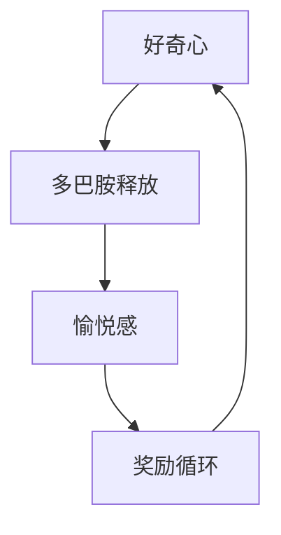

#### 2.1.2 前额叶皮质与好奇心

前额叶皮质（prefrontal cortex）是大脑的一个重要区域，与决策、规划和社会行为有关。研究表明，前额叶皮质在好奇心中扮演着关键角色。前额叶皮质中的特定区域，如背外侧前额叶皮质（dorsolateral prefrontal cortex），参与对好奇心的调节。这些区域的活动与个体对未知信息的处理和对探索行为的控制相关。

##### 图2.2 前额叶皮质与好奇心
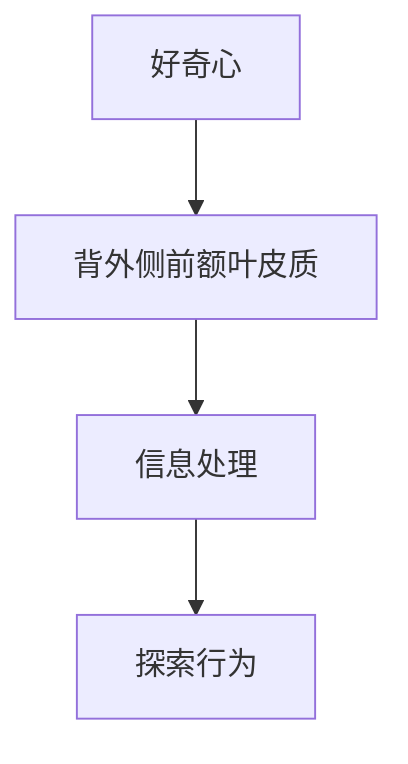

### 2.2 好奇心的神经生物学机制

好奇心不仅仅是简单的心理体验，它涉及到复杂的神经生物学过程。以下是一些关键机制：

#### 2.2.1 神经递质的作用

除了多巴胺，其他神经递质如谷氨酸（glutamate）和乙酰胆碱（acetylcholine）也在好奇心中发挥着作用。谷氨酸是大脑中主要的兴奋性神经递质，与认知功能和注意力调节有关。乙酰胆碱与记忆和学习有关，它在好奇心驱动的新奇体验和学习过程中起到关键作用。

##### 图2.3 神经递质与好奇心
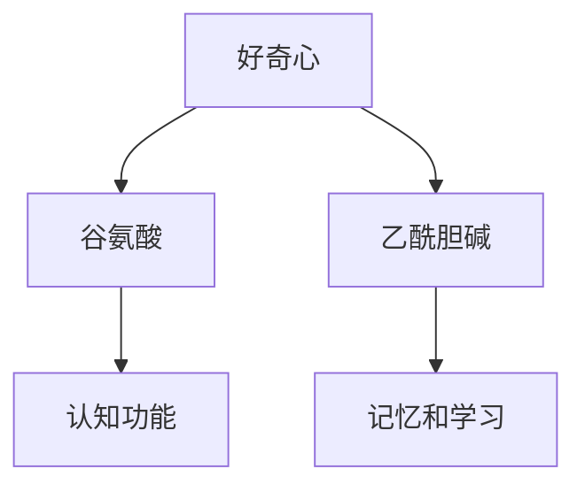

#### 2.2.2 大脑网络的作用

好奇心涉及到多个大脑网络的协同作用，包括默认模式网络（default mode network, DMN）和中央执行网络（central executive network, CEN）。默认模式网络与自我反思和内在思考有关，而中央执行网络与注意力控制和决策制定有关。这两个网络在好奇心过程中相互协调，帮助个体在探索新情境时保持注意力集中并做出决策。

##### 图2.4 大脑网络与好奇心
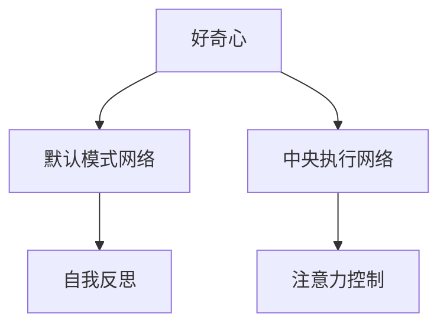

### 2.3 好奇心基因与遗传因素

好奇心不仅受环境因素的影响，也受到遗传因素的影响。研究已经发现了一些与好奇心相关的基因，如D4DRA（编码多巴胺D4受体）和5-HTTLPR（编码5-羟色胺转运体基因的短等位基因）。这些基因的变异可能会影响个体的好奇心水平。

#### 2.3.1 基因与好奇心

D4DRA基因的变异与个体好奇心的强弱有关。研究表明，携带特定D4DRA基因变异的个体往往表现出较高水平的好奇心。这种基因变异可能通过影响多巴胺系统的活动，从而影响个体的奖励感和探索欲望。

##### 图2.5 基因与好奇心
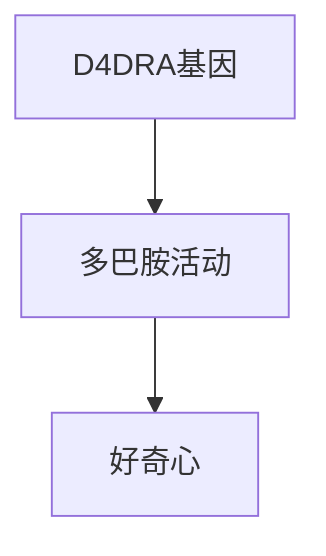

#### 2.3.2 遗传与环境的交互作用

虽然好奇心受到遗传因素的影响，但环境因素也起着重要作用。遗传和环境之间的交互作用可能会影响好奇心的发展。例如，遗传因素可能决定了个体对未知事物的兴趣程度，而环境因素如家庭教育和学习机会则可能影响好奇心的发展方向。

### 结论

好奇心不仅是一种心理体验，它还涉及到大脑的复杂神经生物学机制。理解好奇心背后的生物学基础有助于我们更好地激发和培养好奇心，促进个人的认知发展和社会进步。

## 第3章：好奇心与创新思维

### 3.1 创新思维的定义与类型

创新思维是指个体在解决问题、发现新知识、创造新观念时采用的独特思维方式。创新思维不仅仅是找到解决方案，它更强调创造性和独特性。创新思维可以分为以下几种类型：

#### 3.1.1 纵向思维

纵向思维（vertical thinking）是指沿着一个方向深入探索问题，通过逐步分析和推理来解决问题。它强调逻辑和系统性的思考方式，通常用于解决复杂的问题和寻找精确的解决方案。

#### 3.1.2 横向思维

横向思维（lateral thinking）是指跨越不同领域和思维模式，寻找新的解决方案。它强调打破常规、寻找非传统的解决方案，通常用于创造性问题和创新的解决。

#### 3.1.3 转换思维

转换思维（transformational thinking）是指将一个领域的知识应用到另一个领域，从而产生新的创新。它强调跨学科和跨领域的知识整合，通常用于推动科技的进步和跨领域创新。

#### 3.1.4 模仿思维

模仿思维（imitative thinking）是指借鉴其他领域或文化的成功经验，进行模仿和创新。它强调学习借鉴和适应性，通常用于快速跟进和创新。

### 3.2 好奇心如何推动创新思维

好奇心是创新思维的驱动力，它激发个体探索未知、挑战现状和寻找新的解决方案。以下是如何具体推动创新思维的过程：

#### 3.2.1 激发探索欲望

好奇心促使个体对新奇事物产生兴趣，激发探索欲望。这种探索欲望可以驱使个体去寻找新的信息和知识，从而为创新思维提供素材。

#### 3.2.2 促进跨领域思考

好奇心鼓励个体跨越不同领域和学科，寻找新的联系和解决方案。这种跨领域思考可以激发创新思维，产生新的创意和想法。

#### 3.2.3 提高问题解决能力

好奇心促使个体积极思考和解决问题。通过不断提出问题和尝试不同的解决方案，个体可以提高问题解决能力，培养创新思维。

#### 3.2.4 增强创造性思维

好奇心激发个体的创造性思维，促使他们寻找非传统和创新的解决方案。创造性思维是创新思维的核心，好奇心可以增强这种思维能力。

### 3.3 好奇心与创造性思维的关系

好奇心和创造性思维之间存在密切的关系。好奇心是创造性思维的基础，它激发个体的探索精神和创造力。而创造性思维则是好奇心的外在表现，它通过新颖的想法和解决方案来体现好奇心的价值。

#### 3.3.1 好奇心激发创造性思维

好奇心激发个体对未知事物的兴趣，促使他们主动探索和思考。这种探索过程可以激发创造性思维，产生新的创意和想法。

#### 3.3.2 创造性思维培养好奇心

创造性思维通过产生新的解决方案和发现，进一步培养好奇心。当个体在创新过程中遇到新问题时，好奇心会促使他们继续探索和寻找解决方案，从而增强好奇心。

### 结论

好奇心是创新思维的重要驱动力，它通过激发探索欲望、促进跨领域思考、提高问题解决能力和增强创造性思维，推动创新思维的发展。理解和培养好奇心，可以帮助我们更好地发挥创新潜能，推动个人和社会的进步。

## 第4章：好奇心在科学发现中的作用

### 4.1 好奇心与科学探索

好奇心是科学探索的驱动力，它激励科学家们不断探索未知领域，推动科学的进步。科学探索是一种主动获取知识的过程，它通过观察、实验、假设和验证来揭示自然界的规律。

#### 4.1.1 好奇心激发科学探索

好奇心促使科学家对未知领域产生浓厚的兴趣，驱使他们不断提出问题并寻求答案。例如，牛顿对苹果落地的好奇心促使他探索引力定律；达尔文对物种变异的好奇心促使他提出了进化论。

##### 图4.1 好奇心与科学探索
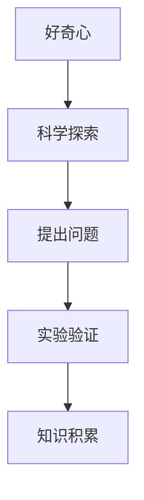

#### 4.1.2 好奇心驱动科学发现

好奇心不仅激励科学家探索，还驱动他们进行实验和验证，从而发现新的科学现象和规律。例如，阿尔伯特·爱因斯坦对光和物质相互作用的好奇心，促使他提出了相对论；玛丽·居里对放射性物质的好奇心，使她发现了镭元素。

##### 图4.2 好奇心驱动科学发现
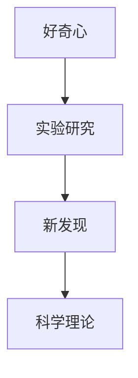

### 4.2 好奇心在科学革命中的关键角色

好奇心在科学革命中起着关键作用，它促使科学家质疑现有理论，探索新的科学范式，从而推动科学的发展。科学革命是科学理论或方法的重大变革，它往往源自科学家的好奇心和对现状的不满。

#### 4.2.1 好奇心挑战传统观念

好奇心促使科学家质疑传统观念和既定理论，寻找新的解释和证据。例如，哥白尼对地心说的质疑，激发了日心说的提出；伽利略对地球静止观念的挑战，推动了物理学的发展。

##### 图4.3 好奇心挑战传统观念
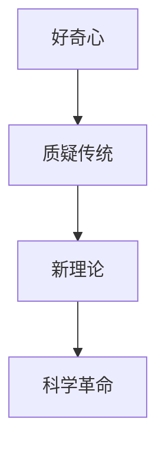

#### 4.2.2 好奇心推动科学进步

好奇心推动科学家不断探索新领域，进行创新性研究，从而推动科学的进步。例如，量子力学的发展源自对微观世界的探索；基因工程的发展源自对遗传信息的好奇心。

##### 图4.4 好奇心推动科学进步
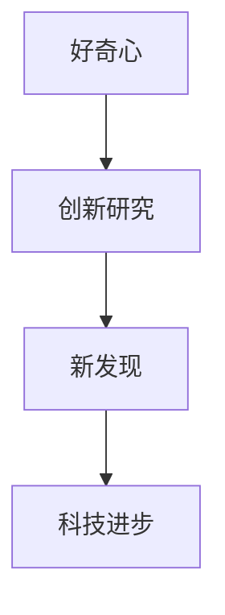

### 4.3 历史上著名的科学发现与好奇心

历史上许多著名的科学发现都源自好奇心驱动的探索。以下是一些著名的例子：

#### 4.3.1 牛顿与万有引力定律

艾萨克·牛顿对苹果落地的好奇心促使他思考重力的本质，最终提出了万有引力定律，改变了人类对宇宙的认识。

##### 图4.5 牛顿与万有引力定律
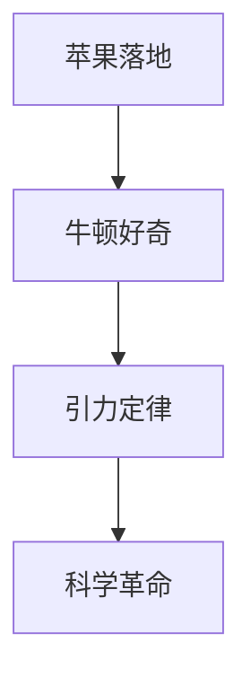

#### 4.3.2 爱因斯坦与相对论

阿尔伯特·爱因斯坦对光速不变假设和时空概念的好奇心，促使他提出了相对论，彻底改变了人类对宇宙的理解。

##### 图4.6 爱因斯坦与相对论
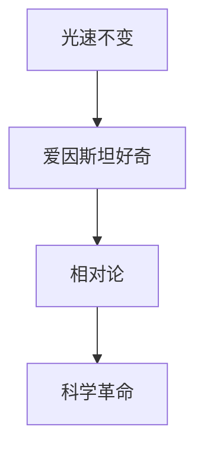

#### 4.3.3 达尔文与进化论

查尔斯·达尔文对物种变异和自然选择的好奇心，促使他提出了进化论，挑战了传统的物种不变观念。

##### 图4.7 达尔文与进化论
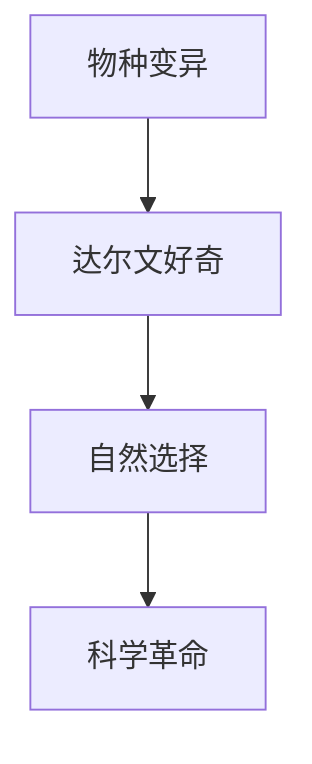

### 结论

好奇心在科学发现和科学革命中起着关键作用。它激励科学家探索未知、挑战传统观念，推动科学的进步和发展。通过理解好奇心在科学中的作用，我们可以更好地激发科学家的创造力，推动科学的发展。

## 第5章：好奇心与技术创新

### 5.1 好奇心推动技术创新的案例

好奇心是技术创新的驱动力，许多重大的技术创新都源自对未知事物的探索和对现有技术的质疑。以下是一些好奇心推动技术创新的案例：

#### 5.1.1 苹果公司

苹果公司的创始人史蒂夫·乔布斯以其强烈的好奇心和探索精神，推动了苹果公司的技术创新。他对用户界面的改进、硬件的创新和软件的优化都源自他对如何提升用户体验的好奇心。例如，苹果公司在2007年推出的第一代iPhone，不仅改变了智能手机市场，还重新定义了用户界面和操作体验。

##### 图5.1 苹果公司的技术创新
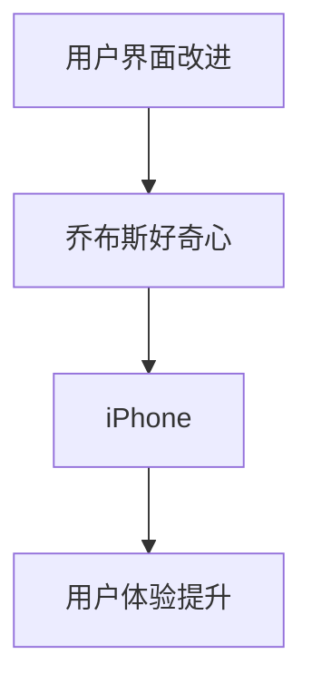

#### 5.1.2 特斯拉

特斯拉汽车的创始人埃隆·马斯克以其对电动汽车和可再生能源的好奇心，推动了电动汽车技术的革命。他不仅关注电池技术的改进，还致力于构建超级充电网络和太阳能发电系统。特斯拉的Model S、Model 3和Model X等车型，不仅提高了电动汽车的性能和续航能力，还推动了整个汽车行业的变革。

##### 图5.2 特斯拉的技术创新
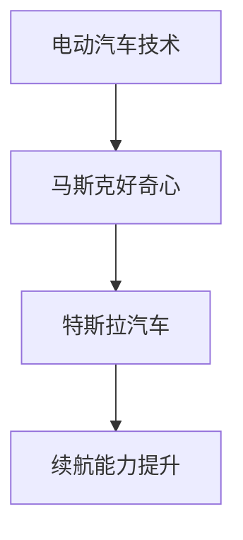

#### 5.1.3 谷歌

谷歌的创始人拉里·佩奇和谢尔盖·布林以其对互联网和人工智能的好奇心，推动了互联网搜索和人工智能技术的发展。谷歌的搜索算法和自动驾驶技术等创新，不仅改变了人们获取信息和出行的方式，还推动了人工智能和机器学习领域的进步。

##### 图5.3 谷歌的技术创新
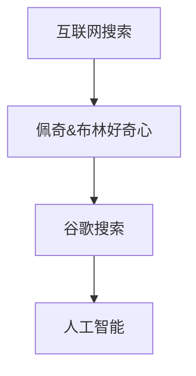

### 5.2 好奇心如何激发新技术的诞生

好奇心激发新技术的诞生，通常通过以下几种途径：

#### 5.2.1 探索未知领域

好奇心驱使科学家和工程师探索未知的领域，寻找新的技术和解决方案。例如，人类对太空的好奇心推动了航天技术的发展，从最初的火箭发射到国际空间站，再到火星探测任务。

##### 图5.4 探索未知领域
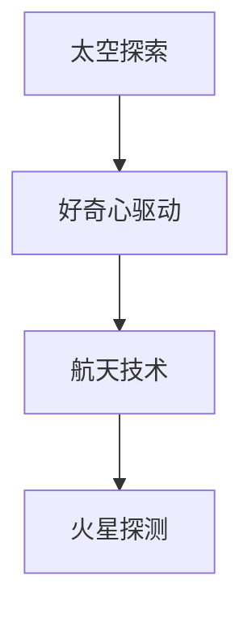

#### 5.2.2 跨学科合作

好奇心促使不同领域的专家进行跨学科合作，共同探索新的技术可能性。例如，生物技术与信息技术的结合，产生了生物信息学这一新兴领域，推动了基因组学和个性化医疗的发展。

##### 图5.5 跨学科合作
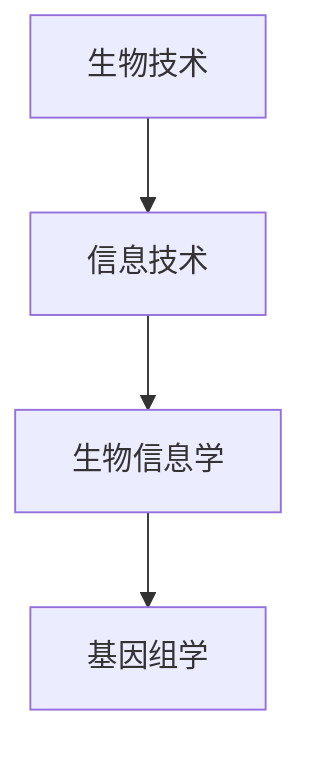

#### 5.2.3 破解技术难题

好奇心激发科学家和工程师解决技术难题，推动技术的突破。例如，量子计算领域的研究者通过对量子物理原理的好奇心，不断解决技术难题，推动了量子计算机的发展。

##### 图5.6 破解技术难题
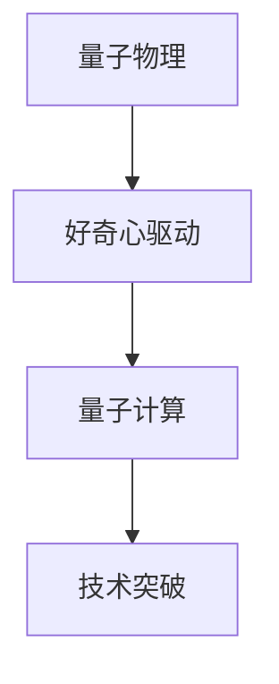

### 5.3 好奇心与创新环境的构建

好奇心不仅需要个人的内在驱动，还需要一个良好的外部环境来激发和培养。以下是一些建议，用于构建一个有利于好奇心和创新的环境：

#### 5.3.1 提供资源和支持

为科学家和工程师提供充足的资源和支持，包括资金、设备和技术支持，帮助他们进行探索和实验。

#### 5.3.2 营造开放氛围

营造一个开放和包容的氛围，鼓励不同的观点和想法，避免限制性的规章制度。

#### 5.3.3 鼓励失败和尝试

鼓励失败和尝试，将失败视为探索过程中的一个正常部分，而不是负面结果。这种环境可以激励人们勇于创新和实验。

#### 5.3.4 促进跨领域交流

促进不同领域之间的交流与合作，通过跨学科的项目和研讨会，激发新的创意和想法。

### 结论

好奇心是技术创新的重要驱动力，它通过探索未知、跨学科合作和解决技术难题，激发新技术的诞生。构建一个支持好奇心和创新的环境，可以进一步推动技术的进步和社会的发展。

## 第6章：如何激发和培养好奇心

### 6.1 培养儿童好奇心

儿童好奇心的发展对他们的认知能力和创造力至关重要。以下是一些有效的方法，用于培养和激发儿童的好奇心：

#### 6.1.1 创造探索环境

为儿童提供一个充满好奇心和探索精神的环境，鼓励他们自由探索和发现。例如，在家中设置一个科学实验角，提供各种实验器材和书籍，让孩子可以自由进行实验和阅读。

##### 图6.1 创造探索环境
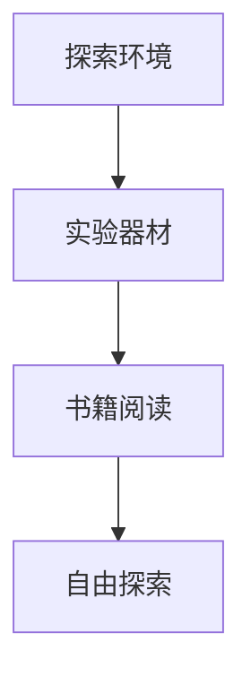

#### 6.1.2 提供丰富的学习资源

为儿童提供丰富的学习资源，包括书籍、游戏和互动应用。这些资源可以帮助孩子发现新知识，满足他们的求知欲。

##### 图6.2 提供丰富的学习资源
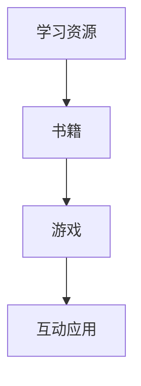

#### 6.1.3 鼓励提问和思考

鼓励儿童提问和思考，帮助他们培养批判性思维和解决问题的能力。家长和教师可以通过引导性问题，引导孩子深入思考。

##### 图6.3 鼓励提问和思考
```mermaid
graph TD
A[提问] --> B[引导性问题]
B --> C[批判性思维]
C --> D[解决问题]
```

### 6.2 教育体系中的好奇心培养

教育体系在好奇心培养中起着关键作用。以下是一些策略，用于在教育体系中培养和激发好奇心：

#### 6.2.1 设计启发式课程

设计启发式课程，鼓励学生主动探索和发现。通过项目式学习和探究式学习，让学生在实际操作中学习和理解知识。

##### 图6.4 设计启发式课程
```mermaid
graph TD
A[启发式课程] --> B[项目式学习]
B --> C[探究式学习]
C --> D[主动探索]
```

#### 6.2.2 采用多样化的教学方法

采用多样化的教学方法，如合作学习、讨论和实验，激发学生的兴趣和参与度。这种方法可以鼓励学生积极参与学习，培养他们的好奇心。

##### 图6.5 采用多样化的教学方法
```mermaid
graph TD
A[多样化教学方法] --> B[合作学习]
B --> C[讨论]
C --> D[实验]
```

#### 6.2.3 鼓励跨学科学习

鼓励跨学科学习，让学生在不同领域之间建立联系，培养他们的综合思维和创新能力。跨学科项目可以激发学生对不同学科的兴趣和好奇心。

##### 图6.6 鼓励跨学科学习
```mermaid
graph TD
A[跨学科学习] --> B[综合思维]
B --> C[创新能力]
C --> D[兴趣激发]
```

### 6.3 成人如何保持和激发好奇心

成年人同样需要保持和激发好奇心，以下是一些策略，帮助成年人保持好奇心：

#### 6.3.1 持续学习

成年人可以通过参加在线课程、阅读书籍和参加讲座等方式，持续学习新知识和技能。这种学习过程可以激发好奇心，帮助成年人保持智力活力。

##### 图6.7 持续学习
```mermaid
graph TD
A[持续学习] --> B[新知识]
B --> C[好奇心]
C --> D[智力活力]
```

#### 6.3.2 探索新领域

成年人可以通过探索新领域，如学习一门新语言、尝试新的运动或旅行到新的地方，来保持好奇心。这种探索可以带来新的体验和知识，激发好奇心。

##### 图6.8 探索新领域
```mermaid
graph TD
A[新领域探索] --> B[新体验]
B --> C[好奇心]
C --> D[知识扩展]
```

#### 6.3.3 保持开放心态

保持开放心态，对待新事物和新观念，勇于尝试和探索。这种心态可以鼓励成年人保持好奇心，并适应不断变化的世界。

##### 图6.9 保持开放心态
```mermaid
graph TD
A[开放心态] --> B[新事物接受]
B --> C[好奇心]
C --> D[适应变化]
```

### 结论

好奇心是人类智慧和创造力的重要源泉。通过培养和激发好奇心，无论是儿童还是成年人，都可以提高他们的认知能力和创新能力，推动个人和社会的发展。教育体系和社会环境都应该支持好奇心的发展，为个人的成长和创新提供良好的条件。

## 第7章：好奇心与社会文化

### 7.1 文化对好奇心的影响

好奇心在不同文化背景下有着不同的表现形式和重要性。文化价值观、教育体系和传统习俗等因素共同塑造了个体好奇心的培养和表达。

#### 7.1.1 文化价值观的影响

文化价值观在很大程度上影响了个体对好奇心的看法和培养方式。在一些文化中，好奇心被视为积极和值得鼓励的品质，而在其他文化中，它可能被视为冒失或不成熟的表现。例如，在西方文化中，鼓励独立思考和探索通常被视为培养好奇心的关键，而在一些东方文化中，对传统的尊重和遵循可能抑制好奇心的发展。

##### 图7.1 文化价值观对好奇心的影响
```mermaid
graph TD
A[西方文化] --> B[鼓励独立思考]
A --> C[好奇心培养]
B --> D[东方文化]
C --> E[传统尊重]
D --> F[好奇心抑制]
```

#### 7.1.2 教育体系的影响

教育体系对好奇心的发展起着关键作用。一些教育体系强调知识传授和应试教育，这可能导致学生对好奇心的培养受到限制。而其他教育体系则更加注重培养学生的探索精神和批判性思维，从而激发好奇心。例如，项目式学习和探究式学习等教学方法可以更好地激发学生的好奇心。

##### 图7.2 教育体系对好奇心的影响
```mermaid
graph TD
A[应试教育] --> B[知识传授]
A --> C[好奇心限制]
B --> D[项目式学习]
C --> E[好奇心激发]
D --> F[批判性思维]
```

#### 7.1.3 传统习俗的影响

传统习俗和文化习惯可能对好奇心的发展产生积极或消极的影响。在一些文化中，传统习俗可能鼓励个体尊重权威和传统，这可能抑制好奇心的发展。而在其他文化中，传统习俗可能更加开放，鼓励个体探索和创新。

##### 图7.3 传统习俗对好奇心的影响
```mermaid
graph TD
A[权威尊重] --> B[好奇心抑制]
A --> C[开放文化]
C --> D[探索创新]
```

### 7.2 好奇心与社会发展的关系

好奇心不仅影响个体的发展，还与社会的发展密切相关。好奇心可以推动社会进步、促进文化创新和推动社会变革。

#### 7.2.1 好奇心推动社会进步

好奇心可以激发社会的创新精神和创造力，推动科技的进步和社会的发展。历史上，许多重要的科学发现和技术创新都源自好奇心驱动的探索。例如，牛顿的万有引力定律、达尔文的进化论和爱因斯坦的相对论，都是好奇心推动下的伟大成就。

##### 图7.4 好奇心推动社会进步
```mermaid
graph TD
A[好奇心] --> B[科技创新]
B --> C[社会发展]
```

#### 7.2.2 好奇心促进文化创新

好奇心可以促进文化的多样性和创新。通过探索和了解不同的文化，个体可以产生新的思想和创新，推动文化的发展和变革。例如，文化交流和融合可以激发新的艺术形式和文化表达，丰富人类的文化遗产。

##### 图7.5 好奇心促进文化创新
```mermaid
graph TD
A[好奇心] --> B[文化交流]
B --> C[文化创新]
```

#### 7.2.3 好奇心推动社会变革

好奇心可以激发人们对社会问题和社会制度的反思和质疑，推动社会的变革和进步。例如，对社会不公和人权问题的好奇心可以激发社会运动，推动社会的正义和公平。

##### 图7.6 好奇心推动社会变革
```mermaid
graph TD
A[好奇心] --> B[社会问题反思]
B --> C[社会变革]
```

### 7.3 好奇心在全球化背景下的挑战与机遇

全球化为好奇心的发展带来了新的挑战和机遇。在全球化的背景下，个体和群体面临的文化差异和多样性增加了好奇心的发展空间，同时也带来了文化冲突和理解难题。

#### 7.3.1 挑战

全球化带来了文化的快速传播和多样性，这可能导致文化同质化和文化冲突。在一些情况下，好奇心可能被误解为对其他文化的入侵或优越感，导致文化隔阂和误解。

##### 图7.7 全球化背景下的挑战
```mermaid
graph TD
A[全球化] --> B[文化多样性]
B --> C[文化冲突]
```

#### 7.3.2 机遇

全球化也为好奇心的发展提供了机遇。通过跨文化交流和合作，个体可以更好地理解不同文化，促进文化的创新和融合。好奇心可以成为连接不同文化、推动全球理解和社会发展的桥梁。

##### 图7.8 全球化背景下的机遇
```mermaid
graph TD
A[全球化] --> B[跨文化交流]
B --> C[文化融合]
```

### 结论

好奇心在社会文化和全球化背景下具有重要的角色。文化价值观、教育体系和全球化背景都影响着好奇心的发展。好奇心不仅推动了社会进步和文化创新，也对社会变革和全球化进程产生了深远影响。通过理解好奇心在社会文化中的角色，我们可以更好地激发和培养好奇心，推动个人和社会的发展。

## 第8章：好奇心与未来

### 8.1 好奇心在未来的发展趋势

随着科技的不断进步和社会的快速发展，好奇心在未来将继续发挥重要作用，并在多个方面展现其独特价值。

#### 8.1.1 科技发展的驱动

未来科技的发展将依赖于好奇心，它将成为科技创新的主要驱动力。人工智能、量子计算、生物技术等前沿领域的发展，都离不开对未知事物的探索和求知欲望。好奇心将激发科学家和工程师的创新精神，推动科技的不断进步。

##### 图8.1 好奇心与科技发展
```mermaid
graph TD
A[好奇心] --> B[科技创新]
B --> C[科技发展]
```

#### 8.1.2 社会变革的催化剂

好奇心将在社会变革中扮演关键角色，它将激发人们对新观念和旧制度的反思和质疑。随着全球化和数字化的发展，社会结构和价值观将面临巨大变革。好奇心将推动人们探索新的社会模式，促进社会正义和公平。

##### 图8.2 好奇心与社会变革
```mermaid
graph TD
A[好奇心] --> B[社会变革]
B --> C[价值观反思]
```

#### 8.1.3 文化融合的桥梁

未来，好奇心将促进全球文化的融合和创新。随着国际交流的日益频繁，不同文化之间的碰撞和融合将日益显著。好奇心将推动人们跨越文化差异，寻找共同点，促进文化的多元性和创新性。

##### 图8.3 好奇心与文化融合
```mermaid
graph TD
A[好奇心] --> B[文化融合]
B --> C[文化交流]
```

### 8.2 好奇心对未来的影响

好奇心对未来的影响将是深远而广泛的，它将在科技、社会和文化等多个领域产生重要影响。

#### 8.2.1 科技领域的未来影响

好奇心将推动科技的进步和创新，未来可能出现许多颠覆性技术突破。例如，量子计算可能会彻底改变计算能力，人工智能可能会实现更高的智能水平，生物技术可能会带来医学的巨大变革。

##### 图8.4 好奇心对科技领域的未来影响
```mermaid
graph TD
A[好奇心] --> B[科技创新]
B --> C[技术突破]
```

#### 8.2.2 社会发展的未来影响

好奇心将促进社会的进步和变革，推动社会向更加公正、包容和可持续的方向发展。好奇心将激发人们对社会问题的关注和解决，促进社会制度的创新和改进。

##### 图8.5 好奇心对社会发展的未来影响
```mermaid
graph TD
A[好奇心] --> B[社会进步]
B --> C[社会变革]
```

#### 8.2.3 文化发展的未来影响

好奇心将促进全球文化的多样性和创新，推动文化的融合和交流。未来，我们将看到更多跨文化的合作和创新，文化将变得更加多元和丰富。

##### 图8.6 好奇心对文化发展的未来影响
```mermaid
graph TD
A[好奇心] --> B[文化创新]
B --> C[文化交流]
```

### 8.3 总结与展望

好奇心是未来发展的关键驱动力，它将在科技、社会和文化等多个领域产生深远影响。通过理解好奇心的重要性，我们可以更好地激发和培养好奇心，为未来的发展奠定坚实基础。好奇心将推动我们不断探索未知、创新和进步，塑造一个更加美好和可持续的未来。

## 附录：好奇心研究工具与资源

### 附录 A：好奇心研究方法

好奇心研究涉及多种方法，包括实验心理学、神经科学、社会学和大数据分析等。以下是一些常见的研究方法和工具：

#### 实验心理学方法

实验心理学方法是通过控制变量的方式，研究好奇心对个体行为和认知的影响。研究者可以设计不同的实验情境，观察和测量个体在好奇心驱动下的行为变化。

##### 实验设计

- **实验组与控制组**：通过将参与者随机分配到实验组和控制组，比较两组在好奇心激发下的行为差异。
- **自变量与因变量**：自变量是好奇心水平，因变量是参与者的行为或认知表现。

##### 数据收集

- **行为观察**：记录参与者在实验过程中的行为表现，如探索行为、问题解决能力等。
- **心理测量**：使用量表和问卷评估个体好奇心水平，如儿童好奇心量表、成人好奇心量表等。

#### 神经科学研究方法

神经科学研究方法通过脑成像技术，如功能性磁共振成像（fMRI）和脑电图（EEG），研究好奇心与大脑活动的关系。

##### 脑成像技术

- **fMRI**：通过测量大脑血氧水平依赖信号，研究好奇心对大脑特定区域活动的影响。
- **EEG**：记录大脑的电活动，分析好奇心激发下的脑波变化。

##### 神经递质研究

- **多巴胺活性**：研究多巴胺系统在好奇心激发下的活性变化，如多巴胺D4受体的表达。

#### 社会科学研究方法

社会学研究方法通过问卷调查和访谈，研究好奇心在不同社会文化背景下的表现和影响。

##### 调查问卷

- **自我报告问卷**：收集个体对自己好奇心水平的自我评估。
- **第三方评估问卷**：通过第三方的观察和评估，了解个体在好奇心驱动下的行为表现。

##### 访谈方法

- **深度访谈**：通过与参与者的深入对话，了解他们对好奇心体验的感知和解释。

#### 大数据分析方法

大数据分析方法通过收集和分析大量数据，研究好奇心与个体行为、心理特征之间的关系。

##### 数据来源

- **社交媒体数据**：分析个体在社交媒体上的互动和关注话题，了解他们的好奇心倾向。
- **在线行为数据**：通过分析个体的在线行为，如搜索记录和阅读习惯，研究好奇心对在线行为的影响。

##### 数据分析方法

- **数据挖掘**：通过数据挖掘技术，发现好奇心与行为之间的潜在关联。
- **机器学习**：使用机器学习算法，建立好奇心预测模型，预测个体在不同情境下的好奇心表现。

### 附录 B：推荐阅读

以下是一些有关好奇心研究的重要书籍、期刊论文和在线资源：

#### 书籍

- 《好奇心心理学：人类智慧的奥秘》（作者：David G. Meyer）
- 《好奇的狐狸：探索者与发现的旅程》（作者：Bill Bryson）
- 《好奇心：创新的源泉》（作者：David Edgell）

#### 期刊论文

- “The Anatomy of Curiosity” （作者：John P.J. Pinel）
- “Curiosity and Its Relation to Learning” （作者：Alison Gopnik）
- “The Role of Curiosity in Creative Problem Solving” （作者：Richard J. Gerrig）

#### 在线资源

- 好奇心研究基金会官网（https://curiosityfoundation.org/）
- 好奇心心理学博客（https://curiouspsychology.com/）
- 好奇心研究杂志（https://www.curiosityresearchjournal.com/）

### 附录 C：相关网站与资源

以下是一些好奇心研究相关的网站和资源，供读者进一步了解好奇心研究动态：

- 国家图书馆（https://www.nationallibrary.gov/）
- 学术搜索引擎（如Google Scholar、PubMed）
- 好奇心研究机构（如斯坦福大学好奇心实验室）

通过这些研究工具和资源，读者可以更深入地了解好奇心的本质、作用和培养方法，为个人和社会的发展提供有力支持。

## 第9章：好奇心在具体领域的应用

### 9.1 好奇心在科学领域

好奇心是科学发展的驱动力，它激发了科学家对未知领域的探索，推动了科学发现和技术创新。

#### 9.1.1 好奇心如何推动科学发现

好奇心促使科学家不断提出问题和进行实验，以揭示自然界的规律。例如，伽利略对天体运动的好奇心，促使他使用望远镜进行观测，从而发现了行星运动的规律。同样，爱因斯坦对相对论的好奇心，促使他提出了新的物理理论，改变了人类对宇宙的认识。

#### 9.1.2 好奇心在科学领域的重要性

好奇心在科学领域中具有重要地位，它不仅推动了科学理论的发展，也促进了技术的进步。科学家的好奇心激发了他们的探索精神，使他们不断挑战现有的科学知识，推动科学的前沿。

### 9.2 好奇心在艺术领域

好奇心在艺术创作中起着关键作用，它激发了艺术家的创造力和创新精神，推动了艺术的发展和变革。

#### 9.2.1 好奇心如何推动艺术创新

好奇心促使艺术家探索新的艺术形式、技巧和概念，从而创造出独特的艺术作品。例如，毕加索对立体派艺术的好奇心，促使他发展出了全新的艺术风格，打破了传统的绘画规则。

#### 9.2.2 好奇心在艺术领域的重要性

好奇心在艺术领域中具有重要作用，它激发了艺术家的创作热情，推动了艺术的创新和发展。艺术家的好奇心使他们不断探索新的表现手法，为观众带来了丰富多彩的艺术体验。

### 9.3 好奇心在商业领域

好奇心在商业创新中起着关键作用，它推动了企业家的创业精神和创新思维，促进了商业模式的变革。

#### 9.3.1 好奇心如何推动商业创新

好奇心促使企业家不断探索新的市场需求和商业机会，从而开发出创新的产品和服务。例如，乔布斯对用户体验的好奇心，促使他创造了iPhone，彻底改变了智能手机市场。

#### 9.3.2 好奇心在商业领域的重要性

好奇心在商业领域中具有重要作用，它激发了企业家的创新精神，推动了商业模式的变革。企业家的好奇心使他们不断寻找新的商机，为企业和消费者带来了巨大的价值。

### 9.4 好奇心在教育领域

好奇心在教育领域中具有重要地位，它促进了学生的学习和认知发展，提高了教育的质量。

#### 9.4.1 好奇心如何促进学生学习

好奇心激发了学生的学习兴趣和动机，使他们更加主动地参与学习活动。例如，通过设计启发式的课程和实验，教师可以激发学生对科学和数学的兴趣。

#### 9.4.2 好奇心在教育领域的重要性

好奇心在教育领域中具有重要作用，它促进了学生的认知发展和学习动机。通过培养好奇心，教育可以更加有效地激发学生的学习兴趣，提高他们的学习效果。

### 9.5 好奇心在心理学领域

好奇心在心理学领域中具有重要的研究价值，它推动了人类对个体心理和行为的研究，促进了心理学的发展。

#### 9.5.1 好奇心如何推动心理学研究

好奇心促使心理学家不断提出新的研究问题，进行实验和观察，以揭示心理现象的机制。例如，弗洛伊德对梦境和潜意识的好奇心，促使他提出了精神分析理论。

#### 9.5.2 好奇心在心理学领域的重要性

好奇心在心理学领域中具有重要作用，它激发了心理学家的研究热情，推动了心理学理论的创新和发展。

### 结论

好奇心在科学、艺术、商业、教育、心理学等多个领域中具有重要应用价值。通过激发和培养好奇心，我们可以推动各个领域的创新和发展，为人类的进步做出贡献。

## 第10章：好奇心与终身学习

### 10.1 好奇心与终身学习的关系

好奇心是终身学习的重要动力，它激发了个体对知识和技能的渴望，促使他们持续地学习和成长。在快速变化的社会中，终身学习已成为一种基本需求，好奇心在其中扮演着关键角色。

#### 10.1.1 好奇心如何促进终身学习

好奇心激发了学习兴趣和动机，使个体更加主动地寻求新知识和技能。通过好奇心的驱动，个体会对新事物产生好奇心，主动探索和学习，从而不断提升自己的认知能力和知识水平。

##### 图10.1 好奇心与终身学习
```mermaid
graph TD
A[好奇心] --> B[学习兴趣]
B --> C[主动学习]
C --> D[知识提升]
```

#### 10.1.2 好奇心在终身学习中的重要性

好奇心在终身学习中具有重要地位，它不仅促进了学习动机，还增强了学习的持续性和效果。通过好奇心，个体能够更好地适应变化，不断更新自己的知识和技能，从而实现个人成长和社会发展。

### 10.2 培养好奇心以促进终身学习

为了促进终身学习，培养和激发好奇心至关重要。以下是一些策略，可以帮助个体培养和保持好奇心：

#### 10.2.1 创造探索环境

提供一个充满好奇心和探索精神的环境，鼓励个体自由探索和发现。例如，在家中设置一个科学实验角，提供各种实验器材和书籍，让孩子可以自由进行实验和阅读。

##### 图10.2 创造探索环境
```mermaid
graph TD
A[探索环境] --> B[实验器材]
B

