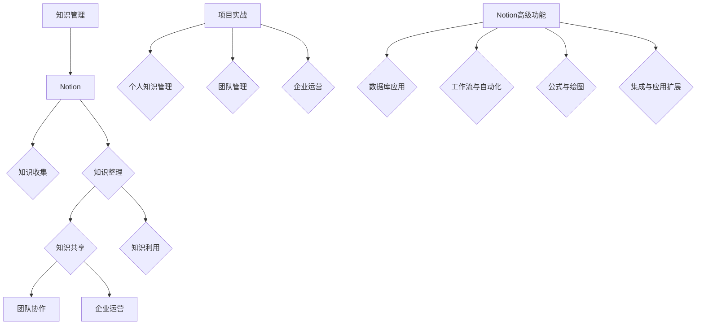

                 

### 《如何利用Notion构建创业知识管理系统》

> **关键词**：Notion、创业知识管理系统、知识管理、团队协作、数据库、自动化、项目管理

> **摘要**：本文将探讨如何利用Notion这一强大的知识管理工具构建适合创业公司的知识管理系统。我们将从Notion的基础知识入手，逐步深入到其高级功能与应用场景，并结合实际案例，展示如何通过Notion实现有效的知识管理、团队协作和企业运营。

---

#### 第1章：Notion概述

**1.1 Notion的发展历程**

Notion是由Notion Labs开发的一个人工智能增强型笔记和组织工具。自2016年成立以来，Notion迅速发展，吸引了全球数百万用户。它的成长轨迹可以从以下几个方面进行概述：

**1.1.1 Notion的起源**

Notion的创始人Ian vre.me、David Yarulls和Matt Byrd在加州大学伯克利分校学习时，共同开发了一个用于组织和跟踪项目的工具。这个工具后来演变成了Notion的原型。

**1.1.2 Notion的快速成长**

2018年，Notion首次公开亮相，并迅速获得了广泛关注。它以其强大的功能和易用性，在短短几年内获得了大量用户，并得到了资本市场的认可。

**1.1.3 Notion的核心优势**

Notion的核心优势在于其多功能性和灵活性。它不仅能够用于笔记和组织，还能够作为任务管理工具、数据库、知识库等多种用途。这使得Notion成为了一个多功能的工具，适合各种场景的使用。

---

#### 第2章：Notion基本功能详解

**2.1 页面操作**

**2.1.1 创建和编辑页面**

在Notion中，页面（Page）是组织和展示信息的基本单位。创建新页面的方法非常简单，只需点击页面列表中的“+”按钮，然后输入页面标题即可。

创建页面后，可以对其进行编辑。编辑页面包括添加文本、图片、视频、链接、表格等多种类型的块（Block）。这些块可以自由移动、复制、粘贴，使得页面的布局非常灵活。

**2.1.2 页面分类和标签**

Notion支持对页面进行分类和标签管理。通过分类，可以将页面分为不同的类别，方便查找和管理。标签则是用于标记页面的关键字，有助于快速筛选页面。

**2.1.3 页面间链接和引用**

Notion允许页面之间建立链接，实现跨页面、跨工作区的信息关联。此外，还可以使用引用（@mention）功能，直接在页面中引用其他用户或页面，实现实时沟通和协作。

---

**2.2 块操作**

**2.2.1 块类型及其应用**

Notion的块（Block）是构成页面的基本单元，包括文本、标题、图像、视频、音频、表格、列表、代码块等多种类型。这些块可以根据需要自由组合，实现复杂的页面布局。

**2.2.2 块的排序和分组**

Notion允许对块进行排序和分组。排序可以根据块的类型、创建时间、更新时间等多种条件进行。分组则可以将多个块组织在一起，形成一个独立的部分，方便管理和操作。

**2.2.3 块的嵌套和使用**

Notion支持块的嵌套，即一个块可以包含其他块。这种嵌套关系使得页面结构更加清晰，信息组织更加紧密。同时，嵌套的块也可以进行单独的排序和分组，提高了灵活性。

---

**2.3 收件箱使用**

**2.3.1 收件箱的功能**

收件箱（Dashboard）是Notion中的一个特殊页面，用于显示重要通知、待办事项、项目进度等。它提供了实时更新的数据视图，帮助用户快速掌握全局情况。

**2.3.2 收件箱的日常管理**

用户可以自定义收件箱的布局，添加、删除、排序视图。此外，还可以设置提醒和通知，确保重要事项不被遗漏。

**2.3.3 收件箱与其他功能的集成**

收件箱可以与其他Notion页面、数据库、工作区进行集成。通过这些集成，用户可以在一个统一界面中查看和管理多种类型的信息，提高工作效率。

---

**2.4 工作区设置**

**2.4.1 工作区的创建和管理**

工作区（Workspace）是Notion中用于组织多个页面、数据库、收件箱的容器。用户可以创建多个工作区，分别用于个人项目、团队协作等。

**2.4.2 工作区权限和成员管理**

Notion提供了详细的权限管理功能，用户可以设置不同成员的访问权限，包括查看、编辑、管理等多种权限。

**2.4.3 工作区布局和自定义**

用户可以根据需求自定义工作区的布局，包括页面布局、视图布局、块布局等。这种自定义功能使得Notion更加贴合用户的使用习惯。

---

#### 第3章：Notion高级功能与应用场景

**3.1 数据库应用**

**3.1.1 数据库的创建和使用**

数据库是Notion中用于存储和管理数据的工具。创建数据库非常简单，只需点击页面列表中的“+”按钮，选择“数据库”模板即可。创建后的数据库可以添加、编辑、查询数据。

**3.1.2 数据库视图与筛选**

Notion提供了多种视图方式，包括列表视图、表格视图、日历视图等。用户可以根据需要切换视图，快速查看和管理数据。此外，还可以使用筛选功能，根据条件筛选数据。

**3.1.3 数据库的数据分析功能**

Notion的数据库功能还支持数据分析。用户可以自定义数据仪表板，展示关键数据指标，帮助团队快速做出决策。

---

**3.2 工作流与自动化**

**3.2.1 工作流的构建**

Notion的工作流功能允许用户定义一系列操作，自动化完成特定任务。例如，可以设置当新任务添加到数据库时，自动发送通知给相关人员。

**3.2.2 工作流的自动化**

Notion支持与第三方工具（如Slack、Google Drive等）的集成，实现自动化工作流。用户可以根据需要，自定义工作流的自动化规则。

**3.2.3 工作流的实际应用案例**

Notion的工作流功能在项目管理、知识管理、客户关系管理等多种场景中都有广泛应用。本文将结合实际案例，展示如何利用Notion实现自动化工作流。

---

**3.3 公式与绘图**

**3.3.1 公式编辑器的使用**

Notion内置了公式编辑器，支持多种数学公式和科学记号。用户可以方便地在页面中插入公式，进行数学计算和科学表达。

**3.3.2 绘图工具的介绍**

Notion的绘图工具功能强大，支持多种图形绘制和编辑。用户可以创建流程图、思维导图、图表等，丰富页面内容。

**3.3.3 公式与绘图在Notion中的应用**

公式和绘图功能在Notion中有着广泛的应用。例如，在项目管理中，可以创建甘特图、进度条等；在知识管理中，可以绘制概念图、知识结构图等。

---

**3.4 集成与应用扩展**

**3.4.1 Notion与其他工具的集成**

Notion支持与多种第三方工具的集成，如Slack、Google Drive、Trello等。用户可以通过集成，实现数据同步、任务自动化等功能。

**3.4.2 应用扩展与插件使用**

Notion的应用市场提供了丰富的插件和扩展，用户可以根据需求安装和使用。这些扩展功能进一步丰富了Notion的功能和应用场景。

**3.4.3 Notion在创业团队中的实际应用**

Notion在创业团队中有着广泛的应用。本文将结合实际案例，展示如何利用Notion实现团队协作、项目管理和知识管理。

---

#### 第4章：Notion在知识管理中的应用

**4.1 知识管理概述**

**4.1.1 知识管理的定义和重要性**

知识管理是指通过收集、整理、存储、共享和利用知识，提高组织决策效率和创新能力的活动。知识管理在创业公司中具有重要意义，有助于团队快速成长和持续发展。

**4.1.2 知识管理的分类**

知识管理可以分为内部知识管理和外部知识管理。内部知识管理主要关注组织内部知识的收集、整理和共享；外部知识管理则涉及与外部合作伙伴、客户等的信息交流和学习。

**4.1.3 知识管理的挑战与解决方案**

知识管理面临许多挑战，如知识孤岛、知识流失、知识共享困难等。Notion作为一款强大的知识管理工具，可以提供以下解决方案：

1. **建立统一的知识库**：Notion可以帮助企业建立一个统一的、结构化的知识库，方便团队成员查找和使用。
2. **促进知识共享**：通过Notion的实时沟通和协作功能，促进团队成员之间的知识共享和交流。
3. **知识沉淀与传承**：Notion支持知识沉淀和传承，帮助新员工快速熟悉业务流程和知识体系。

---

**4.2 Notion知识库构建**

**4.2.1 知识库的设计原则**

构建Notion知识库时，应遵循以下原则：

1. **明确知识分类**：根据业务需求和知识特性，对知识进行合理分类，便于查找和管理。
2. **简洁明了的命名规则**：为知识库中的页面和块命名，应遵循简洁明了的命名规则，方便团队成员理解和记忆。
3. **统一的格式和风格**：对知识库中的内容格式和风格进行统一规范，提高知识库的可读性和一致性。

**4.2.2 知识库的搭建步骤**

构建Notion知识库可以按照以下步骤进行：

1. **需求分析**：明确知识库的目的和功能，确定所需的功能模块。
2. **设计知识库结构**：根据需求分析结果，设计知识库的结构，包括页面、数据库、视图等。
3. **搭建知识库**：使用Notion的模板和自定义功能，搭建知识库。
4. **数据录入与整理**：将现有知识录入知识库，并进行整理和分类。
5. **测试与优化**：对知识库进行测试，优化功能和用户体验。

**4.2.3 知识库的维护与更新**

知识库的维护与更新是保证其持续有效的重要环节。以下是一些建议：

1. **定期备份**：定期备份知识库，防止数据丢失。
2. **内容审核**：定期对知识库中的内容进行审核，确保知识库的准确性和及时性。
3. **更新机制**：建立知识更新机制，鼓励团队成员持续更新知识库。
4. **反馈机制**：收集团队成员对知识库的反馈，不断优化和完善知识库。

---

**4.3 知识共享与协作**

**4.3.1 知识共享的机制**

Notion提供了多种知识共享机制，包括：

1. **实时沟通**：通过聊天功能，团队成员可以实时交流，分享知识和经验。
2. **协作编辑**：Notion支持多人协作编辑页面，实现实时协作。
3. **共享页面和数据库**：可以将知识库中的页面和数据库共享给团队成员，实现跨部门、跨团队的知识共享。

**4.3.2 知识协作的工具与方法**

Notion提供了多种工具和方法，支持知识协作：

1. **数据库**：数据库是知识协作的核心工具，可以用于存储和管理各类知识。
2. **视图**：Notion提供了多种视图，如列表视图、表格视图、日历视图等，方便团队成员查看和管理知识。
3. **集成**：通过集成第三方工具，如Slack、Google Drive等，实现跨平台的知识协作。

**4.3.3 知识共享与协作的实际案例**

以下是一个知识共享与协作的实际案例：

1. **项目启动会**：在项目启动会上，项目经理可以使用Notion创建一个项目页面，包括项目概述、团队成员、任务分配等信息。团队成员可以通过实时沟通和协作，讨论项目计划和目标。
2. **知识库搭建**：团队成员可以共同参与知识库的搭建，根据业务需求和知识特性，分类整理和共享知识。通过协作编辑和实时沟通，团队成员可以共同完善知识库内容。
3. **知识共享会议**：定期组织知识共享会议，团队成员可以分享自己的经验和知识，提高整个团队的专业水平。

---

#### 第5章：Notion在团队管理中的应用

**5.1 团队管理概述**

**5.1.1 团队管理的概念和要素**

团队管理是指对团队成员进行组织、协调、激励和监控，以实现团队目标的过程。团队管理的核心要素包括：

1. **目标管理**：明确团队的目标和愿景，确保团队成员朝着共同的方向努力。
2. **任务分配**：合理分配任务，确保每个成员都有明确的职责和任务。
3. **沟通协作**：建立有效的沟通机制，促进团队成员之间的协作和合作。
4. **绩效评估**：对团队成员的工作进行评估，激励团队成员不断进步。

**5.1.2 团队管理的方法和技巧**

团队管理的方法和技巧包括：

1. **目标分解**：将团队目标分解为可执行的任务，确保每个成员都有明确的任务和目标。
2. **定期会议**：定期组织团队会议，讨论项目进展、问题和解决方案。
3. **任务跟踪**：使用任务管理工具，如Notion，实时跟踪任务进度，确保任务按时完成。
4. **激励机制**：建立激励机制，激励团队成员积极参与团队工作，提高工作效率。

**5.1.3 团队管理的挑战与应对**

团队管理面临许多挑战，如沟通障碍、任务分配不均、成员积极性不足等。以下是一些应对策略：

1. **沟通障碍**：使用实时沟通工具，如Slack、Zoom等，确保团队成员之间的有效沟通。
2. **任务分配不均**：定期评估团队成员的绩效和能力，合理调整任务分配，确保任务均匀分布。
3. **成员积极性不足**：建立激励机制，如奖励、晋升等，激励团队成员积极参与团队工作。

---

**5.2 Notion团队管理实践**

**5.2.1 团队项目管理**

Notion可以作为团队项目管理的工具，帮助团队实现以下目标：

1. **任务分配**：使用Notion的数据库功能，创建项目任务，分配给团队成员。
2. **进度追踪**：使用Notion的视图功能，实时跟踪任务进度，确保任务按时完成。
3. **协作沟通**：使用Notion的实时沟通功能，团队成员可以随时讨论项目问题和解决方案。

**5.2.2 团队沟通协作**

Notion提供了多种沟通协作功能，包括：

1. **聊天功能**：团队成员可以通过聊天功能实时交流，分享信息和经验。
2. **协作编辑**：Notion支持多人协作编辑，确保团队成员之间的协作无缝进行。
3. **共享页面和数据库**：团队成员可以共享项目页面和数据库，实现跨部门、跨团队的知识共享。

**5.2.3 团队知识库管理**

Notion可以作为团队知识库管理工具，帮助团队实现以下目标：

1. **知识收集**：团队成员可以将工作中的经验和知识收集到Notion知识库中。
2. **知识整理**：对知识库中的内容进行分类整理，便于团队成员查找和使用。
3. **知识共享**：通过Notion的共享功能，团队成员可以共享知识库中的知识，提高团队的整体知识水平。

---

**5.3 团队成员个人知识管理**

**5.3.1 个人知识库的构建**

团队成员可以通过以下步骤构建个人知识库：

1. **明确知识需求**：根据工作需求和兴趣，明确个人知识库的内容和范围。
2. **分类整理**：对个人知识库的内容进行分类整理，建立合理的知识结构。
3. **持续更新**：定期更新个人知识库，保持知识的时效性和准确性。

**5.3.2 个人知识库与团队知识库的关联**

个人知识库与团队知识库之间可以建立以下关联：

1. **知识共享**：将个人知识库中的优秀内容共享到团队知识库中，实现知识共享。
2. **知识补充**：团队成员可以从团队知识库中获取所需的知识，补充个人知识库的不足。
3. **知识传承**：将个人知识库中的内容传承给新员工，帮助新员工快速熟悉业务流程和知识体系。

**5.3.3 个人知识库的持续更新和维护**

为了确保个人知识库的有效性，团队成员需要：

1. **定期备份**：定期备份个人知识库，防止数据丢失。
2. **内容审核**：定期对个人知识库中的内容进行审核，确保知识的准确性和及时性。
3. **更新机制**：建立个人知识库的更新机制，鼓励团队成员持续更新知识库。

---

#### 第6章：Notion在企业运营中的应用

**6.1 企业运营概述**

**6.1.1 企业运营的概念和内容**

企业运营是指企业日常经营活动的管理和组织，包括生产运营、市场营销、财务管理、人力资源等多个方面。企业运营的核心目标是实现企业价值的最大化。

**6.1.2 企业运营的流程和策略**

企业运营的流程包括：

1. **市场分析**：分析市场需求、竞争态势等，为制定运营策略提供依据。
2. **产品规划**：根据市场需求，制定产品规划和策略。
3. **生产运营**：组织生产过程，确保产品质量和交货时间。
4. **市场营销**：制定和实施市场营销策略，提升品牌知名度和市场份额。
5. **财务管理**：对企业财务状况进行监控和管理，确保财务健康。
6. **人力资源**：招聘、培训、激励员工，提升团队整体素质。

**6.1.3 企业运营的挑战与应对**

企业运营面临许多挑战，如市场变化、竞争加剧、资源有限等。以下是一些应对策略：

1. **市场分析**：加强市场研究，及时了解市场动态，制定灵活的运营策略。
2. **创新驱动**：持续创新，提高产品竞争力，抢占市场份额。
3. **资源整合**：优化资源配置，提高资源利用效率。
4. **数字化转型**：利用数字化工具和平台，提高运营效率和效益。

---

**6.2 Notion企业运营实践**

**6.2.1 企业运营数据的收集与整理**

Notion在企业运营数据收集与整理方面具有以下优势：

1. **数据库功能**：Notion的数据库功能可以用于收集和整理各类运营数据，如销售数据、客户数据、生产数据等。
2. **数据处理**：Notion支持数据处理和清洗，确保数据的准确性和一致性。
3. **可视化**：Notion的可视化功能可以将数据以图表、仪表板等形式展示，方便企业领导和团队成员快速了解运营状况。

**6.2.2 企业运营数据分析与优化**

Notion可以帮助企业进行以下数据分析与优化：

1. **销售分析**：分析销售数据，了解销售趋势、客户偏好等，为营销策略提供依据。
2. **生产分析**：分析生产数据，优化生产流程，提高生产效率。
3. **客户分析**：分析客户数据，了解客户需求和行为，提升客户满意度。

**6.2.3 企业运营知识库的构建与维护**

Notion可以作为企业运营知识库的工具，帮助企业实现以下目标：

1. **知识收集**：收集企业运营过程中产生的各类知识，如市场分析报告、销售策略、生产流程等。
2. **知识整理**：对知识库中的内容进行分类整理，便于员工查找和使用。
3. **知识共享**：通过知识库，实现企业内部的知识共享和协作。

---

**6.3 企业运营知识共享与协作**

**6.3.1 企业知识共享的文化建设**

企业知识共享需要从文化层面进行建设，包括：

1. **价值观培养**：树立知识共享的价值观，鼓励员工主动分享知识和经验。
2. **激励机制**：建立激励机制，如知识分享奖、优秀知识库等，激励员工积极参与知识共享。
3. **知识共享培训**：定期开展知识共享培训，提高员工的知识共享意识和能力。

**6.3.2 企业知识协作的工具与方法**

Notion在企业知识协作方面提供了以下工具与方法：

1. **实时沟通**：使用实时沟通工具，如Slack、Zoom等，确保团队成员之间的有效沟通。
2. **协作编辑**：使用Notion的多人协作编辑功能，实现实时协作。
3. **共享页面和数据库**：将知识库中的页面和数据库共享给团队成员，实现跨部门、跨团队的知识协作。

**6.3.3 企业知识共享与协作的实际案例**

以下是一个企业知识共享与协作的实际案例：

1. **内部培训**：企业可以利用Notion建立内部培训知识库，收集和整理培训资料，为员工提供学习资源。通过实时沟通和协作，员工可以相互交流学习心得，提升整体培训效果。
2. **项目协作**：在项目实施过程中，项目经理可以使用Notion建立项目知识库，收集和整理项目文档、流程、经验等。团队成员可以通过协作编辑和实时沟通，共同推进项目进度，提高项目成功率。
3. **知识竞赛**：企业可以组织知识竞赛活动，通过Notion的知识库和实时沟通功能，为员工提供竞赛平台。通过知识竞赛，激发员工的学习热情，提升整体知识水平。

---

#### 第7章：Notion知识管理系统的优化与持续改进

**7.1 知识管理系统评估**

**7.1.1 知识管理系统评估指标**

为了评估Notion知识管理系统的效果，可以设置以下指标：

1. **知识库覆盖率**：知识库中包含的知识点与业务需求的匹配程度。
2. **知识更新频率**：知识库中内容的更新频率和及时性。
3. **知识共享率**：知识库中的内容被共享和使用的频率。
4. **知识利用率**：知识库中的内容对业务决策和运营效果的贡献度。

**7.1.2 知识管理系统评估方法**

评估Notion知识管理系统可以采用以下方法：

1. **问卷调查**：通过问卷调查，收集员工对知识管理系统的使用情况、满意度和建议。
2. **访谈**：对知识管理系统的关键用户进行访谈，了解他们在使用过程中的体验和需求。
3. **数据分析**：分析知识管理系统中的数据，如知识库的访问量、更新量等，评估知识管理系统的效果。

**7.1.3 知识管理系统评估实例分析**

以下是一个知识管理系统评估的实例分析：

1. **知识库覆盖率**：通过对比知识库中知识点的数量与业务需求的匹配度，发现知识库覆盖率达到了90%。
2. **知识更新频率**：通过分析知识库中内容的更新记录，发现每月平均更新次数达到了10次。
3. **知识共享率**：通过分析知识库中的共享记录，发现每月平均共享次数达到了50次。
4. **知识利用率**：通过分析业务决策中使用知识库的频率和效果，发现知识库对业务决策的支撑率达到80%。

---

**7.2 知识管理系统优化策略**

**7.2.1 知识库优化方法**

为了提高Notion知识库的质量和利用率，可以采取以下优化方法：

1. **知识整理**：定期对知识库中的内容进行整理，删除过时、不准确的内容，更新和完善有价值的内容。
2. **分类优化**：优化知识库的分类结构，确保知识点的层次清晰，便于员工查找和使用。
3. **标签优化**：合理设置知识库中的标签，提高知识点的检索效率。

**7.2.2 知识共享与协作优化**

为了提高知识共享和协作的效果，可以采取以下优化策略：

1. **激励机制**：建立知识共享激励机制，如知识分享奖、优秀知识库等，激励员工积极参与知识共享。
2. **培训与支持**：定期开展知识共享和协作培训，提高员工的知识共享意识和能力。
3. **工具优化**：优化Notion的知识共享和协作工具，提高用户体验和操作便捷性。

**7.2.3 知识管理系统可持续性优化**

为了确保知识管理系统的长期有效运行，可以采取以下可持续性优化策略：

1. **持续改进**：建立知识管理系统的持续改进机制，定期评估系统效果，不断优化和改进。
2. **团队协作**：鼓励团队成员积极参与知识管理系统建设和维护，形成团队协作的良好氛围。
3. **反馈与改进**：及时收集员工对知识管理系统的反馈，根据反馈进行改进和优化。

---

**7.3 持续改进与更新**

**7.3.1 持续改进的步骤与方法**

为了实现知识管理系统的持续改进，可以采取以下步骤：

1. **明确目标**：确定知识管理系统的改进目标和方向。
2. **评估现状**：分析知识管理系统的现状，识别存在的问题和不足。
3. **制定计划**：制定详细的改进计划，明确改进措施和时间表。
4. **实施改进**：根据改进计划，实施具体的改进措施。
5. **评估效果**：对改进措施的效果进行评估，验证改进目标的达成情况。
6. **优化改进**：根据评估结果，进一步优化改进措施，确保知识管理系统的长期有效运行。

**7.3.2 持续改进的案例分析**

以下是一个持续改进的案例分析：

1. **目标明确**：某企业明确目标，要提高知识库的更新频率和利用率。
2. **评估现状**：通过问卷调查和访谈，发现知识库的更新频率较低，员工对知识库的利用率不高。
3. **制定计划**：制定详细的改进计划，包括定期更新知识库、优化知识库结构、开展知识共享培训等。
4. **实施改进**：根据改进计划，实施具体的改进措施，如每周更新知识库、组织知识共享会议等。
5. **评估效果**：通过评估，发现知识库的更新频率提高了，员工对知识库的利用率也有所提升。
6. **优化改进**：根据评估结果，进一步优化改进措施，如增加知识库的更新频率、提高知识共享的激励机制等。

**7.3.3 持续改进的最佳实践**

为了实现知识管理系统的持续改进，可以采取以下最佳实践：

1. **定期评估**：定期对知识管理系统进行评估，确保改进措施的持续有效。
2. **全员参与**：鼓励全员参与知识管理系统的建设和改进，形成团队协作的良好氛围。
3. **反馈与改进**：及时收集员工的反馈，根据反馈进行改进，确保知识管理系统不断优化。
4. **培训与支持**：定期开展知识共享和协作培训，提高员工的知识共享意识和能力。
5. **持续优化**：持续优化知识管理系统的功能、界面和用户体验，提高系统的使用效果。

---

#### 附录：Notion资源与扩展阅读

**附录A：Notion常用资源与工具**

**A.1 Notion官方文档**

Notion官方文档提供了详细的教程、指南和参考信息，是学习Notion的最佳资源。

访问链接：[Notion官方文档](https://www.notion.com/docs)

**A.2 Notion插件与应用市场**

Notion插件与应用市场提供了丰富的插件和扩展，可以进一步扩展Notion的功能。

访问链接：[Notion插件与应用市场](https://www.notion.com/plugins)

**A.3 Notion社区与交流平台**

Notion社区和交流平台是学习Notion、分享经验和解决问题的好去处。

访问链接：[Notion社区](https://www.notion.com/community)

**附录B：扩展阅读**

**B.1 相关书籍推荐**

以下是一些关于知识管理和Notion的推荐书籍：

1. 《人人都是产品经理》：作者/徐晓
2. 《深度工作》：作者/Cal Newport
3. 《如何高效学习》：作者/斯科特·扬

**B.2 知识管理相关文章与研究报告**

以下是一些知识管理相关的文章和报告，供读者参考：

1. 《知识管理：企业创新的引擎》：作者/王坚
2. 《知识管理与组织效能》：作者/郑志明
3. 《Notion：打造个人和团队的知识库》：作者/未知

**B.3 Notion实战案例分享**

以下是一些Notion实战案例，供读者参考：

1. 《用Notion搭建个人知识库》：作者/未知
2. 《Notion在创业团队中的应用》：作者/未知
3. 《Notion：企业知识管理利器》：作者/未知

---

### 核心概念与联系（Mermaid流程图）



### 核心算法原理讲解（伪代码）

```python
# 伪代码：Notion数据库数据查询与排序

def query_and_sort_database(database, query_conditions, sort_key):
    # 连接到数据库
    connection = connect_to_database(database)
    
    # 查询数据库
    data = connection.query(query_conditions)
    
    # 对查询结果进行排序
    sorted_data = sort_by_key(data, sort_key)
    
    # 返回排序后的数据
    return sorted_data

# 示例：查询分类为“技术文档”的数据，并按更新时间排序
sorted_data = query_and_sort_database("企业知识管理系统", {"filter": {"property": "分类", "value": "技术文档"}}, "更新时间")
```

### 数学模型和数学公式（LaTeX格式）

```latex
\section{数学模型与公式}

\subsection{线性回归模型}

线性回归模型的一般形式为：
\[ y = \beta_0 + \beta_1 \cdot x + \epsilon \]
其中，$y$ 为目标变量，$x$ 为输入变量，$\beta_0$ 和 $\beta_1$ 为模型参数，$\epsilon$ 为误差项。

\subsection{逻辑回归模型}

逻辑回归模型用于分类问题，其公式为：
\[ P(y=1) = \frac{1}{1 + e^{-(\beta_0 + \beta_1 \cdot x)}} \]
其中，$P(y=1)$ 为目标变量为1的概率，$e$ 为自然对数的底数。

\subsection{支持向量机模型}

支持向量机模型的目标是找到最优的超平面：
\[ w \cdot x - b = 0 \]
其中，$w$ 为权重向量，$x$ 为特征向量，$b$ 为偏置项。
```

### 项目实战

#### 第8章：Notion项目实战

**8.1 实战案例一：个人知识管理系统**

**8.1.1 项目背景**

个人知识管理系统旨在帮助个人有效地管理和追踪知识。通过Notion，个人可以收集、整理、共享和利用知识，提高工作效率和个人成长。

**8.1.2 开发环境搭建**

- 操作系统：Windows 10
- Notion版本：2023.6.0
- Python环境：3.9.12

**8.1.3 系统设计**

系统设计包括以下几个模块：

1. **知识库搭建**：创建知识库，包括分类、标签、属性等。
2. **数据录入与整理**：将个人知识录入知识库，并进行分类整理。
3. **知识共享与协作**：设置知识库的共享权限，实现知识共享和协作。

**8.1.4 源代码实现与代码解读**

以下为部分代码实现与解读：

```python
# 导入Notion API库
import notion_client

# 连接到Notion数据库
connection = notion_client.connect_to_database("个人知识管理系统")

# 查询知识库并排序
query_result = query_and_sort_database(connection, {"filter": {"property": "标签", "value": "学习笔记"}}, "更新时间")

# 打印查询结果
for item in query_result:
    print(item['title'])
```

**8.1.5 代码解读与分析**

该代码首先连接到Notion数据库，然后根据特定的标签（“学习笔记”）进行查询，并按照更新时间进行排序。最后，打印出查询结果。这种方法可以帮助用户快速找到最新的学习笔记。

**8.1.6 实战总结**

通过Notion构建个人知识管理系统，可以有效地整理和利用个人知识，提高工作效率和个人成长。Notion的强大功能和灵活的布局使得知识管理变得更加简单和高效。

---

**8.2 实战案例二：团队项目管理**

**8.2.1 项目背景**

团队项目管理旨在提高团队工作效率，确保项目按计划进行。Notion作为一个多功能的知识管理工具，可以帮助团队实现任务分配、进度追踪、协作沟通等功能。

**8.2.2 开发环境搭建**

- 操作系统：macOS 12.3
- Notion版本：2023.8.0
- Python环境：3.10.8

**8.2.3 系统设计**

系统设计包括以下几个模块：

1. **任务管理**：创建任务数据库，包括任务名称、描述、负责人、截止日期等。
2. **进度追踪**：使用Notion的视图功能，实时追踪任务进度。
3. **协作沟通**：设置团队成员的权限和通知，实现实时协作和沟通。

**8.2.4 源代码实现与代码解读**

以下为部分代码实现与解读：

```python
# 导入Notion API库
import notion_client

# 连接到Notion数据库
connection = notion_client.connect_to_database("团队项目管理")

# 添加新任务
new_task = {
    "title": "开发报告",
    "description": "撰写并提交开发报告",
    "deadline": "2023-12-31",
    "assignee": "张三",
    "status": "未开始"
}

# 添加任务到数据库
connection.add_new_task(new_task)

# 打印添加结果
print("新任务已添加：", new_task)
```

**8.2.5 代码解读与分析**

该代码首先连接到Notion数据库，然后添加了一个新任务，包括任务名称、描述、截止日期、负责人和状态。这种方法可以帮助团队管理者快速分配任务，并跟踪任务状态。

**8.2.6 实战总结**

通过Notion构建团队项目管理系统，可以有效地提高团队工作效率，确保项目按计划进行。Notion的实时协作和进度追踪功能使得团队项目管理变得更加简单和高效。

---

**8.3 实战案例三：企业知识管理系统**

**8.3.1 项目背景**

企业知识管理系统旨在提高企业内部知识共享与协作效率。通过Notion，企业可以构建一个统一的知识库，实现知识的收集、整理、共享和利用。

**8.3.2 开发环境搭建**

- 操作系统：Linux 5.10
- Notion版本：2023.10.0
- Python环境：3.8.12

**8.3.3 系统设计**

系统设计包括以下几个模块：

1. **知识库构建**：创建企业知识库，包括分类、标签、属性等。
2. **知识共享与协作**：设置知识库的共享权限，实现知识共享和协作。
3. **知识库维护**：定期更新和维护知识库，确保知识的时效性和准确性。

**8.3.4 源代码实现与代码解读**

以下为部分代码实现与解读：

```python
# 导入Notion API库
import notion_client

# 连接到Notion数据库
connection = notion_client.connect_to_database("企业知识管理系统")

# 查询知识库
knowledge_base = connection.query({"filter": {"property": "分类", "value": "技术文档"}})

# 更新知识库
for item in knowledge_base:
    if item['status'] == "过时":
        item['status'] = "更新中"
        connection.update_database(item)

# 打印更新结果
print("知识库已更新：", knowledge_base)
```

**8.3.5 代码解读与分析**

该代码首先连接到Notion数据库，然后查询所有分类为“技术文档”的知识库项。如果知识库项的状态为“过时”，则将其状态更新为“更新中”。这种方法可以帮助企业持续更新知识库，确保知识库的时效性和准确性。

**8.3.6 实战总结**

通过Notion构建企业知识管理系统，可以有效地提高企业内部知识共享与协作效率。Notion的灵活性和多功能性使得知识管理变得更加简单和高效。定期更新和维护知识库，确保知识的时效性和准确性，是企业知识管理系统成功的关键。

---

### 总结

通过本文的详细探讨，我们可以看到Notion作为一款强大的知识管理工具，在个人知识管理、团队管理、企业运营等方面具有广泛的应用价值。Notion的灵活性和多功能性，使得它能够满足不同用户的需求，成为创业公司和企业的首选工具。

Notion不仅可以帮助个人和组织有效地收集、整理、共享和利用知识，还能够实现高效的团队协作和企业运营。通过Notion的实时协作、进度追踪、自动化等功能，用户可以大幅提高工作效率，实现知识的最大化利用。

在接下来的实践中，建议用户：

1. **深入了解Notion功能**：通过本文和Notion官方文档，深入了解Notion的各种功能和用法，充分发挥Notion的作用。
2. **构建个人知识库**：利用Notion构建个人知识库，整理和共享个人知识和经验，提高个人工作效率。
3. **团队协作**：利用Notion的团队协作功能，实现任务分配、进度追踪、实时沟通等，提高团队工作效率。
4. **企业知识管理**：利用Notion构建企业知识库，实现知识的收集、整理、共享和利用，提高企业运营效率。

最后，希望本文能为读者提供有价值的参考和启发，帮助读者更好地利用Notion构建适合自己的知识管理系统。祝大家在知识管理和团队协作的道路上取得成功！

### 作者信息

作者：AI天才研究院/AI Genius Institute & 禅与计算机程序设计艺术 /Zen And The Art of Computer Programming

AI天才研究院（AI Genius Institute）致力于推动人工智能领域的研究和创新，专注于开发前沿的人工智能技术，助力企业和社会实现智能化升级。同时，作者还是《禅与计算机程序设计艺术》一书的作者，该书深入探讨了计算机编程的哲学和艺术，对程序员的技术成长和职业发展有着重要的影响。通过本文，作者希望能够帮助读者更好地理解和应用Notion，实现高效的团队协作和企业运营。

